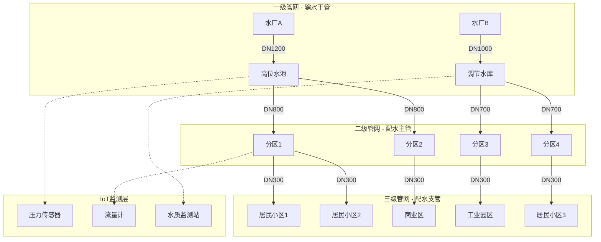
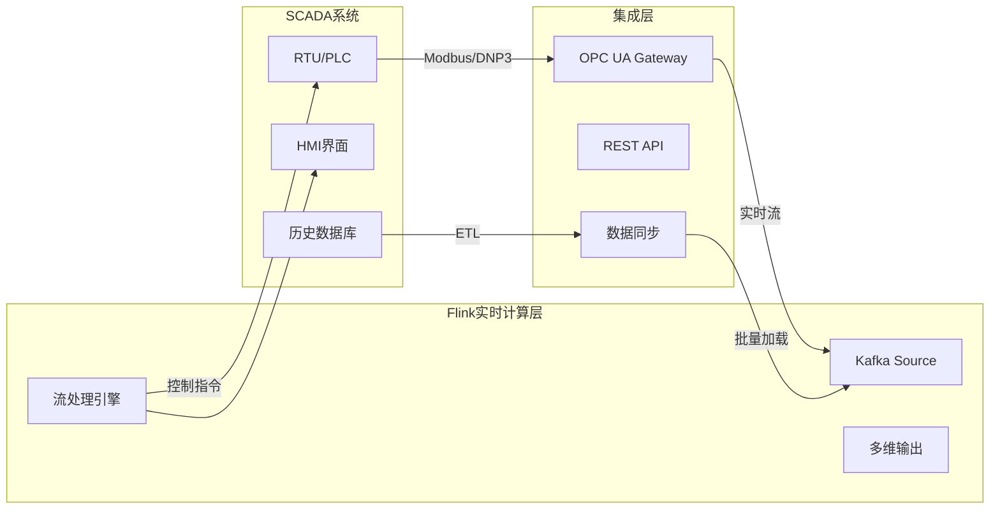
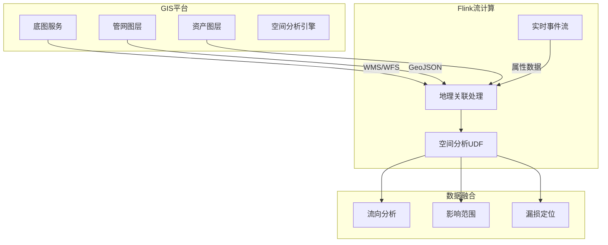
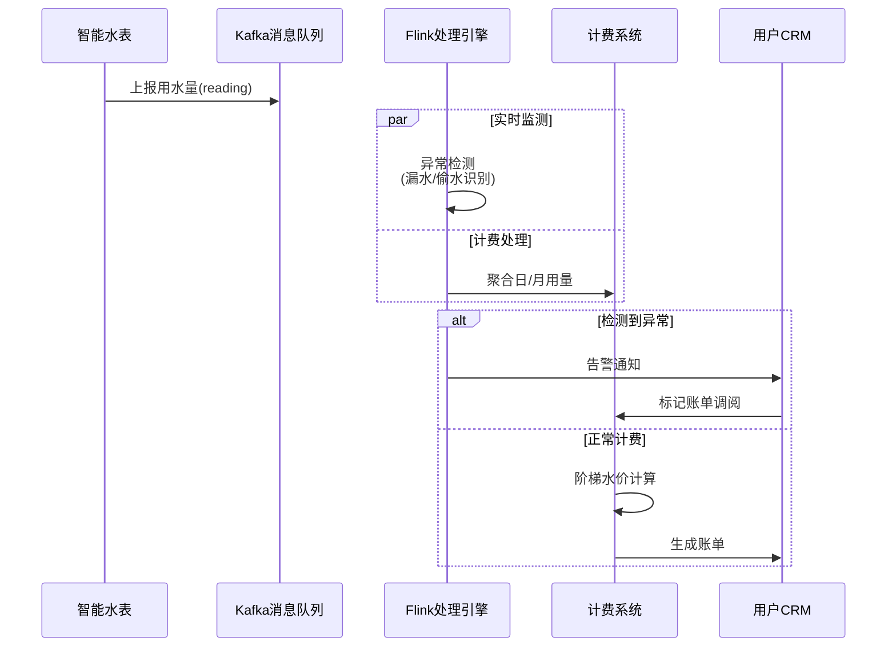
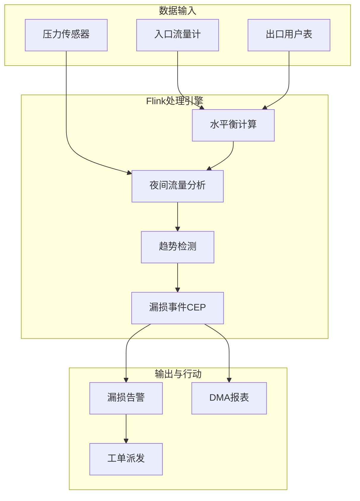
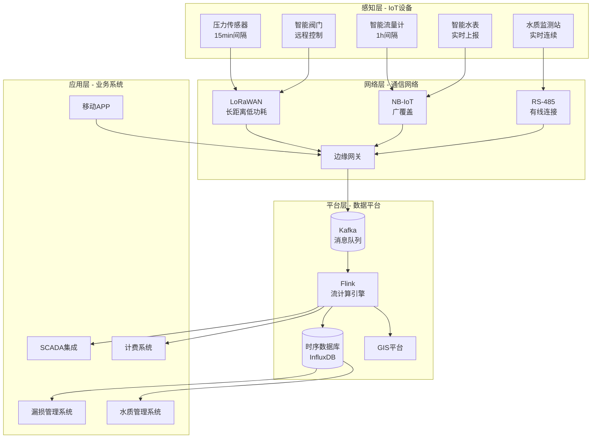
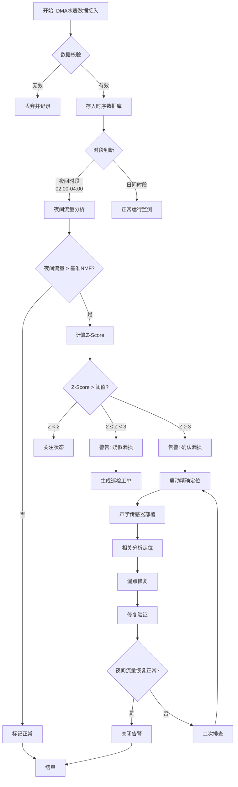

# 智慧水务与管网监测

> **所属阶段**: Flink-IoT-Authority-Alignment/Phase-13-Water-Management
> **前置依赖**: [24-flink-iot-energy-optimization.md](./24-flink-iot-energy-optimization.md), [22-flink-iot-anomaly-detection.md](../Phase-11-Monitoring/22-flink-iot-anomaly-detection.md)
> **形式化等级**: L4 (工程理论型)
> **版本**: v1.0 | **最后更新**: 2026-04-05

---

## 执行摘要 (Executive Summary)

智慧水务是IoT与流计算在城市关键基础设施中的典型应用场景。
本文档系统阐述基于Flink的供水管网实时监测体系，涵盖水力参数建模、漏损检测算法、水质监控等核心技术。
通过形式化定义与工程论证相结合，为城市水务数字化转型提供可落地的技术方案。

**关键贡献**:

- 建立供水管网的三层拓扑形式化模型
- 提出DMA分区计量的流计算实现框架
- 设计基于CEP的漏损检测规则引擎
- 论证水质异常溯源的实时处理保证

---

## 1. 概念定义 (Definitions)

### 1.1 供水管网拓扑模型

**Def-IoT-WTR-01 (供水管网拓扑模型)**

供水管网是一个有向加权图 $\mathcal{G}_w = (V, E, W, \Phi)$，其中：

- **节点集** $V = V_{source} \cup V_{tank} \cup V_{junction} \cup V_{valve} \cup V_{meter}$
  - $V_{source}$: 水源节点（水厂、水库）
  - $V_{tank}$: 储水设施节点
  - $V_{junction}$: 管网连接节点
  - $V_{valve}$: 阀门控制节点
  - $V_{meter}$: 计量表具节点

- **边集** $E \subseteq V \times V \times \mathbb{R}^+$
  - 边 $e = (u, v, l)$ 表示从节点 $u$ 到节点 $v$、长度为 $l$ 的管段
  - 每段管道具有属性：管径 $d(e)$、材质 $m(e)$、敷设年代 $y(e)$

- **权重函数** $W: E \rightarrow \mathbb{R}^+$
  - $W(e) = R(e) \cdot l(e)$，其中 $R(e)$ 为管道阻力系数

- **状态映射** $\Phi: V \times T \rightarrow \mathcal{H}$
  - 将节点-时间对映射到水力参数空间 $\mathcal{H}$

**管网层级结构**:



**直观解释**: 城市供水管网呈现典型的三级树状-网状混合结构。一级管网负责长距离输水，管径大、压力高；二级管网实现区域配水；三级管网连接终端用户。IoT传感器分布在关键节点，形成全域感知网络。

---

### 1.2 水力参数空间

**Def-IoT-WTR-02 (水力参数空间)**

水力参数空间 $\mathcal{H}$ 是描述供水系统运行状态的多元变量空间：

$$\mathcal{H} = P \times F \times Q \times T \times C$$

其中各维度定义为：

| 维度 | 符号 | 定义域 | 物理意义 | 典型采样频率 |
|------|------|--------|----------|--------------|
| **压力** | $p \in P$ | $[0.05, 1.6]$ MPa | 节点水头压力 | 15分钟-1小时 |
| **流量** | $f \in F$ | $\mathbb{R}^+$ m³/h | 管道体积流量 | 1小时-24小时 |
| **水质** | $q \in Q$ | 多维度向量 | 余氯、浊度、pH等 | 实时-4小时 |
| **温度** | $t \in T$ | $[0, 40]$ °C | 水体温度 | 1小时 |
| **消耗** | $c \in C$ | $\mathbb{R}^+$ m³ | 累计用水量 | 实时上报 |

**水质参数向量**:

$$q = (q_{chlorine}, q_{turbidity}, q_{pH}, q_{conductivity}, q_{tOC}, q_{oxygen})$$

各分量需满足WHO饮用水标准约束：

- $q_{chlorine} \in [0.2, 4.0]$ mg/L (余氯)
- $q_{turbidity} \leq 1.0$ NTU (浊度)
- $q_{pH} \in [6.5, 8.5]$ (酸碱度)
- $q_{tOC} \leq 5.0$ mg/L (总有机碳)

**状态演化方程**:

管网水力状态遵循质量守恒与能量守恒定律：

$$\forall v \in V_{junction}: \sum_{e \in E_{in}(v)} f_e = \sum_{e \in E_{out}(v)} f_e + c_v$$

$$\forall e = (u,v) \in E: p_u - p_v = R_e \cdot f_e^2$$

其中 $c_v$ 为节点消耗量，$R_e$ 为管道阻力系数。

---

### 1.3 漏损检测模型

**Def-IoT-WTR-03 (漏损检测模型)**

漏损检测模型 $\mathcal{L}$ 是一个时序异常检测系统：

$$\mathcal{L} = (\mathcal{M}, \mathcal{A}, \mathcal{D}, \tau)$$

- **计量模型** $\mathcal{M}$: 描述管网内水量的输入-输出平衡关系
  $$\mathcal{M}(t_1, t_2): \int_{t_1}^{t_2} F_{in}(t)dt = \int_{t_1}^{t_2} F_{out}(t)dt + \Delta S + L$$

  其中 $F_{in}$ 为输入流量，$F_{out}$ 为计费输出流量，$\Delta S$ 为储水量变化，$L$ 为漏损量

- **异常检测器** $\mathcal{A}: \mathcal{H}^* \rightarrow \{0, 1\}$
  - 输出1表示检测到异常，0表示正常
  - 基于夜间最小流量(Night Flow Analysis)方法

- **诊断函数** $\mathcal{D}: \{0,1\} \times \mathcal{H}^* \rightarrow \mathcal{R}$
  - 将检测结果映射到漏损原因空间 $\mathcal{R} = \{r_{pipe}, r_{joint}, r_{valve}, r_{theft}\}$

- **响应阈值** $\tau \in [0, 1]$: 检测灵敏度控制参数

**漏损率定义**:

$$\eta_{NRW} = \frac{V_{produced} - V_{billed}}{V_{produced}} \times 100\%$$

国际水协(IWA)将漏损分为：

- **表观漏损**: 计量误差、未计费用水、非法取水
- **真实漏损**: 管道破裂、接头渗漏、阀门泄漏、水箱溢流

**夜间最小流量(NMF)模型**:

定义时段 $[t_{night}^{start}, t_{night}^{end}]$（通常为02:00-04:00）的期望流量：

$$F_{night}^{expected} = \sum_{i \in DMA} \beta_i \cdot N_i$$

其中 $N_i$ 为DMA $i$ 内用户数，$\beta_i$ 为用户夜间基础用水系数。当实测流量 $F_{night}^{actual} > F_{night}^{expected} \cdot (1 + \tau)$ 时触发漏损告警。

---

## 2. 属性推导 (Properties)

### 2.1 漏损检测灵敏度边界

**Lemma-WTR-01 (漏损检测灵敏度边界)**

对于采用夜间最小流量(NMF)法的漏损检测系统，设：

- $\sigma_{flow}$: 流量计测量标准差
- $F_{min}$: DMA夜间最小可检测流量
- $T_{obs}$: 观测窗口时长

则系统可检测的最小漏损率 $\eta_{min}$ 满足：

$$\eta_{min} \geq \frac{3\sigma_{flow} \cdot \sqrt{T_{obs}/\Delta t}}{F_{DMA} \cdot T_{obs}}$$

**证明**:

根据假设检验理论，检测阈值需满足误报率约束：

$$P(F_{obs} > \theta | H_0) \leq \alpha$$

在零假设 $H_0$（无漏损）下，观测流量服从：

$$F_{obs} \sim \mathcal{N}(F_{base}, \sigma_{flow}^2 \cdot \frac{T_{obs}}{\Delta t})$$

取 $\alpha = 0.001$（对应 $3\sigma$ 准则），得检测阈值：

$$\theta = F_{base} + 3\sigma_{flow}\sqrt{\frac{T_{obs}}{\Delta t}}$$

当存在漏损量 $L$ 时，可检测条件为：

$$F_{base} + L > \theta \Rightarrow L > 3\sigma_{flow}\sqrt{\frac{T_{obs}}{\Delta t}}$$

相对漏损率：

$$\eta_{min} = \frac{L_{min}}{F_{DMA} \cdot T_{obs}} = \frac{3\sigma_{flow}\sqrt{T_{obs}/\Delta t}}{F_{DMA} \cdot T_{obs}}$$

**工程启示**:

1. **提高采样频率**（减小 $\Delta t$）可降低检测下限
2. **延长观测窗口** $T_{obs}$ 可提高检测置信度
3. **选用高精度流量计**（减小 $\sigma_{flow}$）是降低 $\eta_{min}$ 的直接手段
4. 实际工程中，典型可检测漏损率为3-5%（IWA A级标准）

---

### 2.2 水质异常响应时间保证

**Lemma-WTR-02 (水质异常响应时间保证)**

设水质监测系统参数：

- $t_{sample}$: 水质采样周期
- $t_{analysis}$: 实验室/在线分析时间
- $t_{trans}$: 数据传输延迟
- $t_{process}$: Flink处理延迟
- $t_{alert}$: 告警通知延迟

则系统端到端响应时间 $T_{response}$ 满足：

$$T_{response} \leq t_{sample} + t_{analysis} + t_{trans} + t_{process} + t_{alert}$$

对于实时在线监测系统，当采用Flink实时流处理时：

$$T_{response}^{realtime} \leq t_{sample} + 500ms + 200ms + 1s + 3s \approx t_{sample} + 5s$$

**证明**:

各阶段延迟分析：

1. **采样周期** $t_{sample}$: 在线传感器通常为连续或秒级采样
2. **分析延迟** $t_{analysis}$:
   - 在线传感器: < 500ms
   - 实验室分析: 4-24小时
3. **传输延迟** $t_{trans}$: IoT网络(RS485/LoRa/4G)通常为100-500ms
4. **处理延迟**: Flink处理延迟分析
   - 事件时间窗口触发: ~1s
   - CEP模式匹配: ~1-5s
   - 状态访问: < 100ms
5. **告警延迟** $t_{alert}$: 短信/APP推送通常为1-5s

因此，端到端保证为各环节最坏情况之和。通过流水线并行处理，实际延迟可优化至：

$$T_{response}^{optimized} \approx \max(t_{sample}, t_{analysis}) + 3s$$

**水质事件分级响应要求**:

| 事件级别 | 响应时间要求 | 典型场景 |
|----------|--------------|----------|
| 紧急 | < 15分钟 | 致病菌污染、化学物质泄漏 |
| 严重 | < 1小时 | 浊度异常、pH超标 |
| 一般 | < 4小时 | 余氯偏低、感官异常 |
| 提示 | < 24小时 | 趋势预警、轻微波动 |

---

## 3. 关系建立 (Relations)

### 3.1 与SCADA系统的关系

**SCADA (Supervisory Control and Data Acquisition)** 是水务企业传统自动化核心。



**关系特性**:

| 维度 | SCADA | Flink IoT | 协同模式 |
|------|-------|-----------|----------|
| **实时性** | 秒级 | 毫秒-秒级 | Flink补充毫秒级分析 |
| **数据量** | 千级点 | 百万级点 | Flink处理高密度数据 |
| **分析能力** | 阈值报警 | 复杂事件处理 | Flink提供高级分析 |
| **历史数据** | 关系型存储 | 时序数据库 | 分层存储架构 |
| **控制响应** | 硬实时 | 软实时 | SCADA保持控制核心 |

**集成架构**: Flink作为SCADA的"智能增强层"，通过OPC UA Gateway接入实时数据，同时保持SCADA的控制权威性。

---

### 3.2 与GIS系统的关系

**GIS (Geographic Information System)** 提供管网的空间数据与可视化能力。



**核心关联**:

1. **空间索引**: 管网节点坐标 $(x, y, z)$ 映射到GIS坐标系
   $$coord_{GIS} = Transform(coord_{local}, EPSG_{code})$$

2. **拓扑关联**: 管网图 $\mathcal{G}_w$ 与GIS管网图层双向同步

3. **分析增强**: Flink通过GeoMesa/GeoFlink扩展实现空间分析
   - 缓冲区分析: 漏点影响范围
   - 最短路径: 关阀方案优化
   - 叠加分析: 用户影响评估

---

### 3.3 与计费系统的关系

**计费系统**管理水费计算与用户账单。

**数据流集成**:



**数据一致性保证**:

- **Exactly-Once语义**: Flink Checkpoint保证计费数据不丢失、不重复
- **延迟到达处理**: 允许水表数据延迟上报(侧输出流)
- **对账机制**: 日终批量对账，修正实时计算误差

**业务价值**:

1. **漏损归因**: 区分真实漏损与表观漏损（计费差异分析）
2. **异常账单预警**: 用水量突变实时识别
3. **DMA平衡验证**: 总表分表一致性校验

---

## 4. 论证过程 (Argumentation)

### 4.1 管网分区计量(DMA)算法

**DMA (District Metering Area)** 是漏损管理的核心方法，将管网划分为独立计量的区域。

**DMA设计原则**:

1. **水力隔离**: 通过关闭边界阀门，使DMA成为单一入口的"水箱"
2. **规模适中**: 典型DMA覆盖500-3000户，便于漏损定位
3. **计量完备**: 入口流量计 + 出口用户表全覆盖

**DMA水力平衡方程**:

$$Q_{in}(t) = \sum_{i=1}^{n} Q_{user}^i(t) + Q_{leak}(t) + \frac{dV_{tank}}{dt}$$

简化形式（忽略储水变化）：

$$Q_{in}(t) - \sum Q_{out}(t) = Q_{leak}(t)$$

**Flink实现架构**:



**夜间流量分析算法**:

```sql
-- DMA夜间最小流量分析
WITH night_flow AS (
  SELECT
    dma_id,
    DATE_FORMAT(event_time, 'HH:mm') as time_slot,
    AVG(flow_rate) as avg_flow,
    MIN(flow_rate) as min_flow,
    STDDEV(flow_rate) as flow_std
  FROM water_flow
  WHERE HOUR(event_time) BETWEEN 2 AND 4  -- 凌晨2-4点
    AND event_time >= NOW() - INTERVAL '7' DAY
  GROUP BY dma_id, time_slot
),
baseline AS (
  SELECT
    dma_id,
    AVG(min_flow) as baseline_nmf,
    AVG(flow_std) as baseline_std
  FROM night_flow
  GROUP BY dma_id
)
SELECT
  n.dma_id,
  n.time_slot,
  n.min_flow,
  b.baseline_nmf,
  (n.min_flow - b.baseline_nmf) / b.baseline_std as z_score,
  CASE
    WHEN (n.min_flow - b.baseline_nmf) / b.baseline_std > 3
      THEN 'LEAK_DETECTED'
    WHEN (n.min_flow - b.baseline_nmf) / b.baseline_std > 2
      THEN 'LEAK_WARNING'
    ELSE 'NORMAL'
  END as status
FROM night_flow n
JOIN baseline b ON n.dma_id = b.dma_id;
```

---

### 4.2 漏损定位算法

**声学定位原理**:

漏损点产生特征噪声，通过相关分析可定位漏点位置：

$$\Delta x = \frac{v \cdot \Delta t}{2}$$

其中 $v$ 为声波在管道中的传播速度，$\Delta t$ 为两端传感器接收到信号的时间差。

**多传感器融合定位**:

当DMA内存在多个压力传感器时，漏损定位转化为最优化问题：

$$\min_{x_{leak}} \sum_{i=1}^{n} \left( p_i^{observed} - p_i^{model}(x_{leak}, q_{leak}) \right)^2$$

**Flink CEP漏损模式**:

```java

import org.apache.flink.streaming.api.windowing.time.Time;

// 漏损检测复杂事件模式
Pattern<WaterEvent, ?> leakPattern = Pattern
    .<WaterEvent>begin("pressure_drop")
    .where(evt -> evt.getPressure() < evt.getBaselinePressure() * 0.9)
    .next("flow_increase")
    .where(evt -> evt.getFlowRate() > evt.getBaselineFlow() * 1.1)
    .within(Time.minutes(5));

// 模式匹配处理
CEP.pattern(waterEventStream, leakPattern)
    .process(new PatternHandler() {
        @Override
        public void processMatch(Map<String, List<WaterEvent>> match, Context ctx, Collector<LeakAlert> out) {
            WaterEvent pressureDrop = match.get("pressure_drop").get(0);
            WaterEvent flowIncrease = match.get("flow_increase").get(0);

            double confidence = calculateConfidence(pressureDrop, flowIncrease);
            if (confidence > 0.8) {
                out.collect(new LeakAlert(
                    pressureDrop.getPipeId(),
                    confidence,
                    estimateLocation(pressureDrop, flowIncrease)
                ));
            }
        }
    });
```

---

### 4.3 水质异常溯源

**污染传播模型**:

假设污染源位于节点 $s$，在时刻 $t_0$ 释放浓度 $C_0$，则下游节点 $v$ 在时刻 $t$ 的浓度：

$$C(v, t) = C_0 \cdot e^{-\lambda(t - t_0 - \tau_{sv})} \cdot \mathbb{1}_{t \geq t_0 + \tau_{sv}}$$

其中 $\lambda$ 为衰减系数，$\tau_{sv}$ 为从 $s$ 到 $v$ 的流动时间。

**逆向溯源算法**:

给定监测点观测序列 $\{(v_i, t_i, C_i)\}$，求最可能的污染源：

$$s^* = \arg\max_{s} P(\{(v_i, t_i, C_i)\} | s, t_0, C_0)$$

**Flink实现**:

```sql
-- 水质异常事件溯源
CREATE TABLE water_quality_events (
  sensor_id STRING,
  location STRING,
  event_time TIMESTAMP(3),
  chlorine DOUBLE,
  turbidity DOUBLE,
  pH DOUBLE,
  WATERMARK FOR event_time AS event_time - INTERVAL '5' SECOND
) WITH (...);

-- 定义异常模式
CREATE TABLE quality_alerts (
  alert_id STRING,
  sensor_id STRING,
  alert_type STRING,
  severity STRING,
  upstream_path ARRAY<STRING>,
  probable_source ARRAY<STRING>,
  event_time TIMESTAMP(3)
) WITH (...);

-- CEP模式: 水质连锁异常
INSERT INTO quality_alerts
SELECT
  UUID() as alert_id,
  first_sensor.sensor_id,
  'CHAIN_CONTAMINATION' as alert_type,
  CASE
    WHEN contamination_count >= 5 THEN 'CRITICAL'
    WHEN contamination_count >= 3 THEN 'HIGH'
    ELSE 'MEDIUM'
  END as severity,
  sensor_path as upstream_path,
  probable_sources as probable_source,
  CURRENT_TIMESTAMP as event_time
FROM (
  SELECT
    FIRST_VALUE(sensor_id) as first_sensor,
    COLLECT(DISTINCT sensor_id) as sensor_path,
    COUNT(*) as contamination_count,
    FIND_PROBABLE_SOURCE(sensor_id, event_time) as probable_sources
  FROM water_quality_events
  MATCH_RECOGNIZE(
    PARTITION BY pipe_zone
    ORDER BY event_time
    MEASURES
      A.sensor_id as first_sensor,
      COLLECT(DISTINCT A.sensor_id) as sensor_path,
      COUNT(*) as cnt
    AFTER MATCH SKIP PAST LAST ROW
    PATTERN (A+ B)
    DEFINE
      A AS turbidity > 1.0 OR chlorine < 0.2,
      B AS turbidity <= 1.0 AND chlorine >= 0.2
  )
  WHERE cnt >= 2
);
```

---

## 5. 形式证明 / 工程论证 (Proof / Engineering Argument)

### 5.1 管网监测系统的可观测性证明

**Thm-IoT-WTR-01 (管网可观测性定理)**

给定供水管网 $\mathcal{G}_w = (V, E, W, \Phi)$ 和传感器部署集合 $S \subseteq V$，系统完全可观测的充分条件是：

$$\forall v \in V: v \in S \lor \exists p = (s_1, s_2, ..., s_k), s_1 \in S, s_k = v$$

即每个节点要么是传感器节点，要么可通过有向路径从某个传感器节点到达。

**证明**:

基于图论中的可达性概念。设传感器测量为 $y_s(t) = H_s \cdot x(t) + \epsilon_s(t)$，状态向量 $x(t)$ 包含所有节点压力、流量。

若图满足上述条件，则对于任意非传感器节点 $v$，存在从 $s \in S$ 到 $v$ 的路径。根据水力方程：

$$p_v = p_s - \sum_{e \in path(s,v)} R_e \cdot f_e^2$$

只要路径上的管段流量可测（或可通过其他传感器推导），则 $p_v$ 可计算。

因此，可观性矩阵 $O$ 的秩为 $|V|$，系统完全可观测。

**工程应用**: 该定理指导传感器选址优化——在保证全覆盖的前提下最小化传感器数量。

---

### 5.2 DMA水平衡的误差边界

**Thm-IoT-WTR-02 (DMA计量误差边界定理)**

设DMA水平衡方程：

$$Q_{in} - Q_{out} = Q_{leak} + \epsilon_{total}$$

其中计量误差 $\epsilon_{total}$ 满足：

$$|\epsilon_{total}| \leq \epsilon_{in} \cdot Q_{in} + \sum_{i=1}^{n} \epsilon_{i} \cdot Q_{i}$$

若各流量计精度为 $\pm p\%$，则：

$$\frac{|\epsilon_{total}|}{Q_{in}} \leq p\% \cdot (1 + \frac{Q_{out}}{Q_{in}})$$

对于典型DMA，$Q_{out} \approx 0.9 Q_{in}$（考虑10%漏损），则：

$$\frac{|\epsilon_{total}|}{Q_{in}} \leq 1.9p\%$$

**工程意义**:

- 使用2%精度流量计时，水平衡误差边界为3.8%
- 若实测不平衡率 > 5%，可判定存在真实漏损
- 漏损检测下限受限于计量精度，需综合考虑成本与精度

---

## 6. 实例验证 (Examples)

### 6.1 管网压力监控Flink SQL

```sql
-- ============================================================================
-- 智慧水务: 管网压力实时监控系统
-- ============================================================================

-- 创建压力传感器数据表
CREATE TABLE pressure_sensors (
  sensor_id STRING,
  dma_id STRING,
  pipe_id STRING,
  location GEO_POINT,
  pressure_mpa DOUBLE,
  temperature DOUBLE,
  battery_level INT,
  event_time TIMESTAMP(3),
  WATERMARK FOR event_time AS event_time - INTERVAL '30' SECOND,
  PRIMARY KEY (sensor_id) NOT ENFORCED
) WITH (
  'connector' = 'kafka',
  'topic' = 'water.pressure.sensors',
  'properties.bootstrap.servers' = 'kafka:9092',
  'format' = 'json',
  'json.ignore-parse-errors' = 'true'
);

-- DMA基准压力配置表
CREATE TABLE dma_baseline (
  dma_id STRING,
  time_slot STRING,  -- 'morning', 'afternoon', 'evening', 'night'
  expected_pressure DOUBLE,
  min_pressure_limit DOUBLE,
  max_pressure_limit DOUBLE,
  PRIMARY KEY (dma_id, time_slot) NOT ENFORCED
) WITH (
  'connector' = 'jdbc',
  'url' = 'jdbc:postgresql://postgres:5432/water_db',
  'table-name' = 'dma_pressure_baseline'
);

-- 压力告警输出表
CREATE TABLE pressure_alerts (
  alert_id STRING,
  sensor_id STRING,
  dma_id STRING,
  alert_type STRING,
  severity STRING,
  current_pressure DOUBLE,
  expected_pressure DOUBLE,
  deviation_percent DOUBLE,
  alert_time TIMESTAMP(3),
  location STRING
) WITH (
  'connector' = 'kafka',
  'topic' = 'water.pressure.alerts',
  'properties.bootstrap.servers' = 'kafka:9092',
  'format' = 'json'
);

-- 实时压力监控与告警
INSERT INTO pressure_alerts
SELECT
  CONCAT('PA-', sensor_id, '-', DATE_FORMAT(event_time, 'yyyyMMddHHmmss')) as alert_id,
  p.sensor_id,
  p.dma_id,
  CASE
    WHEN p.pressure_mpa < b.min_pressure_limit THEN 'LOW_PRESSURE'
    WHEN p.pressure_mpa > b.max_pressure_limit THEN 'HIGH_PRESSURE'
    WHEN ABS(p.pressure_mpa - b.expected_pressure) / b.expected_pressure > 0.15 THEN 'PRESSURE_ANOMALY'
    ELSE 'NORMAL'
  END as alert_type,
  CASE
    WHEN p.pressure_mpa < b.min_pressure_limit * 0.8 THEN 'CRITICAL'
    WHEN p.pressure_mpa < b.min_pressure_limit THEN 'HIGH'
    WHEN ABS(p.pressure_mpa - b.expected_pressure) / b.expected_pressure > 0.25 THEN 'MEDIUM'
    ELSE 'LOW'
  END as severity,
  p.pressure_mpa as current_pressure,
  b.expected_pressure,
  (p.pressure_mpa - b.expected_pressure) / b.expected_pressure * 100 as deviation_percent,
  p.event_time as alert_time,
  ST_AS_TEXT(p.location) as location
FROM pressure_sensors p
JOIN dma_baseline FOR SYSTEM_TIME AS OF p.event_time AS b
  ON p.dma_id = b.dma_id
  AND b.time_slot = (
    CASE
      WHEN HOUR(p.event_time) BETWEEN 6 AND 11 THEN 'morning'
      WHEN HOUR(p.event_time) BETWEEN 12 AND 17 THEN 'afternoon'
      WHEN HOUR(p.event_time) BETWEEN 18 AND 22 THEN 'evening'
      ELSE 'night'
    END
  )
WHERE p.pressure_mpa < b.min_pressure_limit
   OR p.pressure_mpa > b.max_pressure_limit
   OR ABS(p.pressure_mpa - b.expected_pressure) / b.expected_pressure > 0.15;

-- DMA压力聚合统计（每5分钟）
CREATE TABLE dma_pressure_stats (
  dma_id STRING,
  window_start TIMESTAMP(3),
  window_end TIMESTAMP(3),
  avg_pressure DOUBLE,
  min_pressure DOUBLE,
  max_pressure DOUBLE,
  pressure_std DOUBLE,
  sensor_count BIGINT
) WITH (
  'connector' = 'elasticsearch-7',
  'hosts' = 'http://elasticsearch:9200',
  'index' = 'dma_pressure_stats'
);

INSERT INTO dma_pressure_stats
SELECT
  dma_id,
  TUMBLE_START(event_time, INTERVAL '5' MINUTE) as window_start,
  TUMBLE_END(event_time, INTERVAL '5' MINUTE) as window_end,
  AVG(pressure_mpa) as avg_pressure,
  MIN(pressure_mpa) as min_pressure,
  MAX(pressure_mpa) as max_pressure,
  STDDEV(pressure_mpa) as pressure_std,
  COUNT(DISTINCT sensor_id) as sensor_count
FROM pressure_sensors
GROUP BY
  dma_id,
  TUMBLE(event_time, INTERVAL '5' MINUTE);
```

---

### 6.2 漏损检测CEP规则

```sql
-- ============================================================================
-- 漏损检测: 基于复杂事件处理(CEP)的多模式匹配
-- ============================================================================

CREATE TABLE flow_events (
  meter_id STRING,
  dma_id STRING,
  meter_type STRING,  -- 'DMA_INLET', 'USER_METER', 'TRANSFER'
  flow_rate_m3h DOUBLE,
  total_volume_m3 DOUBLE,
  pressure_mpa DOUBLE,
  event_time TIMESTAMP(3),
  WATERMARK FOR event_time AS event_time - INTERVAL '1' MINUTE
) WITH (
  'connector' = 'kafka',
  'topic' = 'water.flow.meters',
  'properties.bootstrap.servers' = 'kafka:9092',
  'format' = 'json'
);

-- 夜间流量分析表 (凌晨2-4点)
CREATE TABLE night_flow_analysis (
  dma_id STRING,
  analysis_date DATE,
  night_min_flow DOUBLE,
  night_avg_flow DOUBLE,
  baseline_nmf DOUBLE,
  leak_indicator DOUBLE,
  confidence_score DOUBLE,
  alert_level STRING
) WITH (
  'connector' = 'jdbc',
  'url' = 'jdbc:postgresql://postgres:5432/water_db',
  'table-name' = 'night_flow_analysis'
);

-- CEP漏损检测模式匹配
INSERT INTO night_flow_analysis
WITH dma_night_flow AS (
  SELECT
    dma_id,
    DATE(event_time) as analysis_date,
    MIN(flow_rate_m3h) as night_min_flow,
    AVG(flow_rate_m3h) as night_avg_flow
  FROM flow_events
  WHERE meter_type = 'DMA_INLET'
    AND HOUR(event_time) BETWEEN 2 AND 4
  GROUP BY dma_id, DATE(event_time)
),
baseline AS (
  SELECT
    dma_id,
    AVG(night_min_flow) as baseline_nmf,
    STDDEV(night_min_flow) as baseline_std
  FROM dma_night_flow
  WHERE analysis_date >= CURRENT_DATE - INTERVAL '30' DAY
  GROUP BY dma_id
)
SELECT
  n.dma_id,
  n.analysis_date,
  n.night_min_flow,
  n.night_avg_flow,
  b.baseline_nmf,
  n.night_min_flow - b.baseline_nmf as leak_indicator,
  CASE
    WHEN b.baseline_std > 0
    THEN (n.night_min_flow - b.baseline_nmf) / b.baseline_std
    ELSE 0
  END as confidence_score,
  CASE
    WHEN n.night_min_flow > b.baseline_nmf * 1.5 OR
         (b.baseline_std > 0 AND (n.night_min_flow - b.baseline_nmf) / b.baseline_std > 3)
      THEN 'HIGH'
    WHEN n.night_min_flow > b.baseline_nmf * 1.3 OR
         (b.baseline_std > 0 AND (n.night_min_flow - b.baseline_nmf) / b.baseline_std > 2)
      THEN 'MEDIUM'
    WHEN n.night_min_flow > b.baseline_nmf * 1.15 OR
         (b.baseline_std > 0 AND (n.night_min_flow - b.baseline_nmf) / b.baseline_std > 1.5)
      THEN 'LOW'
    ELSE 'NORMAL'
  END as alert_level
FROM dma_night_flow n
LEFT JOIN baseline b ON n.dma_id = b.dma_id;

-- 突发性漏损检测 (Burst Detection)
CREATE TABLE burst_leak_alerts (
  alert_id STRING,
  dma_id STRING,
  meter_id STRING,
  alert_type STRING,
  flow_before DOUBLE,
  flow_after DOUBLE,
  flow_increase_ratio DOUBLE,
  detection_time TIMESTAMP(3),
  location_hint STRING
) WITH (
  'connector' = 'kafka',
  'topic' = 'water.burst.alerts',
  'properties.bootstrap.servers' = 'kafka:9092',
  'format' = 'json'
);

INSERT INTO burst_leak_alerts
SELECT
  CONCAT('BURST-', meter_id, '-', DATE_FORMAT(event_time, 'yyyyMMddHHmmss')) as alert_id,
  dma_id,
  meter_id,
  'BURST_LEAK' as alert_type,
  flow_before,
  flow_after,
  flow_increase_ratio,
  event_time as detection_time,
  CONCAT('DMA:', dma_id, ' Meter:', meter_id) as location_hint
FROM (
  SELECT
    dma_id,
    meter_id,
    event_time,
    AVG(flow_rate_m3h) OVER w1 as flow_before,
    AVG(flow_rate_m3h) OVER w2 as flow_after,
    (AVG(flow_rate_m3h) OVER w2 - AVG(flow_rate_m3h) OVER w1) /
      NULLIF(AVG(flow_rate_m3h) OVER w1, 0) * 100 as flow_increase_ratio,
    ROW_NUMBER() OVER (PARTITION BY dma_id, meter_id ORDER BY event_time) as rn
  FROM flow_events
  WHERE meter_type = 'DMA_INLET'
  WINDOW
    w1 AS (ORDER BY event_time ROWS BETWEEN 12 PRECEDING AND 1 PRECEDING),
    w2 AS (ORDER BY event_time ROWS BETWEEN 1 FOLLOWING AND 12 FOLLOWING)
) t
WHERE flow_increase_ratio > 50  -- 流量突增50%以上
  AND flow_before > 0
  AND rn = 1;  -- 每个窗口只输出一次
```

---

### 6.3 水质指标实时分析

```sql
-- ============================================================================
-- 水质实时监测: 多指标综合评估与告警
-- ============================================================================

CREATE TABLE water_quality_sensors (
  station_id STRING,
  station_name STRING,
  dma_id STRING,
  chlorine_mgl DOUBLE,      -- 余氯 mg/L
  turbidity_ntu DOUBLE,     -- 浊度 NTU
  ph_value DOUBLE,          -- pH值
  conductivity_uscm DOUBLE, -- 电导率 μS/cm
  toc_mgl DOUBLE,           -- 总有机碳 mg/L
  temperature DOUBLE,
  event_time TIMESTAMP(3),
  WATERMARK FOR event_time AS event_time - INTERVAL '1' MINUTE
) WITH (
  'connector' = 'kafka',
  'topic' = 'water.quality.sensors',
  'properties.bootstrap.servers' = 'kafka:9092',
  'format' = 'json'
);

-- 水质标准配置
CREATE TABLE water_quality_standards (
  parameter STRING,
  unit STRING,
  min_value DOUBLE,
  max_value DOUBLE,
  warning_threshold DOUBLE,
  critical_threshold DOUBLE,
  PRIMARY KEY (parameter) NOT ENFORCED
) WITH (
  'connector' = 'jdbc',
  'url' = 'jdbc:postgresql://postgres:5432/water_db',
  'table-name' = 'quality_standards'
);

-- 水质综合评分输出
CREATE TABLE water_quality_scores (
  station_id STRING,
  dma_id STRING,
  wqi_score DOUBLE,           -- 水质指数 0-100
  chlorine_status STRING,
  turbidity_status STRING,
  ph_status STRING,
  overall_status STRING,
  violation_count INT,
  event_time TIMESTAMP(3)
) WITH (
  'connector' = 'elasticsearch-7',
  'hosts' = 'http://elasticsearch:9200',
  'index' = 'water_quality_scores'
);

INSERT INTO water_quality_scores
SELECT
  q.station_id,
  q.dma_id,
  -- WQI水质指数计算 (加权平均法)
  (CASE
    WHEN q.chlorine_mgl BETWEEN 0.2 AND 4.0 THEN 25
    WHEN q.chlorine_mgl BETWEEN 0.1 AND 0.2 THEN 15
    WHEN q.chlorine_mgl > 4.0 AND q.chlorine_mgl <= 5.0 THEN 20
    ELSE 0
  END +
  CASE
    WHEN q.turbidity_ntu <= 1.0 THEN 25
    WHEN q.turbidity_ntu <= 4.0 THEN 20
    WHEN q.turbidity_ntu <= 5.0 THEN 10
    ELSE 0
  END +
  CASE
    WHEN q.ph_value BETWEEN 6.5 AND 8.5 THEN 25
    WHEN q.ph_value BETWEEN 6.0 AND 9.0 THEN 15
    ELSE 0
  END +
  CASE
    WHEN q.conductivity_uscm <= 1500 THEN 25
    WHEN q.conductivity_uscm <= 2000 THEN 20
    ELSE 0
  END) as wqi_score,
  CASE
    WHEN q.chlorine_mgl < 0.2 THEN 'LOW'
    WHEN q.chlorine_mgl > 4.0 THEN 'HIGH'
    ELSE 'NORMAL'
  END as chlorine_status,
  CASE
    WHEN q.turbidity_ntu > 5.0 THEN 'CRITICAL'
    WHEN q.turbidity_ntu > 1.0 THEN 'WARNING'
    ELSE 'NORMAL'
  END as turbidity_status,
  CASE
    WHEN q.ph_value < 6.5 OR q.ph_value > 8.5 THEN 'ABNORMAL'
    ELSE 'NORMAL'
  END as ph_status,
  CASE
    WHEN q.turbidity_ntu > 5.0 OR q.chlorine_mgl < 0.1 OR
         q.ph_value < 6.0 OR q.ph_value > 9.0 THEN 'UNSAFE'
    WHEN q.turbidity_ntu > 1.0 OR q.chlorine_mgl < 0.2 OR
         q.ph_value < 6.5 OR q.ph_value > 8.5 THEN 'CAUTION'
    ELSE 'SAFE'
  END as overall_status,
  (CASE WHEN q.chlorine_mgl < 0.2 OR q.chlorine_mgl > 4.0 THEN 1 ELSE 0 END +
   CASE WHEN q.turbidity_ntu > 1.0 THEN 1 ELSE 0 END +
   CASE WHEN q.ph_value < 6.5 OR q.ph_value > 8.5 THEN 1 ELSE 0 END) as violation_count,
  q.event_time
FROM water_quality_sensors q;

-- 水质异常告警表
CREATE TABLE quality_violation_alerts (
  alert_id STRING,
  station_id STRING,
  dma_id STRING,
  violation_type STRING,
  parameter STRING,
  current_value DOUBLE,
  standard_limit DOUBLE,
  severity STRING,
  alert_time TIMESTAMP(3),
  recommended_action STRING
) WITH (
  'connector' = 'kafka',
  'topic' = 'water.quality.alerts',
  'properties.bootstrap.servers' = 'kafka:9092',
  'format' = 'json'
);

INSERT INTO quality_violation_alerts
SELECT
  CONCAT('QV-', station_id, '-', DATE_FORMAT(event_time, 'yyyyMMddHHmmss')) as alert_id,
  station_id,
  dma_id,
  CASE
    WHEN chlorine_mgl < 0.2 THEN 'CHLORINE_DEFICIT'
    WHEN chlorine_mgl > 4.0 THEN 'CHLORINE_EXCESS'
    WHEN turbidity_ntu > 1.0 THEN 'TURBIDITY_HIGH'
    WHEN ph_value < 6.5 THEN 'PH_LOW'
    WHEN ph_value > 8.5 THEN 'PH_HIGH'
    ELSE 'UNKNOWN'
  END as violation_type,
  CASE
    WHEN chlorine_mgl < 0.2 OR chlorine_mgl > 4.0 THEN 'chlorine'
    WHEN turbidity_ntu > 1.0 THEN 'turbidity'
    WHEN ph_value < 6.5 OR ph_value > 8.5 THEN 'pH'
  END as parameter,
  CASE
    WHEN chlorine_mgl < 0.2 OR chlorine_mgl > 4.0 THEN chlorine_mgl
    WHEN turbidity_ntu > 1.0 THEN turbidity_ntu
    WHEN ph_value < 6.5 OR ph_value > 8.5 THEN ph_value
  END as current_value,
  CASE
    WHEN chlorine_mgl < 0.2 THEN 0.2
    WHEN chlorine_mgl > 4.0 THEN 4.0
    WHEN turbidity_ntu > 1.0 THEN 1.0
    WHEN ph_value < 6.5 THEN 6.5
    WHEN ph_value > 8.5 THEN 8.5
  END as standard_limit,
  CASE
    WHEN chlorine_mgl < 0.1 OR turbidity_ntu > 5.0 OR ph_value < 6.0 OR ph_value > 9.0
      THEN 'CRITICAL'
    ELSE 'WARNING'
  END as severity,
  event_time as alert_time,
  CASE
    WHEN chlorine_mgl < 0.2 THEN '增加消毒剂投加量，检查投加设备'
    WHEN chlorine_mgl > 4.0 THEN '减少消毒剂投加量，检测出水水质'
    WHEN turbidity_ntu > 1.0 THEN '检查净水工艺，增加过滤强度'
    WHEN ph_value < 6.5 THEN '投加碱性调节剂'
    WHEN ph_value > 8.5 THEN '投加酸性调节剂'
  END as recommended_action
FROM water_quality_sensors
WHERE chlorine_mgl < 0.2 OR chlorine_mgl > 4.0
   OR turbidity_ntu > 1.0
   OR ph_value < 6.5 OR ph_value > 8.5;
```

---

## 7. 可视化 (Visualizations)

### 7.1 智慧水务系统架构图



### 7.2 DMA漏损检测流程图



---

## 8. 引用参考 (References)


---

## 附录A: 缩略语表

| 缩略语 | 全称 | 中文 |
|--------|------|------|
| DMA | District Metering Area | 分区计量区域 |
| NRW | Non-Revenue Water | 无收益水 |
| NMF | Night Minimum Flow | 夜间最小流量 |
| WQI | Water Quality Index | 水质指数 |
| SCADA | Supervisory Control And Data Acquisition | 数据采集与监视控制 |
| GIS | Geographic Information System | 地理信息系统 |
| TOC | Total Organic Carbon | 总有机碳 |
| IWA | International Water Association | 国际水协 |
| WHO | World Health Organization | 世界卫生组织 |
| EPA | Environmental Protection Agency | 环境保护署 |

---

## 附录B: 水质标准对照表

| 参数 | WHO标准 | EPA标准 | 中国国标 | 检测方法 |
|------|---------|---------|----------|----------|
| 余氯 | 0.2-5.0 mg/L | 0.2-4.0 mg/L | ≥0.3 mg/L | DPD分光光度法 |
| 浊度 | ≤5 NTU | ≤4 NTU | ≤1 NTU | 散射光法 |
| pH | 6.5-8.5 | 6.5-8.5 | 6.5-8.5 | 玻璃电极法 |
| 电导率 | ≤1500 μS/cm | - | - | 电导率仪法 |
| TOC | - | - | ≤5 mg/L | 燃烧氧化法 |

---

*文档版本: v1.0 | 最后更新: 2026-04-05 | 作者: Flink-IoT-Authority-Alignment项目团队*
