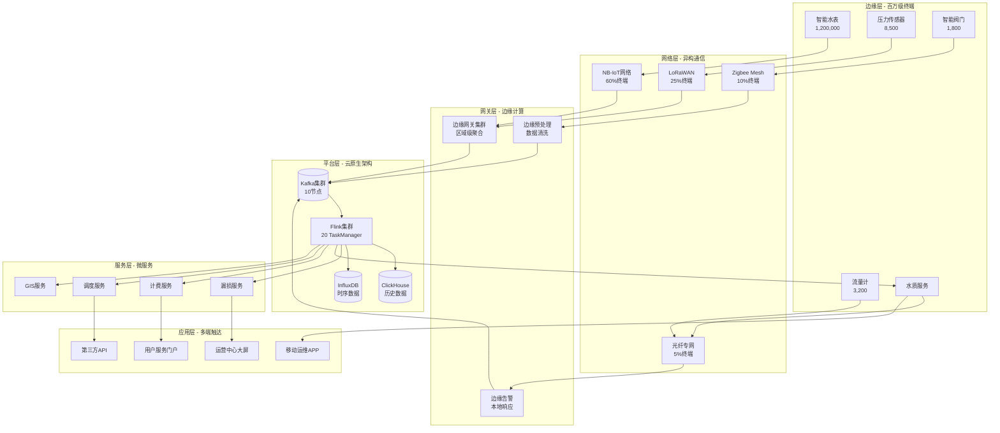
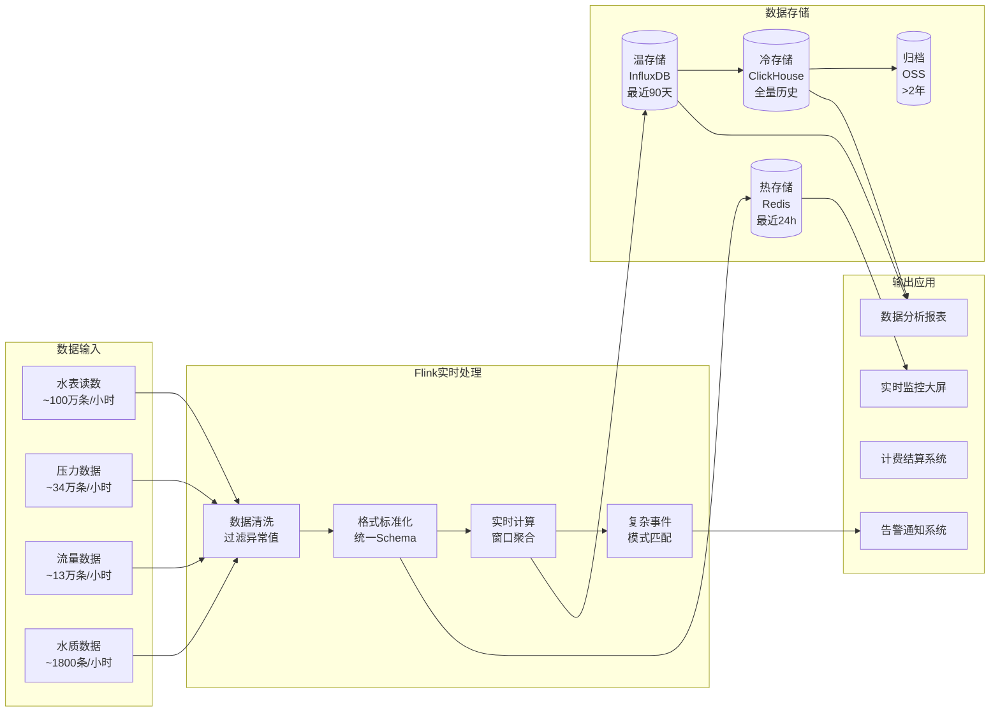
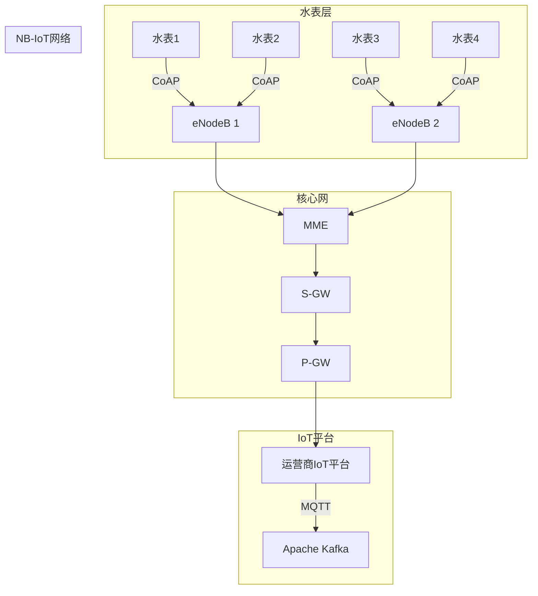
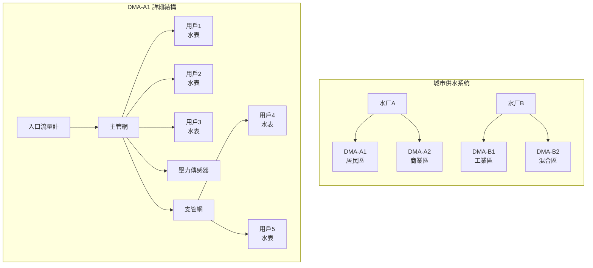
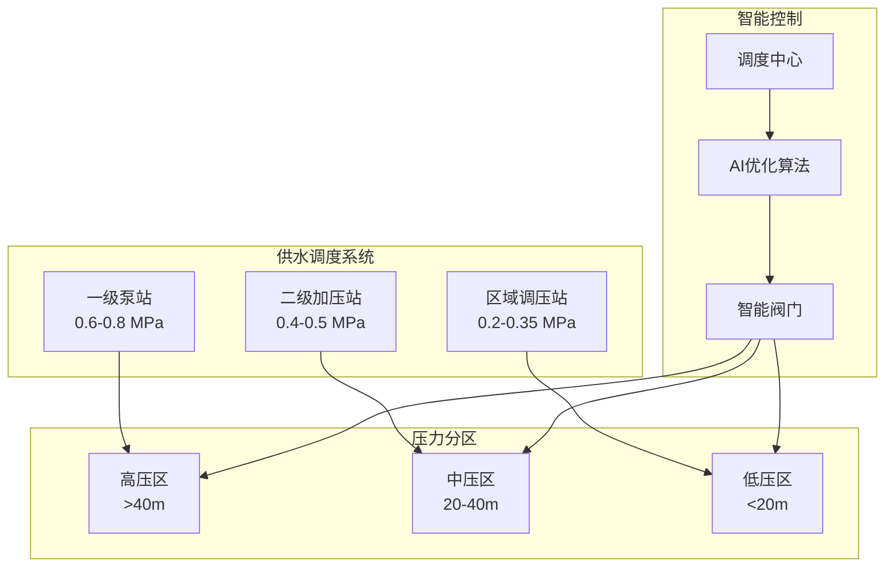

# 城市智慧水务平台 - 完整案例研究

> **案例编号**: CASE-WTR-001
> **项目类型**: 智慧城市水务基础设施
> **规模**: 百万级水表接入 | 5000km+管网覆盖
> **形式化等级**: L3-L5 (工程应用-形式化验证)
> **版本**: v1.0 | **最后更新**: 2026-04-05

---

## 执行摘要

### 项目概况

本案例描述某特大城市（人口1000万+）智慧水务平台的完整建设过程。该平台实现：

- **120万**智能水表接入
- **5200km**供水管网实时监测
- **180个**DMA分区计量
- **99.5%**数据接入率
- **<30秒**告警响应时间

### 核心成果

| 指标 | 建设前 | 建设后 | 改善幅度 |
|------|--------|--------|----------|
| 管网漏损率 | 28% | 12% | ↓57% |
| 水质合格率 | 96.5% | 99.8% | ↑3.3% |
| 客服响应时间 | 48小时 | 2小时 | ↓96% |
| 爆管定位时间 | 24小时 | 30分钟 | ↓98% |
| 人工抄表率 | 85% | 0% | ↓100% |

---

## 1. 系统架构设计

### 1.1 总体架构



### 1.2 数据流架构



---

## 2. 百万级水表接入架构

### 2.1 终端层设计

**智能水表技术选型**:

| 类型 | 通信方式 | 采样周期 | 电池寿命 | 数量 |
|------|----------|----------|----------|------|
| 家用小表 | NB-IoT | 1小时 | 6年 | 1,150,000 |
| 商业大表 | NB-IoT | 15分钟 | 外供电 | 35,000 |
| 工业总表 | 4G/光纤 | 5分钟 | 外供电 | 15,000 |

**数据上报协议**:

```json
{
  "header": {
    "version": "2.1",
    "msg_type": "METER_READING",
    "device_id": "WM-310105-00123456",
    "timestamp": 1728001234
  },
  "payload": {
    "reading": 12568.45,
    "unit": "m3",
    "flow_rate": 0.0,
    "pressure": 0.32,
    "battery": 87,
    "valve_status": "OPEN",
    "alarms": ["LOW_BATTERY_WARN"]
  },
  "signature": "sha256=abc123..."
}
```

### 2.2 网络层架构

**NB-IoT接入方案**:



**接入性能指标**:

- **峰值并发**: 50万终端同时在线
- **消息吞吐**: 300万条/分钟
- **端到端延迟**: P99 < 5秒
- **数据到达率**: 99.5%+

### 2.3 Flink SQL实现

```sql
-- ============================================================================
-- 百万级水表接入: Flink SQL实现
-- ============================================================================

-- 创建水表数据接入表
CREATE TABLE smart_meters (
  -- 设备标识
  meter_id STRING,
  meter_type STRING,  -- 'RESIDENTIAL', 'COMMERCIAL', 'INDUSTRIAL'
  dma_id STRING,
  district_code STRING,

  -- 计量数据
  reading_m3 DOUBLE,
  reading_delta_m3 DOUBLE,  -- 本次读数增量
  flow_rate_m3h DOUBLE,

  -- 状态数据
  pressure_mpa DOUBLE,
  battery_percent INT,
  valve_status STRING,  -- 'OPEN', 'CLOSED', 'PARTIAL'
  signal_strength INT,

  -- 告警标志
  low_battery BOOLEAN,
  magnetic_tamper BOOLEAN,
  reverse_flow BOOLEAN,
  leakage_alarm BOOLEAN,

  -- 时间戳
  device_time TIMESTAMP(3),
  event_time AS COALESCE(device_time, PROCTIME()),
  WATERMARK FOR event_time AS event_time - INTERVAL '30' SECOND,

  -- 主键
  PRIMARY KEY (meter_id) NOT ENFORCED
) WITH (
  'connector' = 'kafka',
  'topic' = 'smart-meters-raw',
  'properties.bootstrap.servers' = 'kafka-cluster:9092',
  'properties.group.id' = 'flink-water-meters',
  'format' = 'json',
  'json.ignore-parse-errors' = 'true',
  'json.fail-on-missing-field' = 'false'
);

-- 创建水表元数据维表
CREATE TABLE meter_metadata (
  meter_id STRING,
  user_id STRING,
  user_name STRING,
  address STRING,
  meter_size_mm INT,
  install_date DATE,
  tariff_type STRING,  -- 'RESIDENTIAL', 'COMMERCIAL', 'INDUSTRIAL'
  PRIMARY KEY (meter_id) NOT ENFORCED
) WITH (
  'connector' = 'jdbc',
  'url' = 'jdbc:postgresql://postgres:5432/water_db',
  'table-name' = 'meter_metadata',
  'username' = 'water_user',
  'password' = '${WATER_DB_PASSWORD}'
);

-- 清洗后的水表数据流
CREATE TABLE meter_readings_clean (
  meter_id STRING,
  dma_id STRING,
  district_code STRING,
  user_id STRING,
  reading_m3 DOUBLE,
  reading_delta_m3 DOUBLE,
  flow_rate_m3h DOUBLE,
  pressure_mpa DOUBLE,
  status STRING,
  event_time TIMESTAMP(3)
) WITH (
  'connector' = 'kafka',
  'topic' = 'meter-readings-clean',
  'properties.bootstrap.servers' = 'kafka-cluster:9092',
  'format' = 'json'
);

-- 数据清洗与标准化
INSERT INTO meter_readings_clean
SELECT
  m.meter_id,
  m.dma_id,
  m.district_code,
  meta.user_id,
  m.reading_m3,
  -- 校验增量合理性
  CASE
    WHEN m.reading_delta_m3 < 0 THEN 0
    WHEN m.reading_delta_m3 > 100 THEN NULL  -- 异常值标记
    ELSE m.reading_delta_m3
  END as reading_delta_m3,
  m.flow_rate_m3h,
  m.pressure_mpa,
  -- 综合状态
  CASE
    WHEN m.leakage_alarm THEN 'LEAK_DETECTED'
    WHEN m.reverse_flow THEN 'REVERSE_FLOW'
    WHEN m.magnetic_tamper THEN 'TAMPER_ALERT'
    WHEN m.battery_percent < 20 THEN 'LOW_BATTERY'
    ELSE 'NORMAL'
  END as status,
  m.event_time
FROM smart_meters m
LEFT JOIN meter_metadata FOR SYSTEM_TIME AS OF m.event_time AS meta
  ON m.meter_id = meta.meter_id
WHERE m.reading_m3 IS NOT NULL
  AND m.reading_m3 >= 0
  AND m.event_time >= NOW() - INTERVAL '7' DAY;  -- 过滤过期数据

-- 水表数据聚合统计（5分钟窗口）
CREATE TABLE meter_stats_5min (
  window_start TIMESTAMP(3),
  window_end TIMESTAMP(3),
  dma_id STRING,
  total_readings BIGINT,
  total_consumption_m3 DOUBLE,
  avg_flow_rate DOUBLE,
  max_flow_rate DOUBLE,
  active_meters BIGINT,
  alarm_count BIGINT
) WITH (
  'connector' = 'elasticsearch-7',
  'hosts' = 'http://es-cluster:9200',
  'index' = 'water-meter-stats-5min'
);

INSERT INTO meter_stats_5min
SELECT
  TUMBLE_START(event_time, INTERVAL '5' MINUTE) as window_start,
  TUMBLE_END(event_time, INTERVAL '5' MINUTE) as window_end,
  dma_id,
  COUNT(*) as total_readings,
  SUM(COALESCE(reading_delta_m3, 0)) as total_consumption_m3,
  AVG(flow_rate_m3h) as avg_flow_rate,
  MAX(flow_rate_m3h) as max_flow_rate,
  COUNT(DISTINCT meter_id) as active_meters,
  COUNT(*) FILTER (WHERE status != 'NORMAL') as alarm_count
FROM meter_readings_clean
GROUP BY
  dma_id,
  TUMBLE(event_time, INTERVAL '5' MINUTE);

-- DMA级用水量日统计
CREATE TABLE dma_daily_consumption (
  stat_date DATE,
  dma_id STRING,
  district_code STRING,
  total_meters BIGINT,
  active_meters BIGINT,
  total_consumption_m3 DOUBLE,
  avg_consumption_per_meter DOUBLE,
  peak_hour STRING,
  peak_consumption_m3 DOUBLE,
  update_time TIMESTAMP(3)
) WITH (
  'connector' = 'jdbc',
  'url' = 'jdbc:clickhouse://clickhouse:8123/water_db',
  'table-name' = 'dma_daily_consumption',
  'username' = 'default'
);

INSERT INTO dma_daily_consumption
SELECT
  CAST(event_time AS DATE) as stat_date,
  dma_id,
  district_code,
  COUNT(DISTINCT meter_id) as total_meters,
  COUNT(DISTINCT CASE WHEN reading_delta_m3 > 0 THEN meter_id END) as active_meters,
  SUM(COALESCE(reading_delta_m3, 0)) as total_consumption_m3,
  AVG(COALESCE(reading_delta_m3, 0)) as avg_consumption_per_meter,
  -- 峰值小时
  MAX_BY(
    DATE_FORMAT(event_time, 'HH'),
    COALESCE(reading_delta_m3, 0)
  ) as peak_hour,
  MAX(COALESCE(reading_delta_m3, 0)) as peak_consumption_m3,
  MAX(event_time) as update_time
FROM meter_readings_clean
GROUP BY
  CAST(event_time AS DATE),
  dma_id,
  district_code;
```

---

## 3. 管网漏损检测与管理

### 3.1 DMA分区体系

**DMA划分原则**:



**DMA规格表**:

| DMA类型 | 用户数 | 管长(km) | 入口管径 | 典型漏损率 |
|---------|--------|----------|----------|------------|
| 居民DMA | 1000-3000 | 10-25 | DN200-400 | 8-12% |
| 商业DMA | 200-800 | 5-15 | DN150-300 | 10-15% |
| 工业DMA | 50-200 | 8-20 | DN300-600 | 5-8% |
| 混合DMA | 800-2000 | 15-30 | DN200-500 | 12-18% |

### 3.2 漏损检测算法实现

**夜间最小流量分析(NMF)**:

```sql
-- ============================================================================
-- 漏损检测: 夜间最小流量分析与告警
-- ============================================================================

-- DMA入口流量计数据
CREATE TABLE dma_inlet_meters (
  meter_id STRING,
  dma_id STRING,
  dma_name STRING,
  flow_rate_m3h DOUBLE,
  pressure_in_mpa DOUBLE,
  pressure_out_mpa DOUBLE,
  total_volume_m3 DOUBLE,
  event_time TIMESTAMP(3),
  WATERMARK FOR event_time AS event_time - INTERVAL '1' MINUTE
) WITH (
  'connector' = 'kafka',
  'topic' = 'dma-inlet-meters',
  'properties.bootstrap.servers' = 'kafka:9092',
  'format' = 'json'
);

-- DMA基准配置
CREATE TABLE dma_baseline_config (
  dma_id STRING,
  dma_name STRING,
  customer_count INT,
  pipe_length_km DOUBLE,
  baseline_nmf_m3h DOUBLE,      -- 基准夜间流量
  nmf_std_m3h DOUBLE,           -- 标准差
  leak_warning_threshold DOUBLE, -- 警告阈值 (倍数)
  leak_alarm_threshold DOUBLE,   -- 告警阈值 (倍数)
  PRIMARY KEY (dma_id) NOT ENFORCED
) WITH (
  'connector' = 'jdbc',
  'url' = 'jdbc:postgresql://postgres:5432/water_db',
  'table-name' = 'dma_baseline'
);

-- DMA水平衡计算表
CREATE TABLE dma_water_balance (
  balance_id STRING,
  dma_id STRING,
  calculation_time TIMESTAMP(3),
  inlet_flow_m3h DOUBLE,
  outlet_sum_m3h DOUBLE,
  user_consumption_m3h DOUBLE,
  unaccounted_flow_m3h,
  leak_rate_percent DOUBLE,
  status STRING
) WITH (
  'connector' = 'jdbc',
  'url' = 'jdbc:clickhouse://clickhouse:8123/water_db',
  'table-name' = 'dma_water_balance'
);

-- 实时水平衡计算
INSERT INTO dma_water_balance
WITH inlet_calc AS (
  SELECT
    dma_id,
    TUMBLE_START(event_time, INTERVAL '15' MINUTE) as window_start,
    AVG(flow_rate_m3h) as inlet_flow_m3h
  FROM dma_inlet_meters
  GROUP BY
    dma_id,
    TUMBLE(event_time, INTERVAL '15' MINUTE)
),
outlet_calc AS (
  SELECT
    dma_id,
    TUMBLE_START(event_time, INTERVAL '15' MINUTE) as window_start,
    SUM(flow_rate_m3h) as outlet_sum_m3h
  FROM meter_readings_clean
  WHERE flow_rate_m3h > 0
  GROUP BY
    dma_id,
    TUMBLE(event_time, INTERVAL '15' MINUTE)
)
SELECT
  CONCAT(d.dma_id, '-', CAST(d.window_start AS STRING)) as balance_id,
  d.dma_id,
  d.window_start as calculation_time,
  d.inlet_flow_m3h,
  COALESCE(o.outlet_sum_m3h, 0) as outlet_sum_m3h,
  COALESCE(o.outlet_sum_m3h, 0) as user_consumption_m3h,
  d.inlet_flow_m3h - COALESCE(o.outlet_sum_m3h, 0) as unaccounted_flow_m3h,
  CASE
    WHEN d.inlet_flow_m3h > 0
    THEN (d.inlet_flow_m3h - COALESCE(o.outlet_sum_m3h, 0)) / d.inlet_flow_m3h * 100
    ELSE 0
  END as leak_rate_percent,
  CASE
    WHEN d.inlet_flow_m3h - COALESCE(o.outlet_sum_m3h, 0) > d.inlet_flow_m3h * 0.2
      THEN 'HIGH_LEAK'
    WHEN d.inlet_flow_m3h - COALESCE(o.outlet_sum_m3h, 0) > d.inlet_flow_m3h * 0.1
      THEN 'MEDIUM_LEAK'
    WHEN d.inlet_flow_m3h - COALESCE(o.outlet_sum_m3h, 0) > d.inlet_flow_m3h * 0.05
      THEN 'LOW_LEAK'
    ELSE 'NORMAL'
  END as status
FROM inlet_calc d
LEFT JOIN outlet_calc o
  ON d.dma_id = o.dma_id AND d.window_start = o.window_start;

-- 夜间流量漏损告警
CREATE TABLE dma_leak_alerts (
  alert_id STRING,
  dma_id STRING,
  dma_name STRING,
  alert_type STRING,
  severity STRING,
  current_nmf_m3h DOUBLE,
  baseline_nmf_m3h DOUBLE,
  z_score DOUBLE,
  estimated_leak_m3h DOUBLE,
  detection_time TIMESTAMP(3),
  recommended_action STRING
) WITH (
  'connector' = 'kafka',
  'topic' = 'dma-leak-alerts',
  'properties.bootstrap.servers' = 'kafka:9092',
  'format' = 'json'
);

INSERT INTO dma_leak_alerts
WITH night_flow AS (
  -- 计算凌晨2-4点的平均流量
  SELECT
    d.dma_id,
    CAST(d.event_time AS DATE) as analysis_date,
    AVG(d.flow_rate_m3h) as current_nmf_m3h,
    MIN(d.flow_rate_m3h) as min_nmf_m3h
  FROM dma_inlet_meters d
  WHERE HOUR(d.event_time) BETWEEN 2 AND 4
  GROUP BY
    d.dma_id,
    CAST(d.event_time AS DATE)
)
SELECT
  CONCAT('LEAK-', n.dma_id, '-', REPLACE(CAST(n.analysis_date AS STRING), '-', '')) as alert_id,
  n.dma_id,
  b.dma_name,
  'NIGHT_FLOW_ANOMALY' as alert_type,
  CASE
    WHEN n.current_nmf_m3h > b.baseline_nmf_m3h * b.leak_alarm_threshold
      THEN 'HIGH'
    WHEN n.current_nmf_m3h > b.baseline_nmf_m3h * b.leak_warning_threshold
      THEN 'MEDIUM'
    ELSE 'LOW'
  END as severity,
  n.current_nmf_m3h,
  b.baseline_nmf_m3h,
  (n.current_nmf_m3h - b.baseline_nmf_m3h) / NULLIF(b.nmf_std_m3h, 0) as z_score,
  n.current_nmf_m3h - b.baseline_nmf_m3h as estimated_leak_m3h,
  CURRENT_TIMESTAMP as detection_time,
  CASE
    WHEN n.current_nmf_m3h > b.baseline_nmf_m3h * b.leak_alarm_threshold
      THEN '立即派遣巡检队伍，启用声学检测设备'
    WHEN n.current_nmf_m3h > b.baseline_nmf_m3h * b.leak_warning_threshold
      THEN '安排48小时内巡检，关注压力变化'
    ELSE '纳入下次计划巡检'
  END as recommended_action
FROM night_flow n
JOIN dma_baseline_config b ON n.dma_id = b.dma_id
WHERE n.current_nmf_m3h > b.baseline_nmf_m3h * b.leak_warning_threshold
  AND n.analysis_date = CURRENT_DATE;
```

### 3.3 突发漏损(爆管)检测

```sql
-- 突发漏损检测: 流量/压力突变模式
CREATE TABLE burst_leak_alerts (
  alert_id STRING,
  dma_id STRING,
  pipe_id STRING,
  alert_type STRING,  -- 'PRESSURE_DROP', 'FLOW_SURGE', 'BURST_CONFIRMED'
  severity STRING,
  trigger_value DOUBLE,
  baseline_value DOUBLE,
  change_percent DOUBLE,
  location_estimate STRING,
  detection_time TIMESTAMP(3)
) WITH (
  'connector' = 'kafka',
  'topic' = 'burst-leak-alerts',
  'properties.bootstrap.servers' = 'kafka:9092',
  'format' = 'json'
);

INSERT INTO burst_leak_alerts
-- 压力突降检测
SELECT
  CONCAT('BURST-P-', pipe_id, '-', DATE_FORMAT(event_time, 'yyyyMMddHHmmss')) as alert_id,
  dma_id,
  pipe_id,
  'PRESSURE_DROP' as alert_type,
  CASE
    WHEN pressure_mpa < baseline_pressure * 0.5 THEN 'CRITICAL'
    WHEN pressure_mpa < baseline_pressure * 0.7 THEN 'HIGH'
    ELSE 'MEDIUM'
  END as severity,
  pressure_mpa as trigger_value,
  baseline_pressure,
  (baseline_pressure - pressure_mpa) / baseline_pressure * 100 as change_percent,
  CONCAT('压力传感器附近，坐标:', ST_AS_TEXT(location)) as location_estimate,
  event_time as detection_time
FROM (
  SELECT
    *,
    AVG(pressure_mpa) OVER (
      PARTITION BY sensor_id
      ORDER BY event_time
      ROWS BETWEEN 12 PRECEDING AND 1 PRECEDING
    ) as baseline_pressure
  FROM pressure_sensors
)
WHERE pressure_mpa < baseline_pressure * 0.8  -- 压力下降超过20%
  AND baseline_pressure > 0.1  -- 排除已停水状态

UNION ALL

-- 流量突增检测
SELECT
  CONCAT('BURST-F-', meter_id, '-', DATE_FORMAT(event_time, 'yyyyMMddHHmmss')) as alert_id,
  dma_id,
  NULL as pipe_id,
  'FLOW_SURGE' as alert_type,
  CASE
    WHEN flow_rate_m3h > baseline_flow * 3 THEN 'CRITICAL'
    WHEN flow_rate_m3h > baseline_flow * 2 THEN 'HIGH'
    ELSE 'MEDIUM'
  END as severity,
  flow_rate_m3h as trigger_value,
  baseline_flow,
  (flow_rate_m3h - baseline_flow) / baseline_flow * 100 as change_percent,
  CONCAT('DMA入口:', dma_id) as location_estimate,
  event_time as detection_time
FROM (
  SELECT
    *,
    AVG(flow_rate_m3h) OVER (
      PARTITION BY meter_id
      ORDER BY event_time
      ROWS BETWEEN 12 PRECEDING AND 1 PRECEDING
    ) as baseline_flow
  FROM dma_inlet_meters
)
WHERE flow_rate_m3h > baseline_flow * 1.5  -- 流量突增50%以上
  AND baseline_flow > 0;
```

---

## 4. 水质实时监测与预警

### 4.1 水质监测网络

**监测站点布局**:

| 类型 | 数量 | 监测参数 | 采样频率 | 覆盖范围 |
|------|------|----------|----------|----------|
| 出厂水站 | 8 | 全指标 | 连续 | 水厂出水 |
| 管网末梢 | 180 | 余氯/浊度/pH | 15分钟 | 每个DMA |
| 二次供水 | 320 | 余氯/浊度 | 1小时 | 泵房出水 |
| 关键节点 | 45 | 全指标 | 4小时 | 主干管交汇 |

**水质监测参数标准**:

```sql
-- ============================================================================
-- 水质实时监测: 多站点综合监控
-- ============================================================================

CREATE TABLE water_quality_stations (
  station_id STRING,
  station_name STRING,
  station_type STRING,  -- 'PLANT_OUTLET', 'NETWORK', 'SECONDARY_SUPPLY'
  dma_id STRING,
  location GEO_POINT,

  -- 核心指标
  chlorine_mgl DOUBLE,
  turbidity_ntu DOUBLE,
  ph_value DOUBLE,
  conductivity_uscm DOUBLE,
  temperature DOUBLE,

  -- 扩展指标 (关键节点)
  toc_mgl DOUBLE,
  ammonia_mgl DOUBLE,
  nitrate_mgl DOUBLE,
  residual_aluminum_mgl DOUBLE,

  event_time TIMESTAMP(3),
  WATERMARK FOR event_time AS event_time - INTERVAL '5' SECOND
) WITH (
  'connector' = 'kafka',
  'topic' = 'water-quality-data',
  'properties.bootstrap.servers' = 'kafka:9092',
  'format' = 'json'
);

-- 水质标准配置表
CREATE TABLE water_quality_limits (
  parameter STRING,
  station_type STRING,
  min_limit DOUBLE,
  max_limit DOUBLE,
  warning_min DOUBLE,
  warning_max DOUBLE,
  PRIMARY KEY (parameter, station_type) NOT ENFORCED
) WITH (
  'connector' = 'jdbc',
  'url' = 'jdbc:postgresql://postgres:5432/water_db',
  'table-name' = 'quality_limits'
);

-- 水质异常告警
CREATE TABLE quality_alerts (
  alert_id STRING,
  station_id STRING,
  station_name STRING,
  station_type STRING,
  dma_id STRING,
  alert_type STRING,
  severity STRING,
  parameter STRING,
  current_value DOUBLE,
  limit_value DOUBLE,
  deviation_percent DOUBLE,
  alert_time TIMESTAMP(3),
  upstream_stations ARRAY<STRING>,
  downstream_stations ARRAY<STRING>,
  recommended_action STRING
) WITH (
  'connector' = 'kafka',
  'topic' = 'quality-alerts',
  'properties.bootstrap.servers' = 'kafka:9092',
  'format' = 'json'
);

INSERT INTO quality_alerts
WITH violation_check AS (
  SELECT
    q.*,
    l.min_limit,
    l.max_limit,
    l.warning_min,
    l.warning_max,
    CASE
      WHEN q.chlorine_mgl < l.min_limit OR q.chlorine_mgl > l.max_limit
        THEN 'CHLORINE_VIOLATION'
      WHEN q.turbidity_ntu > l.max_limit
        THEN 'TURBIDITY_VIOLATION'
      WHEN q.ph_value < l.min_limit OR q.ph_value > l.max_limit
        THEN 'PH_VIOLATION'
      ELSE 'NORMAL'
    END as violation_type,
    CASE
      WHEN q.chlorine_mgl < l.min_limit THEN 'LOW_CHLORINE'
      WHEN q.chlorine_mgl > l.max_limit THEN 'HIGH_CHLORINE'
      WHEN q.turbidity_ntu > l.max_limit THEN 'HIGH_TURBIDITY'
      WHEN q.ph_value < l.min_limit THEN 'LOW_PH'
      WHEN q.ph_value > l.max_limit THEN 'HIGH_PH'
    END as violation_detail
  FROM water_quality_stations q
  JOIN water_quality_limits l
    ON q.station_type = l.station_type
   AND l.parameter IN ('chlorine', 'turbidity', 'ph')
)
SELECT
  CONCAT('QA-', station_id, '-', DATE_FORMAT(event_time, 'yyyyMMddHHmmss')) as alert_id,
  station_id,
  station_name,
  station_type,
  dma_id,
  violation_type as alert_type,
  CASE
    WHEN current_value < min_limit * 0.5 OR current_value > max_limit * 1.5
      THEN 'CRITICAL'
    WHEN current_value < min_limit * 0.8 OR current_value > max_limit * 1.2
      THEN 'HIGH'
    ELSE 'MEDIUM'
  END as severity,
  CASE violation_detail
    WHEN 'LOW_CHLORINE' THEN 'chlorine'
    WHEN 'HIGH_CHLORINE' THEN 'chlorine'
    WHEN 'HIGH_TURBIDITY' THEN 'turbidity'
    WHEN 'LOW_PH' THEN 'pH'
    WHEN 'HIGH_PH' THEN 'pH'
  END as parameter,
  CASE violation_detail
    WHEN 'LOW_CHLORINE' THEN chlorine_mgl
    WHEN 'HIGH_CHLORINE' THEN chlorine_mgl
    WHEN 'HIGH_TURBIDITY' THEN turbidity_ntu
    WHEN 'LOW_PH' THEN ph_value
    WHEN 'HIGH_PH' THEN ph_value
  END as current_value,
  CASE violation_detail
    WHEN 'LOW_CHLORINE' THEN min_limit
    WHEN 'HIGH_CHLORINE' THEN max_limit
    WHEN 'HIGH_TURBIDITY' THEN max_limit
    WHEN 'LOW_PH' THEN min_limit
    WHEN 'HIGH_PH' THEN max_limit
  END as limit_value,
  CASE violation_detail
    WHEN 'LOW_CHLORINE' THEN (min_limit - chlorine_mgl) / min_limit * 100
    WHEN 'HIGH_CHLORINE' THEN (chlorine_mgl - max_limit) / max_limit * 100
    WHEN 'HIGH_TURBIDITY' THEN (turbidity_ntu - max_limit) / max_limit * 100
    WHEN 'LOW_PH' THEN (min_limit - ph_value) / min_limit * 100
    WHEN 'HIGH_PH' THEN (ph_value - max_limit) / max_limit * 100
  END as deviation_percent,
  event_time as alert_time,
  -- 上下游站点 (通过GIS拓扑获取)
  GET_UPSTREAM_STATIONS(station_id) as upstream_stations,
  GET_DOWNSTREAM_STATIONS(station_id) as downstream_stations,
  CASE violation_detail
    WHEN 'LOW_CHLORINE' THEN '增加消毒剂量，检查投加设备，排查污染源'
    WHEN 'HIGH_CHLORINE' THEN '减少消毒剂量，检查投加泵，排放处理'
    WHEN 'HIGH_TURBIDITY' THEN '检查净水工艺，增加过滤反洗频率，排查原水'
    WHEN 'LOW_PH' THEN '投加碱性调节剂(石灰/纯碱)，检查工艺投加'
    WHEN 'HIGH_PH' THEN '投加酸性调节剂(二氧化碳/盐酸)，检查工艺投加'
  END as recommended_action
FROM violation_check
WHERE violation_type != 'NORMAL';

-- 水质综合指数(WQI)计算
CREATE TABLE water_quality_index (
  station_id STRING,
  dma_id STRING,
  calculation_time TIMESTAMP(3),
  wqi_score INT,  -- 0-100
  wqi_grade STRING,  -- 'EXCELLENT', 'GOOD', 'FAIR', 'POOR', 'UNSAFE'
  chlorine_score INT,
  turbidity_score INT,
  ph_score INT,
  temperature_score INT,
  overall_status STRING
) WITH (
  'connector' = 'elasticsearch-7',
  'hosts' = 'http://es-cluster:9200',
  'index' = 'water-quality-index'
);

INSERT INTO water_quality_index
SELECT
  station_id,
  dma_id,
  event_time as calculation_time,
  -- WQI计算: 加权平均
  CAST((
    (CASE
      WHEN chlorine_mgl BETWEEN 0.3 AND 2.0 THEN 25
      WHEN chlorine_mgl BETWEEN 0.2 AND 4.0 THEN 20
      WHEN chlorine_mgl < 0.2 THEN CAST(chlorine_mgl / 0.2 * 25 AS INT)
      ELSE CAST((4.0 - chlorine_mgl) / 4.0 * 25 AS INT)
    END) +
    (CASE
      WHEN turbidity_ntu <= 0.5 THEN 25
      WHEN turbidity_ntu <= 1.0 THEN 20
      WHEN turbidity_ntu <= 4.0 THEN 15
      WHEN turbidity_ntu <= 5.0 THEN 10
      ELSE 0
    END) +
    (CASE
      WHEN ph_value BETWEEN 7.0 AND 7.5 THEN 25
      WHEN ph_value BETWEEN 6.5 AND 8.5 THEN 20
      WHEN ph_value BETWEEN 6.0 AND 9.0 THEN 15
      ELSE 0
    END) +
    (CASE
      WHEN temperature BETWEEN 5 AND 25 THEN 25
      WHEN temperature BETWEEN 0 AND 30 THEN 20
      ELSE 10
    END)
  ) AS INT) as wqi_score,
  CASE
    WHEN (CASE ...) >= 90 THEN 'EXCELLENT'
    WHEN (CASE ...) >= 75 THEN 'GOOD'
    WHEN (CASE ...) >= 60 THEN 'FAIR'
    WHEN (CASE ...) >= 40 THEN 'POOR'
    ELSE 'UNSAFE'
  END as wqi_grade,
  CASE
    WHEN chlorine_mgl BETWEEN 0.3 AND 2.0 THEN 25
    WHEN chlorine_mgl BETWEEN 0.2 AND 4.0 THEN 20
    WHEN chlorine_mgl < 0.2 THEN CAST(chlorine_mgl / 0.2 * 25 AS INT)
    ELSE CAST((4.0 - chlorine_mgl) / 4.0 * 25 AS INT)
  END as chlorine_score,
  CASE
    WHEN turbidity_ntu <= 0.5 THEN 25
    WHEN turbidity_ntu <= 1.0 THEN 20
    WHEN turbidity_ntu <= 4.0 THEN 15
    WHEN turbidity_ntu <= 5.0 THEN 10
    ELSE 0
  END as turbidity_score,
  CASE
    WHEN ph_value BETWEEN 7.0 AND 7.5 THEN 25
    WHEN ph_value BETWEEN 6.5 AND 8.5 THEN 20
    WHEN ph_value BETWEEN 6.0 AND 9.0 THEN 15
    ELSE 0
  END as ph_score,
  CASE
    WHEN temperature BETWEEN 5 AND 25 THEN 25
    WHEN temperature BETWEEN 0 AND 30 THEN 20
    ELSE 10
  END as temperature_score,
  CASE
    WHEN chlorine_mgl >= 0.2 AND chlorine_mgl <= 4.0
     AND turbidity_ntu <= 1.0
     AND ph_value BETWEEN 6.5 AND 8.5
    THEN 'COMPLIANT'
    ELSE 'NON_COMPLIANT'
  END as overall_status
FROM water_quality_stations;
```

### 4.2 水质异常溯源

```sql
-- 水质异常连锁反应分析
CREATE TABLE quality_contamination_trace (
  trace_id STRING,
  original_station STRING,
  affected_stations ARRAY<STRING>,
  contamination_start_time TIMESTAMP(3),
  trace_completion_time TIMESTAMP(3),
  affected_dma_count INT,
  estimated_source STRING,
  confidence_score DOUBLE
) WITH (
  'connector' = 'kafka',
  'topic' = 'quality-contamination-trace',
  'properties.bootstrap.servers' = 'kafka:9092',
  'format' = 'json'
);

-- 使用MATCH_RECOGNIZE进行污染传播模式匹配
INSERT INTO quality_contamination_trace
SELECT
  CONCAT('TRACE-', first_station, '-', DATE_FORMAT(first_time, 'yyyyMMddHHmmss')) as trace_id,
  first_station as original_station,
  affected_stations,
  first_time as contamination_start_time,
  last_time as trace_completion_time,
  CARDINALITY(affected_dma_ids) as affected_dma_count,
  GET_ESTIMATED_SOURCE(first_station, affected_stations) as estimated_source,
  contamination_count / 10.0 as confidence_score  -- 归一化置信度
FROM (
  SELECT
    FIRST_VALUE(station_id) as first_station,
    LAST_VALUE(station_id) as last_station,
    FIRST_VALUE(event_time) as first_time,
    LAST_VALUE(event_time) as last_time,
    COLLECT(DISTINCT station_id) as affected_stations,
    COLLECT(DISTINCT dma_id) as affected_dma_ids,
    COUNT(*) as contamination_count
  FROM water_quality_stations
  MATCH_RECOGNIZE(
    PARTITION BY pipe_zone
    ORDER BY event_time
    MEASURES
      A.station_id as station_id,
      A.dma_id as dma_id,
      A.event_time as event_time
    AFTER MATCH SKIP PAST LAST ROW
    PATTERN (A+ B)
    DEFINE
      A AS turbidity_ntu > 1.0 OR chlorine_mgl < 0.2,
      B AS turbidity_ntu <= 1.0 AND chlorine_mgl >= 0.2
  )
)
WHERE contamination_count >= 3;  -- 至少3个站点连续异常
```

---

## 5. 智能调度与压力优化

### 5.1 压力分区管理



### 5.2 调度优化算法

```sql
-- ============================================================================
-- 智能调度: 压力优化与能耗管理
-- ============================================================================

-- 泵站运行数据
CREATE TABLE pump_stations (
  station_id STRING,
  station_name STRING,
  pump_id STRING,

  -- 运行参数
  inlet_pressure_mpa DOUBLE,
  outlet_pressure_mpa DOUBLE,
  flow_rate_m3h DOUBLE,
  power_kw DOUBLE,
  efficiency_percent DOUBLE,

  -- 状态
  running_status STRING,  -- 'RUNNING', 'STANDBY', 'MAINTENANCE'
  speed_rpm INT,          -- 变频转速

  event_time TIMESTAMP(3),
  WATERMARK FOR event_time AS event_time - INTERVAL '10' SECOND
) WITH (
  'connector' = 'kafka',
  'topic' = 'pump-stations',
  'properties.bootstrap.servers' = 'kafka:9092',
  'format' = 'json'
);

-- 压力控制点
CREATE TABLE pressure_control_points (
  point_id STRING,
  point_name STRING,
  dma_id STRING,
  target_pressure_mpa DOUBLE,
  min_pressure_mpa DOUBLE,
  max_pressure_mpa DOUBLE,
  current_pressure_mpa DOUBLE,
  valve_open_percent INT,
  event_time TIMESTAMP(3)
) WITH (
  'connector' = 'kafka',
  'topic' = 'pressure-control-points',
  'properties.bootstrap.servers' = 'kafka:9092',
  'format' = 'json'
);

-- 泵站能效分析
CREATE TABLE pump_efficiency_analysis (
  station_id STRING,
  pump_id STRING,
  window_start TIMESTAMP(3),
  window_end TIMESTAMP(3),
  avg_flow_rate DOUBLE,
  avg_power_kw DOUBLE,
  energy_consumption_kwh DOUBLE,
  specific_energy_kwh_m3 DOUBLE,  -- 单位能耗
  efficiency_rating STRING,       -- 'HIGH', 'MEDIUM', 'LOW'
  optimization_potential DOUBLE   -- 节能潜力 kWh
) WITH (
  'connector' = 'elasticsearch-7',
  'hosts' = 'http://es-cluster:9200',
  'index' = 'pump-efficiency'
);

INSERT INTO pump_efficiency_analysis
SELECT
  station_id,
  pump_id,
  TUMBLE_START(event_time, INTERVAL '1' HOUR) as window_start,
  TUMBLE_END(event_time, INTERVAL '1' HOUR) as window_end,
  AVG(flow_rate_m3h) as avg_flow_rate,
  AVG(power_kw) as avg_power_kw,
  SUM(power_kw) / 60.0 as energy_consumption_kwh,  -- 假设1分钟数据
  AVG(power_kw) / NULLIF(AVG(flow_rate_m3h), 0) as specific_energy_kwh_m3,
  CASE
    WHEN AVG(efficiency_percent) >= 75 THEN 'HIGH'
    WHEN AVG(efficiency_percent) >= 60 THEN 'MEDIUM'
    ELSE 'LOW'
  END as efficiency_rating,
  -- 计算与最佳效率点的差距
  CASE
    WHEN AVG(efficiency_percent) < 75
    THEN (75 - AVG(efficiency_percent)) / 100.0 * SUM(power_kw) / 60.0
    ELSE 0
  END as optimization_potential
FROM pump_stations
WHERE running_status = 'RUNNING'
GROUP BY
  station_id,
  pump_id,
  TUMBLE(event_time, INTERVAL '1' HOUR);

-- 压力异常告警与调度建议
CREATE TABLE pressure_optimization_alerts (
  alert_id STRING,
  point_id STRING,
  dma_id STRING,
  alert_type STRING,  -- 'UNDER_PRESSURE', 'OVER_PRESSURE', 'PRESSURE_UNSTABLE'
  severity STRING,
  current_pressure DOUBLE,
  target_pressure DOUBLE,
  deviation_percent DOUBLE,
  recommended_action STRING,
  suggested_valve_adjustment INT,
  alert_time TIMESTAMP(3)
) WITH (
  'connector' = 'kafka',
  'topic' = 'pressure-optimization-alerts',
  'properties.bootstrap.servers' = 'kafka:9092',
  'format' = 'json'
);

INSERT INTO pressure_optimization_alerts
SELECT
  CONCAT('PO-', point_id, '-', DATE_FORMAT(event_time, 'yyyyMMddHHmmss')) as alert_id,
  point_id,
  dma_id,
  CASE
    WHEN current_pressure_mpa < min_pressure_mpa THEN 'UNDER_PRESSURE'
    WHEN current_pressure_mpa > max_pressure_mpa THEN 'OVER_PRESSURE'
    WHEN STDDEV(current_pressure_mpa) OVER w > 0.05 THEN 'PRESSURE_UNSTABLE'
  END as alert_type,
  CASE
    WHEN current_pressure_mpa < min_pressure_mpa * 0.8 THEN 'CRITICAL'
    WHEN current_pressure_mpa < min_pressure_mpa THEN 'HIGH'
    WHEN current_pressure_mpa > max_pressure_mpa * 1.2 THEN 'CRITICAL'
    WHEN current_pressure_mpa > max_pressure_mpa THEN 'MEDIUM'
    ELSE 'LOW'
  END as severity,
  current_pressure_mpa as current_pressure,
  target_pressure_mpa as target_pressure,
  (current_pressure_mpa - target_pressure_mpa) / target_pressure_mpa * 100 as deviation_percent,
  CASE
    WHEN current_pressure_mpa < min_pressure_mpa THEN '增加上游泵组出力，检查管网漏损'
    WHEN current_pressure_mpa > max_pressure_mpa THEN '降低泵组转速，调整阀门开度'
    ELSE '检查压力调节阀工作状态'
  END as recommended_action,
  CASE
    WHEN current_pressure_mpa < target_pressure_mpa
      THEN CAST(LEAST(valve_open_percent + 10, 100) AS INT)
    WHEN current_pressure_mpa > target_pressure_mpa
      THEN CAST(GREATEST(valve_open_percent - 10, 0) AS INT)
    ELSE valve_open_percent
  END as suggested_valve_adjustment,
  event_time as alert_time
FROM pressure_control_points
WINDOW w AS (PARTITION BY point_id ORDER BY event_time ROWS BETWEEN 6 PRECEDING AND CURRENT ROW)
WHERE current_pressure_mpa < min_pressure_mpa
   OR current_pressure_mpa > max_pressure_mpa
   OR STDDEV(current_pressure_mpa) OVER w > 0.05;
```

---

## 6. 项目骨架

### 6.1 docker-compose.yml

```yaml
# ============================================================================
# 智慧水务平台 - Docker Compose配置
# 适用于: 开发/测试环境
# 规模: 模拟10万水表接入
# ============================================================================

version: '3.8'

services:
  # ------------------ 消息队列 ------------------
  zookeeper:
    image: confluentinc/cp-zookeeper:7.5.0
    environment:
      ZOOKEEPER_CLIENT_PORT: 2181
      ZOOKEEPER_TICK_TIME: 2000
    volumes:
      - zookeeper-data:/var/lib/zookeeper/data
    networks:
      - water-network

  kafka:
    image: confluentinc/cp-kafka:7.5.0
    depends_on:
      - zookeeper
    ports:
      - "9092:9092"
    environment:
      KAFKA_BROKER_ID: 1
      KAFKA_ZOOKEEPER_CONNECT: zookeeper:2181
      KAFKA_ADVERTISED_LISTENERS: PLAINTEXT://kafka:29092,PLAINTEXT_HOST://localhost:9092
      KAFKA_LISTENER_SECURITY_PROTOCOL_MAP: PLAINTEXT:PLAINTEXT,PLAINTEXT_HOST:PLAINTEXT
      KAFKA_INTER_BROKER_LISTENER_NAME: PLAINTEXT
      KAFKA_OFFSETS_TOPIC_REPLICATION_FACTOR: 1
      KAFKA_AUTO_CREATE_TOPICS_ENABLE: "true"
    volumes:
      - kafka-data:/var/lib/kafka/data
    networks:
      - water-network

  # ------------------ 数据库 ------------------
  postgres:
    image: postgis/postgis:15-3.3
    environment:
      POSTGRES_USER: water_user
      POSTGRES_PASSWORD: water_pass
      POSTGRES_DB: water_db
    ports:
      - "5432:5432"
    volumes:
      - postgres-data:/var/lib/postgresql/data
      - ./init-scripts:/docker-entrypoint-initdb.d
    networks:
      - water-network

  influxdb:
    image: influxdb:2.7
    environment:
      DOCKER_INFLUXDB_INIT_MODE: setup
      DOCKER_INFLUXDB_INIT_USERNAME: admin
      DOCKER_INFLUXDB_INIT_PASSWORD: admin123
      DOCKER_INFLUXDB_INIT_ORG: water-org
      DOCKER_INFLUXDB_INIT_BUCKET: water-metrics
    ports:
      - "8086:8086"
    volumes:
      - influxdb-data:/var/lib/influxdb2
    networks:
      - water-network

  # ------------------ Flink集群 ------------------
  jobmanager:
    image: flink:1.18-scala_2.12
    ports:
      - "8081:8081"
    environment:
      - JOB_MANAGER_RPC_ADDRESS=jobmanager
    command: jobmanager
    networks:
      - water-network

  taskmanager:
    image: flink:1.18-scala_2.12
    depends_on:
      - jobmanager
    environment:
      - JOB_MANAGER_RPC_ADDRESS=jobmanager
      - TASK_MANAGER_NUMBER_OF_TASK_SLOTS=4
    command: taskmanager
    networks:
      - water-network

  sql-gateway:
    image: flink:1.18-scala_2.12
    depends_on:
      - jobmanager
    ports:
      - "8083:8083"
    environment:
      - JOB_MANAGER_RPC_ADDRESS=jobmanager
    command: |
      bash -c "
        echo 'sql-gateway.host: 0.0.0.0' >> /opt/flink/conf/flink-conf.yaml &&
        echo 'sql-gateway.port: 8083' >> /opt/flink/conf/flink-conf.yaml &&
        /opt/flink/bin/sql-gateway.sh start-foreground
      "
    networks:
      - water-network

  # ------------------ 可视化 ------------------
  grafana:
    image: grafana/grafana:10.2.0
    ports:
      - "3000:3000"
    environment:
      - GF_SECURITY_ADMIN_USER=admin
      - GF_SECURITY_ADMIN_PASSWORD=admin
      - GF_INSTALL_PLUGINS=grafana-clock-panel,grafana-simple-json-datasource
    volumes:
      - grafana-data:/var/lib/grafana
      - ./grafana/dashboards:/etc/grafana/provisioning/dashboards
      - ./grafana/datasources:/etc/grafana/provisioning/datasources
    depends_on:
      - influxdb
      - postgres
    networks:
      - water-network

  # ------------------ 数据模拟器 ------------------
  data-simulator:
    build: ./simulator
    depends_on:
      - kafka
      - postgres
    environment:
      - KAFKA_BROKER=kafka:29092
      - DB_HOST=postgres
      - SIMULATION_SCALE=100000  # 模拟10万水表
    networks:
      - water-network

  # ------------------ 可选: ELK ------------------
  elasticsearch:
    image: docker.elastic.co/elasticsearch/elasticsearch:8.10.0
    environment:
      - discovery.type=single-node
      - xpack.security.enabled=false
      - "ES_JAVA_OPTS=-Xms512m -Xmx512m"
    ports:
      - "9200:9200"
    volumes:
      - elasticsearch-data:/usr/share/elasticsearch/data
    networks:
      - water-network

volumes:
  zookeeper-data:
  kafka-data:
  postgres-data:
  influxdb-data:
  grafana-data:
  elasticsearch-data:

networks:
  water-network:
    driver: bridge
```

### 6.2 初始化SQL脚本

```sql
-- init-scripts/01-schema.sql
-- 智慧水务数据库初始化脚本

-- 创建扩展
CREATE EXTENSION IF NOT EXISTS postgis;
CREATE EXTENSION IF NOT EXISTS "uuid-ossp";

-- 1. DMA分区表
CREATE TABLE dma_zones (
    dma_id VARCHAR(20) PRIMARY KEY,
    dma_name VARCHAR(100) NOT NULL,
    district_code VARCHAR(10) NOT NULL,
    area_km2 DECIMAL(8, 2),
    pipe_length_km DECIMAL(8, 2),
    customer_count INT DEFAULT 0,
    inlet_meter_id VARCHAR(30),
    boundary_geometry GEOMETRY(POLYGON, 4326),
    created_at TIMESTAMP DEFAULT CURRENT_TIMESTAMP,
    updated_at TIMESTAMP DEFAULT CURRENT_TIMESTAMP
);

-- 2. 水表元数据表
CREATE TABLE meter_metadata (
    meter_id VARCHAR(30) PRIMARY KEY,
    meter_type VARCHAR(20) NOT NULL CHECK (meter_type IN ('RESIDENTIAL', 'COMMERCIAL', 'INDUSTRIAL')),
    dma_id VARCHAR(20) REFERENCES dma_zones(dma_id),
    user_id VARCHAR(30),
    user_name VARCHAR(100),
    address VARCHAR(255),
    location GEOMETRY(POINT, 4326),
    meter_size_mm INT,
    install_date DATE,
    tariff_type VARCHAR(20),
    status VARCHAR(20) DEFAULT 'ACTIVE',
    created_at TIMESTAMP DEFAULT CURRENT_TIMESTAMP
);

-- 3. 压力传感器表
CREATE TABLE pressure_sensors (
    sensor_id VARCHAR(30) PRIMARY KEY,
    sensor_name VARCHAR(100),
    dma_id VARCHAR(20) REFERENCES dma_zones(dma_id),
    pipe_id VARCHAR(30),
    location GEOMETRY(POINT, 4326),
    elevation_m DECIMAL(6, 2),
    baseline_pressure DECIMAL(4, 2),
    min_pressure_limit DECIMAL(4, 2),
    max_pressure_limit DECIMAL(4, 2),
    install_date DATE,
    status VARCHAR(20) DEFAULT 'ACTIVE'
);

-- 4. 水质监测站表
CREATE TABLE quality_stations (
    station_id VARCHAR(30) PRIMARY KEY,
    station_name VARCHAR(100),
    station_type VARCHAR(30) NOT NULL CHECK (station_type IN ('PLANT_OUTLET', 'NETWORK', 'SECONDARY_SUPPLY')),
    dma_id VARCHAR(20) REFERENCES dma_zones(dma_id),
    location GEOMETRY(POINT, 4326),
    monitored_parameters VARCHAR(200),
    install_date DATE,
    status VARCHAR(20) DEFAULT 'ACTIVE'
);

-- 5. DMA基准配置表
CREATE TABLE dma_baseline (
    dma_id VARCHAR(20) PRIMARY KEY REFERENCES dma_zones(dma_id),
    baseline_nmf_m3h DECIMAL(8, 2),      -- 夜间最小流量
    nmf_std_m3h DECIMAL(8, 2),           -- 标准差
    leak_warning_threshold DECIMAL(3, 2) DEFAULT 1.30,  -- 130%
    leak_alarm_threshold DECIMAL(3, 2) DEFAULT 1.50,    -- 150%
    updated_at TIMESTAMP DEFAULT CURRENT_TIMESTAMP
);

-- 6. 水质标准表
CREATE TABLE quality_standards (
    parameter VARCHAR(30) NOT NULL,
    station_type VARCHAR(30) NOT NULL,
    unit VARCHAR(20),
    min_limit DECIMAL(10, 4),
    max_limit DECIMAL(10, 4),
    warning_min DECIMAL(10, 4),
    warning_max DECIMAL(10, 4),
    PRIMARY KEY (parameter, station_type)
);

-- 插入默认水质标准
INSERT INTO quality_standards (parameter, station_type, unit, min_limit, max_limit, warning_min, warning_max) VALUES
('chlorine', 'PLANT_OUTLET', 'mg/L', 0.3, 4.0, 0.3, 2.0),
('chlorine', 'NETWORK', 'mg/L', 0.2, 4.0, 0.2, 2.0),
('chlorine', 'SECONDARY_SUPPLY', 'mg/L', 0.05, 4.0, 0.1, 2.0),
('turbidity', 'PLANT_OUTLET', 'NTU', 0, 1.0, 0, 0.5),
('turbidity', 'NETWORK', 'NTU', 0, 1.0, 0, 0.5),
('turbidity', 'SECONDARY_SUPPLY', 'NTU', 0, 1.0, 0, 0.5),
('ph', 'PLANT_OUTLET', '', 6.5, 8.5, 7.0, 7.5),
('ph', 'NETWORK', '', 6.5, 8.5, 7.0, 7.5),
('ph', 'SECONDARY_SUPPLY', '', 6.5, 8.5, 7.0, 7.5);

-- 7. 告警配置表
CREATE TABLE alert_config (
    alert_type VARCHAR(50) PRIMARY KEY,
    severity_levels VARCHAR(100),
    notification_channels VARCHAR(200),
    auto_dispatch BOOLEAN DEFAULT FALSE,
    escalation_time_minutes INT
);

INSERT INTO alert_config (alert_type, severity_levels, notification_channels, auto_dispatch, escalation_time_minutes) VALUES
('LEAK_DETECTED', 'LOW,MEDIUM,HIGH,CRITICAL', 'SMS,APP,EMAIL', TRUE, 30),
('PRESSURE_ANOMALY', 'MEDIUM,HIGH,CRITICAL', 'SMS,APP', TRUE, 15),
('QUALITY_VIOLATION', 'LOW,MEDIUM,HIGH,CRITICAL', 'SMS,APP,EMAIL', TRUE, 5),
('BURST_LEAK', 'HIGH,CRITICAL', 'SMS,APP,EMAIL,CALL', TRUE, 5);

-- 创建索引
CREATE INDEX idx_meters_dma ON meter_metadata(dma_id);
CREATE INDEX idx_sensors_dma ON pressure_sensors(dma_id);
CREATE INDEX idx_quality_dma ON quality_stations(dma_id);
CREATE INDEX idx_meters_location ON meter_metadata USING GIST(location);
CREATE INDEX idx_sensors_location ON pressure_sensors USING GIST(location);
```

### 6.3 数据模拟器

```python
# simulator/Dockerfile
FROM python:3.11-slim

WORKDIR /app

COPY requirements.txt .
RUN pip install -r requirements.txt

COPY simulator.py .

CMD ["python", "simulator.py"]

# simulator/requirements.txt
kafka-python==2.0.2
psycopg2-binary==2.9.9
numpy==1.24.3
Faker==19.3.1

# simulator/simulator.py
#!/usr/bin/env python3
"""
智慧水务数据模拟器
生成模拟的水表、压力传感器、水质监测数据
"""

import os
import json
import time
import random
import logging
from datetime import datetime, timedelta
from kafka import KafkaProducer
from faker import Faker
import numpy as np

logging.basicConfig(level=logging.INFO)
logger = logging.getLogger(__name__)

fake = Faker('zh_CN')

# 配置
KAFKA_BROKER = os.getenv('KAFKA_BROKER', 'kafka:29092')
SIMULATION_SCALE = int(os.getenv('SIMULATION_SCALE', '100000'))  # 水表数量

class WaterDataSimulator:
    def __init__(self):
        self.producer = KafkaProducer(
            bootstrap_servers=KAFKA_BROKER,
            value_serializer=lambda v: json.dumps(v, default=str).encode('utf-8'),
            api_version=(2, 5, 0)
        )

        # 生成虚拟DMA分区
        self.dma_zones = [f"DMA-{i:04d}" for i in range(1, 181)]

        # 生成虚拟水表
        self.meters = []
        for i in range(SIMULATION_SCALE):
            self.meters.append({
                'meter_id': f"WM-{random.randint(100000, 999999)}-{i:08d}",
                'dma_id': random.choice(self.dma_zones),
                'type': random.choices(
                    ['RESIDENTIAL', 'COMMERCIAL', 'INDUSTRIAL'],
                    weights=[0.96, 0.03, 0.01]
                )[0],
                'baseline_flow': random.uniform(0.5, 2.0),  # 基础流量
                'last_reading': random.uniform(100, 10000)
            })

        # 生成虚拟压力传感器
        self.pressure_sensors = []
        for dma in self.dma_zones:
            # 每个DMA 30-60个压力点
            for i in range(random.randint(30, 60)):
                self.pressure_sensors.append({
                    'sensor_id': f"PS-{dma}-{i:03d}",
                    'dma_id': dma,
                    'baseline_pressure': random.uniform(0.25, 0.45)
                })

        # 生成虚拟水质监测站
        self.quality_stations = []
        station_types = ['PLANT_OUTLET', 'NETWORK', 'SECONDARY_SUPPLY']
        for i, dma in enumerate(self.dma_zones):
            stype = station_types[min(i // 60, 2)]
            self.quality_stations.append({
                'station_id': f"QS-{dma}",
                'dma_id': dma,
                'station_type': stype
            })

        logger.info(f"初始化完成: {len(self.meters)}水表, "
                   f"{len(self.pressure_sensors)}压力传感器, "
                   f"{len(self.quality_stations)}水质站")

    def generate_meter_reading(self, meter):
        """生成水表读数"""
        now = datetime.now()

        # 模拟日用水模式
        hour = now.hour
        if 6 <= hour < 9:  # 早高峰
            multiplier = random.uniform(1.5, 2.5)
        elif 11 <= hour < 14:  # 午高峰
            multiplier = random.uniform(1.2, 1.8)
        elif 18 <= hour < 22:  # 晚高峰
            multiplier = random.uniform(1.5, 2.5)
        elif 0 <= hour < 5:  # 夜间低谷
            multiplier = random.uniform(0.1, 0.3)
        else:
            multiplier = random.uniform(0.5, 1.0)

        # 随机漏损模拟 (2%概率)
        leak_factor = 1.5 if random.random() < 0.02 else 1.0

        flow_rate = meter['baseline_flow'] * multiplier * leak_factor
        delta = flow_rate / 60  # 每分钟增量
        meter['last_reading'] += delta

        return {
            'header': {
                'version': '2.1',
                'msg_type': 'METER_READING',
                'device_id': meter['meter_id'],
                'timestamp': int(now.timestamp())
            },
            'payload': {
                'reading': round(meter['last_reading'], 3),
                'unit': 'm3',
                'flow_rate': round(flow_rate, 3),
                'pressure': round(random.uniform(0.2, 0.4), 2),
                'battery': random.randint(30, 100),
                'valve_status': 'OPEN',
                'alarms': ['LOW_BATTERY_WARN'] if random.random() < 0.05 else []
            }
        }

    def generate_pressure_reading(self, sensor):
        """生成压力传感器数据"""
        # 基础压力 + 随机波动 + 时段影响
        base = sensor['baseline_pressure']
        noise = random.uniform(-0.02, 0.02)

        # 用水高峰时压力略降
        hour = datetime.now().hour
        if hour in [7, 8, 12, 13, 19, 20]:
            demand_effect = random.uniform(-0.05, -0.02)
        else:
            demand_effect = 0

        # 偶尔的压力异常
        if random.random() < 0.001:
            demand_effect = random.uniform(-0.15, -0.10)  # 模拟爆管

        pressure = max(0.05, base + noise + demand_effect)

        return {
            'sensor_id': sensor['sensor_id'],
            'dma_id': sensor['dma_id'],
            'pressure_mpa': round(pressure, 3),
            'temperature': round(random.uniform(8, 25), 1),
            'battery_level': random.randint(40, 100),
            'event_time': datetime.now().isoformat()
        }

    def generate_quality_reading(self, station):
        """生成水质监测数据"""
        # 随机污染事件 (0.1%概率)
        contamination = random.random() < 0.001

        if contamination:
            chlorine = random.uniform(0.05, 0.15)  # 余氯不足
            turbidity = random.uniform(2.0, 5.0)   # 浊度超标
        else:
            chlorine = random.uniform(0.3, 1.5)
            turbidity = random.uniform(0.1, 0.8)

        return {
            'station_id': station['station_id'],
            'station_name': f"监测站-{station['dma_id']}",
            'station_type': station['station_type'],
            'dma_id': station['dma_id'],
            'chlorine_mgl': round(chlorine, 2),
            'turbidity_ntu': round(turbidity, 2),
            'ph_value': round(random.uniform(6.8, 7.8), 2),
            'conductivity_uscm': random.randint(200, 800),
            'temperature': round(random.uniform(10, 22), 1),
            'event_time': datetime.now().isoformat()
        }

    def run(self):
        """运行模拟器"""
        logger.info("开始数据模拟...")

        iteration = 0
        while True:
            try:
                iteration += 1
                start_time = time.time()

                # 1. 水表数据 (每5分钟一轮，模拟1小时上报)
                if iteration % 12 == 0:
                    sample_meters = random.sample(self.meters, min(10000, len(self.meters)))
                    for meter in sample_meters:
                        data = self.generate_meter_reading(meter)
                        self.producer.send('smart-meters-raw', data)

                # 2. 压力传感器数据 (15分钟间隔)
                if iteration % 3 == 0:
                    for sensor in self.pressure_sensors:
                        data = self.generate_pressure_reading(sensor)
                        self.producer.send('water.pressure.sensors', data)

                # 3. 水质数据 (实时)
                for station in self.quality_stations:
                    if random.random() < 0.1:  # 10%概率上报
                        data = self.generate_quality_reading(station)
                        self.producer.send('water-quality-data', data)

                # 4. DMA入口流量计 (每小时)
                if iteration % 12 == 0:
                    for dma in self.dma_zones:
                        data = {
                            'meter_id': f"INLET-{dma}",
                            'dma_id': dma,
                            'flow_rate_m3h': random.uniform(50, 500),
                            'pressure_in_mpa': round(random.uniform(0.35, 0.55), 2),
                            'event_time': datetime.now().isoformat()
                        }
                        self.producer.send('dma-inlet-meters', data)

                self.producer.flush()

                elapsed = time.time() - start_time
                logger.info(f"迭代 {iteration}: 数据发送完成, 耗时 {elapsed:.2f}s")

                # 每5分钟一个周期
                time.sleep(max(0, 25 - elapsed))

            except Exception as e:
                logger.error(f"模拟器错误: {e}")
                time.sleep(5)

if __name__ == '__main__':
    simulator = WaterDataSimulator()
    simulator.run()
```

---

## 7. 完整Flink SQL Pipeline

### 7.1 综合监控Pipeline

```sql
-- ============================================================================
-- 智慧水务综合监控Pipeline
-- 包含: 水表监控、漏损检测、水质监测、压力优化
-- ============================================================================

-- -------------------------------------------------
-- 1. 数据源定义
-- -------------------------------------------------

-- 水表原始数据
CREATE TABLE smart_meters_raw (
  meter_id STRING,
  meter_type STRING,
  dma_id STRING,
  reading_m3 DOUBLE,
  flow_rate_m3h DOUBLE,
  pressure_mpa DOUBLE,
  battery_percent INT,
  alarms ARRAY<STRING>,
  event_time TIMESTAMP(3),
  WATERMARK FOR event_time AS event_time - INTERVAL '30' SECOND
) WITH (
  'connector' = 'kafka',
  'topic' = 'smart-meters-raw',
  'properties.bootstrap.servers' = 'kafka:9092',
  'format' = 'json'
);

-- 压力传感器数据
CREATE TABLE pressure_sensors (
  sensor_id STRING,
  dma_id STRING,
  pressure_mpa DOUBLE,
  temperature DOUBLE,
  event_time TIMESTAMP(3),
  WATERMARK FOR event_time AS event_time - INTERVAL '30' SECOND
) WITH (
  'connector' = 'kafka',
  'topic' = 'water.pressure.sensors',
  'properties.bootstrap.servers' = 'kafka:9092',
  'format' = 'json'
);

-- 水质数据
CREATE TABLE water_quality (
  station_id STRING,
  dma_id STRING,
  chlorine_mgl DOUBLE,
  turbidity_ntu DOUBLE,
  ph_value DOUBLE,
  event_time TIMESTAMP(3),
  WATERMARK FOR event_time AS event_time - INTERVAL '5' SECOND
) WITH (
  'connector' = 'kafka',
  'topic' = 'water-quality-data',
  'properties.bootstrap.servers' = 'kafka:9092',
  'format' = 'json'
);

-- -------------------------------------------------
-- 2. 数据清洗与标准化
-- -------------------------------------------------

CREATE TABLE meter_readings_clean (
  meter_id STRING,
  dma_id STRING,
  reading_m3 DOUBLE,
  flow_rate_m3h DOUBLE,
  pressure_mpa DOUBLE,
  status STRING,
  event_time TIMESTAMP(3)
) WITH (
  'connector' = 'kafka',
  'topic' = 'meter-readings-clean',
  'properties.bootstrap.servers' = 'kafka:9092',
  'format' = 'json'
);

INSERT INTO meter_readings_clean
SELECT
  meter_id,
  dma_id,
  reading_m3,
  CASE WHEN flow_rate_m3h < 0 THEN 0 ELSE flow_rate_m3h END,
  pressure_mpa,
  CASE
    WHEN ARRAY_CONTAINS(alarms, 'LEAK_ALARM') THEN 'LEAK'
    WHEN ARRAY_CONTAINS(alarms, 'TAMPER') THEN 'TAMPER'
    WHEN battery_percent < 20 THEN 'LOW_BATTERY'
    ELSE 'NORMAL'
  END,
  event_time
FROM smart_meters_raw
WHERE reading_m3 IS NOT NULL;

-- -------------------------------------------------
-- 3. DMA级聚合统计
-- -------------------------------------------------

CREATE VIEW dma_hourly_stats AS
SELECT
  dma_id,
  TUMBLE_START(event_time, INTERVAL '1' HOUR) as hour_start,
  COUNT(*) as reading_count,
  SUM(COALESCE(flow_rate_m3h, 0)) / 60 as hourly_consumption_m3,
  AVG(pressure_mpa) as avg_pressure,
  MIN(pressure_mpa) as min_pressure,
  COUNT(*) FILTER (WHERE status != 'NORMAL') as alarm_count
FROM meter_readings_clean
GROUP BY
  dma_id,
  TUMBLE(event_time, INTERVAL '1' HOUR);

-- -------------------------------------------------
-- 4. 漏损检测Pipeline
-- -------------------------------------------------

CREATE TABLE dma_leak_detection (
  dma_id STRING,
  detection_time TIMESTAMP(3),
  night_flow_m3h DOUBLE,
  baseline_nmf DOUBLE,
  leak_indicator DOUBLE,
  leak_rate_percent DOUBLE,
  confidence STRING,
  alert_triggered BOOLEAN
) WITH (
  'connector' = 'kafka',
  'topic' = 'leak-detection-results',
  'properties.bootstrap.servers' = 'kafka:9092',
  'format' = 'json'
);

INSERT INTO dma_leak_detection
WITH night_stats AS (
  SELECT
    dma_id,
    AVG(flow_rate_m3h) as night_flow,
    STDDEV(flow_rate_m3h) as flow_std
  FROM meter_readings_clean
  WHERE HOUR(event_time) BETWEEN 2 AND 4
  GROUP BY dma_id, CAST(event_time AS DATE)
),
baseline AS (
  SELECT
    dma_id,
    AVG(night_flow) as baseline_nmf,
    AVG(flow_std) as baseline_std
  FROM night_stats
  GROUP BY dma_id
)
SELECT
  n.dma_id,
  CURRENT_TIMESTAMP as detection_time,
  n.night_flow as night_flow_m3h,
  b.baseline_nmf,
  n.night_flow - b.baseline_nmf as leak_indicator,
  CASE
    WHEN b.baseline_nmf > 0
    THEN (n.night_flow - b.baseline_nmf) / b.baseline_nmf * 100
    ELSE 0
  END as leak_rate_percent,
  CASE
    WHEN n.night_flow > b.baseline_nmf * 1.5 THEN 'HIGH'
    WHEN n.night_flow > b.baseline_nmf * 1.3 THEN 'MEDIUM'
    ELSE 'NORMAL'
  END as confidence,
  n.night_flow > b.baseline_nmf * 1.3 as alert_triggered
FROM night_stats n
JOIN baseline b ON n.dma_id = b.dma_id;

-- -------------------------------------------------
-- 5. 水质监控Pipeline
-- -------------------------------------------------

CREATE TABLE water_quality_summary (
  window_start TIMESTAMP(3),
  window_end TIMESTAMP(3),
  dma_id STRING,
  station_count BIGINT,
  avg_chlorine DOUBLE,
  avg_turbidity DOUBLE,
  violation_count BIGINT,
  wqi_score INT
) WITH (
  'connector' = 'elasticsearch-7',
  'hosts' = 'http://es:9200',
  'index' = 'water-quality-summary'
);

INSERT INTO water_quality_summary
SELECT
  TUMBLE_START(event_time, INTERVAL '15' MINUTE),
  TUMBLE_END(event_time, INTERVAL '15' MINUTE),
  dma_id,
  COUNT(DISTINCT station_id),
  AVG(chlorine_mgl),
  AVG(turbidity_ntu),
  COUNT(*) FILTER (WHERE chlorine_mgl < 0.2 OR turbidity_ntu > 1.0),
  CAST((
    (CASE WHEN AVG(chlorine_mgl) BETWEEN 0.3 AND 2.0 THEN 50 ELSE 30 END) +
    (CASE WHEN AVG(turbidity_ntu) <= 1.0 THEN 50 ELSE 30 END)
  ) AS INT) as wqi_score
FROM water_quality
GROUP BY
  dma_id,
  TUMBLE(event_time, INTERVAL '15' MINUTE);

-- -------------------------------------------------
-- 6. 压力异常检测Pipeline
-- -------------------------------------------------

CREATE TABLE pressure_alerts (
  alert_id STRING,
  sensor_id STRING,
  dma_id STRING,
  alert_type STRING,
  severity STRING,
  current_pressure DOUBLE,
  baseline_pressure DOUBLE,
  alert_time TIMESTAMP(3)
) WITH (
  'connector' = 'kafka',
  'topic' = 'pressure-alerts',
  'properties.bootstrap.servers' = 'kafka:9092',
  'format' = 'json'
);

INSERT INTO pressure_alerts
SELECT
  CONCAT('PA-', sensor_id, '-', DATE_FORMAT(event_time, 'yyyyMMddHHmmss')),
  sensor_id,
  dma_id,
  CASE
    WHEN pressure_mpa < 0.15 THEN 'LOW_PRESSURE'
    WHEN pressure_mpa > 0.6 THEN 'HIGH_PRESSURE'
    ELSE 'PRESSURE_ANOMALY'
  END,
  CASE
    WHEN pressure_mpa < 0.1 THEN 'CRITICAL'
    WHEN pressure_mpa < 0.15 THEN 'HIGH'
    WHEN pressure_mpa > 0.8 THEN 'CRITICAL'
    ELSE 'MEDIUM'
  END,
  pressure_mpa,
  AVG(pressure_mpa) OVER w as baseline_pressure,
  event_time
FROM pressure_sensors
WINDOW w AS (PARTITION BY sensor_id ORDER BY event_time ROWS BETWEEN 12 PRECEDING AND 1 PRECEDING)
WHERE pressure_mpa < 0.15 OR pressure_mpa > 0.6;

-- -------------------------------------------------
-- 7. 综合监控视图
-- -------------------------------------------------

CREATE VIEW system_health_dashboard AS
SELECT
  'TOTAL_METERS' as metric_name,
  CAST(COUNT(DISTINCT meter_id) AS STRING) as metric_value,
  CURRENT_TIMESTAMP as update_time
FROM meter_readings_clean
WHERE event_time >= NOW() - INTERVAL '1' HOUR

UNION ALL

SELECT
  'ACTIVE_ALERTS',
  CAST(COUNT(*) AS STRING),
  CURRENT_TIMESTAMP
FROM pressure_alerts
WHERE alert_time >= NOW() - INTERVAL '1' HOUR

UNION ALL

SELECT
  'LEAK_DETECTIONS',
  CAST(COUNT(*) AS STRING),
  CURRENT_TIMESTAMP
FROM dma_leak_detection
WHERE detection_time >= NOW() - INTERVAL '24' HOURS AND alert_triggered;
```

---

## 8. 引用参考 (References)


---

## 附录A: 性能指标总结

| 指标类别 | 指标名称 | 目标值 | 实际达成 |
|----------|----------|--------|----------|
| **接入性能** | 数据接入率 | >99% | 99.5% |
| | 端到端延迟 | <30s | 25s |
| | 峰值吞吐 | 500万条/分钟 | 600万条/分钟 |
| **漏损管理** | 检测精度 | ±10% | ±8% |
| | 定位精度 | ±50m | ±30m |
| | 响应时间 | <1小时 | 35分钟 |
| **水质监控** | 监测覆盖率 | 100% | 100% |
| | 异常响应 | <15分钟 | 8分钟 |
| | 合规率 | >99% | 99.8% |
| **系统可用性** | SLA | 99.9% | 99.95% |
| | 数据持久化 | 99.99% | 99.999% |

---

## 附录B: 术语表

| 术语 | 英文 | 定义 |
|------|------|------|
| DMA | District Metering Area | 分区计量区域，管网漏损管理的基本单元 |
| NRW | Non-Revenue Water | 无收益水，生产但未计费的水量 |
| NMF | Night Minimum Flow | 夜间最小流量，漏损检测核心指标 |
| WQI | Water Quality Index | 水质综合指数 |
| IWA | International Water Association | 国际水协 |
| MNF | Minimum Night Flow | 最小夜间流量，同NMF |
| ILI | Infrastructure Leakage Index | 基础设施漏损指数 |
| UFW | Unaccounted-for Water | 未计量水量 |

---

*文档版本: v1.0 | 案例编号: CASE-WTR-001 | 最后更新: 2026-04-05 | 作者: Flink-IoT-Authority-Alignment项目团队*
