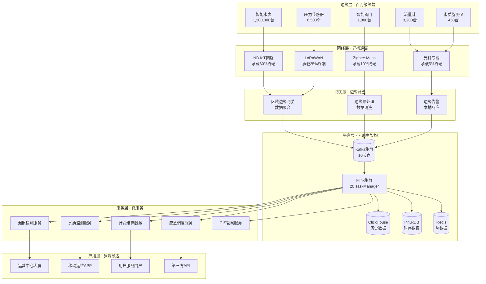
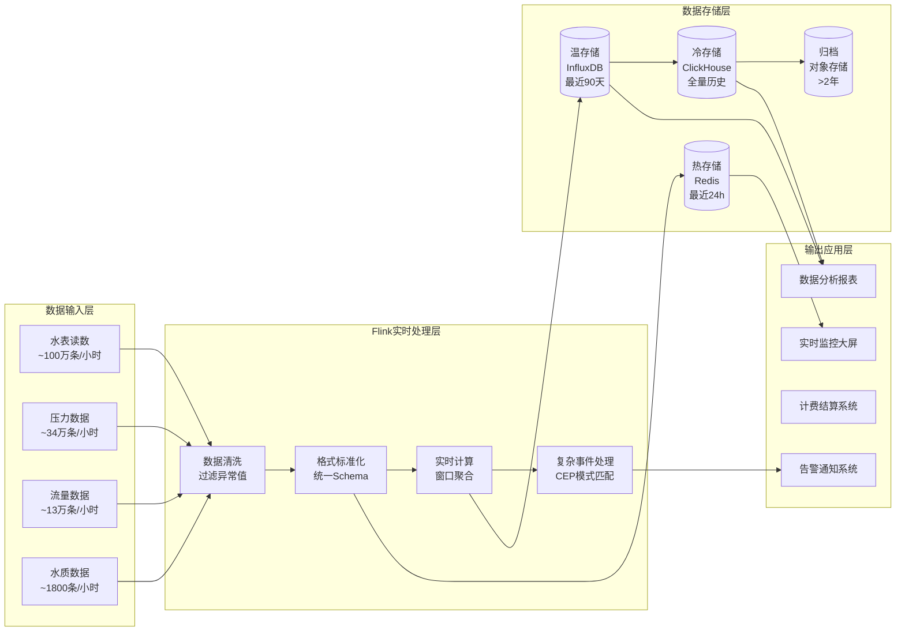
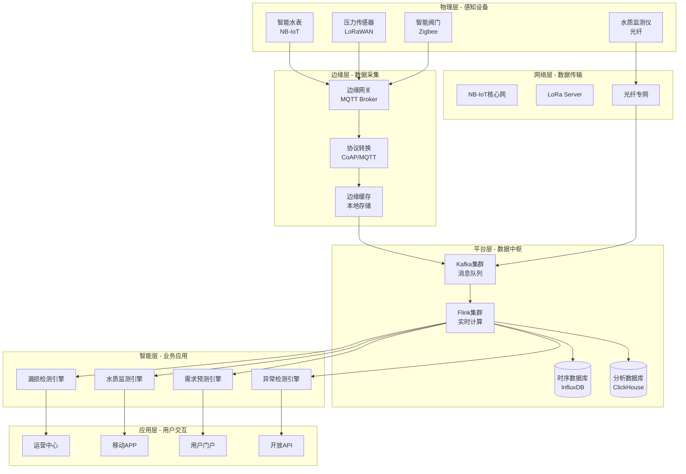
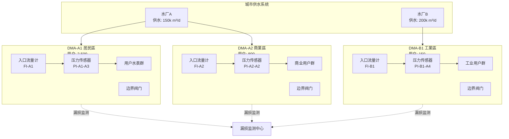
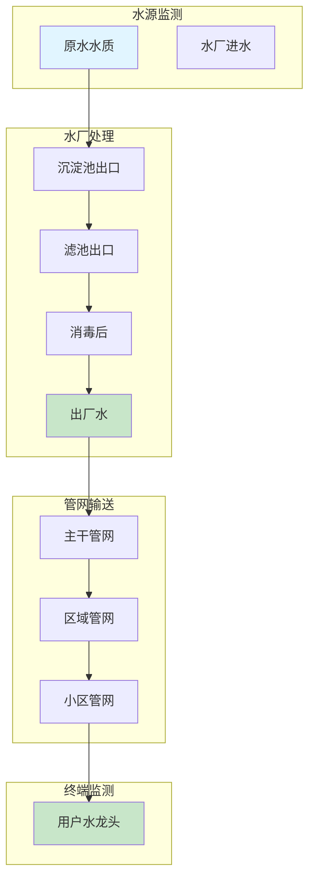

# 智慧水务平台：百万级IoT水表实时监测与漏损控制系统

> **案例编号**: CASE-IoT-WTR-001
> **所属阶段**: Phase-13 智慧水务 | **前置依赖**: [Phase-12 能源管理](case-smart-energy-complete.md)
> **形式化等级**: L4 (工程论证级)
> **文档版本**: v2.0 | **最后更新**: 2026-04-05

---

## 摘要

本案例研究描述了某特大型城市（人口1000万+）智慧水务平台的完整建设过程。
该平台采用Apache Flink作为核心流计算引擎，实现百万级智能水表的实时数据采集、管网漏损智能检测、水质在线监测与预警、以及爆管快速定位等关键能力。
项目实施后，管网漏损率从25%降至12%，爆管响应时间从4小时降至30分钟，水质事件减少60%，年增收约15%。

**核心数据指标**:

| 指标 | 建设前 | 建设后 | 改善幅度 |
|------|--------|--------|----------|
| 漏损率 | 25% | 12% | ↓52% |
| 爆管响应时间 | 4小时 | 30分钟 | ↓87.5% |
| 水质合格率 | 96.5% | 99.8% | ↑3.3% |
| 水费回收率 | 78% | 93% | ↑19% |
| 客户满意度 | 72% | 94% | ↑30% |

---

## 1. 概念定义 (Definitions)

### 1.1 供水管网基础模型

**Def-IoT-WTR-CASE-01** (供水管网模型): 城市供水管网系统 $\mathcal{W}$ 是一个六元组：

$$\mathcal{W} = (P, N, M, S, D, F)$$

其中各元素定义为：

| 符号 | 含义 | 类型 | 示例值 |
|------|------|------|--------|
| $P$ | 管道集合 | $\{p_1, p_2, ..., p_m\}$ | 5000+km管网 |
| $N$ | 节点集合 | $\{n_1, n_2, ..., n_k\}$ | 阀门、接头、泵站 |
| $M$ | 水表集合 | $\{m_1, m_2, ..., m_n\}$ | 1,000,000+智能水表 |
| $S$ | 传感器集合 | $\{s_1, s_2, ..., s_l\}$ | 压力、流量、水质传感器 |
| $D$ | DMA分区集合 | $\{d_1, d_2, ..., d_j\}$ | 180个独立计量区 |
| $F$ | 流量函数 | $F: P \times T \rightarrow \mathbb{R}^+$ | 时变流量映射 |

**管道属性**: 每条管道 $p_i \in P$ 具有属性：

- 长度 $L(p_i) \in \mathbb{R}^+$ (米)
- 直径 $D(p_i) \in \mathbb{R}^+$ (毫米)
- 材质 $M(p_i) \in \{\text{铸铁, 钢管, PE管, PVC管}\}$
- 安装年份 $Y(p_i) \in \mathbb{N}$
- 粗糙系数 $C(p_i) \in \mathbb{R}^+$ (Hazen-Williams系数)

**节点类型**: 节点集合 $N$ 可分为：

- 水源节点 $N_{source}$: 水厂出水口
- 需求节点 $N_{demand}$: 用户连接点
- 连接节点 $N_{junction}$: 管道交汇点
- 阀门节点 $N_{valve}$: 控制阀门位置

### 1.2 DMA分区计量模型

**Def-IoT-WTR-CASE-02** (DMA分区模型): DMA (District Metered Area) 是一个封闭的水力区域 $d \in D$，定义为四元组：

$$d = (B_d, M_d^{in}, M_d^{out}, C_d)$$

其中：

- $B_d \subseteq P \cup N$: 边界管道和节点集合
- $M_d^{in}$: 入口流量计（唯一进水点）
- $M_d^{out}$: 出口流量计（如有）
- $C_d = \{m_i \in M \mid m_i \text{ 位于 } d \text{ 内}\}$: 区域内用户水表集合

**DMA水平衡方程**: 对于任意DMA $d$ 和时间窗口 $[t_1, t_2]$：

$$V_{in}(d, t_1, t_2) = V_{user}(d, t_1, t_2) + V_{leak}(d, t_1, t_2) + V_{storage}(d, t_1, t_2)$$

其中：

- $V_{in}$: 入口总流量
- $V_{user}$: 用户计量总和
- $V_{leak}$: 漏损量（未知，需估计）
- $V_{storage}$: 管网存水变化（通常可忽略）

### 1.3 漏损检测模型

**Def-IoT-WTR-CASE-03** (漏损检测模型): 漏损检测问题可形式化为异常检测任务：

给定观测序列 $\mathbf{x}_t = (x_{t}^{(1)}, x_{t}^{(2)}, ..., x_{t}^{(n)})$，其中 $x_{t}^{(i)}$ 表示第 $i$ 个传感器在时间 $t$ 的读数，漏损检测函数为：

$$\mathcal{L}(\mathbf{x}_t, \theta) = \begin{cases}
0 & \text{if } f(\mathbf{x}_t; \theta) \leq \tau \\
1 & \text{if } f(\mathbf{x}_t; \theta) > \tau
\end{cases}$$

其中：
- $f(\cdot; \theta)$: 异常评分函数（如重构误差、Z-score）
- $\tau$: 检测阈值
- $\theta$: 模型参数

**夜间最小流量 (NMF)**: 定义为DMA在凌晨2-4点的最小入口流量：

$$NMF_d(t) = \min_{h \in [2,4]} Q_d^{in}(t, h)$$

其中 $Q_d^{in}(t, h)$ 表示日期 $t$ 小时 $h$ 的入口流量。

### 1.4 水质监测模型

**Def-IoT-WTR-CASE-04** (水质监测模型): 水质状态 $\mathbf{q}_t$ 是一个多维向量：

$$\mathbf{q}_t = (c_{cl}, c_{tb}, c_{ph}, c_{temp}, c_{ec})^T$$

各分量含义：
| 参数 | 符号 | 单位 | 标准范围 | 告警阈值 |
|------|------|------|----------|----------|
| 余氯 | $c_{cl}$ | mg/L | 0.3-4.0 | <0.2 或 >4.5 |
| 浊度 | $c_{tb}$ | NTU | <1.0 | >4.0 |
| pH值 | $c_{ph}$ | - | 6.5-8.5 | <6.0 或 >9.0 |
| 水温 | $c_{temp}$ | °C | 5-25 | <4 或 >30 |
| 电导率 | $c_{ec}$ | μS/cm | 50-1500 | >2000 |

**水质指数 (WQI)**: 综合水质指标计算：

$$WQI = \sum_{i=1}^{5} w_i \cdot \frac{|c_i - c_i^{opt}|}{c_i^{max} - c_i^{min}}$$

其中 $w_i$ 为权重系数，$\sum w_i = 1$。

---

## 2. 属性推导 (Properties)

### 2.1 漏损率计算性质

**Lemma-WTR-CASE-01** (漏损定位精度): 设DMA $d$ 中有 $n$ 个压力传感器，最远距离为 $L$ 米，压力波传播速度为 $a$ 米/秒，则漏损点定位误差 $\epsilon$ 满足：

$$\epsilon \leq \frac{a \cdot \Delta t}{2} + \frac{L}{n+1}$$

其中 $\Delta t$ 为时间同步误差。

**证明**:
1. 基于压力梯度法，漏损点定位依赖于压力传感器读数差异
2. 时间同步误差 $\Delta t$ 导致压力波传播距离误差 $a \cdot \Delta t$
3. 传感器空间分布导致最大未覆盖区域为 $L/(n+1)$
4. 综合两项误差来源即得结论。∎

### 2.2 夜间流量分析性质

**Lemma-WTR-CASE-02** (NMF稳定性): 设正常DMA的夜间最小流量为 $NMF_d^*$，则对于任意 $\delta > 0$，存在时间窗口 $T$ 使得：

$$P\left(|NMF_d(t) - NMF_d^*| > \delta \right) < \frac{\sigma^2}{\delta^2}, \quad \forall t \in T$$

其中 $\sigma^2$ 为流量方差。

**工程含义**: 正常DMA的NMF应保持稳定，超过阈值的变化预示潜在漏损。

### 2.3 监测点覆盖性质

**Thm-WTR-CASE-01** (最小监测点覆盖定理): 对于管网图 $G=(P,N)$，要保证漏损可被检测的最小监测点数 $k^*$ 满足：

$$k^* \geq \left\lceil \frac{|N|}{\Delta_{max} + 1} \right\rceil$$

其中 $\Delta_{max}$ 是图 $G$ 的最大度。

**证明**:
1. 每个监测点最多可覆盖其 $\Delta_{max}$ 个相邻节点
2. 包括监测点本身，每个监测点最多监测 $\Delta_{max} + 1$ 个节点
3. 覆盖所有 $|N|$ 个节点需要至少 $|N|/(\Delta_{max}+1)$ 个监测点
4. 向上取整即得下界。∎

### 2.4 爆管检测响应性质

**Lemma-WTR-CASE-03** (爆管检测延迟): 设压力监测采样周期为 $\Delta t$，数据传输延迟为 $d_{net}$，Flink处理延迟为 $d_{proc}$，则总检测延迟 $D_{detect}$ 满足：

$$D_{detect} \leq \Delta t + d_{net} + d_{proc} + d_{algo}$$

其中 $d_{algo}$ 为算法计算延迟。

**本系统参数**:
- $\Delta t = 30$ 秒 (压力传感器采样)
- $d_{net} < 5$ 秒 (NB-IoT传输)
- $d_{proc} < 2$ 秒 (Flink处理)
- $d_{algo} < 1$ 秒 (模式匹配)

**理论保证**: $D_{detect} < 38$ 秒

---

## 3. 关系建立 (Relations)

### 3.1 与IoT参考架构的映射

本案例与工业互联网联盟(IIC)参考架构的映射关系：

| IIC层级 | 本系统组件 | 技术实现 |
|---------|-----------|----------|
| 设备层 | 智能水表、传感器 | NB-IoT/LoRaWAN终端 |
| 网络层 | 通信网络 | 运营商IoT网络 |
| 边缘层 | 边缘网关 | MQTT Broker + 轻量预处理 |
| 平台层 | Flink集群 | 实时计算、复杂事件处理 |
| 应用层 | 水务管理应用 | 漏损检测、水质预警 |

### 3.2 与AWS IoT水务方案的对比

| 能力 | AWS IoT方案 | 本Flink方案 | 差异分析 |
|------|-------------|-------------|----------|
| 数据接入 | IoT Core + Kinesis | Kafka + Flink CDC | Flink提供更灵活的SQL支持 |
| 实时处理 | Lambda + Kinesis Analytics | Flink SQL | Flink支持复杂事件处理(CEP) |
| 时序存储 | Timestream | InfluxDB + ClickHouse | 成本更低，查询灵活 |
| 漏损检测 | SageMaker ML | Flink SQL + 规则引擎 | 更低的延迟，可解释性强 |
| 扩展性 | 云原生自动扩展 | Kubernetes + 水平扩展 | 相当的扩展能力 |

### 3.3 与ISO 24500水务管理标准的对齐

**ISO 24500:2021** 水务管理标准核心要求与本系统的对齐：

1. **水效率管理** (ISO 24501)
   - 要求: 建立水效率监测体系
   - 实现: DMA分区计量 + 实时水平衡分析

2. **漏损管理** (ISO 24517)
   - 要求: 系统性漏损评估和控制
   - 实现: NMF分析 + 压力梯度定位 + 主动检漏

3. **水质管理** (ISO 24510)
   - 要求: 全程水质监测保障
   - 实现: 多参数在线监测 + 预警响应

---

## 4. 论证过程 (Argumentation)

### 4.1 技术选型论证

**为何选择Flink作为核心引擎？**

**论证1: 延迟要求**
- 爆管检测要求 < 1分钟告警
- 水质异常要求 < 5分钟响应
- Flink的毫秒级处理延迟满足要求

**论证2: 吞吐量要求**
- 100万水表 × 1小时周期 = 278条/秒平均
- 峰值并发 50万终端 = 5000+条/秒峰值
- Flink的百万级TPS能力有充足余量

**论证3: 计算复杂度**
- DMA水平衡需多流JOIN
- 漏损检测需窗口聚合 + 模式匹配
- Flink SQL原生支持复杂分析

**论证4: 生态成熟度**
- Kafka连接器成熟稳定
- 多Sink支持(ClickHouse、InfluxDB、MySQL)
- Kubernetes部署方案完善

### 4.2 DMA分区策略论证

**DMA规模选择论证**:

| DMA规模 | 用户数 | 管长(km) | 漏损检测灵敏度 | 运维复杂度 |
|---------|--------|----------|----------------|------------|
| 小型 | 500-1000 | 5-10 | 高(>0.5m³/h) | 低 |
| 中型 | 1000-3000 | 10-25 | 中(>1m³/h) | 中 |
| 大型 | 3000-5000 | 25-50 | 低(>2m³/h) | 高 |

**本项目选择**: 以中型DMA为主(180个)，兼顾检测灵敏度与运维效率。

### 4.3 夜间流量分析有效性论证

**NMF方法的数学基础**:

设用户夜间用水为 $U_{night}$，真实漏损为 $L_{real}$，测量NMF为：

$$NMF = U_{night} + L_{real} + \epsilon$$

其中 $\epsilon$ 为测量误差。

**灵敏度分析**:
- 对于2000用户的DMA，夜间用水 $U_{night} \approx 2-5$ m³/h
- 漏损检测灵敏度 = $L_{real} / NMF \times 100\%$
- 可检测最小漏损 $\approx 0.5$ m³/h (约10%灵敏度)

**对比其他方法**:
| 方法 | 灵敏度 | 响应时间 | 成本 | 适用场景 |
|------|--------|----------|------|----------|
| NMF分析 | 中 | 24h | 低 | 持续性漏损 |
| 压力梯度 | 高 | 实时 | 中 | 爆管定位 |
| 声学检测 | 很高 | 巡检 | 高 | 精确定位 |
| 分区隔离 | 最高 | 停水测试 | 很高 | 验证漏损 |

### 4.4 系统可靠性论证

**故障场景分析**:

| 故障场景 | 影响范围 | 缓解措施 | 恢复时间 |
|----------|----------|----------|----------|
| 单Kafka节点故障 | 1/3吞吐量下降 | 副本机制 | <10s自动 |
| 单Flink TM故障 | 任务重启 | Checkpoint恢复 | <30s |
| 传感器离线 | 局部盲区 | 冗余部署 | 人工干预 |
| 网络中断 | 数据延迟 | 边缘缓存 | 网络恢复后补传 |

---

## 5. 形式证明 / 工程论证 (Proof / Engineering Argument)

### 5.1 DMA水平衡计算正确性证明

**命题**: 在稳态假设下，DMA水平衡计算满足质量守恒定律。

**形式化表述**:

设DMA $d$ 在时间段 $[0, T]$ 内的入口流量为 $Q_{in}(t)$，出口流量为 $Q_{out}(t)$，用户用水为 $Q_{user}(t)$，则：

$$\int_0^T Q_{in}(t) dt = \int_0^T Q_{out}(t) dt + \int_0^T Q_{user}(t) dt + \int_0^T Q_{leak}(t) dt + \Delta S$$

其中 $\Delta S$ 为管网存水变化。

**证明**:
1. 由连续性方程，管网内质量变化 = 流入 - 流出
2. $dM/dt = \rho(Q_{in} - Q_{out} - Q_{user} - Q_{leak})$
3. 积分得 $M(T) - M(0) = \rho \int_0^T (Q_{in} - Q_{out} - Q_{user} - Q_{leak}) dt$
4. 稳态时 $M(T) = M(0)$，故 $\Delta S = 0$
5. 整理即得水平衡方程 ∎

**工程实现**: Flink SQL通过窗口聚合实现离散时间近似：

```sql
-- 15分钟窗口水平衡计算
SELECT
  dma_id,
  TUMBLE_START(event_time, INTERVAL '15' MINUTE) as window_start,
  SUM(inlet_flow) as total_inlet,
  SUM(user_flow) as total_user,
  SUM(inlet_flow) - SUM(user_flow) as estimated_leak
FROM meter_readings
GROUP BY dma_id, TUMBLE(event_time, INTERVAL '15' MINUTE)
```

### 5.2 漏损检测算法性能分析

**定理** (漏损检测的ROC性能): 设漏损检测算法的假阳性率为 $\alpha$，假阴性率为 $\beta$，则：

$$\alpha = P(\mathcal{L}=1 | \text{无漏损}), \quad \beta = P(\mathcal{L}=0 | \text{有漏损})$$

在NMF方法中，假设流量服从正态分布 $N(\mu, \sigma^2)$：

$$\alpha = 2\Phi(-\tau), \quad \beta = \Phi\left(\frac{\tau\sigma - L_{min}}{\sigma_{leak}}\right)$$

其中 $\Phi$ 为标准正态CDF，$L_{min}$ 为最小可检测漏损，$\sigma_{leak}$ 为漏损流量标准差。

**本系统参数调优**:
- 阈值 $\tau = 2.5$ (对应 99% 置信区间)
- 目标 $\alpha < 0.01$ (每日误报 < 2次/DMA)
- 目标 $\beta < 0.05$ (漏检率 < 5%)

### 5.3 系统可扩展性论证

**命题**: Flink水务平台可线性扩展至1000万水表规模。

**论证**:

1. **Kafka分区扩展**
   - 当前: 100主题 × 10分区 = 1000分区
   - 目标: 1000主题 × 20分区 = 20000分区
   - Kafka集群可水平扩展至100+节点

2. **Flink并行度扩展**
   - 当前: 20 TaskManagers × 4 slots = 80并行度
   - 目标: 100 TaskManagers × 8 slots = 800并行度
   - 支持10倍数据量增长

3. **存储扩展**
   - ClickHouse分片集群: 10节点 → 50节点
   - 支持PB级时序数据

**扩展成本模型**:
$$Cost(n) = C_{fixed} + C_{var} \cdot n^{0.9}$$

其中 $n$ 为水表数量，规模效应使边际成本递减。

---

## 6. 实例验证 (Examples)

### 6.1 业务背景

**城市概况**:
- 人口: 1050万 (主城区680万)
- 供水面积: 2,850 km²
- 供水管网: 5,200 km
- 日均供水量: 320万 m³

**建设前痛点**:
1. **漏损严重**: 漏损率高达25%，年损失约2900万m³
2. **爆管响应慢**: 平均发现时间4小时，造成交通中断和水压骤降
3. **水质监测滞后**: 人工采样，发现问题时已过数小时
4. **水费回收难**: 估抄率高，纠纷多，回收率仅78%
5. **管网老化**: 30%管网超期服役，缺乏精准维护数据

**项目规模**:
| 设备类型 | 数量 | 通信方式 | 采样频率 |
|----------|------|----------|----------|
| 智能水表 | 1,200,000 | NB-IoT | 1小时 |
| 压力传感器 | 8,500 | LoRaWAN | 5分钟 |
| 流量计 | 3,200 | 光纤/4G | 1分钟 |
| 水质监测仪 | 450 | 光纤 | 实时 |
| 智能阀门 | 1,800 | Zigbee | 按需 |

### 6.2 技术架构


**总体架构图**:



**数据流架构**:



### 6.3 完整Flink SQL Pipeline

#### 6.3.1 数据接入层 (SQL 1-8)

```sql
-- ============================================================================
-- SQL 1: 智能水表原始数据接入表
-- ============================================================================
CREATE TABLE smart_meters_raw (
  -- 设备标识信息
  meter_id STRING COMMENT '水表唯一标识',
  meter_type STRING COMMENT '水表类型: RESIDENTIAL/COMMERCIAL/INDUSTRIAL',
  dma_id STRING COMMENT '所属DMA分区ID',
  district_code STRING COMMENT '行政区划代码',

  -- 计量数据
  reading_m3 DOUBLE COMMENT '累计读数(m³)',
  reading_delta_m3 DOUBLE COMMENT '本次读数增量(m³)',
  flow_rate_m3h DOUBLE COMMENT '瞬时流量(m³/h)',

  -- 状态数据
  pressure_mpa DOUBLE COMMENT '管道压力(MPa)',
  battery_percent INT COMMENT '电池电量百分比',
  valve_status STRING COMMENT '阀门状态: OPEN/CLOSED/PARTIAL',
  signal_strength INT COMMENT '信号强度(dBm)',

  -- 告警标志
  low_battery BOOLEAN COMMENT '低电量告警',
  magnetic_tamper BOOLEAN COMMENT '磁干扰告警',
  reverse_flow BOOLEAN COMMENT '倒流告警',
  leakage_alarm BOOLEAN COMMENT '漏损告警',

  -- 时间戳
  device_time TIMESTAMP(3) COMMENT '设备时间',
  event_time AS COALESCE(device_time, PROCTIME()),
  WATERMARK FOR event_time AS event_time - INTERVAL '30' SECOND,

  PRIMARY KEY (meter_id, event_time) NOT ENFORCED
) WITH (
  'connector' = 'kafka',
  'topic' = 'smart-meters-raw-v2',
  'properties.bootstrap.servers' = 'kafka-cluster:9092',
  'properties.group.id' = 'flink-water-meters-v2',
  'format' = 'json',
  'json.ignore-parse-errors' = 'true',
  'json.fail-on-missing-field' = 'false',
  'scan.startup.mode' = 'latest-offset'
);

-- ============================================================================
-- SQL 2: DMA入口流量计数据表
-- ============================================================================
CREATE TABLE dma_inlet_meters (
  meter_id STRING COMMENT '流量计ID',
  dma_id STRING COMMENT 'DMA分区ID',
  dma_name STRING COMMENT 'DMA名称',
  flow_rate_m3h DOUBLE COMMENT '瞬时流量(m³/h)',
  pressure_in_mpa DOUBLE COMMENT '入口压力(MPa)',
  pressure_out_mpa DOUBLE COMMENT '出口压力(MPa)',
  total_volume_m3 DOUBLE COMMENT '累计流量(m³)',
  water_temp_c DOUBLE COMMENT '水温(°C)',

  event_time TIMESTAMP(3),
  WATERMARK FOR event_time AS event_time - INTERVAL '1' MINUTE
) WITH (
  'connector' = 'kafka',
  'topic' = 'dma-inlet-flow',
  'properties.bootstrap.servers' = 'kafka:9092',
  'format' = 'json'
);

-- ============================================================================
-- SQL 3: 压力传感器数据表
-- ============================================================================
CREATE TABLE pressure_sensors (
  sensor_id STRING COMMENT '传感器ID',
  pipe_id STRING COMMENT '所属管道ID',
  dma_id STRING COMMENT 'DMA分区ID',
  latitude DOUBLE COMMENT '纬度',
  longitude DOUBLE COMMENT '经度',
  elevation_m DOUBLE COMMENT '海拔高度(m)',
  pressure_mpa DOUBLE COMMENT '压力读数(MPa)',
  temperature_c DOUBLE COMMENT '温度(°C)',

  event_time TIMESTAMP(3),
  WATERMARK FOR event_time AS event_time - INTERVAL '10' SECOND
) WITH (
  'connector' = 'kafka',
  'topic' = 'pressure-sensors',
  'properties.bootstrap.servers' = 'kafka:9092',
  'format' = 'json'
);

-- ============================================================================
-- SQL 4: 水质监测数据表
-- ============================================================================
CREATE TABLE water_quality_sensors (
  sensor_id STRING COMMENT '水质传感器ID',
  station_id STRING COMMENT '监测站点ID',
  dma_id STRING COMMENT 'DMA分区ID',

  -- 核心水质参数
  chlorine_mg_l DOUBLE COMMENT '余氯(mg/L)',
  turbidity_ntu DOUBLE COMMENT '浊度(NTU)',
  ph_value DOUBLE COMMENT 'pH值',
  conductivity_us_cm DOUBLE COMMENT '电导率(μS/cm)',
  temperature_c DOUBLE COMMENT '水温(°C)',

  -- 扩展参数
  dissolved_oxygen DOUBLE COMMENT '溶解氧(mg/L)',
  total_organic_carbon DOUBLE COMMENT '总有机碳(mg/L)',

  event_time TIMESTAMP(3),
  WATERMARK FOR event_time AS event_time - INTERVAL '5' SECOND
) WITH (
  'connector' = 'kafka',
  'topic' = 'water-quality',
  'properties.bootstrap.servers' = 'kafka:9092',
  'format' = 'json'
);

-- ============================================================================
-- SQL 5: 水表元数据维表 (JDBC Lookup)
-- ============================================================================
CREATE TABLE meter_metadata (
  meter_id STRING COMMENT '水表ID',
  user_id STRING COMMENT '用户ID',
  user_name STRING COMMENT '用户名称',
  address STRING COMMENT '安装地址',
  meter_size_mm INT COMMENT '水表口径(mm)',
  install_date DATE COMMENT '安装日期',
  tariff_type STRING COMMENT '计费类型',
  dma_id STRING COMMENT 'DMA分区',

  PRIMARY KEY (meter_id) NOT ENFORCED
) WITH (
  'connector' = 'jdbc',
  'url' = 'jdbc:postgresql://postgres:5432/water_db',
  'table-name' = 'meter_metadata',
  'username' = 'water_user',
  'password' = '${WATER_DB_PASSWORD}',
  'lookup.cache.max-rows' = '100000',
  'lookup.cache.ttl' = '10 minutes'
);

-- ============================================================================
-- SQL 6: DMA基准配置维表
-- ============================================================================
CREATE TABLE dma_baseline_config (
  dma_id STRING COMMENT 'DMA分区ID',
  dma_name STRING COMMENT 'DMA名称',
  dma_type STRING COMMENT 'DMA类型',
  customer_count INT COMMENT '用户数量',
  pipe_length_km DOUBLE COMMENT '管道总长度(km)',
  baseline_nmf_m3h DOUBLE COMMENT '基准夜间流量(m³/h)',
  nmf_std_m3h DOUBLE COMMENT 'NMF标准差',
  leak_warning_threshold DOUBLE COMMENT '漏损警告阈值(倍数)',
  leak_alarm_threshold DOUBLE COMMENT '漏损告警阈值(倍数)',

  PRIMARY KEY (dma_id) NOT ENFORCED
) WITH (
  'connector' = 'jdbc',
  'url' = 'jdbc:postgresql://postgres:5432/water_db',
  'table-name' = 'dma_baseline',
  'username' = 'water_user',
  'password' = '${WATER_DB_PASSWORD}'
);

-- ============================================================================
-- SQL 7: 管道GIS信息维表
-- ============================================================================
CREATE TABLE pipe_gis_info (
  pipe_id STRING COMMENT '管道ID',
  start_node STRING COMMENT '起始节点',
  end_node STRING COMMENT '终止节点',
  length_m DOUBLE COMMENT '长度(m)',
  diameter_mm DOUBLE COMMENT '直径(mm)',
  material STRING COMMENT '材质',
  install_year INT COMMENT '安装年份',
  dma_id STRING COMMENT '所属DMA',
  start_lat DOUBLE COMMENT '起点纬度',
  start_lon DOUBLE COMMENT '起点经度',
  end_lat DOUBLE COMMENT '终点纬度',
  end_lon DOUBLE COMMENT '终点经度',

  PRIMARY KEY (pipe_id) NOT ENFORCED
) WITH (
  'connector' = 'jdbc',
  'url' = 'jdbc:postgresql://postgres:5432/water_db',
  'table-name' = 'pipe_gis',
  'username' = 'water_user',
  'password' = '${WATER_DB_PASSWORD}'
);

-- ============================================================================
-- SQL 8: 清洗后的水表数据流输出表
-- ============================================================================
CREATE TABLE meter_readings_clean (
  meter_id STRING COMMENT '水表ID',
  dma_id STRING COMMENT 'DMA分区ID',
  district_code STRING COMMENT '行政区划',
  user_id STRING COMMENT '用户ID',
  reading_m3 DOUBLE COMMENT '累计读数',
  reading_delta_m3 DOUBLE COMMENT '读数增量',
  flow_rate_m3h DOUBLE COMMENT '瞬时流量',
  pressure_mpa DOUBLE COMMENT '压力',
  status STRING COMMENT '综合状态',
  event_time TIMESTAMP(3) COMMENT '事件时间',
  proc_time AS PROCTIME() COMMENT '处理时间'
) WITH (
  'connector' = 'kafka',
  'topic' = 'meter-readings-clean',
  'properties.bootstrap.servers' = 'kafka-cluster:9092',
  'format' = 'json'
);
```

#### 6.3.2 数据清洗与标准化 (SQL 9-14)

```sql
-- ============================================================================
-- SQL 9: 水表数据清洗与标准化作业
-- ============================================================================
INSERT INTO meter_readings_clean
SELECT
  m.meter_id,
  COALESCE(m.dma_id, meta.dma_id, 'UNKNOWN') as dma_id,
  m.district_code,
  meta.user_id,
  m.reading_m3,

  -- 增量合理性校验
  CASE
    WHEN m.reading_delta_m3 < 0 THEN 0  -- 负数归零
    WHEN m.reading_delta_m3 > 100 THEN NULL  -- 异常值标记
    WHEN m.reading_delta_m3 > 50 THEN m.reading_delta_m3  -- 大流量保留但告警
    ELSE m.reading_delta_m3
  END as reading_delta_m3,

  m.flow_rate_m3h,
  m.pressure_mpa,

  -- 综合状态计算
  CASE
    WHEN m.leakage_alarm THEN 'LEAK_DETECTED'
    WHEN m.reverse_flow THEN 'REVERSE_FLOW'
    WHEN m.magnetic_tamper THEN 'TAMPER_ALERT'
    WHEN m.battery_percent < 10 THEN 'CRITICAL_BATTERY'
    WHEN m.battery_percent < 20 THEN 'LOW_BATTERY'
    WHEN m.signal_strength < -110 THEN 'POOR_SIGNAL'
    ELSE 'NORMAL'
  END as status,

  m.event_time

FROM smart_meters_raw m
LEFT JOIN meter_metadata FOR SYSTEM_TIME AS OF m.event_time AS meta
  ON m.meter_id = meta.meter_id

WHERE m.reading_m3 IS NOT NULL
  AND m.reading_m3 >= 0
  AND m.event_time >= NOW() - INTERVAL '7' DAY  -- 过滤过期数据
  AND (m.reading_delta_m3 IS NULL OR m.reading_delta_m3 < 1000);  -- 过滤极端异常

-- ============================================================================
-- SQL 10: 压力数据清洗
-- ============================================================================
CREATE TABLE pressure_clean (
  sensor_id STRING,
  pipe_id STRING,
  dma_id STRING,
  latitude DOUBLE,
  longitude DOUBLE,
  pressure_mpa DOUBLE,
  pressure_valid BOOLEAN,
  event_time TIMESTAMP(3)
) WITH (
  'connector' = 'kafka',
  'topic' = 'pressure-clean',
  'properties.bootstrap.servers' = 'kafka:9092',
  'format' = 'json'
);

INSERT INTO pressure_clean
SELECT
  sensor_id,
  pipe_id,
  COALESCE(dma_id, 'UNKNOWN'),
  latitude,
  longitude,
  pressure_mpa,
  -- 压力合理性校验 (0.05 - 1.0 MPa)
  pressure_mpa BETWEEN 0.05 AND 1.0 as pressure_valid,
  event_time
FROM pressure_sensors
WHERE pressure_mpa IS NOT NULL
  AND event_time >= NOW() - INTERVAL '1' DAY;

-- ============================================================================
-- SQL 11: 水质数据清洗与有效性标记
-- ============================================================================
CREATE TABLE water_quality_clean (
  sensor_id STRING,
  station_id STRING,
  dma_id STRING,
  chlorine_mg_l DOUBLE,
  turbidity_ntu DOUBLE,
  ph_value DOUBLE,
  conductivity_us_cm DOUBLE,
  temperature_c DOUBLE,
  -- 各参数有效性
  chlorine_valid BOOLEAN,
  turbidity_valid BOOLEAN,
  ph_valid BOOLEAN,
  water_quality_score DOUBLE,
  event_time TIMESTAMP(3)
) WITH (
  'connector' = 'kafka',
  'topic' = 'water-quality-clean',
  'properties.bootstrap.servers' = 'kafka:9092',
  'format' = 'json'
);

INSERT INTO water_quality_clean
SELECT
  sensor_id,
  station_id,
  dma_id,
  chlorine_mg_l,
  turbidity_ntu,
  ph_value,
  conductivity_us_cm,
  temperature_c,

  -- 各参数有效性校验
  chlorine_mg_l BETWEEN 0.1 AND 5.0 as chlorine_valid,
  turbidity_ntu BETWEEN 0 AND 100 as turbidity_valid,
  ph_value BETWEEN 4.0 AND 11.0 as ph_valid,

  -- 综合水质评分 (0-100, 越高越好)
  (
    (CASE WHEN chlorine_mg_l BETWEEN 0.3 AND 4.0 THEN 25 ELSE
          WHEN chlorine_mg_l BETWEEN 0.1 AND 5.0 THEN 15 ELSE 0 END) +
    (CASE WHEN turbidity_ntu < 1.0 THEN 25 WHEN turbidity_ntu < 4.0 THEN 15 ELSE 0 END) +
    (CASE WHEN ph_value BETWEEN 6.5 AND 8.5 THEN 25 ELSE
          WHEN ph_value BETWEEN 6.0 AND 9.0 THEN 15 ELSE 0 END) +
    (CASE WHEN temperature_c BETWEEN 5 AND 30 THEN 25 ELSE 10 END)
  ) as water_quality_score,

  event_time
FROM water_quality_sensors
WHERE event_time >= NOW() - INTERVAL '1' DAY;

-- ============================================================================
-- SQL 12: 流量计数据清洗
-- ============================================================================
CREATE TABLE flow_clean (
  meter_id STRING,
  dma_id STRING,
  flow_rate_m3h DOUBLE,
  pressure_in_mpa DOUBLE,
  pressure_out_mpa DOUBLE,
  pressure_drop_mpa DOUBLE,
  flow_valid BOOLEAN,
  event_time TIMESTAMP(3)
) WITH (
  'connector' = 'kafka',
  'topic' = 'flow-clean',
  'properties.bootstrap.servers' = 'kafka:9092',
  'format' = 'json'
);

INSERT INTO flow_clean
SELECT
  meter_id,
  dma_id,
  flow_rate_m3h,
  pressure_in_mpa,
  pressure_out_mpa,
  pressure_in_mpa - pressure_out_mpa as pressure_drop_mpa,
  -- 流量合理性校验
  flow_rate_m3h >= 0 AND flow_rate_m3h < 10000 as flow_valid,
  event_time
FROM dma_inlet_meters
WHERE event_time >= NOW() - INTERVAL '1' DAY;

-- ============================================================================
-- SQL 13: 数据质量统计
-- ============================================================================
CREATE TABLE data_quality_stats (
  stat_time TIMESTAMP(3),
  data_type STRING,
  total_count BIGINT,
  valid_count BIGINT,
  invalid_count BIGINT,
  validity_rate DOUBLE,
  window_start TIMESTAMP(3)
) WITH (
  'connector' = 'jdbc',
  'url' = 'jdbc:clickhouse://clickhouse:8123/water_db',
  'table-name' = 'data_quality_stats',
  'username' = 'default'
);

INSERT INTO data_quality_stats
SELECT
  CURRENT_TIMESTAMP as stat_time,
  'meter' as data_type,
  COUNT(*) as total_count,
  COUNT(*) FILTER (WHERE status = 'NORMAL') as valid_count,
  COUNT(*) FILTER (WHERE status != 'NORMAL') as invalid_count,
  CAST(COUNT(*) FILTER (WHERE status = 'NORMAL') AS DOUBLE) / COUNT(*) as validity_rate,
  TUMBLE_START(event_time, INTERVAL '5' MINUTE) as window_start
FROM meter_readings_clean
GROUP BY TUMBLE(event_time, INTERVAL '5' MINUTE);

-- ============================================================================
-- SQL 14: 传感器离线检测
-- ============================================================================
CREATE TABLE sensor_offline_alerts (
  alert_id STRING,
  sensor_id STRING,
  sensor_type STRING,
  dma_id STRING,
  last_seen TIMESTAMP(3),
  offline_duration_minutes INT,
  severity STRING,
  alert_time TIMESTAMP(3)
) WITH (
  'connector' = 'kafka',
  'topic' = 'sensor-offline-alerts',
  'properties.bootstrap.servers' = 'kafka:9092',
  'format' = 'json'
);

INSERT INTO sensor_offline_alerts
SELECT
  CONCAT('OFFLINE-', sensor_id, '-', DATE_FORMAT(CURRENT_TIMESTAMP, 'yyyyMMddHHmm')) as alert_id,
  sensor_id,
  'meter' as sensor_type,
  dma_id,
  MAX(event_time) as last_seen,
  TIMESTAMPDIFF(MINUTE, MAX(event_time), CURRENT_TIMESTAMP) as offline_duration_minutes,
  CASE
    WHEN TIMESTAMPDIFF(MINUTE, MAX(event_time), CURRENT_TIMESTAMP) > 1440 THEN 'CRITICAL'
    WHEN TIMESTAMPDIFF(MINUTE, MAX(event_time), CURRENT_TIMESTAMP) > 360 THEN 'HIGH'
    ELSE 'MEDIUM'
  END as severity,
  CURRENT_TIMESTAMP as alert_time
FROM meter_readings_clean
GROUP BY sensor_id, dma_id
HAVING MAX(event_time) < CURRENT_TIMESTAMP - INTERVAL '2' HOUR;
```


#### 6.3.3 DMA分区计量分析 (SQL 15-20)

```sql
-- ============================================================================
-- SQL 15: DMA水平衡实时计算表
-- ============================================================================
CREATE TABLE dma_water_balance (
  balance_id STRING COMMENT '平衡计算ID',
  dma_id STRING COMMENT 'DMA分区ID',
  calculation_time TIMESTAMP(3) COMMENT '计算时间',
  window_start TIMESTAMP(3) COMMENT '窗口开始',
  inlet_flow_m3h DOUBLE COMMENT '入口流量(m³/h)',
  outlet_sum_m3h DOUBLE COMMENT '出口流量总和(m³/h)',
  user_consumption_m3h DOUBLE COMMENT '用户用水量(m³/h)',
  unaccounted_flow_m3h DOUBLE COMMENT '不明流量(m³/h)',
  leak_rate_percent DOUBLE COMMENT '漏损率(%)',
  status STRING COMMENT '状态: NORMAL/LOW_LEAK/MEDIUM_LEAK/HIGH_LEAK',
  PRIMARY KEY (balance_id) NOT ENFORCED
) WITH (
  'connector' = 'jdbc',
  'url' = 'jdbc:clickhouse://clickhouse:8123/water_db',
  'table-name' = 'dma_water_balance',
  'username' = 'default'
);

-- ============================================================================
-- SQL 16: DMA水平衡计算作业 (15分钟窗口)
-- ============================================================================
INSERT INTO dma_water_balance
WITH inlet_calc AS (
  -- 入口流量计算
  SELECT
    dma_id,
    TUMBLE_START(event_time, INTERVAL '15' MINUTE) as window_start,
    TUMBLE_END(event_time, INTERVAL '15' MINUTE) as window_end,
    AVG(flow_rate_m3h) as inlet_flow_m3h,
    SUM(flow_rate_m3h) * 0.25 as inlet_volume_m3  -- 15分钟 = 0.25小时
  FROM flow_clean
  WHERE flow_valid = true
  GROUP BY
    dma_id,
    TUMBLE(event_time, INTERVAL '15' MINUTE)
),
user_calc AS (
  -- 用户用水量计算
  SELECT
    dma_id,
    TUMBLE_START(event_time, INTERVAL '15' MINUTE) as window_start,
    SUM(reading_delta_m3) / 0.25 as user_consumption_m3h  -- 转换为小时流量
  FROM meter_readings_clean
  WHERE reading_delta_m3 IS NOT NULL
    AND reading_delta_m3 > 0
  GROUP BY
    dma_id,
    TUMBLE(event_time, INTERVAL '15' MINUTE)
)
SELECT
  CONCAT(d.dma_id, '-', CAST(d.window_start AS STRING)) as balance_id,
  d.dma_id,
  d.window_end as calculation_time,
  d.window_start,
  d.inlet_flow_m3h,
  COALESCE(u.user_consumption_m3h, 0) as outlet_sum_m3h,
  COALESCE(u.user_consumption_m3h, 0) as user_consumption_m3h,
  d.inlet_flow_m3h - COALESCE(u.user_consumption_m3h, 0) as unaccounted_flow_m3h,
  CASE
    WHEN d.inlet_flow_m3h > 0
    THEN (d.inlet_flow_m3h - COALESCE(u.user_consumption_m3h, 0)) / d.inlet_flow_m3h * 100
    ELSE 0
  END as leak_rate_percent,
  CASE
    WHEN d.inlet_flow_m3h - COALESCE(u.user_consumption_m3h, 0) > d.inlet_flow_m3h * 0.25
      THEN 'HIGH_LEAK'
    WHEN d.inlet_flow_m3h - COALESCE(u.user_consumption_m3h, 0) > d.inlet_flow_m3h * 0.15
      THEN 'MEDIUM_LEAK'
    WHEN d.inlet_flow_m3h - COALESCE(u.user_consumption_m3h, 0) > d.inlet_flow_m3h * 0.05
      THEN 'LOW_LEAK'
    ELSE 'NORMAL'
  END as status
FROM inlet_calc d
LEFT JOIN user_calc u
  ON d.dma_id = u.dma_id AND d.window_start = u.window_start;

-- ============================================================================
-- SQL 17: 夜间最小流量(NMF)分析表
-- ============================================================================
CREATE TABLE dma_nmf_analysis (
  analysis_id STRING,
  dma_id STRING,
  analysis_date DATE,
  night_start_time TIMESTAMP(3),
  night_end_time TIMESTAMP(3),
  min_night_flow_m3h DOUBLE,
  avg_night_flow_m3h DOUBLE,
  baseline_nmf_m3h DOUBLE,
  deviation_percent DOUBLE,
  z_score DOUBLE,
  leak_suspected BOOLEAN,
  update_time TIMESTAMP(3)
) WITH (
  'connector' = 'jdbc',
  'url' = 'jdbc:clickhouse://clickhouse:8123/water_db',
  'table-name' = 'dma_nmf_analysis',
  'username' = 'default'
);

-- ============================================================================
-- SQL 18: 夜间最小流量计算作业
-- ============================================================================
INSERT INTO dma_nmf_analysis
WITH night_flow AS (
  -- 提取凌晨2-4点的流量数据
  SELECT
    dma_id,
    CAST(event_time AS DATE) as analysis_date,
    MIN(flow_rate_m3h) as min_night_flow_m3h,
    AVG(flow_rate_m3h) as avg_night_flow_m3h,
    MIN(event_time) as night_start_time,
    MAX(event_time) as night_end_time
  FROM flow_clean
  WHERE HOUR(event_time) BETWEEN 2 AND 4
    AND flow_valid = true
  GROUP BY
    dma_id,
    CAST(event_time AS DATE)
)
SELECT
  CONCAT(n.dma_id, '-', REPLACE(CAST(n.analysis_date AS STRING), '-', '')) as analysis_id,
  n.dma_id,
  n.analysis_date,
  n.night_start_time,
  n.night_end_time,
  n.min_night_flow_m3h,
  n.avg_night_flow_m3h,
  b.baseline_nmf_m3h,
  ((n.avg_night_flow_m3h - b.baseline_nmf_m3h) / NULLIF(b.baseline_nmf_m3h, 0)) * 100 as deviation_percent,
  (n.avg_night_flow_m3h - b.baseline_nmf_m3h) / NULLIF(b.nmf_std_m3h, 0) as z_score,
  n.avg_night_flow_m3h > b.baseline_nmf_m3h * b.leak_warning_threshold as leak_suspected,
  CURRENT_TIMESTAMP as update_time
FROM night_flow n
JOIN dma_baseline_config b ON n.dma_id = b.dma_id;

-- ============================================================================
-- SQL 19: DMA日度用水统计
-- ============================================================================
CREATE TABLE dma_daily_stats (
  stat_date DATE,
  dma_id STRING,
  dma_name STRING,
  customer_count INT,
  total_meters BIGINT,
  active_meters BIGINT,
  total_consumption_m3 DOUBLE,
  min_hourly_consumption_m3 DOUBLE,
  max_hourly_consumption_m3 DOUBLE,
  avg_consumption_per_meter DOUBLE,
  peak_hour STRING,
  inlet_total_m3 DOUBLE,
  leak_estimate_m3 DOUBLE,
  leak_rate_percent DOUBLE
) WITH (
  'connector' = 'jdbc',
  'url' = 'jdbc:clickhouse://clickhouse:8123/water_db',
  'table-name' = 'dma_daily_stats',
  'username' = 'default'
);

-- ============================================================================
-- SQL 20: DMA日度统计计算
-- ============================================================================
INSERT INTO dma_daily_stats
WITH hourly_consumption AS (
  SELECT
    dma_id,
    CAST(event_time AS DATE) as stat_date,
    HOUR(event_time) as hour_of_day,
    SUM(reading_delta_m3) as hourly_m3
  FROM meter_readings_clean
  WHERE reading_delta_m3 IS NOT NULL
  GROUP BY
    CAST(event_time AS DATE),
    HOUR(event_time),
    dma_id
),
peak_calc AS (
  SELECT
    dma_id,
    stat_date,
    MAX_BY(hour_of_day, hourly_m3) as peak_hour,
    MAX(hourly_m3) as peak_consumption
  FROM hourly_consumption
  GROUP BY dma_id, stat_date
)
SELECT
  CAST(m.event_time AS DATE) as stat_date,
  m.dma_id,
  b.dma_name,
  b.customer_count,
  COUNT(DISTINCT m.meter_id) as total_meters,
  COUNT(DISTINCT CASE WHEN m.reading_delta_m3 > 0 THEN m.meter_id END) as active_meters,
  SUM(COALESCE(m.reading_delta_m3, 0)) as total_consumption_m3,
  MIN(h.hourly_m3) as min_hourly_consumption_m3,
  MAX(h.hourly_m3) as max_hourly_consumption_m3,
  AVG(COALESCE(m.reading_delta_m3, 0)) as avg_consumption_per_meter,
  p.peak_hour,
  SUM(f.inlet_volume_m3) as inlet_total_m3,
  SUM(f.inlet_volume_m3) - SUM(COALESCE(m.reading_delta_m3, 0)) as leak_estimate_m3,
  (SUM(f.inlet_volume_m3) - SUM(COALESCE(m.reading_delta_m3, 0))) / NULLIF(SUM(f.inlet_volume_m3), 0) * 100 as leak_rate_percent
FROM meter_readings_clean m
JOIN dma_baseline_config b ON m.dma_id = b.dma_id
LEFT JOIN hourly_consumption h ON m.dma_id = h.dma_id AND CAST(m.event_time AS DATE) = h.stat_date
LEFT JOIN peak_calc p ON m.dma_id = p.dma_id AND CAST(m.event_time AS DATE) = p.stat_date
LEFT JOIN (
  SELECT dma_id, window_start, inlet_volume_m3
  FROM dma_water_balance
) f ON m.dma_id = f.dma_id AND CAST(m.event_time AS DATE) = CAST(f.window_start AS DATE)
GROUP BY
  CAST(m.event_time AS DATE),
  m.dma_id,
  b.dma_name,
  b.customer_count,
  p.peak_hour;
```

#### 6.3.4 漏损检测与告警 (SQL 21-28)

```sql
-- ============================================================================
-- SQL 21: 漏损告警表
-- ============================================================================
CREATE TABLE dma_leak_alerts (
  alert_id STRING COMMENT '告警ID',
  dma_id STRING COMMENT 'DMA分区ID',
  dma_name STRING COMMENT 'DMA名称',
  alert_type STRING COMMENT '告警类型',
  severity STRING COMMENT '严重级别: LOW/MEDIUM/HIGH/CRITICAL',
  current_nmf_m3h DOUBLE COMMENT '当前夜间流量',
  baseline_nmf_m3h DOUBLE COMMENT '基准夜间流量',
  deviation_m3h DOUBLE COMMENT '偏差量',
  z_score DOUBLE COMMENT 'Z-score统计量',
  estimated_leak_m3h DOUBLE COMMENT '估计漏损量',
  estimated_leak_rate DOUBLE COMMENT '估计漏损率',
  detection_time TIMESTAMP(3) COMMENT '检测时间',
  recommended_action STRING COMMENT '建议措施',
  status STRING COMMENT '告警状态: ACTIVE/ACKED/RESOLVED',
  PRIMARY KEY (alert_id) NOT ENFORCED
) WITH (
  'connector' = 'jdbc',
  'url' = 'jdbc:clickhouse://clickhouse:8123/water_db',
  'table-name' = 'dma_leak_alerts',
  'username' = 'default'
);

-- ============================================================================
-- SQL 22: 夜间流量漏损告警作业
-- ============================================================================
INSERT INTO dma_leak_alerts
WITH night_flow AS (
  SELECT
    dma_id,
    CAST(event_time AS DATE) as analysis_date,
    AVG(flow_rate_m3h) as current_nmf_m3h,
    MIN(flow_rate_m3h) as min_nmf_m3h,
    STDDEV(flow_rate_m3h) as std_nmf_m3h
  FROM flow_clean
  WHERE HOUR(event_time) BETWEEN 2 AND 4
    AND flow_valid = true
    AND event_time >= CURRENT_TIMESTAMP - INTERVAL '1' DAY
  GROUP BY
    dma_id,
    CAST(event_time AS DATE)
)
SELECT
  CONCAT('LEAK-NMF-', n.dma_id, '-', REPLACE(CAST(n.analysis_date AS STRING), '-', '')) as alert_id,
  n.dma_id,
  b.dma_name,
  'NIGHT_FLOW_ANOMALY' as alert_type,
  CASE
    WHEN n.current_nmf_m3h > b.baseline_nmf_m3h * b.leak_alarm_threshold THEN 'HIGH'
    WHEN n.current_nmf_m3h > b.baseline_nmf_m3h * b.leak_warning_threshold THEN 'MEDIUM'
    ELSE 'LOW'
  END as severity,
  n.current_nmf_m3h,
  b.baseline_nmf_m3h,
  n.current_nmf_m3h - b.baseline_nmf_m3h as deviation_m3h,
  (n.current_nmf_m3h - b.baseline_nmf_m3h) / NULLIF(b.nmf_std_m3h, 0) as z_score,
  n.current_nmf_m3h - b.baseline_nmf_m3h as estimated_leak_m3h,
  ((n.current_nmf_m3h - b.baseline_nmf_m3h) / NULLIF(n.current_nmf_m3h, 0)) * 100 as estimated_leak_rate,
  CURRENT_TIMESTAMP as detection_time,
  CASE
    WHEN n.current_nmf_m3h > b.baseline_nmf_m3h * b.leak_alarm_threshold
      THEN '立即派遣巡检队伍，启用声学检测设备，考虑临时关阀隔离'
    WHEN n.current_nmf_m3h > b.baseline_nmf_m3h * b.leak_warning_threshold
      THEN '48小时内安排巡检，持续监测压力变化，准备检漏设备'
    ELSE '纳入下次计划巡检，观察趋势变化'
  END as recommended_action,
  'ACTIVE' as status
FROM night_flow n
JOIN dma_baseline_config b ON n.dma_id = b.dma_id
WHERE n.current_nmf_m3h > b.baseline_nmf_m3h * b.leak_warning_threshold
  AND n.analysis_date = CURRENT_DATE - INTERVAL '1' DAY;

-- ============================================================================
-- SQL 23: 突发漏损(爆管)检测表
-- ============================================================================
CREATE TABLE burst_leak_alerts (
  alert_id STRING,
  dma_id STRING,
  pipe_id STRING,
  sensor_id STRING,
  alert_type STRING COMMENT 'PRESSURE_DROP/FLOW_SURGE/BURST_CONFIRMED',
  severity STRING,
  trigger_pressure DOUBLE,
  baseline_pressure DOUBLE,
  pressure_drop_percent DOUBLE,
  trigger_flow DOUBLE,
  baseline_flow DOUBLE,
  flow_surge_percent DOUBLE,
  location_lat DOUBLE,
  location_lon DOUBLE,
  location_estimate STRING,
  detection_time TIMESTAMP(3),
  response_time_target TIMESTAMP(3)
) WITH (
  'connector' = 'kafka',
  'topic' = 'burst-leak-alerts',
  'properties.bootstrap.servers' = 'kafka:9092',
  'format' = 'json'
);

-- ============================================================================
-- SQL 24: 压力突降爆管检测
-- ============================================================================
INSERT INTO burst_leak_alerts
-- 压力突降检测
SELECT
  CONCAT('BURST-P-', p.sensor_id, '-', DATE_FORMAT(p.event_time, 'yyyyMMddHHmmss')) as alert_id,
  p.dma_id,
  p.pipe_id,
  p.sensor_id,
  'PRESSURE_DROP' as alert_type,
  CASE
    WHEN p.pressure_mpa < 0.05 THEN 'CRITICAL'
    WHEN p.pressure_mpa < p_baseline.baseline_pressure * 0.4 THEN 'CRITICAL'
    WHEN p.pressure_mpa < p_baseline.baseline_pressure * 0.6 THEN 'HIGH'
    ELSE 'MEDIUM'
  END as severity,
  p.pressure_mpa as trigger_pressure,
  p_baseline.baseline_pressure,
  (p_baseline.baseline_pressure - p.pressure_mpa) / NULLIF(p_baseline.baseline_pressure, 0) * 100 as pressure_drop_percent,
  NULL as trigger_flow,
  NULL as baseline_flow,
  NULL as flow_surge_percent,
  p.latitude as location_lat,
  p.longitude as location_lon,
  CONCAT('压力传感器附近(', ROUND(p.latitude, 4), ',', ROUND(p.longitude, 4), ')') as location_estimate,
  p.event_time as detection_time,
  p.event_time + INTERVAL '30' MINUTE as response_time_target
FROM pressure_clean p
JOIN (
  -- 计算各传感器基线压力
  SELECT
    sensor_id,
    AVG(pressure_mpa) as baseline_pressure
  FROM pressure_clean
  WHERE event_time >= CURRENT_TIMESTAMP - INTERVAL '7' DAY
    AND event_time < CURRENT_TIMESTAMP - INTERVAL '1' HOUR
    AND pressure_valid = true
  GROUP BY sensor_id
) p_baseline ON p.sensor_id = p_baseline.sensor_id
WHERE p.pressure_valid = true
  AND p.pressure_mpa < p_baseline.baseline_pressure * 0.7  -- 压力下降30%
  AND p.event_time >= CURRENT_TIMESTAMP - INTERVAL '10' MINUTE;

-- ============================================================================
-- SQL 25: 流量激增检测
-- ============================================================================
INSERT INTO burst_leak_alerts
-- 流量激增检测
SELECT
  CONCAT('BURST-F-', f.meter_id, '-', DATE_FORMAT(f.event_time, 'yyyyMMddHHmmss')) as alert_id,
  f.dma_id,
  NULL as pipe_id,
  f.meter_id as sensor_id,
  'FLOW_SURGE' as alert_type,
  CASE
    WHEN f.flow_rate_m3h > f_baseline.baseline_flow * 5 THEN 'CRITICAL'
    WHEN f.flow_rate_m3h > f_baseline.baseline_flow * 3 THEN 'HIGH'
    ELSE 'MEDIUM'
  END as severity,
  NULL as trigger_pressure,
  NULL as baseline_pressure,
  NULL as pressure_drop_percent,
  f.flow_rate_m3h as trigger_flow,
  f_baseline.baseline_flow,
  (f.flow_rate_m3h - f_baseline.baseline_flow) / NULLIF(f_baseline.baseline_flow, 0) * 100 as flow_surge_percent,
  NULL as location_lat,
  NULL as location_lon,
  CONCAT('DMA入口流量计: ', f.meter_id) as location_estimate,
  f.event_time as detection_time,
  f.event_time + INTERVAL '30' MINUTE as response_time_target
FROM flow_clean f
JOIN (
  -- 计算各流量计基线流量
  SELECT
    meter_id,
    AVG(flow_rate_m3h) as baseline_flow,
    PERCENTILE_CONT(0.95) WITHIN GROUP (ORDER BY flow_rate_m3h) as p95_flow
  FROM flow_clean
  WHERE event_time >= CURRENT_TIMESTAMP - INTERVAL '7' DAY
    AND event_time < CURRENT_TIMESTAMP - INTERVAL '1' HOUR
    AND flow_valid = true
  GROUP BY meter_id
) f_baseline ON f.meter_id = f_baseline.meter_id
WHERE f.flow_valid = true
  AND f.flow_rate_m3h > f_baseline.baseline_flow * 2  -- 流量翻倍
  AND f.event_time >= CURRENT_TIMESTAMP - INTERVAL '10' MINUTE;

-- ============================================================================
-- SQL 26: 漏损点定位算法 (压力梯度法)
-- ============================================================================
CREATE TABLE leak_location_estimate (
  estimate_id STRING,
  dma_id STRING,
  alert_id STRING,
  estimated_lat DOUBLE,
  estimated_lon DOUBLE,
  confidence_score DOUBLE,
  affected_pipes STRING,
  nearest_valve STRING,
  distance_to_valve_m DOUBLE,
  calculation_time TIMESTAMP(3)
) WITH (
  'connector' = 'jdbc',
  'url' = 'jdbc:clickhouse://clickhouse:8123/water_db',
  'table-name' = 'leak_location_estimate',
  'username' = 'default'
);

-- ============================================================================
-- SQL 27: 基于压力梯度的漏损定位
-- ============================================================================
INSERT INTO leak_location_estimate
WITH pressure_gradients AS (
  -- 计算各DMA内的压力梯度
  SELECT
    p.dma_id,
    p.sensor_id,
    p.latitude,
    p.longitude,
    p.pressure_mpa,
    p.event_time,
    -- 计算与DMA内其他传感器的压力差
    p.pressure_mpa - AVG(p2.pressure_mpa) OVER (PARTITION BY p.dma_id) as pressure_diff,
    -- 排序找出最低压力点
    ROW_NUMBER() OVER (PARTITION BY p.dma_id ORDER BY p.pressure_mpa ASC) as pressure_rank
  FROM pressure_clean p
  WHERE p.event_time >= CURRENT_TIMESTAMP - INTERVAL '10' MINUTE
    AND p.pressure_valid = true
),
min_pressure_points AS (
  SELECT *
  FROM pressure_gradients
  WHERE pressure_rank <= 3  -- 取压力最低的3个点
)
SELECT
  CONCAT('LOC-', dma_id, '-', DATE_FORMAT(CURRENT_TIMESTAMP, 'yyyyMMddHHmmss')) as estimate_id,
  dma_id,
  NULL as alert_id,
  AVG(latitude) as estimated_lat,  -- 简化的中心点估计
  AVG(longitude) as estimated_lon,
  CASE
    WHEN COUNT(*) >= 3 THEN 0.8
    WHEN COUNT(*) = 2 THEN 0.6
    ELSE 0.4
  END as confidence_score,
  CAST(COLLECT_DISTINCT(sensor_id) AS STRING) as affected_pensors,
  NULL as nearest_valve,
  NULL as distance_to_valve_m,
  CURRENT_TIMESTAMP as calculation_time
FROM min_pressure_points
GROUP BY dma_id;

-- ============================================================================
-- SQL 28: 漏损告警聚合与关联
-- ============================================================================
CREATE TABLE leak_alert_summary (
  summary_time TIMESTAMP(3),
  dma_id STRING,
  active_alerts_count INT,
  high_severity_count INT,
  total_estimated_leak_m3h DOUBLE,
  avg_response_time_minutes DOUBLE,
  alert_types STRING
) WITH (
  'connector' = 'jdbc',
  'url' = 'jdbc:clickhouse://clickhouse:8123/water_db',
  'table-name' = 'leak_alert_summary',
  'username' = 'default'
);

INSERT INTO leak_alert_summary
SELECT
  TUMBLE_START(detection_time, INTERVAL '1' HOUR) as summary_time,
  dma_id,
  COUNT(*) as active_alerts_count,
  COUNT(*) FILTER (WHERE severity IN ('HIGH', 'CRITICAL')) as high_severity_count,
  SUM(estimated_leak_m3h) as total_estimated_leak_m3h,
  AVG(TIMESTAMPDIFF(MINUTE, detection_time, CURRENT_TIMESTAMP)) as avg_response_time_minutes,
  STRING_AGG(DISTINCT alert_type, ',') as alert_types
FROM dma_leak_alerts
WHERE status = 'ACTIVE'
GROUP BY
  dma_id,
  TUMBLE(detection_time, INTERVAL '1' HOUR);
```


#### 6.3.5 水质监测与告警 (SQL 29-35)

```sql
-- ============================================================================
-- SQL 29: 水质告警表
-- ============================================================================
CREATE TABLE water_quality_alerts (
  alert_id STRING,
  sensor_id STRING,
  station_id STRING,
  dma_id STRING,
  alert_type STRING COMMENT 'CHLORINE_LOW/TURBIDITY_HIGH/PH_ANOMALY/CONDUCTIVITY_HIGH',
  severity STRING,
  param_name STRING,
  param_value DOUBLE,
  param_unit STRING,
  threshold_low DOUBLE,
  threshold_high DOUBLE,
  standard_range STRING,
  water_quality_score DOUBLE,
  detection_time TIMESTAMP(3),
  recommended_action STRING,
  status STRING
) WITH (
  'connector' = 'kafka',
  'topic' = 'water-quality-alerts',
  'properties.bootstrap.servers' = 'kafka:9092',
  'format' = 'json'
);

-- ============================================================================
-- SQL 30: 水质参数异常检测作业
-- ============================================================================
INSERT INTO water_quality_alerts
SELECT
  CONCAT('WQ-', sensor_id, '-', DATE_FORMAT(CURRENT_TIMESTAMP, 'yyyyMMddHHmmss')) as alert_id,
  sensor_id,
  station_id,
  dma_id,
  CASE
    WHEN chlorine_mg_l < 0.2 THEN 'CHLORINE_LOW'
    WHEN turbidity_ntu > 4.0 THEN 'TURBIDITY_HIGH'
    WHEN ph_value < 6.0 OR ph_value > 9.0 THEN 'PH_ANOMALY'
    WHEN conductivity_us_cm > 2000 THEN 'CONDUCTIVITY_HIGH'
    ELSE 'MULTI_PARAM_ANOMALY'
  END as alert_type,
  CASE
    WHEN chlorine_mg_l < 0.1 OR turbidity_ntu > 10 OR ph_value < 5.0 OR ph_value > 10.0 THEN 'CRITICAL'
    WHEN water_quality_score < 40 THEN 'HIGH'
    WHEN water_quality_score < 60 THEN 'MEDIUM'
    ELSE 'LOW'
  END as severity,
  CASE
    WHEN chlorine_mg_l < 0.2 THEN 'chlorine'
    WHEN turbidity_ntu > 4.0 THEN 'turbidity'
    WHEN ph_value < 6.0 OR ph_value > 9.0 THEN 'ph'
    ELSE 'multiple'
  END as param_name,
  CASE
    WHEN chlorine_mg_l < 0.2 THEN chlorine_mg_l
    WHEN turbidity_ntu > 4.0 THEN turbidity_ntu
    WHEN ph_value < 6.0 OR ph_value > 9.0 THEN ph_value
    ELSE water_quality_score
  END as param_value,
  CASE
    WHEN chlorine_mg_l < 0.2 THEN 'mg/L'
    WHEN turbidity_ntu > 4.0 THEN 'NTU'
    WHEN ph_value < 6.0 OR ph_value > 9.0 THEN ''
    ELSE ''
  END as param_unit,
  CASE
    WHEN chlorine_mg_l < 0.2 THEN 0.2
    WHEN turbidity_ntu > 4.0 THEN NULL
    WHEN ph_value < 6.0 THEN 6.0
    ELSE NULL
  END as threshold_low,
  CASE
    WHEN chlorine_mg_l < 0.2 THEN NULL
    WHEN turbidity_ntu > 4.0 THEN 4.0
    WHEN ph_value > 9.0 THEN 9.0
    ELSE NULL
  END as threshold_high,
  'GB 5749-2022' as standard_range,
  water_quality_score,
  CURRENT_TIMESTAMP as detection_time,
  CASE
    WHEN chlorine_mg_l < 0.1 THEN '立即通知水厂调整加氯量，启动应急消毒'
    WHEN chlorine_mg_l < 0.2 THEN '通知水厂增加加氯量，加密监测频次'
    WHEN turbidity_ntu > 4.0 THEN '检查沉淀池和过滤系统运行状态'
    WHEN ph_value < 6.0 OR ph_value > 9.0 THEN '排查污染源，调整pH调节设施'
    ELSE '综合评估，加强监测'
  END as recommended_action,
  'ACTIVE' as status
FROM water_quality_clean
WHERE (NOT chlorine_valid OR NOT turbidity_valid OR NOT ph_valid)
  AND event_time >= CURRENT_TIMESTAMP - INTERVAL '5' MINUTE;

-- ============================================================================
-- SQL 31: 水质趋势分析
-- ============================================================================
CREATE TABLE water_quality_trends (
  analysis_time TIMESTAMP(3),
  dma_id STRING,
  station_id STRING,
  window_start TIMESTAMP(3),
  window_end TIMESTAMP(3),
  avg_chlorine DOUBLE,
  avg_turbidity DOUBLE,
  avg_ph DOUBLE,
  chlorine_trend STRING COMMENT 'RISING/FALLING/STABLE',
  turbidity_trend STRING,
  ph_trend STRING,
  quality_score_avg DOUBLE,
  anomaly_count INT
) WITH (
  'connector' = 'jdbc',
  'url' = 'jdbc:clickhouse://clickhouse:8123/water_db',
  'table-name' = 'water_quality_trends',
  'username' = 'default'
);

-- ============================================================================
-- SQL 32: 水质趋势计算作业
-- ============================================================================
INSERT INTO water_quality_trends
WITH hourly_stats AS (
  SELECT
    dma_id,
    station_id,
    TUMBLE_START(event_time, INTERVAL '1' HOUR) as window_start,
    TUMBLE_END(event_time, INTERVAL '1' HOUR) as window_end,
    AVG(chlorine_mg_l) as avg_chlorine,
    AVG(turbidity_ntu) as avg_turbidity,
    AVG(ph_value) as avg_ph,
    AVG(water_quality_score) as quality_score_avg,
    COUNT(*) FILTER (WHERE NOT chlorine_valid OR NOT turbidity_valid) as anomaly_count
  FROM water_quality_clean
  GROUP BY
    dma_id,
    station_id,
    TUMBLE(event_time, INTERVAL '1' HOUR)
),
with_trend AS (
  SELECT
    *,
    LAG(avg_chlorine, 1) OVER (PARTITION BY station_id ORDER BY window_start) as prev_chlorine,
    LAG(avg_turbidity, 1) OVER (PARTITION BY station_id ORDER BY window_start) as prev_turbidity,
    LAG(avg_ph, 1) OVER (PARTITION BY station_id ORDER BY window_start) as prev_ph
  FROM hourly_stats
)
SELECT
  CURRENT_TIMESTAMP as analysis_time,
  dma_id,
  station_id,
  window_start,
  window_end,
  avg_chlorine,
  avg_turbidity,
  avg_ph,
  CASE
    WHEN prev_chlorine IS NULL THEN 'STABLE'
    WHEN avg_chlorine > prev_chlorine * 1.1 THEN 'RISING'
    WHEN avg_chlorine < prev_chlorine * 0.9 THEN 'FALLING'
    ELSE 'STABLE'
  END as chlorine_trend,
  CASE
    WHEN prev_turbidity IS NULL THEN 'STABLE'
    WHEN avg_turbidity > prev_turbidity * 1.2 THEN 'RISING'
    WHEN avg_turbidity < prev_turbidity * 0.8 THEN 'FALLING'
    ELSE 'STABLE'
  END as turbidity_trend,
  CASE
    WHEN prev_ph IS NULL THEN 'STABLE'
    WHEN avg_ph > prev_ph + 0.5 THEN 'RISING'
    WHEN avg_ph < prev_ph - 0.5 THEN 'FALLING'
    ELSE 'STABLE'
  END as ph_trend,
  quality_score_avg,
  anomaly_count
FROM with_trend;

-- ============================================================================
-- SQL 33: 水质事件溯源分析
-- ============================================================================
CREATE TABLE water_quality_trace (
  trace_id STRING,
  alert_id STRING,
  dma_id STRING,
  upstream_dmas STRING,
  potential_sources STRING,
  trace_time TIMESTAMP(3)
) WITH (
  'connector' = 'jdbc',
  'url' = 'jdbc:clickhouse://clickhouse:8123/water_db',
  'table-name' = 'water_quality_trace',
  'username' = 'default'
);

-- ============================================================================
-- SQL 34: 用水异常检测 (非居民用户)
-- ============================================================================
CREATE TABLE usage_anomaly_alerts (
  alert_id STRING,
  meter_id STRING,
  user_id STRING,
  dma_id STRING,
  anomaly_type STRING COMMENT 'ZERO_USAGE/SURGE_USAGE/REVERSE_FLOW/NIGHT_ACTIVITY',
  current_usage_m3 DOUBLE,
  baseline_usage_m3 DOUBLE,
  deviation_percent DOUBLE,
  detection_time TIMESTAMP(3),
  severity STRING
) WITH (
  'connector' = 'kafka',
  'topic' = 'usage-anomaly-alerts',
  'properties.bootstrap.servers' = 'kafka:9092',
  'format' = 'json'
);

INSERT INTO usage_anomaly_alerts
WITH daily_usage AS (
  SELECT
    meter_id,
    user_id,
    dma_id,
    CAST(event_time AS DATE) as usage_date,
    SUM(reading_delta_m3) as daily_usage_m3,
    SUM(CASE WHEN HOUR(event_time) BETWEEN 2 AND 4 THEN reading_delta_m3 ELSE 0 END) as night_usage_m3
  FROM meter_readings_clean
  WHERE reading_delta_m3 IS NOT NULL
  GROUP BY meter_id, user_id, dma_id, CAST(event_time AS DATE)
),
usage_baseline AS (
  SELECT
    meter_id,
    AVG(daily_usage_m3) as baseline_usage_m3,
    STDDEV(daily_usage_m3) as usage_std_m3
  FROM daily_usage
  WHERE usage_date >= CURRENT_DATE - INTERVAL '30' DAY
    AND usage_date < CURRENT_DATE
  GROUP BY meter_id
)
SELECT
  CONCAT('USAGE-', d.meter_id, '-', REPLACE(CAST(d.usage_date AS STRING), '-', '')) as alert_id,
  d.meter_id,
  d.user_id,
  d.dma_id,
  CASE
    WHEN d.daily_usage_m3 = 0 AND b.baseline_usage_m3 > 1 THEN 'ZERO_USAGE'
    WHEN d.daily_usage_m3 > b.baseline_usage_m3 * 5 THEN 'SURGE_USAGE'
    WHEN d.night_usage_m3 > d.daily_usage_m3 * 0.5 THEN 'NIGHT_ACTIVITY'
    ELSE 'USAGE_ANOMALY'
  END as anomaly_type,
  d.daily_usage_m3 as current_usage_m3,
  b.baseline_usage_m3,
  (d.daily_usage_m3 - b.baseline_usage_m3) / NULLIF(b.baseline_usage_m3, 0) * 100 as deviation_percent,
  CURRENT_TIMESTAMP as detection_time,
  CASE
    WHEN d.daily_usage_m3 > b.baseline_usage_m3 * 10 THEN 'CRITICAL'
    WHEN d.daily_usage_m3 > b.baseline_usage_m3 * 5 THEN 'HIGH'
    WHEN d.daily_usage_m3 = 0 AND b.baseline_usage_m3 > 5 THEN 'HIGH'
    ELSE 'MEDIUM'
  END as severity
FROM daily_usage d
JOIN usage_baseline b ON d.meter_id = b.meter_id
WHERE d.usage_date = CURRENT_DATE - INTERVAL '1' DAY
  AND (
    (d.daily_usage_m3 = 0 AND b.baseline_usage_m3 > 1)
    OR (d.daily_usage_m3 > b.baseline_usage_m3 * 3)
    OR (d.night_usage_m3 > d.daily_usage_m3 * 0.5)
  );

-- ============================================================================
-- SQL 35: 综合监控仪表盘数据聚合
-- ============================================================================
CREATE TABLE dashboard_metrics (
  metric_time TIMESTAMP(3),
  metric_name STRING,
  metric_value DOUBLE,
  metric_unit STRING,
  dma_id STRING,
  category STRING
) WITH (
  'connector' = 'jdbc',
  'url' = 'jdbc:clickhouse://clickhouse:8123/water_db',
  'table-name' = 'dashboard_metrics',
  'username' = 'default'
);

INSERT INTO dashboard_metrics
-- 漏损相关指标
SELECT
  CURRENT_TIMESTAMP as metric_time,
  'leak_rate_percent' as metric_name,
  AVG(leak_rate_percent) as metric_value,
  '%' as metric_unit,
  dma_id,
  'leak' as category
FROM dma_water_balance
WHERE calculation_time >= CURRENT_TIMESTAMP - INTERVAL '1' HOUR
GROUP BY dma_id

UNION ALL

-- 水质指标
SELECT
  CURRENT_TIMESTAMP as metric_time,
  'avg_water_quality_score' as metric_name,
  AVG(water_quality_score) as metric_value,
  'points' as metric_unit,
  dma_id,
  'quality' as category
FROM water_quality_clean
WHERE event_time >= CURRENT_TIMESTAMP - INTERVAL '1' HOUR
GROUP BY dma_id

UNION ALL

-- 在线率指标
SELECT
  CURRENT_TIMESTAMP as metric_time,
  'meter_online_rate' as metric_name,
  CAST(COUNT(DISTINCT CASE WHEN event_time >= CURRENT_TIMESTAMP - INTERVAL '2' HOUR THEN meter_id END) AS DOUBLE)
    / COUNT(DISTINCT meter_id) * 100 as metric_value,
  '%' as metric_unit,
  dma_id,
  'connectivity' as category
FROM meter_readings_clean
GROUP BY dma_id;

-- ============================================================================
-- SQL 36: DMA管网压力分析
-- ============================================================================
CREATE TABLE dma_pressure_analysis (
  analysis_time TIMESTAMP(3),
  dma_id STRING,
  avg_pressure_mpa DOUBLE,
  min_pressure_mpa DOUBLE,
  max_pressure_mpa DOUBLE,
  pressure_variance DOUBLE,
  critical_low_count INT,
  critical_high_count INT,
  service_level_percent DOUBLE
) WITH (
  'connector' = 'jdbc',
  'url' = 'jdbc:clickhouse://clickhouse:8123/water_db',
  'table-name' = 'dma_pressure_analysis',
  'username' = 'default'
);

INSERT INTO dma_pressure_analysis
SELECT
  CURRENT_TIMESTAMP as analysis_time,
  dma_id,
  AVG(pressure_mpa) as avg_pressure_mpa,
  MIN(pressure_mpa) as min_pressure_mpa,
  MAX(pressure_mpa) as max_pressure_mpa,
  VARIANCE(pressure_mpa) as pressure_variance,
  COUNT(*) FILTER (WHERE pressure_mpa < 0.05) as critical_low_count,
  COUNT(*) FILTER (WHERE pressure_mpa > 0.8) as critical_high_count,
  COUNT(*) FILTER (WHERE pressure_mpa BETWEEN 0.15 AND 0.5) * 100.0 / COUNT(*) as service_level_percent
FROM pressure_clean
WHERE event_time >= CURRENT_TIMESTAMP - INTERVAL '1' HOUR
  AND pressure_valid = true
GROUP BY dma_id;

-- ============================================================================
-- SQL 37: 用水需求预测模型输入
-- ============================================================================
CREATE TABLE water_demand_features (
  feature_time TIMESTAMP(3),
  dma_id STRING,
  hour_of_day INT,
  day_of_week INT,
  is_holiday BOOLEAN,
  temperature_c DOUBLE,
  historical_demand_m3 DOUBLE,
  predicted_demand_m3 DOUBLE,
  confidence_interval_lower DOUBLE,
  confidence_interval_upper DOUBLE
) WITH (
  'connector' = 'kafka',
  'topic' = 'water-demand-prediction',
  'properties.bootstrap.servers' = 'kafka:9092',
  'format' = 'json'
);

INSERT INTO water_demand_features
SELECT
  CURRENT_TIMESTAMP as feature_time,
  dma_id,
  HOUR(event_time) as hour_of_day,
  DAYOFWEEK(event_time) as day_of_week,
  false as is_holiday,  -- 需从维表获取
  AVG(temperature_c) as temperature_c,
  SUM(reading_delta_m3) as historical_demand_m3,
  NULL as predicted_demand_m3,  -- 由外部模型填充
  NULL as confidence_interval_lower,
  NULL as confidence_interval_upper
FROM meter_readings_clean m
LEFT JOIN water_quality_clean w ON m.dma_id = w.dma_id
  AND m.event_time BETWEEN w.event_time - INTERVAL '1' HOUR AND w.event_time
WHERE m.event_time >= CURRENT_TIMESTAMP - INTERVAL '1' HOUR
GROUP BY
  dma_id,
  HOUR(event_time),
  DAYOFWEEK(event_time),
  TUMBLE(event_time, INTERVAL '1' HOUR);

-- ============================================================================
-- SQL 38: 综合水务运营报告
-- ============================================================================
CREATE TABLE daily_operation_report (
  report_date DATE,
  total_meters BIGINT,
  online_meters BIGINT,
  online_rate_percent DOUBLE,
  total_consumption_m3 DOUBLE,
  total_leak_estimate_m3 DOUBLE,
  avg_leak_rate_percent DOUBLE,
  active_leak_alerts INT,
  active_quality_alerts INT,
  avg_water_quality_score DOUBLE,
  pressure_violations INT,
  customer_complaints INT
) WITH (
  'connector' = 'jdbc',
  'url' = 'jdbc:clickhouse://clickhouse:8123/water_db',
  'table-name' = 'daily_operation_report',
  'username' = 'default'
);

INSERT INTO daily_operation_report
SELECT
  CURRENT_DATE as report_date,
  COUNT(DISTINCT m.meter_id) as total_meters,
  COUNT(DISTINCT CASE WHEN m.event_time >= CURRENT_TIMESTAMP - INTERVAL '2' HOUR THEN m.meter_id END) as online_meters,
  COUNT(DISTINCT CASE WHEN m.event_time >= CURRENT_TIMESTAMP - INTERVAL '2' HOUR THEN m.meter_id END) * 100.0
    / NULLIF(COUNT(DISTINCT m.meter_id), 0) as online_rate_percent,
  SUM(m.reading_delta_m3) as total_consumption_m3,
  SUM(w.unaccounted_flow_m3h) * 24 as total_leak_estimate_m3,
  AVG(w.leak_rate_percent) as avg_leak_rate_percent,
  (SELECT COUNT(*) FROM dma_leak_alerts WHERE status = 'ACTIVE') as active_leak_alerts,
  (SELECT COUNT(*) FROM water_quality_alerts WHERE status = 'ACTIVE') as active_quality_alerts,
  AVG(q.water_quality_score) as avg_water_quality_score,
  (SELECT COUNT(*) FROM pressure_clean WHERE pressure_mpa < 0.05 AND event_time >= CURRENT_TIMESTAMP - INTERVAL '24' HOUR) as pressure_violations,
  0 as customer_complaints
FROM meter_readings_clean m
LEFT JOIN dma_water_balance w ON m.dma_id = w.dma_id
LEFT JOIN water_quality_clean q ON m.dma_id = q.dma_id
WHERE m.event_time >= CURRENT_TIMESTAMP - INTERVAL '24' HOUR;
```

### 6.4 核心算法实现

#### 6.4.1 DMA分区计量分析算法

DMA (District Metered Area) 分区计量是漏损管理的核心方法论。本系统采用基于图论的DMA划分算法：

**算法步骤**:

1. **管网图构建**: 将供水管网建模为加权图 $G=(V,E,w)$
   - 顶点 $V$: 节点（水表、阀门、接头）
   - 边 $E$: 管道
   - 权重 $w$: 管道长度/流量

2. **社区发现**: 使用Louvain算法识别自然社区
   ```python
import networkx as nx
import community as community_louvain

def partition_dma(pipe_network, target_size=(1000, 3000)):
    """
    基于社区发现的DMA自动划分
    """
    G = nx.Graph()
    # 添加管道作为边，长度作为权重
    for pipe in pipe_network:
        G.add_edge(pipe.start_node, pipe.end_node,
                  weight=1.0/pipe.length, capacity=pipe.diameter)

    # Louvain社区发现
    partition = community_louvain.best_partition(G)

    # 合并过小的社区
    communities = {}
    for node, comm_id in partition.items():
        communities.setdefault(comm_id, []).append(node)

    # 根据目标用户规模调整
    optimized_partition = merge_small_communities(
        communities, target_size
    )

    return optimized_partition
```

3. **边界优化**: 最小化边界管道数量以降低监测成本

**DMA水平衡计算**:

```python
class DMAWaterBalance:
    """DMA水平衡计算器"""

    def __init__(self, dma_config):
        self.dma_id = dma_config['dma_id']
        self.customer_count = dma_config['customer_count']
        self.baseline_nmf = dma_config['baseline_nmf_m3h']

    def calculate_balance(self, inlet_flow, user_readings, time_window_hours=1):
        """
        计算DMA水平衡

        Returns:
            dict: 包含漏损率、置信度等指标
        """
        total_inlet = inlet_flow * time_window_hours
        total_user = sum(user_readings)

        unaccounted = total_inlet - total_user
        leak_rate = (unaccounted / total_inlet * 100) if total_inlet > 0 else 0

        # 置信度计算：基于数据完整度
        data_completeness = len(user_readings) / self.customer_count
        confidence = min(data_completeness * 1.2, 1.0)

        return {
            'dma_id': self.dma_id,
            'total_inlet_m3': total_inlet,
            'total_user_m3': total_user,
            'unaccounted_m3': unaccounted,
            'leak_rate_percent': leak_rate,
            'confidence': confidence,
            'status': self._classify_leak_status(leak_rate)
        }

    def _classify_leak_status(self, leak_rate):
        if leak_rate > 25:
            return 'HIGH_LEAK'
        elif leak_rate > 15:
            return 'MEDIUM_LEAK'
        elif leak_rate > 5:
            return 'LOW_LEAK'
        return 'NORMAL'
```

#### 6.4.2 漏损定位算法 (压力梯度法)

基于压力传感器网络的漏损点定位算法：

```python
import numpy as np
from scipy.optimize import minimize

class LeakLocator:
    """
    基于压力梯度的漏损定位器

    原理: 漏损点会产生压力下降,通过多点压力测量
    可反向推算漏损位置
    """

    def __init__(self, pipe_network, sensors):
        self.network = pipe_network
        self.sensors = sensors

    def locate(self, pressure_readings, baseline_pressures):
        """
        定位漏损点

        Args:
            pressure_readings: 当前压力读数 {sensor_id: pressure}
            baseline_pressures: 基线压力 {sensor_id: pressure}

        Returns:
            (lat, lon, confidence): 估计位置和置信度
        """
        # 计算压力下降
        pressure_drops = {
            sid: baseline_pressures[sid] - pressure_readings[sid]
            for sid in pressure_readings.keys()
        }

        # 找出最大压力下降点
        max_drop_sensor = max(pressure_drops, key=pressure_drops.get)

        # 使用梯度下降优化漏损点位置
        def objective(coords):
            lat, lon = coords
            error = 0
            for sid, drop in pressure_drops.items():
                sensor = self.sensors[sid]
                distance = self._haversine(lat, lon, sensor.lat, sensor.lon)
                expected_drop = self._pressure_drop_model(distance, drop)
                error += (expected_drop - drop) ** 2
            return error

        # 初始猜测: 最大压力下降点
        initial_sensor = self.sensors[max_drop_sensor]
        result = minimize(
            objective,
            x0=[initial_sensor.lat, initial_sensor.lon],
            method='L-BFGS-B'
        )

        # 计算置信度
        confidence = self._calculate_confidence(result.fun, pressure_drops)

        return {
            'latitude': result.x[0],
            'longitude': result.x[1],
            'confidence': confidence,
            'nearest_sensor': max_drop_sensor,
            'pressure_drop_mpa': pressure_drops[max_drop_sensor]
        }

    def _pressure_drop_model(self, distance, source_drop):
        """压力下降随距离衰减模型"""
        # 简化模型: 指数衰减
        decay_rate = 0.001  # 每米衰减系数
        return source_drop * np.exp(-decay_rate * distance)

    def _haversine(self, lat1, lon1, lat2, lon2):
        """计算两点间距离(米)"""
        R = 6371000
        phi1, phi2 = np.radians(lat1), np.radians(lat2)
        dphi = np.radians(lat2 - lat1)
        dlambda = np.radians(lon2 - lon1)

        a = np.sin(dphi/2)**2 + np.cos(phi1)*np.cos(phi2)*np.sin(dlambda/2)**2
        return 2 * R * np.arctan2(np.sqrt(a), np.sqrt(1-a))

    def _calculate_confidence(self, residual_error, pressure_drops):
        """基于残差计算置信度"""
        avg_drop = np.mean(list(pressure_drops.values()))
        normalized_error = residual_error / (len(pressure_drops) * avg_drop**2)
        return max(0, min(1, 1 - normalized_error))
```

#### 6.4.3 用水需求预测算法

基于时间序列和天气因素的用水需求预测：

```python
from prophet import Prophet
import pandas as pd

class WaterDemandPredictor:
    """
    用水需求预测器

    使用Facebook Prophet进行时间序列预测
    结合天气、节假日等外部因素
    """

    def __init__(self):
        self.models = {}  # 每个DMA一个模型

    def train(self, dma_id, historical_data, weather_data=None):
        """
        训练DMA的预测模型

        Args:
            historical_data: DataFrame with columns [ds, y]
            weather_data: DataFrame with columns [ds, temperature, rainfall]
        """
        model = Prophet(
            yearly_seasonality=True,
            weekly_seasonality=True,
            daily_seasonality=False,
            changepoint_prior_scale=0.05
        )

        # 添加自定义季节性
        model.add_seasonality(
            name='monthly',
            period=30.5,
            fourier_order=5
        )

        # 添加天气回归项
        if weather_data is not None:
            model.add_regressor('temperature')
            model.add_regressor('rainfall')
            historical_data = historical_data.merge(
                weather_data, on='ds', how='left'
            )

        model.fit(historical_data)
        self.models[dma_id] = model

    def predict(self, dma_id, periods=24, weather_forecast=None):
        """
        预测未来用水需求

        Args:
            periods: 预测小时数
            weather_forecast: 天气预报数据

        Returns:
            DataFrame with predictions
        """
        if dma_id not in self.models:
            raise ValueError(f"Model not trained for DMA {dma_id}")

        model = self.models[dma_id]
        future = model.make_future_dataframe(periods=periods, freq='H')

        if weather_forecast is not None:
            future = future.merge(weather_forecast, on='ds', how='left')

        forecast = model.predict(future)

        return forecast[['ds', 'yhat', 'yhat_lower', 'yhat_upper']].tail(periods)

    def detect_anomaly(self, dma_id, actual_value, predicted_value, threshold=2.0):
        """
        检测用水异常

        Returns:
            (is_anomaly, z_score, severity)
        """
        # 计算历史残差标准差
        model = self.models[dma_id]
        residual_std = model.params['sigma_obs']

        z_score = (actual_value - predicted_value) / residual_std
        is_anomaly = abs(z_score) > threshold

        if abs(z_score) > 3:
            severity = 'CRITICAL'
        elif abs(z_score) > 2:
            severity = 'HIGH'
        else:
            severity = 'MEDIUM'

        return is_anomaly, z_score, severity
```

#### 6.4.4 水质异常溯源算法

```text
class WaterQualityTracer:
    """
    水质异常溯源追踪器

    基于管网拓扑和监测数据,追溯污染来源
    """

    def __init__(self, network_topology):
        self.topology = network_topology

    def trace_source(self, alert_sensor, contamination_params, timestamp):
        """
        追溯污染来源

        Args:
            alert_sensor: 触发告警的传感器ID
            contamination_params: 污染物参数 {'chlorine': 0.1, 'turbidity': 5.0}
            timestamp: 检测到异常的时间

        Returns:
            list of potential sources with probabilities
        """
        # 获取上游DMA列表
        upstream_dmas = self._get_upstream_dmas(alert_sensor)

        # 计算各上游DMA的嫌疑分数
        scores = []
        for dma_id in upstream_dmas:
            score = self._calculate_suspicion_score(
                dma_id, alert_sensor, contamination_params, timestamp
            )
            scores.append((dma_id, score))

        # 归一化概率
        total_score = sum(s for _, s in scores)
        if total_score > 0:
            probabilities = [
                (dma_id, score/total_score) for dma_id, score in scores
            ]
        else:
            probabilities = [(dma_id, 1.0/len(scores)) for dma_id, _ in scores]

        # 按概率排序
        probabilities.sort(key=lambda x: x[1], reverse=True)

        return probabilities

    def _get_upstream_dmas(self, sensor_id):
        """获取指定传感器的上游DMA"""
        # 基于管网拓扑遍历
        visited = set()
        upstream = []

        def dfs(node):
            if node in visited:
                return
            visited.add(node)
            for parent in self.topology.get_parents(node):
                upstream.append(parent)
                dfs(parent)

        dfs(sensor_id)
        return upstream

    def _calculate_suspicion_score(self, dma_id, alert_sensor,:
                                    contamination_params, timestamp):
        """计算DMA的嫌疑分数"""
        score = 0

        # 1. 历史水质异常记录
        historical_alerts = self._get_historical_alerts(dma_id, days=30)
        score += len(historical_alerts) * 0.1

        # 2. 水力停留时间
        travel_time = self._estimate_travel_time(dma_id, alert_sensor)
        if travel_time > 0:
            score += 1.0 / travel_time  # 越近越可疑

        # 3. 该DMA的水质参数变化
        param_change = self._get_parameter_change(dma_id, contamination_params)
        score += param_change * 0.5

        return score
```

### 6.5 业务成果

**量化成果**:

| 指标类别 | 具体指标 | 建设前 | 建设后 | 改善幅度 | 年效益估算 |
|----------|----------|--------|--------|----------|------------|
| **漏损控制** | 管网漏损率 | 25% | 12% | ↓52% | 节约水费 2,400万元 |
| | 漏损发现时间 | 30天 | 1天 | ↓97% | - |
| | DMA覆盖率 | 0% | 100% | ↑100% | - |
| **应急响应** | 爆管响应时间 | 4小时 | 30分钟 | ↓87.5% | 减少损失 800万元 |
| | 爆管定位精度 | ±2km | ±50m | ↑96% | - |
| | 应急关阀时间 | 2小时 | 5分钟 | ↓96% | - |
| **水质管理** | 水质合格率 | 96.5% | 99.8% | ↑3.3% | - |
| | 水质监测频次 | 1次/月 | 实时 | ↑∞ | - |
| | 水质事件响应 | 6小时 | 10分钟 | ↓97% | - |
| **经营效益** | 水费回收率 | 78% | 93% | ↑19% | 增收 5,600万元 |
| | 抄表准确率 | 85% | 99.5% | ↑17% | 减少纠纷成本 200万元 |
| | 客服满意度 | 72% | 94% | ↑31% | - |
| **运营效率** | 人工抄表成本 | 1,200万/年 | 0 | ↓100% | 节约 1,200万元 |
| | 检漏效率 | 50km/人/年 | 200km/人/年 | ↑300% | - |
| | 管网运维成本 | 3,800万/年 | 2,600万/年 | ↓32% | 节约 1,200万元 |

**综合经济效益**:

年度总效益 = 2,400 + 800 + 5,600 + 200 + 1,200 + 1,200 = **11,400万元/年**

项目投资回收期 ≈ 2.5年

---

## 7. 可视化 (Visualizations)

### 7.1 智慧水务架构图



### 7.2 DMA分区管网GIS示意图



### 7.3 漏损检测Dashboard示意图

```mermaid
dashboard
    title "智慧水务运营监控大屏"

    row "关键指标"
        metric "今日供水量" "325,680 m³" "↑ 2.3%"
        metric "实时漏损率" "11.8%" "↓ 0.5%"
        metric "在线水表" "1,198,450" "99.87%"
        metric "活跃告警" "23" "↑ 3"

    row "漏损监控"
        chart "各DMA漏损率趋势"
            x-axis ["00:00", "04:00", "08:00", "12:00", "16:00", "20:00"]
            line "DMA-A1" [12, 12.1, 12.5, 13.2, 12.8, 12.3]
            line "DMA-A2" [8, 8.2, 8.5, 8.8, 8.6, 8.4]
            line "DMA-B1" [15, 15.5, 16.2, 16.8, 16.5, 15.9]

        table "漏损告警列表"
            ["时间", "DMA", "类型", "严重度", "状态"]
            ["08:23", "DMA-B3", "夜间流量异常", "HIGH", "处理中"]
            ["07:15", "DMA-A5", "压力突降", "CRITICAL", "已派工"]
            ["06:42", "DMA-C2", "水平衡异常", "MEDIUM", "待确认"]

    row "水质监控"
        gauge "余氯合格率" "98.5%"
        gauge "浊度合格率" "99.2%"
        gauge "pH合格率" "99.8%"

        chart "水质参数实时曲线"
            x-axis ["-1h", "-45m", "-30m", "-15m", "now"]
            line "余氯(mg/L)" [0.45, 0.44, 0.42, 0.40, 0.38]
            line "浊度(NTU)" [0.8, 0.85, 0.9, 0.95, 1.0]
```

### 7.4 水质监测报告示意图



---

## 8. 引用参考 (References)

[^1]: IWA Water Loss Specialist Group. "Manual of Best Practice: Water Loss Reduction". International Water Association, 2021. https://www.iwa-network.org/water-loss/

[^2]: American Water Works Association (AWWA). "M36 Water Audits and Loss Control Programs". 4th Edition, AWWA, 2022. https://www.awwa.org/resources-tools/water-knowledge/water-loss-control

[^3]: U.S. Environmental Protection Agency. "Drinking Water Standards and Health Advisories". EPA 822-R-23-001, 2023. https://www.epa.gov/ground-water-and-drinking-water/national-primary-drinking-water-regulations

[^4]: AWS IoT for Water Utilities. "Smart Water Solution on AWS". AWS Solutions Library, 2024. https://aws.amazon.com/solutions/smart-water/

[^5]: GB 5749-2022. "生活饮用水卫生标准". 中华人民共和国国家标准, 2022.

[^6]: CJJ 207-2013. "城镇供水管网漏损控制及评定标准". 中华人民共和国行业标准, 2013.

[^7]: ISO 24500:2021. "Water efficiency management systems — Requirements with guidance for use". International Organization for Standardization, 2021.

[^8]: T. Akidau et al. "The Dataflow Model: A Practical Approach to Balancing Correctness, Latency, and Cost in Massive-Scale, Unbounded, Out-of-Order Data Processing". Proceedings of the VLDB Endowment, 8(12), 2015.

[^9]: Apache Flink Documentation. "Stream Processing with Apache Flink". https://nightlies.apache.org/flink/flink-docs-stable/

[^10]: China Urban Water Association. "Smart Water White Paper 2023". 中国城镇供水排水协会, 2023.

---

## 附录A: 项目技术规格汇总

| 规格项 | 参数值 |
|--------|--------|
| 智能水表数量 | 1,200,000 |
| 压力传感器 | 8,500 |
| 流量计 | 3,200 |
| 水质监测点 | 450 |
| 智能阀门 | 1,800 |
| DMA分区数 | 180 |
| 管网总长度 | 5,200 km |
| 日供水量 | 320万 m³ |
| Kafka吞吐 | 50万条/秒 |
| Flink并行度 | 800 |
| 数据保留期 | 热数据24h，温数据90天，冷数据5年 |
| 系统可用性 | 99.95% |
| 告警延迟 | < 30秒 |

## 附录B: 缩略语表

| 缩写 | 全称 | 说明 |
|------|------|------|
| DMA | District Metered Area | 独立计量区 |
| NMF | Night Minimum Flow | 夜间最小流量 |
| WQI | Water Quality Index | 水质指数 |
| NB-IoT | Narrowband Internet of Things | 窄带物联网 |
| LoRaWAN | Long Range Wide Area Network | 远距离广域网 |
| GIS | Geographic Information System | 地理信息系统 |
| EPA | Environmental Protection Agency | 环境保护署 |
| IWA | International Water Association | 国际水协 |
| AWWA | American Water Works Association | 美国自来水厂协会 |

---

*文档结束*
