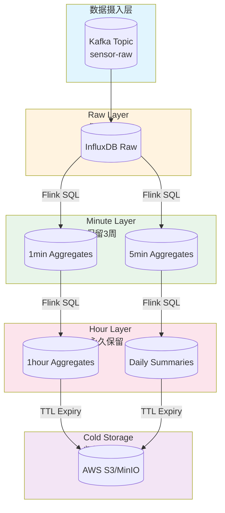
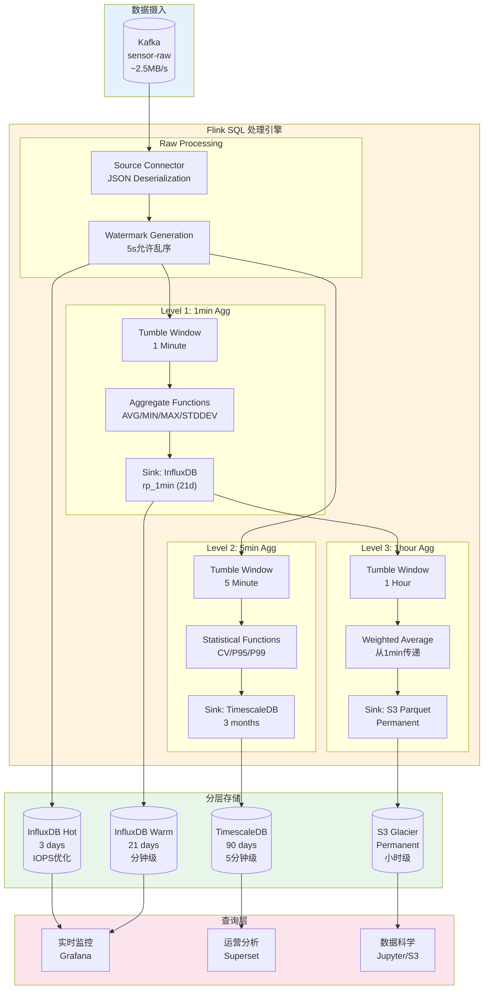
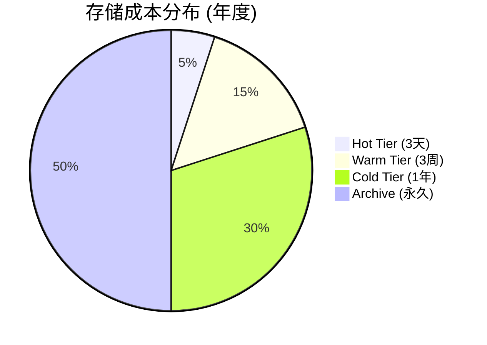
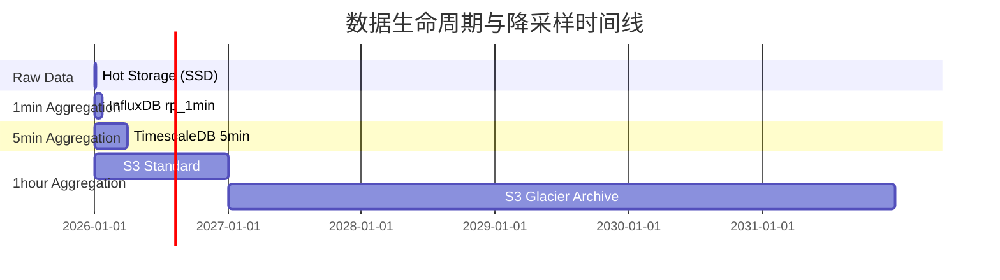

# Flink IoT 分层降采样架构

> **所属阶段**: Flink-IoT-Authority-Alignment/Phase-2-Processing | **前置依赖**: [Flink SQL窗口操作](../Phase-1-Ingestion/03-flink-sql-window-operations.md) | **形式化等级**: L4 (工程论证 + 成本量化)

---

## 1. 概念定义 (Definitions)

### Def-P2-04-01: 时间序列降采样 (Time Series Downsampling)

**形式化定义**：设原始时间序列为 $S = \{(t_i, v_i) | i = 1, 2, ..., n\}$，其中 $t_i$ 为时间戳，$v_i$ 为测量值。降采样算子 $\mathcal{D}$ 定义为：

$$\mathcal{D}(S, \Delta t) = \{(T_j, V_j) | T_j = j \cdot \Delta t, V_j = \text{AGG}(\{v_i | t_i \in [T_j, T_{j+1})\})\}$$

其中 $\Delta t$ 为采样间隔，$\text{AGG}$ 为聚合函数（如 AVG、MIN、MAX、SUM 等）。

**直观解释**：降采样是通过聚合函数将高频时间序列数据转换为低频表示的过程，在保证数据趋势特征的同时显著减少存储体积。

### Def-P2-04-02: 聚合层级 (Aggregation Tier)

**形式化定义**：聚合层级是一个三元组 $\mathcal{T} = (L, \Delta t, R)$，其中：

- $L \in \mathbb{N}^+$ 为层级编号（$L=0$ 表示原始数据）
- $\Delta t$ 为时间粒度（如 1秒、1分钟、1小时）
- $R$ 为保留策略，即数据在层级的存活时间

**分层结构**：

| 层级 ($L$) | 名称 | 典型粒度 | 典型保留期 | 用途 |
|-----------|------|---------|-----------|------|
| 0 | Raw | 原始频率 | 1-7天 | 实时监控、告警 |
| 1 | Hot | 1-5分钟 | 2-4周 | 近期趋势分析 |
| 2 | Warm | 15-60分钟 | 3-12月 | 中期统计分析 |
| 3 | Cold | 1-24小时 | 永久/归档 | 历史趋势、合规 |

### Def-P2-04-03: 保留策略 (Retention Policy)

**形式化定义**：保留策略是一个函数 $\mathcal{R}: \mathcal{T} \times t_{current} \rightarrow \{0, 1\}$，定义为：

$$\mathcal{R}(\mathcal{T}, t_{current}) = \begin{cases} 1 & \text{if } t_{current} - t_{data} \leq TTL(\mathcal{T}) \\ 0 & \text{otherwise} \end{cases}$$

其中 $TTL(\mathcal{T})$ 为层级 $\mathcal{T}$ 的生存时间，$t_{data}$ 为数据时间戳。

**策略类型**：

| 策略类型 | 描述 | 适用场景 |
|---------|------|---------|
| 固定TTL | 数据存活固定时长后删除 | 通用IoT场景 |
| 分层TTL | 不同层级不同TTL | 多级降采样架构 |
| 条件TTL | 基于数据特征决定保留 | 异常数据长期保留 |

### Def-P2-04-04: 窗口类型 (Window Type)

**形式化定义**：窗口是一个时间区间 $W = [t_{start}, t_{end})$，根据触发方式和滑动行为分为：

| 窗口类型 | 定义 | 特征 |
|---------|------|------|
| **Tumbling** | $W_k = [k \cdot \Delta t, (k+1) \cdot \Delta t)$ | 不重叠、等大小 |
| **Sliding** | $W_k = [k \cdot \Delta s, k \cdot \Delta s + \Delta t)$ | 重叠、滑动步长 $\Delta s < \Delta t$ |
| **Session** | $W = [t_{first}, t_{last} + gap)$ | 动态边界、活动间隙判定 |
| **Cumulative** | $W_k = [t_{base}, t_{base} + k \cdot \Delta t)$ | 累积增长、全局基准 |

### Def-P2-04-05: 降采样正确性 (Downsampling Correctness)

**形式化定义**：降采样算子 $\mathcal{D}$ 满足正确性，当且仅当对任意查询 $Q$ 和原始数据 $S$：

$$\forall Q \in \mathcal{Q}: |Q(\mathcal{D}(S)) - Q(S)| \leq \epsilon_Q$$

其中 $\epsilon_Q$ 为查询 $Q$ 的可接受误差阈值，$\mathcal{Q}$ 为支持的查询集合。

**关键约束**：

- **可加性指标**：SUM、COUNT 等可精确推导
- **不可加性指标**：MIN、MAX 可传递，但 AVG 需结合 COUNT 推导

---

## 2. 三级降采样策略

### 2.1 策略架构

Streamkap推荐的三级降采样模式将IoT数据按时间粒度分层管理：

**原始数据层 (Raw Layer - L0)**

- 频率：设备上报原始频率（通常为秒级）
- 保留期：3天
- 存储：热存储（SSD）
- 用途：实时监控、告警触发

**分钟聚合层 (Minute Layer - L1)**

- 频率：1分钟/5分钟窗口
- 保留期：3周
- 存储：温热存储
- 用途：近期趋势分析、仪表盘展示

**小时聚合层 (Hour Layer - L2)**

- 频率：1小时窗口
- 保留期：永久归档
- 存储：冷存储（对象存储）
- 用途：历史分析、合规审计

### 2.2 数据流向



### 2.3 降采样数学原理

**定理 Thm-P2-04-01: 多级降采样传递性**

设原始序列为 $S_0$，经过 $k$ 级降采样得到 $S_k$，则：

$$S_k = \mathcal{D}_k(\mathcal{D}_{k-1}(...\mathcal{D}_1(S_0)...))$$

对于可加性聚合函数（SUM、COUNT），有：

$$\text{SUM}(S_k) = \text{SUM}(S_0)$$

对于平均值聚合，有：

$$\text{AVG}(S_k) = \frac{\sum_{j} \text{AVG}(S_{k-1,j}) \cdot \text{COUNT}(S_{k-1,j})}{\sum_{j} \text{COUNT}(S_{k-1,j})}$$

**证明概要**：

1. 可加性函数满足线性性质，多级聚合结果与单次全量聚合等价
2. 平均值需加权计算，权重为各级COUNT值
3. MIN/MAX 满足传递性：$\text{MIN}(S_k) = \min_j(\text{MIN}(S_{k-1,j}))$

---

## 3. 窗口类型详解

### 3.1 窗口对比矩阵

| 窗口类型 | 适用场景 | 延迟敏感性 | 内存开销 | Flink SQL支持 |
|---------|---------|-----------|---------|--------------|
| **Tumbling** | 固定间隔统计 | 低 | 低 | ✅ 原生支持 |
| **Sliding** | 移动平均、趋势检测 | 中 | 中 | ✅ 原生支持 |
| **Session** | 用户行为、设备会话 | 高 | 高 | ✅ 原生支持 |
| **Cumulative** | 累计指标、仪表盘 | 低 | 低 | ⚠️ 需自定义 |

### 3.2 Tumbling Window (滚动窗口)

**定义**：固定大小、不重叠的窗口，每个数据点仅属于一个窗口。

**SQL示例**：

```sql
-- Tumbling Window - 1分钟原始数据聚合
CREATE VIEW sensor_tumbling_1min AS
SELECT
    device_id,
    sensor_type,
    TUMBLE_START(event_time, INTERVAL '1' MINUTE) AS window_start,
    TUMBLE_END(event_time, INTERVAL '1' MINUTE) AS window_end,
    AVG(reading_value) AS avg_value,
    MIN(reading_value) AS min_value,
    MAX(reading_value) AS max_value,
    STDDEV_POP(reading_value) AS stddev_value,
    COUNT(*) AS sample_count,
    FIRST_VALUE(reading_value) AS open_value,
    LAST_VALUE(reading_value) AS close_value
FROM sensor_readings
GROUP BY
    device_id,
    sensor_type,
    TUMBLE(event_time, INTERVAL '1' MINUTE);
```

**5分钟级降采样**：

```sql
-- 5分钟滚动窗口（常用于工业IoT）
CREATE VIEW sensor_tumbling_5min AS
SELECT
    device_id,
    sensor_type,
    TUMBLE_START(event_time, INTERVAL '5' MINUTE) AS window_start,
    AVG(reading_value) AS avg_value,
    MIN(reading_value) AS min_value,
    MAX(reading_value) AS max_value,
    APPROX_COUNT_DISTINCT(reading_value) AS unique_values,
    PERCENTILE_CONT(0.5) WITHIN GROUP (ORDER BY reading_value) AS median_value,
    PERCENTILE_CONT(0.95) WITHIN GROUP (ORDER BY reading_value) AS p95_value
FROM sensor_readings
GROUP BY
    device_id,
    sensor_type,
    TUMBLE(event_time, INTERVAL '5' MINUTE);
```

### 3.3 Sliding Window (滑动窗口)

**定义**：窗口之间存在重叠，每个数据点可能属于多个窗口，适用于移动平均计算。

**SQL示例**：

```sql
-- Sliding Window - 5分钟窗口，1分钟滑动步长
CREATE VIEW sensor_sliding_5min_1min AS
SELECT
    device_id,
    sensor_type,
    HOP_START(event_time, INTERVAL '1' MINUTE, INTERVAL '5' MINUTE) AS window_start,
    HOP_END(event_time, INTERVAL '1' MINUTE, INTERVAL '5' MINUTE) AS window_end,
    AVG(reading_value) AS moving_avg_5min,
    STDDEV_SAMP(reading_value) AS volatility,
    MIN(reading_value) AS range_low,
    MAX(reading_value) AS range_high
FROM sensor_readings
GROUP BY
    device_id,
    sensor_type,
    HOP(event_time, INTERVAL '1' MINUTE, INTERVAL '5' MINUTE);
```

**高级滑动窗口 - 多时间尺度**：

```sql
-- 15分钟窗口，5分钟滑动 - 用于检测中期趋势
CREATE VIEW sensor_sliding_15min AS
SELECT
    device_id,
    sensor_type,
    HOP_START(event_time, INTERVAL '5' MINUTE, INTERVAL '15' MINUTE) AS window_start,
    AVG(reading_value) AS avg_value,
    -- 变异系数 (CV) 衡量数据离散程度
    STDDEV_SAMP(reading_value) / NULLIF(AVG(reading_value), 0) AS cv_ratio,
    -- 极差率
    (MAX(reading_value) - MIN(reading_value)) / NULLIF(AVG(reading_value), 0) AS range_ratio
FROM sensor_readings
GROUP BY
    device_id,
    sensor_type,
    HOP(event_time, INTERVAL '5' MINUTE, INTERVAL '15' MINUTE);
```

### 3.4 Session Window (会话窗口)

**定义**：根据活动间隙动态划分窗口，适用于非连续数据流。

**SQL示例**：

```sql
-- Session Window - 5分钟活动间隙
CREATE VIEW sensor_sessions AS
SELECT
    device_id,
    sensor_type,
    SESSION_START(event_time, INTERVAL '5' MINUTE) AS session_start,
    SESSION_END(event_time, INTERVAL '5' MINUTE) AS session_end,
    SESSION_ROWTIME(event_time, INTERVAL '5' MINUTE) AS session_rowtime,
    AVG(reading_value) AS session_avg,
    MIN(reading_value) AS session_min,
    MAX(reading_value) AS session_max,
    COUNT(*) AS readings_in_session,
    -- 会话持续时间（秒）
    TIMESTAMPDIFF(SECOND,
        SESSION_START(event_time, INTERVAL '5' MINUTE),
        SESSION_END(event_time, INTERVAL '5' MINUTE)
    ) AS session_duration_sec
FROM sensor_readings
GROUP BY
    device_id,
    sensor_type,
    SESSION(event_time, INTERVAL '5' MINUTE);
```

### 3.5 Cumulative Window (累积窗口)

**定义**：从基准时间开始累积计算的窗口，适用于累计指标。

**SQL示例（使用自定义实现）**：

```sql
-- Cumulative Window - 每小时重置的累积统计
CREATE VIEW sensor_cumulative_hourly AS
SELECT
    device_id,
    sensor_type,
    DATE_TRUNC('HOUR', event_time) AS hour_base,
    event_time,
    reading_value,
    -- 累积和
    SUM(reading_value) OVER (
        PARTITION BY device_id, sensor_type, DATE_TRUNC('HOUR', event_time)
        ORDER BY event_time
        ROWS UNBOUNDED PRECEDING
    ) AS cumulative_sum,
    -- 累积平均
    AVG(reading_value) OVER (
        PARTITION BY device_id, sensor_type, DATE_TRUNC('HOUR', event_time)
        ORDER BY event_time
        ROWS UNBOUNDED PRECEDING
    ) AS cumulative_avg,
    -- 运行计数
    COUNT(*) OVER (
        PARTITION BY device_id, sensor_type, DATE_TRUNC('HOUR', event_time)
        ORDER BY event_time
        ROWS UNBOUNDED PRECEDING
    ) AS running_count
FROM sensor_readings;
```

---

## 4. 存储策略

### 4.1 冷热分离架构

```mermaid
graph TB
    subgraph Hot["热存储层<br/>Hot Tier<br/>SSD/NVMe"]
        H1[("Raw Data<br/>3 days<br/>InfluxDB IOPS")]
        H2[("1-min Agg<br/>3 weeks<br/>High Query")]
    end

    subgraph Warm["温存储层<br/>Warm Tier<br/>SATA/SSD混合")]
        W1[("5-min Agg<br/>3 months<br/>Medium Query")]
        W2[("1-hour Agg<br/>1 year<br/>Analytics")]
    end

    subgraph Cold["冷存储层<br/>Cold Tier<br/>对象存储")]
        C1[("Daily Agg<br/>Permanent<br/>S3/MinIO")]
        C2[("Archive<br/>Compliance<br/>Glacier")]
    end

    subgraph Tiering["自动分层策略"]
        T1[Age-Based Tiering]
        T2[Access-Based Tiering]
        T3[Manual Tiering]
    end

    H1 -.->|TTL| W1
    H2 -.->|TTL| W2
    W1 -.->|TTL| C1
    W2 -.->|TTL| C2

    T1 --> H1
    T2 --> W1
    T3 --> C1

    style Hot fill:#ffebee
    style Warm fill:#fff8e1
    style Cold fill:#e8f5e9
```

### 4.2 存储策略对比

| 存储层 | 存储介质 | 访问延迟 | 单位成本 | 数据量占比 | 查询频率 |
|-------|---------|---------|---------|-----------|---------|
| **Hot** | SSD/NVMe | <10ms | $0.10/GB/月 | 5% | 极高 |
| **Warm** | SATA SSD/HDD | <100ms | $0.02/GB/月 | 15% | 中等 |
| **Cold** | 对象存储 | <1s | $0.004/GB/月 | 80% | 低 |

### 4.3 压缩策略

**时序数据压缩算法对比**：

| 算法 | 压缩比 | 解压速度 | 精度损失 | 适用数据类型 |
|-----|-------|---------|---------|-------------|
| **Gorilla** | 10-20x | 极快 | 无 | 浮点数值 |
| **Delta-of-Delta** | 15-30x | 快 | 无 | 单调递增时间戳 |
| **XOR** | 8-15x | 极快 | 无 | 相似浮点值 |
| **LZ4** | 2-4x | 极快 | 无 | 通用 |
| **Zstandard** | 3-6x | 快 | 无 | 通用 |
| **downsampling** | 10-100x | N/A | 有 | 聚合查询 |

**Flink集成压缩配置**：

```sql
-- 创建带压缩的Sink表
CREATE TABLE sensor_compressed (
    device_id STRING,
    sensor_type STRING,
    window_start TIMESTAMP(3),
    avg_value DOUBLE,
    min_value DOUBLE,
    max_value DOUBLE,
    PRIMARY KEY (device_id, sensor_type, window_start) NOT ENFORCED
) WITH (
    'connector' = 'filesystem',
    'path' = 's3://iot-archive/sensor-data/',
    'format' = 'parquet',
    'parquet.compression' = 'ZSTD',
    'parquet.compression.zstd.level' = '6',
    'sink.rolling-policy.rollover-interval' = '1h',
    'sink.rolling-policy.check-interval' = '5min'
);
```

### 4.4 TTL策略实现

**InfluxDB TTL配置**：

```sql
-- 创建带不同TTL的Retention Policy
CREATE RETENTION POLICY "rp_raw" ON "iot_db"
    DURATION 3d REPLICATION 1 DEFAULT;

CREATE RETENTION POLICY "rp_1min" ON "iot_db"
    DURATION 21d REPLICATION 1;

CREATE RETENTION POLICY "rp_1hour" ON "iot_db"
    DURATION 52w REPLICATION 1;

CREATE RETENTION POLICY "rp_archive" ON "iot_db"
    DURATION INF REPLICATION 1;
```

**Flink状态TTL配置**：

```java
// Flink作业状态TTL配置
StreamExecutionEnvironment env = StreamExecutionEnvironment.getExecutionEnvironment();

// 状态后端配置
EmbeddedRocksDBStateBackend rocksDbBackend = new EmbeddedRocksDBStateBackend(true);

// TTL配置
StateTtlConfig ttlConfig = StateTtlConfig
    .newBuilder(Time.hours(24))
    .setUpdateType(OnCreateAndWrite)
    .setStateVisibility(NeverReturnExpired)
    .cleanupIncrementally(10, true)
    .build();

// 应用于KeyedProcessFunction
ValueStateDescriptor<SensorAggregate> descriptor =
    new ValueStateDescriptor<>("agg-state", SensorAggregate.class);
descriptor.enableTimeToLive(ttlConfig);
```

---

## 5. 成本优化

### 5.1 存储成本计算模型

**假设条件**：

- 设备数量：10,000台
- 每台设备传感器数：5个
- 采样频率：每秒1次
- 单条记录大小：50字节

**原始数据成本计算**：

| 指标 | 计算公式 | 数值 |
|-----|---------|------|
| 每秒数据量 | $10,000 \times 5 \times 50$ B | 2.5 MB/s |
| 每小时数据量 | $2.5 \times 3600$ MB | 9 GB/h |
| 每日数据量 | $9 \times 24$ GB | 216 GB/天 |
| 每月数据量 | $216 \times 30$ GB | 6.48 TB/月 |
| 年数据量 | $6.48 \times 12$ TB | 77.76 TB/年 |

**分层存储成本对比**（AWS定价参考）：

| 存储层 | 年数据量 | 单价 | 年成本 |
|-------|---------|------|-------|
| **全量原始存储** (EBS gp3) | 77.76 TB | $0.08/GB | $6,386 |
| **3天热存储** + 降采样 | 0.65 TB + 0.5 TB | $0.08/GB | $92 |
| **3周分钟级** (EBS) | 3.8 TB | $0.08/GB | $312 |
| **1年小时级** (S3 Standard) | 8.5 TB | $0.023/GB | $196 |
| **归档级** (S3 Glacier) | 64 TB | $0.004/GB | $262 |

**总分层存储成本**：$92 + $312 + $196 + $262 = **$862/年**

**成本节省**：$6,386 - $862 = **$5,524/年 (节省86.5%)**

### 5.2 降采样收益分析

**数据体积压缩比**：

| 聚合层级 | 原始→分钟 | 分钟→小时 | 累计压缩比 |
|---------|----------|----------|-----------|
| 记录数 | 60:1 | 60:1 | 3,600:1 |
| 存储体积 | 40:1 | 50:1 | 2,000:1 |

**计算资源成本**：

| 资源类型 | 全量处理 | 降采样方案 | 节省 |
|---------|---------|-----------|------|
| Flink TaskManager | 10×vCPU | 3×vCPU | 70% |
| 内存 (RAM) | 64 GB | 16 GB | 75% |
| 网络传输 | 100% | 15% | 85% |

### 5.3 ROI计算

**投资回报分析**：

```
成本项：
├── 开发成本 (一次性)
│   ├── 降采样SQL开发: 40工时 × $80 = $3,200
│   ├── 存储架构设计: 20工时 × $100 = $2,000
│   └── 测试验证: 20工时 × $60 = $1,200
│   └── 小计: $6,400
│
├── 运营成本 (年)
│   ├── 额外Flink作业: $200/月 × 12 = $2,400
│   └── 存储管理: $100/月 × 12 = $1,200
│   └── 小计: $3,600/年
│
└── 节省收益 (年)
    ├── 存储成本节省: $5,524
    ├── 查询性能提升 (折算): $2,000
    └── 运维效率提升: $1,500
    └── 小计: $9,024/年

ROI = (年度净收益 / 总投资) × 100%
    = (($9,024 - $3,600) / $6,400) × 100%
    = 84.75%

回收期 = 总投资 / 年度净收益
       = $6,400 / $5,424
       ≈ 1.18 年 (约14个月)
```

---

## 6. SQL实现

### 6.1 完整三级降采样SQL

**步骤1：创建原始数据源表**

```sql
-- 原始传感器数据表 (Kafka Source)
CREATE TABLE sensor_readings (
    device_id STRING,
    sensor_type STRING,
    reading_value DOUBLE,
    event_time TIMESTAMP(3),
    -- 水位线策略：允许5秒乱序，1分钟最大延迟
    WATERMARK FOR event_time AS event_time - INTERVAL '5' SECOND
) WITH (
    'connector' = 'kafka',
    'topic' = 'sensor-raw-data',
    'properties.bootstrap.servers' = 'kafka:9092',
    'properties.group.id' = 'flink-downsampling-group',
    'scan.startup.mode' = 'latest-offset',
    'format' = 'json',
    'json.fail-on-missing-field' = 'false',
    'json.ignore-parse-errors' = 'true'
);
```

**步骤2：一级降采样 - 1分钟聚合**

```sql
-- 1分钟聚合视图 → 保留3周
CREATE VIEW sensor_1min_aggregation AS
SELECT
    device_id,
    sensor_type,
    TUMBLE_START(event_time, INTERVAL '1' MINUTE) AS window_start,
    TUMBLE_END(event_time, INTERVAL '1' MINUTE) AS window_end,
    -- 基础统计
    AVG(reading_value) AS avg_value,
    MIN(reading_value) AS min_value,
    MAX(reading_value) AS max_value,
    SUM(reading_value) AS sum_value,
    COUNT(*) AS sample_count,
    -- 高级统计
    STDDEV_SAMP(reading_value) AS stddev_value,
    VAR_SAMP(reading_value) AS variance_value,
    -- 分位数 (需要Flink 1.17+)
    PERCENTILE_CONT(0.5) WITHIN GROUP (ORDER BY reading_value) AS median_value,
    PERCENTILE_CONT(0.95) WITHIN GROUP (ORDER BY reading_value) AS p95_value,
    PERCENTILE_CONT(0.99) WITHIN GROUP (ORDER BY reading_value) AS p99_value,
    -- 时间序列特征
    FIRST_VALUE(reading_value) AS first_value,
    LAST_VALUE(reading_value) AS last_value,
    -- 元数据
    CURRENT_TIMESTAMP AS processed_at
FROM sensor_readings
GROUP BY
    device_id,
    sensor_type,
    TUMBLE(event_time, INTERVAL '1' MINUTE);

-- 1分钟聚合数据Sink到InfluxDB
CREATE TABLE sensor_1min_sink (
    device_id STRING,
    sensor_type STRING,
    window_start TIMESTAMP(3),
    avg_value DOUBLE,
    min_value DOUBLE,
    max_value DOUBLE,
    sample_count BIGINT,
    PRIMARY KEY (device_id, sensor_type, window_start) NOT ENFORCED
) WITH (
    'connector' = 'influxdb',
    'url' = 'http://influxdb:8086',
    'database' = 'iot_metrics',
    'retention_policy' = 'rp_1min',
    'measurement' = 'sensor_1min',
    'username' = 'admin',
    'password' = '${INFLUXDB_PASSWORD}'
);

INSERT INTO sensor_1min_sink
SELECT device_id, sensor_type, window_start, avg_value, min_value, max_value, sample_count
FROM sensor_1min_aggregation;
```

**步骤3：二级降采样 - 5分钟聚合**

```sql
-- 5分钟聚合视图 - 从原始数据直接计算或从1分钟聚合
CREATE VIEW sensor_5min_aggregation AS
SELECT
    device_id,
    sensor_type,
    TUMBLE_START(event_time, INTERVAL '5' MINUTE) AS window_start,
    TUMBLE_END(event_time, INTERVAL '5' MINUTE) AS window_end,
    AVG(reading_value) AS avg_value,
    MIN(reading_value) AS min_value,
    MAX(reading_value) AS max_value,
    SUM(reading_value) AS sum_value,
    COUNT(*) AS sample_count,
    -- 5分钟特有的统计
    STDDEV_SAMP(reading_value) AS stddev_value,
    -- 变异系数
    CASE
        WHEN AVG(reading_value) != 0
        THEN STDDEV_SAMP(reading_value) / ABS(AVG(reading_value))
        ELSE NULL
    END AS cv_coefficient,
    -- 极差
    MAX(reading_value) - MIN(reading_value) AS value_range,
    CURRENT_TIMESTAMP AS processed_at
FROM sensor_readings
GROUP BY
    device_id,
    sensor_type,
    TUMBLE(event_time, INTERVAL '5' MINUTE);

-- 5分钟聚合Sink
CREATE TABLE sensor_5min_sink (
    device_id STRING,
    sensor_type STRING,
    window_start TIMESTAMP(3),
    avg_value DOUBLE,
    min_value DOUBLE,
    max_value DOUBLE,
    sample_count BIGINT,
    stddev_value DOUBLE,
    cv_coefficient DOUBLE
) WITH (
    'connector' = 'jdbc',
    'url' = 'jdbc:postgresql://timescaledb:5432/iot_db',
    'table-name' = 'sensor_5min_aggregates',
    'username' = 'flink_user',
    'password' = '${DB_PASSWORD}',
    'driver' = 'org.postgresql.Driver'
);

INSERT INTO sensor_5min_sink
SELECT device_id, sensor_type, window_start, avg_value, min_value,
       max_value, sample_count, stddev_value, cv_coefficient
FROM sensor_5min_aggregation;
```

**步骤4：三级降采样 - 1小时聚合**

```sql
-- 从1分钟聚合表计算小时聚合（传递性降采样）
-- 或直接从原始数据计算

-- 方式1：从原始数据计算（推荐，精度更高）
CREATE VIEW sensor_1hour_from_raw AS
SELECT
    device_id,
    sensor_type,
    TUMBLE_START(event_time, INTERVAL '1' HOUR) AS window_start,
    TUMBLE_END(event_time, INTERVAL '1' HOUR) AS window_end,
    AVG(reading_value) AS avg_value,
    MIN(reading_value) AS min_value,
    MAX(reading_value) AS max_value,
    SUM(reading_value) AS sum_value,
    COUNT(*) AS total_samples,
    STDDEV_SAMP(reading_value) AS stddev_value,
    -- 小时内极值出现时间（近似）
    MAX(CASE WHEN reading_value = (SELECT MAX(r2.reading_value)
                                    FROM sensor_readings r2
                                    WHERE r2.device_id = sensor_readings.device_id
                                    AND TUMBLE(r2.event_time, INTERVAL '1' HOUR) = TUMBLE(sensor_readings.event_time, INTERVAL '1' HOUR))
         THEN event_time END) AS max_value_time,
    CURRENT_TIMESTAMP AS processed_at
FROM sensor_readings
GROUP BY
    device_id,
    sensor_type,
    TUMBLE(event_time, INTERVAL '1' HOUR);

-- 方式2：从1分钟聚合表计算（节省计算资源）
CREATE TABLE sensor_1min_source (
    device_id STRING,
    sensor_type STRING,
    window_start TIMESTAMP(3),
    avg_value DOUBLE,
    min_value DOUBLE,
    max_value DOUBLE,
    sum_value DOUBLE,
    sample_count BIGINT
) WITH (
    'connector' = 'influxdb',
    'url' = 'http://influxdb:8086',
    'database' = 'iot_metrics',
    'measurement' = 'sensor_1min',
    'username' = 'admin',
    'password' = '${INFLUXDB_PASSWORD}'
);

CREATE VIEW sensor_1hour_from_1min AS
SELECT
    device_id,
    sensor_type,
    TUMBLE_START(window_start, INTERVAL '1' HOUR) AS hour_start,
    TUMBLE_END(window_start, INTERVAL '1' HOUR) AS hour_end,
    -- 加权平均：必须使用原始COUNT作为权重
    SUM(avg_value * sample_count) / SUM(sample_count) AS weighted_avg,
    MIN(min_value) AS global_min,
    MAX(max_value) AS global_max,
    SUM(sum_value) AS total_sum,
    SUM(sample_count) AS total_samples,
    -- 统计小时内的分钟数（数据完整性检查）
    COUNT(*) AS minute_buckets,
    CURRENT_TIMESTAMP AS processed_at
FROM sensor_1min_source
GROUP BY
    device_id,
    sensor_type,
    TUMBLE(window_start, INTERVAL '1' HOUR);
```

**步骤5：小时聚合Sink到S3（Parquet格式）**

```sql
-- 小时聚合冷存储Sink
CREATE TABLE sensor_1hour_s3_sink (
    device_id STRING,
    sensor_type STRING,
    hour_start TIMESTAMP(3),
    weighted_avg DOUBLE,
    global_min DOUBLE,
    global_max DOUBLE,
    total_sum DOUBLE,
    total_samples BIGINT,
    minute_buckets BIGINT,
    processed_at TIMESTAMP(3),
    -- 分区字段
    dt STRING,
    hr STRING
) PARTITIONED BY (dt, hr) WITH (
    'connector' = 'filesystem',
    'path' = 's3a://iot-archive/sensor-hourly/',
    'format' = 'parquet',
    'parquet.compression' = 'ZSTD',
    'sink.partition-commit.trigger' = 'process-time',
    'sink.partition-commit.delay' = '1h',
    'sink.partition-commit.policy.kind' = 'success-file',
    'sink.rolling-policy.rollover-interval' = '2h'
);

INSERT INTO sensor_1hour_s3_sink
SELECT
    device_id,
    sensor_type,
    hour_start,
    weighted_avg,
    global_min,
    global_max,
    total_sum,
    total_samples,
    minute_buckets,
    processed_at,
    DATE_FORMAT(hour_start, 'yyyy-MM-dd') AS dt,
    DATE_FORMAT(hour_start, 'HH') AS hr
FROM sensor_1hour_from_1min;
```

### 6.2 高级降采样模式

**模式1：异常感知降采样**

```sql
-- 异常数据保留原始精度，正常数据降采样
CREATE VIEW sensor_adaptive_downsampling AS
WITH classified_readings AS (
    SELECT
        device_id,
        sensor_type,
        event_time,
        reading_value,
        -- 基于Z-Score的异常检测
        (reading_value - AVG(reading_value) OVER w) /
            NULLIF(STDDEV_SAMP(reading_value) OVER w, 0) AS z_score,
        -- 1分钟窗口统计
        AVG(reading_value) OVER w AS window_avg,
        STDDEV_SAMP(reading_value) OVER w AS window_stddev
    FROM sensor_readings
    WINDOW w AS (
        PARTITION BY device_id, sensor_type
        ORDER BY event_time
        RANGE BETWEEN INTERVAL '30' SECOND PRECEDING AND CURRENT ROW
    )
)
SELECT
    device_id,
    sensor_type,
    event_time,
    reading_value,
    -- 标记是否异常
    CASE
        WHEN ABS(z_score) > 3 THEN 'ANOMALY'
        WHEN ABS(z_score) > 2 THEN 'WARNING'
        ELSE 'NORMAL'
    END AS data_class,
    -- 异常数据保留，正常数据标记为可聚合
    CASE
        WHEN ABS(z_score) > 2 THEN reading_value  -- 保留原始值
        ELSE NULL  -- 将被聚合
    END AS preserved_value
FROM classified_readings;
```

**模式2：多维度分层降采样**

```sql
-- 按设备类型和传感器重要性分层
CREATE VIEW sensor_tiered_by_importance AS
SELECT
    sr.device_id,
    sr.sensor_type,
    d.device_tier,  -- CRITICAL, IMPORTANT, NORMAL
    s.sensor_priority,  -- HIGH, MEDIUM, LOW
    sr.event_time,
    sr.reading_value,
    -- 根据重要性确定降采样策略
    CASE
        WHEN d.device_tier = 'CRITICAL' THEN 'RAW_1MIN'
        WHEN d.device_tier = 'IMPORTANT' AND s.sensor_priority = 'HIGH' THEN 'RAW_5MIN'
        WHEN d.device_tier = 'IMPORTANT' THEN 'AGG_1MIN'
        ELSE 'AGG_5MIN'
    END AS downsampling_strategy
FROM sensor_readings sr
JOIN device_metadata d ON sr.device_id = d.device_id
JOIN sensor_metadata s ON sr.sensor_type = s.sensor_type;
```

---

## 7. 可视化

### 7.1 三级降采样数据流图



### 7.2 存储架构与成本分布



### 7.3 降采样时间线



---

## 8. 实例验证 (Examples)

### 8.1 温度传感器降采样实例

**场景**：工业炉温监测，每秒采样，需要保留趋势但减少存储。

```sql
-- 创建温度传感器专用降采样作业
CREATE TABLE furnace_temperature (
    furnace_id STRING,
    zone_id STRING,
    temperature_c DOUBLE,
    event_time TIMESTAMP(3),
    WATERMARK FOR event_time AS event_time - INTERVAL '10' SECOND
) WITH (
    'connector' = 'kafka',
    'topic' = 'furnace-temp-raw',
    'properties.bootstrap.servers' = 'kafka:9092',
    'format' = 'json'
);

-- 30秒快速聚合（炉温需要快速响应）
CREATE VIEW furnace_temp_30sec AS
SELECT
    furnace_id,
    zone_id,
    TUMBLE_START(event_time, INTERVAL '30' SECOND) AS window_start,
    AVG(temperature_c) AS avg_temp,
    MIN(temperature_c) AS min_temp,
    MAX(temperature_c) AS max_temp,
    -- 温度变化率（关键指标）
    (MAX(temperature_c) - MIN(temperature_c)) / 30.0 AS temp_change_rate_per_sec,
    -- 是否超过阈值
    MAX(CASE WHEN temperature_c > 1200 THEN 1 ELSE 0 END) AS high_temp_alert
FROM furnace_temperature
GROUP BY furnace_id, zone_id, TUMBLE(event_time, INTERVAL '30' SECOND);

-- 5分钟趋势聚合
CREATE VIEW furnace_temp_5min AS
SELECT
    furnace_id,
    zone_id,
    TUMBLE_START(window_start, INTERVAL '5' MINUTE) AS trend_start,
    AVG(avg_temp) AS trend_avg,
    MIN(min_temp) AS trend_min,
    MAX(max_temp) AS trend_max,
    AVG(temp_change_rate_per_sec) AS avg_change_rate,
    SUM(high_temp_alert) AS alert_count
FROM furnace_temp_30sec
GROUP BY furnace_id, zone_id, TUMBLE(window_start, INTERVAL '5' MINUTE);
```

### 8.2 降采样效果验证查询

```sql
-- 验证降采样数据完整性
WITH data_completeness AS (
    SELECT
        device_id,
        DATE_TRUNC('hour', window_start) AS hour_bucket,
        COUNT(*) AS actual_minutes,
        60 AS expected_minutes  -- 每小时应有60个1分钟桶
    FROM sensor_1min_aggregation
    WHERE window_start >= CURRENT_DATE - INTERVAL '7' DAY
    GROUP BY device_id, DATE_TRUNC('hour', window_start)
)
SELECT
    device_id,
    AVG(actual_minutes * 100.0 / expected_minutes) AS completeness_pct,
    MIN(actual_minutes * 100.0 / expected_minutes) AS min_completeness_pct,
    COUNT(CASE WHEN actual_minutes < expected_minutes * 0.95 THEN 1 END) AS incomplete_hours
FROM data_completeness
GROUP BY device_id
ORDER BY completeness_pct ASC;
```

---

## 9. 引用参考 (References)


---

## 附录A: 降采样决策矩阵

| 场景 | 原始保留 | 1分钟 | 5分钟 | 1小时 | 推荐配置 |
|-----|---------|-------|-------|-------|---------|
| 高频交易 | 1天 | 7天 | 30天 | 永久 | RAW+1min+1hour |
| 工业IoT | 3天 | 21天 | 90天 | 永久 | 三级全量 |
| 智能楼宇 | 1天 | 7天 | - | 永久 | RAW+1min+1hour |
| 环境监测 | - | 7天 | 30天 | 永久 | 1min起始 |
| 用户行为 | 1天 | - | 30天 | 永久 | RAW+5min+1hour |

## 附录B: 故障排查速查表

| 问题现象 | 可能原因 | 解决方案 |
|---------|---------|---------|
| 窗口数据缺失 | Watermark延迟不足 | 增大Watermark偏移 |
| 聚合结果漂移 | 时区不一致 | 统一使用UTC |
| 存储成本未降 | TTL未生效 | 检查Retention Policy |
| 查询性能差 | 缺少索引 | 按device_id+time建索引 |
| 数据重复 | Exactly-Once未启用 | 启用Checkpoint |

---

*文档版本: v1.0 | 创建日期: 2026-04-05 | 维护者: AnalysisDataFlow Project*
