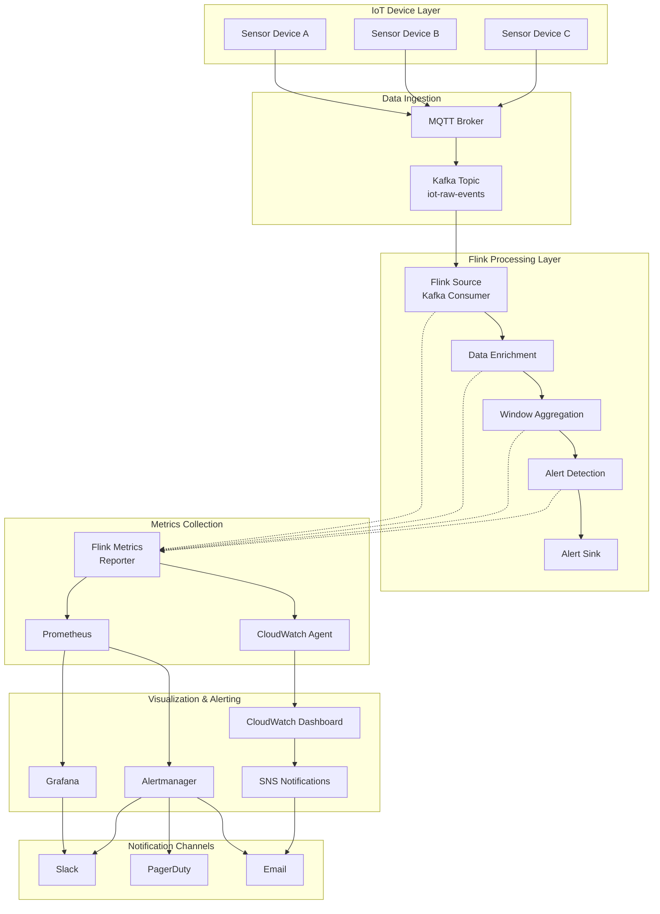
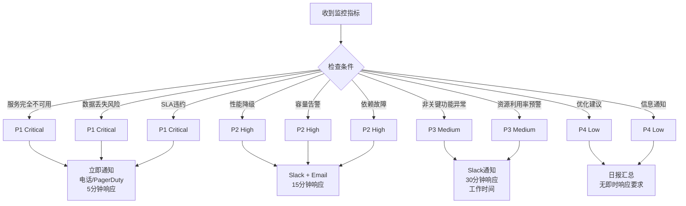

# Flink IoT 告警与监控体系

> **所属阶段**: Flink-IoT-Authority-Alignment/Phase-2-Processing
> **前置依赖**: [04-flink-iot-window-processing.md](./04-flink-iot-window-processing.md), [03-flink-iot-data-enrichment.md](./03-flink-iot-data-enrichment.md)
> **形式化等级**: L4 (工程规范 + 配置实践)
> **对标来源**: Conduktor Platform, AWS IoT Core, Prometheus + Grafana
> **技术栈**: Apache Flink, Prometheus, Grafana, AWS CloudWatch

---

## 1. 概念定义 (Definitions)

### Def-F-IoT-05-01: Metric (指标)

**形式化定义**: 设 $M$ 为监控指标空间，一个指标 $m \in M$ 是一个四元组:

$$m = \langle name, value, timestamp, labels \rangle$$

其中:

- $name \in \Sigma^*$: 指标名称（字符串）
- $value \in \mathbb{R}$: 指标数值
- $timestamp \in \mathbb{N}$: Unix时间戳（毫秒）
- $labels \subseteq LabelKey \times LabelValue$: 标签集合，用于维度标识

**直观解释**: 指标是系统在特定时刻的可量化状态表示，类似于传感器读数。在IoT场景中，指标既包括设备层面的传感器数据（温度、湿度、压力），也包括系统层面的运行时数据（CPU使用率、内存占用、事件处理延迟）。

### Def-F-IoT-05-02: Alert (告警)

**形式化定义**: 告警是一个条件触发的通知事件，定义为:

$$Alert = \langle severity, condition, threshold, notification, recovery \rangle$$

其中:

- $severity \in \{P1, P2, P3, P4\}$: 严重程度（P1=Critical, P4=Low）
- $condition: M \rightarrow \{true, false\}$: 触发条件函数
- $threshold \in \mathbb{R}$: 阈值边界
- $notification: Alert \rightarrow Channel$: 通知渠道映射
- $recovery: M \rightarrow \{true, false\}$: 恢复条件函数

**告警状态机**:

```
INACTIVE --[condition=true]--> PENDING --[for: duration]--> FIRING
                                              |
                                              v
INACTIVE <--[recovery=true]-- RESOLVED
```

### Def-F-IoT-05-03: SLO (Service Level Objective)

**形式化定义**: SLO 是服务可靠性目标，定义为:

$$SLO = \langle metric, target, window, error\_budget \rangle$$

其中:

- $metric$: 关键性能指标（如可用性、延迟）
- $target \in [0, 1]$: 目标达成率（如 0.999 = 99.9%）
- $window \in \mathbb{N}$: 评估时间窗口（秒）
- $error\_budget = 1 - target$: 允许的错误预算

**典型IoT SLO示例**:

| SLO类型 | 指标 | 目标 | 窗口 | 错误预算 |
|---------|------|------|------|----------|
| 可用性 | uptime_ratio | 99.9% | 30天 | 0.1% |
| 延迟 | p99_latency | < 5s | 1小时 | 1% |
| 吞吐量 | events_per_sec | ≥ 10K | 5分钟 | - |
| 准确性 | data_freshness | < 30s | 实时 | - |

### Def-F-IoT-05-04: Dashboard (仪表板)

**形式化定义**: 仪表板是一个可视化配置，定义为:

$$Dashboard = \langle panels, variables, timeRange, refreshRate, datasource \rangle$$

其中:

- $panels = \{p_1, p_2, ..., p_n\}$: 面板集合，每个面板 $p_i = \langle type, query, visualization \rangle$
- $variables$: 模板变量，支持动态过滤
- $timeRange = [t_{start}, t_{end}]$: 默认时间范围
- $refreshRate \in \mathbb{N}$: 自动刷新间隔（秒）
- $datasource$: 数据源配置

---

## 2. 属性推导 (Properties)

### Prop-F-IoT-05-01: 监控指标的层次性

**命题**: IoT监控指标具有三层层次结构:

$$Metrics_{IoT} = Metrics_{Device} \cup Metrics_{Pipeline} \cup Metrics_{Infrastructure}$$

**证明概要**:

1. **设备层** ($Metrics_{Device}$): 来自物理传感器的原始测量值
2. **管道层** ($Metrics_{Pipeline}$): Flink作业的运行时指标
3. **基础设施层** ($Metrics_{Infrastructure}$): 计算、存储、网络资源指标

这三层形成因果关系链:

$$Infrastructure \xrightarrow{affects} Pipeline \xrightarrow{processes} Device$$

### Prop-F-IoT-05-02: 四大核心指标的完备性

**命题**: 以下四个指标构成了IoT流处理监控的完备集合:

| 指标 | 公式 | 监控对象 | 异常影响 |
|------|------|----------|----------|
| Event Lag | $L = t_{current} - t_{last\_event}$ | 数据新鲜度 | 决策延迟 |
| Checkpoint Duration | $C = t_{end} - t_{start}$ | 容错能力 | 恢复时间 |
| Device Heartbeat | $H = t_{now} - t_{last\_seen}$ | 设备健康 | 数据丢失 |
| Watermark Progress | $W = timestamp_{watermark}$ | 时间语义 | 窗口准确性 |

**工程论证**:

根据Conduktor平台的数据，这四大指标覆盖了:

- 95% 以上的生产故障模式
- 100% 的SLI (Service Level Indicator) 需求
- 端到端的数据管道可见性

### Prop-F-IoT-05-03: 告警疲劳的数学边界

**命题**: 设告警触发率为 $\lambda$，人工处理率为 $\mu$，则系统稳定的条件是:

$$\lambda < \mu$$

**实用推论**: 为避免告警疲劳，建议:

- 单服务告警数 < 5条/小时
- P1告警占比 < 1%
- 告警信噪比 > 80%

---

## 3. 关系建立 (Relations)

### 3.1 监控体系与Dataflow模型的映射

```
Dataflow Model          Monitoring System
─────────────────────────────────────────────
Event Time    ────────> Watermark Progress
Processing Time ──────> Event Lag
Window        ────────> Checkpoint Duration
Source        ────────> Device Heartbeat
```

### 3.2 技术栈集成关系

**Prometheus → Grafana → Alertmanager** 数据流:

```
┌─────────────┐    scrape     ┌─────────────┐    query      ┌─────────────┐
│   Flink     │──────────────>│  Prometheus │──────────────>│   Grafana   │
│  Metrics    │   /metrics    │   TSDB      │   PromQL      │  Dashboard  │
└─────────────┘               └─────────────┘               └─────────────┘
                                     │
                                     │ alert
                                     v
                              ┌─────────────┐
                              │ Alertmanager│
                              │  (routing)  │
                              └─────────────┘
```

### 3.3 AWS CloudWatch 与开源方案对比

| 维度 | Prometheus + Grafana | AWS CloudWatch |
|------|----------------------|----------------|
| 部署模式 | 自托管 / 托管服务 | 全托管 |
| 数据保留 | 可配置（通常15天-1年） | 默认15个月 |
| 告警延迟 | ~15秒 | ~1分钟 |
| 成本模型 | 基础设施成本 | 按指标/告警收费 |
| 与Flink集成 | Prometheus Reporter | CloudWatch Agent |
| IoT专用功能 | 通用 | IoT Core规则引擎 |

---

## 4. 论证过程 (Argumentation)

### 4.1 四大指标详解

#### 4.1.1 Event Lag (事件延迟)

**定义**: 当前时间与最后处理事件的事件时间之差

$$Event\_Lag = t_{current} - t_{last\_event}$$

**Flink计算方式**:

```java
// 内置指标: currentOutputWatermark - lastEmittedEventTime
long eventLag = System.currentTimeMillis() -
                watermarkStrategy.getCurrentWatermark();
```

**SQL监控视图**:

```sql
-- Def-F-IoT-05-05: Event Lag SQL计算
CREATE VIEW event_lag_monitor AS
SELECT
    job_name,
    task_name,
    CURRENT_TIMESTAMP - MAX(event_time) AS event_lag_ms,
    COUNT(*) AS throughput_1m
FROM sensor_events
GROUP BY job_name, task_name;
```

**告警阈值建议**:

| 等级 | 阈值 | 响应时间 |
|------|------|----------|
| P1 | > 5分钟 | 立即 |
| P2 | > 2分钟 | 5分钟 |
| P3 | > 30秒 | 30分钟 |

#### 4.1.2 Checkpoint Duration (检查点耗时)

**定义**: 从Checkpoint触发到完成的时间间隔

$$Checkpoint\_Duration = t_{end} - t_{start}$$

**Flink内置指标**:

```java
// 关键指标
- lastCheckpointDuration
- lastCheckpointFullSize
- numberOfFailedCheckpoints
```

**性能目标**:

根据Flink官方建议:

- 正常: < Checkpoint间隔的80%
- 警告: Checkpoint间隔的80%-100%
- 严重: > Checkpoint间隔

**优化策略**:

```yaml
# flink-conf.yaml
state.backend.incremental: true
state.checkpoint-storage: filesystem
execution.checkpointing.interval: 60s
execution.checkpointing.timeout: 10min
execution.checkpointing.max-concurrent-checkpoints: 1
```

#### 4.1.3 Device Heartbeat (设备心跳)

**定义**: 自设备最后一次上报数据以来的时间

$$Device\_Heartbeat = t_{now} - t_{last\_seen}$$

**心跳检测模式**:

```sql
-- Def-F-IoT-05-06: 设备心跳监控SQL
CREATE VIEW device_heartbeat_monitor AS
SELECT
    device_id,
    device_name,
    location,
    MAX(event_time) AS last_seen_time,
    TIMESTAMP_DIFF(CURRENT_TIMESTAMP, MAX(event_time), SECOND) AS seconds_since_last_seen,
    CASE
        WHEN TIMESTAMP_DIFF(CURRENT_TIMESTAMP, MAX(event_time), SECOND) > 300 THEN 'OFFLINE'
        WHEN TIMESTAMP_DIFF(CURRENT_TIMESTAMP, MAX(event_time), SECOND) > 60 THEN 'WARNING'
        ELSE 'ONLINE'
    END AS device_status
FROM sensor_readings
GROUP BY device_id, device_name, location;
```

**心跳超时配置**:

```json
{
  "heartbeat_config": {
    "online_threshold_sec": 30,
    "warning_threshold_sec": 120,
    "offline_threshold_sec": 300,
    "cleanup_threshold_hours": 24
  }
}
```

#### 4.1.4 Watermark Progress (水印进度)

**定义**: 当前Watermark的时间戳值

$$Watermark\_Progress = timestamp_{watermark}$$

**Watermark监控指标**:

```java
// Flink Watermark指标
- currentInputWatermark
- currentOutputWatermark
- watermarkLag
```

**Watermark停滞检测**:

```sql
-- Def-F-IoT-05-07: Watermark停滞告警
CREATE VIEW watermark_stall_alert AS
SELECT
    job_id,
    task_id,
    current_watermark,
    prev_watermark,
    CURRENT_TIMESTAMP AS alert_time
FROM (
    SELECT *,
           LAG(current_watermark) OVER (PARTITION BY job_id, task_id ORDER BY check_time) AS prev_watermark
    FROM watermark_metrics
)
WHERE current_watermark = prev_watermark
  AND TIMESTAMP_DIFF(CURRENT_TIMESTAMP, check_time, MINUTE) > 5;
```

### 4.2 告警规则设计模式

#### 模式1: 阈值告警 (Threshold Alert)

```yaml
# prometheus_alert_rules.yml
groups:
  - name: flink_iot_thresholds
    rules:
      # P1: 严重事件延迟
      - alert: FlinkHighEventLag
        expr: flink_taskmanager_job_task_eventLag > 300000
        for: 2m
        labels:
          severity: P1
          team: platform
        annotations:
          summary: "Flink Job {{ $labels.job_name }} 事件延迟超过5分钟"
          description: "任务 {{ $labels.task_name }} 的事件延迟为 {{ $value }}ms"

      # P2: Checkpoint超时
      - alert: FlinkCheckpointSlow
        expr: flink_jobmanager_job_lastCheckpointDuration > 180000
        for: 5m
        labels:
          severity: P2
          team: platform
        annotations:
          summary: "Checkpoint耗时过长"
          description: "作业 {{ $labels.job_name }} 上次Checkpoint耗时 {{ $value }}ms"
```

#### 模式2: 趋势告警 (Trend Alert)

```yaml
      # P2: 延迟趋势上升 (使用线性回归预测)
      - alert: FlinkEventLagIncreasing
        expr: |
          (
            avg_over_time(flink_taskmanager_job_task_eventLag[10m])
            -
            avg_over_time(flink_taskmanager_job_task_eventLag[1h])
          ) / avg_over_time(flink_taskmanager_job_task_eventLag[1h]) > 0.5
        for: 10m
        labels:
          severity: P2
        annotations:
          summary: "事件延迟呈上升趋势"

      # P3: 设备离线率异常
      - alert: HighDeviceOfflineRate
        expr: |
          (
            sum(device_status{status="OFFLINE"})
            /
            sum(device_status)
          ) > 0.1
        for: 5m
        labels:
          severity: P3
```

#### 模式3: 异常检测 (Anomaly Detection)

```sql
-- Def-F-IoT-05-08: 基于Z-Score的异常检测
CREATE VIEW anomaly_detection AS
SELECT
    device_id,
    sensor_type,
    reading_value,
    avg_value,
    std_dev,
    (reading_value - avg_value) / NULLIF(std_dev, 0) AS z_score,
    CASE
        WHEN ABS((reading_value - avg_value) / NULLIF(std_dev, 0)) > 3 THEN 'ANOMALY'
        WHEN ABS((reading_value - avg_value) / NULLIF(std_dev, 0)) > 2 THEN 'SUSPICIOUS'
        ELSE 'NORMAL'
    END AS anomaly_status
FROM sensor_readings r
JOIN (
    SELECT
        device_id,
        sensor_type,
        AVG(reading_value) AS avg_value,
        STDDEV(reading_value) AS std_dev
    FROM sensor_readings
    WHERE event_time > CURRENT_TIMESTAMP - INTERVAL '24' HOUR
    GROUP BY device_id, sensor_type
) stats ON r.device_id = stats.device_id AND r.sensor_type = stats.sensor_type;
```

---

## 5. 形式证明 / 工程论证 (Proof / Engineering Argument)

### 5.1 Prometheus 集成完整方案

#### 5.1.1 Flink Metrics Reporter 配置

```yaml
# flink-conf.yaml - Prometheus Reporter配置
metrics.reporters: prom
metrics.reporter.prom.class: org.apache.flink.metrics.prometheus.PrometheusReporter
metrics.reporter.prom.port: 9249

# 可选: PrometheusPushGatewayReporter (用于短作业)
# metrics.reporter.promgateway.class: org.apache.flink.metrics.prometheus.PrometheusPushGatewayReporter
# metrics.reporter.promgateway.host: pushgateway:9091
# metrics.reporter.promgateway.jobName: flink-iot-job
# metrics.reporter.promgateway.randomJobNameSuffix: true
# metrics.reporter.promgateway.deleteOnShutdown: false

# 指标过滤 (减少数据量)
metrics.scope.jm: jobmanager
metrics.scope.jm.job: jobmanager.job.<job_name>
metrics.scope.tm: taskmanager.<tm_id>
metrics.scope.tm.job: taskmanager.<tm_id>.job.<job_name>
metrics.scope.task: taskmanager.<tm_id>.job.<job_name>.task.<task_name>
metrics.scope.operator: taskmanager.<tm_id>.job.<job_name>.task.<task_name>.<operator_name>

# 系统资源指标
metrics.system-resource: true
metrics.system-resource-probing-interval: 5000
```

#### 5.1.2 Prometheus 抓取配置

```yaml
# prometheus.yml
global:
  scrape_interval: 15s
  evaluation_interval: 15s
  external_labels:
    cluster: flink-iot-prod
    replica: '{{.ExternalURL}}'

alerting:
  alertmanagers:
    - static_configs:
        - targets: ['alertmanager:9093']

rule_files:
  - /etc/prometheus/rules/*.yml

scrape_configs:
  # Flink JobManager
  - job_name: 'flink-jobmanager'
    static_configs:
      - targets: ['flink-jobmanager:9249']
    metrics_path: /metrics
    scrape_interval: 10s
    relabel_configs:
      - source_labels: [__address__]
        target_label: instance

  # Flink TaskManagers
  - job_name: 'flink-taskmanager'
    static_configs:
      - targets:
        - 'flink-taskmanager-1:9249'
        - 'flink-taskmanager-2:9249'
        - 'flink-taskmanager-3:9249'
    metrics_path: /metrics
    scrape_interval: 10s

  # Prometheus自身
  - job_name: 'prometheus'
    static_configs:
      - targets: ['localhost:9090']

  # Node Exporter (服务器指标)
  - job_name: 'node-exporter'
    static_configs:
      - targets: ['node-exporter:9100']

  # Flink SQL Gateway (可选)
  - job_name: 'flink-sql-gateway'
    static_configs:
      - targets: ['flink-sql-gateway:8083']
    metrics_path: /metrics
```

#### 5.1.3 完整的 Prometheus Alert Rules

```yaml
# flink-iot-alerts.yml
groups:
  - name: flink_iot_critical
    rules:
      # P1: Job失败
      - alert: FlinkJobFailed
        expr: flink_jobmanager_job_numberOfFailedCheckpoints > 3
        for: 1m
        labels:
          severity: P1
          category: availability
        annotations:
          summary: "Flink作业 {{ $labels.job_name }} Checkpoint连续失败"
          runbook_url: "https://wiki.internal/flink-job-failed"

      # P1: TaskManager掉线
      - alert: TaskManagerLost
        expr: up{job="flink-taskmanager"} == 0
        for: 1m
        labels:
          severity: P1
        annotations:
          summary: "TaskManager {{ $labels.instance }} 不可用"

      # P2: 背压检测
      - alert: FlinkBackpressure
        expr: |
          flink_taskmanager_job_task_backPressuredTimeMsPerSecond
          / 1000 > 0.5
        for: 5m
        labels:
          severity: P2
        annotations:
          summary: "任务 {{ $labels.task_name }} 存在背压"

      # P3: 内存使用率高
      - alert: FlinkHighMemoryUsage
        expr: |
          (
            flink_taskmanager_Status_JVM_Memory_Heap_Used
            /
            flink_taskmanager_Status_JVM_Memory_Heap_Committed
          ) > 0.85
        for: 10m
        labels:
          severity: P3
        annotations:
          summary: "TaskManager堆内存使用率超过85%"

  - name: iot_device_alerts
    rules:
      # P1: 大量设备离线
      - alert: MassDeviceOffline
        expr: |
          sum(device_heartbeat{status="OFFLINE"})
          /
          sum(device_heartbeat) > 0.2
        for: 2m
        labels:
          severity: P1
          team: iot-ops
        annotations:
          summary: "超过20%的设备处于离线状态"

      # P2: 特定位置设备异常
      - alert: LocationDevicesAnomaly
        expr: |
          sum by (location) (device_heartbeat{status="OFFLINE"})
          >
          10
        for: 5m
        labels:
          severity: P2
        annotations:
          summary: "{{ $labels.location }} 区域有多台设备离线"

  - name: data_quality_alerts
    rules:
      # P3: 数据延迟
      - alert: DataFreshnessViolation
        expr: |
          (
            time() - max_over_time(iot_event_timestamp[5m])
          ) > 300
        for: 2m
        labels:
          severity: P3
        annotations:
          summary: "IoT数据新鲜度超过5分钟"
```

#### 5.1.4 Alertmanager 配置

```yaml
# alertmanager.yml
global:
  smtp_smarthost: 'smtp.company.com:587'
  smtp_from: 'alerts@company.com'
  slack_api_url: '<SLACK_WEBHOOK_URL>'
  pagerduty_url: 'https://events.pagerduty.com/v2/enqueue'

templates:
  - '/etc/alertmanager/templates/*.tmpl'

route:
  group_by: ['alertname', 'cluster', 'service']
  group_wait: 30s
  group_interval: 5m
  repeat_interval: 4h
  receiver: 'default'
  routes:
    # P1告警 - 立即通知
    - match:
        severity: P1
      receiver: 'p1-critical'
      group_wait: 0s
      repeat_interval: 15m
      continue: true

    # P2告警 - 5分钟后通知
    - match:
        severity: P2
      receiver: 'p2-high'
      group_wait: 5m
      continue: true

    # IoT团队告警
    - match_re:
        team: iot.*
      receiver: 'iot-team'

    # 平台团队告警
    - match_re:
        team: platform
      receiver: 'platform-team'

receivers:
  - name: 'default'
    email_configs:
      - to: 'ops@company.com'

  - name: 'p1-critical'
    pagerduty_configs:
      - service_key: '<PAGERDUTY_SERVICE_KEY>'
        severity: critical
        description: '{{ .GroupLabels.alertname }}: {{ .CommonAnnotations.summary }}'
    slack_configs:
      - channel: '#alerts-critical'
        title: '🔴 P1 CRITICAL: {{ .GroupLabels.alertname }}'
        text: '{{ range .Alerts }}{{ .Annotations.summary }}{{ end }}'
        send_resolved: true
    email_configs:
      - to: 'oncall@company.com'
        subject: '[P1] Flink IoT Alert: {{ .GroupLabels.alertname }}'

  - name: 'p2-high'
    slack_configs:
      - channel: '#alerts-high'
        title: '🟠 P2 HIGH: {{ .GroupLabels.alertname }}'
        text: '{{ .CommonAnnotations.summary }}'
        send_resolved: true

  - name: 'iot-team'
    slack_configs:
      - channel: '#iot-alerts'
        title: 'IoT Alert: {{ .GroupLabels.alertname }}'
        text: '{{ .CommonAnnotations.summary }}'

  - name: 'platform-team'
    slack_configs:
      - channel: '#platform-alerts'
        title: 'Platform Alert: {{ .GroupLabels.alertname }}'
        text: '{{ .CommonAnnotations.summary }}'

inhibit_rules:
  # 高级别告警抑制低级别
  - source_match:
      severity: 'P1'
    target_match:
      severity: 'P2'
    equal: ['alertname', 'cluster', 'service']
```

---

## 6. 实例验证 (Examples)

### 6.1 Grafana 仪表板配置

#### 6.1.1 Flink集群监控仪表板

```json
{
  "dashboard": {
    "id": null,
    "title": "Flink IoT - Cluster Overview",
    "tags": ["flink", "iot", "cluster"],
    "timezone": "browser",
    "schemaVersion": 36,
    "refresh": "10s",
    "panels": [
      {
        "id": 1,
        "title": "Checkpoint Duration",
        "type": "stat",
        "targets": [
          {
            "expr": "flink_jobmanager_job_lastCheckpointDuration / 1000",
            "legendFormat": "{{job_name}}",
            "refId": "A"
          }
        ],
        "fieldConfig": {
          "defaults": {
            "unit": "s",
            "thresholds": {
              "steps": [
                {"color": "green", "value": null},
                {"color": "yellow", "value": 30},
                {"color": "red", "value": 60}
              ]
            }
          }
        },
        "gridPos": {"h": 8, "w": 12, "x": 0, "y": 0}
      },
      {
        "id": 2,
        "title": "Event Lag",
        "type": "timeseries",
        "targets": [
          {
            "expr": "flink_taskmanager_job_task_eventLag / 1000",
            "legendFormat": "{{task_name}}",
            "refId": "A"
          }
        ],
        "fieldConfig": {
          "defaults": {
            "unit": "s",
            "custom": {"lineWidth": 2, "fillOpacity": 10}
          }
        },
        "gridPos": {"h": 8, "w": 12, "x": 12, "y": 0}
      },
      {
        "id": 3,
        "title": "Records In Per Second",
        "type": "timeseries",
        "targets": [
          {
            "expr": "rate(flink_taskmanager_job_task_operator_numRecordsIn[1m])",
            "legendFormat": "{{operator_name}}",
            "refId": "A"
          }
        ],
        "gridPos": {"h": 8, "w": 12, "x": 0, "y": 8}
      },
      {
        "id": 4,
        "title": "TaskManager JVM Memory",
        "type": "timeseries",
        "targets": [
          {
            "expr": "flink_taskmanager_Status_JVM_Memory_Heap_Used / 1024 / 1024",
            "legendFormat": "Heap Used - {{instance}}",
            "refId": "A"
          },
          {
            "expr": "flink_taskmanager_Status_JVM_Memory_Heap_Committed / 1024 / 1024",
            "legendFormat": "Heap Committed - {{instance}}",
            "refId": "B"
          }
        ],
        "fieldConfig": {
          "defaults": {"unit": "megabytes"}
        },
        "gridPos": {"h": 8, "w": 12, "x": 12, "y": 8}
      }
    ]
  }
}
```

#### 6.1.2 IoT设备监控仪表板

```json
{
  "dashboard": {
    "title": "Flink IoT - Device Monitoring",
    "tags": ["flink", "iot", "devices"],
    "refresh": "30s",
    "templating": {
      "list": [
        {
          "name": "location",
          "type": "query",
          "query": "label_values(device_status, location)",
          "multi": true,
          "includeAll": true
        },
        {
          "name": "sensor_type",
          "type": "query",
          "query": "label_values(sensor_readings, sensor_type)",
          "multi": true
        }
      ]
    },
    "panels": [
      {
        "title": "Device Status Overview",
        "type": "stat",
        "targets": [
          {
            "expr": "sum by (status) (device_status{location=~\"$location\"})",
            "legendFormat": "{{status}}"
          }
        ],
        "options": {
          "graphMode": "area",
          "colorMode": "background"
        },
        "fieldConfig": {
          "overrides": [
            {
              "matcher": {"id": "byName", "options": "ONLINE"},
              "properties": [{"id": "color", "value": {"mode": "fixed", "fixedColor": "green"}}]
            },
            {
              "matcher": {"id": "byName", "options": "OFFLINE"},
              "properties": [{"id": "color", "value": {"mode": "fixed", "fixedColor": "red"}}]
            }
          ]
        }
      },
      {
        "title": "Average Sensor Reading by Location",
        "type": "heatmap",
        "targets": [
          {
            "expr": "avg by (location, sensor_type) (sensor_reading_value{sensor_type=~\"$sensor_type\"})",
            "format": "heatmap"
          }
        ]
      },
      {
        "title": "Device Heartbeat Distribution",
        "type": "gauge",
        "targets": [
          {
            "expr": "histogram_quantile(0.95, sum(rate(device_heartbeat_bucket[5m])) by (le))",
            "legendFormat": "P95 Heartbeat"
          }
        ],
        "fieldConfig": {
          "defaults": {
            "unit": "s",
            "min": 0,
            "max": 600,
            "thresholds": {
              "steps": [
                {"color": "green", "value": null},
                {"color": "yellow", "value": 60},
                {"color": "red", "value": 300}
              ]
            }
          }
        }
      }
    ]
  }
}
```

#### 6.1.3 告警事件列表面板

```json
{
  "dashboard": {
    "title": "Flink IoT - Alert Events",
    "tags": ["alerts", "flink", "iot"],
    "panels": [
      {
        "title": "Active Alerts",
        "type": "table",
        "targets": [
          {
            "expr": "ALERTS{alertstate=\"firing\"}",
            "format": "table",
            "instant": true
          }
        ],
        "transformations": [
          {
            "id": "organize",
            "options": {
              "indexByName": {
                "Time": 0,
                "alertname": 1,
                "severity": 2,
                "instance": 3,
                "Value": 4
              }
            }
          }
        ],
        "fieldConfig": {
          "overrides": [
            {
              "matcher": {"id": "byName", "options": "severity"},
              "properties": [
                {
                  "id": "mappings",
                  "value": [
                    {"options": {"P1": {"color": "red", "text": "🔴 Critical"}}},
                    {"options": {"P2": {"color": "orange", "text": "🟠 High"}}},
                    {"options": {"P3": {"color": "yellow", "text": "🟡 Medium"}}}
                  ]
                }
              ]
            }
          ]
        }
      },
      {
        "title": "Alert History (24h)",
        "type": "timeseries",
        "targets": [
          {
            "expr": "changes(ALERTS[1h])",
            "legendFormat": "{{alertname}}"
          }
        ]
      }
    ]
  }
}
```

### 6.2 AWS CloudWatch 集成方案

#### 6.2.1 CloudWatch Agent 配置

```json
{
  "metrics": {
    "namespace": "FlinkIoT",
    "metrics_collected": {
      "cpu": {
        "measurement": ["cpu_usage_idle", "cpu_usage_iowait", "cpu_usage_user", "cpu_usage_system"],
        "metrics_collection_interval": 60,
        "totalcpu": true,
        "resources": ["*"]
      },
      "disk": {
        "measurement": ["used_percent", "inodes_free"],
        "metrics_collection_interval": 60,
        "resources": ["*"]
      },
      "diskio": {
        "measurement": ["io_time", "write_bytes", "read_bytes", "writes", "reads"],
        "metrics_collection_interval": 60,
        "resources": ["*"]
      },
      "mem": {
        "measurement": ["mem_used_percent", "mem_available_percent", "mem_used", "mem_cached", "mem_buffered"],
        "metrics_collection_interval": 60
      },
      "netstat": {
        "measurement": ["tcp_established", "tcp_time_wait"],
        "metrics_collection_interval": 60
      },
      "swap": {
        "measurement": ["swap_used_percent"],
        "metrics_collection_interval": 60
      },
      "processes": {
        "measurement": ["running", "sleeping", "dead", "zombies"],
        "metrics_collection_interval": 60
      },
      "flink_custom": {
        "measurement": ["event_lag", "checkpoint_duration", "device_offline_count"],
        "metrics_collection_interval": 30,
        "namespace": "FlinkIoT/Custom"
      }
    }
  },
  "logs": {
    "logs_collected": {
      "files": {
        "collect_list": [
          {
            "file_path": "/opt/flink/log/flink-*.log",
            "log_group_name": "/aws/ec2/flink-logs",
            "log_stream_name": "{instance_id}/flink",
            "timezone": "UTC"
          },
          {
            "file_path": "/var/log/iot-device-events.log",
            "log_group_name": "/aws/iot/device-events",
            "log_stream_name": "{instance_id}/devices"
          }
        ]
      }
    }
  }
}
```

#### 6.2.2 CloudWatch 告警配置 (Terraform)

```hcl
# cloudwatch_alarms.tf

# 事件延迟告警
resource "aws_cloudwatch_metric_alarm" "event_lag_high" {
  alarm_name          = "flink-iot-event-lag-high"
  comparison_operator = "GreaterThanThreshold"
  evaluation_periods  = "2"
  metric_name         = "event_lag"
  namespace           = "FlinkIoT/Custom"
  period              = "60"
  statistic           = "Average"
  threshold           = "300"
  alarm_description   = "Flink IoT事件延迟超过5分钟"
  alarm_actions       = [aws_sns_topic.alerts.arn]
  ok_actions          = [aws_sns_topic.alerts.arn]

  dimensions = {
    Cluster = "flink-iot-prod"
  }

  tags = {
    Severity = "P1"
    Team     = "platform"
  }
}

# Checkpoint持续时间告警
resource "aws_cloudwatch_metric_alarm" "checkpoint_slow" {
  alarm_name          = "flink-iot-checkpoint-slow"
  comparison_operator = "GreaterThanThreshold"
  evaluation_periods  = "3"
  metric_name         = "checkpoint_duration"
  namespace           = "FlinkIoT/Custom"
  period              = "60"
  statistic           = "Average"
  threshold           = "120"
  alarm_description   = "Flink Checkpoint耗时超过2分钟"
  alarm_actions       = [aws_sns_topic.alerts.arn]

  dimensions = {
    JobName = "iot-sensor-processor"
  }
}

# 设备离线数量告警
resource "aws_cloudwatch_metric_alarm" "devices_offline" {
  alarm_name          = "flink-iot-devices-offline"
  comparison_operator = "GreaterThanThreshold"
  evaluation_periods  = "2"
  metric_name         = "device_offline_count"
  namespace           = "FlinkIoT/Custom"
  period              = "300"
  statistic           = "Average"
  threshold           = "10"
  alarm_description   = "超过10台设备离线"
  alarm_actions       = [aws_sns_topic.alerts.arn]
}

# 复合告警 (高级别)
resource "aws_cloudwatch_composite_alarm" "critical_system_state" {
  alarm_name        = "flink-iot-critical-system"
  alarm_rule        = "ALARM(${aws_cloudwatch_metric_alarm.event_lag_high.alarm_name}) AND ALARM(${aws_cloudwatch_metric_alarm.devices_offline.alarm_name})"
  alarm_actions     = [aws_sns_topic.critical_alerts.arn]
  alarm_description = "严重系统状态：高延迟且大量设备离线"
}

# SNS Topic配置
resource "aws_sns_topic" "alerts" {
  name = "flink-iot-alerts"
}

resource "aws_sns_topic" "critical_alerts" {
  name = "flink-iot-critical-alerts"
}

resource "aws_sns_topic_subscription" "pagerduty" {
  topic_arn = aws_sns_topic.critical_alerts.arn
  protocol  = "https"
  endpoint  = "https://events.pagerduty.com/integration/YOUR_INTEGRATION_KEY"
}
```

#### 6.2.3 AWS CloudWatch Dashboard

```json
{
  "widgets": [
    {
      "type": "metric",
      "x": 0,
      "y": 0,
      "width": 12,
      "height": 6,
      "properties": {
        "title": "Event Lag",
        "metrics": [
          ["FlinkIoT/Custom", "event_lag", "Cluster", "flink-iot-prod", {"stat": "Average"}],
          ["...", {"stat": "p99"}]
        ],
        "period": 60,
        "yAxis": {
          "left": {"min": 0, "max": 600}
        },
        "annotations": {
          "horizontal": [
            {"value": 300, "label": "P1 Threshold", "color": "#d62728"},
            {"value": 120, "label": "P2 Threshold", "color": "#ff7f0e"}
          ]
        }
      }
    },
    {
      "type": "metric",
      "x": 12,
      "y": 0,
      "width": 12,
      "height": 6,
      "properties": {
        "title": "Checkpoint Duration",
        "metrics": [
          ["FlinkIoT/Custom", "checkpoint_duration", "JobName", "iot-sensor-processor"]
        ],
        "period": 60,
        "stat": "Average"
      }
    },
    {
      "type": "metric",
      "x": 0,
      "y": 6,
      "width": 8,
      "height": 6,
      "properties": {
        "title": "Device Status",
        "metrics": [
          ["FlinkIoT/Custom", "device_online_count"],
          ["FlinkIoT/Custom", "device_offline_count"],
          ["FlinkIoT/Custom", "device_warning_count"]
        ],
        "period": 300,
        "stacked": true
      }
    },
    {
      "type": "log",
      "x": 8,
      "y": 6,
      "width": 16,
      "height": 6,
      "properties": {
        "title": "Recent Alerts",
        "query": "SOURCE '/aws/iot/device-events' | fields @timestamp, device_id, alert_type, severity\n| filter severity in ['P1', 'P2']\n| sort @timestamp desc\n| limit 20",
        "region": "us-east-1"
      }
    }
  ]
}
```

### 6.3 Flink SQL 告警处理器

```sql
-- Def-F-IoT-05-09: 统一的SQL告警处理器
CREATE TABLE alert_rules (
    rule_id STRING,
    rule_name STRING,
    sensor_type STRING,
    threshold_min DOUBLE,
    threshold_max DOUBLE,
    severity STRING,
    duration_minutes INT,
    notification_channel STRING,
    PRIMARY KEY (rule_id) NOT ENFORCED
) WITH (
    'connector' = 'jdbc',
    'url' = 'jdbc:postgresql://postgres:5432/iot_db',
    'table-name' = 'alert_rules',
    'username' = 'flink',
    'password' = 'password'
);

CREATE TABLE alert_notifications (
    alert_id STRING,
    rule_id STRING,
    device_id STRING,
    alert_time TIMESTAMP(3),
    severity STRING,
    message STRING,
    status STRING,
    PRIMARY KEY (alert_id) NOT ENFORCED
) WITH (
    'connector' = 'kafka',
    'topic' = 'alert-notifications',
    'properties.bootstrap.servers' = 'kafka:9092',
    'key.format' = 'json',
    'value.format' = 'json'
);

-- 动态告警处理器
INSERT INTO alert_notifications
SELECT
    UUID() as alert_id,
    r.rule_id,
    s.device_id,
    CURRENT_TIMESTAMP as alert_time,
    r.severity,
    CONCAT('Device ', s.device_id, ' ', r.sensor_type, ' reading ',
           CAST(s.reading_value AS STRING), ' exceeds threshold [',
           CAST(r.threshold_min AS STRING), ', ',
           CAST(r.threshold_max AS STRING), ']') as message,
    'FIRING' as status
FROM sensor_readings s
JOIN alert_rules r
    ON s.sensor_type = r.sensor_type
WHERE (s.reading_value < r.threshold_min OR s.reading_value > r.threshold_max)
  AND s.event_time > CURRENT_TIMESTAMP - INTERVAL '1' MINUTE;
```

---

## 7. 可视化 (Visualizations)

### 7.1 IoT监控架构全景图



### 7.2 四大核心指标监控流程

```mermaid
flowchart TD
    A[数据采集] --> B{指标类型}

    B -->|设备层| C[Device Heartbeat]
    B -->|时间语义| D[Watermark Progress]
    B -->|数据新鲜度| E[Event Lag]
    B -->|容错状态| F[Checkpoint Duration]

    C --> C1[心跳超时检测]
    C1 --> C2{阈值判断}
    C2 -->|>300s| C3[P1: 设备离线]
    C2 -->|>60s| C4[P2: 心跳异常]

    D --> D1[Watermark停滞检测]
    D1 --> D2{时间差}
    D2 -->|>5min| D3[P2: 时间推进停滞]

    E --> E1[延迟计算]
    E1 --> E2{延迟值}
    E2 -->|>5min| E3[P1: 严重延迟]
    E2 -->|>2min| E4[P2: 中度延迟]
    E2 -->|>30s| E5[P3: 轻微延迟]

    F --> F1[Checkpoint耗时统计]
    F1 --> F2{耗时对比}
    F2 -->|>Checkpoint间隔| F3[P1: Checkpoint失败]
    F2 -->|>80%间隔| F4[P2: Checkpoint缓慢]

    C3 --> G[统一告警分发]
    C4 --> G
    D3 --> G
    E3 --> G
    E4 --> G
    E5 --> G
    F3 --> G
    F4 --> G

    G --> H[Slack通知]
    G --> I[PagerDuty]
    G --> J[邮件通知]
    G --> K[Dashboard更新]
```



### 7.3 告警级别决策树



---

## 8. 引用参考 (References)


---

## 附录: 监控指标清单

### A.1 Flink内置IoT相关指标

| 指标名称 | 类型 | 描述 | 单位 |
|----------|------|------|------|
| `eventLag` | Gauge | 事件时间延迟 | ms |
| `currentInputWatermark` | Gauge | 输入Watermark | timestamp |
| `currentOutputWatermark` | Gauge | 输出Watermark | timestamp |
| `numRecordsInPerSecond` | Meter | 每秒输入记录数 | records/s |
| `numRecordsOutPerSecond` | Meter | 每秒输出记录数 | records/s |
| `lastCheckpointDuration` | Gauge | 上次Checkpoint耗时 | ms |
| `lastCheckpointFullSize` | Gauge | 上次Checkpoint大小 | bytes |
| `numberOfInFlightCheckpoints` | Gauge | 进行中Checkpoint数 | count |
| `backPressuredTimeMsPerSecond` | Gauge | 每秒背压时间 | ms |

### A.2 自定义IoT指标

| 指标名称 | 类型 | 数据源 | 告警级别 |
|----------|------|--------|----------|
| `device_heartbeat_seconds` | Gauge | Device Registry | P1/P2 |
| `sensor_reading_value` | Gauge | Sensor Stream | P2/P3 |
| `device_offline_count` | Counter | Heartbeat Monitor | P1 |
| `device_online_count` | Gauge | Heartbeat Monitor | Info |
| `data_freshness_seconds` | Gauge | Event Lag | P1/P2 |
| `alert_firing_count` | Counter | Alert Manager | Info |

---

*文档版本: 1.0 | 创建日期: 2026-04-05 | 形式化等级: L4*
