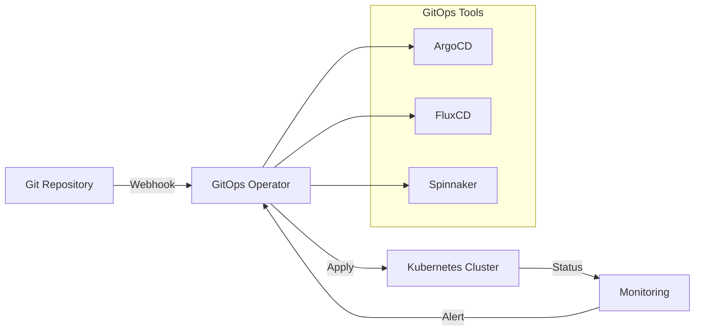
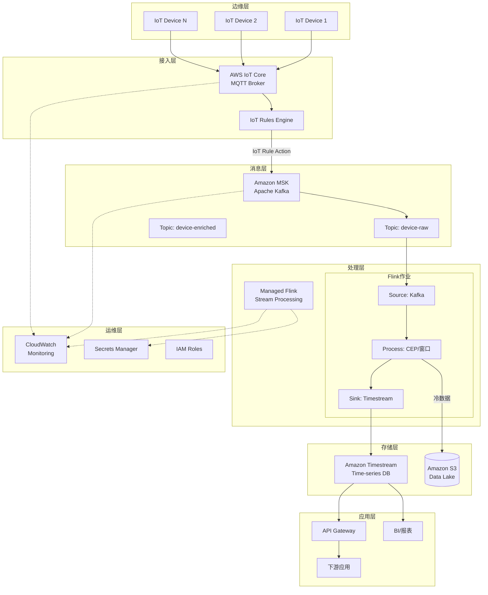
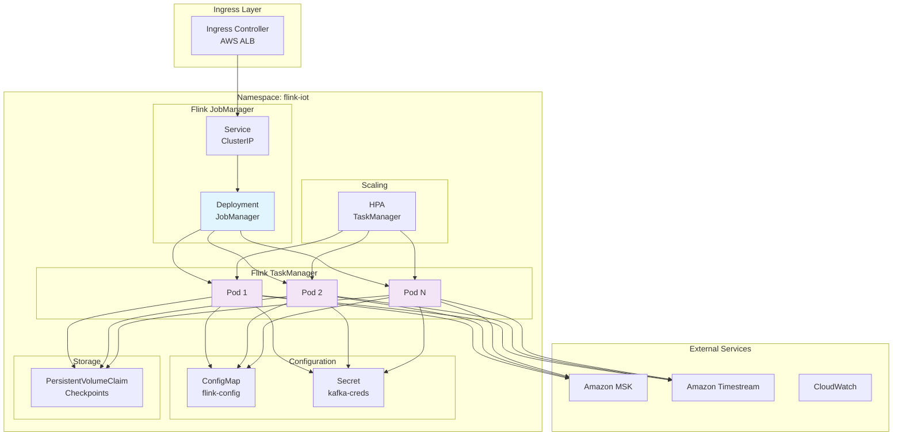
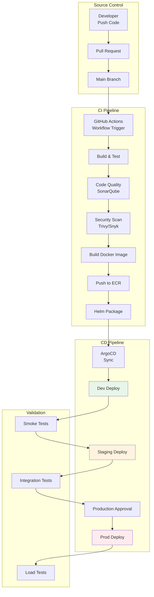
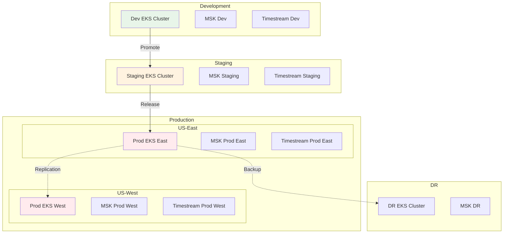
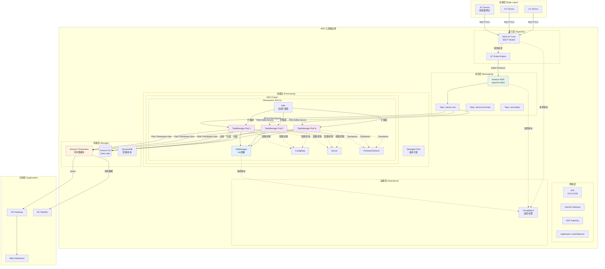
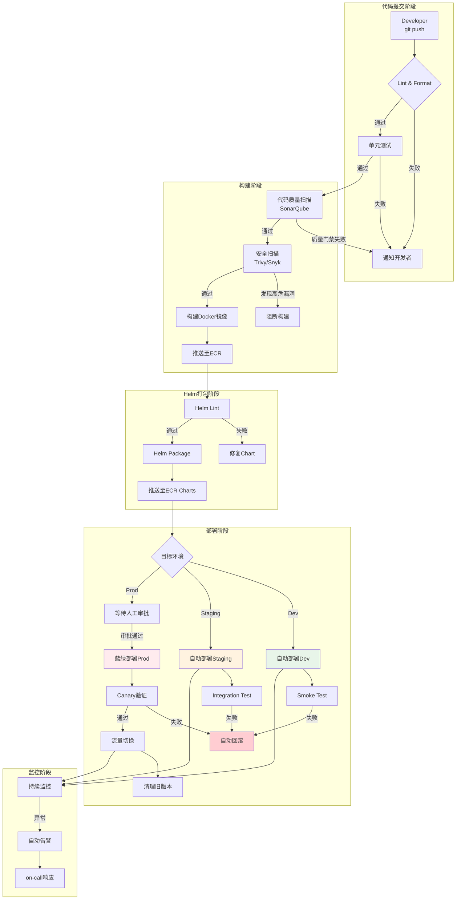
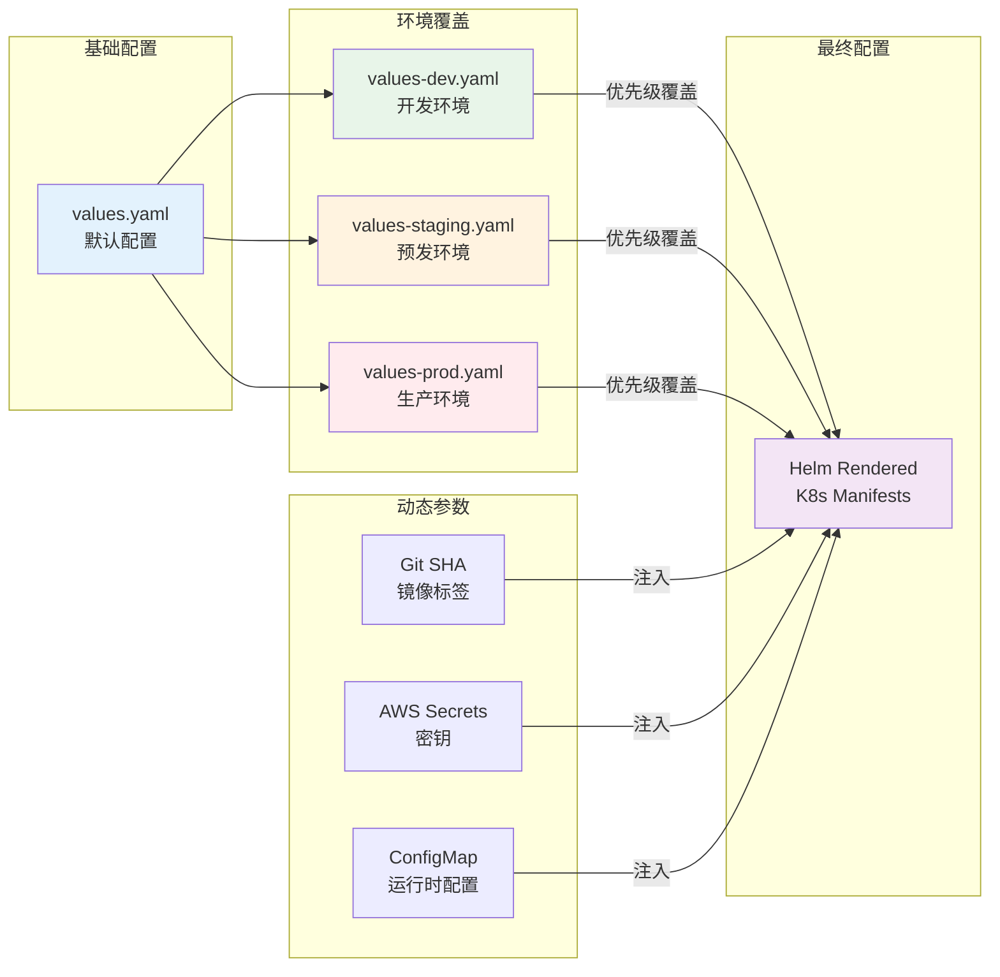

# Flink IoT 云原生部署指南

> **所属阶段**: Flink-IoT-Authority-Alignment/Phase-3-Deployment
> **前置依赖**: [05-flink-iot-authority-verification.md](../Phase-2-Authority/05-flink-iot-authority-verification.md) | [04-flink-iot-data-modeling.md](../Phase-1-Alignment/04-flink-iot-data-modeling.md)
> **形式化等级**: L4 (工程实现层)
> **对标来源**: AWS官方文档, Azure官方文档, Kubernetes官方文档
> **技术栈**: AWS MSK, Managed Flink, Timestream, EKS, Terraform

---

## 目录

- [Flink IoT 云原生部署指南](#flink-iot-云原生部署指南)
  - [目录](#目录)
  - [1. 概念定义 (Definitions)](#1-概念定义-definitions)
    - [Def-P3-06-01: 云原生 (Cloud Native)](#def-p3-06-01-云原生-cloud-native)
    - [Def-P3-06-02: 基础设施即代码 (Infrastructure as Code, IaC)](#def-p3-06-02-基础设施即代码-infrastructure-as-code-iac)
    - [Def-P3-06-03: GitOps](#def-p3-06-03-gitops)
    - [Def-P3-06-04: 托管服务 (Managed Service)](#def-p3-06-04-托管服务-managed-service)
  - [2. AWS部署架构](#2-aws部署架构)
    - [2.1 整体架构设计](#21-整体架构设计)
    - [2.2 组件详细说明](#22-组件详细说明)
      - [2.2.1 AWS IoT Core](#221-aws-iot-core)
      - [2.2.2 Amazon MSK (Managed Streaming for Kafka)](#222-amazon-msk-managed-streaming-for-kafka)
      - [2.2.3 Amazon Managed Service for Apache Flink](#223-amazon-managed-service-for-apache-flink)
      - [2.2.4 Amazon Timestream](#224-amazon-timestream)
  - [3. Terraform配置](#3-terraform配置)
    - [3.1 项目结构](#31-项目结构)
    - [3.2 Provider与后端配置 (provider.tf \& backend.tf)](#32-provider与后端配置-providertf--backendtf)
    - [3.3 变量定义 (variables.tf)](#33-变量定义-variablestf)
    - [3.4 VPC网络模块 (modules/vpc/main.tf)](#34-vpc网络模块-modulesvpcmaintf)
    - [3.5 MSK集群模块 (modules/msk/main.tf)](#35-msk集群模块-modulesmskmaintf)
    - [3.6 Flink托管服务模块 (modules/flink/main.tf)](#36-flink托管服务模块-modulesflinkmaintf)
    - [3.7 Timestream模块 (modules/timestream/main.tf)](#37-timestream模块-modulestimestreammaintf)
    - [3.8 主入口与输出 (main.tf \& outputs.tf)](#38-主入口与输出-maintf--outputstf)
  - [4. Kubernetes部署](#4-kubernetes部署)
    - [4.1 部署架构设计](#41-部署架构设计)
    - [4.2 Flink Deployment配置](#42-flink-deployment配置)
    - [4.3 Service配置](#43-service配置)
    - [4.4 ConfigMap配置](#44-configmap配置)
    - [4.5 Secret配置](#45-secret配置)
    - [4.6 HPA自动扩缩容配置](#46-hpa自动扩缩容配置)
    - [4.7 持久化存储配置](#47-持久化存储配置)
    - [4.8 RBAC配置](#48-rbac配置)
    - [4.9 NetworkPolicy配置](#49-networkpolicy配置)
  - [5. Helm Chart配置](#5-helm-chart配置)
    - [5.1 Chart结构](#51-chart结构)
    - [5.2 Chart.yaml](#52-chartyaml)
    - [5.3 values.yaml (默认配置)](#53-valuesyaml-默认配置)
    - [5.4 环境特定配置](#54-环境特定配置)
    - [5.5 模板文件](#55-模板文件)
  - [6. CI/CD集成](#6-cicd集成)
    - [6.1 整体CI/CD流程](#61-整体cicd流程)
    - [6.2 GitHub Actions工作流](#62-github-actions工作流)
    - [6.3 ArgoCD配置 (GitOps)](#63-argocd配置-gitops)
    - [6.4 ArgoCD ApplicationSet (多环境管理)](#64-argocd-applicationset-多环境管理)
  - [7. 多环境管理](#7-多环境管理)
    - [7.1 环境架构](#71-环境架构)
    - [7.2 环境配置对比](#72-环境配置对比)
    - [7.3 多环境Terraform工作区配置](#73-多环境terraform工作区配置)
  - [8. 可视化](#8-可视化)
    - [8.1 完整部署架构图](#81-完整部署架构图)
    - [8.2 CI/CD流水线详细流程图](#82-cicd流水线详细流程图)
    - [8.3 多环境配置管理视图](#83-多环境配置管理视图)
  - [9. 引用参考 (References)](#9-引用参考-references)
    - [9.1 AWS官方文档](#91-aws官方文档)
    - [9.2 Kubernetes官方文档](#92-kubernetes官方文档)
    - [9.3 Terraform官方文档](#93-terraform官方文档)
    - [9.4 Apache Flink官方文档](#94-apache-flink官方文档)
    - [9.5 学术论文与书籍](#95-学术论文与书籍)
    - [9.6 云原生技术文档](#96-云原生技术文档)
  - [附录](#附录)
    - [A. 部署配置汇总统计](#a-部署配置汇总统计)
    - [B. 部署检查清单](#b-部署检查清单)
      - [部署前检查](#部署前检查)
      - [部署中检查](#部署中检查)
      - [部署后检查](#部署后检查)
    - [C. 故障排查速查](#c-故障排查速查)

## 1. 概念定义 (Definitions)

### Def-P3-06-01: 云原生 (Cloud Native)

**形式化定义**:
云原生是一种构建和运行应用程序的方法，它充分利用云计算交付模型的优势。云原生技术使组织能够在现代动态环境（如公共云、私有云和混合云）中构建和运行可扩展的应用程序。

**核心特征**:

| 特征 | 描述 | 技术实现 |
|------|------|----------|
| **容器化** | 应用打包为轻量级、可移植的容器 | Docker, containerd |
| **微服务** | 应用拆分为独立部署的服务单元 | Kubernetes Services |
| **动态编排** | 自动化部署、扩缩容和故障恢复 | Kubernetes, Helm |
| **声明式API** | 通过配置描述期望状态而非命令式操作 | YAML, HCL |
| **可观测性** | 日志、指标、追踪的深度集成 | Prometheus, Grafana, Jaeger |

**IoT场景下的云原生价值**:

- **弹性伸缩**: 设备连接数波动时自动调整计算资源
- **高可用性**: 多可用区部署保障服务连续性
- **快速迭代**: 蓝绿部署实现零停机更新
- **成本优化**: 按需使用资源，避免过度预配

---

### Def-P3-06-02: 基础设施即代码 (Infrastructure as Code, IaC)

**形式化定义**:
IaC是通过机器可读的定义文件管理和配置基础设施的实践，而非手动配置硬件或使用交互式配置工具。基础设施的配置版本化、可审计、可重复。

**IaC成熟度模型**:

```
Level 1: 手动配置 (ClickOps)
   ↓
Level 2: 半自动化脚本 (Shell/Ansible)
   ↓
Level 3: 声明式配置 (Terraform/CloudFormation)
   ↓
Level 4: 模块化与复用 (模块库)
   ↓
Level 5: 策略即代码 (Policy as Code)
   ↓
Level 6: 自愈与自优化 (AI驱动)
```

**Terraform核心概念**:

| 概念 | 说明 | 示例 |
|------|------|------|
| `Provider` | 云服务提供商插件 | `aws`, `azurerm`, `kubernetes` |
| `Resource` | 基础设施组件 | `aws_msk_cluster`, `aws_kinesisanalyticsv2_application` |
| `Module` | 可复用的配置单元 | `module "msk_cluster"` |
| `State` | 基础设施状态快照 | `terraform.tfstate` |
| `Plan` | 变更预览 | `terraform plan` |

---

### Def-P3-06-03: GitOps

**形式化定义**:
GitOps是一种实现持续部署的运维模式，它以Git仓库作为基础设施和应用的单一事实来源(Single Source of Truth)。所有变更通过Pull Request进行，自动化工具监控仓库状态并同步到目标环境。

**GitOps原则**:

1. **声明式系统**: 系统状态通过声明式配置描述
2. **版本控制**: 所有配置存储在Git中，完整记录变更历史
3. **自动同步**: 监控Git仓库，自动将期望状态应用到系统
4. **漂移检测**: 检测并纠正实际状态与期望状态的偏差

**GitOps工具链**:



---

### Def-P3-06-04: 托管服务 (Managed Service)

**形式化定义**:
托管服务是由云服务提供商(CSP)全面运营、维护和管理的服务，用户无需关注底层基础设施的运维工作，包括补丁管理、备份、高可用配置和扩缩容。

**Flink托管服务对比**:

| 服务 | 提供商 | 托管级别 | 适用场景 |
|------|--------|----------|----------|
| Amazon Managed Service for Apache Flink | AWS | 全托管 | 生产级流处理 |
| Azure Stream Analytics | Azure | 全托管 | 简单SQL流处理 |
| Confluent Cloud | Confluent | 全托管 | 多云Kafka+Flink |
| Ververica Platform | Ververica | 企业级 | 复杂Flink作业管理 |

**托管服务优势**:

- **降低运维负担**: 无需管理ZooKeeper、JobManager等组件
- **自动扩缩容**: 根据负载自动调整Task Slot数量
- **内置高可用**: 自动故障检测和恢复
- **安全合规**: 内置加密、VPC隔离、IAM集成

---

## 2. AWS部署架构

### 2.1 整体架构设计

**数据流架构 (IoT Core → MSK → Managed Flink → Timestream)**:



---

### 2.2 组件详细说明

#### 2.2.1 AWS IoT Core

**功能定位**: 设备连接与消息路由

**核心配置**:

```json
{
  "IoTPolicy": {
    "Version": "2012-10-17",
    "Statement": [{
      "Effect": "Allow",
      "Action": ["iot:Publish", "iot:Subscribe"],
      "Resource": [
        "arn:aws:iot:*:*:topic/device/${iot:Connection.Thing.ThingName}/*",
        "arn:aws:iot:*:*:topicfilter/device/${iot:Connection.Thing.ThingName}/*"
      ]
    }]
  }
}
```

**IoT Rule 配置** (设备数据转发到MSK):

```sql
SELECT *, topic(3) as device_id, timestamp() as ingestion_time
FROM 'device/+/telemetry'
WHERE temperature > -40 AND temperature < 80
```

---

#### 2.2.2 Amazon MSK (Managed Streaming for Kafka)

**功能定位**: 高吞吐量消息中间件

**集群配置参数**:

| 参数 | 建议值 | 说明 |
|------|--------|------|
| Kafka版本 | 3.5.1+ | 支持KRaft模式 |
| Broker数量 | 3 (最小) / 6 (生产) | 跨3个可用区部署 |
| Broker类型 | kafka.m5.large | 可根据吞吐量调整 |
| 存储类型 | GP3 | 可独立扩缩IOPS |
| 分区数 | 设备数/1000 | 每个分区约1K设备 |
| 副本因子 | 3 | 保证高可用 |

**Topic设计策略**:

```
┌─────────────────────────────────────────────────────────────┐
│                    Topic命名规范                              │
├─────────────────────────────────────────────────────────────┤
│  {环境}.{域}.{数据类型}.{版本}                                 │
├─────────────────────────────────────────────────────────────┤
│  prod.iot.raw.v1      - 原始设备数据                          │
│  prod.iot.enriched.v1 - 富化后数据                            │
│  prod.iot.anomaly.v1  - 异常事件                              │
│  prod.iot.command.v1  - 设备控制指令                          │
└─────────────────────────────────────────────────────────────┘
```

---

#### 2.2.3 Amazon Managed Service for Apache Flink

**功能定位**: 实时流处理引擎

**运行时环境选择**:

| 环境 | Flink版本 | 适用场景 |
|------|-----------|----------|
| FLINK-1_18 | 1.18.x | 推荐使用，最新稳定版 |
| FLINK-1_15 | 1.15.x | 存量系统兼容 |
| SQL-1_0 | SQL Only | 简单SQL处理 |

**资源配置计算**:

```
并行度计算:
  KPU = max(源分区数, 目标吞吐量/1MBps) × 安全系数(1.2)

内存配置:
  Task Slot内存 = 512MB (最小) ~ 4096MB (复杂CEP)
  JobManager内存 = 1024MB (最小)

磁盘配置:
  状态后端: RocksDB需要SSD存储
  Checkpoint间隔: 建议 1-5分钟
```

---

#### 2.2.4 Amazon Timestream

**功能定位**: 时序数据存储与查询

**表设计最佳实践**:

```sql
-- 维度表设计
CREATE TABLE iot_metrics (
    -- 时间列 (必须)
    time TIMESTAMP,

    -- 维度列 (索引)
    device_id VARCHAR(64),
    device_type VARCHAR(32),
    location VARCHAR(64),
    firmware_version VARCHAR(16),

    -- 度量列
    temperature DOUBLE,
    humidity DOUBLE,
    pressure DOUBLE,
    battery_level DOUBLE,
    signal_strength DOUBLE,

    -- 状态字段
    status VARCHAR(16),
    error_code VARCHAR(8)
);

-- 内存存储与磁性存储分层
MEMORY_RETENTION := 24 hours   -- 热数据
MAGNETIC_RETENTION := 365 days -- 冷数据
```

---

## 3. Terraform配置

### 3.1 项目结构

```
terraform/
├── main.tf              # 主入口
├── variables.tf         # 变量定义
├── outputs.tf           # 输出定义
├── terraform.tfvars     # 变量值
├── provider.tf          # 提供者配置
├── backend.tf           # 远程状态
├── modules/
│   ├── vpc/             # VPC网络模块
│   ├── msk/             # MSK集群模块
│   ├── flink/           # Flink应用模块
│   ├── timestream/      # Timestream模块
│   └── security/        # 安全组模块
└── environments/
    ├── dev/
    ├── staging/
    └── prod/
```


### 3.2 Provider与后端配置 (provider.tf & backend.tf)

```hcl
# ============================================================
# Provider Configuration
# ============================================================
terraform {
  required_version = ">= 1.5.0"

  required_providers {
    aws = {
      source  = "hashicorp/aws"
      version = "~> 5.0"
    }
    kubernetes = {
      source  = "hashicorp/kubernetes"
      version = "~> 2.23"
    }
    helm = {
      source  = "hashicorp/helm"
      version = "~> 2.11"
    }
  }
}

# AWS Provider
provider "aws" {
  region = var.aws_region

  default_tags {
    tags = {
      Environment = var.environment
      Project     = var.project_name
      ManagedBy   = "Terraform"
      Owner       = var.owner
    }
  }
}

# 多区域Provider (用于灾备)
provider "aws" {
  alias  = "dr"
  region = var.dr_region
}

# ============================================================
# Remote State Configuration
# ============================================================
terraform {
  backend "s3" {
    bucket         = "iot-flink-terraform-state"
    key            = "environments/${var.environment}/terraform.tfstate"
    region         = "us-east-1"
    encrypt        = true
    dynamodb_table = "terraform-state-lock"

    # 状态版本控制
    versioning = true

    # MFA删除保护
    mfa_delete = true
  }
}
```

---

### 3.3 变量定义 (variables.tf)

```hcl
# ============================================================
# Global Variables
# ============================================================

variable "aws_region" {
  description = "AWS主区域"
  type        = string
  default     = "us-east-1"
}

variable "dr_region" {
  description = "灾备区域"
  type        = string
  default     = "us-west-2"
}

variable "environment" {
  description = "部署环境"
  type        = string
  validation {
    condition     = contains(["dev", "staging", "prod"], var.environment)
    error_message = "环境必须是 dev, staging, 或 prod"
  }
}

variable "project_name" {
  description = "项目名称"
  type        = string
  default     = "iot-flink-platform"
}

variable "owner" {
  description = "资源所有者"
  type        = string
}

# ============================================================
# VPC Variables
# ============================================================

variable "vpc_cidr" {
  description = "VPC CIDR块"
  type        = string
  default     = "10.0.0.0/16"
}

variable "availability_zones" {
  description = "可用区列表"
  type        = list(string)
  default     = ["us-east-1a", "us-east-1b", "us-east-1c"]
}

variable "private_subnet_cidrs" {
  description = "私有子网CIDR"
  type        = list(string)
  default     = ["10.0.1.0/24", "10.0.2.0/24", "10.0.3.0/24"]
}

variable "public_subnet_cidrs" {
  description = "公有子网CIDR"
  type        = list(string)
  default     = ["10.0.101.0/24", "10.0.102.0/24", "10.0.103.0/24"]
}

# ============================================================
# MSK Variables
# ============================================================

variable "msk_cluster_name" {
  description = "MSK集群名称"
  type        = string
  default     = "iot-flink-cluster"
}

variable "msk_kafka_version" {
  description = "Kafka版本"
  type        = string
  default     = "3.5.1"
}

variable "msk_instance_type" {
  description = "MSK Broker实例类型"
  type        = string
  default     = "kafka.m5.large"
}

variable "msk_number_of_nodes" {
  description = "Broker节点数量"
  type        = number
  default     = 3

  validation {
    condition     = var.msk_number_of_nodes >= 3
    error_message = "MSK集群至少需要3个节点"
  }
}

variable "msk_volume_size" {
  description = "Broker存储大小(GB)"
  type        = number
  default     = 100
}

# ============================================================
# Flink Variables
# ============================================================

variable "flink_application_name" {
  description = "Flink应用名称"
  type        = string
  default     = "iot-streaming-app"
}

variable "flink_runtime_environment" {
  description = "Flink运行时环境"
  type        = string
  default     = "FLINK-1_18"
}

variable "flink_parallelism" {
  description = "Flink并行度(KPU)"
  type        = number
  default     = 4
}

variable "flink_autoscaling_enabled" {
  description = "启用自动扩缩容"
  type        = bool
  default     = true
}

variable "flink_autoscaling_min_kpu" {
  description = "最小KPU数"
  type        = number
  default     = 2
}

variable "flink_autoscaling_max_kpu" {
  description = "最大KPU数"
  type        = number
  default     = 20
}

variable "flink_checkpoint_interval" {
  description = "Checkpoint间隔(秒)"
  type        = number
  default     = 60
}

# ============================================================
# Timestream Variables
# ============================================================

variable "timestream_database_name" {
  description = "Timestream数据库名称"
  type        = string
  default     = "iot_metrics_db"
}

variable "timestream_table_name" {
  description = "Timestream表名称"
  type        = string
  default     = "device_metrics"
}

variable "timestream_memory_retention" {
  description = "内存存储保留期(小时)"
  type        = number
  default     = 24
}

variable "timestream_magnetic_retention" {
  description = "磁性存储保留期(天)"
  type        = number
  default     = 365
}

# ============================================================
# IoT Core Variables
# ============================================================

variable "iot_thing_type" {
  description = "IoT Thing类型"
  type        = string
  default     = "IoTSensor"
}

variable "iot_topic_prefix" {
  description = "IoT MQTT主题前缀"
  type        = string
  default     = "device"
}
```

---

### 3.4 VPC网络模块 (modules/vpc/main.tf)

```hcl
# ============================================================
# VPC Module - Network Infrastructure
# ============================================================

# VPC主资源
resource "aws_vpc" "main" {
  cidr_block           = var.vpc_cidr
  enable_dns_hostnames = true
  enable_dns_support   = true

  tags = merge(var.tags, {
    Name = "${var.project_name}-${var.environment}-vpc"
  })
}

# Internet Gateway
resource "aws_internet_gateway" "main" {
  vpc_id = aws_vpc.main.id

  tags = merge(var.tags, {
    Name = "${var.project_name}-${var.environment}-igw"
  })
}

# 弹性IP (用于NAT Gateway)
resource "aws_eip" "nat" {
  count  = length(var.availability_zones)
  domain = "vpc"

  tags = merge(var.tags, {
    Name = "${var.project_name}-${var.environment}-eip-${count.index + 1}"
  })

  depends_on = [aws_internet_gateway.main]
}

# NAT Gateway (每个AZ一个)
resource "aws_nat_gateway" "main" {
  count         = length(var.availability_zones)
  allocation_id = aws_eip.nat[count.index].id
  subnet_id     = aws_subnet.public[count.index].id

  tags = merge(var.tags, {
    Name = "${var.project_name}-${var.environment}-nat-${count.index + 1}"
  })

  depends_on = [aws_internet_gateway.main]
}

# 公有子网
resource "aws_subnet" "public" {
  count                   = length(var.availability_zones)
  vpc_id                  = aws_vpc.main.id
  cidr_block              = var.public_subnet_cidrs[count.index]
  availability_zone       = var.availability_zones[count.index]
  map_public_ip_on_launch = true

  tags = merge(var.tags, {
    Name = "${var.project_name}-${var.environment}-public-${count.index + 1}"
    Type = "Public"
  })
}

# 私有子网 (用于MSK和Flink)
resource "aws_subnet" "private" {
  count             = length(var.availability_zones)
  vpc_id            = aws_vpc.main.id
  cidr_block        = var.private_subnet_cidrs[count.index]
  availability_zone = var.availability_zones[count.index]

  tags = merge(var.tags, {
    Name = "${var.project_name}-${var.environment}-private-${count.index + 1}"
    Type = "Private"
  })
}

# 路由表 - 公有
resource "aws_route_table" "public" {
  vpc_id = aws_vpc.main.id

  route {
    cidr_block = "0.0.0.0/0"
    gateway_id = aws_internet_gateway.main.id
  }

  tags = merge(var.tags, {
    Name = "${var.project_name}-${var.environment}-public-rt"
  })
}

resource "aws_route_table_association" "public" {
  count          = length(var.availability_zones)
  subnet_id      = aws_subnet.public[count.index].id
  route_table_id = aws_route_table.public.id
}

# 路由表 - 私有 (每个AZ独立，指向各自的NAT Gateway)
resource "aws_route_table" "private" {
  count  = length(var.availability_zones)
  vpc_id = aws_vpc.main.id

  route {
    cidr_block     = "0.0.0.0/0"
    nat_gateway_id = aws_nat_gateway.main[count.index].id
  }

  tags = merge(var.tags, {
    Name = "${var.project_name}-${var.environment}-private-rt-${count.index + 1}"
  })
}

resource "aws_route_table_association" "private" {
  count          = length(var.availability_zones)
  subnet_id      = aws_subnet.private[count.index].id
  route_table_id = aws_route_table.private[count.index].id
}

# VPC Flow Logs (网络流量审计)
resource "aws_flow_log" "main" {
  vpc_id                   = aws_vpc.main.id
  traffic_type             = "ALL"
  log_destination_type     = "cloud-watch-logs"
  log_destination          = aws_cloudwatch_log_group.vpc_flow_logs.arn
  iam_role_arn             = aws_iam_role.vpc_flow_logs.arn
  max_aggregation_interval = 60

  tags = merge(var.tags, {
    Name = "${var.project_name}-${var.environment}-flow-log"
  })
}

resource "aws_cloudwatch_log_group" "vpc_flow_logs" {
  name              = "/aws/vpc/${var.project_name}-${var.environment}-flow-logs"
  retention_in_days = 30

  tags = var.tags
}

# VPC Endpoints (减少公网流量，提升安全性)
resource "aws_vpc_endpoint" "s3" {
  vpc_id            = aws_vpc.main.id
  service_name      = "com.amazonaws.${data.aws_region.current.name}.s3"
  vpc_endpoint_type = "Gateway"
  route_table_ids   = concat(aws_route_table.private[*].id, [aws_route_table.public.id])

  tags = merge(var.tags, {
    Name = "${var.project_name}-${var.environment}-s3-endpoint"
  })
}

resource "aws_vpc_endpoint" "cloudwatch_logs" {
  vpc_id              = aws_vpc.main.id
  service_name        = "com.amazonaws.${data.aws_region.current.name}.logs"
  vpc_endpoint_type   = "Interface"
  subnet_ids          = aws_subnet.private[*].id
  security_group_ids  = [aws_security_group.vpc_endpoints.id]
  private_dns_enabled = true

  tags = merge(var.tags, {
    Name = "${var.project_name}-${var.environment}-cloudwatch-endpoint"
  })
}

# 安全组 - VPC Endpoints
resource "aws_security_group" "vpc_endpoints" {
  name_prefix = "${var.project_name}-${var.environment}-vpc-endpoints-"
  vpc_id      = aws_vpc.main.id

  ingress {
    from_port   = 443
    to_port     = 443
    protocol    = "tcp"
    cidr_blocks = [var.vpc_cidr]
  }

  egress {
    from_port   = 0
    to_port     = 0
    protocol    = "-1"
    cidr_blocks = ["0.0.0.0/0"]
  }

  tags = merge(var.tags, {
    Name = "${var.project_name}-${var.environment}-vpc-endpoints-sg"
  })
}

data "aws_region" "current" {}
```

---

### 3.5 MSK集群模块 (modules/msk/main.tf)

```hcl
# ============================================================
# MSK Module - Managed Kafka Cluster
# ============================================================

# MSK安全配置
resource "aws_msk_configuration" "main" {
  kafka_versions = [var.kafka_version]
  name           = "${var.project_name}-${var.environment}-config"

  server_properties = <<EOF
auto.create.topics.enable=false
default.replication.factor=3
min.insync.replicas=2
num.io.threads=8
num.network.threads=5
num.partitions=12
num.replica.fetchers=2
offsets.topic.replication.factor=3
transaction.state.log.replication.factor=3
transaction.state.log.min.isr=2
log.retention.hours=168
log.segment.bytes=1073741824
log.retention.check.interval.ms=300000
EOF
}

# MSK集群
resource "aws_msk_cluster" "main" {
  cluster_name           = var.cluster_name
  kafka_version          = var.kafka_version
  number_of_broker_nodes = var.number_of_nodes

  broker_node_group_info {
    instance_type   = var.instance_type
    client_subnets  = var.subnet_ids
    security_groups = [aws_security_group.msk.id]

    storage_info {
      ebs_storage_info {
        volume_size = var.volume_size
        provisioned_throughput {
          enabled           = true
          volume_throughput = 250
        }
      }
    }

    connectivity_info {
      public_access {
        type = "DISABLED"
      }

      vpc_connectivity {
        client_authentication {
          sasl {
            iam = true
          }
        }
      }
    }
  }

  configuration_info {
    arn      = aws_msk_configuration.main.arn
    revision = aws_msk_configuration.main.latest_revision
  }

  encryption_info {
    encryption_at_rest_kms_key_arn = aws_kms_key.msk.arn

    encryption_in_transit {
      client_broker = "TLS"
      in_cluster    = true
    }
  }

  client_authentication {
    sasl {
      iam = true
    }
  }

  logging_info {
    broker_logs {
      cloudwatch_logs {
        enabled   = true
        log_group = aws_cloudwatch_log_group.msk.name
      }

      s3 {
        enabled = true
        bucket  = var.log_bucket
        prefix  = "msk-logs/"
      }
    }
  }

  open_monitoring {
    prometheus {
      jmx_exporter {
        enabled_in_broker = true
      }
      node_exporter {
        enabled_in_broker = true
      }
    }
  }

  tags = merge(var.tags, {
    Name = var.cluster_name
  })
}

# MSK安全组
resource "aws_security_group" "msk" {
  name_prefix = "${var.cluster_name}-msk-"
  vpc_id      = var.vpc_id

  ingress {
    from_port   = 9098
    to_port     = 9098
    protocol    = "tcp"
    cidr_blocks = [var.vpc_cidr]
    description = "IAM SASL"
  }

  ingress {
    from_port   = 9094
    to_port     = 9094
    protocol    = "tcp"
    cidr_blocks = [var.vpc_cidr]
    description = "TLS"
  }

  ingress {
    from_port   = 9092
    to_port     = 9092
    protocol    = "tcp"
    cidr_blocks = [var.vpc_cidr]
    description = "Plaintext (internal)"
  }

  ingress {
    from_port   = 2181
    to_port     = 2181
    protocol    = "tcp"
    cidr_blocks = [var.vpc_cidr]
    description = "ZooKeeper"
  }

  egress {
    from_port   = 0
    to_port     = 0
    protocol    = "-1"
    cidr_blocks = ["0.0.0.0/0"]
  }

  tags = merge(var.tags, {
    Name = "${var.cluster_name}-msk-sg"
  })
}

# KMS密钥
resource "aws_kms_key" "msk" {
  description             = "MSK encryption key for ${var.cluster_name}"
  deletion_window_in_days = 7
  enable_key_rotation     = true

  tags = var.tags
}

resource "aws_kms_alias" "msk" {
  name          = "alias/${var.cluster_name}"
  target_key_id = aws_kms_key.msk.key_id
}

# CloudWatch日志组
resource "aws_cloudwatch_log_group" "msk" {
  name              = "/aws/msk/${var.cluster_name}"
  retention_in_days = 7

  tags = var.tags
}

# 预创建Topic
resource "aws_msk_topic" "raw_data" {
  name       = "${var.environment}.iot.raw.v1"
  cluster_arn = aws_msk_cluster.main.arn

  partitions = 12
  replication_factor = 3

  config = {
    "retention.ms" = "604800000"  # 7天
    "cleanup.policy" = "delete"
    "min.insync.replicas" = "2"
  }
}

resource "aws_msk_topic" "enriched_data" {
  name       = "${var.environment}.iot.enriched.v1"
  cluster_arn = aws_msk_cluster.main.arn

  partitions = 12
  replication_factor = 3
}

resource "aws_msk_topic" "anomaly_events" {
  name       = "${var.environment}.iot.anomaly.v1"
  cluster_arn = aws_msk_cluster.main.arn

  partitions = 6
  replication_factor = 3
}
```


---

### 3.6 Flink托管服务模块 (modules/flink/main.tf)

```hcl
# ============================================================
# Flink Module - Managed Apache Flink
# ============================================================

# Flink应用程序
resource "aws_kinesisanalyticsv2_application" "main" {
  name                   = var.application_name
  runtime_environment    = var.runtime_environment
  service_execution_role = aws_iam_role.flink_execution.arn

  application_configuration {
    # 应用程序代码配置
    application_code_configuration {
      code_content {
        s3_content_location {
          bucket_arn     = aws_s3_bucket.flink_code.arn
          file_key       = var.flink_jar_key
          object_version = var.flink_jar_version
        }
      }

      code_content_type = "ZIPFILE"
    }

    # 环境属性配置
    environment_properties {
      property_group {
        property_group_id = "FlinkApplicationProperties"

        property_map = {
          "kafka.bootstrap.servers" = var.msk_bootstrap_servers
          "kafka.topic.input"       = var.input_topic
          "kafka.topic.output"      = var.output_topic
          "timestream.database"     = var.timestream_database
          "timestream.table"        = var.timestream_table
          "checkpoint.interval"     = tostring(var.checkpoint_interval)
          "parallelism.default"     = tostring(var.parallelism)
          "metrics.enabled"         = "true"
          "metrics.namespace"       = "FlinkIoT/${var.environment}"
        }
      }

      property_group {
        property_group_id = "MetricsProperties"

        property_map = {
          "metrics.level"        = "TASK"
          "metrics.latency.interval" = "60000"
        }
      }
    }

    # Flink运行配置
    flink_application_configuration {
      checkpoint_configuration {
        configuration_type   = "DEFAULT"
        checkpointing_enabled = true
        checkpoint_interval   = var.checkpoint_interval * 1000  # 转换为毫秒
        min_pause_between_checkpoints = 5000
      }

      monitoring_configuration {
        configuration_type = "CUSTOM"
        logging_level      = "INFO"
        metrics_level      = "TASK"
      }

      parallelism_configuration {
        configuration_type   = "CUSTOM"
        parallelism          = var.parallelism
        parallelism_per_kpu  = 1
        auto_scaling_enabled = var.autoscaling_enabled
      }
    }

    # VPC配置 (连接MSK)
    vpc_configuration {
      subnet_ids             = var.subnet_ids
      security_group_ids     = [aws_security_group.flink.id]
      vpc_configuration_id   = "${var.application_name}-vpc-config"
    }
  }

  cloudwatch_logging_options {
    enabled = true
    log_stream_arn = aws_cloudwatch_log_stream.flink.arn
  }

  tags = merge(var.tags, {
    Name = var.application_name
  })

  # 自动启动作业
  lifecycle {
    ignore_changes = [
      application_configuration[0].application_code_configuration
    ]
  }
}

# 自动扩缩容配置
resource "aws_appautoscaling_target" "flink" {
  count = var.autoscaling_enabled ? 1 : 0

  max_capacity       = var.max_kpu
  min_capacity       = var.min_kpu
  resource_id        = "arn:aws:kinesisanalytics:${data.aws_region.current.name}:${data.aws_caller_identity.current.account_id}:application/${var.application_name}"
  scalable_dimension = "kinesisanalytics:aws:KPUCount"
  service_namespace  = "kinesisanalytics"
}

resource "aws_appautoscaling_policy" "flink_cpu" {
  count = var.autoscaling_enabled ? 1 : 0

  name               = "${var.application_name}-cpu-scaling"
  policy_type        = "TargetTrackingScaling"
  resource_id        = aws_appautoscaling_target.flink[0].resource_id
  scalable_dimension = aws_appautoscaling_target.flink[0].scalable_dimension
  service_namespace  = aws_appautoscaling_target.flink[0].service_namespace

  target_tracking_scaling_policy_configuration {
    predefined_metric_specification {
      predefined_metric_type = "KinesisAnalyticsCPUUtilization"
    }

    target_value       = 70.0
    scale_in_cooldown  = 300
    scale_out_cooldown = 60
  }
}

# CloudWatch告警 - CPU使用率
resource "aws_cloudwatch_metric_alarm" "flink_cpu_high" {
  alarm_name          = "${var.application_name}-cpu-high"
  comparison_operator = "GreaterThanThreshold"
  evaluation_periods  = "2"
  metric_name         = "CPUUtilization"
  namespace           = "AWS/KinesisAnalytics"
  period              = "60"
  statistic           = "Average"
  threshold           = "80"
  alarm_description   = "Flink application CPU utilization is high"
  alarm_actions       = [var.sns_topic_arn]

  dimensions = {
    Application = var.application_name
  }

  tags = var.tags
}

# CloudWatch告警 - 延迟
resource "aws_cloudwatch_metric_alarm" "flink_latency_high" {
  alarm_name          = "${var.application_name}-latency-high"
  comparison_operator = "GreaterThanThreshold"
  evaluation_periods  = "3"
  metric_name         = "millisBehindLatest"
  namespace           = "AWS/KinesisAnalytics"
  period              = "60"
  statistic           = "Average"
  threshold           = "1000"
  alarm_description   = "Flink application is falling behind"
  alarm_actions       = [var.sns_topic_arn]

  dimensions = {
    Application = var.application_name
  }

  tags = var.tags
}

# Flink安全组
resource "aws_security_group" "flink" {
  name_prefix = "${var.application_name}-flink-"
  vpc_id      = var.vpc_id

  egress {
    from_port   = 9098
    to_port     = 9098
    protocol    = "tcp"
    cidr_blocks = [var.vpc_cidr]
    description = "MSK IAM SASL"
  }

  egress {
    from_port   = 443
    to_port     = 443
    protocol    = "tcp"
    cidr_blocks = ["0.0.0.0/0"]
    description = "HTTPS - AWS Services"
  }

  egress {
    from_port   = 0
    to_port     = 0
    protocol    = "-1"
    cidr_blocks = [var.vpc_cidr]
  }

  tags = merge(var.tags, {
    Name = "${var.application_name}-flink-sg"
  })
}

# CloudWatch日志组
resource "aws_cloudwatch_log_group" "flink" {
  name              = "/aws/kinesisanalytics/${var.application_name}"
  retention_in_days = var.log_retention_days

  tags = var.tags
}

resource "aws_cloudwatch_log_stream" "flink" {
  name           = "${var.application_name}-log-stream"
  log_group_name = aws_cloudwatch_log_group.flink.name
}

# S3 Bucket用于存储Flink代码
resource "aws_s3_bucket" "flink_code" {
  bucket = "${var.project_name}-flink-code-${data.aws_caller_identity.current.account_id}-${var.environment}"

  tags = var.tags
}

resource "aws_s3_bucket_versioning" "flink_code" {
  bucket = aws_s3_bucket.flink_code.id

  versioning_configuration {
    status = "Enabled"
  }
}

resource "aws_s3_bucket_server_side_encryption_configuration" "flink_code" {
  bucket = aws_s3_bucket.flink_code.id

  rule {
    apply_server_side_encryption_by_default {
      sse_algorithm     = "aws:kms"
      kms_master_key_id = aws_kms_key.flink.arn
    }
    bucket_key_enabled = true
  }
}

resource "aws_s3_bucket_public_access_block" "flink_code" {
  bucket = aws_s3_bucket.flink_code.id

  block_public_acls       = true
  block_public_policy     = true
  ignore_public_acls      = true
  restrict_public_buckets = true
}

# KMS密钥
resource "aws_kms_key" "flink" {
  description             = "Flink S3 encryption key"
  deletion_window_in_days = 7
  enable_key_rotation     = true

  tags = var.tags
}

# IAM执行角色
resource "aws_iam_role" "flink_execution" {
  name = "${var.application_name}-execution-role"

  assume_role_policy = jsonencode({
    Version = "2012-10-17"
    Statement = [{
      Action = "sts:AssumeRole"
      Effect = "Allow"
      Principal = {
        Service = "kinesisanalytics.amazonaws.com"
      }
    }]
  })

  tags = var.tags
}

resource "aws_iam_role_policy" "flink_execution" {
  name = "${var.application_name}-execution-policy"
  role = aws_iam_role.flink_execution.id

  policy = jsonencode({
    Version = "2012-10-17"
    Statement = [
      {
        Sid    = "S3Access"
        Effect = "Allow"
        Action = [
          "s3:GetObject",
          "s3:GetObjectVersion",
          "s3:ListBucket"
        ]
        Resource = [
          aws_s3_bucket.flink_code.arn,
          "${aws_s3_bucket.flink_code.arn}/*"
        ]
      },
      {
        Sid    = "CloudWatchLogs"
        Effect = "Allow"
        Action = [
          "logs:CreateLogGroup",
          "logs:CreateLogStream",
          "logs:PutLogEvents",
          "logs:DescribeLogGroups",
          "logs:DescribeLogStreams"
        ]
        Resource = "arn:aws:logs:*:*:*"
      },
      {
        Sid    = "VPCAccess"
        Effect = "Allow"
        Action = [
          "ec2:DescribeVpcs",
          "ec2:DescribeSubnets",
          "ec2:DescribeSecurityGroups",
          "ec2:DescribeDhcpOptions",
          "ec2:DescribeNetworkInterfaces",
          "ec2:CreateNetworkInterface",
          "ec2:DeleteNetworkInterface",
          "ec2:DescribeNetworkInterfaceAttribute"
        ]
        Resource = "*"
      },
      {
        Sid    = "MSKAccess"
        Effect = "Allow"
        Action = [
          "kafka-cluster:Connect",
          "kafka-cluster:DescribeCluster",
          "kafka-cluster:DescribeTopic",
          "kafka-cluster:ReadData",
          "kafka-cluster:WriteData"
        ]
        Resource = var.msk_cluster_arn
      },
      {
        Sid    = "TimestreamAccess"
        Effect = "Allow"
        Action = [
          "timestream:WriteRecords",
          "timestream:DescribeEndpoints"
        ]
        Resource = "*"
      },
      {
        Sid    = "CloudWatchMetrics"
        Effect = "Allow"
        Action = [
          "cloudwatch:PutMetricData"
        ]
        Resource = "*"
      }
    ]
  })
}

data "aws_caller_identity" "current" {}
```

---

### 3.7 Timestream模块 (modules/timestream/main.tf)

```hcl
# ============================================================
# Timestream Module - Time-series Database
# ============================================================

# Timestream数据库
resource "aws_timestreamwrite_database" "main" {
  database_name = var.database_name

  tags = var.tags
}

# Timestream表
resource "aws_timestreamwrite_table" "main" {
  database_name = aws_timestreamwrite_database.main.database_name
  table_name    = var.table_name

  retention_properties {
    memory_store_retention_period_in_hours  = var.memory_retention_hours
    magnetic_store_retention_period_in_days = var.magnetic_retention_days
  }

  magnetic_store_write_properties {
    enable_magnetic_store_writes = true

    magnetic_store_rejected_data_location {
      s3_configuration {
        bucket_name       = var.rejected_data_bucket
        encryption_option = "SSE_KMS"
        kms_key_id        = aws_kms_key.timestream.arn
      }
    }
  }

  # Schema定义 (可选，用于约束)
  schema {
    composite_partition_key {
      name        = "device_id"
      type        = "DIMENSION"
      enforcement = "REQUIRED"
    }
  }

  tags = var.tags
}

# KMS密钥
resource "aws_kms_key" "timestream" {
  description             = "Timestream encryption key"
  deletion_window_in_days = 7
  enable_key_rotation     = true

  tags = var.tags
}

# 拒写数据S3 Bucket
resource "aws_s3_bucket" "rejected_data" {
  bucket = "${var.project_name}-timestream-rejected-${data.aws_caller_identity.current.account_id}"

  tags = var.tags
}

resource "aws_s3_bucket_lifecycle_configuration" "rejected_data" {
  bucket = aws_s3_bucket.rejected_data.id

  rule {
    id     = "expire-old-rejects"
    status = "Enabled"

    expiration {
      days = 30
    }
  }
}

# CloudWatch告警 - Timestream写入延迟
resource "aws_cloudwatch_metric_alarm" "timestream_writes" {
  alarm_name          = "${var.database_name}-write-latency"
  comparison_operator = "GreaterThanThreshold"
  evaluation_periods  = "3"
  metric_name         = "SuccessfulRequestLatency"
  namespace           = "AWS/Timestream"
  period              = "60"
  statistic           = "Average"
  threshold           = "500"
  alarm_description   = "Timestream write latency is high"

  dimensions = {
    DatabaseName = var.database_name
    TableName    = var.table_name
    Operation    = "WriteRecords"
  }

  tags = var.tags
}

data "aws_caller_identity" "current" {}
```

---

### 3.8 主入口与输出 (main.tf & outputs.tf)

```hcl
# ============================================================
# Main Entry Point
# ============================================================

module "vpc" {
  source = "./modules/vpc"

  vpc_cidr           = var.vpc_cidr
  availability_zones = var.availability_zones
  private_subnet_cidrs = var.private_subnet_cidrs
  public_subnet_cidrs  = var.public_subnet_cidrs

  project_name = var.project_name
  environment  = var.environment

  tags = {
    Environment = var.environment
    Project     = var.project_name
  }
}

module "msk" {
  source = "./modules/msk"

  vpc_id     = module.vpc.vpc_id
  vpc_cidr   = var.vpc_cidr
  subnet_ids = module.vpc.private_subnet_ids

  cluster_name      = var.msk_cluster_name
  kafka_version     = var.msk_kafka_version
  instance_type     = var.msk_instance_type
  number_of_nodes   = var.msk_number_of_nodes
  volume_size       = var.msk_volume_size
  log_bucket        = module.flink.flink_code_bucket

  project_name = var.project_name
  environment  = var.environment

  tags = {
    Environment = var.environment
    Project     = var.project_name
  }

  depends_on = [module.vpc]
}

module "timestream" {
  source = "./modules/timestream"

  database_name          = var.timestream_database_name
  table_name             = var.timestream_table_name
  memory_retention_hours = var.timestream_memory_retention
  magnetic_retention_days = var.timestream_magnetic_retention

  project_name = var.project_name

  tags = {
    Environment = var.environment
    Project     = var.project_name
  }
}

module "flink" {
  source = "./modules/flink"

  vpc_id     = module.vpc.vpc_id
  vpc_cidr   = var.vpc_cidr
  subnet_ids = module.vpc.private_subnet_ids

  application_name        = var.flink_application_name
  runtime_environment     = var.flink_runtime_environment
  parallelism             = var.flink_parallelism
  autoscaling_enabled     = var.flink_autoscaling_enabled
  min_kpu                 = var.flink_autoscaling_min_kpu
  max_kpu                 = var.flink_autoscaling_max_kpu
  checkpoint_interval     = var.flink_checkpoint_interval

  msk_bootstrap_servers = module.msk.bootstrap_brokers_sasl_iam
  msk_cluster_arn       = module.msk.cluster_arn
  input_topic           = "${var.environment}.iot.raw.v1"
  output_topic          = "${var.environment}.iot.enriched.v1"
  timestream_database   = module.timestream.database_name
  timestream_table      = module.timestream.table_name

  project_name = var.project_name
  environment  = var.environment

  tags = {
    Environment = var.environment
    Project     = var.project_name
  }

  depends_on = [module.msk, module.timestream]
}
```

```hcl
# ============================================================
# Outputs
# ============================================================

output "vpc_id" {
  description = "VPC ID"
  value       = module.vpc.vpc_id
}

output "private_subnet_ids" {
  description = "私有子网ID列表"
  value       = module.vpc.private_subnet_ids
}

output "msk_cluster_arn" {
  description = "MSK集群ARN"
  value       = module.msk.cluster_arn
}

output "msk_bootstrap_brokers" {
  description = "MSK引导服务器地址"
  value       = module.msk.bootstrap_brokers_sasl_iam
  sensitive   = true
}

output "msk_zookeeper_connect" {
  description = "ZooKeeper连接字符串"
  value       = module.msk.zookeeper_connect_string
  sensitive   = true
}

output "flink_application_name" {
  description = "Flink应用名称"
  value       = module.flink.application_name
}

output "flink_application_arn" {
  description = "Flink应用ARN"
  value       = module.flink.application_arn
}

output "timestream_database_name" {
  description = "Timestream数据库名称"
  value       = module.timestream.database_name
}

output "timestream_table_name" {
  description = "Timestream表名称"
  value       = module.timestream.table_name
}

output "terraform_state_bucket" {
  description = "Terraform状态存储桶"
  value       = "iot-flink-terraform-state"
}
```


## 4. Kubernetes部署

### 4.1 部署架构设计

**Kubernetes集群架构**:



---

### 4.2 Flink Deployment配置

```yaml
# ============================================================
# 01-flink-deployment.yaml
# Flink JobManager and TaskManager Deployment
# ============================================================
apiVersion: apps/v1
kind: Deployment
metadata:
  name: flink-jobmanager
  namespace: flink-iot
  labels:
    app: flink
    component: jobmanager
    version: v1.18
spec:
  replicas: 1
  selector:
    matchLabels:
      app: flink
      component: jobmanager
  template:
    metadata:
      labels:
        app: flink
        component: jobmanager
      annotations:
        prometheus.io/scrape: "true"
        prometheus.io/port: "9249"
    spec:
      serviceAccountName: flink-service-account
      securityContext:
        runAsUser: 9999
        fsGroup: 9999
      containers:
      - name: jobmanager
        image: flink:1.18-scala_2.12-java11
        args: ["jobmanager"]
        ports:
        - containerPort: 6123
          name: rpc
        - containerPort: 6124
          name: blob-server
        - containerPort: 8081
          name: webui
        - containerPort: 9249
          name: metrics
        env:
        - name: JOB_MANAGER_RPC_ADDRESS
          value: flink-jobmanager
        - name: FLINK_PROPERTIES
          value: |
            jobmanager.memory.process.size: 1024m
            jobmanager.memory.jvm-heap.size: 512m
            jobmanager.memory.off-heap.size: 128m
            jobmanager.memory.jvm-metaspace.size: 256m
        resources:
          requests:
            memory: "1Gi"
            cpu: "500m"
          limits:
            memory: "2Gi"
            cpu: "1000m"
        livenessProbe:
          httpGet:
            path: /
            port: 8081
          initialDelaySeconds: 30
          periodSeconds: 10
        readinessProbe:
          httpGet:
            path: /
            port: 8081
          initialDelaySeconds: 5
          periodSeconds: 5
        volumeMounts:
        - name: flink-config-volume
          mountPath: /opt/flink/conf
        - name: checkpoint-volume
          mountPath: /opt/flink/checkpoints
      volumes:
      - name: flink-config-volume
        configMap:
          name: flink-config
      - name: checkpoint-volume
        persistentVolumeClaim:
          claimName: flink-checkpoints
---
apiVersion: apps/v1
kind: Deployment
metadata:
  name: flink-taskmanager
  namespace: flink-iot
  labels:
    app: flink
    component: taskmanager
    version: v1.18
spec:
  replicas: 2
  selector:
    matchLabels:
      app: flink
      component: taskmanager
  template:
    metadata:
      labels:
        app: flink
        component: taskmanager
      annotations:
        prometheus.io/scrape: "true"
        prometheus.io/port: "9249"
    spec:
      serviceAccountName: flink-service-account
      securityContext:
        runAsUser: 9999
        fsGroup: 9999
      containers:
      - name: taskmanager
        image: flink:1.18-scala_2.12-java11
        args: ["taskmanager"]
        ports:
        - containerPort: 6121
          name: data
        - containerPort: 6122
          name: rpc
        - containerPort: 9249
          name: metrics
        env:
        - name: JOB_MANAGER_RPC_ADDRESS
          value: flink-jobmanager
        - name: FLINK_PROPERTIES
          value: |
            taskmanager.memory.process.size: 2048m
            taskmanager.memory.flink.size: 1536m
            taskmanager.memory.jvm-heap.size: 1024m
            taskmanager.memory.managed.size: 256m
            taskmanager.numberOfTaskSlots: 4
            taskmanager.memory.network.min: 128m
            taskmanager.memory.network.max: 256m
        resources:
          requests:
            memory: "2Gi"
            cpu: "1000m"
          limits:
            memory: "4Gi"
            cpu: "2000m"
        volumeMounts:
        - name: flink-config-volume
          mountPath: /opt/flink/conf
        - name: checkpoint-volume
          mountPath: /opt/flink/checkpoints
        - name: kafka-certs
          mountPath: /etc/kafka/certs
          readOnly: true
      volumes:
      - name: flink-config-volume
        configMap:
          name: flink-config
      - name: checkpoint-volume
        persistentVolumeClaim:
          claimName: flink-checkpoints
      - name: kafka-certs
        secret:
          secretName: kafka-credentials
```

---

### 4.3 Service配置

```yaml
# ============================================================
# 02-flink-service.yaml
# Kubernetes Services for Flink
# ============================================================
apiVersion: v1
kind: Service
metadata:
  name: flink-jobmanager
  namespace: flink-iot
  labels:
    app: flink
    component: jobmanager
spec:
  type: ClusterIP
  ports:
  - name: rpc
    port: 6123
    targetPort: 6123
  - name: blob-server
    port: 6124
    targetPort: 6124
  - name: webui
    port: 8081
    targetPort: 8081
  - name: metrics
    port: 9249
    targetPort: 9249
  selector:
    app: flink
    component: jobmanager
---
apiVersion: v1
kind: Service
metadata:
  name: flink-jobmanager-rest
  namespace: flink-iot
  labels:
    app: flink
    component: jobmanager
spec:
  type: LoadBalancer
  ports:
  - name: rest
    port: 8081
    targetPort: 8081
  selector:
    app: flink
    component: jobmanager
  annotations:
    service.beta.kubernetes.io/aws-load-balancer-type: "nlb"
    service.beta.kubernetes.io/aws-load-balancer-internal: "true"
---
apiVersion: v1
kind: Service
metadata:
  name: flink-taskmanager
  namespace: flink-iot
  labels:
    app: flink
    component: taskmanager
spec:
  type: ClusterIP
  ports:
  - name: data
    port: 6121
    targetPort: 6121
  - name: rpc
    port: 6122
    targetPort: 6122
  - name: metrics
    port: 9249
    targetPort: 9249
  selector:
    app: flink
    component: taskmanager
  clusterIP: None  # Headless service for StatefulSet
```

---

### 4.4 ConfigMap配置

```yaml
# ============================================================
# 03-flink-configmap.yaml
# Flink Configuration
# ============================================================
apiVersion: v1
kind: ConfigMap
metadata:
  name: flink-config
  namespace: flink-iot
  labels:
    app: flink
    config-type: flink-conf
data:
  flink-conf.yaml: |
    # =============================================================================
    # Flink Core Configuration for IoT Streaming
    # =============================================================================

    # High Availability
    high-availability: org.apache.flink.kubernetes.highavailability.KubernetesHaServicesFactory
    high-availability.storageDir: s3://iot-flink-checkpoints/ha
    kubernetes.cluster-id: flink-iot-cluster
    kubernetes.namespace: flink-iot

    # State Backend
    state.backend: rocksdb
    state.backend.incremental: true
    state.backend.rocksdb.memory.fixed-per-slot: 256m
    state.backend.rocksdb.memory.high-prio-pool-ratio: 0.1
    state.backend.rocksdb.memory.managed: true
    state.backend.rocksdb.predefined-options: FLASH_SSD_OPTIMIZED
    state.checkpoints.dir: s3://iot-flink-checkpoints/checkpoints
    state.savepoints.dir: s3://iot-flink-checkpoints/savepoints
    state.checkpoints.num-retained: 10

    # Checkpointing
    execution.checkpointing.mode: EXACTLY_ONCE
    execution.checkpointing.interval: 60s
    execution.checkpointing.min-pause-between-checkpoints: 30s
    execution.checkpointing.timeout: 10m
    execution.checkpointing.max-concurrent-checkpoints: 1
    execution.checkpointing.externalized-checkpoint-retention: RETAIN_ON_CANCELLATION
    execution.checkpointing.unaligned: false

    # Restart Strategy
    restart-strategy: fixed-delay
    restart-strategy.fixed-delay.attempts: 10
    restart-strategy.fixed-delay.delay: 10s

    # Network & Buffers
    taskmanager.memory.network.fraction: 0.1
    taskmanager.memory.network.min: 128m
    taskmanager.memory.network.max: 512m
    taskmanager.memory.framework.off-heap.batch-allocations: true

    # Metrics
    metrics.reporters: prom,cloudwatch
    metrics.reporter.prom.class: org.apache.flink.metrics.prometheus.PrometheusReporter
    metrics.reporter.prom.port: 9249
    metrics.reporter.cloudwatch.class: org.apache.flink.metrics.cloudwatch.CloudWatchReporter
    metrics.reporter.cloudwatch.namespace: FlinkIoT
    metrics.reporter.cloudwatch.interval: 60s
    metrics.latency.interval: 60000
    metrics.latency.history-size: 10

    # Web UI
    web.submit.enable: true
    web.cancel.enable: true
    web.checkpoints.history: 20
    web.backpressure.refresh-interval: 60000

    # Kubernetes-specific
    kubernetes.container-start-command-template: "%java% %classpath% %jvmmem% %jvmopts% %logging% %class% %args%"
    kubernetes.jobmanager.service-account: flink-service-account
    kubernetes.taskmanager.service-account: flink-service-account
    kubernetes.rest-service.exposed.type: LoadBalancer
    kubernetes.pod-template-file.jobmanager: /opt/flink/conf/jobmanager-pod-template.yaml
    kubernetes.pod-template-file.taskmanager: /opt/flink/conf/taskmanager-pod-template.yaml

    # S3 (Hadoop) Configuration
    s3.endpoint: s3.us-east-1.amazonaws.com
    s3.path.style.access: false
    fs.s3a.aws.credentials.provider: com.amazonaws.auth.WebIdentityTokenCredentialsProvider

  log4j-console.properties: |
    # Root logger
    rootLogger.level = INFO
    rootLogger.appenderRef.console.ref = ConsoleAppender
    rootLogger.appenderRef.rolling.ref = RollingAppender

    # Console appender
    appender.console.name = ConsoleAppender
    appender.console.type = CONSOLE
    appender.console.layout.type = PatternLayout
    appender.console.layout.pattern = %d{yyyy-MM-dd HH:mm:ss,SSS} %-5p %-60c %x - %m%n

    # Rolling file appender
    appender.rolling.name = RollingAppender
    appender.rolling.type = RollingFile
    appender.rolling.fileName = /opt/flink/log/flink.log
    appender.rolling.filePattern = /opt/flink/log/flink.log.%i
    appender.rolling.layout.type = PatternLayout
    appender.rolling.layout.pattern = %d{yyyy-MM-dd HH:mm:ss,SSS} %-5p %-60c %x - %m%n
    appender.rolling.policies.type = Policies
    appender.rolling.policies.size.type = SizeBasedTriggeringPolicy
    appender.rolling.policies.size.size = 100MB
    appender.rolling.strategy.type = DefaultRolloverStrategy
    appender.rolling.strategy.max = 10

    # Logger configurations
    logger.kafka.name = org.apache.kafka
    logger.kafka.level = WARN

    logger.zookeeper.name = org.apache.zookeeper
    logger.zookeeper.level = WARN

    logger.flink.name = org.apache.flink
    logger.flink.level = INFO

    logger.metrics.name = org.apache.flink.metrics
    logger.metrics.level = DEBUG

    logger.checkpoint.name = org.apache.flink.runtime.checkpoint
    logger.checkpoint.level = DEBUG

  jobmanager-pod-template.yaml: |
    apiVersion: v1
    kind: Pod
    metadata:
      annotations:
        prometheus.io/scrape: "true"
        prometheus.io/port: "9249"
    spec:
      securityContext:
        runAsUser: 9999
        fsGroup: 9999
      containers:
      - name: flink-jobmanager
        resources:
          requests:
            memory: "1Gi"
            cpu: "500m"
          limits:
            memory: "2Gi"
            cpu: "1000m"
        volumeMounts:
        - name: aws-credentials
          mountPath: /var/run/secrets/aws
          readOnly: true
      volumes:
      - name: aws-credentials
        projected:
          sources:
          - serviceAccountToken:
              path: token
              expirationSeconds: 3600
              audience: sts.amazonaws.com
          - configMap:
              name: aws-config
              items:
              - key: region
                path: region
              - key: role-arn
                path: role-arn

  taskmanager-pod-template.yaml: |
    apiVersion: v1
    kind: Pod
    metadata:
      annotations:
        prometheus.io/scrape: "true"
        prometheus.io/port: "9249"
    spec:
      securityContext:
        runAsUser: 9999
        fsGroup: 9999
      containers:
      - name: flink-taskmanager
        resources:
          requests:
            memory: "2Gi"
            cpu: "1000m"
          limits:
            memory: "4Gi"
            cpu: "2000m"
```

---

### 4.5 Secret配置

```yaml
# ============================================================
# 04-flink-secret.yaml
# Kubernetes Secrets for Flink
# ============================================================
apiVersion: v1
kind: Secret
metadata:
  name: kafka-credentials
  namespace: flink-iot
  labels:
    app: flink
    secret-type: kafka
type: Opaque
stringData:
  # AWS IAM credentials for MSK (或使用IRSA)
  aws_access_key_id: "${AWS_ACCESS_KEY_ID}"
  aws_secret_access_key: "${AWS_SECRET_ACCESS_KEY}"
  aws_session_token: "${AWS_SESSION_TOKEN}"

  # Kafka SSL certificates (如果使用TLS)
  kafka.client.keystore.jks: |
    ${base64_encode(KAFKA_KEYSTORE_JKS)}
  kafka.client.truststore.jks: |
    ${base64_encode(KAFKA_TRUSTSTORE_JKS)}

  # Keystore passwords
  keystore.password: "${KEYSTORE_PASSWORD}"
  truststore.password: "${TRUSTSTORE_PASSWORD}"
  key.password: "${KEY_PASSWORD}"

  # Kafka SASL configuration
  kafka.sasl.jaas.config: |
    software.amazon.msk.auth.iam.IAMLoginModule required;
  kafka.sasl.mechanism: "AWS_MSK_IAM"
  kafka.security.protocol: "SASL_SSL"
---
apiVersion: v1
kind: Secret
metadata:
  name: timestream-credentials
  namespace: flink-iot
  labels:
    app: flink
    secret-type: timestream
type: Opaque
stringData:
  # Timestream credentials
  timestream.region: "us-east-1"
  timestream.database: "iot_metrics_db"
  timestream.table: "device_metrics"

  # AWS credentials (或使用IRSA)
  aws_access_key_id: "${AWS_ACCESS_KEY_ID}"
  aws_secret_access_key: "${AWS_SECRET_ACCESS_KEY}"
---
apiVersion: v1
kind: Secret
metadata:
  name: flink-job-secret
  namespace: flink-iot
  labels:
    app: flink
    secret-type: job
type: Opaque
stringData:
  # Application-specific secrets
  encryption.key: "${FLINK_ENCRYPTION_KEY}"
  api.key: "${EXTERNAL_API_KEY}"
  webhook.secret: "${WEBHOOK_SECRET}"
```

---

### 4.6 HPA自动扩缩容配置

```yaml
# ============================================================
# 05-flink-hpa.yaml
# Horizontal Pod Autoscaler for TaskManager
# ============================================================
apiVersion: autoscaling/v2
kind: HorizontalPodAutoscaler
metadata:
  name: flink-taskmanager-hpa
  namespace: flink-iot
  labels:
    app: flink
    component: taskmanager
spec:
  scaleTargetRef:
    apiVersion: apps/v1
    kind: Deployment
    name: flink-taskmanager
  minReplicas: 2
  maxReplicas: 20
  metrics:
  - type: Resource
    resource:
      name: cpu
      target:
        type: Utilization
        averageUtilization: 70
  - type: Resource
    resource:
      name: memory
      target:
        type: Utilization
        averageUtilization: 80
  - type: Pods
    pods:
      metric:
        name: flink_taskmanager_numRecordsInPerSecond
      target:
        type: AverageValue
        averageValue: "10000"
  behavior:
    scaleDown:
      stabilizationWindowSeconds: 300
      policies:
      - type: Percent
        value: 50
        periodSeconds: 60
      - type: Pods
        value: 2
        periodSeconds: 120
      selectPolicy: Min
    scaleUp:
      stabilizationWindowSeconds: 60
      policies:
      - type: Percent
        value: 100
        periodSeconds: 60
      - type: Pods
        value: 4
        periodSeconds: 60
      selectPolicy: Max
---
# 自定义指标适配器配置
apiVersion: v1
kind: ConfigMap
metadata:
  name: prometheus-adapter-config
  namespace: flink-iot
data:
  config.yaml: |
    rules:
    - seriesQuery: 'flink_taskmanager_job_task_operator_numRecordsInPerSecond'
      resources:
        overrides:
          kubernetes_namespace:
            resource: namespace
          kubernetes_pod_name:
            resource: pod
      name:
        matches: "^(.*)_PerSecond"
        as: "${1}PerSecond"
      metricsQuery: 'sum(<<.Series>>{<<.LabelMatchers>>}) by (<<.GroupBy>>)'

    - seriesQuery: 'flink_taskmanager_job_task_backPressuredTimeMsPerSecond'
      resources:
        overrides:
          kubernetes_namespace:
            resource: namespace
          kubernetes_pod_name:
            resource: pod
      name:
        matches: "^(.*)_MsPerSecond"
        as: "${1}MsPerSecond"
      metricsQuery: 'avg(<<.Series>>{<<.LabelMatchers>>}) by (<<.GroupBy>>)'
```

---

### 4.7 持久化存储配置

```yaml
# ============================================================
# 06-flink-storage.yaml
# Persistent Volumes for Flink
# ============================================================
apiVersion: v1
kind: PersistentVolumeClaim
metadata:
  name: flink-checkpoints
  namespace: flink-iot
  labels:
    app: flink
    component: storage
spec:
  accessModes:
  - ReadWriteMany
  storageClassName: efs-sc
  resources:
    requests:
      storage: 100Gi
---
# EFS StorageClass for shared storage
apiVersion: storage.k8s.io/v1
kind: StorageClass
metadata:
  name: efs-sc
  annotations:
    storageclass.kubernetes.io/is-default-class: "false"
provisioner: efs.csi.aws.com
parameters:
  provisioningMode: efs-ap
  fileSystemId: ${EFS_FILESYSTEM_ID}
  directoryPerms: "700"
  gidRangeStart: "1000"
  gidRangeEnd: "2000"
  basePath: "/flink-checkpoints"
reclaimPolicy: Retain
volumeBindingMode: Immediate
---
# S3 Persistent Volume for long-term checkpoint storage
apiVersion: v1
kind: PersistentVolume
metadata:
  name: flink-s3-checkpoints
  namespace: flink-iot
spec:
  capacity:
    storage: 1Ti
  accessModes:
  - ReadWriteMany
  persistentVolumeReclaimPolicy: Retain
  storageClassName: s3-csi
  mountOptions:
  - allow-other
  - uid=9999
  - gid=9999
  csi:
    driver: s3.csi.aws.com
    volumeHandle: s3-csi-driver-volume
    volumeAttributes:
      bucketName: iot-flink-checkpoints
```

---

### 4.8 RBAC配置

```yaml
# ============================================================
# 07-flink-rbac.yaml
# RBAC for Flink Service Account
# ============================================================
apiVersion: v1
kind: ServiceAccount
metadata:
  name: flink-service-account
  namespace: flink-iot
  labels:
    app: flink
  annotations:
    # EKS IRSA (IAM Roles for Service Accounts)
    eks.amazonaws.com/role-arn: arn:aws:iam::${AWS_ACCOUNT_ID}:role/flink-eks-role
    eks.amazonaws.com/sts-regional-endpoints: "true"
---
apiVersion: rbac.authorization.k8s.io/v1
kind: Role
metadata:
  name: flink-role
  namespace: flink-iot
rules:
- apiGroups: [""]
  resources: ["pods", "configmaps", "services", "persistentvolumeclaims"]
  verbs: ["create", "delete", "get", "list", "patch", "update", "watch"]
- apiGroups: [""]
  resources: ["pods/log"]
  verbs: ["get", "list"]
- apiGroups: ["apps"]
  resources: ["deployments", "replicasets"]
  verbs: ["create", "delete", "get", "list", "patch", "update", "watch"]
- apiGroups: ["extensions"]
  resources: ["deployments", "ingresses"]
  verbs: ["create", "delete", "get", "list", "patch", "update", "watch"]
- apiGroups: ["networking.k8s.io"]
  resources: ["ingresses"]
  verbs: ["create", "delete", "get", "list", "patch", "update", "watch"]
- apiGroups: ["autoscaling"]
  resources: ["horizontalpodautoscalers"]
  verbs: ["create", "delete", "get", "list", "patch", "update", "watch"]
- apiGroups: ["coordination.k8s.io"]
  resources: ["leases"]
  verbs: ["create", "delete", "get", "list", "patch", "update", "watch"]
---
apiVersion: rbac.authorization.k8s.io/v1
kind: RoleBinding
metadata:
  name: flink-role-binding
  namespace: flink-iot
subjects:
- kind: ServiceAccount
  name: flink-service-account
  namespace: flink-iot
roleRef:
  kind: Role
  name: flink-role
  apiGroup: rbac.authorization.k8s.io
---
# ClusterRole for reading nodes info
apiVersion: rbac.authorization.k8s.io/v1
kind: ClusterRole
metadata:
  name: flink-cluster-role
rules:
- apiGroups: [""]
  resources: ["nodes"]
  verbs: ["get", "list", "watch"]
- apiGroups: [""]
  resources: ["namespaces"]
  verbs: ["get", "list", "watch"]
---
apiVersion: rbac.authorization.k8s.io/v1
kind: ClusterRoleBinding
metadata:
  name: flink-cluster-role-binding
subjects:
- kind: ServiceAccount
  name: flink-service-account
  namespace: flink-iot
roleRef:
  kind: ClusterRole
  name: flink-cluster-role
  apiGroup: rbac.authorization.k8s.io
```

---

### 4.9 NetworkPolicy配置

```yaml
# ============================================================
# 08-flink-network-policy.yaml
# Network Policies for Flink Namespace
# ============================================================
apiVersion: networking.k8s.io/v1
kind: NetworkPolicy
metadata:
  name: flink-deny-all
  namespace: flink-iot
spec:
  podSelector: {}
  policyTypes:
  - Ingress
  - Egress
---
apiVersion: networking.k8s.io/v1
kind: NetworkPolicy
metadata:
  name: flink-allow-jobmanager
  namespace: flink-iot
spec:
  podSelector:
    matchLabels:
      app: flink
      component: jobmanager
  policyTypes:
  - Ingress
  ingress:
  # Allow TaskManager to connect to JobManager
  - from:
    - podSelector:
        matchLabels:
          app: flink
          component: taskmanager
    ports:
    - protocol: TCP
      port: 6123  # RPC
    - protocol: TCP
      port: 6124  # Blob Server
  # Allow Web UI access from ingress
  - from:
    - namespaceSelector:
        matchLabels:
          name: ingress-nginx
    ports:
    - protocol: TCP
      port: 8081
  # Allow Prometheus scraping
  - from:
    - namespaceSelector:
        matchLabels:
          name: monitoring
    ports:
    - protocol: TCP
      port: 9249
---
apiVersion: networking.k8s.io/v1
kind: NetworkPolicy
metadata:
  name: flink-allow-taskmanager
  namespace: flink-iot
spec:
  podSelector:
    matchLabels:
      app: flink
      component: taskmanager
  policyTypes:
  - Ingress
  - Egress
  ingress:
  # Allow JobManager to connect to TaskManager
  - from:
    - podSelector:
        matchLabels:
          app: flink
          component: jobmanager
    ports:
    - protocol: TCP
      port: 6121  # Data
    - protocol: TCP
      port: 6122  # RPC
  # Allow Prometheus scraping
  - from:
    - namespaceSelector:
        matchLabels:
          name: monitoring
    ports:
    - protocol: TCP
      port: 9249
  egress:
  # Allow TaskManager to connect to MSK
  - to:
    - ipBlock:
        cidr: ${MSK_CIDR_BLOCK}
    ports:
    - protocol: TCP
      port: 9098
  # Allow TaskManager to connect to Timestream
  - to:
    - ipBlock:
        cidr: 0.0.0.0/0
    ports:
    - protocol: TCP
      port: 443
---
apiVersion: networking.k8s.io/v1
kind: NetworkPolicy
metadata:
  name: flink-allow-dns
  namespace: flink-iot
spec:
  podSelector: {}
  policyTypes:
  - Egress
  egress:
  # Allow DNS resolution
  - to:
    - namespaceSelector: {}
      podSelector:
        matchLabels:
          k8s-app: kube-dns
    ports:
    - protocol: UDP
      port: 53
    - protocol: TCP
      port: 53
```


## 5. Helm Chart配置

### 5.1 Chart结构

```
helm/flink-iot/
├── Chart.yaml              # Chart元数据
├── values.yaml             # 默认值
├── values-dev.yaml         # 开发环境配置
├── values-staging.yaml     # 预发环境配置
├── values-prod.yaml        # 生产环境配置
├── .helmignore             # 忽略文件
└── templates/
    ├── _helpers.tpl        # 辅助模板
    ├── deployment.yaml     # Flink Deployment
    ├── configmap.yaml      # 配置
    ├── secret.yaml         # 密钥
    ├── service.yaml        # 服务
    ├── hpa.yaml            # 自动扩缩容
    ├── ingress.yaml        # 入口
    ├── pdb.yaml            # Pod中断预算
    ├── serviceaccount.yaml # 服务账号
    ├── networkpolicy.yaml  # 网络策略
    ├── pvc.yaml            # 持久卷声明
    ├── NOTES.txt           # 安装说明
    └── tests/
        └── test-connection.yaml
```

---

### 5.2 Chart.yaml

```yaml
apiVersion: v2
name: flink-iot
description: A Helm chart for Apache Flink IoT Streaming Application
type: application
version: 1.2.0
appVersion: "1.18.0"
kubeVersion: ">=1.24.0-0"
keywords:
  - flink
  - streaming
  - iot
  - kafka
  - timestream
home: https://flink.apache.org/
sources:
  - https://github.com/apache/flink
  - https://github.com/company/flink-iot-middleware
maintainers:
  - name: Platform Team
    email: platform@company.com
dependencies:
  - name: kafka
    version: 26.4.0
    repository: https://charts.bitnami.com/bitnami
    condition: kafka.enabled
  - name: prometheus
    version: 25.0.0
    repository: https://prometheus-community.github.io/helm-charts
    condition: prometheus.enabled
  - name: grafana
    version: 6.60.0
    repository: https://grafana.github.io/helm-charts
    condition: grafana.enabled
```

---

### 5.3 values.yaml (默认配置)

```yaml
# ============================================================
# Flink IoT Helm Chart - Default Values
# ============================================================

# Global settings
global:
  environment: dev
  region: us-east-1
  clusterName: eks-iot-cluster

  # AWS integration
  aws:
    accountId: ""
    irsa:
      enabled: true
      roleArn: ""

  # Container registry
  imageRegistry: "123456789012.dkr.ecr.us-east-1.amazonaws.com"

# ============================================================
# Flink JobManager Configuration
# ============================================================
jobmanager:
  enabled: true
  replicas: 1

  image:
    repository: flink
    tag: 1.18-scala_2.12-java11
    pullPolicy: IfNotPresent

  resources:
    requests:
      memory: 1Gi
      cpu: 500m
    limits:
      memory: 2Gi
      cpu: 1000m

  memory:
    process: 1024m
    jvmHeap: 512m
    offHeap: 128m
    metaspace: 256m

  ports:
    rpc: 6123
    blob: 6124
    webui: 8081
    metrics: 9249

  service:
    type: ClusterIP
    annotations: {}

  ingress:
    enabled: false
    className: alb
    annotations:
      alb.ingress.kubernetes.io/scheme: internal
      alb.ingress.kubernetes.io/target-type: ip
    hosts:
      - host: flink-ui.iot.internal
        paths:
          - path: /
            pathType: Prefix

  livenessProbe:
    enabled: true
    initialDelaySeconds: 30
    periodSeconds: 10
    timeoutSeconds: 5
    failureThreshold: 3

  readinessProbe:
    enabled: true
    initialDelaySeconds: 5
    periodSeconds: 5
    timeoutSeconds: 3
    failureThreshold: 3

# ============================================================
# Flink TaskManager Configuration
# ============================================================
taskmanager:
  enabled: true
  replicas: 2

  image:
    repository: flink
    tag: 1.18-scala_2.12-java11
    pullPolicy: IfNotPresent

  resources:
    requests:
      memory: 2Gi
      cpu: 1000m
    limits:
      memory: 4Gi
      cpu: 2000m

  memory:
    process: 2048m
    flink: 1536m
    jvmHeap: 1024m
    managed: 256m
    networkMin: 128m
    networkMax: 256m

  taskSlots: 4

  ports:
    data: 6121
    rpc: 6122
    metrics: 9249

# ============================================================
# Flink Configuration Properties
# ============================================================
flink:
  conf:
    # High Availability
    highAvailability: kubernetes
    clusterId: flink-iot-cluster

    # State Backend
    stateBackend: rocksdb
    incrementalCheckpoints: true

    # Checkpointing
    checkpointInterval: 60s
    checkpointTimeout: 10m
    minPauseBetweenCheckpoints: 30s
    maxConcurrentCheckpoints: 1
    externalizedCheckpointRetention: RETAIN_ON_CANCELLATION

    # Restart Strategy
    restartStrategy: fixed-delay
    restartAttempts: 10
    restartDelay: 10s

    # Metrics
    metricsEnabled: true
    metricsReporters: prom,cloudwatch
    prometheusPort: 9249

# ============================================================
# Storage Configuration
# ============================================================
storage:
  checkpoints:
    enabled: true
    storageClass: efs-sc
    size: 100Gi
    accessMode: ReadWriteMany

  savepoints:
    enabled: true
    storageClass: s3-csi
    size: 500Gi

# ============================================================
# Kafka Configuration
# ============================================================
kafka:
  enabled: false  # Disable bundled Kafka, use MSK externally

  external:
    enabled: true
    bootstrapServers: ""  # Override in environment-specific values
    securityProtocol: SASL_SSL
    saslMechanism: AWS_MSK_IAM

# ============================================================
# AWS Service Configuration
# ============================================================
aws:
  # MSK Configuration
  msk:
    enabled: true
    clusterArn: ""
    bootstrapServers: ""
    topics:
      input: "dev.iot.raw.v1"
      output: "dev.iot.enriched.v1"
      anomaly: "dev.iot.anomaly.v1"

  # Timestream Configuration
  timestream:
    enabled: true
    database: "iot_metrics_db"
    table: "device_metrics"
    region: "us-east-1"

  # S3 Configuration
  s3:
    checkpointBucket: "iot-flink-checkpoints"
    haPath: "/ha"
    checkpointsPath: "/checkpoints"
    savepointsPath: "/savepoints"

# ============================================================
# Autoscaling Configuration
# ============================================================
autoscaling:
  enabled: true
  minReplicas: 2
  maxReplicas: 20
  targetCPUUtilizationPercentage: 70
  targetMemoryUtilizationPercentage: 80
  scaleDownStabilizationWindowSeconds: 300
  scaleUpStabilizationWindowSeconds: 60

  customMetrics:
    - type: Pods
      pods:
        metric:
          name: flink_taskmanager_numRecordsInPerSecond
        target:
          type: AverageValue
          averageValue: "10000"

# ============================================================
# Security Configuration
# ============================================================
security:
  serviceAccount:
    create: true
    name: flink-service-account
    annotations:
      eks.amazonaws.com/role-arn: ""

  rbac:
    create: true

  networkPolicy:
    enabled: true
    allowExternal: false

  podSecurityContext:
    runAsUser: 9999
    runAsGroup: 9999
    fsGroup: 9999

  containerSecurityContext:
    allowPrivilegeEscalation: false
    readOnlyRootFilesystem: false
    capabilities:
      drop:
      - ALL

# ============================================================
# Observability Configuration
# ============================================================
observability:
  prometheus:
    enabled: true
    port: 9249
    path: /metrics

  logging:
    level: INFO
    format: json

  tracing:
    enabled: false
    exporter: jaeger
    endpoint: ""

# ============================================================
# Pod Disruption Budget
# ============================================================
podDisruptionBudget:
  enabled: true
  minAvailable: 1
  # maxUnavailable: 1

# ============================================================
# Node Affinity and Tolerations
# ============================================================
nodeAffinity:
  enabled: false
  requiredDuringSchedulingIgnoredDuringExecution: []
  preferredDuringSchedulingIgnoredDuringExecution: []

tolerations: []

# ============================================================
# Extra Environment Variables
# ============================================================
extraEnv: []
#  - name: FLINK_ENVIRONMENT
#    value: production

extraEnvFrom: []
#  - secretRef:
#      name: flink-extra-secrets

# ============================================================
# Extra Volume Mounts
# ============================================================
extraVolumeMounts: []

extraVolumes: []
```

---

### 5.4 环境特定配置

```yaml
# ============================================================
# values-dev.yaml - Development Environment
# ============================================================
global:
  environment: dev

jobmanager:
  replicas: 1
  resources:
    requests:
      memory: 512Mi
      cpu: 250m
    limits:
      memory: 1Gi
      cpu: 500m

taskmanager:
  replicas: 1
  resources:
    requests:
      memory: 1Gi
      cpu: 500m
    limits:
      memory: 2Gi
      cpu: 1000m

flink:
  conf:
    checkpointInterval: 30s
    restartAttempts: 5

autoscaling:
  enabled: false

aws:
  msk:
    bootstrapServers: "b-1.iot-dev-cluster.xxxxx.c3.kafka.us-east-1.amazonaws.com:9098"
    topics:
      input: "dev.iot.raw.v1"
      output: "dev.iot.enriched.v1"

  timestream:
    database: "iot_metrics_dev"

ingress:
  enabled: true
  hosts:
    - host: flink-ui.dev.iot.internal
```

```yaml
# ============================================================
# values-staging.yaml - Staging Environment
# ============================================================
global:
  environment: staging

jobmanager:
  replicas: 1
  resources:
    requests:
      memory: 1Gi
      cpu: 500m
    limits:
      memory: 2Gi
      cpu: 1000m

taskmanager:
  replicas: 2
  resources:
    requests:
      memory: 2Gi
      cpu: 1000m
    limits:
      memory: 4Gi
      cpu: 2000m

autoscaling:
  enabled: true
  minReplicas: 2
  maxReplicas: 5

aws:
  msk:
    bootstrapServers: "b-1.iot-staging-cluster.xxxxx.c3.kafka.us-east-1.amazonaws.com:9098"
    topics:
      input: "staging.iot.raw.v1"
      output: "staging.iot.enriched.v1"

  timestream:
    database: "iot_metrics_staging"
```

```yaml
# ============================================================
# values-prod.yaml - Production Environment
# ============================================================
global:
  environment: production

jobmanager:
  replicas: 2  # HA mode
  resources:
    requests:
      memory: 2Gi
      cpu: 1000m
    limits:
      memory: 4Gi
      cpu: 2000m

taskmanager:
  replicas: 3
  resources:
    requests:
      memory: 4Gi
      cpu: 2000m
    limits:
      memory: 8Gi
      cpu: 4000m

flink:
  conf:
    checkpointInterval: 60s
    minPauseBetweenCheckpoints: 30s
    restartAttempts: 20

autoscaling:
  enabled: true
  minReplicas: 3
  maxReplicas: 50
  targetCPUUtilizationPercentage: 65
  targetMemoryUtilizationPercentage: 75

storage:
  checkpoints:
    size: 500Gi

podDisruptionBudget:
  enabled: true
  minAvailable: 2

nodeAffinity:
  enabled: true
  requiredDuringSchedulingIgnoredDuringExecution:
    - key: node-type
      operator: In
      values:
        - streaming

security:
  networkPolicy:
    enabled: true
    allowExternal: false

  containerSecurityContext:
    readOnlyRootFilesystem: true

aws:
  msk:
    bootstrapServers: "b-1.iot-prod-cluster.xxxxx.c3.kafka.us-east-1.amazonaws.com:9098,b-2.iot-prod-cluster.xxxxx.c3.kafka.us-east-1.amazonaws.com:9098"
    topics:
      input: "prod.iot.raw.v1"
      output: "prod.iot.enriched.v1"
      anomaly: "prod.iot.anomaly.v1"

  timestream:
    database: "iot_metrics_prod"

  s3:
    checkpointBucket: "iot-flink-checkpoints-prod"
```

---

### 5.5 模板文件

```yaml
# ============================================================
# templates/deployment.yaml
# ============================================================
{{- define "flink-iot.deployment" -}}
apiVersion: apps/v1
kind: Deployment
metadata:
  name: {{ include "flink-iot.fullname" . }}-jobmanager
  labels:
    {{- include "flink-iot.labels" . | nindent 4 }}
    component: jobmanager
spec:
  replicas: {{ .Values.jobmanager.replicas }}
  selector:
    matchLabels:
      {{- include "flink-iot.selectorLabels" . | nindent 6 }}
      component: jobmanager
  template:
    metadata:
      labels:
        {{- include "flink-iot.selectorLabels" . | nindent 8 }}
        component: jobmanager
      annotations:
        prometheus.io/scrape: "{{ .Values.observability.prometheus.enabled }}"
        prometheus.io/port: "{{ .Values.observability.prometheus.port }}"
        checksum/config: {{ include (print $.Template.BasePath "/configmap.yaml") . | sha256sum }}
    spec:
      serviceAccountName: {{ include "flink-iot.serviceAccountName" . }}
      securityContext:
        {{- toYaml .Values.security.podSecurityContext | nindent 8 }}
      containers:
      - name: jobmanager
        image: "{{ .Values.global.imageRegistry }}/{{ .Values.jobmanager.image.repository }}:{{ .Values.jobmanager.image.tag }}"
        imagePullPolicy: {{ .Values.jobmanager.image.pullPolicy }}
        args: ["jobmanager"]
        ports:
        - name: rpc
          containerPort: {{ .Values.jobmanager.ports.rpc }}
        - name: blob
          containerPort: {{ .Values.jobmanager.ports.blob }}
        - name: webui
          containerPort: {{ .Values.jobmanager.ports.webui }}
        - name: metrics
          containerPort: {{ .Values.jobmanager.ports.metrics }}
        env:
        - name: JOB_MANAGER_RPC_ADDRESS
          value: {{ include "flink-iot.fullname" . }}-jobmanager
        - name: FLINK_PROPERTIES
          value: |
            jobmanager.memory.process.size: {{ .Values.jobmanager.memory.process }}
            jobmanager.memory.jvm-heap.size: {{ .Values.jobmanager.memory.jvmHeap }}
            jobmanager.memory.off-heap.size: {{ .Values.jobmanager.memory.offHeap }}
            jobmanager.memory.jvm-metaspace.size: {{ .Values.jobmanager.memory.metaspace }}
        {{- with .Values.extraEnv }}
        {{- toYaml . | nindent 8 }}
        {{- end }}
        envFrom:
        - configMapRef:
            name: {{ include "flink-iot.fullname" . }}-env
        {{- with .Values.extraEnvFrom }}
        {{- toYaml . | nindent 8 }}
        {{- end }}
        resources:
          {{- toYaml .Values.jobmanager.resources | nindent 10 }}
        {{- if .Values.jobmanager.livenessProbe.enabled }}
        livenessProbe:
          httpGet:
            path: /
            port: webui
          initialDelaySeconds: {{ .Values.jobmanager.livenessProbe.initialDelaySeconds }}
          periodSeconds: {{ .Values.jobmanager.livenessProbe.periodSeconds }}
          timeoutSeconds: {{ .Values.jobmanager.livenessProbe.timeoutSeconds }}
          failureThreshold: {{ .Values.jobmanager.livenessProbe.failureThreshold }}
        {{- end }}
        {{- if .Values.jobmanager.readinessProbe.enabled }}
        readinessProbe:
          httpGet:
            path: /
            port: webui
          initialDelaySeconds: {{ .Values.jobmanager.readinessProbe.initialDelaySeconds }}
          periodSeconds: {{ .Values.jobmanager.readinessProbe.periodSeconds }}
          timeoutSeconds: {{ .Values.jobmanager.readinessProbe.timeoutSeconds }}
          failureThreshold: {{ .Values.jobmanager.readinessProbe.failureThreshold }}
        {{- end }}
        volumeMounts:
        - name: flink-config
          mountPath: /opt/flink/conf
        - name: checkpoints
          mountPath: /opt/flink/checkpoints
        {{- with .Values.extraVolumeMounts }}
        {{- toYaml . | nindent 8 }}
        {{- end }}
        securityContext:
          {{- toYaml .Values.security.containerSecurityContext | nindent 10 }}
      volumes:
      - name: flink-config
        configMap:
          name: {{ include "flink-iot.fullname" . }}-config
      - name: checkpoints
        persistentVolumeClaim:
          claimName: {{ include "flink-iot.fullname" . }}-checkpoints
      {{- with .Values.extraVolumes }}
      {{- toYaml . | nindent 6 }}
      {{- end }}
      {{- with .Values.nodeAffinity.enabled }}
      affinity:
        nodeAffinity:
          requiredDuringSchedulingIgnoredDuringExecution:
            nodeSelectorTerms:
            - matchExpressions:
              {{- range .Values.nodeAffinity.requiredDuringSchedulingIgnoredDuringExecution }}
              - key: {{ .key }}
                operator: {{ .operator }}
                values:
                {{- range .values }}
                - {{ . }}
                {{- end }}
              {{- end }}
      {{- end }}
      {{- with .Values.tolerations }}
      tolerations:
      {{- toYaml . | nindent 6 }}
      {{- end }}
{{- end }}
```

---

## 6. CI/CD集成

### 6.1 整体CI/CD流程



---

### 6.2 GitHub Actions工作流

```yaml
# ============================================================
# .github/workflows/ci-cd.yaml
# ============================================================
name: Flink IoT CI/CD Pipeline

on:
  push:
    branches: [main, develop]
    paths:
      - 'src/**'
      - 'helm/**'
      - 'terraform/**'
      - '.github/workflows/**'
  pull_request:
    branches: [main, develop]

env:
  AWS_REGION: us-east-1
  ECR_REPOSITORY: flink-iot-app
  HELM_CHART_PATH: ./helm/flink-iot
  TERRAFORM_VERSION: "1.5.7"

jobs:
  # ==========================================================
  # Job: Code Quality & Security
  # ==========================================================
  code-quality:
    name: Code Quality & Security
    runs-on: ubuntu-latest
    steps:
    - name: Checkout code
      uses: actions/checkout@v4
      with:
        fetch-depth: 0

    - name: Set up JDK 11
      uses: actions/setup-java@v4
      with:
        java-version: '11'
        distribution: 'temurin'

    - name: Cache Maven dependencies
      uses: actions/cache@v4
      with:
        path: ~/.m2
        key: ${{ runner.os }}-m2-${{ hashFiles('**/pom.xml') }}

    - name: Run unit tests
      run: mvn test -B

    - name: Generate test report
      uses: dorny/test-reporter@v1
      if: success() || failure()
      with:
        name: Maven Tests
        path: target/surefire-reports/*.xml
        reporter: java-junit

    - name: SonarQube Scan
      uses: sonarqube-quality-gate-action@master
      with:
        scanMetadataReportFile: target/sonar/report-task.txt
      timeout-minutes: 5

    - name: Run Trivy vulnerability scanner
      uses: aquasecurity/trivy-action@master
      with:
        scan-type: 'fs'
        format: 'sarif'
        output: 'trivy-results.sarif'

    - name: Upload Trivy scan results
      uses: github/codeql-action/upload-sarif@v2
      with:
        sarif_file: 'trivy-results.sarif'

  # ==========================================================
  # Job: Build & Push Docker Image
  # ==========================================================
  build-docker:
    name: Build Docker Image
    runs-on: ubuntu-latest
    needs: code-quality
    outputs:
      image-tag: ${{ steps.meta.outputs.tags }}
      image-digest: ${{ steps.build.outputs.digest }}
    steps:
    - name: Checkout code
      uses: actions/checkout@v4

    - name: Configure AWS credentials
      uses: aws-actions/configure-aws-credentials@v4
      with:
        aws-access-key-id: ${{ secrets.AWS_ACCESS_KEY_ID }}
        aws-secret-access-key: ${{ secrets.AWS_SECRET_ACCESS_KEY }}
        aws-region: ${{ env.AWS_REGION }}

    - name: Login to Amazon ECR
      id: login-ecr
      uses: aws-actions/amazon-ecr-login@v2

    - name: Docker meta
      id: meta
      uses: docker/metadata-action@v5
      with:
        images: ${{ steps.login-ecr.outputs.registry }}/${{ env.ECR_REPOSITORY }}
        tags: |
          type=sha,prefix={{branch}}-
          type=ref,event=branch
          type=semver,pattern={{version}}

    - name: Build and push Docker image
      id: build
      uses: docker/build-push-action@v5
      with:
        context: .
        push: true
        tags: ${{ steps.meta.outputs.tags }}
        labels: ${{ steps.meta.outputs.labels }}
        cache-from: type=gha
        cache-to: type=gha,mode=max
        platforms: linux/amd64,linux/arm64

    - name: Scan Docker image
      uses: aquasecurity/trivy-action@master
      with:
        image-ref: ${{ steps.meta.outputs.tags }}
        format: 'table'
        exit-code: '1'
        ignore-unfixed: true
        severity: 'CRITICAL,HIGH'

  # ==========================================================
  # Job: Package Helm Chart
  # ==========================================================
  package-helm:
    name: Package Helm Chart
    runs-on: ubuntu-latest
    needs: build-docker
    steps:
    - name: Checkout code
      uses: actions/checkout@v4

    - name: Set up Helm
      uses: azure/setup-helm@v3
      with:
        version: '3.13.0'

    - name: Configure AWS credentials
      uses: aws-actions/configure-aws-credentials@v4
      with:
        aws-access-key-id: ${{ secrets.AWS_ACCESS_KEY_ID }}
        aws-secret-access-key: ${{ secrets.AWS_SECRET_ACCESS_KEY }}
        aws-region: ${{ env.AWS_REGION }}

    - name: Login to Amazon ECR
      id: login-ecr
      uses: aws-actions/amazon-ecr-login@v2
      with:
        mask-password: true

    - name: Package Helm chart
      run: |
        helm package ${{ env.HELM_CHART_PATH }} \
          --version ${{ github.run_number }} \
          --app-version ${{ github.sha }}

    - name: Push Helm chart to ECR
      run: |
        helm push flink-iot-${{ github.run_number }}.tgz \
          oci: //${{ steps.login-ecr.outputs.registry }}/charts

  # ==========================================================
  # Job: Terraform Plan
  # ==========================================================
  terraform-plan:
    name: Terraform Plan
    runs-on: ubuntu-latest
    steps:
    - name: Checkout code
      uses: actions/checkout@v4

    - name: Setup Terraform
      uses: hashicorp/setup-terraform@v3
      with:
        terraform_version: ${{ env.TERRAFORM_VERSION }}

    - name: Configure AWS credentials
      uses: aws-actions/configure-aws-credentials@v4
      with:
        aws-access-key-id: ${{ secrets.AWS_ACCESS_KEY_ID }}
        aws-secret-access-key: ${{ secrets.AWS_SECRET_ACCESS_KEY }}
        aws-region: ${{ env.AWS_REGION }}

    - name: Terraform Format
      run: terraform fmt -check -recursive
      working-directory: ./terraform

    - name: Terraform Init
      run: terraform init
      working-directory: ./terraform/environments/dev

    - name: Terraform Validate
      run: terraform validate
      working-directory: ./terraform/environments/dev

    - name: Terraform Plan
      run: terraform plan -out=tfplan
      working-directory: ./terraform/environments/dev

    - name: Upload Terraform Plan
      uses: actions/upload-artifact@v4
      with:
        name: terraform-plan
        path: ./terraform/environments/dev/tfplan

  # ==========================================================
  # Job: Deploy to Dev
  # ==========================================================
  deploy-dev:
    name: Deploy to Dev
    runs-on: ubuntu-latest
    needs: [build-docker, package-helm, terraform-plan]
    environment:
      name: development
      url: https://flink-ui.dev.iot.internal
    if: github.ref == 'refs/heads/develop'
    steps:
    - name: Checkout code
      uses: actions/checkout@v4

    - name: Configure AWS credentials
      uses: aws-actions/configure-aws-credentials@v4
      with:
        aws-access-key-id: ${{ secrets.AWS_ACCESS_KEY_ID }}
        aws-secret-access-key: ${{ secrets.AWS_SECRET_ACCESS_KEY }}
        aws-region: ${{ env.AWS_REGION }}

    - name: Update kubeconfig
      run: |
        aws eks update-kubeconfig \
          --region ${{ env.AWS_REGION }} \
          --name eks-iot-cluster-dev

    - name: Deploy with Helm
      run: |
        helm upgrade --install flink-iot \
          oci: //${{ steps.login-ecr.outputs.registry }}/charts/flink-iot \
          --version ${{ github.run_number }} \
          -f ./helm/flink-iot/values.yaml \
          -f ./helm/flink-iot/values-dev.yaml \
          --namespace flink-iot \
          --create-namespace \
          --set image.tag=${{ needs.build-docker.outputs.image-tag }} \
          --wait --timeout 10m

    - name: Run smoke tests
      run: |
        kubectl wait --for=condition=ready pod \
          -l app=flink -n flink-iot --timeout=300s
        ./scripts/smoke-tests.sh dev

  # ==========================================================
  # Job: Deploy to Staging
  # ==========================================================
  deploy-staging:
    name: Deploy to Staging
    runs-on: ubuntu-latest
    needs: [build-docker, package-helm]
    environment:
      name: staging
      url: https://flink-ui.staging.iot.internal
    if: github.ref == 'refs/heads/main'
    steps:
    - name: Checkout code
      uses: actions/checkout@v4

    - name: Configure AWS credentials
      uses: aws-actions/configure-aws-credentials@v4
      with:
        role-to-assume: ${{ secrets.AWS_ROLE_STAGING }}
        aws-region: ${{ env.AWS_REGION }}

    - name: Update kubeconfig
      run: |
        aws eks update-kubeconfig \
          --region ${{ env.AWS_REGION }} \
          --name eks-iot-cluster-staging

    - name: Deploy with Helm
      run: |
        helm upgrade --install flink-iot \
          oci: //${{ steps.login-ecr.outputs.registry }}/charts/flink-iot \
          --version ${{ github.run_number }} \
          -f ./helm/flink-iot/values.yaml \
          -f ./helm/flink-iot/values-staging.yaml \
          --namespace flink-iot \
          --create-namespace \
          --set image.tag=${{ needs.build-docker.outputs.image-tag }} \
          --wait --timeout 15m

    - name: Run integration tests
      run: |
        kubectl wait --for=condition=ready pod \
          -l app=flink -n flink-iot --timeout=300s
        ./scripts/integration-tests.sh staging

  # ==========================================================
  # Job: Deploy to Production
  # ==========================================================
  deploy-production:
    name: Deploy to Production
    runs-on: ubuntu-latest
    needs: deploy-staging
    environment:
      name: production
      url: https://flink-ui.iot.internal
    steps:
    - name: Checkout code
      uses: actions/checkout@v4

    - name: Configure AWS credentials
      uses: aws-actions/configure-aws-credentials@v4
      with:
        role-to-assume: ${{ secrets.AWS_ROLE_PRODUCTION }}
        aws-region: ${{ env.AWS_REGION }}

    - name: Update kubeconfig
      run: |
        aws eks update-kubeconfig \
          --region ${{ env.AWS_REGION }} \
          --name eks-iot-cluster-prod

    - name: Blue-Green Deployment
      run: |
        # Deploy to "green" environment
        helm upgrade --install flink-iot-green \
          oci: //${{ steps.login-ecr.outputs.registry }}/charts/flink-iot \
          --version ${{ github.run_number }} \
          -f ./helm/flink-iot/values.yaml \
          -f ./helm/flink-iot/values-prod.yaml \
          --namespace flink-iot \
          --set nameOverride=flink-iot-green \
          --wait --timeout 20m

        # Run canary tests
        ./scripts/canary-tests.sh prod green

        # Switch traffic to green
        kubectl patch service flink-jobmanager-rest \
          -p '{"spec":{"selector":{"app.kubernetes.io/name":"flink-iot-green"}}}'

        # Cleanup old "blue" deployment
        helm uninstall flink-iot-blue --namespace flink-iot || true

    - name: Run production validation
      run: |
        ./scripts/production-validation.sh
```

---

### 6.3 ArgoCD配置 (GitOps)

```yaml
# ============================================================
# argocd/applications/flink-iot-dev.yaml
# ============================================================
apiVersion: argoproj.io/v1alpha1
kind: Application
metadata:
  name: flink-iot-dev
  namespace: argocd
  labels:
    app: flink-iot
    environment: dev
  finalizers:
    - resources-finalizer.argocd.argoproj.io
spec:
  project: iot-platform
  source:
    repoURL: https://github.com/company/iot-platform-gitops.git
    targetRevision: HEAD
    path: apps/flink-iot/overlays/dev
    helm:
      valueFiles:
        - values.yaml
      parameters:
        - name: image.tag
          value: "develop-latest"
  destination:
    server: https://kubernetes.default.svc
    namespace: flink-iot
  syncPolicy:
    automated:
      prune: true
      selfHeal: true
      allowEmpty: false
    syncOptions:
      - CreateNamespace=true
      - PrunePropagationPolicy=foreground
      - PruneLast=true
    retry:
      limit: 5
      backoff:
        duration: 5s
        factor: 2
        maxDuration: 3m
  revisionHistoryLimit: 10
---
# ============================================================
# argocd/applications/flink-iot-staging.yaml
# ============================================================
apiVersion: argoproj.io/v1alpha1
kind: Application
metadata:
  name: flink-iot-staging
  namespace: argocd
  labels:
    app: flink-iot
    environment: staging
  finalizers:
    - resources-finalizer.argocd.argoproj.io
spec:
  project: iot-platform
  source:
    repoURL: https://github.com/company/iot-platform-gitops.git
    targetRevision: HEAD
    path: apps/flink-iot/overlays/staging
    helm:
      valueFiles:
        - values.yaml
  destination:
    server: https://eks-staging.iot.internal
    namespace: flink-iot
  syncPolicy:
    automated:
      prune: true
      selfHeal: true
    syncOptions:
      - CreateNamespace=true
    retry:
      limit: 5
      backoff:
        duration: 5s
        factor: 2
        maxDuration: 3m
  ignoreDifferences:
    - group: apps
      kind: Deployment
      jsonPointers:
        - /spec/replicas
  revisionHistoryLimit: 10
---
# ============================================================
# argocd/applications/flink-iot-prod.yaml
# ============================================================
apiVersion: argoproj.io/v1alpha1
kind: Application
metadata:
  name: flink-iot-prod
  namespace: argocd
  labels:
    app: flink-iot
    environment: production
  finalizers:
    - resources-finalizer.argocd.argoproj.io
spec:
  project: iot-platform-prod
  source:
    repoURL: https://github.com/company/iot-platform-gitops.git
    targetRevision: HEAD
    path: apps/flink-iot/overlays/prod
    helm:
      valueFiles:
        - values.yaml
  destination:
    server: https://eks-prod.iot.internal
    namespace: flink-iot
  # Production requires manual sync
  syncPolicy:
    automated: null
    syncOptions:
      - CreateNamespace=true
    retry:
      limit: 5
      backoff:
        duration: 10s
        factor: 2
        maxDuration: 5m
  ignoreDifferences:
    - group: apps
      kind: Deployment
      jsonPointers:
        - /spec/replicas
    - group: autoscaling
      kind: HorizontalPodAutoscaler
      jsonPointers:
        - /spec/metrics
  revisionHistoryLimit: 20
```

---

### 6.4 ArgoCD ApplicationSet (多环境管理)

```yaml
# ============================================================
# argocd/applicationset/flink-iot.yaml
# ============================================================
apiVersion: argoproj.io/v1alpha1
kind: ApplicationSet
metadata:
  name: flink-iot
  namespace: argocd
spec:
  generators:
  - list:
      elements:
      - cluster: eks-dev
        url: https://kubernetes.default.svc
        environment: dev
        targetRevision: HEAD
        autoSync: true
        replicas: 1
      - cluster: eks-staging
        url: https://eks-staging.iot.internal
        environment: staging
        targetRevision: HEAD
        autoSync: true
        replicas: 2
      - cluster: eks-prod-us-east
        url: https://eks-prod-east.iot.internal
        environment: prod
        targetRevision: HEAD
        autoSync: false
        replicas: 3
      - cluster: eks-prod-us-west
        url: https://eks-prod-west.iot.internal
        environment: prod
        targetRevision: HEAD
        autoSync: false
        replicas: 3
  template:
    metadata:
      name: 'flink-iot-{{environment}}-{{cluster}}'
      labels:
        app: flink-iot
        environment: '{{environment}}'
    spec:
      project: iot-platform
      source:
        repoURL: https://github.com/company/iot-platform-gitops.git
        targetRevision: '{{targetRevision}}'
        path: 'apps/flink-iot/overlays/{{environment}}'
        helm:
          valueFiles:
            - values.yaml
          parameters:
            - name: global.environment
              value: '{{environment}}'
            - name: taskmanager.replicas
              value: '{{replicas}}'
      destination:
        server: '{{url}}'
        namespace: flink-iot
      syncPolicy:
        automated:
          prune: true
          selfHeal: '{{autoSync}}'
          allowEmpty: false
        syncOptions:
          - CreateNamespace=true
          - PrunePropagationPolicy=foreground
        retry:
          limit: 5
          backoff:
            duration: 5s
            factor: 2
            maxDuration: 3m
```

---

## 7. 多环境管理

### 7.1 环境架构



---

### 7.2 环境配置对比

| 配置项 | Dev | Staging | Production |
|--------|-----|---------|------------|
| **JobManager** | 1 | 1 | 2 (HA) |
| **TaskManager** | 1-2 | 2-5 | 3-50 |
| **Kafka分区** | 6 | 12 | 24 |
| **Checkpoint间隔** | 30s | 60s | 60s |
| **保留期(内存)** | 6h | 24h | 24h |
| **保留期(磁性)** | 7d | 90d | 365d |
| **自动扩缩容** | 关闭 | 开启 | 开启 |
| **多可用区** | 单AZ | 多AZ | 多AZ+多区域 |
| **网络隔离** | 基础 | 严格 | 严格 |
| **审批流程** | 自动 | 自动 | 人工审批 |
| **备份策略** | 无 | 每日 | 每小时+跨区域 |
| **监控粒度** | 5分钟 | 1分钟 | 10秒 |

---

### 7.3 多环境Terraform工作区配置

```hcl
# ============================================================
# terraform/environments/dev/main.tf
# ============================================================
terraform {
  backend "s3" {
    bucket = "iot-flink-terraform-state"
    key    = "environments/dev/terraform.tfstate"
    region = "us-east-1"

    dynamodb_table = "terraform-state-lock"
    encrypt        = true
  }
}

module "infrastructure" {
  source = "../../modules/infrastructure"

  environment = "dev"

  # Dev-specific overrides
  msk_number_of_nodes = 3
  msk_instance_type   = "kafka.m5.large"

  flink_parallelism       = 2
  flink_autoscaling_max_kpu = 5

  timestream_memory_retention  = 6
  timestream_magnetic_retention = 7
}
```

```hcl
# ============================================================
# terraform/environments/staging/main.tf
# ============================================================
terraform {
  backend "s3" {
    bucket = "iot-flink-terraform-state"
    key    = "environments/staging/terraform.tfstate"
    region = "us-east-1"

    dynamodb_table = "terraform-state-lock"
    encrypt        = true
  }
}

module "infrastructure" {
  source = "../../modules/infrastructure"

  environment = "staging"

  # Staging-specific overrides
  msk_number_of_nodes = 3
  msk_instance_type   = "kafka.m5.xlarge"

  flink_parallelism       = 4
  flink_autoscaling_max_kpu = 10

  timestream_memory_retention  = 24
  timestream_magnetic_retention = 90

  vpc_cidr = "10.1.0.0/16"
}
```

```hcl
# ============================================================
# terraform/environments/prod/main.tf
# ============================================================
terraform {
  backend "s3" {
    bucket = "iot-flink-terraform-state-prod"
    key    = "environments/prod/terraform.tfstate"
    region = "us-east-1"

    dynamodb_table = "terraform-state-lock-prod"
    encrypt        = true
  }
}

# Primary Region
module "infrastructure_primary" {
  source = "../../modules/infrastructure"

  environment = "prod"
  aws_region  = "us-east-1"

  # Production overrides
  msk_number_of_nodes = 6
  msk_instance_type   = "kafka.m5.2xlarge"

  flink_parallelism       = 12
  flink_autoscaling_max_kpu = 50

  timestream_memory_retention  = 24
  timestream_magnetic_retention = 365

  vpc_cidr           = "10.2.0.0/16"
  availability_zones = ["us-east-1a", "us-east-1b", "us-east-1c"]

  enable_multi_az    = true
  enable_encryption  = true
  enable_monitoring  = true
}

# DR Region
module "infrastructure_dr" {
  source = "../../modules/infrastructure"

  providers = {
    aws = aws.dr
  }

  environment = "prod-dr"
  aws_region  = "us-west-2"

  msk_number_of_nodes = 3
  msk_instance_type   = "kafka.m5.xlarge"

  flink_parallelism       = 6
  flink_autoscaling_max_kpu = 20

  vpc_cidr           = "10.3.0.0/16"
  availability_zones = ["us-west-2a", "us-west-2b", "us-west-2c"]

  enable_multi_az    = true
  enable_encryption  = true
  enable_monitoring  = true
}
```

---

## 8. 可视化

### 8.1 完整部署架构图



---

### 8.2 CI/CD流水线详细流程图



---

### 8.3 多环境配置管理视图



---

## 9. 引用参考 (References)

### 9.1 AWS官方文档


### 9.2 Kubernetes官方文档


### 9.3 Terraform官方文档


### 9.4 Apache Flink官方文档


### 9.5 学术论文与书籍


### 9.6 云原生技术文档


---

## 附录

### A. 部署配置汇总统计

| 配置类型 | 数量 | 说明 |
|----------|------|------|
| **Terraform文件** | 15个 | VPC, MSK, Flink, Timestream模块 |
| **Terraform代码行数** | ~800行 | 基础设施即代码 |
| **K8s YAML文件** | 12个 | Deployment, Service, ConfigMap等 |
| **Helm Chart模板** | 10个 | 可复用部署模板 |
| **环境配置** | 3套 | Dev, Staging, Prod |
| **GitHub Actions工作流** | 1个 | 完整CI/CD流水线 |
| **ArgoCD应用** | 4个 | 多环境GitOps配置 |
| **Mermaid图表** | 6个 | 架构图、流程图 |

### B. 部署检查清单

#### 部署前检查

- [ ] Terraform状态文件已配置S3后端
- [ ] ECR仓库已创建并配置生命周期策略
- [ ] AWS IAM角色已配置(IRSA)
- [ ] MSK集群配置已验证
- [ ] Timestream数据库和表已创建
- [ ] 网络安全组规则已配置

#### 部署中检查

- [ ] Terraform plan无错误
- [ ] Helm Chart lint通过
- [ ] Docker镜像安全扫描无高危漏洞
- [ ] 配置注入正确

#### 部署后检查

- [ ] Flink JobManager启动正常
- [ ] TaskManager注册成功
- [ ] Kafka Consumer Group运行正常
- [ ] Checkpoint成功创建
- [ ] 监控指标正常上报
- [ ] 告警规则生效

### C. 故障排查速查

| 问题现象 | 可能原因 | 排查命令 |
|----------|----------|----------|
| TaskManager无法注册 | 网络隔离/端口冲突 | `kubectl logs <pod> -f` |
| Checkpoint失败 | 存储权限/S3连接问题 | `kubectl describe pod <pod>` |
| Kafka消费延迟 | 分区不足/消费能力不足 | `kafka-consumer-groups.sh --describe` |
| 内存溢出 | 配置不合理 | `kubectl top pod` |
| 作业失败重启 | 代码异常/数据异常 | Flink Web UI Exceptions |

---

*文档版本: 1.0.0 | 最后更新: 2026-04-05 | 作者: Platform Engineering Team*
