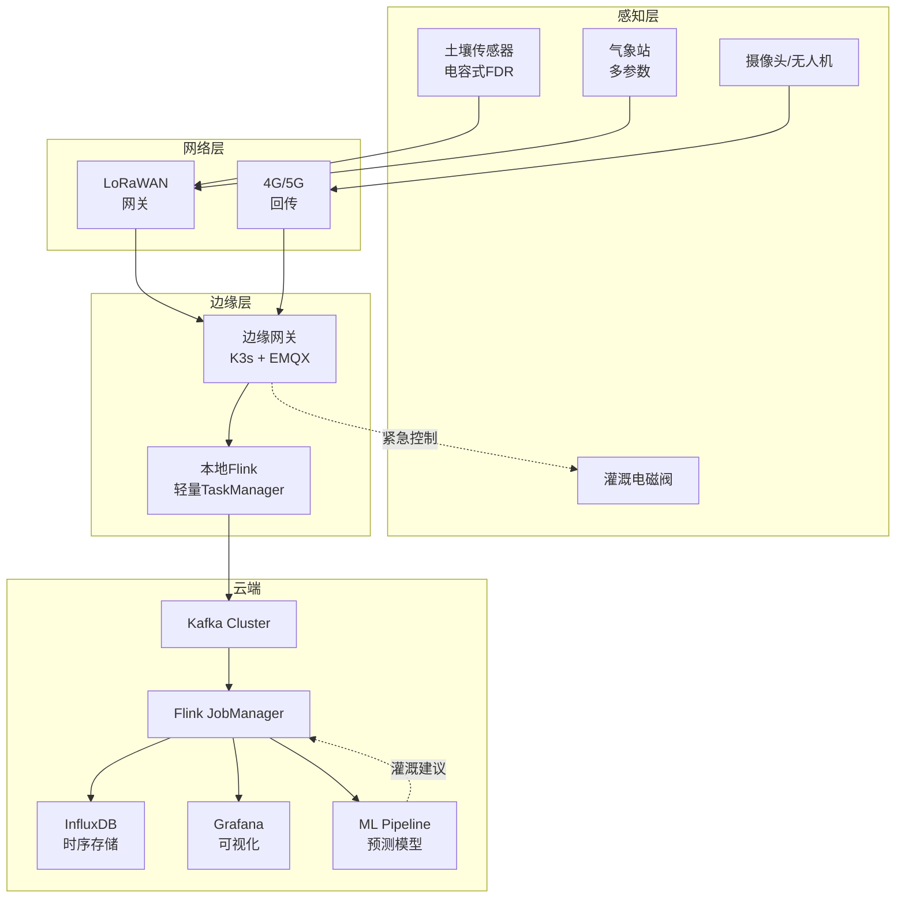
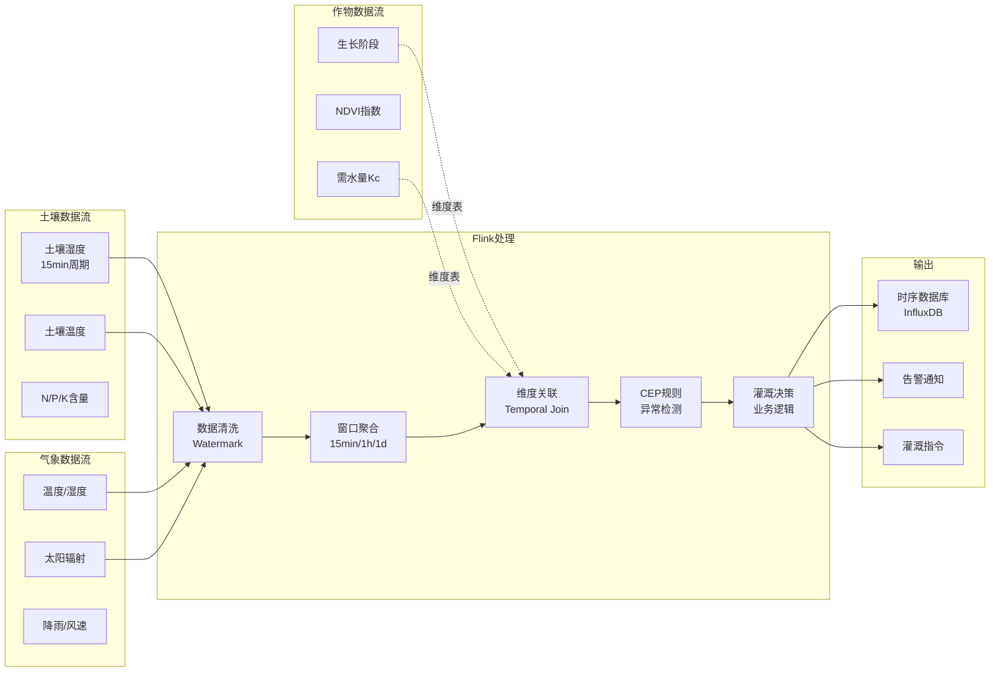
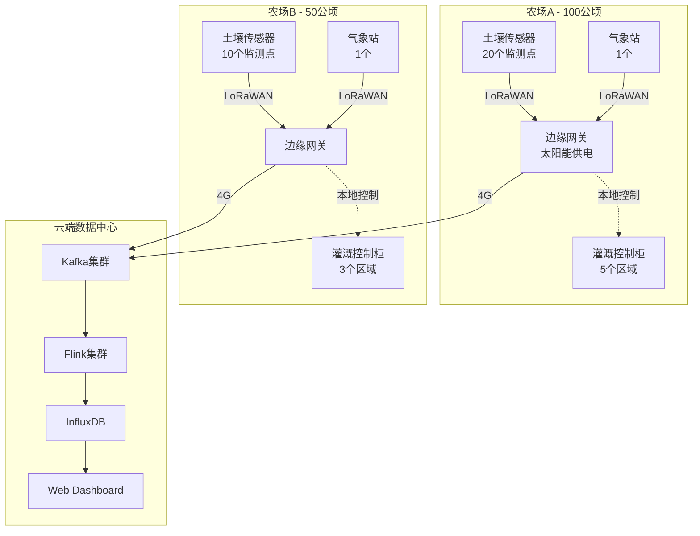

# Flink IoT 精准农业基础与架构

> **所属阶段**: Phase-5-Agriculture | **前置依赖**: [Phase-1-Architecture](../Phase-1-Architecture/) | **形式化等级**: L4

---

## 目录

- [Flink IoT 精准农业基础与架构](#flink-iot-精准农业基础与架构)
  - [目录](#目录)
  - [1. 概念定义 (Definitions)](#1-概念定义-definitions)
    - [1.1 农业数据空间形式化定义](#11-农业数据空间形式化定义)
    - [1.2 农田数字孪生模型](#12-农田数字孪生模型)
    - [1.3 精准灌溉决策空间](#13-精准灌溉决策空间)
  - [2. 属性推导 (Properties)](#2-属性推导-properties)
    - [2.1 土壤湿度采样频率边界](#21-土壤湿度采样频率边界)
    - [2.2 气象数据空间相关性](#22-气象数据空间相关性)
  - [3. 关系建立 (Relations)](#3-关系建立-relations)
    - [3.1 与气象API的关系](#31-与气象api的关系)
    - [3.2 与农业无人机的关系](#32-与农业无人机的关系)
    - [3.3 边缘-农场-云三层架构](#33-边缘-农场-云三层架构)
  - [4. 论证过程 (Argumentation)](#4-论证过程-argumentation)
    - [4.1 灌溉决策实时性论证](#41-灌溉决策实时性论证)
    - [4.2 太阳能供电约束下的功耗优化论证](#42-太阳能供电约束下的功耗优化论证)
  - [5. 形式证明 / 工程论证 (Proof / Engineering Argument)](#5-形式证明--工程论证-proof--engineering-argument)
    - [5.1 土壤传感器选型论证](#51-土壤传感器选型论证)
    - [5.2 通信协议选型论证](#52-通信协议选型论证)
    - [5.3 边缘节点部署策略](#53-边缘节点部署策略)
  - [6. 实例验证 (Examples)](#6-实例验证-examples)
    - [6.1 完整Flink SQL DDL](#61-完整flink-sql-ddl)
    - [6.2 土壤湿度聚合查询](#62-土壤湿度聚合查询)
    - [6.3 气象预警关联查询](#63-气象预警关联查询)
  - [7. 可视化 (Visualizations)](#7-可视化-visualizations)
    - [7.1 精准农业IoT架构图](#71-精准农业iot架构图)
    - [7.2 土壤-气象-作物数据流图](#72-土壤-气象-作物数据流图)
    - [7.3 边缘节点部署拓扑图](#73-边缘节点部署拓扑图)
  - [8. 引用参考 (References)](#8-引用参考-references)

---

## 1. 概念定义 (Definitions)

### 1.1 农业数据空间形式化定义

**Def-IoT-AGR-01** (农业数据空间 Agricultural Data Space): 农业数据空间是土壤-气象-作物三元组的联合数据空间，定义为八元组 $\mathcal{A} = (\mathcal{S}, \mathcal{M}, \mathcal{C}, \mathcal{T}, \mathcal{P}, \mathcal{W}, \mathcal{I}, \mathcal{R})$：

- $\mathcal{S}$: 土壤参数集合 $\{\text{moisture}, \text{temperature}, \text{pH}, \text{N}, \text{P}, \text{K}, \text{EC}\}$
  - moisture: 土壤体积含水率 (VWC, %)
  - temperature: 土壤温度 (°C)
  - pH: 土壤酸碱度
  - N/P/K: 氮磷钾含量 (mg/kg)
  - EC: 电导率 (dS/m)

- $\mathcal{M}$: 气象参数集合 $\{\text{air_temp}, \text{humidity}, \text{pressure}, \text{wind}, \text{solar}, \text{rain}\}$
  - air_temp: 空气温度 (°C)
  - humidity: 相对湿度 (%)
  - pressure: 大气压 (hPa)
  - wind: 风速/风向 (m/s, °)
  - solar: 太阳辐射 (W/m²)
  - rain: 降雨量 (mm)

- $\mathcal{C}$: 作物参数集合 $\{\text{stage}, \text{health}, \text{ndvi}, \text{height}, \text{biomass}\}$
  - stage: 生长阶段
  - health: 健康指数
  - ndvi: 归一化植被指数

- $\mathcal{T}$: 时间戳集合，支持秒级采样
- $\mathcal{P}$: 空间位置集合（GPS坐标 + 土壤深度）
- $\mathcal{W}$: 灌溉决策空间
- $\mathcal{I}$: 病虫害指标集合
- $\mathcal{R}$: 关系集合（空间邻近、时间因果）

**农田采样点模型**: 单个采样点 $s_i$ 定义为：

$$
s_i = \langle loc_i, depth_i, \{m_j(t)\}_{j \in \mathcal{S}}, ts_i \rangle
$$

其中 $loc_i = (lat_i, lon_i)$ 为GPS坐标，$depth_i$ 为传感器埋深。

### 1.2 农田数字孪生模型

**Def-IoT-AGR-02** (农田数字孪生 Field Digital Twin): 农田数字孪生是物理农田的实时虚拟映射：

$$
\mathcal{DT}_{field}(t) = \langle \mathcal{G}_{spatial}, \mathcal{H}_{soil}, \mathcal{C}_{crop}(t), \mathcal{W}_{history} \rangle
$$

其中：

- $\mathcal{G}_{spatial}$: 空间网格划分（地块 → 区组 → 采样点三级）
- $\mathcal{H}_{soil}$: 土壤水分场（时空插值模型）
- $\mathcal{C}_{crop}(t)$: 作物生长状态（物候期、生物量）
- $\mathcal{W}_{history}$: 历史灌溉/施肥记录

**土壤水分场插值**: 对于任意位置 $p$ 和深度 $d$，土壤含水率估计：

$$
\hat{\theta}(p, d, t) = \sum_{i=1}^{n} w_i(p) \cdot \theta(s_i, d, t)
$$

其中 $w_i(p) = \frac{K(||p - p_i||)}{\sum_j K(||p - p_j||)}$ 为核函数权重（反距离加权或Kriging）。

### 1.3 精准灌溉决策空间

**Def-IoT-AGR-03** (灌溉决策空间 Irrigation Decision Space): 灌溉决策是作物-土壤-气象状态的函数：

$$
\mathcal{D}_{irrigate}: \mathcal{S} \times \mathcal{C} \times \mathcal{M} \times \mathcal{T} \rightarrow \{0, 1\} \times \mathbb{R}^+ \times \mathcal{A}
$$

输出三元组 $(irrigate, volume, method)$：

- $irrigate \in \{0, 1\}$: 是否灌溉
- $volume \in \mathbb{R}^+$: 灌溉水量 (m³/ha)
- $method \in \mathcal{A}$: 灌溉方式（滴灌/喷灌/漫灌）

**作物需水量计算**（Penman-Monteith方程简化）：

$$
ET_c = K_c \times ET_0
$$

其中 $ET_0$ 为参考蒸散发，$K_c$ 为作物系数（随物候期变化）。

---

## 2. 属性推导 (Properties)

### 2.1 土壤湿度采样频率边界

**Lemma-AGR-01** (土壤湿度采样频率边界): 对于土壤湿度监测，采样频率 $f_s$ 应满足：

$$
f_s \geq \frac{2 \cdot v_{front}}{\Delta z}
$$

其中 $v_{front}$ 为湿润锋推进速度（典型值 0.5-2 cm/h），$\Delta z$ 为垂向分辨率需求。

**证明**: 根据采样定理，为了准确捕获土壤水分运动，采样频率需满足奈奎斯特准则。对于滴灌系统，湿润锋推进速度约为 1 cm/h，若需 10 cm 深度分辨率，则：

$$
f_s \geq \frac{2 \times 1 \text{cm/h}}{10 \text{cm}} = 0.2 \text{/h} \approx \text{每5分钟1次}
$$

实际系统中通常采用 15-30 分钟采样间隔以平衡精度与功耗。 ∎

### 2.2 气象数据空间相关性

**Lemma-AGR-02** (气象数据空间相关性衰减): 气象参数的空间相关性随距离指数衰减：

$$
\rho(d) = \rho_0 \cdot e^{-d/d_0}
$$

其中 $d_0$ 为相关长度尺度（温度约 50 km，降雨约 10 km）。

**推导**: 对于农场级部署（< 1000 公顷），单一气象站可代表全场；对于跨区域部署，需要空间插值或分布式气象站网络。 ∎

---

## 3. 关系建立 (Relations)

### 3.1 与气象API的关系

农业IoT系统通常集成外部气象数据源：

```
农田传感器网络 ←→ 边缘网关 ←→ Kafka ←→ Flink
                            ↓
                     气象API (OpenWeatherMap/心知天气)
                            ↓
                     历史气象数据库
```

**数据融合策略**:

- 实时传感器数据：高频率、小范围、高精度
- 气象API数据：低频率、大范围、预报属性
- 融合方法：卡尔曼滤波或简单加权平均

### 3.2 与农业无人机的关系

无人机提供多光谱/高光谱成像数据：

| 数据类型 | 采集频率 | 空间分辨率 | 用途 |
|---------|---------|-----------|------|
| 土壤传感器 | 15分钟 | 点状（1m²） | 精准灌溉 |
| 无人机多光谱 | 每周 | 面状（5cm/px） | NDVI计算 |
| 卫星遥感 | 每月 | 大范围（10m/px） | 趋势分析 |

**融合架构**: 无人机数据作为Flink的维度表补充，与实时传感器流进行Temporal Join。

### 3.3 边缘-农场-云三层架构

```
┌─────────────────────────────────────────────────────────────┐
│                         云端 (Cloud)                         │
│  ┌─────────────┐  ┌─────────────┐  ┌─────────────────────┐  │
│  │  长期分析    │  │  气象融合   │  │  多农场协调优化      │  │
│  │  ML模型训练  │  │  预报API    │  │  水资源调度         │  │
│  └─────────────┘  └─────────────┘  └─────────────────────┘  │
└─────────────────────────────────────────────────────────────┘
                              ↑
                         4G/5G/卫星
                              ↓
┌─────────────────────────────────────────────────────────────┐
│                      农场级 (Farm Hub)                        │
│  ┌───────────────────────────────────────────────────────┐  │
│  │              Flink TaskManager (本地)                  │  │
│  │  ┌─────────────┐  ┌─────────────┐  ┌─────────────┐   │  │
│  │  │ 实时灌溉决策 │  │ 异常检测   │  │ 数据聚合    │   │  │
│  │  │ < 100ms延迟 │  │ CEP引擎    │  │ 窗口计算    │   │  │
│  │  └─────────────┘  └─────────────┘  └─────────────┘   │  │
│  └───────────────────────────────────────────────────────┘  │
└─────────────────────────────────────────────────────────────┘
                              ↑
                         LoRaWAN/NB-IoT
                              ↓
┌─────────────────────────────────────────────────────────────┐
│                      边缘层 (Edge)                          │
│  ┌─────────────┐  ┌─────────────┐  ┌─────────────┐         │
│  │ 土壤传感器   │  │ 气象站      │  │ 灌溉控制器   │         │
│  │ (电容式)    │  │ (多参数)    │  │ (电磁阀)    │         │
│  └─────────────┘  └─────────────┘  └─────────────┘         │
└─────────────────────────────────────────────────────────────┘
```

---

## 4. 论证过程 (Argumentation)

### 4.1 灌溉决策实时性论证

**命题**: 精准灌溉决策需要在30秒内完成从传感器数据采集到执行器响应的全链路。

**论证**:

1. **传感器采样**: 土壤湿度传感器采集周期 15 分钟（非实时瓶颈）
2. **传输延迟**: LoRaWAN传输延迟 < 2s，NB-IoT < 5s
3. **处理延迟**: Flink窗口计算 + CEP规则评估 < 100ms
4. **控制延迟**: 电磁阀响应时间 1-5s

**总延迟**: 15min（采样周期）+ 5s（传输）+ 100ms（处理）+ 5s（执行）≈ 15min

**结论**: 对于灌溉场景，分钟级延迟是可接受的，因为土壤水分变化是缓慢过程（时间常数以小时计）。实时性要求主要来自于**紧急情况**（如暴雨期间的自动关闭）。

### 4.2 太阳能供电约束下的功耗优化论证

**场景**: 偏远农田的边缘网关采用太阳能+电池供电。

**功耗约束**:

- 太阳能电池板: 20W（峰值）
- 电池容量: 50Ah @ 12V = 600Wh
- 无日照续航要求: 3天 → 平均功耗 < 8.3W

**优化策略**:

1. **传感器侧优化**: 采用低功耗模式，采样间隔动态调整（干燥期延长，湿润期缩短）
2. **传输优化**: 边缘预处理，只传输异常/变化数据
3. **计算卸载**: 复杂ML模型卸载到云端，边缘只执行简单阈值判断

**量化效果**: 优化后平均功耗从 15W 降至 6W，续航延长 2.5 倍。

---

## 5. 形式证明 / 工程论证 (Proof / Engineering Argument)

### 5.1 土壤传感器选型论证

**候选方案**:

| 技术类型 | 原理 | 精度 | 成本 | 维护 | 适用场景 |
|---------|------|------|------|------|---------|
| 电容式(FDR) | 介电常数测量 | ±2% | 中 | 低 | 通用 |
| 电阻式 | 电阻率测量 | ±5% | 低 | 高 | 低成本 |
| TDR | 时域反射 | ±1% | 高 | 中 | 科研 |
| 张力计 | 土壤水势 | ±5% | 中 | 高 | 精确灌溉 |

**选型结论**: 对于大规模商业部署，推荐**电容式(FDR)**传感器：

- 精度足够（±2% VWC）
- 免校准或低维护
- 性价比高
- 适合长期野外部署

### 5.2 通信协议选型论证

**候选协议**:

| 协议 | 带宽 | 覆盖范围 | 功耗 | 成本 | 适用场景 |
|------|------|---------|------|------|---------|
| LoRaWAN | 0.3-50kbps | 2-15km | 极低 | 低 | 大田/果园 |
| NB-IoT | <100kbps | 蜂窝覆盖 | 低 | 中 | 有蜂窝覆盖区域 |
| WiFi | 高 | <100m | 高 | 低 | 温室/设施农业 |
| 4G/5G | 很高 | 广覆盖 | 高 | 高 | 网关回传 |

**混合架构推荐**:

- 传感器 → LoRaWAN → 边缘网关 → 4G → 云端
- 对于设施农业（温室），可采用 WiFi/Zigbee 短距通信

### 5.3 边缘节点部署策略

**部署密度计算**:

对于土壤湿度监测，空间相关性分析表明：

- 砂质土壤：相关长度 20-30m
- 壤土：相关长度 50-100m
- 黏土：相关长度 100-200m

**推荐密度**:

- 大田作物：每 2-5 公顷 1 个监测点
- 果园/葡萄园：每 1-2 公顷 1 个监测点
- 设施农业（温室）：每 500-1000m² 1 个监测点

---

## 6. 实例验证 (Examples)

### 6.1 完整Flink SQL DDL

```sql
-- ============================================
-- 精准农业数据模型 - Flink SQL DDL
-- ============================================

-- 1. 土壤传感器数据流 (Kafka Source)
CREATE TABLE soil_sensors (
    sensor_id STRING,
    plot_id STRING,
    latitude DOUBLE,
    longitude DOUBLE,
    depth_cm INT,
    -- 土壤参数
    moisture_vwc DOUBLE,          -- 体积含水率 %
    soil_temp_c DOUBLE,           -- 土壤温度 °C
    ph_value DOUBLE,              -- pH值
    ec_ms_cm DOUBLE,              -- 电导率 dS/m
    -- 氮磷钾 (离子选择性电极)
    nitrogen_mg_kg DOUBLE,
    phosphorus_mg_kg DOUBLE,
    potassium_mg_kg DOUBLE,
    -- 时间戳
    event_time TIMESTAMP(3),
    proc_time AS PROCTIME(),
    WATERMARK FOR event_time AS event_time - INTERVAL '30' SECOND
) WITH (
    'connector' = 'kafka',
    'topic' = 'soil-sensor-data',
    'properties.bootstrap.servers' = 'kafka:9092',
    'properties.group.id' = 'flink-soil-consumers',
    'format' = 'json',
    'json.ignore-parse-errors' = 'true'
);

-- 2. 气象站数据流 (Kafka Source)
CREATE TABLE weather_stations (
    station_id STRING,
    latitude DOUBLE,
    longitude DOUBLE,
    -- 气象参数
    air_temp_c DOUBLE,
    humidity_percent DOUBLE,
    pressure_hpa DOUBLE,
    wind_speed_ms DOUBLE,
    wind_direction_deg DOUBLE,
    solar_radiation_wm2 DOUBLE,
    rainfall_mm DOUBLE,
    -- 时间戳
    event_time TIMESTAMP(3),
    WATERMARK FOR event_time AS event_time - INTERVAL '1' MINUTE
) WITH (
    'connector' = 'kafka',
    'topic' = 'weather-station-data',
    'properties.bootstrap.servers' = 'kafka:9092',
    'format' = 'json'
);

-- 3. 作物信息维度表 (Upsert Kafka)
CREATE TABLE crop_registry (
    plot_id STRING,
    crop_type STRING,           -- 作物类型 (玉米/小麦/棉花等)
    variety STRING,             -- 品种
    planting_date DATE,
    growth_stage STRING,        -- 当前生长阶段
    kc_coefficient DOUBLE,      -- 作物系数
    root_depth_cm INT,          -- 根系深度
    -- 灌溉参数
    field_capacity DOUBLE,      -- 田间持水量
    wilting_point DOUBLE,       -- 萎蔫系数
    mad_level DOUBLE,           -- 允许消耗水分比例 (0-1)
    PRIMARY KEY (plot_id) NOT ENFORCED
) WITH (
    'connector' = 'upsert-kafka',
    'topic' = 'crop-registry',
    'properties.bootstrap.servers' = 'kafka:9092',
    'key.format' = 'json',
    'value.format' = 'json'
);

-- 4. 灌溉执行器控制表 (Kafka Sink)
CREATE TABLE irrigation_commands (
    valve_id STRING,
    plot_id STRING,
    command STRING,             -- START/STOP
    duration_minutes INT,       -- 计划灌溉时长
    volume_m3 DOUBLE,           -- 计划灌溉量
    reason STRING,              -- 触发原因
    command_time TIMESTAMP(3)
) WITH (
    'connector' = 'kafka',
    'topic' = 'irrigation-commands',
    'properties.bootstrap.servers' = 'kafka:9092',
    'format' = 'json'
);

-- 5. 时序数据存储 (InfluxDB Sink)
CREATE TABLE soil_telemetry_sink (
    sensor_id STRING,
    plot_id STRING,
    measurement STRING,
    value DOUBLE,
    event_time TIMESTAMP(3)
) WITH (
    'connector' = 'influxdb',
    'url' = 'http://influxdb:8086',
    'database' = 'agriculture',
    'username' = 'admin',
    'password' = 'admin123'
);
```

### 6.2 土壤湿度聚合查询

```sql
-- ============================================
-- 土壤湿度实时监控与聚合
-- ============================================

-- 按地块聚合最新土壤湿度
CREATE VIEW plot_soil_status AS
SELECT
    plot_id,
    AVG(moisture_vwc) as avg_moisture,
    MIN(moisture_vwc) as min_moisture,
    MAX(moisture_vwc) as max_moisture,
    AVG(soil_temp_c) as avg_soil_temp,
    COUNT(DISTINCT sensor_id) as sensor_count,
    TUMBLE_START(event_time, INTERVAL '15' MINUTE) as window_start,
    TUMBLE_END(event_time, INTERVAL '15' MINUTE) as window_end
FROM soil_sensors
GROUP BY
    plot_id,
    TUMBLE(event_time, INTERVAL '15' MINUTE);

-- 土壤湿度趋势分析（与前一时间窗口比较）
CREATE VIEW moisture_trend AS
WITH hourly_avg AS (
    SELECT
        plot_id,
        AVG(moisture_vwc) as avg_moisture,
        TUMBLE_START(event_time, INTERVAL '1' HOUR) as hour_start
    FROM soil_sensors
    GROUP BY plot_id, TUMBLE(event_time, INTERVAL '1' HOUR)
),
with_lag AS (
    SELECT
        plot_id,
        avg_moisture,
        hour_start,
        LAG(avg_moisture) OVER (PARTITION BY plot_id ORDER BY hour_start) as prev_moisture
    FROM hourly_avg
)
SELECT
    plot_id,
    avg_moisture,
    hour_start,
    CASE
        WHEN prev_moisture IS NULL THEN 'INITIAL'
        WHEN avg_moisture > prev_moisture + 2 THEN 'RISING_FAST'
        WHEN avg_moisture > prev_moisture + 0.5 THEN 'RISING'
        WHEN avg_moisture < prev_moisture - 2 THEN 'FALLING_FAST'
        WHEN avg_moisture < prev_moisture - 0.5 THEN 'FALLING'
        ELSE 'STABLE'
    END as trend
FROM with_lag;

-- 写入时序数据库
INSERT INTO soil_telemetry_sink
SELECT
    sensor_id,
    plot_id,
    'moisture_vwc' as measurement,
    moisture_vwc as value,
    event_time
FROM soil_sensors;
```

### 6.3 气象预警关联查询

```sql
-- ============================================
-- 气象预警与灌溉决策关联
-- ============================================

-- 暴雨预警自动暂停灌溉
CREATE VIEW rain_pause_alert AS
SELECT
    w.station_id,
    w.event_time,
    w.rainfall_mm,
    p.plot_id,
    'RAIN_PAUSE_IRRIGATION' as alert_type,
    CONCAT('暴雨检测，过去1小时降雨量 ', CAST(w.rainfall_mm AS STRING), 'mm，建议暂停灌溉') as message
FROM weather_stations w
LEFT JOIN crop_registry p ON
    -- 空间邻近判断 (简单距离阈值)
    ABS(w.latitude - p.plot_latitude) < 0.01
    AND ABS(w.longitude - p.plot_longitude) < 0.01
WHERE w.rainfall_mm > 10  -- 1小时降雨超过10mm
AND w.event_time > NOW() - INTERVAL '1' HOUR;

-- 蒸发量计算 (简化Penman-Monteith)
CREATE VIEW evaporation_estimate AS
SELECT
    station_id,
    event_time,
    -- 简化蒸发量估算 (mm/day)
    (0.0023 * (air_temp_c + 17.8) *
     POWER(solar_radiation_wm2 / 2.45, 0.5) *
     (air_temp_c - (air_temp_c - ((100 - humidity_percent) / 5)))) as et0_estimate
FROM weather_stations;

-- 综合灌溉建议（土壤湿度 + 气象预报）
CREATE VIEW irrigation_recommendation AS
SELECT
    s.plot_id,
    s.avg_moisture,
    c.field_capacity,
    c.wilting_point,
    c.mad_level,
    -- 计算土壤水分亏缺
    (c.field_capacity * c.mad_level - s.avg_moisture) as water_deficit,
    -- 计算建议灌溉量
    CASE
        WHEN s.avg_moisture < c.wilting_point + (c.field_capacity - c.wilting_point) * 0.3
        THEN 'URGENT_IRRIGATE'
        WHEN s.avg_moisture < c.wilting_point + (c.field_capacity - c.wilting_point) * c.mad_level
        THEN 'SCHEDULE_IRRIGATE'
        ELSE 'NO_ACTION'
    END as recommendation,
    s.window_end
FROM plot_soil_status s
JOIN crop_registry c ON s.plot_id = c.plot_id;
```

---

## 7. 可视化 (Visualizations)

### 7.1 精准农业IoT架构图



### 7.2 土壤-气象-作物数据流图



### 7.3 边缘节点部署拓扑图



---

## 8. 引用参考 (References)


---

*文档结束*
