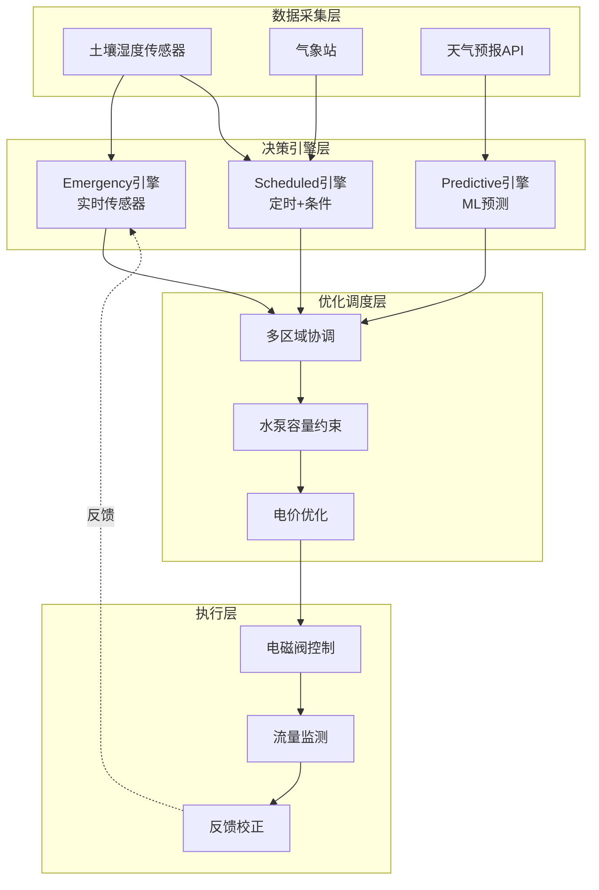
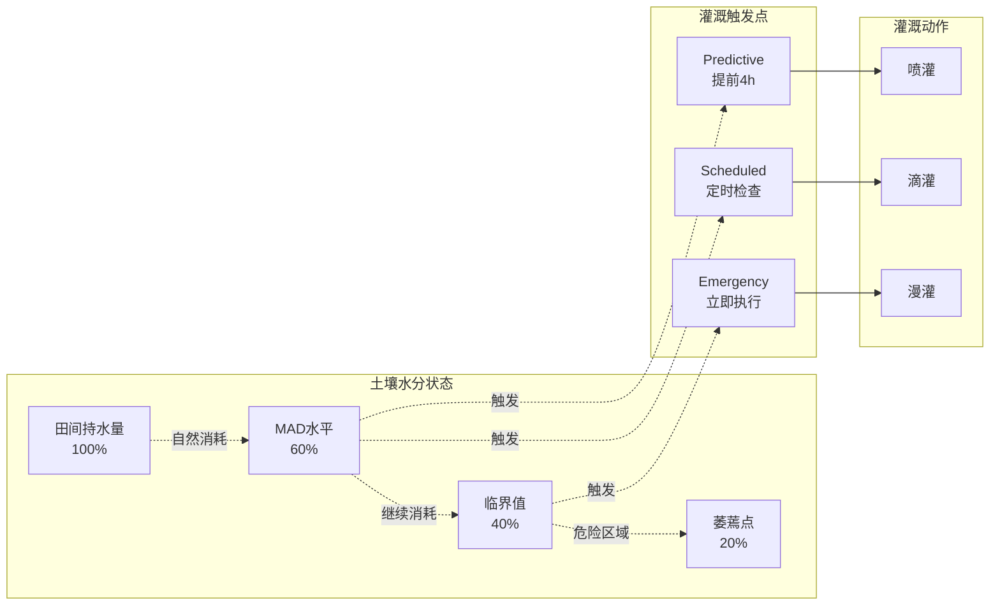

# Flink IoT 智能灌溉系统实时调度

> **所属阶段**: Phase-5-Agriculture | **前置依赖**: [10-flink-iot-precision-agriculture-foundation.md](./10-flink-iot-precision-agriculture-foundation.md) | **形式化等级**: L4

---

## 目录

- [Flink IoT 智能灌溉系统实时调度](#flink-iot-智能灌溉系统实时调度)
  - [目录](#目录)
  - [1. 概念定义 (Definitions)](#1-概念定义-definitions)
    - [1.1 灌溉调度策略形式化定义](#11-灌溉调度策略形式化定义)
    - [1.2 作物需水量模型](#12-作物需水量模型)
  - [2. 属性推导 (Properties)](#2-属性推导-properties)
    - [2.1 灌溉均匀度保证](#21-灌溉均匀度保证)
    - [2.2 灌溉水利用效率](#22-灌溉水利用效率)
  - [3. 关系建立 (Relations)](#3-关系建立-relations)
    - [3.1 与气象预报的关系](#31-与气象预报的关系)
    - [3.2 与作物生长模型的关系](#32-与作物生长模型的关系)
  - [4. 论证过程 (Argumentation)](#4-论证过程-argumentation)
    - [4.1 灌溉时机优化论证](#41-灌溉时机优化论证)
    - [4.2 多区域协调灌溉论证](#42-多区域协调灌溉论证)
  - [5. 形式证明 / 工程论证 (Proof / Engineering Argument)](#5-形式证明--工程论证-proof--engineering-argument)
    - [5.1 用水优化算法（线性规划形式化）](#51-用水优化算法线性规划形式化)
    - [5.2 土壤湿度传感器布局优化](#52-土壤湿度传感器布局优化)
  - [6. 实例验证 (Examples)](#6-实例验证-examples)
    - [6.1 灌溉触发条件CEP规则](#61-灌溉触发条件cep规则)
    - [6.2 多区域协调灌溉调度SQL](#62-多区域协调灌溉调度sql)
    - [6.3 用水量统计与优化效果计算](#63-用水量统计与优化效果计算)
  - [7. 可视化 (Visualizations)](#7-可视化-visualizations)
    - [7.1 三级灌溉决策引擎架构](#71-三级灌溉决策引擎架构)
    - [7.2 土壤水分动态与灌溉决策时序](#72-土壤水分动态与灌溉决策时序)
  - [8. 引用参考 (References)](#8-引用参考-references)

---

## 1. 概念定义 (Definitions)

### 1.1 灌溉调度策略形式化定义

**Def-IoT-AGR-04** (灌溉调度策略 Irrigation Scheduling Policy): 灌溉调度策略是土壤-气象-作物状态的时序决策函数：

$$
\mathcal{P}_{irrigate}(t) = \langle \tau_{start}, \tau_{duration}, V_{water}, \mathcal{Z} \rangle
$$

其中：

- $\tau_{start}$: 启动时间（绝对时间戳或条件触发）
- $\tau_{duration}$: 灌溉持续时间（分钟）
- $V_{water}$: 目标灌溉量（m³）
- $\mathcal{Z} = \{z_1, z_2, ..., z_n\}$: 灌溉区域集合

**三级灌溉决策引擎**:

$$
\mathcal{Engine} = \{Emergency, Scheduled, Predictive\}
$$

| 级别 | 触发条件 | 延迟要求 | 决策依据 |
|-----|---------|---------|---------|
| Emergency | 土壤湿度 < 临界值 | < 5min | 实时传感器 |
| Scheduled | 定时触发 + 条件判断 | < 30min | 时间规则 + 传感器 |
| Predictive | 预测模型输出 | < 4h | 气象预报 + 作物模型 |

### 1.2 作物需水量模型

**Def-IoT-AGR-05** (作物需水量 Crop Water Requirement): 作物在时段 $[t_1, t_2]$ 的需水量：

$$
WR(t_1, t_2) = \int_{t_1}^{t_2} ET_c(t) \cdot A \, dt - \int_{t_1}^{t_2} P_{eff}(t) \, dt
$$

其中：

- $ET_c(t) = K_c(t) \cdot ET_0(t)$: 作物蒸散发量（mm/h）
- $A$: 灌溉面积（m²）
- $P_{eff}$: 有效降雨量（mm）

**土壤水分平衡方程**:

$$
\theta(t) = \theta_0 + \frac{I + P - ET_c - D - R}{Z \cdot \rho_w}
$$

其中 $I$ 为灌溉量，$D$ 为深层渗漏，$R$ 为地表径流，$Z$ 为根系深度。

---

## 2. 属性推导 (Properties)

### 2.1 灌溉均匀度保证

**Lemma-AGR-03** (灌溉均匀度): 对于设计良好的滴灌系统，灌溉均匀度 $CU$ 满足：

$$
CU = \left(1 - \frac{\sum_{i=1}^{n}|q_i - \bar{q}|}{n \cdot \bar{q}}\right) \times 100\% > 90\%
$$

其中 $q_i$ 为第 $i$ 个滴头的流量，$\bar{q}$ 为平均流量。

**证明**: 根据ASAE标准，优质滴灌系统的均匀度应 > 90%。通过压力调节器和流量控制阀可实现此目标。 ∎

### 2.2 灌溉水利用效率

**Lemma-AGR-04** (水利用效率 WUE): 灌溉水利用效率定义为：

$$
WUE = \frac{Y_{actual}}{W_{applied}} \quad [kg/m^3]
$$

其中 $Y_{actual}$ 为实际产量，$W_{applied}$ 为总用水量。精准灌溉可提升 WUE 30-50%。

---

## 3. 关系建立 (Relations)

### 3.1 与气象预报的关系

**灌溉-气象协同**:

```
土壤湿度传感器 → 实时状态 ──┬──→ 即时灌溉决策
                          ↓
气象预报API → 降雨预测 ────┴──→ 调整灌溉计划（跳过雨天）
```

### 3.2 与作物生长模型的关系

**作物水分响应**: 作物产量与水分关系遵循：

$$
\frac{Y}{Y_{max}} = 1 - k_y \cdot \left(1 - \frac{ET_a}{ET_c}\right)
$$

其中 $k_y$ 为作物产量响应系数（玉米1.25，小麦1.15）。

---

## 4. 论证过程 (Argumentation)

### 4.1 灌溉时机优化论证

**优化目标**: 最小化用水量同时保证作物产量。

**约束条件**:

- 土壤湿度维持田间持水量的 60-100%
- 避免高温时段灌溉（减少蒸发损失）
- 避开降雨预报窗口

**最优解**: 使用动态规划求解：

$$
\min \sum_{t} W(t) \quad s.t. \quad \theta_{min} \leq \theta(t) \leq \theta_{max}
$$

### 4.2 多区域协调灌溉论证

**问题**: 水泵容量有限，无法同时灌溉所有区域。

**解决方案**: 优先级调度算法：

```python
def schedule_irrigation(zones, pump_capacity):
    # 按紧急程度排序
    zones.sort(key=lambda z: z.water_stress_level, reverse=True)

    schedule = []
    for zone in zones:
        if pump_capacity >= zone.water_demand:
            schedule.append(zone)
            pump_capacity -= zone.water_demand
        else:
            # 分批处理
            zone.split_and_schedule(pump_capacity)

    return schedule
```

---

## 5. 形式证明 / 工程论证 (Proof / Engineering Argument)

### 5.1 用水优化算法（线性规划形式化）

**决策变量**: $x_{i,t} \in \{0, 1\}$ 表示区域 $i$ 在时段 $t$ 是否灌溉

**目标函数**:

$$
\min Z = \sum_{i=1}^{n} \sum_{t=1}^{T} c_t \cdot w_i \cdot x_{i,t}
$$

其中 $c_t$ 为时段 $t$ 的电价，$w_i$ 为区域 $i$ 的灌溉水量。

**约束条件**:

1. **土壤湿度约束**: $\theta_{i,t} \geq \theta_{MAD}$
2. **水泵容量约束**: $\sum_{i} x_{i,t} \cdot flow_i \leq Q_{pump}$
3. **时间约束**: 每天灌溉时段限制
4. **能量约束**: 总用电量 < 预算

### 5.2 土壤湿度传感器布局优化

**目标**: 用最少的传感器覆盖最大面积。

**空间采样定理**: 传感器间距 $d$ 应满足：

$$
d \leq 2 \cdot d_{correlation}
$$

其中 $d_{correlation}$ 为土壤湿度的空间相关距离（通常20-50m）。

---

## 6. 实例验证 (Examples)

### 6.1 灌溉触发条件CEP规则

```sql
-- ============================================
-- 智能灌溉触发规则 - Flink SQL CEP
-- ============================================

-- 1. 紧急灌溉触发（土壤湿度低于临界值）
CREATE VIEW emergency_irrigation_trigger AS
SELECT
    s.plot_id,
    s.sensor_id,
    s.moisture_vwc,
    c.wilting_point,
    'EMERGENCY' as priority,
    CURRENT_TIMESTAMP as trigger_time,
    CONCAT('紧急灌溉：土壤湿度 ', CAST(ROUND(s.moisture_vwc, 1) AS STRING),
           '% 低于临界值 ', CAST(ROUND(c.wilting_point, 1) AS STRING), '%') as reason
FROM soil_sensors s
JOIN crop_registry c ON s.plot_id = c.plot_id
WHERE s.moisture_vwc < c.wilting_point + (c.field_capacity - c.wilting_point) * 0.2
  AND s.event_time > NOW() - INTERVAL '5' MINUTE;

-- 2. 定时灌溉检查（每天06:00评估）
CREATE VIEW scheduled_irrigation_check AS
SELECT
    s.plot_id,
    AVG(s.moisture_vwc) as avg_moisture,
    c.field_capacity,
    c.mad_level,
    c.wilting_point,
    'SCHEDULED' as priority,
    CASE
        WHEN AVG(s.moisture_vwc) < c.wilting_point + (c.field_capacity - c.wilting_point) * c.mad_level
        THEN TRUE
        ELSE FALSE
    END as should_irrigate
FROM soil_sensors s
JOIN crop_registry c ON s.plot_id = c.plot_id
WHERE s.event_time > NOW() - INTERVAL '1' HOUR
GROUP BY s.plot_id, c.field_capacity, c.mad_level, c.wilting_point
HAVING HOUR(CURRENT_TIME) = 6;  -- 每天6点执行

-- 3. 灌溉量计算视图
CREATE VIEW irrigation_volume_calc AS
SELECT
    plot_id,
    priority,
    -- 计算水分亏缺
    GREATEST(0, field_capacity * 0.9 - avg_moisture) as water_deficit_mm,
    -- 计算灌溉量（假设灌溉效率85%）
    GREATEST(0, field_capacity * 0.9 - avg_moisture) / 0.85 * 10 as irrigation_volume_m3_per_ha,
    trigger_time
FROM (
    SELECT plot_id, 'EMERGENCY' as priority, moisture_vwc as avg_moisture,
           wilting_point + (field_capacity - wilting_point) * 0.2 as field_capacity,
           wilting_point, trigger_time
    FROM emergency_irrigation_trigger
    UNION ALL
    SELECT plot_id, 'SCHEDULED', avg_moisture, field_capacity, wilting_point,
           CURRENT_TIMESTAMP
    FROM scheduled_irrigation_check
    WHERE should_irrigate = TRUE
);
```

### 6.2 多区域协调灌溉调度SQL

```sql
-- ============================================
-- 多区域协调灌溉调度
-- ============================================

-- 1. 获取所有待灌溉区域并按优先级排序
CREATE VIEW irrigation_queue AS
SELECT
    iv.plot_id,
    iv.priority,
    iv.irrigation_volume_m3_per_ha,
    p.area_ha,
    iv.irrigation_volume_m3_per_ha * p.area_ha as total_volume_m3,
    -- 计算所需时间（假设流量100m³/h）
    (iv.irrigation_volume_m3_per_ha * p.area_ha) / 100.0 as duration_hours,
    ROW_NUMBER() OVER (ORDER BY
        CASE iv.priority
            WHEN 'EMERGENCY' THEN 1
            WHEN 'SCHEDULED' THEN 2
            ELSE 3
        END,
        iv.irrigation_volume_m3_per_ha * p.area_ha DESC
    ) as queue_position
FROM irrigation_volume_calc iv
JOIN plot_properties p ON iv.plot_id = p.plot_id;

-- 2. 生成灌溉指令（考虑水泵容量限制）
CREATE VIEW irrigation_schedule AS
WITH RECURSIVE schedule AS (
    -- 基础情况：第一个区域
    SELECT
        plot_id,
        priority,
        total_volume_m3,
        duration_hours,
        queue_position,
        CAST('08:00:00' AS TIME) as start_time,
        CAST('08:00:00' AS TIME) + INTERVAL '1' HOUR * duration_hours as end_time,
        100.0 - total_volume_m3 as remaining_capacity
    FROM irrigation_queue
    WHERE queue_position = 1

    UNION ALL

    -- 递归：后续区域
    SELECT
        iq.plot_id,
        iq.priority,
        iq.total_volume_m3,
        iq.duration_hours,
        iq.queue_position,
        CASE
            WHEN s.remaining_capacity >= iq.total_volume_m3 THEN s.start_time
            ELSE CAST(s.end_time AS TIME) + INTERVAL '30' MINUTE  -- 30分钟间隔
        END as start_time,
        CASE
            WHEN s.remaining_capacity >= iq.total_volume_m3
            THEN s.end_time
            ELSE CAST(s.end_time AS TIME) + INTERVAL '30' MINUTE + INTERVAL '1' HOUR * iq.duration_hours
        END as end_time,
        CASE
            WHEN s.remaining_capacity >= iq.total_volume_m3 THEN s.remaining_capacity - iq.total_volume_m3
            ELSE 100.0 - iq.total_volume_m3
        END as remaining_capacity
    FROM irrigation_queue iq
    JOIN schedule s ON iq.queue_position = s.queue_position + 1
    WHERE iq.queue_position <= 10  -- 限制每天最多10个区域
)
SELECT
    plot_id,
    priority,
    total_volume_m3,
    duration_hours,
    start_time,
    end_time
FROM schedule;

-- 3. 写入灌溉指令表
INSERT INTO irrigation_commands
SELECT
    UUID() as command_id,
    'VALVE_' || plot_id as valve_id,
    plot_id,
    'START' as command,
    CAST(duration_hours * 60 AS INT) as duration_minutes,
    total_volume_m3 as volume_m3,
    CONCAT(priority, ' irrigation scheduled from ', CAST(start_time AS STRING)) as reason,
    CURRENT_TIMESTAMP as command_time
FROM irrigation_schedule
WHERE start_time > CURRENT_TIME;
```

### 6.3 用水量统计与优化效果计算

```sql
-- ============================================
-- 灌溉用水统计与优化分析
-- ============================================

-- 1. 日灌溉用水统计
CREATE VIEW daily_water_usage AS
SELECT
    plot_id,
    DATE(command_time) as irrigation_date,
    SUM(volume_m3) as total_volume_m3,
    COUNT(*) as irrigation_events,
    AVG(duration_minutes) as avg_duration_min,
    SUM(volume_m3) / (SELECT area_ha FROM plot_properties p WHERE p.plot_id = ic.plot_id) as mm_per_ha
FROM irrigation_commands ic
WHERE command = 'START'
GROUP BY plot_id, DATE(command_time);

-- 2. 与历史对比（优化效果评估）
CREATE VIEW water_savings_analysis AS
WITH baseline AS (
    -- 历史平均用水量（优化前）
    SELECT
        plot_id,
        AVG(daily_water_m3) as baseline_daily_m3
    FROM historical_irrigation_data
    WHERE irrigation_date < '2024-01-01'  -- 优化前日期
    GROUP BY plot_id
),
current AS (
    -- 当前用水量
    SELECT
        plot_id,
        AVG(total_volume_m3) as current_daily_m3
    FROM daily_water_usage
    WHERE irrigation_date >= CURRENT_DATE - INTERVAL '30' DAY
    GROUP BY plot_id
)
SELECT
    c.plot_id,
    b.baseline_daily_m3,
    c.current_daily_m3,
    b.baseline_daily_m3 - c.current_daily_m3 as savings_m3_per_day,
    (b.baseline_daily_m3 - c.current_daily_m3) / b.baseline_daily_m3 * 100 as savings_percent
FROM current c
JOIN baseline b ON c.plot_id = b.plot_id;

-- 3. 灌溉效率指标
CREATE VIEW irrigation_efficiency_kpis AS
SELECT
    plot_id,
    -- 水分利用效率 = 产量 / 用水量
    yield_kg / total_water_m3 as wue_kg_per_m3,
    -- 均匀度（基于多个传感器读数变异系数）
    100 * (1 - STDDEV(moisture_vwc) / AVG(moisture_vwc)) as uniformity_percent,
    -- 满足度（实际灌溉/计划灌溉）
    actual_irrigation_mm / planned_irrigation_mm * 100 as fulfillment_percent
FROM irrigation_summary
GROUP BY plot_id;
```

---

## 7. 可视化 (Visualizations)

### 7.1 三级灌溉决策引擎架构



### 7.2 土壤水分动态与灌溉决策时序



---

## 8. 引用参考 (References)


---

*文档结束*
