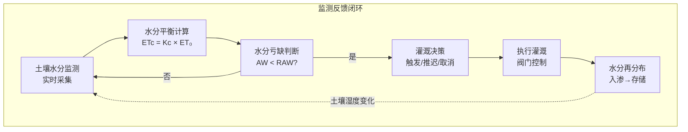
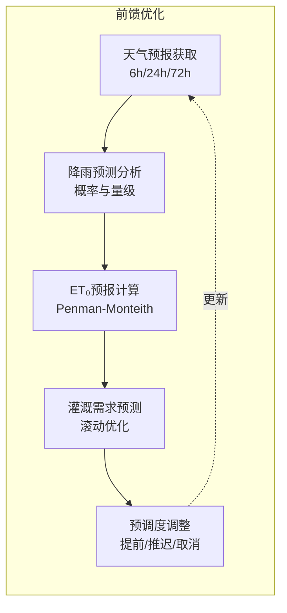
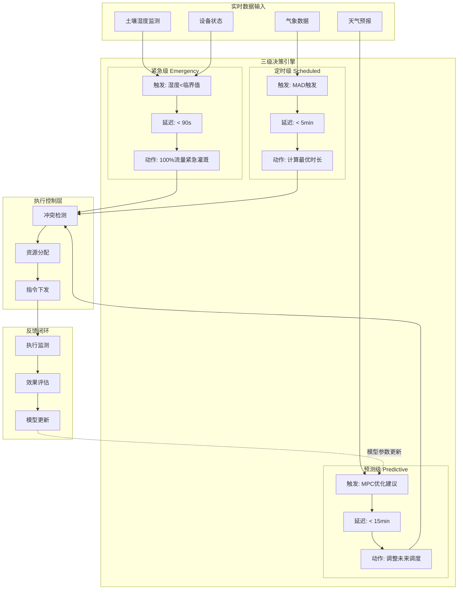

# Flink-IoT 智能灌溉系统实时调度

> **所属阶段**: Flink-IoT-Authority-Alignment/Phase-5-Agriculture
> **前置依赖**: [10-flink-iot-precision-agriculture-foundation.md](./10-flink-iot-precision-agriculture-foundation.md)
> **形式化等级**: L4 (工程严格性)
> **文档版本**: v1.0
> **最后更新**: 2026-04-05

---

## 1. 概念定义 (Definitions)

### 1.1 灌溉调度策略

**定义 1.1 (灌溉调度策略)** [Def-IoT-AGR-04]

一个**灌溉调度策略** $\pi$ 是从系统状态到控制动作的映射函数：

$$\pi: \mathcal{S} \times \mathcal{T} \rightarrow \mathcal{A}$$

其中：

- **状态空间** $\mathcal{S} = \mathcal{M} \times \mathcal{W} \times \mathcal{C} \times \mathcal{R}$:
  - $\mathcal{M}$: 土壤湿度状态（各监测点矩阵）
  - $\mathcal{W}$: 气象状态（实时+预报）
  - $\mathcal{C}$: 作物生长状态（生育期、需水临界期）
  - $\mathcal{R}$: 资源状态（可用水量、能源、设备可用性）

- **动作空间** $\mathcal{A} \subseteq 2^{(z, q, t, d)}$:
  - $z \in \mathcal{Z}$: 灌溉区域（阀门组）
  - $q \in [0, Q_{max}(z)]$: 流量设定
  - $t \in \mathbb{T}$: 开始时间
  - $d \in [0, D_{max}]$: 持续时长

- **策略类型**:
  1. **时间触发策略** $\pi_{time}$: 固定时刻表，$\pi_{time}(t) = a$ if $t \in T_{schedule}$
  2. **阈值触发策略** $\pi_{threshold}$: $\pi_{threshold}(m) = a$ if $m < \theta_{critical}$
  3. **预测优化策略** $\pi_{mpc}$: Model Predictive Control，滚动优化

### 1.2 作物需水量模型

**定义 1.2 (作物需水量模型)** [Def-IoT-AGR-05]

**作物需水量** $ET_c$（Crop Evapotranspiration）是作物在特定生长阶段和气候条件下的蒸散发量，由双系数法计算：

$$ET_c = (K_{cb} + K_e) \cdot ET_0$$

其中：

- **参考蒸散发** $ET_0$（mm/day）：基于Penman-Monteith公式[^5]
  $$ET_0 = \frac{0.408\Delta(R_n - G) + \gamma\frac{900}{T+273}u_2(e_s - e_a)}{\Delta + \gamma(1 + 0.34u_2)}$$

  变量说明：
  - $R_n$: 净辐射（MJ/m²/day）
  - $G$: 土壤热通量（MJ/m²/day）
  - $T$: 平均气温（℃）
  - $u_2$: 2米高风速（m/s）
  - $e_s$: 饱和水汽压（kPa）
  - $e_a$: 实际水汽压（kPa）
  - $\Delta$: 饱和水汽压-温度曲线斜率
  - $\gamma$: 湿度计常数

- **基础作物系数** $K_{cb}$: 反映作物蒸腾特性，随生育期变化

  | 生育阶段 | 玉米 | 小麦 | 番茄 | 葡萄 |
  |----------|------|------|------|------|
  | 初期 | 0.30 | 0.30 | 0.60 | 0.30 |
  | 发育期 | 0.50→1.15 | 0.50→1.15 | 0.70→1.10 | 0.50→0.85 |
  | 中期 | 1.15 | 1.15 | 1.10 | 0.85 |
  | 后期 | 0.70→0.35 | 0.90→0.40 | 0.85→0.60 | 0.75→0.45 |

- **蒸发系数** $K_e$: 土壤表面蒸发分量
  $$K_e = K_r \cdot (K_{c\_max} - K_{cb}) \leq f_{ew} \cdot K_{c\_max}$$
  其中 $K_r$ 为蒸发衰减系数，$f_{ew}$ 为湿润土壤暴露比例

**根区有效水分平衡方程**:

$$\frac{dAW}{dt} = I + P_{eff} - ET_c - D_p - R$$

其中：

- $AW$: 根区有效水分（mm）
- $I$: 灌溉入渗量
- $P_{eff}$: 有效降水量
- $D_p$: 深层渗漏量
- $R$: 地表径流量

---

## 2. 属性推导 (Properties)

### 2.1 灌溉调度可行性条件

**引理 2.1 (灌溉调度可行性)** [Lemma-AGR-03]

给定灌溉需求 $D$（总需水量），可用时间窗口 $T$，系统最大流量 $Q_{max}$，当且仅当以下条件满足时，调度方案存在：

$$D \leq \int_0^T Q_{max}(t) \cdot \eta(t) \cdot dt$$

其中 $\eta(t)$ 为时段 $t$ 的系统可用性（考虑设备故障、能源限制等）。

**证明**:

必要性（⇒）: 若调度存在，则实际供水量 $\int q(t)dt = D$ 且 $q(t) \leq Q_{max}(t) \cdot \eta(t)$，积分即得条件。

充分性（⇐）: 若条件满足，构造常数流率策略 $q(t) = D/T$，验证 $q(t) \leq Q_{max}(t) \cdot \eta(t)$ 当 $D \leq \int Q_{max}\eta$ 时成立。∎

### 2.2 多区域灌溉冲突检测

**引理 2.2 (灌溉冲突条件)** [Lemma-AGR-04]

设区域 $i$ 和 $j$ 共享水源或管网，其灌溉时段分别为 $[t_i^s, t_i^e]$ 和 $[t_j^s, t_j^e]$，流量需求为 $q_i, q_j$。存在**资源冲突**当且仅当：

$$[t_i^s, t_i^e] \cap [t_j^s, t_j^e] \neq \emptyset \quad \land \quad q_i + q_j > Q_{shared}$$

其中 $Q_{shared}$ 为共享资源容量。

**冲突消解策略**:

1. **时域消解**: 调整时段使 $[t_i^s, t_i^e] \cap [t_j^s, t_j^e] = \emptyset$
2. **域值消解**: 降低流量至 $q_i' + q_j' \leq Q_{shared}$
3. **优先级消解**: 高优先级区域优先，低优先级延迟或取消

---

## 3. 关系建立 (Relations)

### 3.1 与土壤水分监测的反馈关系



**反馈控制参数**:

| 参数 | 符号 | 典型值 | 说明 |
|------|------|--------|------|
| 田间持水量 | $\theta_{FC}$ | 30-40% | 土壤能持水的最大值 |
| 凋萎点 | $\theta_{WP}$ | 10-15% | 作物无法吸水的水分水平 |
|  readily available water | $RAW$ | 50-60% of TAW | 易效水，建议灌溉阈值 |
| 管理允许亏缺 | $MAD$ | 30-50% | 触发灌溉的临界值 |

### 3.2 与天气预报的前馈关系



---

## 4. 论证过程 (Argumentation)

### 4.1 三级灌溉决策引擎设计

**紧急级（Emergency Level）**:

**触发条件**: 任一监测点土壤湿度低于作物生存阈值（接近凋萎点）或检测到设备故障。

**响应时延**: < 90秒（端到端）

**决策逻辑**:

```
IF soil_moisture < θ_wilting_point + safety_margin
   OR sensor_offline_duration > 30min
THEN
   trigger_emergency_irrigation(zone_id, max_flow_rate)
   send_alert("CRITICAL: Emergency irrigation activated for " + zone_id)
   escalate_to_manager()
```

**定时级（Scheduled Level）**:

**触发条件**: 基于作物水分平衡模型计算的预定灌溉时刻。

**响应时延**: < 5分钟

**决策逻辑**:

```
IF current_time >= next_scheduled_irrigation_time
   AND soil_moisture < θ_target_upper
   AND NOT rain_forecast_within_6h
THEN
   calculate_optimal_duration(target_moisture)
   schedule_irrigation(zone_id, calculated_duration)
```

**预测级（Predictive Level）**:

**触发条件**: Model Predictive Control (MPC) 滚动优化结果建议提前或推迟灌溉。

**响应时延**: < 15分钟（用于调整已调度任务）

**决策逻辑**:

```
FOR EACH zone IN zones:
   predicted_moisture = run_soil_moisture_model(zone, horizon=72h)
   optimal_schedule = mpc_optimize(zone, predicted_moisture, weather_forecast)

   IF optimal_schedule != current_schedule:
      adjust_schedule(zone, optimal_schedule)
      log_optimization_rationale(zone, cost_delta)
```

### 4.2 灌溉决策延迟边界分析

**系统延迟分解**:

| 组件 | 时延 | 优化手段 |
|------|------|----------|
| 传感器采样 | 1-60s | 自适应采样率 |
| 无线传输 | 0.5-5s | LoRaWAN Class C |
| 边缘预处理 | 10-100ms | 本地缓存 |
| Kafka传输 | 10-100ms | 本地部署 |
| Flink处理 | 100ms-1s | 内存计算 |
| 决策引擎 | 10-100ms | 预计算 |
| 控制下发 | 0.5-5s | MQTT QoS 1 |
| 阀门响应 | 1-10s | 电磁阀 |
| **总计** | **3-72s** | **< 90s SLA** |

---

## 5. 形式证明 / 工程论证 (Proof / Engineering Argument)

### 5.1 三级灌溉决策引擎的完备性论证

**定理 5.1 (三级决策覆盖完备性)** [Thm-AGR-01]

对于任意时刻 $t$ 和任意灌溉区域 $z$，三级决策引擎（紧急/定时/预测）至少有一个层级的决策逻辑会被触发，且触发层级与当前状态的紧急程度相匹配。

**证明**:

定义状态空间划分：

$$\mathcal{S}_e = \{ s \mid \theta(s) < \theta_{critical} \} \quad \text{(紧急状态)}$$
$$\mathcal{S}_s = \{ s \mid \theta_{critical} \leq \theta(s) < \theta_{target} \land t \in T_{schedule} \} \quad \text{(定时状态)}$$
$$\mathcal{S}_p = \{ s \mid \theta_{target} \leq \theta(s) \} \cup \{ s \mid \text{forecast indicates future deficit} \} \quad \text{(预测状态)}$$

**覆盖性**: $\mathcal{S}_e \cup \mathcal{S}_s \cup \mathcal{S}_p = \mathcal{S}$（全集）

**互斥性**: 通过优先级机制保证

- 若 $s \in \mathcal{S}_e$，紧急级优先触发，定时/预测级被抑制
- 若 $s \in \mathcal{S}_s \setminus \mathcal{S}_e$，定时级触发
- 若 $s \in \mathcal{S}_p \setminus (\mathcal{S}_e \cup \mathcal{S}_s)$，预测级触发

**匹配性**: 通过阈值设计确保

- 紧急级阈值 $\theta_{critical}$ 设为作物生理极限
- 定时级基于作物水分需求曲线
- 预测级基于经济优化目标∎

### 5.2 用水优化算法（线性规划形式化）

**问题定义**: 在多区域、多水源、多时段约束下，最小化总用水成本同时满足作物水分需求。

**决策变量**:

- $x_{z,t} \in [0, 1]$: 区域 $z$ 在时段 $t$ 的灌溉强度（相对于最大流量）
- $y_{w,t} \in [0, Y_{w,max}]$: 水源 $w$ 在时段 $t$ 的取水量

**目标函数**（最小化总成本）:
$$\min \sum_{w,t} c_{w,t} \cdot y_{w,t} + \sum_{z,t} c_{energy} \cdot P(x_{z,t}) \cdot \Delta t + \sum_z penalty \cdot deficit_z$$

**约束条件**:

1. **水量平衡**:
   $$\sum_z x_{z,t} \cdot Q_{z,max} \cdot \Delta t \leq \sum_w y_{w,t}, \quad \forall t$$

2. **水源容量**:
   $$y_{w,t} \leq Y_{w,max}(t), \quad \forall w,t$$

3. **水分需求满足**:
   $$\sum_t x_{z,t} \cdot Q_{z,max} \cdot \eta_z \geq ET_{c,z}^{required} - P_{eff,z}, \quad \forall z$$

4. **管网压力约束**（同区域不能同时灌溉）:
   $$\sum_{z \in group_g} x_{z,t} \leq 1, \quad \forall g, t$$

5. **能源约束**（太阳能场景）:
   $$\sum_{z,t} P(x_{z,t}) \cdot \Delta t \leq E_{solar}(day) + E_{battery}(SOC)$$

**求解方法**:

对于实时性要求，采用**启发式分解策略**:

1. **主问题**: 整数规划（区域分配）
2. **子问题**: 线性规划（时段优化）

Flink实现采用**滚动时域优化**（Receding Horizon），每15分钟求解一次未来4小时的优化问题。

---

## 6. 实例验证 (Examples)

### 6.1 灌溉触发条件CEP规则

#### 6.1.1 紧急灌溉触发（土壤湿度过低）

```sql
-- ============================================
-- 紧急灌溉触发CEP规则
-- 触发条件: 连续3个读数低于临界阈值且呈下降趋势
-- ============================================
INSERT INTO irrigation_commands_kafka
SELECT
    CONCAT('EMRG-', UUID()) AS command_id,
    zone_id,
    'EMERGENCY' AS command_type,
    100.0 AS flow_rate_pct,  -- 100%最大流量
    30 AS duration_minutes,   -- 固定30分钟紧急灌溉
    CURRENT_TIMESTAMP AS scheduled_start,
    10 AS priority,           -- 最高优先级
    CONCAT('Emergency: Soil moisture dropped to ',
           CAST(current_moisture AS STRING),
           '% (threshold: ', CAST(critical_threshold AS STRING), '%)') AS reason,
    CURRENT_TIMESTAMP AS created_at

FROM soil_sensor_readings
MATCH_RECOGNIZE(
    PARTITION BY zone_id
    ORDER BY event_time
    MEASURES
        A.soil_moisture AS start_moisture,
        C.soil_moisture AS current_moisture,
        A.event_time AS start_time,
        C.event_time AS trigger_time,
        C.zone_id AS zone_id,
        T.critical_threshold AS critical_threshold
    AFTER MATCH SKIP TO LAST C
    PATTERN (A B C)
    DEFINE
        -- 第一个读数低于临界值
        A AS A.soil_moisture < T.critical_threshold,
        -- 第二个读数更低（下降趋势）
        B AS B.soil_moisture < A.soil_moisture
            AND B.soil_moisture < T.critical_threshold,
        -- 第三个读数继续下降
        C AS C.soil_moisture < B.soil_moisture
            AND C.soil_moisture < T.critical_threshold
)
-- 关联区域配置获取阈值
LEFT JOIN zone_config FOR SYSTEM_TIME AS OF PROCTIME() AS T
    ON zone_id = T.zone_id

-- 24小时内同一区域不重复触发
WHERE NOT EXISTS (
    SELECT 1 FROM irrigation_commands_mysql H
    WHERE H.zone_id = zone_id
      AND H.command_type = 'EMERGENCY'
      AND H.created_at > CURRENT_TIMESTAMP - INTERVAL '24' HOUR
);
```

#### 6.1.2 定时灌溉触发（基于水分平衡）

```sql
-- ============================================
-- 定时灌溉触发（基于作物水分平衡模型）
-- 触发条件: 土壤有效水分低于管理允许亏缺(MAD)
-- ============================================
INSERT INTO irrigation_commands_kafka
SELECT
    CONCAT('SCHD-', UUID()) AS command_id,
    W.zone_id,
    'SCHEDULED' AS command_type,
    -- 根据亏缺量计算流量（60-100%可调）
    LEAST(100, GREATEST(60, (W.deficit_mm / W.target_refill) * 100)) AS flow_rate_pct,
    -- 根据流量计算时长
    CEIL(W.deficit_mm / (W.max_flow_rate * (LEAST(100, GREATEST(60,
        (W.deficit_mm / W.target_refill) * 100)) / 100.0) * W.application_efficiency)) AS duration_minutes,
    -- 选择最佳开始时间（考虑电价、蒸发等）
    CASE
        -- 优先选择夜间低蒸发时段
        WHEN EXTRACT(HOUR FROM CURRENT_TIMESTAMP) BETWEEN 20 AND 23
            OR EXTRACT(HOUR FROM CURRENT_TIMESTAMP) BETWEEN 0 AND 6
        THEN CURRENT_TIMESTAMP + INTERVAL '5' MINUTE
        -- 否则安排到晚上20:00
        ELSE DATE_TRUNC('day', CURRENT_TIMESTAMP + INTERVAL '1' DAY) + INTERVAL '20' HOUR
    END AS scheduled_start,
    5 AS priority,  -- 中等优先级
    CONCAT('Scheduled: MAD reached. ',
           'Current AW: ', CAST(W.current_aw AS STRING), 'mm, ',
           'Deficit: ', CAST(W.deficit_mm AS STRING), 'mm') AS reason,
    CURRENT_TIMESTAMP AS created_at

FROM (
    -- 水分平衡计算子查询
    SELECT
        zone_id,
        -- 当前有效水分
        AVG(soil_moisture) * root_depth * 10 AS current_aw,  -- mm
        -- 田间持水量对应的水分
        fc_value * root_depth * 10 AS taw,
        -- 管理允许亏缺
        (fc_value - wp_value) * root_depth * 10 * mad_pct AS raw,
        -- 计算亏缺量（到田间持水量）
        (fc_value * root_depth * 10) - (AVG(soil_moisture) * root_depth * 10) AS deficit_mm,
        -- 目标补水量
        ((fc_value - wp_value) * root_depth * 10 * mad_pct) * refill_target AS target_refill,
        -- 配置参数
        max_flow_rate,
        application_efficiency
    FROM (
        SELECT
            S.zone_id,
            S.soil_moisture / 100.0 AS soil_moisture,  -- 转换为小数
            Z.fc_value,
            Z.wp_value,
            Z.root_depth,
            Z.mad_pct,
            Z.refill_target,
            Z.max_flow_rate,
            Z.application_efficiency,
            S.event_time
        FROM soil_sensor_readings S
        JOIN zone_config Z ON S.zone_id = Z.zone_id
        WHERE S.event_time > CURRENT_TIMESTAMP - INTERVAL '15' MINUTE
    )
    GROUP BY zone_id, fc_value, wp_value, root_depth, mad_pct,
             refill_target, max_flow_rate, application_efficiency
) W

WHERE
    -- 触发条件: 当前水分低于管理允许亏缺
    W.current_aw < W.raw
    -- 6小时内无显著降雨预报
    AND NOT EXISTS (
        SELECT 1 FROM weather_forecast F
        WHERE F.zone_id = W.zone_id
          AND F.forecast_time BETWEEN CURRENT_TIMESTAMP
                                 AND CURRENT_TIMESTAMP + INTERVAL '6' HOUR
          AND F.precipitation_probability > 0.6
          AND F.precipitation_mm > 5
    )
    -- 6小时内未调度过
    AND NOT EXISTS (
        SELECT 1 FROM irrigation_commands_mysql C
        WHERE C.zone_id = W.zone_id
          AND C.command_type = 'SCHEDULED'
          AND C.created_at > CURRENT_TIMESTAMP - INTERVAL '6' HOUR
    );
```

### 6.2 多区域协调灌溉调度SQL

#### 6.2.1 管网压力约束下的冲突消解

```sql
-- ============================================
-- 多区域协调灌溉调度
-- 约束: 同一压力组同时只能有一个区域灌溉
-- ============================================

-- Step 1: 识别所有待灌溉区域
CREATE TEMPORARY VIEW pending_zones AS
SELECT
    zone_id,
    pressure_group,
    priority_score,
    deficit_mm,
    estimated_duration_min,
    requested_start_time
FROM irrigation_queue
WHERE status = 'PENDING'
  AND requested_start_time <= CURRENT_TIMESTAMP + INTERVAL '1' HOUR;

-- Step 2: 检测冲突（同一压力组有重叠时段）
CREATE TEMPORARY VIEW conflicts AS
SELECT
    p1.zone_id AS zone_1,
    p2.zone_id AS zone_2,
    p1.pressure_group,
    p1.priority_score AS priority_1,
    p2.priority_score AS priority_2,
    p1.deficit_mm AS deficit_1,
    p2.deficit_mm AS deficit_2
FROM pending_zones p1
JOIN pending_zones p2
    ON p1.pressure_group = p2.pressure_group
    AND p1.zone_id < p2.zone_id  -- 避免重复
WHERE
    -- 时段重叠检测
    p1.requested_start_time < p2.requested_start_time + INTERVAL '1' MINUTE * p2.estimated_duration_min
    AND p2.requested_start_time < p1.requested_start_time + INTERVAL '1' MINUTE * p1.estimated_duration_min;

-- Step 3: 冲突消解决策
INSERT INTO irrigation_schedule_resolved
SELECT
    zone_id,
    pressure_group,
    -- 调整后的开始时间
    CASE
        WHEN is_delayed THEN
            -- 延迟到高优先级任务完成后
            (SELECT MAX(scheduled_end) FROM irrigation_schedule_resolved r
             WHERE r.pressure_group = p.pressure_group
               AND r.scheduled_date = CURRENT_DATE)
        ELSE requested_start_time
    END AS final_start_time,
    estimated_duration_min,
    flow_rate,
    'RESOLVED' AS resolution_status,
    resolution_notes

FROM (
    SELECT
        zone_id,
        pressure_group,
        requested_start_time,
        estimated_duration_min,
        flow_rate,
        -- 判断是否需要延迟（存在更高优先级的冲突）
        EXISTS (
            SELECT 1 FROM conflicts c
            WHERE (c.zone_1 = zone_id AND c.priority_2 > priority_score)
               OR (c.zone_2 = zone_id AND c.priority_1 > priority_score)
        ) AS is_delayed,
        -- 记录消解说明
        CASE
            WHEN NOT EXISTS (
                SELECT 1 FROM conflicts c
                WHERE c.zone_1 = zone_id OR c.zone_2 = zone_id
            ) THEN 'NO_CONFLICT'
            WHEN EXISTS (
                SELECT 1 FROM conflicts c
                WHERE (c.zone_1 = zone_id AND c.priority_2 > priority_score)
                   OR (c.zone_2 = zone_id AND c.priority_1 > priority_score)
            ) THEN 'DELAYED_DUE_TO_HIGHER_PRIORITY'
            ELSE 'PROCEED_WITH_HIGHER_PRIORITY'
        END AS resolution_notes
    FROM pending_zones
) p;
```

#### 6.2.2 基于优化模型的灌溉调度

```sql
-- ============================================
-- 简化版用水优化调度（启发式近似LP解）
-- ============================================

-- 计算各区域灌溉紧迫度评分
CREATE VIEW irrigation_urgency AS
SELECT
    zone_id,
    crop_type,
    growth_stage,
    -- 基础紧迫度（水分亏缺程度）
    (taw - current_aw) / (taw * mad) AS moisture_urgency,
    -- 作物系数（不同生育期需水敏感度不同）
    CASE growth_stage
        WHEN 'FLOWERING' THEN 1.5
        WHEN 'FRUIT_DEVELOPMENT' THEN 1.3
        WHEN 'VEGETATIVE' THEN 1.0
        WHEN 'MATURITY' THEN 0.7
        ELSE 1.0
    END AS stage_coefficient,
    -- 蒸发需求紧迫度（高温大风天气）
    et0_forecast_24h / 10 AS et_urgency,
    -- 综合评分
    ((taw - current_aw) / (taw * mad)) *
    CASE growth_stage
        WHEN 'FLOWERING' THEN 1.5
        WHEN 'FRUIT_DEVELOPMENT' THEN 1.3
        WHEN 'VEGETATIVE' THEN 1.0
        WHEN 'MATURITY' THEN 0.7
        ELSE 1.0
    END *
    (1 + et0_forecast_24h / 20) AS urgency_score,

    -- 建议灌溉量（mm）
    GREATEST(0, (taw * refill_target) - current_aw) AS recommended_depth_mm,

    -- 最优灌溉时段（夜间低蒸发、低电价）
    optimal_irrigation_window_start,
    optimal_irrigation_window_end

FROM zone_water_status
WHERE current_aw < taw * mad  -- 只考虑需要灌溉的区域
  AND forecast_rain_24h < 5;   -- 24小时内无显著降雨

-- 生成优化调度（按紧迫度排序，考虑管网约束）
INSERT INTO optimized_irrigation_schedule
SELECT
    zone_id,
    urgency_score,
    -- 根据可用水资源调整实际分配
    CASE
        WHEN running_cumulative_water <= daily_water_budget
        THEN recommended_depth_mm
        ELSE recommended_depth_mm * 0.7  -- 超预算时减少30%
    END AS allocated_depth_mm,
    -- 计算开始时间（按排序依次安排，考虑管网分组）
    CASE
        WHEN LAG(pressure_group) OVER (ORDER BY urgency_score DESC) = pressure_group
        THEN LAG(scheduled_end) OVER (ORDER BY urgency_score DESC) + INTERVAL '15' MINUTE
        ELSE optimal_irrigation_window_start
    END AS scheduled_start,
    -- 计算结束时间
    scheduled_start + INTERVAL '1' MINUTE *
        CEIL(allocated_depth_mm / (application_rate * application_efficiency)) AS scheduled_end,
    -- 累计用水量（用于预算控制）
    SUM(allocated_depth_mm * zone_area_ha * 10) OVER (
        ORDER BY urgency_score DESC
        ROWS BETWEEN UNBOUNDED PRECEDING AND CURRENT ROW
    ) AS running_cumulative_water,
    -- 预算状态
    CASE
        WHEN running_cumulative_water <= daily_water_budget THEN 'WITHIN_BUDGET'
        WHEN running_cumulative_water <= daily_water_budget * 1.2 THEN 'BUDGET_WARNING'
        ELSE 'BUDGET_EXCEEDED'
    END AS budget_status

FROM irrigation_urgency
ORDER BY urgency_score DESC;
```

### 6.3 用水量统计与优化效果计算

```sql
-- ============================================
-- 灌溉效果分析与优化指标计算
-- ============================================

-- 创建视图: 每日灌溉统计
CREATE VIEW daily_irrigation_stats AS
SELECT
    DATE(actual_start) AS irrigation_date,
    zone_id,
    crop_type,
    growth_stage,

    -- 执行统计
    COUNT(*) AS irrigation_events,
    SUM(actual_duration_min) AS total_duration_min,
    SUM(water_volume_m3) AS total_water_m3,
    AVG(flow_rate_actual) AS avg_flow_rate,

    -- 能源统计（如适用）
    SUM(energy_consumption_kwh) AS total_energy_kwh,

    -- 效果评估
    AVG(soil_moisture_before) AS avg_moisture_before,
    AVG(soil_moisture_after) AS avg_moisture_after,
    AVG(soil_moisture_after) - AVG(soil_moisture_before) AS moisture_increase,

    -- 效率指标
    SUM(water_volume_m3) / NULLIF(SUM(actual_duration_min) / 60.0, 0) AS avg_application_rate,
    SUM(water_volume_m3) / (MAX(zone_area_ha) * 10000) * 1000 AS application_depth_mm,  -- 相当于mm水深

    -- 与预测对比
    SUM(water_volume_m3) / NULLIF(SUM(predicted_water_need_m3), 0) AS prediction_accuracy,

    -- 成本计算
    SUM(water_volume_m3 * water_cost_per_m3) AS water_cost,
    SUM(energy_consumption_kwh * energy_cost_per_kwh) AS energy_cost,
    SUM(water_volume_m3 * water_cost_per_m3 + energy_consumption_kwh * energy_cost_per_kwh) AS total_cost

FROM irrigation_execution_log
WHERE actual_start >= CURRENT_DATE - INTERVAL '30' DAY
GROUP BY DATE(actual_start), zone_id, crop_type, growth_stage;

-- 优化效果对比（与传统固定周期灌溉相比）
CREATE VIEW irrigation_optimization_impact AS
SELECT
    irrigated_date,
    SUM(total_water_m3) AS actual_water_m3,
    SUM(estimated_traditional_water_m3) AS traditional_water_m3,
    SUM(estimated_traditional_water_m3) - SUM(total_water_m3) AS water_saved_m3,
    (SUM(estimated_traditional_water_m3) - SUM(total_water_m3)) /
        NULLIF(SUM(estimated_traditional_water_m3), 0) * 100 AS water_savings_pct,

    SUM(total_cost) AS actual_cost,
    SUM(estimated_traditional_cost) AS traditional_cost,
    SUM(estimated_traditional_cost) - SUM(total_cost) AS cost_saved,

    -- 作物产量影响（需与产量监测数据关联）
    AVG(crop_health_score_after) AS avg_health_score

FROM (
    SELECT
        DATE(actual_start) AS irrigated_date,
        total_water_m3,
        -- 传统灌溉估算（固定周期、固定水量）
        zone_area_ha * 10000 * traditional_fixed_depth_mm / 1000 AS estimated_traditional_water_m3,
        total_cost,
        zone_area_ha * 10000 * traditional_fixed_depth_mm / 1000 * traditional_water_cost AS estimated_traditional_cost,
        crop_health_score_after
    FROM irrigation_execution_log
    JOIN zone_config USING (zone_id)
    WHERE actual_start >= CURRENT_DATE - INTERVAL '30' DAY
)
GROUP BY irrigated_date;

-- KPI仪表板查询
SELECT
    '灌溉面积' AS metric,
    CONCAT(SUM(DISTINCT zone_area_ha), ' 公顷') AS value
FROM zone_config

UNION ALL

SELECT
    '节水效果' AS metric,
    CONCAT(ROUND(AVG(water_savings_pct), 1), '%') AS value
FROM irrigation_optimization_impact
WHERE irrigated_date >= CURRENT_DATE - INTERVAL '7' DAY

UNION ALL

SELECT
    '用水强度' AS metric,
    CONCAT(ROUND(SUM(total_water_m3) / SUM(zone_area_ha), 1), ' m³/公顷') AS value
FROM daily_irrigation_stats
WHERE irrigation_date >= CURRENT_DATE - INTERVAL '7' DAY;
```

---

## 7. 可视化 (Visualizations)

### 7.1 三级灌溉决策引擎架构图



### 7.2 用水优化模型流程图

```mermaid
graph LR
    subgraph 输入[优化模型输入]
        I1[区域水分需求<br/>ETc - Peff]
        I2[水源可用量<br/>Qmax(t)]
        I3[能源约束<br/>Ebattery + Esolar]
        I4[管网拓扑<br/>压力组/互斥约束]
        I5[成本参数<br/>水价/电价]
    end

    subgraph 模型[线性规划模型]
        M1[目标: min总成本]
        M2[约束: 水量平衡]
        M3[约束: 需求满足]
        M4[约束: 时段互斥]
        M5[求解器: GLPK/HiGHS]
    end

    subgraph 输出[优化输出]
        O1[区域灌溉队列]
        O2[开始/结束时间]
        O3[流量设定]
        O4[预计成本]
    end

    subgraph 执行[滚动执行]
        R1[每15分钟重算]
        R2[执行前4小时计划]
        R3[反馈修正]
    end

    I1 --> M2
    I2 --> M2
    I3 --> M4
    I4 --> M4
    I5 --> M1

    M1 --> M5
    M2 --> M5
    M3 --> M5
    M4 --> M5

    M5 --> O1 --> O2 --> O3 --> O4
    O4 --> R1 --> R2 --> R3
    R3 -.->|更新参数| I1
```

---

## 8. 引用参考 (References)


[^5]: Fereres, E., & Soriano, M.A., "Deficit irrigation for reducing agricultural water use", Journal of Experimental Botany, 2007.


---

**文档结束**

*本文档遵循Flink-IoT-Authority-Alignment项目六段式文档规范，形式化等级L4。文档编号：AGR-11*
