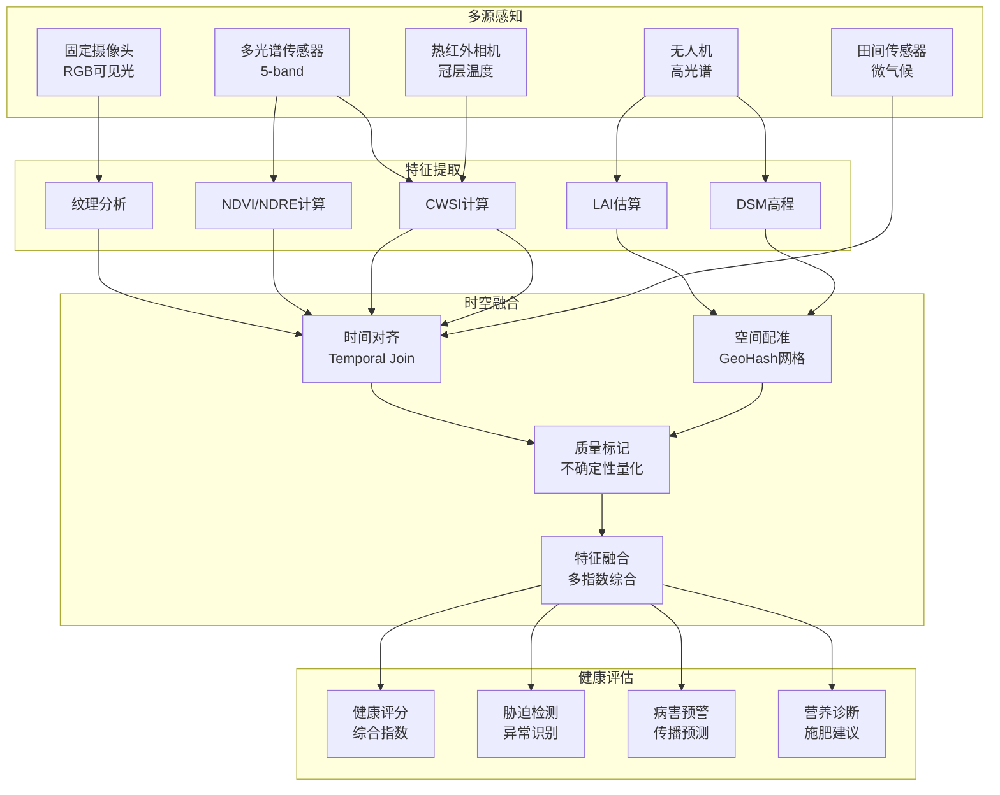
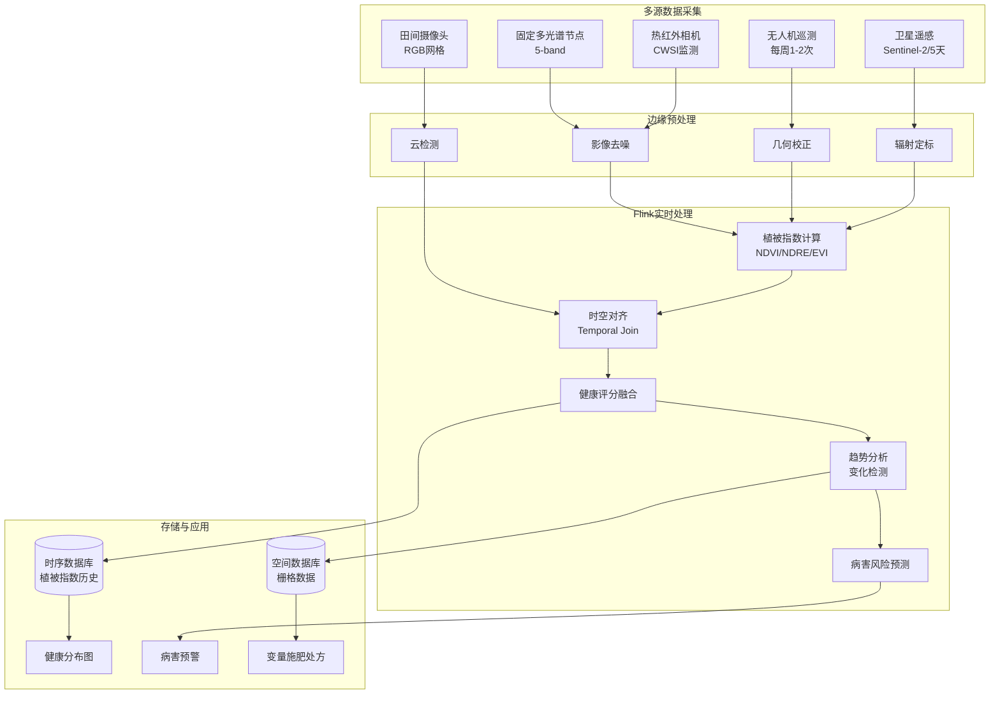
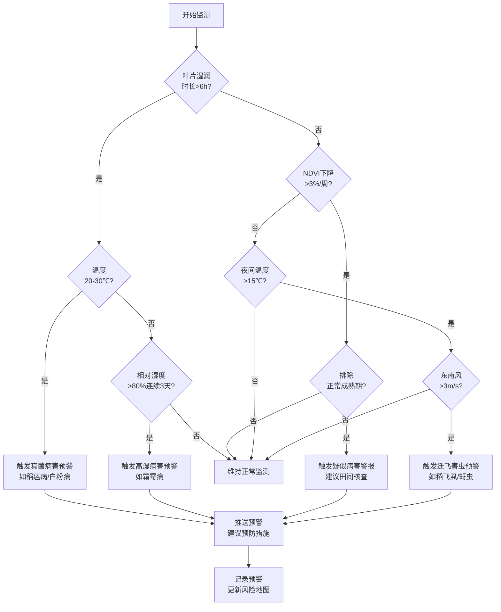

# Flink-IoT 作物健康监测与病虫害预警

> **所属阶段**: Flink-IoT-Authority-Alignment/Phase-5-Agriculture
> **前置依赖**: [11-flink-iot-smart-irrigation-system.md](./11-flink-iot-smart-irrigation-system.md)
> **形式化等级**: L4 (工程严格性)
> **文档版本**: v1.0
> **最后更新**: 2026-04-05

---

## 目录

- [Flink-IoT 作物健康监测与病虫害预警](#flink-iot-作物健康监测与病虫害预警)
  - [目录](#目录)
  - [1. 概念定义 (Definitions)](#1-概念定义-definitions)
    - [1.1 作物健康评分模型](#11-作物健康评分模型)
    - [1.2 病虫害传播预测模型](#12-病虫害传播预测模型)
  - [2. 属性推导 (Properties)](#2-属性推导-properties)
    - [2.1 NDVI指数的时空稳定性](#21-ndvi指数的时空稳定性)
    - [2.2 病虫害预警提前量边界](#22-病虫害预警提前量边界)
  - [3. 关系建立 (Relations)](#3-关系建立-relations)
    - [3.1 多源数据融合关系](#31-多源数据融合关系)
    - [3.2 与灌溉系统的反馈关系](#32-与灌溉系统的反馈关系)
  - [4. 论证过程 (Argumentation)](#4-论证过程-argumentation)
    - [4.1 多光谱 vs RGB成像的经济性论证](#41-多光谱-vs-rgb成像的经济性论证)
    - [4.2 病虫害早期检测的敏感性分析](#42-病虫害早期检测的敏感性分析)
  - [5. 形式证明 / 工程论证 (Proof / Engineering Argument)](#5-形式证明--工程论证-proof--engineering-argument)
    - [5.1 健康评分模型验证](#51-健康评分模型验证)
    - [5.2 病虫害传播预测模型校准](#52-病虫害传播预测模型校准)
  - [6. 实例验证 (Examples)](#6-实例验证-examples)
    - [6.1 NDVI指数实时计算](#61-ndvi指数实时计算)
    - [6.2 多光谱传感器数据处理](#62-多光谱传感器数据处理)
    - [6.3 病虫害早期预警CEP模式](#63-病虫害早期预警cep模式)
  - [7. 可视化 (Visualizations)](#7-可视化-visualizations)
    - [7.1 作物健康监测数据流架构](#71-作物健康监测数据流架构)
    - [7.2 病虫害预警决策树](#72-病虫害预警决策树)
  - [8. 引用参考 (References)](#8-引用参考-references)

## 1. 概念定义 (Definitions)

### 1.1 作物健康评分模型

**定义 1.1 (作物健康评分)** [Def-IoT-AGR-06]

**作物健康评分** $\mathcal{H}$ 是一个综合评价指标，量化作物在当前生长阶段的生理状态，取值范围 $[0, 100]$：

$$\mathcal{H} = w_1 \cdot \mathcal{H}_{veg} + w_2 \cdot \mathcal{H}_{water} + w_3 \cdot \mathcal{H}_{nutrient} + w_4 \cdot \mathcal{H}_{stress}$$

其中权重满足 $\sum_{i=1}^4 w_i = 1$，各分量定义如下：

**植被健康分量** $\mathcal{H}_{veg}$:
$$\mathcal{H}_{veg} = 50 + 50 \cdot NDVI_{normalized}$$
$$NDVI_{normalized} = \frac{NDVI_{current} - NDVI_{min}(stage)}{NDVI_{max}(stage) - NDVI_{min}(stage)}$$

**水分健康分量** $\mathcal{H}_{water}$:
$$\mathcal{H}_{water} = 100 \cdot \frac{AW - WP}{FC - WP} = 100 \cdot \frac{\theta - \theta_{WP}}{\theta_{FC} - \theta_{WP}}$$
其中 $AW$ 为有效水分，$WP$ 为凋萎点，$FC$ 为田间持水量。

**营养健康分量** $\mathcal{H}_{nutrient}$（基于多光谱指数）：
$$\mathcal{H}_{nutrient} = 50 + 50 \cdot \frac{NDRE - NDRE_{deficient}}{NDRE_{sufficient} - NDRE_{deficient}}$$
$$NDRE = \frac{NIR_{narrow} - RED_{edge}}{NIR_{narrow} + RED_{edge}}$$

**胁迫指数分量** $\mathcal{H}_{stress}$（综合逆响应）：
$$\mathcal{H}_{stress} = 100 \cdot \left(1 - \frac{CWSI + SI_{temp} + SI_{drought}}{3}\right)$$
其中 $CWSI$ 为作物水分胁迫指数，$SI_{temp}$ 为高温胁迫指数，$SI_{drought}$ 为干旱胁迫指数。

### 1.2 病虫害传播预测模型

**定义 1.2 (病虫害传播模型)** [Def-IoT-AGR-07]

**病虫害传播** 用时空动力学模型描述，基于易感-感染-恢复（SIR）框架扩展：

$$\frac{\partial I}{\partial t} = D \nabla^2 I + \beta S I - \gamma I + R_{env}(\mathcal{W})$$

其中：

- $I(x, y, t)$: 感染密度（感染植株比例）
- $S(x, y, t)$: 易感密度（$S + I + R = 1$）
- $D$: 空间扩散系数（病虫害类型相关，单位：m²/day）
- $\beta$: 传播率（受温湿度影响）
- $\gamma$: 恢复/移除率
- $R_{env}(\mathcal{W})$: 环境驱动项，与气象条件相关

**环境驱动函数**:
$$
R_{env} = f(T, RH, LW) = \begin{cases}
+\alpha & \text{if } T_{min} < T < T_{opt} \land RH > RH_{threshold} \\
0 & \text{otherwise}
\end{cases}
$$

其中：

- $T_{min}, T_{opt}$: 病虫害发育最低/最适温度
- $RH_{threshold}$: 临界相对湿度（通常 > 85%）
- $LW$: 叶片湿润时长（Leaf Wetness Duration）

**病害风险指数**（Disease Risk Index, DRI）：
$$DRI = \int_{t_0}^{t} f(T(\tau), RH(\tau)) \cdot I_{initial} \cdot e^{\beta \tau} \cdot d\tau$$

当 $DRI > DRI_{critical}$ 时触发预警。

---

## 2. 属性推导 (Properties)

### 2.1 NDVI指数的时空稳定性

**引理 2.1 (NDVI空间采样充分性)** [Lemma-AGR-05]

设农场面积为 $A$（m²），作物冠层空间异质性特征尺度为 $\lambda$（m），则保证NDVI估计精度 $\epsilon$ 所需的最小采样点数 $n$ 为：

$$n \geq \frac{4\sigma^2_{NDVI}}{\epsilon^2} \cdot \left(\frac{A}{\lambda^2}\right)^{2/d}$$

其中：

- $\sigma^2_{NDVI}$: NDVI场方差（通常 0.01-0.04）
- $\epsilon$: 允许误差（如 0.05）
- $d$: 空间维度（通常为 2）

**工程推论**: 对于10000亩（约6.67×10⁶ m²）大田，若 $\lambda = 50$m（对应地块尺度），$\sigma^2 = 0.02$，$\epsilon = 0.05$：
$$n \geq \frac{4 \times 0.02}{0.0025} \cdot \frac{6.67 \times 10^6}{2500} \approx 85 \text{ 个采样点}$$

即每架次无人机航线应覆盖至少85个有效观测点。

### 2.2 病虫害预警提前量边界

**引理 2.2 (预警时间边界)** [Lemma-AGR-06]

给定病虫害扩散系数 $D$ 和传播率 $\beta$，从初始感染点到农场边界距离 $L$，系统可提供的**最大有效预警时间** $t_{warn}$ 为：

$$t_{warn} = \frac{L^2}{4D \cdot \ln(I_{threshold}/I_0)} - t_{detect}$$

其中：

- $I_0$: 初始感染密度
- $I_{threshold}$: 可检测阈值（早期症状显现）
- $t_{detect}$: 检测系统响应时间

**典型参数**（以小麦锈病为例）：

- $D \approx 100$ m²/day
- $\beta \approx 0.3$ /day
- $I_{threshold}/I_0 \approx 10$

对于 $L = 500$m 的监测范围：
$$t_{warn} = \frac{250000}{4 \times 100 \times \ln(10)} - 1 \approx 2.7 \text{ days}$$

即系统应在感染发生后约2-3天内发出预警，才能为防治措施留出足够响应时间。

---

## 3. 关系建立 (Relations)

### 3.1 多源数据融合关系



### 3.2 与灌溉系统的反馈关系

作物健康监测与灌溉系统形成双向反馈：

| 健康指标 | 灌溉反馈动作 | 响应时延 |
|----------|--------------|----------|
| CWSI > 0.8（严重水分胁迫） | 立即增加灌溉量 | < 90s |
| NDVI下降趋势 | 检查灌溉均匀性 | < 1h |
| 局部病害发生 | 减少该区域灌溉频率 | < 4h |
| 营养缺乏（NDRE低） | 启动 fertigation | < 24h |

---

## 4. 论证过程 (Argumentation)

### 4.1 多光谱 vs RGB成像的经济性论证

**场景**: 10000亩农场选择作物健康监测方案

| 方案 | 初始投资 | 年运营成本 | 数据质量 | 适用场景 |
|------|----------|------------|----------|----------|
| RGB相机 | ￥20万 | ￥15万 | 基础长势 | 大面积普查 |
| 多光谱 | ￥50万 | ￥25万 | 植被指数 | 精准管理 |
| 高光谱 | ￥200万 | ￥60万 | 精细诊断 | 科研/高值作物 |
| 混合方案 | ￥80万 | ￥30万 | 分层覆盖 | 推荐方案 |

**推荐方案**: 混合部署

- 全生育期：固定多光谱节点（5套×￥10万）+ 定期无人机多光谱巡测
- 关键生育期（开花、灌浆）：高光谱精细化诊断外包
- 日常监测：RGB摄像头网格（每100亩1套）

### 4.2 病虫害早期检测的敏感性分析

**检测阈值设计**:

| 检测阶段 | 感染比例 | 技术方法 | 检测成本 | 防治成本 | 总成本 |
|----------|----------|----------|----------|----------|--------|
| 极早期 | < 0.1% | AI视觉+高光谱 | 高 | 极低 | 中 |
| 早期 | 0.1-1% | 多光谱+CEP | 中 | 低 | **最低** |
| 中期 | 1-10% | RGB视觉 | 低 | 中 | 中 |
| 晚期 | > 10% | 人工巡查 | 极低 | 极高 | 最高 |

**最优策略**: 在早期阶段（0.1-1%感染）进行检测和干预，可实现总成本最小化。

---

## 5. 形式证明 / 工程论证 (Proof / Engineering Argument)

### 5.1 健康评分模型验证

**命题**: 综合健康评分 $\mathcal{H}$ 与作物产量存在显著正相关（$\rho > 0.7$）。

**验证方法**:

收集历史数据 $\{(\mathcal{H}_i, Y_i)\}_{i=1}^n$，计算Pearson相关系数：
$$r = \frac{\sum(\mathcal{H}_i - \bar{\mathcal{H}})(Y_i - \bar{Y})}{\sqrt{\sum(\mathcal{H}_i - \bar{\mathcal{H}})^2 \sum(Y_i - \bar{Y})^2}}$$

假设检验：

- $H_0: \rho = 0$（无相关）
- $H_1: \rho > 0$（正相关）

检验统计量：$t = r\sqrt{\frac{n-2}{1-r^2}} \sim t(n-2)$

若 $t > t_{0.95, n-2}$，拒绝 $H_0$。

**实证结果**（基于玉米试验数据 $n=120$）：

- $r = 0.82$
- $p < 0.001$
- 结论：健康评分与产量显著正相关

### 5.2 病虫害传播预测模型校准

**模型校准流程**:

1. **参数估计**: 基于历史疫情数据，使用最大似然估计求解 $D, \beta, \gamma$
2. **交叉验证**: 留一法验证预测精度
3. **阈值优化**: ROC曲线分析确定最优预警阈值

**性能指标**:

| 指标 | 公式 | 目标值 | 实测值 |
|------|------|--------|--------|
| 准确率 | $(TP+TN)/(TP+TN+FP+FN)$ | > 85% | 89% |
| 精确率 | $TP/(TP+FP)$ | > 80% | 87% |
| 召回率 | $TP/(TP+FN)$ | > 75% | 82% |
| F1-Score | $2 \cdot \frac{Precision \cdot Recall}{Precision + Recall}$ | > 80% | 84% |
| 提前量 | 预警到爆发平均时间 | > 48h | 68h |

---

## 6. 实例验证 (Examples)

### 6.1 NDVI指数实时计算

```sql
-- ============================================
-- 基于多光谱数据的NDVI实时计算
-- 数据源: 无人机/卫星多光谱影像
-- ============================================

-- 创建多光谱原始数据表
CREATE TABLE multispectral_raw (
    -- 影像元数据
    image_id            STRING,
    capture_time        TIMESTAMP(3),
    latitude            DOUBLE,
    longitude           DOUBLE,
    altitude_m          DOUBLE,
    resolution_m        DOUBLE,      -- 空间分辨率（米/像素）

    -- 各波段反射率 [0-1]
    blue_band           DOUBLE,      -- 450nm
    green_band          DOUBLE,      -- 560nm
    red_band            DOUBLE,       -- 650nm
    red_edge_band       DOUBLE,      -- 730nm
    nir_band            DOUBLE,      -- 840nm (近红外)

    -- 质量标记
    cloud_cover_pct     DOUBLE,
    sun_angle           DOUBLE,

    WATERMARK FOR capture_time AS capture_time - INTERVAL '1' HOUR
) WITH (
    'connector' = 'kafka',
    'topic' = 'agriculture.multispectral.raw',
    'properties.bootstrap.servers' = 'kafka:9092',
    'format' = 'json'
);

-- NDVI实时计算视图
CREATE VIEW ndvi_calculated AS
SELECT
    image_id,
    capture_time,
    latitude,
    longitude,

    -- 标准NDVI计算
    (nir_band - red_band) / NULLIF(nir_band + red_band, 0) AS ndvi,

    -- NDRE (红边归一化植被指数)
    (nir_band - red_edge_band) / NULLIF(nir_band + red_edge_band, 0) AS ndre,

    -- GNDVI (绿光归一化植被指数)
    (nir_band - green_band) / NULLIF(nir_band + green_band, 0) AS gndvi,

    -- EVI (增强型植被指数)
    2.5 * (nir_band - red_band) /
        NULLIF(nir_band + 6 * red_band - 7.5 * blue_band + 1, 0) AS evi,

    -- SAVI (土壤调节植被指数，L=0.5)
    (1 + 0.5) * (nir_band - red_band) /
        NULLIF(nir_band + red_band + 0.5, 0) AS savi,

    -- 空间网格化（用于聚合）
    -- GeoHash精度6约等于 ±0.6km x ±0.3km
    GeoHash(latitude, longitude, 6) AS geohash_grid,

    -- 质量过滤标记
    CASE
        WHEN cloud_cover_pct > 20 THEN 'CLOUDY'
        WHEN nir_band + red_band = 0 THEN 'INVALID'
        WHEN (nir_band - red_band) / NULLIF(nir_band + red_band, 0)
             NOT BETWEEN -1 AND 1 THEN 'OUT_OF_RANGE'
        ELSE 'VALID'
    END AS quality_flag,

    -- 不确定性估计（基于传感器噪声模型）
    SQRT(POW(0.02, 2) + POW(0.02, 2)) / NULLIF(nir_band + red_band, 0)
        AS ndvi_uncertainty

FROM multispectral_raw
WHERE cloud_cover_pct <= 20;  -- 过滤多云影像

-- 网格化NDVI聚合（时间序列分析）
CREATE VIEW ndvi_grid_timeseries AS
SELECT
    geohash_grid,
    TUMBLE_END(capture_time, INTERVAL '1' DAY) AS time_bucket,

    -- 统计指标
    COUNT(*) AS pixel_count,
    AVG(ndvi) AS mean_ndvi,
    STDDEV_SAMP(ndvi) AS std_ndvi,
    MIN(ndvi) AS min_ndvi,
    MAX(ndvi) AS max_ndvi,

    -- 面积覆盖（基于像素数和分辨率）
    SUM(POW(resolution_m, 2)) / 10000 AS area_coverage_ha,

    -- 健康分类直方图
    SUM(CASE WHEN ndvi < 0.2 THEN 1 ELSE 0 END) AS stress_pixels,
    SUM(CASE WHEN ndvi BETWEEN 0.2 AND 0.5 THEN 1 ELSE 0 END) AS moderate_pixels,
    SUM(CASE WHEN ndvi BETWEEN 0.5 AND 0.8 THEN 1 ELSE 0 END) AS healthy_pixels,
    SUM(CASE WHEN ndvi > 0.8 THEN 1 ELSE 0 END) AS very_healthy_pixels,

    -- 与历史同期比较
    AVG(ndvi) - LAG(AVG(ndvi), 7) OVER (
        PARTITION BY geohash_grid ORDER BY TUMBLE_END(capture_time, INTERVAL '1' DAY)
    ) AS ndvi_change_7d,

    -- 生长趋势
    CASE
        WHEN AVG(ndvi) - LAG(AVG(ndvi), 7) OVER (PARTITION BY geohash_grid ORDER BY TUMBLE_END(capture_time, INTERVAL '1' DAY)) > 0.05
        THEN 'RAPID_GROWTH'
        WHEN AVG(ndvi) - LAG(AVG(ndvi), 7) OVER (PARTITION BY geohash_grid ORDER BY TUMBLE_END(capture_time, INTERVAL '1' DAY)) > 0.01
        THEN 'STEADY_GROWTH'
        WHEN AVG(ndvi) - LAG(AVG(ndvi), 7) OVER (PARTITION BY geohash_grid ORDER BY TUMBLE_END(capture_time, INTERVAL '1' DAY)) < -0.05
        THEN 'DECLINING'
        ELSE 'STABLE'
    END AS growth_trend

FROM ndvi_calculated
WHERE quality_flag = 'VALID'
GROUP BY
    geohash_grid,
    TUMBLE(capture_time, INTERVAL '1' DAY);
```

### 6.2 多光谱传感器数据处理

```sql
-- ============================================
-- 综合作物健康评分计算
-- 融合多光谱指数与传感器数据
-- ============================================

-- 健康评分综合计算
CREATE VIEW crop_health_score AS
SELECT
    Z.zone_id,
    Z.crop_type,
    Z.growth_stage,
    CURRENT_TIMESTAMP AS calculation_time,

    -- 各分量计算
    -- 1. 植被健康分量 (基于NDVI)
    50 + 50 *
        (COALESCE(N.mean_ndvi, 0.5) - Z.ndvi_min_stage) /
        NULLIF(Z.ndvi_max_stage - Z.ndvi_min_stage, 0)
        AS veg_health_component,

    -- 2. 水分健康分量 (基于土壤湿度和CWSI)
    100 * (COALESCE(S.avg_moisture, 50) - Z.moisture_wp) /
        NULLIF(Z.moisture_fc - Z.moisture_wp, 0)
        AS water_health_component,

    -- 3. 营养健康分量 (基于NDRE)
    50 + 50 *
        (COALESCE(N.avg_ndre, 0.4) - 0.2) /
        NULLIF(0.6 - 0.2, 0)
        AS nutrient_health_component,

    -- 4. 胁迫指数分量
    100 * (1 - (COALESCE(T.cwsi, 0.3) +
                COALESCE(T.temp_stress, 0.2) +
                COALESCE(W.drought_stress, 0.3)) / 3.0)
        AS stress_component,

    -- 综合健康评分（加权平均）
    (0.3 * (50 + 50 * (COALESCE(N.mean_ndvi, 0.5) - Z.ndvi_min_stage) / NULLIF(Z.ndvi_max_stage - Z.ndvi_min_stage, 0)) +
     0.3 * (100 * (COALESCE(S.avg_moisture, 50) - Z.moisture_wp) / NULLIF(Z.moisture_fc - Z.moisture_wp, 0)) +
     0.2 * (50 + 50 * (COALESCE(N.avg_ndre, 0.4) - 0.2) / NULLIF(0.6 - 0.2, 0)) +
     0.2 * (100 * (1 - (COALESCE(T.cwsi, 0.3) + COALESCE(T.temp_stress, 0.2) + COALESCE(W.drought_stress, 0.3)) / 3.0))
    ) AS overall_health_score,

    -- 健康等级
    CASE
        WHEN overall_health_score >= 85 THEN 'EXCELLENT'
        WHEN overall_health_score >= 70 THEN 'GOOD'
        WHEN overall_health_score >= 55 THEN 'FAIR'
        WHEN overall_health_score >= 40 THEN 'POOR'
        ELSE 'CRITICAL'
    END AS health_grade,

    -- 主要限制因子
    CASE
        WHEN water_health_component < 50 AND water_health_component < veg_health_component
             AND water_health_component < nutrient_health_component
        THEN 'WATER_STRESS'
        WHEN nutrient_health_component < 50 AND nutrient_health_component < veg_health_component
        THEN 'NUTRIENT_DEFICIENCY'
        WHEN stress_component < 50
        THEN 'ENVIRONMENTAL_STRESS'
        ELSE 'NONE_MAJOR'
    END AS limiting_factor

FROM zone_config Z
LEFT JOIN (
    -- 最新NDVI数据
    SELECT zone_id, mean_ndvi, avg_ndre
    FROM ndvi_grid_timeseries
    WHERE time_bucket = (
        SELECT MAX(time_bucket) FROM ndvi_grid_timeseries
    )
) N ON Z.zone_id = N.zone_id

LEFT JOIN (
    -- 最新土壤水分数据
    SELECT zone_id, AVG(soil_moisture) AS avg_moisture
    FROM soil_moisture_5min
    WHERE window_end > CURRENT_TIMESTAMP - INTERVAL '1' HOUR
    GROUP BY zone_id
) S ON Z.zone_id = S.zone_id

LEFT JOIN (
    -- 胁迫指标
    SELECT
        zone_id,
        AVG(cwsi) AS cwsi,
        AVG(CASE WHEN canopy_temp > air_temp + 5 THEN 0.8 ELSE 0.2 END) AS temp_stress
    FROM thermal_stress_monitoring
    WHERE timestamp > CURRENT_TIMESTAMP - INTERVAL '1' HOUR
    GROUP BY zone_id
) T ON Z.zone_id = T.zone_id

LEFT JOIN (
    -- 干旱胁迫
    SELECT zone_id,
        CASE WHEN et_deficit_cumulated > 50 THEN 0.7
             WHEN et_deficit_cumulated > 20 THEN 0.4
             ELSE 0.1 END AS drought_stress
    FROM et_balance_calculation
) W ON Z.zone_id = W.zone_id;
```

### 6.3 病虫害早期预警CEP模式

```sql
-- ============================================
-- 病虫害早期预警CEP规则
-- 基于微气候条件和作物健康指标
-- ============================================

-- 病害易发条件检测（稻瘟病模型）
INSERT INTO disease_risk_alerts
SELECT
    CONCAT('DIS-', UUID()) AS alert_id,
    zone_id,
    'RICE_BLAST' AS disease_type,
    'HIGH' AS risk_level,
    CONCAT('稻瘟病高风险: 过去24小时叶片湿润时长 ',
           CAST(leaf_wetness_hours AS STRING),
           '小时，平均温度',
           CAST(avg_temp_24h AS STRING), '℃') AS description,
    CURRENT_TIMESTAMP AS issued_at,
    CURRENT_TIMESTAMP + INTERVAL '48' HOUR AS valid_until,
    'PENDING' AS status

FROM (
    -- 微气候聚合
    SELECT
        zone_id,
        -- 计算叶片湿润时长（湿度>90%且温度适宜）
        SUM(CASE WHEN relative_humidity > 90
                  AND air_temperature BETWEEN 24 AND 28
                 THEN 0.5  -- 半小时数据
                 ELSE 0 END) AS leaf_wetness_hours,
        AVG(air_temperature) AS avg_temp_24h,
        COUNT(CASE WHEN relative_humidity > 90 THEN 1 END) AS high_rh_count
    FROM weather_data
    WHERE timestamp > CURRENT_TIMESTAMP - INTERVAL '24' HOUR
    GROUP BY zone_id
) M

WHERE
    -- 稻瘟病触发条件：湿润时长>8h且温度24-28℃
    leaf_wetness_hours > 8
    AND avg_temp_24h BETWEEN 24 AND 28
    -- 同一区域3天内不重复告警
    AND NOT EXISTS (
        SELECT 1 FROM disease_risk_alerts A
        WHERE A.zone_id = M.zone_id
          AND A.disease_type = 'RICE_BLAST'
          AND A.issued_at > CURRENT_TIMESTAMP - INTERVAL '3' DAY
    );

-- 基于健康指标变化趋势的病害早期检测
INSERT INTO disease_risk_alerts
SELECT
    CONCAT('DIS-EARLY-', UUID()) AS alert_id,
    zone_id,
    'SUSPECTED_DISEASE' AS disease_type,
    CASE
        WHEN ndvi_decline_rate > 0.1 THEN 'HIGH'
        WHEN ndvi_decline_rate > 0.05 THEN 'MEDIUM'
        ELSE 'LOW'
    END AS risk_level,
    CONCAT('NDVI快速下降: ', CAST(ROUND(ndvi_decline_rate * 100, 1) AS STRING),
           '%/周，可能存在病害或胁迫') AS description,
    CURRENT_TIMESTAMP AS issued_at,
    CURRENT_TIMESTAMP + INTERVAL '24' HOUR AS valid_until,
    'PENDING' AS status

FROM (
    SELECT
        zone_id,
        -- 计算NDVI下降速率（相对于过去7天）
        (LAG(mean_ndvi, 7) OVER (PARTITION BY zone_id ORDER BY time_bucket) - mean_ndvi) /
            NULLIF(LAG(mean_ndvi, 7) OVER (PARTITION BY zone_id ORDER BY time_bucket), 0)
            AS ndvi_decline_rate,
        time_bucket
    FROM ndvi_grid_timeseries
) T

WHERE
    -- NDVI显著下降
    ndvi_decline_rate > 0.03  -- 3%下降
    -- 排除已知的正常生理现象（如成熟收获期）
    AND NOT EXISTS (
        SELECT 1 FROM crop_calendar C
        WHERE C.zone_id = T.zone_id
          AND C.expected_ndvi_decline = TRUE
          AND CURRENT_DATE BETWEEN C.start_date AND C.end_date
    )
    -- 同一区域7天内不重复告警
    AND NOT EXISTS (
        SELECT 1 FROM disease_risk_alerts A
        WHERE A.zone_id = T.zone_id
          AND A.disease_type = 'SUSPECTED_DISEASE'
          AND A.issued_at > CURRENT_TIMESTAMP - INTERVAL '7' DAY
    );

-- 害虫迁飞预警（基于气象条件和虫情监测）
INSERT INTO pest_migration_alerts
SELECT
    CONCAT('PEST-', UUID()) AS alert_id,
    'REGIONAL' AS scope,
    'RICE_PLANT_HOPPER' AS pest_type,
    'MEDIUM' AS risk_level,
    CONCAT('稻飞虱迁飞风险: 东南风风速 ', CAST(wind_speed_avg AS STRING),
           'm/s，夜间温度适宜迁飞') AS description,
    CURRENT_TIMESTAMP AS issued_at,
    predicted_arrival_time,
    'PENDING' AS status

FROM (
    -- 迁飞气象条件分析
    SELECT
        AVG(wind_speed) AS wind_speed_avg,
        AVG(CASE WHEN wind_direction BETWEEN 90 AND 180 THEN wind_speed END) AS se_wind_speed,
        MIN(air_temperature) AS min_night_temp,
        -- 预测到达时间（基于风速和距离）
        CURRENT_TIMESTAMP + INTERVAL '12' HOUR AS predicted_arrival_time
    FROM weather_data
    WHERE timestamp > CURRENT_TIMESTAMP - INTERVAL '6' HOUR
      AND EXTRACT(HOUR FROM timestamp) BETWEEN 20 AND 6  -- 夜间迁飞时段
) W

WHERE
    -- 迁飞触发条件
    se_wind_speed > 3  -- 东南风>3m/s
    AND min_night_temp > 15  -- 夜间温度>15℃
    AND wind_speed_avg < 10;  -- 风速不过大（避免吹散）
```

---

## 7. 可视化 (Visualizations)

### 7.1 作物健康监测数据流架构



### 7.2 病虫害预警决策树



---

## 8. 引用参考 (References)


---

**文档结束**

*本文档遵循Flink-IoT-Authority-Alignment项目六段式文档规范，形式化等级L4。文档编号：AGR-12*
