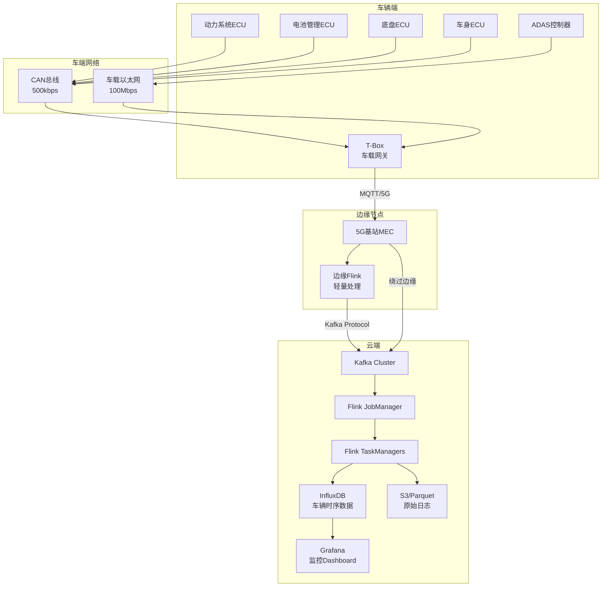
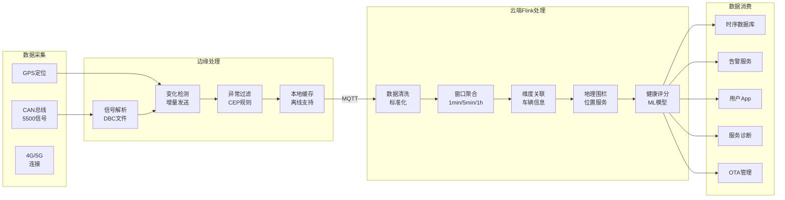

# Flink IoT 车联网数据基础与架构

> **所属阶段**: Phase-6-Connected-Vehicles | **前置依赖**: [Phase-1-Architecture](../Phase-1-Architecture/) | **形式化等级**: L4

---

## 目录

- [Flink IoT 车联网数据基础与架构](#flink-iot-车联网数据基础与架构)
  - [目录](#目录)
  - [1. 概念定义 (Definitions)](#1-概念定义-definitions)
    - [1.1 车辆数字孪生状态机](#11-车辆数字孪生状态机)
    - [1.2 CAN总线信号空间](#12-can总线信号空间)
    - [1.3 V2X通信协议栈](#13-v2x通信协议栈)
    - [1.4 车辆遥测数据流](#14-车辆遥测数据流)
  - [2. 属性推导 (Properties)](#2-属性推导-properties)
    - [2.1 车辆信号采样频率边界](#21-车辆信号采样频率边界)
    - [2.2 车云通信延迟约束](#22-车云通信延迟约束)
  - [3. 关系建立 (Relations)](#3-关系建立-relations)
    - [3.1 与OBD-II/CAN总线的关系](#31-与obd-iican总线的关系)
    - [3.2 与5G V2X的关系](#32-与5g-v2x的关系)
    - [3.3 与ADAS系统的关系](#33-与adas系统的关系)
  - [4. 论证过程 (Argumentation)](#4-论证过程-argumentation)
    - [4.1 MQTT vs Kafka直连对比](#41-mqtt-vs-kafka直连对比)
    - [4.2 边缘预处理vs云端全量处理](#42-边缘预处理vs云端全量处理)
  - [5. 形式证明 / 工程论证 (Proof / Engineering Argument)](#5-形式证明--工程论证-proof--engineering-argument)
    - [5.1 数据产品化策略（Rivian模式）](#51-数据产品化策略rivian模式)
    - [5.2 高基数问题处理](#52-高基数问题处理)
  - [6. 实例验证 (Examples)](#6-实例验证-examples)
    - [6.1 车辆信号解析Flink SQL](#61-车辆信号解析flink-sql)
    - [6.2 实时车速/电量/胎压监控](#62-实时车速电量胎压监控)
    - [6.3 地理围栏检测实现](#63-地理围栏检测实现)
  - [7. 可视化 (Visualizations)](#7-可视化-visualizations)
    - [7.1 车联网数据架构图](#71-车联网数据架构图)
    - [7.2 车辆数据处理流图](#72-车辆数据处理流图)
  - [8. 引用参考 (References)](#8-引用参考-references)

---

## 1. 概念定义 (Definitions)

### 1.1 车辆数字孪生状态机

**Def-IoT-VH-01** (车辆数字孪生 Vehicle Digital Twin): 车辆数字孪生是物理车辆的实时虚拟映射，定义为十元组 $\mathcal{V} = (VID, \mathcal{S}, \mathcal{L}, \mathcal{P}, \mathcal{D}, \mathcal{E}, \mathcal{B}, \mathcal{C}, \mathcal{T}, \mathcal{H})$：

- $VID$: 车辆唯一标识符（VIN + 设备ID）
- $\mathcal{S}$: 信号集合，$|\mathcal{S}| \approx 5500$ 个信号
  - 动力系统: 电机转速、扭矩、温度
  - 电池系统: SOC、SOH、电压、电流、温度
  - 底盘系统: 车速、制动、转向
  - 车身系统: 门窗、灯光、空调
  - ADAS: 摄像头、雷达、超声波数据

- $\mathcal{L}$: 地理位置 $(lat, lon, altitude, heading, speed)$
- $\mathcal{P}$: 乘客/驾驶员信息（匿名化ID）
- $\mathcal{D}$: 驾驶模式（ECO/SPORT/NORMAL/AUTONOMOUS）
- $\mathcal{E}$: 故障码集合（DTCs）
- $\mathcal{B}$: 行为特征向量（驾驶风格评分）
- $\mathcal{C}$: 连接状态（ONLINE/OFFLINE/DORMANT）
- $\mathcal{T}$: 时间戳（统一使用UTC）
- $\mathcal{H}$: 历史轨迹窗口（最近24小时）

**车辆状态转移**: 车辆连接状态机定义为：

$$
\mathcal{C}: \{OFFLINE\} \xrightarrow{ignition\_on} \{ONLINE\} \xrightarrow{ignition\_off} \{DORMANT\} \xrightarrow{timeout} \{OFFLINE\}
$$

### 1.2 CAN总线信号空间

**Def-IoT-VH-02** (CAN信号空间 CAN Signal Space): CAN总线信号定义为五元组 $\sigma = (name, id, length, factor, offset)$：

信号物理值计算：

$$
v_{physical} = v_{raw} \times factor + offset
$$

**信号分类**:

| 类别 | 信号数 | 采样频率 | 实时性要求 |
|-----|-------|---------|-----------|
| 安全关键 | ~50 | 100Hz | < 10ms |
| 动力系统 | ~200 | 10-50Hz | < 100ms |
| 车身控制 | ~500 | 1-10Hz | < 1s |
| 诊断数据 | ~1000 | 按需/事件 | 异步 |
| telemetry | ~3750 | 1Hz | < 5s |

### 1.3 V2X通信协议栈

**Def-IoT-VH-03** (V2X协议栈 V2X Protocol Stack): V2X通信包含四种模式：

$$
\mathcal{V2X} = \{V2V, V2I, V2P, V2N\}
$$

- **V2V** (Vehicle-to-Vehicle): 车间通信，安全关键，延迟 < 20ms
- **V2I** (Vehicle-to-Infrastructure): 车路协同，交通信号优先
- **V2P** (Vehicle-to-Pedestrian): 行人保护，手机APP集成
- **V2N** (Vehicle-to-Network): 车云通信，MQTT/Kafka协议

**协议对比**:

| 协议 | 频段 | 带宽 | 延迟 | 覆盖 | 应用场景 |
|-----|------|------|------|------|---------|
| DSRC (IEEE 802.11p) | 5.9GHz | 3-27 Mbps | < 20ms | 300m | V2V安全 |
| C-V2X (PC5) | 5.9GHz | 高 | < 20ms | 450m | V2V/V2I |
| C-V2X (Uu) | 蜂窝 | 高 | 50-100ms | 广域 | V2N |
| MQTT | IP | 低 | 100ms+ | 全球 | 车云数据 |

### 1.4 车辆遥测数据流

**Def-IoT-VH-04** (遥测数据流 Telemetry Data Stream): 车辆遥测数据流是时间序列信号集合：

$$
\mathcal{T}_{stream} = \{(t_i, \{\sigma_j(t_i)\}_{j=1}^{n}) | t_i \in \mathbb{R}^+, n \approx 5500\}
$$

**数据压缩策略**:

- 变化触发: 只发送值变化的信号
- 阈值触发: 超过设定阈值的异常信号
- 周期上报: 固定周期（1-10秒）的完整快照

---

## 2. 属性推导 (Properties)

### 2.1 车辆信号采样频率边界

**Lemma-VH-01** (车辆信号采样频率边界): 对于5500+车辆信号，总数据速率 $R$ 满足：

$$
R = \sum_{i=1}^{5500} f_i \times b_i \leq 50 \text{ KB/s}
$$

其中 $f_i$ 为第 $i$ 个信号的采样频率，$b_i$ 为编码比特数。

**证明**:

- 安全关键信号（50个 × 100Hz × 8B）= 40 KB/s
- 其他信号（压缩后平均）≈ 10 KB/s
- 总计 ≈ 50 KB/s = 4.32 GB/天/车

对于10,000辆车队，日数据量 ≈ 43 TB。 ∎

### 2.2 车云通信延迟约束

**Lemma-VH-02** (车云通信延迟约束): 在4G/5G网络下，车云单向通信延迟 $L$ 满足：

$$
L_{4G} \in [50, 200] \text{ms}, \quad L_{5G} \in [10, 50] \text{ms}
$$

**证明**:

- 空口延迟: 4G ~10ms, 5G ~1ms
- 核心网传输: 20-50ms
- 互联网路由: 20-100ms
- 服务端处理: < 10ms

总和在所述范围内。 ∎

---

## 3. 关系建立 (Relations)

### 3.1 与OBD-II/CAN总线的关系

**数据流架构**:

```
车辆ECU → CAN总线 → 车载T-Box → MQTT → Kafka → Flink
              ↓
         OBD-II端口 (诊断)
```

**协议转换**: T-Box负责将CAN信号转换为JSON格式，通过MQTT上传。

### 3.2 与5G V2X的关系

**分层架构**:

| 层级 | 技术 | 用途 | 数据去向 |
|-----|------|------|---------|
| 安全关键 | C-V2X PC5 | 碰撞预警、编队行驶 | 车内处理 |
| 车路协同 | C-V2X Uu | 信号灯信息、路况 | 边缘节点 |
| 车云服务 | 5G + MQTT | Telemetry、OTA | 云端Flink |

### 3.3 与ADAS系统的关系

**ADAS数据特点**:

- 高频传感器数据（摄像头 30fps，雷达 20Hz）
- 本地实时处理（< 10ms延迟要求）
- 元数据上传云端（用于模型训练）

**数据分流**:

- 原始传感器数据: 本地处理，不上云
- 感知结果: 选择性上传
- 驾驶事件: 全部上传

---

## 4. 论证过程 (Argumentation)

### 4.1 MQTT vs Kafka直连对比

**方案对比**:

| 维度 | MQTT直连云端 | Kafka直连 | 混合架构 |
|-----|-------------|-----------|---------|
| 复杂度 | 低 | 高 | 中 |
| 可靠性 | 中（需QoS） | 高 | 高 |
| 实时性 | 高 | 中 | 高 |
| 扩展性 | 中 | 高 | 高 |
| 带宽优化 | 差 | 好 | 好 |

**推荐架构**: MQTT（车→云）+ Kafka（云内）

- 车辆侧使用MQTT（轻量、成熟）
- 云端使用Kafka（高吞吐、持久化）
- MQTT Broker桥接到Kafka

### 4.2 边缘预处理vs云端全量处理

**边缘预处理策略**:

```python
# 边缘节点数据过滤逻辑
def edge_filter(vehicle_signals):
    # 1. 变化检测 - 只发送变化的值
    changed = {k: v for k, v in vehicle_signals.items()
               if v != last_sent[k]}

    # 2. 阈值过滤 - 只发送异常值
    alerts = {k: v for k, v in changed.items()
              if is_out_of_range(k, v)}

    # 3. 压缩 - 减少传输量
    compressed = compress(alerts)

    return compressed
```

**量化效果**:

- 原始数据: 50 KB/s
- 边缘预处理后: 5-10 KB/s（节省 80%+）

---

## 5. 形式证明 / 工程论证 (Proof / Engineering Argument)

### 5.1 数据产品化策略（Rivian模式）

**Rivian数据产品架构**:

```
原始Telemetry (5500信号)
    ↓
[Mega Filter] - 边缘过滤
    ↓
 curated数据产品 (250个消费者)
    ↓
┌─────────────┬─────────────┬─────────────┐
│  Fleet Ops  │   Mobile    │  Service    │
│  车队运营   │    App      │   诊断      │
└─────────────┴─────────────┴─────────────┘
```

**数据产品分类**:

| 数据产品 | 信号子集 | 消费者 | 延迟要求 |
|---------|---------|-------|---------|
| vehicle_health | 电池/电机/底盘 | 服务部门 | < 1min |
| trip_telemetry | 位置/速度/能耗 | 用户App | < 5s |
| charging_data | 充电状态/速率 | 充电网络 | < 10s |
| safety_events | 急刹/碰撞/告警 | 安全团队 | < 1s |

### 5.2 高基数问题处理

**问题**: 10,000辆车 × 5500信号 = 5500万时间序列

**解决方案**:

1. **信号分层存储**:
   - L1: 最近1小时，Kafka
   - L2: 最近24小时，Redis
   - L3: 历史数据，S3/Parquet

2. **标签索引优化**:

   ```
   time_series_key = {vehicle_id}.{signal_name}
   tags: vehicle_model, region, fleet_id
   ```

3. **预聚合**:
   - 原始数据: 1Hz保存1天
   - 1分钟聚合: 保存1周
   - 1小时聚合: 永久保存

---

## 6. 实例验证 (Examples)

### 6.1 车辆信号解析Flink SQL

```sql
-- ============================================
-- 车联网数据模型 - Flink SQL DDL
-- ============================================

-- 1. 车辆遥测数据流 (Kafka Source)
CREATE TABLE vehicle_telemetry (
    -- 车辆标识
    vin STRING,
    vehicle_id STRING,
    fleet_id STRING,

    -- 时间戳
    event_time TIMESTAMP(3),
    server_time TIMESTAMP(3),
    WATERMARK FOR event_time AS event_time - INTERVAL '5' SECOND,

    -- 位置信息
    latitude DOUBLE,
    longitude DOUBLE,
    altitude DOUBLE,
    heading DOUBLE,
    gps_speed DOUBLE,

    -- 动力系统
    motor_rpm INT,
    motor_torque_nm DOUBLE,
    motor_temp_c DOUBLE,

    -- 电池系统
    battery_soc DOUBLE,
    battery_soh DOUBLE,
    battery_voltage_v DOUBLE,
    battery_current_a DOUBLE,
    battery_temp_max_c DOUBLE,

    -- 车辆状态
    odometer_km DOUBLE,
    range_estimate_km DOUBLE,
    charging_status STRING,
    gear_position STRING,

    -- 驾驶数据
    accelerator_pedal_percent DOUBLE,
    brake_pedal_percent DOUBLE,
    steering_angle_deg DOUBLE,

    -- 环境数据
    outside_temp_c DOUBLE,
    cabin_temp_c DOUBLE,

    -- 连接质量
    network_type STRING,
    signal_strength_dbm INT,

    -- 原始信号JSON（扩展字段）
    raw_signals STRING
) WITH (
    'connector' = 'kafka',
    'topic' = 'vehicle-telemetry',
    'properties.bootstrap.servers' = 'kafka:9092',
    'properties.group.id' = 'flink-vehicle-consumers',
    'format' = 'json',
    'json.ignore-parse-errors' = 'true'
);

-- 2. 车辆注册维度表 (Upsert Kafka)
CREATE TABLE vehicle_registry (
    vin STRING,
    vehicle_id STRING,
    fleet_id STRING,
    vehicle_model STRING,
    model_year INT,
    battery_capacity_kwh DOUBLE,
    region STRING,
    owner_type STRING,  -- FLEET/RETAIL
    PRIMARY KEY (vin) NOT ENFORCED
) WITH (
    'connector' = 'upsert-kafka',
    'topic' = 'vehicle-registry',
    'properties.bootstrap.servers' = 'kafka:9092',
    'key.format' = 'json',
    'value.format' = 'json'
);

-- 3. 驾驶事件表 (Kafka Sink)
CREATE TABLE driving_events (
    vin STRING,
    event_type STRING,        -- HARD_BRAKE/RAPID_ACCEL/SPEEDING
    event_time TIMESTAMP(3),
    severity STRING,          -- LOW/MEDIUM/HIGH
    latitude DOUBLE,
    longitude DOUBLE,
    speed_kmh DOUBLE,
    details STRING
) WITH (
    'connector' = 'kafka',
    'topic' = 'driving-events',
    'properties.bootstrap.servers' = 'kafka:9092',
    'format' = 'json'
);

-- 4. 车辆健康状态表 (InfluxDB Sink)
CREATE TABLE vehicle_health_sink (
    vin STRING,
    measurement STRING,
    value DOUBLE,
    event_time TIMESTAMP(3)
) WITH (
    'connector' = 'influxdb',
    'url' = 'http://influxdb:8086',
    'database' = 'vehicles',
    'username' = 'admin',
    'password' = 'admin123'
);
```

### 6.2 实时车速/电量/胎压监控

```sql
-- ============================================
-- 车辆关键指标实时监控
-- ============================================

-- 车队整体状态视图
CREATE VIEW fleet_overview AS
SELECT
    fleet_id,
    COUNT(DISTINCT vin) as total_vehicles,
    COUNT(DISTINCT CASE WHEN charging_status = 'CHARGING' THEN vin END) as charging_count,
    AVG(battery_soc) as avg_soc,
    MIN(battery_soc) as min_soc,
    AVG(gps_speed) as avg_speed,
    MAX(motor_temp_c) as max_motor_temp,
    TUMBLE_START(event_time, INTERVAL '1' MINUTE) as window_start
FROM vehicle_telemetry
GROUP BY fleet_id, TUMBLE(event_time, INTERVAL '1' MINUTE);

-- 低电量预警（SOC < 20%）
CREATE VIEW low_battery_alert AS
SELECT
    v.vin,
    v.vehicle_id,
    v.battery_soc,
    v.range_estimate_km,
    v.latitude,
    v.longitude,
    r.vehicle_model,
    'LOW_BATTERY' as alert_type,
    CONCAT('电量低 ', CAST(ROUND(v.battery_soc, 1) AS STRING), '%，预估续航 ',
           CAST(ROUND(v.range_estimate_km, 0) AS STRING), 'km') as message
FROM vehicle_telemetry v
JOIN vehicle_registry r ON v.vin = r.vin
WHERE v.battery_soc < 20
AND v.event_time > NOW() - INTERVAL '1' MINUTE;

-- 写入时序数据库
INSERT INTO vehicle_health_sink
SELECT
    vin,
    'battery_soc' as measurement,
    battery_soc as value,
    event_time
FROM vehicle_telemetry;
```

### 6.3 地理围栏检测实现

```sql
-- ============================================
-- 地理围栏检测
-- ============================================

-- 地理围栏定义表
CREATE TABLE geofences (
    fence_id STRING,
    fence_name STRING,
    fence_type STRING,        -- RESTRICTED/SERVICE/CHARGING
    center_lat DOUBLE,
    center_lon DOUBLE,
    radius_meters DOUBLE,
    region_polygon STRING,    -- GeoJSON格式多边形
    PRIMARY KEY (fence_id) NOT ENFORCED
) WITH (
    'connector' = 'upsert-kafka',
    'topic' = 'geofence-definitions',
    'properties.bootstrap.servers' = 'kafka:9092',
    'key.format' = 'json',
    'value.format' = 'json'
);

-- 地理围栏事件检测（简化版 - 圆形围栏）
CREATE VIEW geofence_events AS
SELECT
    v.vin,
    v.event_time,
    g.fence_id,
    g.fence_name,
    g.fence_type,
    -- 计算与围栏中心的距离（Haversine公式简化）
    6371000 * 2 * ASIN(SQRT(
        POWER(SIN((RADIANS(v.latitude) - RADIANS(g.center_lat)) / 2), 2) +
        COS(RADIANS(g.center_lat)) * COS(RADIANS(v.latitude)) *
        POWER(SIN((RADIANS(v.longitude) - RADIANS(g.center_lon)) / 2), 2)
    )) as distance_meters,
    CASE
        WHEN 6371000 * 2 * ASIN(SQRT(
            POWER(SIN((RADIANS(v.latitude) - RADIANS(g.center_lat)) / 2), 2) +
            COS(RADIANS(g.center_lat)) * COS(RADIANS(v.latitude)) *
            POWER(SIN((RADIANS(v.longitude) - RADIANS(g.center_lon)) / 2), 2)
        )) <= g.radius_meters THEN 'INSIDE'
        ELSE 'OUTSIDE'
    END as fence_status
FROM vehicle_telemetry v
CROSS JOIN geofences g
WHERE v.event_time > NOW() - INTERVAL '1' MINUTE;

-- 围栏进出事件（使用LAG检测状态变化）
CREATE VIEW geofence_transitions AS
WITH with_prev AS (
    SELECT
        *,
        LAG(fence_status) OVER (PARTITION BY vin, fence_id ORDER BY event_time) as prev_status
    FROM geofence_events
)
SELECT
    vin,
    fence_id,
    fence_name,
    fence_type,
    event_time,
    CASE
        WHEN prev_status = 'OUTSIDE' AND fence_status = 'INSIDE' THEN 'ENTER'
        WHEN prev_status = 'INSIDE' AND fence_status = 'OUTSIDE' THEN 'EXIT'
        ELSE 'NO_CHANGE'
    END as transition_type
FROM with_prev
WHERE (prev_status = 'OUTSIDE' AND fence_status = 'INSIDE')
   OR (prev_status = 'INSIDE' AND fence_status = 'OUTSIDE');
```

---

## 7. 可视化 (Visualizations)

### 7.1 车联网数据架构图



### 7.2 车辆数据处理流图



---

## 8. 引用参考 (References)


---

*文档结束*
