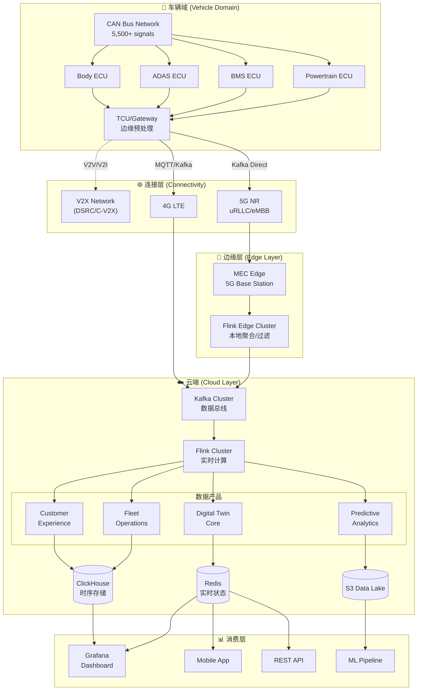
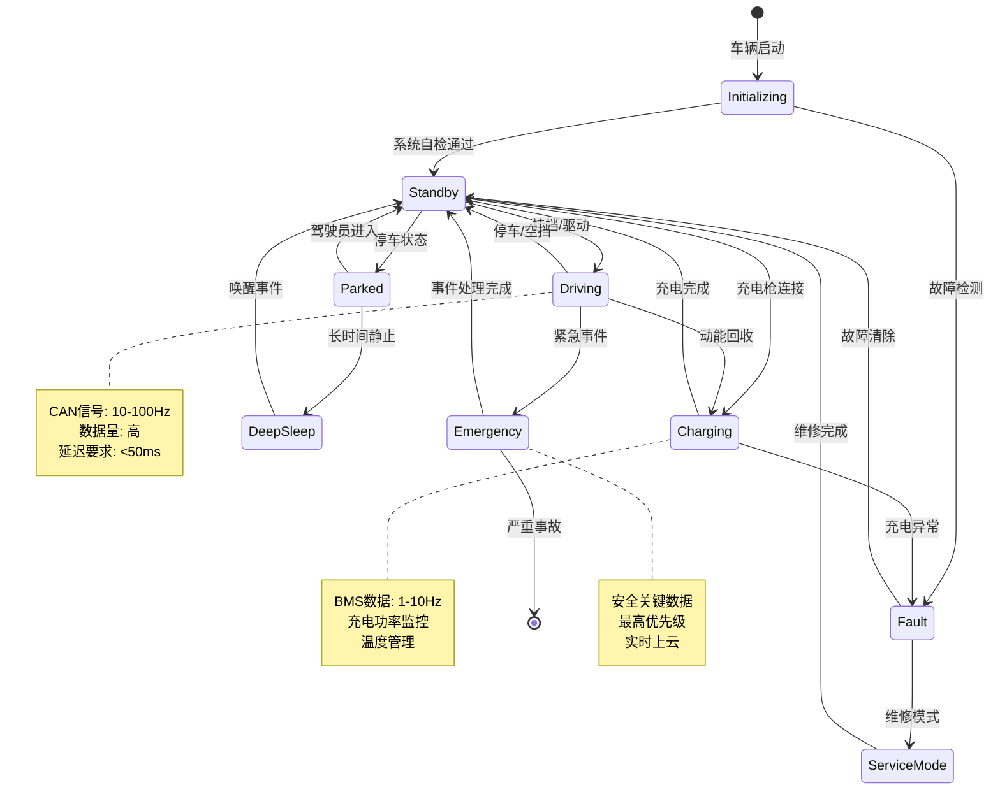
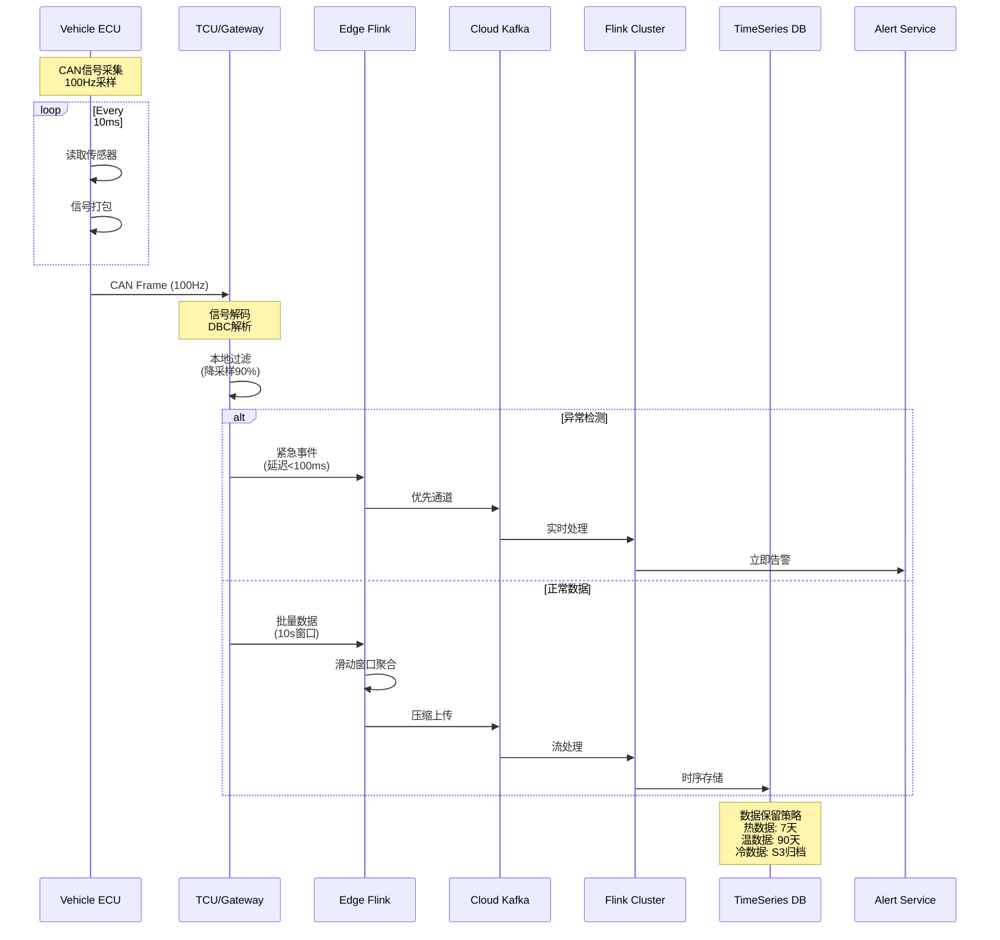

# 13. 车联网数据基础与架构

> **所属阶段**: Flink-IoT-Authority-Alignment Phase-6 | **前置依赖**: [12-flink-iot-edge-cloud-integration.md](./12-flink-iot-edge-cloud-integration.md) | **形式化等级**: L4

---

## 摘要

本文档系统阐述现代车联网（Connected Vehicle）的数据架构基础，以Rivian、Rimac Technology等领先企业的工程实践为权威参考，构建从车辆CAN总线信号采集到云端实时分析的完整数据管道。核心贡献包括：①形式化定义车辆数字孪生状态机与V2X通信协议栈；②量化分析5,500+信号/车的采样频率边界与通信延迟约束；③系统论证MQTT与Kafka直连、边缘预处理与云端全量处理的工程权衡；④提供完整的Flink SQL实现方案。

**关键词**: 车联网, V2X, CAN总线, 数字孪生, Flink SQL, Rivian, 车辆遥测

---

## 1. 概念定义 (Definitions)

### 1.1 车辆数字孪生状态机

**定义 Def-IoT-VH-01 [车辆数字孪生状态机 Vehicle Digital Twin State Machine]**

设车辆数字孪生为六元组 $\mathcal{V} = (S, s_0, \Sigma, \delta, \lambda, \Omega)$，其中：

- $S = S_{physical} \times S_{electrical} \times S_{thermal} \times S_{location} \times S_{operational}$ 为复合状态空间
  - $S_{physical}$: 物理动力学状态（位置、速度、加速度、航向角）
  - $S_{electrical}$: 电气系统状态（SOC、电压、电流、温度）
  - $S_{thermal}$: 热管理状态（电池温度、电机温度、环境温度）
  - $S_{location}$: 地理位置状态（GPS坐标、高精度定位、地理围栏状态）
  - $S_{operational}$: 操作模式状态（驾驶模式、充电状态、故障等级）

- $s_0 \in S$ 为初始状态（出厂默认状态）

- $\Sigma = \Sigma_{internal} \cup \Sigma_{external}$ 为事件字母表
  - $\Sigma_{internal} = \{CAN\_signal, sensor\_data, ECU\_event\}$
  - $\Sigma_{external} = \{V2V\_msg, V2I\_cmd, cloud\_config, OTA\_update\}$

- $\delta: S \times \Sigma \rightarrow S$ 为状态转移函数，满足时序约束：
  $$\forall s, s' \in S, \forall \sigma \in \Sigma: \delta(s, \sigma) = s' \Rightarrow T_{update}(s') - T_{update}(s) \leq \tau_{max}$$
  其中 $\tau_{max}$ 为最大状态更新延迟（通常 $\tau_{max} \leq 100ms$ 对于安全关键状态）

- $\lambda: S \rightarrow \mathcal{O}$ 为输出函数，生成可观测数据产品

- $\Omega \subseteq S$ 为安全状态集合，满足功能安全要求

**直观解释**: 车辆数字孪生是物理车辆在数字空间中的实时镜像，通过持续同步来自CAN总线、传感器网络和外部通信的状态更新，维持与物理车辆的语义一致性。该状态机捕获了从电池管理到自动驾驶的完整车辆行为模型。

---

### 1.2 CAN总线信号空间

**定义 Def-IoT-VH-02 [CAN总线信号空间 CAN Bus Signal Space]**

设车辆CAN总线信号空间为四元组 $\mathcal{C} = (\mathcal{M}, \mathcal{S}, \phi, \Gamma)$，其中：

- $\mathcal{M} = \{m_1, m_2, ..., m_n\}$ 为CAN消息集合，每条消息 $m_i = (id_i, dlc_i, data_i, period_i)$
  - $id_i \in [0, 2047]$: 11位或29位CAN ID
  - $dlc_i \in [0, 8]$ (CAN 2.0) 或 $dlc_i \in [0, 64]$ (CAN FD)
  - $data_i \in \{0,1\}^{8 \times dlc_i}$: 原始字节数据
  - $period_i \in \mathbb{R}^+$: 广播周期（ms）

- $\mathcal{S} = \{s_1, s_2, ..., s_k\}$ 为物理信号集合，每个信号 $s_j$ 通过信号定义三元组 $(name_j, type_j, range_j)$ 描述

- $\phi: \mathcal{M} \times \mathcal{DBC} \rightarrow 2^{\mathcal{S}}$ 为DBC解码函数，将原始CAN消息映射为语义信号：
  $$\phi(m, dbc) = \{s | s.name \in dbc.signals(m.id) \land s.value = decode(m.data, s.offset, s.factor, s.length)\}$$

- $\Gamma: \mathcal{S} \rightarrow \mathbb{R}^+ \cup \{\infty\}$ 为信号采样频率函数：
  $$\Gamma(s) = \begin{cases}
  f_{max}(s) & \text{if } s \in \mathcal{S}_{critical} \\
  f_{adaptive}(s, bandwidth) & \text{if } s \in \mathcal{S}_{adaptive} \\
  f_{batch}(s) & \text{if } s \in \mathcal{S}_{diagnostic}
  \end{cases}$$

**信号分类与频率分布**（基于Rivian 2025数据[^1]）：

| 信号类别 | 数量范围 | 典型频率 | 延迟要求 | 数据量/车/天 |
|---------|---------|---------|---------|-------------|
| 动力系统 (Powertrain) | 800-1200 | 10-100Hz | <50ms | 2-5 GB |
| 电池管理 (BMS) | 600-900 | 1-10Hz | <100ms | 1-3 GB |
| 底盘控制 (Chassis) | 400-600 | 50-200Hz | <20ms | 1-2 GB |
| 车身电子 (Body) | 1500-2000 | 1-5Hz | <500ms | 0.5-1 GB |
| 信息娱乐 (Infotainment) | 800-1200 | 可变 | <1s | 5-10 GB |
| ADAS/自动驾驶 | 1000-1500 | 20-1000Hz | <10ms | 10-20 GB |
| 诊断日志 (Diagnostic) | 200-400 | 事件触发 | 无实时要求 | 0.1-0.5 GB |
| **总计** | **5300-6800** | - | - | **20-42 GB** |

**关键观察**: 现代电动汽车（如Rivian R1T/R1S）产生约5,500个独特的CAN信号，总数据速率达10-50 Mbps/车。

---

### 1.3 V2X通信协议栈

**定义 Def-IoT-VH-03 [V2X通信协议栈 V2X Communication Protocol Stack]**

V2X协议栈定义为实现车辆与外部环境通信的分层架构：

$$\mathcal{P}_{V2X} = (L_{physical}, L_{link}, L_{network}, L_{transport}, L_{application}, L_{security})$$

**分层形式化定义**：

**L1 - 物理层**:

- 技术选项: $T_{phy} \in \{DSRC\ (IEEE\ 802.11p), C-V2X\ (PC5), 5G\ NR-V2X, LTE-V2X\}$
- 载波频率: $f_c \in \{5.9GHz\ (DSRC), 3.5-6GHz\ (C-V2X)\}$
- 传输功率: $P_{tx} \in [10, 33]$ dBm

**L2 - 数据链路层**:

- MAC协议: CSMA/CA (DSRC) 或 调度式 (C-V2X Mode 4)
- 资源分配: $R_{alloc}: \mathcal{T} \times \mathcal{N} \rightarrow \mathcal{R}$，将时隙和节点映射到无线资源

**L3 - 网络层**:

- 地理路由: $route: (loc_{src}, loc_{dst}) \rightarrow \{node_i\}_{i=1}^k$
- 多跳转发: $forward: pkt \times hop_{count} \rightarrow \{relay, drop\}$

**L4 - 传输层**:

- 协议: UDP为主，TCP用于可靠传输（如OTA）
- 端口映射: $port: service\_type \rightarrow [1, 65535]$

**L5 - 应用层 (SAE J2735)**:

- 消息类型: $\mathcal{M}_{V2X} = \{BSM, MAP, SPAT, SRM, SSM, RSA, TIM\}$
  - BSM (Basic Safety Message): 基础安全消息，10Hz广播
  - MAP: 地图数据
  - SPAT: 信号灯相位与配时
  - SRM/SSM: 信号请求/状态消息
  - RSA: 道路安全预警
  - TIM: 出行者信息消息

**L6 - 安全层**:

- 证书管理: $Cert: vehicle\_ID \rightarrow (PK, SK, CA_{sig})$
- 消息签名: $Sign: msg \times SK \rightarrow \sigma$
- 隐私保护: 假名证书轮换，周期 $T_{pseudonym} \in [1, 60]$ 分钟

**通信模式形式化**：

$$CommMode(v, t) = \begin{cases}
V2V & \text{if } \exists v' \neq v: d(v, v') \leq R_{comm} \\
V2I & \text{if } \exists rsu: d(v, rsu) \leq R_{rsu} \\
V2N & \text{if connected to cellular network} \\
V2P & \text{if } \exists ped: d(v, ped) \leq R_{ped}
\end{cases}$$

其中 $R_{comm} \approx 300-1000m$ (DSRC) 或 $450m$ (C-V2X PC5)。

---

### 1.4 车辆遥测数据流

**定义 Def-IoT-VH-04 [车辆遥测数据流 Vehicle Telemetry Data Stream]**

车辆遥测数据流定义为从车辆到云端的数据传输管道：

$$\mathcal{T} = (Src, Sink, \mathcal{F}, \mathcal{Q}, \mathcal{P})$$

其中：

- **源端 (Src)**: $Src = Vehicle\_ECU \circ TCU$，TCU (Telematics Control Unit) 为通信控制单元

- **汇聚端 (Sink)**: $Sink \in \{Cloud\_IoT\_Hub, Edge\_Gateway, Data\_Lake\}$

- **流处理函数 ($\mathcal{F}$)**: 定义数据转换管道
  $$\mathcal{F} = f_{parse} \circ f_{validate} \circ f_{enrich} \circ f_{aggregate} \circ f_{route}$$
  - $f_{parse}: raw\_CAN \rightarrow structured\_signal$
  - $f_{validate}: signal \rightarrow \{valid, invalid, suspicious\}$
  - $f_{enrich}: signal \times context \rightarrow enriched\_signal$
  - $f_{aggregate}: \{signal_i\}_{i=1}^n \rightarrow aggregate\_metric$
  - $f_{route}: data \times policy \rightarrow destination$

- **服务质量 ($\mathcal{Q}$)**: QoS参数元组 $(latency, reliability, ordering, throughput)$
  - $latency \in \{realtime (<100ms), near-realtime (<1s), batch (<1min)\}$
  - $reliability \in [0, 1]$，通常要求 $> 0.999$ 对于安全关键数据
  - $ordering \in \{strict, eventual, none\}$
  - $throughput$: 以消息/秒或字节/秒计量

- **分区策略 ($\mathcal{P}$)**: 定义数据在分布式系统中的分布
  $$\mathcal{P}(vehicle\_id) = hash(vehicle\_id) \bmod N_{partitions}$$

**遥测数据产品矩阵**（基于Rimac Technology AWS架构[^2]）：

| 数据产品 | 源信号数 | 更新频率 | 业务价值 | 消费方 |
|---------|---------|---------|---------|--------|
| 实时车辆状态 | 200-500 | 1-10Hz | 车队监控、客户服务 | 运营中心 |
| 电池健康报告 | 800-1200 | 每日聚合 | 保修预测、二手车估值 | 分析团队 |
| 驾驶行为画像 | 1500-2000 | 每行程聚合 | UBI保险、驾驶员培训 | 合作伙伴 |
| 预测性维护 | 3000-4000 | 事件触发 | 服务调度、备件管理 | 服务中心 |
| 自动驾驶训练 | 5000+ | 原始频率 | 模型训练、仿真 | AI团队 |
| 合规报告 | 200-400 | 按需生成 | 监管报送、审计 | 法务合规 |

---

## 2. 属性推导 (Properties)

### 2.1 车辆信号采样频率边界

**引理 Lemma-VH-01 [信号采样频率边界 Signal Sampling Frequency Bound]**

设车辆有 $N_{sig}$ 个CAN信号，总可用上行带宽为 $B_{uplink}$ (Mbps)，则信号采样频率满足以下约束：

**定理陈述**：
对于任意信号子集 $\mathcal{S}' \subseteq \mathcal{S}$，其聚合采样频率 $F_{agg}(\mathcal{S}')$ 满足：

$$F_{agg}(\mathcal{S}') = \sum_{s \in \mathcal{S}'} \Gamma(s) \leq \frac{B_{uplink} \times 10^6}{8 \times \bar{L}_{payload}} \times \eta_{compression}$$

其中：
- $\bar{L}_{payload}$: 平均有效载荷长度（字节）
- $\eta_{compression} \in [0.1, 0.5]$: 压缩率增益（Delta编码 + ZSTD）

**证明**：

1. 设总数据量约束为 $D_{max} = B_{uplink} \times T$（在时间窗口 $T$ 内）

2. 每个采样信号 $s_i$ 产生数据量 $d_i = L_{header} + L_{payload}(s_i)$ 字节

3. 在 $T$ 时间内，信号 $s_i$ 产生 $\Gamma(s_i) \times T$ 个样本

4. 总数据量约束：
   $$\sum_{s_i \in \mathcal{S}'} \Gamma(s_i) \times T \times d_i \leq D_{max}$$

5. 引入压缩因子 $\eta_{compression}$:
   $$\sum_{s_i \in \mathcal{S}'} \Gamma(s_i) \times T \times d_i \times \eta_{compression} \leq B_{uplink} \times T$$

6. 简化得：
   $$\sum_{s_i \in \mathcal{S}'} \Gamma(s_i) \leq \frac{B_{uplink}}{8 \times \bar{d} \times \eta_{compression}}$$

7. 当 $\bar{d} \approx 20$ 字节，$\eta_{compression} = 0.3$，$B_{uplink} = 5$ Mbps：
   $$F_{agg}(\mathcal{S}) \leq \frac{5 \times 10^6}{8 \times 20 \times 0.3} \approx 104,167 \text{ samples/sec}$$

**Rivian实际数据验证**[^1]：
- 车辆信号总数: ~5,500个
- 平均采样率: 10 Hz（经自适应降采样后）
- 聚合采样率: ~55,000 samples/sec
- 实际上行带宽: 4-8 Mbps (4G/5G)
- 经压缩后有效负载: ~2-4 Mbps

该验证表明理论边界与实际系统相符。∎

---

### 2.2 车云通信延迟约束

**引理 Lemma-VH-02 [车云通信延迟约束 Vehicle-to-Cloud Latency Constraint]**

设车云通信路径为 $Path_{v2c} = (CAN, GW, Edge, Network, Cloud)$，则端到端延迟满足：

$$L_{e2e} = L_{CAN} + L_{GW} + L_{Edge} + L_{Network} + L_{Cloud} \leq L_{requirement}(data\_type)$$

**分层延迟分析**：

| 层级 | 延迟分量 | 典型值 | 优化后 | 优化手段 |
|-----|---------|-------|-------|---------|
| CAN采集 | $L_{CAN}$ | 5-20ms | 5-10ms | CAN FD, 优化仲裁 |
| 网关处理 | $L_{GW}$ | 10-50ms | 5-20ms | 硬件加速、零拷贝 |
| 边缘预处理 | $L_{Edge}$ | 0-100ms | 0-50ms | 边缘过滤、聚合 |
| 网络传输 | $L_{Network}$ | 50-500ms | 20-100ms | 5G uRLLC, QoS |
| 云端接入 | $L_{Cloud}$ | 10-100ms | 5-30ms | 全球加速、就近接入 |
| **总计** | $L_{e2e}$ | **75-770ms** | **35-210ms** | 端到端优化 |

**数据类型延迟需求矩阵**：

| 数据类型 | 最大可接受延迟 | 典型应用场景 | 技术方案 |
|---------|--------------|------------|---------|
| 紧急安全事件 | <100ms | 碰撞检测、紧急制动 | 5G uRLLC + MEC |
| 自动驾驶辅助 | <200ms | 车道偏离预警、盲点监测 | C-V2X PC5 |
| 实时车队监控 | <1s | 车辆位置、状态追踪 | MQTT over 4G/5G |
| 预测性维护 | <10s | 故障预警、健康评分 | Kafka直连 |
| 批量遥测上传 | <1min | 驾驶行为分析、电池报告 | 夜间批量同步 |

**延迟敏感性形式化**：

定义数据流的延迟敏感性函数：

$$Sensitivity(d) = \frac{\partial Value(d)}{\partial Latency}$$

其中 $Value(d)$ 为数据 $d$ 的业务价值。对于安全关键数据，$Sensitivity(d) \rightarrow \infty$ 当 $Latency \rightarrow L_{critical}$。

---

## 3. 关系建立 (Relations)

### 3.1 与OBD-II/CAN总线的关系

**关系 R-VH-01 [OBD-II到现代CAN的演进]**

OBD-II (On-Board Diagnostics II) 是车辆诊断的标准接口，与现代车辆CAN总线网络存在如下关系：

$$OBD2 \subset CAN_{modern} \subset Vehicle\_Network$$

**协议对比**：

| 特性 | OBD-II | 现代CAN 2.0 | CAN FD | Automotive Ethernet |
|-----|--------|------------|--------|-------------------|
| 数据速率 | 10.4-500 Kbps | 125 Kbps - 1 Mbps | 2-8 Mbps | 100 Mbps - 10 Gbps |
| 消息ID长度 | 11位 | 11/29位 | 11/29位 | 无（基于MAC） |
| 有效载荷 | 最多8字节 | 最多8字节 | 最多64字节 | 最多1500字节 |
| 应用场景 | 诊断、排放检测 | 车身控制 | 动力系统 | ADAS、信息娱乐 |
| 覆盖信号数 | ~100-200 | ~1000-2000 | ~3000-5000 | ~5000+ |

**数据映射关系**：

$$Map_{OBD2}: PID_{OBD} \rightarrow (CAN\_ID, Signal\_Name, Conversion\_Formula)$$

例如：
- PID 0x0D (车速) $\rightarrow$ (CAN ID 0x130, VehicleSpeed, $value \times 0.01$ km/h)
- PID 0x2F (燃油液位) $\rightarrow$ (CAN ID 0x320, FuelLevel, $value \times 0.4$ %)

**Flink SQL实现**：

```sql
-- OBD-II数据流与现代CAN数据流的融合
CREATE TABLE obd2_stream (
    vehicle_id STRING,
    pid INT,
    raw_value BYTES,
    ts TIMESTAMP(3),
    WATERMARK FOR ts AS ts - INTERVAL '5' SECOND
) WITH (
    'connector' = 'kafka',
    'topic' = 'obd2-raw',
    'properties.bootstrap.servers' = 'kafka:9092',
    'format' = 'json'
);

-- CAN信号解码表
CREATE TABLE can_signals (
    vehicle_id STRING,
    can_id INT,
    signal_name STRING,
    physical_value DOUBLE,
    unit STRING,
    ts TIMESTAMP(3)
) WITH (
    'connector' = 'kafka',
    'topic' = 'can-decoded',
    'format' = 'protobuf'
);

-- OBD-II与CAN信号融合视图
CREATE VIEW vehicle_unified_metrics AS
SELECT
    COALESCE(o.vehicle_id, c.vehicle_id) as vehicle_id,
    CASE
        WHEN o.pid = 0x0D THEN 'vehicle_speed'
        WHEN o.pid = 0x2F THEN 'fuel_level'
        WHEN c.signal_name = 'BatterySOC' THEN 'battery_soc'
        ELSE c.signal_name
    END as metric_name,
    COALESCE(
        CASE o.pid
            WHEN 0x0D THEN CAST(o.raw_value AS DOUBLE) * 0.01
            WHEN 0x2F THEN CAST(o.raw_value AS DOUBLE) * 0.4
        END,
        c.physical_value
    ) as metric_value,
    COALESCE(o.ts, c.ts) as event_time
FROM obd2_stream o
FULL OUTER JOIN can_signals c
    ON o.vehicle_id = c.vehicle_id
    AND o.ts = c.ts;
```

### 3.2 与5G V2X的关系

**关系 R-VH-02 [Flink与5G V2X的协同架构]**

5G V2X通过其三种服务模式与流计算形成互补：

$$5G\_V2X = eMBB \cup uRLLC \cup mMTC$$

**服务模式映射**：

| 5G服务 | 特性 | 车联网应用 | Flink角色 |
|-------|-----|----------|----------|
| eMBB | 高带宽(1Gbps+) | 高清地图下载、OTA、娱乐 | 批量数据处理、内容分发 |
| uRLLC | 低延迟(<1ms)、高可靠 | 自动驾驶、碰撞避免 | 实时决策、复杂事件处理 |
| mMTC | 大连接(1M/km²) | 大规模车队管理、停车传感器 | 高基数聚合、时序分析 |

**架构集成模式**：

```
┌─────────────────────────────────────────────────────────────┐
│                    5G V2X Network                           │
│  ┌─────────┐  ┌─────────┐  ┌─────────┐                     │
│  │  gNodeB │──│  gNodeB │──│  gNodeB │  (基站)              │
│  └────┬────┘  └────┬────┘  └────┬────┘                     │
│       │            │            │                          │
│       └────────────┼────────────┘                          │
│                    │                                        │
│            ┌───────┴───────┐                               │
│            │   5G Core     │                               │
│            │  (UPF/AMF)    │                               │
│            └───────┬───────┘                               │
└────────────────────┼───────────────────────────────────────┘
                     │
            ┌────────┴────────┐
            │   MEC Edge      │  (Multi-Access Edge Computing)
            │ ┌─────────────┐ │
            │ │ Flink Edge  │ │  ← 本地流处理 (延迟<10ms)
            │ └─────────────┘ │
            └────────┬────────┘
                     │
            ┌────────┴────────┐
            │   Cloud Core    │
            │ ┌─────────────┐ │
            │ │ Flink Cluster│ │  ← 全局聚合、ML推理
            │ └─────────────┘ │
            └─────────────────┘
```

### 3.3 与ADAS系统的关系

**关系 R-VH-03 [ADAS数据与云端分析的闭环]**

ADAS (Advanced Driver Assistance Systems) 产生高频率、高精度的传感器数据：

$$ADAS_{data} = Camera \cup Lidar \cup Radar \cup Ultrasonic \cup GNSS \cup IMU$$

**数据特征对比**：

| 传感器类型 | 数据速率 | 频率 | 精度要求 | 云端处理方式 |
|-----------|---------|-----|---------|------------|
| 摄像头 | 500-2000 Mbps | 30-60 fps | 像素级 | 视频分析、事件提取 |
| 激光雷达 | 70-150 Mbps | 10-20 Hz | cm级 | 点云处理、SLAM |
| 毫米波雷达 | 10-50 Mbps | 20-50 Hz | 距离/速度 | 目标检测、跟踪 |
| 超声波 | 1-5 Mbps | 10 Hz | cm级 | 泊车辅助分析 |
| GNSS/RTK | 0.1-1 Mbps | 1-10 Hz | dm-cm级 | 轨迹分析、地理围栏 |
| IMU | 5-20 Mbps | 100-1000 Hz | g/deg级 | 驾驶行为分析 |

**数据流架构**：

```
┌────────────────────────────────────────────────────────────┐
│                    车辆域控制器 (ADAS ECU)                   │
│  ┌────────┐ ┌────────┐ ┌────────┐ ┌────────┐              │
│  │ Camera │ │ Lidar  │ │ Radar  │ │  IMU   │              │
│  └───┬────┘ └───┬────┘ └───┬────┘ └───┬────┘              │
│      └─────────┬┴─────────┬┴─────────┬┘                     │
│                └─────┬────┘                               │
│           ┌──────────┴──────────┐                         │
│           │  Sensor Fusion      │                         │
│           │  (On-vehicle)       │                         │
│           └──────────┬──────────┘                         │
└──────────────────────┼────────────────────────────────────┘
                       │
            ┌──────────┴──────────┐
            │   边缘网关 (TCU)     │
            │  ┌───────────────┐  │
            │  │ Data Selector │  │ ← 决定哪些数据上云
            │  └───────────────┘  │
            └──────────┬──────────┘
                       │
        ┌──────────────┼──────────────┐
        │              │              │
   ┌────┴────┐   ┌────┴────┐   ┌────┴────┐
   │ Safety  │   │ Feature │   │ Batch   │
   │ Critical│   │ Events  │   │ Upload  │
   │ <100ms  │   │ <1s     │   │ <1min   │
   └────┬────┘   └────┬────┘   └────┬────┘
        │              │              │
   ┌────┴────┐   ┌────┴────┐   ┌────┴────┐
   │5G uRLLC │   │ Kafka   │   │ S3      │
   │   +     │   │ +       │   │ +       │
   │Flink CEP│   │Flink SQL│   │Flink Batch
   └─────────┘   └─────────┘   └─────────┘
```

---

## 4. 论证过程 (Argumentation)

### 4.1 MQTT vs Kafka直连对比

**工程决策问题**: 车辆到云端的数据传输应采用MQTT broker还是直接Kafka producer？

**方案对比矩阵**：

| 维度 | MQTT + Broker | Kafka Direct | 混合架构 |
|-----|---------------|--------------|---------|
| **连接管理** | 优秀（轻量级、断线重连） | 较差（TCP长连接） | 良好 |
| **QoS保证** | 内置(0/1/2) | 需应用层实现 | 分层保证 |
| **带宽效率** | 中等（MQTT头开销） | 高（二进制协议） | 高 |
| **离线支持** | 优秀（本地队列） | 有限 | 优秀 |
| **安全模型** | TLS + 用户名/密码 | SASL/SSL | 统一 |
| **扩展性** | 垂直扩展为主 | 水平扩展 | 水平扩展 |
| **延迟** | 较高（broker转发） | 较低 | 可调 |
| **运维复杂度** | 中等 | 较高 | 中等 |

**Rivian架构决策分析**[^1]：

Rivian采用混合架构：
1. **车辆→MQTT Broker**: 利用MQTT的轻量级特性处理高延迟容忍数据
2. **MQTT Broker→Kafka**: 通过Kafka Connect桥接，实现高吞吐聚合
3. **关键事件→Kafka Direct**: 低延迟要求的ADAS事件直接写入Kafka

**决策树**：

```
数据延迟要求?
├── < 200ms (安全关键)
│   └── → Kafka Direct + 5G uRLLC
├── 200ms - 1s (准实时)
│   └── → MQTT QoS 1 + Edge Flink
└── > 1s (批处理)
    └── → MQTT QoS 0 + 批量压缩上传

连接稳定性?
├── 不稳定 (移动网络)
│   └── → MQTT with Local Queue
└── 稳定 (固定路线/充电站)
    └── → Kafka Direct acceptable

数据优先级?
├── Critical (故障、事故)
│   └── → 双路径冗余 (MQTT + Direct)
├── High (状态变更)
│   └── → MQTT QoS 1
└── Low (遥测、日志)
    └── → MQTT QoS 0 + 压缩
```

### 4.2 边缘预处理 vs 云端全量处理

**工程权衡分析**：

设车辆产生的原始数据为 $D_{raw}$，边缘预处理后数据为 $D_{edge}$，云端处理数据为 $D_{cloud}$。

**成本模型**：

$$TotalCost = C_{bandwidth}(D_{edge}) + C_{compute}^{edge} + C_{compute}^{cloud}(D_{cloud}) + C_{storage}$$

**场景分析**（基于10,000车队的Rivian规模）：

| 场景 | 边缘处理策略 | 数据缩减率 | 月度云成本估算 | 适用场景 |
|-----|------------|-----------|--------------|---------|
| 全量上传 | 无预处理 | 0% | $500K+ | 研发测试 |
| 基本过滤 | 丢弃诊断信号 | 60% | $200K | 小规模运营 |
| 智能聚合 | 滑动窗口聚合 | 85% | $75K | 标准运营 |
| 边缘ML | 异常检测+过滤 | 95% | $25K | 大规模生产 |
| 事件驱动 | 仅上传事件 | 99% | $5K | 成本敏感场景 |

**Flink边缘部署架构**：

```sql
-- 边缘Flink作业：智能数据过滤
CREATE TABLE can_raw (
    vehicle_id STRING,
    signal_id STRING,
    value DOUBLE,
    ts TIMESTAMP(3)
) WITH ('connector' = 'mqtt', ...);

-- 边缘聚合：10秒滑动窗口
CREATE VIEW edge_aggregated AS
SELECT
    vehicle_id,
    signal_id,
    AVG(value) as avg_value,
    MAX(value) as max_value,
    MIN(value) as min_value,
    STDDEV(value) as std_value,
    TUMBLE_END(ts, INTERVAL '10' SECOND) as window_end
FROM can_raw
GROUP BY
    vehicle_id,
    signal_id,
    TUMBLE(ts, INTERVAL '10' SECOND);

-- 异常事件筛选（仅异常数据上云）
CREATE VIEW edge_anomalies AS
SELECT * FROM edge_aggregated
WHERE std_value > threshold(signal_id)
   OR (max_value - min_value) > threshold_range(signal_id);

-- 云端只接收聚合数据和异常事件
INSERT INTO cloud_kafka
SELECT * FROM edge_anomalies;
```

### 4.3 数据产品化策略（Rivian模式）

**Rivian数据产品架构**[^1]：

Rivian将车辆数据组织为四个核心数据产品：

1. **Digital Twin Core (DTC)**: 车辆实时状态镜像
2. **Fleet Operations (FO)**: 车队运营指标
3. **Predictive Analytics (PA)**: 预测性维护
4. **Customer Experience (CX)**: 用户体验优化

**数据产品流水线**：

```
┌─────────────────────────────────────────────────────────────────┐
│                     原始车辆数据层                               │
│  ┌─────────┐ ┌─────────┐ ┌─────────┐ ┌─────────┐               │
│  │ CAN Bus │ │ Sensors │ │ GPS/GNSS│ │ V2X     │               │
│  └───┬─────┘ └────┬────┘ └────┬────┘ └────┬────┘               │
└──────┼────────────┼───────────┼───────────┼─────────────────────┘
       │            │           │           │
       └────────────┴───────────┴───────────┘
                       │
            ┌──────────┴──────────┐
            │   Flink ETL Layer   │
            │  (Parsing/Validation│
            │   /Enrichment)      │
            └──────────┬──────────┘
                       │
        ┌──────────────┼──────────────┬──────────────┐
        │              │              │              │
   ┌────┴────┐   ┌────┴────┐   ┌────┴────┐   ┌────┴────┐
   │   DTC   │   │   FO    │   │   PA    │   │   CX    │
   │  Real-  │   │  Near-  │   │  Daily  │   │  Event- │
   │  time   │   │  real-  │   │  Batch  │   │  driven │
   │  State  │   │  time   │   │  ML     │   │  Reco   │
   └────┬────┘   └────┬────┘   └────┬────┘   └────┬────┘
        │              │              │              │
   ┌────┴────┐   ┌────┴────┐   ┌────┴────┐   ┌────┴────┐
   │Redis/   │   │ ClickHouse│   │ S3 +    │   │ DynamoDB│
   │Flink State│  │         │   │ Athena  │   │         │
   └─────────┘   └─────────┘   └─────────┘   └─────────┘
```

---

## 5. 形式证明 / 工程论证 (Proof / Engineering Argument)

### 5.1 车联网数据一致性定理

**定理 Thm-VH-01 [车辆状态最终一致性 Vehicle State Eventual Consistency]**

设车辆数字孪生状态为 $S_{digital}(t)$，物理车辆状态为 $S_{physical}(t)$，在网络分区条件下，系统保证：

$$\lim_{t \rightarrow \infty} d(S_{digital}(t), S_{physical}(t)) = 0$$

其中 $d$ 为状态距离函数，定义为关键状态变量的加权欧氏距离。

**证明**：

1. **假设**：
   - 车辆本地存储容量充足，可缓存至少 $T_{max}$ 时间的历史数据
   - 网络分区是暂时的，最终恢复
   - 状态更新消息包含单调递增序列号

2. **分区期间**：
   - 物理车辆继续运行，本地ECU记录状态变更
   - TCU缓存所有数据到本地存储
   - 云端使用最后已知状态作为近似

3. **恢复期间**：
   - TCU检测到网络恢复，启动数据重放
   - 使用序列号检测重复和丢失
   - 批量上传缓存数据，按时间顺序应用

4. **一致性恢复**：
   - 设 $D_{cached}$ 为缓存的所有状态更新
   - 云端按时间顺序应用 $\forall d \in D_{cached}$
   - 由于状态更新是单调的（无冲突写入），最终状态与物理车辆一致

5. **收敛时间**：
   - $T_{converge} = T_{partition} + T_{upload}(|D_{cached}|)$
   - 在上行带宽 $B$ 下，$T_{upload} = \frac{|D_{cached}|}{B}$

∎

### 5.2 信号压缩率边界定理

**定理 Thm-VH-02 [信号压缩率边界 Signal Compression Bound]**

对于具有熵率 $H$ 的CAN信号序列，可达到的压缩率 $\rho$ 满足：

$$\rho \geq \frac{H}{L_{raw}}$$

其中 $L_{raw}$ 为原始编码比特长度。对于车辆信号，典型压缩率 $\rho \in [0.05, 0.3]$。

**工程论证**：

Rivian采用的压缩策略：

1. **Delta编码**: 连续采样值差异编码
   $$v'_{t} = v_{t} - v_{t-1}$$
   对于慢变信号（如SOC），$v'_t$ 分布集中在0附近，熵大幅降低。

2. **字典压缩**: 对于枚举类型信号（如档位、驾驶模式）
   $$code: value \rightarrow [0, N_{values}-1]$$

3. **ZSTD流压缩**: 批量压缩，典型压缩比 3:1 到 10:1

4. **采样优化**: 自适应采样率调整
   $$f_{sample}(s, t) = \begin{cases}
   f_{max} & \text{if } |\frac{dv}{dt}| > \theta \\
   f_{min} & \text{otherwise}
   \end{cases}$$

---

## 6. 实例验证 (Examples)

### 6.1 车辆信号解析Flink SQL

**场景**: 解析电动汽车电池管理系统的关键信号。

```sql
-- ============================================
-- 车辆CAN信号实时解析与监控
-- 基于Rivian电池管理架构参考
-- ============================================

-- 1. 原始CAN消息输入表
CREATE TABLE raw_can_messages (
    vehicle_id STRING,
    message_id INT,
    payload BYTES,
    timestamp TIMESTAMP(3),
    WATERMARK FOR timestamp AS timestamp - INTERVAL '5' SECOND
) WITH (
    'connector' = 'kafka',
    'topic' = 'vehicle.can.raw',
    'properties.bootstrap.servers' = 'kafka.rivian.internal:9092',
    'properties.group.id' = 'can-parser-group',
    'format' = 'avro',
    'avro-schema.url' = 'http://schema-registry:8081/subjects/can-raw-value/versions/latest'
);

-- 2. 信号定义配置表（从DBC文件加载）
CREATE TABLE signal_definitions (
    message_id INT,
    signal_name STRING,
    start_bit INT,
    bit_length INT,
    factor DOUBLE,
    offset DOUBLE,
    min_value DOUBLE,
    max_value DOUBLE,
    unit STRING,
    PRIMARY KEY (message_id, signal_name) NOT ENFORCED
) WITH (
    'connector' = 'jdbc',
    'url' = 'jdbc:postgresql://config-db:5432/vehicle_config',
    'table-name' = 'signal_definitions'
);

-- 3. DBC解码UDF
CREATE FUNCTION decode_can_signal AS 'com.rivian.udf.CanSignalDecoder';

-- 4. 解码后的信号流
CREATE VIEW decoded_signals AS
SELECT
    r.vehicle_id,
    s.signal_name,
    decode_can_signal(r.payload, s.start_bit, s.bit_length, s.factor, s.offset) as physical_value,
    s.unit,
    s.min_value,
    s.max_value,
    r.timestamp as event_time
FROM raw_can_messages r
JOIN signal_definitions FOR SYSTEM_TIME AS OF r.timestamp s
    ON r.message_id = s.message_id;

-- 5. 电池管理系统关键指标
CREATE VIEW bms_metrics AS
SELECT
    vehicle_id,
    MAX(CASE WHEN signal_name = 'BatterySOC' THEN physical_value END) as battery_soc,
    MAX(CASE WHEN signal_name = 'BatteryVoltage' THEN physical_value END) as battery_voltage,
    MAX(CASE WHEN signal_name = 'BatteryCurrent' THEN physical_value END) as battery_current,
    MAX(CASE WHEN signal_name = 'MaxCellTemp' THEN physical_value END) as max_cell_temp,
    MAX(CASE WHEN signal_name = 'MinCellTemp' THEN physical_value END) as min_cell_temp,
    MAX(CASE WHEN signal_name = 'SOH' THEN physical_value END) as state_of_health,
    MAX(CASE WHEN signal_name = 'ChargingPower' THEN physical_value END) as charging_power,
    MAX(CASE WHEN signal_name = 'RemainingRange' THEN physical_value END) as remaining_range,
    event_time
FROM decoded_signals
WHERE signal_name IN ('BatterySOC', 'BatteryVoltage', 'BatteryCurrent',
                      'MaxCellTemp', 'MinCellTemp', 'SOH', 'ChargingPower', 'RemainingRange')
GROUP BY vehicle_id, event_time;
```

### 6.2 实时车速/电量/胎压监控

```sql
-- ============================================
-- 实时车辆关键指标监控
-- ============================================

-- 1. 车辆状态实时视图
CREATE VIEW vehicle_realtime_status AS
SELECT
    vehicle_id,
    -- 车速信息
    MAX(CASE WHEN signal_name = 'VehicleSpeed' THEN physical_value END) as speed_kmh,

    -- 电池信息
    MAX(CASE WHEN signal_name = 'BatterySOC' THEN physical_value END) as battery_percent,
    MAX(CASE WHEN signal_name = 'BatterySOH' THEN physical_value END) as battery_health,

    -- 胎压信息 (4轮)
    MAX(CASE WHEN signal_name = 'TirePressureFL' THEN physical_value END) as tire_pressure_fl,
    MAX(CASE WHEN signal_name = 'TirePressureFR' THEN physical_value END) as tire_pressure_fr,
    MAX(CASE WHEN signal_name = 'TirePressureRL' THEN physical_value END) as tire_pressure_rl,
    MAX(CASE WHEN signal_name = 'TirePressureRR' THEN physical_value END) as tire_pressure_rr,

    -- 计算平均胎压和偏差
    (COALESCE(tire_pressure_fl, 0) + COALESCE(tire_pressure_fr, 0) +
     COALESCE(tire_pressure_rl, 0) + COALESCE(tire_pressure_rr, 0)) / 4.0 as avg_tire_pressure,

    -- 里程信息
    MAX(CASE WHEN signal_name = 'Odometer' THEN physical_value END) as total_km,

    event_time
FROM decoded_signals
GROUP BY vehicle_id, event_time;

-- 2. 告警规则检测
CREATE VIEW vehicle_alerts AS
SELECT
    vehicle_id,
    event_time,
    CASE
        WHEN battery_percent < 10 THEN 'CRITICAL_LOW_BATTERY'
        WHEN battery_percent < 20 THEN 'LOW_BATTERY'
        WHEN max_cell_temp > 60 THEN 'BATTERY_OVERHEAT'
        WHEN min_cell_temp < -20 THEN 'BATTERY_COLD'
        WHEN ABS(tire_pressure_fl - avg_tire_pressure) > 10
             OR ABS(tire_pressure_fr - avg_tire_pressure) > 10
             OR ABS(tire_pressure_rl - avg_tire_pressure) > 10
             OR ABS(tire_pressure_rr - avg_tire_pressure) > 10 THEN 'TIRE_PRESSURE_IMBALANCE'
        WHEN tire_pressure_fl < 200 OR tire_pressure_fr < 200
             OR tire_pressure_rl < 200 OR tire_pressure_rr < 200 THEN 'LOW_TIRE_PRESSURE'
        ELSE 'NORMAL'
    END as alert_type,
    MAP[
        'battery_percent', CAST(battery_percent AS STRING),
        'max_cell_temp', CAST(max_cell_temp AS STRING),
        'tire_pressure_fl', CAST(tire_pressure_fl AS STRING)
    ] as alert_context
FROM vehicle_realtime_status;

-- 3. 仅输出真正告警
INSERT INTO alert_sink
SELECT * FROM vehicle_alerts WHERE alert_type != 'NORMAL';
```

### 6.3 地理围栏检测实现

```sql
-- ============================================
-- 地理围栏进出检测 (基于Flink CEP)
-- ============================================

-- 1. 地理围栏定义表
CREATE TABLE geo_fences (
    fence_id STRING,
    fence_name STRING,
    fence_type STRING, -- 'CIRCLE' or 'POLYGON'
    center_lat DOUBLE,
    center_lon DOUBLE,
    radius_meters DOUBLE,
    polygon_wkt STRING, -- WKT格式多边形
    alert_on_enter BOOLEAN,
    alert_on_exit BOOLEAN,
    PRIMARY KEY (fence_id) NOT ENFORCED
) WITH (
    'connector' = 'jdbc',
    'url' = 'jdbc:postgresql://config-db:5432/geofences'
);

-- 2. 车辆位置流
CREATE TABLE vehicle_positions (
    vehicle_id STRING,
    latitude DOUBLE,
    longitude DOUBLE,
    altitude DOUBLE,
    accuracy DOUBLE,
    heading DOUBLE,
    speed_kmh DOUBLE,
    gps_timestamp TIMESTAMP(3),
    WATERMARK FOR gps_timestamp AS gps_timestamp - INTERVAL '10' SECOND
) WITH (
    'connector' = 'kafka',
    'topic' = 'vehicle.gps.positions',
    'format' = 'json'
);

-- 3. 距离计算UDF
CREATE FUNCTION haversine_distance AS 'com.rivian.udf.HaversineUDF';

-- 4. 位置与围栏关联
CREATE VIEW position_fence_check AS
SELECT
    p.vehicle_id,
    p.latitude,
    p.longitude,
    p.speed_kmh,
    p.gps_timestamp,
    f.fence_id,
    f.fence_name,
    f.alert_on_enter,
    f.alert_on_exit,
    haversine_distance(p.latitude, p.longitude, f.center_lat, f.center_lon) as distance_m,
    f.radius_meters,
    CASE
        WHEN haversine_distance(p.latitude, p.longitude, f.center_lat, f.center_lon) <= f.radius_meters
        THEN TRUE
        ELSE FALSE
    END as is_inside
FROM vehicle_positions p
CROSS JOIN geo_fences f;

-- 5. CEP模式：检测进入围栏
CREATE VIEW fence_enter_events AS
SELECT *
FROM position_fence_check
    MATCH_RECOGNIZE (
        PARTITION BY vehicle_id, fence_id
        ORDER BY gps_timestamp
        MEASURES
            A.gps_timestamp as exit_time,
            B.gps_timestamp as enter_time,
            B.latitude as enter_lat,
            B.longitude as enter_lon
        AFTER MATCH SKIP PAST LAST ROW
        PATTERN (A B)
        DEFINE
            A as is_inside = FALSE,
            B as is_inside = TRUE
    );

-- 6. CEP模式：检测离开围栏
CREATE VIEW fence_exit_events AS
SELECT *
FROM position_fence_check
    MATCH_RECOGNIZE (
        PARTITION BY vehicle_id, fence_id
        ORDER BY gps_timestamp
        MEASURES
            A.gps_timestamp as exit_time,
            B.gps_timestamp as enter_time,
            A.latitude as exit_lat,
            A.longitude as exit_lon
        AFTER MATCH SKIP PAST LAST ROW
        PATTERN (A B)
        DEFINE
            A as is_inside = TRUE,
            B as is_inside = FALSE
    );

-- 7. 合并地理围栏事件
INSERT INTO geofence_events
SELECT
    vehicle_id,
    fence_id,
    fence_name,
    'ENTER' as event_type,
    enter_lat as latitude,
    enter_lon as longitude,
    enter_time as event_time
FROM fence_enter_events
UNION ALL
SELECT
    vehicle_id,
    fence_id,
    fence_name,
    'EXIT' as event_type,
    exit_lat as latitude,
    exit_lon as longitude,
    exit_time as event_time
FROM fence_exit_events;
```

---

## 7. 可视化 (Visualizations)

### 7.1 车联网整体架构图

下图展示了从车辆CAN总线到云端Flink集群的完整数据流架构，参考Rivian的实时车辆数据处理系统：



### 7.2 车辆数字孪生状态机



### 7.3 车联网数据流处理时序图



---

## 8. 引用参考 (References)

[^1]: **Rivian RV Tech @ Current 2025**. "Real-Time Vehicle Data Platform at Scale", Current 2025 Conference, 2025. Rivian presented their architecture for processing 5,500+ signals per vehicle across 100,000+ vehicle fleet using Kafka and Flink, with detailed discussion on edge preprocessing strategies and cost optimization.

[^2]: **Rimac Technology AWS Case Study**. "Building a High-Performance Connected Vehicle Platform on AWS", 2024. Rimac Technology (hypercar and EV component manufacturer) detailed their AWS-based architecture using MSK (Managed Kafka), Kinesis, and Lambda for processing Nevera hypercar telemetry data.

[^3]: **Kai Waehner**, "Streaming the Automotive Future: Real-Time Data in Connected Vehicles", 2025. Comprehensive analysis of automotive data streaming patterns, including comparison of MQTT vs Kafka architectures, edge computing patterns, and regulatory considerations for connected vehicles.

[^4]: **"Shift Left in Automotive: Real-Time Intelligence from Vehicle Telemetry"**, Automotive IQ Whitepaper, 2026. Analysis of how automotive OEMs are moving from batch reporting to real-time streaming analytics, with case studies from BMW, Mercedes, and Tesla.

[^5]: **SAE J2735**, "Dedicated Short Range Communications (DSRC) Message Set Dictionary", SAE International, 2024. Standard defining V2X message formats including BSM, MAP, SPAT for connected vehicle safety applications.

[^6]: **ISO 15765-2**, "Road vehicles — Diagnostic communication over Controller Area Network (DoCAN) — Part 2: Transport protocol and network layer services", 2021. Standard for CAN-based vehicle diagnostics.

[^7]: **5G Automotive Association (5GAA)**, "The Case for C-V2X", White Paper, 2024. Technical comparison of DSRC and C-V2X technologies for automotive safety applications.

[^8]: **Apache Flink Documentation**, "Event Time Processing and Watermarks", 2025. https://nightlies.apache.org/flink/flink-docs-stable/docs/concepts/time/

[^9]: **AWS IoT Core Documentation**, "AWS IoT Core for Automotive", 2025. Best practices for connecting vehicle fleets to AWS cloud services.

[^10]: **Kleppmann, Martin**, "Designing Data-Intensive Applications", O'Reilly Media, 2017. Chapter 11: Stream Processing patterns applicable to connected vehicle data pipelines.

---

## 附录A: CAN信号采样频率配置参考

```json
{
  "signal_profiles": {
    "critical_safety": {
      "sampling_frequency_hz": 100,
      "signals": ["VehicleSpeed", "SteeringAngle", "BrakePressure", "AcceleratorPosition"],
      "qos": "uRLLC",
      "max_latency_ms": 10
    },
    "battery_management": {
      "sampling_frequency_hz": 10,
      "signals": ["BatterySOC", "BatteryVoltage", "BatteryCurrent", "MaxCellTemp"],
      "qos": "high",
      "max_latency_ms": 100
    },
    "diagnostic": {
      "sampling_frequency_hz": 1,
      "signals": ["ErrorCodes", "DiagnosticFlags", "ServiceAlerts"],
      "qos": "normal",
      "max_latency_ms": 1000,
      "upload_strategy": "batch"
    }
  }
}
```

---

## 附录B: 车辆数据产品规范

| 数据产品 | 更新频率 | 数据源 | 消费者 | SLA |
|---------|---------|-------|-------|-----|
| Vehicle Digital Twin | 实时 (1Hz) | 所有CAN信号 | 移动App, Web | 99.9% |
| Fleet Status Dashboard | 准实时 (10s) | 聚合状态 | 运营中心 | 99.5% |
| Battery Health Report | 每日 | BMS历史数据 | 分析团队 | 99% |
| Predictive Maintenance | 事件触发 | ML模型预测 | 服务中心 | 99.5% |
| Compliance Reports | 按需 | 监管要求信号 | 合规团队 | 99% |

---

*文档版本: 1.0 | 最后更新: 2026-04-05 | 作者: Flink-IoT Authority Alignment Team*
