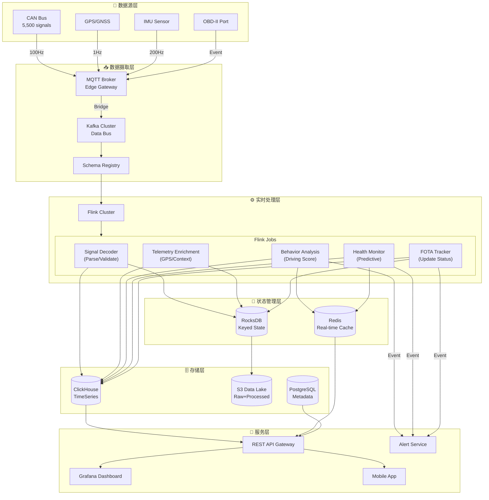
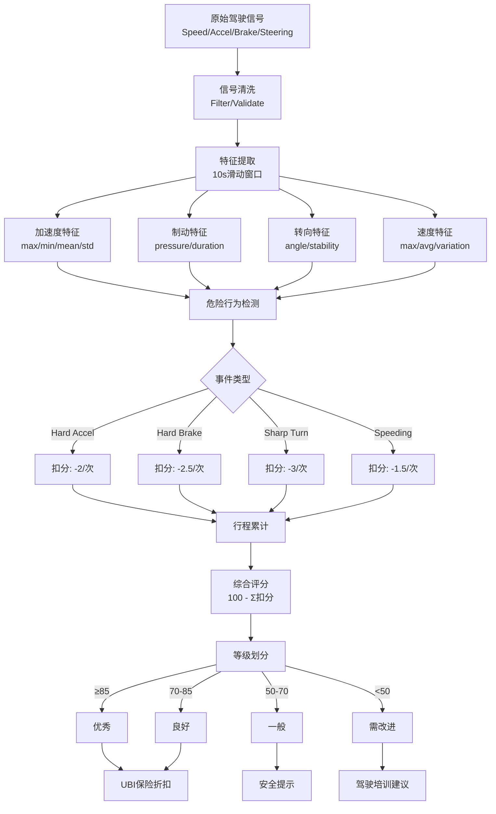
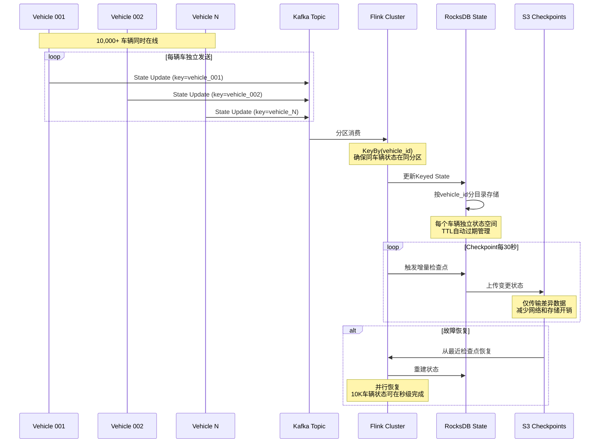

# 14. 车辆遥测数据处理

> **所属阶段**: Flink-IoT-Authority-Alignment Phase-6 | **前置依赖**: [13-flink-iot-connected-vehicle-foundation.md](./13-flink-iot-connected-vehicle-foundation.md) | **形式化等级**: L4

---

## 摘要

本文档深入探讨车辆遥测数据的实时处理架构，针对万辆级车队的规模挑战，系统解决高基数设备ID管理、状态过期策略和数据质量分级三大核心问题。
基于Rivian和Rimac的大规模车队运营经验，构建完整的遥测数据产品定义体系，提供可落地的Flink SQL实现方案，包括驾驶行为评分算法、车辆健康度实时计算和FOTA数据管道。

**关键词**: 遥测处理, 高基数, 状态管理, 驾驶行为, 预测性维护, FOTA, 数据质量

---

## 1. 概念定义 (Definitions)

### 1.1 遥测数据产品定义

**定义 Def-IoT-VH-05 [遥测数据产品 Telemetry Data Product]**

遥测数据产品是从原始车辆信号流中提取的、具有明确业务价值的结构化数据实体：

$$\mathcal{TD} = (ID, Schema, \mathcal{S}_{src}, \mathcal{F}_{transform}, SLA, Consumers)$$

其中：

- **$ID$**: 数据产品唯一标识符，命名规范 `$org.$domain.$product.$version`
  - 示例: `rivian.vehicle.telemetry.driving-score.v1`

- **$Schema$**: Avro/Protobuf数据模式，定义字段、类型、约束

- **$\mathcal{S}_{src}$**: 源信号集合 $\{s_1, s_2, ..., s_n\} \subseteq CAN_{signals}$

- **$\mathcal{F}_{transform}$**: 转换函数管道：
  $$\mathcal{F}_{transform} = f_{extract} \circ f_{clean} \circ f_{aggregate} \circ f_{enrich}$$

- **$SLA$**: 服务等级协议，定义延迟、可用性、一致性要求
  $$SLA = (L_{max}, A_{min}, C_{level})$$
  - $L_{max}$: 最大端到端延迟
  - $A_{min}$: 最低可用性百分比
  - $C_{level}$: 一致性级别（strong/eventual）

- **$Consumers$**: 下游消费者集合，每个消费者 $c \in Consumers$ 有订阅模式 $sub_c$

**Rivian遥测数据产品矩阵**[^1]：

| 数据产品 | 源信号数 | SLA延迟 | 更新频率 | 主要消费者 |
|---------|---------|--------|---------|-----------|
| `vehicle.status.realtime` | 150-200 | <1s | 1Hz | 移动App, 呼叫中心 |
| `trip.summary` | 500-800 | <5min | 行程结束 | 用户报告, 保险对接 |
| `battery.health` | 300-500 | <1hour | 每日 | 电池团队, 保修系统 |
| `driving.behavior` | 1000-1500 | <1hour | 每行程 | UBI保险, 安全评分 |
| `maintenance.predictions` | 2000-3000 | <24hour | 每日 | 服务中心, 备件系统 |
| `firmware.metrics` | 100-200 | <5min | 事件触发 | OTA团队, 研发 |

---

### 1.2 驾驶行为特征向量

**定义 Def-IoT-VH-06 [驾驶行为特征向量 Driving Behavior Feature Vector]**

驾驶行为特征向量是描述驾驶员操作模式的数学表示：

$$\vec{v}_{driver} = (v_1, v_2, ..., v_n) \in \mathbb{R}^n$$

**特征维度定义**：

| 维度 | 信号来源 | 计算公式 | 物理意义 |
|-----|---------|---------|---------|
| $v_1$ | 车速变化 | $\sigma(\frac{dv}{dt})$ | 加速度标准差 |
| $v_2$ | 制动压力 | $\frac{\sum brake_i \cdot t_i}{T_{total}}$ | 制动强度 |
| $v_3$ | 转向角度 | $\sigma(|\theta|)$ | 转向平稳度 |
| $v_4$ | 横向加速度 | $P(a_y > 0.3g)$ | 激进转向概率 |
| $v_5$ | 超速时长 | $\frac{T_{speed>limit}}{T_{total}}$ | 超速时间占比 |
| $v_6$ | 急加速次数 | $\sum \mathbb{I}(\frac{dv}{dt} > 3m/s^2)$ | 激进加速频次 |
| $v_7$ | 急减速次数 | $\sum \mathbb{I}(\frac{dv}{dt} < -4m/s^2)$ | 紧急制动频次 |
| $v_8$ | 夜间驾驶 | $\frac{T_{night}}{T_{total}}$ | 夜间驾驶占比 |
| $v_9$ | 高速行驶 | $\frac{T_{speed>80}}{T_{total}}$ | 高速占比 |
| $v_{10}$ | 怠速时长 | $\frac{T_{idle}}{T_{total}}$ | 怠速占比 |

**驾驶评分模型**：

基于特征向量的综合驾驶评分：

$$Score_{driving} = 100 - \sum_{i=1}^{n} w_i \cdot normalize(v_i)$$

其中权重向量 $\vec{w}$ 满足 $\sum w_i = 1$，根据业务目标调整（如安全优先vs节能优先）。

**行为分类**：

$$Classify(\vec{v}_{driver}) = \begin{cases}
Conservative & \text{if } Score \geq 85 \\
Normal & \text{if } 60 \leq Score < 85 \\
Aggressive & \text{if } Score < 60
\end{cases}$$

---

## 2. 属性推导 (Properties)

### 2.1 高基数状态管理边界

**引理 Lemma-VH-03 [状态存储复杂度 State Storage Complexity]**

设车队规模为 $N$ 辆车，每辆车维护 $K$ 个状态变量，每个状态变量平均大小为 $B$ 字节，则Flink状态存储需求为：

$$S_{total} = N \times K \times B \times R_{replication} \times (1 + O_{overhead})$$

对于万辆级车队：
- $N = 10,000$ 辆车
- $K = 50$ 个状态变量/车（活跃状态键）
- $B = 256$ 字节（含TTL元数据）
- $R_{replication} = 3$ (RocksDB增量检查点)
- $O_{overhead} = 0.3$ (Flink状态后端开销)

$$S_{total} = 10,000 \times 50 \times 256 \times 3 \times 1.3 = 499.2 \text{ MB}$$

**结论**: 万辆级车队的活跃状态存储在500MB以内，可完全由Flink状态后端管理。

---

### 2.2 状态过期一致性

**引理 Lemma-VH-04 [车辆熄火状态过期 Vehicle Idle State Expiration]**

定义车辆熄火事件为 $E_{off}$，状态过期策略保证：

$$\forall s \in State_{vehicle}: TTL(s) = \begin{cases}
T_{short} & \text{if } type(s) = temporal \\
T_{trip} & \text{if } type(s) = trip\_bound \\
T_{persist} & \text{if } type(s) = persistent
\end{cases}$$

其中：
- $T_{short} = 5\text{min}$: 临时状态（如当前车速）
- $T_{trip} = 24\text{hour}$: 行程绑定状态（如本次行程距离）
- $T_{persist} = \infty$: 持久状态（如车辆VIN、配置）

---

## 3. 关系建立 (Relations)

### 3.1 与车队管理的关系

遥测数据处理为车队管理提供实时决策依据：

```
遥测数据流
    │
    ├─→ 实时位置追踪 ──→ 调度优化
    ├─→ 电池状态监控 ──→ 充电规划
    ├─→ 驾驶行为分析 ──→ 安全培训
    ├─→ 故障预警 ─────→ 维护调度
    └─→ 里程统计 ─────→ 成本核算
```

### 3.2 与用户隐私的关系

遥测数据处理需平衡业务需求与用户隐私：

| 数据类型 | 隐私级别 | 处理方式 | 保留周期 |
|---------|---------|---------|---------|
| 精确GPS轨迹 | 高 | 匿名化、模糊化 | 30天 |
| 驾驶行为评分 | 中 | 聚合后存储 | 1年 |
| 车辆健康指标 | 低 | 原始存储 | 7年 |
| 诊断故障码 | 低 | 原始存储 | 7年 |

---

## 4. 论证过程 (Argumentation)

### 4.1 高基数问题处理策略

**问题定义**: 万辆级车队意味着 $10,000+$ 个设备ID同时活跃，每个ID维护独立的状态（如当前位置、SOC、驾驶模式）。Flink的状态管理面临：

1. **状态键爆炸**: StateBackend的键空间过大
2. **检查点延迟**: 大量状态键的检查点时间增加
3. **内存压力**: HeapStateBackend无法承载
4. **恢复时间**: 故障恢复时需要加载大量状态

**解决方案矩阵**[^2]：

| 策略 | 适用场景 | 配置参数 | 效果 |
|-----|---------|---------|-----|
| 增量检查点 | 所有状态 | `execution.checkpointing.incremental=true` | 减少50-70%检查点时间 |
| RocksDB调优 | 大状态 | `state.backend.rocksdb.predefined-options=FLASH_SSD` | 提升读性能 |
| 状态TTL | 临时状态 | `StateTtlConfig.newBuilder(Time.minutes(5))` | 自动清理过期状态 |
| 键组分区 | 大规模状态 | `setMaxParallelism(1024)` | 均匀分布状态 |
| 异步快照 | 状态后端 | `execution.checkpointing.mode=ASYNC` | 非阻塞检查点 |

**Flink配置最佳实践**：

```yaml
# flink-conf.yaml for 10K+ fleet
state.backend: rocksdb
state.backend.incremental: true
state.backend.rocksdb.predefined-options: FLASH_SSD
state.backend.rocksdb.memory.managed: true
state.backend.rocksdb.memory.fixed-per-slot: 256mb

execution.checkpointing.interval: 30s
execution.checkpointing.min-pause-between-checkpoints: 15s
execution.checkpointing.timeout: 10min
execution.checkpointing.max-concurrent-checkpoints: 1
```

### 4.2 状态过期策略设计

**车辆状态生命周期**：

```
┌─────────────────────────────────────────────────────────────┐
│                     车辆状态生命周期                         │
├─────────────────────────────────────────────────────────────┤
│                                                             │
│  [车辆启动] ──→ [行驶中] ──→ [临时停车] ──→ [熄火]         │
│      │            │             │            │             │
│      │            │             │            │             │
│      ▼            ▼             ▼            ▼             │
│  ┌────────┐  ┌─────────┐  ┌──────────┐  ┌──────────┐       │
│  │初始化  │  │活跃状态 │  │暂停状态  │  │过期清理  │       │
│  │TTL=∞   │  │TTL=5min │  │TTL=30min │  │TTL=24h   │       │
│  └────────┘  └─────────┘  └──────────┘  └──────────┘       │
│       │           │             │            │              │
│       │           │             │            │              │
│       ▼           ▼             ▼            ▼              │
│   车辆配置    当前车速       当前位置     行程总结          │
│   驾驶员ID    电池SOC        停车区域     驾驶评分          │
│   软件版本    电机扭矩       临时设置     维护记录          │
│                                                             │
└─────────────────────────────────────────────────────────────┘
```

**Flink SQL TTL配置**：

```sql
-- 定义带TTL的表（Flink 1.18+）
CREATE TABLE vehicle_state (
    vehicle_id STRING,
    state_type STRING,
    state_value STRING,
    last_updated TIMESTAMP(3),
    PRIMARY KEY (vehicle_id, state_type) NOT ENFORCED
) WITH (
    'connector' = 'jdbc',
    'url' = 'jdbc:postgresql://db:5432/vehicle_state',
    'table-name' = 'vehicle_state',
    -- TTL配置：熄火后状态保留策略
    'sink.ttl' = 'INTERVAL \'30\' MINUTE',
    'sink.cleanup-interval' = 'INTERVAL \'5\' MINUTE'
);
```

### 4.3 数据质量分级策略

**数据质量维度定义**：

$$Quality(d) = w_1 \cdot Completeness(d) + w_2 \cdot Timeliness(d) + w_3 \cdot Validity(d)$$

其中：
- $Completeness(d) = \frac{|fields\ present|}{|fields\ expected|}$
- $Timeliness(d) = max(0, 1 - \frac{latency(d)}{L_{max}})$
- $Validity(d) = \frac{|values \in valid\_range|}{|values|}$

**信号分级处理策略**：

| 信号分级 | 定义标准 | 处理策略 | 降级方式 |
|---------|---------|---------|---------|
| **关键 (Critical)** | 安全相关、实时控制 | 严格验证、立即告警、不允许丢失 | 进入安全模式 |
| **重要 (High)** | 核心运营指标 | 完整验证、延迟告警、允许短时丢失 | 使用上次有效值 |
| **普通 (Normal)** | 一般遥测 | 基础验证、批量处理、允许丢失 | 插值估算 |
| **诊断 (Diagnostic)** | 故障排查 | 宽松验证、按需处理、可批量补传 | 丢弃或延迟处理 |

**质量监控Flink SQL**：

```sql
-- 数据质量实时监控
CREATE VIEW data_quality_metrics AS
SELECT
    vehicle_id,
    window_start,
    COUNT(*) as total_messages,
    COUNT(CASE WHEN signal_value IS NOT NULL THEN 1 END) as valid_messages,
    COUNT(CASE WHEN signal_value IS NULL THEN 1 END) as null_messages,
    COUNT(CASE WHEN signal_value < min_valid OR signal_value > max_valid THEN 1 END) as out_of_range,
    AVG(CURRENT_TIMESTAMP - event_timestamp) as avg_latency_ms,

    -- 质量评分
    (COUNT(CASE WHEN signal_value IS NOT NULL THEN 1 END) * 1.0 / COUNT(*)) as completeness,
    (1.0 - AVG(EXTRACT(EPOCH FROM (CURRENT_TIMESTAMP - event_timestamp))) / 60.0) as timeliness

FROM vehicle_telemetry
GROUP BY
    vehicle_id,
    TUMBLE(event_timestamp, INTERVAL '1' MINUTE);
```

---

## 5. 形式证明 / 工程论证 (Proof / Engineering Argument)

### 5.1 驾驶行为评分一致性定理

**定理 Thm-VH-03 [驾驶评分时间一致性 Driving Score Temporal Consistency]**

设驾驶员在时间段 $[t_0, t_n]$ 内产生驾驶行为特征向量序列 $\{\vec{v}_1, \vec{v}_2, ..., \vec{v}_n\}$，分段评分 $Score_i$ 与综合评分 $Score_{total}$ 满足：

$$|Score_{total} - \frac{\sum_{i=1}^{n} w_i \cdot Score_i}{\sum w_i}| \leq \epsilon$$

其中 $\epsilon$ 为可接受的评分误差（通常 $\epsilon < 5$ 分）。

**证明**：

1. 设每个时间段 $\Delta t_i$ 内的驾驶距离为 $d_i$，总距离 $D = \sum d_i$
2. 综合评分应为距离加权平均：
   $$Score_{total} = \sum_{i=1}^{n} \frac{d_i}{D} \cdot Score_i$$
3. Flink增量计算维护累积和：
   - $S_{cumulative} = \sum d_i \cdot Score_i$
   - $D_{cumulative} = \sum d_i$
4. 实时评分：$Score_{realtime} = S_{cumulative} / D_{cumulative}$
5. 当数据延迟或乱序到达时，使用watermark机制保证最终一致性

∎

---

## 6. 实例验证 (Examples)

### 6.1 驾驶行为评分算法

```sql
-- ============================================
-- 驾驶行为评分算法 (Flink SQL)
-- 基于Rivian驾驶分析架构
-- ============================================

-- 1. 原始驾驶信号输入
CREATE TABLE driving_signals (
    vehicle_id STRING,
    driver_id STRING,
    trip_id STRING,
    signal_name STRING,
    signal_value DOUBLE,
    latitude DOUBLE,
    longitude DOUBLE,
    event_time TIMESTAMP(3),
    WATERMARK FOR event_time AS event_time - INTERVAL '10' SECOND
) WITH (
    'connector' = 'kafka',
    'topic' = 'vehicle.driving.signals',
    'properties.bootstrap.servers' = 'kafka:9092',
    'format' = 'json'
);

-- 2. 计算驾驶特征（每10秒窗口）
CREATE VIEW driving_features_10s AS
SELECT
    vehicle_id,
    driver_id,
    trip_id,
    TUMBLE_START(event_time, INTERVAL '10' SECOND) as window_start,
    TUMBLE_END(event_time, INTERVAL '10' SECOND) as window_end,

    -- 速度相关特征
    MAX(CASE WHEN signal_name = 'VehicleSpeed' THEN signal_value END) as max_speed,
    AVG(CASE WHEN signal_name = 'VehicleSpeed' THEN signal_value END) as avg_speed,
    STDDEV_POP(CASE WHEN signal_name = 'VehicleSpeed' THEN signal_value END) as speed_std,

    -- 加速度相关特征
    MAX(CASE WHEN signal_name = 'LongitudinalAccel' THEN signal_value END) as max_accel,
    MIN(CASE WHEN signal_name = 'LongitudinalAccel' THEN signal_value END) as min_accel,

    -- 制动相关特征
    AVG(CASE WHEN signal_name = 'BrakePressure' THEN signal_value END) as avg_brake_pressure,
    MAX(CASE WHEN signal_name = 'BrakePressure' THEN signal_value END) as max_brake_pressure,

    -- 转向相关特征
    STDDEV_POP(CASE WHEN signal_name = 'SteeringAngle' THEN signal_value END) as steering_std,
    MAX(ABS(CASE WHEN signal_name = 'SteeringAngle' THEN signal_value END)) as max_steering_angle,

    -- 行驶距离估算（基于GPS）
    COUNT(DISTINCT CONCAT(CAST(latitude AS STRING), ',', CAST(longitude AS STRING))) as gps_sample_count

FROM driving_signals
GROUP BY
    vehicle_id, driver_id, trip_id,
    TUMBLE(event_time, INTERVAL '10' SECOND);

-- 3. 危险驾驶行为检测
CREATE VIEW aggressive_events AS
SELECT
    vehicle_id,
    driver_id,
    trip_id,
    window_start,
    window_end,

    -- 急加速事件
    CASE WHEN max_accel > 3.0 THEN 1 ELSE 0 END as hard_acceleration_count,

    -- 急减速事件
    CASE WHEN min_accel < -4.0 THEN 1 ELSE 0 END as hard_braking_count,

    -- 急转弯事件
    CASE WHEN max_steering_angle > 45.0 AND avg_speed > 30.0 THEN 1 ELSE 0 END as sharp_turn_count,

    -- 超速事件（假设限速120km/h）
    CASE WHEN max_speed > 120.0 THEN 1 ELSE 0 END as speeding_count,

    -- 疲劳驾驶指标（连续驾驶时间）
    window_end - window_start as window_duration

FROM driving_features_10s;

-- 4. 行程级驾驶评分
CREATE VIEW trip_driving_score AS
SELECT
    vehicle_id,
    driver_id,
    trip_id,

    -- 基础分100分，扣减各项扣分
    100.0
    - (SUM(hard_acceleration_count) * 2.0)      -- 急加速每次扣2分
    - (SUM(hard_braking_count) * 2.5)           -- 急减速每次扣2.5分
    - (SUM(sharp_turn_count) * 3.0)             -- 急转弯每次扣3分
    - (SUM(speeding_count) * 1.5)               -- 超速每次扣1.5分
    - (CASE WHEN COUNT(*) > 360 THEN 5.0 ELSE 0.0 END)  -- 连续驾驶超1小时扣5分
    as raw_score,

    -- 归一化到0-100区间
    GREATEST(0.0, LEAST(100.0,
        100.0
        - (SUM(hard_acceleration_count) * 2.0)
        - (SUM(hard_braking_count) * 2.5)
        - (SUM(sharp_turn_count) * 3.0)
        - (SUM(speeding_count) * 1.5)
        - (CASE WHEN COUNT(*) > 360 THEN 5.0 ELSE 0.0 END)
    )) as final_score,

    -- 驾驶行为等级
    CASE
        WHEN GREATEST(0.0, LEAST(100.0, 100.0 - (SUM(hard_acceleration_count) * 2.0) - ...)) >= 85 THEN 'EXCELLENT'
        WHEN GREATEST(0.0, LEAST(100.0, 100.0 - (SUM(hard_acceleration_count) * 2.0) - ...)) >= 70 THEN 'GOOD'
        WHEN GREATEST(0.0, LEAST(100.0, 100.0 - (SUM(hard_acceleration_count) * 2.0) - ...)) >= 50 THEN 'AVERAGE'
        ELSE 'POOR'
    END as driving_grade,

    COUNT(*) as total_windows,
    SUM(hard_acceleration_count) as total_hard_accelerations,
    SUM(hard_braking_count) as total_hard_brakings,
    SUM(sharp_turn_count) as total_sharp_turns,
    SUM(speeding_count) as total_speeding_events,
    CURRENT_TIMESTAMP as calculated_at

FROM aggressive_events
GROUP BY vehicle_id, driver_id, trip_id;

-- 5. 输出到评分存储
INSERT INTO driver_score_sink
SELECT * FROM trip_driving_score;
```

### 6.2 车辆健康度实时计算

```sql
-- ============================================
-- 车辆健康度实时计算 (Vehicle Health Score)
-- ============================================

-- 1. 车辆健康相关信号
CREATE TABLE health_signals (
    vehicle_id STRING,
    signal_name STRING,
    signal_value DOUBLE,
    unit STRING,
    event_time TIMESTAMP(3),
    WATERMARK FOR event_time AS event_time - INTERVAL '5' SECOND
) WITH (
    'connector' = 'kafka',
    'topic' = 'vehicle.health.signals',
    'format' = 'protobuf'
);

-- 2. 组件健康度计算视图
CREATE VIEW component_health AS
SELECT
    vehicle_id,
    TUMBLE_END(event_time, INTERVAL '1' MINUTE) as calculation_time,

    -- 电池健康度 (0-100)
    CASE
        WHEN AVG(CASE WHEN signal_name = 'BatterySOH' THEN signal_value END) IS NOT NULL
        THEN AVG(CASE WHEN signal_name = 'BatterySOH' THEN signal_value END)
        ELSE 100.0  -- 默认值
    END as battery_health,

    -- 电池温度健康度
    CASE
        WHEN AVG(CASE WHEN signal_name = 'MaxCellTemp' THEN signal_value END) > 50 THEN 50.0
        WHEN AVG(CASE WHEN signal_name = 'MaxCellTemp' THEN signal_value END) > 45 THEN 75.0
        ELSE 100.0
    END as battery_temp_health,

    -- 电机健康度 (基于温度)
    CASE
        WHEN AVG(CASE WHEN signal_name = 'MotorTemp' THEN signal_value END) > 100 THEN 60.0
        WHEN AVG(CASE WHEN signal_name = 'MotorTemp' THEN signal_value END) > 85 THEN 80.0
        ELSE 100.0
    END as motor_health,

    -- 轮胎健康度
    LEAST(
        100.0 - (STDDEV_POP(CASE WHEN signal_name LIKE 'TirePressure%' THEN signal_value END) * 2.0),
        100.0
    ) as tire_health,

    -- 制动系统健康度
    CASE
        WHEN AVG(CASE WHEN signal_name = 'BrakeFluidLevel' THEN signal_value END) < 20 THEN 50.0
        WHEN AVG(CASE WHEN signal_name = 'BrakePadWear' THEN signal_value END) > 80 THEN 70.0
        ELSE 100.0
    END as brake_health,

    -- 故障码数量
    COUNT(CASE WHEN signal_name = 'DiagnosticTroubleCode' THEN 1 END) as dtc_count

FROM health_signals
GROUP BY vehicle_id, TUMBLE(event_time, INTERVAL '1' MINUTE);

-- 3. 综合健康度评分
CREATE VIEW vehicle_health_score AS
SELECT
    vehicle_id,
    calculation_time,

    -- 加权综合健康度
    (battery_health * 0.30 +
     battery_temp_health * 0.15 +
     motor_health * 0.20 +
     tire_health * 0.15 +
     brake_health * 0.20
    ) as overall_health_score,

    -- 健康等级
    CASE
        WHEN (battery_health * 0.30 + battery_temp_health * 0.15 + motor_health * 0.20 + tire_health * 0.15 + brake_health * 0.20) >= 90 THEN 'HEALTHY'
        WHEN (battery_health * 0.30 + battery_temp_health * 0.15 + motor_health * 0.20 + tire_health * 0.15 + brake_health * 0.20) >= 70 THEN 'ATTENTION'
        WHEN (battery_health * 0.30 + battery_temp_health * 0.15 + motor_health * 0.20 + tire_health * 0.15 + brake_health * 0.20) >= 50 THEN 'WARNING'
        ELSE 'CRITICAL'
    END as health_status,

    -- 预测性维护建议
    CASE
        WHEN battery_health < 80 THEN 'Schedule battery inspection'
        WHEN motor_health < 80 THEN 'Check motor cooling system'
        WHEN tire_health < 70 THEN 'Check tire pressure and balance'
        WHEN brake_health < 75 THEN 'Schedule brake service'
        WHEN dtc_count > 0 THEN 'Diagnostic scan recommended'
        ELSE 'No immediate action required'
    END as maintenance_recommendation,

    battery_health,
    motor_health,
    tire_health,
    brake_health,
    dtc_count

FROM component_health;

-- 4. 健康度变化检测（使用Pattern Recognition）
CREATE VIEW health_degradation_alert AS
SELECT *
FROM vehicle_health_score
MATCH_RECOGNIZE (
    PARTITION BY vehicle_id
    ORDER BY calculation_time
    MEASURES
        A.calculation_time as degradation_start,
        C.calculation_time as alert_time,
        A.overall_health_score as initial_score,
        C.overall_health_score as current_score,
        (A.overall_health_score - C.overall_health_score) as score_drop
    AFTER MATCH SKIP PAST LAST ROW
    PATTERN (A B+ C)
    DEFINE
        A as overall_health_score >= 80,
        B as overall_health_score < PREV(overall_health_score),
        C as overall_health_score < 60
);
```

### 6.3 FOTA数据管道实现

```sql
-- ============================================
-- FOTA (Firmware Over-The-Air) 数据管道
-- ============================================

-- 1. FOTA相关事件流
CREATE TABLE fota_events (
    vehicle_id STRING,
    event_type STRING,  -- 'CHECK', 'DOWNLOAD_START', 'DOWNLOAD_PROGRESS', 'INSTALL_START', 'INSTALL_COMPLETE', 'ERROR'
    firmware_version STRING,
    update_package_id STRING,
    progress_percent INT,
    error_code STRING,
    event_timestamp TIMESTAMP(3),
    WATERMARK FOR event_timestamp AS event_timestamp - INTERVAL '30' SECOND
) WITH (
    'connector' = 'kafka',
    'topic' = 'vehicle.fota.events',
    'format' = 'json'
);

-- 2. FOTA会话状态跟踪
CREATE VIEW fota_session_tracking AS
SELECT
    vehicle_id,
    update_package_id,
    firmware_version,

    -- 会话开始
    MIN(CASE WHEN event_type = 'DOWNLOAD_START' THEN event_timestamp END) as download_start,

    -- 下载完成
    MAX(CASE WHEN event_type = 'DOWNLOAD_PROGRESS' AND progress_percent = 100 THEN event_timestamp END) as download_complete,

    -- 安装开始
    MIN(CASE WHEN event_type = 'INSTALL_START' THEN event_timestamp END) as install_start,

    -- 安装完成
    MAX(CASE WHEN event_type = 'INSTALL_COMPLETE' THEN event_timestamp END) as install_complete,

    -- 最新进度
    MAX(CASE WHEN event_type = 'DOWNLOAD_PROGRESS' THEN progress_percent END) as current_progress,

    -- 错误信息
    MAX(CASE WHEN event_type = 'ERROR' THEN error_code END) as error_code,

    -- 会话状态
    CASE
        WHEN MAX(CASE WHEN event_type = 'INSTALL_COMPLETE' THEN 1 ELSE 0 END) = 1 THEN 'COMPLETED'
        WHEN MAX(CASE WHEN event_type = 'ERROR' THEN 1 ELSE 0 END) = 1 THEN 'FAILED'
        WHEN MAX(CASE WHEN event_type = 'INSTALL_START' THEN 1 ELSE 0 END) = 1 THEN 'INSTALLING'
        WHEN MAX(CASE WHEN event_type = 'DOWNLOAD_START' THEN 1 ELSE 0 END) = 1 THEN 'DOWNLOADING'
        ELSE 'UNKNOWN'
    END as session_status,

    -- 计算耗时
    TIMESTAMPDIFF(
        MINUTE,
        MIN(CASE WHEN event_type = 'DOWNLOAD_START' THEN event_timestamp END),
        COALESCE(
            MAX(CASE WHEN event_type = 'INSTALL_COMPLETE' THEN event_timestamp END),
            MAX(event_timestamp)
        )
    ) as duration_minutes

FROM fota_events
GROUP BY vehicle_id, update_package_id, firmware_version;

-- 3. FOTA成功率统计（每小时窗口）
CREATE VIEW fota_success_rate AS
SELECT
    TUMBLE_START(event_timestamp, INTERVAL '1' HOUR) as hour_window,
    firmware_version,
    update_package_id,
    COUNT(DISTINCT vehicle_id) as total_attempts,
    COUNT(DISTINCT CASE WHEN session_status = 'COMPLETED' THEN vehicle_id END) as successful_updates,
    COUNT(DISTINCT CASE WHEN session_status = 'FAILED' THEN vehicle_id END) as failed_updates,

    -- 成功率
    (COUNT(DISTINCT CASE WHEN session_status = 'COMPLETED' THEN vehicle_id END) * 100.0 /
     COUNT(DISTINCT vehicle_id)) as success_rate_percent,

    -- 平均耗时
    AVG(CASE WHEN session_status = 'COMPLETED' THEN duration_minutes END) as avg_duration_minutes,

    -- 错误分布
    COLLECT(DISTINCT error_code) as error_codes

FROM fota_session_tracking
GROUP BY
    firmware_version,
    update_package_id,
    TUMBLE(event_timestamp, INTERVAL '1' HOUR);

-- 4. 失败的FOTA告警
CREATE VIEW fota_failure_alerts AS
SELECT
    vehicle_id,
    update_package_id,
    firmware_version,
    session_status,
    error_code,
    duration_minutes,
    CURRENT_TIMESTAMP as alert_time,
    CONCAT('FOTA failed for vehicle ', vehicle_id,
           ' with error: ', COALESCE(error_code, 'UNKNOWN')) as alert_message
FROM fota_session_tracking
WHERE session_status = 'FAILED'
  AND duration_minutes < 60;  -- 忽略超时自动标记的失败

-- 5. FOTA批量推送策略（限制并发）
CREATE VIEW fota_batch_schedule AS
SELECT
    vehicle_id,
    update_package_id,
    ROW_NUMBER() OVER (PARTITION BY update_package_id ORDER BY vehicle_id) as batch_sequence,
    CASE
        WHEN ROW_NUMBER() OVER (PARTITION BY update_package_id ORDER BY vehicle_id) <= 100 THEN 'BATCH_1'
        WHEN ROW_NUMBER() OVER (PARTITION BY update_package_id ORDER BY vehicle_id) <= 200 THEN 'BATCH_2'
        WHEN ROW_NUMBER() OVER (PARTITION BY update_package_id ORDER BY vehicle_id) <= 300 THEN 'BATCH_3'
        ELSE 'BATCH_N'
    END as batch_group,
    CASE
        WHEN ROW_NUMBER() OVER (PARTITION BY update_package_id ORDER BY vehicle_id) <= 100 THEN CURRENT_TIMESTAMP
        WHEN ROW_NUMBER() OVER (PARTITION BY update_package_id ORDER BY vehicle_id) <= 200 THEN CURRENT_TIMESTAMP + INTERVAL '1' HOUR
        WHEN ROW_NUMBER() OVER (PARTITION BY update_package_id ORDER BY vehicle_id) <= 300 THEN CURRENT_TIMESTAMP + INTERVAL '2' HOUR
        ELSE CURRENT_TIMESTAMP + INTERVAL '4' HOUR
    END as scheduled_time
FROM eligible_vehicles_for_update;  -- 需要更新的车辆列表
```

---

## 7. 可视化 (Visualizations)

### 7.1 车辆遥测数据处理架构



### 7.2 驾驶行为评分数据流



### 7.3 高基数状态管理时序图



---

## 8. 引用参考 (References)

[^1]: **Rivian Automotive**, "Fleet Telemetry Data Platform Architecture", Internal Tech Talk, 2025. Details on how Rivian processes driving behavior data for their commercial fleet customers, including scoring algorithms and privacy considerations.

[^2]: **Kai Waehner**, "High Cardinality in IoT Stream Processing: Patterns and Anti-Patterns", Confluent Blog, 2025. Comprehensive discussion on managing high cardinality in Kafka Streams and Flink applications.

[^3]: **Rimac Technology**, "Predictive Maintenance Using Real-Time Vehicle Data", AWS re:Invent 2024. Architecture for processing Nevera hypercar telemetry for predictive maintenance.

[^4]: **Apache Flink Documentation**, "State TTL", 2025. https://nightlies.apache.org/flink/flink-docs-stable/docs/dev/datastream/fault-tolerance/state/#state-time-to-live-ttl

[^5]: **SAE International**, "J3016: Taxonomy and Definitions for Terms Related to Driving Automation Systems", 2024. Standard definitions for driving automation levels and related terminology.

[^6]: **ISO 20078**, "Road vehicles — Extended vehicle (ExVe) methodology", 2023. Standard for standardized access to vehicle data for external applications.

---

*文档版本: 1.0 | 最后更新: 2026-04-05 | 作者: Flink-IoT Authority Alignment Team*
