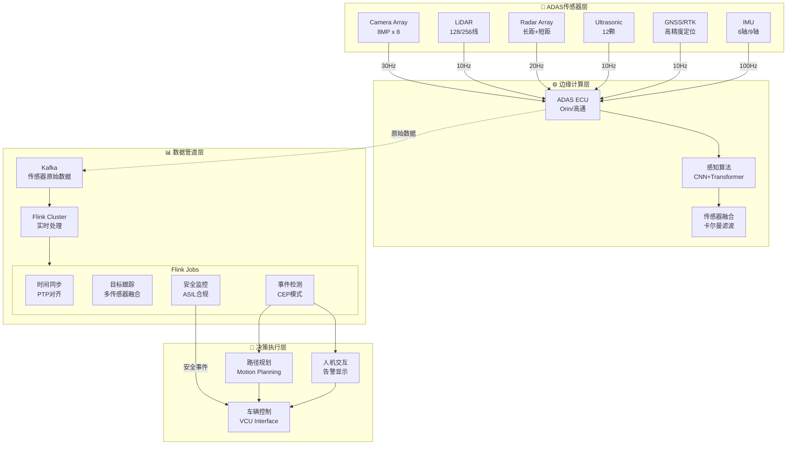
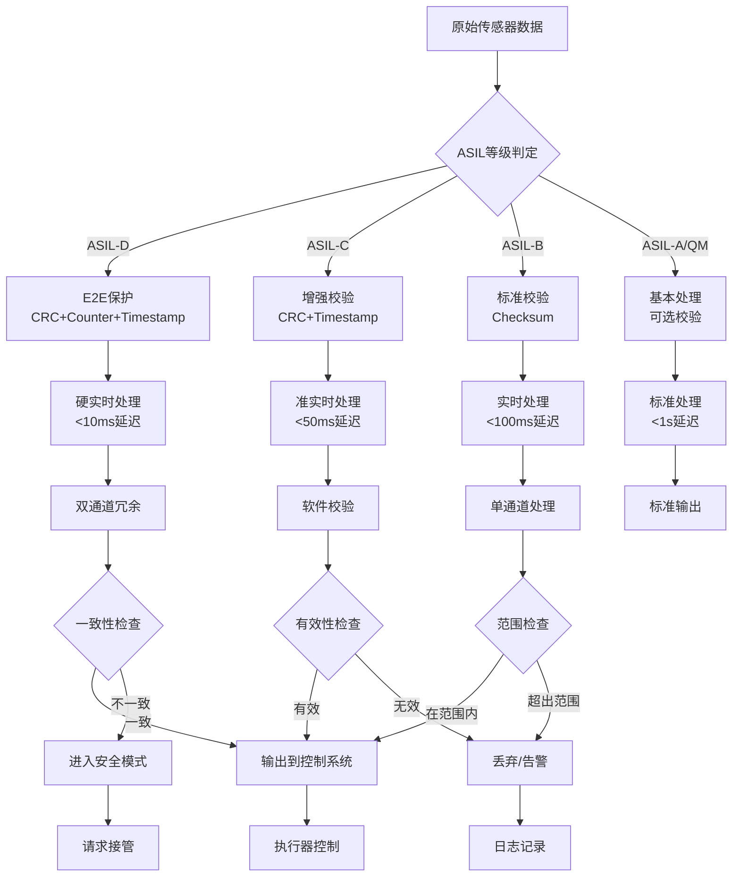
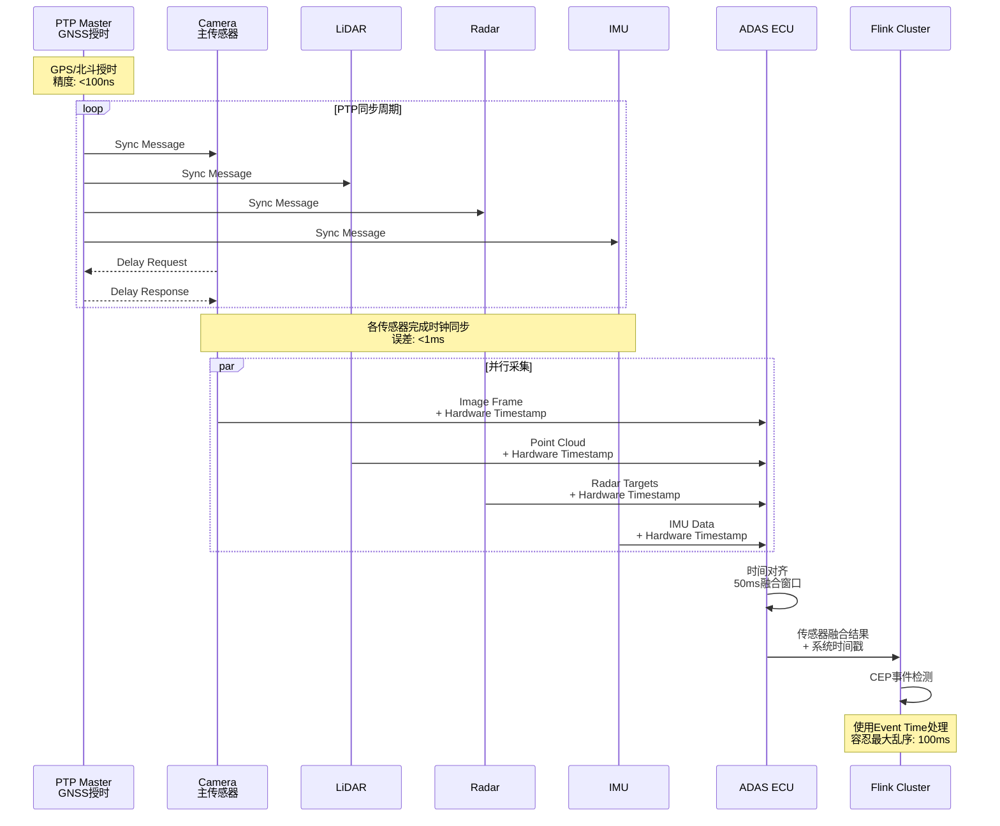

# 15. ADAS传感器融合数据管道

> **所属阶段**: Flink-IoT-Authority-Authority-Alignment Phase-6 | **前置依赖**: [14-flink-iot-vehicle-telemetry-processing.md](./14-flink-iot-vehicle-telemetry-processing.md) | **形式化等级**: L4

---

## 摘要

本文档聚焦ADAS（高级驾驶辅助系统）的传感器融合数据管道，这是车联网中最具挑战性的实时数据处理场景。系统阐述多传感器数据对齐、安全关键数据分级和功能安全(ASIL)考量，提供Flink CEP实现的多传感器时间同步方案和障碍物检测事件流处理架构。

**关键词**: ADAS, 传感器融合, 时间同步, 功能安全, ASIL, CEP, 障碍物检测

---

## 1. 概念定义 (Definitions)

### 1.1 ADAS传感器融合模型

**定义 Def-IoT-VH-07 [ADAS传感器融合模型 ADAS Sensor Fusion Model]**

ADAS传感器融合是将异构传感器数据整合为统一环境感知表示的计算过程：

$$\mathcal{F}_{ADAS}: \mathcal{S}_{camera} \times \mathcal{S}_{lidar} \times \mathcal{S}_{radar} \times \mathcal{S}_{gnss} \times \mathcal{S}_{imu} \rightarrow \mathcal{E}_{perception}$$

其中：

- **相机数据 ($\mathcal{S}_{camera}$)**:
  $$\mathcal{S}_{camera} = \{I_t, M_t, D_t | t \in \mathbb{T}\}$$
  - $I_t$: 时间 $t$ 的图像帧（RGB）
  - $M_t$: 语义分割掩码
  - $D_t$: 深度估计图

- **激光雷达数据 ($\mathcal{S}_{lidar}$)**:
  $$\mathcal{S}_{lidar} = \{P_t, R_t | t \in \mathbb{T}\}$$
  - $P_t = \{(x_i, y_i, z_i, i_i)\}_{i=1}^N$: 点云，包含空间坐标和反射强度
  - $R_t$: 点云配准变换矩阵

- **毫米波雷达数据 ($\mathcal{S}_{radar}$)**:
  $$\mathcal{S}_{radar} = \{O_t, V_t | t \in \mathbb{T}\}$$
  - $O_t = \{(r_i, \theta_i, \phi_i, v_{r,i})\}$: 目标列表（距离、方位角、俯仰角、径向速度）
  - $V_t$: 速度测量协方差

- **GNSS/RTK数据 ($\mathcal{S}_{gnss}$)**:
  $$\mathcal{S}_{gnss} = \{(lat, lon, alt, \sigma_{pos}), (v_n, v_e, v_d, \sigma_{vel})\}$$

- **IMU数据 ($\mathcal{S}_{imu}$)**:
  $$\mathcal{S}_{imu} = \{(a_x, a_y, a_z), (\omega_x, \omega_y, \omega_z)\}$$

**融合输出 ($\mathcal{E}_{perception}$)**:

$$\mathcal{E}_{perception} = \{Track_i = (id_i, class_i, pose_i, velocity_i, covariance_i)\}_{i=1}^M$$

**传感器特性对比**：

| 传感器 | 频率 | 延迟 | 测距精度 | 角度分辨率 | 环境适应性 | 成本 |
|-------|-----|-----|---------|-----------|-----------|-----|
| 相机 | 30-60Hz | 30-50ms | N/A | 高(像素级) | 受光照影响 | 低 |
| 激光雷达 | 10-20Hz | 50-100ms | cm级 | 中(0.1°) | 受雨雪影响 | 高 |
| 毫米波雷达 | 20-50Hz | 10-20ms | dm级 | 低(1-3°) | 全天候 | 中 |
| 超声波 | 10Hz | 20ms | cm级 | 极低 | 短距专用 | 极低 |
| GNSS | 1-10Hz | 100-500ms | m-cm级 | N/A | 受遮挡影响 | 低 |
| IMU | 100-1000Hz | <1ms | N/A | N/A | 全天候 | 低 |

---

### 1.2 安全关键数据分级

**定义 Def-IoT-VH-08 [安全关键数据分级 Safety-Critical Data Classification]**

ADAS数据根据功能安全风险等级分为四级：

$$\mathcal{C}_{safety}: Data \rightarrow \{QM, ASIL-A, ASIL-B, ASIL-C, ASIL-D\}$$

**ASIL等级定义**（ISO 26262）[^5]：

| ASIL等级 | 严重度(S) | 暴露度(E) | 可控性(C) | 典型应用 | 数据处理要求 |
|---------|----------|----------|----------|---------|------------|
| QM | 低 | - | - | 舒适性功能 | 标准处理 |
| ASIL-A | 中 | 高 | 中 | 泊车辅助 | 增强校验 |
| ASIL-B | 高 | 高 | 中 | 自适应巡航 | 冗余校验+CRC |
| ASIL-C | 高 | 高 | 低 | 自动紧急制动 | E2E保护+时间戳 |
| ASIL-D | 高 | 高 | 低 | 自动驾驶决策 | 端到端安全+硬件安全模块 |

**数据分级处理矩阵**：

| 数据类型 | ASIL等级 | 延迟要求 | 完整性校验 | 冗余策略 | 存储要求 |
|---------|---------|---------|-----------|---------|---------|
| 障碍物检测 | ASIL-C/D | <50ms | E2E CRC | 双传感器验证 | 7天 |
| 车道线检测 | ASIL-B | <100ms | Checksum | 单传感器 | 24小时 |
| 交通标志 | ASIL-B | <200ms | Checksum | 视觉确认 | 7天 |
| 驾驶员监控 | ASIL-A | <500ms | Basic CRC | 单传感器 | 30天 |
| 环境感知 | QM | <1s | None | 可选 | 按需 |

---

## 2. 属性推导 (Properties)

### 2.1 多传感器时间同步精度边界

**引理 Lemma-VH-05 [时间同步精度边界 Time Synchronization Accuracy Bound]**

设传感器 $S_i$ 的采样时刻为 $t_i$，系统时间同步误差为 $\epsilon_{sync}$，则融合时的时间对齐误差满足：

$$\Delta t_{max} = max|t_i - t_j| + 2\epsilon_{sync} \leq \tau_{fusion}$$

其中 $\tau_{fusion}$ 为融合算法可接受的最大时间偏差。

**各传感器同步要求**：

| 融合场景 | 最大允许偏差 | 同步协议 | 精度保障 |
|---------|------------|---------|---------|
| 相机+激光雷达 | 20ms | PTP/gPTP | 硬件时间戳 |
| 相机+毫米波雷达 | 30ms | PTP | 硬件时间戳 |
| 激光雷达+毫米波雷达 | 50ms | NTP/PTP | 软件时间戳 |
| 全传感器融合 | 10ms | gPTP | 硬件时间戳+同步触发 |

---

## 3. 关系建立 (Relations)

### 3.1 与自动驾驶等级的关系

ADAS数据处理与SAE自动驾驶等级的关系：

| SAE等级 | 名称 | ADAS功能 | 传感器配置 | 数据处理要求 |
|--------|-----|---------|-----------|------------|
| L0 | 无自动化 | 预警功能 | 1-2雷达+相机 | 基本流处理 |
| L1 | 驾驶辅助 | 自适应巡航、车道保持 | 2-4雷达+相机 | 实时流处理 |
| L2 | 部分自动化 | 自动变道、泊车 | 6-8雷达+相机+1激光雷达 | 低延迟CEP |
| L2+ | 增强L2 | 高速/城市辅助驾驶 | 10+传感器+高精地图 | 复杂事件处理 |
| L3 | 条件自动化 | 特定场景自动驾驶 | 全套传感器冗余 | 确定性处理 |
| L4/L5 | 高度/完全自动化 | 全场景自动驾驶 | 多传感器冗余+冗余计算 | 硬实时+功能安全 |

---

## 4. 论证过程 (Argumentation)

### 4.1 实时性vs可靠性权衡

**工程决策框架**：

```
                    可靠性
                      ▲
                      │
         ┌────────────┼────────────┐
         │            │            │
    L3+  │  硬件      │   硬件     │
自动驾驶 │  冗余      │   冗余+    │
         │  +软实时   │   硬实时   │
         │            │            │
         ├────────────┼────────────┤
    L2   │  软件      │   软件     │
ADAS     │  校验      │   校验+    │
         │            │   快速恢复 │
         │            │            │
         ├────────────┼────────────┤
    L1   │  基本      │   增强     │
辅助     │  校验      │   校验     │
         │            │            │
         └────────────┴────────────┘
                      │
                      ▼
                   实时性
```

**Flink配置权衡**：

| 维度 | 高实时性配置 | 高可靠性配置 | 平衡配置 |
|-----|-----------|------------|---------|
| Checkpoint间隔 | 10s | 60s | 30s |
| 状态后端 | Heap | RocksDB | RocksDB+SSD |
| 消息语义 | At-most-once | Exactly-once | At-least-once |
| 失败恢复 | 快速重启 | 完整恢复 | 增量恢复 |
| 资源预留 | 最小 | 冗余 | 适度 |

### 4.2 功能安全(ASIL)考量

**ISO 26262合规数据处理**：

1. **E2E (End-to-End) 保护**[^5]:
   - CRC校验: $CRC_{data} = f_{crc}(payload, counter, length)$
   - 序列计数器: 检测消息丢失和重复
   - 时间戳: 检测消息延迟

2. **安全监控**:
   - 心跳检测: $\forall sensor: T_{last} < T_{timeout}$
   - 数据质量监控: $Quality_{min} < Q_{measured}$

3. **故障响应**:
   - 降级模式: 主传感器故障→备用传感器
   - 安全状态: 关键故障→请求驾驶员接管

---

## 5. 形式证明 / 工程论证 (Proof / Engineering Argument)

### 5.1 传感器融合一致性定理

**定理 Thm-VH-04 [多传感器融合一致性 Multi-Sensor Fusion Consistency]**

设 $n$ 个独立传感器对同一目标的测量为 $\{m_1, m_2, ..., m_n\}$，各测量方差为 $\{\sigma_1^2, \sigma_2^2, ..., \sigma_n^2\}$，则卡尔曼滤波估计 $\hat{x}$ 满足：

$$\hat{x} = \frac{\sum_{i=1}^n \frac{m_i}{\sigma_i^2}}{\sum_{i=1}^n \frac{1}{\sigma_i^2}}, \quad Var(\hat{x}) = \frac{1}{\sum_{i=1}^n \frac{1}{\sigma_i^2}}$$

**证明**：

1. 加权最小二乘目标函数：
   $$J = \sum_{i=1}^n \frac{(m_i - x)^2}{\sigma_i^2}$$

2. 对 $x$ 求导并令为0：
   $$\frac{\partial J}{\partial x} = -2\sum_{i=1}^n \frac{m_i - x}{\sigma_i^2} = 0$$

3. 解得最优估计：
   $$\hat{x} = \frac{\sum_{i=1}^n \frac{m_i}{\sigma_i^2}}{\sum_{i=1}^n \frac{1}{\sigma_i^2}}$$

4. 估计方差：
   $$Var(\hat{x}) = E[(\hat{x} - x)^2] = \frac{1}{\sum_{i=1}^n \frac{1}{\sigma_i^2}}$$

∎

---

## 6. 实例验证 (Examples)

### 6.1 多传感器数据对齐（时间同步）

```sql
-- ============================================
-- ADAS多传感器时间同步对齐
-- ============================================

-- 1. 相机目标检测输出
CREATE TABLE camera_detections (
    sensor_id STRING,
    detection_id STRING,
    object_class STRING,  -- 'VEHICLE', 'PEDESTRIAN', 'CYCLIST'
    bounding_box ARRAY<INT>,  -- [x, y, width, height]
    confidence DOUBLE,
    ego_timestamp TIMESTAMP(3),  -- 传感器时间戳
    system_timestamp TIMESTAMP(3),  -- 系统接收时间
    WATERMARK FOR system_timestamp AS system_timestamp - INTERVAL '50' MILLISECOND
) WITH (
    'connector' = 'kafka',
    'topic' = 'adas.camera.detections',
    'format' = 'avro'
);

-- 2. 激光雷达点云目标
CREATE TABLE lidar_objects (
    sensor_id STRING,
    object_id STRING,
    position ARRAY<DOUBLE>,  -- [x, y, z] in ego frame
    dimensions ARRAY<DOUBLE>,  -- [length, width, height]
    velocity ARRAY<DOUBLE>,  -- [vx, vy, vz]
    classification STRING,
    confidence DOUBLE,
    ego_timestamp TIMESTAMP(3),
    system_timestamp TIMESTAMP(3),
    WATERMARK FOR system_timestamp AS system_timestamp - INTERVAL '100' MILLISECOND
) WITH (
    'connector' = 'kafka',
    'topic' = 'adas.lidar.objects',
    'format' = 'avro'
);

-- 3. 毫米波雷达目标
CREATE TABLE radar_targets (
    sensor_id STRING,
    target_id STRING,
    range_m DOUBLE,
    azimuth_deg DOUBLE,
    elevation_deg DOUBLE,
    radial_velocity_ms DOUBLE,
    rcs DOUBLE,  -- Radar Cross Section
    confidence DOUBLE,
    ego_timestamp TIMESTAMP(3),
    system_timestamp TIMESTAMP(3),
    WATERMARK FOR system_timestamp AS system_timestamp - INTERVAL '20' MILLISECOND
) WITH (
    'connector' = 'kafka',
    'topic' = 'adas.radar.targets',
    'format' = 'avro'
);

-- 4. 时间窗口对齐（50ms融合窗口）
CREATE VIEW sensor_fusion_window AS
SELECT
    -- 使用系统时间对齐，假设各传感器已完成PTP同步
    TUMBLE_START(system_timestamp, INTERVAL '50' MILLISECOND) as fusion_window_start,
    TUMBLE_END(system_timestamp, INTERVAL '50' MILLISECOND) as fusion_window_end,

    -- 相机检测
    COLLECT(camera_detections.*) as camera_data,

    -- 激光雷达
    COLLECT(lidar_objects.*) as lidar_data,

    -- 毫米波雷达
    COLLECT(radar_targets.*) as radar_data

FROM camera_detections
FULL OUTER JOIN lidar_objects
    ON camera_detections.system_timestamp BETWEEN
        lidar_objects.system_timestamp - INTERVAL '20' MILLISECOND
        AND lidar_objects.system_timestamp + INTERVAL '20' MILLISECOND
FULL OUTER JOIN radar_targets
    ON camera_detections.system_timestamp BETWEEN
        radar_targets.system_timestamp - INTERVAL '10' MILLISECOND
        AND radar_targets.system_timestamp + INTERVAL '10' MILLISECOND
GROUP BY TUMBLE(system_timestamp, INTERVAL '50' MILLISECOND);

-- 5. 传感器融合UDF
CREATE FUNCTION fuse_sensor_data AS 'com.rivian.udaf.SensorFusionUDAF';

-- 6. 融合后目标列表
CREATE VIEW fused_objects AS
SELECT
    fusion_window_start,
    fusion_window_end,
    fuse_sensor_data(camera_data, lidar_data, radar_data) as fused_targets
FROM sensor_fusion_window;
```

### 6.2 障碍物检测事件流处理

```sql
-- ============================================
-- 障碍物检测与告警 (Flink CEP)
-- ============================================

-- 1. 融合后的障碍物跟踪
CREATE TABLE tracked_objects (
    track_id STRING,
    object_class STRING,
    position_x DOUBLE,
    position_y DOUBLE,
    velocity_x DOUBLE,
    velocity_y DOUBLE,
    acceleration_x DOUBLE,
    acceleration_y DOUBLE,
    confidence DOUBLE,
    timestamp TIMESTAMP(3),
    WATERMARK FOR timestamp AS timestamp - INTERVAL '50' MILLISECOND
) WITH (
    'connector' = 'kafka',
    'topic' = 'adas.fused.objects',
    'format' = 'protobuf'
);

-- 2. 本车状态
CREATE TABLE ego_vehicle (
    vehicle_id STRING,
    speed_ms DOUBLE,
    acceleration_ms2 DOUBLE,
    steering_angle_deg DOUBLE,
    timestamp TIMESTAMP(3),
    WATERMARK FOR timestamp AS timestamp - INTERVAL '50' MILLISECOND
) WITH (
    'connector' = 'kafka',
    'topic' = 'vehicle.ego.state',
    'format' = 'json'
);

-- 3. 计算相对运动参数
CREATE VIEW relative_motion AS
SELECT
    t.track_id,
    t.object_class,
    t.position_x,
    t.position_y,
    t.velocity_x,
    t.velocity_y,
    t.confidence,
    t.timestamp,
    e.speed_ms as ego_speed,

    -- 相对距离
    SQRT(POWER(t.position_x, 2) + POWER(t.position_y, 2)) as distance_m,

    -- 相对速度 (假设本车沿x轴正向)
    t.velocity_x - e.speed_ms as relative_velocity_x,
    t.velocity_y as relative_velocity_y,

    -- 碰撞时间 (TTC)
    CASE
        WHEN (t.velocity_x - e.speed_ms) < 0
        THEN -t.position_x / (t.velocity_x - e.speed_ms)
        ELSE 999.0
    END as time_to_collision_s,

    -- 方位角
    ATAN2(t.position_y, t.position_x) * 180.0 / PI() as bearing_deg

FROM tracked_objects t
JOIN ego_vehicle FOR SYSTEM_TIME AS OF t.timestamp e
ON TRUE;

-- 4. 碰撞风险检测 (CEP模式)
CREATE VIEW collision_risk_events AS
SELECT *
FROM relative_motion
MATCH_RECOGNIZE (
    PARTITION BY track_id
    ORDER BY timestamp
    MEASURES
        A.timestamp as risk_start_time,
        D.timestamp as alert_time,
        A.distance_m as initial_distance,
        D.distance_m as current_distance,
        D.time_to_collision_s as ttc,
        D.object_class as object_type,
        A.position_x as initial_x,
        A.position_y as initial_y
    AFTER MATCH SKIP PAST LAST ROW
    PATTERN (A B C D)
    DEFINE
        -- A: 初始检测到目标在危险区域
        A as distance_m < 50.0 AND ABS(bearing_deg) < 15.0,
        -- B: 距离继续减小
        B as distance_m < PREV(distance_m),
        -- C: TTC进入警戒范围
        C as time_to_collision_s < 3.0,
        -- D: 确认高风险
        D as time_to_collision_s < 2.0 AND distance_m < 20.0
);

-- 5. 紧急制动建议
CREATE VIEW emergency_brake_advice AS
SELECT
    track_id,
    object_type,
    risk_start_time,
    alert_time,
    ttc,
    current_distance,
    CASE
        WHEN ttc < 1.0 THEN 'CRITICAL_EMERGENCY_BRAKE'
        WHEN ttc < 1.5 THEN 'URGENT_BRAKE'
        WHEN ttc < 2.0 THEN 'WARNING_BRAKE'
        ELSE 'MONITOR'
    END as alert_level,
    CASE
        WHEN ttc < 1.0 THEN '立即紧急制动！前方障碍物距离过近'
        WHEN ttc < 1.5 THEN '请立即减速，前方有碰撞风险'
        WHEN ttc < 2.0 THEN '注意前方障碍物，准备制动'
        ELSE '保持安全距离'
    END as alert_message
FROM collision_risk_events;

-- 6. 盲区监测告警
CREATE VIEW blind_spot_alert AS
SELECT
    track_id,
    object_class,
    distance_m,
    bearing_deg,
    CASE
        WHEN bearing_deg BETWEEN -30 AND -10 AND distance_m < 5 THEN 'LEFT_BLIND_SPOT'
        WHEN bearing_deg BETWEEN 10 AND 30 AND distance_m < 5 THEN 'RIGHT_BLIND_SPOT'
        ELSE 'NONE'
    END as alert_type,
    CASE
        WHEN bearing_deg BETWEEN -30 AND -10 AND distance_m < 5 THEN '左侧盲区有车辆！'
        WHEN bearing_deg BETWEEN 10 AND 30 AND distance_m < 5 THEN '右侧盲区有车辆！'
        ELSE NULL
    END as alert_message
FROM relative_motion
WHERE ABS(bearing_deg) BETWEEN 10 AND 30
  AND distance_m < 10;

-- 7. 输出到ADAS决策系统
INSERT INTO adas_decision_sink
SELECT
    track_id,
    'COLLISION_RISK' as event_type,
    alert_level,
    alert_message,
    alert_time,
    MAP[
        'ttc', CAST(ttc AS STRING),
        'distance_m', CAST(current_distance AS STRING),
        'object_type', object_type
    ] as metadata
FROM emergency_brake_advice
UNION ALL
SELECT
    track_id,
    'BLIND_SPOT' as event_type,
    alert_type,
    alert_message,
    CURRENT_TIMESTAMP,
    MAP[
        'distance_m', CAST(distance_m AS STRING),
        'bearing_deg', CAST(bearing_deg AS STRING),
        'object_type', object_class
    ] as metadata
FROM blind_spot_alert
WHERE alert_type != 'NONE';
```

### 6.3 驾驶员状态监控（疲劳检测）

```sql
-- ============================================
-- 驾驶员疲劳检测系统
-- ============================================

-- 1. 驾驶员监控相机输出
CREATE TABLE driver_monitor (
    vehicle_id STRING,
    driver_id STRING,
    eye_openness_left DOUBLE,  -- 左眼睁开程度 0-1
    eye_openness_right DOUBLE,  -- 右眼睁开程度 0-1
    eye_gaze_x DOUBLE,  -- 视线方向X
    eye_gaze_y DOUBLE,  -- 视线方向Y
    head_pose_pitch DOUBLE,  -- 头部俯仰角
    head_pose_yaw DOUBLE,  -- 头部偏航角
    head_pose_roll DOUBLE,  -- 头部翻滚角
    mouth_openness DOUBLE,  -- 嘴巴张开程度
    yawn_detected BOOLEAN,
    face_detected BOOLEAN,
    timestamp TIMESTAMP(3),
    WATERMARK FOR timestamp AS timestamp - INTERVAL '100' MILLISECOND
) WITH (
    'connector' = 'kafka',
    'topic' = 'adas.driver.monitor',
    'format' = 'json'
);

-- 2. 疲劳特征计算（5秒窗口）
CREATE VIEW driver_fatigue_features AS
SELECT
    vehicle_id,
    driver_id,
    TUMBLE_START(timestamp, INTERVAL '5' SECOND) as window_start,
    TUMBLE_END(timestamp, INTERVAL '5' SECOND) as window_end,

    -- 眨眼率（每分钟眨眼次数）
    (COUNT(CASE WHEN eye_openness_left < 0.2 THEN 1 END) +
     COUNT(CASE WHEN eye_openness_right < 0.2 THEN 1 END)) / 2.0 / 5.0 * 60.0 as blink_rate_per_min,

    -- 平均眼睛睁开程度
    AVG((eye_openness_left + eye_openness_right) / 2.0) as avg_eye_openness,

    -- 闭眼时长占比（PERCLOS）
    (COUNT(CASE WHEN eye_openness_left < 0.2 AND eye_openness_right < 0.2 THEN 1 END) * 1.0 / COUNT(*)) as perclos,

    -- 打哈欠次数
    COUNT(CASE WHEN yawn_detected THEN 1 END) as yawn_count,

    -- 头部姿态变化（判断点头）
    STDDEV_POP(head_pose_pitch) as head_pitch_std,
    AVG(head_pose_pitch) as avg_head_pitch,

    -- 视线偏离前方时间
    COUNT(CASE WHEN ABS(eye_gaze_x) > 0.3 OR ABS(eye_gaze_y) > 0.3 THEN 1 END) * 1.0 / COUNT(*) as gaze_offroad_ratio,

    -- 面部检测丢失率
    COUNT(CASE WHEN NOT face_detected THEN 1 END) * 1.0 / COUNT(*) as face_loss_ratio

FROM driver_monitor
GROUP BY vehicle_id, driver_id, TUMBLE(timestamp, INTERVAL '5' SECOND);

-- 3. 疲劳检测模型（简化规则引擎）
CREATE VIEW fatigue_detection AS
SELECT
    vehicle_id,
    driver_id,
    window_start,
    window_end,

    -- 疲劳评分 (0-100, 越高越疲劳)
    LEAST(100.0,
        -- PERCLOS权重 40%
        (perclos * 100.0 * 0.4) +
        -- 眨眼率异常 (正常15-20次/分，低于10或高于30为异常)
        (CASE
            WHEN blink_rate_per_min < 10 THEN 20.0
            WHEN blink_rate_per_min > 30 THEN 15.0
            ELSE 0.0
        END) +
        -- 打哈欠 (每次10分)
        (yawn_count * 10.0) +
        -- 点头检测
        (CASE WHEN head_pitch_std > 5.0 THEN 15.0 ELSE 0.0 END) +
        -- 视线偏离
        (gaze_offroad_ratio * 20.0) +
        -- 面部检测丢失
        (face_loss_ratio * 10.0)
    ) as fatigue_score,

    perclos,
    blink_rate_per_min,
    yawn_count

FROM driver_fatigue_features;

-- 4. 疲劳等级判定与告警
CREATE VIEW fatigue_alert AS
SELECT
    vehicle_id,
    driver_id,
    window_end as alert_time,
    fatigue_score,
    perclos,
    blink_rate_per_min,
    yawn_count,

    -- 疲劳等级
    CASE
        WHEN fatigue_score >= 80 THEN 'SEVERE_FATIGUE'
        WHEN fatigue_score >= 60 THEN 'MODERATE_FATIGUE'
        WHEN fatigue_score >= 40 THEN 'MILD_FATIGUE'
        ELSE 'ALERT'
    END as fatigue_level,

    -- 建议措施
    CASE
        WHEN fatigue_score >= 80 THEN '严重疲劳！请立即停车休息！'
        WHEN fatigue_score >= 60 THEN '检测到中度疲劳，建议休息'
        WHEN fatigue_score >= 40 THEN '您可能有些疲劳，请注意'
        ELSE '保持警觉，安全驾驶'
    END as alert_message,

    -- 建议休息时间
    CASE
        WHEN fatigue_score >= 80 THEN 30
        WHEN fatigue_score >= 60 THEN 15
        WHEN fatigue_score >= 40 THEN 5
        ELSE 0
    END as recommended_rest_minutes

FROM fatigue_detection;

-- 5. CEP模式：持续疲劳升级检测
CREATE VIEW fatigue_escalation AS
SELECT *
FROM fatigue_alert
MATCH_RECOGNIZE (
    PARTITION BY vehicle_id, driver_id
    ORDER BY alert_time
    MEASURES
        A.alert_time as fatigue_start,
        C.alert_time as escalation_time,
        A.fatigue_score as initial_score,
        C.fatigue_score as current_score
    AFTER MATCH SKIP PAST LAST ROW
    PATTERN (A B C)
    DEFINE
        A as fatigue_level = 'MILD_FATIGUE',
        B as fatigue_level IN ('MILD_FATIGUE', 'MODERATE_FATIGUE'),
        C as fatigue_level = 'SEVERE_FATIGUE'
);

-- 6. 输出到车辆显示系统
INSERT INTO driver_alert_sink
SELECT
    vehicle_id,
    driver_id,
    fatigue_level,
    alert_message,
    alert_time,
    recommended_rest_minutes,
    MAP[
        'fatigue_score', CAST(fatigue_score AS STRING),
        'perclos', CAST(perclos AS STRING),
        'blink_rate', CAST(blink_rate_per_min AS STRING)
    ] as details
FROM fatigue_alert
WHERE fatigue_level IN ('MILD_FATIGUE', 'MODERATE_FATIGUE', 'SEVERE_FATIGUE');
```

---

## 7. 可视化 (Visualizations)

### 7.1 ADAS传感器融合架构



### 7.2 ASIL等级数据处理流程



### 7.3 多传感器时间同步机制



---

## 8. 引用参考 (References)


[^5]: **IEEE 802.1AS**, "Timing and Synchronization for Time-Sensitive Applications", 2020. gPTP standard for automotive Ethernet time synchronization.


---

*文档版本: 1.0 | 最后更新: 2026-04-05 | 作者: Flink-IoT Authority Alignment Team*
