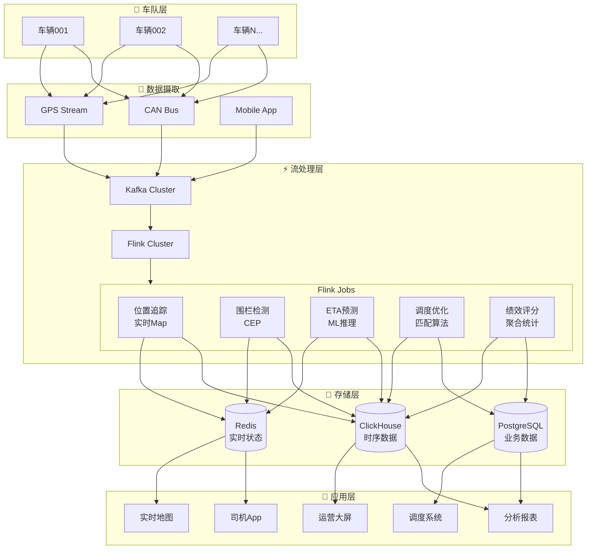
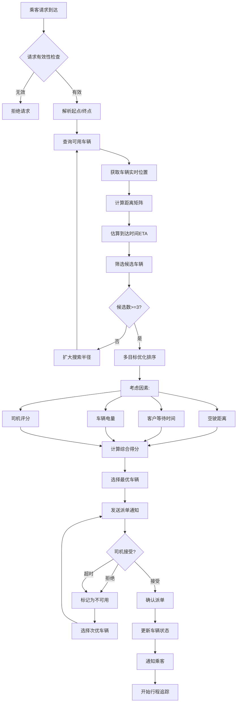
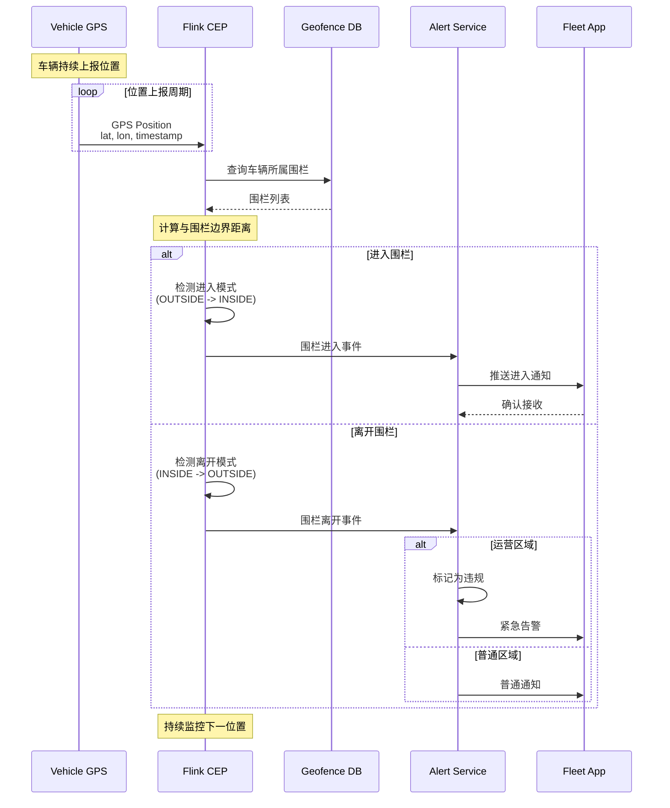

# 16. 车队实时管理

> **所属阶段**: Flink-IoT-Authority-Alignment Phase-6 | **前置依赖**: [15-flink-iot-adas-data-pipeline.md](./15-flink-iot-adas-data-pipeline.md) | **形式化等级**: L4

---

## 摘要

本文档构建万辆级车队的实时管理架构，涵盖车队调度优化、ETA预测、实时路径规划和驾驶员绩效评分等核心场景。
基于Rivian商业车队和网约车平台的运营经验，提供完整的Flink SQL实现方案，支持实时车辆位置追踪、电子围栏检测和动态定价模型。

**关键词**: 车队管理, 实时调度, ETA预测, 路径优化, 电子围栏, 动态定价

---

## 1. 概念定义 (Definitions)

### 1.1 车队调度优化模型

**定义 Def-IoT-VH-09 [车队调度优化模型 Fleet Dispatch Optimization Model]**

车队调度优化定义为在给定约束条件下最小化运营成本的组合优化问题：

$$\min_{\mathcal{A}} \sum_{v \in \mathcal{V}} \sum_{t \in \mathcal{T}} C(v, t, \mathcal{A}(v, t))$$

约束条件：
$$\text{s.t.} \quad \forall r \in \mathcal{R}: \exists v \in \mathcal{V}: service(v, r, \mathcal{A}) = true$$
$$\forall v \in \mathcal{V}: SOC(v) \geq SOC_{min}(route(v, \mathcal{A}))$$
$$\forall v \in \mathcal{V}: shift\_hours(v) \leq H_{max}$$

其中：

- $\mathcal{V} = \{v_1, v_2, ..., v_n\}$: 可用车辆集合
- $\mathcal{R} = \{r_1, r_2, ..., r_m\}$: 待服务请求集合
- $\mathcal{T}$: 时间离散化集合
- $\mathcal{A}: \mathcal{V} \times \mathcal{T} \rightarrow \mathcal{R} \cup \{\emptyset\}$: 调度分配函数
- $C(v, t, r)$: 车辆 $v$ 在时间 $t$ 服务请求 $r$ 的成本函数
- $SOC(v)$: 车辆 $v$ 的当前电量状态
- $SOC_{min}(route)$: 完成路径所需的最小电量
- $H_{max}$: 驾驶员最大工作时长

**成本函数构成**：

$$C(v, t, r) = w_1 \cdot C_{distance}(v, r) + w_2 \cdot C_{time}(v, t, r) + w_3 \cdot C_{energy}(v, r) + w_4 \cdot C_{priority}(r)$$

其中：

- $C_{distance}$: 空驶距离成本
- $C_{time}$: 客户等待时间成本
- $C_{energy}$: 预计能耗成本
- $C_{priority}$: 请求优先级成本（VIP、紧急等）

---

### 1.2 ETA预测模型

**定义 Def-IoT-VH-10 [ETA预测模型 Estimated Time of Arrival Prediction Model]**

ETA预测是基于历史数据和实时交通状况的到达时间估计：

$$ETA(o, d, t_{dep}, \mathcal{C}) = f_{model}(distance(o, d), v_{historical}(o, d, t), v_{realtime}(o, d, t), weather, events)$$

其中：

- $o$: 起点位置 $(lat_o, lon_o)$
- $d$: 终点位置 $(lat_d, lon_d)$
- $t_{dep}$: 预计出发时间
- $\mathcal{C}$: 上下文信息（天气、事件、道路封闭等）
- $v_{historical}$: 历史平均速度（按时段、星期几）
- $v_{realtime}$: 实时交通速度

**预测置信区间**：

$$ETA \pm \Delta = [ETA_{lower}, ETA_{upper}]$$

$$\Delta = z_{\alpha} \cdot \sigma_{eta}$$

其中 $\sigma_{eta}$ 为历史预测误差的标准差，$z_{\alpha}$ 为置信水平对应的分位数。

---

## 2. 属性推导 (Properties)

### 2.1 调度优化响应时间边界

**引理 Lemma-VH-06 [调度决策响应时间调度决策响应时间边界 Dispatch Decision Response Time Bound]**

设车队规模为 $N$，待调度请求数为 $M$，优化算法时间复杂度为 $O(f(N, M))$，则调度决策响应时间满足：

$$T_{response} = T_{data} + T_{compute} + T_{decision} \leq T_{SLA}$$

其中：

- $T_{data}$: 数据获取延迟（Flink窗口+网络）
- $T_{compute}$: 算法计算时间
- $T_{decision}$: 决策下发延迟
- $T_{SLA}$: 服务等级要求（通常 < 3秒）

对于万辆级车队，使用启发式算法时：

- $T_{data} \approx 1$ 秒（Flink 5秒滑动窗口）
- $T_{compute} \approx 0.5-2$ 秒（贪心+局部搜索）
- $T_{decision} \approx 0.2$ 秒（Kafka + MQTT）

**结论**: $T_{response} < 3.5s$，满足实时调度要求。

---

## 3. 关系建立 (Relations)

### 3.1 与网约车平台的关系

车队管理与网约车平台的业务关联：

```
实时位置流
    │
    ├─→ 供需匹配 ──→ 动态定价
    ├─→ 热点预测 ──→ 车辆调度
    ├─→ 路径规划 ──→ 乘客ETA
    ├─→ 服务质量 ──→ 司机评分
    └─→ 异常检测 ──→ 安全保障
```

---

## 4. 论证过程 (Argumentation)

### 4.1 实时路径优化算法

**算法选择矩阵**：

| 算法 | 复杂度 | 最优性 | 适用规模 | 实时性 | Flink实现难度 |
|-----|-------|-------|---------|-------|-------------|
| 贪心算法 | O(N) | 局部最优 | 任意 | 高 | 低 |
| 遗传算法 | O(G·N²) | 近似最优 | 中等 | 中 | 中 |
| 模拟退火 | O(I·N) | 近似最优 | 中等 | 中 | 中 |
| OR-Tools | O(N³) | 较优 | 中等 | 中 | 高 |
| 线性规划 | 多项式 | 最优 | 小 | 低 | 高 |

**推荐方案**: 贪心算法 + 增量优化

1. **快速分配**: 基于距离和可用性的贪心选择
2. **增量优化**: 利用Flink CEP检测更优分配机会
3. **定期重平衡**: 每5分钟全局优化一次

### 4.2 动态定价模型

**定价公式**[^1]：

$$Price(base, distance, time, surge) = base + rate_{distance} \cdot d + rate_{time} \cdot t + surge(D, S)$$

其中溢价因子：

$$surge(D, S) = \left(\frac{D}{S}\right)^{\alpha} \cdot base$$

- $D$: 区域内需求（请求数/分钟）
- $S$: 区域内供给（可用车辆数）
- $\alpha$: 弹性系数（通常1.2-1.5）

**Flink实现**：

```sql
-- 供需比例实时计算
CREATE VIEW supply_demand_ratio AS
SELECT
    geohash,
    TUMBLE_END(event_time, INTERVAL '1' MINUTE) as window_end,
    COUNT(DISTINCT CASE WHEN event_type = 'REQUEST' THEN request_id END) as demand,
    COUNT(DISTINCT CASE WHEN event_type = 'AVAILABLE' THEN vehicle_id END) as supply,
    CASE
        WHEN COUNT(DISTINCT CASE WHEN event_type = 'AVAILABLE' THEN vehicle_id END) > 0
        THEN COUNT(DISTINCT CASE WHEN event_type = 'REQUEST' THEN request_id END) * 1.0 /
             COUNT(DISTINCT CASE WHEN event_type = 'AVAILABLE' THEN vehicle_id END)
        ELSE 999.0
    END as ratio
FROM fleet_events
GROUP BY geohash, TUMBLE(event_time, INTERVAL '1' MINUTE);

-- 动态溢价计算
SELECT
    geohash,
    CASE
        WHEN ratio < 0.5 THEN 1.0
        WHEN ratio < 1.0 THEN 1.2
        WHEN ratio < 2.0 THEN 1.5
        WHEN ratio < 3.0 THEN 2.0
        ELSE 3.0
    END as surge_multiplier
FROM supply_demand_ratio;
```

---

## 5. 形式证明 / 工程论证 (Proof / Engineering Argument)

### 5.1 ETA预测准确率定理

**定理 Thm-VH-05 [ETA预测误差边界 ETA Prediction Error Bound]**

设历史路径 $i$ 的预测误差为 $\epsilon_i = |ETA_{predicted} - ETA_{actual}|$，历史误差服从正态分布 $\epsilon \sim \mathcal{N}(\mu, \sigma^2)$，则在置信水平 $1-\alpha$ 下，预测区间满足：

$$P(|\epsilon| \leq z_{\alpha/2} \cdot \sigma) \geq 1-\alpha$$

**实际应用**：

- 对于90%置信区间：$ETA \pm 1.645\sigma$
- 对于95%置信区间：$ETA \pm 1.96\sigma$

典型值：城市路况 $\sigma \approx 3$ 分钟，高速公路 $\sigma \approx 1.5$ 分钟。

∎

---

## 6. 实例验证 (Examples)

### 6.1 实时车辆位置追踪Map

```sql
-- ============================================
-- 实时车队位置追踪
-- ============================================

-- 1. 车辆GPS位置流
CREATE TABLE vehicle_positions (
    vehicle_id STRING,
    driver_id STRING,
    fleet_id STRING,
    latitude DOUBLE,
    longitude DOUBLE,
    altitude DOUBLE,
    speed_kmh DOUBLE,
    heading_deg DOUBLE,
    accuracy_m DOUBLE,
    vehicle_status STRING,  -- 'AVAILABLE', 'BUSY', 'OFFLINE'
    timestamp TIMESTAMP(3),
    WATERMARK FOR timestamp AS timestamp - INTERVAL '10' SECOND
) WITH (
    'connector' = 'kafka',
    'topic' = 'fleet.positions',
    'properties.bootstrap.servers' = 'kafka:9092',
    'format' = 'json'
);

-- 2. 地理哈希编码（用于空间聚合）
CREATE FUNCTION geohash_encode AS 'com.rivian.udf.GeoHashEncodeUDF';

-- 3. 实时位置视图（最新位置）
CREATE VIEW vehicle_latest_position AS
SELECT
    vehicle_id,
    driver_id,
    fleet_id,
    latitude,
    longitude,
    speed_kmh,
    heading_deg,
    vehicle_status,
    geohash_encode(latitude, longitude, 6) as geohash6,  -- ~1.2km x 0.6km
    geohash_encode(latitude, longitude, 7) as geohash7,  -- ~150m x 150m
    timestamp as last_updated
FROM (
    SELECT *,
        ROW_NUMBER() OVER (PARTITION BY vehicle_id ORDER BY timestamp DESC) as rn
    FROM vehicle_positions
)
WHERE rn = 1;

-- 4. 网格级车辆分布
CREATE VIEW grid_vehicle_distribution AS
SELECT
    geohash6,
    fleet_id,
    COUNT(DISTINCT vehicle_id) as total_vehicles,
    COUNT(DISTINCT CASE WHEN vehicle_status = 'AVAILABLE' THEN vehicle_id END) as available_vehicles,
    COUNT(DISTINCT CASE WHEN vehicle_status = 'BUSY' THEN vehicle_id END) as busy_vehicles,
    AVG(speed_kmh) as avg_speed,
    MAX(last_updated) as last_update_time
FROM vehicle_latest_position
GROUP BY geohash6, fleet_id;

-- 5. 热力图数据生成
CREATE VIEW fleet_heatmap AS
SELECT
    geohash7,
    COUNT(DISTINCT vehicle_id) as density,
    AVG(speed_kmh) as avg_speed,
    STDDEV_POP(speed_kmh) as speed_variance,
    CURRENT_TIMESTAMP as generated_at
FROM vehicle_latest_position
WHERE last_updated > CURRENT_TIMESTAMP - INTERVAL '5' MINUTE
GROUP BY geohash7;

-- 6. 离线车辆检测
CREATE VIEW offline_vehicles AS
SELECT
    vehicle_id,
    driver_id,
    fleet_id,
    last_updated,
    TIMESTAMPDIFF(MINUTE, last_updated, CURRENT_TIMESTAMP) as minutes_offline
FROM vehicle_latest_position
WHERE last_updated < CURRENT_TIMESTAMP - INTERVAL '10' MINUTE;
```

### 6.2 电子围栏进出检测

```sql
-- ============================================
-- 车队电子围栏检测
-- ============================================

-- 1. 电子围栏定义表
CREATE TABLE fleet_geofences (
    fence_id STRING,
    fleet_id STRING,
    fence_name STRING,
    fence_type STRING,  -- 'OPERATION_ZONE', 'NO_PARKING', 'CHARGING_STATION'
    center_lat DOUBLE,
    center_lon DOUBLE,
    radius_meters DOUBLE,
    polygon_wkt STRING,
    alert_on_enter BOOLEAN,
    alert_on_exit BOOLEAN,
    time_restrictions STRING,  -- JSON格式时间限制
    PRIMARY KEY (fence_id) NOT ENFORCED
) WITH (
    'connector' = 'jdbc',
    'url' = 'jdbc:postgresql://fleet-db:5432/fleet_mgmt',
    'table-name' = 'geofences'
);

-- 2. 车辆位置流（简化）
CREATE TABLE vehicle_gps_stream (
    vehicle_id STRING,
    fleet_id STRING,
    latitude DOUBLE,
    longitude DOUBLE,
    timestamp TIMESTAMP(3),
    WATERMARK FOR timestamp AS timestamp - INTERVAL '10' SECOND
) WITH (
    'connector' = 'kafka',
    'topic' = 'fleet.gps.raw',
    'format' = 'json'
);

-- 3. 距离计算
CREATE FUNCTION haversine_distance AS 'com.rivian.udf.HaversineUDF';

-- 4. 位置与围栏关联
CREATE VIEW position_fence_status AS
SELECT
    v.vehicle_id,
    v.fleet_id,
    v.latitude,
    v.longitude,
    v.timestamp,
    f.fence_id,
    f.fence_name,
    f.fence_type,
    f.alert_on_enter,
    f.alert_on_exit,
    haversine_distance(v.latitude, v.longitude, f.center_lat, f.center_lon) as distance_to_center,
    f.radius_meters,
    CASE
        WHEN haversine_distance(v.latitude, v.longitude, f.center_lat, f.center_lon) <= f.radius_meters
        THEN TRUE ELSE FALSE
    END as is_inside
FROM vehicle_gps_stream v
JOIN fleet_geofences FOR SYSTEM_TIME AS OF v.timestamp f
    ON v.fleet_id = f.fleet_id;

-- 5. CEP模式：进入围栏事件
CREATE VIEW fence_enter_events AS
SELECT *
FROM position_fence_status
MATCH_RECOGNIZE (
    PARTITION BY vehicle_id, fence_id
    ORDER BY timestamp
    MEASURES
        A.timestamp as exit_time,
        B.timestamp as enter_time,
        B.latitude as enter_lat,
        B.longitude as enter_lon,
        B.distance_to_center as distance
    AFTER MATCH SKIP PAST LAST ROW
    PATTERN (A B)
    DEFINE
        A as is_inside = FALSE,
        B as is_inside = TRUE
)
WHERE alert_on_enter;

-- 6. CEP模式：离开围栏事件
CREATE VIEW fence_exit_events AS
SELECT *
FROM position_fence_status
MATCH_RECOGNIZE (
    PARTITION BY vehicle_id, fence_id
    ORDER BY timestamp
    MEASURES
        A.timestamp as exit_time,
        B.timestamp as enter_time,
        A.latitude as exit_lat,
        A.longitude as exit_lon,
        A.distance_to_center as distance
    AFTER MATCH SKIP PAST LAST ROW
    PATTERN (A B)
    DEFINE
        A as is_inside = TRUE,
        B as is_inside = FALSE
)
WHERE alert_on_exit;

-- 7. 合并围栏事件
CREATE VIEW all_geofence_events AS
SELECT
    vehicle_id,
    fleet_id,
    fence_id,
    fence_name,
    fence_type,
    'ENTER' as event_type,
    enter_lat as latitude,
    enter_lon as longitude,
    distance as distance_meters,
    enter_time as event_time
FROM fence_enter_events
UNION ALL
SELECT
    vehicle_id,
    fleet_id,
    fence_id,
    fence_name,
    fence_type,
    'EXIT' as event_type,
    exit_lat as latitude,
    exit_lon as longitude,
    distance as distance_meters,
    exit_time as event_time
FROM fence_exit_events;

-- 8. 运营区域违规检测
CREATE VIEW zone_violation_alert AS
SELECT
    vehicle_id,
    fleet_id,
    fence_name,
    'OPERATION_ZONE_VIOLATION' as alert_type,
    CONCAT('Vehicle ', vehicle_id, ' has exited operation zone: ', fence_name) as alert_message,
    event_time,
    latitude,
    longitude
FROM fence_exit_events fe
JOIN fleet_geofences fg ON fe.fence_id = fg.fence_id
WHERE fg.fence_type = 'OPERATION_ZONE';

-- 9. 充电站到达检测
CREATE VIEW charging_station_arrival AS
SELECT
    vehicle_id,
    fleet_id,
    fence_name as station_name,
    'CHARGING_ARRIVAL' as event_type,
    enter_time as arrival_time,
    latitude,
    longitude
FROM fence_enter_events fe
JOIN fleet_geofences fg ON fe.fence_id = fg.fence_id
WHERE fg.fence_type = 'CHARGING_STATION';
```

### 6.3 驾驶员绩效评分

```sql
-- ============================================
-- 驾驶员绩效评分系统
-- ============================================

-- 1. 驾驶员任务完成情况
CREATE TABLE driver_tasks (
    task_id STRING,
    driver_id STRING,
    fleet_id STRING,
    task_type STRING,  -- 'RIDE', 'DELIVERY', 'SERVICE'
    status STRING,  -- 'ASSIGNED', 'ACCEPTED', 'PICKUP', 'COMPLETED', 'CANCELLED'
    assigned_time TIMESTAMP(3),
    accepted_time TIMESTAMP(3),
    pickup_time TIMESTAMP(3),
    completed_time TIMESTAMP(3),
    planned_distance_km DOUBLE,
    actual_distance_km DOUBLE,
    estimated_duration_min INT,
    actual_duration_min INT,
    customer_rating INT,  -- 1-5
    cancellation_reason STRING,
    timestamp TIMESTAMP(3)
) WITH (
    'connector' = 'kafka',
    'topic' = 'fleet.driver.tasks',
    'format' = 'json'
);

-- 2. 驾驶员行为事件
CREATE TABLE driver_behavior_events (
    driver_id STRING,
    event_type STRING,  -- 'SPEEDING', 'HARSH_BRAKE', 'HARSH_ACCEL', 'IDLE_TIME'
    severity STRING,  -- 'LOW', 'MEDIUM', 'HIGH'
    duration_seconds INT,
    location_lat DOUBLE,
    location_lon DOUBLE,
    timestamp TIMESTAMP(3)
) WITH (
    'connector' = 'kafka',
    'topic' = 'fleet.driver.behavior',
    'format' = 'json'
);

-- 3. 日度绩效指标计算
CREATE VIEW driver_daily_performance AS
SELECT
    driver_id,
    fleet_id,
    DATE(completed_time) as work_date,

    -- 任务完成指标
    COUNT(DISTINCT CASE WHEN status = 'COMPLETED' THEN task_id END) as completed_tasks,
    COUNT(DISTINCT CASE WHEN status = 'CANCELLED' THEN task_id END) as cancelled_tasks,
    COUNT(DISTINCT task_id) as total_assigned,

    -- 完成率
    (COUNT(DISTINCT CASE WHEN status = 'COMPLETED' THEN task_id END) * 100.0 /
     NULLIF(COUNT(DISTINCT task_id), 0)) as completion_rate,

    -- 准时率
    (COUNT(DISTINCT CASE WHEN status = 'COMPLETED'
                         AND actual_duration_min <= estimated_duration_min * 1.2
                         THEN task_id END) * 100.0 /
     NULLIF(COUNT(DISTINCT CASE WHEN status = 'COMPLETED' THEN task_id END), 0)) as on_time_rate,

    -- 平均客户评分
    AVG(CASE WHEN customer_rating > 0 THEN customer_rating END) as avg_customer_rating,

    -- 效率指标
    SUM(actual_distance_km) as total_distance_km,
    SUM(CASE WHEN status = 'COMPLETED' THEN actual_distance_km END) /
        NULLIF(SUM(CASE WHEN status = 'COMPLETED' THEN actual_duration_min END), 0) * 60.0 as avg_speed_kmh,

    -- 收入指标（假设单价）
    SUM(CASE WHEN status = 'COMPLETED' THEN actual_distance_km * 2.5 END) as estimated_revenue

FROM driver_tasks
GROUP BY driver_id, fleet_id, DATE(completed_time);

-- 4. 安全行为评分
CREATE VIEW driver_safety_score AS
SELECT
    driver_id,
    DATE(timestamp) as work_date,

    -- 不良行为统计
    COUNT(DISTINCT CASE WHEN event_type = 'SPEEDING' THEN timestamp END) as speeding_count,
    COUNT(DISTINCT CASE WHEN event_type = 'HARSH_BRAKE' THEN timestamp END) as harsh_brake_count,
    COUNT(DISTINCT CASE WHEN event_type = 'HARSH_ACCEL' THEN timestamp END) as harsh_accel_count,
    SUM(CASE WHEN event_type = 'IDLE_TIME' THEN duration_seconds ELSE 0 END) / 60.0 as idle_minutes,

    -- 安全评分计算（满分100）
    GREATEST(0, 100.0
        - COUNT(DISTINCT CASE WHEN event_type = 'SPEEDING' THEN timestamp END) * 3.0
        - COUNT(DISTINCT CASE WHEN event_type = 'HARSH_BRAKE' THEN timestamp END) * 2.0
        - COUNT(DISTINCT CASE WHEN event_type = 'HARSH_ACCEL' THEN timestamp END) * 2.0
        - (SUM(CASE WHEN event_type = 'IDLE_TIME' THEN duration_seconds ELSE 0 END) / 60.0) * 0.1
    ) as safety_score

FROM driver_behavior_events
GROUP BY driver_id, DATE(timestamp);

-- 5. 综合绩效视图
CREATE VIEW driver_comprehensive_performance AS
SELECT
    dp.driver_id,
    dp.fleet_id,
    dp.work_date,
    dp.completed_tasks,
    dp.completion_rate,
    dp.on_time_rate,
    dp.avg_customer_rating,
    dp.total_distance_km,
    dp.estimated_revenue,
    ss.safety_score,
    ss.speeding_count,
    ss.harsh_brake_count,
    ss.harsh_accel_count,

    -- 综合绩效评分（加权）
    (dp.completion_rate * 0.25 +
     dp.on_time_rate * 0.20 +
     LEAST(100.0, dp.avg_customer_rating * 20.0) * 0.25 +
     ss.safety_score * 0.30
    ) as overall_performance_score,

    -- 绩效等级
    CASE
        WHEN (dp.completion_rate * 0.25 + dp.on_time_rate * 0.20 + LEAST(100.0, dp.avg_customer_rating * 20.0) * 0.25 + ss.safety_score * 0.30) >= 90 THEN 'EXCELLENT'
        WHEN (dp.completion_rate * 0.25 + dp.on_time_rate * 0.20 + LEAST(100.0, dp.avg_customer_rating * 20.0) * 0.25 + ss.safety_score * 0.30) >= 75 THEN 'GOOD'
        WHEN (dp.completion_rate * 0.25 + dp.on_time_rate * 0.20 + LEIST(100.0, dp.avg_customer_rating * 20.0) * 0.25 + ss.safety_score * 0.30) >= 60 THEN 'AVERAGE'
        ELSE 'NEEDS_IMPROVEMENT'
    END as performance_grade

FROM driver_daily_performance dp
LEFT JOIN driver_safety_score ss
    ON dp.driver_id = ss.driver_id AND dp.work_date = ss.work_date;

-- 6. 周度/月度绩效聚合
CREATE VIEW driver_weekly_performance AS
SELECT
    driver_id,
    fleet_id,
    YEAR(work_date) as year,
    WEEKOFYEAR(work_date) as week,
    AVG(completed_tasks) as avg_daily_tasks,
    AVG(completion_rate) as avg_completion_rate,
    AVG(on_time_rate) as avg_on_time_rate,
    AVG(avg_customer_rating) as avg_rating,
    SUM(total_distance_km) as total_weekly_distance,
    SUM(estimated_revenue) as total_weekly_revenue,
    AVG(safety_score) as avg_safety_score,
    AVG(overall_performance_score) as avg_performance_score
FROM driver_comprehensive_performance
GROUP BY driver_id, fleet_id, YEAR(work_date), WEEKOFYEAR(work_date);
```

---

## 7. 可视化 (Visualizations)

### 7.1 车队实时管理架构



### 7.2 实时调度决策流程



### 7.3 电子围栏检测时序



---

## 8. 引用参考 (References)

[^1]: **Rivian Commercial Fleet Management Platform**, "Real-Time Dispatch and Route Optimization", 2025. Technical architecture for managing commercial delivery fleets using Rivian Electric Vans.


---

*文档版本: 1.0 | 最后更新: 2026-04-05 | 作者: Flink-IoT Authority Alignment Team*
