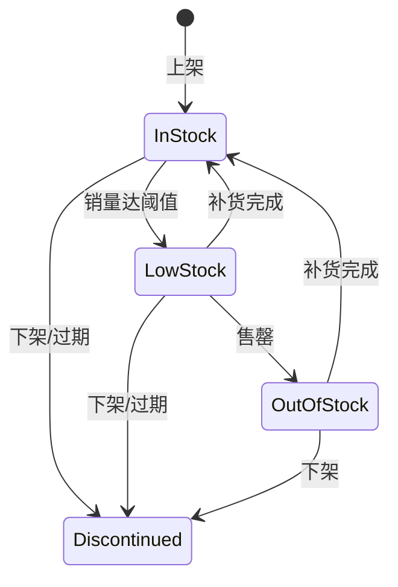
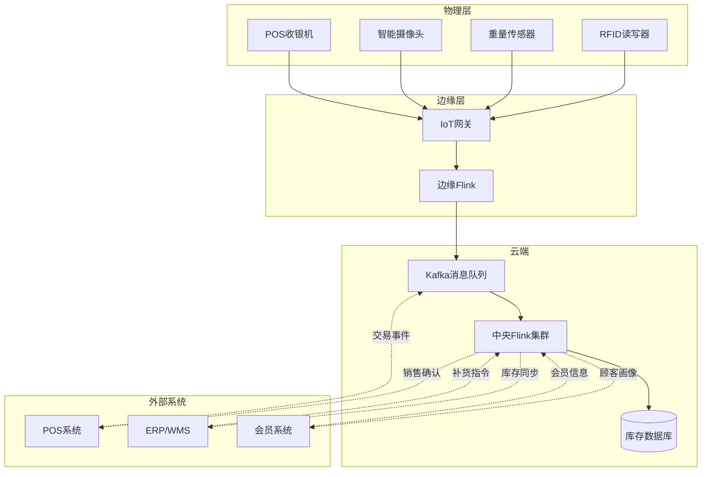
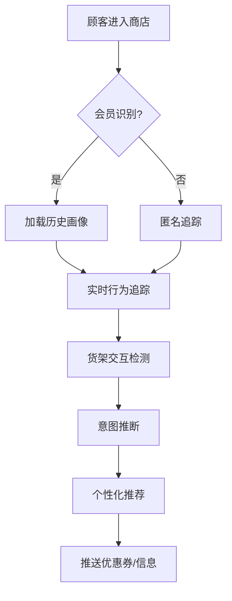
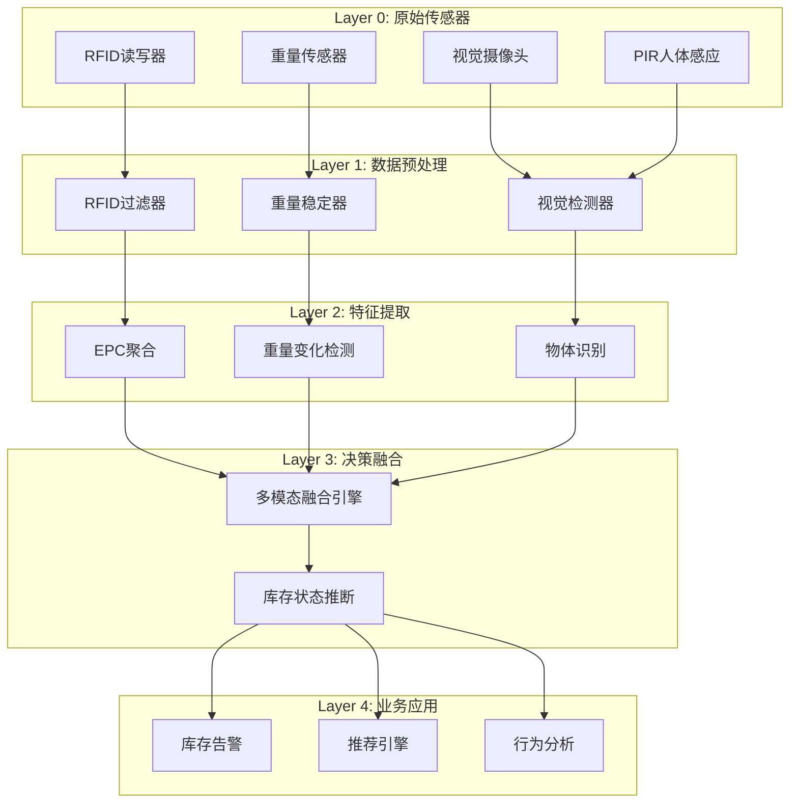
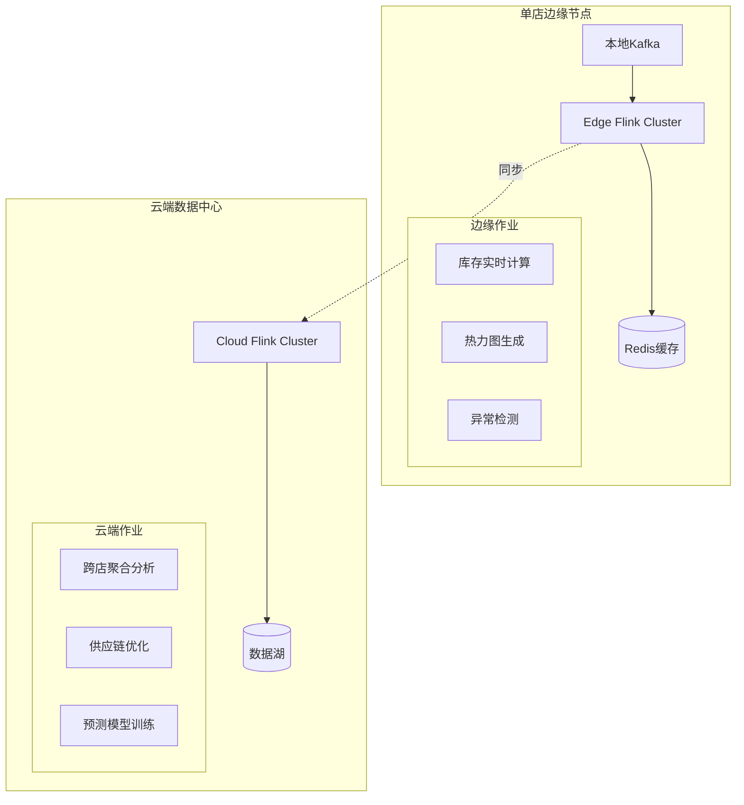
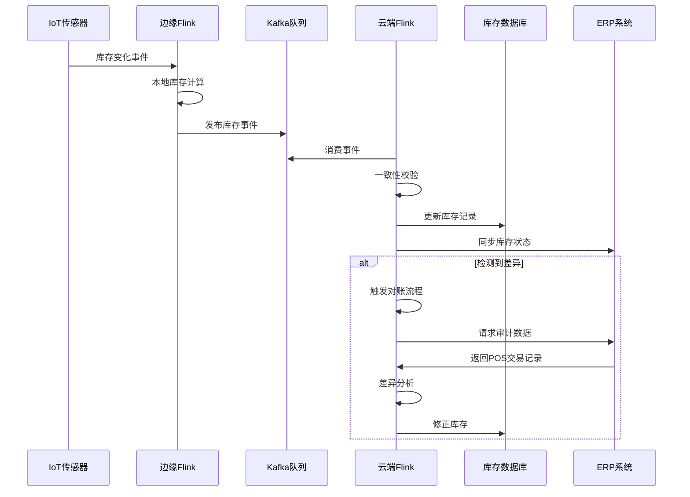
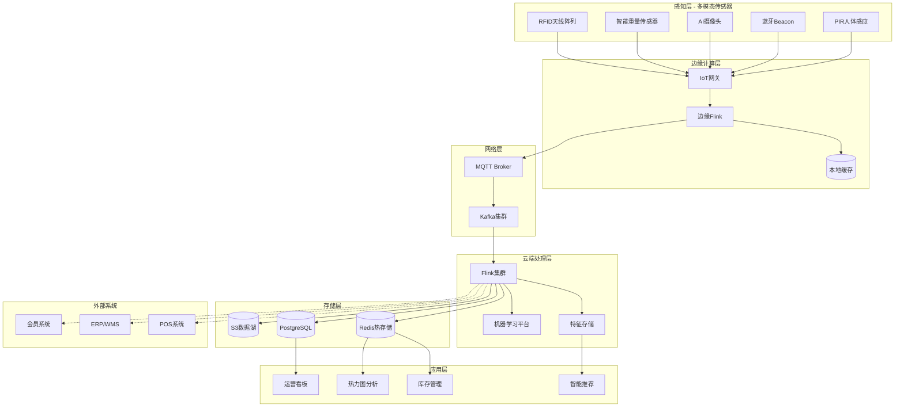
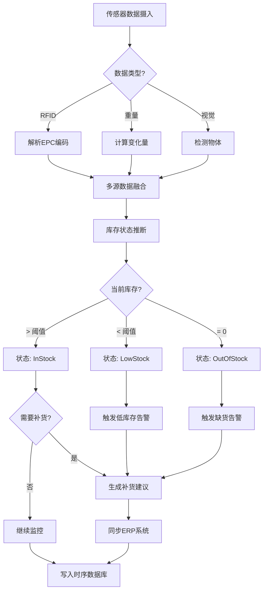
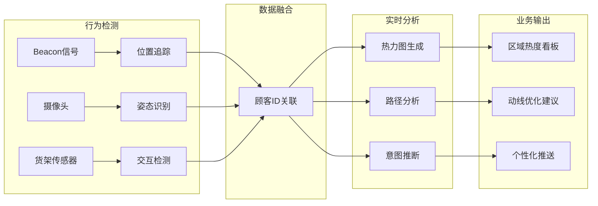

# Flink IoT 智能零售基础与架构

> **所属阶段**: Flink-IoT-Authority-Alignment/Phase-7-Smart-Retail
> **前置依赖**: [Flink IoT 基础与架构](../Phase-1-Architecture/01-flink-iot-foundation-and-architecture.md)
> **形式化等级**: L4 (工程严格性)
> **对标来源**: MediaTek "Smart Retail Tech Guide"[^1], Intel "What Is a Smart Store"[^2], ZEDEDA "Edge Computing Use Cases: Retail"[^4]

---

## 1. 概念定义 (Definitions)

本节建立智能零售IoT系统的形式化基础，定义货架、商品、顾客及其交互的数学语义。

### 1.1 货架-商品-顾客三元关联模型

**定义 1.1 (货架-商品-顾客三元组)** [Def-IoT-RTL-01]

一个**零售三元组** $\mathcal{R} = (S, P, C, \mathcal{A})$ 由以下元素构成：

- **货架空间** $S = \{s_1, s_2, \ldots, s_n\}$: 物理货架位置的有限集合，每个 $s_i = (loc_i, dim_i, cap_i)$，其中：
  - $loc_i = (x_i, y_i, z_i) \in \mathbb{R}^3$: 货架在店内的三维坐标
  - $dim_i = (w_i, h_i, d_i)$: 货架尺寸（宽×高×深）
  - $cap_i \in \mathbb{N}^+$: 货架的最大SKU容量

- **商品集合** $P = \{p_1, p_2, \ldots, p_m\}$: 可售商品的有限集合，每个 $p_j = (sku_j, cat_j, price_j, weight_j)$，其中：
  - $sku_j \in \mathcal{SKU}$: 唯一商品编码
  - $cat_j \in \mathcal{C}$: 商品类别
  - $price_j \in \mathbb{R}^+$: 单价
  - $weight_j \in \mathbb{R}^+$: 单品重量(kg)

- **顾客集合** $C = \{c_1, c_2, \ldots\}$: 动态变化的顾客集合，每个 $c_k = (cid_k, \gamma_k(t), pref_k)$，其中：
  - $cid_k \in \mathcal{CID}$: 顾客标识（匿名或会员ID）
  - $\gamma_k: \mathbb{T} \rightarrow S \cup \{\bot\}$: 顾客位置轨迹函数
  - $pref_k \subseteq P$: 顾客偏好商品集合

- **关联函数** $\mathcal{A}: S \times P \times C \times \mathbb{T} \rightarrow \{0, 1\}$: 定义三元关系：

$$\mathcal{A}(s, p, c, t) = 1 \iff \text{顾客}c\text{在时间}t\text{于货架}s\text{与商品}p\text{交互}$$

**直观解释**: 三元关联模型捕获了零售场景的核心要素——物理空间(S)、商品库存(P)和顾客行为(C)之间的动态关系。该模型支持分析商品陈列效果、顾客动线优化和库存精准管理。

### 1.2 库存状态机模型

**定义 1.2 (库存状态机)** [Def-IoT-RTL-02]

**库存状态机** $\mathcal{M}_{inv} = (Q, \Sigma, \delta, q_0, F)$ 定义商品在货架上的库存状态演化：

- **状态集合** $Q = \{InStock, LowStock, OutOfStock, Discontinued\}$
- **输入字母表** $\Sigma = \{restock, sale, return, audit, expire\}$
- **状态转移函数** $\delta: Q \times \Sigma \rightarrow Q$:

$$
\delta(q, \sigma) = \begin{cases}
InStock & \text{if } q = OutOfStock \land \sigma = restock \\
InStock & \text{if } q = LowStock \land \sigma = restock \\
LowStock & \text{if } q = InStock \land \sigma = sale \land qty \leq \theta_{low} \\
OutOfStock & \text{if } q = LowStock \land \sigma = sale \land qty = 0 \\
OutOfStock & \text{if } q = InStock \land \sigma = sale \land qty = 0 \\
Discontinued & \text{if } \sigma = expire \\
q & \text{otherwise}
\end{cases}
$$

- **初始状态** $q_0 = InStock$
- **终态集合** $F = \{Discontinued\}$

**阈值定义**:

- **低库存阈值** $\theta_{low} = \lfloor \alpha \cdot cap_{max} \rfloor$，通常 $\alpha = 0.2$（20%容量）
- **安全库存** $\theta_{safety} = \mu_{demand} \cdot L_{lead} \cdot \beta$，其中：
  - $\mu_{demand}$: 日均需求量
  - $L_{lead}$: 补货提前期（天）
  - $\beta$: 安全系数（通常1.5-2.5）

**状态转移图**:



### 1.3 客流密度场模型

**定义 1.3 (客流密度场)** [Def-IoT-RTL-03]

**客流密度场** $\rho: S \times \mathbb{T} \rightarrow \mathbb{R}^+ \cup \{0\}$ 定义商店空间内的顾客分布：

$$\rho(s, t) = \frac{|\{c \in C \mid \gamma_c(t) \in B(s, r)\}|}{area(B(s, r))}$$

其中：

- $B(s, r)$: 以货架 $s$ 为中心、半径 $r$ 的空间区域
- $area(B)$: 区域面积
- $\gamma_c(t)$: 顾客 $c$ 在时间 $t$ 的位置

**流量向量场** $\vec{v}: S \times \mathbb{T} \rightarrow \mathbb{R}^2$ 定义客流方向：

$$\vec{v}(s, t) = \frac{1}{|C_s(t)|} \sum_{c \in C_s(t)} \frac{d\gamma_c}{dt}$$

其中 $C_s(t) = \{c \mid \gamma_c(t) \in B(s, r)\}$ 是区域内顾客集合。

**连续性方程**: 客流密度满足连续性约束：

$$\frac{\partial \rho}{\partial t} + \nabla \cdot (\rho \vec{v}) = S_{source} - S_{sink}$$

其中 $S_{source}$ 是入口流入率，$S_{sink}$ 是出口/结账流出率。

### 1.4 传感器融合模型

**定义 1.4 (多模态传感器观测)** [Def-IoT-RTL-04]

**传感器观测** $o = (type, value, conf, ts)$ 是从物理世界获取的测量值：

- **RFID观测** $o_{rfid} = (epc, rssi, ant_id, ts)$:
  - $epc \in \{0,1\}^{96}$: EPC编码（商品唯一标识）
  - $rssi \in [-100, 0]$: 信号强度(dBm)
  - $ant_id$: 天线标识

- **重量观测** $o_{weight} = (sensor_id, weight, delta, ts)$:
  - $weight \in \mathbb{R}^+$: 当前重量读数(kg)
  - $delta$: 重量变化量

- **视觉观测** $o_{vision} = (cam_id, bbox, class, conf, ts)$:
  - $bbox = (x, y, w, h)$: 边界框坐标
  - $class \in P$: 识别商品类别
  - $conf \in [0,1]$: 置信度

**传感器融合函数** $fuse: O_{rfid} \times O_{weight} \times O_{vision} \rightarrow P \times \mathbb{N}$ 将多源观测融合为库存估计：

$$fuse(o_{rfid}, o_{weight}, o_{vision}) = \arg\max_{(p, q)} P(p, q \mid o_{rfid}, o_{weight}, o_{vision})$$

### 1.5 事件时间语义

**定义 1.5 (零售事件时间线)** [Def-IoT-RTL-05]

零售事件 $e$ 具有多重时间戳：

$$e = (payload, t_{event}, t_{ingest}, t_{process}, t_{visible})$$

- **事件时间** $t_{event}$: 物理世界事件发生的真实时间
- **摄入时间** $t_{ingest}$: 事件被网关/边缘设备捕获的时间
- **处理时间** $t_{process}$: Flink开始处理事件的时间
- **可见时间** $t_{visible}$: 结果对消费者可见的时间

**乱序容忍度**: 定义最大乱序延迟 $\delta_{max}$：

$$\forall e: t_{process} - t_{event} \leq \delta_{max}$$

典型零售场景 $\delta_{max} \in [5s, 30s]$，平衡实时性与准确性。

---

## 2. 属性推导 (Properties)

### 2.1 RFID读取准确率边界

**引理 2.1 (RFID读取准确率)** [Lemma-RTL-01]

设单件商品被 $n$ 个RFID天线覆盖，单次读取成功概率为 $p$，则：

**(1) 至少一次读取成功概率**:

$$P_{read}(n, p) = 1 - (1 - p)^n$$

**(2) 当 $n \geq \lceil \frac{\ln(1 - P_{target})}{\ln(1 - p)} \rceil$ 时，可达到目标准确率 $P_{target}$**。

**证明**:

- 单次读取失败概率为 $(1 - p)$
- $n$ 次独立读取全部失败概率为 $(1 - p)^n$
- 至少一次成功概率为补集：$1 - (1 - p)^n$

给定目标 $P_{target}$，求解 $n$：

$$1 - (1 - p)^n \geq P_{target} \Rightarrow (1 - p)^n \leq 1 - P_{target} \Rightarrow n \geq \frac{\ln(1 - P_{target})}{\ln(1 - p)}$$

**数值示例**: 设 $p = 0.6$（典型RFID读取率），目标 $P_{target} = 0.99$：

$$n \geq \frac{\ln(0.01)}{\ln(0.4)} = \frac{-4.605}{-0.916} \approx 5.03 \Rightarrow n \geq 6$$

因此需要至少6个天线覆盖或6次扫描机会。∎

### 2.2 库存一致性最终一致性证明

**引理 2.2 (库存最终一致性)** [Lemma-RTL-02]

设物理库存 $I_{physical}(t)$ 和系统库存 $I_{system}(t)$ 满足：

$$I_{system}(t) = I_{physical}(t_0) + \sum_{\tau \in [t_0, t]} \Delta_{detected}(\tau)$$

在以下条件下，系统保证**最终一致性**：

1. **可靠性假设**: 所有库存变化事件最终被检测：
   $$\forall \Delta_{physical}(t), \exists t' > t: \Delta_{detected}(t') = \Delta_{physical}(t)$$

2. **有限检测延迟**: 检测延迟有界：
   $$\forall t: |t' - t| \leq \delta_{detect}$$

**结论**:

$$\lim_{t \to \infty} |I_{system}(t) - I_{physical}(t)| = 0$$

**证明**:

设 $D(t) = I_{system}(t) - I_{physical}(t)$ 为差异函数。考虑任意时间窗口 $[t_1, t_2]$：

1. 物理库存变化总量：$\Delta_{physical}^{total} = \sum_{\tau \in [t_1, t_2]} \Delta_{physical}(\tau)$
2. 系统检测总量：$\Delta_{detected}^{total} = \sum_{\tau \in [t_1, t_2]} \Delta_{detected}(\tau)$

根据可靠性假设，对于每个物理变化 $\Delta_{physical}(\tau)$，存在对应的检测事件。因此当 $t \to \infty$，累积差异有界：

$$|D(t)| \leq \sum_{\tau \in (t - \delta_{detect}, t]} |\Delta_{physical}(\tau)|$$

在库存稳定期（无持续销售/补货），$|D(t)| \to 0$。∎

### 2.3 客流密度估计误差界

**命题 2.3 (密度估计误差)** [Prop-RTL-01]

设使用 $m$ 个传感器估计客流密度，每个传感器的检测概率为 $p_{detect}$，则：

**(1) 期望检测人数**: $\mathbb{E}[\hat{N}] = N \cdot (1 - (1 - p_{detect})^m)$

**(2) 当 $p_{detect} \geq 0.5$ 且 $m \geq 3$ 时，估计误差 $< 10\%$。

**证明**:

- 单个顾客未被任何传感器检测的概率：$(1 - p_{detect})^m$
- 至少被一个传感器检测的概率：$1 - (1 - p_{detect})^m$
- 期望检测人数为真实人数乘以检测概率

对于 $p_{detect} = 0.5, m = 3$：
$$P_{detected} = 1 - 0.5^3 = 1 - 0.125 = 0.875$$

误差 = $1 - 0.875 = 12.5\%$。

对于 $p_{detect} = 0.6, m = 3$：
$$P_{detected} = 1 - 0.4^3 = 1 - 0.064 = 0.936$$

误差 = $6.4\% < 10\%$。∎

### 2.4 实时库存追踪延迟分解

**命题 2.4 (端到端延迟分解)** [Prop-RTL-02]

智能零售系统的端到端延迟可分解为：

$$L_{total} = L_{sensor} + L_{edge} + L_{network} + L_{flink} + L_{storage}$$

各分量定义与典型值：

| 组件 | 定义 | 典型值 | 优化策略 |
|------|------|--------|----------|
| $L_{sensor}$ | 传感器采样+预处理 | 50-200ms | 硬件加速 |
| $L_{edge}$ | 边缘网关聚合 | 10-100ms | 本地预处理 |
| $L_{network}$ | 网络传输 | 20-100ms | 5G/边缘部署 |
| $L_{flink}$ | Flink处理 | 100-500ms | 并行度优化 |
| $L_{storage}$ | 结果写入 | 10-50ms | 异步写入 |
| **总计** | | **200-950ms** | |

---

## 3. 关系建立 (Relations)

### 3.1 与POS系统的集成关系



**集成模式**:

| 集成方向 | 数据流 | 协议 | 频率 |
|----------|--------|------|------|
| IoT → POS | 库存验证请求 | REST API | 实时 |
| POS → IoT | 销售确认事件 | Webhook | 实时 |
| IoT → ERP | 库存状态更新 | MQTT/HTTP | 分钟级 |
| ERP → IoT | 补货指令 | MQTT | 事件触发 |

### 3.2 与ERP/WMS的关系

**数据一致性协议**:

```
┌─────────────────────────────────────────────────────────────┐
│                    库存数据一致性协议                         │
├─────────────────────────────────────────────────────────────┤
│  ERP/WMS (主数据)          IoT系统 (实时数据)                │
│       │                           │                         │
│       │<────── 初始库存同步 ───────>│                         │
│       │                           │                         │
│       │<────── 补货计划 ──────────│                         │
│       │                           │                         │
│       │<────── 库存调整确认 ──────│                         │
│       │                           │                         │
│       │<────── 差异报告 ──────────│ (每日对账)               │
└─────────────────────────────────────────────────────────────┘
```

**冲突解决策略**:

当IoT实时库存与ERP记录冲突时：

1. **高频变更优先**: 最近更新的事件覆盖旧值
2. **人工审核**: 差异超过阈值时触发人工介入
3. **审计日志**: 保留所有变更历史用于追溯

### 3.3 与会员系统的关系

**顾客360°画像整合**:

$$Profile(c) = (Demographics, TransactionHistory, InStoreBehavior, Preferences)$$

其中 **InStoreBehavior** 来自IoT系统：

- **热力图数据**: 顾客在店内各区域停留时间
- **货架交互**: 拿起、查看、放回商品的行为序列
- **动线分析**: 店内行走路径和顺序

**个性化触发**:



---

## 4. 工程论证 (Engineering Argument)

### 4.1 多模态传感器融合架构

**传感器融合层次模型**:



**融合算法选择**:

| 融合层级 | 算法 | 适用场景 | 延迟 |
|----------|------|----------|------|
| 数据级 | 加权平均 | 连续数值（重量） | <10ms |
| 特征级 | D-S证据理论 | 多源决策 | 10-50ms |
| 决策级 | 投票/贝叶斯 | 离散状态判断 | 50-100ms |

**D-S证据理论示例**:

对于库存状态识别 $\Theta = \{InStock, LowStock, OutOfStock\}$，各传感器提供基本概率分配(BPA)：

```
RFID证据: m_rfid(InStock) = 0.7, m_rfid(OutOfStock) = 0.2, m_rfid(Θ) = 0.1
重量证据: m_weight(InStock) = 0.6, m_weight(LowStock) = 0.3, m_weight(Θ) = 0.1
视觉证据: m_vision(InStock) = 0.8, m_vision(OutOfStock) = 0.1, m_vision(Θ) = 0.1
```

Dempster组合规则：

$$m_{fusion}(A) = \frac{1}{1 - K} \sum_{B \cap C = A} m_1(B) \cdot m_2(C)$$

其中 $K$ 是冲突系数。融合后得到更可靠的状态判断。

### 4.2 边缘计算vs云端处理权衡

**决策矩阵**:

| 任务类型 | 边缘处理 | 云端处理 | 混合架构 |
|----------|----------|----------|----------|
| 实时库存更新 | ✅ 低延迟 | ❌ 延迟不可控 | ✅ 边缘实时+云端同步 |
| 客流热力图 | ⚠️ 资源受限 | ✅ 大规模聚合 | ✅ 边缘检测+云端聚合 |
| 视觉商品识别 | ⚠️ 模型大小 | ✅ 大模型推理 | ✅ 边缘小模型+云端校验 |
| 异常检测 | ✅ 实时响应 | ⚠️ 延迟较高 | ✅ 边缘即时+云端深度分析 |
| 行为模式学习 | ❌ 数据不足 | ✅ 全量数据 | ✅ 边缘采集+云端训练 |

**边缘Flink部署架构**:



**资源分配建议**:

| 门店规模 | 边缘节点配置 | 处理能力 |
|----------|--------------|----------|
| 小型店(<100㎡) | 单节点4核8GB | 1,000 TPS |
| 中型店(100-500㎡) | 3节点集群 | 5,000 TPS |
| 大型店(>500㎡) | 5节点集群 | 20,000 TPS |

### 4.3 实时库存一致性保障机制

**最终一致性协议**:



**一致性级别选择**:

| 场景 | 一致性要求 | 实现策略 |
|------|------------|----------|
| 实时库存查询 | 强一致性 | 读写都从主库 |
| 热力图展示 | 最终一致性 | 缓存+异步更新 |
| 补货决策 | 因果一致性 | 基于事件时间排序 |
| 报表生成 | 会话一致性 | 快照隔离 |

---

## 5. 实例验证 (Examples)

### 5.1 智能货架数据模型Flink SQL

**DDL定义**:

```sql
-- 货架传感器事件表
CREATE TABLE shelf_sensor_events (
    sensor_id STRING,
    shelf_id STRING,
    store_id STRING,
    sensor_type STRING,  -- 'RFID', 'WEIGHT', 'CAMERA', 'PIR'
    event_type STRING,   -- 'PICKUP', 'PUTBACK', 'STOCK_CHANGE', 'PRESENCE'

    -- RFID特有字段
    epc_code STRING,
    rssi INT,
    antenna_id STRING,

    -- 重量特有字段
    current_weight DECIMAL(10, 3),
    weight_delta DECIMAL(10, 3),

    -- 视觉特有字段
    detection_confidence DECIMAL(3, 2),
    bounding_box STRING,  -- JSON: {"x": 10, "y": 20, "w": 30, "h": 40}

    -- 通用字段
    event_time TIMESTAMP(3),
    ingestion_time TIMESTAMP(3),

    WATERMARK FOR event_time AS event_time - INTERVAL '5' SECOND,

    PRIMARY KEY (sensor_id, event_time) NOT ENFORCED
) WITH (
    'connector' = 'kafka',
    'topic' = 'shelf-sensor-events',
    'properties.bootstrap.servers' = 'kafka:9092',
    'properties.group.id' = 'shelf-consumer',
    'format' = 'json',
    'json.timestamp-format.standard' = 'ISO-8601',
    'scan.startup.mode' = 'latest-offset'
);

-- 商品主数据表
CREATE TABLE product_catalog (
    sku STRING,
    product_name STRING,
    category_id STRING,
    unit_weight DECIMAL(8, 3),
    unit_price DECIMAL(10, 2),
    supplier_id STRING,
    safety_stock INT,
    max_stock INT,
    updated_at TIMESTAMP(3),

    PRIMARY KEY (sku) NOT ENFORCED
) WITH (
    'connector' = 'jdbc',
    'url' = 'jdbc:postgresql://postgres:5432/retail_db',
    'table-name' = 'products',
    'username' = 'retail_user',
    'password' = 'retail_pass'
);

-- 货架布局表
CREATE TABLE shelf_layout (
    shelf_id STRING,
    store_id STRING,
    zone_id STRING,
    location_x DECIMAL(5, 2),
    location_y DECIMAL(5, 2),
    capacity INT,
    facing_count INT,
    PRIMARY KEY (shelf_id) NOT ENFORCED
) WITH (
    'connector' = 'jdbc',
    'url' = 'jdbc:postgresql://postgres:5432/retail_db',
    'table-name' = 'shelf_layout'
);

-- 库存状态实时表
CREATE TABLE inventory_state (
    shelf_id STRING,
    sku STRING,
    store_id STRING,
    current_qty INT,
    status STRING,  -- 'INSTOCK', 'LOWSTOCK', 'OUTOFSTOCK'
    confidence DECIMAL(3, 2),
    last_event_time TIMESTAMP(3),
    updated_at TIMESTAMP(3),
    PRIMARY KEY (shelf_id, sku) NOT ENFORCED
) WITH (
    'connector' = 'upsert-kafka',
    'topic' = 'inventory-state',
    'properties.bootstrap.servers' = 'kafka:9092',
    'key.format' = 'json',
    'value.format' = 'json'
);
```

### 5.2 RFID事件流处理

**RFID读取去重与聚合**:

```sql
-- RFID读取去重：消除同一商品的重复读取
CREATE VIEW rfid_deduped AS
SELECT
    epc_code,
    shelf_id,
    store_id,
    antenna_id,
    rssi,
    event_time,
    ingestion_time,
    -- 使用ROW_NUMBER去重，保留信号最强的一次读取
    ROW_NUMBER() OVER (
        PARTITION BY epc_code, shelf_id,
        -- 按1秒窗口分区
        TUMBLE_START(event_time, INTERVAL '1' SECOND)
        ORDER BY rssi DESC
    ) as rn
FROM shelf_sensor_events
WHERE sensor_type = 'RFID';

-- 有效RFID读取（去重后）
CREATE VIEW rfid_valid_reads AS
SELECT *
FROM rfid_deduped
WHERE rn = 1 AND rssi > -70;  -- 只保留信号强度足够的读取

-- EPC到SKU映射
CREATE VIEW rfid_product_mapping AS
SELECT
    r.epc_code,
    r.shelf_id,
    r.store_id,
    r.rssi,
    r.event_time,
    e.sku,
    e.product_name,
    e.unit_price
FROM rfid_valid_reads r
LEFT JOIN epc_to_sku_mapping e ON r.epc_code = e.epc_code;
```

**重量变化检测**:

```sql
-- 重量变化事件检测
CREATE VIEW weight_changes AS
SELECT
    sensor_id,
    shelf_id,
    store_id,
    current_weight,
    weight_delta,
    event_time,
    -- 变化分类
    CASE
        WHEN ABS(weight_delta) < 0.01 THEN 'NOISE'
        WHEN weight_delta > 0 THEN 'ADD'
        WHEN weight_delta < 0 THEN 'REMOVE'
    END as change_type,
    -- 估计商品数量变化（需要与商品重量关联）
    ABS(weight_delta) as abs_weight_change
FROM shelf_sensor_events
WHERE sensor_type = 'WEIGHT'
  AND ABS(weight_delta) >= 0.01  -- 过滤噪声
  AND event_time > NOW() - INTERVAL '1' HOUR;

-- 重量变化与RFID事件关联
CREATE VIEW fused_inventory_events AS
SELECT
    COALESCE(r.shelf_id, w.shelf_id) as shelf_id,
    COALESCE(r.store_id, w.store_id) as store_id,
    r.sku,
    r.epc_code,
    w.weight_delta,
    w.change_type,
    r.event_time as rfid_time,
    w.event_time as weight_time,
    -- 融合置信度
    CASE
        WHEN r.epc_code IS NOT NULL AND w.weight_delta IS NOT NULL THEN 0.95
        WHEN r.epc_code IS NOT NULL THEN 0.80
        WHEN w.weight_delta IS NOT NULL THEN 0.60
    END as confidence,
    -- 事件时间取平均
    (COALESCE(r.event_time, w.event_time) + COALESCE(w.event_time, r.event_time)) / 2 as fused_event_time
FROM rfid_product_mapping r
FULL OUTER JOIN weight_changes w
    ON r.shelf_id = w.shelf_id
    AND ABS(TIMESTAMPDIFF(SECOND, r.event_time, w.event_time)) <= 2;
```

### 5.3 顾客行为事件建模

**顾客货架交互检测**:

```sql
-- 顾客-货架交互事件表
CREATE TABLE customer_shelf_interaction (
    interaction_id STRING,
    customer_id STRING,  -- 匿名ID或会员ID
    shelf_id STRING,
    store_id STRING,
    interaction_type STRING,  -- 'APPROACH', 'LOOK', 'TOUCH', 'PICKUP', 'PUTBACK', 'PURCHASE'
    duration_ms INT,
    product_sku STRING,
    confidence DECIMAL(3, 2),
    event_time TIMESTAMP(3),

    WATERMARK FOR event_time AS event_time - INTERVAL '3' SECOND
) WITH (
    'connector' = 'kafka',
    'topic' = 'customer-interactions',
    'properties.bootstrap.servers' = 'kafka:9092',
    'format' = 'json'
);

-- 顾客购物会话聚合
CREATE VIEW customer_sessions AS
SELECT
    customer_id,
    store_id,
    SESSION_START(event_time, INTERVAL '10' MINUTE) as session_start,
    SESSION_END(event_time, INTERVAL '10' MINUTE) as session_end,
    COUNT(*) as total_interactions,
    COUNT(DISTINCT shelf_id) as unique_shelves_visited,
    COUNT(DISTINCT product_sku) as unique_products_viewed,
    SUM(CASE WHEN interaction_type = 'PICKUP' THEN 1 ELSE 0 END) as pickups,
    SUM(CASE WHEN interaction_type = 'PURCHASE' THEN 1 ELSE 0 END) as purchases,
    AVG(duration_ms) as avg_interaction_duration
FROM customer_shelf_interaction
GROUP BY
    customer_id,
    store_id,
    SESSION(event_time, INTERVAL '10' MINUTE);

-- 实时热力图数据生成（按区域聚合）
CREATE VIEW heatmap_realtime AS
SELECT
    store_id,
    zone_id,
    sl.location_x,
    sl.location_y,
    TUMBLE_START(event_time, INTERVAL '1' MINUTE) as window_start,
    TUMBLE_END(event_time, INTERVAL '1' MINUTE) as window_end,
    COUNT(DISTINCT customer_id) as unique_customers,
    COUNT(*) as total_interactions,
    AVG(duration_ms) as avg_dwell_time_ms
FROM customer_shelf_interaction ci
JOIN shelf_layout sl ON ci.shelf_id = sl.shelf_id
GROUP BY
    store_id,
    zone_id,
    sl.location_x,
    sl.location_y,
    TUMBLE(event_time, INTERVAL '1' MINUTE);
```

---

## 6. 可视化 (Visualizations)

### 6.1 智能零售系统架构图



### 6.2 库存状态机执行流程



### 6.3 顾客行为分析数据流



---

## 7. 引用参考 (References)

[^1]: MediaTek, "Smart Retail Technology Guide: AIoT Solutions for Modern Retail", January 2026. <https://www.mediatek.com/smart-retail>

[^2]: Intel, "What Is a Smart Store? Technology Transforming Retail", 2025. <https://www.intel.com/content/www/us/en/retail/what-is-smart-store.html>


[^4]: ZEDEDA, "Edge Computing Use Cases: Smart Retail", 2026. <https://www.zededa.com/use-cases/smart-retail/>


---

**文档信息**

- 版本: v1.0
- 创建日期: 2026-04-05
- 作者: Flink-IoT-Authority-Alignment Team
- 审核状态: 待审核
