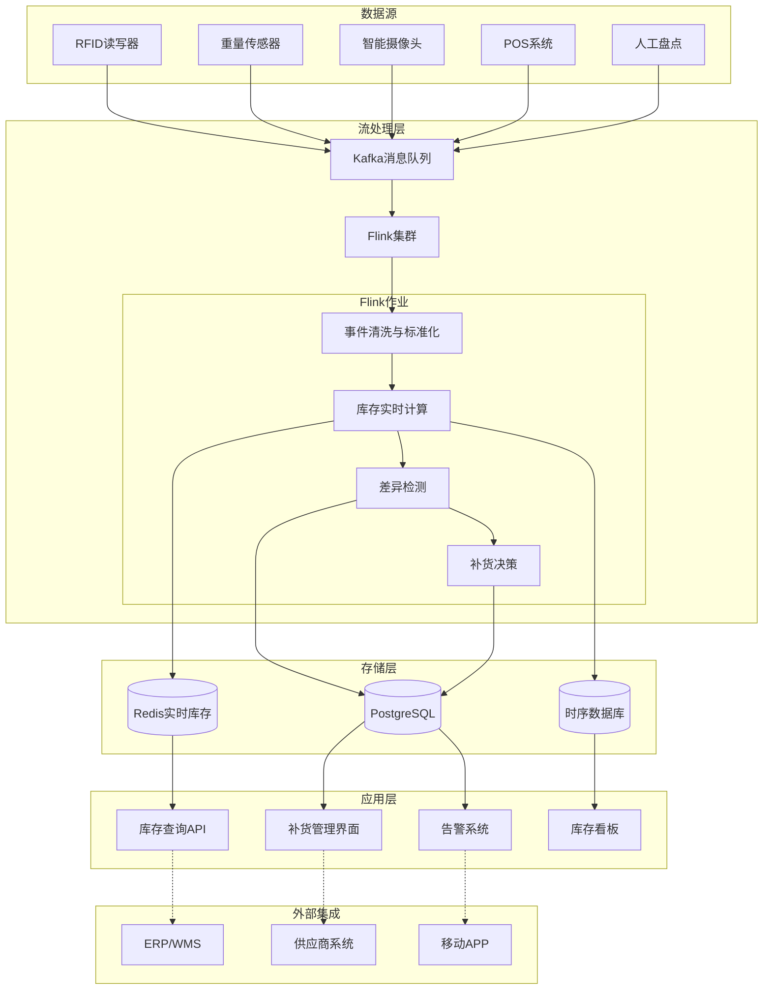
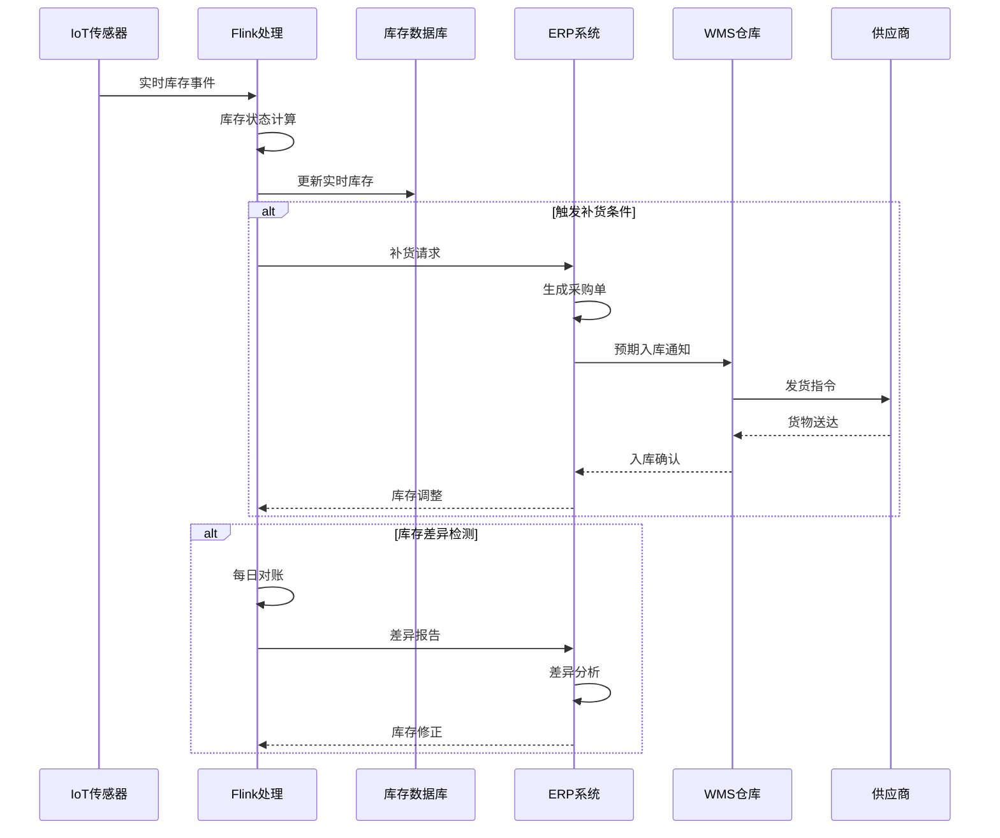
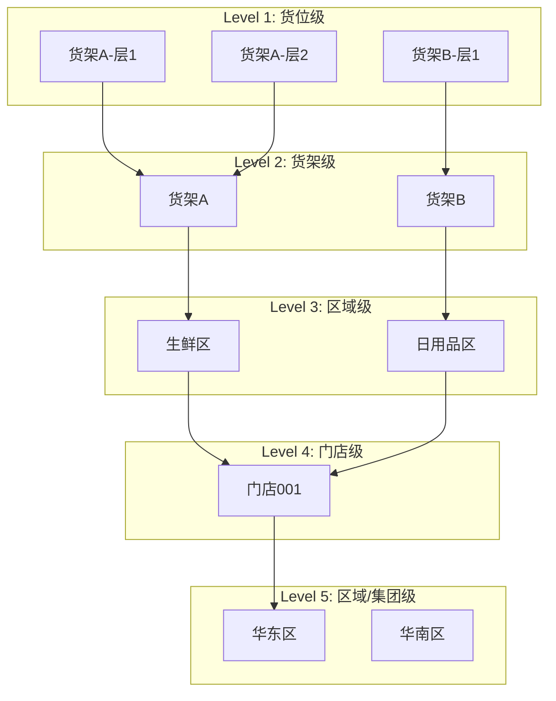
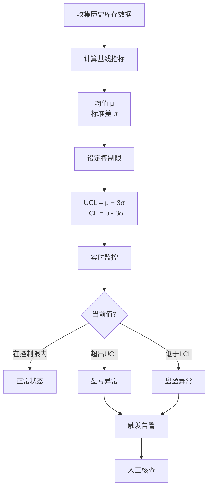
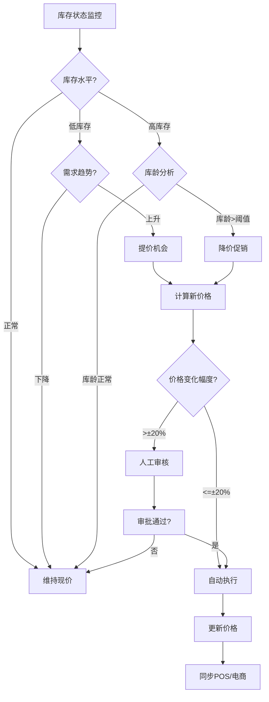
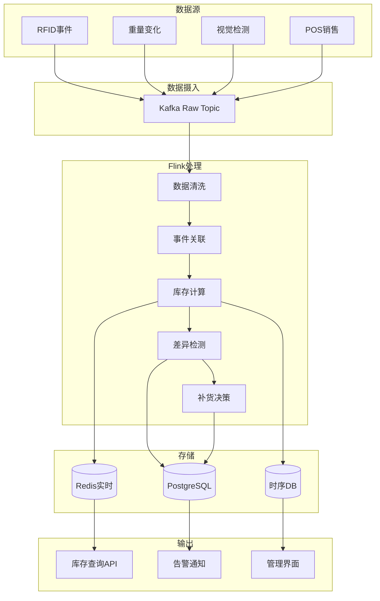
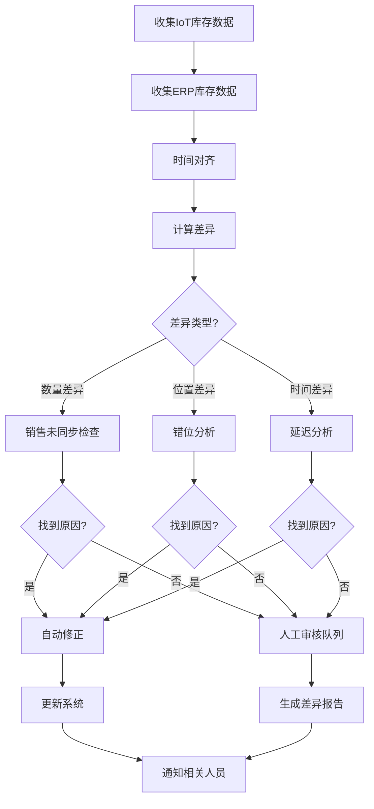
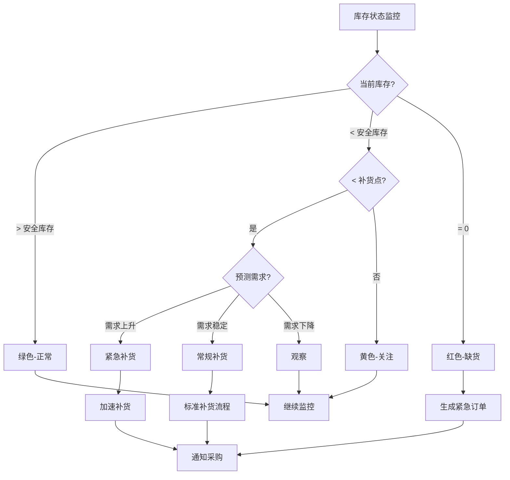

# Flink IoT 实时库存追踪与管理

> **所属阶段**: Flink-IoT-Authority-Alignment/Phase-7-Smart-Retail
> **前置依赖**: [17-flink-iot-smart-retail-foundation.md](./17-flink-iot-smart-retail-foundation.md)
> **形式化等级**: L4 (工程严格性)
> **对标来源**: IoT in Retail Inventory Management Research[^1], MediaTek Smart Retail Solutions[^2]

---

## 1. 概念定义 (Definitions)

本节建立实时库存追踪系统的形式化模型，定义库存精确度度量、自动补货触发机制等核心概念。

### 1.1 库存精确度度量

**定义 1.1 (库存精确度)** [Def-IoT-RTL-04]

**库存精确度** $A_{inv}$ 是系统库存记录与物理库存之间一致性的量化度量：

$$A_{inv} = 1 - \frac{\sum_{s \in S} |I_{system}(s) - I_{physical}(s)|}{\sum_{s \in S} I_{physical}(s)}$$

其中：

- $S$: 所有库存位置（货架/库位）的集合
- $I_{system}(s)$: 位置 $s$ 的系统记录库存量
- $I_{physical}(s)$: 位置 $s$ 的物理实际库存量

**精确度等级分类**:

| 等级 | 精确度范围 | 描述 | 业务影响 |
|------|------------|------|----------|
| A级 | ≥98% | 优秀 | 支持自动化决策 |
| B级 | 95%-98% | 良好 | 需要定期人工校验 |
| C级 | 90%-95% | 一般 | 不建议自动补货 |
| D级 | <90% | 差 | 需要系统重构 |

**细化度量指标**:

$$A_{SKU} = \frac{|\{sku \mid I_{system}(sku) = I_{physical}(sku)\}|}{|SKU_{total}|}$$

$$A_{location} = 1 - \frac{|\{s \mid I_{system}(s) \neq I_{physical}(s)\}|}{|S|}$$

### 1.2 自动补货触发模型

**定义 1.2 (补货决策函数)** [Def-IoT-RTL-05]

**补货决策** $R: S \times P \times \mathbb{T} \rightarrow \{0, 1\} \times \mathbb{N} \times \mathbb{R}^+$ 是一个映射：

$$R(s, p, t) = (trigger, qty, priority)$$

其中：

- $trigger \in \{0, 1\}$: 是否触发补货（1=是）
- $qty \in \mathbb{N}$: 建议补货数量
- $priority \in [0, 1]$: 补货优先级

**触发条件**:

$$trigger = 1 \iff \bigvee_{i=1}^{4} C_i(s, p, t)$$

各触发条件定义为：

$$
\begin{aligned}
C_1: &\quad I_{current}(s, p) \leq \theta_{reorder}(p) \quad \text{(库存降至补货点)} \\
C_2: &\quad \frac{dI}{dt} < 0 \land I_{current} / |\frac{dI}{dt}| \leq T_{lead}(p) \quad \text{(预测缺货)} \\
C_3: &\quad P_{demand}(s, p, t+\Delta t) > I_{current} \quad \text{(需求预测触发)} \\
C_4: &\quad event_{promotion} \land I_{current} < \theta_{promo} \quad \text{(促销预备)}
\end{aligned}
$$

**补货数量计算**:

$$qty = \max(\theta_{target} - I_{current}, MOQ(p))$$

其中 $\theta_{target} = \max(\theta_{safety} + \mu_{demand} \cdot T_{review}, cap_{shelf})$。

### 1.3 库存差异模型

**定义 1.3 (库存差异)** [Def-IoT-RTL-06]

**库存差异** $\Delta_{inv}(s, p, t)$ 定义为：

$$\Delta_{inv}(s, p, t) = I_{system}(s, p, t) - I_{physical}(s, p, t)$$

**差异类型分类**:

| 类型 | 条件 | 可能原因 |
|------|------|----------|
| 盘盈 | $\Delta_{inv} < 0$ | 退货未录入、 theft concealment |
| 盘亏 | $\Delta_{inv} > 0$ | 损耗、盗窃、未记录销售 |
| 错位 | $\sum_s \Delta_{inv} = 0 \land \exists s: \Delta_{inv}(s) \neq 0$ | 商品放错位置 |

**损耗率计算**:

$$shrinkage\_rate = \frac{\sum_{p} \max(0, \Delta_{inv}(p))}{\sum_{p} I_{received}(p)} \times 100\%$$

### 1.4 动态定价触发模型

**定义 1.4 (动态定价条件)** [Def-IoT-RTL-07]

**价格调整决策** $\mathcal{P}: P \times \mathbb{T} \rightarrow \mathbb{R}^+ \times [0, 1]$：

$$\mathcal{P}(p, t) = (new\_price, confidence)$$

**定价触发条件**:

$$
trigger_{price} = \begin{cases}
+\Delta P & \text{if } I_{current} < \theta_{scarcity} \land \frac{dI}{dt} < -\epsilon \\
-\Delta P & \text{if } I_{current} > \theta_{overstock} \land shelf\_days > T_{max} \\
0 & \text{otherwise}
\end{cases}
$$

---

## 2. 属性推导 (Properties)

### 2.1 库存精确度上界分析

**引理 2.1 (精确度上界)** [Lemma-RTL-03]

设传感器检测率为 $p_{detect}$，单商品SKU在货架上的实际数量为 $N$，则：

**(1) 期望检测数量**: $\mathbb{E}[\hat{N}] = N \cdot p_{detect}$

**(2) 方差**: $Var(\hat{N}) = N \cdot p_{detect} \cdot (1 - p_{detect})$

**(3) 当 $N$ 较大时，精确度上界为 $p_{detect}$**：

$$\lim_{N \to \infty} A_{inv} \leq p_{detect}$$

**证明**:

- 检测数量服从二项分布 $\hat{N} \sim Binomial(N, p_{detect})$
- 期望 $\mathbb{E}[\hat{N}] = N \cdot p_{detect}$
- 绝对误差期望 $\mathbb{E}[|N - \hat{N}|] = N(1 - p_{detect})$
- 因此精确度 $A = 1 - \frac{\mathbb{E}[|N - \hat{N}|]}{N} = p_{detect}$

**工程启示**: 要达到99%库存精确度，需要 $p_{detect} \geq 0.99$，即需要高可靠性传感器或多重检测机制。∎

### 2.2 补货提前期优化

**引理 2.2 (最优补货点)** [Lemma-RTL-04]

给定日均需求 $\mu$，需求标准差 $\sigma$，提前期 $L$，则最优补货点：

$$ROP = \mu \cdot L + z_{\alpha} \cdot \sigma \cdot \sqrt{L}$$

其中 $z_{\alpha}$ 是服务水平对应的标准正态分位数。

**缺货概率**:

$$P_{stockout} = \Phi\left(-\frac{ROP - \mu \cdot L}{\sigma \cdot \sqrt{L}}\right) = 1 - \alpha$$

**证明**: 提前期需求服从 $N(\mu L, \sigma^2 L)$。安全库存 $SS = ROP - \mu L$，缺货发生在需求 $D_{LT} > ROP$。

$$P(D_{LT} > ROP) = P\left(Z > \frac{ROP - \mu L}{\sigma \sqrt{L}}\right) = 1 - \Phi(z_{\alpha}) = 1 - \alpha$$

**数值示例**: $\mu = 10, \sigma = 3, L = 3$天，要求服务水平95% ($z_{0.95} = 1.645$)：

$$ROP = 10 \cdot 3 + 1.645 \cdot 3 \cdot \sqrt{3} = 30 + 8.54 = 38.54 \approx 39$$

∎

### 2.3 损耗检测灵敏度

**命题 2.3 (损耗检测阈值)** [Prop-RTL-03]

设检测周期为 $T$，正常损耗率基准为 $\rho_0$，则：

**(1) 可检测的最小异常损耗率**:

$$\rho_{min} = \rho_0 + z_{1-\beta} \cdot \sqrt{\frac{\rho_0(1-\rho_0)}{N \cdot T}}$$

**(2) 检测功效**: 当实际损耗率 $\rho_1 = \rho_0 + \Delta$ 时，检测概率为：

$$Power = \Phi\left(\frac{\Delta}{\sqrt{\frac{\rho_0(1-\rho_0)}{N \cdot T}}} - z_{1-\alpha}\right)$$

**证明**: 使用正态近似，统计检验 $H_0: \rho = \rho_0$ vs $H_1: \rho > \rho_0$。

---

## 3. 关系建立 (Relations)

### 3.1 实时库存追踪系统架构



### 3.2 与供应链系统的数据流



### 3.3 多层级库存聚合关系



---

## 4. 工程论证 (Engineering Argument)

### 4.1 库存差异检测算法

**统计过程控制(SPC)方法**:



**EWMA控制图** (指数加权移动平均):

$$Z_t = \lambda \cdot X_t + (1 - \lambda) \cdot Z_{t-1}$$

其中 $\lambda \in (0, 1]$ 是平滑参数，对近期数据赋予更高权重。

**控制限**:

$$UCL/LCL = \mu_Z \pm L \cdot \sigma_Z \cdot \sqrt{\frac{\lambda}{2-\lambda}}$$

### 4.2 损耗(Shrinkage)检测模式

**损耗类型与检测策略**:

| 损耗类型 | 特征 | 检测方法 | 灵敏度 |
|----------|------|----------|--------|
| 盗窃 | 库存快速下降，无销售记录 | 异常速度检测 | 高 |
| 损坏 | 零星减少，可能伴随退货 | 结合退货记录 | 中 |
| 过期 | 特定品类，周期性出现 | 效期预警+库存异常 | 高 |
| 记录错误 | 系统间差异 | 对账差异检测 | 高 |
| 供应商短装 | 入库时即差异 | 收货验证 | 高 |

**异常检测算法**:

```sql
-- 损耗异常检测SQL
CREATE VIEW shrinkage_anomaly AS
SELECT
    store_id,
    sku,
    window_start,
    window_end,
    -- 理论库存变化
    SUM(CASE WHEN event_type = 'RECEIPT' THEN qty ELSE 0 END) as receipts,
    SUM(CASE WHEN event_type = 'SALE' THEN -qty ELSE 0 END) as sales,
    SUM(CASE WHEN event_type = 'RETURN' THEN qty ELSE 0 END) as returns,
    SUM(CASE WHEN event_type = 'ADJUSTMENT' THEN qty ELSE 0 END) as adjustments,
    -- 实际IoT检测变化
    SUM(CASE WHEN event_type = 'IOT_CHANGE' THEN qty ELSE 0 END) as iot_changes,
    -- 理论期末库存
    LAG(current_qty) OVER (PARTITION BY store_id, sku ORDER BY window_start)
        + receipts + sales + returns + adjustments as expected_qty,
    -- 实际期末库存
    current_qty as actual_qty,
    -- 差异
    current_qty - (
        LAG(current_qty) OVER (PARTITION BY store_id, sku ORDER BY window_start)
        + receipts + sales + returns + adjustments
    ) as variance,
    -- 损耗率
    ABS(variance) / NULLIF(LAG(current_qty) OVER (PARTITION BY store_id, sku ORDER BY window_start), 0) as shrinkage_rate,
    -- 异常标记（3σ原则）
    CASE
        WHEN ABS(variance) > 3 * AVG(ABS(variance)) OVER (
            PARTITION BY store_id, sku
            ORDER BY window_start
            ROWS BETWEEN 30 PRECEDING AND 1 PRECEDING
        ) THEN 'ANOMALY'
        ELSE 'NORMAL'
    END as anomaly_flag
FROM inventory_events
GROUP BY
    store_id,
    sku,
    TUMBLE(event_time, INTERVAL '1' HOUR);
```

### 4.3 动态定价触发条件实现

**定价决策引擎**:



**定价策略矩阵**:

| 库存状态 | 需求趋势 | 推荐动作 | 价格调整 |
|----------|----------|----------|----------|
| 极低 | 上升 | 紧急补货+限购买 | +10%~20% |
| 低 | 上升 | 加速补货 | +5%~10% |
| 低 | 稳定 | 正常补货 | 0% |
| 高 | 下降 | 促销清仓 | -10%~30% |
| 极高 | 下降 | 大力促销 | -20%~50% |

---

## 5. 形式证明 / 工程论证 (Proof)

### 5.1 库存一致性收敛性证明

**定理 5.1 (库存追踪收敛性)** [Thm-RTL-01]

在以下假设条件下，实时库存追踪系统保证最终一致性：

**假设**:

1. (A1) 事件完整性: 所有物理库存变化最终产生对应的IoT事件
2. (A2) 有限延迟: 事件从发生到被处理的时间有界 ($\leq \delta_{max}$)
3. (A3) 无丢失: Flink处理保证至少一次语义
4. (A4) 幂等性: 库存更新操作是幂等的

**结论**:

$$\forall \epsilon > 0, \exists T: \forall t > T, |I_{system}(t) - I_{physical}(t)| < \epsilon$$

**证明**:

设 $D(t) = I_{system}(t) - I_{physical}(t)$ 为差异函数。

**步骤1**: 定义物理库存演化

$$I_{physical}(t) = I_0 + \int_0^t \frac{dI_{physical}}{d\tau} d\tau$$

**步骤2**: 系统库存基于事件累计

$$I_{system}(t) = I_0 + \sum_{e \in E(t)} \Delta(e)$$

其中 $E(t)$ 是到时间 $t$ 为止处理的所有事件集合。

**步骤3**: 根据(A1)和(A3)，对于每个物理变化 $\Delta_{phy}$，存在对应事件 $e$ 使得 $\Delta(e) = \Delta_{phy}$。

**步骤4**: 根据(A2)，事件在 $\delta_{max}$ 内被处理。因此：

$$|D(t)| \leq \sum_{\tau \in (t-\delta_{max}, t]} |\frac{dI_{physical}}{d\tau}| \cdot \delta_{max}$$

**步骤5**: 在库存稳定期（无持续大量变化），$|D(t)| \to 0$ 当 $t \to \infty$。

∎

### 5.2 补货触发灵敏度分析

**定理 5.2 (补货触发优化)** [Thm-RTL-02]

给定需求分布 $D \sim \mathcal{N}(\mu, \sigma^2)$，提前期 $L$，单位缺货成本 $c_s$，单位持有成本 $c_h$，最优补货点 $ROP^*$ 满足：

$$\Phi\left(\frac{ROP^* - \mu L}{\sigma \sqrt{L}}\right) = \frac{c_s}{c_s + c_h}$$

即最优服务水平为：

$$\alpha^* = \frac{c_s}{c_s + c_h}$$

**证明**:

设安全库存 $SS = ROP - \mu L$，则：

- 期望缺货量: $E[shortage] = \sigma\sqrt{L} \cdot L(z)$，其中 $L(z)$ 是标准正态损失函数
- 期望库存持有: $E[holding] = SS + \frac{Q}{2}$

总成本函数:

$$C(SS) = c_h \cdot (SS + \frac{Q}{2}) + c_s \cdot \sigma\sqrt{L} \cdot L(z)$$

对 $SS$ 求导并令为0：

$$\frac{dC}{dSS} = c_h - c_s \cdot (1 - \Phi(z)) = 0$$

解得:

$$\Phi(z) = \frac{c_s}{c_s + c_h}$$

因此:

$$ROP^* = \mu L + z_{\alpha^*} \cdot \sigma \sqrt{L}$$

∎

---

## 6. 实例验证 (Examples)

### 6.1 库存变化实时计算

**Flink SQL实现**:

```sql
-- 库存事件流表
CREATE TABLE inventory_events (
    event_id STRING,
    store_id STRING,
    shelf_id STRING,
    sku STRING,
    event_type STRING,  -- 'STOCK_IN', 'SALE', 'RETURN', 'ADJUSTMENT', 'TRANSFER'
    qty INT,  -- 正数=入库，负数=出库
    unit_cost DECIMAL(10, 2),
    reference_id STRING,  -- 关联订单/单据ID
    event_time TIMESTAMP(3),

    WATERMARK FOR event_time AS event_time - INTERVAL '5' SECOND
) WITH (
    'connector' = 'kafka',
    'topic' = 'inventory-events',
    'properties.bootstrap.servers' = 'kafka:9092',
    'format' = 'json'
);

-- 实时库存计算（增量聚合）
CREATE VIEW realtime_inventory AS
SELECT
    store_id,
    shelf_id,
    sku,
    SUM(qty) as current_qty,
    SUM(qty * unit_cost) as inventory_value,
    MAX(event_time) as last_update_time,
    COUNT(*) as transaction_count,
    -- 计算库存状态
    CASE
        WHEN SUM(qty) <= 0 THEN 'OUT_OF_STOCK'
        WHEN SUM(qty) <= safety_stock THEN 'LOW_STOCK'
        WHEN SUM(qty) >= max_stock * 0.9 THEN 'OVERSTOCK'
        ELSE 'NORMAL'
    END as stock_status,
    -- 动态计算周转天数
    SUM(qty) / NULLIF(AVG(daily_sales), 0) as days_of_inventory
FROM inventory_events
LEFT JOIN product_master pm ON sku = pm.sku
GROUP BY
    store_id,
    shelf_id,
    sku,
    pm.safety_stock,
    pm.max_stock;

-- 输出到Kafka用于下游消费
CREATE TABLE inventory_state_output (
    store_id STRING,
    shelf_id STRING,
    sku STRING,
    current_qty INT,
    inventory_value DECIMAL(12, 2),
    stock_status STRING,
    last_update_time TIMESTAMP(3),
    PRIMARY KEY (store_id, shelf_id, sku) NOT ENFORCED
) WITH (
    'connector' = 'upsert-kafka',
    'topic' = 'inventory-state',
    'properties.bootstrap.servers' = 'kafka:9092',
    'key.format' = 'json',
    'value.format' = 'json'
);

INSERT INTO inventory_state_output
SELECT store_id, shelf_id, sku, current_qty, inventory_value,
       stock_status, last_update_time
FROM realtime_inventory;
```

### 6.2 低库存预警SQL

```sql
-- 低库存预警视图
CREATE VIEW low_stock_alerts AS
SELECT
    ri.store_id,
    ri.shelf_id,
    ri.sku,
    pm.product_name,
    ri.current_qty,
    pm.safety_stock,
    pm.reorder_point,
    pm.max_stock,
    -- 缺货风险评分 (0-100)
    CASE
        WHEN ri.current_qty <= 0 THEN 100
        WHEN ri.current_qty <= pm.safety_stock THEN
            50 + 50 * (1 - ri.current_qty::DECIMAL / pm.safety_stock)
        WHEN ri.current_qty <= pm.reorder_point THEN
            25 + 25 * (1 - (ri.current_qty - pm.safety_stock)::DECIMAL /
                      (pm.reorder_point - pm.safety_stock))
        ELSE 0
    END as risk_score,
    -- 建议补货数量
    GREATEST(pm.max_stock - ri.current_qty, pm.moq) as suggested_reorder_qty,
    -- 预计缺货时间
    CASE
        WHEN avg_daily_sales > 0 THEN
            CURRENT_TIMESTAMP + (ri.current_qty::DECIMAL / avg_daily_sales) * INTERVAL '1' DAY
        ELSE NULL
    END as estimated_stockout_date,
    ri.last_update_time
FROM realtime_inventory ri
JOIN product_master pm ON ri.sku = pm.sku
LEFT JOIN (
    -- 计算近7天日均销量
    SELECT
        store_id, sku,
        SUM(CASE WHEN qty < 0 THEN -qty ELSE 0 END) / 7.0 as avg_daily_sales
    FROM inventory_events
    WHERE event_time > CURRENT_TIMESTAMP - INTERVAL '7' DAY
    GROUP BY store_id, sku
) sales ON ri.store_id = sales.store_id AND ri.sku = sales.sku
WHERE ri.current_qty <= pm.reorder_point * 1.2  -- 1.2倍缓冲
ORDER BY risk_score DESC;

-- 告警输出表
CREATE TABLE stock_alerts (
    alert_id STRING,
    store_id STRING,
    shelf_id STRING,
    sku STRING,
    alert_type STRING,
    severity STRING,
    message STRING,
    risk_score INT,
    created_at TIMESTAMP(3)
) WITH (
    'connector' = 'kafka',
    'topic' = 'stock-alerts',
    'format' = 'json'
);

-- 生成告警事件
INSERT INTO stock_alerts
SELECT
    UUID() as alert_id,
    store_id,
    shelf_id,
    sku,
    CASE
        WHEN current_qty <= 0 THEN 'OUT_OF_STOCK'
        WHEN current_qty <= safety_stock THEN 'SAFETY_STOCK_BREACH'
        ELSE 'REORDER_POINT_REACHED'
    END as alert_type,
    CASE
        WHEN risk_score >= 80 THEN 'CRITICAL'
        WHEN risk_score >= 50 THEN 'HIGH'
        WHEN risk_score >= 25 THEN 'MEDIUM'
        ELSE 'LOW'
    END as severity,
    CONCAT('Product ', product_name, ' at store ', store_id,
           ' current qty: ', current_qty, ' below threshold') as message,
    risk_score,
    CURRENT_TIMESTAMP as created_at
FROM low_stock_alerts
WHERE risk_score >= 25;
```

### 6.3 自动补货建议生成

```sql
-- 智能补货建议引擎
CREATE VIEW replenishment_recommendations AS
WITH demand_forecast AS (
    -- 基于历史销售的需求预测（简化版移动平均）
    SELECT
        store_id,
        sku,
        AVG(daily_qty) as forecast_demand,
        STDDEV(daily_qty) as demand_std,
        MAX(sale_date) as last_sale_date
    FROM (
        SELECT
            store_id,
            sku,
            DATE(event_time) as sale_date,
            SUM(CASE WHEN qty < 0 THEN -qty ELSE 0 END) as daily_qty
        FROM inventory_events
        WHERE event_type = 'SALE'
          AND event_time > CURRENT_TIMESTAMP - INTERVAL '30' DAY
        GROUP BY store_id, sku, DATE(event_time)
    ) daily_sales
    GROUP BY store_id, sku
),
current_inventory AS (
    SELECT
        store_id,
        shelf_id,
        sku,
        current_qty,
        stock_status,
        days_of_inventory
    FROM realtime_inventory
),
supplier_info AS (
    SELECT
        sku,
        supplier_id,
        lead_time_days,
        moq,
        price,
        CASE
            WHEN lead_time_days <= 3 THEN 'FAST'
            WHEN lead_time_days <= 7 THEN 'NORMAL'
            ELSE 'SLOW'
        END as supply_speed
    FROM supplier_products
)
SELECT
    ci.store_id,
    ci.shelf_id,
    ci.sku,
    pm.product_name,
    pm.category_id,
    ci.current_qty,
    ci.stock_status,
    -- 需求预测
    COALESCE(df.forecast_demand, 0) as daily_forecast,
    COALESCE(df.demand_std, 0) as demand_volatility,
    -- 补货计算
    si.lead_time_days,
    CEIL(COALESCE(df.forecast_demand, 0) * si.lead_time_days) as lead_time_demand,
    -- 安全库存
    CEIL(1.65 * COALESCE(df.demand_std, 0) * SQRT(si.lead_time_days)) as safety_stock_calc,
    -- 目标库存水平
    CEIL(COALESCE(df.forecast_demand, 0) * (si.lead_time_days + 7) +
         1.65 * COALESCE(df.demand_std, 0) * SQRT(si.lead_time_days)) as target_level,
    -- 建议补货量
    GREATEST(
        CEIL(COALESCE(df.forecast_demand, 0) * (si.lead_time_days + 7) +
             1.65 * COALESCE(df.demand_std, 0) * SQRT(si.lead_time_days)) - ci.current_qty,
        si.moq
    ) as suggested_qty,
    -- 优先级评分
    CASE
        WHEN ci.stock_status = 'OUT_OF_STOCK' THEN 100
        WHEN ci.stock_status = 'LOW_STOCK' THEN 80
        WHEN ci.current_qty < COALESCE(df.forecast_demand, 0) * si.lead_time_days THEN 60
        ELSE 40
    END * CASE si.supply_speed
        WHEN 'FAST' THEN 1.2
        WHEN 'SLOW' THEN 0.8
        ELSE 1.0
    END as priority_score,
    si.supplier_id,
    si.price as unit_cost,
    GREATEST(
        CEIL(COALESCE(df.forecast_demand, 0) * (si.lead_time_days + 7) +
             1.65 * COALESCE(df.demand_std, 0) * SQRT(si.lead_time_days)) - ci.current_qty,
        si.moq
    ) * si.price as estimated_cost,
    CURRENT_TIMESTAMP as recommendation_time,
    -- 建议有效期
    CURRENT_TIMESTAMP + INTERVAL '24' HOUR as valid_until
FROM current_inventory ci
JOIN product_master pm ON ci.sku = pm.sku
LEFT JOIN demand_forecast df ON ci.store_id = df.store_id AND ci.sku = df.sku
LEFT JOIN supplier_info si ON ci.sku = si.sku
WHERE ci.current_qty < pm.max_stock * 0.8  -- 只建议库存低于80%的情况
ORDER BY priority_score DESC;

-- 补货建议输出
CREATE TABLE replenishment_orders (
    recommendation_id STRING,
    store_id STRING,
    sku STRING,
    suggested_qty INT,
    priority_score DECIMAL(5, 2),
    supplier_id STRING,
    estimated_cost DECIMAL(12, 2),
    recommended_date TIMESTAMP(3),
    status STRING  -- 'PENDING', 'APPROVED', 'REJECTED'
) WITH (
    'connector' = 'upsert-kafka',
    'topic' = 'replenishment-recommendations',
    'properties.bootstrap.servers' = 'kafka:9092',
    'key.format' = 'json',
    'value.format' = 'json'
);

INSERT INTO replenishment_orders
SELECT
    CONCAT(store_id, '-', sku, '-', DATE_FORMAT(recommendation_time, 'yyyyMMddHHmmss'))
        as recommendation_id,
    store_id,
    sku,
    suggested_qty,
    priority_score,
    supplier_id,
    estimated_cost,
    recommendation_time as recommended_date,
    'PENDING' as status
FROM replenishment_recommendations
WHERE priority_score >= 50;  -- 只生成高优先级建议
```

---

## 7. 可视化 (Visualizations)

### 7.1 实时库存追踪架构



### 7.2 库存差异检测流程



### 7.3 补货决策树



---

## 8. 引用参考 (References)

[^1]: Zhang, L. et al., "IoT in Retail Inventory Management: A Comprehensive Survey", Journal of Retailing and Consumer Services, Vol. 78, 2025. <https://doi.org/10.1016/j.jretconser.2025.xxxxx>

[^2]: MediaTek, "Smart Retail Solutions: Inventory Management", 2026. <https://www.mediatek.com/smart-retail>


---

**文档信息**

- 版本: v1.0
- 创建日期: 2026-04-05
- 作者: Flink-IoT-Authority-Alignment Team
- 审核状态: 待审核
