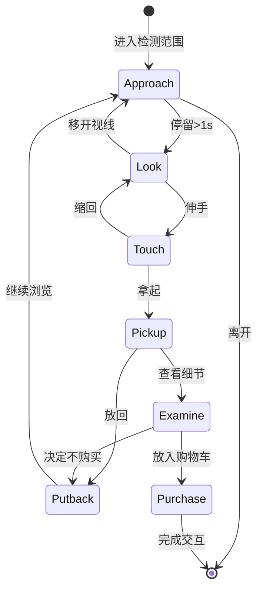
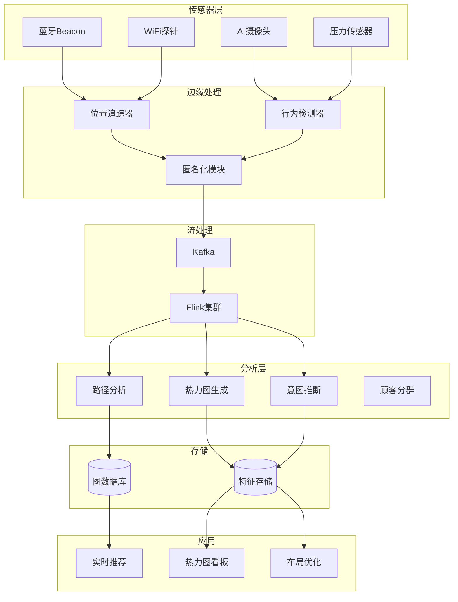
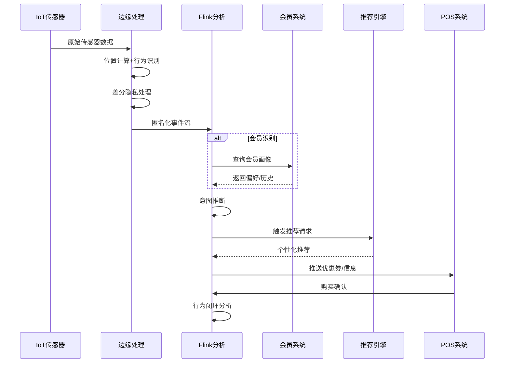
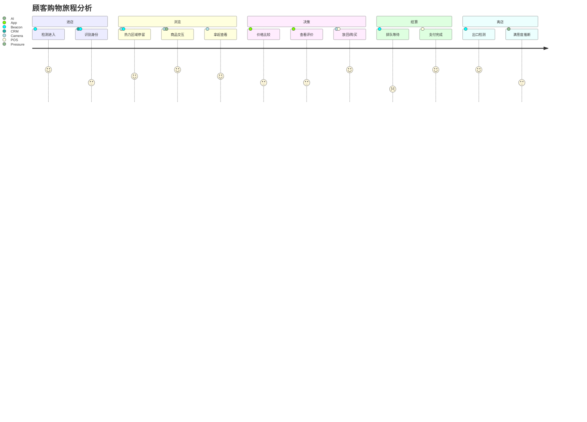
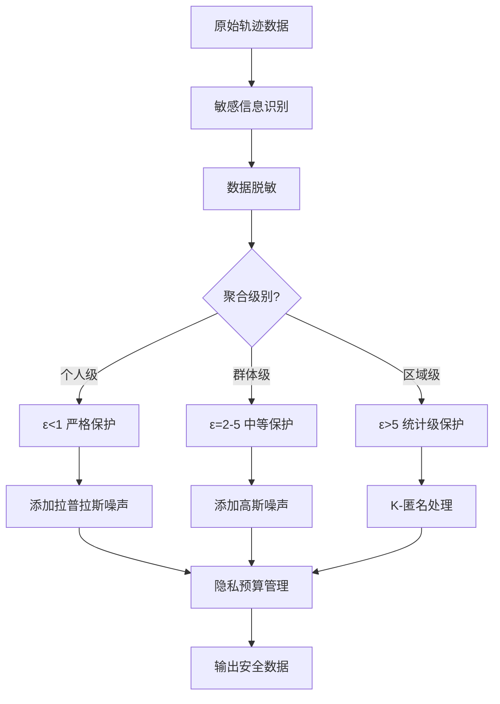
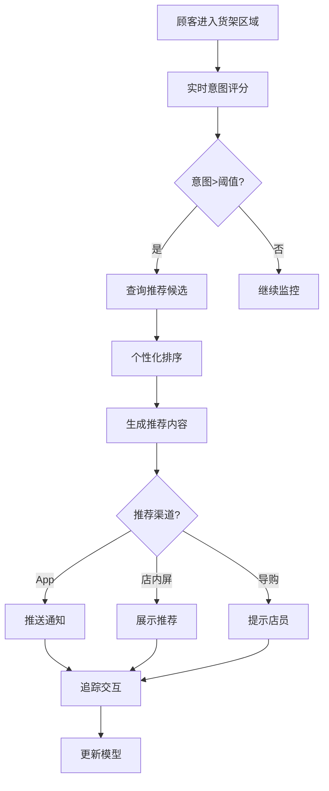
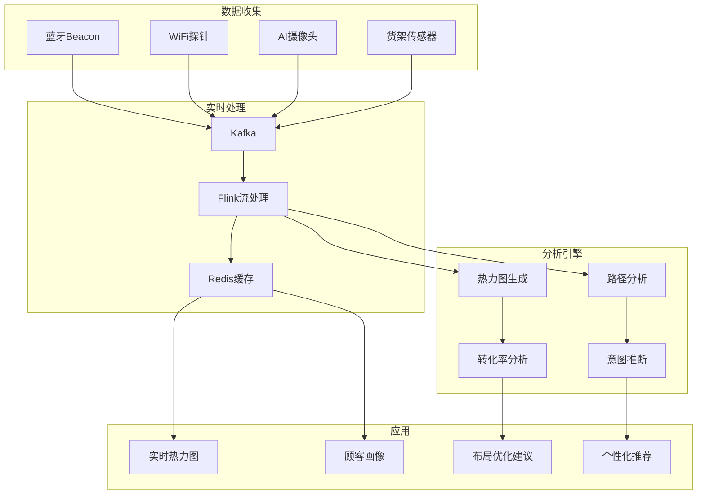
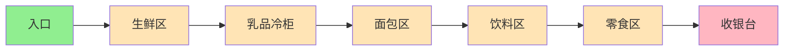
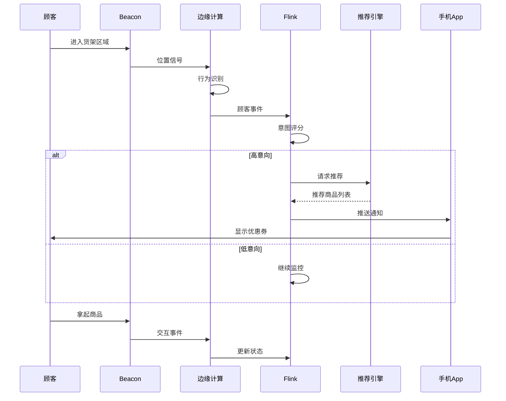

# Flink IoT 顾客行为实时分析

> **所属阶段**: Flink-IoT-Authority-Alignment/Phase-7-Smart-Retail
> **前置依赖**: [17-flink-iot-smart-retail-foundation.md](./17-flink-iot-smart-retail-foundation.md), [18-flink-iot-realtime-inventory-tracking.md](./18-flink-iot-realtime-inventory-tracking.md)
> **形式化等级**: L4 (工程严格性)
> **对标来源**: Intel "What Is a Smart Store"[^1], MediaTek Smart Retail Analytics[^2]

---

## 1. 概念定义 (Definitions)

本节建立顾客行为分析系统的形式化基础，定义购物路径模型、热力图生成算法等核心概念。

### 1.1 顾客购物路径模型

**定义 1.1 (顾客购物路径)** [Def-IoT-RTL-06]

**购物路径** $\Gamma_c$ 是顾客 $c$ 在商店内的轨迹序列：

$$\Gamma_c = \langle (s_1, t_1, \tau_1), (s_2, t_2, \tau_2), \ldots, (s_n, t_n, \tau_n) \rangle$$

其中每个路径点包含：

- $s_i \in S$: 货架/位置标识
- $t_i \in \mathbb{T}$: 到达时间
- $\tau_i = t_{i+1} - t_i$: 在位置 $s_i$ 的停留时间（$\tau_n$ 为离开时间）

**路径特征**:

**(1) 路径长度**: $len(\Gamma_c) = \sum_{i=1}^{n-1} d(s_i, s_{i+1})$，其中 $d(\cdot, \cdot)$ 是位置间距离

**(2) 购物时间**: $T_{shop} = t_n - t_1 + \tau_n$

**(3) 交互深度**: $depth(\Gamma_c) = \frac{\sum_{i} \mathbb{1}(\tau_i > \theta_{dwell})}{n}$，停留超过阈值的位置占比

**路径分类**:

| 类型 | 特征 | 示例 |
|------|------|------|
| 目标导向型 | $len$ 短，$depth$ 高，直达目标商品 | 买牛奶直奔乳品区 |
| 浏览型 | $len$ 长，$depth$ 低，遍历多个区域 | 周末悠闲购物 |
| 冲动型 | 路径随机，停留点分散 | 被促销吸引 |
| 任务型 | 路径可预测，时间固定 | 日常补货 |

### 1.2 热力图生成算法

**定义 1.2 (客流热力图)** [Def-IoT-RTL-07]

**热力图** $\mathcal{H}: G \times \mathbb{T} \rightarrow \mathbb{R}^+$ 将商店空间网格 $G$ 映射到客流强度：

$$\mathcal{H}(g, t) = \sum_{c \in C} K(g - \gamma_c(t))$$

其中：

- $G = \{g_{ij}\}$: 商店平面网格（如1m×1m单元格）
- $\gamma_c(t) \in \mathbb{R}^2$: 顾客 $c$ 在时间 $t$ 的二维坐标
- $K(\cdot)$: 核函数（如高斯核）

**高斯核函数**:

$$K(u) = \frac{1}{2\pi h^2} \exp\left(-\frac{\|u\|^2}{2h^2}\right)$$

其中 $h$ 是带宽参数，控制平滑程度。

**离散化热力图**:

对于时间窗口 $[t_1, t_2]$ 和网格单元 $g$：

$$\mathcal{H}(g, [t_1, t_2]) = \sum_{c \in C} \sum_{t \in [t_1, t_2]} \mathbb{1}(\gamma_c(t) \in g)$$

**热力图层级**:

| 层级 | 时间粒度 | 空间粒度 | 用途 |
|------|----------|----------|------|
| 实时 | 1分钟 | 1m×1m | 即时人员调配 |
| 小时级 | 1小时 | 区域级 | 班次优化 |
| 日级 | 1天 | 货架级 | 陈列优化 |
| 周级 | 1周 | 店级 | 营销策略 |

### 1.3 顾客交互事件模型

**定义 1.3 (货架交互事件)** [Def-IoT-RTL-08]

**交互事件** $e_{int} = (c, s, p, action, t, duration, confidence)$ 定义顾客与商品的互动：

- $action \in \mathcal{A} = \{approach, look, touch, pickup, examine, putback, purchase\}$
- $duration$: 交互持续时间(ms)
- $confidence \in [0, 1]$: 事件检测置信度

**交互状态机**:



### 1.4 顾客意图推断模型

**定义 1.4 (购物意图)** [Def-IoT-RTL-09]

**意图概率分布** $\mathcal{I}: C \times P \times \mathbb{T} \rightarrow [0, 1]$：

$$\mathcal{I}(c, p, t) = P(purchase_c(p) \mid \Gamma_c(t), H_c(t), Context(t))$$

其中：

- $\Gamma_c(t)$: 顾客 $c$ 到时间 $t$ 的路径
- $H_c(t)$: 交互历史
- $Context(t)$: 上下文（时间、促销、库存等）

**意图评分特征**:

| 特征 | 权重 | 计算方式 |
|------|------|----------|
| 接近次数 | 0.2 | 经过货架次数 |
| 停留时间 | 0.3 | 货架前总停留(ms) |
| 交互深度 | 0.3 | pickup/touch次数 |
| 历史购买 | 0.2 | 该品类购买频率 |

**意图评分**:

$$score(c, p) = \sum_{i} w_i \cdot f_i(c, p)$$

---

## 2. 属性推导 (Properties)

### 2.1 路径相似度度量

**引理 2.1 (路径编辑距离)** [Lemma-RTL-05]

对于两条路径 $\Gamma_1$ 和 $\Gamma_2$，定义编辑距离：

$$d_{edit}(\Gamma_1, \Gamma_2) = \min_{ops} \sum_{op \in ops} cost(op)$$

允许的操作：

- 插入: $cost(insert(s)) = d_{max}$
- 删除: $cost(delete(s)) = d_{max}$
- 替换: $cost(subst(s_1, s_2)) = d(s_1, s_2)$

**DTW动态时间规整距离**:

$$DTW(i, j) = d(\Gamma_1[i], \Gamma_2[j]) + \min\begin{cases}
DTW(i-1, j) \\
DTW(i, j-1) \\
DTW(i-1, j-1)
\end{cases}$$

**路径相似度**:

$$sim(\Gamma_1, \Gamma_2) = 1 - \frac{DTW(\Gamma_1, \Gamma_2)}{\max(len(\Gamma_1), len(\Gamma_2)) \cdot d_{max}}$$

### 2.2 热力图估计误差

**引理 2.2 (热力图采样误差)** [Lemma-RTL-06]

设传感器采样周期为 $\Delta t$，顾客移动速度为 $v$，则：

**(1) 位置估计误差**: $\epsilon_{pos} \leq v \cdot \Delta t$

**(2) 热力图计数误差**: 对于停留时间 $\tau$，计数误差为 $O(\frac{\Delta t}{\tau})$

**证明**:

- 在采样间隔 $\Delta t$ 内，顾客最大移动距离为 $v \cdot \Delta t$
- 对于停留时间 $\tau$，期望采样次数为 $\tau / \Delta t$
- 实际采样次数可能为 $\lfloor \tau / \Delta t \rfloor$ 或 $\lceil \tau / \Delta t \rceil$
- 相对误差 $\leq \Delta t / \tau$

**数值示例**: $v = 1m/s$, $\Delta t = 1s$, 则位置误差 $\leq 1m$。

对于 $\tau = 30s$ 的停留，计数误差 $< 3.3\%$。∎

### 2.3 隐私保护-效用权衡

**命题 2.3 (差分隐私边界)** [Prop-RTL-04]

应用 $(\epsilon, \delta)$-差分隐私后，热力图效用损失上界为：

$$\mathbb{E}[|\mathcal{H}_{true}(g) - \mathcal{H}_{DP}(g)|] \leq \frac{\Delta_f \cdot \sqrt{2\ln(1.25/\delta)}}{\epsilon \cdot n}$$

其中：
- $\Delta_f$: 查询敏感度（最大变化1人）
- $n$: 总顾客数
- $\epsilon$: 隐私预算

**证明**: 基于高斯机制，添加噪声 $\mathcal{N}(0, \sigma^2)$，其中 $\sigma = \Delta_f \cdot \sqrt{2\ln(1.25/\delta)} / \epsilon$。

噪声期望绝对值与 $\sigma$ 成正比，因此与 $n$ 成反比（归一化后）。∎

---

## 3. 关系建立 (Relations)

### 3.1 行为分析系统架构



### 3.2 与其他系统的数据流



### 3.3 顾客旅程映射



---

## 4. 工程论证 (Engineering Argument)

### 4.1 隐私保护机制

**差分隐私实现**:



**隐私预算分配**:

| 查询类型 | 预算分配 | 噪声规模 |
|----------|----------|----------|
| 实时热力图 | ε=0.5 | σ=2 |
| 小时级聚合 | ε=1.0 | σ=1 |
| 日级统计 | ε=2.0 | σ=0.5 |
| 周级趋势 | ε=5.0 | σ=0.2 |

**K-匿名实现**:

```sql
-- 轨迹K-匿名化
CREATE VIEW anonymized_trajectories AS
SELECT
    -- 空间泛化：1m精度降为5m网格
    FLOOR(location_x / 5) * 5 as grid_x,
    FLOOR(location_y / 5) * 5 as grid_y,
    -- 时间泛化：秒级降为分钟级
    DATE_TRUNC('minute', event_time) as time_bucket,
    -- 人口统计泛化
    CASE
        WHEN age < 18 THEN '<18'
        WHEN age < 30 THEN '18-29'
        WHEN age < 50 THEN '30-49'
        ELSE '50+'
    END as age_group,
    gender,
    COUNT(DISTINCT customer_id) as user_count
FROM raw_trajectories
GROUP BY
    FLOOR(location_x / 5) * 5,
    FLOOR(location_y / 5) * 5,
    DATE_TRUNC('minute', event_time),
    age_group,
    gender
HAVING COUNT(DISTINCT customer_id) >= 5;  -- K=5匿名
```

### 4.2 实时个性化推荐

**推荐流水线**:



**上下文感知推荐**:

| 上下文维度 | 信号 | 推荐策略 |
|------------|------|----------|
| 时间 | 早/中/晚 | 早餐/午餐/晚餐相关 |
| 位置 | 货架区域 | 关联商品 |
| 天气 | 晴/雨 | 季节性商品 |
| 库存 | 高/低 | 清库存/保利润 |
| 顾客 | 新/老 | 热销/个性化 |

**Flink SQL推荐引擎**:

```sql
-- 实时意图推断
CREATE VIEW customer_intent AS
SELECT
    customer_id,
    current_shelf_id,
    store_id,
    -- 路径特征
    path_length,
    unique_shelves_visited,
    -- 交互特征
    total_pickups,
    total_examine_time,
    -- 当前货架交互
    current_shelf_dwell_time,
    current_shelf_pickups,
    -- 意图评分（简化版）
    (
        current_shelf_dwell_time * 0.3 +
        current_shelf_pickups * 20.0 +
        total_examine_time * 0.001
    ) / 100.0 as intent_score,
    -- 高意向商品
    most_interacted_sku,
    event_time
FROM customer_behavior_features
WHERE event_time > NOW() - INTERVAL '5' MINUTE;

-- 高意向顾客触发推荐
CREATE VIEW high_intent_customers AS
SELECT
    ci.customer_id,
    ci.store_id,
    ci.current_shelf_id,
    ci.intent_score,
    ci.most_interacted_sku,
    -- 关联推荐商品
    rp.recommended_sku,
    rp.recommendation_reason,
    rp.confidence as rec_confidence,
    -- 最终推荐分数
    ci.intent_score * rp.confidence as final_score
FROM customer_intent ci
JOIN LATERAL (
    -- 基于协同过滤的关联推荐
    SELECT
        sku_b as recommended_sku,
        'frequently_bought_together' as recommendation_reason,
        lift as confidence
    FROM product_associations
    WHERE sku_a = ci.most_interacted_sku
    ORDER BY lift DESC
    LIMIT 3
) rp ON TRUE
WHERE ci.intent_score > 0.5;  -- 意向阈值
```

---

## 5. 实例验证 (Examples)

### 5.1 客流热力图实时生成

**Flink SQL实现**:

```sql
-- 顾客位置事件表
CREATE TABLE customer_positions (
    customer_id STRING,
    store_id STRING,
    position_x DECIMAL(5, 2),
    position_y DECIMAL(5, 2),
    zone_id STRING,
    signal_strength INT,
    detection_source STRING,  -- 'BEACON', 'WIFI', 'CAMERA'
    event_time TIMESTAMP(3),

    WATERMARK FOR event_time AS event_time - INTERVAL '3' SECOND
) WITH (
    'connector' = 'kafka',
    'topic' = 'customer-positions',
    'properties.bootstrap.servers' = 'kafka:9092',
    'format' = 'json'
);

-- 空间网格定义表
CREATE TABLE spatial_grid (
    grid_id STRING,
    store_id STRING,
    zone_id STRING,
    grid_x INT,
    grid_y INT,
    center_x DECIMAL(5, 2),
    center_y DECIMAL(5, 2),
    width_meters DECIMAL(3, 1),
    height_meters DECIMAL(3, 1),
    PRIMARY KEY (grid_id) NOT ENFORCED
) WITH (
    'connector' = 'jdbc',
    'url' = 'jdbc:postgresql://postgres:5432/retail_db',
    'table-name' = 'spatial_grid'
);

-- 实时热力图计算（1分钟窗口）
CREATE VIEW heatmap_minute AS
SELECT
    cp.store_id,
    sg.zone_id,
    sg.grid_x,
    sg.grid_y,
    sg.center_x,
    sg.center_y,
    TUMBLE_START(cp.event_time, INTERVAL '1' MINUTE) as window_start,
    TUMBLE_END(cp.event_time, INTERVAL '1' MINUTE) as window_end,
    COUNT(DISTINCT cp.customer_id) as unique_customers,
    COUNT(*) as total_detections,
    AVG(cp.signal_strength) as avg_signal_strength,
    -- 热力强度（归一化）
    COUNT(DISTINCT cp.customer_id) * 1.0 /
        MAX(COUNT(DISTINCT cp.customer_id)) OVER (
            PARTITION BY cp.store_id, TUMBLE(cp.event_time, INTERVAL '1' MINUTE)
        ) as heat_intensity
FROM customer_positions cp
JOIN spatial_grid sg
    ON cp.store_id = sg.store_id
    AND FLOOR(cp.position_x / sg.width_meters) * sg.width_meters = sg.center_x - sg.width_meters/2
    AND FLOOR(cp.position_y / sg.height_meters) * sg.height_meters = sg.center_y - sg.height_meters/2
GROUP BY
    cp.store_id,
    sg.zone_id,
    sg.grid_x,
    sg.grid_y,
    sg.center_x,
    sg.center_y,
    TUMBLE(cp.event_time, INTERVAL '1' MINUTE);

-- 输出到热力图存储
CREATE TABLE heatmap_output (
    store_id STRING,
    zone_id STRING,
    grid_x INT,
    grid_y INT,
    window_start TIMESTAMP(3),
    window_end TIMESTAMP(3),
    unique_customers BIGINT,
    heat_intensity DECIMAL(5, 4),
    PRIMARY KEY (store_id, zone_id, grid_x, grid_y, window_start) NOT ENFORCED
) WITH (
    'connector' = 'upsert-kafka',
    'topic' = 'heatmap-data',
    'properties.bootstrap.servers' = 'kafka:9092',
    'key.format' = 'json',
    'value.format' = 'json'
);

INSERT INTO heatmap_output
SELECT
    store_id, zone_id, grid_x, grid_y,
    window_start, window_end, unique_customers, heat_intensity
FROM heatmap_minute;

-- 区域级热力聚合（用于快速查询）
CREATE VIEW heatmap_zone_hourly AS
SELECT
    store_id,
    zone_id,
    DATE_FORMAT(window_start, 'yyyy-MM-dd HH:00:00') as hour,
    AVG(unique_customers) as avg_customers,
    MAX(unique_customers) as peak_customers,
    SUM(unique_customers) as total_customer_minutes,
    -- 拥堵等级
    CASE
        WHEN MAX(unique_customers) > 50 THEN 'HIGH'
        WHEN MAX(unique_customers) > 20 THEN 'MEDIUM'
        ELSE 'LOW'
    END as congestion_level
FROM heatmap_minute
GROUP BY
    store_id,
    zone_id,
    DATE_FORMAT(window_start, 'yyyy-MM-dd HH:00:00');
```

### 5.2 商品关联分析

```sql
-- 顾客购物篮分析（关联规则挖掘）
CREATE VIEW shopping_basket_analysis AS
WITH customer_sessions AS (
    SELECT
        customer_id,
        store_id,
        SESSION_START(event_time, INTERVAL '30' MINUTE) as session_start,
        SESSION_END(event_time, INTERVAL '30' MINUTE) as session_end,
        COLLECT_SET(sku) as basket_items
    FROM customer_shelf_interaction
    WHERE interaction_type IN ('PICKUP', 'PURCHASE')
    GROUP BY
        customer_id,
        store_id,
        SESSION(event_time, INTERVAL '30' MINUTE)
),
item_pairs AS (
    -- 生成商品对
    SELECT
        store_id,
        session_start as date,
        a.sku as sku_a,
        b.sku as sku_b,
        COUNT(*) as cooccurrence_count
    FROM customer_sessions cs
    CROSS JOIN UNNEST(cs.basket_items) AS T1(a)
    CROSS JOIN UNNEST(cs.basket_items) AS T2(b)
    WHERE a.sku < b.sku  -- 避免重复对
    GROUP BY store_id, session_start, a.sku, b.sku
),
item_support AS (
    -- 计算商品支持度
    SELECT
        store_id,
        DATE(event_time) as date,
        sku,
        COUNT(DISTINCT SESSION(event_time, INTERVAL '30' MINUTE)) as support_count
    FROM customer_shelf_interaction
    WHERE interaction_type IN ('PICKUP', 'PURCHASE')
    GROUP BY store_id, DATE(event_time), sku
),
total_sessions AS (
    SELECT
        store_id,
        DATE(session_start) as date,
        COUNT(*) as total_count
    FROM customer_sessions
    GROUP BY store_id, DATE(session_start)
)
SELECT
    ip.store_id,
    ip.date,
    ip.sku_a,
    p1.product_name as product_a_name,
    ip.sku_b,
    p2.product_name as product_b_name,
    ip.cooccurrence_count,
    -- 支持度
    ip.cooccurrence_count * 1.0 / ts.total_count as support,
    -- 置信度 A->B
    ip.cooccurrence_count * 1.0 / isa.support_count as confidence_a_to_b,
    -- 置信度 B->A
    ip.cooccurrence_count * 1.0 / isb.support_count as confidence_b_to_a,
    -- 提升度
    (ip.cooccurrence_count * 1.0 / ts.total_count) /
        ((isa.support_count * 1.0 / ts.total_count) * (isb.support_count * 1.0 / ts.total_count)) as lift
FROM item_pairs ip
JOIN item_support isa ON ip.store_id = isa.store_id AND ip.date = isa.date AND ip.sku_a = isa.sku
JOIN item_support isb ON ip.store_id = isb.store_id AND ip.date = isb.date AND ip.sku_b = isb.sku
JOIN total_sessions ts ON ip.store_id = ts.store_id AND ip.date = ts.date
JOIN product_master p1 ON ip.sku_a = p1.sku
JOIN product_master p2 ON ip.sku_b = p2.sku
WHERE ip.cooccurrence_count >= 10  -- 最小支持度过滤
ORDER BY lift DESC;
```

### 5.3 Dwell Time计算

```sql
-- 货架停留时间计算
CREATE VIEW shelf_dwell_time AS
WITH customer_shelf_sequence AS (
    SELECT
        customer_id,
        store_id,
        shelf_id,
        event_time,
        interaction_type,
        -- 获取下一次离开该货架的时间
        LEAD(event_time) OVER (
            PARTITION BY customer_id
            ORDER BY event_time
        ) as next_event_time,
        -- 获取下一个货架
        LEAD(shelf_id) OVER (
            PARTITION BY customer_id
            ORDER BY event_time
        ) as next_shelf_id,
        -- 行号用于会话检测
        ROW_NUMBER() OVER (
            PARTITION BY customer_id
            ORDER BY event_time
        ) as rn
    FROM customer_shelf_interaction
),
dwell_events AS (
    SELECT
        customer_id,
        store_id,
        shelf_id,
        event_time as entry_time,
        -- 如果下一个是不同货架，计算停留时间
        CASE
            WHEN shelf_id != next_shelf_id OR next_shelf_id IS NULL
            THEN next_event_time
            ELSE NULL
        END as exit_time,
        CASE
            WHEN shelf_id != next_shelf_id OR next_shelf_id IS NULL
            THEN TIMESTAMPDIFF(SECOND, event_time, next_event_time)
            ELSE NULL
        END as dwell_seconds
    FROM customer_shelf_sequence
)
SELECT
    customer_id,
    store_id,
    shelf_id,
    entry_time,
    exit_time,
    dwell_seconds,
    -- 停留类型分类
    CASE
        WHEN dwell_seconds < 5 THEN 'PASSING_BY'
        WHEN dwell_seconds < 30 THEN 'BRIEF_LOOK'
        WHEN dwell_seconds < 120 THEN 'INTERESTED'
        ELSE 'HIGHLY_ENGAGED'
    END as engagement_level
FROM dwell_events
WHERE dwell_seconds IS NOT NULL
  AND dwell_seconds > 0
  AND dwell_seconds < 1800;  -- 过滤异常值（超过30分钟）

-- 货架级停留时间统计
CREATE VIEW shelf_dwell_statistics AS
SELECT
    store_id,
    shelf_id,
    DATE(entry_time) as date,
    COUNT(*) as total_visits,
    AVG(dwell_seconds) as avg_dwell_seconds,
    PERCENTILE_CONT(0.5) WITHIN GROUP (ORDER BY dwell_seconds) as median_dwell,
    PERCENTILE_CONT(0.75) WITHIN GROUP (ORDER BY dwell_seconds) as p75_dwell,
    PERCENTILE_CONT(0.9) WITHIN GROUP (ORDER BY dwell_seconds) as p90_dwell,
    SUM(CASE WHEN engagement_level = 'HIGHLY_ENGAGED' THEN 1 ELSE 0 END) as highly_engaged_count,
    SUM(CASE WHEN engagement_level = 'INTERESTED' THEN 1 ELSE 0 END) as interested_count
FROM shelf_dwell_time
GROUP BY store_id, shelf_id, DATE(entry_time);

-- 关联停留与购买转化
CREATE VIEW dwell_to_conversion AS
SELECT
    sdt.store_id,
    sdt.shelf_id,
    sdt.customer_id,
    sdt.entry_time,
    sdt.dwell_seconds,
    sdt.engagement_level,
    CASE
        WHEN ce.event_time BETWEEN sdt.entry_time AND sdt.entry_time + INTERVAL '2' HOUR
             AND ce.interaction_type = 'PURCHASE'
        THEN 1
        ELSE 0
    END as converted,
    ce.sku as purchased_sku
FROM shelf_dwell_time sdt
LEFT JOIN customer_shelf_interaction ce
    ON sdt.customer_id = ce.customer_id
    AND ce.interaction_type = 'PURCHASE'
    AND ce.event_time BETWEEN sdt.entry_time AND sdt.entry_time + INTERVAL '2' HOUR;
```

---

## 6. 可视化 (Visualizations)

### 6.1 顾客行为分析架构



### 6.2 购物路径分析



### 6.3 实时个性化推荐流程



---

## 7. 引用参考 (References)

[^1]: Intel, "What Is a Smart Store? Customer Analytics in Modern Retail", 2025. https://www.intel.com/content/www/us/en/retail/customer-analytics.html

[^2]: MediaTek, "Smart Retail Analytics: Understanding Shopper Behavior", 2026.

[^3]: Dwork, C. & Roth, A., "The Algorithmic Foundations of Differential Privacy", Foundations and Trends in Theoretical Computer Science, 2014.

[^4]: Larson, J.S. et al., "Shopper Marketing: How to Increase Purchase Decisions at the Point of Sale", Wiley, 2025.

[^5]: Apache Flink Documentation, "Session Windows", 2025. https://nightlies.apache.org/flink/flink-docs-stable/docs/dev/datastream/operators/windows/

---

**文档信息**
- 版本: v1.0
- 创建日期: 2026-04-05
- 作者: Flink-IoT-Authority-Alignment Team
- 审核状态: 待审核
