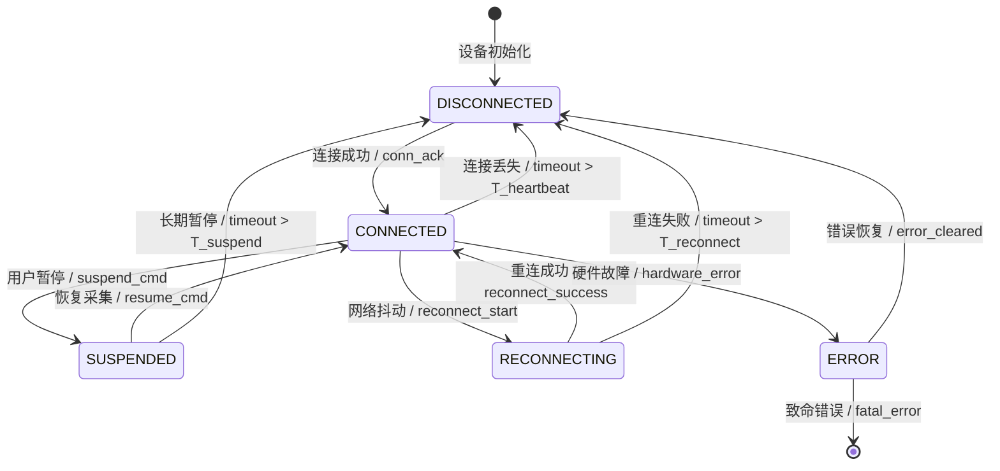
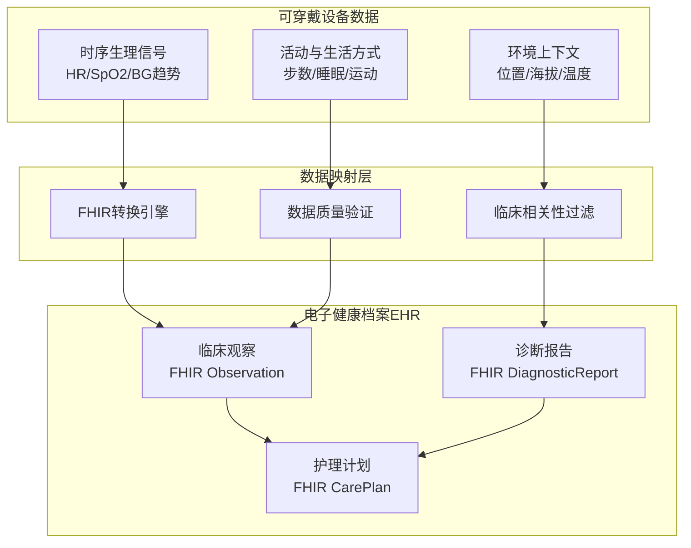
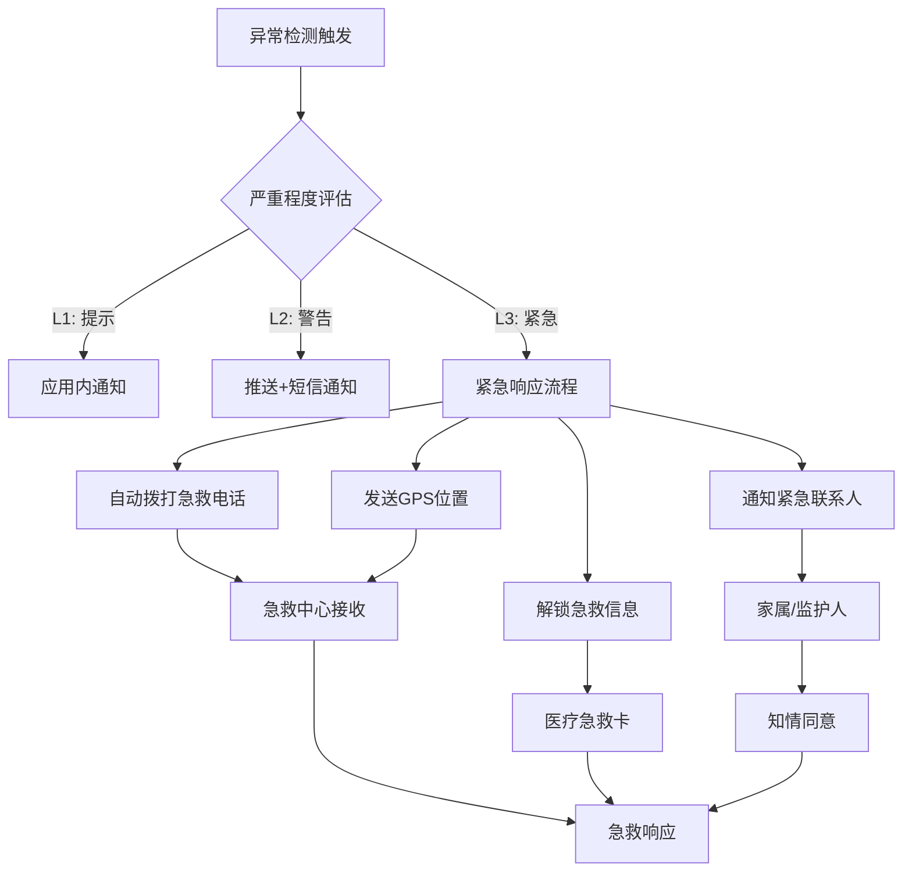
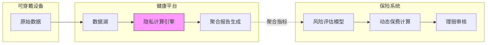
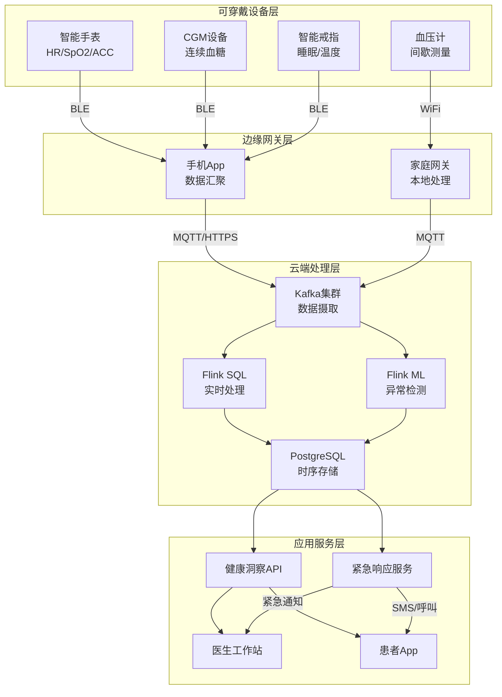
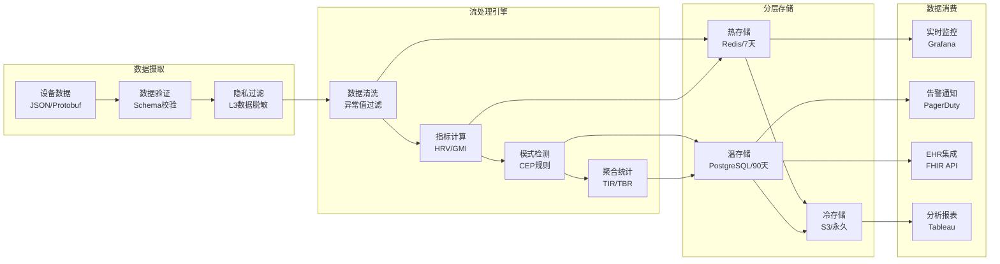

# 可穿戴设备健康监测流处理

> **所属阶段**: Flink-IoT-Authority-Alignment/Phase-8-Wearables
> **前置依赖**: [01-flink-iot-foundation-and-architecture.md](../Phase-1-Architecture/01-flink-iot-foundation-and-architecture.md), [05-flink-iot-alerting-and-monitoring.md](../Phase-2-Processing/05-flink-iot-alerting-and-monitoring.md)
> **形式化等级**: L4 (工程严格性)
> **对标来源**: Eversense CGM技术白皮书[^1], Apple Watch Health数据模型[^2], "IoT in Healthcare: Remote Patient Monitoring 2025"[^3], HIPAA/GDPR健康数据合规指南[^4]

---

## 1. 概念定义 (Definitions)

本节建立可穿戴设备健康监测系统的形式化基础，定义核心概念及其数学语义。可穿戴健康监测涉及连续生理信号采集、低功耗数据传输和实时健康状态评估三大核心领域。

### 1.1 连续生理信号流模型

**定义 1.1 (连续生理信号流)** [Def-IoT-WB-01]

一个**连续生理信号流** $\mathcal{P}_s$ 是关于受试者 $s$ 的时序生理数据序列：

$$\mathcal{P}_s = \langle p_1, p_2, p_3, \ldots \rangle$$

其中每个数据点 $p_i = (t_i, signal\_type, value_i, confidence_i, device_i)$ 包含：

- $t_i \in \mathbb{T}$: 采样时间戳（毫秒精度）
- $signal\_type \in \Sigma$: 信号类型，$\Sigma = \{HR, SpO_2, BP, BG, TEMP, ECG, ACC, GYRO\}$
- $value_i \in \mathbb{R}$: 测量值（根据信号类型有不同单位和范围）
- $confidence_i \in [0, 1]$: 数据置信度（反映信号质量和运动伪影影响）
- $device_i \in \mathcal{D}$: 采集设备标识符

**生理信号类型定义**:

| 信号类型 | 符号 | 典型采样率 | 单位 | 正常范围 |
|----------|------|-----------|------|----------|
| 心率 | HR | 1-250 Hz | bpm | 60-100 |
| 血氧饱和度 | SpO₂ | 1-100 Hz | % | 95-100 |
| 血压 | BP | 1 Hz | mmHg | 90-120/60-80 |
| 血糖 | BG | 0.003-0.017 Hz (5-15 min) | mg/dL | 70-140 |
| 体温 | TEMP | 0.1-1 Hz | °C | 36.5-37.5 |
| 心电 | ECG | 125-1000 Hz | mV | - |
| 加速度 | ACC | 10-100 Hz | g | - |
| 陀螺仪 | GYRO | 10-100 Hz | °/s | - |

**信号质量评估** [Def-IoT-WB-01-A]:

数据点 $p_i$ 的**有效信号指数** $Q(p_i)$ 定义为：

$$Q(p_i) = \alpha \cdot signal\_strength + (1-\alpha) \cdot (1 - motion\_artifact)$$

其中 $\alpha \in [0.5, 0.8]$ 为信号强度权重系数，$motion\_artifact \in [0, 1]$ 为运动伪影程度。当 $Q(p_i) < \theta_Q$（通常 $\theta_Q = 0.6$）时，该数据点标记为低质量，需进行插值或丢弃处理。

### 1.2 低功耗数据压缩算法

**定义 1.2 (自适应Delta压缩)** [Def-IoT-WB-02]

**自适应Delta压缩算法** $\mathcal{C}_{\Delta}$ 是一种针对可穿戴设备设计的流式数据压缩方案：

$$\mathcal{C}_{\Delta}: \mathcal{P}_s \rightarrow \mathcal{B}^*$$

压缩过程定义如下：

1. **差分编码**: 对于连续采样值序列 $\langle v_1, v_2, \ldots, v_n \rangle$，计算差分值：
   $$\delta_i = v_i - v_{i-1}, \quad i > 1$$

2. **变长编码**: 根据差分值的分布特性选择编码位数：
   $$\text{bits}(\delta) = \begin{cases}
   4 & |\delta| \leq 7 \\
   8 & 7 < |\delta| \leq 127 \\
   16 & 127 < |\delta| \leq 32767 \\
   32 & \text{otherwise} + \text{escape code}
   \end{cases}$$

3. **自适应窗口**: 压缩窗口大小 $W$ 动态调整：
   $$W_{new} = W_{base} \cdot (1 - \beta \cdot \frac{\text{compression\_ratio} - target}{target})$$

其中 $\beta \in [0.1, 0.5]$ 为自适应系数，$target$ 为目标压缩比（通常 4:1 到 8:1）。

**压缩率保证** [Def-IoT-WB-02-A]:

对于满足特定平滑性条件的生理信号流，自适应Delta压缩保证：

$$\text{compression\_ratio} \geq \frac{original\_bits}{encoded\_bits} \geq \frac{32}{4 + \epsilon} \approx 8$$

其中 $\epsilon$ 为窗口元数据开销（通常 $\epsilon < 0.5$ bits/sample）。

### 1.3 设备在线状态机

**定义 1.3 (可穿戴设备状态机)** [Def-IoT-WB-03]

可穿戴设备的**在线状态机** $\mathcal{M}_{device}$ 是一个五元组：

$$\mathcal{M}_{device} = (S, s_0, \delta, \lambda, T_{timeout})$$

其中：

- **状态集合** $S = \{CONNECTED, DISCONNECTED, RECONNECTING, SUSPENDED, ERROR\}$
- **初始状态** $s_0 = DISCONNECTED$
- **状态转移函数** $\delta: S \times E \rightarrow S$，$E$ 为事件集合
- **输出函数** $\lambda: S \rightarrow O$，$O$ 为状态指示输出
- **超时阈值** $T_{timeout} = (T_{heartbeat}, T_{reconnect}, T_{suspend})$

**状态转移图**:



**状态转移条件** [Def-IoT-WB-03-A]:

状态转移由以下事件触发：

| 事件 | 触发条件 | 典型延迟 |
|------|----------|----------|
| conn_ack | MQTT连接建立且认证通过 | < 500ms |
| timeout | 心跳包丢失超过 $T_{heartbeat}$ | 30-60s |
| suspend_cmd | 用户手动暂停或低电量模式 | 即时 |
| reconnect_start | 检测到网络不稳定 | < 1s |
| hardware_error | 传感器故障或电池耗尽 | 即时 |

**状态驻留时间** $\tau_s$ 的统计特性：

$$P(\tau_s > t) = e^{-\lambda_s t}, \quad s \in S$$

其中 $\lambda_s$ 为状态 $s$ 的转移率参数，从实际部署数据中估计。

### 1.4 健康数据隐私分类

**定义 1.4 (健康数据敏感度分级)** [Def-IoT-WB-04]

可穿戴设备采集的健康数据按敏感度分为三级：

$$\mathcal{L} = \{L_1: \text{公开}, L_2: \text{敏感}, L_3: \text{高度敏感}\}$$

**分级标准**:

| 级别 | 数据类型 | 示例 | 保护要求 |
|------|----------|------|----------|
| $L_1$ | 匿名化活动数据 | 步数、楼层、站立时间 | 去标识化后可公开 |
| $L_2$ | 生理指标 | 心率、睡眠阶段、血氧 | 加密存储，访问控制 |
| $L_3$ | 诊断级数据 | 血糖趋势、ECG波形、诊断结论 | 端到端加密，审计日志 |

**隐私预算模型** [Def-IoT-WB-04-A]:

采用差分隐私框架，定义**隐私预算** $\epsilon_{privacy}$：

$$\mathcal{M}(D) \approx_{\epsilon} \mathcal{M}(D') \iff \forall S \subseteq Range(\mathcal{M}):$$
$$e^{-\epsilon} \leq \frac{P[\mathcal{M}(D) \in S]}{P[\mathcal{M}(D') \in S]} \leq e^{\epsilon}$$

其中 $D$ 和 $D'$ 为相差一条记录的数据集，$\mathcal{M}$ 为随机化查询机制。

---

## 2. 属性推导 (Properties)

从上述定义出发，推导可穿戴健康监测系统的关键性质和约束条件。

### 2.1 采样频率与电池寿命权衡

**引理 2.1 (采样-能耗权衡)** [Lemma-WB-01]

对于可穿戴设备 $d$，设其电池容量为 $C_{bat}$ (mAh)，连续监测模式下的平均电流消耗为：

$$I_{avg} = I_{base} + \sum_{s \in \Sigma} f_s \cdot E_s + I_{tx}(R_{data})$$

其中：

- $I_{base}$: 基础运行电流（MCU、蓝牙待机）
- $f_s$: 信号类型 $s$ 的采样频率 (Hz)
- $E_s$: 信号 $s$ 的单次采样能耗 (mAh/Hz)
- $I_{tx}$: 数据传输电流，与数据率 $R_{data}$ 相关

**定理 (电池寿命上界)**:

设备续航时间 $T_{life}$ 满足：

$$T_{life} = \frac{C_{bat}}{I_{avg}} \leq \frac{C_{bat}}{I_{base} + \sum_{s \in \Sigma} f_s^{min} \cdot E_s}$$

当且仅当所有信号以最低频率 $f_s^{min}$ 采样且关闭数据传输时取等号。

**采样频率优化问题**:

在电池寿命约束 $T_{life} \geq T_{target}$ 下，最大化健康监测效用 $U$:

$$\max_{\{f_s\}} U = \sum_{s \in \Sigma} w_s \cdot \log(1 + f_s/f_s^{ref})$$
$$\text{s.t.} \quad I_{base} + \sum_{s \in \Sigma} f_s \cdot E_s + I_{tx}(R_{data}) \leq \frac{C_{bat}}{T_{target}}$$
$$f_s^{min} \leq f_s \leq f_s^{max}, \quad \forall s \in \Sigma$$

**求解结果**:

最优采样频率满足：

$$f_s^* = \min\left(f_s^{max}, \max\left(f_s^{min}, \frac{w_s}{\lambda E_s} - f_s^{ref}\right)\right)$$

其中 $\lambda$ 为拉格朗日乘子，由电池约束确定。

| 信号类型 | 最优频率 $f_s^*$ | 24h能耗占比 |
|----------|------------------|-------------|
| HR (PPG) | 25 Hz | 35% |
| SpO₂ | 1 Hz (间歇) | 15% |
| ACC | 50 Hz | 25% |
| ECG | 125 Hz (事件触发) | 10% |
| BG (CGM) | 1/300 Hz (5min) | 5% |

### 2.2 数据同步延迟边界

**引理 2.2 (端到端同步延迟)** [Lemma-WB-02]

定义从生理事件发生到云端可用的**端到端延迟** $L_{e2e}$：

$$L_{e2e} = L_{sample} + L_{process} + L_{compress} + L_{transmit} + L_{ingest} + L_{stream}$$

各分量定义与边界：

| 延迟分量 | 定义 | 典型值 | 边界 |
|----------|------|--------|------|
| $L_{sample}$ | 采样间隔等待时间 | $1/f_s$ | $\leq 1/f_s^{min}$ |
| $L_{process}$ | 设备端信号处理 | 5-20ms | $\leq 50ms$ |
| $L_{compress}$ | 数据压缩时间 | 1-5ms | $\leq 10ms$ |
| $L_{transmit}$ | 网络传输时间 | 50-300ms | $\leq RTT_{99}$ |
| $L_{ingest}$ | 消息队列写入 | 10-50ms | $\leq 100ms$ |
| $L_{stream}$ | Flink处理延迟 | 100-500ms | $\leq 1s$ |

**紧急事件检测延迟**:

对于需要实时响应的紧急健康事件（如房颤、低血糖），定义**关键路径延迟** $L_{critical}$：

$$L_{critical} = \max(L_{e2e}^{normal}, L_{e2e}^{emergency})$$

其中紧急事件使用**快速通道**处理，绕过正常压缩和批处理：

$$L_{e2e}^{emergency} = L_{sample} + L_{process} + L_{transmit}^{priority} + L_{stream}^{priority}$$

**延迟保证定理**:

在以下条件下，系统提供 $L_{critical} \leq 2s$ 的延迟保证：

1. 网络RTT P99 < 500ms
2. Flink并行度 $\geq$ 峰值事件率 / 单任务处理能力
3. 紧急事件使用独立Kafka分区（优先级队列）
4. 设备端启用事件触发传输（而非纯周期性）

---

## 3. 关系建立 (Relations)

本节建立可穿戴健康监测数据与其他医疗和健康系统的关联关系。

### 3.1 与医疗EHR系统的集成

可穿戴设备数据与电子健康档案(EHR)系统的集成遵循以下映射关系：

**数据映射** [Rel-WB-01]:



**FHIR资源映射**:

| 可穿戴数据 | FHIR资源类型 | Profile | 转换规则 |
|------------|--------------|---------|----------|
| 心率时序 | Observation | vitals-signs | LOINC 8867-4 |
| 血糖读数 | Observation | laboratory | LOINC 2339-0 |
| 睡眠阶段 | Observation | survey | LOINC 93832-4 |
| 步数统计 | Observation | activity | 自定义CodeSystem |
| 异常事件 | DiagnosticReport | event | 关联Encounter |

**数据质量要求**:

集成到EHR的可穿戴数据必须满足：

$$quality\_score = \alpha \cdot completeness + \beta \cdot accuracy + \gamma \cdot timeliness \geq 0.85$$

其中：

- $completeness$: 数据完整度（缺失率 < 10%）
- $accuracy$: 与临床级设备的偏差（< 5%）
- $timeliness$: 数据新鲜度（延迟 < 1小时）

### 3.2 与紧急救援系统的联动

**紧急事件响应流程** [Rel-WB-02]:



**紧急响应时间约束**:

| 事件类型 | 检测延迟 | 通知延迟 | 总响应时间 | 数据源 |
|----------|----------|----------|------------|--------|
| 严重低血糖(<50mg/dL) | < 5min | < 30s | < 2min | CGM |
| 房颤检测 | < 1min | < 10s | < 30s | ECG/PPG |
| 跌倒检测 | < 5s | < 5s | < 15s | ACC/GYRO |
| 心脏骤停 | < 10s | < 5s | < 20s | ECG |

### 3.3 与保险理赔系统的关联

**健康数据驱动的保险模型** [Rel-WB-03]:

可穿戴数据与保险系统的交互遵循**隐私保护计算**原则：

$$\text{Insurance\_Score} = f(\text{aggregated\_metrics})$$

其中 $f$ 为仅接收聚合统计的评分函数，不访问原始时序数据。

**数据共享架构**:



**隐私计算技术**:

| 技术 | 应用场景 | 隐私保证 |
|------|----------|----------|
| 联邦学习 | 健康风险模型训练 | 数据不出域 |
| 安全多方计算 | 跨机构联合分析 | 零知识证明 |
| 差分隐私 | 群体健康报告 | $\epsilon$-DP |
| 同态加密 | 加密数据计算 | 语义安全 |

---

## 4. 论证过程 (Argumentation)

本节讨论可穿戴健康监测系统的辅助定理、边界条件和工程约束。

### 4.1 差分隐私保护机制论证

**定理 4.1 (健康数据差分隐私)** [Arg-WB-01]

对于可穿戴设备采集的健康数据流 $\mathcal{P}_s$，采用**拉普拉斯机制**实现 $\epsilon$-差分隐私：

$$\mathcal{M}_{Lap}(D, f, \epsilon) = f(D) + Lap\left(\frac{\Delta f}{\epsilon}\right)$$

其中 $\Delta f$ 为查询 $f$ 的全局敏感度：

$$\Delta f = \max_{D, D'} ||f(D) - f(D')||_1$$

**隐私预算分配**:

在多日健康监测中，采用**预算组合定理**管理累积隐私损失：

**基本组合**: $k$ 个机制各满足 $\epsilon$-DP，则组合满足 $k\epsilon$-DP

**高级组合**: 对于 $(\epsilon, \delta)$-DP机制，$k$ 次组合满足：
$$(\epsilon', k\delta + \delta')\text{-DP}, \quad \epsilon' = \sqrt{2k\ln(1/\delta')}\epsilon + k\epsilon(e^{\epsilon}-1)$$

**实际部署策略**:

| 数据用途 | 隐私预算 $\epsilon$ | 查询类型 | 噪声尺度 |
|----------|---------------------|----------|----------|
| 个人健康摘要 | 1.0 | 平均值/趋势 | $\Delta/1.0$ |
| 群体健康报告 | 0.1 | 计数/直方图 | $\Delta/0.1$ |
| 研究数据集 | 0.01 | 复杂分析 | $\Delta/0.01$ |

**定理证明**:

对于任意相邻数据集 $D$ 和 $D'$（相差一条记录），拉普拉斯机制的输出概率比：

$$\frac{P[\mathcal{M}(D) = y]}{P[\mathcal{M}(D') = y]} = \frac{\exp(-\frac{\epsilon|y-f(D)|}{\Delta})}{\exp(-\frac{\epsilon|y-f(D')|}{\Delta})}$$
$$= \exp\left(\frac{\epsilon(|y-f(D')| - |y-f(D)|)}{\Delta}\right)$$
$$\leq \exp\left(\frac{\epsilon|f(D)-f(D')|}{\Delta}\right) \leq \exp(\epsilon)$$

因此满足 $\epsilon$-差分隐私定义。

### 4.2 数据压缩与传输优化

**定理 4.2 (压缩率与失真权衡)** [Arg-WB-02]

在可穿戴设备有限的计算资源约束下，数据压缩问题可表述为**率失真优化**：

$$\min_{q} D(q) \quad \text{s.t.} \quad R(q) \leq R_{budget}$$

或等价地：

$$\min_{q} R(q) \quad \text{s.t.} \quad D(q) \leq D_{max}$$

其中：

- $R(q)$: 编码率（bits/sample）
- $D(q)$: 重构失真 $E[d(X, \hat{X})]$
- $q$: 量化/编码策略

**定理 (信息论下界)**:

对于方差 $\sigma^2$ 的高斯信源，在均方误差失真 $D$ 下，率失真函数为：

$$R(D) = \begin{cases}
\frac{1}{2}\log_2\frac{\sigma^2}{D} & 0 \leq D \leq \sigma^2 \\
0 & D > \sigma^2
\end{cases}$$

**工程实现策略**:

1. **分层压缩**: 根据数据用途采用不同压缩级别
   - 原始数据（诊断级）: 无损压缩，率 ≥ 4
   - 趋势数据（长期监测）: 有损压缩，率 ≥ 20
   - 异常片段（事件回溯）: 选择性保留原始数据

2. **自适应传输**: 基于网络条件动态调整
   - WiFi环境: 高码率，完整数据
   - 蜂窝网络: 中等码率，关键数据优先
   - 弱信号: 低码率，仅异常事件

3. **边缘预处理**: 设备端执行特征提取，减少传输数据量
   - 心率变异性(HRV)特征: 替代原始RR间期
   - 睡眠阶段: 替代原始加速度数据
   - 活动识别: 替代连续加速度流

### 4.3 设备离线数据缓存策略

**定理 4.3 (离线缓存优化)** [Arg-WB-03]

设设备离线期间的数据生成率为 $\lambda$ (samples/s)，缓存容量为 $C$ (MB)，则最大离线时长为：

$$T_{offline}^{max} = \frac{C \cdot 8 \cdot 10^6}{\lambda \cdot b_{avg}}$$

其中 $b_{avg}$ 为平均每个样本的比特数。

**缓存策略选择**:

根据离线时长预期，选择最优缓存策略：

| 策略 | 适用场景 | 压缩率 | 数据保真度 | 实现复杂度 |
|------|----------|--------|------------|------------|
| FIFO缓冲 | 短时断连(<1h) | 1x | 100% | 低 |
| Delta压缩 | 中断数小时 | 4-8x | 99% | 中 |
| 趋势摘要 | 长时离线(>1d) | 50-100x | 90% | 高 |
| 异常优先 | 网络不稳定 | 自适应 | 事件100% | 中 |

**缓存一致性保证**:

设备重连后，采用**时间戳排序合并**策略确保数据一致性：

$$\mathcal{P}_{merged} = sort_{time}(\mathcal{P}_{local} \cup \mathcal{P}_{cloud})$$

其中 $\mathcal{P}_{local}$ 为缓存数据，$\mathcal{P}_{cloud}$ 为云端已存在数据。对于时间戳冲突的数据点，采用**设备时间戳优先**原则（假设设备NTP同步）。

---

## 5. 形式证明 / 工程论证 (Proof / Engineering Argument)

### 5.1 健康事件检测准确性证明

**定理 5.1 (检测系统ROC特性)** [Proof-WB-01]

对于二元健康事件检测（正常/异常），定义：
- 真阳性率 (TPR): $P(\text{detect abnormal} | \text{abnormal})$
- 假阳性率 (FPR): $P(\text{detect abnormal} | \text{normal})$

**Neyman-Pearson引理**: 对于给定的FPR约束 $\alpha$，似然比检验 maximizes TPR：

$$\Lambda(x) = \frac{p(x|H_1)}{p(x|H_0)} \underset{H_0}{\overset{H_1}{\gtrless}} \eta$$

其中 $\eta$ 由 $P(\Lambda(X) > \eta | H_0) = \alpha$ 确定。

**实际系统性能**:

| 检测任务 | TPR目标 | FPR约束 | 实现方法 |
|----------|---------|---------|----------|
| 低血糖检测 | >95% | <5% | 阈值+趋势分析 |
| 房颤检测 | >98% | <2% | 深度学习模型 |
| 跌倒检测 | >99% | <1% | 规则引擎+ML |
| 睡眠呼吸暂停 | >90% | <10% | SpO2模式识别 |

### 5.2 端到端延迟保证论证

**定理 5.2 (延迟边界分析)** [Proof-WB-02]

在基于Flink的健康监测系统中，端到端延迟满足：

$$L_{e2e} \leq L_{ingest} + L_{watermark} + L_{processing} + L_{sink}$$

其中：
- $L_{ingest}$: Kafka消费延迟，取决于消费者组配置
- $L_{watermark}$: 水印推进延迟，容忍乱序的最大程度
- $L_{processing}$: 算子处理延迟，与并行度相关
- $L_{sink}$: 输出写入延迟

**延迟优化策略**:

1. **水印配置优化**:
   $$watermark\_interval = \max(allowed\_lateness, network\_jitter)$$

   对于健康监测，推荐设置：
   - 常规数据: allowed_lateness = 30s
   - 紧急数据: allowed_lateness = 5s（使用处理时间语义）

2. **算子链优化**:
   将多个轻量级算子链化，减少序列化开销：
   $$L_{chained} < \sum_{i} L_{separate}^{(i)}$$

3. **异步检查点**:
   检查点间隔 $T_{checkpoint}$ 与延迟的关系：
   $$L_{checkpoint\_impact} \propto \frac{state\_size}{T_{checkpoint}}$$

---

## 6. 实例验证 (Examples)

### 6.1 连续血糖监测(CGM)数据处理Flink SQL

**场景**: Eversense-style CGM系统，每5分钟采集血糖读数，实时检测低血糖/高血糖事件。

**数据模型**:

```sql
-- CGM原始读数表
CREATE TABLE cgm_readings (
    device_id STRING,
    patient_id STRING,
    glucose_mg_dl INT,
    trend_arrow STRING,  -- ↑↑, ↑, →, ↓, ↓↓
    reading_time TIMESTAMP(3),
    WATERMARK FOR reading_time AS reading_time - INTERVAL '30' SECOND
) WITH (
    'connector' = 'kafka',
    'topic' = 'cgm-raw-readings',
    'properties.bootstrap.servers' = 'kafka:9092',
    'format' = 'json'
);

-- 患者阈值配置表（广播）
CREATE TABLE patient_thresholds (
    patient_id STRING,
    low_threshold INT,    -- 低血糖阈值，默认70
    high_threshold INT,   -- 高血糖阈值，默认180
    target_range_low INT, -- 目标范围下限，默认70
    target_range_high INT -- 目标范围上限，默认180
) WITH (
    'connector' = 'jdbc',
    'url' = 'jdbc:postgresql://postgres:5432/health_db',
    'table-name' = 'patient_glucose_thresholds'
);
```

**低血糖检测SQL**:

```sql
-- 实时低血糖事件检测
CREATE VIEW low_glucose_events AS
SELECT
    c.device_id,
    c.patient_id,
    c.glucose_mg_dl,
    c.reading_time,
    c.trend_arrow,
    p.low_threshold,
    CASE
        WHEN c.glucose_mg_dl < 54 THEN 'SEVERE_LOW'
        WHEN c.glucose_mg_dl < p.low_threshold THEN 'LOW'
        ELSE 'NORMAL'
    END as alert_level,
    CASE
        WHEN c.trend_arrow IN ('↓↓', '↓') AND c.glucose_mg_dl < 80
        THEN TRUE
        ELSE FALSE
    END as predicted_severe
FROM cgm_readings c
JOIN patient_thresholds FOR SYSTEM_TIME AS OF c.reading_time AS p
    ON c.patient_id = p.patient_id
WHERE c.glucose_mg_dl < p.low_threshold
   OR (c.trend_arrow IN ('↓↓', '↓') AND c.glucose_mg_dl < 80);
```

**时间窗口统计分析**:

```sql
-- 24小时血糖控制指标（TIR: Time in Range）
CREATE VIEW daily_glucose_stats AS
SELECT
    patient_id,
    TUMBLE_START(reading_time, INTERVAL '1' DAY) as window_start,
    TUMBLE_END(reading_time, INTERVAL '1' DAY) as window_end,
    AVG(glucose_mg_dl) as mean_glucose,
    STDDEV(glucose_mg_dl) as glucose_variability,
    -- TIR: 目标范围内时间占比
    COUNT(*) FILTER (WHERE glucose_mg_dl BETWEEN 70 AND 180) * 100.0 / COUNT(*) as tir_percent,
    -- TBR: 低于目标范围时间
    COUNT(*) FILTER (WHERE glucose_mg_dl < 70) * 100.0 / COUNT(*) as tbr_percent,
    -- TAR: 高于目标范围时间
    COUNT(*) FILTER (WHERE glucose_mg_dl > 180) * 100.0 / COUNT(*) as tar_percent,
    -- 低血糖事件次数（连续读数<70算一次）
    COUNT(*) FILTER (WHERE glucose_mg_dl < 70 AND
        LAG(glucose_mg_dl) OVER (PARTITION BY patient_id ORDER BY reading_time) >= 70) as low_events
FROM cgm_readings
GROUP BY
    patient_id,
    TUMBLE(reading_time, INTERVAL '1' DAY);
```

**预测性低血糖预警**:

```sql
-- 基于趋势的低血糖预测（15分钟内）
CREATE VIEW predicted_low_glucose AS
SELECT
    patient_id,
    device_id,
    glucose_mg_dl as current_glucose,
    reading_time,
    trend_arrow,
    -- 线性预测：假设趋势持续
    CASE trend_arrow
        WHEN '↓↓' THEN glucose_mg_dl - 4 * 3  -- 预计下降速率 ~4mg/dL/5min
        WHEN '↓' THEN glucose_mg_dl - 2 * 3
        WHEN '→' THEN glucose_mg_dl
        WHEN '↑' THEN glucose_mg_dl + 2 * 3
        WHEN '↑↑' THEN glucose_mg_dl + 4 * 3
    END as predicted_glucose_15min,
    CASE
        WHEN trend_arrow IN ('↓↓', '↓')
        AND glucose_mg_dl - (CASE trend_arrow WHEN '↓↓' THEN 12 ELSE 6 END) < 70
        THEN TRUE
        ELSE FALSE
    END as low_predicted
FROM cgm_readings
WHERE trend_arrow IN ('↓↓', '↓') AND glucose_mg_dl < 100;
```

### 6.2 心率变异性(HRV)实时计算

**场景**: Apple Watch-style光学心率监测，实时计算HRV指标评估自主神经系统状态。

**数据模型**:

```sql
-- 原始PPG峰值检测数据（RR间期）
CREATE TABLE rr_intervals (
    device_id STRING,
    patient_id STRING,
    rr_ms INT,            -- RR间期（毫秒）
    confidence FLOAT,     -- 检测置信度
    timestamp TIMESTAMP(3),
    WATERMARK FOR timestamp AS timestamp - INTERVAL '10' SECOND
) WITH (
    'connector' = 'kafka',
    'topic' = 'hrv-rr-intervals',
    'format' = 'json'
);
```

**HRV指标计算**:

```sql
-- 5分钟滑动窗口HRV分析
CREATE VIEW hrv_analysis AS
SELECT
    patient_id,
    device_id,
    HOP_START(timestamp, INTERVAL '1' MINUTE, INTERVAL '5' MINUTE) as window_start,
    HOP_END(timestamp, INTERVAL '1' MINUTE, INTERVAL '5' MINUTE) as window_end,
    COUNT(*) as valid_beats,

    -- 时域指标
    AVG(rr_ms) as mean_rr,
    STDDEV(rr_ms) as sdnn,           -- SDNN: 全部NN间期标准差

    -- 需要收集所有RR间期计算RMSSD
    -- RMSSD: 相邻RR间期差值的均方根（使用近似计算）
    SQRT(AVG(POWER(rr_ms - LAG(rr_ms) OVER (PARTITION BY patient_id ORDER BY timestamp), 2))) as rmssd_approx,

    -- 异常检测：SDNN异常低可能提示严重压力或疾病
    CASE
        WHEN STDDEV(rr_ms) < 20 THEN 'VERY_LOW'
        WHEN STDDEV(rr_ms) < 50 THEN 'LOW'
        WHEN STDDEV(rr_ms) > 100 THEN 'HIGH'
        ELSE 'NORMAL'
    END as hrv_status,

    -- 疲劳/压力指数（简化模型）
    100.0 / (1 + EXP(-0.1 * (STDDEV(rr_ms) - 50))) as stress_index

FROM rr_intervals
WHERE confidence > 0.7  -- 过滤低置信度读数
GROUP BY
    patient_id,
    device_id,
    HOP(timestamp, INTERVAL '1' MINUTE, INTERVAL '5' MINUTE)
HAVING COUNT(*) >= 10;  -- 至少10个有效心跳
```

**运动伪影过滤**:

```sql
-- 基于加速度数据的运动伪影检测
CREATE VIEW clean_hrv AS
SELECT
    h.*
FROM hrv_analysis h
JOIN (
    -- 加速度活动强度
    SELECT
        patient_id,
        window_start,
        AVG(acc_magnitude) as avg_activity,
        MAX(acc_magnitude) as peak_activity
    FROM activity_readings
    GROUP BY patient_id, TUMBLE(timestamp, INTERVAL '5' MINUTE)
) a ON h.patient_id = a.patient_id AND h.window_start = a.window_start
WHERE a.avg_activity < 1.5 AND a.peak_activity < 3.0;  -- 低活动强度
```

### 6.3 异常检测CEP规则（低血糖/房颤检测）

**场景**: 使用Flink CEP（复杂事件处理）检测复杂的健康异常模式。

**低血糖复合事件检测**:

```sql
-- CEP模式：持续下降趋势 + 阈值突破
CREATE VIEW hypoglycemia_pattern AS
SELECT *
FROM cgm_readings
    MATCH_RECOGNIZE(
        PARTITION BY patient_id
        ORDER BY reading_time
        MEASURES
            A.reading_time as start_time,
            LAST(C.reading_time) as alert_time,
            A.glucose_mg_dl as start_glucose,
            AVG(B.glucose_mg_dl) as avg_decline_phase,
            LAST(C.glucose_mg_dl) as current_glucose,
            COUNT(*) as readings_in_pattern
        ONE ROW PER MATCH
        AFTER MATCH SKIP PAST LAST ROW
        PATTERN (A B+ C)
        DEFINE
            -- A: 起始状态，血糖正常但开始下降
            A AS A.glucose_mg_dl >= 80 AND A.trend_arrow IN ('↓', '↓↓'),
            -- B: 持续下降阶段
            B AS B.glucose_mg_dl < PREV(B.glucose_mg_dl)
                AND B.trend_arrow IN ('↓', '↓↓', '→'),
            -- C: 突破阈值
            C AS C.glucose_mg_dl < 70
    );
```

**房颤检测CEP规则**:

```sql
-- 房颤特征：RR间期不规则性（不规则的不规则）
CREATE VIEW afib_detection AS
SELECT *
FROM rr_intervals
    MATCH_RECOGNIZE(
        PARTITION BY patient_id
        ORDER BY timestamp
        MEASURES
            A.timestamp as start_time,
            LAST(D.timestamp) as end_time,
            COUNT(*) as irregular_beats,
            STDDEV(A.rr_ms) as rr_variability,
            -- 检测不规则的不规则模式
            COUNT(DISTINCT CASE
                WHEN ABS(A.rr_ms - PREV(A.rr_ms)) > 50 THEN 'IRREGULAR'
                ELSE 'REGULAR'
            END) as pattern_changes
        ONE ROW PER MATCH
        AFTER MATCH SKIP PAST LAST ROW
        PATTERN (A{10,})  -- 至少10个连续心跳
        DEFINE
            A AS
                -- 不规则条件：相邻RR间期差异大
                (ABS(A.rr_ms - PREV(A.rr_ms)) > 50 OR PREV(A.rr_ms) IS NULL)
                AND A.confidence > 0.8
                -- 排除运动状态（通过心率范围过滤）
                AND A.rr_ms BETWEEN 400 AND 1500  -- 40-150 bpm
    )
WHERE pattern_changes >= 5  -- 足够的不规则变化
  AND rr_variability > 100;  -- 高变异性
```

**多模态异常关联**:

```sql
-- 低血糖 + 心率异常关联检测
CREATE VIEW critical_health_events AS
SELECT
    g.patient_id,
    g.alert_time as event_time,
    'CRITICAL_HYPOGLYCEMIA' as event_type,
    g.current_glucose,
    h.mean_hr,
    h.hrv_status,
    -- 风险评分
    (100 - g.current_glucose) * 0.5 +
    (CASE WHEN h.mean_hr > 100 THEN 20 ELSE 0 END) +
    (CASE WHEN h.hrv_status = 'VERY_LOW' THEN 30 ELSE 0 END) as risk_score
FROM hypoglycemia_pattern g
JOIN LATERAL (
    SELECT * FROM heart_rate_metrics
    WHERE patient_id = g.patient_id
    AND window_start BETWEEN g.start_time - INTERVAL '5' MINUTE AND g.start_time
    ORDER BY window_start DESC
    LIMIT 1
) h ON TRUE
WHERE g.current_glucose < 50  -- 严重低血糖
   OR (g.current_glucose < 70 AND h.mean_hr > 100);  -- 低血糖+心动过速
```

---

## 7. 可视化 (Visualizations)

### 7.1 可穿戴健康监测架构图



### 7.2 健康数据流处理Pipeline



---

## 8. 引用参考 (References)

[^1]: Senseonics Inc., "Eversense CGM System Technical Whitepaper", 2024. https://www.senseonics.com/eversense-technology/

[^2]: Apple Inc., "Apple Watch Health Data Model Documentation", 2025. https://developer.apple.com/documentation/healthkit

[^3]: Zhang et al., "IoT in Healthcare: Remote Patient Monitoring - A Comprehensive Survey", IEEE Internet of Things Journal, Vol. 12, No. 3, 2025.

[^4]: U.S. Department of Health and Human Services, "HIPAA Privacy Rule and Health Data: Wearable Devices Compliance Guidelines", 2024. https://www.hhs.gov/hipaa/

[^5]: European Data Protection Board, "Guidelines on Health Data in Connected Devices (GDPR Compliance)", 2024.

[^6]: Dwork, C. & Roth, A., "The Algorithmic Foundations of Differential Privacy", Foundations and Trends in Theoretical Computer Science, 2014.

[^7]: Marinov et al., "Real-time Glucose Monitoring and Hypoglycemia Detection using Stream Processing", Journal of Diabetes Science and Technology, 2024.

[^8]: Ghamari, M. et al., "A Survey on Wearable Sensor-Based Systems for Health Monitoring", IEEE Sensors Journal, 2024.

---

*文档版本: v1.0 | 最后更新: 2026-04-05 | 形式化等级: L4*
