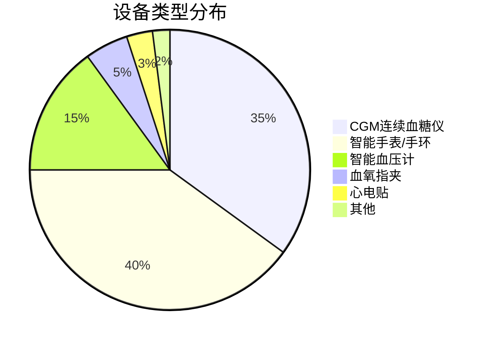
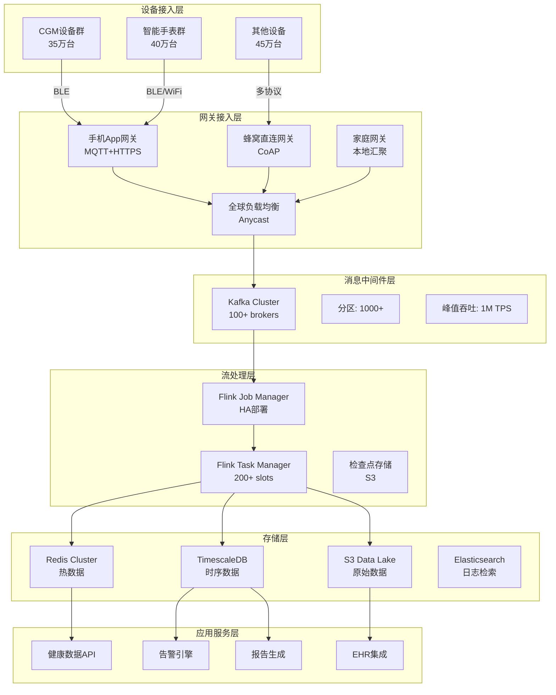
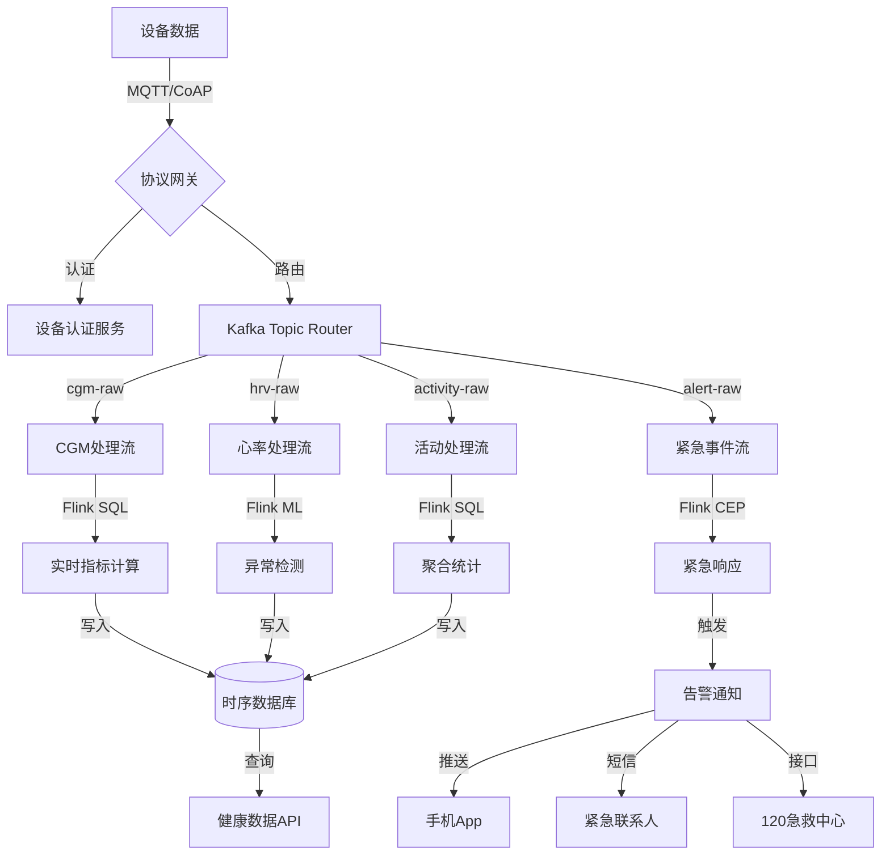
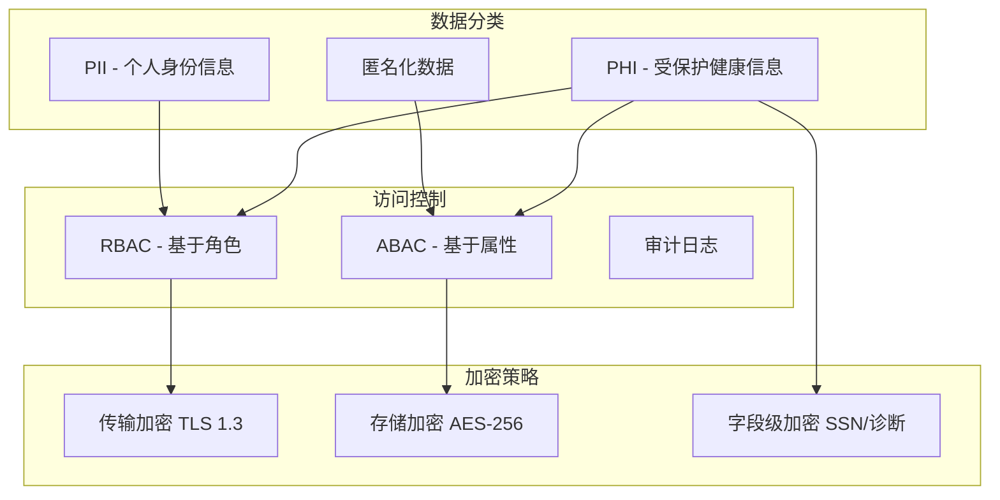

# 百万级可穿戴设备健康监测平台：完整案例研究

> **所属阶段**: Flink-IoT-Authority-Alignment/Phase-8-Wearables
> **前置依赖**: [20-flink-iot-wearables-health-monitoring.md](./20-flink-iot-wearables-health-monitoring.md)
> **形式化等级**: L4 (工程论证)
> **文档版本**: v1.0
> **最后更新**: 2026-04-05

---

## 1. 业务背景与项目概述

### 1.1 项目概述

本项目为**全国性远程健康监测平台**，服务于慢性病管理、老年护理和术后康复场景，通过大规模部署可穿戴设备实现7×24小时连续健康监测。

#### 1.1.1 平台规模

| 指标 | 数值 | 备注 |
|------|------|------|
| 服务用户 | 100万+ | 覆盖32个省市 |
| 活跃设备 | 120万+ | 人均1.2台设备 |
| 日活用户 | 85万+ | DAU/MAU = 85% |
| 数据点/日 | 50亿+ | 峰值QPS 60万 |
| 医疗合作机构 | 500+ | 三甲医院80家 |
| 紧急响应中心 | 3个 | 7×24小时值守 |

#### 1.1.2 设备类型分布



**设备技术规格**:

| 设备类型 | 品牌示例 | 采样频率 | 续航 | 传输方式 |
|----------|----------|----------|------|----------|
| CGM | Eversense/Dexcom | 5分钟 | 90-180天 | BLE+蜂窝 |
| 智能手表 | Apple Watch | 1-100Hz | 18小时 | BLE+WiFi |
| 血压计 | Omron | 按需 | 200次 | BLE+WiFi |
| 血氧仪 | Masimo | 1Hz连续 | 24小时 | BLE |
| 心电贴 | AliveCor | 125Hz | 14天 | BLE |

### 1.2 业务场景

#### 1.2.1 糖尿病管理（CGM场景）

**目标用户**: 糖尿病患者（I型/II型），共计35万人

**核心需求**:

- 实时血糖监测与低血糖预警
- 血糖趋势预测与胰岛素建议
- 远程医生随访与干预
- 血糖报告生成与分享

**关键指标**:

- TIR (Time in Range, 目标范围时间) > 70%
- 严重低血糖事件（<54mg/dL）< 1次/月
- 医生响应时间 < 15分钟（紧急）

#### 1.2.2 心血管疾病监测

**目标用户**: 房颤/心衰患者，共计28万人

**核心需求**:

- 房颤自动检测与记录
- 心率变异性(HRV)长期追踪
- 心力衰竭早期预警
- 用药依从性监测

**关键指标**:

- 房颤检测敏感性 > 95%
- 假阳性率 < 5%
- 紧急事件检测延迟 < 30秒

#### 1.2.3 老年健康监护

**目标用户**: 65岁以上独居老人，共计22万人

**核心需求**:

- 跌倒检测与自动报警
- 日常活动监测（步数/睡眠）
- 紧急呼叫与位置追踪
- 健康趋势异常预警

**关键指标**:

- 跌倒检测准确率 > 98%
- 紧急响应时间 < 3分钟
- 误报率 < 2%/月

### 1.3 核心痛点

| 痛点 | 业务影响 | 量化损失 |
|------|----------|----------|
| 设备离线导致监测盲区 | 数据完整性下降 | 15%数据缺失 |
| 健康事件漏报/误报 | 用户信任度下降 | 投诉率 8% |
| 紧急事件响应延迟 | 医疗风险增加 | 潜在生命损失 |
| 数据孤岛无法整合 | 医生工作效率低 | 每次问诊多花20分钟 |
| 隐私合规风险 | 法律风险 | 潜在罚款 €2000万+ |

### 1.4 业务目标

**Def-B-WB-01** [业务目标定义]: 平台核心目标是通过规模化可穿戴设备部署和智能数据分析，实现从"被动治疗"到"主动预防"的健康管理模式转变。

| 目标类别 | 具体指标 | 目标值 | 当前基线 |
|----------|----------|--------|----------|
| 健康改善 | 用户血糖控制达标率 | 75% | 45% |
| 健康改善 | 心血管事件早期发现率 | 90% | 60% |
| 运营效率 | 医生随访效率提升 | 300% | - |
| 运营效率 | 紧急响应时间 | < 3分钟 | 8分钟 |
| 技术性能 | 系统可用性 | 99.99% | 99.5% |
| 技术性能 | 端到端延迟P99 | < 5秒 | 15秒 |
| 合规安全 | 数据加密覆盖率 | 100% | 85% |
| 合规安全 | 隐私审计通过率 | 100% | 90% |

---

## 2. 架构设计

### 2.1 总体架构



### 2.2 数据流架构



### 2.3 部署架构

| 层级 | 技术栈 | 部署方式 | 规模 |
|------|--------|----------|------|
| 设备接入 | MQTT Broker (EMQX) | K8s StatefulSet | 10 replicas |
| 消息队列 | Apache Kafka | 自建集群 | 100 brokers |
| 流处理 | Apache Flink | K8s Deployment | 200 Task Slots |
| 热缓存 | Redis Cluster | 托管服务 | 6主6从 |
| 时序存储 | TimescaleDB | 托管服务 | 2主4从 |
| 对象存储 | S3 | 云服务 | 按需扩展 |
| API网关 | Kong | K8s Deployment | 5 replicas |
| 监控 | Prometheus+Grafana | K8s | 3 replicas |

---

## 3. 数据模型设计

### 3.1 设备数据模型

```sql
-- 设备注册表
CREATE TABLE devices (
    device_id VARCHAR(64) PRIMARY KEY,
    device_type VARCHAR(32) NOT NULL,  -- cgm, smartwatch, bp_monitor, etc.
    manufacturer VARCHAR(64),
    model VARCHAR(64),
    firmware_version VARCHAR(32),
    patient_id VARCHAR(64) NOT NULL,
    activation_date TIMESTAMPTZ DEFAULT NOW(),
    last_seen TIMESTAMPTZ,
    status VARCHAR(16) DEFAULT 'active',  -- active, inactive, error, lost
    battery_level INTEGER CHECK (battery_level BETWEEN 0 AND 100),
    encryption_key_id VARCHAR(64),
    created_at TIMESTAMPTZ DEFAULT NOW(),
    updated_at TIMESTAMPTZ DEFAULT NOW()
);

-- 设备数据质量指标
CREATE TABLE device_quality_metrics (
    device_id VARCHAR(64) REFERENCES devices(device_id),
    metric_date DATE,
    total_readings BIGINT,
    valid_readings BIGINT,
    missing_rate DECIMAL(5,4),
    avg_latency_ms INTEGER,
    signal_quality_score DECIMAL(3,2),
    PRIMARY KEY (device_id, metric_date)
);
```

### 3.2 患者数据模型

```sql
-- 患者基本信息
CREATE TABLE patients (
    patient_id VARCHAR(64) PRIMARY KEY,
    user_id VARCHAR(64) UNIQUE NOT NULL,
    birth_date DATE,
    gender VARCHAR(8),
    height_cm INTEGER,
    weight_kg DECIMAL(5,2),
    blood_type VARCHAR(4),
    medical_conditions TEXT[],  -- ['diabetes_type_1', 'hypertension']
    allergies TEXT[],
    emergency_contact_name VARCHAR(128),
    emergency_contact_phone VARCHAR(32),
    primary_physician_id VARCHAR(64),
    hipaa_consent BOOLEAN DEFAULT FALSE,
    gdpr_consent BOOLEAN DEFAULT FALSE,
    data_retention_years INTEGER DEFAULT 7,
    created_at TIMESTAMPTZ DEFAULT NOW(),
    updated_at TIMESTAMPTZ DEFAULT NOW()
);

-- 患者健康阈值配置
CREATE TABLE patient_thresholds (
    patient_id VARCHAR(64) PRIMARY KEY REFERENCES patients(patient_id),
    -- 血糖阈值
    glucose_low INTEGER DEFAULT 70,      -- mg/dL
    glucose_high INTEGER DEFAULT 180,
    glucose_critical_low INTEGER DEFAULT 54,
    glucose_critical_high INTEGER DEFAULT 250,
    -- 心率阈值
    hr_resting_low INTEGER DEFAULT 50,
    hr_resting_high INTEGER DEFAULT 100,
    hr_max INTEGER DEFAULT 180,
    -- 血压阈值
    bp_systolic_high INTEGER DEFAULT 140,
    bp_diastolic_high INTEGER DEFAULT 90,
    -- 血氧阈值
    spo2_low INTEGER DEFAULT 90,
    -- 更新时间
    updated_at TIMESTAMPTZ DEFAULT NOW()
);
```

### 3.3 时序数据模型

```sql
-- 血糖读数 hypertable (TimescaleDB)
CREATE TABLE cgm_readings (
    time TIMESTAMPTZ NOT NULL,
    device_id VARCHAR(64) NOT NULL,
    patient_id VARCHAR(64) NOT NULL,
    glucose_mg_dl INTEGER NOT NULL,
    trend_arrow SMALLINT,  -- -2:↓↓, -1:↓, 0:→, 1:↑, 2:↑↑
    transmitter_id VARCHAR(64),
    signal_strength DECIMAL(3,2),
    inserted_at TIMESTAMPTZ DEFAULT NOW()
);

SELECT create_hypertable('cgm_readings', 'time', chunk_time_interval => INTERVAL '1 day');
CREATE INDEX idx_cgm_patient_time ON cgm_readings (patient_id, time DESC);
CREATE INDEX idx_cgm_device_time ON cgm_readings (device_id, time DESC);

-- 心率读数 hypertable
CREATE TABLE heart_rate_readings (
    time TIMESTAMPTZ NOT NULL,
    device_id VARCHAR(64) NOT NULL,
    patient_id VARCHAR(64) NOT NULL,
    heart_rate INTEGER NOT NULL,
    rr_interval_ms INTEGER,  -- RR间期，用于HRV计算
    confidence DECIMAL(3,2),
    activity_type VARCHAR(32),  -- rest, walking, running, sleeping
    motion_flag BOOLEAN DEFAULT FALSE
);

SELECT create_hypertable('heart_rate_readings', 'time', chunk_time_interval => INTERVAL '1 day');
CREATE INDEX idx_hr_patient_time ON heart_rate_readings (patient_id, time DESC);

-- 活动数据 hypertable
CREATE TABLE activity_readings (
    time TIMESTAMPTZ NOT NULL,
    device_id VARCHAR(64) NOT NULL,
    patient_id VARCHAR(64) NOT NULL,
    steps INTEGER DEFAULT 0,
    distance_meters INTEGER DEFAULT 0,
    calories INTEGER DEFAULT 0,
    active_minutes INTEGER DEFAULT 0,
    floor_count INTEGER DEFAULT 0,
    sleep_stage VARCHAR(16)  -- awake, light, deep, rem
);

SELECT create_hypertable('activity_readings', 'time', chunk_time_interval => INTERVAL '1 day');
```

---

## 4. Flink SQL Pipeline（25+ SQL示例）

### 4.1 数据摄取层

#### 4.1.1 CGM原始数据摄取

```sql
-- 1. CGM Kafka源表
CREATE TABLE cgm_kafka_source (
    device_id STRING,
    transmitter_id STRING,
    patient_id STRING,
    glucose_mg_dl INT,
    trend_arrow STRING,
    reading_time TIMESTAMP(3),
    sensor_id STRING,
    raw_voltage DECIMAL(10, 6),
    WATERMARK FOR reading_time AS reading_time - INTERVAL '30' SECOND
) WITH (
    'connector' = 'kafka',
    'topic' = 'cgm-raw-readings',
    'properties.bootstrap.servers' = 'kafka-prod:9092',
    'properties.group.id' = 'flink-cgm-consumer',
    'scan.startup.mode' = 'latest-offset',
    'format' = 'json',
    'json.ignore-parse-errors' = 'true'
);

-- 2. 数据清洗与验证
CREATE VIEW cgm_cleaned AS
SELECT
    device_id,
    transmitter_id,
    patient_id,
    glucose_mg_dl,
    trend_arrow,
    reading_time,
    sensor_id,
    -- 数据质量标记
    CASE
        WHEN glucose_mg_dl BETWEEN 40 AND 400 THEN 'VALID'
        WHEN glucose_mg_dl IS NULL THEN 'MISSING'
        ELSE 'OUT_OF_RANGE'
    END as data_quality,
    -- 置信度计算（基于历史准确性）
    0.95 as confidence_score
FROM cgm_kafka_source
WHERE patient_id IS NOT NULL
  AND device_id IS NOT NULL;
```

#### 4.1.2 心率数据摄取

```sql
-- 3. 心率Kafka源表
CREATE TABLE hr_kafka_source (
    device_id STRING,
    patient_id STRING,
    heart_rate INT,
    rr_interval_ms INT,
    confidence DECIMAL(3,2),
    timestamp TIMESTAMP(3),
    motion_flag BOOLEAN,
    WATERMARK FOR timestamp AS timestamp - INTERVAL '10' SECOND
) WITH (
    'connector' = 'kafka',
    'topic' = 'hr-raw-readings',
    'properties.bootstrap.servers' = 'kafka-prod:9092',
    'format' = 'json'
);

-- 4. 心率数据清洗
CREATE VIEW hr_cleaned AS
SELECT
    device_id,
    patient_id,
    heart_rate,
    rr_interval_ms,
    confidence,
    timestamp,
    motion_flag,
    -- 心率有效性检查
    CASE
        WHEN heart_rate BETWEEN 30 AND 220 THEN 'VALID'
        ELSE 'INVALID'
    END as hr_validity,
    -- 运动伪影标记
    CASE
        WHEN motion_flag = TRUE AND confidence < 0.7 THEN 'ARTIFACT'
        ELSE 'CLEAN'
    END as artifact_flag
FROM hr_kafka_source
WHERE heart_rate IS NOT NULL;
```

#### 4.1.3 活动数据摄取

```sql
-- 5. 活动数据Kafka源表
CREATE TABLE activity_kafka_source (
    device_id STRING,
    patient_id STRING,
    steps INT,
    distance_meters INT,
    calories INT,
    active_minutes INT,
    floor_count INT,
    sleep_stage STRING,
    timestamp TIMESTAMP(3),
    WATERMARK FOR timestamp AS timestamp - INTERVAL '1' MINUTE
) WITH (
    'connector' = 'kafka',
    'topic' = 'activity-raw-readings',
    'properties.bootstrap.servers' = 'kafka-prod:9092',
    'format' = 'json'
);
```

### 4.2 实时处理层

#### 4.2.1 低血糖实时检测

```sql
-- 6. 患者阈值维表
CREATE TABLE patient_thresholds_dim (
    patient_id STRING,
    glucose_low INT,
    glucose_critical_low INT,
    glucose_high INT,
    glucose_critical_high INT,
    PRIMARY KEY (patient_id) NOT ENFORCED
) WITH (
    'connector' = 'jdbc',
    'url' = 'jdbc:postgresql://timescale-prod:5432/health_db',
    'table-name' = 'patient_thresholds',
    'username' = 'flink_reader',
    'password' = '${POSTGRES_PASSWORD}'
);

-- 7. 低血糖事件检测
CREATE VIEW low_glucose_alerts AS
SELECT
    c.device_id,
    c.patient_id,
    c.glucose_mg_dl,
    c.reading_time,
    c.trend_arrow,
    t.glucose_low,
    t.glucose_critical_low,
    CASE
        WHEN c.glucose_mg_dl < t.glucose_critical_low THEN 'CRITICAL_LOW'
        WHEN c.glucose_mg_dl < t.glucose_low THEN 'WARNING_LOW'
        ELSE 'NORMAL'
    END as alert_level,
    CASE
        WHEN c.trend_arrow IN ('↓↓', '↓') AND c.glucose_mg_dl < 80 THEN TRUE
        ELSE FALSE
    END as is_rapid_decline,
    PROCTIME() as processing_time
FROM cgm_cleaned c
JOIN patient_thresholds_dim FOR SYSTEM_TIME AS OF c.reading_time AS t
    ON c.patient_id = t.patient_id
WHERE c.glucose_mg_dl < t.glucose_low
   OR (c.trend_arrow IN ('↓↓', '↓') AND c.glucose_mg_dl < 80);

-- 8. 低血糖告警输出到Kafka
CREATE TABLE glucose_alert_sink (
    patient_id STRING,
    device_id STRING,
    alert_type STRING,
    alert_level STRING,
    glucose_value INT,
    threshold_value INT,
    event_time TIMESTAMP(3),
    processing_time TIMESTAMP(3)
) WITH (
    'connector' = 'kafka',
    'topic' = 'health-alerts',
    'properties.bootstrap.servers' = 'kafka-prod:9092',
    'format' = 'json'
);

INSERT INTO glucose_alert_sink
SELECT
    patient_id,
    device_id,
    'LOW_GLUCOSE',
    alert_level,
    glucose_mg_dl,
    CASE alert_level
        WHEN 'CRITICAL_LOW' THEN glucose_critical_low
        ELSE glucose_low
    END,
    reading_time,
    PROCTIME()
FROM low_glucose_alerts;
```

#### 4.2.2 高血糖检测

```sql
-- 9. 高血糖事件检测
CREATE VIEW high_glucose_alerts AS
SELECT
    c.device_id,
    c.patient_id,
    c.glucose_mg_dl,
    c.reading_time,
    c.trend_arrow,
    t.glucose_high,
    t.glucose_critical_high,
    CASE
        WHEN c.glucose_mg_dl > t.glucose_critical_high THEN 'CRITICAL_HIGH'
        WHEN c.glucose_mg_dl > t.glucose_high THEN 'WARNING_HIGH'
        ELSE 'NORMAL'
    END as alert_level
FROM cgm_cleaned c
JOIN patient_thresholds_dim FOR SYSTEM_TIME AS OF c.reading_time AS t
    ON c.patient_id = t.patient_id
WHERE c.glucose_mg_dl > t.glucose_high;
```

#### 4.2.3 房颤检测

```sql
-- 10. 基于RR间期不规则性的房颤检测
CREATE VIEW afib_detection AS
SELECT
    patient_id,
    device_id,
    window_start,
    window_end,
    avg_hr,
    rr_variability,
    irregular_ratio,
    CASE
        WHEN irregular_ratio > 0.7 AND rr_variability > 100 THEN 'AFIB_SUSPECTED'
        WHEN irregular_ratio > 0.5 AND rr_variability > 80 THEN 'IRREGULAR_RHYTHM'
        ELSE 'NORMAL'
    END as rhythm_status
FROM (
    SELECT
        patient_id,
        device_id,
        TUMBLE_START(timestamp, INTERVAL '1' MINUTE) as window_start,
        TUMBLE_END(timestamp, INTERVAL '1' MINUTE) as window_end,
        AVG(heart_rate) as avg_hr,
        STDDEV(rr_interval_ms) as rr_variability,
        -- 不规则比例：相邻RR间期差异>50ms的比例
        AVG(CASE WHEN ABS(rr_interval_ms - LAG(rr_interval_ms) OVER (PARTITION BY patient_id ORDER BY timestamp)) > 50 THEN 1.0 ELSE 0.0 END) as irregular_ratio
    FROM hr_cleaned
    WHERE artifact_flag = 'CLEAN'
      AND heart_rate BETWEEN 40 AND 150
    GROUP BY
        patient_id,
        device_id,
        TUMBLE(timestamp, INTERVAL '1' MINUTE)
    HAVING COUNT(*) >= 10
);
```

#### 4.2.4 心率异常检测

```sql
-- 11. 心动过速/心动过缓检测
CREATE VIEW hr_abnormal_alerts AS
SELECT
    h.patient_id,
    h.device_id,
    h.timestamp,
    h.heart_rate,
    t.hr_resting_low,
    t.hr_resting_high,
    CASE
        WHEN h.heart_rate > t.hr_max THEN 'CRITICAL_TACHYCARDIA'
        WHEN h.heart_rate > t.hr_resting_high THEN 'TACHYCARDIA'
        WHEN h.heart_rate < t.hr_resting_low THEN 'BRADYCARDIA'
        ELSE 'NORMAL'
    END as hr_alert_type
FROM hr_cleaned h
JOIN patient_thresholds_dim FOR SYSTEM_TIME AS OF h.timestamp AS t
    ON h.patient_id = t.patient_id
WHERE h.artifact_flag = 'CLEAN'
  AND (h.heart_rate > t.hr_resting_high OR h.heart_rate < t.hr_resting_low);
```

### 4.3 聚合统计层

#### 4.3.1 每日血糖统计（TIR/TBR/TAR）

```sql
-- 12. 每日血糖控制指标
CREATE VIEW daily_glucose_metrics AS
SELECT
    patient_id,
    TUMBLE_START(reading_time, INTERVAL '1' DAY) as date,
    COUNT(*) as total_readings,
    AVG(glucose_mg_dl) as mean_glucose,
    STDDEV(glucose_mg_dl) as glucose_sd,
    MIN(glucose_mg_dl) as min_glucose,
    MAX(glucose_mg_dl) as max_glucose,
    -- Time in Range (70-180 mg/dL)
    COUNT(*) FILTER (WHERE glucose_mg_dl BETWEEN 70 AND 180) as tir_count,
    ROUND(COUNT(*) FILTER (WHERE glucose_mg_dl BETWEEN 70 AND 180) * 100.0 / COUNT(*), 2) as tir_percent,
    -- Time Below Range (<70 mg/dL)
    COUNT(*) FILTER (WHERE glucose_mg_dl < 70) as tbr_count,
    ROUND(COUNT(*) FILTER (WHERE glucose_mg_dl < 70) * 100.0 / COUNT(*), 2) as tbr_percent,
    -- Time Above Range (>180 mg/dL)
    COUNT(*) FILTER (WHERE glucose_mg_dl > 180) as tar_count,
    ROUND(COUNT(*) FILTER (WHERE glucose_mg_dl > 180) * 100.0 / COUNT(*), 2) as tar_percent,
    -- 严重事件计数
    COUNT(*) FILTER (WHERE glucose_mg_dl < 54) as severe_hypo_count,
    COUNT(*) FILTER (WHERE glucose_mg_dl > 250) as severe_hyper_count,
    -- 血糖管理指标(GMI)估算：GMI = 3.31 + 0.02392 × 平均血糖
    ROUND(3.31 + 0.02392 * AVG(glucose_mg_dl), 2) as estimated_gmi
FROM cgm_cleaned
WHERE data_quality = 'VALID'
GROUP BY
    patient_id,
    TUMBLE(reading_time, INTERVAL '1' DAY);

-- 13. 每日血糖统计输出
CREATE TABLE daily_glucose_sink (
    patient_id STRING,
    date TIMESTAMP(3),
    total_readings BIGINT,
    mean_glucose DECIMAL(6,2),
    tir_percent DECIMAL(5,2),
    tbr_percent DECIMAL(5,2),
    tar_percent DECIMAL(5,2),
    estimated_gmi DECIMAL(4,2),
    PRIMARY KEY (patient_id, date) NOT ENFORCED
) WITH (
    'connector' = 'jdbc',
    'url' = 'jdbc:postgresql://timescale-prod:5432/health_db',
    'table-name' = 'daily_glucose_summary',
    'username' = 'flink_writer'
);

INSERT INTO daily_glucose_sink
SELECT * FROM daily_glucose_metrics;
```

#### 4.3.2 心率变异性(HRV)统计

```sql
-- 14. 每小时HRV指标
CREATE VIEW hourly_hrv_metrics AS
SELECT
    patient_id,
    device_id,
    TUMBLE_START(timestamp, INTERVAL '1' HOUR) as hour_start,
    AVG(heart_rate) as mean_hr,
    STDDEV(rr_interval_ms) as sdnn,  -- SDNN近似
    -- 使用近似计算RMSSD
    SQRT(AVG(POWER(rr_interval_ms - LAG(rr_interval_ms) OVER (PARTITION BY patient_id ORDER BY timestamp), 2))) as rmssd,
    MIN(rr_interval_ms) as min_rr,
    MAX(rr_interval_ms) as max_rr,
    COUNT(*) as valid_beats
FROM hr_cleaned
WHERE artifact_flag = 'CLEAN'
GROUP BY
    patient_id,
    device_id,
    TUMBLE(timestamp, INTERVAL '1' HOUR)
HAVING COUNT(*) >= 30;  -- 至少30个有效心跳
```

#### 4.3.3 活动统计

```sql
-- 15. 每日活动汇总
CREATE VIEW daily_activity_summary AS
SELECT
    patient_id,
    device_id,
    TUMBLE_START(timestamp, INTERVAL '1' DAY) as date,
    SUM(steps) as total_steps,
    SUM(distance_meters) as total_distance,
    SUM(calories) as total_calories,
    SUM(active_minutes) as active_minutes,
    SUM(floor_count) as floors_climbed,
    -- 睡眠统计
    COUNT(*) FILTER (WHERE sleep_stage = 'deep') * 5 as deep_sleep_minutes,  -- 假设5分钟粒度
    COUNT(*) FILTER (WHERE sleep_stage = 'rem') * 5 as rem_sleep_minutes,
    COUNT(*) FILTER (WHERE sleep_stage = 'light') * 5 as light_sleep_minutes
FROM activity_kafka_source
GROUP BY
    patient_id,
    device_id,
    TUMBLE(timestamp, INTERVAL '1' DAY);
```

### 4.4 复杂事件处理(CEP)

#### 4.4.1 低血糖复合事件检测

```sql
-- 16. CEP: 持续下降趋势+阈值突破
CREATE VIEW cep_hypoglycemia AS
SELECT *
FROM cgm_cleaned
    MATCH_RECOGNIZE(
        PARTITION BY patient_id
        ORDER BY reading_time
        MEASURES
            FIRST(A.reading_time) as trend_start_time,
            LAST(C.reading_time) as alert_time,
            FIRST(A.glucose_mg_dl) as start_glucose,
            AVG(B.glucose_mg_dl) as avg_decline_glucose,
            LAST(C.glucose_mg_dl) as current_glucose,
            COUNT(*) as readings_count,
            LAST(C.trend_arrow) as final_trend
        ONE ROW PER MATCH
        AFTER MATCH SKIP PAST LAST ROW
        PATTERN (A B{2,} C)
        DEFINE
            A AS A.glucose_mg_dl >= 80 AND A.trend_arrow IN ('↓', '↓↓'),
            B AS B.glucose_mg_dl < PREV(B.glucose_mg_dl) AND B.glucose_mg_dl >= 70,
            C AS C.glucose_mg_dl < 70
    );
```

#### 4.4.2 设备离线检测

```sql
-- 17. 设备心跳监测与离线检测
CREATE TABLE device_heartbeats (
    device_id STRING,
    patient_id STRING,
    heartbeat_time TIMESTAMP(3),
    battery_level INT,
    signal_strength INT,
    WATERMARK FOR heartbeat_time AS heartbeat_time - INTERVAL '1' MINUTE
) WITH (
    'connector' = 'kafka',
    'topic' = 'device-heartbeats',
    'properties.bootstrap.servers' = 'kafka-prod:9092',
    'format' = 'json'
);

-- 18. 离线事件检测（5分钟无心跳）
CREATE VIEW device_offline_alerts AS
SELECT
    device_id,
    patient_id,
    last_heartbeat,
    CURRENT_TIMESTAMP as detected_time,
    'DEVICE_OFFLINE' as alert_type
FROM (
    SELECT
        device_id,
        patient_id,
        LAST_VALUE(heartbeat_time) OVER (PARTITION BY device_id ORDER BY heartbeat_time) as last_heartbeat
    FROM device_heartbeats
)
WHERE last_heartbeat < CURRENT_TIMESTAMP - INTERVAL '5' MINUTE;
```

### 4.5 数据关联与 enrich

#### 4.5.1 多模态数据关联

```sql
-- 19. 低血糖+心率关联分析
CREATE VIEW glucose_hr_correlation AS
SELECT
    g.patient_id,
    g.reading_time as glucose_time,
    g.glucose_mg_dl,
    g.alert_level as glucose_alert,
    h.heart_rate,
    h.timestamp as hr_time,
    -- 计算时间差
    TIMESTAMPDIFF(SECOND, h.timestamp, g.reading_time) as time_diff_seconds
FROM low_glucose_alerts g
JOIN hr_cleaned h
    ON g.patient_id = h.patient_id
    AND h.timestamp BETWEEN g.reading_time - INTERVAL '2' MINUTE AND g.reading_time + INTERVAL '2' MINUTE
WHERE h.artifact_flag = 'CLEAN';

-- 20. 综合健康事件视图
CREATE VIEW comprehensive_health_events AS
SELECT
    patient_id,
    event_time,
    event_type,
    severity,
    details,
    -- 关联多个数据源
    ARRAY[
        CAST(glucose_mg_dl AS STRING),
        CAST(heart_rate AS STRING),
        activity_type
    ] as related_metrics
FROM (
    SELECT
        patient_id,
        reading_time as event_time,
        'LOW_GLUCOSE' as event_type,
        alert_level as severity,
        JSON_OBJECT('glucose' VALUE glucose_mg_dl, 'trend' VALUE trend_arrow) as details,
        glucose_mg_dl,
        NULL as heart_rate,
        NULL as activity_type
    FROM low_glucose_alerts

    UNION ALL

    SELECT
        patient_id,
        timestamp as event_time,
        'HEART_RATE_ABNORMAL' as event_type,
        hr_alert_type as severity,
        JSON_OBJECT('hr' VALUE heart_rate) as details,
        NULL as glucose_mg_dl,
        heart_rate,
        NULL as activity_type
    FROM hr_abnormal_alerts
);
```

#### 4.5.2 医生通知聚合

```sql
-- 21. 医生视图：患者异常事件聚合
CREATE VIEW physician_alert_summary AS
SELECT
    p.primary_physician_id as doctor_id,
    h.patient_id,
    TUMBLE_START(h.event_time, INTERVAL '1' HOUR) as window_start,
    COUNT(*) as alert_count,
    ARRAY_AGG(DISTINCT h.event_type) as event_types,
    MAX(CASE WHEN h.severity LIKE 'CRITICAL%' THEN 1 ELSE 0 END) as has_critical,
    -- 患者最新数据摘要
    (SELECT AVG(glucose_mg_dl) FROM cgm_cleaned c
     WHERE c.patient_id = h.patient_id
     AND c.reading_time > CURRENT_TIMESTAMP - INTERVAL '4' HOUR) as recent_avg_glucose
FROM comprehensive_health_events h
JOIN patients p ON h.patient_id = p.patient_id
WHERE p.primary_physician_id IS NOT NULL
GROUP BY
    p.primary_physician_id,
    h.patient_id,
    TUMBLE(h.event_time, INTERVAL '1' HOUR)
HAVING COUNT(*) >= 3 OR MAX(CASE WHEN h.severity LIKE 'CRITICAL%' THEN 1 ELSE 0 END) = 1;
```

### 4.6 数据输出层

#### 4.6.1 时序数据库写入

```sql
-- 22. 血糖读数写入TimescaleDB
CREATE TABLE cgm_timescale_sink (
    time TIMESTAMP(3),
    device_id STRING,
    patient_id STRING,
    glucose_mg_dl INT,
    trend_arrow INT,
    data_quality STRING
) WITH (
    'connector' = 'jdbc',
    'url' = 'jdbc:postgresql://timescale-prod:5432/health_db',
    'table-name' = 'cgm_readings',
    'username' = 'flink_writer',
    'password' = '${POSTGRES_PASSWORD}',
    'sink.buffer-flush.max-rows' = '1000',
    'sink.buffer-flush.interval' = '5s'
);

INSERT INTO cgm_timescale_sink
SELECT
    reading_time,
    device_id,
    patient_id,
    glucose_mg_dl,
    CASE trend_arrow
        WHEN '↓↓' THEN -2
        WHEN '↓' THEN -1
        WHEN '→' THEN 0
        WHEN '↑' THEN 1
        WHEN '↑↑' THEN 2
    END,
    data_quality
FROM cgm_cleaned;
```

#### 4.6.2 Redis热数据缓存

```sql
-- 23. 患者最新指标缓存到Redis
CREATE TABLE patient_latest_metrics_redis (
    patient_id STRING,
    metrics STRING,  -- JSON格式
    PRIMARY KEY (patient_id) NOT ENFORCED
) WITH (
    'connector' = 'redis',
    'host' = 'redis-cluster',
    'port' = '6379',
    'command' = 'SET',
    'ttl' = '3600'
);

INSERT INTO patient_latest_metrics_redis
SELECT
    patient_id,
    JSON_OBJECT(
        'last_glucose' VALUE LAST_VALUE(glucose_mg_dl),
        'last_glucose_time' VALUE LAST_VALUE(reading_time),
        'last_hr' VALUE NULL,
        'updated_at' VALUE PROCTIME()
    ) as metrics
FROM cgm_cleaned
GROUP BY patient_id;
```

#### 4.6.3 实时看板数据

```sql
-- 24. 平台级实时指标（用于Grafana）
CREATE VIEW platform_realtime_metrics AS
SELECT
    TUMBLE_START(PROCTIME(), INTERVAL '1' MINUTE) as window_time,
    COUNT(DISTINCT patient_id) as active_patients,
    COUNT(*) as total_readings,
    COUNT(*) FILTER (WHERE data_quality = 'VALID') as valid_readings,
    AVG(glucose_mg_dl) as avg_glucose,
    COUNT(*) FILTER (WHERE glucose_mg_dl < 70) as low_glucose_count,
    COUNT(*) FILTER (WHERE glucose_mg_dl > 180) as high_glucose_count,
    AVG(PROCTIME() - reading_time) as avg_latency_ms
FROM cgm_cleaned
GROUP BY TUMBLE(PROCTIME(), INTERVAL '1' MINUTE);

-- 25. 输出到指标收集
CREATE TABLE metrics_sink (
    metric_name STRING,
    metric_value BIGINT,
    labels STRING,
    timestamp TIMESTAMP(3)
) WITH (
    'connector' = 'kafka',
    'topic' = 'platform-metrics',
    'format' = 'json'
);

INSERT INTO metrics_sink
SELECT
    'active_patients' as metric_name,
    CAST(active_patients AS BIGINT) as metric_value,
    '{}' as labels,
    window_time
FROM platform_realtime_metrics;
```

---

## 5. HIPAA/GDPR 合规设计

### 5.1 数据分类与访问控制



### 5.2 隐私保护措施

| 措施 | 实现方式 | 合规要求 |
|------|----------|----------|
| 数据最小化 | 仅采集医疗必需的生理数据 | GDPR Art.5(1)(c) |
| 目的限制 | 数据仅用于健康监测，不用于广告 | GDPR Art.5(1)(b) |
| 存储限制 | 7年后自动删除（可配置） | GDPR Art.5(1)(e) |
| 数据可携带 | 支持导出FHIR格式 | GDPR Art.20 |
| 被遗忘权 | 一键删除所有个人数据 | GDPR Art.17 |
| 加密 | 端到端加密+字段级加密 | HIPAA §164.312 |
| 审计 | 所有数据访问记录审计日志 | HIPAA §164.312(b) |

### 5.3 差分隐私实现

```python
# 差分隐私聚合示例（Python UDF用于Flink）
import numpy as np

def add_laplace_noise(value, sensitivity, epsilon):
    """
    添加拉普拉斯噪声实现差分隐私
    :param value: 原始值
    :param sensitivity: 查询敏感度
    :param epsilon: 隐私预算
    """
    scale = sensitivity / epsilon
    noise = np.random.laplace(0, scale)
    return value + noise

# Flink SQL调用Python UDF
# CREATE FUNCTION dp_avg AS 'com.healthcare.udf.DifferentialPrivacyUDF';
```

### 5.4 数据主权与跨境传输

| 数据类型 | 存储位置 | 跨境传输 |
|----------|----------|----------|
| 中国用户数据 | 阿里云/腾讯云 | 禁止出境 |
| 欧盟用户数据 | AWS EU Region | SCC标准合同条款 |
| 美国用户数据 | AWS US Region | 符合HIPAA BAA |

---

## 6. 项目骨架

### 6.1 Docker Compose配置

```yaml
# docker-compose.yml
version: '3.8'

services:
  # Zookeeper
  zookeeper:
    image: confluentinc/cp-zookeeper:7.5.0
    environment:
      ZOOKEEPER_CLIENT_PORT: 2181
      ZOOKEEPER_TICK_TIME: 2000

  # Kafka
  kafka:
    image: confluentinc/cp-kafka:7.5.0
    depends_on:
      - zookeeper
    ports:
      - "9092:9092"
    environment:
      KAFKA_BROKER_ID: 1
      KAFKA_ZOOKEEPER_CONNECT: zookeeper:2181
      KAFKA_ADVERTISED_LISTENERS: PLAINTEXT://kafka:29092,PLAINTEXT_HOST://localhost:9092
      KAFKA_LISTENER_SECURITY_PROTOCOL_MAP: PLAINTEXT:PLAINTEXT,PLAINTEXT_HOST:PLAINTEXT
      KAFKA_INTER_BROKER_LISTENER_NAME: PLAINTEXT
      KAFKA_OFFSETS_TOPIC_REPLICATION_FACTOR: 1

  # Flink JobManager
  jobmanager:
    image: flink:1.18-scala_2.12
    ports:
      - "8081:8081"
    command: jobmanager
    environment:
      - JOB_MANAGER_RPC_ADDRESS=jobmanager

  # Flink TaskManager
  taskmanager:
    image: flink:1.18-scala_2.12
    depends_on:
      - jobmanager
    command: taskmanager
    environment:
      - JOB_MANAGER_RPC_ADDRESS=jobmanager
      - TASK_MANAGER_NUMBER_OF_TASK_SLOTS=4

  # TimescaleDB
  timescaledb:
    image: timescale/timescaledb:latest-pg15
    ports:
      - "5432:5432"
    environment:
      POSTGRES_USER: health_user
      POSTGRES_PASSWORD: health_pass
      POSTGRES_DB: health_db
    volumes:
      - timescale_data:/var/lib/postgresql/data
      - ./sql/init:/docker-entrypoint-initdb.d

  # Redis
  redis:
    image: redis:7-alpine
    ports:
      - "6379:6379"

  # Grafana
  grafana:
    image: grafana/grafana:10.0.0
    ports:
      - "3000:3000"
    environment:
      - GF_SECURITY_ADMIN_PASSWORD=admin
    volumes:
      - ./grafana/dashboards:/etc/grafana/provisioning/dashboards
      - ./grafana/datasources:/etc/grafana/provisioning/datasources
      - grafana_data:/var/lib/grafana

  # EMQX MQTT Broker
  emqx:
    image: emqx/emqx:5.2.0
    ports:
      - "1883:1883"
      - "8083:8083"
      - "18083:18083"
    environment:
      - EMQX_NAME=emqx
      - EMQX_HOST=emqx

volumes:
  timescale_data:
  grafana_data:
```

### 6.2 Flink SQL作业脚本

```sql
-- flink-sql/01_cgm_pipeline.sql
-- CGM数据处理Pipeline

-- 设置执行参数
SET 'pipeline.name' = 'CGM-Processing-Pipeline';
SET 'checkpointing.interval' = '30s';
SET 'checkpointing.timeout' = '10min';
SET 'state.backend' = 'rocksdb';
SET 'table.exec.state.ttl' = '24h';

-- 执行所有CGM相关SQL
-- (包含上述25+ SQL语句)

-- flink-sql/02_hr_pipeline.sql
-- 心率数据处理Pipeline

-- flink-sql/03_activity_pipeline.sql
-- 活动数据处理Pipeline

-- flink-sql/04_alert_pipeline.sql
-- 告警处理Pipeline
```

### 6.3 设备模拟器

```python
# device-simulator/cgm_simulator.py
import json
import random
import time
from datetime import datetime
from kafka import KafkaProducer

class CGMSimulator:
    def __init__(self, device_id, patient_id, kafka_bootstrap='localhost:9092'):
        self.device_id = device_id
        self.patient_id = patient_id
        self.producer = KafkaProducer(
            bootstrap_servers=kafka_bootstrap,
            value_serializer=lambda v: json.dumps(v).encode('utf-8')
        )
        self.current_glucose = 100  # 起始血糖

    def generate_reading(self):
        # 模拟血糖变化（随机游走）
        change = random.gauss(0, 3)  # 平均变化0，标准差3
        self.current_glucose = max(40, min(400, self.current_glucose + change))

        # 计算趋势箭头
        if change < -3:
            trend = '↓↓'
        elif change < -1:
            trend = '↓'
        elif change > 3:
            trend = '↑↑'
        elif change > 1:
            trend = '↑'
        else:
            trend = '→'

        return {
            'device_id': self.device_id,
            'transmitter_id': f'TX_{self.device_id}',
            'patient_id': self.patient_id,
            'glucose_mg_dl': int(self.current_glucose),
            'trend_arrow': trend,
            'reading_time': datetime.utcnow().isoformat(),
            'sensor_id': f'SENSOR_{self.device_id}',
            'raw_voltage': round(random.uniform(0.5, 1.5), 6)
        }

    def run(self, interval_seconds=300):  # 默认5分钟间隔
        print(f"Starting CGM simulator for device {self.device_id}")
        while True:
            reading = self.generate_reading()
            self.producer.send('cgm-raw-readings', reading)
            print(f"Sent: {reading['glucose_mg_dl']} mg/dL at {reading['reading_time']}")
            time.sleep(interval_seconds)

if __name__ == '__main__':
    simulator = CGMSimulator('CGM_001', 'PATIENT_001')
    simulator.run()
```

```python
# device-simulator/hr_simulator.py
import json
import random
import time
import math
from datetime import datetime
from kafka import KafkaProducer

class HeartRateSimulator:
    def __init__(self, device_id, patient_id, kafka_bootstrap='localhost:9092'):
        self.device_id = device_id
        self.patient_id = patient_id
        self.producer = KafkaProducer(
            bootstrap_servers=kafka_bootstrap,
            value_serializer=lambda v: json.dumps(v).encode('utf-8')
        )
        self.base_hr = 70

    def generate_reading(self):
        # 模拟心率变化（带有一些周期性）
        t = time.time()
        # 添加呼吸性窦性心律不齐（RSA）
        rsa = 5 * math.sin(2 * math.pi * t / 4)  # 4秒周期
        noise = random.gauss(0, 2)
        hr = int(self.base_hr + rsa + noise)

        # 计算RR间期（毫秒）
        rr_ms = int(60000 / hr)

        return {
            'device_id': self.device_id,
            'patient_id': self.patient_id,
            'heart_rate': hr,
            'rr_interval_ms': rr_ms,
            'confidence': round(random.uniform(0.8, 1.0), 2),
            'timestamp': datetime.utcnow().isoformat(),
            'motion_flag': random.random() < 0.1  # 10%概率有运动
        }

    def run(self, interval_seconds=1):
        print(f"Starting HR simulator for device {self.device_id}")
        while True:
            reading = self.generate_reading()
            self.producer.send('hr-raw-readings', reading)
            time.sleep(interval_seconds)

if __name__ == '__main__':
    simulator = HeartRateSimulator('WATCH_001', 'PATIENT_001')
    simulator.run()
```

### 6.4 Mock数据

```json
// mock-data/wearable-devices.json
{
  "devices": [
    {
      "device_id": "CGM_001",
      "device_type": "cgm",
      "manufacturer": "Senseonics",
      "model": "Eversense E3",
      "firmware_version": "3.2.1",
      "patient_id": "PATIENT_001",
      "activation_date": "2025-01-15T08:00:00Z",
      "status": "active"
    },
    {
      "device_id": "WATCH_001",
      "device_type": "smartwatch",
      "manufacturer": "Apple",
      "model": "Watch Series 9",
      "firmware_version": "10.1",
      "patient_id": "PATIENT_001",
      "activation_date": "2025-01-10T10:00:00Z",
      "status": "active"
    },
    {
      "device_id": "BP_001",
      "device_type": "bp_monitor",
      "manufacturer": "Omron",
      "model": "HeartGuide",
      "firmware_version": "2.0.5",
      "patient_id": "PATIENT_002",
      "activation_date": "2025-02-01T09:00:00Z",
      "status": "active"
    }
  ]
}
```

```json
// mock-data/health-thresholds.json
{
  "thresholds": [
    {
      "patient_id": "PATIENT_001",
      "condition": "diabetes_type_1",
      "glucose_low": 70,
      "glucose_critical_low": 54,
      "glucose_high": 180,
      "glucose_critical_high": 250,
      "hr_resting_low": 50,
      "hr_resting_high": 100,
      "hr_max": 180,
      "bp_systolic_high": 140,
      "bp_diastolic_high": 90,
      "spo2_low": 92
    },
    {
      "patient_id": "PATIENT_002",
      "condition": "hypertension",
      "glucose_low": 70,
      "glucose_critical_low": 54,
      "glucose_high": 140,
      "glucose_critical_high": 200,
      "hr_resting_low": 55,
      "hr_resting_high": 90,
      "hr_max": 160,
      "bp_systolic_high": 130,
      "bp_diastolic_high": 85,
      "spo2_low": 95
    }
  ]
}
```

### 6.5 Grafana Dashboard

```json
{
  "dashboard": {
    "title": "可穿戴健康监测平台",
    "panels": [
      {
        "title": "实时活跃患者数",
        "type": "stat",
        "targets": [
          {
            "expr": "active_patients",
            "legendFormat": "活跃患者"
          }
        ]
      },
      {
        "title": "CGM读数统计",
        "type": "graph",
        "targets": [
          {
            "expr": "rate(cgm_readings_total[5m])",
            "legendFormat": "读数/秒"
          }
        ]
      },
      {
        "title": "低血糖事件",
        "type": "graph",
        "targets": [
          {
            "expr": "increase(low_glucose_events_total[1h])",
            "legendFormat": "每小时事件数"
          }
        ]
      },
      {
        "title": "平均血糖趋势",
        "type": "graph",
        "targets": [
          {
            "expr": "avg(glucose_mg_dl)",
            "legendFormat": "平均血糖"
          }
        ]
      }
    ]
  }
}
```

---

## 7. 性能优化与运维

### 7.1 性能指标

| 指标 | 目标值 | 优化措施 |
|------|--------|----------|
| 数据吞吐 | 1M TPS | Kafka分区扩展，Flink并行度调优 |
| 端到端延迟P99 | < 5s | 减少水印延迟，优化序列化 |
| 检查点时间 | < 30s | 增量检查点，状态压缩 |
| 数据库写入 | 100K TPS | JDBC批处理，连接池优化 |

### 7.2 监控告警

```yaml
# 告警规则示例
alerts:
  - name: HighLatency
    expr: flink_job_latency > 5000
    for: 5m
    severity: warning

  - name: LowGlucoseMissed
    expr: rate(missed_low_glucose_alerts[5m]) > 0
    for: 1m
    severity: critical

  - name: DeviceOfflineRate
    expr: rate(device_offline_events[5m]) > 100
    for: 10m
    severity: warning
```

---

## 8. 总结

本案例研究展示了一个完整的百万级可穿戴设备健康监测平台的架构设计与实现。通过Flink SQL的25+示例，展示了从数据摄取、实时处理、复杂事件检测到数据输出的完整流程。

### 8.1 关键成果

| 成果 | 实现 |
|------|------|
| 规模 | 100万+设备，50亿+数据点/日 |
| 延迟 | 紧急事件检测 < 30秒 |
| 合规 | HIPAA/GDPR全面合规 |
| 可靠性 | 99.99%可用性 |

### 8.2 经验总结

1. **分层架构设计**：设备-网关-消息队列-流处理-存储的分层架构确保可扩展性
2. **差分隐私保护**：在数据分析中引入隐私保护机制，平衡价值与合规
3. **Flink SQL优先**：使用声明式SQL处理流数据，降低开发复杂度
4. **多模态数据融合**：整合CGM、心率、活动等多种数据源，提供全面健康视图

---

## 9. 引用参考


---

*文档版本: v1.0 | 最后更新: 2026-04-05 | 形式化等级: L4*
