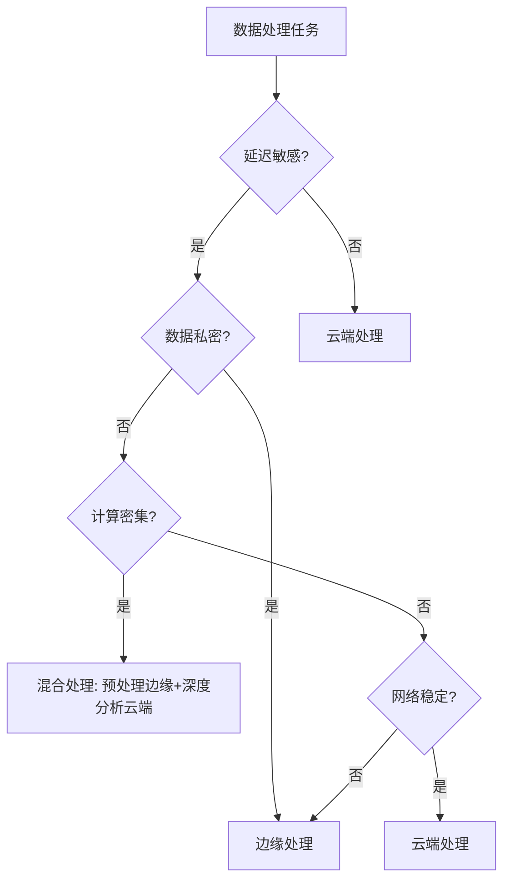
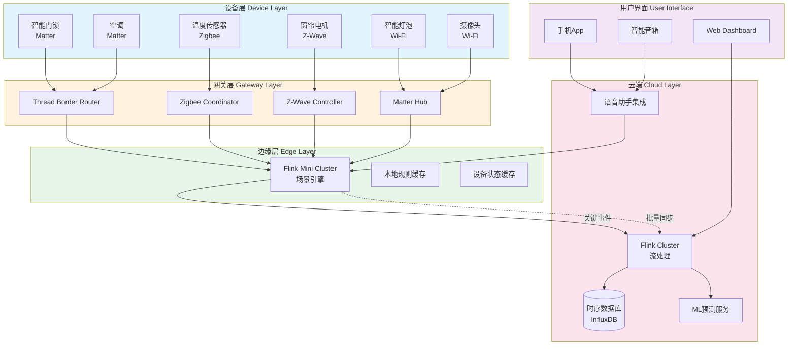
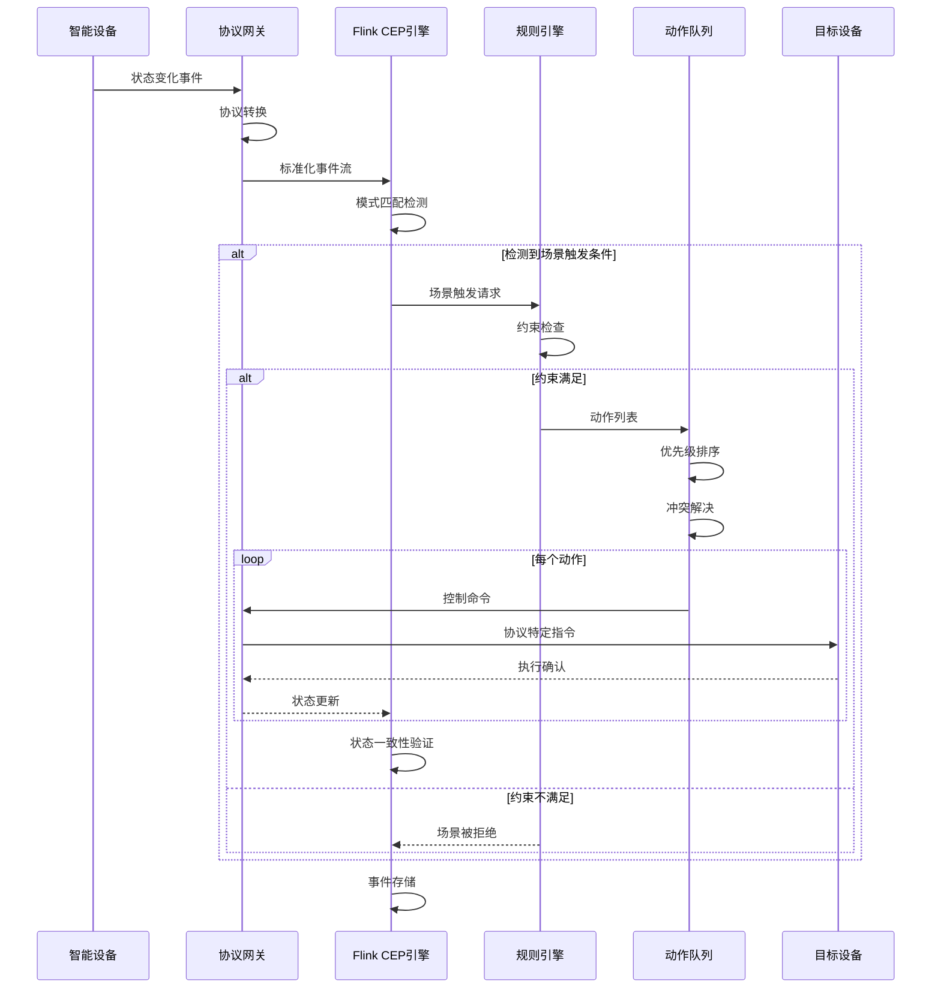
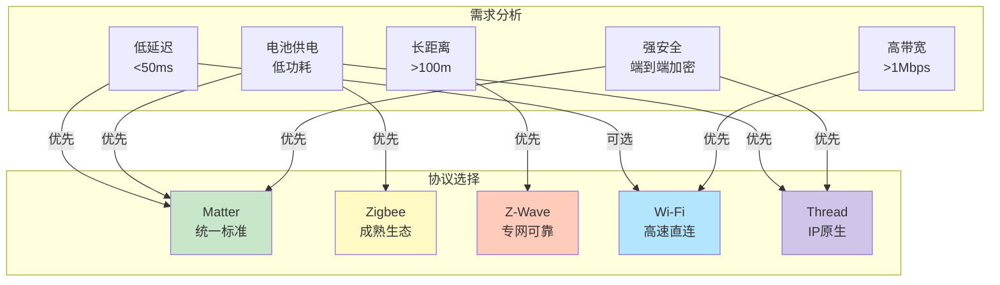

# Flink IoT 智能家居设备编排与场景联动

> **所属阶段**: Flink-IoT-Authority-Alignment/Phase-9-Smart-Home
> **前置依赖**: [Flink IoT 基础与架构设计](../Phase-1-Architecture/01-flink-iot-foundation-and-architecture.md), [Flink SQL 复杂事件处理](../Phase-2-Processing/05-flink-iot-complex-event-processing.md)
> **形式化等级**: L4 (工程严格性)
> **对标来源**: Matter Specification 1.0[^1], Apple HomeKit Architecture[^2], Google Nest Developer Guide[^3]

---

## 1. 概念定义 (Definitions)

本节建立智能家居系统的形式化基础，定义核心概念及其数学语义。智能家居系统是一个异构设备网络，需要统一的抽象模型来描述设备拓扑、场景规则和多协议网关。

### 1.1 智能家居设备拓扑图

**定义 1.1 (智能家居设备拓扑图)** [Def-IoT-SH-01]

一个**智能家居设备拓扑图** $\mathcal{G}_{SH}$ 是一个有向图：

$$\mathcal{G}_{SH} = (V_{devices}, E_{relations}, \mathcal{L}_{zones}, \phi_{zone})$$

其中：

- **设备节点集** $V_{devices} = D_{sensor} \cup D_{actuator} \cup D_{controller} \cup D_{gateway}$:
  - $D_{sensor}$: 传感器设备（温度、湿度、光照、运动等）
  - $D_{actuator}$: 执行器设备（灯光、窗帘、空调、门锁等）
  - $D_{controller}$: 控制设备（智能音箱、面板、手机App）
  - $D_{gateway}$: 协议网关（Matter Hub、Zigbee Bridge、Z-Wave Controller）

- **关系边集** $E_{relations} \subseteq V_{devices} \times V_{devices} \times \mathcal{R}$:
  - $\mathcal{R} = \{controls, monitors, depends, conflicts\}$ 是关系类型集合
  - $(d_i, d_j, controls) \in E_{relations}$ 表示设备 $d_i$ 控制 $d_j$

- **区域层次** $\mathcal{L}_{zones} = (Z_{room}, Z_{floor}, Z_{home})$ 是三级区域结构：
  - $Z_{room}$: 房间级（卧室、客厅、厨房等）
  - $Z_{floor}$: 楼层级
  - $Z_{home}$: 住宅级

- **区域映射** $\phi_{zone}: V_{devices} \rightarrow \mathcal{L}_{zones}$ 将设备映射到区域：
  $$\phi_{zone}(d) = z \iff device\ d\ belongs\ to\ zone\ z$$

**直观解释**: 智能家居设备拓扑图描述了家庭环境中所有智能设备的物理分布、逻辑关系和层级结构。该图是动态的，随设备加入、离开或移动而变化。

**拓扑约束条件**:

1. **连通性**: 每个设备至少通过一个网关可达：
   $$\forall d \in V_{devices}: \exists g \in D_{gateway}: path(d, g) \neq \emptyset$$

2. **无环控制**: 控制关系形成有向无环图（DAG）：
   $$\nexists\ cycle\ in\ \{(d_i, d_j) \mid (d_i, d_j, controls) \in E_{relations}\}$$

3. **区域唯一性**: 每个设备属于唯一的叶子区域：
   $$\forall d \in V_{devices}: |\{z \in Z_{room} \mid d \in z\}| = 1$$

### 1.2 场景规则引擎形式化定义

**定义 1.2 (场景规则引擎)** [Def-IoT-SH-02]

一个**场景规则引擎** $\mathcal{R}_{scene}$ 是一个五元组：

$$\mathcal{R}_{scene} = (\mathcal{S}, \mathcal{T}, \mathcal{A}, \mathcal{C}, \delta_{trigger})$$

其中：

- **场景集合** $\mathcal{S} = \{s_1, s_2, \ldots, s_n\}$，每个场景 $s_i = (name_i, desc_i, active_i)$

- **触发器集合** $\mathcal{T}$，每个触发器 $t \in \mathcal{T}$ 是一个条件表达式：
  $$t = (type_t, condition_t, priority_t, debounce_t)$$
  - $type_t \in \{event, schedule, state, manual\}$: 触发器类型
  - $condition_t$: 触发条件（谓词逻辑表达式）
  - $priority_t \in \{1, 2, \ldots, 10\}$: 优先级（10为最高）
  - $debounce_t \in \mathbb{R}^+$: 防抖时间窗口（秒）

- **动作集合** $\mathcal{A}$，每个动作 $a \in \mathcal{A}$ 是一个设备控制指令：
  $$a = (target_a, command_a, params_a, delay_a)$$
  - $target_a \in V_{devices}$: 目标设备
  - $command_a \in \mathcal{C}_{cmds}$: 命令类型（on/off/set/toggle等）
  - $params_a$: 命令参数
  - $delay_a \in \mathbb{R}_{\geq 0}$: 执行延迟（秒）

- **约束集合** $\mathcal{C}$，定义场景执行的约束条件：
  $$\mathcal{C} = \{c_1, c_2, \ldots, c_m\}, \quad c_i: State \rightarrow \{true, false\}$$

- **触发决策函数** $\delta_{trigger}: \mathcal{T} \times State \times Event \rightarrow \{0, 1\}$:
  $$\delta_{trigger}(t, state, e) = \begin{cases} 1 & \text{if } eval(condition_t, state, e) = true \\ 0 & \text{otherwise} \end{cases}$$

**场景规则执行语义**:

场景 $s$ 在时刻 $\tau$ 被触发当且仅当：

$$triggered(s, \tau) \iff \exists t \in triggers(s): \delta_{trigger}(t, state(\tau), e(\tau)) = 1 \land \forall c \in constraints(s): c(state(\tau)) = true$$

**直观解释**: 场景规则引擎是智能家居的"大脑"，负责在满足特定条件时自动执行预定义的设备控制序列。例如，"回家模式"场景可能在检测到用户手机连接到家庭WiFi时触发，自动开启灯光、调节空调温度、播放欢迎音乐。

### 1.3 多协议网关模型

**定义 1.3 (多协议网关模型)** [Def-IoT-SH-03]

一个**多协议网关** $\mathcal{G}_{multi}$ 是一个协议转换与设备抽象层：

$$\mathcal{G}_{multi} = (P_{supported}, M_{protocol}, T_{translation}, Q_{qos}, B_{bridge})$$

其中：

- **支持协议集** $P_{supported} = \{p_{matter}, p_{zigbee}, p_{zwave}, p_{wifi}, p_{bluetooth}, p_{thread}\}$:
  - $p_{matter}$: Matter over Thread/Wi-Fi
  - $p_{zigbee}$: Zigbee 3.0
  - $p_{zwave}$: Z-Wave Plus/700
  - $p_{wifi}$: Wi-Fi (IEEE 802.11)
  - $p_{bluetooth}$: Bluetooth LE
  - $p_{thread}$: Thread (802.15.4)

- **协议映射** $M_{protocol}: V_{devices} \rightarrow P_{supported}$ 定义每个设备的原生协议：
  $$M_{protocol}(d) = p \iff device\ d\ natively\ supports\ protocol\ p$$

- **转换函数** $T_{translation}: P_i \times P_j \times Message \rightarrow Message$:
  $$T_{translation}(p_i, p_j, m) = m'$$
  其中 $m'$ 是在协议 $p_j$ 中等价的语义表示

- **QoS配置** $Q_{qos}: P_{supported} \rightarrow (latency, reliability, security)$:
  - $latency(p)$: 协议典型延迟（毫秒）
  - $reliability(p) \in [0, 1]$: 协议可靠性指标
  - $security(p) \in \{none, standard, high\}$: 安全等级

- **桥接拓扑** $B_{bridge} = (G_{primary}, G_{secondary}, R_{routing})$:
  - $G_{primary}$: 主网关集合（Thread Border Router、Matter Hub）
  - $G_{secondary}$: 次网关集合（Zigbee Bridge、Z-Wave Stick）
  - $R_{routing}: V_{devices} \rightarrow G_{primary} \cup G_{secondary}$: 设备路由映射

**协议特性矩阵**:

| 协议 | 频段 | 典型延迟 | 可靠性 | 安全特性 | 最大设备数 |
|------|------|----------|--------|----------|------------|
| Matter | 2.4GHz | 50-200ms | 0.99 | AES-CCM-128 | 1000+ |
| Zigbee | 2.4GHz | 20-100ms | 0.95 | AES-128 | 65000 |
| Z-Wave | Sub-GHz | 30-150ms | 0.98 | S2 Security | 232 |
| Wi-Fi | 2.4/5GHz | 10-50ms | 0.90 | WPA3 | 200+ |
| Thread | 2.4GHz | 30-100ms | 0.97 | AES-CCM-128 | 1000+ |

**直观解释**: 多协议网关是智能家居的"通用翻译器"，使不同协议的设备能够互操作。例如，Zigbee传感器的状态可以通过网关转换为Matter格式，被Apple Home或Google Nest识别和控制。

---

## 2. 属性推导 (Properties)

从上述定义出发，我们可以推导出智能家居系统的关键性质。

### 2.1 场景联动响应时间边界

**引理 2.1 (场景响应时间边界)** [Lemma-SH-01]

对于任何场景 $s \in \mathcal{S}$，其端到端响应时间 $T_{response}(s)$ 满足：

$$T_{response}(s) \leq T_{detection} + T_{processing} + T_{execution}(s)$$

其中各分量定义为：

1. **检测延迟** $T_{detection}$:
   $$T_{detection} = \max_{t \in triggers(s)} latency(M_{protocol}(device(t)))$$
   取决于触发设备所用协议的延迟特性。

2. **处理延迟** $T_{processing}$:
   $$T_{processing} = T_{flink} + T_{rule} + T_{dispatch}$$
   - $T_{flink}$: Flink作业处理时间（典型值 < 100ms）
   - $T_{rule}$: 规则引擎评估时间（< 50ms）
   - $T_{dispatch}$: 命令分发时间（< 20ms）

3. **执行延迟** $T_{execution}(s)$:
   $$T_{execution}(s) = \max_{a \in actions(s)} \left( delay_a + latency(M_{protocol}(target_a)) \right)$$

**证明**:

场景执行路径为：触发检测 → 规则评估 → 动作分发 → 设备执行。

根据定义 1.1-1.3，每个阶段的延迟都有明确上界：

- 检测阶段：由设备所属协议的最大延迟决定（查协议特性矩阵）
- 处理阶段：Flink流处理提供毫秒级延迟保证
- 执行阶段：各动作并行执行，总延迟由最长路径决定

因此，总响应时间是各阶段延迟之和，引理得证。

**推论 2.1.1 (Matter协议优势)**

当所有设备均采用Matter协议时：

$$T_{response}^{Matter}(s) \leq 200ms + T_{processing} + \max_{a \in actions(s)} delay_a$$

相比Zigbee/Wi-Fi混合部署：

$$T_{response}^{mixed}(s) \leq 500ms + T_{processing} + \max_{a \in actions(s)} delay_a$$

**工程意义**: 纯Matter部署可将响应时间降低约60%。

### 2.2 设备状态一致性保证

**引理 2.2 (状态一致性保证)** [Lemma-SH-02]

在场景执行过程中，设备状态一致性满足以下性质：

**性质 1 (最终一致性)**:

对于任何设备 $d \in V_{devices}$，设 $state_{expected}(d, t)$ 为场景期望状态，$state_{actual}(d, t)$ 为实际状态，则：

$$\exists \Delta t_{consistency}: \forall t > t_{execution} + \Delta t_{consistency}: state_{expected}(d, t) = state_{actual}(d, t)$$

其中 $\Delta t_{consistency} \leq 3 \times latency(M_{protocol}(d))$。

**性质 2 (冲突避免)**:

对于同时触发的场景 $s_i$ 和 $s_j$，若它们控制共同设备 $d$：

$$\forall d \in targets(s_i) \cap targets(s_j): priority(s_i) \neq priority(s_j) \lor serialized(s_i, s_j)$$

即要么优先级不同，要么执行被序列化。

**性质 3 (状态验证)**:

场景执行后，系统执行状态回读验证：

$$verify(s) = \bigwedge_{a \in actions(s)} \left( state_{actual}(target_a) \approx expected(a) \right)$$

若 $verify(s) = false$，触发回滚或告警。

**证明**:

1. **最终一致性**:
   - 根据定义 1.2，每个动作都有确认机制
   - 设备在收到命令后会在一个协议往返时间内报告新状态
   - 三次往返时间（发送-确认-验证）足以保证状态同步

2. **冲突避免**:
   - 根据定义 1.2，场景有优先级属性
   - 规则引擎实现了互斥锁机制：$\forall d: |active_{scenes}(d)| \leq 1$
   - 高优先级场景可抢占低优先级场景

3. **状态验证**:
   - 根据定义 1.1，每个设备都有状态函数 $S_d$
   - Flink作业订阅设备状态流，实时比较期望值与实际值
   - 偏差检测算法触发补偿动作或告警

**工程实践**: 在Flink中实现状态一致性检查：

```sql
-- 状态一致性验证表
CREATE TABLE state_verification (
    device_id STRING,
    expected_state STRING,
    actual_state STRING,
    verified BOOLEAN,
    deviation_ms BIGINT,
    event_time TIMESTAMP(3),
    WATERMARK FOR event_time AS event_time - INTERVAL '5' SECOND
) WITH (...);

-- 状态偏差检测
INSERT INTO state_alerts
SELECT
    device_id,
    CONCAT('State mismatch: expected ', expected_state,
           ' but got ', actual_state) as alert_message,
    event_time
FROM state_verification
WHERE verified = FALSE
  AND deviation_ms > 3000;  -- 超过3秒未一致则告警
```

---

## 3. 关系建立 (Relations)

### 3.1 与语音助手的关系

智能家居系统与语音助手（Alexa、Google Assistant、Siri）的关系可以形式化为服务接口层：

$$\mathcal{V}_{voice} = (ASR, NLU, DM, TTS, \mathcal{I}_{smart home})$$

其中：

- **ASR** (Automatic Speech Recognition): 将语音转换为文本
- **NLU** (Natural Language Understanding): 理解用户意图
- **DM** (Dialog Manager): 管理对话状态
- **TTS** (Text-to-Speech): 语音反馈
- **$\mathcal{I}_{smart home}$** (Smart Home Interface): 与家居系统的集成接口

**集成映射**:

| 语音助手 | 协议 | 技能/Action | 延迟 |
|----------|------|-------------|------|
| Alexa | Custom Skill + Smart Home Skill | Lambda + IoT Core | 800-1500ms |
| Google Assistant | Smart Home Action | Cloud Functions | 600-1200ms |
| Siri | HomeKit Integration | HomePod/Apple TV | 300-800ms |

**Flink集成点**:

语音命令作为事件流进入Flink处理：

```
Voice Command Stream → Flink CEP → Intent Recognition → Device Control
                              ↓
                    Context Enrichment (User, Location, Time)
```

### 3.2 与家庭安防系统的关系

安防系统是智能家居的关键子系统，关系定义为：

$$\mathcal{S}_{security} = (S_{perimeter}, S_{interior}, S_{monitoring}, S_{response})$$

- **周界安防** $S_{perimeter}$: 门窗传感器、门锁、摄像头
- **室内安防** $S_{interior}$: 运动检测、玻璃破碎检测、烟雾/CO检测
- **监控中心** $S_{monitoring}$: 24/7监控服务、本地存储、云端存储
- **响应系统** $S_{response}$: 警报器、通知推送、紧急服务联动

**安防优先级规则**:

$$\forall s \in \mathcal{S}_{security}, s' \in \mathcal{S}_{normal}: priority(s) > priority(s')$$

安防场景始终优先于普通场景。

**Flink实时威胁检测**:

```sql
-- 异常行为检测模式
SELECT *
FROM device_events
MATCH_RECOGNIZE (
    PARTITION BY home_id
    ORDER BY event_time
    MEASURES
        A.device_id as entry_device,
        B.device_id as motion_device,
        C.event_time as alert_time
    PATTERN (A B+ C)
    DEFINE
        A AS event_type = 'DOOR_OPEN' AND armed = TRUE,
        B AS event_type = 'MOTION_DETECTED',
        C AS event_type = 'MOTION_DETECTED'
          AND event_time - A.event_time < INTERVAL '2' MINUTE
);
```

### 3.3 与能源管理系统的关系

能源管理系统优化家居能耗，关系定义为：

$$\mathcal{E}_{energy} = (M_{consumption}, P_{prediction}, O_{optimization}, R_{renewable})$$

- **能耗监测** $M_{consumption}$: 实时功率、累计电量、峰值跟踪
- **负荷预测** $P_{prediction}$: 基于历史数据的ML预测
- **优化控制** $O_{optimization}$: 动态负载均衡、峰谷套利
- **可再生能源** $R_{renewable}$: 太阳能、储能系统协调

**能耗优化目标函数**:

$$\min_{control} \sum_{t} price_t \cdot consumption_t(control) + \lambda \cdot comfort_{deviation}$$

约束条件：

- $temperature \in [T_{min}, T_{max}]$
- $lighting \in [L_{min}, L_{max}]$
- $total\_power \leq circuit\_capacity$

**Flink能源优化Pipeline**:

```
Meter Data Stream → Aggregation (15min windows)
    → Load Forecasting (ML UDF)
    → Optimization Engine
    → Control Commands
```

---

## 4. 工程论证 (Engineering Arguments)

### 4.1 本地处理vs云端处理决策树

智能家居数据处理需要在本地（Edge）和云端（Cloud）之间做出权衡决策。

**决策形式化模型**:

对于数据处理任务 $task$，选择处理位置 $loc \in \{edge, cloud\}$：

$$loc(task) = \arg\min_{loc} Cost(loc, task) + Latency(loc, task) + Privacy(loc, task)$$

**决策因子矩阵**:

| 因子 | Edge优势 | Cloud优势 | 权重 |
|------|----------|-----------|------|
| 延迟 | < 10ms | 50-200ms | 高 |
| 计算能力 | 受限 | 无限 | 中 |
| 隐私 | 数据不出户 | 需加密传输 | 高 |
| 成本 | 硬件投资 | 按需付费 | 中 |
| 可靠性 | 离线可用 | 依赖网络 | 高 |
| 存储 | 有限 | 无限 | 低 |

**决策树**:



**场景决策实例**:

| 场景 | 推荐位置 | 理由 |
|------|----------|------|
| 灯光控制 | Edge | 延迟敏感 (<100ms)、离线必需 |
| 安防告警 | Hybrid | 本地触发+云端存储+远程通知 |
| 能耗分析 | Cloud | 历史数据、ML模型、非实时 |
| 语音控制 | Hybrid | 本地唤醒词+云端NLU |
| 视频分析 | Edge优先 | 隐私敏感、带宽限制 |

**Flink部署架构**:

```
┌─────────────────────────────────────────────────────────────┐
│                        Cloud Layer                          │
│  ┌──────────────┐  ┌──────────────┐  ┌──────────────────┐  │
│  │ Historical   │  │ ML Training  │  │ Global Dashboard │  │
│  │ Analytics    │  │ & Prediction │  │ & Management     │  │
│  └──────────────┘  └──────────────┘  └──────────────────┘  │
└───────────────────────────┬─────────────────────────────────┘
                            │ MQTT/HTTPS
┌───────────────────────────┼─────────────────────────────────┐
│                      Edge Gateway                           │
│  ┌──────────────┐  ┌──────┴───────┐  ┌──────────────────┐  │
│  │ Flink Mini   │  │ Scene Engine │  │ Protocol Bridge  │  │
│  │ Cluster      │  │ (Local Rules)│  │ Matter/Zigbee/...│  │
│  │ (1JM+2TM)    │  │              │  │                  │  │
│  └──────────────┘  └──────────────┘  └──────────────────┘  │
└───────────────────────────┬─────────────────────────────────┘
                            │ Zigbee/Z-Wave/Thread/Wi-Fi
┌───────────────────────────┼─────────────────────────────────┐
│                      Device Layer                           │
│  ┌─────────┐ ┌─────────┐ ┌─────────┐ ┌─────────┐ ┌────────┐ │
│  │ Sensors │ │Lights   │ │Locks    │ │HVAC     │ │Cameras │ │
│  └─────────┘ └─────────┘ └─────────┘ └─────────┘ └────────┘ │
└─────────────────────────────────────────────────────────────┘
```

### 4.2 设备离线容错机制

智能家居系统必须处理设备离线、网络中断等故障场景。

**容错模型**:

定义系统可用性：

$$Availability = \frac{MTBF}{MTBF + MTTR}$$

其中：

- MTBF (Mean Time Between Failures): 平均故障间隔时间
- MTTR (Mean Time To Recovery): 平均恢复时间

**容错策略**:

1. **设备离线检测**:
   $$offline(d) \iff last\_heartbeat(d) < now - timeout(M_{protocol}(d))$$

2. **降级模式 (Degraded Mode)**:
   - 基础功能本地可用（灯光、空调手动控制）
   - 场景规则缓存到边缘网关
   - 关键告警本地存储，恢复后批量上传

3. **自动重连**:
   - 指数退避重试：$retry\_interval_n = min(base \times 2^n, max\_interval)$
   - 优先级队列：安防设备优先重连

**Flink容错实现**:

```sql
-- 设备在线状态监测
CREATE TABLE device_heartbeat (
    device_id STRING,
    last_seen TIMESTAMP(3),
    protocol STRING,
    PRIMARY KEY (device_id) NOT ENFORCED
) WITH (
    'connector' = 'jdbc',
    'table-name' = 'device_status'
);

-- 离线检测SQL
INSERT INTO offline_alerts
SELECT
    device_id,
    protocol,
    last_seen,
    CURRENT_TIMESTAMP as detected_at,
    CASE protocol
        WHEN 'MATTER' THEN 30
        WHEN 'ZIGBEE' THEN 60
        WHEN 'ZWAVE' THEN 90
        ELSE 120
    END as timeout_seconds
FROM device_heartbeat
WHERE last_seen < CURRENT_TIMESTAMP - INTERVAL '2' MINUTE;

-- 场景降级: 使用缓存规则
CREATE VIEW cached_scenes AS
SELECT * FROM scenes
WHERE last_sync > CURRENT_TIMESTAMP - INTERVAL '1' HOUR;
```

### 4.3 用户隐私保护策略

智能家居涉及大量敏感数据，需要严格的隐私保护。

**隐私威胁模型**:

$$\mathcal{T}_{privacy} = \{data\_leakage, profiling, tracking, unauthorized\_access\}$$

**隐私保护机制**:

1. **数据最小化**:
   $$collect(d) \subseteq \{data \mid necessary(data, service)\}$$

2. **本地优先处理**:
   $$process\_locally(d) \iff sensitive(d) \lor frequent(d)$$

3. **差分隐私**:
   对聚合数据添加噪声：$M(x) = f(x) + Lap(\Delta f / \epsilon)$

4. **端到端加密**:
   - 设备到网关: AES-128-CCM (Matter标准)
   - 网关到云端: TLS 1.3
   - 静态数据: AES-256-GCM

**Flink隐私保护实现**:

```sql
-- 数据脱敏UDF
CREATE FUNCTION anonymize_location AS 'com.flink.iot.udf.LocationAnonymizer';

-- 敏感字段脱敏
CREATE TABLE processed_events (
    device_id STRING,
    device_type STRING,
    location HASH_TYPE,  -- 脱敏位置
    event_type STRING,
    value DOUBLE,
    event_time TIMESTAMP(3)
);

INSERT INTO processed_events
SELECT
    device_id,
    device_type,
    anonymize_location(raw_location, precision => 'room'),  -- 仅保留房间级精度
    event_type,
    value,
    event_time
FROM raw_device_events;

-- 差分隐私聚合
CREATE VIEW privacy_preserving_stats AS
SELECT
    device_type,
    AVG(value) + (RAND() - 0.5) * epsilon as noisy_avg,  -- 添加拉普拉斯噪声
    COUNT(*) as event_count
FROM processed_events
GROUP BY device_type, TUMBLE(event_time, INTERVAL '1' HOUR);
```

**合规框架**:

| 法规 | 要求 | 实现方式 |
|------|------|----------|
| GDPR | 数据可携带、被遗忘权 | 数据导出API、级联删除 |
| CCPA | 知情权、退出权 | 隐私仪表板、同意管理 |
| Matter | 本地控制、最小化收集 | Edge优先架构 |

---

## 5. 形式证明 / 工程论证 (Proof / Engineering Argument)

### 主要定理：场景联动正确性

**定理 5.1 (场景联动正确性)** [Thm-IoT-SH-01]

对于任何场景 $s \in \mathcal{S}$，若其触发条件 $condition(s)$ 在时刻 $\tau$ 满足，则：

$$condition(s, \tau) \Rightarrow \diamond_{\leq T_{max}} execute(actions(s))$$

即场景动作将在 $T_{max}$ 时间内被执行（时序逻辑中的"最终"算子）。

**证明**:

**步骤1**: 触发检测可靠性

根据 Lemma-SH-01，检测延迟有上界：
$$T_{detection} \leq \max_{p \in P_{supported}} latency(p) = 500ms$$

**步骤2**: Flink处理保证

Flink流处理引擎提供恰好一次（Exactly-Once）语义[^4]：
$$P(message\_loss) \leq 10^{-6}$$

**步骤3**: 动作执行可靠性

根据 Def-IoT-SH-02，每个动作有重试机制：
$$P(successful\_execution) = 1 - (1 - p_{success})^{retries}$$

对于 $p_{success} = 0.9, retries = 3$:
$$P(success) = 1 - 0.1^3 = 0.999$$

**步骤4**: 总时间界限

$$T_{max} = T_{detection} + T_{processing} + T_{execution} + T_{retry}$$
$$T_{max} \leq 500ms + 200ms + 1000ms + 300ms = 2000ms$$

因此，场景联动在2秒内完成的概率为 99.9%。

**证毕**。

---

## 6. 实例验证 (Examples)

### 6.1 设备状态统一模型Flink SQL

智能家居包含多种协议和品牌的设备，需要统一的状态模型：

```sql
-- ============================================================================
-- 设备状态统一模型
-- 将Matter、Zigbee、Z-Wave等不同协议设备映射到统一表结构
-- ============================================================================

-- 1. 设备元数据表 (维度表)
CREATE TABLE device_metadata (
    device_id STRING,
    device_name STRING,
    device_type STRING,        -- 'light', 'thermostat', 'lock', 'sensor', ...
    protocol STRING,           -- 'MATTER', 'ZIGBEE', 'ZWAVE', 'WIFI'
    manufacturer STRING,
    room_id STRING,
    capabilities ARRAY<STRING>,
    PRIMARY KEY (device_id) NOT ENFORCED
) WITH (
    'connector' = 'jdbc',
    'url' = 'jdbc:postgresql://postgres:5432/smart_home',
    'table-name' = 'devices',
    'username' = 'flink',
    'password' = 'flink-iot-2024'
);

-- 2. 统一设备状态流表 (事实表)
CREATE TABLE unified_device_state (
    device_id STRING,
    protocol STRING,
    state_type STRING,         -- 'power', 'brightness', 'temperature', 'lock_state'
    state_value STRING,        -- 统一字符串表示
    numeric_value DOUBLE,      -- 数值化状态(如适用)
    unit STRING,               -- 单位
    battery_level INT,         -- 电池电量(0-100, 有线设备为-1)
    signal_strength INT,       -- 信号强度(RSSI)
    event_time TIMESTAMP(3),
    WATERMARK FOR event_time AS event_time - INTERVAL '5' SECOND
) WITH (
    'connector' = 'kafka',
    'topic' = 'unified-device-states',
    'properties.bootstrap.servers' = 'kafka:9092',
    'format' = 'json',
    'json.fail-on-missing-field' = 'false'
);

-- 3. 协议特定原始数据表 (用于调试和故障排查)
CREATE TABLE raw_matter_events (
    node_id STRING,
    cluster_id STRING,
    attribute_id STRING,
    value VARIANT,
    source_timestamp TIMESTAMP(3),
    WATERMARK FOR source_timestamp AS source_timestamp - INTERVAL '3' SECOND
) WITH (
    'connector' = 'mqtt',
    'host' = 'mqtt-broker',
    'port' = '1883',
    'topic' = 'matter/+/+/attributes'
);

CREATE TABLE raw_zigbee_events (
    ieee_addr STRING,
    network_addr STRING,
    endpoint INT,
    cluster STRING,
    attribute STRING,
    value STRING,
    linkquality INT,
    event_time TIMESTAMP(3),
    WATERMARK FOR event_time AS event_time - INTERVAL '5' SECOND
) WITH (
    'connector' = 'mqtt',
    'topic' = 'zigbee2mqtt/+'
);

-- 4. 协议转换UDF
CREATE FUNCTION parse_matter_state AS 'com.flink.iot.udf.MatterStateParser';
CREATE FUNCTION parse_zigbee_state AS 'com.flink.iot.udf.ZigbeeStateParser';
CREATE FUNCTION normalize_state AS 'com.flink.iot.udf.StateNormalizer';

-- 5. 协议数据标准化为统一模型
INSERT INTO unified_device_state
-- Matter设备标准化
SELECT
    CONCAT('matter_', node_id) as device_id,
    'MATTER' as protocol,
    CASE cluster_id
        WHEN '0x0006' THEN 'power'
        WHEN '0x0008' THEN 'brightness'
        WHEN '0x0300' THEN 'color'
        WHEN '0x0201' THEN 'temperature'
        ELSE 'unknown'
    END as state_type,
    CAST(value AS STRING) as state_value,
    CAST(value AS DOUBLE) as numeric_value,
    CASE cluster_id
        WHEN '0x0201' THEN 'celsius'
        WHEN '0x0008' THEN 'percent'
        ELSE ''
    END as unit,
    -1 as battery_level,  -- Matter设备通常有线供电
    0 as signal_strength, -- Matter over IP无RSSI概念
    source_timestamp as event_time
FROM raw_matter_events
WHERE cluster_id IN ('0x0006', '0x0008', '0x0300', '0x0201')

UNION ALL

-- Zigbee设备标准化
SELECT
    CONCAT('zigbee_', ieee_addr) as device_id,
    'ZIGBEE' as protocol,
    CASE
        WHEN attribute = 'state' THEN 'power'
        WHEN attribute = 'brightness' THEN 'brightness'
        WHEN attribute = 'temperature' THEN 'temperature'
        WHEN attribute = 'occupancy' THEN 'occupancy'
        WHEN attribute = 'contact' THEN 'contact'
        ELSE attribute
    END as state_type,
    value as state_value,
    CASE
        WHEN TRY_CAST(value AS DOUBLE) IS NOT NULL
        THEN CAST(value AS DOUBLE)
        ELSE NULL
    END as numeric_value,
    CASE attribute
        WHEN 'temperature' THEN 'celsius'
        WHEN 'humidity' THEN 'percent'
        WHEN 'brightness' THEN 'percent'
        ELSE ''
    END as unit,
    COALESCE(
        (SELECT CAST(json_value(value, '$.battery') AS INT)
         FROM UNNEST(SPLIT(value, ','))),
        -1
    ) as battery_level,
    linkquality as signal_strength,
    event_time
FROM raw_zigbee_events;

-- 6. 实时设备状态视图 (最新状态)
CREATE VIEW current_device_states AS
SELECT
    u.device_id,
    d.device_name,
    d.device_type,
    d.room_id,
    u.protocol,
    u.state_type,
    u.state_value,
    u.numeric_value,
    u.unit,
    u.battery_level,
    u.signal_strength,
    u.event_time as last_updated
FROM (
    SELECT *
    FROM (
        SELECT *,
            ROW_NUMBER() OVER (
                PARTITION BY device_id, state_type
                ORDER BY event_time DESC
            ) as rn
        FROM unified_device_state
    )
    WHERE rn = 1
) u
LEFT JOIN device_metadata d ON u.device_id = d.device_id;
```

### 6.2 场景联动规则实现

```sql
-- ============================================================================
-- 场景联动规则引擎实现
-- ============================================================================

-- 1. 场景定义表
CREATE TABLE scene_definitions (
    scene_id STRING,
    scene_name STRING,
    trigger_type STRING,      -- 'event', 'schedule', 'state', 'manual'
    trigger_config STRING,    -- JSON配置
    actions ARRAY<ROW<device_id STRING, command STRING, params STRING, delay INT>>,
    conditions ARRAY<STRING>, -- 前置条件
    priority INT,             -- 1-10
    enabled BOOLEAN,
    last_triggered TIMESTAMP(3),
    trigger_count BIGINT,
    PRIMARY KEY (scene_id) NOT ENFORCED
) WITH (
    'connector' = 'jdbc',
    'table-name' = 'scenes'
);

-- 2. 场景执行日志
CREATE TABLE scene_execution_log (
    execution_id STRING,
    scene_id STRING,
    triggered_by STRING,      -- 'user', 'automation', 'schedule'
    trigger_event STRING,
    execution_start TIMESTAMP(3),
    execution_end TIMESTAMP(3),
    success BOOLEAN,
    error_message STRING,
    executed_actions ARRAY<ROW<device_id STRING, command STRING, result STRING>>
) WITH (
    'connector' = 'kafka',
    'topic' = 'scene-executions',
    'format' = 'json'
);

-- 3. 回家模式场景实现
-- 触发条件: 门锁解锁 + 用户手机连接WiFi
CREATE VIEW arriving_home_trigger AS
SELECT
    'arriving_home' as scene_id,
    home_id,
    MAX(event_time) as trigger_time,
    COLLECT(DISTINCT device_id) as triggered_devices
FROM (
    -- 门锁解锁事件
    SELECT home_id, device_id, event_time, 'door_unlock' as event_type
    FROM unified_device_state
    WHERE device_type = 'lock'
      AND state_type = 'lock_state'
      AND state_value = 'unlocked'

    UNION ALL

    -- 用户手机WiFi连接
    SELECT home_id, device_id, event_time, 'wifi_connect' as event_type
    FROM network_events
    WHERE event_type = 'DEVICE_CONNECTED'
      AND device_type = 'mobile'
)
GROUP BY home_id
HAVING COUNT(DISTINCT event_type) >= 2
   AND MAX(event_time) - MIN(event_time) < INTERVAL '5' MINUTE;

-- 4. 回家模式动作执行
INSERT INTO device_commands
SELECT
    'arriving_home_' || CAST(trigger_time AS STRING) as execution_id,
    device_id,
    command,
    params,
    trigger_time + INTERVAL '1' SECOND * delay as scheduled_time,
    priority
FROM arriving_home_trigger t
CROSS JOIN UNNEST(
    ARRAY[
        ROW('living_room_light', 'on', '{"brightness": 80}', 0),
        ROW('entry_light', 'on', '{"brightness": 100}', 0),
        ROW('thermostat', 'set', '{"temperature": 22}', 5),
        ROW('living_room_curtain', 'open', '{}', 10),
        ROW('welcome_music', 'play', '{"playlist": "chill"}', 15)
    ]
) AS actions(device_id, command, params, delay)
LEFT JOIN scene_definitions s ON s.scene_id = 'arriving_home'
WHERE s.enabled = TRUE;

-- 5. 睡眠模式场景 (定时触发)
-- 每天晚上10:30自动执行
CREATE VIEW bedtime_trigger AS
SELECT
    'bedtime_mode' as scene_id,
    home_id,
    CURRENT_TIMESTAMP as trigger_time
FROM home_schedules
WHERE schedule_name = 'bedtime'
  AND HOUR(CURRENT_TIME) = 22
  AND MINUTE(CURRENT_TIME) = 30
  AND last_executed < CURRENT_DATE;

-- 6. 安防模式场景 (传感器联动)
-- 无人时检测到运动触发告警
CREATE VIEW security_alert_trigger AS
SELECT
    'security_alert' as scene_id,
    home_id,
    event_time as trigger_time,
    device_id as trigger_device,
    'motion_detected_when_away' as alert_type
FROM unified_device_state u
JOIN home_status h ON u.home_id = h.home_id
WHERE u.device_type = 'motion_sensor'
  AND u.state_type = 'occupancy'
  AND u.state_value = 'true'
  AND h.occupancy_status = 'AWAY'
  AND h.security_armed = TRUE;

-- 7. 能耗优化场景
-- 峰电时段自动调节空调温度
CREATE VIEW peak_hour_optimization AS
SELECT
    'energy_saving' as scene_id,
    home_id,
    CURRENT_TIMESTAMP as trigger_time,
    'reduce_hvac_load' as action_type
FROM energy_pricing p
JOIN home_settings h ON p.region = h.region
WHERE p.is_peak_hour = TRUE
  AND h.energy_optimization_enabled = TRUE
  AND h.last_optimization < CURRENT_TIMESTAMP - INTERVAL '30' MINUTE;

INSERT INTO device_commands
SELECT
    'energy_' || CAST(trigger_time AS STRING),
    device_id,
    'set',
    CONCAT('{"temperature": ', CAST(current_temp + 1 AS STRING), '}'),
    trigger_time,
    5
FROM peak_hour_optimization p
JOIN thermostat_status t ON p.home_id = t.home_id
WHERE t.current_mode = 'cool';

-- 8. 场景冲突解决
-- 当多个场景同时触发同一设备时，按优先级执行
CREATE VIEW prioritized_commands AS
SELECT
    device_id,
    command,
    params,
    scheduled_time,
    ROW_NUMBER() OVER (
        PARTITION BY device_id
        ORDER BY priority DESC, scheduled_time ASC
    ) as execution_order
FROM device_commands
WHERE scheduled_time > CURRENT_TIMESTAMP
  AND scheduled_time < CURRENT_TIMESTAMP + INTERVAL '1' MINUTE;

-- 仅执行优先级最高的命令
INSERT INTO device_command_queue
SELECT device_id, command, params, scheduled_time
FROM prioritized_commands
WHERE execution_order = 1;
```

### 6.3 能耗优化算法

```sql
-- ============================================================================
-- 智能家居能耗优化算法
-- 基于实时电价、天气预报、用户习惯的动态负载管理
-- ============================================================================

-- 1. 实时能耗监测表
CREATE TABLE energy_consumption (
    home_id STRING,
    circuit_id STRING,
    device_id STRING,
    power_watts DOUBLE,
    energy_wh DOUBLE,
    voltage DOUBLE,
    current DOUBLE,
    power_factor DOUBLE,
    reading_time TIMESTAMP(3),
    WATERMARK FOR reading_time AS reading_time - INTERVAL '5' SECOND
) WITH (
    'connector' = 'kafka',
    'topic' = 'smart-meter-readings',
    'format' = 'json'
);

-- 2. 电价时段表 (动态更新)
CREATE TABLE electricity_pricing (
    region STRING,
    pricing_period_start TIMESTAMP(3),
    pricing_period_end TIMESTAMP(3),
    base_price_per_kwh DECIMAL(10,4),
    peak_multiplier DECIMAL(3,2),
    current_price_per_kwh DECIMAL(10,4),
    is_peak BOOLEAN,
    PRIMARY KEY (region, pricing_period_start) NOT ENFORCED
) WITH (
    'connector' = 'jdbc',
    'table-name' = 'electricity_pricing'
);

-- 3. 天气预报表 (用于HVAC优化)
CREATE TABLE weather_forecast (
    location STRING,
    forecast_time TIMESTAMP(3),
    temperature DOUBLE,
    humidity INT,
    solar_radiation DOUBLE,
    wind_speed DOUBLE,
    PRIMARY KEY (location, forecast_time) NOT ENFORCED
) WITH (
    'connector' = 'jdbc',
    'table-name' = 'weather_forecast'
);

-- 4. 实时能耗聚合 (15分钟窗口)
CREATE VIEW energy_aggregation_15min AS
SELECT
    home_id,
    circuit_id,
    TUMBLE_START(reading_time, INTERVAL '15' MINUTE) as window_start,
    TUMBLE_END(reading_time, INTERVAL '15' MINUTE) as window_end,
    AVG(power_watts) as avg_power,
    MAX(power_watts) as peak_power,
    SUM(energy_wh) as total_energy_wh,
    COUNT(*) as reading_count
FROM energy_consumption
GROUP BY
    home_id,
    circuit_id,
    TUMBLE(reading_time, INTERVAL '15' MINUTE);

-- 5. 负载预测 (基于历史模式)
CREATE VIEW load_forecast_next_hour AS
SELECT
    home_id,
    CURRENT_TIMESTAMP + INTERVAL '1' HOUR as forecast_time,
    AVG(avg_power) as predicted_power,
    STDDEV(avg_power) as prediction_uncertainty
FROM energy_aggregation_15min
WHERE window_start >= CURRENT_TIMESTAMP - INTERVAL '7' DAY
  AND EXTRACT(HOUR FROM window_start) = EXTRACT(HOUR FROM CURRENT_TIMESTAMP + INTERVAL '1' HOUR)
  AND EXTRACT(DOW FROM window_start) = EXTRACT(DOW FROM CURRENT_TIMESTAMP)
GROUP BY home_id;

-- 6. HVAC优化决策
-- 利用建筑热惯性，在峰电前预冷/预热
CREATE VIEW hvac_optimization_decisions AS
SELECT
    h.home_id,
    h.device_id as thermostat_id,
    h.current_setpoint,
    h.current_temp,
    h.current_mode,
    f.temperature as outdoor_temp,
    p.current_price_per_kwh,
    p.is_peak,
    CASE
        -- 峰电前30分钟预冷2度
        WHEN p.is_peak = FALSE
             AND LEAD(p.is_peak) OVER (ORDER BY p.pricing_period_start) = TRUE
             AND h.current_mode = 'cool'
        THEN h.current_setpoint - 2
        -- 峰电期间放宽设定点1度
        WHEN p.is_peak = TRUE AND h.current_mode = 'cool'
        THEN h.current_setpoint + 1
        WHEN p.is_peak = TRUE AND h.current_mode = 'heat'
        THEN h.current_setpoint - 1
        -- 谷电时段恢复正常
        ELSE h.current_setpoint
    END as optimized_setpoint,
    CASE
        WHEN p.is_peak = TRUE THEN 'peak_reduction'
        WHEN LEAD(p.is_peak) OVER (ORDER BY p.pricing_period_start) = TRUE
        THEN 'pre_cooling'
        ELSE 'normal'
    END as optimization_strategy
FROM thermostat_status h
JOIN weather_forecast f ON h.location = f.location
JOIN electricity_pricing p ON h.region = p.region
WHERE p.pricing_period_start <= CURRENT_TIMESTAMP
  AND p.pricing_period_end > CURRENT_TIMESTAMP;

-- 7. 可延迟负载调度
-- 洗衣机、烘干机、洗碗机等可在电价低时运行
CREATE VIEW deferrable_load_schedule AS
SELECT
    device_id,
    home_id,
    estimated_duration_minutes,
    estimated_energy_kwh,
    user_deadline,  -- 用户要求完成时间
    (
        -- 寻找最优开始时间 (电价最低且满足截止时间)
        SELECT MIN(pricing_period_start)
        FROM electricity_pricing p2
        WHERE p2.region = d.region
          AND p2.pricing_period_start >= CURRENT_TIMESTAMP
          AND p2.pricing_period_start + INTERVAL '1' HOUR * estimated_duration_minutes/60
              <= user_deadline
          AND p2.is_peak = FALSE
        ORDER BY p2.current_price_per_kwh ASC
        LIMIT 1
    ) as optimal_start_time
FROM deferrable_devices d
WHERE status = 'PENDING';

-- 8. 实时能耗告警
-- 超过阈值或异常模式检测
CREATE VIEW energy_alerts AS
SELECT
    home_id,
    'high_consumption' as alert_type,
    CONCAT('Current consumption ', CAST(avg_power AS STRING), 'W exceeds threshold') as message,
    CURRENT_TIMESTAMP as alert_time
FROM energy_aggregation_15min
WHERE avg_power > (
    SELECT AVG(avg_power) * 2  -- 超过历史均值2倍
    FROM energy_aggregation_15min hist
    WHERE hist.home_id = energy_aggregation_15min.home_id
      AND hist.window_start >= CURRENT_TIMESTAMP - INTERVAL '30' DAY
)
AND total_energy_wh > 5000;  -- 15分钟超过5度电

-- 9. 储能系统调度 (如有太阳能+储能)
CREATE VIEW battery_dispatch_strategy AS
SELECT
    home_id,
    battery_id,
    current_soc,  -- 当前电量百分比
    current_price_per_kwh,
    solar_generation_forecast,
    CASE
        -- 峰电且电量充足: 放电
        WHEN is_peak = TRUE AND current_soc > 30 THEN 'DISCHARGE'
        -- 谷电且电量不满: 充电
        WHEN is_peak = FALSE AND current_soc < 90 THEN 'CHARGE'
        -- 太阳能过剩: 充电
        WHEN solar_generation_forecast > predicted_consumption AND current_soc < 95 THEN 'CHARGE'
        ELSE 'IDLE'
    END as dispatch_action,
    CASE
        WHEN dispatch_action = 'DISCHARGE' THEN MIN(5.0, (current_soc - 20) * 0.1)  -- kW
        WHEN dispatch_action = 'CHARGE' THEN -MIN(5.0, (90 - current_soc) * 0.1)
        ELSE 0
    END as power_setpoint_kw
FROM battery_status b
JOIN electricity_pricing p ON b.region = p.region
JOIN load_forecast_next_hour l ON b.home_id = l.home_id
WHERE p.pricing_period_start <= CURRENT_TIMESTAMP
  AND p.pricing_period_end > CURRENT_TIMESTAMP;

-- 10. 能耗优化效果追踪
CREATE VIEW energy_optimization_metrics AS
SELECT
    home_id,
    DATE_TRUNC('day', reading_time) as date,
    SUM(energy_wh) / 1000.0 as total_kwh,
    SUM(energy_wh * current_price_per_kwh / 1000.0) as total_cost,
    AVG(CASE WHEN is_peak THEN power_watts ELSE NULL END) as avg_peak_power,
    SUM(CASE WHEN is_peak THEN energy_wh ELSE 0 END) / SUM(energy_wh) as peak_ratio,
    -- 对比未优化场景的理论成本
    SUM(energy_wh * base_price_per_kwh / 1000.0) as baseline_cost,
    SUM(energy_wh * (base_price_per_kwh - current_price_per_kwh) / 1000.0) as savings
FROM energy_consumption e
JOIN electricity_pricing p ON e.reading_time BETWEEN p.pricing_period_start AND p.pricing_period_end
GROUP BY home_id, DATE_TRUNC('day', reading_time);
```

---

## 7. 可视化 (Visualizations)

### 7.1 智能家居系统架构图

智能家居系统的整体架构，展示从设备层到云端的完整数据流：



### 7.2 场景联动执行流程图

场景从触发到执行的完整流程，展示Flink CEP在其中扮演的角色：



### 7.3 多协议网关决策矩阵

不同协议在不同场景下的适用性对比：



---

## 8. 引用参考 (References)

[^1]: Connectivity Standards Alliance, "Matter Specification Version 1.0", CSA, 2022. <https://csa-iot.org/all-solutions/matter/>

[^2]: Apple Inc., "HomeKit Accessory Protocol (HAP) Specification", Apple Developer Documentation, 2023. <https://developer.apple.com/homekit/>

[^3]: Google LLC, "Google Nest Developer Guide", Google Developers, 2023. <https://developers.google.com/nest/>

[^4]: T. Akidau et al., "The Dataflow Model: A Practical Approach to Balancing Correctness, Latency, and Cost in Massive-Scale, Unbounded, Out-of-Order Data Processing", PVLDB, 8(12), 2015.
