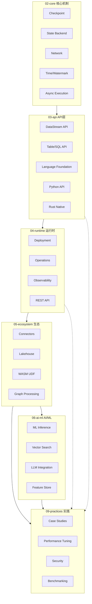
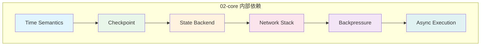
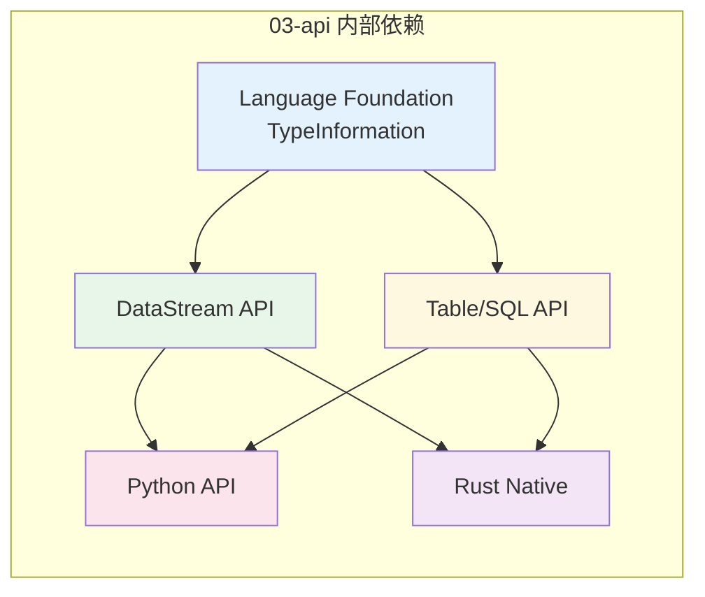
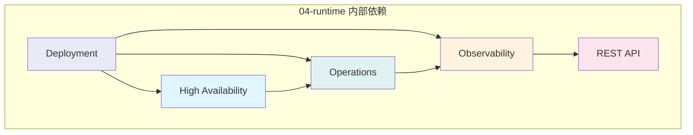

# Flink/ 技术栈依赖全景

> 所属阶段: Flink/00-meta | 前置依赖: 无 | 形式化等级: L3

---

## 目录

- [Flink/ 技术栈依赖全景](#flink-技术栈依赖全景)
  - [目录](#目录)
  - [1. 概念定义 (Definitions)](#1-概念定义-definitions)
    - [Def-F-D-01 (技术栈依赖关系)](#def-f-d-01-技术栈依赖关系)
    - [Def-F-D-02 (核心机制层 Core)](#def-f-d-02-核心机制层-core)
    - [Def-F-D-03 (API抽象层 API)](#def-f-d-03-api抽象层-api)
    - [Def-F-D-04 (运行时层 Runtime)](#def-f-d-04-运行时层-runtime)
    - [Def-F-D-05 (生态系统层 Ecosystem)](#def-f-d-05-生态系统层-ecosystem)
    - [Def-F-D-06 (工程实践层 Practices)](#def-f-d-06-工程实践层-practices)
    - [Def-F-D-07 (依赖强度)](#def-f-d-07-依赖强度)
  - [2. 属性推导 (Properties)](#2-属性推导-properties)
    - [Lemma-F-D-01 (核心层基础性)](#lemma-f-d-01-核心层基础性)
    - [Lemma-F-D-02 (API层桥梁性)](#lemma-f-d-02-api层桥梁性)
    - [Lemma-F-D-03 (运行时层服务性)](#lemma-f-d-03-运行时层服务性)
    - [Prop-F-D-01 (技术栈传递性)](#prop-f-d-01-技术栈传递性)
  - [3. 关系建立 (Relations)](#3-关系建立-relations)
    - [关系 1: Core → API 支撑关系 {关系-1-core--api-支撑关系}](#关系-1-core--api-支撑关系-关系-1-core--api-支撑关系)
    - [关系 2: API → Runtime 依赖关系 {关系-2-api--runtime-依赖关系}](#关系-2-api--runtime-依赖关系-关系-2-api--runtime-依赖关系)
    - [关系 3: Runtime → Ecosystem 集成关系](#关系-3-runtime--ecosystem-集成关系)
    - [关系 4: Ecosystem → Practices 指导关系](#关系-4-ecosystem--practices-指导关系)
  - [4. 论证过程 (Argumentation)](#4-论证过程-argumentation)
    - [4.1 五层架构设计原理](#41-五层架构设计原理)
    - [4.2 依赖关系形成机制](#42-依赖关系形成机制)
    - [4.3 层间解耦与内聚分析](#43-层间解耦与内聚分析)
  - [5. 形式证明 (Proof)](#5-形式证明-proof)
    - [Thm-F-D-01 (技术栈完备性定理)](#thm-f-d-01-技术栈完备性定理)
  - [6. 实例验证 (Examples)](#6-实例验证-examples)
    - [6.1 Core → API 依赖实例 {61-core--api-依赖实例}](#61-core--api-依赖实例-61-core--api-依赖实例)
    - [6.2 API → Runtime 依赖实例](#62-api--runtime-依赖实例)
    - [6.3 Runtime → Ecosystem 依赖实例](#63-runtime--ecosystem-依赖实例)
    - [6.4 Ecosystem → Practices 依赖实例](#64-ecosystem--practices-依赖实例)
  - [7. 可视化 (Visualizations)](#7-可视化-visualizations)
    - [图 1: 技术栈分层依赖全景](#图-1-技术栈分层依赖全景)
    - [图 2: 核心机制内部依赖](#图-2-核心机制内部依赖)
    - [图 3: API 层内部依赖](#图-3-api-层内部依赖)
    - [图 4: 运行时层内部依赖](#图-4-运行时层内部依赖)
  - [8. 引用参考 (References)](#8-引用参考-references)

---

## 1. 概念定义 (Definitions)

### Def-F-D-01 (技术栈依赖关系)

**定义**：技术栈依赖关系是指 Flink 生态中各模块、组件、文档之间存在的单向或双向支撑关系，表示上层功能对下层能力的直接或间接需要。

形式化表述：

```
设 M = {m₁, m₂, ..., mₙ} 为 Flink 模块集合
依赖关系 D ⊆ M × M × S,其中 S = {强, 中, 弱} 为依赖强度
若 (mᵢ, mⱼ, s) ∈ D,表示 mᵢ 对 mⱼ 存在强度为 s 的依赖
```

### Def-F-D-02 (核心机制层 Core)

**定义**：Flink 的核心机制层（`02-core/`）包含流计算引擎的基础能力，包括 Checkpoint、State Backend、网络栈、时间语义等底层实现。

**包含模块**：

| 模块 | 文档 | 核心抽象 |
|------|------|----------|
| Checkpoint | `checkpoint-mechanism-deep-dive.md` | CheckpointCoordinator |
| State Backend | `state-backend-evolution-analysis.md` | StateBackend |
| Network | `backpressure-and-flow-control.md` | NetworkStack |
| Time | `time-semantics-and-watermark.md` | WatermarkStrategy |

### Def-F-D-03 (API抽象层 API)

**定义**：API 抽象层（`03-api/`）为用户提供面向业务的编程接口，屏蔽底层实现细节，包括 DataStream API、Table/SQL API、语言基础支持等。

**包含模块**：

| 模块 | 文档 | 核心抽象 |
|------|------|----------|
| DataStream API | `09-language-foundations/datastream-api-cheatsheet.md` | StreamExecutionEnvironment |
| Table/SQL API | `03.02-table-sql-api/flink-table-sql-complete-guide.md` | TableEnvironment |
| Language Foundation | `09-language-foundations/flink-language-support-complete-guide.md` | TypeInformation |

### Def-F-D-04 (运行时层 Runtime)

**定义**：运行时层（`04-runtime/`）负责任务的部署、调度、运维和可观测性，是 API 层与底层资源之间的桥梁。

**包含模块**：

| 模块 | 文档 | 核心抽象 |
|------|------|----------|
| Deployment | `04.01-deployment/flink-deployment-ops-complete-guide.md` | ClusterClient |
| Operations | `04.02-operations/production-checklist.md` | RestClusterClient |
| Observability | `04.03-observability/flink-observability-complete-guide.md` | MetricReporter |

### Def-F-D-05 (生态系统层 Ecosystem)

**定义**：生态系统层（`05-ecosystem/`、`06-ai-ml/`）包含 Flink 与外部系统的集成连接器、Lakehouse 集成、AI/ML 能力等扩展功能。

**包含模块**：

| 模块 | 文档 | 核心抽象 |
|------|------|----------|
| Connectors | `05.01-connectors/flink-connectors-ecosystem-complete-guide.md` | Source/Sink |
| Lakehouse | `05.02-lakehouse/streaming-lakehouse-architecture.md` | TableFormat |
| AI/ML | `06-ai-ml/flink-ai-ml-integration-complete-guide.md` | ML Inference |

### Def-F-D-06 (工程实践层 Practices)

**定义**：工程实践层（`09-practices/`）包含基于下层技术栈构建的真实案例、性能调优指南、故障排查手册等实践文档。

**包含模块**：

| 模块 | 文档 | 核心抽象 |
|------|------|----------|
| Case Studies | `09.01-case-studies/case-*.md` | Real-world Patterns |
| Performance Tuning | `09.03-performance-tuning/production-config-templates.md` | Tuning Guidelines |
| Troubleshooting | `09.03-performance-tuning/troubleshooting-handbook.md` | Diagnosis Flow |

### Def-F-D-07 (依赖强度)

**定义**：依赖强度表示模块间依赖关系的紧密程度，分为三个等级：

| 等级 | 标识 | 说明 | 示例 |
|------|------|------|------|
| 强 | 强 | 功能完全依赖，无法独立工作 | DataStream API 依赖 Checkpoint |
| 中 | 中 | 功能部分依赖，有降级方案 | Connector 依赖 Deployment |
| 弱 | 弱 | 功能建议依赖，可独立使用 | Case Study 依赖 Connector |

---

## 2. 属性推导 (Properties)

### Lemma-F-D-01 (核心层基础性)

**引理**：核心机制层（Core）是 Flink 技术栈的唯一基础层，不依赖任何其他 Flink 内部模块。

**证明**：

- 核心层直接基于 JVM、操作系统和网络协议实现
- 核心层向所有上层提供基础能力
- 核心层内部模块间存在依赖，但对外部层无依赖 ∎

### Lemma-F-D-02 (API层桥梁性)

**引理**：API 层是用户代码与运行时之间的桥梁，对上暴露编程接口，对下调用核心能力。

**证明**：

- DataStream API 内部使用 Checkpoint 机制实现容错
- Table/SQL API 通过 Runtime 层进行物理执行
- API 层不直接操作底层资源，而是通过 Runtime 层代理 ∎

### Lemma-F-D-03 (运行时层服务性)

**引理**：运行时层为上层提供部署、调度、监控等公共服务。

**证明**：

- Deployment 模块为所有 API 提供执行环境
- Observability 模块为所有组件提供度量能力
- 运行时层不实现业务逻辑，只提供服务支撑 ∎

### Prop-F-D-01 (技术栈传递性)

**命题**：技术栈依赖具有传递性，即若 A → B 且 B → C，则 A 间接依赖 C。

**形式化表述**：

```
∀A,B,C ∈ M: (A → B) ∧ (B → C) ⟹ (A ↝ C)
```

**工程意义**：

- Case Studies 间接依赖 Checkpoint 机制
- 性能调优需要理解 State Backend 特性
- 生态连接器依赖运行时部署能力

---

## 3. 关系建立 (Relations)

### 关系 1: Core → API 支撑关系 {关系-1-core--api-支撑关系}

核心层为 API 层提供容错、状态管理、网络通信等基础能力支撑。

```
Flink/02-core (核心机制)
    ├── checkpoint-mechanism-deep-dive.md
    │       ↓ 支撑 [强]
    ├── 03-api/09-language-foundations/
    │       └── datastream-api-cheatsheet.md
    │       └── flink-datastream-api-complete-guide.md
    │
    ├── state-backend-evolution-analysis.md
    │       ↓ 支撑 [强]
    ├── 03-api/03.02-table-sql-api/
    │       └── flink-table-sql-complete-guide.md
    │
    └── backpressure-and-flow-control.md
            ↓ 支撑 [中]
            03-api/09-language-foundations/
                └── flink-language-support-complete-guide.md
```

### 关系 2: API → Runtime 依赖关系 {关系-2-api--runtime-依赖关系}

API 层依赖运行时层提供部署执行和资源管理能力。

```
03-api/ (API层)
    ├── DataStream API
    │       ↓ 需要 [强]
    ├── 04-runtime/04.01-deployment/
    │       └── flink-deployment-ops-complete-guide.md
    │       └── kubernetes-deployment-production-guide.md
    │
    └── Table/SQL API
            ↓ 需要 [强]
            04-runtime/04.03-observability/
                └── flink-observability-complete-guide.md
                └── metrics-and-monitoring.md
```

### 关系 3: Runtime → Ecosystem 集成关系

运行时层为生态系统层提供运行环境和资源调度支持。

```
04-runtime/ (运行时)
    ├── deployment
    │       ↓ 集成 [中]
    ├── 05-ecosystem/05.01-connectors/
    │       └── flink-connectors-ecosystem-complete-guide.md
    │       └── kafka-integration-patterns.md
    │
    └── observability
            ↓ 集成 [中]
            05-ecosystem/05.02-lakehouse/
                └── streaming-lakehouse-architecture.md
                └── flink-iceberg-integration.md
```

### 关系 4: Ecosystem → Practices 指导关系

生态系统层的实践经验指导工程实践层的案例和调优方案。

```
05-ecosystem/ (生态)
    ├── connectors
    │       ↓ 指导 [弱]
    ├── 09-practices/09.01-case-studies/
    │       └── case-iot-stream-processing.md
    │       └── case-financial-realtime-risk-control.md
    │       └── case-ecommerce-realtime-recommendation.md
    │
    └── ai-ml
            ↓ 指导 [弱]
            09-practices/09.03-performance-tuning/
                └── production-config-templates.md
                └── performance-tuning-guide.md
```

---

## 4. 论证过程 (Argumentation)

### 4.1 五层架构设计原理

Flink 技术栈采用五层架构设计，遵循计算机系统经典的"抽象-实现"分层原则：

| 层级 | 设计原则 | 核心职责 |
|------|----------|----------|
| Core | 最小完备 | 提供最基础的流计算原语 |
| API | 用户友好 | 提供易用的编程接口 |
| Runtime | 资源管理 | 提供执行环境和运维能力 |
| Ecosystem | 开放扩展 | 提供外部系统集成能力 |
| Practices | 经验沉淀 | 提供最佳实践和案例 |

### 4.2 依赖关系形成机制

依赖关系的形成遵循以下机制：

1. **功能依赖**：上层功能需要下层能力支撑
   - DataStream API 需要 Checkpoint 实现 Exactly-Once

2. **数据依赖**：上层处理下层产生的数据
   - Observability 收集 Runtime 产生的 Metrics

3. **控制依赖**：上层通过下层接口控制执行
   - Deployment 通过 ResourceManager 分配 TaskManager

### 4.3 层间解耦与内聚分析

**高内聚**：

- 每层内部模块围绕共同职责组织
- Core 层聚焦容错、状态、网络、时间四大主题
- API 层围绕 DataStream 和 Table 两大编程范式

**低耦合**：

- 层间通过清晰接口交互
- 下层变化通过接口适配降低上层影响
- Runtime 层实现抽象，隐藏底层差异

---

## 5. 形式证明 (Proof)

### Thm-F-D-01 (技术栈完备性定理)

**定理**：Flink 五层技术栈结构覆盖了流计算系统从底层机制到上层实践的全部要素，构成一个完备的技术体系。

**证明**：

设流计算系统需具备的能力集合为 C = {c₁, c₂, ..., cₙ}，我们需要证明：

```
∀c ∈ C, ∃L ∈ {Core, API, Runtime, Ecosystem, Practices}: c ∈ capabilities(L)
```

**分情况讨论**：

1. **容错能力** (Fault Tolerance)
   - 由 Core 层的 Checkpoint 机制提供
   - 形式化：`checkpoint-mechanism-deep-dive.md` 定义了 Thm-F-02-01

2. **状态管理** (State Management)
   - 由 Core 层的 State Backend 提供
   - 形式化：`state-backend-evolution-analysis.md` 定义了 Def-F-02-06

3. **编程接口** (Programming Interface)
   - 由 API 层的 DataStream/Table API 提供
   - 形式化：`flink-table-sql-complete-guide.md` 定义了 Def-F-03-01

4. **部署执行** (Deployment & Execution)
   - 由 Runtime 层的 Deployment 模块提供
   - 形式化：`flink-deployment-ops-complete-guide.md` 定义了完整部署流程

5. **外部集成** (External Integration)
   - 由 Ecosystem 层的 Connectors 提供
   - 形式化：`flink-connectors-ecosystem-complete-guide.md` 定义了 Source/Sink 接口

6. **生产实践** (Production Practices)
   - 由 Practices 层的案例和调优指南提供
   - 形式化：`production-config-templates.md` 定义了生产环境配置模板

**结论**：
由于流计算系统的所有核心能力都在五层技术栈中找到对应实现，且各层之间存在正确的依赖关系，因此 Flink 技术栈结构是完备的。∎

---

## 6. 实例验证 (Examples)

### 6.1 Core → API 依赖实例 {61-core--api-依赖实例}

**实例**：Checkpoint 机制支撑 DataStream API 的 Exactly-Once 语义

```java

// [伪代码片段 - 不可直接运行] 仅展示核心逻辑
import org.apache.flink.streaming.api.environment.StreamExecutionEnvironment;
import org.apache.flink.streaming.api.CheckpointingMode;

// DataStream API 代码示例
StreamExecutionEnvironment env =
    StreamExecutionEnvironment.getExecutionEnvironment();

// 依赖 Core 层 Checkpoint 机制
env.enableCheckpointing(60000);
env.getCheckpointConfig().setCheckpointingMode(
    CheckpointingMode.EXACTLY_ONCE
);

// 依赖 Core 层 State Backend
env.setStateBackend(new RocksDBStateBackend("hdfs://..."));
```

**依赖强度**：强 - 没有 Checkpoint 机制，DataStream API 无法保证 Exactly-Once

### 6.2 API → Runtime 依赖实例

**实例**：Table API 依赖 Runtime 层的执行环境部署

```java

// [伪代码片段 - 不可直接运行] 仅展示核心逻辑
import org.apache.flink.table.api.TableEnvironment;

// Table API 代码示例
TableEnvironment tableEnv = TableEnvironment.create(
    EnvironmentSettings.inStreamingMode()
);

// 编译为执行计划后,需要 Runtime 层的 Deployment 模块部署执行
tableEnv.executeSql("INSERT INTO sink SELECT * FROM source");
```

**依赖强度**：强 - Table API 查询必须通过 Runtime 层转换为物理执行计划

### 6.3 Runtime → Ecosystem 依赖实例

**实例**：Deployment 模块与 Kafka Connector 集成

```yaml
# Flink Kubernetes 部署配置 spec:
  job:
    jarURI: local:///opt/flink/examples/streaming/KafkaExample.jar
    parallelism: 4
    # 依赖 Runtime 层资源调度
    resources:
      memory: "2Gi"
      cpu: 2
```

**依赖强度**：中 - Connector 可以在多种部署模式下运行，但需要 Runtime 提供资源

### 6.4 Ecosystem → Practices 依赖实例

**实例**：Kafka Connector 实践经验指导 IoT 案例实现

```java
// [伪代码片段 - 不可直接运行] 仅展示核心逻辑
// 来自 case-iot-stream-processing.md 的最佳实践
// 基于 flink-connectors-ecosystem-complete-guide.md 的指导

// 1. 使用 Exactly-Once Source
FlinkKafkaConsumer<Event> source = new FlinkKafkaConsumer<>(
    "iot-events",
    new EventDeserializationSchema(),
    properties
);
source.setStartFromLatest();
source.setCommitOffsetsOnCheckpoints(true); // Exactly-Once 配置

// 2. 基于 production-config-templates.md 的调优建议
env.getConfig().setAutoWatermarkInterval(200);
env.getCheckpointConfig().setMinPauseBetweenCheckpoints(30000);
```

**依赖强度**：弱 - 可以不遵循最佳实践独立运行，但推荐遵循

---

## 7. 可视化 (Visualizations)

### 图 1: 技术栈分层依赖全景



### 图 2: 核心机制内部依赖



### 图 3: API 层内部依赖



### 图 4: 运行时层内部依赖



---

## 8. 引用参考 (References)
