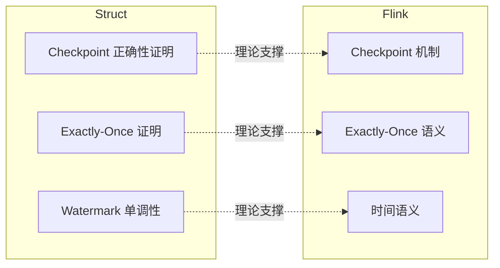
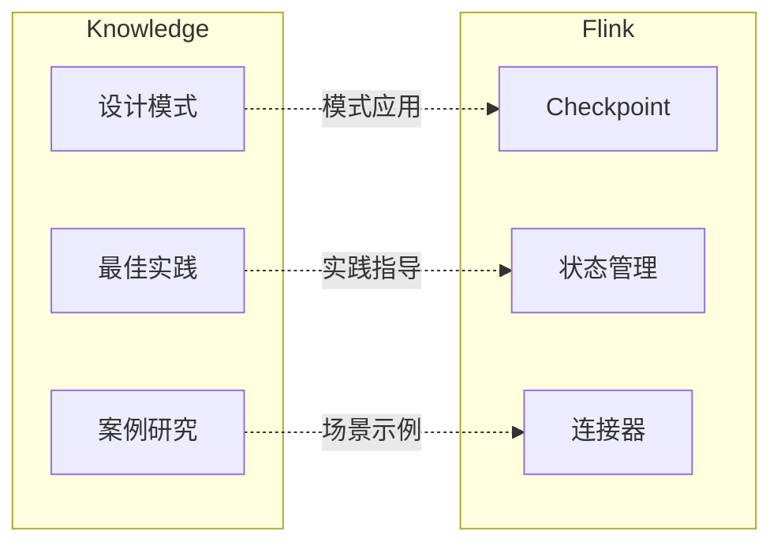

# Flink/ 专项文档索引

> **所属阶段**: Flink/ | **前置依赖**: [项目根目录](../README.md), [Knowledge/00-INDEX.md](../Knowledge/00-INDEX.md) | **状态**: 持续更新

## 简介

**Flink/** 目录收录 Apache Flink 流计算框架的完整技术文档，涵盖从核心概念到生产实践的各个方面。

**核心定位**:

- 🏗️ 架构设计: Flink 系统架构与部署模式
- ⚙️ 核心机制: Checkpoint、状态管理、时间语义
- 🔌 API 生态: DataStream、Table API、SQL
- 🌐 生态系统: Connectors、Lakehouse 集成
- 🤖 AI/ML 集成: 实时机器学习、LLM 集成
- 🦀 Rust 生态: WASM UDF、高性能计算
- 📊 性能优化: 基准测试、调优指南
- 🚀 路线图: Flink 2.4/2.5/3.0 版本演进

---

## 快速导航

| 入口 | 描述 | 推荐度 |
|------|------|--------|
| [00-meta/00-INDEX.md](00-meta/00-INDEX.md) | 详细分类索引 | ⭐⭐⭐⭐⭐ |
| [00-meta/00-QUICK-START.md](00-meta/00-QUICK-START.md) | 快速入门指南 | ⭐⭐⭐⭐⭐ |
| [02-core/checkpoint-mechanism-deep-dive.md](02-core/checkpoint-mechanism-deep-dive.md) | Checkpoint 机制深度解析 | ⭐⭐⭐⭐⭐ |
| [03-api/03.02-table-sql-api/flink-table-sql-complete-guide.md](03-api/03.02-table-sql-api/flink-table-sql-complete-guide.md) | SQL 完整指南 | ⭐⭐⭐⭐⭐ |

---

## 模块索引

### 01. 架构设计 (Architecture)

> 系统架构、部署模式、版本演进

| 文档 | 描述 | 版本 |
|------|------|------|
| [01-concepts/deployment-architectures.md](01-concepts/deployment-architectures.md) | 部署架构全解析 | 1.17+ |
| [01-concepts/flink-1.x-vs-2.0-comparison.md](01-concepts/flink-1.x-vs-2.0-comparison.md) | 1.x vs 2.0 架构对比 | 1.18-2.0 |
| [01-concepts/flink-system-architecture-deep-dive.md](01-concepts/flink-system-architecture-deep-dive.md) | 系统架构深度解析 | 1.17+ |
| [01-concepts/disaggregated-state-analysis.md](01-concepts/disaggregated-state-analysis.md) | 分离式状态存储 | 2.0+ |

---

### 02. 核心机制 (Core Mechanisms)

> Checkpoint、状态管理、时间语义、容错机制

#### Checkpoint 与容错 ⭐

| 文档 | 描述 | 版本 |
|------|------|------|
| [02-core/checkpoint-mechanism-deep-dive.md](02-core/checkpoint-mechanism-deep-dive.md) | Checkpoint 机制深度解析 | 1.17+ |
| [02-core/exactly-once-semantics-deep-dive.md](02-core/exactly-once-semantics-deep-dive.md) | Exactly-Once 语义详解 | 1.17+ |
| [02-core/exactly-once-end-to-end.md](02-core/exactly-once-end-to-end.md) | 端到端 Exactly-Once | 1.17+ |
| [02-core/smart-checkpointing-strategies.md](02-core/smart-checkpointing-strategies.md) | 智能 Checkpoint 策略 | 1.18+ |

#### 状态管理 ⭐

| 文档 | 描述 | 版本 |
|------|------|------|
| [02-core/flink-state-management-complete-guide.md](02-core/flink-state-management-complete-guide.md) | 状态管理完整指南 | 1.17+ |
| [02-core/state-backends-deep-comparison.md](02-core/state-backends-deep-comparison.md) | State Backend 深度对比 | 1.17+ |
| [02-core/forst-state-backend.md](02-core/forst-state-backend.md) | ForSt State Backend | 2.0+ |
| [02-core/flink-state-ttl-best-practices.md](02-core/flink-state-ttl-best-practices.md) | 状态 TTL 最佳实践 | 1.17+ |

#### 时间与 Watermark ⭐

| 文档 | 描述 | 版本 |
|------|------|------|
| [02-core/time-semantics-and-watermark.md](02-core/time-semantics-and-watermark.md) | 时间语义与 Watermark | 1.17+ |

#### 执行优化

| 文档 | 描述 | 版本 |
|------|------|------|
| [02-core/backpressure-and-flow-control.md](02-core/backpressure-and-flow-control.md) | 背压与流量控制 | 1.17+ |
| [02-core/async-execution-model.md](02-core/async-execution-model.md) | 异步执行模型 | 1.18+ |
| [02-core/adaptive-execution-engine-v2.md](02-core/adaptive-execution-engine-v2.md) | 自适应执行引擎 V2 | 1.18+ |
| [02-core/multi-way-join-optimization.md](02-core/multi-way-join-optimization.md) | 多路 Join 优化 | 1.18+ |
| [02-core/delta-join.md](02-core/delta-join.md) | Delta Join | 1.19+ |
| [02-core/flink-delta-join-deep-dive.md](02-core/flink-delta-join-deep-dive.md) | Delta Join 深度解析 (2.1+) | 2.1+ | 🆕 v4.4 |
| [02-core/flink-streaming-multi-join-operator.md](02-core/flink-streaming-multi-join-operator.md) | StreamingMultiJoinOperator | 2.1+ | 🆕 v4.4 |

---

### 03. API 与语言 (API & Languages)

> DataStream API、Table API、SQL、多语言支持

#### Table API & SQL ⭐

| 文档 | 描述 | 版本 |
|------|------|------|
| [03-api/03.02-table-sql-api/flink-table-sql-complete-guide.md](03-api/03.02-table-sql-api/flink-table-sql-complete-guide.md) | 完整指南 | 1.17+ |
| [03-api/03.02-table-sql-api/flink-sql-window-functions-deep-dive.md](03-api/03.02-table-sql-api/flink-sql-window-functions-deep-dive.md) | 窗口函数深度解析 | 1.17+ |
| [03-api/03.02-table-sql-api/flink-sql-calcite-optimizer-deep-dive.md](03-api/03.02-table-sql-api/flink-sql-calcite-optimizer-deep-dive.md) | Calcite 优化器 | 1.17+ |
| [03-api/03.02-table-sql-api/flink-cep-complete-guide.md](03-api/03.02-table-sql-api/flink-cep-complete-guide.md) | CEP 完整指南 | 1.17+ |
| [03-api/03.02-table-sql-api/built-in-functions-complete-list.md](03-api/03.02-table-sql-api/built-in-functions-complete-list.md) | 内置函数列表 | 1.17+ |
| [03-api/03.02-table-sql-api/ansi-sql-2023-compliance-guide.md](03-api/03.02-table-sql-api/ansi-sql-2023-compliance-guide.md) | ANSI SQL 2023 | 1.19+ |
| [03-api/03.02-table-sql-api/model-ddl-and-ml-predict.md](03-api/03.02-table-sql-api/model-ddl-and-ml-predict.md) | Model DDLs 与 ML_PREDICT | 2.1+ | 🆕 v4.4 |

#### DataStream API

| 文档 | 描述 | 版本 |
|------|------|------|
| [03-api/09-language-foundations/flink-datastream-api-complete-guide.md](03-api/09-language-foundations/flink-datastream-api-complete-guide.md) | 完整指南 | 1.17+ |
| [03-api/09-language-foundations/datastream-api-cheatsheet.md](03-api/09-language-foundations/datastream-api-cheatsheet.md) | 速查表 | 1.17+ |
| [01-concepts/datastream-v2-semantics.md](01-concepts/datastream-v2-semantics.md) | DataStream V2 | 1.19+ |

#### 多语言支持

| 文档 | 描述 | 版本 |
|------|------|------|
| [03-api/09-language-foundations/pyflink-complete-guide.md](03-api/09-language-foundations/pyflink-complete-guide.md) | PyFlink 完整指南 | 1.17+ |
| [03-api/09-language-foundations/01.01-scala-types-for-streaming.md](03-api/09-language-foundations/01.01-scala-types-for-streaming.md) | Scala 类型系统 | 1.17+ |
| [03-api/09-language-foundations/flink-rust-native-api-guide.md](03-api/09-language-foundations/flink-rust-native-api-guide.md) | Rust Native API | 2.0+ |
| [03-api/09-language-foundations/02.03-python-async-api.md](03-api/09-language-foundations/02.03-python-async-api.md) | Python Async DataStream API | 2.2+ | 🆕 v4.4 |

---

### 04. 运行时与运维 (Runtime & Operations)

> 部署、运维、可观测性

#### 部署

| 文档 | 描述 | 版本 |
|------|------|------|
| [04-runtime/04.01-deployment/flink-deployment-ops-complete-guide.md](04-runtime/04.01-deployment/flink-deployment-ops-complete-guide.md) | 部署运维完整指南 | 1.17+ |
| [04-runtime/04.01-deployment/kubernetes-deployment-production-guide.md](04-runtime/04.01-deployment/kubernetes-deployment-production-guide.md) | K8s 生产部署 | 1.17+ |
| [04-runtime/04.01-deployment/flink-kubernetes-operator-deep-dive.md](04-runtime/04.01-deployment/flink-kubernetes-operator-deep-dive.md) | K8s Operator | 1.17+ |
| [04-runtime/04.01-deployment/flink-serverless-architecture.md](04-runtime/04.01-deployment/flink-serverless-architecture.md) | Serverless 架构 | 1.19+ |

#### 可观测性

| 文档 | 描述 | 版本 |
|------|------|------|
| [04-runtime/04.03-observability/flink-observability-complete-guide.md](04-runtime/04.03-observability/flink-observability-complete-guide.md) | 可观测性完整指南 | 1.17+ |
| [04-runtime/04.03-observability/metrics-and-monitoring.md](04-runtime/04.03-observability/metrics-and-monitoring.md) | 指标与监控 | 1.17+ |
| [04-runtime/04.03-observability/distributed-tracing.md](04-runtime/04.03-observability/distributed-tracing.md) | 分布式追踪 | 1.18+ |
| [04-runtime/04.03-observability/realtime-data-quality-monitoring.md](04-runtime/04.03-observability/realtime-data-quality-monitoring.md) | 实时数据质量监控与治理 | 1.17+ | 🆕 v4.5 |

---

### 05. 生态系统 (Ecosystem)

> Connectors、Lakehouse、图处理

#### Connectors ⭐

| 文档 | 描述 | 版本 |
|------|------|------|
| [05-ecosystem/05.01-connectors/flink-connectors-ecosystem-complete-guide.md](05-ecosystem/05.01-connectors/flink-connectors-ecosystem-complete-guide.md) | 连接器生态指南 | 1.17+ |
| [05-ecosystem/05.01-connectors/kafka-integration-patterns.md](05-ecosystem/05.01-connectors/kafka-integration-patterns.md) | Kafka 集成 | 1.17+ |
| [05-ecosystem/05.01-connectors/flink-cdc-3.0-data-integration.md](05-ecosystem/05.01-connectors/flink-cdc-3.0-data-integration.md) | CDC 3.0 | 1.18+ |
| [05-ecosystem/05.01-connectors/jdbc-connector-complete-guide.md](05-ecosystem/05.01-connectors/jdbc-connector-complete-guide.md) | JDBC 连接器 | 1.17+ |

#### Lakehouse

| 文档 | 描述 | 版本 |
|------|------|------|
| [05-ecosystem/05.02-lakehouse/streaming-lakehouse-architecture.md](05-ecosystem/05.02-lakehouse/streaming-lakehouse-architecture.md) | Lakehouse 架构设计深度指南 | 1.18+ | 🆕 v4.5 |
| [05-ecosystem/05.02-lakehouse/flink-iceberg-integration.md](05-ecosystem/05.02-lakehouse/flink-iceberg-integration.md) | Iceberg 集成 | 1.18+ |
| [05-ecosystem/05.02-lakehouse/flink-paimon-integration.md](05-ecosystem/05.02-lakehouse/flink-paimon-integration.md) | Paimon 集成 | 1.18+ |

#### Stateful Functions

| 文档 | 描述 | 版本 |
|------|------|------|
| [05-ecosystem/05.05-stateful-functions/stateful-functions-3.0-guide.md](05-ecosystem/05.05-stateful-functions/stateful-functions-3.0-guide.md) | StateFun 3.0 前瞻与生产实践 | 1.17+ | 🆕 v4.5 |

---

### 06. AI/ML 集成 (AI/ML Integration)

> 实时机器学习、LLM 集成、向量搜索

| 文档 | 描述 | 版本 |
|------|------|------|
| [06-ai-ml/flink-ai-ml-integration-complete-guide.md](06-ai-ml/flink-ai-ml-integration-complete-guide.md) | AI/ML 集成完整指南 | 1.19+ |
| [06-ai-ml/flink-llm-integration.md](06-ai-ml/flink-llm-integration.md) | LLM 集成 | 1.20+ |
| [06-ai-ml/flink-agents-flip-531.md](06-ai-ml/flink-ai-agents-flip-531.md) | AI Agents (FLIP-531) | 2.4+ |
| [06-ai-ml/flink-realtime-ml-inference.md](06-ai-ml/flink-realtime-ml-inference.md) | 实时 ML 推理 | 1.19+ |
| [06-ai-ml/realtime-feature-engineering-guide.md](06-ai-ml/realtime-feature-engineering-guide.md) | 实时特征工程 | 1.19+ |
| [06-ai-ml/vector-database-integration.md](06-ai-ml/vector-database-integration.md) | 向量数据库集成 | 1.20+ |

---

### 07. Rust 原生生态 (Rust Native)

> WASM UDF、SIMD 优化、高性能计算

| 文档 | 描述 | 版本 |
|------|------|------|
| [07-rust-native/00-MASTER-INDEX.md](07-rust-native/00-MASTER-INDEX.md) | Rust 生态主索引 | - |
| [07-rust-native/flash-engine/01-flash-architecture.md](07-rust-native/flash-engine/01-flash-architecture.md) | Flash 引擎架构 | 2.0+ |
| [07-rust-native/simd-optimization/01-simd-fundamentals.md](07-rust-native/simd-optimization/01-simd-fundamentals.md) | SIMD 优化基础 | 2.0+ |
| [07-rust-native/wasm-3.0/01-wasm-3.0-spec-guide.md](07-rust-native/wasm-3.0/01-wasm-3.0-spec-guide.md) | WASM 3.0 指南 | 2.0+ |

---

### 08. 路线图 (Roadmap)

> 版本演进与未来规划

| 文档 | 描述 | 版本 |
|------|------|------|
| [08-roadmap/08.01-flink-24/flink-version-evolution-complete-guide.md](08-roadmap/08.01-flink-24/flink-version-evolution-complete-guide.md) | 版本演进完整指南 | 全版本 |
| [08-roadmap/08.01-flink-24/flink-2.4-tracking.md](08-roadmap/08.01-flink-24/flink-2.4-tracking.md) | Flink 2.4 特性追踪 | 2.4 |
| [08-roadmap/08.01-flink-24/flink-2.5-preview.md](08-roadmap/08.01-flink-24/flink-2.5-preview.md) | Flink 2.5 预览 | 2.5 |
| [08-roadmap/08.01-flink-24/flink-30-architecture-redesign.md](08-roadmap/08.01-flink-24/flink-30-architecture-redesign.md) | Flink 3.0 架构重设计 | 3.0 |
| [08-roadmap/08.01-flink-24/flink-2.2-production-adoption-framework.md](08-roadmap/08.01-flink-24/flink-2.2-production-adoption-framework.md) | Flink 2.2 生产采用决策框架 | 2.2+ | 🆕 v4.5 |

---

### 09. 工程实践 (Practices)

> 案例研究、性能调优、最佳实践

#### 案例研究

| 文档 | 描述 | 场景 |
|------|------|------|
| [09-practices/09.01-case-studies/case-financial-realtime-risk-control.md](09-practices/09.01-case-studies/case-financial-realtime-risk-control.md) | 金融实时风控 | 金融 |
| [09-practices/09.01-case-studies/case-ecommerce-realtime-recommendation.md](09-practices/09.01-case-studies/case-ecommerce-realtime-recommendation.md) | 电商实时推荐 | 电商 |
| [09-practices/09.01-case-studies/case-iot-stream-processing.md](09-practices/09.01-case-studies/case-iot-stream-processing.md) | IoT 流处理 | IoT |
| [09-practices/09.01-case-studies/case-fraud-detection-advanced.md](09-practices/09.01-case-studies/case-fraud-detection-advanced.md) | 欺诈检测 | 安全 |

#### 性能调优

| 文档 | 描述 |
|------|------|
| [09-practices/09.03-performance-tuning/06.02-performance-optimization-complete.md](09-practices/09.03-performance-tuning/06.02-performance-optimization-complete.md) | 性能优化完整指南 |
| [09-practices/09.03-performance-tuning/performance-tuning-guide.md](09-practices/09.03-performance-tuning/performance-tuning-guide.md) | 性能调优指南 |
| [09-practices/09.02-benchmarking/nexmark-2026-benchmark.md](09-practices/09.02-benchmarking/nexmark-2026-benchmark.md) | Nexmark 基准测试 |

#### 安全

| 文档 | 描述 |
|------|------|
| [09-practices/09.04-security/flink-security-complete-guide.md](09-practices/09.04-security/flink-security-complete-guide.md) | 安全完整指南 |
| [09-practices/09.04-security/security-hardening-guide.md](09-practices/09.04-security/flink-security-complete-guide.md) | 安全加固指南 |

#### 部署

| 文档 | 描述 | 版本 |
|------|------|------|
| [09-practices/09.04-deployment/flink-gitops-deployment.md](09-practices/09.04-deployment/flink-gitops-deployment.md) | GitOps 部署深度指南 | 1.17+ | 🆕 v4.5 |
| [09-practices/09.04-deployment/flink-multi-cluster-federation.md](09-practices/09.04-deployment/flink-multi-cluster-federation.md) | 多集群联邦架构深度指南 | 1.17+ | 🆕 v4.5 |

---

### 10. 源码分析 (Internals)

> Flink 内部实现源码解析

| 文档 | 描述 |
|------|------|
| [10-internals/checkpoint-source-analysis.md](10-internals/checkpoint-source-analysis.md) | Checkpoint 源码分析 |
| [10-internals/jobmanager-source-analysis.md](10-internals/jobmanager-source-analysis.md) | JobManager 源码分析 |
| [10-internals/taskmanager-source-analysis.md](10-internals/taskmanager-source-analysis.md) | TaskManager 源码分析 |
| [10-internals/state-backend-internals.md](10-internals/state-backend-internals.md) | State Backend 内部实现 |
| [10-internals/network-stack-internals.md](10-internals/network-stack-internals.md) | Network Stack 内部实现 |

---

## 跨目录引用关系

### 与 Struct/ 的关系



### 与 Knowledge/ 的关系



---

## 学习路径

### 初学者路径 🌱

1. [00-meta/00-QUICK-START.md](00-meta/00-QUICK-START.md) - 快速入门
2. [02-core/checkpoint-mechanism-deep-dive.md](02-core/checkpoint-mechanism-deep-dive.md) - Checkpoint 机制
3. [02-core/time-semantics-and-watermark.md](02-core/time-semantics-and-watermark.md) - 时间语义
4. [03-api/09-language-foundations/flink-datastream-api-complete-guide.md](03-api/09-language-foundations/flink-datastream-api-complete-guide.md) - DataStream API
5. [03-api/03.02-table-sql-api/flink-table-sql-complete-guide.md](03-api/03.02-table-sql-api/flink-table-sql-complete-guide.md) - SQL 指南

### 进阶开发者路径 🚀

1. [02-core/flink-state-management-complete-guide.md](02-core/flink-state-management-complete-guide.md) - 状态管理
2. [02-core/exactly-once-semantics-deep-dive.md](02-core/exactly-once-semantics-deep-dive.md) - Exactly-Once
3. [05-ecosystem/05.01-connectors/flink-connectors-ecosystem-complete-guide.md](05-ecosystem/05.01-connectors/flink-connectors-ecosystem-complete-guide.md) - 连接器
4. [09-practices/09.03-performance-tuning/06.02-performance-optimization-complete.md](09-practices/09.03-performance-tuning/06.02-performance-optimization-complete.md) - 性能优化
5. [04-runtime/04.01-deployment/flink-deployment-ops-complete-guide.md](04-runtime/04.01-deployment/flink-deployment-ops-complete-guide.md) - 部署运维

### 架构师路径 🏗️

1. [08-roadmap/08.01-flink-24/flink-version-evolution-complete-guide.md](08-roadmap/08.01-flink-24/flink-version-evolution-complete-guide.md) - 版本演进
2. [01-concepts/deployment-architectures.md](01-concepts/deployment-architectures.md) - 部署架构
3. [06-ai-ml/](06-ai-ml/) - AI/ML 集成
4. [07-rust-native/](07-rust-native/) - Rust 生态

---

## 统计信息

```
Flink/ 目录统计:
├── 01-concepts/:          4 文档 (架构设计)
├── 02-core/:             20+ 文档 (核心机制)
├── 03-api/:              26+ 文档 (API 生态)
├── 04-runtime/:          30+ 文档 (运行时与运维)
├── 05-ecosystem/:        32+ 文档 (生态系统)
├── 06-ai-ml/:            25+ 文档 (AI/ML 集成)
├── 07-rust-native/:      40+ 文档 (Rust 生态)
├── 08-roadmap/:          16+ 文档 (路线图)
├── 09-practices/:        42+ 文档 (工程实践)
├── 10-internals/:        10 文档 (源码分析)
└── 00-meta/:              4 文档 (元文档)
----------------------------------------
总计: 约 396+ 文档
覆盖版本: Flink 1.17 - 3.0
```

---

## 导航链接

**项目索引**:

- [📁 项目根目录](../README.md) — 项目总览
- [🗺️ Knowledge/ 索引](../Knowledge/00-INDEX.md) — 知识结构
- [🧮 Struct/ 索引](../Struct/00-INDEX.md) — 形式理论
- [📖 定理注册表](../THEOREM-REGISTRY.md) — 形式化元素

**辅助工具**:

- [🗺️ 知识图谱](../knowledge-graph.html) — 交互式知识图谱
- [📚 术语表](../GLOSSARY.md) — 流计算术语表
- [🔍 搜索指南](../SEARCH-GUIDE.md) — 如何高效搜索

---

> **文档规范**: 本文档遵循 [AGENTS.md](../AGENTS.md) 中的六段式模板规范
> **更新日期**: 2026-04-12
