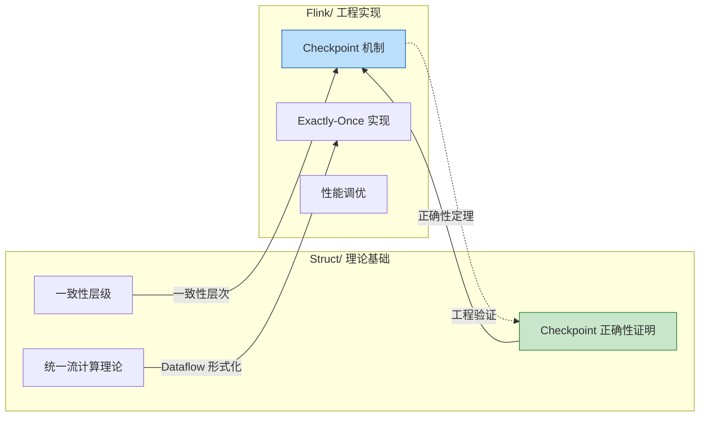
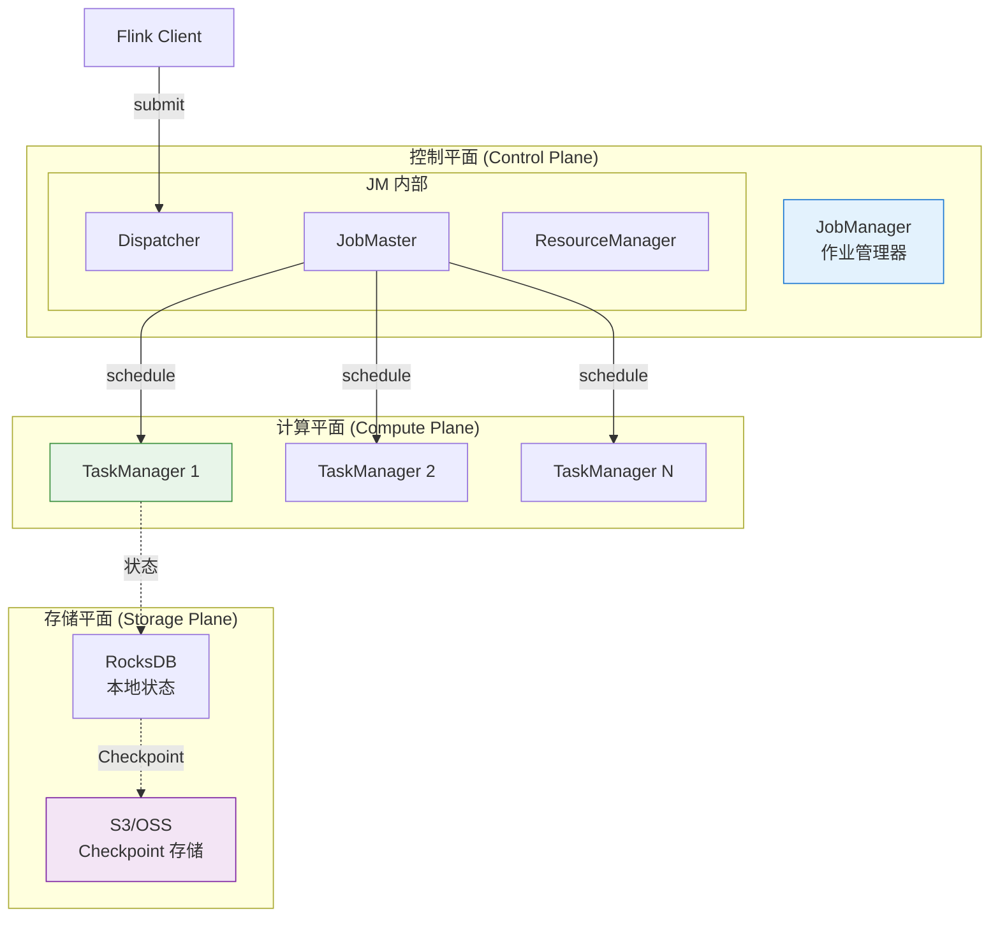
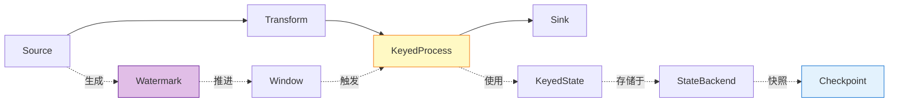
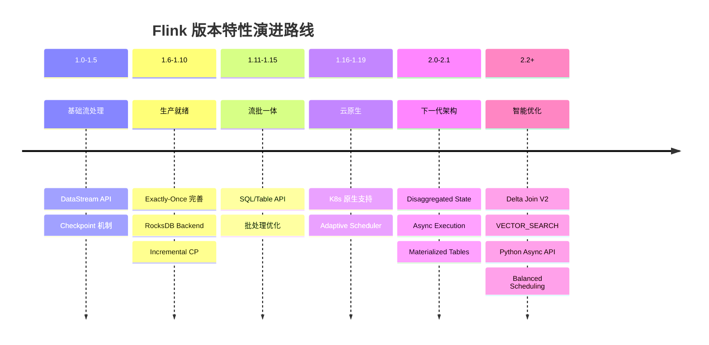
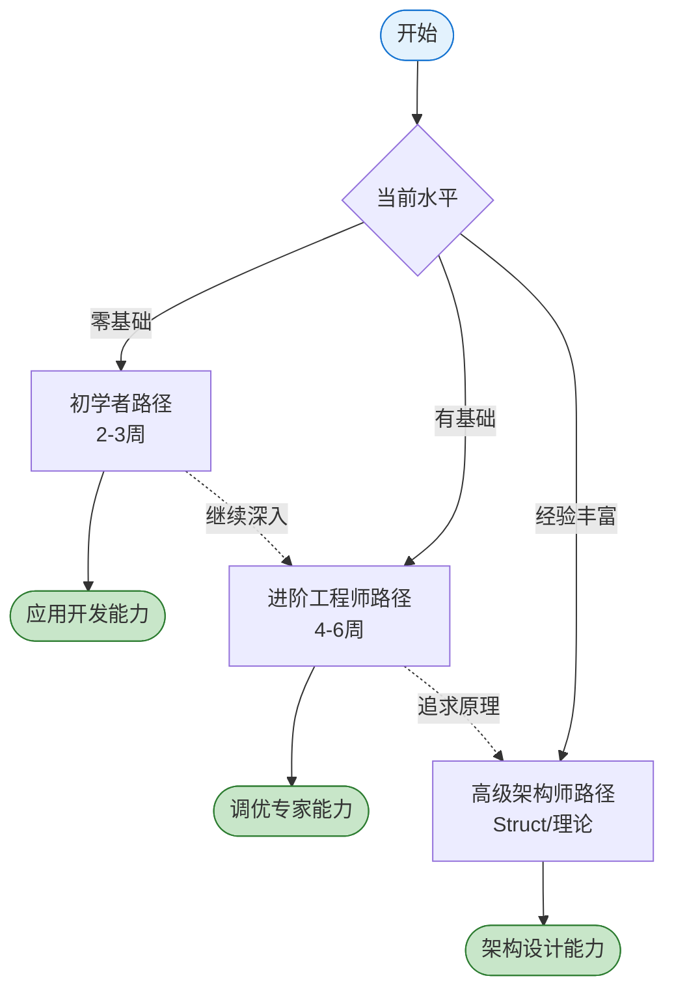
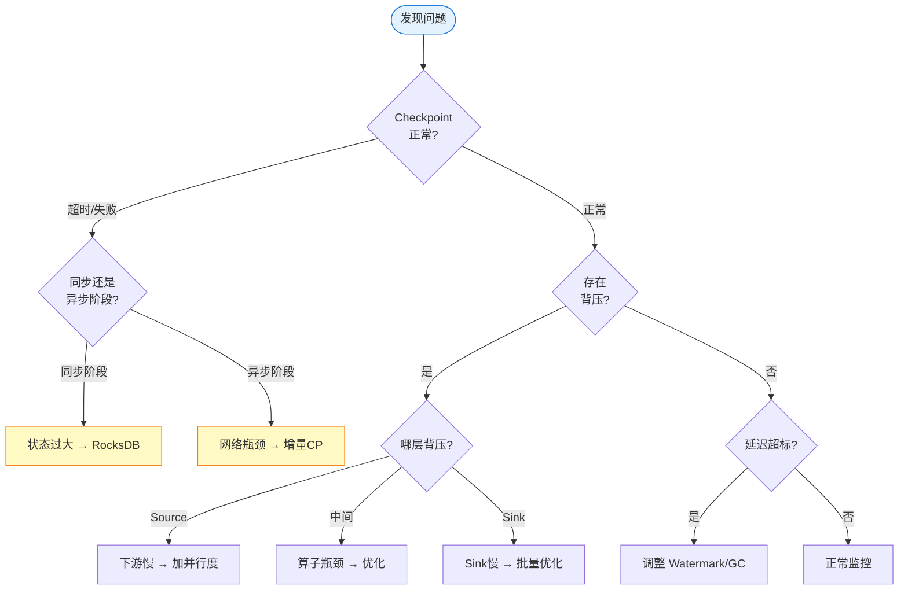

# Flink/ 专项文档索引 (Flink Documentation Index)

> **版本**: 2026.04-v2.3 | **范围**: Apache Flink 工程实践与核心技术深度解析 | **文档总数**: 74+ 核心文档 | **形式化等级**: L3-L5

---

## 目录

- [Flink/ 专项文档索引 (Flink Documentation Index)](#flink-专项文档索引-flink-documentation-index)
  - [目录](#目录)
  - [1. 概述 (Overview)](#1-概述-overview)
    - [1.1 Flink/ 目录定位](#11-flink-目录定位)
    - [1.2 与 Struct/ 的关系](#12-与-struct-的关系)
  - [2. 快速导航 (Quick Navigation)](#2-快速导航-quick-navigation)
    - [2.1 按主题分类导航](#21-按主题分类导航)
    - [2.2 按使用场景导航](#22-按使用场景导航)
  - [3. Flink 架构总览](#3-flink-架构总览)
    - [3.1 Flink 运行时架构图](#31-flink-运行时架构图)
    - [3.2 核心组件关系](#32-核心组件关系)
  - [4. 特性矩阵：Flink 能力演进](#4-特性矩阵flink-能力演进)
    - [4.1 Flink 1.x vs 2.0 功能对比](#41-flink-1x-vs-20-功能对比)
    - [4.2 特性演进路线图](#42-特性演进路线图)
    - [4.3 各版本关键特性速查](#43-各版本关键特性速查)
  - [5. 学习路径 (Learning Paths)](#5-学习路径-learning-paths)
    - [5.1 初学者路径 (Beginner) - 2-3 周](#51-初学者路径-beginner---2-3-周)
    - [5.2 进阶工程师路径 (Intermediate) - 4-6 周](#52-进阶工程师路径-intermediate---4-6-周)
    - [5.3 学习路径流程图](#53-学习路径流程图)
  - [6. 文档详细索引](#6-文档详细索引)
    - [6.1 01-architecture/ 架构层](#61-01-architecture-架构层)
    - [6.2 02-core-mechanisms/ 核心机制层](#62-02-core-mechanisms-核心机制层)
    - [6.3 03-sql-table-api/ SQL与表API层](#63-03-sql-table-api-sql与表api层)
    - [6.4 04-connectors/ 连接器层](#64-04-connectors-连接器层)
    - [6.5 05-vs-competitors/ 竞品对比层](#65-05-vs-competitors-竞品对比层)
    - [6.6 06-engineering/ 工程实践层](#66-06-engineering-工程实践层)
    - [6.7 07-case-studies/ 案例研究层](#67-07-case-studies-案例研究层)
    - [6.8 08-roadmap/ 发展路线图层](#68-08-roadmap-发展路线图层)
    - [6.9 09-language-foundations/ 语言基础层](#69-09-language-foundations-语言基础层)
    - [6.10 10-deployment/ 部署层](#610-10-deployment-部署层)
    - [6.11 11-benchmarking/ 基准测试层](#611-11-benchmarking-基准测试层)
    - [6.12 12-ai-ml/ AI与机器学习层](#612-12-ai-ml-ai与机器学习层)
    - [6.13 13-security/ 安全与可信计算层](#613-13-security-安全与可信计算层)
    - [6.14 14-lakehouse/ 湖仓集成层](#614-14-lakehouse-湖仓集成层)
    - [6.13 13-wasm/ WASM与WebAssembly层](#613-13-wasm-wasm与webassembly层)
    - [6.14 14-lakehouse/ 湖仓集成层](#614-14-lakehouse-湖仓集成层-1)
    - [6.15 15-observability/ 可观测性层](#615-15-observability-可观测性层)
  - [7. 跨引用索引：Flink ↔ Struct](#7-跨引用索引flink--struct)
    - [7.1 核心概念对应关系](#71-核心概念对应关系)
    - [7.2 形式化证明与工程实现对照](#72-形式化证明与工程实现对照)
  - [8. 故障排查索引 (Troubleshooting Index)](#8-故障排查索引-troubleshooting-index)
    - [8.1 常见问题分类](#81-常见问题分类)
    - [8.2 问题诊断决策树](#82-问题诊断决策树)
    - [8.3 性能问题速查](#83-性能问题速查)
  - [附录：配置参数速查](#附录配置参数速查)
    - [Checkpoint 配置](#checkpoint-配置)
    - [网络调优配置](#网络调优配置)
    - [JVM 配置](#jvm-配置)
  - [术语表](#术语表)

---

## 1. 概述 (Overview)

### 1.1 Flink/ 目录定位

**Flink/ 目录** 是一个面向工程实践的 Apache Flink 深度技术文档集合，定位于 **L3-L4 知识层次**：

| 层次 | 定位 | 内容特征 | 代表文档 |
|------|------|----------|----------|
| **L4** | 系统深度剖析 | 机制原理、形式化定义、正确性论证 | Checkpoint 机制、时间语义 |
| **L3** | 工程最佳实践 | 配置调优、故障排查、性能优化 | 性能调优指南、连接器配置 |
| **L2** | API 使用指南 | 代码示例、API 对比 | SQL vs DataStream 对比 |

### 1.2 与 Struct/ 的关系



**核心映射关系**:

| Struct/ 理论文档 | Flink/ 工程文档 | 映射关系 |
|------------------|-----------------|----------|
| [01.04-dataflow-model-formalization.md](../Struct/01-foundation/01.04-dataflow-model-formalization.md) | [datastream-v2-semantics.md](01-architecture/datastream-v2-semantics.md) | Dataflow 理论 → API 语义 |
| [02.02-consistency-hierarchy.md](../Struct/02-properties/02.02-consistency-hierarchy.md) | [exactly-once-end-to-end.md](02-core-mechanisms/exactly-once-end-to-end.md) | 一致性层级 → EO 实现 |
| [04.01-flink-checkpoint-correctness.md](../Struct/04-proofs/04.01-flink-checkpoint-correctness.md) | [checkpoint-mechanism-deep-dive.md](02-core-mechanisms/checkpoint-mechanism-deep-dive.md) | 形式化证明 → 工程实现 |
| [02.03-watermark-monotonicity.md](../Struct/02-properties/02.03-watermark-monotonicity.md) | [time-semantics-and-watermark.md](02-core-mechanisms/time-semantics-and-watermark.md) | 单调性定理 → 生成策略 |

---

## 2. 快速导航 (Quick Navigation)

### 2.1 按主题分类导航

| 主题 | 核心文档 | 难度 | 阅读时间 |
|------|----------|------|----------|
| **架构演进** | [flink-1.x-vs-2.0-comparison.md](01-architecture/flink-1.x-vs-2.0-comparison.md) | L4 | 45 min |
| **架构演进** | [disaggregated-state-analysis.md](01-architecture/disaggregated-state-analysis.md) | L4 | 40 min |
| **核心机制** | [checkpoint-mechanism-deep-dive.md](02-core-mechanisms/checkpoint-mechanism-deep-dive.md) | L4 | 60 min |
| **核心机制** | [exactly-once-end-to-end.md](02-core-mechanisms/exactly-once-end-to-end.md) | L4 | 50 min |
| **核心机制** | [time-semantics-and-watermark.md](02-core-mechanisms/time-semantics-and-watermark.md) | L4 | 45 min |
| **核心机制** | [backpressure-and-flow-control.md](02-core-mechanisms/backpressure-and-flow-control.md) | L4 | 40 min |
| **核心机制** | [flink-2.2-frontier-features.md](02-core-mechanisms/flink-2.2-frontier-features.md) | L4 | 55 min |
| **核心机制** | [delta-join.md](02-core-mechanisms/delta-join.md) | L4 | 45 min |
| **SQL/Table API** | [sql-vs-datastream-comparison.md](03-sql-table-api/sql-vs-datastream-comparison.md) | L3 | 35 min |
| **SQL/Table API** | [query-optimization-analysis.md](03-sql-table-api/query-optimization-analysis.md) | L4 | 45 min |
| **AI/ML** | [online-learning-algorithms.md](12-ai-ml/online-learning-algorithms.md) | L4 | 50 min |
| **AI/ML** | [flink-ml-architecture.md](12-ai-ml/flink-ml-architecture.md) | L3 | 40 min |
| **AI/ML** | [rag-streaming-architecture.md](12-ai-ml/rag-streaming-architecture.md) | L4-L5 | 55 min |
| **AI/ML** | [realtime-feature-engineering-feature-store.md](12-ai-ml/realtime-feature-engineering-feature-store.md) | L4 | 50 min |
| **Lakehouse** | [flink-paimon-integration.md](14-lakehouse/flink-paimon-integration.md) | L4-L5 | 50 min |
| **Lakehouse** | [flink-iceberg-integration.md](14-lakehouse/flink-iceberg-integration.md) | L4-L5 | 45 min |
| **Security** | [gpu-confidential-computing.md](13-security/gpu-confidential-computing.md) | L4-L5 | 50 min |
| **Security** | [trusted-execution-flink.md](13-security/trusted-execution-flink.md) | L3-L4 | 40 min |
| **连接器** | [kafka-integration-patterns.md](04-connectors/kafka-integration-patterns.md) | L3 | 35 min |
| **竞品对比** | [flink-vs-spark-streaming.md](05-vs-competitors/flink-vs-spark-streaming.md) | L3 | 30 min |
| **工程实践** | [performance-tuning-guide.md](06-engineering/performance-tuning-guide.md) | L4 | 50 min |

### 2.2 按使用场景导航

| 场景 | 问题描述 | 推荐阅读 |
|------|----------|----------|
| **架构选型** | Flink 1.x 还是 2.0？是否迁移？ | [flink-1.x-vs-2.0-comparison.md](01-architecture/flink-1.x-vs-2.0-comparison.md) |
| **架构选型** | Flink vs Spark Streaming 选哪个？ | [flink-vs-spark-streaming.md](05-vs-competitors/flink-vs-spark-streaming.md) |
| **架构选型** | SQL API 还是 DataStream API？ | [sql-vs-datastream-comparison.md](03-sql-table-api/sql-vs-datastream-comparison.md) |
| **故障排查** | Checkpoint 频繁超时怎么办？ | [checkpoint-mechanism-deep-dive.md](02-core-mechanisms/checkpoint-mechanism-deep-dive.md) |
| **故障排查** | 作业背压严重如何处理？ | [backpressure-and-flow-control.md](02-core-mechanisms/backpressure-and-flow-control.md) |
| **性能优化** | 如何提升作业吞吐？ | [performance-tuning-guide.md](06-engineering/performance-tuning-guide.md) |
| **一致性保障** | 如何确保 Exactly-Once？ | [exactly-once-end-to-end.md](02-core-mechanisms/exactly-once-end-to-end.md) |
| **系统集成** | Kafka 集成最佳实践？ | [kafka-integration-patterns.md](04-connectors/kafka-integration-patterns.md) |
| **AI/ML** | 流式机器学习如何实现？ | [online-learning-algorithms.md](12-ai-ml/online-learning-algorithms.md) |
| **AI/ML** | RAG 流式架构如何设计？ | [rag-streaming-architecture.md](12-ai-ml/rag-streaming-architecture.md) |
| **AI/ML** | 向量数据库如何集成？ | [vector-database-integration.md](12-ai-ml/vector-database-integration.md) |
| **前沿特性** | Flink 2.2 新特性有哪些？ | [flink-2.2-frontier-features.md](02-core-mechanisms/flink-2.2-frontier-features.md) |
| **SQL/Table API** | Delta Join 如何使用？ | [delta-join.md](02-core-mechanisms/delta-join.md) |
| **Lakehouse** | 流批统一存储选哪个？ | [flink-paimon-integration.md](14-lakehouse/flink-paimon-integration.md) |
| **Lakehouse** | Delta Lake 如何集成？ | [flink-delta-lake-integration.md](04-connectors/flink-delta-lake-integration.md) |
| **AI/ML** | 实时特征工程如何实现？ | [realtime-feature-engineering-feature-store.md](12-ai-ml/realtime-feature-engineering-feature-store.md) |
| **数据质量** | 实时数据质量如何监控？ | [realtime-data-quality-monitoring.md](15-observability/realtime-data-quality-monitoring.md) |
| **ETL** | Streaming ETL 最佳实践？ | [streaming-etl-best-practices.md](02-core-mechanisms/streaming-etl-best-practices.md) |
| **案例** | 智能制造IoT案例 | [case-smart-manufacturing-iot.md](07-case-studies/case-smart-manufacturing-iot.md) |
| **Security** | 敏感数据如何保护？ | [gpu-confidential-computing.md](13-security/gpu-confidential-computing.md) |

---

## 3. Flink 架构总览

### 3.1 Flink 运行时架构图



### 3.2 核心组件关系



---

## 4. 特性矩阵：Flink 能力演进

### 4.1 Flink 1.x vs 2.0 功能对比

| 维度 | Flink 1.x | Flink 2.0 | 工程影响 |
|------|-----------|-----------|----------|
| **状态存储** | 本地绑定 (TM-local) | 分离存储 (Disaggregated) | 恢复时间：分钟→秒 |
| **容错恢复** | 全量状态迁移 | 状态引用恢复 | 复杂度 O(n) → O(1) |
| **扩缩容** | Key Group 重分布 | 即时扩缩容 | 无需停止作业 |
| **执行模型** | 同步阻塞 | 异步非阻塞 | 吞吐 3-10x 提升 |
| **一致性** | 强一致 | 可配置 (Strong/Eventual) | 延迟-一致性权衡 |

### 4.2 特性演进路线图



### 4.3 各版本关键特性速查

| 版本 | 关键特性 | 推荐度 |
|------|----------|--------|
| **1.16** | 自适应调度器、检查点清理策略 | ★★★★★ |
| **1.17** | 通用增量 Checkpoint、SQL 优化 | ★★★★★ |
| **1.18** | 云原生检查点、动态扩展 | ★★★★★ |
| **2.0** | 分离状态存储、异步执行 | ★★★★★ |
| **2.1** | Delta Join、ML_PREDICT | ★★★★★ |
| **2.2** | VECTOR_SEARCH、Python Async API、Balanced Scheduling | ★★★★★ (预览) |

---

## 5. 学习路径 (Learning Paths)

### 5.1 初学者路径 (Beginner) - 2-3 周

```
Week 1: 基础概念
├── [flink-vs-spark-streaming.md] - Flink 定位与优势
├── [sql-vs-datastream-comparison.md] - API 选型基础
└── [deployment-architectures.md] - 部署模式

Week 2: 核心机制入门
├── [time-semantics-and-watermark.md] - 时间语义概念
└── [kafka-integration-patterns.md] - Kafka 集成

Week 3: 生产基础
└── [performance-tuning-guide.md] - 基础调优参数
```

### 5.2 进阶工程师路径 (Intermediate) - 4-6 周

```
Week 1: Checkpoint 与容错
├── [checkpoint-mechanism-deep-dive.md] - Checkpoint 完整剖析
└── [exactly-once-end-to-end.md] - 端到端 Exactly-Once

Week 2-3: 时间语义与状态
├── [time-semantics-and-watermark.md] - Watermark 深入
└── [disaggregated-state-analysis.md] - 状态存储架构

Week 4: 背压与流控
└── [backpressure-and-flow-control.md] - Credit-based 流控

Week 5-6: 性能调优
├── [performance-tuning-guide.md] - 完整调优指南
└── [query-optimization-analysis.md] - SQL 优化

Week 7-8: AI/ML 与 Lakehouse (可选)
├── [flink-ml-architecture.md] - Flink ML 架构
├── [online-learning-algorithms.md] - 在线学习算法
└── [flink-paimon-integration.md] - Paimon 集成
```

### 5.3 学习路径流程图



---

## 6. 文档详细索引

### 6.1 01-architecture/ 架构层

| 文档 | 主题 | 关联文档 |
|------|------|----------|
| [flink-1.x-vs-2.0-comparison.md](01-architecture/flink-1.x-vs-2.0-comparison.md) | 版本对比 | [disaggregated-state-analysis.md](01-architecture/disaggregated-state-analysis.md) |
| [disaggregated-state-analysis.md](01-architecture/disaggregated-state-analysis.md) | 分离状态 | [Struct/03.02-flink-to-process-calculus.md](../Struct/03-relationships/03.02-flink-to-process-calculus.md) |
| [deployment-architectures.md](01-architecture/deployment-architectures.md) | 部署架构 | [performance-tuning-guide.md](06-engineering/performance-tuning-guide.md) |
| [datastream-v2-semantics.md](01-architecture/datastream-v2-semantics.md) | API 语义 | [Struct/01.04-dataflow-model-formalization.md](../Struct/01-foundation/01.04-dataflow-model-formalization.md) |

### 6.2 02-core-mechanisms/ 核心机制层

| 文档 | 主题 | 关联 Struct/ 文档 |
|------|------|------------------|
| [checkpoint-mechanism-deep-dive.md](02-core-mechanisms/checkpoint-mechanism-deep-dive.md) | Checkpoint 机制 | [04.01-flink-checkpoint-correctness.md](../Struct/04-proofs/04.01-flink-checkpoint-correctness.md) |
| [exactly-once-end-to-end.md](02-core-mechanisms/exactly-once-end-to-end.md) | Exactly-Once | [04.02-flink-exactly-once-correctness.md](../Struct/04-proofs/04.02-flink-exactly-once-correctness.md) |
| [time-semantics-and-watermark.md](02-core-mechanisms/time-semantics-and-watermark.md) | 时间语义 | [02.03-watermark-monotonicity.md](../Struct/02-properties/02.03-watermark-monotonicity.md) |
| [backpressure-and-flow-control.md](02-core-mechanisms/backpressure-and-flow-control.md) | 背压流控 | [performance-tuning-guide.md](06-engineering/performance-tuning-guide.md) |
| [flink-2.2-frontier-features.md](02-core-mechanisms/flink-2.2-frontier-features.md) | Flink 2.2 前沿特性 | [vector-search.md](03-sql-table-api/vector-search.md) |
| [delta-join.md](02-core-mechanisms/delta-join.md) | Delta Join 机制 | [materialized-tables.md](03-sql-table-api/materialized-tables.md) |
| [async-execution-model.md](02-core-mechanisms/async-execution-model.md) | 异步执行模型 | - |
| [flink-2.0-async-execution-model.md](02-core-mechanisms/flink-2.0-async-execution-model.md) | Flink 2.0 异步执行模型 | [flink-1.x-vs-2.0-comparison.md](01-architecture/flink-1.x-vs-2.0-comparison.md) |
| [flink-2.0-forst-state-backend.md](02-core-mechanisms/flink-2.0-forst-state-backend.md) | Flink 2.0 ForSt 状态后端 | [state-backend-selection.md](06-engineering/state-backend-selection.md) |
| [streaming-etl-best-practices.md](02-core-mechanisms/streaming-etl-best-practices.md) | Streaming ETL最佳实践 | [kafka-integration-patterns.md](04-connectors/kafka-integration-patterns.md) |
| [multi-way-join-optimization.md](02-core-mechanisms/multi-way-join-optimization.md) | 多路Join优化 | [query-optimization-analysis.md](03-sql-table-api/query-optimization-analysis.md) |
| [flink-state-ttl-best-practices.md](02-core-mechanisms/flink-state-ttl-best-practices.md) | State TTL最佳实践 | [checkpoint-mechanism-deep-dive.md](02-core-mechanisms/checkpoint-mechanism-deep-dive.md) |
| [exactly-once-semantics-deep-dive.md](02-core-mechanisms/exactly-once-semantics-deep-dive.md) | Exactly-Once语义深度解析 | [exactly-once-end-to-end.md](02-core-mechanisms/exactly-once-end-to-end.md) |

### 6.3 03-sql-table-api/ SQL与表API层

| 文档 | 主题 | 关联文档 |
|------|------|----------|
| [sql-vs-datastream-comparison.md](03-sql-table-api/sql-vs-datastream-comparison.md) | API 对比 | [query-optimization-analysis.md](03-sql-table-api/query-optimization-analysis.md) |
| [query-optimization-analysis.md](03-sql-table-api/query-optimization-analysis.md) | 查询优化 | [performance-tuning-guide.md](06-engineering/performance-tuning-guide.md) |
| [vector-search.md](03-sql-table-api/vector-search.md) | 向量搜索 | [vector-database-integration.md](12-ai-ml/vector-database-integration.md) |
| [model-ddl-and-ml-predict.md](03-sql-table-api/model-ddl-and-ml-predict.md) | ML预测 | [flink-ml-architecture.md](12-ai-ml/flink-ml-architecture.md) |
| [materialized-tables.md](03-sql-table-api/materialized-tables.md) | 物化表 | [flink-paimon-integration.md](14-lakehouse/flink-paimon-integration.md) |
| [flink-python-udf.md](03-sql-table-api/flink-python-udf.md) | Python UDF | [02-python-api.md](09-language-foundations/02-python-api.md) |
| [flink-process-table-functions.md](03-sql-table-api/flink-process-table-functions.md) | Process Table Functions | [flink-python-udf.md](03-sql-table-api/flink-python-udf.md) |
| [flink-sql-window-functions-deep-dive.md](03-sql-table-api/flink-sql-window-functions-deep-dive.md) | SQL窗口函数深度指南 | [query-optimization-analysis.md](03-sql-table-api/query-optimization-analysis.md) |

### 6.4 04-connectors/ 连接器层

| 文档 | 主题 | 关联文档 |
|------|------|----------|
| [kafka-integration-patterns.md](04-connectors/kafka-integration-patterns.md) | Kafka集成 | [exactly-once-end-to-end.md](02-core-mechanisms/exactly-once-end-to-end.md) |
| [fluss-integration.md](04-connectors/fluss-integration.md) | Fluss集成 | [flink-paimon-integration.md](14-lakehouse/flink-paimon-integration.md) |
| [04.04-cdc-debezium-integration.md](04-connectors/04.04-cdc-debezium-integration.md) | CDC与Debezium集成 | [kafka-integration-patterns.md](04-connectors/kafka-integration-patterns.md), [flink-paimon-integration.md](14-lakehouse/flink-paimon-integration.md) |
| [flink-delta-lake-integration.md](04-connectors/flink-delta-lake-integration.md) | Delta Lake集成 | [flink-iceberg-integration.md](14-lakehouse/flink-iceberg-integration.md) |
| [flink-iceberg-integration.md](04-connectors/flink-iceberg-integration.md) | Iceberg集成 | [flink-iceberg-integration.md](14-lakehouse/flink-iceberg-integration.md) |
| [flink-paimon-integration.md](04-connectors/flink-paimon-integration.md) | Paimon集成 | [flink-paimon-integration.md](14-lakehouse/flink-paimon-integration.md) |
| [flink-cdc-3.0-data-integration.md](04-connectors/flink-cdc-3.0-data-integration.md) | CDC 3.0数据集成 | [04.04-cdc-debezium-integration.md](04-connectors/04.04-cdc-debezium-integration.md) |

### 6.5 05-vs-competitors/ 竞品对比层

| 文档 | 主题 | 关联文档 |
|------|------|----------|
| [flink-vs-spark-streaming.md](05-vs-competitors/flink-vs-spark-streaming.md) | vs Spark | [flink-1.x-vs-2.0-comparison.md](01-architecture/flink-1.x-vs-2.0-comparison.md) |
| [flink-vs-kafka-streams.md](05-vs-competitors/flink-vs-kafka-streams.md) | vs Kafka | [kafka-integration-patterns.md](04-connectors/kafka-integration-patterns.md) |
| [linkedin-samza-deep-dive.md](05-vs-competitors/linkedin-samza-deep-dive.md) | Samza分析 | - |

### 6.6 06-engineering/ 工程实践层

| 文档 | 主题 | 关联文档 |
|------|------|----------|
| [performance-tuning-guide.md](06-engineering/performance-tuning-guide.md) | 性能调优 | [checkpoint-mechanism-deep-dive.md](02-core-mechanisms/checkpoint-mechanism-deep-dive.md) |
| [state-backend-selection.md](06-engineering/state-backend-selection.md) | 状态后端 | [forst-state-backend.md](02-core-mechanisms/forst-state-backend.md) |
| [flink-dbt-integration.md](06-engineering/flink-dbt-integration.md) | Flink与dbt集成 | [materialized-tables.md](03-sql-table-api/materialized-tables.md) |
| [stream-processing-testing-strategies.md](06-engineering/stream-processing-testing-strategies.md) | 流处理测试策略 | [checkpoint-mechanism-deep-dive.md](02-core-mechanisms/checkpoint-mechanism-deep-dive.md) |
| [stream-processing-cost-optimization.md](06-engineering/stream-processing-cost-optimization.md) | 流处理云成本优化 | [performance-tuning-guide.md](06-engineering/performance-tuning-guide.md) |

### 6.7 07-case-studies/ 案例研究层

| 文档 | 主题 | 关联文档 |
|------|------|----------|
| [case-iot-stream-processing.md](07-case-studies/case-iot-stream-processing.md) | IoT案例 | [time-semantics-and-watermark.md](02-core-mechanisms/time-semantics-and-watermark.md) |
| [case-realtime-analytics.md](07-case-studies/case-realtime-analytics.md) | 实时分析 | [query-optimization-analysis.md](03-sql-table-api/query-optimization-analysis.md) |
| [case-smart-manufacturing-iot.md](07-case-studies/case-smart-manufacturing-iot.md) | 智能制造IoT | [case-iot-stream-processing.md](07-case-studies/case-iot-stream-processing.md) |
| [case-logistics-realtime-tracking.md](07-case-studies/case-logistics-realtime-tracking.md) | 物流实时追踪 | [case-realtime-analytics.md](07-case-studies/case-realtime-analytics.md) |
| [case-smart-grid-energy-management.md](07-case-studies/case-smart-grid-energy-management.md) | 智能电网能源管理 | [case-iot-stream-processing.md](07-case-studies/case-iot-stream-processing.md) |
| [case-clickstream-user-behavior-analytics.md](07-case-studies/case-clickstream-user-behavior-analytics.md) | Clickstream用户行为分析 | [kafka-integration-patterns.md](04-connectors/kafka-integration-patterns.md) |

### 6.8 08-roadmap/ 发展路线图层

| 文档 | 主题 | 关联文档 |
|------|------|----------|
| [flink-2.1-frontier-tracking.md](08-roadmap/flink-2.1-frontier-tracking.md) | 2.1前沿 | [disaggregated-state-analysis.md](01-architecture/disaggregated-state-analysis.md) |
| [2026-q2-flink-tasks.md](08-roadmap/2026-q2-flink-tasks.md) | Q2任务 | - |

### 6.9 09-language-foundations/ 语言基础层

| 文档 | 主题 | 关联文档 |
|------|------|----------|
| [01.01-scala-types-for-streaming.md](09-language-foundations/01.01-scala-types-for-streaming.md) | Scala类型 | [01.02-typeinformation-derivation.md](09-language-foundations/01.02-typeinformation-derivation.md) |
| [01.02-typeinformation-derivation.md](09-language-foundations/01.02-typeinformation-derivation.md) | 类型派生 | [02.01-java-api-from-scala.md](09-language-foundations/02.01-java-api-from-scala.md) |
| [02.01-java-api-from-scala.md](09-language-foundations/02.01-java-api-from-scala.md) | Java API | - |
| [02.02-flink-scala-api-community.md](09-language-foundations/02.02-flink-scala-api-community.md) | 社区API | [03.01-migration-guide.md](09-language-foundations/03.01-migration-guide.md) |
| [02-python-api.md](09-language-foundations/02-python-api.md) | Python API | - |
| [03-rust-native.md](09-language-foundations/03-rust-native.md) | Rust原生 | - |
| [03.01-migration-guide.md](09-language-foundations/03.01-migration-guide.md) | 迁移指南 | - |
| [04-streaming-lakehouse.md](09-language-foundations/04-streaming-lakehouse.md) | 流式湖仓 | [flink-paimon-integration.md](14-lakehouse/flink-paimon-integration.md) |
| [06-risingwave-deep-dive.md](09-language-foundations/06-risingwave-deep-dive.md) | RisingWave深度分析 | [07-rust-streaming-landscape.md](09-language-foundations/07-rust-streaming-landscape.md) |
| [07.01-timely-dataflow-optimization.md](09-language-foundations/07.01-timely-dataflow-optimization.md) | Timely Dataflow优化 | [06-risingwave-deep-dive.md](09-language-foundations/06-risingwave-deep-dive.md) |
| [00-INDEX.md](09-language-foundations/00-INDEX.md) | 子索引 | - |

### 6.10 10-deployment/ 部署层

| 文档 | 主题 | 关联文档 |
|------|------|----------|
| [kubernetes-deployment.md](10-deployment/kubernetes-deployment.md) | K8s部署 | [deployment-architectures.md](01-architecture/deployment-architectures.md) |
| [flink-kubernetes-operator-deep-dive.md](10-deployment/flink-kubernetes-operator-deep-dive.md) | Flink Kubernetes Operator深度指南 | [kubernetes-deployment.md](10-deployment/kubernetes-deployment.md) |

### 6.11 11-benchmarking/ 基准测试层

| 文档 | 主题 | 关联文档 |
|------|------|----------|
| [streaming-benchmarks.md](11-benchmarking/streaming-benchmarks.md) | 流式基准 | [performance-tuning-guide.md](06-engineering/performance-tuning-guide.md) |

### 6.12 12-ai-ml/ AI与机器学习层

| 文档 | 主题 | 关联文档 |
|------|------|----------|
| [flink-ml-architecture.md](12-ai-ml/flink-ml-architecture.md) | ML架构 | [model-ddl-and-ml-predict.md](03-sql-table-api/model-ddl-and-ml-predict.md) |
| [online-learning-algorithms.md](12-ai-ml/online-learning-algorithms.md) | 在线学习 | [checkpoint-mechanism-deep-dive.md](02-core-mechanisms/checkpoint-mechanism-deep-dive.md) |
| [online-learning-production.md](12-ai-ml/online-learning-production.md) | 生产实践 | [online-learning-algorithms.md](12-ai-ml/online-learning-algorithms.md) |
| [model-serving-streaming.md](12-ai-ml/model-serving-streaming.md) | 模型服务 | [vector-database-integration.md](12-ai-ml/vector-database-integration.md) |
| [vector-database-integration.md](12-ai-ml/vector-database-integration.md) | 向量数据库 | [vector-search.md](03-sql-table-api/vector-search.md) |
| [rag-streaming-architecture.md](12-ai-ml/rag-streaming-architecture.md) | RAG架构 | [vector-database-integration.md](12-ai-ml/vector-database-integration.md) |
| [realtime-feature-engineering-feature-store.md](12-ai-ml/realtime-feature-engineering-feature-store.md) | 实时特征工程 | [online-learning-algorithms.md](12-ai-ml/online-learning-algorithms.md) |
| [flink-realtime-ml-inference.md](12-ai-ml/flink-realtime-ml-inference.md) | 实时ML推理 | [flink-ml-architecture.md](12-ai-ml/flink-ml-architecture.md) |
| [flink-llm-integration.md](12-ai-ml/flink-llm-integration.md) | Flink与LLM集成 | [rag-streaming-architecture.md](12-ai-ml/rag-streaming-architecture.md) |

### 6.13 13-security/ 安全与可信计算层

| 文档 | 主题 | 关联文档 |
|------|------|----------|
| [gpu-confidential-computing.md](13-security/gpu-confidential-computing.md) | GPU机密计算 | [trusted-execution-flink.md](13-security/trusted-execution-flink.md) |
| [trusted-execution-flink.md](13-security/trusted-execution-flink.md) | TEE可信执行 | [gpu-confidential-computing.md](13-security/gpu-confidential-computing.md) |

### 6.14 14-lakehouse/ 湖仓集成层

| 文档 | 主题 | 关联文档 |
|------|------|----------|
| [flink-paimon-integration.md](14-lakehouse/flink-paimon-integration.md) | Paimon集成 | [04-streaming-lakehouse.md](09-language-foundations/04-streaming-lakehouse.md) |
| [flink-iceberg-integration.md](14-lakehouse/flink-iceberg-integration.md) | Iceberg集成 | [materialized-tables.md](03-sql-table-api/materialized-tables.md) |

### 6.13 13-wasm/ WASM与WebAssembly层

| 文档 | 主题 | 关联文档 |
|------|------|----------|
| [wasi-0.3-async-preview.md](13-wasm/wasi-0.3-async-preview.md) | WASI 0.3异步预览 | [10-wasi-component-model.md](09-language-foundations/10-wasi-component-model.md) |
| [wasm-streaming.md](13-wasm/wasm-streaming.md) | WASM流处理 | [09-wasm-udf-frameworks.md](09-language-foundations/09-wasm-udf-frameworks.md) |

### 6.14 14-lakehouse/ 湖仓集成层

| 文档 | 主题 | 关联文档 |
|------|------|----------|
| [flink-paimon-integration.md](14-lakehouse/flink-paimon-integration.md) | Paimon集成 | [04-streaming-lakehouse.md](09-language-foundations/04-streaming-lakehouse.md) |
| [flink-iceberg-integration.md](14-lakehouse/flink-iceberg-integration.md) | Iceberg集成 | [materialized-tables.md](03-sql-table-api/materialized-tables.md) |

### 6.15 15-observability/ 可观测性层

| 文档 | 主题 | 关联文档 |
|------|------|----------|
| [metrics-and-monitoring.md](15-observability/metrics-and-monitoring.md) | 指标监控 | [performance-tuning-guide.md](06-engineering/performance-tuning-guide.md) |
| [distributed-tracing.md](15-observability/distributed-tracing.md) | 分布式追踪 | [checkpoint-mechanism-deep-dive.md](02-core-mechanisms/checkpoint-mechanism-deep-dive.md) |
| [event-reporting.md](15-observability/event-reporting.md) | 事件报告 | [case-realtime-analytics.md](07-case-studies/case-realtime-analytics.md) |
| [split-level-watermark-metrics.md](15-observability/split-level-watermark-metrics.md) | Watermark指标 | [time-semantics-and-watermark.md](02-core-mechanisms/time-semantics-and-watermark.md) |
| [realtime-data-quality-monitoring.md](15-observability/realtime-data-quality-monitoring.md) | 实时数据质量监控 | [metrics-and-monitoring.md](15-observability/metrics-and-monitoring.md) |

---

## 7. 跨引用索引：Flink ↔ Struct

### 7.1 核心概念对应关系

| Struct/ 概念 | Flink/ 实现 | 说明 |
|--------------|-------------|------|
| **Dataflow 图** `DAG = (V, E, P, Σ, 𝕋)` | DataStream API 程序 | DataStream 算子映射为 DAG 节点 |
| **一致性层级** L1-L6 | Checkpoint 模式选择 | Exactly-Once = L5, At-Least-Once = L4 |
| **Watermark 单调性** `ω(t) ≤ t` | Watermark 生成策略 | 单调不减的实现约束 |
| **Checkpoint Barrier** | Barrier 消息 | Chandy-Lamport Marker 工程实现 |
| **一致割集** `Consistent Cut` | Checkpoint 全局状态 | Barrier 对齐保证割集一致性 |
| **两阶段提交** `2PC` | TwoPhaseCommitSinkFunction | 分布式事务协议实现 |

### 7.2 形式化证明与工程实现对照

| 形式化定理 (Struct/) | 工程实现 (Flink/) |
|----------------------|-------------------|
| **Thm-S-17-01** Checkpoint 一致性定理 | [Barrier 对齐机制](02-core-mechanisms/checkpoint-mechanism-deep-dive.md) |
| **Thm-S-18-01** Exactly-Once 正确性定理 | [2PC Sink + 可重放 Source](02-core-mechanisms/exactly-once-end-to-end.md) |
| **Thm-S-19-01** Chandy-Lamport 一致性 | [Barrier 传播协议](02-core-mechanisms/checkpoint-mechanism-deep-dive.md) |
| **Thm-S-09-01** Watermark 单调性定理 | [Watermark 生成器](02-core-mechanisms/time-semantics-and-watermark.md) |
| **Thm-F-12-01** 在线学习参数收敛性 | [Flink ML 在线学习](12-ai-ml/online-learning-algorithms.md) |
| **Thm-F-12-02** Flink 模型状态一致性保障 | [模型状态管理](12-ai-ml/online-learning-algorithms.md) |
| **Def-F-14-01** Iceberg 表格式形式化 | [Iceberg 集成](14-lakehouse/flink-iceberg-integration.md) |
| **Def-F-14-01** Apache Paimon 形式化定义 | [Paimon 集成](14-lakehouse/flink-paimon-integration.md) |

---

## 8. 故障排查索引 (Troubleshooting Index)

### 8.1 常见问题分类

| 问题类别 | 典型症状 | 排查文档 |
|----------|----------|----------|
| **Checkpoint 超时** | 持续时间超过 timeout | [checkpoint-mechanism-deep-dive.md](02-core-mechanisms/checkpoint-mechanism-deep-dive.md) |
| **Checkpoint 对齐慢** | Alignment 阶段耗时过长 | [checkpoint-mechanism-deep-dive.md](02-core-mechanisms/checkpoint-mechanism-deep-dive.md) |
| **背压严重** | 反压比例高、吞吐下降 | [backpressure-and-flow-control.md](02-core-mechanisms/backpressure-and-flow-control.md) |
| **内存溢出** | OOM、GC 频繁 | [performance-tuning-guide.md](06-engineering/performance-tuning-guide.md) |
| **数据倾斜** | 部分 subtask 负载过高 | [performance-tuning-guide.md](06-engineering/performance-tuning-guide.md) |
| **Exactly-Once 失效** | 数据重复或丢失 | [exactly-once-end-to-end.md](02-core-mechanisms/exactly-once-end-to-end.md) |
| **模型推理延迟高** | ML服务响应慢 | [model-serving-streaming.md](12-ai-ml/model-serving-streaming.md) |
| **向量检索精度低** | RAG结果不相关 | [rag-streaming-architecture.md](12-ai-ml/rag-streaming-architecture.md) |
| **湖仓数据不一致** | 流批结果差异 | [flink-paimon-integration.md](14-lakehouse/flink-paimon-integration.md) |
| **敏感数据泄露** | 安全合规问题 | [trusted-execution-flink.md](13-security/trusted-execution-flink.md) |

### 8.2 问题诊断决策树



### 8.3 性能问题速查

**Checkpoint 性能**

| 症状 | 原因 | 解决方案 |
|------|------|----------|
| Checkpoint 超时 | 状态过大 | 增量 Checkpoint、RocksDB |
| 对齐时间过长 | 背压 | Unaligned Checkpoint、Debloating |
| 恢复缓慢 | 状态大 | 本地恢复、增量恢复 |

**吞吐与延迟**

| 症状 | 原因 | 解决方案 |
|------|------|----------|
| 吞吐不足 | 并行度低 | 增加并行度、优化序列化 |
| 延迟抖动 | GC 停顿 | ZGC/G1 调优、Debloating |
| 背压传播 | 下游慢 | Credit-based 调优 |

---

## 附录：配置参数速查

### Checkpoint 配置

```yaml
execution.checkpointing.interval: 10s
execution.checkpointing.timeout: 60s
execution.checkpointing.mode: EXACTLY_ONCE
execution.checkpointing.unaligned: false
state.backend: rocksdb
state.backend.incremental: true
```

### 网络调优配置

```yaml
taskmanager.memory.network.fraction: 0.15
taskmanager.network.memory.buffers-per-channel: 2
taskmanager.network.memory.buffer-debloat.enabled: true
```

### JVM 配置

```bash
-XX:+UseG1GC -XX:MaxGCPauseMillis=20
-Xms4g -Xmx4g -XX:MaxDirectMemorySize=1g
```

---

## 术语表

| 术语 | 定义 |
|------|------|
| **Checkpoint** | Flink 的分布式快照机制，用于故障恢复 |
| **Barrier** | Checkpoint 分隔数据流的控制消息 |
| **Watermark** | 事件时间进度的标记，触发窗口计算 |
| **State Backend** | 状态存储后端（HashMap/RocksDB）|
| **Backpressure** | 下游处理慢时的流量控制机制 |
| **Exactly-Once** | 恰好一次语义，无丢失无重复 |
| **2PC** | 两阶段提交协议，分布式事务 |
| **Disaggregated State** | 计算与存储分离的架构 |

---

*索引创建时间: 2026-04-02*
*更新时间: 2026-04-03 (新增8篇文档：Flink Kubernetes Operator深度指南、Clickstream用户行为分析案例、Flink 2.0 ForSt状态后端、Flink 2.0异步执行模型、SQL窗口函数深度指南、State TTL最佳实践、Flink CDC 3.0数据集成、流处理测试策略)*
*适用项目: AnalysisDataFlow/Flink*
*文档统计: 70+ 核心文档 | L3-L5 形式化等级 | 覆盖 Flink 1.16+ 至 2.2+*
