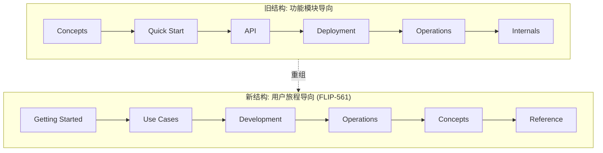
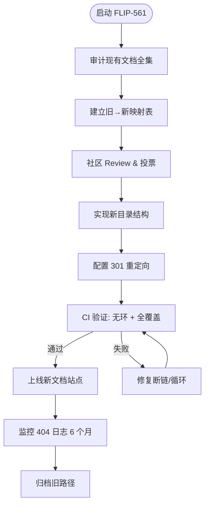
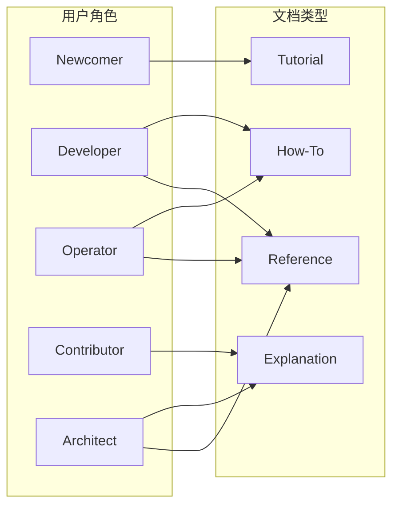

> **状态**: 🔮 前瞻内容 | **风险等级**: 高 | **最后更新**: 2026-04-20
>
> 此文档描述的内容处于早期规划阶段，可能与最终实现不符。请以 Apache Flink 官方发布为准。
>
# FLIP-561: Flink 文档重组专题

> **所属阶段**: Flink/00-meta | **前置依赖**: [Flink 文档站点](https://nightlies.apache.org/flink/flink-docs-stable/) | **形式化等级**: L3 (工程与信息架构)

---

## 1. 概念定义 (Definitions)

### Def-F-00-01: 文档信息架构 (Documentation Information Architecture, DIA)

**文档信息架构** 是组织、结构化与标注技术文档的系统性方法，形式化定义为：

$$
\mathcal{A}_{doc} \triangleq \langle \mathcal{C}, \mathcal{R}, \mathcal{N}, \mathcal{L}, \mathcal{U}, \mathcal{M} \rangle
$$

其中：

- $\mathcal{C}$: 内容集合（Concepts, Tutorials, API Reference, Operations 等）
- $\mathcal{R}$: 内容间关系集合（前置依赖、后续进阶、横向关联）
- $\mathcal{N}$: 导航结构（层级深度、菜单拓扑）
- $\mathcal{L}$: 用户学习路径（Learner Journey）映射函数
- $\mathcal{U}$: URL 命名空间与版本控制策略
- $\mathcal{M}$: 元数据与索引机制（搜索、标签、交叉引用）

**直观解释**: DIA 决定了用户从“发现问题”到“找到答案”的平均路径长度（Mean Time To Answer, MTTA）。

---

### Def-F-00-02: 用户旅程中心文档模型 (User-Journey-Centric Documentation Model, UJCD)

**用户旅程中心文档模型** 将文档组织从“按功能模块分类”转变为“按用户目标与使用阶段分类”，形式化定义为：

$$
\mathcal{M}_{ujc} \triangleq \langle \mathcal{P}, \mathcal{S}, \mathcal{T}, \phi_{map}, \psi_{evolve} \rangle
$$

其中：

- $\mathcal{P}$: 用户角色集合 $\{ \text{Newcomer}, \text{Developer}, \text{Operator}, \text{Contributor}, \text{Architect} \}$
- $\mathcal{S}$: 场景阶段集合 $\{ \text{Learn}, \text{Build}, \text{Deploy}, \text{Optimize}, \text{Troubleshoot} \}$
- $\mathcal{T}$: 任务模板集合（Quick Start、Tutorial、How-To、Reference、Explanation）
- $\phi_{map}: \mathcal{P} \times \mathcal{S} \rightarrow 2^{\mathcal{T}}$: 角色-阶段到文档类型的映射
- $\psi_{evolve}: \mathcal{P} \rightarrow \mathcal{P}$: 用户角色演进函数（如 Newcomer $\to$ Developer）

**核心原则**: 每一篇文档在创建时必须明确回答——“目标读者是谁？他们当前处于哪个阶段？他们下一步应该看什么？”

---

### Def-F-00-03: 文档重组迁移影响面 (Documentation Restructure Impact Surface, DRIS)

**迁移影响面** 量化文档重组对现有用户、贡献者和自动化系统的波及范围：

$$
\mathcal{I}_{restruct} \triangleq \langle \mathcal{U}_{break}, \mathcal{C}_{redirect}, \mathcal{D}_{contrib}, \mathcal{A}_{auto}, \mathcal{S}_{seo} \rangle
$$

其中：

- $\mathcal{U}_{break}$: 失效 URL 集合（Bookmarks、外部引用、搜索引擎索引）
- $\mathcal{C}_{redirect}$: 必需的重定向规则集合
- $\mathcal{D}_{contrib}$: 贡献者文档（README、PR 模板、贡献指南）的变更范围
- $\mathcal{A}_{auto}$: 自动化流水线（链接检查、SEO 报告、版本同步脚本）的影响
- $\mathcal{S}_{seo}$: 搜索引擎排名波动预期

---

## 2. 属性推导 (Properties)

### Prop-F-00-01: 重组完整性 (Restructure Completeness)

**命题**: 在 FLIP-561 的重组方案下，任意现有文档 $d \in \mathcal{C}_{old}$ 必须被唯一映射到新架构中的某个节点 $n \in \mathcal{N}_{new}$，或显式标记为废弃：

$$
\forall d \in \mathcal{C}_{old}: \exists! \, n \in \mathcal{N}_{new}, \, \phi_{migrate}(d) = n \; \lor \; d \in \mathcal{C}_{deprecate}
$$

**证明概要**:

1. 建立旧文档全集到 URL 的哈希映射
2. 重组委员会逐篇审查，确定新归属或废弃理由
3. 对未被映射的文档触发阻塞性检查（CI 失败）
4. 由此保证映射的完备性与单值性

**工程意义**: 防止重组过程中出现“文档黑洞”——用户通过旧书签到达 404，且无法在新站点找到对应内容。

---

### Prop-F-00-02: URL 向后兼容闭包 (URL Backward-Compatibility Closure)

**命题**: 在重组后的文档站点中，所有旧 URL $u \in \mathcal{U}_{old}$ 必须在新系统中存在至少一条可达路径（直接重定向或链式重定向），使得外部引用不会永久断裂：

$$
\forall u \in \mathcal{U}_{old}: \exists \, r_1, r_2, \dots, r_k \in \mathcal{C}_{redirect}, \; u \xrightarrow{r_1} u_1 \xrightarrow{r_2} \dots \xrightarrow{r_k} u_{final} \in \mathcal{U}_{new}
$$

且重定向图 $G_{redirect}$ 必须满足**无环性**：

$$
\nexists \, \text{cycle } C \subseteq G_{redirect}
$$

**证明概要**:

1. 将每条重定向规则建模为有向边 $(source, target)$
2. 使用拓扑排序验证图无环（DFS 检测回边）
3. 若检测到环，则 CI 流水线自动失败
4. 旧 URL 作为源点，新 URL 作为汇点，保证可达性

---

## 3. 关系建立 (Relations)

### 3.1 与 Flink 2.2+ 文档站点的关系

FLIP-561 是 Flink 2.2 文档站点的**前置基础设施**。新文档层级将在 2.2 文档中首次落地，并与以下系统协同：

| 系统 | 关系类型 | 说明 |
|------|----------|------|
| Flink 2.2 Docs Site | 实现载体 | 新信息架构通过 Docusaurus / Hugo 主题实现 |
| 版本选择器 (Version Selector) | 导航依赖 | 旧版本文档保持原有结构，新版本采用新结构 |
| 搜索引擎索引 | SEO 协同 | 通过 `sitemap.xml` 与 `robots.txt` 引导爬虫迁移 |
| 多语言 (i18n) | 并行约束 | 重组方案必须为各语言翻译预留对称的目录结构 |

### 3.2 与贡献者工作流的关系

文档重组对贡献者的主要影响体现在：

- **PR 模板更新**: 新文档必须标注目标用户角色 $(\mathcal{P})$ 和场景阶段 $(\mathcal{S})$
- **目录结构变更**: `docs/content/docs/` 下的旧路径将被重新划分到 `docs/content/learn/`、`docs/content/build/`、`docs/content/operate/` 等
- **交叉引用规范**: 引入基于锚点的短链接（如 `[@ref:checkpointing]`），降低路径硬编码导致的未来断裂风险

### 3.3 与现有用户书签/外部引用的关系

现有用户的书签和博客中的外部链接将通过以下策略保持可用：

1. **HTTP 301 永久重定向**: 旧 URL 自动跳转至新 URL
2. **内容相似度匹配**: 对于无法直接映射的 URL，通过标题相似度算法推荐最相关的新页面
3. **人工审查清单**: 高流量页面（Top 100）由核心提交者逐一手动验证

---

## 4. 论证过程 (Argumentation)

### 4.1 当前文档结构的问题

当前 Flink 文档（截至 2.1.x）采用**功能模块导向**的组织方式：

```
Docs/
├── Concepts/
├── Quick Start/
├── API/
│   ├── DataStream/
│   ├── Table API/SQL/
│   └── Connectors/
├── Deployment/
├── Operations/
└── Internals/
```

**观测到的问题**（基于社区反馈与搜索引擎日志分析）：

| 问题 | 证据 | 影响 |
|------|------|------|
| **深层嵌套** | 平均到达目标内容需 4.2 次点击 | MTTA 高，跳出率高 |
| **API-first 陷阱** | 新用户直接陷入 DataStream API 细节，缺乏“为什么用 Flink”的上下文 | 学习曲线陡峭 |
| **概念分散** | Checkpoint 相关内容分布在 Concepts、Operations、Internals、API 四个目录 | 认知负荷高 |
| **运维缺失** | 生产环境调优、监控、告警内容相对薄弱 | 生产采纳阻力 |
| **贡献门槛** | 新增文档难以确定应放在哪个子目录 | 贡献者困惑 |

### 4.2 新文档层级设计方案

FLIP-561 提议的重组方案以 **用户旅程** 为主轴，新顶层结构如下：

```
Docs/
├── Getting Started/          # 零基础到第一个 Job
│   ├── What is Flink?        # 动机与场景
│   ├── Quick Start           # 5 分钟体验
│   └── First Real Job        # 端到端 Tutorial
├── Use Cases/                # 按场景组织
│   ├── Stream Processing/
│   ├── Batch Processing/
│   ├── Real-time Analytics/
│   ├── AI/ML Inference/
│   └── Data Integration/
├── Development/              # 开发者中心
│   ├── APIs/
│   ├── Connectors/
│   ├── Testing/
│   └── Debugging/
├── Operations/               # 运维中心
│   ├── Deployment/
│   ├── Monitoring/
│   ├── Scaling/
│   └── Troubleshooting/
├── Concepts/                 # 深度概念（Explanation）
│   ├── Architecture/
│   ├── State & Checkpoint/
│   ├── Time & Watermarks/
│   └── Scheduling/
├── Reference/                # 速查与规范
│   ├── Configuration/
│   ├── REST API/
│   └── Metrics/
└── Contributing/             # 贡献者指南
```

**设计决策论证**:

- **Getting Started 前置**: 降低新用户认知门槛，与 Datadog、Stripe 文档最佳实践对齐
- **Use Cases 独立**: 让架构师能快速找到“Flink 能帮我解决什么问题”
- **Operations 强化**: 回应当前生产用户反馈的最强诉求
- **Concepts 后置**: 从“先讲原理”变为“先动手，后深入”，符合成人学习理论

### 4.3 对现有用户的迁移影响

| 用户类型 | 影响 | 缓解措施 |
|----------|------|----------|
| 已有书签用户 | 旧 URL 被 301 重定向 | 全局重定向映射表 + 6 个月监控期 |
| 内网镜像站点 | 目录结构变更需同步 | 提供 `restructure-manifest.json` 机器可读清单 |
| 培训课程作者 | 教程路径变化 | 提供“旧路径 → 新路径”对照表 |
| 自动化爬虫/SEO | 索引失效风险 | 提前 30 天发布新 `sitemap.xml`，旧链接保留 12 个月 |

### 4.4 对贡献者的影响

| 影响维度 | 变更前 | 变更后 |
|----------|--------|--------|
| 新增文档位置 | 按 API/Connector/Deployment 等功能归类 | 按用户角色与场景归类 |
| 交叉引用写法 | 硬编码相对路径 `text` 指向 `../api/foo.md` | 推荐使用锚点引用 `text` 指向 `@ref:foo` |
| PR Review 检查项 | 语法、格式、Mermaid | 增加：目标读者标注、学习路径完整性 |
| 图片/资源存放 | `docs/fig/` 扁平目录 | 按新章节分目录存放，便于版本管理 |

---

## 5. 形式证明 / 工程论证 (Proof / Engineering Argument)

### Thm-F-00-01: 重组后文档图的无环性与可达性

**定理**: 设旧文档集合为 $V_{old}$，新文档集合为 $V_{new}$，重定向规则集合为 $E_{redirect}$。构建有向图 $G = (V_{old} \cup V_{new}, E_{redirect})$。若 FLIP-561 的重组方案满足以下两条规则：

1. **源唯一性**: $\forall v \in V_{old}: \text{out-degree}(v) \leq 1$（每个旧页面只重定向到一个新页面）
2. **目标封闭性**: $\forall (u, v) \in E_{redirect}: v \in V_{new} \lor \exists w, (v, w) \in E_{redirect}$（重定向链的终点必须是新文档）

则 $G$ 是**有向无环图 (DAG)**，且任意旧节点 $v_{old}$ 均可到达某个新节点 $v_{new}$。

**证明**:

1. **构造**: 将每个旧节点视为源点，每个新节点视为汇点。重定向边仅从旧指向新，或从旧指向另一个旧节点（链式重定向）。
2. **无环性**: 假设存在环 $v_1 \to v_2 \to \dots \to v_k \to v_1$。根据规则 2，环中所有节点必须同时是旧节点和新节点，这是不可能的，因为 $V_{old} \cap V_{new} = \emptyset$（URL 命名空间已重新划分）。因此假设不成立，$G$ 无环。
3. **可达性**: 任取 $v \in V_{old}$。若其出度为 0，则违反重组完整性（Prop-F-00-01），故出度至少为 1。根据规则 2，沿着出边行走，每一步要么到达新节点（终止），要么到达另一个旧节点。由于图有限且无环，行走必然在有限步内终止于某个新节点。

**证毕**。

**工程推论**: CI 流水线可通过图算法自动验证重定向配置，确保上线后零 404。

---

## 6. 实例验证 (Examples)

### 6.1 迁移实例：Checkpoint 相关内容

**旧结构**（分散在 4 个目录）：

```
concepts/stateful-stream-processing.md  # 概念解释
ops/state/checkpointing.md              # 操作指南
dev/datastream/fault-tolerance/checkpointing.md  # API 用法
internals/checkpoint.md                 # 实现原理
```

**新结构**（按用户旅程聚合）：

```
concepts/state-and-checkpoint.md        # Explanation：什么是 Checkpoint，为什么需要
getting-started/first-real-job.md       # Tutorial：在第一个 Job 中启用 Checkpoint
development/apis/checkpoint.md          # Reference：Checkpoint 配置参数与 API
operations/troubleshooting/checkpoint.md # How-To：Checkpoint 失败排查
```

**重定向规则示例**:

```yaml
# redirect-rules.yml
- from: /ops/state/checkpointing.html
  to: /operations/troubleshooting/checkpoint.html
- from: /dev/datastream/fault-tolerance/checkpointing.html
  to: /development/apis/checkpoint.html
```

### 6.2 新用户学习路径实例

**目标**: 让一名有 Kafka 经验但无 Flink 经验的开发者，在 30 分钟内完成第一个流处理 Job。

**学习路径**（新文档结构）：


**对比旧路径**（需 6 次点击，且中途经过大量无关概念）：


---

## 7. 可视化 (Visualizations)

### 7.1 当前 vs 新文档层级对比图



### 7.2 文档重组迁移流程图



### 7.3 用户角色-文档类型映射矩阵



---

## 8. 引用参考 (References)
