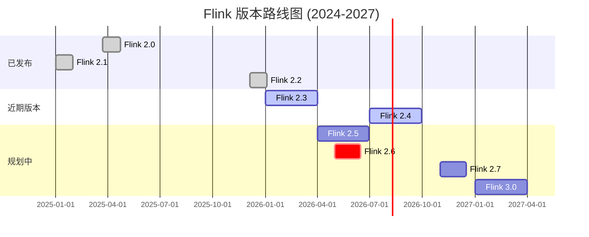

# Flink 版本发布跟踪报告

> 生成时间: 2026-04-05
> 跟踪器版本: V2.0.0

---

## 版本路线图概览



---

## 跟踪版本状态

| 版本 | 状态 | 预计/实际发布 | 下载链接 | 跟踪文档 |
|------|------|--------------|----------|----------|
| 2.3.0 | 开发中 | 2026 Q1 | - | - |
| 2.4.0 | 前瞻 | 2026 Q3-Q4 | - | [2.4 跟踪](Flink/08-roadmap/08.01-flink-24/flink-2.4-tracking.md) |
| 2.5.0 | 规划中 | 2026 Q2-Q3 | - | - |
| **2.6.0** | 🔍 前瞻 | **2026 Q2** | - | **[2.6/2.7 跟踪](./version-tracking/flink-26-27-roadmap.md)** |
| **2.7.0** | 🔍 前瞻 | **2026 Q4** | - | **[2.6/2.7 跟踪](./version-tracking/flink-26-27-roadmap.md)** |
| 3.0.0 | 愿景 | 2027+ | - | - |

---

## 2.6/2.7 版本重点

### Flink 2.6 (预计 2026 Q2)

| 特性 | FLIP | 状态 | 进度 | 影响级别 |
|------|------|------|------|----------|
| WASM UDF 增强 | FLIP-550 | 🔄 设计中 | 30% | 🔴 高 |
| DataStream V2 API 稳定 | - | 🔄 实现中 | 60% | 🔴 高 |
| 智能检查点优化 | FLIP-542 | 🔄 实现中 | 50% | 🟡 中 |
| ForSt State Backend GA | FLIP-549 | 🔄 测试中 | 85% | 🟡 中 |

### Flink 2.7 (预计 2026 Q4)

| 特性 | FLIP | 状态 | 进度 | 影响级别 |
|------|------|------|------|----------|
| 云原生调度器 | FLIP-560 | 📋 规划中 | 10% | 🔴 高 |
| AI/ML 集成增强 | FLIP-561 | 📋 规划中 | 5% | 🔴 高 |
| 流批统一执行引擎 | FLIP-562 | 📋 规划中 | 5% | 🔴 高 |
| SQL 物化视图增强 | FLIP-563 | 📋 规划中 | 5% | 🟡 中 |

---

## 前瞻文档统计

### 2.6/2.7 跟踪

- [Flink 2.6/2.7 路线图](./version-tracking/flink-26-27-roadmap.md) - 状态: preview
- [特性影响分析模板](./version-tracking/feature-impact-template.md) - 状态: template

### 其他版本

#### unknown

- `Flink\roadmap\flink-24-flip-531-ai-agents.md` - 状态: unknown
- `Flink\roadmap\flink-24-serverless-ga.md` - 状态: unknown
- `Flink\roadmap\flink-25-wasm-udf-ga.md` - 状态: unknown
- `Flink\roadmap\flink-evolution-serverless-deploy.md` - 状态: unknown
- `Flink\08-roadmap\flink-2.1-frontier-tracking.md` - 状态: unknown
- `Flink\08-roadmap\flink-2.3-2.4-roadmap.md` - 状态: unknown
- `Flink\08-roadmap\flink-25-stream-batch-unification.md` - 状态: unknown
- `Flink\08-roadmap\flink-version-comparison-matrix.md` - 状态: unknown

#### 2026-Q3-Q4

- `Flink\08-roadmap\flink-2.4-tracking.md` - 状态: preview

#### 2027-Q1-Q2

- `Flink\08-roadmap\flink-2.5-preview.md` - 状态: preview
- `Flink\08-roadmap\flink-30-architecture-redesign.md` - 状态: vision

---

## 自动化跟踪系统

### 使用脚本

```bash
# 运行完整跟踪检查
python .scripts/flink-release-tracker-v2.py

# 仅检查状态
python .scripts/flink-release-tracker-v2.py --check

# 生成报告
python .scripts/flink-release-tracker-v2.py --report

# 发送测试通知
python .scripts/notify-flink-updates.py --test

# 检查并发送通知
python .scripts/notify-flink-updates.py --check
```

### 监控数据源

| 数据源 | URL | 检查频率 |
|--------|-----|----------|
| Apache JIRA | <https://issues.apache.org/jira/browse/FLINK> | 每日 |
| FLIP 提案 | <https://cwiki.apache.org/confluence/display/FLINK/Flink+Improvement+Proposals> | 每周 |
| GitHub Releases | <https://github.com/apache/flink/releases> | 每日 |
| 官方路线图 | <https://flink.apache.org/roadmap/> | 每周 |

---

## 历史变更记录

| 时间 | 版本 | 变更 | 来源 |
|------|------|------|------|
| 2026-04-05 | 跟踪系统 | 创建 2.6/2.7 跟踪框架 | agent |
| 2026-04-05 | 2.6/2.7 | 添加预估 FLIP 列表 | agent |
| 2026-04-04T19:01 | 1.17.2 | ReleaseStatus.UNRELEASED → ReleaseStatus.GA | downloads_page |
| 2026-04-04T19:01 | 1.3.1 | ReleaseStatus.UNRELEASED → ReleaseStatus.GA | downloads_page |
| 2026-04-04T19:01 | 1.0.0 | ReleaseStatus.UNRELEASED → ReleaseStatus.GA | downloads_page |
| 2026-04-04T19:01 | 1.4.1 | ReleaseStatus.UNRELEASED → ReleaseStatus.GA | downloads_page |
| 2026-04-04T19:01 | 1.10.3 | ReleaseStatus.UNRELEASED → ReleaseStatus.GA | downloads_page |
| 2026-04-04T19:01 | 1.6.3 | ReleaseStatus.UNRELEASED → ReleaseStatus.GA | downloads_page |
| 2026-04-04T19:01 | 1.19.2 | ReleaseStatus.UNRELEASED → ReleaseStatus.GA | downloads_page |
| 2026-04-04T19:01 | 0.8.0 | ReleaseStatus.UNRELEASED → ReleaseStatus.GA | downloads_page |
| 2026-04-04T19:01 | 1.5.3 | ReleaseStatus.UNRELEASED → ReleaseStatus.GA | downloads_page |
| 2026-04-04T19:01 | 1.15.3 | ReleaseStatus.UNRELEASED → ReleaseStatus.GA | downloads_page |

---

## 快速参考

### 文档更新流程

1. **检测变更**: 自动化脚本定期检查版本和 FLIP 状态
2. **生成通知**: 检测到重要变更时发送通知
3. **评估影响**: 使用 [特性影响模板](./version-tracking/feature-impact-template.md) 评估文档需求
4. **更新文档**: 根据影响分析更新或创建文档
5. **验证发布**: 验证文档准确性和完整性

### 相关文档

- [Flink 2.6/2.7 路线图](./version-tracking/flink-26-27-roadmap.md)
- [Flink 2.4 跟踪](Flink/08-roadmap/08.01-flink-24/flink-2.4-tracking.md)
- [特性影响分析模板](./version-tracking/feature-impact-template.md)

### 外部链接

- [Apache Flink 官网](https://flink.apache.org/)
- [Flink 路线图](https://flink.apache.org/roadmap/)
- [FLIP 索引](https://cwiki.apache.org/confluence/display/FLINK/Flink+Improvement+Proposals)
- [Flink JIRA](https://issues.apache.org/jira/browse/FLINK)
- [GitHub 仓库](https://github.com/apache/flink)

---

*本文档由 Flink Release Tracker V2 自动生成 | 最后更新: 2026-04-05*
