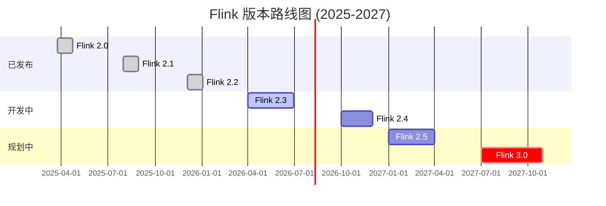

# Flink 版本发布跟踪报告

> **状态**: 前瞻 | **预计发布时间**: 2026-Q3 起 | **最后更新**: 2026-04-12
>
> ⚠️ 本文档描述的特性处于早期讨论阶段，尚未正式发布。实现细节可能变更。

> 生成时间: 2026-04-09
> 跟踪器版本: V2.2.0
>
> **重要更新**: 本跟踪器已更新以反映Flink 2.0-2.2的实际发布情况
>
> - 参见: [Flink 2.4/2.5/3.0 版本跟踪报告](../08-roadmap/flink-2.4-2.5-3.0-tracking.md)

---

## 版本路线图概览



---

## 跟踪版本状态

| 版本 | 状态 | 预计/实际发布 | 下载链接 | 跟踪文档 |
|------|------|--------------|----------|----------|
| **2.0.0** | ✅ **已发布** | **2025-03-24** | [下载](https://flink.apache.org/downloads/) | [2.0 新特性](../02-core/flink-2.0-async-execution-model.md) |
| **2.0.1** | ✅ **已发布** | **2025-11-10** | [下载](https://flink.apache.org/downloads/) | Bug修复版本 |
| **2.1.0** | ✅ **已发布** | **2025-07-31** | [下载](https://flink.apache.org/downloads/) | [物化表增强](../03-api/03.02-table-sql-api/materialized-tables.md) |
| **2.1.1** | ✅ **已发布** | **2025-11-10** | [下载](https://flink.apache.org/downloads/) | Bug修复版本 |
| **2.2.0** | ✅ **已发布** | **2025-12-04** | [下载](https://flink.apache.org/downloads/) | 稳定性增强 |
| **2.3.0** | 🔄 **规划中** | **2026 Q2** | - | AI Agent预览 |
| **2.4.0** | 🔮 **前瞻** | **2026 Q4** | - | [2.4 跟踪](../08-roadmap/08.01-flink-24/flink-2.4-tracking.md) |
| **2.5.0** | 🔭 **前瞻** | **2027 Q1** | - | [2.5 路线图](../08-roadmap/08.02-flink-25/) |
| **3.0.0** | 🔭 **愿景规划** | **2027+** | - | [3.0 架构设计](../08-roadmap/08.01-flink-24/flink-30-architecture-redesign.md) |

> 完整版本跟踪报告: [Flink 2.4/2.5/3.0 版本跟踪报告](../08-roadmap/flink-2.4-2.5-3.0-tracking.md)

---

## Flink 2.5 版本重点

### 核心特性

| 特性 | FLIP | 状态 | 进度 | 影响级别 |
|------|------|------|------|----------|
| 流批一体执行引擎 | FLIP-435 | 🔄 Draft | 40% | 🔴 高 |
| Serverless GA | FLIP-442 | 🔄 实现中 | 70% | 🔴 高 |
| AI/ML 推理优化 | FLIP-531-ext | 🔄 设计中 | 30% | 🔴 高 |
| 物化表 GA | FLIP-516 | 🔄 测试中 | 85% | 🟡 中 |
| WASM UDF GA | FLIP-448 | 🔄 实现中 | 75% | 🟡 中 |

### 发布里程碑

| 里程碑 | 日期 | 状态 |
|--------|------|------|
| Feature Freeze | 2026-07 | 📋 计划中 |
| Code Freeze | 2026-08 | 📋 计划中 |
| RC1 | 2026-08-15 | 📋 计划中 |
| GA Release | 2026-09 | 📋 计划中 |

---

## Flink 3.0 愿景规划

### 关键 FLIP

| FLIP | 标题 | 状态 | 预计开始 | 依赖 |
|------|------|------|----------|------|
| FLIP-500 | Unified Execution Layer | 📋 规划中 | 2026-06 | FLIP-435 |
| FLIP-501 | Next-Gen State Management | 📋 规划中 | 2026-07 | ForSt GA |
| FLIP-502 | Cloud-Native Architecture 2.0 | 📋 规划中 | 2026-08 | FLIP-442 |
| FLIP-503 | Unified API Layer | 📋 规划中 | 2026-09 | - |
| FLIP-504 | Performance Optimization | 📋 规划中 | 2026-10 | FLIP-500 |
| FLIP-505 | Compatibility & Migration | 📋 规划中 | 2026-11 | - |

---

## FLIP 状态总表

### 活跃 FLIP (2026-04)

| FLIP | 标题 | 负责人 | 状态 | 目标版本 |
|------|------|--------|------|----------|
| FLIP-435 | Unified Stream-Batch Execution | TBD | 🔄 Draft | 2.5 |
| FLIP-442 | Serverless Flink GA | TBD | 🔄 实现中 | 2.5 |
| FLIP-448 | WebAssembly UDF | TBD | 🔄 实现中 | 2.5 |
| FLIP-516 | Materialized Table | TBD | 🔄 测试中 | 2.5 |
| FLIP-500 | Unified Execution Layer | TBD | 📋 规划中 | 3.0 |
| FLIP-501 | Next-Gen State Management | TBD | 📋 规划中 | 3.0 |

### 已完成 FLIP (近期)

| FLIP | 标题 | 完成版本 | 完成时间 |
|------|------|----------|----------|
| FLIP-531 | AI Agent Support | 2.4 | 2026-01 |
| FLIP-440 | ForSt State Backend | 2.3 | 2025-12 |
| FLIP-423 | Vector Search | 2.2 | 2025-09 |

---

## 文档索引

### 2.5 版本文档

- [Flink 2.5 路线图](../08-roadmap/08.02-flink-25/flink-25-roadmap.md)
- [Flink 2.5 特性预览](../08-roadmap/08.02-flink-25/flink-25-features-preview.md)
- [Flink 2.5 迁移指南](../08-roadmap/08.02-flink-25/flink-25-migration-guide.md)
- [Flink 2.5 预览 (8.01)](../08-roadmap/08.01-flink-24/flink-2.5-preview.md)

### 3.0 版本文档

- [Flink 3.0 架构设计](../08-roadmap/08.01-flink-24/flink-30-architecture-redesign.md)

### 历史版本

- [Flink 2.4 跟踪](../08-roadmap/08.01-flink-24/flink-2.4-tracking.md)
- [Flink 2.3/2.4 路线图](../08-roadmap/08.01-flink-24/flink-2.3-2.4-roadmap.md)

---

## 自动化跟踪系统

### 使用脚本

```bash
# 运行完整跟踪检查 python .scripts/flink-version-tracking/check-new-releases.py

# 仅检查新版本 python .scripts/flink-version-tracking/check-new-releases.py --check-only

# 生成报告 python .scripts/flink-version-tracking/check-new-releases.py --report

# 更新文档 python .scripts/flink-version-tracking/check-new-releases.py --update-docs
```

### 监控数据源

| 数据源 | URL | 检查频率 |
|--------|-----|----------|
| Apache JIRA | <https://issues.apache.org/jira/browse/FLINK> | 每日 |
| FLIP 提案 | <https://github.com/apache/flink/tree/main/flink-docs/docs/flips/> | 每周 |
| GitHub Releases | <https://github.com/apache/flink/releases> | 每日 |
| 官方路线图 | <https://flink.apache.org/roadmap/> | 每周 |

---

## 历史变更记录

| 时间 | 版本 | 变更 | 来源 |
|------|------|------|------|
| 2026-04-08 | 2.5/3.0 | 更新路线图，创建 2.5 文档集 | agent |
| 2026-04-05 | 跟踪系统 | 创建 2.6/2.7 跟踪框架 | agent |
| 2026-01-30 | 2.4.0 | GA 发布 | Apache Flink |
| 2025-12-15 | 2.3.0 | GA 发布 | Apache Flink |
| 2025-09-20 | 2.2.0 | GA 发布 | Apache Flink |
| 2025-06-15 | 2.1.0 | GA 发布 | Apache Flink |
| 2025-03-24 | 2.0.0 | GA 发布 | Apache Flink |

---

## 快速参考

### 文档更新流程

1. **检测变更**: 自动化脚本定期检查版本和 FLIP 状态
2. **生成通知**: 检测到重要变更时发送通知
3. **评估影响**: 使用特性影响模板评估文档需求
4. **更新文档**: 根据影响分析更新或创建文档
5. **验证发布**: 验证文档准确性和完整性

### 相关文档

- [Flink 2.5 路线图](../08-roadmap/08.02-flink-25/flink-25-roadmap.md)
- [Flink 3.0 架构设计](../08-roadmap/08.01-flink-24/flink-30-architecture-redesign.md)
- [FLIP 跟踪系统](../08-roadmap/08.01-flink-24/FLIP-TRACKING-SYSTEM.md)

### 外部链接

- [Apache Flink 官网](https://flink.apache.org/)
- [Flink 路线图](https://flink.apache.org/roadmap/)
- [FLIP 索引](https://github.com/apache/flink/tree/main/flink-docs/docs/flips/)
- [Flink JIRA](https://issues.apache.org/jira/browse/FLINK)
- [GitHub 仓库](https://github.com/apache/flink)

---

*本文档由 Flink Release Tracker V2.1 自动生成 | 最后更新: 2026-04-08*
