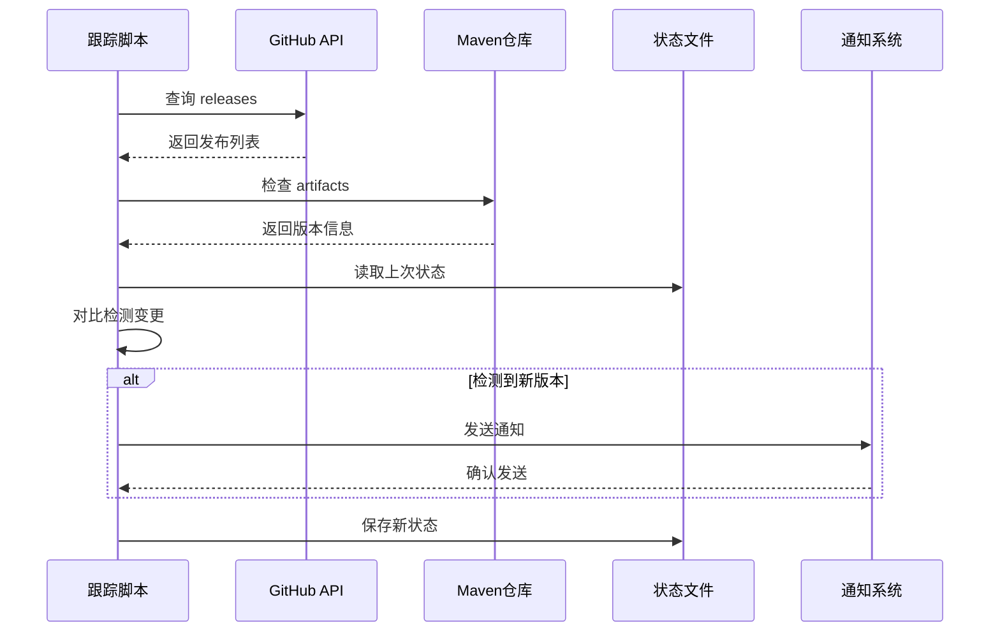
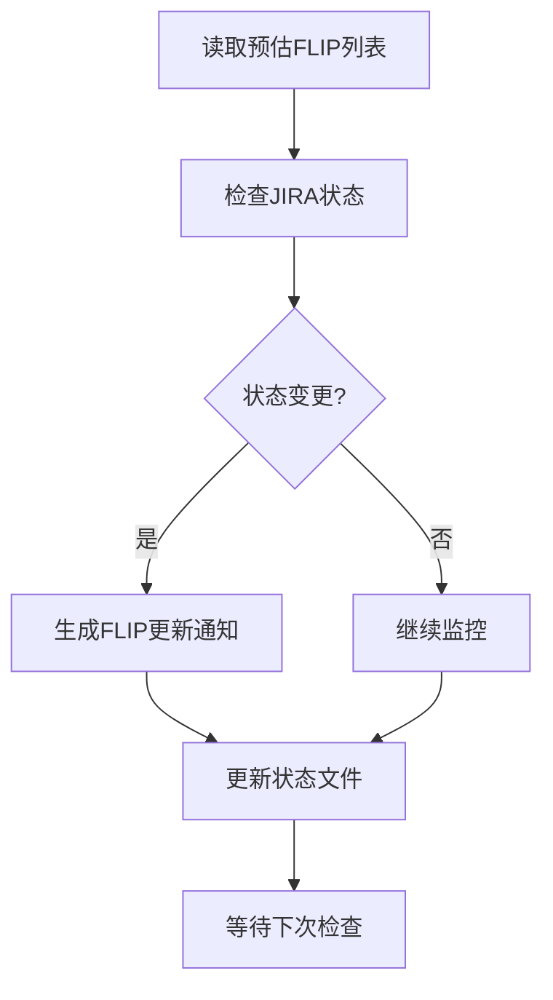

# Flink 版本跟踪机制

> 自动化跟踪 Apache Flink 2.6/2.7 及后续版本的新特性

---

## 快速开始

### 运行跟踪检查

```bash
# 检查版本状态
python .scripts/flink-release-tracker-v2.py --check

# 生成完整报告
python .scripts/flink-release-tracker-v2.py --report

# 发送测试通知
python .scripts/notify-flink-updates.py --test
```

### 查看跟踪文档

| 文档 | 说明 |
|------|------|
| [Flink 2.6/2.7 路线图](./flink-26-27-roadmap.md) | 详细的版本特性跟踪 |
| [状态报告](./flink-26-27-status-report.md) | 自动生成的状态报告 |
| [特性影响模板](./feature-impact-template.md) | 评估新特性影响的模板 |

---

## 系统架构

```
┌─────────────────────────────────────────────────────────────┐
│                    Flink 版本跟踪系统 V2                     │
├─────────────────────────────────────────────────────────────┤
│                                                              │
│  ┌─────────────────┐    ┌─────────────────┐                 │
│  │  数据源监控      │    │  状态管理       │                 │
│  │  ├── GitHub     │◄──►│  ├── versions   │                 │
│  │  ├── Maven      │    │  ├── flips      │                 │
│  │  ├── Downloads  │    │  └── history    │                 │
│  │  └── JIRA       │    └─────────────────┘                 │
│  └────────┬────────┘                                        │
│           │                                                  │
│           ▼                                                  │
│  ┌─────────────────┐    ┌─────────────────┐                 │
│  │  变更检测        │───►│  通知系统       │                 │
│  │  ├── 版本发布   │    │  ├── 文件日志   │                 │
│  │  ├── FLIP更新   │    │  ├── Slack     │                 │
│  │  └── 特性GA     │    │  ├── 邮件      │                 │
│  └─────────────────┘    │  └── Webhook   │                 │
│                         └─────────────────┘                 │
│                                                              │
│  ┌─────────────────┐    ┌─────────────────┐                 │
│  │  报告生成        │    │  文档集成       │                 │
│  │  ├── Markdown   │───►│  ├── 路线图    │                 │
│  │  └── 状态文件   │    │  ├── 影响分析   │                 │
│  └─────────────────┘    │  └── 跟踪报告   │                 │
│                         └─────────────────┘                 │
│                                                              │
└─────────────────────────────────────────────────────────────┘
```

---

## 文件说明

### 跟踪文档

| 文件 | 路径 | 说明 |
|------|------|------|
| 版本路线图 | `Flink/version-tracking/flink-26-27-roadmap.md` | 详细的2.6/2.7版本特性跟踪 |
| 状态报告 | `Flink/version-tracking/flink-26-27-status-report.md` | 自动生成的状态报告 |
| 影响模板 | `Flink/version-tracking/feature-impact-template.md` | 评估新特性影响的模板 |
| 跟踪索引 | `Flink/version-tracking.md` | 版本跟踪总览 |

### 脚本文件

| 文件 | 路径 | 说明 |
|------|------|------|
| 跟踪器 V2 | `.scripts/flink-release-tracker-v2.py` | 主跟踪脚本 |
| 通知器 | `.scripts/notify-flink-updates.py` | 通知发送脚本 |
| 配置 V2 | `.scripts/flink-tracker-config-v2.json` | 跟踪器配置 |

### 状态文件（自动生成）

| 文件 | 路径 | 说明 |
|------|------|------|
| 状态 V2 | `.scripts/flink-tracker-state-v2.json` | 跟踪状态持久化 |
| 日志 | `.scripts/flink-tracker-v2.log` | 运行日志 |
| 通知日志 | `.scripts/flink-notifications-YYYYMM.log` | 通知历史 |

---

## 配置说明

### 跟踪器配置 (`.scripts/flink-tracker-config-v2.json`)

```json
{
  "target_versions": ["2.4.0", "2.5.0", "2.6.0", "2.7.0", "3.0.0"],
  "notification_channels": ["file"],
  "tracking": {
    "check_github": true,
    "check_maven": true,
    "check_downloads": true,
    "track_flips": true
  }
}
```

### 通知配置

```json
{
  "slack": {
    "enabled": true,
    "webhook_url": "YOUR_WEBHOOK_URL",
    "channel": "#flink-releases"
  },
  "email": {
    "enabled": true,
    "smtp_server": "smtp.gmail.com",
    "username": "your-email@gmail.com",
    "password": "your-app-password"
  }
}
```

---

## 跟踪流程

### 1. 版本发布检测



### 2. FLIP 跟踪



### 3. 文档更新流程


---

## 当前跟踪状态

### Flink 2.6 (预计 2026 Q2)

| 特性 | FLIP | 状态 | 进度 |
|------|------|------|------|
| WASM UDF 增强 | FLIP-550 | 🔄 设计中 | 30% |
| DataStream V2 API 稳定 | - | 🔄 实现中 | 60% |
| 智能检查点优化 | FLIP-542 | 🔄 实现中 | 50% |
| ForSt State Backend GA | FLIP-549 | 🔄 测试中 | 85% |

### Flink 2.7 (预计 2026 Q4)

| 特性 | FLIP | 状态 | 进度 |
|------|------|------|------|
| 云原生调度器 | FLIP-560 | 📋 规划中 | 10% |
| AI/ML 集成增强 | FLIP-561 | 📋 规划中 | 5% |
| 流批统一执行引擎 | FLIP-562 | 📋 规划中 | 5% |
| SQL 物化视图增强 | FLIP-563 | 📋 规划中 | 5% |

---

## 自动化任务

### 建议的定时任务

```bash
# crontab 示例

# 每日检查版本状态（早上9点）
0 9 * * * cd /path/to/project && python .scripts/flink-release-tracker-v2.py --report

# 每周一生成周报告
0 9 * * 1 cd /path/to/project && python .scripts/notify-flink-updates.py --digest

# 每日检查并发送通知
0 */6 * * * cd /path/to/project && python .scripts/notify-flink-updates.py --check
```

### GitHub Actions 示例

```yaml
name: Flink Version Tracker

on:
  schedule:
    - cron: '0 */6 * * *'  # 每6小时运行一次
  workflow_dispatch:

jobs:
  track:
    runs-on: ubuntu-latest
    steps:
      - uses: actions/checkout@v3
      - uses: actions/setup-python@v4
        with:
          python-version: '3.10'
      - run: python .scripts/flink-release-tracker-v2.py --report
      - run: python .scripts/notify-flink-updates.py --check
```

---

## 手动更新流程

当需要手动更新跟踪信息时：

1. **查看官方源**
   - [Apache Flink JIRA](https://issues.apache.org/jira/browse/FLINK)
   - [FLIP Wiki](https://github.com/apache/flink/tree/main/flink-docs/docs/flips/)
   - [GitHub Releases](https://github.com/apache/flink/releases)

2. **更新路线图文档**
   - 编辑 `Flink/version-tracking/flink-26-27-roadmap.md`
   - 更新 FLIP 状态和进度
   - 添加新发现的特性

3. **创建影响分析**
   - 复制 `feature-impact-template.md`
   - 填写特性影响分析
   - 评估文档更新需求

4. **运行跟踪脚本**
   - 生成最新状态报告
   - 验证变更检测
   - 发送通知（如配置）

---

## 故障排除

### 常见问题

#### 脚本运行失败

```bash
# 检查 Python 版本
python --version  # 需要 3.8+

# 检查网络连接
curl -I https://api.github.com/repos/apache/flink/releases

# 查看详细日志
tail -f .scripts/flink-tracker-v2.log
```

#### 通知未发送

- 检查配置文件中的 webhook URL 是否正确
- 验证 SMTP 配置（如使用邮件通知）
- 查看通知日志 `.scripts/flink-notifications-YYYYMM.log`

#### 状态文件损坏

```bash
# 备份并重置状态
mv .scripts/flink-tracker-state-v2.json .scripts/flink-tracker-state-v2.json.bak
python .scripts/flink-release-tracker-v2.py --check
```

---

## 扩展指南

### 添加新 FLIP 跟踪

编辑 `.scripts/flink-release-tracker-v2.py`：

```python
ESTIMATED_FLIPS = {
    "FLIP-XXX": {
        "title": "New Feature",
        "target_version": "2.8",
        "status": FlipStatus.PLANNED,
        "progress": 0
    },
    # ...
}
```

### 添加新数据源

在 `FlinkReleaseTrackerV2` 类中添加新方法：

```python
def check_new_source(self) -> Dict[str, FlinkVersion]:
    """检查新的数据源"""
    versions = {}
    # 实现检查逻辑
    return versions
```

---

## 参考链接

- [Apache Flink 官网](https://flink.apache.org/)
- [Flink 路线图](https://flink.apache.org/roadmap/)
- [FLIP 索引](https://github.com/apache/flink/tree/main/flink-docs/docs/flips/)
- [Flink JIRA](https://issues.apache.org/jira/browse/FLINK)
- [GitHub 仓库](https://github.com/apache/flink)

---

## 维护者

- 创建日期: 2026-04-05
- 版本: 2.0.0
- 状态: 活跃维护

---

*本文档是 Flink 2.6/2.7 跟踪机制的一部分*
