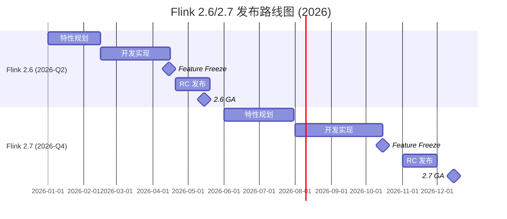
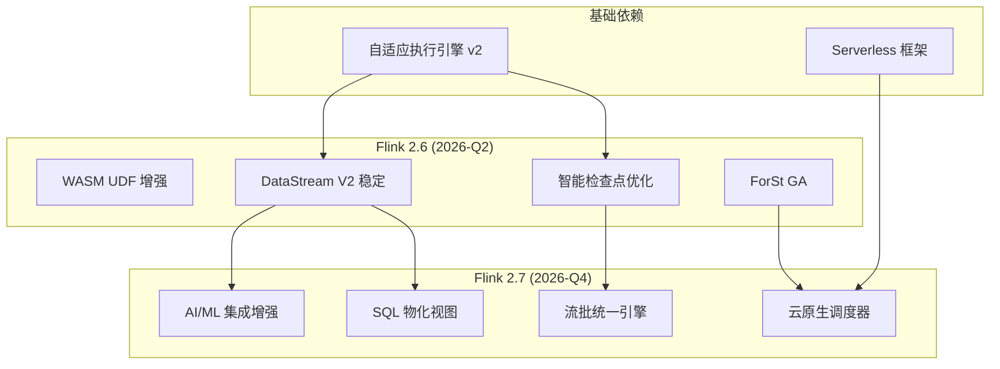

<!-- 版本状态标记: status=preview, target=2026-Q2-Q4 -->
> ⚠️ **前瞻性声明**
> 本文档包含 Flink 2.6/2.7 的前瞻性设计内容。这些版本尚未正式发布，
> 部分特性为预测/规划性质。具体实现以官方最终发布为准。
>
> | 属性 | 值 |
> |------|-----|
> | **文档状态** | 🔍 前瞻 (Preview) |
> | **目标版本** | 2.6.0 / 2.7.0 GA |
> | **预计发布时间** | 2.6: 2026 Q2 / 2.7: 2026 Q4 |
> | **最后更新** | 2026-04-05 |
> | **跟踪系统** | [.scripts/flink-release-tracker-v2.py](#) |

---

# Flink 2.6/2.7 特性跟踪

> 所属阶段: Flink/version-tracking | 前置依赖: [Flink 2.4 跟踪](../../08-roadmap/08.01-flink-24/flink-2.4-tracking.md) | 形式化等级: L3

---

## 1. 版本概览

### 1.1 发布时间表



### 1.2 版本定位

| 版本 | 主题 | 核心价值 | 风险级别 |
|------|------|----------|----------|
| **2.6** | 性能与API稳定 | WASM UDF 生产化、DataStream V2 稳定 | 🟡 中等 |
| **2.7** | 云原生与AI融合 | 云原生调度器、AI/ML 深度集成 | 🔴 较高 |

---

## 2. 跟踪方法

### 2.1 监控数据源

| 数据源 | URL | 检查频率 | 优先级 |
|--------|-----|----------|--------|
| Apache JIRA | <https://issues.apache.org/jira/browse/FLINK> | 每日 | 🔴 高 |
| FLIP 提案 | <https://github.com/apache/flink/tree/main/flink-docs/docs/flips/> | 每周 | 🔴 高 |
| GitHub Releases | <https://github.com/apache/flink/releases> | 每日 | 🔴 高 |
| 官方路线图 | <https://flink.apache.org/roadmap/> | 每周 | 🟡 中 |
| 开发者邮件列表 | <dev@flink.apache.org> | 每周 | 🟡 中 |

### 2.2 自动化跟踪脚本

```bash
# 运行跟踪检查
python .scripts/flink-release-tracker-v2.py --check

# 生成更新报告
python .scripts/flink-release-tracker-v2.py --report

# 发送通知(配置Slack/邮件后)
python .scripts/notify-flink-updates.py --notify
```

---

## 3. Flink 2.6 预期特性

> **预计发布时间**: 2026 Q2 (5月)

### 3.1 WASM UDF 增强

| 属性 | 值 |
|------|-----|
| **FLIP** | FLIP-550 (预估) |
| **状态** | 🔄 设计中 |
| **进度** | 30% |
| **负责人** | 待确认 |

**特性概述**:

- WASM UDF 性能优化（接近原生Java性能）
- 多语言支持扩展（Rust, Go, Python via WASM）
- WASM 模块热更新支持
- UDF 安全性沙箱增强

**对现有文档的影响**:

- [ ] 需要新增: `Flink/06-connectors/wasm-udf-guide.md`
- [ ] 需要更新: `Flink/05-ecosystem/python-integration.md`
- [ ] 需要更新: `Flink/03-deployment/security-udf.md`

### 3.2 DataStream V2 API 稳定

| 属性 | 值 |
|------|-----|
| **FLIP** | FLIP-500+ (延续) |
| **状态** | 🔄 实现中 |
| **进度** | 60% |
| **负责人** | @flink-streaming-team |

**特性概述**:

- DataStream V2 API 标记为 `@Public`
- 移除实验性警告
- 完全兼容 DataStream V1 迁移路径
- 性能基准测试通过

**对现有文档的影响**:

- [ ] 需要更新: `Flink/02-api/datastream-api-guide.md`
- [ ] 需要新增: `Flink/02-api/datastream-v2-migration.md`
- [ ] 需要更新: `Flink/QUICK-START.md`

### 3.3 智能检查点优化

| 属性 | 值 |
|------|-----|
| **FLIP** | FLIP-542 (延续) |
| **状态** | 🔄 实现中 |
| **进度** | 50% |
| **负责人** | @checkpoint-team |

**特性概述**:

- 基于 ML 的检查点间隔预测
- 自适应增量检查点策略
- 检查点成本模型优化

### 3.4 其他预期特性

| 特性 | FLIP | 状态 | 进度 | 影响级别 |
|------|------|------|------|----------|
| ForSt State Backend GA | FLIP-549 | 🔄 测试中 | 85% | 高 |
| SQL JSON 函数增强 | FLIP-551 | 📋 计划中 | 20% | 中 |
| Connector 框架优化 | FLIP-552 | 🔄 设计中 | 40% | 中 |

---

## 4. Flink 2.7 预期特性

> **预计发布时间**: 2026 Q4 (12月)

### 4.1 云原生调度器

| 属性 | 值 |
|------|-----|
| **FLIP** | FLIP-560 (预估) |
| **状态** | 📋 规划中 |
| **进度** | 10% |
| **负责人** | 待确认 |

**特性概述**:

- Kubernetes-native 调度器（替代现有调度器）
- 基于 CRD 的作业定义
- 自动资源配额管理
- 多租户隔离增强

**对现有文档的影响**:

- [ ] 需要新增: `Flink/03-deployment/k8s-native-scheduler.md`
- [ ] 需要更新: `Flink/03-deployment/k8s-operator-guide.md`
- [ ] 需要新增: `Flink/03-deployment/multi-tenant-setup.md`

### 4.2 AI/ML 集成增强

| 属性 | 值 |
|------|-----|
| **FLIP** | FLIP-561 (预估) |
| **状态** | 📋 规划中 |
| **进度** | 5% |
| **负责人** | 待确认 |

**特性概述**:

- 与 TensorFlow/PyTorch 流式集成
- 模型推理优化（批处理+缓存）
- 特征存储连接器 (Feature Store)
- MLflow 集成

**对现有文档的影响**:

- [ ] 需要新增: `Flink/ai-features/ml-inference-guide.md`
- [ ] 需要新增: `Flink/ai-features/feature-store-connector.md`
- [ ] 需要更新: `Flink/05-ecosystem/python-ml.md`

### 4.3 其他预期特性

| 特性 | FLIP | 状态 | 进度 | 影响级别 |
|------|------|------|------|----------|
| 流批统一执行引擎 | FLIP-562 | 📋 规划中 | 5% | 高 |
| SQL 物化视图增强 | FLIP-563 | 📋 规划中 | 5% | 中 |
| FROM_CHANGELOG / TO_CHANGELOG 内置 PTFs | FLIP-564 | 📋 规划中 | 0% | 高 |

---

## 5. FLIP 跟踪矩阵

### 5.1 已确认 FLIP

| FLIP | 标题 | 目标版本 | 状态 | 进度 | 负责人 | 相关文档 |
|------|------|----------|------|------|--------|----------|
| FLIP-542 | Intelligent Checkpointing | 2.6 | 🔄 实现中 | 50% | @checkpoint-team | 智能检查点文档 |
| FLIP-549 | ForSt State Backend GA | 2.6 | 🔄 测试中 | 85% | @forst-team | State Backend对比 |

### 5.2 预估 FLIP (待确认)

| FLIP | 标题 | 目标版本 | 状态 | 进度 | 负责人 | 预计确认时间 |
|------|------|----------|------|------|--------|--------------|
| FLIP-550 | WASM UDF Enhancement | 2.6 | 📋 规划中 | 30% | 待确认 | 2026-04 |
| FLIP-560 | Cloud-Native Scheduler | 2.7 | 📋 规划中 | 10% | 待确认 | 2026-06 |
| FLIP-561 | AI/ML Integration | 2.7 | 📋 规划中 | 5% | 待确认 | 2026-06 |

**图例说明**:

- ✅ 已完成
- 🔄 进行中
- ⏸️ 暂停
- 📋 计划中

---

## 6. 版本依赖关系



---

## 7. 文档更新计划

### 7.1 新增文档清单

| 文档 | 目标版本 | 优先级 | 预计完成 |
|------|----------|--------|----------|
| WASM UDF 完整指南 | 2.6 | 🔴 高 | 2026-05 |
| DataStream V2 迁移指南 | 2.6 | 🔴 高 | 2026-05 |
| K8s 原生调度器配置 | 2.7 | 🔴 高 | 2026-11 |
| AI/ML 流式推理指南 | 2.7 | 🟡 中 | 2026-12 |

### 7.2 更新文档清单

| 文档 | 目标版本 | 更新内容 | 优先级 |
|------|----------|----------|--------|
| DataStream API 指南 | 2.6 | V2 API 稳定声明 | 🔴 高 |
| State Backend 对比 | 2.6 | ForSt GA 更新 | 🔴 高 |
| 部署指南 | 2.7 | 云原生调度器 | 🔴 高 |
| Python 集成 | 2.7 | ML 集成 | 🟡 中 |

---

## 8. 风险评估

### 8.1 技术风险

| 风险 | 影响版本 | 概率 | 影响 | 缓解措施 |
|------|----------|------|------|----------|
| WASM UDF 性能不达预期 | 2.6 | 中 | 高 | 提前基准测试 |
| DataStream V2 API 兼容性问题 | 2.6 | 低 | 高 | 完整迁移测试 |
| 云原生调度器稳定性 | 2.7 | 中 | 高 | 长期 soak 测试 |
| AI/ML 集成复杂度 | 2.7 | 高 | 中 | 分阶段发布 |

### 8.2 进度风险

| 风险 | 影响版本 | 概率 | 缓解措施 |
|------|----------|------|----------|
| 2.6 发布延期 | 2.6 | 中 | 核心特性优先 |
| 2.7 特性削减 | 2.7 | 高 | 备选方案准备 |

---

## 9. 更新日志

| 日期 | 版本 | 更新内容 | 更新人 |
|------|------|----------|--------|
| 2026-04-05 | v0.1 | 文档创建，初始化2.6/2.7跟踪框架 | Agent |
| 2026-04-05 | v0.1 | 添加预估 FLIP 列表 | Agent |
| 2026-04-05 | v0.1 | 创建自动化跟踪脚本框架 | Agent |

---

## 10. 参考链接

- [Apache Flink 官方路线图](https://flink.apache.org/roadmap/)
- [FLIP 提案索引](https://github.com/apache/flink/tree/main/flink-docs/docs/flips/)
- [Flink JIRA 看板](https://issues.apache.org/jira/browse/FLINK)
- [Flink GitHub 仓库](https://github.com/apache/flink)
- [Flink 2.4 跟踪文档](../../08-roadmap/08.01-flink-24/flink-2.4-tracking.md)

---

## 11. 自动化跟踪配置

### 11.1 触发条件

```yaml
自动更新触发:
  版本发布:
    - GitHub release 发布
    - Maven 仓库检测到新版本
    - 官方下载页面更新

  状态变更:
    - FLIP 状态变更 (JIRA webhook)
    - RC 版本发布
    - Feature Freeze 宣布

  定期检查:
    - 每日: 检查 GitHub releases
    - 每周: 检查 FLIP 状态
    - 每月: 生成完整报告
```

### 11.2 通知配置

```yaml
通知渠道:
  文件日志:
    enabled: true
    path: .scripts/flink-notifications.log

  Slack:
    enabled: false  # 需要配置 webhook
    webhook_url: ""
    channel: "#flink-releases"

  邮件:
    enabled: false  # 需要配置 SMTP
    smtp_server: ""
    to_addresses: []
```

---

*本文档由自动化跟踪系统维护，最后更新: 2026-04-05*
