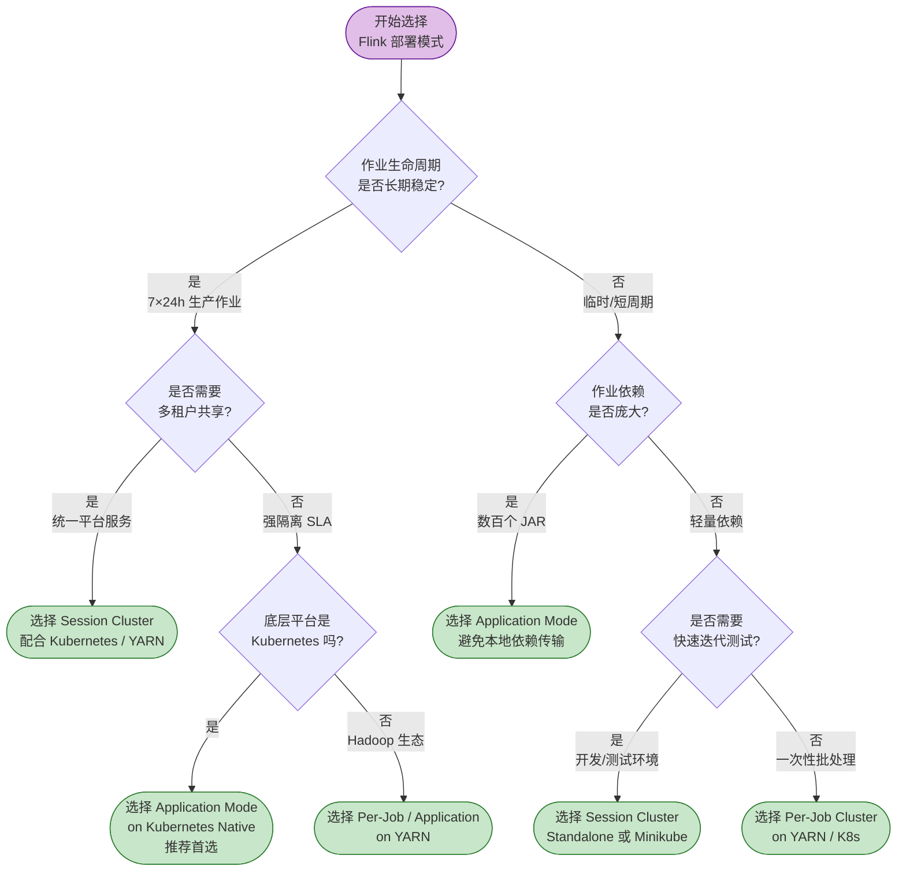

# Flink 部署架构模式 (Flink Deployment Architectures)

> **所属阶段**: Flink/ | **前置依赖**: [../../Struct/01-foundation/01.04-dataflow-model-formalization.md](../../Struct/01-foundation/01.04-dataflow-model-formalization.md) | **形式化等级**: L3-L4

---

## 1. 概念定义 (Definitions)

### 1.1 部署配置抽象

**定义 1.1 (Flink 部署配置)**：Flink 系统 $\mathcal{F}$ 的部署配置 $\mathcal{D}$ 是一个三元组：

$$\mathcal{D} = \langle \mathcal{M}, \mathcal{P}, \mathcal{R}_{mgr} \rangle$$

其中：

- $\mathcal{M} \in \{\text{Session}, \text{Per-Job}, \text{Application}\}$ 为作业提交模式
- $\mathcal{P} \in \{\text{Standalone}, \text{YARN}, \text{Kubernetes}\}$ 为底层资源管理平台
- $\mathcal{R}_{mgr}$ 为 Flink ResourceManager 与底层平台的适配协议

这一三元组保留了从用户代码提交到物理容器调度的完整决策空间。

---

### 1.2 Session Cluster 模式

**定义 1.2 (Session Cluster)**：Session Cluster $\mathcal{D}_{session}$ 是一种预先创建并长期运行的 Flink 集群，其生命周期独立于任何具体作业。形式化地：

$$\mathcal{D}_{session}: \{Job_1, Job_2, \ldots, Job_n\} \rightarrow Shared(JM_{cluster}, TM_{pool})$$

Client 仅负责将预编译的 JobGraph 通过 REST / CLI 提交到已有集群。Session Cluster 适合短生命周期、高频提交的用例，如 Flink SQL Gateway、Ad-hoc 查询。

---

### 1.3 Per-Job Cluster 模式

**定义 1.3 (Per-Job Cluster)**：Per-Job Cluster $\mathcal{D}_{perjob}$ 为每个作业独立创建一套 Flink 集群，作业终止后集群自动销毁。形式化地：

$$\mathcal{D}_{perjob}: Job_i \rightarrow Dedicated(JM_i, TM_i)$$

Client 在本地执行用户程序的 `main()` 方法并生成 JobGraph，随后向底层资源管理器请求启动独立的 JobManager 和 TaskManager。该模式提供最强的作业间隔离，但集群启动会带来额外延迟。

---

### 1.4 Application Mode 模式

**定义 1.4 (Application Mode)**：Application Mode $\mathcal{D}_{app}$ 将用户程序的 `main()` 方法执行从本地 Client 下沉到集群入口点（Cluster Entrypoint），在集群内部完成 JobGraph 构建。形式化地：

$$\mathcal{D}_{app}: UserProgram \xrightarrow{execute\ on\ ClusterEntrypoint} JobGraph \rightarrow Cluster(JM_{app}, TM_{app})$$

Client 仅负责触发集群创建并将用户 JAR 上传到集群入口点。该模式消除了大量依赖 JAR 从本地向远程传输的网络瓶颈，同时保持了 Per-Job 级别的资源隔离。

---

### 1.5 底层资源管理平台

**定义 1.5 (Resource Provider)**：Resource Provider $\mathcal{P}$ 是 Flink 集群赖以获取计算资源的底层基础设施抽象：

$$\mathcal{P}: ResourceRequest \rightarrow \{Container, Pod, Process\}$$

- **Standalone**：Flink 以独立 JVM 进程运行在物理机或虚拟机上，不依赖外部资源管理器。管理员手动配置 `conf/workers` 并通过 `start-cluster.sh` 拉起进程。
- **YARN**：Flink 作为 YARN Application 运行，以 YARN Container 形式申请和释放 TaskManager 资源，JobManager 作为 YARN ApplicationMaster 运行[^1]。
- **Kubernetes Native**：Flink 直接调用 Kubernetes API 创建 JobManager Deployment / Pod 和 TaskManager Pod。支持 Session 模式（`kubernetes-session.sh`）和 Application 模式（`flink run-application`）[^2]。

---

## 2. 属性/特征 (Properties)

### 2.1 部署模式的隔离性与共享性

**性质 2.1 (Session 模式的资源共享性)**：
在 Session 模式下，多个作业的 Task 共享同一 TaskManager 的 Slot 池，因此资源利用率最高，但作业间的故障边界最不严格。

**推导**：

1. 由定义 1.2，$\mathcal{D}_{session}$ 将多个作业映射到 $Shared(JM, TM_{pool})$。
2. 若 $Job_A$ 的算子因数据倾斜导致网络缓冲区耗尽，背压将向上游传播，可能影响 $Job_B$。
3. JVM 堆内存由同一进程内的所有 Task 共享，一个作业的内存泄漏或 GC 风暴会降低其他作业的可用内存。
4. 因此，Session 模式的资源隔离性弱于 Per-Job 和 Application 模式。

> **推断 [Control→Execution]**: Dispatcher 允许多个 JobMaster 共存于同一 JobManager，执行层的 Slot 分配必须处理跨作业的抢占与优先级。
>
> **推断 [Execution→Data]**: Slot 共享导致网络背压和内存压力可能在作业间级联，影响端到端延迟。

---

**性质 2.2 (Per-Job / Application 模式的强隔离性)**：
Per-Job 和 Application 模式为每个作业提供独立的 JobManager 和 TaskManager 集合，单个作业的故障不会直接导致其他作业的状态丢失或性能退化。

**推导**：

1. 由定义 1.3 和 1.4，$\mathcal{D}_{perjob}$ 和 $\mathcal{D}_{app}$ 均满足 $Job_i \rightarrow Dedicated(JM_i, TM_i)$。
2. $JM_i$ 仅负责当前作业的 Checkpoint 协调和调度，不存在跨作业干扰。
3. $TM_i$ 上的 Slot 仅供当前作业使用，单个 Task 的 OOM 不会直接影响其他作业进程。
4. 因此，这两种模式的隔离性在进程级别得到保证。

---

**性质 2.3 (Application 模式的最小客户端依赖)**：
Application 模式下，本地 Client 不再负责 JobGraph 构建和依赖解析，消除了 Client-集群之间的网络带宽瓶颈。

**推导**：

1. 由定义 1.4，Application 模式的 JobGraph 构建发生在 Cluster Entrypoint 内部。
2. Per-Job 模式下，Client 需在本地加载所有依赖后再序列化传输到集群；对于包含数百个 JAR 的应用，这可能产生数百 MB 网络传输。
3. Application 模式仅需上传 fat-jar，JobGraph 在集群内部构建。
4. 因此，Application 模式的提交延迟显著低于 Per-Job 模式，且与依赖规模弱相关。

---

### 2.2 资源平台的弹性特征

**性质 2.4 (Kubernetes Native 的声明式弹性)**：
Kubernetes Native 支持基于声明式配置的动态扩缩容，弹性粒度为单个 Pod（对应一个 TaskManager 实例）。

**推导**：

1. K8s 控制平面以期望状态驱动，自动调整 Pod 数量。
2. Flink 的 K8s ResourceManager 调用 API Server 创建或删除 TaskManager Pod，响应延迟通常为秒级到分钟级。
3. 与 Standalone 的手动配置相比，K8s Native 支持运行时动态调整 TaskManager 数量。
4. 因此，Kubernetes Native 在云原生弹性方面优于 Standalone 和 YARN。

---

**性质 2.5 (YARN 的批处理生态兼容性)**：
YARN 与 HDFS、Hive、Spark 共享同一集群基础设施，因此 Flink on YARN 在已有 Hadoop 数据中心中具有最低的基础设施迁移成本。

**推导**：

1. YARN 集群通常已部署 HDFS、Kerberos、Ranger 等企业级组件。
2. Flink on YARN 可直接复用这些组件进行 Checkpoint 存储和认证，无需额外搭建 K8s 控制平面。
3. YARN 的资源队列和容量调度器已成熟运行多年，运维经验丰富。
4. 因此，在已有 Hadoop 生态中，YARN 的总拥有成本低于引入全新 K8s 集群。

---

## 3. 关系/对比 (Relations & Comparisons)

### 3.1 部署模式 × 资源平台的组合空间

| 模式 \ 平台 | Standalone | YARN | Kubernetes Native |
|------------|------------|------|-------------------|
| **Session** | ✅ 原生支持 | ✅ `yarn-session.sh` | ✅ `kubernetes-session.sh` |
| **Per-Job** | ❌ 不适用 | ✅ `flink run -m yarn-cluster` | ⚠️ 1.15+ 建议用 Application 替代 |
| **Application** | ❌ 不适用 | ✅ `flink run-application -t yarn-application` | ✅ `flink run-application -t kubernetes-application` |

**关系 1**：部署模式与资源平台是正交的设计维度。

**论证**：

- Session 模式可在任何支持长期运行进程的平台实现；Per-Job / Application 需要底层平台支持按需创建容器。
- Standalone 作为静态进程集合，无法按作业粒度动态分配资源，故不支持 Per-Job / Application 模式。
- 运维团队可独立决策"选择什么资源平台"（基础设施现状）和"选择什么部署模式"（作业特征）。

---

### 3.2 部署模式综合对比表

| 维度 | Session Cluster | Per-Job Cluster | Application Mode |
|------|-----------------|-----------------|------------------|
| **资源隔离** | 弱（多作业共享 JVM） | 强（独立 JM + TM） | 强（同 Per-Job） |
| **启动时间** | 极低（秒级，集群已就绪） | 高（需等待资源申请 + 集群启动） | 中（集群启动，但无本地 JobGraph 构建延迟） |
| **故障域** | 集群级（JM 故障影响所有作业） | 作业级（仅影响当前作业） | 作业级（仅影响当前作业） |
| **运维复杂度** | 中（需维护常驻集群、监控多租户） | 高（需管理大量短生命周期集群） | 低（单个应用一个集群，生命周期对齐） |
| **推荐场景** | 短查询、SQL Gateway、开发测试 | 长周期生产作业、强 SLA 要求 | 微服务化流应用、多依赖大型项目、CI/CD 部署 |

> **推断 [Architecture→Engineering]**: Application 模式在隔离性和提交效率之间取得最佳平衡，成为 Flink 社区在 Kubernetes 环境下的首选推荐模式[^3]。

---

### 3.3 架构对比图

```mermaid
graph TB
    subgraph "Session Mode"
        S_JM[JobManager<br/>常驻运行]
        S_TM1[TaskManager<br/>预先启动]
        S_TM2[TaskManager<br/>预先启动]
        S_Client[本地 Client<br/>仅提交 JobGraph]
        S_Job1[Job-1]
        S_Job2[Job-2]

        S_Client -->|提交 JobGraph| S_JM
        S_JM -->|调度| S_TM1
        S_JM -->|调度| S_TM2
        S_TM1 -->|执行| S_Job1
        S_TM1 -->|执行| S_Job2
        S_TM2 -->|执行| S_Job2
    end

    subgraph "Per-Job Mode"
        P_Client[本地 Client<br/>构建 JobGraph + 触发集群创建]
        P_JM[JobManager<br/>随作业启动]
        P_TM1[TaskManager<br/>按需申请]
        P_TM2[TaskManager<br/>按需申请]
        P_Job[Job-i]

        P_Client -->|创建集群 + 传输 JobGraph| P_JM
        P_JM -->|申请| P_TM1
        P_JM -->|申请| P_TM2
        P_TM1 -->|执行| P_Job
        P_TM2 -->|执行| P_Job
    end

    subgraph "Application Mode"
        A_Client[本地 Client<br/>仅上传 JAR]
        A_Entry[Cluster Entrypoint<br/>执行 main 方法]
        A_JM[JobManager<br/>随应用启动]
        A_TM1[TaskManager<br/>按需申请]
        A_TM2[TaskManager<br/>按需申请]
        A_Job[Application Job]

        A_Client -->|上传 User JAR| A_Entry
        A_Entry -->|内部生成 JobGraph| A_JM
        A_JM -->|申请| A_TM1
        A_JM -->|申请| A_TM2
        A_TM1 -->|执行| A_Job
        A_TM2 -->|执行| A_Job
    end

    style S_JM fill:#e3f2fd,stroke:#1976d2
    style P_JM fill:#e8f5e9,stroke:#388e3c
    style A_JM fill:#fff3e0,stroke:#f57c00
    style S_Client fill:#fce4ec,stroke:#c2185b
    style P_Client fill:#fce4ec,stroke:#c2185b
    style A_Client fill:#fce4ec,stroke:#c2185b
```



**图说明**：

- **Session 模式**：JM 和 TM 在作业提交前已存在，Client 仅执行轻量级的 JobGraph 提交。
- **Per-Job 模式**：Client 负担最重，需在本地构建完整的 JobGraph 并触发创建全新集群。
- **Application 模式**：Client 职责最小化，JobGraph 构建下放到 Cluster Entrypoint，兼顾隔离性和提交效率。

---

### 3.4 资源平台的关系映射

**关系 2**：Standalone $\subset$ YARN $\subset$ Kubernetes Native（在云原生能力维度上）。

**论证**：

- Standalone 提供基本进程管理，但不支持容器化隔离和资源动态调度。
- YARN 增加了容器抽象和队列调度，支持按应用申请释放资源，但仍依赖预先部署的节点环境。
- Kubernetes Native 进一步提供 Pod 级隔离、声明式配置、服务发现、ConfigMap / Secret 管理、以及跨云可移植性。
- 对于没有容器化需求的内部数据中心，YARN 复杂度更低；对于多云或混合云战略，K8s Native 的可移植性不可替代。

---

## 4. 论证/选型逻辑 (Argumentation & Selection Logic)

### 4.1 选型决策的形式化框架

**定义 4.1 (部署选型函数)**：
给定需求特征向量 $\vec{r} = (isolation, startup, depsize, multitenant, lifetime)$，部署选型函数为：

$$Select(\vec{r}) = \arg\max_{(\mathcal{M}, \mathcal{P})} Score(\vec{r}, \mathcal{M}, \mathcal{P})$$

其中 $Score$ 综合了五个维度：

- **isolation**：强 SLA 场景（金融风控）要求高隔离，倾向于 Per-Job / Application。
- **startup**：交互式 SQL 查询要求低启动延迟，Session 模式是唯一可行解。
- **depsize**：大量第三方 JAR 的场景，Application 模式可消除本地传输瓶颈。
- **multitenant**：统一流计算服务平台，Session 模式可提高资源利用率。
- **lifetime**：长期稳定运行（7×24h）适合 Per-Job / Application；临时测试适合 Session。

---

### 4.2 决策树：选择哪种部署模式？



**图说明**：长期稳定的生产作业 → Application Mode on K8s；多租户共享或快速迭代 → Session Cluster；依赖庞大但生命周期短 → Application Mode。

---

### 4.3 选型逻辑的边界条件分析

**边界 1：小型团队，无 Kubernetes 运维能力**

- 若团队仅有几台物理服务器且无专职 SRE 维护 K8s，Standalone Session Cluster 是最务实的选择。对于固定规模的小集群（< 20 节点），手动扩容和监控的复杂度可控。

**边界 2：混合云战略，要求跨云可移植性**

- 若企业同时运行在多个云厂商和私有数据中心，Kubernetes Native 提供了统一的部署抽象。Application Mode 的 `flink-conf.yaml` 和 Pod Template 可跨云几乎无修改地迁移。

**边界 3：已有 YARN 队列和 FinOps 体系**

- 若企业已建立基于 YARN Queue 的成本分摊体系，迁移到 K8s 需要重建 Namespace Quota 和计费标签。在此场景下，YARN Application 模式可在不破坏现有流程的前提下享受 Application 模式的隔离性优势。

---

## 5. 工程实例 (Engineering Examples)

### 5.1 实例 1：Kubernetes Native Application Mode 部署

**场景**：某电商平台部署实时用户行为分析 Flink 应用，依赖 80+ 个第三方 JAR，要求 7×24 小时稳定运行，且与其他业务团队的作业完全隔离。

**部署配置**（`flink-conf.yaml` 关键项）：

```yaml
jobmanager.memory.process.size: 2048m
taskmanager.memory.process.size: 8192m
taskmanager.numberOfTaskSlots: 4
parallelism.default: 12

kubernetes.cluster-id: realtime-analytics-v1
kubernetes.namespace: flink-apps
kubernetes.container.image: flink:1.18-scala_2.12

state.backend: rocksdb
state.checkpoint-storage: filesystem
checkpoints.dir: s3p://flink-checkpoints/realtime-analytics/
high-availability: kubernetes
high-availability.storageDir: s3p://flink-ha/realtime-analytics/
```

**提交命令**：

```bash
./bin/flink run-application \
    -t kubernetes-application \
    -Dkubernetes.cluster-id=realtime-analytics-v1 \
    local:///opt/flink/usrlib/realtime-analytics-1.0.jar
```

**要点**：依赖 JAR 预先打包进 Docker 镜像的 `/opt/flink/usrlib/` 目录，避免提交时网络传输；RocksDB + S3 支持 TB 级状态和增量 Checkpoint；K8s ConfigMap 进行 JM Leader 选举，无需 ZooKeeper。

---

### 5.2 实例 2：YARN Session Cluster 部署（多租户数据平台）

**场景**：某金融集团的数据平台部门运营统一流计算服务，为 10+ 个业务团队提供 Flink SQL 查询能力。查询以短周期 Ad-hoc 分析为主，要求秒级提交。

**部署配置**：

```bash
./bin/yarn-session.sh \
    -nm flink-sql-platform \
    -qu root.flink \
    -jm 4096m \
    -tm 16384m \
    -s 8
```

**使用方式**：

```sql
INSERT INTO risk_monitoring
SELECT
    user_id,
    COUNT(*) AS transaction_count,
    SUM(amount) AS total_amount
FROM transactions
GROUP BY TUMBLE(event_time, INTERVAL '1' MINUTE), user_id;
```

**要点**：YARN Session Cluster 常驻运行（2 个 JM HA + 16 个 TM，总 Slot 数 128）；通过 `root.flink` 队列限制资源上限；平均启动延迟 < 3 秒；禁止自定义 UDF 以降低跨作业干扰。

---

### 5.3 实例 3：Standalone Per-Job 的变通实现（边缘计算）

**场景**：某制造业企业在工厂边缘服务器（单台 64 核服务器）上部署 Flink，用于实时监控产线 IoT 传感器数据。边缘环境没有 YARN 或 K8s，且要求每个产线作业严格隔离。

**部署方案**：
Standalone 本身不支持 Per-Job 模式，但可以通过为每个作业分配独立的 Flink 配置文件和端口范围，实现逻辑上的 Per-Job 隔离。

```bash
# 产线 A
export FLINK_CONF_DIR=/opt/flink/line-a-conf/
# line-a-conf: jobmanager.rpc.port=6123, rest.port=8081
/opt/flink/bin/start-cluster.sh
/opt/flink/bin/flink run /opt/jobs/line-a-monitoring.jar

# 产线 B
export FLINK_CONF_DIR=/opt/flink/line-b-conf/
# line-b-conf: jobmanager.rpc.port=6124, rest.port=8082
/opt/flink/bin/start-cluster.sh
/opt/flink/bin/flink run /opt/jobs/line-b-monitoring.jar
```

**要点**：通过独立的 RPC/REST 端口避免 JM 冲突；每个作业拥有独立的 JM/TM JVM 进程，实现 OS 级别隔离；启停由边缘服务器的 systemd 脚本控制。局限性是无法动态扩缩容。

---

## 6. 引用参考 (References)

[^1]: Apache Flink Documentation, "Apache Flink on YARN", 2025. <https://nightlies.apache.org/flink/flink-docs-stable/docs/deployment/resource-providers/yarn/>
[^2]: Apache Flink Documentation, "Native Kubernetes", 2025. <https://nightlies.apache.org/flink/flink-docs-stable/docs/deployment/resource-providers/native_kubernetes/>
[^3]: Apache Flink Documentation, "Deployment Mode Overview", 2025. <https://nightlies.apache.org/flink/flink-docs-stable/docs/deployment/overview/>
