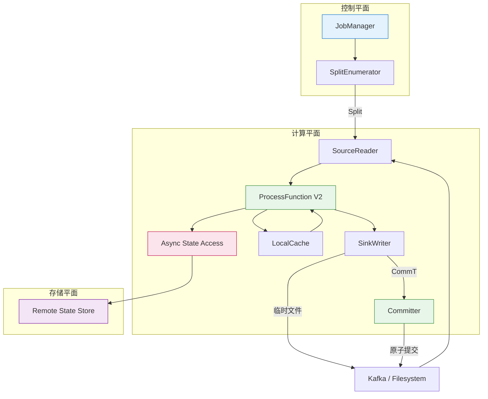

> **状态**: 🔮 前瞻内容 | **风险等级**: 高 | **最后更新**: 2026-04
> 
> 此文档描述的内容处于早期规划阶段，可能与最终实现不符。请以 Apache Flink 官方发布为准。
# DataStream V2 API 语义分析 (DataStream V2 API Semantics)

> **所属阶段**: Flink/01-architecture | **前置依赖**: [Dataflow 模型形式化](../../Struct/01-foundation/01.04-dataflow-model-formalization.md) | **形式化等级**: L5
> **警告**: DataStream V2 API 是 Apache Flink 2.0 中引入的**实验性特性**，API 可能在未来版本中发生重大变化[^1][^2]。

---

## 目录

- [DataStream V2 API 语义分析 (DataStream V2 API Semantics)](#datastream-v2-api-语义分析-datastream-v2-api-semantics)
  - [目录](#目录)
  - [1. 概念定义 (Definitions)](#1-概念定义-definitions)
    - [Def-F-01-01 (DataStream V2 类型抽象)](#def-f-01-01-datastream-v2-类型抽象)
    - [Def-F-01-02 (Source API V2)](#def-f-01-02-source-api-v2)
    - [Def-F-01-03 (ProcessFunction V2)](#def-f-01-03-processfunction-v2)
    - [Def-F-01-04 (Async State Access)](#def-f-01-04-async-state-access)
    - [Def-F-01-05 (Sink V2)](#def-f-01-05-sink-v2)
    - [Def-F-01-06 (Record Attributes)](#def-f-01-06-record-attributes)
  - [2. 属性推导 (Properties)](#2-属性推导-properties)
    - [Lemma-F-01-01 (V2 状态访问类型安全性)](#lemma-f-01-01-v2-状态访问类型安全性)
    - [Lemma-F-01-02 (异步状态访问单调性)](#lemma-f-01-02-异步状态访问单调性)
    - [Prop-F-01-01 (声明式状态幂等初始化)](#prop-f-01-01-声明式状态幂等初始化)
  - [3. 关系建立 (Relations)](#3-关系建立-relations)
    - [关系 1: DataStream V1 `↦` DataStream V2](#关系-1-datastream-v1--datastream-v2)
    - [关系 2: DataStream V2 `≈` Dataflow 模型](#关系-2-datastream-v2--dataflow-模型)
    - [关系 3: Async State Access `↔` 分离状态存储架构](#关系-3-async-state-access--分离状态存储架构)
  - [4. 论证过程 (Argumentation)](#4-论证过程-argumentation)
    - [4.1 DataStream V1 vs V2 对比](#41-datastream-v1-vs-v2-对比)
    - [4.2 反例：V1 运行时类型错误](#42-反例v1-运行时类型错误)
    - [4.3 反例：异步读写乱序完成](#43-反例异步读写乱序完成)
    - [4.4 边界讨论：延迟-一致性权衡](#44-边界讨论延迟-一致性权衡)
  - [5. 形式证明 / 工程论证 (Proof / Engineering Argument)](#5-形式证明--工程论证-proof--engineering-argument)
    - [Thm-F-01-01 (DataStream V2 类型安全性)](#thm-f-01-01-datastream-v2-类型安全性)
    - [Thm-F-01-02 (异步状态访问下的 Exactly-Once 保持性)](#thm-f-01-02-异步状态访问下的-exactly-once-保持性)
    - [工程论证：V2 选型决策](#工程论证v2-选型决策)
  - [6. 实例验证 (Examples)](#6-实例验证-examples)
    - [示例 6.1: 端到端 DataStream V2 作业](#示例-61-端到端-datastream-v2-作业)
    - [示例 6.2: Record Attributes 的使用](#示例-62-record-attributes-的使用)
  - [7. 可视化 (Visualizations)](#7-可视化-visualizations)
    - [DataStream V2 执行模型](#datastream-v2-执行模型)
  - [8. 引用参考 (References)](#8-引用参考-references)

## 1. 概念定义 (Definitions)

### Def-F-01-01 (DataStream V2 类型抽象)

$$
\text{DataStreamV2}\langle T \rangle = \langle \Sigma_T, \mathcal{E}, \mathcal{C}_{V2}, \mathcal{R}, \mathcal{A} \rangle
$$

| 符号 | 语义 |
|------|------|
| $\Sigma_T$ | `Stream[T]`，含元素、Watermark、Checkpoint Barrier |
| $\mathcal{E}$ | `StreamExecutionEnvironmentV2`，支持声明式状态与异步执行 |
| $\mathcal{C}_{V2}$ | `RuntimeContextV2`，含类型安全的 `StateAccessorV2` |
| $\mathcal{R}$ | `RecordAttributes`，逐记录元数据（见 Def-F-01-06） |
| $\mathcal{A}$ | `AsyncExecutionPolicy`，控制状态访问异步化程度 |

**流代数**：

```
Stream[T] = μX. Empty | Cons(Element[T], X) | Cons(Watermark, X) | Cons(CheckpointBarrier, X)
```

DataStream V2 在 V1 基础上引入编译期类型安全、声明式状态注册和异步执行原语[^1][^3]。

---

### Def-F-01-02 (Source API V2)

**Source API V2** 采用**拆分发现 (Split Discovery)** 与**读取器 (Reader)** 分离架构：

$$
\text{SourceV2}\langle T \rangle = \langle \text{SplitEnumerator}, \text{SourceReader}, \text{SplitT}, \text{EnumeratorCheckpoint} \rangle
$$

| 组件 | 运行位置 | 职责 |
|------|---------|------|
| `SplitEnumerator` | JobManager | 发现数据源分片（Kafka Partition、文件块等） |
| `SourceReader` | TaskManager | 读取分配的分片并产生记录流 |
| `SplitT` | — | 可序列化的分片类型，支持分布式调度 |
| `EnumeratorCheckpoint` | — | 分片分配快照，用于故障恢复 |

**协议形式化**：

```
enumerate(): List[SplitT]
assignSplits(readers): Map[ReaderID, List[SplitT]]
checkpoint(): EnumeratorCheckpoint
reader.pollNext(): ReaderOutput[T]
reader.snapshotState(): ReaderSnapshot
```

Source V2 将分片发现与数据读取解耦，支持动态分片扩展、统一批流处理及精确事件时间水印生成[^4]。

---

### Def-F-01-03 (ProcessFunction V2)

$$
\text{ProcessFunctionV2}\langle T, R \rangle = \langle f_{proc}, \Delta_{state}, \tau_{timer}, \mathcal{C}_{V2} \rangle
$$

- $f_{proc}: T \times \mathcal{C}_{V2}[T] \rightarrow \text{Output}[R]$ 为核心处理函数；
- $\Delta_{state}$ 为 `StateDeclarations` 声明的状态描述符集合；
- $\tau_{timer}$ 为定时器注册与回调机制；
- $\mathcal{C}_{V2}[T]$ 为参数化处理上下文。

```scala
trait ContextV2[T] {
  def timestamp(): Long
  def currentWatermark(): Long
  def timerService(): TimerServiceV2
  def output(): OutputCollectorV2[R]
  def getState[S](decl: StateDeclarationV2[ S ]): StateV2[ S ]
}
```

**输出类型**：

```
Output[R] ::= Single(R) | Multiple(List[R]) | Empty | SideOutput(TaggedOutput[R]) | Async(Future[Output[R]])
```

ProcessFunction V2 通过 `StateDeclarations` 在类定义时声明状态、在 `open()` 中绑定运行时存储，实现编译期类型检查与空安全[^2][^3]。

---

### Def-F-01-04 (Async State Access)

**异步状态访问**将同步阻塞读写转换为基于 `Future` 的非阻塞操作：

$$
\text{AsyncStateAccess} = \langle \text{Op}, \text{Future}[V], \text{IOBuffer}, \text{SyncPolicy} \rangle
$$

**异步操作代数**：

```
AsyncStateOperation ::= Get(Key) | Put(Key, Value) | Delete(Key) | RangeQuery(Predicate)

Get(k): Future[Option[Value] | NotFound]
Put(k, v): Future[Ack | Error]
Delete(k): Future[Ack]
RangeQuery(p): Future[Stream[(Key, Value)]]
```

**Future 单子语义**：

```
Future<T> ::= Pending | Completed<T> | Failed<Error>
map: Future<A> → (A → B) → Future<B>
flatMap: Future<A> → (A → Future<B>) → Future<B>
```

在分离状态存储架构下，异步状态访问允许算子在等待远程 I/O 时释放计算线程，通过流水线隐藏延迟[^5][^6]。

---

### Def-F-01-05 (Sink V2)

**Sink V2** 采用**Writer** 与 **Committer** 分离的两阶段提交架构：

$$
\text{SinkV2}\langle T \rangle = \langle \text{SinkWriter}, \text{Committer}[CommT], \text{GlobalCommitter}[GlobalCommT], \text{Serializer}[T] \rangle
$$

| 组件 | 运行位置 | 职责 |
|------|---------|------|
| `SinkWriter` | TaskManager / Subtask | 接收记录，缓冲并写入外部系统临时位置 |
| `Committer` | TaskManager / JM | 原子提交 `CommT` 事务句柄 |
| `GlobalCommitter` | JobManager（可选） | 全局协调跨 Subtask 提交 |
| `Serializer` | TaskManager | 将 $T$ 序列化为外部格式 |

**两阶段提交协议**：

```
Phase 1: Writer 将缓冲数据刷写到临时位置，生成 CommT
Phase 2: Checkpoint 成功后，Committer 原子地将 CommT 转为最终结果
         Checkpoint 失败则临时数据被丢弃（隐式回滚）
```

Sink V2 的标准化两阶段提交架构降低了自定义 Exactly-Once Sink 的实现复杂度，为 Iceberg、Paimon 等提供统一接口[^7][^8]。

---

### Def-F-01-06 (Record Attributes)

$$
\text{Record}\langle T \rangle = \langle \text{payload}: T, \text{timestamp}: \mathbb{T}, \text{attributes}: \mathcal{A} \rangle
$$

```
AttributeSet = Map[AttributeKey, AttributeValue]

内置属性:
  - sourcePartition: String
  - sourceOffset: Long
  - arrivalTimestamp: Long
  - lineageTrace: List[String]
  - routingHint: String
```

**属性传播规则**：

```
∀ op, ∀ r ∈ Input(op):
  propagatedAttributes(r') = mergeAttributes(r.attributes, op.addedAttributes)
```

Record Attributes 让 Source 可在不修改业务类型 $T$ 的前提下透明传递元数据，Sink 可读取其实现幂等去重[^4][^9]。

---

## 2. 属性推导 (Properties)

### Lemma-F-01-01 (V2 状态访问类型安全性)

**陈述**：ProcessFunction V2 中，`ContextV2.getState(decl: StateDeclarationV2[S]): StateV2[S]` 的返回类型在编译期可验证，运行时不会出现 `ClassCastException`。

**推导**：

1. `StateDeclarationV2[S]` 通过隐式 `TypeInformation[S]` 在类定义时捕获类型 $S$；
2. `getState` 返回类型参数与 `decl` 绑定；
3. 编译器验证接收变量与返回类型一致性；
4. 因此 `state.value()` 返回值编译期已知为 $S$，无需运行时强制转换。∎

---

### Lemma-F-01-02 (异步状态访问单调性)

**陈述**：对于同一键 $k$ 的异步状态操作序列，若写操作按发起顺序完成，则读操作返回值版本单调不减。

**推导**：

1. 异步写先在本地缓存更新并标记 `dirty`，再按顺序刷写到远程；
2. 远程存储为每个键维护单调递增版本号；
3. 远程端串行化执行保证返回版本不低于之前已确认写操作；
4. 本地缓存 Read-Through 策略保持单调性。∎

> **推断 [Model→Implementation]**: 单调性保证异步执行仍满足 Dataflow 确定性要求（参见 [../../Struct/01-foundation/01.04-dataflow-model-formalization.md](../../Struct/01-foundation/01.04-dataflow-model-formalization.md)）。

---

### Prop-F-01-01 (声明式状态幂等初始化)

**陈述**：若 `open()` 中多次调用 `context.getState(decl)` 获取同一 `decl`，返回句柄指向同一底层存储实例。

**推导**：`RuntimeContextV2` 维护 `StateRegistryV2: StateId → StateV2Handle`。首次调用分配存储并注册，后续调用直接返回已注册句柄。∎

---

## 3. 关系建立 (Relations)

### 关系 1: DataStream V1 `↦` DataStream V2

存在结构保持映射 $\text{encode}: \text{Programs}_{V1} \rightarrow \text{Programs}_{V2}$：

```
encode(DataStreamV1[T])         = DataStreamV2[T]
encode(ProcessFunction[IN,OUT])  = ProcessFunctionV2[IN,OUT]
encode(ValueStateDescriptor[T])  = StateDeclarations.valueState[T](stateName)
encode(ListStateDescriptor[T])   = StateDeclarations.listState[T](stateName)
encode(MapStateDescriptor[K,V])  = StateDeclarations.mapState[K,V](stateName)
encode(SourceFunction[T])        ≈ SourceV2[T]
encode(SinkFunction[T])          ≈ SinkV2[T]
```

对于任意 V1 程序 $p$，$\text{encode}(p)$ 在相同输入下产生相同输出序列和状态快照。V2 的 Source V2 SplitEnumerator、Sink V2 Committer 等新抽象无法被 V1 直接表达，故编码是**满射但非单射**[^2][^3]。

---

### 关系 2: DataStream V2 `≈` Dataflow 模型

DataStream V2 与 Google Dataflow 模型在观测语义上等价。详细形式化对应参见 [../../Struct/01-foundation/01.04-dataflow-model-formalization.md](../../Struct/01-foundation/01.04-dataflow-model-formalization.md)。

| Dataflow 模型 | DataStream V2 实现 | 形式化对应 |
|--------------|-------------------|-----------|
| **PCollection** | `DataStreamV2[T]` | $\text{Stream}\langle T \rangle$ |
| **Source** | `SourceV2[T]` | $\emptyset \rightarrow \text{Stream}\langle T \rangle$ |
| **ParDo** | `ProcessFunctionV2[T,R]` | $f: T \times \mathcal{S} \rightarrow R^* \times \mathcal{S}$ |
| **Window/Trigger** | `WindowOperator` + `Trigger` | Def-S-04-05 |
| **Watermark** | `WatermarkGenerator` | $wm: \text{Stream} \rightarrow \mathbb{T}$ |
| **Sink** | `SinkV2[T]` | $\text{Stream}\langle T \rangle \rightarrow \emptyset$ |

`RecordAttributes` 对应 Dataflow 中记录附加元数据的能力；`AsyncStateAccess` 对应分离存储实现下的状态访问透明性假设。由 [../../Struct/01-foundation/01.04-dataflow-model-formalization.md](../../Struct/01-foundation/01.04-dataflow-model-formalization.md) 的 Thm-S-04-01，只要算子为纯函数且通道保证 FIFO，异步状态访问的延迟不改变最终输出的确定性。

---

### 关系 3: Async State Access `↔` 分离状态存储架构

异步状态访问是 Flink 2.0 分离状态存储架构在 API 层的直接映射：

- **LocalCache** ↔ TaskManager 热状态缓存层；
- **Future 操作** ↔ 远程对象存储（S3/GCS）异步网络请求；
- **SyncPolicy.SYNC** ↔ 线性一致性；**SyncPolicy.ASYNC** ↔ 最终一致性；
- **IOBuffer** ↔ Write-Ahead Log → MemTable → SSTable 流水线。

> **推断 [Architecture→API]**: 分离存储架构决定了 V2 必须提供异步状态访问原语（参见 Flink-2.0-Architecture-Formal.md 定理 5.3）。

---

## 4. 论证过程 (Argumentation)

### 4.1 DataStream V1 vs V2 对比

| 维度 | DataStream V1 | DataStream V2 |
|------|---------------|---------------|
| **状态声明** | 命令式 `getRuntimeContext().getState(descriptor)` | 声明式 `StateDeclarations.valueState[T](stateName)` |
| **状态访问** | 同步阻塞 (`state.value()`) | 同步 + 异步 (`state.getAsync()`) |
| **类型安全** | `TypeInformation` 运行时擦除 | 泛型参数编译期保留 |
| **空状态处理** | 返回 `null`（不安全） | 返回 `Option[T]` 或默认值 |
| **Source 模型** | `SourceFunction`（单一接口） | `SourceV2`（Enumerator + Reader 分离） |
| **Sink 模型** | `SinkFunction` / `TwoPhaseCommitSinkFunction` | `SinkV2`（Writer + Committer 分离） |
| **记录元数据** | 需嵌入业务类型 | 内置 `RecordAttributes` |
| **执行上下文** | `ProcessFunction.Context` 隐式传递 | `ContextV2[T]` 显式参数化 |
| **异步执行** | 仅通过 `AsyncDataStream`（侧枝 API） | 内建 `AsyncExecutionPolicy` |
| **向后兼容** | 基线 API | V1 API 完全保留，可混合使用 |

```
V1StateAccess = λs:StateDescriptor. getRuntimeContext().getState(s)
  // 运行时可能抛出 StateDescriptorMismatchException，可能返回 null

V2StateAccess = λd:StateDeclarationV2[S]. context.getState(d)
  // 编译期检查 StateType 匹配；运行时始终返回 StateV2[S]，get(): Option[S]
```

---

### 4.2 反例：V1 运行时类型错误

```java
import org.apache.flink.streaming.api.functions.ProcessFunction;

import org.apache.flink.api.common.state.ValueState;
import org.apache.flink.api.common.state.ValueStateDescriptor;
import org.apache.flink.api.common.typeinfo.Types;


// V1: 编译通过，运行时失败
class BadV1Function extends ProcessFunction<Event, Result> {
    private ValueState<Long> countState;

    @Override
    public void open(Configuration parameters) {
        // 错误：描述符声明为 String，变量类型为 Long
        ValueStateDescriptor<String> descriptor =
            new ValueStateDescriptor<>("count", Types.STRING);
        countState = getRuntimeContext().getState(descriptor);
    }

    @Override
    public void processElement(Event value, Context ctx, Collector<Result> out) {
        Long count = countState.value();  // 运行时 ClassCastException!
    }
}
```

V1 的状态获取在运行时通过 `TypeInformation` 反序列化后强制转换，错误可能运行数小时后才触发。V2 的绑定在编译期即被验证[^2]。

---

### 4.3 反例：异步读写乱序完成

```scala
// 危险：两个异步写发起顺序 ≠ 完成顺序
class BadAsyncFunction extends ProcessFunctionV2[Event, Result] {
    override def processElement(event: Event, ctx: ContextV2[Event]): Output[Result] = {
        counter.updateAsync(event.value)     // 写 1
        counter.updateAsync(event.value * 2) // 写 2
        // 写 2 可能在写 1 之前完成，最终状态不确定
        Output.empty()
    }
}
```

**修复**：使用 `flatMap` 链式组合：`counter.updateAsync(v).flatMap(_ => counter.updateAsync(v * 2))`

---

### 4.4 边界讨论：延迟-一致性权衡

| 策略 | 写延迟 | 一致性 | 适用场景 |
|------|--------|--------|---------|
| `SYNC` | ~100ms | 线性一致性 | 金融交易、全局计数器 |
| `ASYNC(freq=100ms)` | ~10μs | 最终一致性 (≤100ms) | 一般流处理、实时报表 |
| `LAZY` | ~10μs | Checkpoint 边界一致性 | 日志分析、低优先级作业 |

```
L_sync  = T_local + T_serialize + T_network + T_remote_write + T_ack
L_async = T_local + T_enqueue
```

用户可按状态重要性选择同步策略，而非像 V1 由 State Backend 全局统一[^5][^6]。

---

## 5. 形式证明 / 工程论证 (Proof / Engineering Argument)

### Thm-F-01-01 (DataStream V2 类型安全性)

**陈述**：对于任意成功编译的良类型 DataStream V2 程序 $p$，运行时不会出现由状态类型不匹配导致的 `ClassCastException` 或空指针异常。

**证明**：

1. 设 $\Gamma$ 包含 `StateDeclarationV2[S]` 和 `ContextV2.getState: ∀S. StateDeclarationV2[S] → StateV2[S]` 绑定；
2. `ctx.getState(decl): StateV2[S]` 的返回类型与 `decl` 一致；编译器验证类型匹配；
3. `ValueStateV2[S].get(): Option[S]` 永不为 `null`；`value(): S` 仅在有 `defaultValue` 时可用；
4. 因此成功编译的程序运行时不会出现上述异常。∎

---

### Thm-F-01-02 (异步状态访问下的 Exactly-Once 保持性)

**陈述**：在 Flink 2.0 异步状态访问模型下，若状态存储满足 `ReadCommitted` 一致性且 Checkpoint 协议正确执行，则有状态算子保证端到端 Exactly-Once 语义。

**证明概要**：

1. 异步状态访问是同步访问的**延迟展开**，不改变 happen-before 关系：`AsyncRead(k) >>= λv. Process(v) ≈ Process(read(k))`；
2. Mailbox 模型保证：算子在收到 Checkpoint Barrier 前不发送 Barrier 后输出；pre-Barrier 异步操作在 Barrier 对齐时完成或可被快照捕获；
3. 因此异步轨迹可重排为等价同步轨迹，观察输出相同；
4. 由 [../../Struct/01-foundation/01.04-dataflow-model-formalization.md](../../Struct/01-foundation/01.04-dataflow-model-formalization.md) 的分布式快照理论，Source V2 快照保证可重放，Sink V2 的 `Committer` 保证原子提交；
5. 异步执行不改变 $f_{compute}$ 的纯函数语义，Exactly-Once 保持性成立。∎

---

### 工程论证：V2 选型决策

```
ShouldUseV2 ≡ (
    NeedTypeSafety ∨ NeedDeclarativeState ∨ NeedDisaggregatedStorage ∨
    NeedUnifiedBatchStreamingSource ∨ NeedStandardizedExactlyOnceSink
) ∧ CanTolerateExperimentalAPI
```

| 场景特征 | 推荐版本 | 理由 |
|---------|---------|------|
| 新建 Flink 2.0 项目，团队熟悉现代类型系统 | V2 | 长期收益大于迁移成本 |
| 需要分离状态存储（云原生、大状态） | V2 | 异步状态访问是必需接口 |
| 需要统一批流 Source（Iceberg/Paimon） | V2 | Source V2 是标准接口 |
| 需要自定义 Exactly-Once Sink | V2 | Sink V2 大幅降低实现复杂度 |
| 现有 V1 作业稳定运行，无扩展需求 | V1 | 无需承担实验性 API 风险 |
| 大量依赖第三方 V1 库 | V1 | 等待生态成熟后再迁移 |

Flink 2.0 支持 V1 与 V2 **混合共存**，可渐进式迁移[^1][^2]。

---

## 6. 实例验证 (Examples)

### 示例 6.1: 端到端 DataStream V2 作业

```java
// Source V2 + ProcessFunction V2 + Sink V2 端到端示例
KafkaSource<Event> source = KafkaSource.<Event>builder()
    .setBootstrapServers("kafka:9092").setTopics("events")
    .setValueOnlyDeserializer(new EventDeserializationSchema())
    .build();

class AsyncAggregator extends ProcessFunctionV2<Event, AggregatedResult> {
    private final StateDeclarationV2<Long> countDecl = StateDeclarations
        .<Long>valueState("eventCount").withDefaultValue(0L).build();
    private ValueStateV2<Long> countState;

    @Override public void open(RuntimeContextV2 context) {
        countState = context.getState(countDecl);
    }

    @Override public Output<AggregatedResult> processElement(Event e, ContextV2<Event> ctx) {
        long c = countState.value();
        countState.update(c + 1);
        if (e.isGlobalQuery()) {
            return Output.async(ctx.getStateAsync(globalConfigDecl)
                .map(cfg -> cfg.batchSize() <= c + 1
                    ? Output.single(new AggregatedResult(e.id, c + 1)) : Output.empty()));
        }
        return Output.single(new AggregatedResult(e.id, c + 1));
    }
}

FileSink<AggregatedResult> sink = FileSink
    .forRowFormat(new Path("s3://bucket/output/"), new SimpleStringEncoder<>("UTF-8"))
    .build();

env.fromSource(source, WatermarkStrategy.forBoundedOutOfOrderness(Duration.ofSeconds(5)), "Kafka")
    .keyBy(Event::getUserId).process(new AsyncAggregator()).sinkTo(sink);
```

---

### 示例 6.2: Record Attributes 的使用

```java
RecordAttributes attrs = RecordAttributes.builder()
    .set(AttributeKey.sourcePartition, record.topic() + "-" + record.partition())
    .set(AttributeKey.sourceOffset, record.offset())
    .build();

DataStreamV2<Event> stream = env.fromSource(
    source, WatermarkStrategy.forBoundedOutOfOrderness(Duration.ofSeconds(5)),
    "Kafka", attrs);

class DeduplicateFunction extends ProcessFunctionV2<Event, Event> {
    @Override public Output<Event> processElement(Event e, ContextV2<Event> ctx) {
        RecordAttributes a = ctx.recordAttributes();
        String key = a.get(AttributeKey.sourcePartition) + ":" + a.get(AttributeKey.sourceOffset);
        // ... 状态去重 ...
        return Output.single(e);
    }
}
```

---

## 7. 可视化 (Visualizations)

### DataStream V2 执行模型



---

## 8. 引用参考 (References)

[^1]: Apache Flink Documentation, "DataStream API v2 (Experimental)", 2025. <https://nightlies.apache.org/flink/flink-docs-master/docs/dev/datastream/v2/>

[^2]: Apache Flink, "FLIP-500: DataStream API v2", Apache Flink Improvement Proposals, 2024. <https://github.com/apache/flink/blob/master/flink-docs/docs/flips/FLIP-500.md>

[^3]: P. Carbone et al., "Apache Flink: Stream and Batch Processing in a Single Engine," *IEEE Data Eng. Bull.*, 38(4), 2015.

[^4]: Apache Flink Documentation, "Kafka Source", 2025. <https://nightlies.apache.org/flink/flink-docs-stable/docs/connectors/datastream/kafka/>

[^5]: Apache Flink, "FLIP: Disaggregated State Storage", Apache Flink Improvement Proposals, 2024.

[^6]: Apache Flink, "FLIP: Async State API", Apache Flink Improvement Proposals, 2024.

[^7]: Apache Flink Documentation, "FileSink", 2025. <https://nightlies.apache.org/flink/flink-docs-stable/docs/connectors/datastream/filesystem/>

[^8]: Apache Flink, "FLIP-143: Unified Sink API", Apache Flink Improvement Proposals, 2021. <https://github.com/apache/flink/blob/master/flink-docs/docs/flips/FLIP-143.md>

[^9]: T. Akidau et al., "The Dataflow Model: A Practical Approach to Balancing Correctness, Latency, and Cost in Massive-Scale, Unbounded, Out-of-Order Data Processing," *PVLDB*, 8(12), 2015.

---

*文档版本: v1.0 | 更新日期: 2026-04-02 | 规范遵循: 六段式强制模板 + 形式化证明标准*
