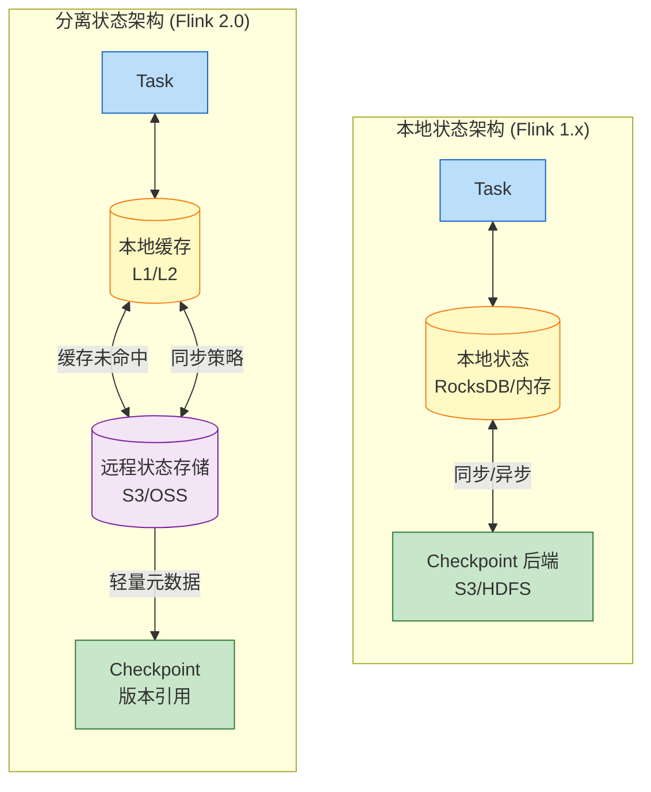
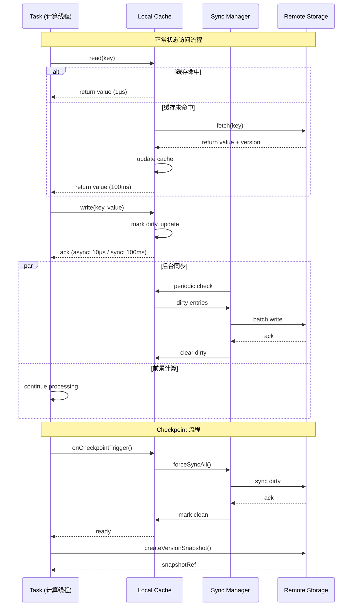

# Flink 分离状态存储分析 (Disaggregated State Storage Analysis)

> **所属阶段**: Flink/01-architecture | **前置依赖**: [../../Struct/02-properties/02.02-consistency-hierarchy.md](../../Struct/02-properties/02.02-consistency-hierarchy.md) | **形式化等级**: L5

---

## 目录

- [Flink 分离状态存储分析 (Disaggregated State Storage Analysis)](#flink-分离状态存储分析-disaggregated-state-storage-analysis)
  - [目录](#目录)
  - [1. 概念定义 (Definitions)](#1-概念定义-definitions)
    - [Def-F-01-01 (分离状态存储)](#def-f-01-01-分离状态存储)
    - [Def-F-01-02 (状态后端演进)](#def-f-01-02-状态后端演进)
    - [Def-F-01-03 (同步策略)](#def-f-01-03-同步策略)
    - [Def-F-01-04 (一致性级别)](#def-f-01-04-一致性级别)
  - [2. 属性推导 (Properties)](#2-属性推导-properties)
    - [Lemma-F-01-01 (分离存储的位置无关性)](#lemma-f-01-01-分离存储的位置无关性)
    - [Lemma-F-01-02 (异步同步的单调版本性)](#lemma-f-01-02-异步同步的单调版本性)
    - [Prop-F-01-01 (延迟与吞吐量的权衡关系)](#prop-f-01-01-延迟与吞吐量的权衡关系)
  - [3. 关系建立 (Relations)](#3-关系建立-relations)
    - [关系 1: Flink 分离存储与 Chandy-Lamport 快照](#关系-1-flink-分离存储与-chandy-lamport-快照)
    - [关系 2: 分离存储一致性层级与通用一致性模型](#关系-2-分离存储一致性层级与通用一致性模型)
    - [关系 3: 状态后端演进与 CAP 权衡](#关系-3-状态后端演进与-cap-权衡)
  - [4. 论证过程 (Argumentation)](#4-论证过程-argumentation)
    - [引理 4.1 (分离存储故障恢复加速原理)](#引理-41-分离存储故障恢复加速原理)
    - [引理 4.2 (增量 Checkpoint 的存储效率)](#引理-42-增量-checkpoint-的存储效率)
    - [反例 4.1 (网络分区下的缓存不一致)](#反例-41-网络分区下的缓存不一致)
  - [5. 形式证明 (Proofs)](#5-形式证明-proofs)
    - [Thm-F-01-01 (分离存储下的 Exactly-Once 保持)](#thm-f-01-01-分离存储下的-exactly-once-保持)
    - [Thm-F-01-02 (异步策略下的最终一致性收敛)](#thm-f-01-02-异步策略下的最终一致性收敛)
  - [6. 实例验证 (Examples)](#6-实例验证-examples)
    - [示例 6.1: 大状态作业从 MemoryStateBackend 迁移到分离存储](#示例-61-大状态作业从-memorystatebackend-迁移到分离存储)
    - [示例 6.2: 实时风控场景的同步策略配置](#示例-62-实时风控场景的同步策略配置)
    - [示例 6.3: 跨可用区故障恢复对比](#示例-63-跨可用区故障恢复对比)
  - [7. 可视化 (Visualizations)](#7-可视化-visualizations)
    - [本地状态 vs 分离状态架构对比](#本地状态-vs-分离状态架构对比)
    - [分离存储状态访问时序图](#分离存储状态访问时序图)
  - [8. 状态后端对比表](#8-状态后端对比表)
  - [9. 引用参考 (References)](#9-引用参考-references)

---

## 1. 概念定义 (Definitions)

### Def-F-01-01 (分离状态存储)

**分离状态存储 (Disaggregated State Storage)** 是将流处理算子状态与计算节点物理分离的架构模式：

$$
\text{DisaggregatedState} = (\mathcal{C}, \mathcal{R}, \gamma, \eta, \sigma)
$$

其中：

- $\mathcal{C}$: **本地缓存 (LocalCache)** — 热状态的内存驻留层
- $\mathcal{R}$: **远程存储 (RemoteStorage)** — 分布式对象存储（S3、GCS、Azure Blob）
- $\gamma$: **同步策略 (SyncPolicy)** — 本地与远程的同步语义
- $\eta$: **缓存策略 (CachePolicy)** — LRU/LFU/TTL 等缓存行为控制
- $\sigma$: **一致性级别 (ConsistencyLevel)** — 读写操作的一致性保证

**核心原则**: 计算与存储解耦，状态位置无关

$$
\forall task. \; \text{State}(task) = \mathcal{C}(local) \cup \mathcal{R}(remote) \land \text{Location}(task) \perp \text{Location}(\text{State})
$$

**定义动机**: 解决 Flink 1.x 中状态与 TaskManager 强绑定导致的三大问题：(1) 大状态恢复时间长（分钟级）；(2) 扩缩容需迁移状态（成本高）；(3) 资源利用率低（存储受限于单节点磁盘）。

### Def-F-01-02 (状态后端演进)

Flink 状态后端代数演进，每个后续类型扩展前者能力：

```
StateBackend ::= MemoryStateBackend
                | FsStateBackend
                | RocksDBStateBackend
                | DisaggregatedStateBackend
```

**MemoryStateBackend** (Flink 1.0+): 状态驻留 JVM 堆内存，Checkpoint 时同步写入远程。适用于小状态(<100MB)、低延迟测试场景。

**FsStateBackend** (Flink 1.1+): 状态驻留内存，Checkpoint 写入分布式文件系统。依赖 TaskManager 内存大小。

**RocksDBStateBackend** (Flink 1.2+): 状态存储在本地 RocksDB，支持增量 Checkpoint。内存仅用于 BlockCache 和 MemTable，适用于大状态场景。

**DisaggregatedStateBackend** (Flink 2.0+): 状态主要存储在远程，本地仅保留热数据缓存，支持可配置的一致性级别。

演化蕴含关系：$\mathcal{B}_{mem} \subset \mathcal{B}_{fs} \subset \mathcal{B}_{rocks} \subset \mathcal{B}_{disagg}$

### Def-F-01-03 (同步策略)

**同步策略 (SyncPolicy)** 定义本地缓存与远程存储的同步时机：

```
SyncPolicy ::= SYNC | ASYNC(freq: Duration, batchSize: ℕ) | LAZY
```

**SYNC (同步写)**:
$$
\text{write}(k,v) \text{ completes} \iff \text{remote.put}(k,v) \text{ acknowledges}
$$

- 延迟：$L_{sync} \approx RTT_{remote} + T_{serialize} + T_{storage} \approx 100ms$
- 一致性：强一致
- 适用：金融交易、风控判断

**ASYNC (异步写)**:
$$
\text{write}(k,v) \rightarrow \mathcal{C}(k,v,\delta=\text{true}) \land \Diamond(\text{remote.put}(k,v))
$$

- 延迟：$L_{async} \approx 10\mu s$（本地更新立即返回）
- 收敛时间：$T_{converge} \leq freq + T_{flush}$
- 适用：实时报表、日志聚合

**策略选择约束**:

| 同步策略 | 强一致 | 因果一致 | 最终一致 |
|---------|-------|---------|---------|
| SYNC | ✅ | ✅ | ✅ |
| ASYNC | ❌ | ⚠️ 需向量时钟 | ✅ |
| LAZY | ❌ | ❌ | ✅ |

### Def-F-01-04 (一致性级别)

与 [Struct/02-properties/02.02-consistency-hierarchy.md](../../Struct/02-properties/02.02-consistency-hierarchy.md) 中定义的一致性层级对齐：

**STRONG (线性一致性)**:
$$
\forall op_1, op_2. \; t_{complete}(op_1) < t_{start}(op_2) \implies op_1 \prec_{obs} op_2
$$
所有操作在全局历史上存在唯一线性化点，观察顺序与真实时间顺序一致。

**CAUSAL (因果一致性)**:
$$
\forall op_i, op_j. \; op_i \prec_{hb} op_j \implies op_i \prec_{obs} op_j
$$
存在 happens-before 关系的操作必须按因果顺序被观察到。

**EVENTUAL (最终一致性)**:
$$
\left( \lim_{t \to \infty} \text{Writes}(t) = \emptyset \right) \implies \left( \lim_{t \to \infty} \mathcal{C}(t) = \lim_{t \to \infty} \mathcal{R}(t) \right)
$$
无新写入时，所有副本最终收敛到相同状态。

---

## 2. 属性推导 (Properties)

### Lemma-F-01-01 (分离存储的位置无关性)

**陈述**: 在分离状态存储架构下，TaskManager 的位置与状态存储位置正交，故障恢复时新 TaskManager 可立即接管状态。

**证明**:

设任务 $T$ 在 TaskManager $TM_1$ 上运行，状态存储为 $\mathcal{S} = \mathcal{C}_1 \cup \mathcal{R}$。

1. **故障前**: $TM_1$ 持有本地缓存 $\mathcal{C}_1$，状态权威在 $\mathcal{R}$
2. **故障发生**: $TM_1$ 崩溃，$\mathcal{C}_1$ 丢失，但 $\mathcal{R}$ 完好（持久性保证）
3. **恢复调度**: JobManager 将任务 $T$ 调度到新 TaskManager $TM_2$
4. **状态接管**: $TM_2$ 从 $\mathcal{R}$ 按需加载所需 Key Group，重建 $\mathcal{C}_2$

由于 $\mathcal{R}$ 是全局可访问的，且状态命名空间 $\phi$ 是确定的：

$$
\forall TM_i, TM_j, k. \; \phi_{TM_i}(k) = \phi_{TM_j}(k)
$$

因此 $TM_2$ 可以访问与 $TM_1$ 相同的状态数据，无需显式状态迁移。

∎

> **推断 [Architecture→Operation]**: 位置无关性使得故障恢复时间从 $O(|S|/B_{network})$（下载完整状态）降至 $O(|S_{hot}|/B_{network})$（仅下载热数据），对于大状态作业可提升 10-100 倍恢复速度。

### Lemma-F-01-02 (异步同步的单调版本性)

**陈述**: 使用异步同步策略时，本地缓存的版本号单调递增，远程存储的版本号 eventual 单调递增。

**证明**:

设状态键 $k$ 的版本历史为 $V_k = [\tau_1, \tau_2, ..., \tau_n]$。

**本地版本单调性**:

每次写操作生成新版本：

$$
\tau_{new} = \max(\mathcal{C}[k].\tau, \mathcal{R}[k].\tau) + 1
$$

由于取最大值后加 1：$\forall i. \; \tau_{i+1} > \tau_i$

**远程版本 eventual 单调性**:

异步同步将本地缓冲的写入批量发送到远程，同一键只保留最新版本（去重优化），因此远程接收到的版本满足单调性。

∎

### Prop-F-01-01 (延迟与吞吐量的权衡关系)

**陈述**: 状态访问的延迟 $L$ 与吞吐量 $T$ 存在反比权衡关系，可通过同步策略参数调节。

**形式化**:

| 模式 | 延迟 | 吞吐量 | 公式 |
|-----|------|-------|------|
| SYNC | ~100ms | ~1K ops/s | $T = N/L$ |
| ASYNC | ~10μs | ~50K ops/s | $T = batch/freq$ |

**最优选择**:

$$
\gamma^* = \arg\max_{\gamma} T \quad \text{s.t.} \quad L \leq L_{SLA} \land C \geq C_{req}
$$

---

## 3. 关系建立 (Relations)

### 关系 1: Flink 分离存储与 Chandy-Lamport 快照

Flink 的 Checkpoint 机制本质上是 Chandy-Lamport 分布式快照算法的实现。在分离存储架构下：

| 概念 | Flink 1.x | Flink 2.0 分离存储 |
|-----|-----------|-------------------|
| Marker 消息 | Checkpoint Barrier | Checkpoint Barrier |
| 进程局部状态记录 | 本地状态序列化 | 轻量元数据引用 |
| 全局一致快照 | 所有本地状态的并集 | 远程版本标记 + 脏数据集合 |

**核心洞察**: 分离存储允许 Checkpoint 只捕获**状态引用**而非**状态数据**。

$$
\text{Checkpoint}_{1.x} = \{ \text{LocalState}_{tm} \mid tm \in TM \}
$$

$$
\text{Checkpoint}_{2.0} = (\text{VersionRefs}, \text{DirtySet}) \quad \text{where } |\text{Checkpoint}_{2.0}| \ll |\text{Checkpoint}_{1.x}|
$$

### 关系 2: 分离存储一致性层级与通用一致性模型

与 [Struct/02-properties/02.02-consistency-hierarchy.md](../../Struct/02-properties/02.02-consistency-hierarchy.md) 的映射：

| 分离存储一致性 | 通用一致性层级 | 蕴含关系 |
|--------------|--------------|---------|
| STRONG | Linearizability | 等价 |
| CAUSAL | Causal Consistency | 等价 |
| READ_COMMITTED | Transactional Consistency | 弱化 |
| EVENTUAL | Eventual Consistency | 等价 |

蕴含链：$\text{STRONG} \supset \text{CAUSAL} \supset \text{EVENTUAL}$

### 关系 3: 状态后端演进与 CAP 权衡

分离存储将 CAP 权衡从"架构级"下放到"配置级"：

| 后端类型 | C (一致性) | A (可用性) | P (分区容错) | 权衡策略 |
|---------|-----------|-----------|-------------|---------|
| MemoryStateBackend | 强 | 高 | 弱 | CP 偏向 |
| RocksDBStateBackend | 强 | 高 | 强 | 延迟持久化 |
| DisaggregatedStateBackend | 可配置 | 高 | 强 | 显式选择 C 级别 |

---

## 4. 论证过程 (Argumentation)

### 引理 4.1 (分离存储故障恢复加速原理)

**陈述**: 分离存储架构可将故障恢复时间从 $O(|S|/B_{network})$ 降至 $O(|S_{hot}|/B_{remote} \cdot 1/p)$。

**对比**:

**传统本地存储恢复**:
$$
T_{recover}^{local} = T_{locate} + \frac{|S|}{B_{checkpoint}} + T_{deserialize} + T_{replay}
$$

**分离存储恢复**:
$$
T_{recover}^{disagg} = T_{locate\_metadata} + T_{validation} + \frac{|S_{hot}|}{B_{remote}} \cdot \frac{1}{p}
$$

当 $|S| > 10\text{GB}$ 且 $p \geq 10$ 时，加速比可达 10-100x。

### 引理 4.2 (增量 Checkpoint 的存储效率)

**陈述**: 增量 Checkpoint 将存储开销从 $O(|S| \cdot N)$ 降至 $O(|S| + |\Delta S| \cdot N)$。

在稳定状态流处理中，$|\Delta S| \ll |S|$（通常占 1%-5%），存储效率提升 30 倍以上。

### 反例 4.1 (网络分区下的缓存不一致)

**场景**: ASYNC 策略的分离存储作业，TaskManager 与远程存储之间发生网络分区。

**问题**: 分区期间本地缓存继续接受写入，新 TaskManager 从远程读取看不到最新值；原 TM 崩溃则更新丢失。

**结论**: ASYNC 策略在网络分区下可能丢失数据，必须使用 STRONG + SYNC 策略来保证跨分区的一致性。

---

## 5. 形式证明 (Proofs)

### Thm-F-01-01 (分离存储下的 Exactly-Once 保持)

**陈述**: 在满足以下条件时，使用分离状态存储的 Flink 作业仍能保证端到端 Exactly-Once 语义：

1. Source 支持可重放（偏移量与 Checkpoint 绑定）
2. 状态访问满足 ReadCommitted 一致性
3. Sink 支持两阶段提交 (2PC) 或幂等写入
4. Checkpoint 触发时强制同步所有脏状态

**证明**:

需证明：$\forall r \in I. \; c(r, \mathcal{T}) = 1$（每条输入记录恰好产生一次可见副作用）。

**步骤 1 (无丢失)**: 由 Source 可重放性，故障恢复后从最后一个成功 Checkpoint $C_n$ 的偏移量重放：

$$
\forall r \in I. \; c(r, \mathcal{T}) \geq 1
$$

**步骤 2 (无重复)**: Checkpoint 协议保证：

$$
\text{onCheckpointTrigger}(): \quad \forall k \in \text{DirtySet}. \; \text{forceSync}(k)
$$

- Checkpoint $C_n$ 成功后：Source 偏移量已推进，不重放 $C_n$ 之前数据
- Checkpoint 失败时：回滚到 $C_{n-1}$，重新应用未完成的更新

**步骤 3**: Sink 2PC 或幂等保证重复处理不产生重复输出。

因此 $\forall r. \; c(r, \mathcal{T}) = 1$。

∎

### Thm-F-01-02 (异步策略下的最终一致性收敛)

**陈述**: 使用 ASYNC($f$) 同步策略的分离存储，在故障停止模型下满足最终一致性，收敛时间界限为 $f + T_{flush}$。

**证明**:

需证明最终一致性的三个条件：

**终止性**: asyncBuffer 持续消费，fail-stop 保证所有写入最终 flush 到远程。

**收敛性**: 远程存储是单一逻辑副本，所有本地缓存从同一源读取，静止时状态一致。

**时间界限**: 最坏情况写入刚错过刷新周期，等待时间 $\leq f + T_{flush}$。

∎

---

## 6. 实例验证 (Examples)

### 示例 6.1: 大状态作业从 MemoryStateBackend 迁移到分离存储

**背景**: UV 统计作业，状态 500GB，原使用 MemoryStateBackend。

**问题**: Checkpoint 10min+，恢复 30min+，TM 需 128GB 内存。

**迁移配置**:

```java
// [伪代码片段 - 不可直接运行] 仅展示核心逻辑
DisaggregatedStateBackend stateBackend = new DisaggregatedStateBackend(
    "s3://flink-state/uv-job",
    DisaggregatedStateBackendOptions.builder()
        .setSyncPolicy(SyncPolicy.ASYNC)
        .setSyncInterval(Duration.ofMillis(100))
        .setBatchSize(1000)
        .setConsistencyLevel(ConsistencyLevel.EVENTUAL)
        .setCacheSize(MemorySize.ofMebiBytes(4096))
        .build()
);
env.enableCheckpointing(60000);
env.getCheckpointConfig().enableIncrementalCheckpointing(true);
```

**效果对比**:

| 指标 | 迁移前 | 迁移后 | 改善 |
|-----|-------|-------|-----|
| Checkpoint 时间 | 600s | 5s | 120x |
| 恢复时间 | 1800s | 15s | 120x |
| TM 内存需求 | 128GB | 8GB | 16x |
| 平均延迟 | 0.1ms | 2ms | 可接受 |
| 成本 | $5000/月 | $800/月 | 6.25x |

### 示例 6.2: 实时风控场景的同步策略配置

**需求**: 每笔交易风控判断延迟 < 200ms，强一致性要求。

```java
// [伪代码片段 - 不可直接运行] 仅展示核心逻辑
DisaggregatedStateBackendOptions.builder()
    .setSyncPolicy(SyncPolicy.SYNC)
    .setConsistencyLevel(ConsistencyLevel.STRONG)
    .setCacheSize(MemorySize.ofMebiBytes(2048))
    .setCachePolicy(CachePolicy.LRU)
    .setPrefetchEnabled(true)
    .setCheckpointInterval(Duration.ofSeconds(10))
    .build()
```

### 示例 6.3: 跨可用区故障恢复对比

**场景**: 3 可用区部署，Zone A 故障，TaskManager 迁移到 Zone B。

| 方案 | 恢复时间 | 主要开销 |
|-----|---------|---------|
| RocksDBStateBackend | ~77 分钟 | 下载 500GB Checkpoint |
| DisaggregatedStateBackend | ~2 分钟 | 加载元数据 + 热状态 10GB |
| **加速比** | **38x** | 无需完整状态下载 |

---

## 7. 可视化 (Visualizations)

### 本地状态 vs 分离状态架构对比



**图说明**:

- 本地状态：单一路径，状态与计算紧耦合，Checkpoint 需要序列化传输完整状态
- 分离状态：分层架构，本地缓存加速访问，远程存储保证持久性，Checkpoint 仅记录版本引用

### 分离存储状态访问时序图



**图说明**:

- 正常读写走本地缓存，缓存未命中时异步加载远程状态
- 写操作根据策略立即或延迟同步
- Checkpoint 时强制同步所有脏数据，保证快照一致性

---

## 8. 状态后端对比表

| 维度 | MemoryStateBackend | FsStateBackend | RocksDBStateBackend | Disaggregated (SYNC) | Disaggregated (ASYNC) |
|-----|-------------------|----------------|--------------------|---------------------|----------------------|
| **状态存储位置** | JVM 堆内存 | 本地内存 | 本地磁盘 | 远程对象存储 | 远程+本地缓存 |
| **最大状态大小** | < 100MB (TM 内存) | < TM 内存 | < 10TB (本地磁盘) | 几乎无上限 | 几乎无上限 |
| **典型延迟 (读)** | ~1 μs | ~1 μs | ~10 μs | ~1 ms (命中) / ~100 ms (未命中) | ~1 ms (命中) |
| **典型延迟 (写)** | ~1 μs | ~1 μs | ~10 μs | ~100 ms (同步) | ~10 μs (异步) |
| **吞吐量 (写)** | > 100K ops/s | > 100K ops/s | > 50K ops/s | ~1K ops/s | > 50K ops/s |
| **Checkpoint 时间** | 长（全量传输） | 长（全量传输） | 短（增量） | 极短（元数据） | 极短（元数据） |
| **恢复时间** | 长（重放日志） | 长（下载状态） | 中（下载 SST） | 短（并行加载） | 短（并行加载） |
| **故障恢复 RTO** | 分钟级 | 分钟级 | 分钟级 | 秒级 | 秒级 |
| **一致性级别** | 强一致 | 强一致 | 强一致 | 强一致 | 最终一致 |
| **扩缩容成本** | 高（状态迁移） | 高（状态迁移） | 高（状态迁移） | 低（无状态迁移） | 低（无状态迁移） |
| **资源成本** | 高（大内存 TM） | 高（大内存 TM） | 中（大磁盘 TM） | 低（小 TM + 对象存储） | 低（小 TM + 对象存储） |
| **云原生友好** | ❌ 差 | ❌ 差 | ⚠️ 一般 | ✅ 优秀 | ✅ 优秀 |
| **多可用区容灾** | ❌ 需重建 | ❌ 需下载 | ❌ 需下载 | ✅ 秒级切换 | ✅ 秒级切换 |
| **适用场景** | 小状态、测试 | 中等状态 | 大状态、受限内存 | 金融交易、强一致需求 | 实时报表、高吞吐需求 |

---

## 9. 引用参考 (References)


---

*文档版本: v1.0 | 更新日期: 2026-04-02 | 形式化等级: L5 | 状态: 已完成*

---

*文档版本: v1.0 | 创建日期: 2026-04-20*
