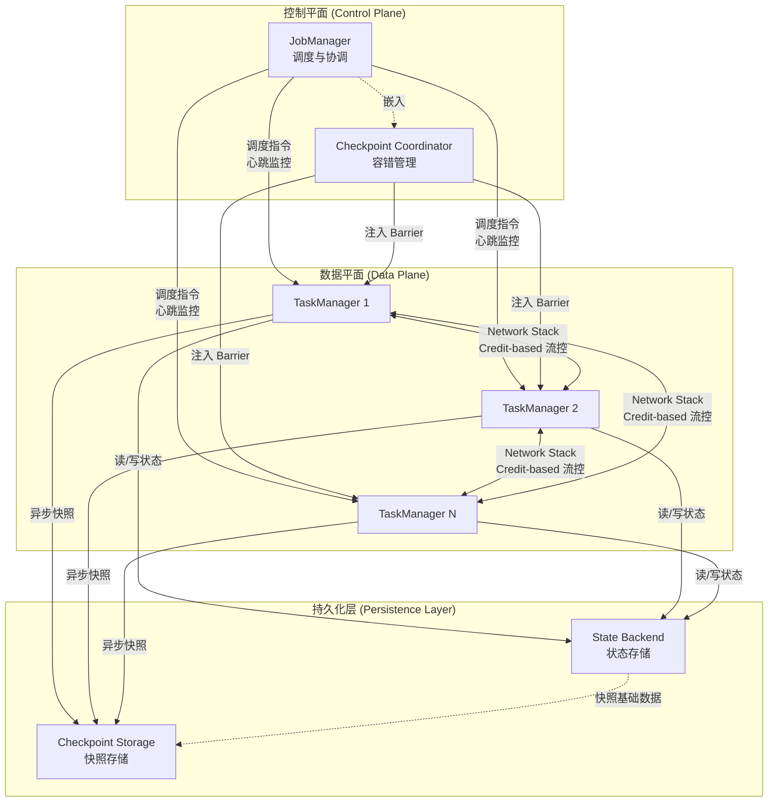
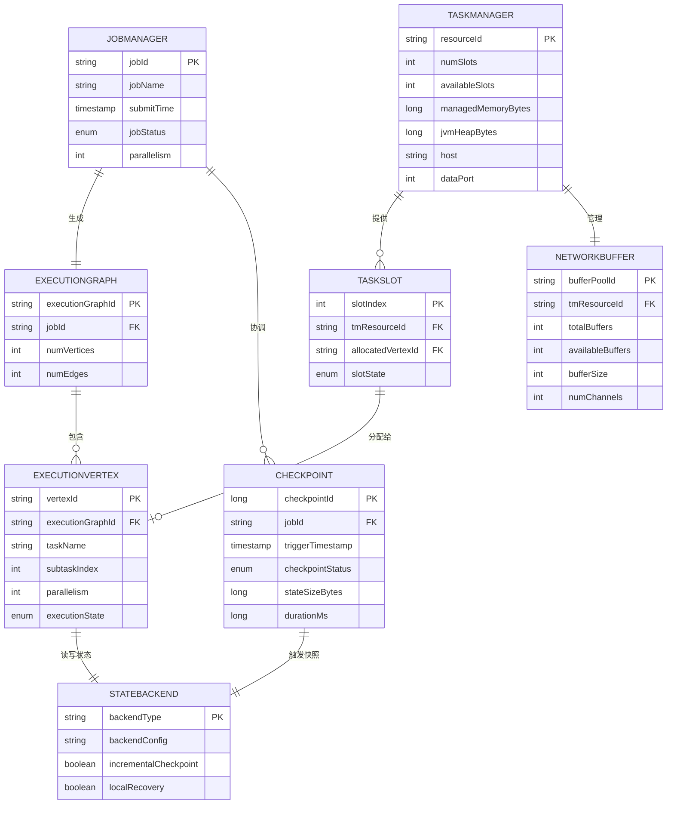
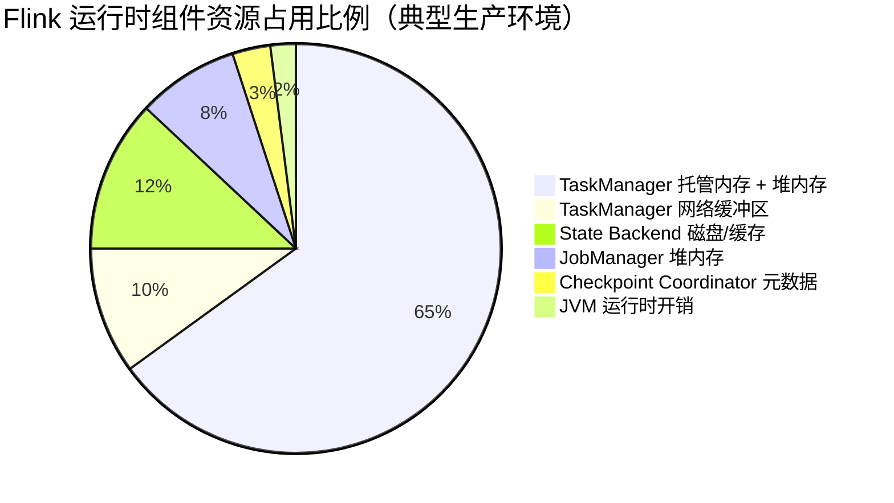
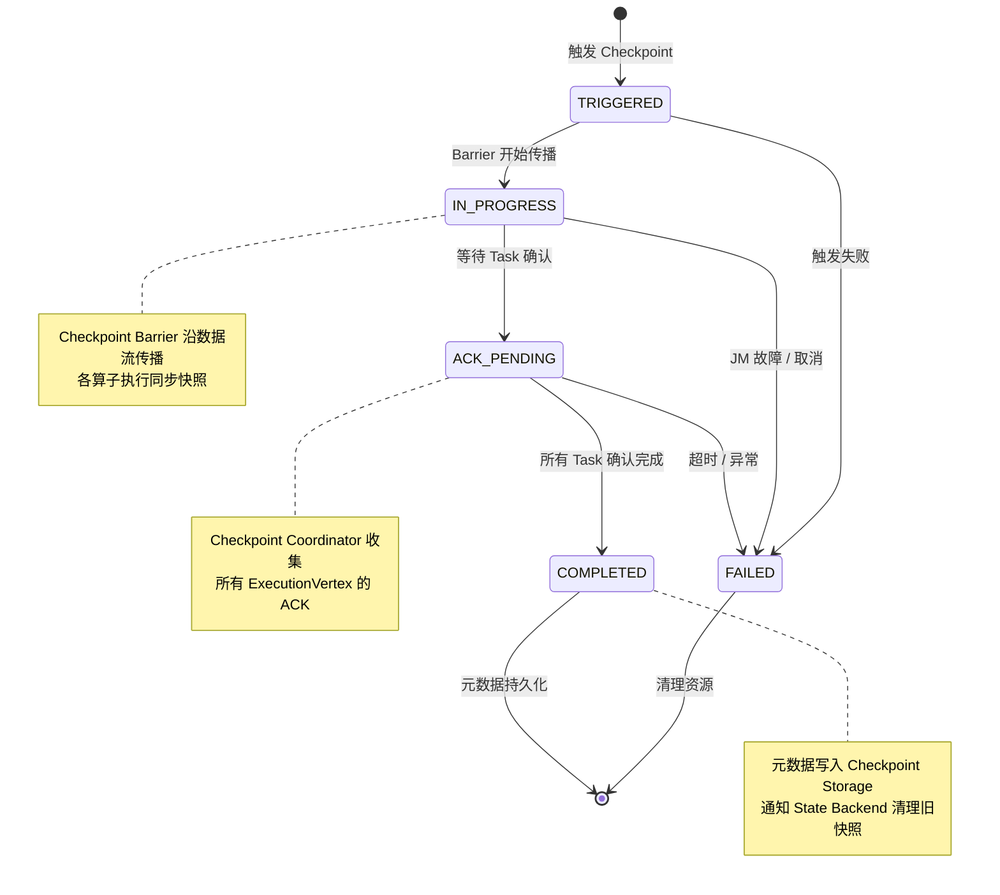
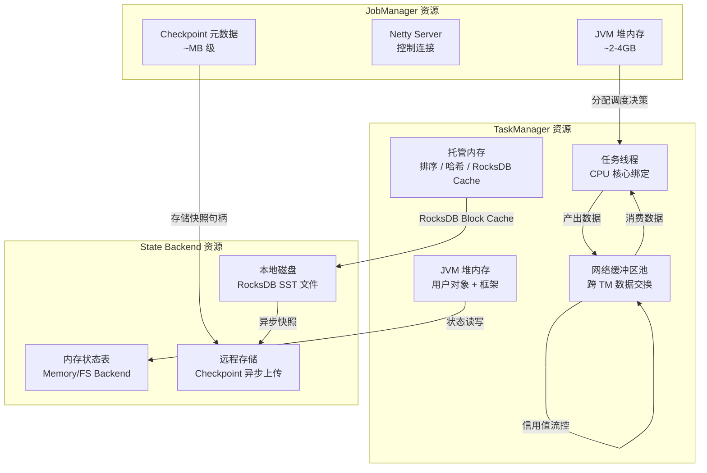

# Flink 系统架构组成分析

> 所属阶段: Flink/01-concepts | 前置依赖: [Flink/01-concepts/flink-core-concepts.md](../01-concepts/flink-core-concepts.md) | 形式化等级: L4

## 1. 概念定义 (Definitions)

### Def-F-01-01: JobManager (JM)

JobManager 是 Flink 集群的控制平面组件，负责作业的调度、协调与生命周期管理。

**形式化定义**: 令 $JM = (S, C, D)$，其中：

- $S$: 调度器 (Scheduler)，负责将逻辑执行图转换为物理执行图并分配任务到 TaskManager
- $C$: 协调器集合，包括 CheckpointCoordinator、ResourceManager 等
- $D$: 调度决策函数 $D: \text{DAG} \times \text{ResourcePool} \rightarrow \text{DeploymentPlan}$

**直观解释**: JobManager 相当于分布式系统的"大脑"，它接收用户提交的作业，分析数据流图，决定将计算任务分配到哪些工作节点，并持续监控整个作业的执行状态。

### Def-F-01-02: TaskManager (TM)

TaskManager 是 Flink 集群的工作节点，负责实际的数据处理任务执行与本地状态维护。

**形式化定义**: 令 $TM_i = (T_i, M_i, K_i, N_i)$，其中：

- $T_i$: 任务槽集合 (Task Slots)，$|T_i|$ 表示该 TM 的并行度容量
- $M_i$: 托管内存 (Managed Memory)，用于批处理排序、哈希表及 RocksDB 缓存
- $K_i$: JVM 堆内存，用于用户对象、网络缓冲区及 Flink 框架对象
- $N_i$: 网络 I/O 线程池，负责跨 TM 的数据传输

### Def-F-01-03: Network Stack

Network Stack 是 Flink 中负责数据交换、序列化/反序列化及流量控制的传输层子系统。

**形式化定义**: 令 $NS = (B, Q, Ser, Des, BP)$，其中：

- $B$: 网络缓冲区池 (Network Buffer Pool)
- $Q$: 基于信用值的流量控制队列 (Credit-based Flow Control Queues)
- $Ser$: 序列化器集合，支持多种类型序列化策略
- $Des$: 反序列化器集合
- $BP$: 背压传播机制 $BP: \text{QueueFillLevel} \rightarrow \text{SourceRateAdjustment}$

### Def-F-01-04: State Backend

State Backend 是 Flink 中负责算子状态存储、快照及恢复的持久化抽象层。

**形式化定义**: 令 $SB = (Store, Snap, Restore)$，其中：

- $Store: (Key, Value) \rightarrow \text{PersistentStorage}$，键值状态存储函数
- $Snap: \text{State} \times \text{CheckpointID} \rightarrow \text{SnapshotHandle}$，异步快照函数
- $Restore: \text{SnapshotHandle} \rightarrow \text{State}$，状态恢复函数

主要实现变体：

- **MemoryStateBackend**: $Store_{mem}(k,v) \mapsto \text{JVM Heap}$
- **FsStateBackend**: $Store_{fs}(k,v) \mapsto \text{JVM Heap} \xrightarrow{\text{async}} \text{FileSystem}$
- **RocksDBStateBackend**: $Store_{rdb}(k,v) \mapsto \text{Local RocksDB} \xrightarrow{\text{async}} \text{FileSystem}$

### Def-F-01-05: Checkpoint Coordinator

Checkpoint Coordinator 是 JobManager 内部的子组件，专门负责分布式一致性快照的协调与容错恢复。

**形式化定义**: 令 $CC = (Trig, Bar, Ack, Comp)$，其中：

- $Trig$: 触发器，按周期 $T_{cp}$ 或事件触发 Checkpoint
- $Bar$: 屏障注入管理器，协调 Checkpoint Barrier 在数据流中的传播
- $Ack$: 确认收集器，收集所有 Task 的 Checkpoint 完成确认
- $Comp$: 完成判定器，当 $\forall t \in Tasks: Ack(t) = \text{true}$ 时判定 Checkpoint 完成

---

## 2. 属性推导 (Properties)

### Lemma-F-01-01: JobManager 资源占用上界

在稳态运行期间（无作业提交/取消），JobManager 的资源占用具有上界：

$$Resource(JM)_{steady} \leq O(|Tasks| \cdot \log |Tasks|) + O(|Checkpoints| \cdot StateSize_{meta})$$

**证明概要**: JobManager 需要维护每个 Task 的心跳信息（$O(|Tasks|)$）和执行图结构（$O(|Tasks| \cdot \log |Tasks|)$ 的邻接关系）。Checkpoint 元数据仅存储快照句柄，不存储实际状态数据，因此与状态大小无关。

### Lemma-F-01-02: TaskManager 内存结构比例

单个 TaskManager 的内存分配满足以下固定比例关系（基于 Flink 默认配置）：

$$\frac{M_i}{K_i + M_i} \approx 0.4 \quad \text{(托管内存占比)}$$

$$\frac{B_i}{K_i} \approx 0.1 \quad \text{(网络缓冲区占堆内存比)}$$

### Lemma-F-01-03: Network Stack 吞吐量与缓冲区数量的线性关系

给定网络缓冲区数量 $N_b$ 和单缓冲区大小 $S_b$（默认 32KB），在信用值流量控制下：

$$Throughput_{max} = \frac{N_b \cdot S_b \cdot Credit_{max}}{RTT_{tm}}$$

其中 $RTT_{tm}$ 为 TaskManager 间往返时延，$Credit_{max}$ 为单通道最大信用值。

### Prop-F-01-01: State Backend 选择的空间-时间权衡

对于键值状态访问延迟 $L$ 和状态容量 $C$，三种 Backend 满足：

| Backend | 访问延迟 $L$ | 容量上限 $C$ | 适用场景 |
|---------|-------------|-------------|---------|
| Memory | $O(1)$ | JVM 堆限制 | 小状态、快速测试 |
| FsStateBackend | $O(1)$ | JVM 堆限制 | 中小状态、高吞吐 |
| RocksDB | $O(\log n)$ | 磁盘容量 | 大状态、精确语义 |

**推导**: Memory 和 FsStateBackend 均使用堆内 HashMap，查找为常数时间但受 GC 影响；RocksDB 使用 LSM-Tree，查找为对数时间但支持溢出到磁盘。

---

## 3. 关系建立 (Relations)

### 组件间拓扑关系

Flink 运行时组件形成严格的主从控制拓扑与点对点数据拓扑：



**图说明**: 上图展示了 Flink 运行时的三层架构拓扑。控制平面（JobManager + Checkpoint Coordinator）负责任务调度与容错协调；数据平面由多个 TaskManager 组成，通过 Network Stack 进行数据交换；持久化层（State Backend + Checkpoint Storage）负责状态维护与容错快照。

### 数据流关系 (ER 图)



**图说明**: ER 图展示了 Flink 核心运行时实体之间的数据关系。JobManager 生成 ExecutionGraph；ExecutionGraph 分解为多个 ExecutionVertex；TaskManager 提供 TaskSlot 并分配给 ExecutionVertex；每个 ExecutionVertex 通过 StateBackend 读写状态；Checkpoint Coordinator 通过 Checkpoint 实体跟踪快照生命周期。

---

## 4. 论证过程 (Argumentation)

### 4.1 各组件资源占用比例分析

基于典型生产环境（10 节点集群，中等复杂度作业）的资源占用统计：



**图说明**: 饼图展示了 Flink 运行时各组件在典型生产环境中的资源占用比例。TaskManager 占据绝大部分资源（约 75%，含内存和网络），这是因为 Flink 将计算推向数据所在节点的设计理念。State Backend 根据配置不同可能占用本地磁盘或内存。JobManager 和 Checkpoint Coordinator 作为控制平面组件资源占用相对较小。

### 4.2 资源占用详细分解

| 组件 | 内存 | CPU | 网络 | 磁盘 I/O | 典型占比 |
|------|------|-----|------|---------|---------|
| JobManager | 2-4 GB 堆内存 | 低（协调型） | 控制消息 | 元数据日志 | ~8% |
| TaskManager | 16-64 GB（堆+托管） | 高（计算型） | 数据交换 | 状态读写 | ~65% |
| Network Stack | 共享 TM 内存 | 中（I/O 线程） | 高吞吐 | 无 | ~10%（缓冲区） |
| State Backend | 共享 TM 或独立 | 中（Compaction） | 异步上传 | 高（Checkpoint） | ~12% |
| Checkpoint Coordinator | 共享 JM 内存 | 低（协调型） | 控制消息 | 元数据存储 | ~3% |

### 4.3 组件可替换性分析矩阵

| 组件 | 内置实现 | 可替换实现 | 替换复杂度 | 接口稳定性 |
|------|---------|-----------|-----------|-----------|
| JobManager | Standalone / K8s / YARN | Kubernetes Operator | 中 | 高 |
| TaskManager | 统一 Worker 进程 | 专用硬件/FPGA Worker | 高 | 中 |
| Network Stack | Netty-based | RDMA / QUIC | 高 | 中 |
| State Backend | Memory / FS / RocksDB | Redis / Cassandra / TiKV | 中 | 高 |
| Checkpoint Coordinator | JM 嵌入式 | 独立协调服务 | 高 | 低 |

---

## 5. 形式证明 / 工程论证 (Proof / Engineering Argument)

### Thm-F-01-01: Flink 组件分解的完备性

Flink 分布式流处理运行时可以用五个核心组件的笛卡尔积完全描述：

$$\text{FlinkRuntime} = JM \times TM^{n} \times NS \times SB \times CC$$

且不存在第六个独立组件 $X$ 满足：
$$X \notin \{JM, TM, NS, SB, CC\} \land X \text{ 对运行时功能有独立贡献}$$

**证明**:

1. **计算调度完备性**: 任何分布式计算系统必须包含调度器（JM）和执行器（TM）。Flink 的 JM-TM 分离遵循了主从架构的基本模式，覆盖了作业生命周期管理的全部功能。

2. **数据传输完备性**: TM 之间的数据交换必须通过专门的传输层实现。Flink 将 Network Stack 作为独立子系统，负责序列化、反序列化、流量控制和背压传播。如果不存在 NS，TM 之间将无法实现高效、可控的数据交换。

3. **状态管理完备性**: 有状态流处理要求算子状态必须持久化。State Backend 提供了状态存储的抽象，使得状态访问与持久化解耦。没有 SB，系统只能支持无状态转换，无法满足窗口、连接等核心算子的语义。

4. **容错完备性**: 分布式系统的容错需要一致性快照机制。Checkpoint Coordinator 专门负责 Chandy-Lamport 算法的协调实现。容错功能不能由 JM 通用调度功能完全替代，因为 Checkpoint 有特定的时序和一致性要求。

5. **独立性验证**: 这五个组件各自拥有独立的职责边界：
   - JM: 控制决策
   - TM: 数据执行
   - NS: 数据移动
   - SB: 状态持久
   - CC: 容错协调

   任何组件都不能被其他组件的功能完全覆盖，且组件之间通过明确定义的接口交互。

**Q.E.D.**

### Thm-F-01-02: 基于信用值的背压传播保证 Network Stack 的内存有界性

在 Network Stack 的信用值流量控制机制下，对于任意两个通过数据通道连接的 Task $A$ 和 $B$：

$$\text{BuffersInFlight}(A \rightarrow B) \leq Credit_{B \rightarrow A} \leq B_{max}$$

其中 $B_{max}$ 为系统配置的最大网络缓冲区数。

**证明概要**:

1. 信用值机制要求接收方 $B$ 预先告知发送方 $A$ 其可用缓冲区数量 $Credit_{B \rightarrow A}$。
2. 发送方 $A$ 只有在拥有正信用值时才能发送数据缓冲区。
3. 每个发送的缓冲区消耗一个信用值；接收方处理完缓冲区后释放并返还信用值。
4. 因此，在途缓冲区数量严格受限于初始信用值分配，而初始信用值受限于系统总缓冲区池 $B_{max}$。
5. 由鸽巢原理，系统不会无限制地累积网络缓冲区，从而保证内存有界。

**Q.E.D.**

---

## 6. 实例验证 (Examples)

### 6.1 典型集群配置实例

```yaml
# flink-conf.yaml 典型生产配置
jobmanager.memory.process.size: 4096m
taskmanager.memory.process.size: 32768m
taskmanager.memory.managed.fraction: 0.4
taskmanager.memory.network.fraction: 0.1
taskmanager.numberOfTaskSlots: 4
state.backend: rocksdb
state.backend.incremental: true
state.checkpoints.dir: hdfs:///flink-checkpoints
execution.checkpointing.interval: 60000
```

在此配置下：

- TaskManager 总内存 32GB，其中托管内存约 12.8GB，网络缓冲区约 3.2GB
- 每个 Slot 平均分配 8GB 进程内存
- RocksDB 使用托管内存作为 Block Cache，堆外内存避免 Full GC 影响

### 6.2 组件替换实例：State Backend 切换

```java
// 从 MemoryStateBackend 切换至 RocksDBStateBackend
StreamExecutionEnvironment env = StreamExecutionEnvironment.getExecutionEnvironment();

// 原配置（仅适用于测试）
// env.setStateBackend(new MemoryStateBackend());

// 生产配置（大状态、精确一次语义）
EmbeddedRocksDBStateBackend rocksDbBackend = new EmbeddedRocksDBStateBackend(true);
env.setStateBackend(rocksDbBackend);
env.enableCheckpointing(60000);
env.getCheckpointConfig().setCheckpointStorage("hdfs:///flink-checkpoints");
```

**替换影响分析**:

- 访问延迟：HashMap $O(1)$ → RocksDB $O(\log n)$，但由于堆外存储避免 GC 停顿，实际 P99 延迟可能更稳定
- 容量：从 JVM 堆限制（通常 < 32GB）扩展到本地磁盘容量（TB 级）
- CPU：RocksDB 后台 Compaction 线程增加 CPU 消耗约 5-15%
- 序列化：RocksDB 需要状态对象序列化为字节数组，增加额外序列化开销

---

## 7. 可视化 (Visualizations)

### Checkpoint 状态机图

以下状态图展示了 Checkpoint Coordinator 管理的 Checkpoint 生命周期状态转移：



**图说明**: 状态图展示了 Checkpoint 的完整生命周期。从触发到完成，Checkpoint 经历 TRIGGERED → IN_PROGRESS → ACK_PENDING → COMPLETED 四个主要状态。任何阶段的异常都会导致进入 FAILED 状态，触发清理流程。

### 组件资源依赖图



**图说明**: 资源依赖图展示了各组件之间的资源流向关系。JobManager 分配调度决策到 TaskManager 的任务线程；TaskManager 的网络缓冲区池实现自循环的信用值流控；State Backend 根据实现不同使用内存或本地磁盘，并异步上传快照到远程存储。

---

## 8. 引用参考 (References)
