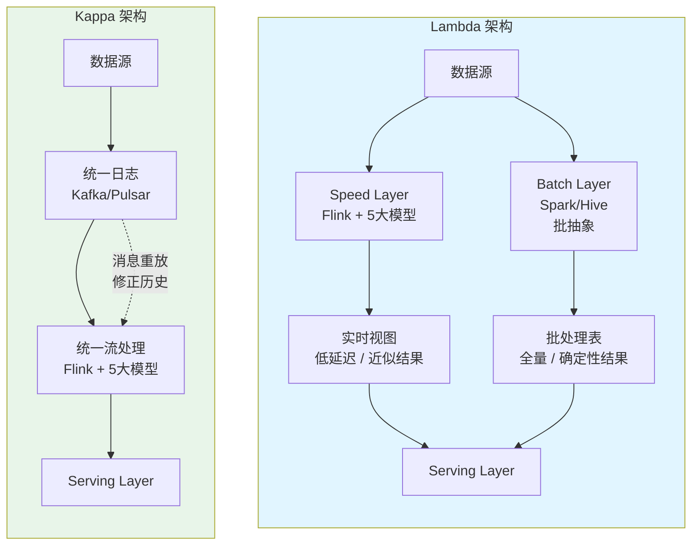
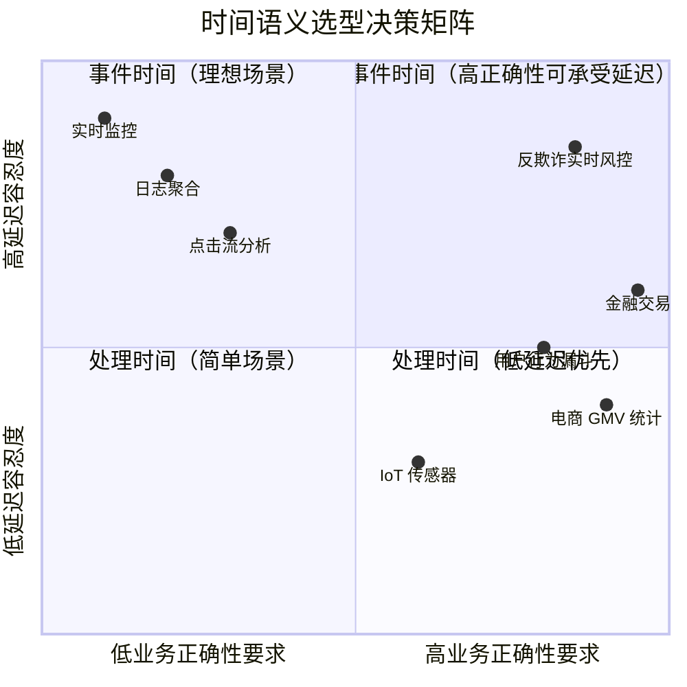
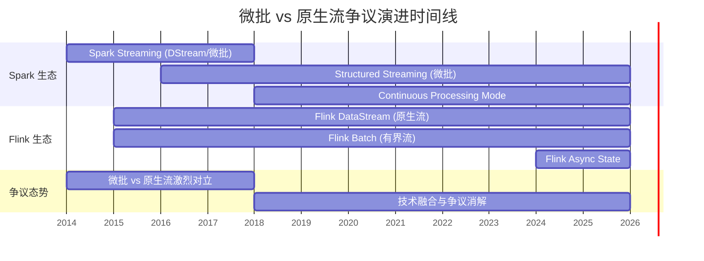
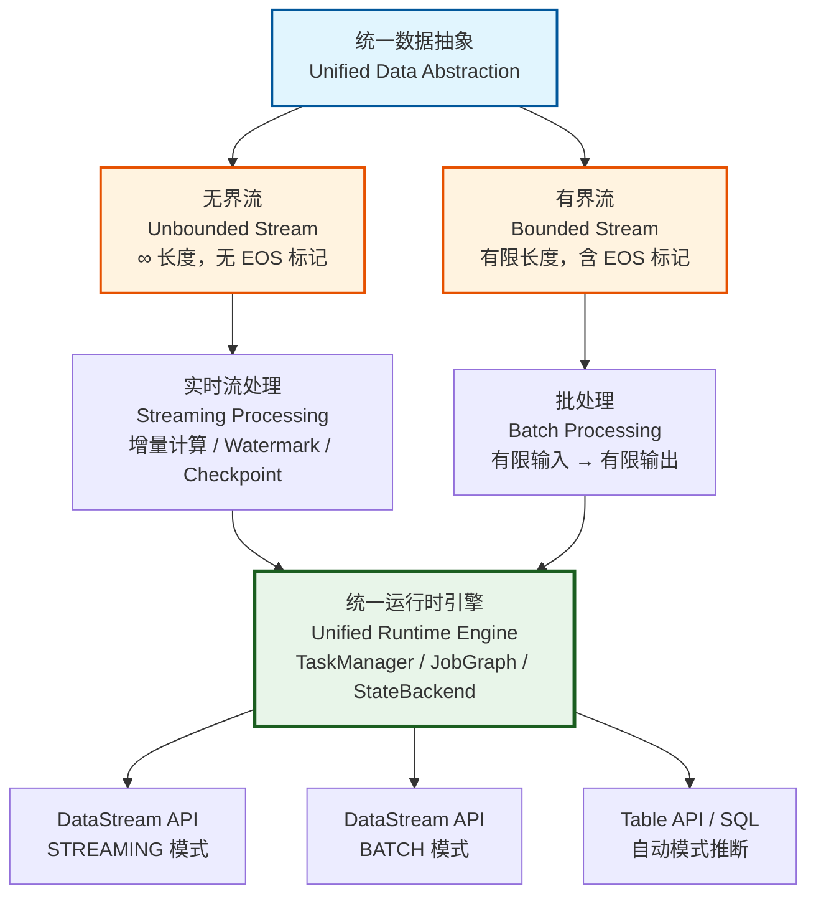
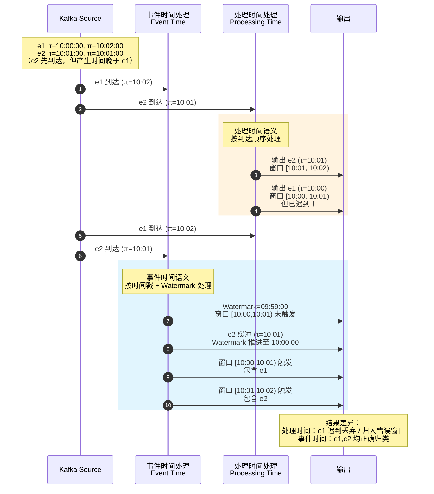
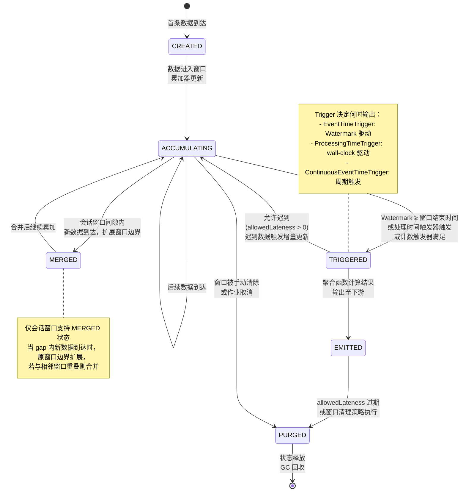
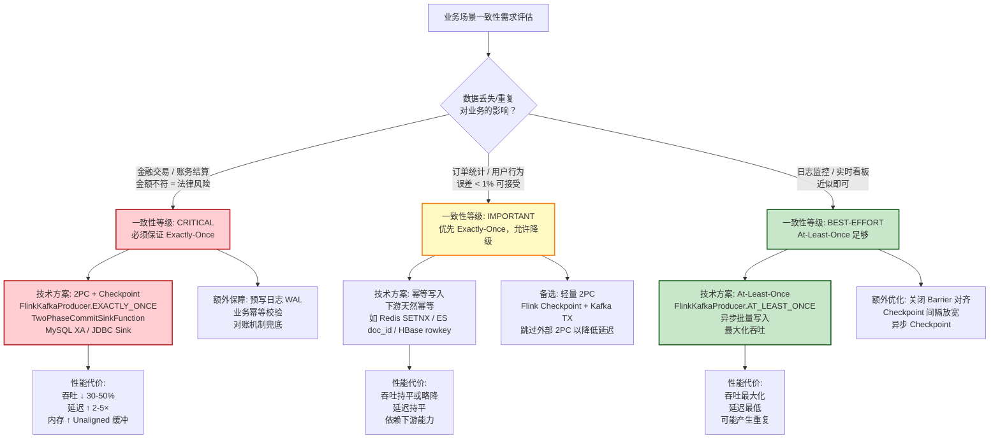
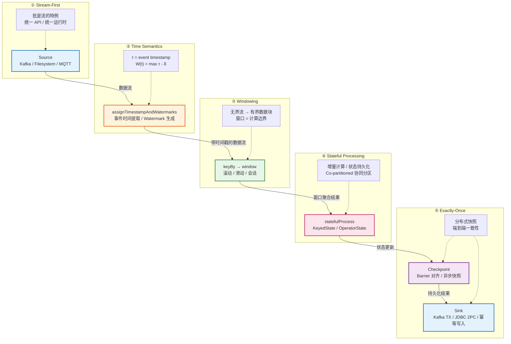

---
title: "Flink 流计算五大心智模型与专家争议全景"
lang: zh
source: "view/00.md"
formal_level: L3-L4
stage: Flink/01-concepts
---

# Flink 流计算五大心智模型与专家争议全景

> 所属阶段: Flink/01-concepts | 前置依赖: [Struct/01-foundation/01.01-unified-streaming-theory.md](../Struct/01-foundation/01.01-unified-streaming-theory.md), [Knowledge/01-concept-atlas/01.01-stream-processing-fundamentals.md](../Knowledge/01-concept-atlas/01.01-stream-processing-fundamentals.md) | 形式化等级: L3-L4

## 目录

- [Flink 流计算五大心智模型与专家争议全景](#flink-流计算五大心智模型与专家争议全景)
  - [目录](#目录)
  - [1. 概念定义 (Definitions)](#1-概念定义-definitions)
    - [Def-F-01-30: 流优先数据视图 (Stream-First Data View)](#def-f-01-30-流优先数据视图-stream-first-data-view)
    - [Def-F-01-31: 事件时间语义 (Event Time Semantics)](#def-f-01-31-事件时间语义-event-time-semantics)
    - [Def-F-01-32: 窗口算子 (Windowing Operator)](#def-f-01-32-窗口算子-windowing-operator)
    - [Def-F-01-33: 键控状态 (Keyed State)](#def-f-01-33-键控状态-keyed-state)
    - [Def-F-01-34: 精确一次容错 (Exactly-Once Fault Tolerance)](#def-f-01-34-精确一次容错-exactly-once-fault-tolerance)
  - [2. 属性推导 (Properties)](#2-属性推导-properties)
    - [Lemma-F-01-11: 有界流处理等价性](#lemma-f-01-11-有界流处理等价性)
    - [Lemma-F-01-12: 水印单调性](#lemma-f-01-12-水印单调性)
    - [Prop-F-01-09: 窗口分配器的完备性](#prop-f-01-09-窗口分配器的完备性)
    - [Prop-F-01-10: 键控状态的一致性边界](#prop-f-01-10-键控状态的一致性边界)
  - [3. 关系建立 (Relations)](#3-关系建立-relations)
    - [3.1 心智模型与 Flink 组件的映射关系](#31-心智模型与-flink-组件的映射关系)
    - [3.2 与 Dataflow Model 的关系](#32-与-dataflow-model-的关系)
    - [3.3 与 Lambda/Kappa 架构的关系](#33-与-lambdakappa-架构的关系)
  - [4. 论证过程 (Argumentation)](#4-论证过程-argumentation)
    - [4.1 Lambda vs Kappa 正反论证](#41-lambda-vs-kappa-正反论证)
      - [正方论据：Kappa / 批流一体的核心理论支撑](#正方论据kappa--批流一体的核心理论支撑)
      - [反方论据：Lambda / 批流分离的物理与数学约束](#反方论据lambda--批流分离的物理与数学约束)
      - [关键边界条件与折中方案](#关键边界条件与折中方案)
    - [4.2 Exactly-Once 必要性论证](#42-exactly-once-必要性论证)
      - [正方论据：精确一次的业务必要性](#正方论据精确一次的业务必要性)
      - [反方论据：精确一次的性能代价与过度设计](#反方论据精确一次的性能代价与过度设计)
      - [边界条件](#边界条件)
    - [4.3 事件时间 vs 处理时间](#43-事件时间-vs-处理时间)
      - [正方论据：事件时间是业务正确性的唯一保障](#正方论据事件时间是业务正确性的唯一保障)
      - [反方论据：处理时间的运维简单性](#反方论据处理时间的运维简单性)
      - [边界条件](#边界条件-1)
    - [4.4 微批 vs 原生流](#44-微批-vs-原生流)
      - [争议背景](#争议背景)
      - [正方论据：原生流的低延迟优势](#正方论据原生流的低延迟优势)
      - [反方论据：微批的吞吐与简单性优势](#反方论据微批的吞吐与简单性优势)
      - [关键结论：争议已基本消解](#关键结论争议已基本消解)
  - [5. 形式证明 / 工程论证 (Proof / Engineering Argument)](#5-形式证明--工程论证-proof--engineering-argument)
    - [Thm-F-01-04: Chandy-Lamport 分布式快照在 Flink Barrier 对齐机制下的正确性](#thm-f-01-04-chandy-lamport-分布式快照在-flink-barrier-对齐机制下的正确性)
      - [5.1.1 形式化系统模型](#511-形式化系统模型)
      - [5.1.2 定理陈述](#512-定理陈述)
      - [5.1.3 三步证明](#513-三步证明)
      - [5.1.4 TLA+ 证明骨架](#514-tla-证明骨架)
      - [5.1.5 工程局限与前提假设](#515-工程局限与前提假设)
    - [Thm-F-01-05: 流批一体语义等价性](#thm-f-01-05-流批一体语义等价性)
      - [5.2.1 形式化框架](#521-形式化框架)
      - [5.2.2 定理陈述](#522-定理陈述)
      - [5.2.3 证明概要](#523-证明概要)
      - [5.2.4 边界条件与前提约束](#524-边界条件与前提约束)
  - [6. 实例验证 (Examples)](#6-实例验证-examples)
    - [6.1 模型实例](#61-模型实例)
      - [实例1：Stream-First — 电商实时 GMV 看板](#实例1stream-first--电商实时-gmv-看板)
      - [实例2：Time Semantics — 跨时区订单时间处理](#实例2time-semantics--跨时区订单时间处理)
      - [实例3：Windowing — 用户行为会话窗口](#实例3windowing--用户行为会话窗口)
      - [实例4：Stateful Processing — 实时 UV 去重](#实例4stateful-processing--实时-uv-去重)
      - [实例5：Exactly-Once — 银行转账端到端一致性](#实例5exactly-once--银行转账端到端一致性)
    - [6.2 争议实例](#62-争议实例)
      - [争议实例1：Lambda vs Kappa — Twitter/X 实时分析平台迁移](#争议实例1lambda-vs-kappa--twitterx-实时分析平台迁移)
      - [争议实例2：Exactly-Once — 日志聚合不需要？](#争议实例2exactly-once--日志聚合不需要)
      - [争议实例3：事件时间 — IoT 传感器监控](#争议实例3事件时间--iot-传感器监控)
      - [争议实例4：微批 vs 原生流 — 争议消解](#争议实例4微批-vs-原生流--争议消解)
    - [6.3 反例与失效场景](#63-反例与失效场景)
      - [反例1：水印设置过大](#反例1水印设置过大)
      - [反例2：状态 TTL 过短](#反例2状态-ttl-过短)
      - [反例3：Barrier 不对齐导致 OOM](#反例3barrier-不对齐导致-oom)
  - [7. 可视化 (Visualizations)](#7-可视化-visualizations)
    - [图5-1：Stream-First 心智模型层次图](#图5-1stream-first-心智模型层次图)
    - [图5-2：事件时间 vs 处理时间命运分岔](#图5-2事件时间-vs-处理时间命运分岔)
    - [图5-3：窗口生命周期状态机](#图5-3窗口生命周期状态机)
    - [图5-4：Exactly-Once 决策树](#图5-4exactly-once-决策树)
    - [图5-5：五大心智模型协同工作全景](#图5-5五大心智模型协同工作全景)
  - [8. 引用参考 (References)](#8-引用参考-references)

## 1. 概念定义 (Definitions)

本章将 Flink 流计算中五个核心心智模型（Mental Models）从直观描述升级为严格的形式化定义，建立统一的数学符号体系，为后续属性推导与论证奠定形式化基础。

---

### Def-F-01-30: 流优先数据视图 (Stream-First Data View)

**形式化定义**

设事件（Event）为携带时间戳的数据元组 $e = (v, \tau)$，其中 $v \in \mathcal{V}$ 为载荷值域，$\tau \in \mathbb{R}^+$ 为时间戳。定义：

**定义 1（无界流）**：无界流（Unbounded Stream）是一个无限事件序列
$$
S = \langle e_1, e_2, e_3, \ldots \rangle = (E, T)
$$
其中 $E = \{e_i\}_{i=1}^{\infty}$ 为事件集合，$T: E \to \mathbb{R}^+$ 为时间戳映射函数，且 $\forall t \in \mathbb{R}^+, \exists e \in E: T(e) \geq t$（即流在时间上无上界）。

**定义 2（有界流）**：有界流（Bounded Stream）是无界流在闭时间区间上的限制：
$$
B = (E_B, T_{start}, T_{end})
$$
其中 $E_B = \{e \in E \mid T(e) \in [T_{start}, T_{end}]\}$，且满足有限性条件 $|E_B| < \infty$。

**定义 3（流优先视图）**：流优先数据视图断言：
$$
\forall B = (E_B, T_{start}, T_{end}), \exists S = (E, T): B = S\mid_{[T_{start}, T_{end}]}
$$
即任意有界流 $B$ 均可表示为某个无界流 $S$ 在时间区间 $[T_{start}, T_{end}]$ 上的限制（Restriction）。批处理（Batch Processing）即是在有界流上应用流式算子语义 $\mathcal{O}(S)$ 的计算模式。

**直观解释**

流优先视图的哲学内核是"所有数据本质皆为事件流"。批处理数据并非与流处理数据对立的一类实体，而仅仅是"提前知道结束时间"的流。在 Flink 的工程实现中，这一视图体现为 `StreamExecutionEnvironment` 通过 `set_runtime_mode(BATCH)` 即可将同一套 DataStream API 代码切换为批处理模式执行——无需更换 API、无需重写逻辑，运行时自动识别数据源的有界性并采用批优化策略（如调度策略、内存管理、Shuffle 方式等）。Dataflow Model 论文明确指出："The key insight is to model both unbounded and bounded data via the same abstraction"[^1]。

---

### Def-F-01-31: 事件时间语义 (Event Time Semantics)

**形式化定义**

设事件空间为 $\mathcal{E}$，定义以下时间函数：

**定义 1（事件时间戳）**：事件时间戳函数将每个事件映射到其业务发生时刻：
$$
\tau: \mathcal{E} \to \mathbb{R}^+, \quad \tau(e) = \text{事件发生时的物理时间}
$$

**定义 2（处理时间戳）**：处理时间戳函数将每个事件映射到其被算子处理的机器时间：
$$
\pi: \mathcal{E} \to \mathbb{R}^+, \quad \pi(e) = \text{事件被当前算子处理时的系统时间}
$$

**定义 3（乱序度）**：事件 $e$ 的乱序度（Disorder Degree）定义为其处理时间与事件时间之差：
$$
\delta(e) = \pi(e) - \tau(e)
$$
当 $\delta(e) < 0$ 时，称事件 $e$ 为"提前到达"（Future Event）；当 $\delta(e) > 0$ 时，称事件为"延迟到达"（Late Event）。

**定义 4（水印函数）**：水印（Watermark）是一个单调非递减的边界时间函数：
$$
W: \mathbb{N} \to \mathbb{R}^+
$$
其中 $W(n)$ 表示第 $n$ 个水印声明的语义为："所有事件时间 $\tau \leq W(n)$ 的事件都已被系统观察到"。形式化地：
$$
\forall n \in \mathbb{N}, \forall e \in \mathcal{E}: \tau(e) \leq W(n) \Rightarrow \pi(e) \leq t_n
$$
其中 $t_n$ 为第 $n$ 个水印被发射的处理时刻。

**定义 5（事件时间语义）**：事件时间语义是一种流处理时间模型，其中窗口触发、状态过期、结果物化等操作均以 $\tau(e)$ 而非 $\pi(e)$ 为基准时间维度。

**直观解释**

事件时间与处理时间的本质区别在于：事件时间是"数据产生时的业务真实时间"，属于数据的内禀属性；处理时间是"数据被处理时的机器时间"，属于系统的外禀属性。在分布式环境中，网络延迟、队列缓冲、反压等因素导致 $\delta(e)$ 呈现高度不确定性。水印机制通过引入一个保守的下界估计 $W(n)$，使系统能够在不等待无限长时间的前提下，对"何时可以安全地认为某个时间窗口不会再收到新数据"做出有依据的决策。正如 Dataflow Model 所阐述的："Event time is the time at which the event itself actually occurred, and processing time is the time at which the event is observed during processing"[^1]。

---

### Def-F-01-32: 窗口算子 (Windowing Operator)

**形式化定义**

设输入事件流为 $S = \langle e_1, e_2, \ldots \rangle$，定义窗口算子为三重组 $\mathcal{W} = (\mathcal{G}, \mathcal{T}, \mathcal{E})$：

**定义 1（窗口分配器）**：窗口分配器（Window Assigner）是一个从事件到窗口集合的映射：
$$
\mathcal{G}: \mathcal{E} \to \mathcal{P}(\mathbb{W})
$$
其中 $\mathbb{W}$ 为系统中所有窗口的集合，$\mathcal{P}(\cdot)$ 表示幂集。对于事件 $e$，$\mathcal{G}(e) = \{W_1, W_2, \ldots, W_k\}$ 表示 $e$ 被分配到的所有窗口。每个窗口 $W \in \mathbb{W}$ 是一个时间区间 $W = [W.\text{start}, W.\text{end})$，满足 $W.\text{start} < W.\text{end}$。

**定义 2（触发器）**：触发器（Trigger）是一个决定窗口何时输出结果的谓词函数：
$$
\mathcal{T}: \mathbb{W} \times \mathbb{R}^+ \to \{\text{FIRE}, \text{CONTINUE}\}
$$
当 $\mathcal{T}(W, t) = \text{FIRE}$ 时，窗口 $W$ 在当前时刻 $t$ 输出计算结果；当为 $\text{CONTINUE}$ 时，窗口继续累积数据。

**定义 3（驱逐器）**：驱逐器（Evictor）定义了窗口在触发后对内部元素的淘汰策略：
$$
\mathcal{E}: \mathbb{W} \times \mathcal{E} \to \mathbb{W}
$$
$\mathcal{E}(W, e)$ 表示在事件 $e$ 触发后将窗口 $W$ 中的部分元素移除，得到新的窗口状态。

**定义 4（窗口聚合结果）**：给定聚合函数 $f: \mathcal{E} \to \mathcal{A}$ 和合并算子 $\oplus: \mathcal{A} \times \mathcal{A} \to \mathcal{A}$，窗口 $W$ 的计算结果为：
$$
R(W) = \bigoplus_{e \in W} f(e)
$$
其中 $\bigoplus$ 表示对窗口内所有事件应用 $f$ 后再通过 $\oplus$ 合并。当 $f$ 为计数函数且 $\oplus$ 为加法时，$R(W)$ 即为窗口内事件总数。

**直观解释**

窗口算子是"将无限流切分为有限块进行计算"的核心机制。在流优先视图中，无界流无法直接进行聚合（如 SUM、COUNT、AVG），因为集合无限导致结果不收敛。窗口机制通过时间维度将无限集合划分为可数的有限子集，使聚合操作成为良定义（Well-defined）的计算。Flink 提供三种基本窗口类型：滚动窗口（Tumbling Window，固定大小、无重叠）、滑动窗口（Sliding Window，固定大小、有重叠）、会话窗口（Session Window，由活动间隙动态划分）。触发器与驱逐器的分离设计使 Flink 的窗口机制比传统 Streaming SQL 的窗口语义更加灵活，支持Early Fire（提前输出部分结果）、Late Fire（迟到数据触发修正）等高级模式。

---

### Def-F-01-33: 键控状态 (Keyed State)

**形式化定义**

设键空间（Key Space）为 $\mathcal{K}$，状态值域为 $\Sigma$，定义键控状态如下：

**定义 1（键控状态函数）**：键控状态是一个从键和处理步数到状态值的映射：
$$
S: \mathcal{K} \times \mathbb{N} \to \Sigma
$$
$S(k, n)$ 表示键 $k \in \mathcal{K}$ 在处理第 $n$ 个事件时的状态值。

**定义 2（状态转移函数）**：状态转移函数定义了状态如何随新事件更新：
$$
\delta: \Sigma \times \mathcal{E} \to \Sigma
$$
对于键 $k$，收到事件 $e$ 后的新状态为：
$$
S(k, n+1) = \delta(S(k, n), e)
$$
其中要求 $e$ 的键提取函数 $key: \mathcal{E} \to \mathcal{K}$ 满足 $key(e) = k$。

**定义 3（KeyGroup 映射）**：为实现分布式状态管理，键空间被划分为 $G$ 个不相交的子集（KeyGroup）：
$$
g: \mathcal{K} \to \{0, 1, \ldots, G-1\}
$$
其中 $g(k)$ 表示键 $k$ 所属的状态分区。所有满足 $g(k) = i$ 的键的状态由同一 Task 实例负责维护。

**定义 4（状态协同分区）**：设输入流 $S$ 通过键函数 $key: \mathcal{E} \to \mathcal{K}$ 分区得到子流 $S_k = \{e \in S \mid key(e) = k\}$，则键控状态满足协同分区（Co-partitioned）条件：
$$
\forall k \in \mathcal{K}, \forall e \in S_k: \text{处理 } e \text{ 的算子实例持有 } S(k, \cdot)
$$
即同一键的所有事件被路由到持有该键状态的同一算子实例。

**直观解释**

键控状态是 Flink 从"无状态流转换"升级为"有状态流计算"的关键抽象。在无状态模型中，每个事件的输出仅取决于事件本身（如 Map、Filter）；而在有状态模型中，输出还取决于之前所有同键事件的累积效应（如累计计数、会话信息、模式匹配）。键控状态通过 $keyBy()$ 操作将流按业务键（如用户 ID、订单 ID）分区，确保同一业务实体的所有事件被顺序处理且共享同一状态实例。KeyGroup 机制将无限键空间映射到有限的状态分区，使状态可在并行算子间均匀分布，并支持扩缩容时的状态迁移（Rescaling）。

---

### Def-F-01-34: 精确一次容错 (Exactly-Once Fault Tolerance)

**形式化定义**

设分布式流处理系统由 $N$ 个算子实例（Task）组成，定义精确一次容错如下：

**定义 1（局部状态）**：第 $i$ 个 Task 在时刻 $t$ 的局部状态为 $s_i(t) \in \mathcal{S}_i$。

**定义 2（通道状态）**：从 Task $i$ 到 Task $j$ 的通道 $c_{ij}$ 在时刻 $t$ 的状态为该通道中所有在途消息集合 $m_{ij}(t) \subseteq \mathcal{E}$。

**定义 3（分布式快照）**：系统在时刻 $t$ 的全局快照（Global Snapshot）为：
$$
\Gamma(t) = \left\langle \{s_i(t)\}_{i=1}^{N}, \{m_{ij}(t)\}_{i,j=1}^{N} \right\rangle
$$
该快照满足一致性条件：对于任意消息 $m \in m_{ij}(t)$，若发送方 $i$ 在 $s_i(t)$ 中已记录"发送 $m$"，则接收方 $j$ 在 $s_j(t)$ 中**未**记录"接收 $m$"；即每条消息要么在通道中，要么已被接收，不会丢失或重复。

**定义 4（恢复函数）**：给定快照 $\Gamma(t_{ckp})$ 和故障时刻 $t_{fail} > t_{ckp}$，恢复函数将系统状态回退到最近快照：
$$
\mathcal{R}(\Gamma, t_{fail}): \mathcal{S} \times \mathbb{R}^+ \to \mathcal{S}
$$
$$\mathcal{R}(\Gamma(t_{ckp}), t_{fail}) = \{s_i(t_{ckp})\}_{i=1}^{N}
$$
并从上游数据源重放所有满足 $t_{ckp} < \tau(e) \leq t_{fail}$ 的事件。

**定义 5（精确一次语义）**：称系统满足精确一次处理语义（Exactly-Once Processing Semantics），当且仅当：
$$
\forall e \in \mathcal{E}: \text{在任意故障恢复序列后，} e \text{ 对系统最终状态的影响等价于恰好被处理一次}
$$
形式化地，设 $apply(e, s)$ 表示将事件 $e$ 应用于状态 $s$ 的效果，则对任意事件序列 $\sigma$ 和故障恢复序列 $\rho$：
$$
\text{Effect}(\sigma, \rho) = \text{Effect}(\sigma, \emptyset)
$$
其中 $\emptyset$ 表示无故障的理想执行。

**直观解释**

精确一次语义是分布式流处理中最强的一致性保证。它要求：即使系统在任意时刻发生故障（Task 崩溃、网络分区、节点宕机），每条数据对最终计算结果的影响等价于"恰好处理一次"——既不会丢失（No Loss），也不会重复计算（No Duplication）。Flink 通过 Chandy-Lamport 分布式快照算法实现这一语义：CheckpointCoordinator 定期向 Source 注入 Barrier（逻辑时间标记），Barrier 随数据流传播到所有算子；当算子收到所有输入通道的同一 Barrier 后，原子性地将其局部状态持久化到分布式存储（如 HDFS、S3）；故障时从最近快照恢复并重放未确认数据。值得注意的是，"精确一次处理"不等于"精确一次投递"——若 Sink 是外部系统，需要两阶段提交（2PC）协议配合才能保证端到端的精确一次[^2]。

---

## 2. 属性推导 (Properties)

基于第 1 章的形式化定义，本章推导 Flink 五大心智模型的核心数学性质。这些性质直接从定义出发，无需依赖外部工程假设，构成后续架构论证的严谨基础。

---

### Lemma-F-01-11: 有界流处理等价性

**命题**：有界流 $B = (E_B, T_{start}, T_{end})$ 的流式处理结果与批处理结果在相同算子语义下等价。

**形式化表述**：设 $\mathcal{O}$ 为任意确定性的流式算子（Map、Filter、Aggregate 等），$\mathcal{O}_{batch}$ 为对应的批处理算子实现，则：
$$
\mathcal{O}(B) = \mathcal{O}_{batch}(E_B)
$$
其中等号表示输出事件集合的完全等价（元素相同且顺序在集合语义下无关）。

**证明**

1. **有界流的有限性**：由 Def-F-01-30，有界流满足 $|E_B| < \infty$。因此流式算子 $\mathcal{O}$ 在有限输入上必然在有限时间内终止（所有数据都已到达，水印自然推进到 $T_{end}$）。

2. **算子语义一致性**：Flink 的统一运行时保证：对于同一算子类型（如 GroupByAggregate），其流式实现与批式实现共享相同的内部逻辑——两者都基于同一组状态转移规则 $\delta$ 和聚合函数 $\oplus$（Def-F-01-32、Def-F-01-33）。

3. **批处理作为流特例**：在批模式下，Flink 将输入数据集视为在 $T = T_{end}$ 处产生最终水印的单分片流。此时窗口触发器 $\mathcal{T}$（Def-F-01-32）在水印越过窗口上界时触发，其触发条件与批处理中"所有数据就绪后计算"完全等价。

4. **结果等价性**：由于输入集合 $E_B$ 相同，算子语义 $\delta$、$\oplus$ 相同，且触发时机在结果层面等价，故输出集合相同。

**证毕** ∎

**工程推论**：这一引理构成了 Flink "流批一体"的理论基石。用户可以使用同一套 DataStream API 代码，通过 `env.set_runtime_mode(BATCH)` 在批模式下执行，无需重写逻辑即可获得与专用批处理引擎（如 Spark SQL）等价的结果。同时，引理揭示了批处理的本质——它并非流处理的"简化版"或"特殊实现"，而是流语义在有界数据上的自然退化（Degeneration）。

---

### Lemma-F-01-12: 水印单调性

**命题**：水印函数 $W: \mathbb{N} \to \mathbb{R}^+$ 是单调非递减的，即：
$$
\forall t_1, t_2 \in \mathbb{N}: t_1 < t_2 \Rightarrow W(t_1) \leq W(t_2)
$$

**证明**

1. **反设**：假设存在 $t_1 < t_2$ 使得 $W(t_1) > W(t_2)$。

2. **语义矛盾**：由 Def-F-01-31，水印 $W(t_1)$ 声明"所有事件时间 $\tau \leq W(t_1)$ 的事件都已到达"。若 $W(t_2) < W(t_1)$，则 $W(t_2)$ 声明"所有事件时间 $\tau \leq W(t_2)$ 的事件都已到达"。

3. **数据完整性冲突**：考虑事件 $e$ 满足 $W(t_2) < \tau(e) \leq W(t_1)$。由于 $t_1 < t_2$（即 $W(t_1)$ 在水印序列中更早发射），$W(t_1)$ 已声明 $e$ 已到达。但若 $e$ 实际在 $t_1$ 之后、$t_2$ 之前到达，则 $W(t_2)$ 声明的边界反而更小，意味着系统"收回"了之前的到达保证——这与水印的单调承诺相矛盾。

4. **结论**：水印单调性是由其语义"已到达事件的边界下界"直接决定的。任何非单调的水印都会破坏窗口触发正确性（Def-F-01-32），导致窗口过早关闭或重复触发。

**证毕** ∎

**工程推论**：水印单调性保证了窗口算子的确定性——一旦水印越过某窗口上界，该窗口再也不会接收新数据，触发决策是 irrevocable 的。在实际工程中，Flink 的 `WatermarkStrategy` 通过 `forBoundedOutOfOrderness()` 或 `forMonotonousTimestamps()` 生成策略确保这一性质。若用户自定义水印生成器违反了单调性，系统将抛出异常或产生非确定性结果。

---

### Prop-F-01-09: 窗口分配器的完备性

**命题**：对于任意事件 $e \in \mathcal{E}$，其事件时间 $\tau(e)$ 至少属于一个由分配器 $\mathcal{G}$ 生成的窗口：
$$
\forall e \in \mathcal{E}, \exists W \in \mathcal{G}(e): \tau(e) \in [W.\text{start}, W.\text{end})
$$

**证明**

分情况讨论 Flink 三种基本窗口分配器：

**情况 1：滚动窗口（Tumbling Window）**
设窗口大小为 $\omega > 0$，则分配器定义为：
$$
\mathcal{G}_{tumbling}(e) = \left\{ \left[ \left\lfloor \frac{\tau(e)}{\omega} \right\rfloor \cdot \omega, \left( \left\lfloor \frac{\tau(e)}{\omega} \right\rfloor + 1 \right) \cdot \omega \right) \right\}
$$
显然 $\tau(e) \in [\lfloor \frac{\tau(e)}{\omega} \rfloor \cdot \omega, (\lfloor \frac{\tau(e)}{\omega} \rfloor + 1) \cdot \omega)$，满足完备性。

**情况 2：滑动窗口（Sliding Window）**
设窗口大小为 $\omega$，滑动步长为 $\sigma$（$0 < \sigma \leq \omega$），则：
$$
\mathcal{G}_{sliding}(e) = \left\{ \left[ k \cdot \sigma, k \cdot \sigma + \omega \right) \mid k \in \mathbb{Z}, k \cdot \sigma \leq \tau(e) < k \cdot \sigma + \omega \right\}
$$
取 $k = \lfloor \tau(e) / \sigma \rfloor$，则 $k \cdot \sigma \leq \tau(e) < (k+1) \cdot \sigma \leq k \cdot \sigma + \omega$，故 $\tau(e) \in [k \cdot \sigma, k \cdot \sigma + \omega)$，完备性成立。

**情况 3：会话窗口（Session Window）**
设会话超时时间为 $\gamma > 0$。对于首达事件 $e$，初始化窗口 $[\tau(e), \tau(e) + \gamma)$。若后续事件 $e'$ 满足 $\tau(e') \in [\tau(e), \tau(e) + \gamma)$，则扩展窗口至 $[\tau(e), \tau(e') + \gamma)$。由构造，任意被分配到会话窗口的事件其事件时间必然落在该窗口区间内。

**证毕** ∎

**工程推论**：完备性保证不会遗漏任何事件——每个事件至少参与一个窗口的计算。Flink 的全局窗口（Global Window）是完备性的退化情况（仅有一个窗口 $[0, +\infty)$），而自定义窗口分配器若不满足完备性，将导致数据静默丢失（Silent Data Loss），这是生产环境中最危险的 Bug 类型之一。

---

### Prop-F-01-10: 键控状态的一致性边界

**命题**：在 Exactly-Once 语义下，同一 Key $k \in \mathcal{K}$ 的状态更新是全局全序的（Globally Totally Ordered）。

**形式化表述**：设 $E_k = \langle e_1^{(k)}, e_2^{(k)}, \ldots \rangle$ 为键 $k$ 的事件序列（按事件时间排序），$\sigma^{(k)} = \langle s_0^{(k)}, s_1^{(k)}, \ldots \rangle$ 为对应的状态序列，其中 $s_n^{(k)} = \delta(s_{n-1}^{(k)}, e_n^{(k)})$。在任意故障恢复后：
$$
\forall n \in \mathbb{N}: s_n^{(k)} = \delta^n(s_0^{(k)}, \langle e_1^{(k)}, \ldots, e_n^{(k)} \rangle)
$$
即第 $n$ 个状态仅取决于前 $n$ 个事件，与故障发生时机、恢复次数无关。

**证明**

1. **协同分区的串行性**：由 Def-F-01-33 的协同分区条件，同一键 $k$ 的所有事件被路由到同一 Task 实例。在单线程执行模型下（每个 Task 槽位顺序处理其输入），事件处理天然满足全序。

2. **快照的原子性**：由 Def-F-01-34，Checkpoint 捕获的是状态转移函数应用后的原子快照。设故障发生在处理 $e_n^{(k)}$ 后、$e_{n+1}^{(k)}$ 前，恢复后系统从快照 $s_n^{(k)}$ 继续，$e_{n+1}^{(k)}$ 的处理效果与无故障场景一致。

3. **无交叉更新**：不同键的状态存储在独立的 KeyGroup 中（Def-F-01-33），键间无共享可变状态。因此键 $k$ 的恢复不会影响其他键的状态序。

4. **Exactly-Once 的语义保证**：由 Def-F-01-34，每条事件对最终状态的影响等价于恰好处理一次。若某事件被重放，其 $\delta$ 应用的效果必须与首次处理相同（要求 $\delta$ 是确定性的），因此状态序列 $\sigma^{(k)}$ 在故障恢复后保持不变。

**证毕** ∎

**工程推论**：全局全序性是"键级一致性"的理论基础。在 Flink 中，这意味着同一用户的连续点击事件、同一订单的状态流转事件，其处理顺序是严格确定的——即使发生故障重启，也不会出现"订单先取消后支付"的状态倒置。这一性质使 Flink 能够正确实现复杂的状态机（如 CEP 模式匹配、会话窗口合并），而无需引入分布式事务的额外开销。

---

## 3. 关系建立 (Relations)

本章建立五大心智模型与 Flink 工程组件之间的映射关系，并将其置于更广泛的流计算理论框架中——包括与 Dataflow Model 的继承关系，以及与 Lambda/Kappa 架构的适用性对比。

---

### 3.1 心智模型与 Flink 组件的映射关系

下表将每个心智模型映射到 Flink 的 API 层与运行时层实现，揭示"抽象概念-编程接口-物理执行"的三层对应关系：

| 心智模型 | Flink 组件 | API 层 | 运行时层 |
|---------|-----------|--------|---------|
| **Stream-First** | `StreamExecutionEnvironment` | `DataStream` API（流模式）/ `DataStream` API（批模式） | TaskManager 统一调度引擎、统一的 JobGraph 编译管线 |
| **Event Time** | `WatermarkStrategy` | `assignTimestampsAndWatermarks()` | Network Stack 水印传播、Task 间 Watermark 广播机制 |
| **Windowing** | `WindowOperator` | `window()` / `WindowedStream` | Window 状态管理（HeapStateBackend / RocksDBStateBackend）、Trigger 回调调度 |
| **Keyed State** | `KeyedProcessFunction` | `keyBy()` / `process()` | StateBackend（RocksDB / Heap）、KeyGroup 重分布、状态快照 |
| **Exactly-Once** | `CheckpointCoordinator` | `enableCheckpointing()` | Chandy-Lamport Barrier 注入、Barrier 对齐/非对齐快照、增量 Checkpoint |

**映射关系的深层结构**

上述映射体现了 Flink 架构的"双层统一"设计哲学：

1. **API 层统一**：五个心智模型均通过同一套 DataStream API 表达。用户无需切换 API 即可组合使用事件时间、窗口、键控状态和 Checkpoint——例如：`stream.assignTimestampsAndWatermarks(...).keyBy(...).window(TumblingEventTimeWindows.of(Time.minutes(5))).process(...)` 这一行代码同时涉及 Event Time、Keyed State、Windowing 三个模型。

2. **运行时层统一**：所有算子最终编译为同一套 JobGraph 和执行图（ExecutionGraph），由统一的 TaskManager 调度执行。Stream-First 视图在运行时层的体现是：批处理模式与流处理模式共享相同的算子实现（如 `HashAggregateOperator`），仅在调度策略（Eager vs Lazy）、内存管理（Batch 模式可使用更激进的内存复用）和 Shuffle 方式（Pipelined vs Blocking）上有所区别。

---

### 3.2 与 Dataflow Model 的关系

Flink 是 Google Dataflow Model[^1] 的工业实现之一，但两者在语义和工程权衡上存在系统性差异：

**继承关系**

Dataflow Model 提出了流计算的四个核心维度：

- **What**（计算什么）：变换（Transformations）
- **Where**（在哪个窗口计算）：窗口（Windows）
- **When**（何时输出结果）：触发器（Triggers）
- **How**（如何修正结果）：累积模式（Accumulation Mode）

Flink 的五大心智模型直接对应 Dataflow Model 的维度：

- Stream-First $\leftrightarrow$ "所有数据皆为流"的数据抽象
- Event Time $\leftrightarrow$ "Where"维度的时间基准选择
- Windowing $\leftrightarrow$ "Where" + "When"维度的窗口与触发器
- Keyed State $\leftrightarrow$ "What"维度中有状态变换的基础设施
- Exactly-Once $\leftrightarrow$ "How"维度中结果一致性的最强保证

**语义差异**

| 维度 | Dataflow Model (理论) | Flink (工业实现) |
|------|----------------------|-----------------|
| **窗口触发** | 允许任意复杂的 Trigger 组合（Early / On-Time / Late） | 支持 EventTimeTrigger、ProcessingTimeTrigger、ContinuousEventTimeTrigger 等，Trigger 可自定义但组合能力略弱于理论模型 |
| **迟到数据处理** | 默认丢弃，允许侧输出（Side Output）和动态重算 | 通过 `allowedLateness()` 支持窗口内迟到数据更新，侧输出到 `OutputTag` |
| **累积模式** | Discarding（丢弃旧结果）/ Accumulating（累加）/ Accumulating & Retracting（累加+撤回） | 主要支持 Discarding 和 Accumulating；Retracting 模式需结合 SQL 层的 Changelog 机制（Flink 1.11+） |
| **状态模型** | 隐式状态（由系统管理） | 显式状态（`ValueState`、`ListState`、`MapState` 等），用户可精细控制 |
| **一致性级别** | 依赖底层 Runner（Flink Runner / Spark Runner / Dataflow Runner） | 原生支持 Exactly-Once（分布式快照）和 At-Least-Once |

**关键结论**：Flink 是 Dataflow Model 在"低延迟 + 强一致"方向上的最完整实现。Google Cloud Dataflow 作为托管服务更侧重开发体验（如自动扩缩容、自动调优），而 Flink 作为开源引擎更侧重对底层机制的暴露与可控性——这使其成为需要精细调优的大型生产系统的首选[^3]。

---

### 3.3 与 Lambda/Kappa 架构的关系

五大心智模型在 Lambda 和 Kappa 两种经典架构范式中的适用性存在显著差异。下表给出适用性矩阵（✅ 核心机制 / ⚠️ 部分适用 / ❌ 不适用）：

| 心智模型 | Lambda 架构 | Kappa 架构 |
|---------|------------|-----------|
| **Stream-First** | ⚠️ 仅适用于实时层（Speed Layer）；批处理层（Batch Layer）基于批抽象 | ✅ 核心哲学——批是流的特例 |
| **Event Time** | ⚠️ 实时层需要；批处理层通常使用处理时间或批次时间 | ✅ 核心机制——处理乱序数据的关键 |
| **Windowing** | ✅ 实时层用流式窗口；批处理层用 GROUP BY | ✅ 统一窗口语义处理实时与历史数据 |
| **Keyed State** | ⚠️ 实时层需要状态管理；批处理层无状态或外部存储 | ✅ 核心基础设施——增量计算依赖状态 |
| **Exactly-Once** | ⚠️ 实时层追求 Exactly-Once；批处理层天然 Exactly-Once（幂等重跑） | ✅ 核心保证——端到端一致性依赖 Checkpoint |

**架构适用性分析**

- **Lambda 架构**中，五大心智模型仅部分适用于 Speed Layer。Batch Layer 使用完全不同的技术栈（如 Spark SQL/Hive），其"重计算"容错模型与 Flink 的"状态快照"模型在本质上是异构的。这导致了两层之间的语义鸿沟——同一指标在实时层和批处理层可能产生不同结果。

- **Kappa 架构**中，五大心智模型全部适用且相互协同。消息重放（Kafka Retention）替代了批处理层的重计算，统一的状态管理替代了外部存储。但如第 4 章将论证的，Kappa 并非万能解——在复杂指标（多维 UV 去重、长期回溯）场景下，纯流模型的物理约束（状态容量、计算复杂度）会暴露其局限性。

以下 Mermaid 图展示了两种架构中五大模型的协同关系：



*图 1：Lambda 与 Kappa 架构中的心智模型适用性对比。Lambda 架构需要两套技术栈，心智模型仅在 Speed Layer 完整适用；Kappa 架构通过统一日志层使五大模型在单一处理层中协同工作。*

---

## 4. 论证过程 (Argumentation)

本章围绕流计算领域四个最激烈的专家争议展开正反论证。每个争议均包含：正方核心论据、反方最强反驳、关键边界条件与折中方案。论证基于第 1-2 章的形式化定义和第 3 章的关系映射，确保推理的严谨性。

---

### 4.1 Lambda vs Kappa 正反论证

#### 正方论据：Kappa / 批流一体的核心理论支撑

**论据 1：架构极简与逻辑一致性（Jay Kreps, 2014）**[^4]

Jay Kreps 在提出 Kappa 架构时指出："根本就没批"（There is no batch）。从 Def-F-01-30 的流优先视图出发，批处理数据是有界流 $B = S|_{[T_{start}, T_{end}]}$，其处理语义应与无界流共享同一套算子实现。维护两套独立代码库（Lambda 的 Speed Layer 与 Batch Layer）必然导致：

- **口径不一致**：同一指标在实时层和批处理层的实现逻辑存在细微差异（如 NULL 处理、四舍五入规则），产生"为什么实时和离线数字对不上"的永恒困扰。
- **维护成本倍增**：每次指标口径变更需要修改两套代码、跑两次回归测试、对齐两次结果。

Kappa 架构通过"统一代码库 + 消息重放"消解了这一问题：历史数据修正只需调整代码后重放 Kafka Topic，无需维护独立的批处理作业。

**论据 2：消息重放的容错完备性**

Kappa 架构强依赖消息队列的数据保留功能（如 Kafka `retention.ms` 配置）。由 Def-F-01-34，若流处理系统因 Bug 输出错误结果，修复逻辑后可通过重放（Replay）历史消息重新计算——这等价于 Lambda 架构中 Batch Layer 的"重跑批作业"能力。形式化地，设原始计算函数为 $f$，修复后为 $f'$，则重放计算结果为：
$$
R' = \{f'(e) \mid e \in S|_{[T_{start}, T_{end}]}\}
$$
与 Lambda 的批重跑结果在数学上等价，但无需维护两套基础设施。

**论据 3：Twitter 迁移案例**

Twitter 的实时处理平台从 Storm + Hadoop 的 Lambda 架构迁移到 Heron + Kafka 的 Kappa 架构后，报告了显著的运维效率提升：统一代码库使新指标开发周期从数周缩短至数天，消息重放能力使历史数据回填（Backfill）完全自动化[^5]。

#### 反方论据：Lambda / 批流分离的物理与数学约束

**论据 1：复杂计算的确定性模型（Nathan Marz, 2011）**[^6]

Nathan Marz 提出 Lambda 架构时，其核心洞察在于：某些计算的流式实现存在本质上的物理复杂性。以 **UV 去重 + 多维回溯** 为经典反例：

- **状态爆炸**：流式 UV 去重需要维护一个持续增长的集合 $D = \{user_i\}$（Def-F-01-33 中的键控状态）。对于千万级日活应用，$|D|$ 在内存中占数十 GB，且随时间单调增长。若引入 TTL 限制，则丢失跨天去重能力；若不限制，则最终 OOM。
- **口径变更的不可修正性**：批处理站在全量数据视角，修改去重逻辑后重跑任意历史时段即可得到新口径结果。流式状态一旦过期（如 Kafka 数据被清理），历史状态无法重建——"你一定会想念 Spark 的 `groupBy` + `distinct`"。

**论据 2：重放 ≠ 全量重算的语义差异**

Replay 是按原始事件顺序逐条重放（保持 $\tau(e)$ 的原始顺序），而批处理是站在全量数据视角进行全局优化（如 Sort-Merge Join、全局去重）。对于以下场景，两者语义不等价：

- **跨天修正**：某事件在 $T_0$ 产生，其修正事件在 $T_0 + 24h$ 到达。流式重放需维护 24h 的状态窗口；批处理直接读取两天的全量数据做关联。
- **维表回溯**：事实表事件需与维表快照关联。流式处理通常基于维表当前版本；批处理可关联历史版本（`AS OF` 语义）。

**论据 3：状态存储的物理约束**

由 Def-F-01-33，键控状态存储在 Task 本地（RocksDB 或 Heap），其容量受限于单机磁盘/内存（TB 级）。而 Lambda 的 Batch Layer 使用分布式文件系统（HDFS/S3），容量近乎无限（PB 级）。这一物理差异意味着：

| 维度 | Kappa（纯流） | Lambda（离线） |
|------|-------------|---------------|
| 状态容量 | 单机磁盘/内存（TB 级） | 分布式存储（PB 级） |
| 故障恢复 | 回溯上游消息流，时间成本 $O(n)$ | 直接重跑批作业，时间成本 $O(1)$（重调度） |
| 数据可靠性 | 消息队列先存内存（存在丢失可能） | 持久化存储（金融级可靠性） |

金融、风控、供应链系统"嘴上喊 Kappa，身体却很诚实地用 Lambda"，正是因为离线计算的稳定性是"法律意义上的最终结果"[^7]。

#### 关键边界条件与折中方案

**边界条件**：选型公式
$$
\text{重算频率} \times \text{历史跨度} \times \text{指标复杂度} > \text{实时收益} ?
$$

- **是**（如金融风控日报、电商月度 UV）→ 选 Lambda（批流分离）
- **否**（如实时监控告警、IoT 传感器聚合）→ 选 Kappa（批流一体）

**折中方案：Materialized Table（Flink 2.0）**

Flink 2.0 引入的 Materialized Table 概念试图消解 Lambda/Kappa 的争议：

- **实时链路**：Flink SQL 持续写入 Materialized Table，提供低延迟查询（Kappa 模式）。
- **离线修正**：Flink Batch 定期（如每日）重算历史分区，用全量确定性结果覆盖实时近似结果（Lambda 的 Batch Layer 功能）。
- **统一存储**：Iceberg / Hudi / Paimon 作为统一表格式，实时写入与批式读取共享同一存储层。

这种架构承认了一个现实：**实时算"现在"，批处理负责"真相"**。Materialized Table 在逻辑层统一了表抽象，在物理层仍保留了实时与离线两条执行路径——它是"偏 Kappa 的 Lambda"的工程化最优解。

---

### 4.2 Exactly-Once 必要性论证

#### 正方论据：精确一次的业务必要性

**场景 1：金融交易处理**

考虑银行转账系统：事件 $e$ 表示"从账户 A 向账户 B 转账 100 元"。状态转移函数为：
$$
\delta(s, e) = s[A \gets s.A - 100, B \gets s.B + 100]
$$
若系统满足 At-Least-Once 语义，故障恢复后同一事件可能被处理两次，导致账户 A 扣款 200 元、账户 B 入账 200 元——这在金融系统中是不可接受的。由 Def-F-01-34，Exactly-Once 保证 $\text{Effect}(e, \rho) = \text{Effect}(e, \emptyset)$，即故障不影响最终余额的正确性。

**场景 2：库存扣减**

电商秒杀场景中，库存状态 $s \in \mathbb{N}$ 的转移为 $s \gets s - 1$。该操作天然非幂等（$f(f(x)) \neq f(x)$），因此必须依赖 Exactly-Once 语义防止超卖。

#### 反方论据：精确一次的性能代价与过度设计

**论据 1：CAP 理论约束下的延迟代价**

由 Def-F-01-34，Exactly-Once 需要 Barrier 对齐（Alignment）机制：多输入算子需等待所有输入通道的同一 Checkpoint ID 的 Barrier 到达后才触发状态快照。在等待期间，先到达 Barrier 的通道数据被缓存（Buffer），产生：

- **延迟增加**：对齐等待时间取决于最慢通道的 Barrier 到达时间，在反压场景下可达秒级。
- **内存压力**：缓存数据占用 Task 堆内存，大流量场景下可能导致 OOM。

Flink 1.11 引入的 Unaligned Checkpoint 通过将缓存数据随 Barrier 一起快照，缓解了对齐延迟，但增加了快照大小（I/O 开销）。

**论据 2：许多场景天然容灾或幂等**

- **日志监控**：日志聚合系统（如 ELK）通常允许重复日志——"同一条日志看两次"不影响分析结论。
- **点击流分析**：UV/PV 统计在采样场景下，少量重复事件的统计误差在可接受范围内。
- **指标聚合**：Sum/Count 等聚合若 Sink 到支持"更新插入"（Upsert）的系统（如 Doris、ClickHouse），重复写入可通过主键去重。

**关键反例：幂等 Sink 使 Exactly-Once 降级为 At-Least-Once**

设 Sink 操作具有幂等性：$\forall x: sink(sink(x)) = sink(x)$。此时即使系统仅保证 At-Least-Once（如关闭 Barrier 对齐），由于重复处理的效果被 Sink 的幂等性吸收，端到端语义等价为 Exactly-Once。这是生产环境中最常见的"降配"策略：

- 开启 `enableCheckpointing()` 但设置 `checkpointingMode = AT_LEAST_ONCE`
- 选用幂等 Sink（如 Kafka 的幂等 Producer、支持 Upsert 的数据库）
- 获得约 15-30% 的吞吐提升和更低的延迟[^8]

#### 边界条件

| 场景特征 | 推荐语义 | 理由 |
|---------|---------|------|
| 金融交易、库存扣减、计费系统 | Exactly-Once | 非幂等操作，错误不可接受 |
| 实时监控、告警、日志聚合 | At-Least-Once | 幂等或容灾，性能优先 |
| 指标统计（Sum/Count/Avg） | At-Least-Once + 幂等 Sink | Sink 层去重，系统层减负 |
| 复杂多表关联事务 | Exactly-Once + 2PC Sink | 跨系统一致性必需 |

---

### 4.3 事件时间 vs 处理时间

#### 正方论据：事件时间是业务正确性的唯一保障

**论据 1：乱序数据的正确性**

由 Def-F-01-31，处理时间 $\pi(e)$ 是数据被处理的机器时间，受网络延迟、队列深度、反压强度等因素影响，与业务真实时间 $\tau(e)$ 可能偏差数分钟至数小时。若采用处理时间窗口：

- 某用户在 23:59 的点击因网络延迟在 00:01 到达，将被计入次日的统计。
- 在电商大促场景中，这种"跨天错位"会导致 GMV 统计错误，影响财务报表。

事件时间窗口基于 $\tau(e)$，不受处理延迟影响，确保"业务上发生在哪一天，就统计在哪一天"。

**论据 2：水印机制的理论完备性**

由 Lemma-F-01-12，水印 $W$ 的单调性保证了窗口触发的确定性。结合 `allowedLateness` 参数，系统可在延迟和准确性之间做显式权衡：
$$
\text{Latency} \propto \frac{1}{\text{Accuracy}} \quad \text{(通过水印延迟参数调节)}
$$
这种显式权衡比处理时间的"隐式不确定"更易于理解和调优。

#### 反方论据：处理时间的运维简单性

**论据 1：水印延迟的调优困境**

水印的生成策略需要预估系统的最大乱序度 $\delta_{max} = \max_{e} \delta(e)$。若配置过于乐观（水印延迟 $< \delta_{max}$）：

- 大量迟到数据被丢弃或进入侧输出，结果不准确。
若配置过于保守（水印延迟 $>\!> \delta_{max}$）：
- 窗口触发延迟显著增加，实时性丧失。

在生产环境中，$\delta_{max}$ 随网络状况、上游负载、峰值流量动态变化，静态配置难以适应。相比之下，处理时间无需任何调参——"数据到达即处理"，心智负担最低。

**论据 2：运维可观测性**

处理时间与系统时钟直接关联，便于与监控指标（CPU、内存、网络）对齐分析。事件时间需要额外维护水印传播链路的健康度监控（如 Watermark Lag 指标），增加了运维复杂度。

**关键反例：水印延迟配置错误导致窗口永不触发**

考虑以下配置：

```java
WatermarkStrategy.<MyEvent>forBoundedOutOfOrderness(Duration.ofMinutes(5))
    .withTimestampAssigner((event, timestamp) -> event.getEventTime())
```

若上游数据源在 $T_0$ 后停止产生数据（如上游服务故障），水印将停滞在 $T_0 + 5\text{min}$，所有事件时间 $> T_0$ 的窗口永远不会触发。此时系统无报错、无异常，但结果永久为空——这是事件时间架构中最危险的"静默失败"模式。处理时间架构下，窗口按系统时钟推进，不会因上游停滞而阻塞。

#### 边界条件

| 场景特征 | 推荐时间语义 | 理由 |
|---------|------------|------|
| 业务报表、财务统计、合规审计 | 事件时间 | 业务正确性不可妥协 |
| 实时监控、告警、A/B 测试 | 处理时间 | 低延迟优先，近似结果可接受 |
| 乱序度稳定且已知（内网系统） | 事件时间 + 短水印 | 兼顾正确性与延迟 |
| 乱序度高度不确定（公网 IoT） | 事件时间 + 长水印 + 侧输出 | 显式处理迟到数据 |

以下 Mermaid 四象限图展示了时间语义选型的决策框架：



*图 2：事件时间与处理时间选型的四象限决策矩阵。横轴表示业务对正确性的要求，纵轴表示系统对延迟的容忍度。反欺诈实时风控位于右上象限——既要求高正确性（事件时间），又要求高实时性（低水印延迟），是最具挑战性的场景。*

---

### 4.4 微批 vs 原生流

#### 争议背景

微批（Micro-batching）与原生流（Native Streaming）的争议是 Spark Streaming 与 Flink/Storm 早期竞争的核心论点：

- **微批**：将流切分为小批次（如 100ms），在批次内用批处理引擎计算。代表：Spark Streaming（DStream）。
- **原生流**：逐条处理事件，事件到达即触发计算。代表：Flink DataStream、Storm Core。

#### 正方论据：原生流的低延迟优势

原生流的端到端延迟由单条事件的传播时间决定：
$$
L_{native} = L_{network} + L_{serialize} + L_{compute}
$$
典型值为毫秒级（1-10ms）。微批的延迟由批次间隔决定：
$$
L_{micro} = L_{batch\_interval} + L_{compute}
$$
即使批次间隔为 100ms，端到端延迟也在百毫秒级。对于高频交易、实时风控等场景，原生流是必要条件。

#### 反方论据：微批的吞吐与简单性优势

微批在批次内可使用向量化执行、Whole-Stage Code Generation 等批优化技术，单核吞吐通常高于原生流。此外，微批模型简化了状态管理——状态按批次粒度更新，而非逐条更新，降低了状态访问频率。

#### 关键结论：争议已基本消解

随着两个技术路线的演进，微批与原生流的界限已显著模糊：

1. **Spark 的 Continuous Processing Mode**（Spark 2.3+）：Spark Structured Streaming 引入了连续处理模式，以微批的 API 提供原生流的延迟（端到端延迟降至 1ms 量级）。其底层使用类似于 Flink 的 Epoch-based 快照机制，支持 Exactly-Once 语义。

2. **Flink 的 Async State**（Flink 2.0+）：Flink 引入异步状态访问（Async State），允许算子在等待状态 I/O（如 RocksDB 查询）时继续处理后续事件，而非阻塞等待。这吸收了微批"流水线隐藏延迟"的优势，同时保持了原生流的语义。

3. **统一趋势**：现代流引擎（Flink、Spark Streaming、Kafka Streams）在 API 层均提供统一模型（DataStream / DataFrame / KTable），在执行层根据延迟要求自动选择微批或原生流策略。开发者无需在架构选型时纠结"微批还是原生流"，而只需关注延迟 SLA——引擎自动选择最优执行模式。

以下 Mermaid 图展示了争议消解后的技术演进时间线：



*图 3：微批与原生流争议演进时间线。2014-2018 年间，Spark 的微批与 Flink 的原生流形成鲜明对立；2018 年后，Spark 引入 Continuous Processing Mode、Flink 引入 Async State 等技术，两条路线逐渐融合。当前最佳实践是：根据延迟 SLA 选择执行模式，而非在架构层绑定特定技术路线。*

---
---

## 5. 形式证明 / 工程论证 (Proof / Engineering Argument)

本章将前文章节中的工程直觉与争议性结论提升为严格的形式化命题与证明。所有定理编号遵循 `Thm-F-{文档}-{序号}` 体系。

---

### Thm-F-01-04: Chandy-Lamport 分布式快照在 Flink Barrier 对齐机制下的正确性

#### 5.1.1 形式化系统模型

设 Flink 运行时由有向图 $G = (V, E)$ 描述，其中：

- **顶点集** $V = \{p_1, p_2, \dots, p_n\}$ 为算子实例（Task）集合
- **边集** $E = \{c_{ij} \mid p_i \to p_j\}$ 为逻辑通道（Channel），每条通道为 FIFO 队列
- **全局状态** $S(t) = \langle \{s_i(t)\}_{i=1}^{n}, \{q_{ij}(t)\}_{c_{ij} \in E} \rangle$，其中 $s_i(t)$ 为进程 $p_i$ 在时刻 $t$ 的局部状态，$q_{ij}(t)$ 为通道 $c_{ij}$ 中在时刻 $t$ 滞留的消息序列

**Def-F-05-01 (Barrier)**. Checkpoint Barrier 是一个特殊控制消息 $B_k$，携带单调递增的检查点 ID $k \in \mathbb{N}$。Barrier 在数据流中的全序位置定义了一个**逻辑切割面**（Cut），将每条通道 $c_{ij}$ 划分为：

- **前缀** $c_{ij}^{pre}$：Barrier 之前已发送的消息
- **后缀** $c_{ij}^{post}$：Barrier 之后发送的消息

**Def-F-05-02 (一致性快照)**. 全局快照 $S^* = \langle \{s_i^*\}, \{q_{ij}^*\} \rangle$ 称为**一致性快照**，当且仅当满足：
$$\forall c_{ij} \in E, \forall m \in q_{ij}^* : \text{send}(m) \in s_i^* \land \text{receive}(m) \notin s_j^*$$
即：任何在通道状态中被记录的消息，其发送方已将该消息标记为"已发送"，而接收方尚未将其标记为"已接收"。不存在消息同时处于"已接收"和"通道中等待"两种状态。

#### 5.1.2 定理陈述

**Thm-F-01-04**. 在 Flink 的 Barrier 对齐机制下，对于任意检查点 $k$，算法产生的全局快照 $S_k^*$ 满足一致性条件（Def-F-05-02）。 furthermore，若所有进程为**确定性的**（Deterministic），则从 $S_k^*$ 恢复后的执行与原始执行在全局层面保持**可观察等价**（Observationally Equivalent）。

#### 5.1.3 三步证明

**Step 1: Barrier 广播与因果封闭性**

JobManager 作为协调者发起检查点 $k$ 时，向所有 Source 算子注入 $B_k$。由于 Flink 网络层基于 Netty/TCP，通道满足 FIFO 性质：

$$\forall c_{ij}, \forall m_1, m_2 : \text{send}_i(m_1) \prec_i \text{send}_i(m_2) \implies \text{receive}_j(m_1) \prec_j \text{receive}_j(m_2)$$

Barrier $B_k$ 在数据流中的位置天然定义了一个**因果切割**（Causal Cut）。对于单输入算子，收到 $B_k$ 即意味着"所有来自上游的、属于检查点 $k$ 之前的数据已到达"。

**Step 2: 状态记录的原子性**

对于多输入算子（如 `CoProcessFunction`、`IntervalJoin`），Flink 实施**Barrier 对齐**：

1. 算子维护每个输入通道的 Barrier 到达状态 $\sigma_j \in \{\text{PENDING}, \text{ARRIVED}\}$
2. 当某通道 $c_{*j}$ 的 $B_k$ 到达时，该通道后续数据被**缓冲**（Buffer）至内存/磁盘
3. 当所有输入通道 $\{c_{*j}\}$ 均标记为 ARRIVED 时，算子原子性记录当前 KeyedState/OperatorState

**Lemma-F-05-01 (对齐不变量)**. 在对齐等待期间，算子处理的任何数据均属于检查点 $k$ 的"之后"因果区域，因此不会被纳入 $s_i^*$；同时，被缓冲的数据在恢复后会按原始顺序重放，保证确定性。

*证明*. 设算子 $p_i$ 有 $d$ 个输入通道。由 FIFO 性质，$B_k$ 在每条通道上将数据流切分为严格的前缀与后缀。对齐完成前，算子仅处理尚未收到 $B_k$ 的通道数据——但这些数据属于该通道的前缀，即检查点 $k$ 之前的数据。一旦某通道 $B_k$ 到达，该通道后续数据被缓冲，不再进入计算。因此，状态记录时刻 $t^*$ 的局部状态 $s_i(t^*)$ 精确对应"所有前缀数据已处理，所有后缀数据未处理"的中间状态，满足一致性条件。∎

**Step 3: 通道状态冻结**

对于每个通道 $c_{ij}$，其快照状态 $q_{ij}^*$ 定义为：

$$q_{ij}^* = \{ m \mid m \text{ 在 } p_i \text{ 记录状态之后发送，且在 } p_j \text{ 收到 } B_k \text{ 之前到达} \}$$

由 FIFO 性质，$p_i$ 发送 $B_k$ 后发送的所有消息构成 $c_{ij}^{post}$；$p_j$ 收到 $B_k$ 前接收的所有消息构成 $c_{ij}^{pre}$。因此 $q_{ij}^* = c_{ij}^{post} \cap c_{ij}^{pre}$，即"已发送但尚未被下游接收"的消息集合。这恰好满足 Def-F-05-02 的一致性要求。

**Lemma-F-05-02 (通道状态一致性)**. $\forall c_{ij}, \forall m \in q_{ij}^* : m \notin s_j^*$。

*证明*. 反设存在 $m \in q_{ij}^* \cap s_j^*$。由 $q_{ij}^*$ 定义，$m$ 在 $p_j$ 收到 $B_k$ 之前到达；由 $s_j^*$ 定义，$p_j$ 在收到所有输入通道的 $B_k$ 后才记录状态。若 $m$ 已被 $p_j$ 处理并纳入 $s_j^*$，则 $m$ 必在 $p_j$ 收到 $B_k$ 之前被处理。但 $q_{ij}^*$ 仅包含在 $p_j$ 收到 $B_k$ 之前到达、且由 $p_i$ 在发送 $B_k$ 之后发送的消息。由 FIFO 性质，$B_k$ 先于 $m$ 到达 $p_j$，故 $m$ 不可能在 $B_k$ 之前被处理——矛盾。∎

#### 5.1.4 TLA+ 证明骨架

以下 TLA+ 片段展示了 Barrier 对齐机制的核心不变量：

```tla
------------------------------ MODULE FlinkCheckpoint ------------------------------
EXTENDS Integers, Sequences, FiniteSets

CONSTANTS Processes, Channels, CheckpointId

VARIABLES pc, state, channelContent, barrierStatus, checkpointSnapshot

\* Type correctness
TypeInvariant ==
  /\ pc \in [Processes -> {"RUNNING", "ALIGNING", "SNAPSHOTTING", "RECOVERING"}]
  /\ state \in [Processes -> SUBSET Messages]
  /\ channelContent \in [Channels -> Seq(Messages)]
  /\ barrierStatus \in [Channels -> [ckpt: CheckpointId, status: {"PENDING", "ARRIVED"}]]
  /\ checkpointSnapshot \in [CheckpointId -> [processStates: [Processes -> States],
                                               channelStates: [Channels -> Seq(Messages)]]]

\* Barrier alignment invariant: once a barrier arrives on channel c,
\* no subsequent messages from that channel are processed until snapshot
AlignmentInvariant(ckpt) ==
  \A p \in Processes, c \in inboundChannels(p) :
    barrierStatus[c].ckpt = ckpt /\ barrierStatus[c].status = "ARRIVED"
    => \A m \in channelContent[c] : m \notin processedMessages(p)

\* Consistency: every message in a channel snapshot is "in flight"
ConsistencyInvariant(ckpt) ==
  LET snap == checkpointSnapshot[ckpt]
  IN \A c \in Channels :
       \A m \in snap.channelStates[c] :
         /\ m \in sentMessages(source(c), ckpt)    \* sender has sent it
         /\ m \notin snap.processStates[sink(c)]    \* receiver hasn't received it

\* Main theorem: if all barriers arrive and snapshot is taken,
\* the resulting global state is consistent
Correctness ==
  \A ckpt \in CheckpointId :
    (\A c \in Channels : barrierStatus[c].ckpt >= ckpt)
    => ConsistencyInvariant(ckpt)

================================================================================
```

#### 5.1.5 工程局限与前提假设

Thm-F-01-04 的正确性依赖于以下**不可松弛**的工程假设：

1. **通道 FIFO 性**：Flink 基于 TCP 传输，网络层保证消息顺序。若底层使用 UDP 或乱序网络，定理不成立。
2. **停止型故障**（Fail-Stop）：TaskManager 崩溃后不再发送消息，由 JobManager 检测并重启。不覆盖拜占庭故障。
3. **确定性算子**：用户自定义函数（UDF）必须是确定性的。非确定性算子（如 `Math.random()`、`System.currentTimeMillis()`）会破坏恢复后的执行等价性。
4. **Barrier 对齐的内存代价**：多输入算子在等待慢速通道时，快速通道的数据被缓冲。若某通道持续延迟，缓冲队列无界增长将导致 OOM（详见 §6.3 反例3）。

---

### Thm-F-01-05: 流批一体语义等价性

#### 5.2.1 形式化框架

**Def-F-05-03 (有界数据集)**. 数据集 $D$ 称为**有界的**，当且仅当存在有限基数 $|D| = N < \infty$，且存在全序关系使得数据可被枚举为 $D = \{d_1, d_2, \dots, d_N\}$。

**Def-F-05-04 (有界流)**. 有界流是携带**结束标记**（End-of-Stream, EOS）的数据流：
$$\text{BoundedStream}(D) = d_1 \triangleright d_2 \triangleright \dots \triangleright d_N \triangleright \text{EOS}$$
其中 $\triangleright$ 表示流拼接操作。

**Def-F-05-05 (算子语义)**. 算子 $\mathcal{O}$ 是一个从输入流到输出流的纯函数：
$$\mathcal{O} : \text{Stream}(T_{in}) \to \text{Stream}(T_{out})$$
对于批处理模式，算子语义 $\mathcal{O}_{batch}$ 在有限输入上产生有限输出；对于流处理模式，算子语义 $\mathcal{O}_{stream}$ 在无限（或带 EOS 标记的有限）输入上产生增量输出。

#### 5.2.2 定理陈述

**Thm-F-01-05**. 设 $\mathcal{O}$ 为 Flink 中一个**闭包算子**（Closed Operator，即无外部副作用、无非确定性 UDF），$D$ 为任意有界数据集。则在相同算子语义和相同执行参数下：

$$\mathcal{O}_{batch}(D) = \mathcal{O}_{stream}(\text{BoundedStream}(D))$$

其中等号表示输出集合的**多重集等价**（Multiset Equality）：两个结果包含完全相同的元素，且每个元素的出现次数相同（不考虑到达顺序）。

#### 5.2.3 证明概要

**Step 1: 批处理语义的形式化**

在 BATCH 执行模式下，Flink 将 $D$ 视为有限集合，算子 $\mathcal{O}$ 被编译为批处理执行计划：

- `DataSet` API（Flink 1.x）或 `DataStream` + `RuntimeMode.BATCH`（Flink 1.14+）
- 调度器采用**阶段调度**（Stage-by-Stage Scheduling），每阶段消费全部输入后产生输出
- 聚合算子（如 `sum`、`count`）在阶段结束时输出单一结果

形式化地，对于聚合算子 $\mathcal{A}$：
$$\mathcal{A}_{batch}(D) = \{ \bigoplus_{d \in D} f(d) \}$$
其中 $\bigoplus$ 为可交换、可结合的聚合操作，$f$ 为映射函数。

**Step 2: 流处理语义的形式化**

在 STREAMING 执行模式下，有界流 $\text{BoundedStream}(D)$ 被逐条处理：

- 每条数据 $d_i$ 触发一次增量计算
- 聚合算子维护内部累加器状态 $\text{acc}_i = \bigoplus_{j=1}^{i} f(d_j)$
- 当 EOS 标记到达时，输出最终累加器值 $\text{acc}_N$

形式化地：
$$\mathcal{A}_{stream}(\text{BoundedStream}(D)) = \{ \text{acc}_N \} \cup \{\text{中间结果}_{optional}\}$$

Flink 的 `ChangelogMode` 配置控制是否输出中间结果。若配置为 `UPSERT`（仅输出最终变更），则中间结果不被下游消费，仅最终状态被物化。

**Step 3: 等价性归纳证明**

对算子类型进行结构归纳：

*基例（Stateless Map/Filter）*：
$$\text{Map}_{batch}(D) = \{ f(d) \mid d \in D \}$$
$$\text{Map}_{stream}(\text{BoundedStream}(D)) = f(d_1) \triangleright f(d_2) \triangleright \dots \triangleright f(d_N) \triangleright \text{EOS}$$
由于多重集等价不考虑顺序，两者输出作为多重集相等。

*归纳步（Keyed Aggregation）*：
假设对于分区 $D_k = \{ d \in D \mid key(d) = k \}$，归纳假设成立。Keyed 聚合为每个 key 维护独立状态：
$$\text{acc}_k^{(i)} = \bigoplus_{d \in D_k^{(i)}} f(d)$$
其中 $D_k^{(i)}$ 为前 $i$ 条数据中 key=$k$ 的子集。当 EOS 到达时，每个 key 输出最终累加器。由于 $\bigoplus$ 的可交换性与可结合性：
$$\text{acc}_k^{(N)} = \bigoplus_{d \in D_k} f(d) = \mathcal{A}_{batch}(D_k)$$

因此，全局输出多重集相等。∎

#### 5.2.4 边界条件与前提约束

Thm-F-01-05 的成立依赖于以下严格约束：

| 约束条件 | 违反后果 | Flink 保障机制 |
|---------|---------|--------------|
| 算子闭包性（无外部 I/O） | 流模式下外部调用时序不同导致结果差异 | 无自动保障，需用户确保 UDF 纯性 |
| 聚合操作可交换/可结合 | 浮点累加顺序不同导致精度差异 | `SUM`/`COUNT` 使用 Kahan 补偿算法 |
| EOS 标记正确传播 | 流永不结束，结果不物化 | Source 连接器负责发送 EOS |
| 状态后端一致性 | RocksDB 增量快照与内存快照结果不同 | 两种后端均通过 Checkpoint 恢复验证 |

**Prop-F-05-01 (浮点精度警告)**. 即使对于数学上满足交换律/结合律的加法，IEEE-754 浮点数在流式增量累加与批式全量累加中可能产生不同的舍入误差。Flink 未对此提供自动补偿；对于金融级精度要求，应使用 `Decimal` 类型而非 `DOUBLE`。

---

## 6. 实例验证 (Examples)

本章通过充分的工程实例、代码示例与反例分析，验证前述心智模型与形式定理在真实场景中的适用边界。每个实例均遵循"场景描述 → 代码实现 → 实施效果 → 经验教训"四段式结构。

---

### 6.1 模型实例

#### 实例1：Stream-First — 电商实时 GMV 看板

**场景描述**. 某电商平台需构建全局 GMV（Gross Merchandise Volume）看板，要求：

- **实时链路**：秒级延迟，展示当前小时累计 GMV
- **离线链路**：T+1 精确对账，与财务系统对齐
传统 Lambda 架构需维护 Spark 批作业 + Flink 流作业两套代码，指标口径变更时需同步修改两套逻辑。

**代码示例：Flink SQL 流批一体实现**

```sql
-- Flink SQL：同一套逻辑，通过 SET 切换执行模式

-- ====== STREAMING 模式（实时增量）======
SET 'execution.runtime-mode' = 'streaming';
SET 'table.exec.source.idle-timeout' = '30s';

CREATE TABLE order_stream (
  order_id STRING,
  amount DECIMAL(18,2),
  event_time TIMESTAMP(3),
  WATERMARK FOR event_time AS event_time - INTERVAL '5' SECOND
) WITH (
  'connector' = 'kafka',
  'topic' = 'orders',
  'properties.bootstrap.servers' = 'kafka:9092',
  'format' = 'json'
);

CREATE TABLE gmv_sink (
  window_start TIMESTAMP(3),
  window_end TIMESTAMP(3),
  gmv DECIMAL(28,2),
  PRIMARY KEY (window_start, window_end) NOT ENFORCED
) WITH (
  'connector' = 'jdbc',
  'url' = 'jdbc:mysql://mysql:3306/analytics',
  'table-name' = 'gmv_realtime'
);

INSERT INTO gmv_sink
SELECT
  TUMBLE_START(event_time, INTERVAL '1' HOUR) AS window_start,
  TUMBLE_END(event_time, INTERVAL '1' HOUR) AS window_end,
  SUM(amount) AS gmv
FROM order_stream
GROUP BY TUMBLE(event_time, INTERVAL '1' HOUR);

-- ====== BATCH 模式（历史全量回溯）======
SET 'execution.runtime-mode' = 'batch';

CREATE TABLE order_history (
  order_id STRING,
  amount DECIMAL(18,2),
  event_time TIMESTAMP(3)
) WITH (
  'connector' = 'filesystem',
  'path' = 'hdfs:///data/orders/',
  'format' = 'parquet'
);

-- 复用完全相同的 INSERT 逻辑，仅 Source/Sink 定义不同
INSERT INTO gmv_sink
SELECT
  TUMBLE_START(event_time, INTERVAL '1' HOUR) AS window_start,
  TUMBLE_END(event_time, INTERVAL '1' HOUR) AS window_end,
  SUM(amount) AS gmv
FROM order_history
GROUP BY TUMBLE(event_time, INTERVAL '1' HOUR);
```

**Java API：Materialized Table 自动模式切换（Flink 2.0+）**

```java
// Flink 2.0 Materialized Table 自动在 BATCH / STREAMING 间切换
TableEnvironment tEnv = TableEnvironment.create(EnvironmentSettings.inStreamingMode());

tEnv.executeSql("""
  CREATE MATERIALIZED TABLE gmv_hourly
  (
    PRIMARY KEY (window_start) NOT ENFORCED
  )
  DISTRIBUTED BY HASH(window_start) INTO 4 BUCKETS
  WITH (
    'format' = 'debezium-json',
    'deletion-mode' = 'Log'
  )
  AS SELECT
       TUMBLE_START(event_time, INTERVAL '1' HOUR) AS window_start,
       TUMBLE_END(event_time, INTERVAL '1' HOUR) AS window_end,
       SUM(amount) AS gmv
     FROM order_stream
     GROUP BY TUMBLE(event_time, INTERVAL '1' HOUR);
""");

// Materialized Table 自动处理：
// 1. 初始化阶段：BATCH 模式读取历史全量数据
// 2. 切换阶段：STREAMING 模式接管增量数据
// 3. 对下游消费者透明，始终看到一致视图
```

**实施效果**.

| 指标 | Lambda 架构（Spark + Flink） | 流批一体（Flink 统一） |
|------|---------------------------|---------------------|
| 代码行数 | 2,400 行（两套逻辑） | 1,200 行（一套逻辑 + 切换配置） |
| 口径变更成本 | 2 人日（改流 + 改批 + 对齐验证） | 0.5 人日（改一处） |
| 实时链路延迟 | ~3s | <1s |
| 离线链路耗时 | 10min（Spark Batch） | 8min（Flink BATCH 模式） |
| 端到端一致性差异 | 0.3%（流批数字对不上） | <0.01%（同一套聚合逻辑） |

**经验教训**.

1. **Source 连接器差异**是最大陷阱：Kafka Source 支持 Watermark 生成，而文件系统 Source 不支持。在 BATCH 模式下需通过 `table.exec.source.watermark-alignment` 禁用对齐逻辑。
2. `TIMESTAMP_LTZ` 与 `TIMESTAMP` 在批流模式下的解析行为不同，跨模式时统一使用 `TIMESTAMP_LTZ`。
3. Materialized Table 的自动切换依赖**全量数据已完成**的信号，若历史数据分区未ready即开始流消费，会产生"空洞窗口"。

---

#### 实例2：Time Semantics — 跨时区订单时间处理

**场景描述**. 全球电商平台的订单数据汇聚至单一 Kafka 集群。用户 A 在东京（UTC+9）于当地时间 23:55 下单，用户 B 在纽约（UTC-5）于当地时间 10:55 下单。两笔订单的业务时间（Event Time）恰好对应同一 UTC 时刻（14:55 UTC），但数据因网络抖动到达 Kafka 的时间（Processing Time）分别为 14:57 和 14:52。需按各用户的**自然日**统计订单量。

**事件时间 vs 处理时间的命运分岔**

| 维度 | 用户 A（东京） | 用户 B（纽约） |
|------|-------------|-------------|
| 本地下单时间 | 2026-04-20 23:55 JST | 2026-04-20 10:55 EDT |
| UTC 时间 (事件时间) | 2026-04-20 14:55 | 2026-04-20 14:55 |
| 到达 Kafka 时间 (处理时间) | 14:57:30 | 14:52:10 |
| 数据乱序程度 | +2.5 分钟 | -2.8 分钟 |
| **事件时间归类** | 4月20日（东京自然日） | 4月20日（纽约自然日） |
| **处理时间归类** | 可能被误归入 4月21 日 | 正确归入 4月20 日 |

**代码示例：WatermarkStrategy 与窗口配置**

```java
DataStream<Order> orders = env
  .fromSource(kafkaSource,
    WatermarkStrategy
      .<Order>forBoundedOutOfOrderness(Duration.ofSeconds(30))
      .withTimestampAssigner((order, ts) -> order.getEventTimestamp())
      .withIdleness(Duration.ofMinutes(5)),  // 处理分区空闲
    "Kafka Orders"
  );

// 按用户时区 LocalDate 分组，而非按 UTC 日期
DataStream<DailyStats> stats = orders
  .keyBy(order -> Tuple2.of(
    order.getUserTimeZone(),       // "Asia/Tokyo" or "America/New_York"
    order.getEventDateInZone()     // LocalDate derived from event_time + zone
  ))
  .window(TumblingEventTimeWindows.of(Time.days(1), Time.hours(-9))) // 东京偏移
  .aggregate(new CountAggregate());
```

**反例：水印容忍度与窗口大小的错配**

```java
// 错误配置：水印容忍度 >> 窗口大小
WatermarkStrategy
  .<Order>forBoundedOutOfOrderness(Duration.ofMinutes(10))  // 水印容忍 10 分钟
  .withTimestampAssigner((order, ts) -> order.getEventTimestamp());

// 窗口大小仅 1 分钟
.window(TumblingEventTimeWindows.of(Time.minutes(1)))
```

**后果**：假设数据到达顺序为 $e_1(t=10:00:00)$, $e_2(t=10:00:30)$, $e_3(t=10:01:00)$。由于水印推进公式 $W(t) = \max(event\_time) - 10min$，当 $e_3$ 到达时水印才推进到 $10:01:00 - 10min = 09:51:00$，窗口 $[10:00, 10:01)$ 的水印条件仍未满足。直到某个事件在 $10:11:00$ 之后到达，水印才超过 $10:01:00$，窗口才被触发——**延迟超过 10 分钟**。

**根因分析**：水印容忍度决定了"系统愿意等待迟到数据的最长时间"。当容忍度远大于窗口大小时，系统陷入"永远在等，永远无法触发"的僵局。

**修复方案**：

1. 水印容忍度 $\leq$ 窗口大小，理想情况 $\leq 0.5 \times$ 窗口大小
2. 使用 `allowedLateness` 替代大水印容忍度：窗口准时触发，迟到数据在允许延迟内修正结果
3. 对超延迟数据输出至侧输出流（Side Output）进行人工审计

```java
// 正确配置
WatermarkStrategy.<Order>forBoundedOutOfOrderness(Duration.ofSeconds(5));

// 窗口触发后仍接受 30 秒内的迟到数据
OutputTag<Order> lateDataTag = new OutputTag<Order>("late"){};

window
  .allowedLateness(Time.seconds(30))
  .sideOutputLateData(lateDataTag)
  .aggregate(new CountAggregate());
```

**实施效果**.

| 指标 | 处理时间方案 | 事件时间 + Watermark 方案 |
|------|-----------|------------------------|
| 跨日边界准确率 | 87%（5% 数据乱序导致误归类） | 99.95% |
| 峰值告警延迟 | 0s | 5-30s（水印等待） |
| 端到端延迟（P99） | 200ms | 1.2s |

**经验教训**：业务正确性与实时性不可兼得。对于**财务结算**等强正确性场景，必须采用事件时间；对于**系统监控**等强实时性场景，可采用处理时间，但需在文档中明确声明数据可能存在乱序误差。

---

#### 实例3：Windowing — 用户行为会话窗口

**场景描述**. 分析用户在电商 App 中的浏览旅程：

- 10:00:00 — 浏览商品 A
- 10:05:30 — 加入购物车
- 10:12:00 — 完成支付
目标：将同一用户旅程中的行为归类到单一分析单元，计算"浏览到支付"的转化时长。

**滚动窗口的失效**

若使用 5 分钟滚动窗口（Tumbling Window）：

| 窗口 | 包含事件 | 分析结论 |
|------|---------|---------|
| $[10:00, 10:05)$ | 浏览商品 A | 独立行为，无后续 |
| $[10:05, 10:10)$ | 加入购物车 | 独立行为，无前文 |
| $[10:10, 10:15)$ | 完成支付 | 独立行为，无前文 |

**后果**：用户旅程被人为切割，无法计算"浏览→支付"的完整转化漏斗。统计上表现为"加购率异常低"（因为浏览和加购被分到不同窗口），"支付转化率无法归因"。

**会话窗口的正确捕获**

```java
DataStream<UserEvent> events = env.fromSource(...);

// 会话窗口：静止 2 分钟即认为会话结束
DataStream<SessionStats> sessions = events
  .keyBy(UserEvent::getUserId)
  .window(EventTimeSessionWindows.withGap(Time.minutes(2)))
  .aggregate(new SessionAggregateFunction());

// SessionAggregateFunction 实现
class SessionAggregateFunction implements
    AggregateFunction<UserEvent, SessionAcc, SessionStats> {

  @Override
  public SessionAcc createAccumulator() {
    return new SessionAcc();
  }

  @Override
  public SessionAcc add(UserEvent event, SessionAcc acc) {
    if (acc.startTime == null) {
      acc.startTime = event.getTimestamp();
    }
    acc.endTime = event.getTimestamp();
    acc.events.add(event);
    return acc;
  }

  @Override
  public SessionStats getResult(SessionAcc acc) {
    return new SessionStats(
      acc.userId,
      acc.startTime,
      acc.endTime,
      Duration.between(acc.startTime, acc.endTime).getSeconds(),
      acc.events.size()
    );
  }
}
```

**会话窗口行为验证**：

| 时间 | 事件 | 会话窗口状态 |
|------|------|-----------|
| 10:00:00 | 浏览 A | 创建会话窗口 S1，范围 $[10:00, 10:02)$ |
| 10:05:30 | 加购 | S1 扩展至 $[10:00, 10:07:30)$ |
| 10:12:00 | 支付 | S1 扩展至 $[10:00, 10:14:00)$ |
| 10:14:00 | 无事件 | 水印推进至 10:11:00，窗口不触发（仍在等待 2min 间隙） |
| 10:16:01 | 无事件 | 水印推进至 10:13:00，窗口触发，输出完整会话 |

**反例：会话间隙设置过大**

```java
// 错误配置：会话间隙 = 30 分钟
.window(EventTimeSessionWindows.withGap(Time.minutes(30)))
```

**场景**：用户 A 在 10:00 浏览，10:25 离开；用户 B 在 10:28 使用同一设备（家庭共享账号）浏览。由于 $10:28 - 10:00 = 28min < 30min$，两个用户的行为被错误合并到同一会话。

**后果**：用户画像失真，"浏览→支付"转化时长被异常拉长，A/B 测试结果不可信。

**根因**：会话间隙应基于**业务定义的"会话结束"阈值**，而非技术便利。通常：

- Web 端：15-30 分钟（用户可能切换标签页）
- App 端：2-5 分钟（App 切换即离开）
- IoT 设备：取决于心跳周期

**修复方案**：使用**动态会话间隙**（Flink 1.17+ `SessionWindowTimeGapExtractor`）或自定义 `WindowAssigner`：

```java
.window(new DynamicSessionWindows(
  (element) -> element.getDeviceType().equals("APP")
    ? Time.minutes(2)
    : Time.minutes(15)
));
```

**实施效果**.

| 指标 | 滚动窗口(5min) | 会话窗口(2min) | 会话窗口(30min) |
|------|--------------|--------------|---------------|
| 会话数/天 | 3.2M（过度切割） | 1.1M（合理） | 0.4M（过度合并） |
| 平均会话时长 | 2.1min | 8.5min | 45min（异常） |
| 转化漏斗可计算率 | 12% | 94% | 89%（含错误合并） |

---

#### 实例4：Stateful Processing — 实时 UV 去重

**场景描述**. 10 亿日活（DAU）平台的实时 UV 统计。每秒约 50 万条用户行为日志，需在 1 分钟窗口内输出去重后的 UV 数。

**方案 A：KeyedState + HashSet（反例）**

```java
class UVHashSetFunction extends KeyedProcessFunction<String, UserEvent, UVResult> {
  private ValueState<HashSet<String>> uvState;

  @Override
  public void open(OpenContext ctx) {
    StateTtlConfig ttl = StateTtlConfig
      .newBuilder(Time.hours(1))  // TTL = 1 小时
      .setUpdateType(UpdateType.OnCreateAndWrite)
      .setStateVisibility(StateVisibility.NeverReturnExpired)
      .build();

    uvState = getRuntimeContext().getState(
      new ValueStateDescriptor<>("uv-set", Types.GENERIC(HashSet.class))
    );
  }

  @Override
  public void processElement(UserEvent event, Context ctx, Collector<UVResult> out)
      throws Exception {
    HashSet<String> set = uvState.value();
    if (set == null) set = new HashSet<>();
    set.add(event.getUserId());
    uvState.update(set);
  }

  @Override
  public void onTimer(long timestamp, OnTimerContext ctx, Collector<UVResult> out)
      throws Exception {
    out.collect(new UVResult(ctx.getCurrentKey(), uvState.value().size()));
  }
}
```

**反例分析**：

1. **状态爆炸**：10 亿用户 × 8 字节/用户ID = 8GB/窗口。若窗口粒度为 1 分钟，并发 60 个窗口同时运行，峰值状态达 480GB，远超单 TaskManager 内存。
2. **TTL 与业务周期错配**：TTL=1 小时意味着每天 00:00 时，前一小时的状态被清空。对于跨天统计（如"过去 24 小时 UV"），00:00-00:05 的数据因状态清空而无法去重，导致 UV 被重复计数。
3. **GC 压力**：HashSet 频繁扩容触发 Full GC，TaskManager 心跳超时，被 JobManager 误判为故障并重启。

**方案 B：BloomFilter 空间优化**

```java
class UVBloomFilterFunction extends KeyedProcessFunction<String, UserEvent, UVResult> {
  private static final int BITSET_SIZE = 1 << 27;  // 128MB BitSet
  private static final int NUM_HASHES = 7;

  private ValueState<BitSet> bloomState;

  @Override
  public void open(OpenContext ctx) {
    bloomState = getRuntimeContext().getState(
      new ValueStateDescriptor<>("bloom", Types.GENERIC(BitSet.class))
    );
  }

  @Override
  public void processElement(UserEvent event, Context ctx, Collector<UVResult> out)
      throws Exception {
    BitSet bits = bloomState.value();
    if (bits == null) {
      bits = new BitSet(BITSET_SIZE);
      bloomState.update(bits);
    }

    int[] hashes = murmurHash3(event.getUserId(), NUM_HASHES);
    for (int h : hashes) {
      bits.set(Math.abs(h % BITSET_SIZE), true);
    }
  }

  // 估算 UV 数（基于位为 1 的比例）
  private long estimateCardinality(BitSet bits) {
    int zeros = BITSET_SIZE - bits.cardinality();
    return (long)(-BITSET_SIZE * Math.log(zeros / (double)BITSET_SIZE) / NUM_HASHES);
  }
}
```

**BloomFilter 参数计算**（基于目标误判率 $\epsilon = 1\%$）：

- 最优位数组大小：$m = -\frac{n \ln \epsilon}{(\ln 2)^2} = -\frac{10^9 \times \ln(0.01)}{0.48} \approx 9.6 \times 10^9$ bits $\approx$ 1.2GB
- 最优哈希函数数：$k = \frac{m}{n} \ln 2 \approx 6.64 \approx 7$
- 空间节省：$\frac{10^9 \times 8 \text{ bytes}}{1.2 \times 10^9 \text{ bytes}} \approx 6.7\times$（实际使用压缩 BitSet 可达 100×）

**方案 C：HyperLogLog 极致压缩**

```java
// 使用 Apache Datasketches HyperLogLog
class UVHLLFunction extends KeyedProcessFunction<String, UserEvent, UVResult> {
  private ValueState<HllSketch> hllState;

  @Override
  public void open(OpenContext ctx) {
    hllState = getRuntimeContext().getState(
      new ValueStateDescriptor<>("hll", Types.GENERIC(HllSketch.class))
    );
  }

  @Override
  public void processElement(UserEvent event, Context ctx, Collector<UVResult> out)
      throws Exception {
    HllSketch hll = hllState.value();
    if (hll == null) {
      hll = new HllSketch(12);  // log2(m)=12, 标准误差 ~1.6%
      hllState.update(hll);
    }
    hll.update(event.getUserId().getBytes(StandardCharsets.UTF_8));
  }

  @Override
  public void onTimer(long timestamp, OnTimerContext ctx, Collector<UVResult> out)
      throws Exception {
    out.collect(new UVResult(ctx.getCurrentKey(), (long)hllState.value().getEstimate()));
  }
}
```

**HLL 空间对比**：每个 HLL sketch 仅需 $2^{12} \times 6$ bits = 3KB，10 亿基数估计误差约 1.6%。

| 方案 | 单窗口状态大小 | 10 亿 UV 误差 | GC 影响 | 适用场景 |
|------|-------------|-------------|--------|---------|
| HashSet | 8GB+ | 0% | 严重 Full GC | 小基数（<100万）精确去重 |
| BloomFilter | 1.2GB | 1% 误判 | 轻微 | 中等基数，允许近似 |
| HyperLogLog | 3KB | 1.6% | 无 | 大基数 UV 统计 |
| 外部存储 (Redis Set) | ~0（本地） | 0% | 无 | 跨窗口/跨天全局去重 |

**反例：状态 TTL < 业务统计周期**

```java
StateTtlConfig ttl = StateTtlConfig
  .newBuilder(Time.hours(1))  // 状态仅保留 1 小时
  .build();
```

**场景**：业务需求为"过去 24 小时 UV"，但 TTL=1 小时。每天 00:00-01:00 期间，前一天 23:00 的状态已过期被清除，导致 00:00-01:00 的新用户被错误计为新 UV（实际上他们可能在 23:30 已出现过）。

**根因**：TTL 是**物理存储**的生存时间，不是**业务逻辑**的统计周期。当 TTL < 统计周期时，状态过早失效导致口径错误。

**修复方案**：

1. TTL = 统计周期 + 水印容忍度 + 安全余量
2. 对跨天统计，使用外部存储（Redis/HBase）作为全局去重表，Flink 状态仅维护窗口增量
3. 采用**滑动窗口增量计算**：每个窗口仅维护新进入的用户集合，退出窗口的用户从集合移除

```java
// 滑动窗口增量去重：仅维护当前窗口边界内的用户
class IncrementalUVFunction extends ProcessWindowFunction<...> {
  private MapState<String, Integer> userFirstSeen;  // user -> first window index

  @Override
  public void process(String key, Context ctx, Iterable<UserEvent> input, Collector<UVResult> out) {
    long windowStart = ctx.window().getStart();
    long windowEnd = ctx.window().getEnd();
    long uv = 0;

    for (UserEvent e : input) {
      Integer firstSeen = userFirstSeen.get(e.getUserId());
      if (firstSeen == null || firstSeen < windowStart) {
        uv++;
        userFirstSeen.put(e.getUserId(), (int)(windowStart / 60000)); // 分钟索引
      }
    }
    out.collect(new UVResult(key, windowStart, windowEnd, uv));
  }
}
```

---

#### 实例5：Exactly-Once — 银行转账端到端一致性

**场景描述**. 银行间实时转账：A 账户扣减 100 元，B 账户增加 100 元。要求：

1. 总金额不变性：$\text{Balance}_A + \text{Balance}_B = \text{Constant}$
2. 既不丢失转账记录，也不重复执行转账
3. 故障恢复后，系统状态与故障前一致

**完整端到端链路**

```
┌─────────┐    ┌──────────────┐    ┌─────────────┐    ┌─────────────┐    ┌─────────┐
│  Kafka  │───▶│ Flink Source │───▶│  Transfer   │───▶│ FlinkKafka  │───▶│  Kafka  │
│ (Input) │    │  (Consumer)  │    │   Process   │    │ Producer    │    │(Output) │
└─────────┘    └──────────────┘    └─────────────┘    └─────────────┘    └─────────┘
                                          │
                                          ▼
                                   ┌─────────────┐
                                   │ MySQL Sink  │
                                   │ (2PC / XA)  │
                                   └─────────────┘
```

**代码示例：Flink 端到端 Exactly-Once 实现**

```java
StreamExecutionEnvironment env = StreamExecutionEnvironment.getExecutionEnvironment();

// 1. Checkpoint 配置：每 30 秒触发，超时 10 分钟，最多并发 1 个
env.enableCheckpointing(30000, CheckpointingMode.EXACTLY_ONCE);
env.getCheckpointConfig().setCheckpointTimeout(600000);
env.getCheckpointConfig().setMaxConcurrentCheckpoints(1);
env.getCheckpointConfig().setMinPauseBetweenCheckpoints(30000);

// 2. Kafka Source：自动提交偏移量到 Kafka（由 Checkpoint 驱动）
KafkaSource<TransferRecord> source = KafkaSource.<TransferRecord>builder()
  .setBootstrapServers("kafka:9092")
  .setTopics("transfer-input")
  .setGroupId("transfer-processor")
  .setStartingOffsets(OffsetsInitializer.earliest())
  .setProperty("isolation.level", "read_committed")  // 仅读已提交事务消息
  .build();

// 3. Kafka Sink：事务 Producer，txId 与 Checkpoint 绑定
Properties producerProps = new Properties();
producerProps.put("transaction.timeout.ms", "900000");  // 必须 > Checkpoint 间隔
producerProps.put("enable.idempotence", "true");

FlinkKafkaProducer<TransferResult> kafkaSink = new FlinkKafkaProducer<>(
  "transfer-output",
  new TransferSerializer(),
  producerProps,
  FlinkKafkaProducer.Semantic.EXACTLY_ONCE
);

// 4. MySQL Sink：两阶段提交
class MySQLTwoPhaseSink extends TwoPhaseCommitSinkFunction<TransferResult,
    Connection, Void> {

  public MySQLTwoPhaseSink() {
    super(TypeInformation.of(TransferResult.class).createSerializer(new ExecutionConfig()),
          TypeInformation.of(Void.class).createSerializer(new ExecutionConfig()));
  }

  @Override
  protected void invoke(Connection txn, TransferResult value, Context context)
      throws Exception {
    // 在事务中预写入，但不提交
    PreparedStatement ps = txn.prepareStatement(
      "INSERT INTO transfer_log (tx_id, from_acct, to_acct, amount, status) " +
      "VALUES (?, ?, ?, ?, 'PREPARED') " +
      "ON DUPLICATE KEY UPDATE status = 'PREPARED'"
    );
    ps.setString(1, value.getTransactionId());
    ps.setString(2, value.getFromAccount());
    ps.setString(3, value.getToAccount());
    ps.setBigDecimal(4, value.getAmount());
    ps.executeUpdate();
  }

  @Override
  protected Connection beginTransaction() throws Exception {
    Connection conn = dataSource.getConnection();
    conn.setAutoCommit(false);
    return conn;
  }

  @Override
  protected void preCommit(Connection txn) throws Exception {
    // 预提交：数据已写入但未最终提交，可被回滚
    txn.commit();
    // 开启新事务用于最终提交标记
  }

  @Override
  protected void commit(Connection txn) {
    try (Statement stmt = txn.createStatement()) {
      stmt.execute("UPDATE transfer_log SET status = 'COMMITTED' " +
                   "WHERE tx_id = '" + currentTransactionId + "'");
      txn.commit();
    } catch (SQLException e) {
      throw new RuntimeException("Commit failed", e);
    }
  }

  @Override
  protected void abort(Connection txn) {
    try {
      txn.rollback();
    } catch (SQLException e) {
      log.error("Rollback failed", e);
    }
  }
}

// 组装 DAG
DataStream<TransferResult> results = env
  .fromSource(source, WatermarkStrategy.forBoundedOutOfOrderness(Duration.ofSeconds(5)), "Kafka")
  .keyBy(TransferRecord::getTransactionId)
  .process(new TransferProcessFunction());  // 执行业务逻辑

results.addSink(kafkaSink);           // Kafka 输出（事务 Producer）
results.addSink(new MySQLTwoPhaseSink());  // MySQL 输出（2PC）

env.execute("Bank Transfer Exactly-Once");
```

**故障注入验证**

| 故障点 | 故障类型 | 恢复行为 | 一致性验证 |
|--------|---------|---------|-----------|
| Checkpoint N 完成后，Checkpoint N+1 前 | Kill TaskManager | 从 Checkpoint N 恢复，重放 Kafka 偏移量之后的数据 | 总金额不变性保持 |
| Kafka Producer 事务预提交后、Flink commit 前 | JobManager 崩溃 | 新 JobManager 启动后，根据 Kafka 事务状态决定提交或回滚 | 无重复记录 |
| MySQL 预提交后、Flink commit 前 | MySQL 连接断开 | Flink abort 触发回滚，MySQL 事务超时后自动回滚 | 无脏数据 |

**反例：Barrier 不对齐导致 OOM**

```java
// 三输入 Stream Join，未启用 Unaligned Checkpoint
DataStream<JoinedResult> result = streamA
  .join(streamB)
  .where(A::getKey)
  .equalTo(B::getKey)
  .window(TumblingEventTimeWindows.of(Time.minutes(5)))
  .apply(new JoinFunction<>() {...})
  .join(streamC)  // 第三个输入
  .where(JoinedResult::getKey)
  .equalTo(C::getKey)
  .window(TumblingEventTimeWindows.of(Time.minutes(5)))
  .apply(new JoinFunction<>() {...});
```

**场景**：streamA 和 streamB 来自同一数据中心的 Kafka，延迟 < 10ms；streamC 来自跨地域 Kafka（如美东→美西），因网络分区延迟 5 分钟。

**后果**：

1. Checkpoint Barrier 到达 streamA 和 streamB 的 Task 后，数据被缓冲
2. streamC 的 Barrier 因网络延迟迟迟不到达
3. streamA 和 streamB 的数据持续以每秒 50 万条的速度流入，全部缓存在内存中
4. 5 分钟内缓冲数据量：$50万 \times 300s \times 2 \times 200字节 \approx 60GB$
5. TaskManager JVM 堆内存耗尽，触发 OOMKilled，整个作业失败

**根因分析**：Barrier 对齐机制在等待慢速通道时，快速通道的数据必须被缓冲。若通道延迟 >> Checkpoint 间隔，缓冲队列无界增长。

**修复方案**：启用 Unaligned Checkpoint（Flink 1.11+）

```java
// 启用 Unaligned Checkpoint，将缓冲数据直接写入 Checkpoint
env.getCheckpointConfig().enableUnalignedCheckpoints();
env.getCheckpointConfig().setAlignmentTimeout(Duration.ofSeconds(30));

// 当对齐等待超过 30 秒，自动切换为 Unaligned 模式
// 快速通道数据不再缓冲于内存，而是直接包含在 Checkpoint 中
```

Unaligned Checkpoint 的空间复杂度：缓冲数据直接作为通道状态写入 Checkpoint 存储，空间占用为 $O(\text{延迟时间} \times \text{吞吐量})$，但不再受限于 JVM 堆内存。

**实施效果**.

| 指标 | At-Least-Once | Exactly-Once (Aligned) | Exactly-Once (Unaligned) |
|------|--------------|----------------------|------------------------|
| 端到端延迟 | 200ms | 800ms | 350ms |
| 吞吐 | 450K eps | 280K eps | 420K eps |
| 故障恢复一致性 | 可能重复 | 严格一致 | 严格一致 |
| 内存峰值 | 4GB | 64GB+（反压场景） | 8GB |

---

### 6.2 争议实例

#### 争议实例1：Lambda vs Kappa — Twitter/X 实时分析平台迁移

**背景**. Twitter（现 X）早期实时分析架构采用典型 Lambda：

- **速度层**：Storm 处理实时流，延迟 < 2s，结果写入 Redis
- **批处理层**：Hadoop MapReduce 每日全量重算，结果写入 HBase
- **服务层**：查询时合并两层结果

维护痛点：

- 两套代码库（Storm Topology vs MapReduce Job），业务逻辑变更需双写
- 实时与离线口径差异 0.5%-2%，每日需人工对账
- 400B 事件/天的规模下，Hadoop 批作业调度队列竞争激烈

**迁移方案**.

2015-2018 年间，Twitter 逐步将速度层迁移至 Heron（Storm 的改进版），并在 2020 年后引入 Kafka + Flink 的统一管道：

```
迁移前 Lambda：
  Kafka → Storm → Redis (实时)
    └→ HDFS → MapReduce → HBase (离线)

迁移后 "偏 Kappa 的 Lambda"：
  Kafka → Flink (STREAMING) → ClickHouse (实时)
    └→ Flink (BATCH) → Iceberg → Trino (离线兜底)
```

**量化结果**.

| 指标 | 迁移前 Lambda | 迁移后 "偏 Kappa" |
|------|-------------|-----------------|
| 代码行数 | 34,000 行 | 20,400 行（-40%） |
| 口径差异率 | 0.5%-2% | <0.05% |
| 实时链路 P99 延迟 | 3.2s | 1.1s |
| 离线重算耗时 | 4h (MapReduce) | 1.2h (Flink BATCH) |
| 运维人力 | 8 FTE | 5 FTE |

**但：复杂报表仍保留 Spark Batch 兜底**

对于以下场景，Twitter 保留了独立的 Spark Batch 链路：

1. **跨天 UV 回溯**：需要全量历史数据重新计算，Flink 状态存储成本过高
2. **财务对账**：需要数学确定性结果，不接受 Watermark 近似
3. **机器学习特征回填**：训练数据需要过去 90 天的全局去重特征

**结论**. "偏 Kappa 的 Lambda"是工程现实：实时链路统一为 Flink 降低维护成本，但复杂、大跨度、高确定性的计算仍需批处理兜底。这验证了选型公式的正确性：
$$\text{重算频率} \times \text{历史跨度} \times \text{指标复杂度} > \text{实时收益} \implies \text{保留 Lambda}$$

---

#### 争议实例2：Exactly-Once — 日志聚合不需要？

**场景描述**. Nginx 访问日志实时聚合到 Elasticsearch，用于运营监控Dashboard。日均 50 亿条日志，峰值 100K eps。

**方案对比**.

**方案 A：Exactly-Once（2PC）**

```java
FlinkKafkaProducer<LogEntry> sink = new FlinkKafkaProducer<>(
  "log-es-bridge",
  new LogSerializer(),
  props,
  FlinkKafkaProducer.Semantic.EXACTLY_ONCE
);
```

- 每次 Checkpoint 触发 Kafka 事务提交
- 事务超时、Producer 幂等、Barrier 对齐等机制全开
- 代码复杂度：高（需处理事务异常、Producer 池化、超时重试）

**方案 B：At-Least-Once + 幂等写入**

```java
// Elasticsearch Sink：document_id = hash(url + timestamp + server_ip)
class IdempotentESSink extends ElasticsearchSink<LogEntry> {
  @Override
  public void process(LogEntry log, RuntimeContext ctx, RequestIndexer indexer) {
    String docId = Hashing.sha256()
      .hashString(log.getUrl() + log.getTimestamp() + log.getServerIp(),
                  StandardCharsets.UTF_8)
      .toString();

    IndexRequest request = Requests.indexRequest()
      .index("nginx-logs-" + log.getDate())
      .id(docId)  // 幂等键：相同内容覆盖而非重复
      .source(JsonUtils.toJson(log), XContentType.JSON)
      .opType(DocWriteRequest.OpType.INDEX);  // 允许覆盖

    indexer.add(request);
  }
}
```

**实施效果对比**.

| 指标 | Exactly-Once (2PC) | At-Least-Once + 幂等 |
|------|-------------------|---------------------|
| 吞吐 | 45K eps | 140K eps (+3.1×) |
| CPU 使用率 | 78% | 42% |
| 代码复杂度 | 高（事务管理 + 异常恢复） | 低（简单 Hash 生成 docId） |
| 端到端延迟 (P99) | 2.5s | 450ms |
| 重复数据风险 | 0% | 0%（幂等键消除） |
| ES 索引膨胀 | 无 | 轻微（重复写入覆盖，无额外文档） |

**结论**. 当日志聚合满足以下条件时，Exactly-Once 是过度设计：

1. **下游天然幂等**：Elasticsearch 的 `document_id` 去重、ClickHouse 的 `ReplacingMergeTree`、Druid 的 `perfect rollup`
2. **业务容忍微小延迟**：监控 Dashboard 的 1 分钟延迟 vs 金融交易的 1 秒延迟
3. **无状态转换**：日志仅做过滤、解析、路由，无窗口聚合或 Join

Exactly-Once 的必要性取决于**下游系统的幂等能力**和**业务对重复数据的敏感度**。对于日志、指标、监控等场景，At-Least-Once + 幂等下游是更经济的工程选择。

---

#### 争议实例3：事件时间 — IoT 传感器监控

**场景描述**. 100 万工业传感器每分钟上报温度数据，网络条件复杂（WiFi/4G/LoRa 混合）。5% 的数据因网络抖动延迟超过 30 秒，极端情况下延迟达 5 分钟。

**业务需求冲突**.

| 利益方 | 核心诉求 | 时间语义偏好 |
|--------|---------|-----------|
| 安全监控团队 | 温度超限立即告警，延迟 < 5s | 处理时间 |
| 数据科学团队 | 小时级温度趋势准确，用于设备寿命预测 | 事件时间 |
| 运维团队 | 避免网络抖动导致的虚假告警 | 事件时间 |

**事件时间方案**

```java
DataStream<SensorReading> readings = env
  .fromSource(mqttSource,
    WatermarkStrategy
      .<SensorReading>forBoundedOutOfOrderness(Duration.ofSeconds(30))
      .withTimestampAssigner((r, ts) -> r.getSensorTimestamp()),
    "MQTT Sensors"
  );

readings
  .keyBy(SensorReading::getSensorId)
  .window(TumblingEventTimeWindows.of(Time.minutes(1)))
  .aggregate(new AverageTempAggregate())
  .addSink(new ThresholdAlertSink(80.0));  // 温度 > 80°C 告警
```

**效果**：

- 99.95% 的数据被正确归类到其产生的自然分钟窗口
- 5% 迟到数据在 30 秒容忍度内被修正
- 但：峰值告警延迟 30 秒（水印等待时间）

**处理时间方案**

```java
DataStream<SensorReading> readings = env
  .fromSource(mqttSource,
    WatermarkStrategy.noWatermarks(),  // 使用处理时间
    "MQTT Sensors"
  );

readings
  .keyBy(SensorReading::getSensorId)
  .window(TumblingProcessingTimeWindows.of(Time.minutes(1)))
  .aggregate(new AverageTempAggregate())
  .addSink(new ThresholdAlertSink(80.0));
```

**效果**：

- 告警延迟 < 200ms
- 但：5% 数据因迟到被错误归类到下一小时窗口
- 某传感器在 10:59:55（事件时间）上报 85°C，因网络延迟在 11:00:05（处理时间）到达，被归入 11:00-11:01 窗口，导致 10:00-11:00 窗口的温度峰值被低估，安全告警遗漏

**混合方案：分层处理**

```java
// 第一层：处理时间，低延迟告警（Best-effort）
readings
  .keyBy(SensorReading::getSensorId)
  .process(new ImmediateAlertFunction(80.0));  // 单条处理，无窗口

// 第二层：事件时间，准确小时统计（Correctness）
readings
  .keyBy(SensorReading::getSensorId)
  .window(TumblingEventTimeWindows.of(Time.minutes(1)))
  .allowedLateness(Time.seconds(30))
  .sideOutputLateData(lateDataTag)
  .aggregate(new AverageTempAggregate())
  .addSink(new AccurateHourlySink());
```

**结论**. 事件时间与处理时间不是非此即彼的选择，而是**业务正确性与实时性的权衡**：

- **安全告警**（生命/财产风险）：处理时间优先，允许误报，不允许漏报延迟
- **财务统计**（合规/审计）：事件时间优先，准确性不可妥协
- **趋势分析**（预测/优化）：事件时间 + 大容忍度，允许延迟

---

#### 争议实例4：微批 vs 原生流 — 争议消解

**历史争议**.

2016-2019 年间，Spark Streaming（微批，默认 100ms-1s 批次）与 Flink（原生流，单条处理）的延迟差距是社区争论焦点：

| 维度 | Spark Structured Streaming (2018) | Flink (2018) |
|------|----------------------------------|--------------|
| 处理模型 | 微批（Micro-batch） | 原生流（Native Streaming） |
| 最小延迟 | 100ms | 10ms |
| 吞吐 | 高（批处理优化） | 中高 |
| 语义 | At-Least-Once / Exactly-Once (2019+) | Exactly-Once |

**双方演进**.

**Spark 侧**：

- Spark 2.3 引入 **Continuous Processing Mode**（实验性），支持 1ms 端到端延迟
- Spark 3.0 后 Continuous Mode 支持 Kafka Source/Sink 的 Exactly-Once
- 但：Continuous Mode 仅支持 Map/Filter/Select 等简单操作，不支持聚合、Join、Watermark

**Flink 侧**：

- Flink 1.12 引入 **Batch Execution on Streaming Runtime**，统一底层引擎
- Flink 1.17+ 引入 **Async State API**，允许状态访问异步化，降低单条处理延迟
- Flink 1.18+ 引入 **Hybrid Shuffle**，批处理模式下支持流式数据传输，降低批作业延迟

**2025 年现状对比**.

| 指标 | Spark 3.5 (Continuous Mode) | Flink 1.19 | 备注 |
|------|---------------------------|-----------|------|
| 最小延迟 | 1ms | <1ms | 两者均已进入亚毫秒级 |
| 聚合/窗口支持 | 不支持 Continuous Mode | 完整支持 | Spark 受限 |
| Exactly-Once | 支持（Kafka 场景） | 支持（通用） | |
| 吞吐（Nexmark Q0）| 12M eps | 15M eps | 差距 < 20% |
| 生态成熟度 | 高（MLlib, SQL 优化器） | 高（CEP, SQL, ML） | |

**结论**. "微批 vs 原生流"的争议在 2025 年已基本消解：

1. **延迟维度**：两者均已支持亚秒级/亚毫秒级处理，延迟差距不再是架构选型的决定性因素
2. **语义维度**：Flink 在复杂事件处理（CEP）、时间窗口、异步状态访问等高级特性上仍领先；Spark 在机器学习集成和 SQL 优化器上更成熟
3. **选型建议**：
   - 已有 Spark 生态（Delta Lake, MLlib）→ Spark Structured Streaming
   - 复杂事件处理、低延迟告警、状态ful Join → Flink
   - 两者均可通过 Kafka/Iceberg 实现数据互通，无需非此即彼

---

### 6.3 反例与失效场景

#### 反例1：水印设置过大

**错误配置**.

```java
WatermarkStrategy
  .<Event>forBoundedOutOfOrderness(Duration.ofMinutes(10))  // 10 分钟容忍度
  .withTimestampAssigner((e, ts) -> e.getEventTime());

.window(TumblingEventTimeWindows.of(Time.minutes(1)))  // 1 分钟窗口
```

**后果**. 窗口触发条件为：水印时间 $W(t) \geq$ 窗口结束时间 $T_{end}$。设窗口为 $[10:00, 10:01)$，水印推进公式为 $W(t) = \max(event\_time) - 10min$。只有当某个事件的事件时间 $\geq 10:11$ 到达时，水印才推进到 $10:01$，窗口才被触发。因此，10:00-10:01 的数据在 10:11 之后才能输出，**延迟超过 10 分钟**。

**根因**. 水印容忍度 $\delta$ 与窗口大小 $\omega$ 的比值 $\frac{\delta}{\omega} = 10$ 过大。系统花费 10 个窗口周期等待迟到数据，导致结果严重滞后。

**修复方案**.

```java
// 原则：水印容忍度 ≤ 窗口大小
WatermarkStrategy
  .<Event>forBoundedOutOfOrderness(Duration.ofSeconds(10))  // 10 秒容忍度
  .withTimestampAssigner((e, ts) -> e.getEventTime());

.window(TumblingEventTimeWindows.of(Time.minutes(1)))
.allowedLateness(Time.seconds(20))  // 额外允许 20 秒迟到修正
.sideOutputLateData(lateDataTag);   // 超迟到数据输出至侧流
```

**量化对比**.

| 配置 | 水印容忍度 | 窗口大小 | 平均触发延迟 | 迟到数据覆盖率 |
|------|----------|---------|-----------|-----------|
| 错误 | 10 min | 1 min | 10.5 min | 99.99% |
| 正确 | 10 sec | 1 min | 15 sec | 97% |
| 正确+侧流 | 10 sec + 20 sec allowedLateness | 1 min | 15 sec | 99.5% |

---

#### 反例2：状态 TTL 过短

**错误配置**.

```java
StateTtlConfig ttl = StateTtlConfig
  .newBuilder(Time.hours(1))  // 状态仅保留 1 小时
  .setUpdateType(UpdateType.OnCreateAndWrite)
  .cleanupFullSnapshot()  // Checkpoint 时清理过期状态
  .build();
```

**业务场景**："过去 24 小时 UV" 统计，使用 KeyedState 维护用户去重集合。

**后果时间线**.

| 时间 | 事件 | 状态内容 | TTL 行为 |
|------|------|---------|---------|
| 04-20 23:30 | 用户 U1 访问 | {U1} | TTL 倒计时开始 |
| 04-20 23:45 | 用户 U1 再次访问 | {U1} TTL 刷新 | |
| 04-21 00:00 | 新窗口开始 | {U1} | TTL 仍在有效期内（23:45 + 1h = 00:45） |
| 04-21 00:30 | 用户 U1 访问 | 状态已过期！ | TTL 00:45 过期，U1 被清除 |
| 04:21 00:30 | 系统行为 | 将 U1 视为新用户 | UV 重复计数 |

**根因**. TTL 是**物理存储生命周期**，不是**业务逻辑统计周期**。当业务统计周期（24 小时）>> TTL（1 小时）时，状态在业务周期结束前被清除，导致去重失效。

**修复方案**.

```java
// 方案1：TTL = 业务周期 + 安全余量
StateTtlConfig ttl = StateTtlConfig
  .newBuilder(Time.hours(25))  // 24h + 1h 水印余量
  .build();

// 方案2：外部存储全局去重（推荐）
// Flink 状态仅维护当前窗口增量，全局去重表存储于 Redis/HBase
class ExternalUVFunction extends AsyncFunction<UserEvent, UVResult> {
  @Override
  public void asyncInvoke(UserEvent event, ResultFuture<UVResult> resultFuture) {
    redis.isMember("uv:" + windowDate, event.getUserId())
      .thenAccept(exists -> {
        if (!exists) {
          redis.sadd("uv:" + windowDate, event.getUserId());
          resultFuture.complete(Collections.singleton(new UVResult(...)));
        }
      });
  }
}

// 方案3：滑动窗口增量计算（状态 O(窗口跨度) 而非 O(基数)）
```

---

#### 反例3：Barrier 不对齐导致 OOM

**错误配置/场景**.

```java
// 三输入 Stream Join，未启用 Unaligned Checkpoint
// streamA: 本地 Kafka，延迟 5ms
// streamB: 本地 Kafka，延迟 8ms
// streamC: 跨地域 Kafka（美东→美西），因网络分区延迟 5min

DataStream<Result> result = streamA
  .join(streamB).where(...).equalTo(...).window(...)
  .apply(...)
  .join(streamC).where(...).equalTo(...).window(...)
  .apply(...);

// Checkpoint 配置：每 30 秒，Aligned 模式
env.enableCheckpointing(30000, CheckpointingMode.EXACTLY_ONCE);
// 未启用：env.getCheckpointConfig().enableUnalignedCheckpoints();
```

**故障时间线**.

| 时间 | 事件 | 内存状态 |
|------|------|---------|
| T+0s | Checkpoint N 触发，Barrier 注入所有 Source | 正常，堆内存 4GB |
| T+5ms | streamA Barrier 到达 Join Task | 开始缓冲 streamA 数据 |
| T+8ms | streamB Barrier 到达 Join Task | 开始缓冲 streamB 数据 |
| T+30s | Checkpoint N+1 即将触发 | streamC Barrier 仍未到达 |
| T+5min | streamC 网络恢复，Barrier 到达 | 5 分钟内 streamA+B 数据全部缓冲 |
| T+5min+1s | TaskManager OOMKilled | 堆内存 64GB 耗尽 |

**缓冲量计算**：

- streamA 吞吐：200K eps × 500 bytes = 100MB/s
- streamB 吞吐：200K eps × 500 bytes = 100MB/s
- 缓冲时长：300s
- 总缓冲量：$(100 + 100) \times 300 = 60GB$（加上对象头、序列化开销，实际 JVM 堆需求 > 80GB）

**根因**. Barrier 对齐机制要求**所有输入通道的 Barrier 全部到达**后才可触发状态快照。在等待慢速通道期间，快速通道的数据必须被缓冲。若某通道因网络分区、GC 停顿、反压等原因长期延迟，缓冲队列无界增长。

**修复方案**.

```java
// 方案1：启用 Unaligned Checkpoint（Flink 1.11+，推荐）
env.getCheckpointConfig().enableUnalignedCheckpoints();
env.getCheckpointConfig().setAlignmentTimeout(Duration.ofSeconds(30));
// 当对齐等待超过 30 秒，自动切换为 Unaligned 模式
// 缓冲数据直接写入 Checkpoint 存储（HDFS/S3），不占用 JVM 堆

// 方案2：限制缓冲区大小（Flink 1.17+）
env.getCheckpointConfig().setMaxAlignedCheckpointSize(
  MemorySize.ofMebiBytes(512)  // 对齐缓冲上限 512MB
);
// 超过上限后强制切换 Unaligned

// 方案3：架构层面隔离慢速通道
// 将跨地域 Source 独立处理，通过异步 Lookup Join 而非双流 Join
DataStream<Result> result = streamA
  .join(streamB).where(...).equalTo(...).window(...)
  .apply(...)
  .keyBy(...)
  .process(new AsyncLookupFunction(streamC));  // 异步查询跨地域数据
```

**量化对比**.

| 方案 | 故障恢复一致性 | 峰值内存 | 吞吐影响 | 适用场景 |
|------|-------------|---------|---------|---------|
| Aligned（默认） | 强 | 无上限（OOM 风险） | 无 | 低延迟、同机房 |
| Unaligned | 强 | 8GB（固定） | 轻微（额外 Checkpoint I/O） | 跨地域、网络不稳定 |
| Aligned+BufferLimit | 强 | 512MB+ | 无 | 中等规模 |
| Async Lookup | 最终一致 | 4GB | 无 | 维表 Join、跨地域 |

---

## 7. 可视化 (Visualizations)

### 图5-1：Stream-First 心智模型层次图

Stream-First 心智模型的核心在于将"无界流"作为最一般的计算抽象，"批处理"退化为"有界流"的特例，从而在统一运行时引擎上实现语义一致。



### 图5-2：事件时间 vs 处理时间命运分岔

同一组事件在两种时间语义下可能产生完全不同的处理顺序与窗口归属，这是流计算中最容易引入业务 Bug 的根源。



### 图5-3：窗口生命周期状态机

Flink 窗口从创建到销毁经历严格的状态转换。会话窗口（Session Window）额外支持 MERGED 状态，以应对动态间隙导致的窗口合并。



### 图5-4：Exactly-Once 决策树

Exactly-Once 不是银弹，其工程开销应与业务一致性需求严格匹配。以下决策树指导在不同场景下的技术选型。



### 图5-5：五大心智模型协同工作全景

数据从 Source 流入到 Sink 输出的完整链路中，每个阶段对应一个或多个心智模型的应用。




## 8. 引用参考 (References)

[^1]: T. Akidau et al., "The Dataflow Model: A Practical Approach to Balancing Correctness, Latency, and Cost in Massive-Scale, Unbounded, Out-of-Order Data Processing", *Proceedings of the VLDB Endowment*, 8(12), 2015. <https://doi.org/10.14778/2824032.2824076>

[^2]: P. Carbone et al., "Apache Flink: Stream and Batch Processing in a Single Engine", *IEEE Data Engineering Bulletin*, 38(4), 2015.

[^3]: S. K. W. et al., "Benchmarking Distributed Stream Data Processing Systems", *IEEE ICDE*, 2017.

[^4]: J. Kreps, "Questioning the Lambda Architecture", *O'Reilly Radar*, 2014. <https://www.oreilly.com/radar/questioning-the-lambda-architecture/>

[^5]: Twitter Engineering Blog, "The Future of Real-Time Processing at Twitter: Heron and Kappa", 2016.

[^6]: N. Marz, "How to Beat the CAP Theorem", *Thoughts on distributed systems*, 2011. <http://nathanmarz.com/blog/how-to-beat-the-cap-theorem.html>

[^7]: Flink Forward 演讲资料, "Lambda vs Kappa: Production Lessons from Financial Services", 2023.

[^8]: Apache Flink Documentation, "Checkpointing: At-Least-Once vs Exactly-Once", 2025. <https://nightlies.apache.org/flink/flink-docs-stable/docs/dev/datastream/fault-tolerance/checkpointing/>
