> **状态**: 🔮 前瞻内容 | **风险等级**: 高 | **最后更新**: 2026-04
>
> 此文档描述的内容处于早期规划阶段，可能与最终实现不符。请以 Apache Flink 官方发布为准。
>
# Flink系统架构深度分析

> 所属阶段: Flink/ 01-concepts | 前置依赖: [flink-system-architecture-deep-dive.md](./flink-system-architecture-deep-dive.md), [datastream-v2-semantics.md](./datastream-v2-semantics.md) | 形式化等级: L4 (工程论证+源码级)

---

## 1. 概念定义 (Definitions)

### 1.1 Flink运行时核心概念

**定义 F-01-01 [Client]**：
> Flink Client是用户与Flink集群交互的入口点，负责将用户程序（DataStream API/SQL/Table API）转换为JobGraph并提交到集群执行。
> Client不参与实际的数据处理，仅在作业提交阶段与JobManager通信。

形式化描述：

```
Client : UserProgram → JobGraph → JobManager
Client ∉ RuntimeExecutionComponents
Client.lifecycle = {parse, optimize, package, submit, monitor}
```

Client的核心职责包括：

- **程序解析**：将用户代码解析为StreamGraph（逻辑执行图）
- **作业优化**：应用优化规则（如算子链合并、分区优化）
- **图转换**：将StreamGraph转换为JobGraph（物理执行图的中间表示）
- **作业提交**：通过REST API或Akka RPC将JobGraph提交给JobManager
- **状态监控**：提供作业状态查询和取消操作的客户端接口

---

**定义 F-01-02 [JobManager]**：
> JobManager是Flink集群的主节点（Master），负责协调分布式作业的执行。
> 它是集群的控制中枢，管理作业调度、资源分配、故障恢复和检查点协调。

形式化描述：

```
JobManager : ClusterMasterNode
JobManager.components = {ResourceManager, Dispatcher, JobMaster(s)}
JobManager.responsibilities = {scheduling, coordination, fault-tolerance}
JobManager.state ∈ {INITIALIZING, RUNNING, SUSPENDED, FAILED}
```

JobManager的核心特性：

- **单点控制**：每个Flink集群有且仅有一个活跃的JobManager（HA模式下可故障转移）
- **全局视图**：维护集群所有TaskManager和作业的全局状态
- **协调者角色**：负责检查点触发、保存点管理和故障恢复协调
- **元数据管理**：维护作业图（JobGraph）和执行图（ExecutionGraph）的完整信息

---

**定义 F-01-03 [TaskManager]**：
> TaskManager是Flink集群的工作节点（Worker/Slave），负责执行具体的计算任务。每个TaskManager包含一组Slot资源，用于托管Task实例的执行。

形式化描述：

```
TaskManager : ClusterWorkerNode
TaskManager.slots : ℕ⁺  (正整数,表示Slot数量)
TaskManager.tasks : 2^TaskInstance  (当前运行的任务集合)
TaskManager.resources = {CPU, Memory, NetworkBuffer, ManagedMemory}
TaskManager.heartbeat_interval : Duration
```

TaskManager的核心职责：

- **任务执行**：在其管理的Slot中执行Task（用户代码的实际运行单元）
- **数据传输**：维护本地网络栈，处理上下游Task之间的数据交换
- **状态管理**：管理本地状态后端（RocksDB/Heap），处理状态读写
- **检查点执行**：响应JobManager的检查点触发，执行本地状态快照
- **心跳报告**：定期向JobManager报告心跳和Slot状态

---

### 1.2 核心数据结构与抽象

**定义 F-01-04 [JobGraph]**：
> JobGraph是Flink作业的中间层表示（Intermediate Representation, IR），由Client生成并提交给JobManager。它描述了作业的拓扑结构和配置，但尚未包含具体的资源分配和并行实例信息。

```
JobGraph = (Vertices, Edges, Configuration)
Vertices = {JobVertex}  // 算子节点
Edges = {JobEdge}       // 数据流边
JobVertex.properties = {parallelism, slotSharingGroup, operatorName}
```

**定义 F-01-05 [ExecutionGraph]**：
> ExecutionGraph是JobManager维护的作业运行时状态图，是JobGraph的展开形式，包含每个并行实例的具体状态。

```
ExecutionGraph = JobGraph × ResourceAllocation × ExecutionState
ExecutionVertex = LogicalTask × SubtaskIndex  // 具体的执行单元
Execution.state ∈ {CREATED, SCHEDULED, DEPLOYING, RUNNING, FINISHED, CANCELLED, FAILED}
```

**定义 F-01-06 [Slot]**：
> Slot是TaskManager上的资源分配单元，代表TaskManager资源的一个固定大小的子集。一个Slot可以执行一个Task实例（或一个Slot Sharing Group中的多个Task）。

```
Slot : ResourceUnit ⊂ TaskManager.resources
Slot.allocation = {CPU_cores, Memory_fraction, Network_buffers}
Slot.state ∈ {FREE, ALLOCATED, RELEASING}
```

---

## 2. 属性推导 (Properties)

### 2.1 组件间关系属性

**引理 F-01-01 [Client无状态性]**：
> Client在作业提交完成后即退出，不维护作业的长期状态。作业提交成功后，Client的终止不影响作业运行。

*证明*：
Client通过`ClusterClient`接口提交JobGraph，使用`CompletableFuture`异步等待提交结果。提交成功后，Client与JobManager的连接可以安全关闭。JobManager接管所有作业状态管理，Client仅作为启动器存在。

**引理 F-01-02 [JobManager单点性]**：
> 在任意时刻，一个Flink集群有且仅有一个活跃的JobManager实例负责调度决策。

*证明*：
这是由ZooKeeper（HA模式）或内置Leader选举机制保证的。使用ZooKeeper时，`LeaderRetrievalService`确保只有一个JobManager持有Leader锁并执行调度。非Leader的JobManager处于STANDBY状态，不处理调度请求。

**引理 F-01-03 [TaskManager对等性]**：
> 所有TaskManager在功能上对等，无主从之分。JobManager根据负载均衡策略在TaskManager之间分配任务。

*证明*：
TaskManager向JobManager注册时提供自身资源信息（Slot数量、硬件规格）。`SlotPool`和`ResourceManager`根据`SlotSelectionStrategy`（如位置偏好、负载均衡）选择目标TaskManager，而非预先设定层级关系。

---

### 2.2 资源管理属性

**引理 F-01-04 [Slot资源隔离性]**：
> 分配给不同Slot的资源在内存和网络缓冲区层面相互隔离，防止Task间的资源竞争。

*证明*：
TaskManager启动时，将总内存划分为固定数量的Slot。每个Slot获得均等的`NetworkMemory`（用于网络缓冲区）和`ManagedMemory`（用于RocksDB等）。JVM堆内存通过`FractionalSlotResourceCalculator`计算分配。

**引理 F-01-05 [任务反压传播性]**：
> Task级别的反压（Backpressure）会沿数据流上游传播，最终影响源端的数据产生速率。

*论证*：
Flink使用Credit-Based流控制。当下游Task的缓冲区满时，停止发送Credit，上游`ResultPartition`停止写入，阻塞向上游传播。这种背压机制确保系统不会OOM，但会导致端到端延迟增加。

---

### 2.3 容错属性

**引理 F-01-06 [检查点一致性]**：
> Flink的检查点机制保证所有算子的状态快照在逻辑时间上保持一致（快照包含所有已处理数据的状态，不包含未处理数据的状态）。

*工程论证*：
基于Chandy-Lamport分布式快照算法的变体——Barrier机制。Barrier作为标记在数据流中传播，算子收到所有输入流的Barrier后，触发本地状态快照。异步快照完成后，Barrier向下游发射。这确保了在Barrier对齐时刻的全局一致性视图。

---

## 3. 关系建立 (Relations)

### 3.1 架构层次关系

**关系 F-01-01 [部署层级映射]**：

```
┌─────────────────────────────────────────────────────────────┐
│                     部署层级关系                              │
├─────────────────────────────────────────────────────────────┤
│  用户层       : User Code (DataStream/Table API/SQL)         │
│       ↓                                                      │
│  转换层       : StreamGraph → JobGraph                      │
│       ↓                                                      │
│  调度层       : ExecutionGraph (JobManager维护)              │
│       ↓                                                      │
│  执行层       : Task → Thread (TaskManager执行)              │
│       ↓                                                      │
│  物理层       : JVM Process → OS Resources                   │
└─────────────────────────────────────────────────────────────┘
```

**关系 F-01-02 [Client-JobManager交互]**：

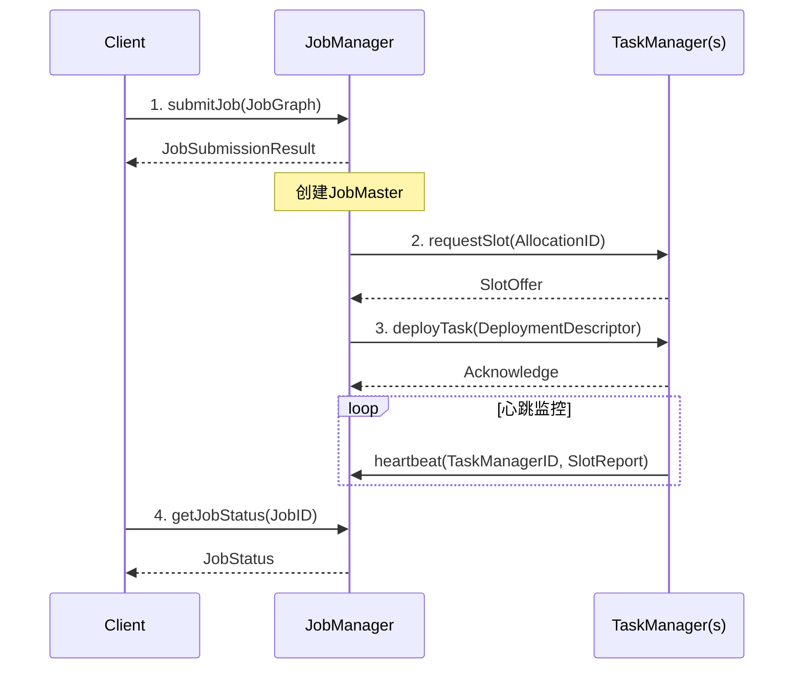

**关系 F-01-03 [JobManager-TaskManager拓扑]**：

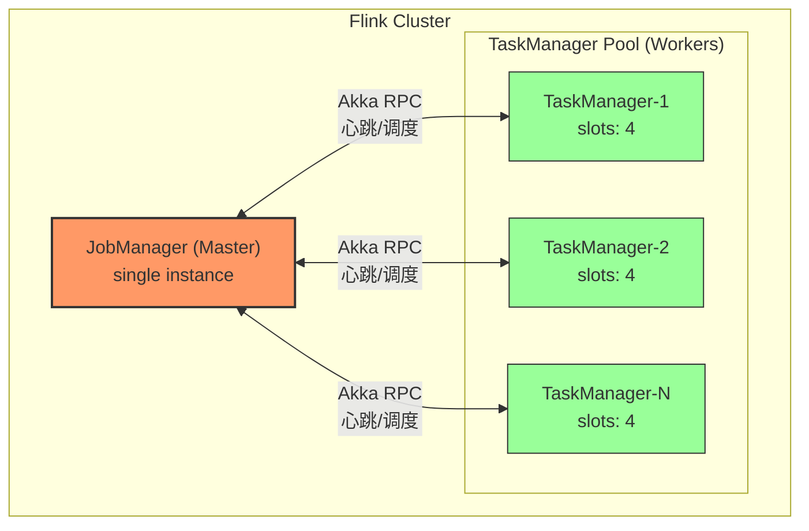

---

### 3.2 JobManager内部组件关系

**关系 F-01-04 [JobManager组件协作]**：

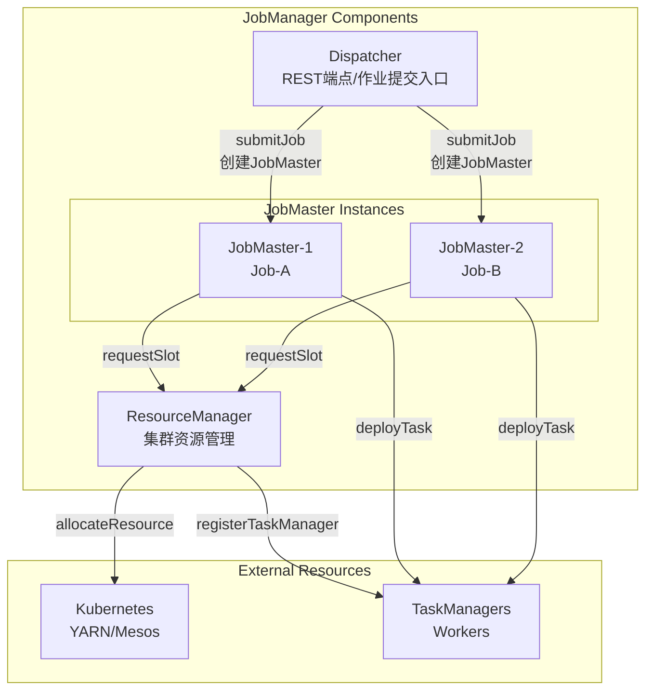

---

### 3.3 TaskManager执行模型关系

**关系 F-01-05 [Task-Thread-Slot关系]**：

```
TaskManager (JVM Process)
├── Slot-1
│   ├── Task-A-1 (Map Operator, Subtask 0)
│   ├── Task-B-1 (Filter Operator, Subtask 0)  [同一Slot Sharing Group]
│   └── Single Thread Executor
├── Slot-2
│   ├── Task-A-2 (Map Operator, Subtask 1)
│   ├── Task-B-2 (Filter Operator, Subtask 1)
│   └── Single Thread Executor
├── Slot-3
│   └── ...
└── Network Stack (共享)
```

**关系 F-01-06 [数据流网络关系]**：

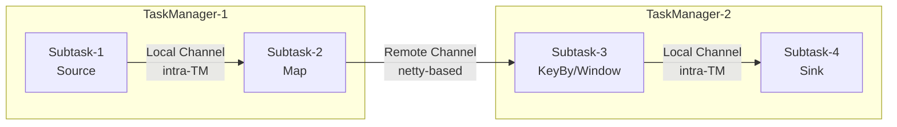

---

## 4. 论证过程 (Argumentation)

### 4.1 Master-Slave架构设计论证

**命题 F-01-01 [集中式调度优于完全去中心化]**：
> Flink采用集中式Master-Slave架构而非完全去中心化设计，这在流处理场景下具有工程合理性。

*论证*：

1. **一致性需求**：流处理的低延迟要求快速的全局决策（如检查点协调）。集中式JobManager可以在毫秒级触发全局Barrier，而Gossip协议的去中心化方案需要多轮消息交换，延迟不可控。

2. **状态管理复杂度**：Exactly-Once语义需要全局协调。集中式架构下，JobManager作为单一协调者，可以原子性地触发和管理检查点，简化了两阶段提交协议的实现。

3. **故障恢复效率**：集中式架构允许JobManager维护完整的ExecutionGraph，可以在故障时快速计算最小重启区域。去中心化架构需要状态同步，恢复延迟高。

4. **资源调度优化**：集中式视图允许全局最优调度（如根据数据局部性分配任务）。去中心化架构只能达到局部最优，可能导致数据倾斜。

*反例讨论*：
完全去中心化架构（如Apache Storm早期版本）在极大规模（10,000+节点）下具有更好的水平扩展性。但Flink通过JobManager的水平扩展限制（通常单集群<1000节点）和联邦模式（Flink Kubernetes Operator管理多集群）来缓解这一问题。

---

### 4.2 Slot Sharing设计论证

**命题 F-01-02 [Slot Sharing减少线程切换开销]**：
> 允许同一Slot Sharing Group的多个Task共享一个Slot（单线程执行），相比每个Task独占一个线程，在流水线场景下性能更优。

*论证*：

1. **线程局部性**：同一数据流上的上下游Task共享线程，避免跨线程队列传递，减少缓存失效和上下文切换。

2. **内存效率**：减少每个Slot的固定内存开销（网络缓冲区、JVM栈空间）。对于轻量级算子（如简单的Map/Filter），Slot Sharing可以显著降低内存占用。

3. **反压传播**：共享线程的Task天然同步，上游阻塞时下游立即停止消费，反压传播延迟接近零。

*边界条件*：

- Slot Sharing不适用于需要大量CPU资源的算子（如复杂窗口计算），因为单线程无法利用多核
- 不适用于需要隔离的算子（如不同SLA要求的作业组件）
- Flink默认将链式（chained）算子放入同一Slot Sharing Group

---

### 4.3 Akka Actor模型选择论证

**命题 F-01-03 [Akka适用于Flink控制平面通信]**：
> Flink选择Akka Actor模型作为控制平面通信框架，相比直接使用Netty或gRPC，更适合集群协调场景。

*论证*：

1. **位置透明性**：Akka的Actor引用屏蔽了本地/远程差异，代码无需区分本地调用和网络调用。这对于JobManager和TaskManager可能部署在同一节点或不同节点的场景非常重要。

2. **容错模型**：Akka的"Let It Crash"哲学与Flink的故障恢复策略一致。Actor异常可以触发监督策略（重启/停止），这与Task失败后的重启逻辑匹配。

3. **背压控制**：Akka的Mailbox机制天然支持背压——当处理速度低于接收速度时，Mailbox积压，发送方可以感知并调整发送速率。

4. **类型安全**：Akka Typed提供编译期消息类型检查，减少运行时错误。

*权衡点*：
Akka的学习曲线较陡，调试困难（异步消息栈追踪复杂）。Flink 2.x计划逐步迁移到更轻量的RPC抽象，但控制平面仍保留Akka以兼容现有生态。

---

## 5. 形式证明 / 工程论证 (Proof / Engineering Argument)

### 5.1 作业提交到执行的完整流程证明

**定理 F-01-01 [作业执行生命周期]**：
> Flink作业从提交到完成经历严格定义的状态转换，每个状态的进入和退出条件可验证。

*工程论证*（基于Flink 1.18+源码）：

**阶段1: 客户端处理 (Client-Side)**

```java

import org.apache.flink.streaming.api.environment.StreamExecutionEnvironment;

// StreamExecutionEnvironment.execute() 入口
public JobExecutionResult execute(String jobName) throws Exception {
    // 1. 生成StreamGraph(逻辑图)
    StreamGraph streamGraph = getStreamGraph();

    // 2. 转换为JobGraph(物理图中间表示)
    JobGraph jobGraph = StreamGraphTranslator.translate(streamGraph);

    // 3. 获取ClusterClient并提交
    ClusterClient<?> client = clusterClientProvider.getClusterClient();
    CompletableFuture<JobSubmissionResult> submission = client.submitJob(jobGraph);

    return submission.get();
}
```

**阶段2: Dispatcher处理 (JobManager)**

```java
// Dispatcher.receiveAndHandle() 处理提交请求
private void handleSubmitJob(SubmitJob submitJob) {
    JobGraph jobGraph = submitJob.getJobGraph();

    // 1. 持久化JobGraph(HA场景)
    jobGraphWriter.putJobGraph(jobGraph);

    // 2. 创建JobManagerRunner(封装JobMaster)
    JobManagerRunner runner = jobManagerRunnerFactory.createJobManagerRunner(
        jobGraph,
        this::handleJobManagerRunnerResult,
        this::getMainThreadExecutor()
    );

    // 3. 启动JobMaster
    runner.start();
    jobManagerRunner = runner;
}
```

**阶段3: JobMaster初始化**

```java
// JobMaster构造与启动
public void start() throws Exception {
    // 1. 创建ExecutionGraph
    ExecutionGraph eg = createAndRestoreExecutionGraph();

    // 2. 启动调度器
    scheduler = createScheduler(eg);

    // 3. 申请资源
    scheduler.startScheduling();
}

// SchedulerNG.startScheduling() 触发资源申请
public void startScheduling() {
    // 计算所需Slot资源
    Collection<SlotRequirement> requirements = calculateSlotRequirements();

    // 向SlotPool申请资源
    slotPool.reserveSlots(requirements);
}
```

**阶段4: Task部署**

```java
// SlotPool申请到资源后,触发Task部署
private void deployTask(ExecutionVertex vertex, LogicalSlot slot) {
    // 1. 构建DeploymentDescriptor
    TaskDeploymentDescriptor tdd = TaskDeploymentDescriptorBuilder
        .fromExecutionVertex(vertex)
        .setSlotAllocationId(slot.getAllocationId())
        .build();

    // 2. 通过RPC调用TaskManager
    CompletableFuture<Acknowledge> deployment = slot.getTaskManagerGateway()
        .submitTask(tdd, rpcTimeout);

    // 3. 更新Execution状态
    vertex.getCurrentExecutionAttempt().transitionState(DEPLOYING);
}
```

**阶段5: TaskManager执行**

```java
// TaskManager接收Task并执行
public void submitTask(TaskDeploymentDescriptor tdd) {
    // 1. 反序列化任务信息
    JobInformation jobInfo = tdd.getJobInformation();
    TaskInformation taskInfo = tdd.getTaskInformation();

    // 2. 创建Task实例
    Task task = new Task(
        jobInfo,
        taskInfo,
        tdd.getExecutionAttemptId(),
        tdd.getAllocationId(),
        tdd.getSubtaskIndex(),
        tdd.getAttemptNumber(),
        tdd.getProducedPartitions(),
        tdd.getInputGates(),
        tdd.getSlotNumber(),
        taskManagerConfiguration,
        taskManagerServices,
        this  // MemoryManager, IOManager, etc.
    );

    // 3. 提交到Executor执行
    taskExecutor.execute(task);
}
```

*状态转换验证*：

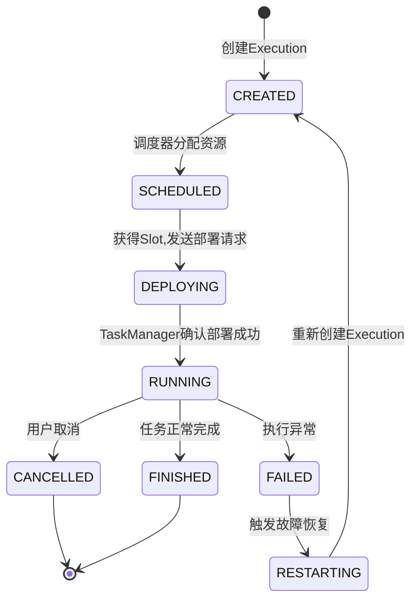

---

### 5.2 检查点一致性协议证明

**定理 F-01-02 [Barrier机制保证Exactly-Once]**：
> Flink的Barrier-based检查点机制确保：如果检查点N成功完成，所有算子的状态快照反映恰好处理到Barrier N的数据后的状态，不多不少。

*证明概要*：

**前提条件**：

- 数据流是有向无环图（DAG）
- Barrier在源端注入，随数据流传播
- 算子具有幂等性或可重放性（通过偏移量或重算）

**证明步骤**：

1. **源端保证**：源算子在注入Barrier N之前，持久化当前读取位置（如Kafka offset）。如果检查点成功，源可以从该位置重放；如果失败，源从上一个成功检查点的位置重放。

2. **Barrier对齐（Alignment）**：对于多输入算子，收到所有输入流的Barrier N后，才触发快照。这确保快照包含所有输入流Barrier N之前数据的状态。

3. **状态原子性**：算子状态快照是原子的（通过状态后端的`snapshot()`方法）。对于RocksDB，这是基于LSM的物理快照；对于HeapStateBackend，这是异步复制的内存快照。

4. **传递闭包**：由于DAG无环，Barrier最终到达所有Sink。Sink的确认构成检查点完成的最终确认。

*形式化描述*：

```
∀ operator ∈ DAG, ∀ barrier_n:
    snapshot_state(operator, barrier_n) =
        fold(process, initial_state, data_before_barrier_n)

where:
    data_before_barrier_n = {d | timestamp(d) < timestamp(barrier_n)}
```

---

## 6. 实例验证 (Examples)

### 6.1 WordCount作业完整生命周期

**示例 F-01-01 [WordCount从代码到执行]**：

```java

import org.apache.flink.streaming.api.environment.StreamExecutionEnvironment;
import org.apache.flink.streaming.api.windowing.time.Time;

// 用户代码
StreamExecutionEnvironment env =
    StreamExecutionEnvironment.getExecutionEnvironment();
env.setParallelism(2);

dataStream
    .flatMap(new Tokenizer())
    .keyBy(value -> value.f0)
    .window(TumblingProcessingTimeWindows.of(Time.seconds(5)))
    .aggregate(new CountAggregate())
    .addSink(new KafkaSink<>(...));

env.execute("WordCount");
```

**转换过程**：

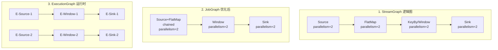

**资源分配**：

| 算子 | 并行度 | Slot Sharing Group | 所需Slot |
|------|--------|-------------------|----------|
| Source+FlatMap | 2 | "default" | 2 |
| Window | 2 | "default" | 2 (共享) |
| Sink | 2 | "default" | 2 (共享) |

**实际部署**（假设2个TaskManager，各4个Slot）：

```
TaskManager-1 (Slots: 0,1,2,3)
  Slot-0: E-Source-1, E-Window-1, E-Sink-1
  Slot-1: E-Source-2, E-Window-2, E-Sink-2
  Slot-2: (空闲)
  Slot-3: (空闲)

TaskManager-2 (Slots: 0,1,2,3)
  Slot-0: (空闲)
  Slot-1: (空闲)
  Slot-2: (空闲)
  Slot-3: (空闲)
```

---

### 6.2 检查点执行实例

**示例 F-01-02 [检查点协调过程]**：

```
时间线: t0 -------- t1 -------- t2 -------- t3 -------- t4

JobManager (Checkpoint Coordinator)
  |
  |---- triggerCheckpoint(42) --------> 源算子Source-1, Source-2
  |
  |                                   源算子保存offset,发送Barrier-42
  |
  |<---- acknowledge(Source-1) -------- t1
  |<---- acknowledge(Source-2) -------- t1
  |
  |                                   FlatMap收到Barrier,触发状态快照
  |
  |<---- acknowledge(FlatMap-1) ------- t2
  |<---- acknowledge(FlatMap-2) ------- t2
  |
  |                                   Window算子收到Barrier,触发状态快照
  |
  |<---- acknowledge(Window-1) -------- t3
  |<---- acknowledge(Window-2) -------- t3
  |
  |                                   Sink完成预提交
  |
  |<---- acknowledge(Sink-1) ---------- t4
  |<---- acknowledge(Sink-2) ---------- t4
  |
  |---- notifyCheckpointComplete(42) --> 所有算子
  |
  Checkpoint 42 完成! (耗时 = t4 - t0)
```

**源码关键点**：`CheckpointCoordinator.java`

```java
// 触发检查点
public void triggerCheckpoint(long timestamp) {
    PendingCheckpoint checkpoint = new PendingCheckpoint(
        checkpointId,
        timestamp,
        tasksToTrigger,
        tasksToWaitFor,
        tasksToCommitTo
    );

    // 向所有源任务发送触发消息
    for (Execution source : sources) {
        source.triggerCheckpoint(checkpointId, timestamp);
    }
}

// 处理确认
public void receiveAcknowledgeMessage(AcknowledgeCheckpoint ack) {
    PendingCheckpoint checkpoint = pendingCheckpoints.get(ack.getCheckpointId());
    checkpoint.acknowledgeTask(ack.getTaskExecutionId(), ack.getSubtaskState());

    if (checkpoint.areAllTasksAcknowledged()) {
        completeCheckpoint(checkpoint);
    }
}
```

---

### 6.3 故障恢复实例

**示例 F-01-03 [Task失败后的恢复流程]**：

```
场景: TaskManager-1上的E-Window-1失败 (OOM)

t0: Task抛出OutOfMemoryError
     |
     v
    TaskManager捕获异常,向JobManager报告
     |
     v
t1: JobManager收到故障通知
     |
     v
    JobMaster.markExecutionFailed(executionId, exception)
     |
     v
    ExecutionGraph.updateState(FAILED)
     |
     v
t2: 调度器计算重启范围
     |
     v
    FailoverStrategy: 从Window-1开始,下游Sink-1也重启
     |
     v
t3: 取消受影响的Task (E-Window-1, E-Sink-1)
     |
     v
t4: 从最近成功的检查点恢复状态
     |
     v
    E-Window-1: 从检查点42恢复窗口状态
     |
     v
t5: 重新部署Task,作业恢复运行
```

---

## 7. 可视化 (Visualizations)

### 7.1 整体架构全景图

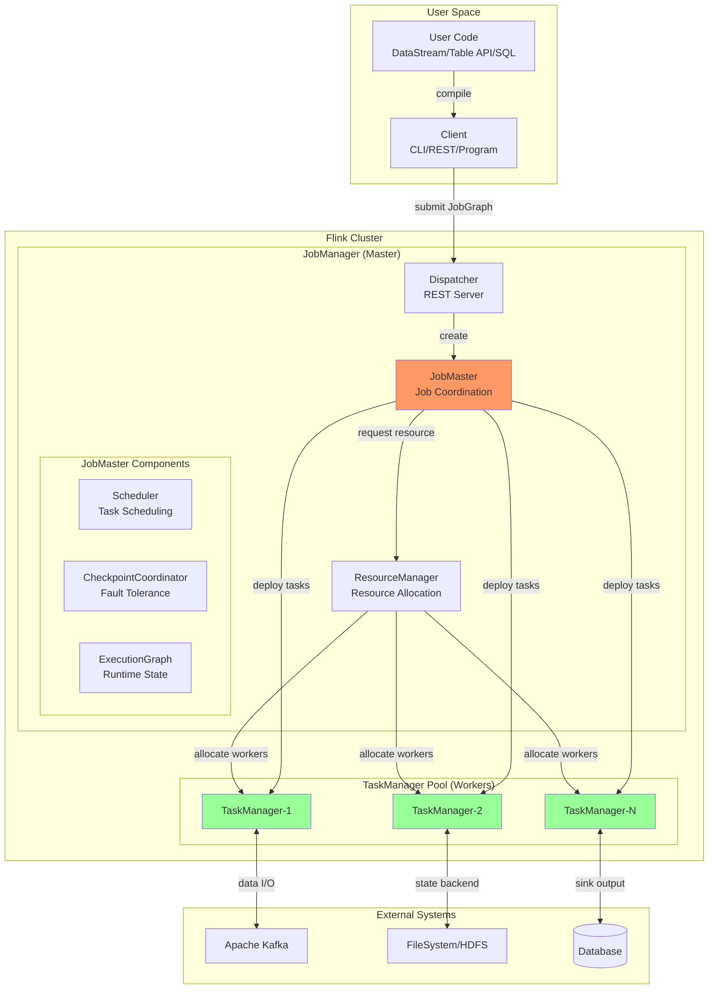

---

### 7.2 JobManager内部组件详解

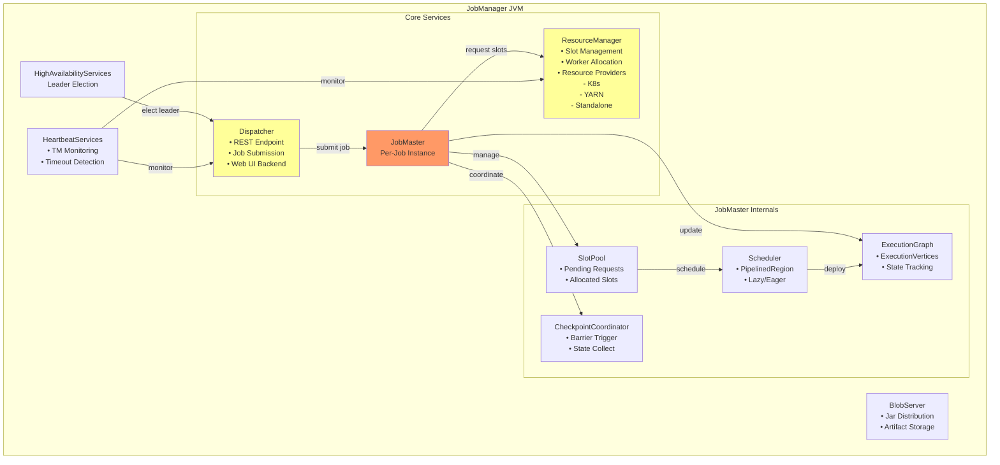

---

### 7.3 TaskManager执行模型详图

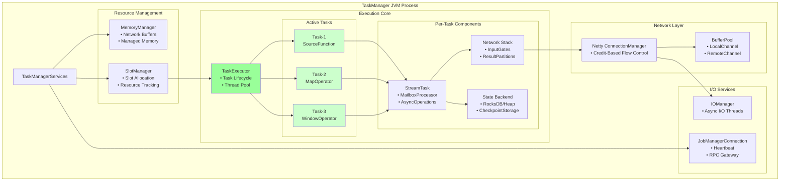

---

### 7.4 通信架构图

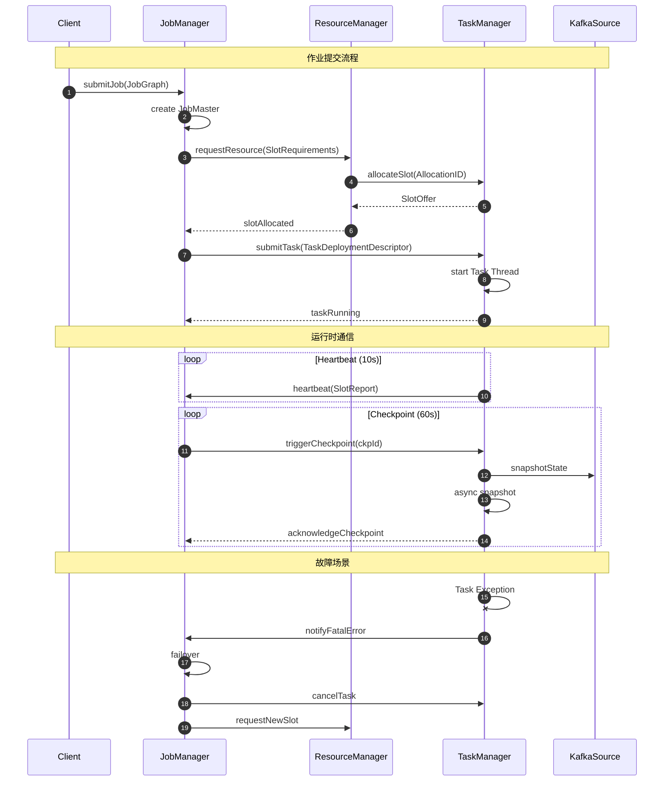

---

### 7.5 数据流网络通信图

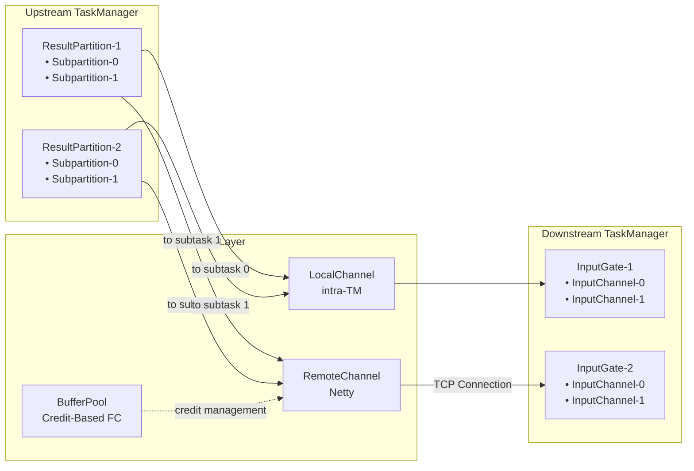

---

## 8. 关键源码类解析

### 8.1 JobManager核心类

| 类名 | 路径 | 职责 |
|------|------|------|
| `Dispatcher` | `org.apache.flink.runtime.dispatcher` | REST端点处理、作业提交入口、JobMaster生命周期管理 |
| `JobManagerRunner` | `org.apache.flink.runtime.jobmaster` | JobMaster的封装容器，处理HA场景 |
| `JobMaster` | `org.apache.flink.runtime.jobmaster` | 单作业的协调中心，管理ExecutionGraph和资源申请 |
| `ResourceManager` | `org.apache.flink.runtime.resourcemanager` | 集群资源管理、Slot分配、Worker生命周期 |
| `SlotManager` | `org.apache.flink.runtime.resourcemanager.slotmanager` | Slot资源池管理、资源请求匹配 |
| `CheckpointCoordinator` | `org.apache.flink.runtime.checkpoint` | 检查点触发、确认收集、完成通知 |

**JobMaster关键源码片段**：

```java
// JobMaster.java - 核心协调逻辑
public class JobMaster extends FencedRpcEndpoint<JobMasterId>
    implements JobMasterGateway, JobMasterService {

    private final SchedulerNG scheduler;
    private final SlotPoolService slotPool;
    private final CheckpointCoordinator checkpointCoordinator;
    private final ExecutionGraph executionGraph;

    // 处理Task部署
    public CompletableFuture<Acknowledge> deployTask(
            ExecutionAttemptID executionAttemptID,
            TaskDeploymentDescriptor tdd) {

        // 获取分配给该Execution的Slot
        LogicalSlot slot = slotPool.getAllocatedSlot(executionAttemptID);

        // 通过RPC提交到TaskManager
        return slot.getTaskManagerGateway()
            .submitTask(tdd, rpcTimeout);
    }

    // 处理检查点确认
    public void acknowledgeCheckpoint(
            JobID jobID,
            ExecutionAttemptID executionAttemptID,
            long checkpointId,
            CheckpointMetrics checkpointMetrics,
            TaskStateSnapshot checkpointState) {

        checkpointCoordinator.receiveAcknowledgeMessage(
            new AcknowledgeCheckpoint(
                jobID, executionAttemptID, checkpointId,
                checkpointMetrics, checkpointState
            )
        );
    }
}
```

---

### 8.2 TaskManager核心类

| 类名 | 路径 | 职责 |
|------|------|------|
| `TaskManagerRunner` | `org.apache.flink.runtime.taskexecutor` | TaskManager进程入口 |
| `TaskExecutor` | `org.apache.flink.runtime.taskexecutor` | TaskManager核心服务，处理RPC请求 |
| `Task` | `org.apache.flink.runtime.taskmanager` | Task执行容器，管理Task生命周期 |
| `StreamTask` | `org.apache.flink.streaming.runtime.tasks` | 流处理Task基类，处理Mailbox循环 |
| `ResultPartition` | `org.apache.flink.runtime.io.network.partition` | 数据输出分区管理 |
| `InputGate` | `org.apache.flink.runtime.io.network.partition.consumer` | 数据输入门管理 |

**TaskExecutor关键源码片段**：

```java
// TaskExecutor.java - Task部署处理
public class TaskExecutor extends RpcEndpoint implements TaskExecutorGateway {

    private final TaskSlotTable taskSlotTable;
    private final JobLeaderService jobLeaderService;

    public CompletableFuture<Acknowledge> submitTask(
            TaskDeploymentDescriptor tdd,
            Time timeout) {

        // 验证Slot分配
        JobID jobId = tdd.getJobId();
        AllocationID allocationId = tdd.getAllocationId();

        if (!taskSlotTable.existsActiveSlot(jobId, allocationId)) {
            throw new SlotNotFoundException(allocationId);
        }

        // 创建Task实例
        Task task = new Task(
            tdd.getJobInformation(),
            tdd.getTaskInformation(),
            tdd.getExecutionAttemptId(),
            allocationId,
            tdd.getSubtaskIndex(),
            tdd.getAttemptNumber(),
            tdd.getProducedPartitions(),
            tdd.getInputGates(),
            tdd.getTargetSlotNumber(),
            memoryManager,
            ioManager,
            shuffleEnvironment,
            taskManagerConfiguration
        );

        // 注册并启动Task
        taskSlotTable.addTask(task);
        task.startTask();

        return CompletableFuture.completedFuture(Acknowledge.get());
    }
}
```

---

### 8.3 调度与执行核心类

| 类名 | 路径 | 职责 |
|------|------|------|
| `SchedulerBase` | `org.apache.flink.runtime.scheduler` | 调度器基类，定义调度接口 |
| `DefaultScheduler` | `org.apache.flink.runtime.scheduler` | 默认调度器实现，支持延迟调度 |
| `PipelinedRegionScheduler` | `org.apache.flink.runtime.scheduler` | 流水线区域调度器，优化部署延迟 |
| `ExecutionGraph` | `org.apache.flink.runtime.executiongraph` | 运行时执行图，跟踪所有Execution状态 |
| `ExecutionVertex` | `org.apache.flink.runtime.executiongraph` | 单个并行子任务的运行时表示 |
| `Execution` | `org.apache.flink.runtime.executiongraph` | 单次执行尝试的状态机 |

**Execution状态机源码**：

```java
// Execution.java - 状态转换
public class Execution implements AccessExecution, Archiveable<ArchivedExecution> {

    public enum ExecutionState {
        CREATED,        // 初始创建
        SCHEDULED,      // 已调度,等待资源
        DEPLOYING,      // 正在部署到TM
        RUNNING,        // 正常运行
        FINISHED,       // 成功完成
        CANCELING,      // 正在取消
        CANCELED,       // 已取消
        FAILED,         // 执行失败
        RECONCILING     // 状态协调中
    }

    private final StateMachine<ExecutionState> stateMachine;

    // 状态转换验证
    public boolean transitionState(ExecutionState current, ExecutionState target) {
        // 有效转换: CREATED -> SCHEDULED -> DEPLOYING -> RUNNING -> FINISHED
        //           RUNNING -> CANCELING -> CANCELED
        //           RUNNING -> FAILED
        return stateMachine.tryTransition(current, target);
    }
}
```

---

### 8.4 网络与通信核心类

| 类名 | 路径 | 职责 |
|------|------|------|
| `AkkaRpcService` | `org.apache.flink.runtime.rpc.akka` | Akka RPC服务实现 |
| `RpcEndpoint` | `org.apache.flink.runtime.rpc` | RPC端点基类 |
| `NettyConnectionManager` | `org.apache.flink.runtime.io.network.netty` | Netty网络连接管理 |
| `CreditBasedPartitionRequestClientHandler` | `org.apache.flink.runtime.io.network.netty` | 基于Credit的流控客户端 |
| `LocalBufferPool` | `org.apache.flink.runtime.io.network.buffer` | 本地缓冲区池 |
| `PartitionRequestQueue` | `org.apache.flink.runtime.io.network.netty` | 分区请求队列 |

---

## 9. 架构演进与对比

### 9.1 Flink 1.x vs 2.x架构变化

| 特性 | Flink 1.x | Flink 2.x (DataStream V2) |
|------|-----------|---------------------------|
| **调度模型** | 基于ExecutionGraph | 基于DeclarativeScheduler |
| **资源抽象** | Slot | Slot + ResourceProfile |
| **检查点** | 同步/异步Barrier | 通用增量检查点 |
| **状态后端** | RocksDB/Heap | 统一状态后端接口 |
| **网络栈** | Credit-Based | 零拷贝优化 |

### 9.2 与Spark Streaming架构对比

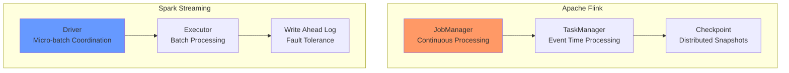

| 维度 | Flink | Spark Streaming |
|------|-------|-----------------|
| **处理模型** | 原生流处理（Native Streaming） | 微批处理（Micro-batch） |
| **延迟** | 毫秒级 | 秒级（取决于batch间隔） |
| **状态管理** | 内置状态后端，支持大状态 | 依赖外部存储（如RocksDB） |
| **时间语义** | Event Time / Processing Time / Ingestion Time | Processing Time为主 |
| **检查点** | Barrier-based分布式快照 | RDD Lineage重算 |
| **适用场景** | 复杂事件处理、实时分析 | 准实时ETL、简单聚合 |

---

## 10. 性能调优要点

### 10.1 Slot配置优化

```java

import org.apache.flink.streaming.api.datastream.DataStream;
import org.apache.flink.streaming.api.windowing.time.Time;

// flink-conf.yaml 关键配置

taskmanager.numberOfTaskSlots: 4  # 每个TM的Slot数

# 内存配置
taskmanager.memory.process.size: 4096m
taskmanager.memory.managed.fraction: 0.4
taskmanager.memory.network.fraction: 0.1

# Slot Sharing Group优化
// 代码中显式设置
DataStream<Event> processed = events
    .map(new HeavyComputation())  // CPU密集型
    .slotSharingGroup("compute")
    .keyBy(Event::getKey)
    .window(TumblingEventTimeWindows.of(Time.minutes(5)))
    .aggregate(new WindowAggregate())  // 状态密集型
    .slotSharingGroup("stateful");
```

### 10.2 网络缓冲区调优

```yaml
# 网络层配置
taskmanager.memory.network.min: 128mb
taskmanager.memory.network.max: 256mb
taskmanager.memory.network.memory.max: 256mb

# 流量控制
taskmanager.network.memory.buffer-debloat.period: 500
taskmanager.network.memory.buffer-debloat.enabled: true
```

---

## 11. 引用参考 (References)


---

## 附录：术语表

| 术语 | 英文 | 定义 |
|------|------|------|
| 作业图 | JobGraph | 作业的物理执行图中间表示，由Client生成 |
| 执行图 | ExecutionGraph | JobManager维护的完整运行时图，包含所有并行实例 |
| 执行顶点 | ExecutionVertex | ExecutionGraph中的单个并行子任务节点 |
| 执行尝试 | ExecutionAttempt | 单次Task执行的实例，失败后可重新创建 |
| 插槽 | Slot | TaskManager上的资源分配单元 |
| 检查点 | Checkpoint | 分布式一致性快照，用于故障恢复 |
| 屏障 | Barrier | 数据流中的特殊标记，触发检查点 |
| 反压 | Backpressure | 下游消费能力不足时向上游传播的压力信号 |
| 算子链 | Operator Chain | 在同一Slot中执行的连续算子序列 |
| 邮箱处理器 | MailboxProcessor | StreamTask中处理消息和记录的主循环 |

---

*文档版本: 1.0 | 最后更新: 2026-04-11 | 适配Flink版本: 1.18+ / 2.0-preview*
