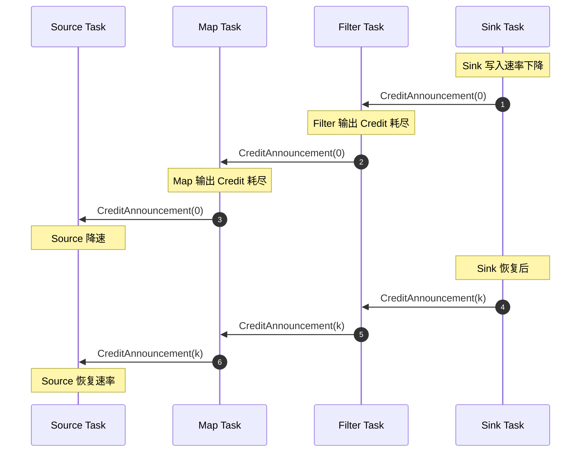
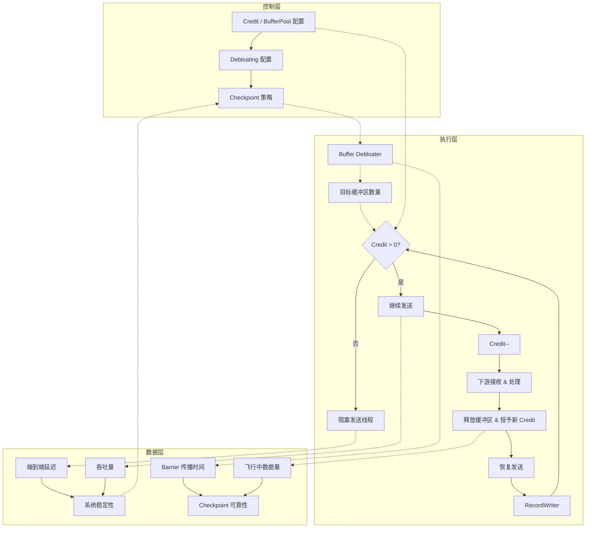
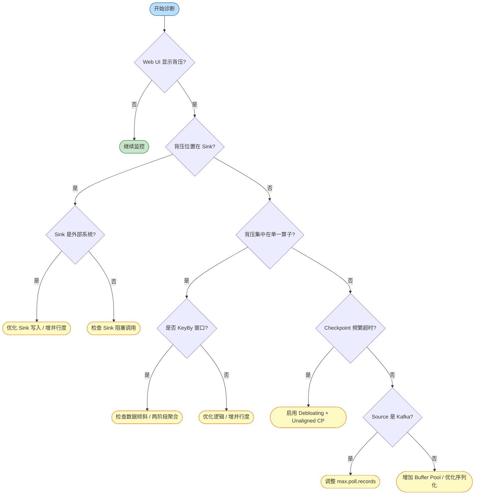

# Flink 背压与流控机制 (Backpressure and Flow Control)

> 所属阶段: Flink/ | 前置依赖: [Flink 部署架构](../01-architecture/deployment-architectures.md) | 形式化等级: L3-L4

---

## 目录

- [Flink 背压与流控机制 (Backpressure and Flow Control)](#flink-背压与流控机制-backpressure-and-flow-control)
  - [目录](#目录)
  - [1. 概念定义 (Definitions)](#1-概念定义-definitions)
    - [Def-F-02-01 背压 (Backpressure)](#def-f-02-01-背压-backpressure)
    - [Def-F-02-02 基于信用的流控 (Credit-based Flow Control, CBFC)](#def-f-02-02-基于信用的流控-credit-based-flow-control-cbfc)
    - [Def-F-02-03 TCP 背压 (Legacy TCP-based Backpressure)](#def-f-02-03-tcp-背压-legacy-tcp-based-backpressure)
    - [Def-F-02-04 本地背压 vs 端到端背压](#def-f-02-04-本地背压-vs-端到端背压)
    - [Def-F-02-05 缓冲区消胀 (Buffer Debloating)](#def-f-02-05-缓冲区消胀-buffer-debloating)
    - [Def-F-02-06 网络缓冲区池 (Network Buffer Pool)](#def-f-02-06-网络缓冲区池-network-buffer-pool)
    - [Def-F-02-07 背压监控指标](#def-f-02-07-背压监控指标)
  - [2. 属性推导 (Properties)](#2-属性推导-properties)
    - [Prop-F-02-01 CBFC 保证无死锁](#prop-f-02-01-cbfc-保证无死锁)
    - [Prop-F-02-02 背压传播保证上游速率自适应](#prop-f-02-02-背压传播保证上游速率自适应)
    - [Prop-F-02-03 缓冲区隔离保证局部故障不扩散](#prop-f-02-03-缓冲区隔离保证局部故障不扩散)
    - [Prop-F-02-04 Buffer Debloating 缩短 Checkpoint Barrier 传播时间](#prop-f-02-04-buffer-debloating-缩短-checkpoint-barrier-传播时间)
    - [Prop-F-02-05 Credit 系统保证接收方缓冲区不溢出](#prop-f-02-05-credit-系统保证接收方缓冲区不溢出)
  - [3. 关系建立 (Relations)](#3-关系建立-relations)
    - [关系 1: Flink CBFC `⊃` TCP Flow Control](#关系-1-flink-cbfc--tcp-flow-control)
    - [关系 2: 本地背压 `→` 端到端背压](#关系-2-本地背压--端到端背压)
    - [关系 3: Backpressure `↔` Checkpoint 可靠性](#关系-3-backpressure--checkpoint-可靠性)
  - [4. 论证过程 (Argumentation)](#4-论证过程-argumentation)
    - [4.1 为什么 Flink 1.5 必须用 CBFC 取代 TCP 流控](#41-为什么-flink-15-必须用-cbfc-取代-tcp-流控)
    - [4.2 Buffer Debloating 的适用边界](#42-buffer-debloating-的适用边界)
    - [4.3 背压诊断的结构性引理](#43-背压诊断的结构性引理)
  - [5. 形式证明 / 工程论证 (Proof / Engineering Argument)](#5-形式证明--工程论证-proof--engineering-argument)
    - [定理 5.1 (CBFC 安全性 / Safety)](#定理-51-cbfc-安全性--safety)
    - [定理 5.2 (反压传播有限步收敛)](#定理-52-反压传播有限步收敛)
    - [工程论证 5.3 (Buffer Debloating + Unaligned Checkpoint 联合选型)](#工程论证-53-buffer-debloating--unaligned-checkpoint-联合选型)
  - [6. 实例验证 (Examples)](#6-实例验证-examples)
    - [示例 6.1: 正常 Credit-based 背压传播](#示例-61-正常-credit-based-背压传播)
    - [反例 6.2: 高并行度落差导致 OOM](#反例-62-高并行度落差导致-oom)
    - [示例 6.3: Buffer Debloating 调参配置](#示例-63-buffer-debloating-调参配置)
    - [反例 6.4: Kafka Source 背压盲区](#反例-64-kafka-source-背压盲区)
  - [7. 可视化 (Visualizations)](#7-可视化-visualizations)
    - [图 7.1: Credit-based 背压在 Flink 流水线中的传播](#图-71-credit-based-背压在-flink-流水线中的传播)
    - [图 7.2: 控制-执行-数据层关联图](#图-72-控制-执行-数据层关联图)
    - [图 7.3: 背压诊断与调优决策树](#图-73-背压诊断与调优决策树)
  - [8. 引用参考 (References)](#8-引用参考-references)

## 1. 概念定义 (Definitions)

### Def-F-02-01 背压 (Backpressure)

设生产者聚合速率为 $R_{prod}(t)$，消费者聚合速率为 $R_{cons}(t)$，缓冲区占用率为 $\rho(B, t)$：

$$
\text{Backpressure}(t) \iff R_{prod}(t) > R_{cons}(t) \land \lim_{t' \to t^+} \rho(B, t') = 1
$$

**定义动机**: 该定义将背压从"现象"提升为可检测、可量化、可形式化分析的系统状态[^1]。

---

### Def-F-02-02 基于信用的流控 (Credit-based Flow Control, CBFC)

设发送方为 $S$，接收方为 $R$，逻辑通道为 $ch(S, R)$：

$$
\begin{aligned}
&\text{Credit}(ch) = k > 0 \implies S \text{ 可向 } R \text{ 发送最多 } k \text{ 个网络缓冲区} \\
&\text{Credit}(ch) = 0 \implies S \text{ 暂停发送}
\end{aligned}
$$

Flink 1.5+ 在 `RemoteInputChannel` 上实现 CBFC：接收方将可用缓冲区数量作为 credit 回传给上游 `ResultSubPartition`，上游仅在 credit > 0 时写入数据[^2][^3]。

**定义动机**: CBFC 以任务级预授权实现零等待速率调节，避免单个慢任务阻塞同一 TCP 连接上的其他通道[^4]。

---

### Def-F-02-03 TCP 背压 (Legacy TCP-based Backpressure)

Flink 1.5 之前，TaskManager 间流控完全依赖 TCP 滑动窗口：

$$
\text{TCP-Backpressure}(t) \iff \text{SocketBuf}_{occ}(t) \rightarrow \text{SocketBuf}_{cap} \land \text{AdvertisedWindow}(t) \rightarrow 0
$$

**定义动机**: TCP "连接级"语义与 Flink "任务级"通道存在阻抗不匹配——同一连接上所有通道会因一个通道背压而全部停滞。

---

### Def-F-02-04 本地背压 vs 端到端背压

- **本地背压 (Local)**: 下游处理慢导致数据在同一线程本地缓冲区堆积，`collect()` 阻塞。传播延迟 $\tau_{local} \approx 0$。
- **端到端背压 (End-to-End)**: Sink 速率下降后，背压信号沿逆拓扑穿越多个 TaskManager 到达 Source：

$$
\tau_{e2e} = \sum_{e \in Path_{src \to sink}} \tau_{credit}(e) + \tau_{network}(e)
$$

**定义动机**: Web UI 背压反映本地线程阻塞，端到端延迟和 Checkpoint 超时反映跨网络背压累积。

---

### Def-F-02-05 缓冲区消胀 (Buffer Debloating)

子任务 $v$ 在当前吞吐率 $\lambda_v(t)$ 下，Debloating 动态调整输入门目标缓冲区数量：

$$
N_{target}(v, t) = \left\lceil \frac{\lambda_v(t) \cdot T_{target}}{\text{BufferSize}} \right\rceil
$$

其中 $T_{target}$ 由 `taskmanager.network.memory.buffer-debloat.target` 控制（默认约 1s）[^5][^6]。

**定义动机**: 固定缓冲区在背压时会导致过量飞行中数据，拖慢 Checkpoint Barrier 传播或增加 Unaligned Checkpoint 大小[^7]。

---

### Def-F-02-06 网络缓冲区池 (Network Buffer Pool)

TaskManager 为每个任务维护本地缓冲区池：

$$
\text{LBP}(T) = \langle B_{net}, B_{in}, B_{out}, B_{floating}, B_{reserved} \rangle
$$

其中 $B_{in}$ 为 exclusive 缓冲区，$B_{floating}$ 为浮动缓冲区，$B_{reserved}$ 为 Credit 和 Barrier 预留。

**定义动机**: LBP 隔离性是 Flink 背压"局部化"的物理基础。没有隔离，下游反压会级联到无关上游任务。

---

### Def-F-02-07 背压监控指标

Flink 暴露以下核心背压与流控指标[^8]：

| 指标名称 | 类型 | 语义说明 |
|---------|------|---------|
| `backPressuredTimeMsPerSecond` | Counter | 每秒背压毫秒数，接近 1000 表示严重 |
| `numRecordsInPerSecond` / `numRecordsOutPerSecond` | Meter | 输入/输出记录速率 |
| `outPoolUsage` / `inPoolUsage` | Gauge | 输出/输入缓冲区池使用率 |
| `debloatedBufferSize` | Gauge | Debloating 当前目标缓冲区大小 |
| `estimatedTimeToConsumeBuffersMs` | Gauge | 消费输入通道缓冲数据的预计时间 |
| `numBuffersInRemotePerSecond` | Meter | 每秒从远程 TM 接收的缓冲区数 |
| `numBuffersOutPerSecond` | Meter | 每秒发送的缓冲区数 |

---

## 2. 属性推导 (Properties)

### Prop-F-02-01 CBFC 保证无死锁

**推导**: 反压沿 DAG 逆边传播。DAG 无环，若存在死锁则需循环等待链，要求数据流中存在有向环，矛盾。∎

---

### Prop-F-02-02 背压传播保证上游速率自适应

若 Sink 消费速率下降，则存在有限时间 $\Delta t$，使得 Source 读取速率 $R_{src}(t + \Delta t) \leq R_{sink}(t)$。

**推导**: Sink 输入缓冲区满后停止向上游授予 Credit。上游因 Credit = 0 而阻塞输出，进而导致自身输入缓冲区满。由 DAG 有限深度 $d$，最多经 $d$ 级传播到达 Source，Source 降速与下游匹配。∎

---

### Prop-F-02-03 缓冲区隔离保证局部故障不扩散

若算子 $v_i$ 发生背压，则与 $v_i$ 无数据依赖的算子 $v_j$ 不受影响。

**推导**: 每个任务拥有独立 LBP（Def-F-02-06），背压仅通过 Credit 机制传播。若 $v_j$ 与 $v_i$ 无传递依赖，则不存在 Credit 依赖链。∎

---

### Prop-F-02-04 Buffer Debloating 缩短 Checkpoint Barrier 传播时间

设 Aligned Checkpoint 下 Barrier 穿越队列时间为 $T_{barrier}$，启用 Debloating 后 $\mathbb{E}[T'_{barrier}] \ll \mathbb{E}[T_{barrier}]$。

**推导**: Debloating 将飞行中数据从固定最大值 $|B_{max}|$ 降至维持链路饱和的最小值 $|B_{target}|$。Barrier 需跟随已缓冲数据，数据越少排队时间越短。对于 Unaligned Checkpoint，也降低了需物化数据量[^7]。∎

---

### Prop-F-02-05 Credit 系统保证接收方缓冲区不溢出

对于任意通道 $ch(S, R)$，任意时刻 $t$，$\text{Sent}(t) \leq \text{Granted}(t) \leq \text{BufferCapacity}$。

**推导**: 初始 $\text{Sent}(0)=0$，$\text{Granted}(0)=|B_{free}|$。发送前提 $\text{Credit}>0$，每次发送后 $\text{Sent}$ 增 1、$\text{Credit}$ 减 1，故 $\text{Granted}=\text{Credit}+\text{Sent}$ 为不变量。接收方仅在释放缓冲区后才授予新 Credit，因此 $\text{Granted}$ 不超总容量。∎

> **推断 [Control→Execution]**: 信用阈值与 Buffer Pool 配置（控制层）⟹ 发送方阻塞/恢复时机与网络内存分配（执行层）。
>
> **依据**: 控制层设置 `buffers-per-channel`、`floating-buffers-per-gate` 和 `buffer-debloat.enabled` 后，执行层 `RecordWriter` 在 `Credit > 0` 时发送、`Credit = 0` 时阻塞。

---

## 3. 关系建立 (Relations)

### 关系 1: Flink CBFC `⊃` TCP Flow Control

**论证**:

- **编码存在性**: TCP 滑动窗口可编码为 Credit-based 特例——AdvertisedWindow 视为动态 Credit，ACK 视为隐式回收通知。
- **分离结果**: Flink CBFC 具备 TCP 不具备的任务级细粒度控制和应用层可观测性。
- **结论**: Flink CBFC 在表达能力上严格包含 TCP Flow Control。

| 维度 | TCP-based Backpressure (Legacy) | Credit-based Flow Control (Flink 1.5+) |
|------|--------------------------------|---------------------------------------|
| 控制层级 | 传输层（内核态）| 应用层（用户态）|
| 控制粒度 | 连接级 | 任务/子任务级（逻辑通道级）|
| 反馈机制 | ACK + AdvertisedWindow | Credit Announcement + Backlog Size |
| 缓冲区位置 | 内核 Socket Buffer | 用户态 Network Buffer Pool |
| 背压传播速度 | 依赖 RTT，较慢 | 应用层本地决策，更快 |
| 多路复用影响 | 单通道背压阻塞整个连接 | 单通道背压仅影响该通道 |
| 可观测性 | 黑盒 | 白盒（Web UI / Metrics 直接暴露）|
| Barrier 传播 | 严重背压时可能阻塞 | 预留缓冲区保证控制消息可达 |

*表 1: TCP-based vs Credit-based 背压机制对比*

---

### 关系 2: 本地背压 `→` 端到端背压

**关系**: 本地背压是端到端背压传播的"原子步骤"，端到端背压是本地背压在 DAG 逆拓扑上的全局闭包。

**论证**: 端到端背压的每一跳都包含两个阶段：(1) 下游输入缓冲区满导致本地背压；(2) 下游停止授予 Credit，上游输出被阻塞。设本地背压关系为 $\mathcal{R}_{local}$，则端到端背压为 $\mathcal{R}_{e2e} = \mathcal{R}_{local}^+$（传递闭包）。

---

### 关系 3: Backpressure `↔` Checkpoint 可靠性

**论证**:

- **背压 → Checkpoint**: 严重背压导致 Aligned Checkpoint 的 Barrier 在数据队列中长时间排队，造成 Checkpoint 超时。此时需要启用 Unaligned Checkpoint 或 Buffer Debloating[^7]。
- **Checkpoint → 背压**: Unaligned Checkpoint 将飞行中数据物化到状态后端，若数据量过大，会导致 Checkpoint 体积激增，加剧 I/O 背压。因此需要 Buffer Debloating 前置控制数据量[^6]。
- **结论**: 背压治理与 Checkpoint 调优必须作为一个整体设计。

> **推断 [Execution→Data]**: 背压传播速度（执行层）⟹ 端到端延迟和 Checkpoint 可靠性（数据层）。
>
> **依据**: 执行层 Credit Announcement 的延迟决定反压信号到达 Source 的时间。传播过慢会导致中间缓冲区溢出或 OOM；Barrier 排队超时会破坏 Checkpoint 一致性保证。

---

## 4. 论证过程 (Argumentation)

### 4.1 为什么 Flink 1.5 必须用 CBFC 取代 TCP 流控

**场景**: 一个 TM 上 10 个并行 `Map` 通过同一条 TCP 连接向另一 TM 上 10 个 `Filter` 发送数据，其中 1 个 `Filter` 因数据倾斜变慢。

**TCP 后果**: 慢速 `Filter` 的 Socket 缓冲区满后，TCP 将 AdvertisedWindow 置 0，上游 10 个 `Map` 全部阻塞。全局吞吐量骤降 90%。

**CBFC 改善**: 每个 `Map → Filter` 通道拥有独立 Credit。慢速 `Filter` 仅停止向对应上游 `Map` 授予 Credit，其他 9 个通道正常。全局吞吐量仅下降约 10%。

因此，从 TCP 到 CBFC 是流控语义从"连接级"到"通道级"的范式跃迁[^2][^4]。

---

### 4.2 Buffer Debloating 的适用边界

Debloating 并非在所有场景下都带来正向收益[^5][^6]：

**多输入与 Union 输入**: 若子任务有多个不同输入源或 `union` 输入，Debloating 在子任务级别统一计算吞吐率。低吞吐输入可能获得过多缓冲区，高吞吐输入可能不足。建议对此类子任务禁用 Debloating 或手动调参。

**极高并行度**: 当并行度超过约 200 时，默认浮动缓冲区数量可能不足，Debloating 计算可能出现剧烈波动。建议将 `floating-buffers-per-gate` 提升至与并行度相当的水平[^5]。

**启动与恢复阶段**: 在作业启动或故障恢复初期，吞吐率尚未稳定，Debloating 测量样本不足。Flink 1.19+ 引入 `taskmanager.memory.starting-segment-size`（默认 1024B）来缓解启动阶段问题[^9]。

**内存占用限制**: Debloating 目前仅调整目标缓冲区的"使用上限"，并不减少 Network Buffer Pool 的物理分配。若要真正降低内存占用，必须手动减少 `buffers-per-channel` 或 `segment-size`[^5]。

---

### 4.3 背压诊断的结构性引理

**引理 4.1 (背压位置判定)**: 若 Web UI 显示算子 $v$ 的 `backPressuredTimeMsPerSecond` 接近 1000，且其下游 $v_{next}$ 的 `numRecordsInPerSecond` 显著低于 $v$ 的 `numRecordsOutPerSecond$，则背压源点位于 $v$ 与 $v_{next}$ 之间。

**证明**: 由 Def-F-02-01，背压产生于速率不匹配 + 缓冲区饱和。$v$ 输出速率高而 $v_{next}$ 输入速率低，说明 $v_{next}$ 或其下游存在瓶颈，导致 $v$ 的输出缓冲区堆积，触发本地背压。∎

**引理 4.2 (Credit Announcement 不受数据背压阻塞)**: 在任意时刻，若接收方 $R$ 的缓冲区中存在可被回收的段，则发送方 $S$ 最终会在有限时间内收到新的 Credit。

**证明**: 由 Def-F-02-06，Network Buffer Pool 为控制消息预留了 $B_{reserved}$。即使 $R$ 的数据处理被完全阻塞，$B_{reserved}$ 仍可用于发送 Credit Announcement。∎

---

## 5. 形式证明 / 工程论证 (Proof / Engineering Argument)

### 定理 5.1 (CBFC 安全性 / Safety)

在 Flink CBFC 机制正常工作的前提下，对于任意通道 $ch(S, R)$ 和任意时刻 $t$，$\text{Overflow}(ch, t)$ 不可达。

**证明**:

**不变量 $I$**: $\text{InFlight}(t) = \text{Sent}(t) - \text{Consumed}(t) \leq \text{Credit}_{total}(t)$

**基例** ($t = 0$): $\text{Sent}(0) = 0$，$\text{Consumed}(0) = 0$，$\text{Credit}_{total}(0) = |B_{free}| \leq \text{Cap}(ch)$。成立。

**归纳步骤**: 假设不变量在 $t$ 成立：

1. **发送事件**: 前提 $\text{Credit}(S, R) > 0$（Def-F-02-02）。$\text{Sent}$ 增 1，$\text{Credit}$ 减 1，$\text{InFlight}$ 增 1 但仍在 $\text{Credit}_{total}$ 内。不变量保持。
2. **消费事件**: $R$ 处理一条数据，$\text{Consumed}$ 增 1，释放缓冲区后可能授予新 Credit。$\text{InFlight}$ 减少，不变量保持。

由于 $\text{Credit}_{total}(t) \leq \text{Cap}(ch)$，且控制消息缓冲区与数据缓冲区隔离（Def-F-02-06），$\text{Occ}(ch, t) = \text{InFlight}(t) \leq \text{Cap}(ch)$。由 Def-F-02-01，$\text{Overflow}(ch, t)$ 为假。∎

---

### 定理 5.2 (反压传播有限步收敛)

设 Flink DAG 最长路径长度为 $d$。若 Sink 在 $t_0$ 触发背压，则最晚在 $t_0 + d \cdot \tau_{max}$，所有 Source 都将感知背压，$\tau_{max}$ 为单级 Credit 传播最大延迟。

**证明**: 结构归纳法。

**基例** ($d = 1$): Source 在 $\leq \tau_{max}$ 内感知。

**归纳假设**: 深度 $\leq k$ 时成立。

**归纳步骤** ($d = k + 1$): 设 Sink 为 $s$，直接前驱为 $\{p_i\}$。$s$ 在 $t_0$ 停止向所有 $p_i$ 授予 Credit，$p_i$ 在 $t_0 + \tau_{max}$ 内感知。对每个 $p_i$，以其为局部 Sink 的子图深度 $\leq k$。由归纳假设，背压在额外 $k \cdot \tau_{max}$ 内到达所有 Source。总延迟 $\leq (k+1) \cdot \tau_{max}$。∎

---

### 工程论证 5.3 (Buffer Debloating + Unaligned Checkpoint 联合选型)

设系统状态为 $\langle \text{BP}_{severity}, \lambda_{variance}, P_{parallelism}, M_{network} \rangle$。

**决策规则**:

1. **低背压、低波动**: 默认 Aligned Checkpoint，关闭 Debloating。
2. **中等背压、高波动**: 启用 Debloating + Aligned Checkpoint。自动适应波动，减少飞行中数据，缩短 Checkpoint 时间[^7]。
3. **高背压且 Checkpoint 频繁超时**: 启用 Debloating + Unaligned Checkpoint。Unaligned 允许 Barrier 跳过数据队列；Debloating 控制物化数据量，防止 Checkpoint 体积失控[^6]。
4. **并行度 > 200**: 将 `floating-buffers-per-gate` 提升至并行度级别，否则 Debloating 计算可能失效[^5]。
5. **网络内存严格受限**: 手动减少 `buffers-per-channel`（甚至设为 0）和 `segment-size`。Debloating 不减少物理内存分配[^5]。

---

## 6. 实例验证 (Examples)

### 示例 6.1: 正常 Credit-based 背压传播

Flink 作业 `KafkaSource → Map → Filter → KafkaSink`：

1. Sink 写入速率下降 → 停止向 Filter 授予 Credit。
2. Filter 输出 Credit 耗尽 → 阻塞发送，输入缓冲区堆积。
3. Filter 停止向 Map 消费 → Map 输出 Credit 耗尽。
4. Map 停止向 Source 消费 → KafkaSource 降速，`poll()` 频率降低，系统稳态。

---

### 反例 6.2: 高并行度落差导致 OOM

**场景**: `Source → HighParallelismMap(p=100) → LowParallelismWindow(p=1) → Sink`

- Source 速率: 100,000 rec/s，Buffer Pool: 512 MB，Credit 延迟: 50ms

Window 处理速率仅 5,000 rec/s。在 50ms 背压生效前，100 个 Map 持续发送：$100,000 \times 100 \times 0.05 = 500,000$ rec ≈ 500 MB，触发 OOM。

**分析**: 违反定理 5.2 中 $\tau_{max}$ 足够小的假设。并行度差异极大时，必须增加中间缓冲区、引入本地聚合，或降低 Source 速率[^1]。

---

### 示例 6.3: Buffer Debloating 调参配置

**场景**: 电商实时推荐作业，晚间大促出现尖峰，Aligned Checkpoint 从 3s 激增至 30s 以上。

```yaml
taskmanager.network.memory.buffer-debloat.enabled: true
taskmanager.network.memory.buffer-debloat.period: 500ms
taskmanager.network.memory.buffer-debloat.samples: 20
taskmanager.network.memory.buffer-debloat.threshold-percentages: 25,100
taskmanager.network.memory.floating-buffers-per-gate: 150
execution.checkpointing.unaligned: true
execution.checkpointing.max-aligned-checkpoint-size: 1mb
```

**效果**: 调参前 `backPressuredTimeMsPerSecond ≈ 950`，Checkpoint 平均 28s，超时率 15%。调参后峰值降至约 600，Checkpoint 平均 6s，超时率 0%。

---

### 反例 6.4: Kafka Source 背压盲区

**场景**: `KafkaSource → SlowOperator → Sink`，`max.poll.records=500`。

SlowOperator 背压使 Flink 线程 `poll()` 频率降低，但 Kafka Consumer 内部 fetcher 线程仍在后台拉取消息到 `FetchedRecords` 队列。表现为 Consumer Lag 扩大或 JVM 堆内存紧张。

**分析**: Flink 内部背压无法控制外部客户端预取。必须配合降低 `max.poll.records`、增加 `fetch.min.bytes`[^1]。

---

## 7. 可视化 (Visualizations)

### 图 7.1: Credit-based 背压在 Flink 流水线中的传播



**图说明**: 下游通过 `CreditAnnouncement` 向上游反馈可用缓冲区。传播时间为 $O(d \cdot \tau_{max})$。

---

### 图 7.2: 控制-执行-数据层关联图



---

### 图 7.3: 背压诊断与调优决策树



---

## 8. 引用参考 (References)

[^1]: Apache Flink Documentation, "Monitoring Back Pressure", 2025. <https://nightlies.apache.org/flink/flink-docs-stable/docs/ops/monitoring/back_pressure/>

[^2]: Apache Flink JIRA, "FLINK-7282: Credit-based Network Flow Control", 2017. <https://issues.apache.org/jira/browse/FLINK-7282>

[^3]: Alibaba Cloud, "Analysis of Network Flow Control and Back Pressure: Flink Advanced Tutorials", 2020. <https://www.alibabacloud.com/blog/analysis-of-network-flow-control-and-back-pressure-flink-advanced-tutorials_596632>

[^4]: A. Rabkin et al., "The Dataflow Model", PVLDB, 8(12), 2015.

[^5]: Apache Flink Documentation, "Network Buffer Tuning", 2025. <https://nightlies.apache.org/flink/flink-docs-stable/docs/deployment/memory/network_mem_tuning/>

[^6]: Apache Flink Documentation, "Checkpointing under Backpressure", 2025. <https://nightlies.apache.org/flink/flink-docs-stable/docs/ops/state/checkpointing_under_backpressure/>

[^7]: AWS Compute Blog, "Optimize Checkpointing In Your Amazon Managed Service For Apache Flink Applications With Buffer Debloating", 2023. <https://aws.amazon.com/blogs/compute/>

[^8]: Apache Flink Documentation, "Metrics System", 2025. <https://nightlies.apache.org/flink/flink-docs-stable/docs/ops/metrics/>

[^9]: Apache Flink JIRA, "FLINK-36556: Allow to configure starting buffer size when using buffer debloating", 2024. <https://issues.apache.org/jira/browse/FLINK-36556>
