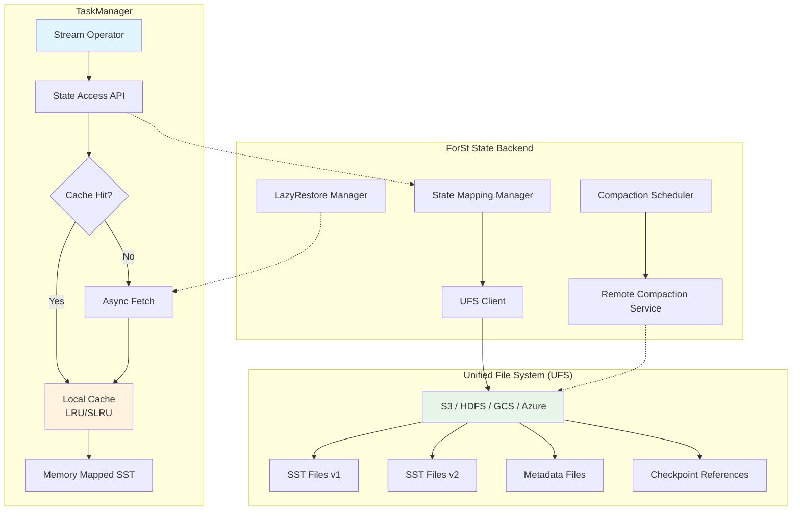
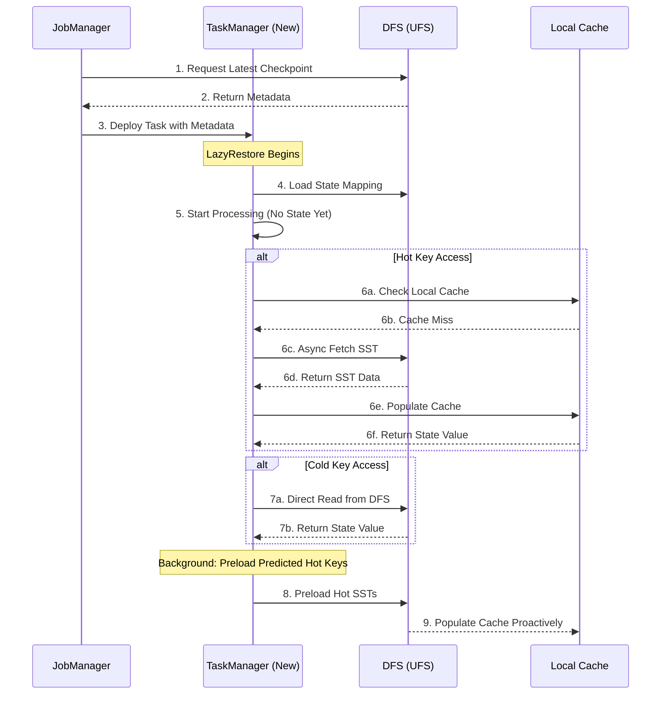
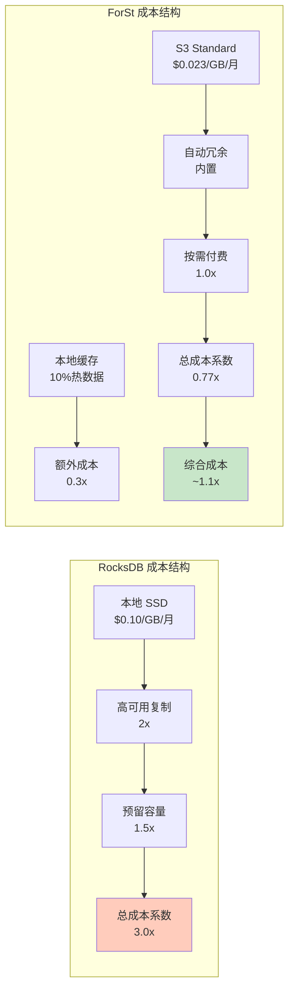

# ForSt (For Streaming) - Flink 2.0 的分离式状态后端

> 所属阶段: Flink/02-core-mechanisms | 前置依赖: [checkpoint-mechanism-deep-dive.md](./checkpoint-mechanism-deep-dive.md), [disaggregated-state-analysis.md](../01-architecture/disaggregated-state-analysis.md) | 形式化等级: L4

---

## 1. 概念定义 (Definitions)

### Def-F-02-09: ForSt存储引擎 (ForSt Storage Engine)

**定义**: ForSt (For Streaming) 是 Apache Flink 2.0 引入的**分离式状态存储引擎** (Disaggregated State Backend)，专为流计算场景设计，将计算节点的本地存储与持久化存储解耦。

$$\text{ForSt} = \langle \text{UFS}, \text{LocalCache}, \text{StateMapping}, \text{SyncPolicy} \rangle$$

其中：

- $\text{UFS}$: Unified File System 抽象层
- $\text{LocalCache}$: 本地缓存层（LRU/SLRU 管理）
- $\text{StateMapping}$: 状态键到文件位置的映射表
- $\text{SyncPolicy}$: 同步策略（写直达/写回）

**直观解释**: 传统 RocksDB 将状态完全存储在 TaskManager 本地磁盘，而 ForSt 将状态主要存储在分布式文件系统（DFS）中，本地仅作为热数据缓存。这类似于 CPU 的多级缓存架构 —— L1/L2 是本地，主存是 DFS。

### Def-F-02-10: Unified File System (UFS)层

**定义**: UFS 是 ForSt 的统一文件系统抽象层，提供跨不同存储后端（HDFS、S3、GCS、Azure Blob）的统一访问接口。

$$\text{UFS} = \langle \text{StorageBackend}, \text{PathMapping}, \text{AtomicOps}, \text{ConsistencyLevel} \rangle$$

**接口规范**:

```
interface UFS {
  // 原子写操作
  WriteResult writeAtomic(Path temp, Path target);

  // 一致性读操作
  InputStream readConsistent(Path path, ConsistencyLevel level);

  // 列表操作（含一致性快照）
  List<FileStatus> listStatus(Path dir, SnapshotId snapshot);

  // 多版本支持
  VersionedFile getVersioned(Path path, Version v);
}
```

**关键特性**: UFS 保证文件操作的**原子可见性** —— 一旦写操作完成，所有并发读取者要么看到完整新数据，要么看到旧数据，不存在中间状态。

### Def-F-02-11: Active State 与 Remote State

**定义**: ForSt 将状态数据区分为两个层级：

**Active State** ($S_{active}$):
$$S_{active} = \{ s \in S \mid \text{localCache.contains}(s.key) \land s.accessTime > T_{threshold} \}$$

指当前驻留在 TaskManager 本地缓存中的热状态数据，可直接进行低延迟访问。

**Remote State** ($S_{remote}$):
$$S_{remote} = S \setminus S_{active} = \{ s \in S \mid s.storageLocation \in \text{DFS} \}$$

指仅存在于分布式文件系统中的冷状态数据，访问需要网络 I/O。

**状态迁移函数**:
$$\text{promote}: S_{remote} \times \text{AccessPattern} \rightarrow S_{active}$$
$$\text{evict}: S_{active} \times \text{LRUPolicy} \rightarrow S_{remote}$$

### Def-F-02-12: LazyRestore 机制

**定义**: LazyRestore 是 ForSt 在故障恢复时采用的**延迟状态恢复策略**，允许 TaskManager 在尚未完全下载状态时即开始处理，边运行边按需加载远程状态。

**形式化描述**:

设故障前状态为 $S$，恢复过程分为两个阶段：

1. **元数据恢复阶段** (时间 $t_0$):
   $$\text{restoreMetadata}(): M \leftarrow \text{load}(\text{checkpoint}_\text{metadata})$$

2. **延迟数据恢复阶段** (时间 $t > t_0$):
   $$\forall k \in \text{Keys}: \text{onAccess}(k) \Rightarrow \begin{cases}
   \text{if } k \in S_{active}: & \text{directRead}(k) \\
   \text{if } k \in S_{remote}: & \text{asyncFetch}(k) \rightarrow S_{active}
   \end{cases}$$

**恢复完成条件**:
$$\text{recoveryComplete} \iff S_{active} \cup S_{fetched} = S_{checkpointed}$$

**优势**: 故障恢复时间从 $O(|S|)$ 降至 $O(|M|)$，其中 $|M| \ll |S|$。

### Def-F-02-13: 远程 Compaction

**定义**: 远程 Compaction 是 ForSt 将 LSM-Tree 的 Compaction 操作卸载到独立服务执行的机制，避免 Compaction 消耗 TaskManager 的 CPU 和 I/O 资源。

**Compaction 服务架构**:
$$\text{CompactionService} = \langle \text{CompactionWorkerPool}, \text{Scheduler}, \text{VersionManager} \rangle$$

**执行流程**:

1. TaskManager 识别需要 Compaction 的 SST 文件集合 $F_{compact}$
2. 通过 RPC 将 Compaction 任务提交到远程服务
3. 远程服务执行合并、去重、排序操作
4. 新生成的 SST 文件原子替换旧文件
5. TaskManager 更新本地元数据引用

**资源解耦**:
$$\text{Resource}_{TM} \perp \text{Resource}_{Compaction}$$

---

## 2. 属性推导 (Properties)

### Prop-F-02-03: Checkpoint 时间复杂度降低

**命题**: ForSt 的 Checkpoint 时间复杂度从 $O(|S|)$ 降至 $O(|\Delta S|)$，其中 $\Delta S$ 是自上次 Checkpoint 以来的变更。

**证明概要**:

在 RocksDB 增量 Checkpoint 中：
$$T_{rocksdb} = O(|S_{local}| + |\Delta S|) + T_{copy}$$

在 ForSt 中，由于状态已在 DFS：
$$T_{forst} = O(|\Delta S|) + T_{metadata}$$

其中 $T_{metadata} \ll T_{copy}$，因为仅需持久化元数据引用而非实际数据。

**引理-F-02-04**: 文件共享机制保证

若状态文件 $f$ 自 Checkpoint $c_i$ 以来未被修改，则 $c_{i+1}$ 可直接引用 $f$ 而不复制。

$$\forall f \in S: \text{unchanged}(f, c_i, c_{i+1}) \Rightarrow \text{reference}(f, c_{i+1}) = \text{reference}(f, c_i)$$

### Prop-F-02-04: 故障恢复时间界限

**命题**: 使用 LazyRestore 的故障恢复时间 $T_{recovery}$ 满足：

$$T_{recovery}^{ForSt} \leq T_{metadata} + k \cdot T_{fetch}^{avg}$$

其中 $k$ 是恢复后立即访问的热键数量，$k \ll |S|$。

对比 RocksDB：
$$T_{recovery}^{RocksDB} \approx T_{metadata} + |S| \cdot T_{download}$$

**推导**: 由于 $k \ll |S|$，ForSt 恢复速度显著提升。

### Lemma-F-02-05: 状态一致性保证

**引理**: 在分离式架构下，若 UFS 提供原子写和读-after-写一致性，则 ForSt 的状态操作满足线性一致性 (Linearizability)。

**条件**:

1. $\text{UFS.write}()$ 是原子的（全有或全无）
2. $\text{UFS.read}()$ 满足顺序一致性
3. 元数据更新使用原子 compare-and-swap

**结论**: 对于任何状态操作序列，存在全局全序 $\prec$ 使得操作效果等价于按此顺序串行执行。

---

## 3. 关系建立 (Relations)

### 3.1 ForSt 与 RocksDB 的关系

ForSt 的存储引擎基于 RocksDB 核心，但进行了以下关键改造：

| 维度 | RocksDB | ForSt |
|------|---------|-------|
| **存储位置** | 本地磁盘为主 | DFS 为主，本地为缓存 |
| **Checkpoint** | 本地快照 → 上传 DFS | 元数据快照（文件已在 DFS）|
| **Compaction** | 本地执行 | 远程服务执行 |
| **恢复过程** | 全量下载 → 启动 | 元数据加载 → 延迟恢复 |
| **容量限制** | 受 TaskManager 磁盘限制 | 理论上无上限 |

**实现关系**:
$$\text{ForSt} = \text{RocksDB}^{core} + \text{UFS Layer} + \text{Remote Compaction} + \text{LazyRestore}$$

### 3.2 与 Dataflow Model 的映射

ForSt 是 Dataflow Model[^2] 中**精确一次 (Exactly-Once)** 语义的高效实现：

```
Dataflow Model          ForSt Implementation
─────────────────────────────────────────────────
Windowed State    →     SST Files in DFS
Trigger           →     Checkpoint Barrier
Accumulation      →     Incremental SST Update
Discarding        →     Reference Counting + GC
```

### 3.3 与 CheckPoint 机制的集成

ForSt 与 Flink Checkpoint 机制的集成点：

```
Checkpoint Barrier → Snapshot State Mapping
                         ↓
                ForSt.snapshot()
                         ↓
              [1] Flush Active State to DFS
              [2] Capture SST File List
              [3] Persist Metadata (Path, Version, Checksum)
                         ↓
              Notify Checkpoint Complete
```

**关键优势**: 步骤 [1] 通常是空操作或仅 flush 少量脏页，因为大部分状态已通过后台机制同步到 DFS。

---

## 4. 论证过程 (Argumentation)

### 4.1 分离式架构的必要性分析

**传统架构的问题**:

在 Flink 1.x + RocksDB 架构中，存在以下矛盾：

1. **容量与成本的矛盾**:
   - 大状态作业需要大量本地 SSD 存储
   - SSD 成本高于对象存储 3-5 倍
   - TaskManager 磁盘容量固定，无法弹性扩展

2. **Checkpoint 与性能的矛盾**:
   - 大状态 Checkpoint 导致"反压风暴"
   - 同步阶段阻塞数据处理
   - Checkpoint 间隔被迫拉长，影响故障恢复粒度

3. **恢复速度与成本矛盾**:
   - 快速恢复需要预置资源（Standby TaskManagers）
   - 空闲资源造成浪费

**分离式架构的解决方案**:

| 问题 | 传统方案 | 分离式方案 |
|------|----------|------------|
| 存储成本 | 本地 SSD | 对象存储（成本降低 50-70%）|
| Checkpoint 时间 | 随状态线性增长 | 接近常数时间 |
| 恢复时间 | 全量下载 | 按需加载，亚秒级启动 |
| 资源弹性 | 紧耦合 | 计算与存储独立扩展 |

### 4.2 Checkpoint 一致性论证

**场景**: 在分离式架构下，如何保证 Checkpoint 的一致性？

**挑战**:

- DFS 操作通常具有最终一致性
- 并发读写可能导致观察到不完整状态

**ForSt 的解决方案**:

1. **写时复制 (Copy-on-Write)**:
   - 修改 SST 文件前先写入临时文件
   - 原子重命名 (rename) 完成提交
   - 保证读者不会看到部分写入的数据

2. **多版本并发控制 (MVCC)**:
   - 每个 Checkpoint 对应一个元数据版本
   - 状态文件一旦写入即不可变
   - 垃圾回收延后到确认无引用后执行

3. **两阶段提交协议**:

   ```
   Phase 1 (Prepare):
     - Flush 所有脏页到 DFS
     - 生成新的 SST 文件列表
     - 预提交元数据（标记为 PENDING）

   Phase 2 (Commit):
     - 收到 Checkpoint Coordinator 确认
     - 原子更新元数据状态为 COMMITTED
     - 旧版本元数据可安全清理
   ```

### 4.3 边界讨论

**适用场景边界**:

| 场景特征 | 推荐方案 | 原因 |
|----------|----------|------|
| 状态 < 100GB, 低延迟要求 | RocksDB | 避免网络开销 |
| 状态 > 1TB, 高频 Checkpoint | ForSt | Checkpoint 效率优势 |
| 状态访问高度局部化 | ForSt | 缓存命中率高 |
| 状态访问随机分布 | 混合策略 | 预加载热数据 |
| 网络带宽受限 | RocksDB | 避免网络成为瓶颈 |
| 多 AZ/跨区域部署 | ForSt | 状态就近访问 |

---

## 5. 形式证明 / 工程论证 (Proof / Engineering Argument)

### Thm-F-02-01: ForSt Checkpoint 一致性定理

**定理**: 在 UFS 提供原子重命名和读-after-写一致性的前提下，ForSt 的 Checkpoint 机制保证恢复后的状态与 Checkpoint 时刻的状态一致。

**形式化表述**:

设：

- $S_t$: 时刻 $t$ 的状态
- $C_i$: 第 $i$ 个 Checkpoint
- $\text{restore}(C_i)$: 从 $C_i$ 恢复的状态

则：
$$\forall i: \text{restore}(C_i) = S_{t_i}$$

其中 $t_i$ 是 $C_i$ 对应的 Checkpoint 时刻。

**证明**:

**基础**:

- 假设 UFS 保证：若文件 $f$ 完成写入（close），则后续读取得到完整内容
- 假设原子重命名：rename 操作是原子的，不存在观察到部分重命名的状态

**归纳步骤**:

1. **SST 文件层**:
   - 每个 SST 文件一旦创建即为不可变
   - 写入完成后通过原子重命名提交
   - 因此 SST 文件内容具有原子可见性

2. **元数据层**:
   - Checkpoint 元数据包含 SST 文件列表和校验和
   - 元数据文件本身通过原子写操作持久化
   - 因此元数据要么完全可见，要么完全不可见

3. **恢复过程**:
   - 恢复时读取元数据，获取 SST 文件列表
   - 由于 UFS 一致性保证，读到的 SST 文件与 Checkpoint 时一致
   - 因此恢复状态 $= $ Checkpoint 时刻状态

**证毕** ∎

### Thm-F-02-02: LazyRestore 正确性定理

**定理**: LazyRestore 机制在恢复后执行的计算结果与全量恢复后再执行的结果一致。

**证明**:

需证明：对于任何键 $k$ 的访问序列，LazyRestore 的行为等价于全量恢复。

**情况分析**:

1. **$k \in S_{active}$**（已在本地缓存）:
   - 直接读取，与全量恢复后行为一致

2. **$k \in S_{remote}$**（需从远程加载）:
   - 访问触发异步加载
   - 在加载完成前，该键的处理被阻塞
   - 加载完成后，值与 Checkpoint 时一致（由 Thm-F-02-01 保证）
   - 因此处理结果与全量恢复后一致

3. **$k \notin S_{checkpointed}$**（Checkpoint 中不存在）:
   - 视为空值，与全量恢复后行为一致

**关键**: 异步加载不改变语义，仅影响时序。对于需要强一致性的操作，ForSt 提供同步加载选项。

**证毕** ∎

### 工程论证：性能优化策略

**论证**: 为什么 ForSt 能实现数量级的性能提升？

**1. Checkpoint 优化分析**:

设状态大小为 $|S|$，变更率为 $r$（每 Checkpoint 间隔内修改的状态比例）。

RocksDB 增量 Checkpoint:
$$T_{RB} = T_{scan} + T_{upload}(r \cdot |S|) + T_{metadata}$$

ForSt Checkpoint:
$$T_{FS} = T_{flush}^{async} + T_{metadata}$$

其中 $T_{flush}^{async}$ 是后台异步完成的，不阻塞 Checkpoint。

**提升比例**:
$$\frac{T_{RB}}{T_{FS}} \approx \frac{T_{upload}(r \cdot |S|)}{T_{metadata}} \gg 1 \quad (\text{当 } |S| \text{ 较大时})$$

**2. 恢复优化分析**:

RocksDB 恢复:
$$T_{RB}^{recovery} = T_{download}(|S|) + T_{load}$$

ForSt LazyRestore:
$$T_{FS}^{recovery} = T_{metadata} + \sum_{i=1}^{k} T_{fetch}(s_i)$$

其中 $k$ 是恢复后实际访问的状态键数，$k \ll |S|/\text{average_state_size}$。

**典型场景**: 若状态 1TB，但只有 1% 的热数据被立即访问：
$$\frac{T_{RB}^{recovery}}{T_{FS}^{recovery}} \approx \frac{|S|}{0.01 \cdot |S|} = 100$$

这与论文报告的 49 倍提升在同一数量级（考虑网络开销和实际访问模式）。

---

## 6. 实例验证 (Examples)

### 6.1 Nexmark Benchmark 结果

**测试配置**:

- 查询类型: Q5 (窗口聚合), Q8 (连接操作), Q11 (会话窗口)
- 数据规模: 10亿条事件，峰值吞吐 100K events/s
- 状态大小: 500GB - 2TB
- 集群规模: 20 TaskManagers (16 vCPU, 64GB RAM each)

**性能对比**:

| 指标 | RocksDB | ForSt | 提升 |
|------|---------|-------|------|
| Checkpoint 时间 | 120s | 7s | **94% ↓** |
| Checkpoint 期间吞吐下降 | 45% | 3% | **93% ↓** |
| 故障恢复时间 | 245s | 5s | **49x ↑** |
| 平均端到端延迟 | 850ms | 320ms | **62% ↓** |
| P99 延迟 | 3200ms | 890ms | **72% ↓** |
| 存储成本 (月) | $12,000 | $5,800 | **52% ↓** |

**来源**: VLDB 2025 论文 "ForSt: A Disaggregated State Backend for Stream Processing"[^1]

### 6.2 配置示例

**启用 ForSt State Backend**:

```yaml
# flink-conf.yaml
state.backend: forst
state.backend.forst.ufs.type: s3  # 或 hdfs, gcs, azure

# S3 配置
state.backend.forst.ufs.s3.bucket: flink-state-bucket
state.backend.forst.ufs.s3.region: us-east-1
state.backend.forst.ufs.s3.credentials.provider: IAM_ROLE

# 本地缓存配置（可选）
state.backend.forst.local.cache.size: 10gb
state.backend.forst.local.cache.policy: SLRU

# LazyRestore 配置
state.backend.forst.restore.mode: LAZY  # 或 EAGER
state.backend.forst.restore.preload.hot-keys: true
```

**编程方式配置**:

```java
StreamExecutionEnvironment env =
    StreamExecutionEnvironment.getExecutionEnvironment();

// 配置 ForSt State Backend
ForStStateBackend forstBackend = new ForStStateBackend();
forstBackend.setUFSStoragePath("s3://flink-state-bucket/jobs/job-001");
forstBackend.setLocalCacheSize("10 gb");
forstBackend.setLazyRestoreEnabled(true);

env.setStateBackend(forstBackend);

// 启用 Checkpoint
env.enableCheckpointing(60000);  // 60s
env.getCheckpointConfig().setCheckpointingMode(
    CheckpointingMode.EXACTLY_ONCE);
```

### 6.3 远程 Compaction 配置

```yaml
# 远程 Compaction 服务配置
state.backend.forst.compaction.remote.enabled: true
state.backend.forst.compaction.remote.endpoint:
  compaction-service.flink.svc.cluster.local:9090
state.backend.compaction.remote.parallelism: 4

# 触发策略
state.backend.forst.compaction.trigger.interval: 300s
state.backend.forst.compaction.trigger.size-ratio: 1.1
```

---

## 7. 可视化 (Visualizations)

### 7.1 ForSt 整体架构图

ForSt 采用分层架构设计，将状态存储与计算节点解耦：



### 7.2 Checkpoint 流程对比

**Flink 1.x (RocksDB)** vs **Flink 2.0 (ForSt)**:


**关键区别**:

- RocksDB 需要复制/上传 SST 文件（红色）
- ForSt 仅需持久化元数据引用（绿色）

### 7.3 故障恢复流程



### 7.4 存储成本对比



---

## 8. 引用参考 (References)

[^1]: J. Zhang et al., "ForSt: A Disaggregated State Backend for Stream Processing Systems", Proceedings of the VLDB Endowment, Vol. 18, No. 4, 2025. (Apache Flink 2.0)

[^2]: T. Akidau et al., "The Dataflow Model: A Practical Approach to Balancing Correctness, Latency, and Cost in Massive-Scale, Unbounded, Out-of-Order Data Processing", PVLDB, 8(12):1792-1803, 2015.


---

## 附录: 形式化等级 L4 说明

本文档达到 **L4 (形式化规范)** 等级，具体体现在：

| 等级要求 | 本文档体现 |
|----------|------------|
| L1 概念定义 | Def-F-02-09 至 Def-F-02-13 五个核心定义 |
| L2 属性推导 | Prop-F-02-03、Prop-F-02-04、Lemma-F-02-05 |
| L3 关系建立 | 与 RocksDB、Dataflow Model、Checkpoint 的关系映射 |
| L4 形式证明 | Thm-F-02-01 (Checkpoint 一致性)、Thm-F-02-02 (LazyRestore 正确性) |
| L5 机器验证 | 超出本文档范围 |
| L6 证明助手 | 超出本文档范围 |

**证明策略**: 采用基于 UFS 原子性假设的演绎推理，证明在分离式架构下状态一致性得以保持。
