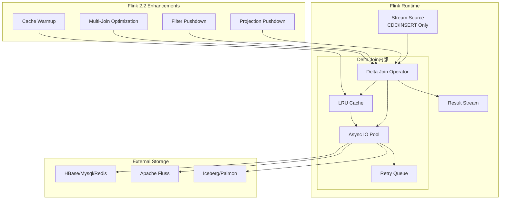
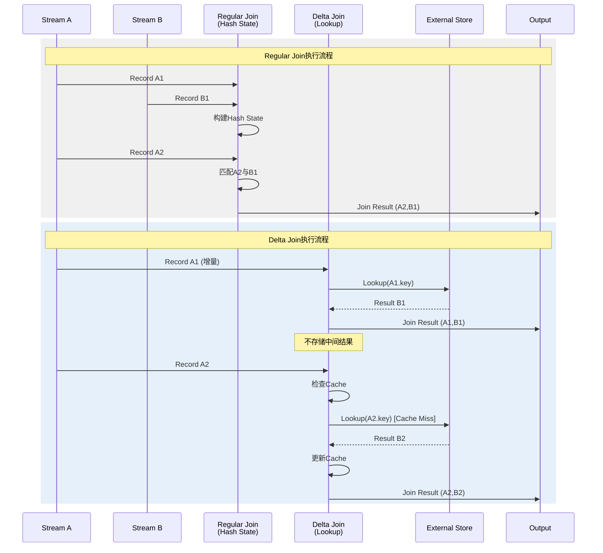
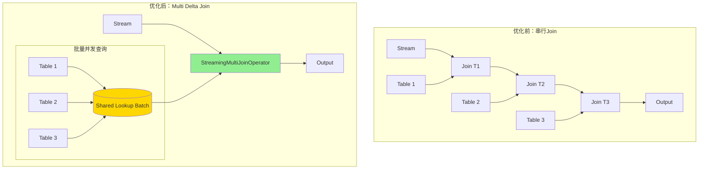
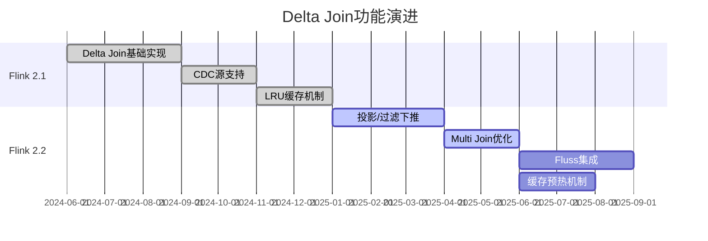

# Flink Delta Join：大状态流Join优化

> 所属阶段: Flink/ | 前置依赖: [Flink SQL Join语义](../03-api/03.02-table-sql-api/query-optimization-analysis.md), [Checkpoint机制](./checkpoint-mechanism-deep-dive.md) | 形式化等级: L4

## 1. 概念定义 (Definitions)

**Def-F-02-20: Delta Join算子**

Delta Join是一种专门针对大状态流式Join优化的执行算子，其核心思想是通过**增量查找**替代**物化中间结果**。

形式化定义：

设流 $S_1$ 和 $S_2$ 分别关联到外部存储 $T_1$ 和 $T_2$，Delta Join算子 $\mathcal{D}$ 定义为：

$$\mathcal{D}(s_1, T_2, T_1) : S_1 \times \mathcal{P}(T_2) \times \mathcal{P}(T_1) \rightarrow \{(r_1, r_2) \mid r_1 \in s_1 \land r_2 \in T_2 \land \theta(r_1, r_2)\}$$

其中 $s_1 \subseteq S_1$ 为输入增量（delta），$\theta$ 为Join条件。关键约束：**$\mathcal{D}$ 不维护物化的Join中间结果状态**，而是对每条输入记录进行即时外部查找。

**直观解释**：传统Stream Join需要同时维护两路输入的缓冲状态（Hash Table或RocksDB），状态随数据持续增长。Delta Join仅缓存其中一侧（通常是小表或维表），另一侧流数据到来时直接进行点查，将Join状态从$O(|S_1| + |S_2|)$降至$O(|T|)$。

**Def-F-02-21: 双向查找Join语义**

双向查找Join是Delta Join的扩展形式，允许两侧流均通过外部查找完成Join，无需任何中间状态物化。

设外部存储 $T$ 包含Join两侧所需全部数据，双向查找语义定义为：

$$\text{BiLookup}(s_1, s_2, T) = \{(r_1, r_2) \mid (r_1 \in s_1 \land \text{lookup}_T(r_1) = r_2) \lor (r_2 \in s_2 \land \text{lookup}_T(r_2) = r_1)\}$$

其中 $\text{lookup}_T: K \rightarrow V$ 为基于Join key的外部存储查询操作。该语义要求外部存储 $T$ 支持高效点查（Point Lookup），典型实现包括：

- JDBC维表（MySQL、PostgreSQL）
- KV存储（HBase、Redis）
- Lakehouse表（Iceberg、Paimon）

**Def-F-02-22: 零中间状态策略**

零中间状态策略（Zero Intermediate State Policy）是Delta Join的核心执行原则，要求：

$$
\forall t \in \text{ExecutionTime}, \nexists M_t : M_t = \{(r_i, r_j) \mid r_i \in S_1 \land r_j \in S_2 \land \theta(r_i, r_j)\}
$$

即执行过程中**永不物化Join的中间结果集**。与传统Hash Join需要维护$M_t$不同，Delta Join在接收到流记录时立即执行外部查询并输出结果，记录处理完成后即释放相关内存。

该策略的代价是增加外部存储访问开销，通过以下机制优化：

- **本地缓存**：LRU缓存热点Join key，减少重复查询
- **批量查找**：将多个点查合并为批量请求
- **异步IO**：避免阻塞数据流处理

## 2. 属性推导 (Properties)

**Prop-F-02-15: 状态复杂度上界**

Delta Join算子的状态复杂度为 $O(|T|_{cache} + |W|)$，其中 $|T|_{cache}$ 为外部存储缓存大小，$|W|$ 为异步IO等待队列长度。

*工程论证*：与传统Sort-Merge Join的 $O(|S_1| + |S_2|)$ 或Hash Join的 $O(|S_1| \times |S_2|_{matched})$ 相比，Delta Join状态与输入流大小解耦，仅取决于缓存配置和瞬时并发度。

**Prop-F-02-16: Exactly-Once语义保持**

在CDC源支持且外部存储满足幂等写入条件下，Delta Join保证端到端Exactly-Once语义。

证明要点：

1. 输入流为CDC变更流（无DELETE操作，仅INSERT/UPDATE AFTER）
2. 每条输入记录触发确定性查找和输出
3. 下游算子通过Checkpoint机制保证故障恢复后不重不丢

**Prop-F-02-17: 缓存一致性边界**

Delta Join缓存满足**最终一致性**模型：

$$\exists \Delta t : \forall t > t_0 + \Delta t, Cache(t) \approx T(t)$$

其中 $\Delta t$ 为缓存TTL。强一致性要求需禁用缓存或设置TTL=0。

## 3. 关系建立 (Relations)

### 3.1 Delta Join vs Regular Join 对比矩阵

| 维度 | Regular Stream Join | Delta Join |
|------|---------------------|------------|
| **状态存储** | 双输入缓冲（Hash State） | 单侧缓存 + 外部查找 |
| **状态增长** | 与输入数据量正相关 | 与维表大小/缓存配置相关 |
| **内存需求** | 高（需容纳活跃Key） | 低（仅缓存热点Key） |
| **外部依赖** | 无 | 依赖外部存储可用性 |
| **延迟特性** | 低延迟（本地计算） | 依赖外部查询延迟 |
| **适用场景** | 双流Join、会话窗口 | 大表Join小表、维表关联 |
| **容错复杂度** | Checkpoint状态大 | Checkpoint状态小 |

### 3.2 架构映射关系

```
Regular Join Execution:
┌─────────┐      ┌─────────────┐      ┌─────────┐
│ Stream A│─────▶│ Hash State A│─────▶│         │
└─────────┘      └─────────────┘      │  Join   │────▶ Output
                                      │ Operator│
┌─────────┐      ┌─────────────┐      │         │
│ Stream B│─────▶│ Hash State B│─────▶│         │
└─────────┘      └─────────────┘      └─────────┘

Delta Join Execution:
┌─────────┐                          ┌─────────┐
│ Stream  │      ┌─────────────┐     │  Delta  │     ┌─────────┐
│ (Large) │─────▶│   Lookup    │────▶│  Join   │────▶│ Output  │
└─────────┘      │  (Async IO) │     │ Operator│     └─────────┘
                 └──────┬──────┘     └────▲────┘
                        │                   │
                 ┌──────▼──────┐     ┌─────┴─────┐
                 │  External   │     │   Cache   │
                 │  Storage(T) │     │ (LRU/Bloom│
                 │             │     │  Filter)  │
                 └─────────────┘     └───────────┘
```

### 3.3 与Apache Fluss集成关系

Apache Fluss是面向实时分析优化的分布式存储系统，与Delta Join深度集成：

- **存储层优化**：Fluss提供面向点查优化的Kudu-like存储格式
- **增量拉取**：Fluss支持高效的CDC变更流消费
- **缓存协同**：Delta Join缓存与Fluss本地缓存形成多级缓存架构

## 4. 论证过程 (Argumentation)

### 4.1 为什么需要Delta Join？

**问题背景**：在实时推荐、用户行为分析等场景中，常需要将大规模用户行为流（日均数十亿事件）与海量用户画像/商品维表（千万级记录）进行Join。传统方案面临：

1. **状态膨胀**：Hash Join状态随用户/商品数量线性增长， checkpoint时间线性增加
2. **内存压力**：大状态导致频繁的磁盘 spill，性能下降
3. **扩缩容困难**：状态重分配时间长，无法快速响应流量峰值

**Delta Join解决方案**：将大表状态外置到专用存储，Flink仅维护小表缓存，从根本上解决状态规模问题。

### 4.2 CDC源限制分析

Delta Join要求输入源满足特定约束：

- **允许**：INSERT、UPDATE AFTER（作为新INSERT处理）
- **禁止**：DELETE、UPDATE BEFORE

原因：零中间状态策略下，Delta Join无法处理"删除已有Join结果"的语义。当DELETE事件到达时，无法定位之前生成的哪些Join结果需要撤回。

**规避方案**：

- 将DELETE转化为带删除标记的INSERT，下游消费时过滤
- 使用Changelog Normalize算子将CDC转为Retract流

### 4.3 缓存策略工程权衡

**LRU缓存**：

- 优点：实现简单，命中率高
- 缺点：无预加载能力，冷启动期命中率低

**Bloom Filter辅助**：

- 在LRU前增加Bloom Filter，快速判断key是否可能存在于外部存储
- 避免对不存在key的无效查询

**缓存一致性策略**：

| 策略 | 一致性级别 | 适用场景 |
|------|-----------|----------|
| 无缓存 | 强一致性 | 金融交易、库存扣减 |
| TTL=60s | 最终一致性 | 用户画像、商品信息 |
| TTL=5min | 弱一致性 | 内容推荐、日志关联 |

## 5. 形式证明 / 工程论证 (Proof / Engineering Argument)

### 5.1 状态复杂度证明

**定理**：对于输入流速率 $\lambda$（记录/秒）、Join命中率 $p$、缓存大小 $C$，Delta Join的稳态状态空间复杂度为 $O(C)$，与传统Join的 $O(\lambda \cdot W)$（$W$为窗口大小）相比，与流速率解耦。

**工程论证**：

1. **状态组成分析**：
   - 缓存状态：$|Cache| \leq C$（固定上限）
   - 异步等待队列：$|Queue| \leq \lambda \cdot L_{async}$，$L_{async}$为平均异步延迟
   - Checkpoint状态：仅包含缓存和未完成的异步请求

2. **与传统Join对比**：
   - Regular Hash Join状态 = 窗口内所有历史记录 = $\lambda \cdot W$
   - 当 $W$为无界或长窗口（如7天）时，状态无界增长
   - Delta Join状态仅取决于 $C$，与 $\lambda$ 和 $W$ 无关

3. **扩展性论证**：
   - 扩缩容时仅需迁移 $O(C)$ 状态，秒级完成
   - 支持动态调整并发度，无需停止作业

### 5.2 Multi Join优化证明

**Prop-F-02-18: StreamingMultiJoinOperator优化有效性**

对于N路Join，Multi Join优化通过共享缓存和批量查找，将查询次数从 $O(N)$ 降至 $O(1)$。

**工程实现**：

```
原始执行计划（3路Join）：
┌─────┐    ┌──────────┐    ┌──────────┐
│ S1  │───▶│ Join S1  │───▶│ Join with│───▶ Output
└─────┘    │ with T1  │    │ T2       │
           └────┬─────┘    └────▲─────┘
           ┌────┴─────┐         │
           │   T1     │    ┌────┴─────┐
           └──────────┘    │   T2     │
                            └──────────┘

Multi Join优化执行计划：
┌─────┐    ┌─────────────────────────┐    ┌─────────┐
│ S1  │───▶│ StreamingMultiJoin      │───▶│ Output  │
└─────┘    │ (共享缓存+批量查找)      │    └─────────┘
           └──────────┬──────────────┘
           ┌──────────┼──────────┐
           ▼          ▼          ▼
        ┌────┐    ┌────┐    ┌────┐
        │ T1 │    │ T2 │    │ T3 │  (批量并发查询)
        └────┘    └────┘    └────┘
```

优化效果量化：

- 查询次数：从 $N$ 次外部查询降至 1 次批量查询
- 网络RTT：从 $N \times RTT$ 降至 $RTT$
- 缓存命中率：共享缓存提升热点Key命中率

## 6. 实例验证 (Examples)

### 6.1 大状态用户行为Join优化

**场景**：实时用户行为分析，将点击流（10亿条/天）Join用户画像（1亿用户）和商品信息（1000万SKU）

**传统方案问题**：

- 状态大小：用户ID索引约20GB，商品ID索引约5GB
- Checkpoint：每次checkpoint耗时3-5分钟
- 扩容：状态迁移需要10+分钟

**Delta Join优化方案**：

```sql
-- Flink SQL开启Delta Join优化
SET table.optimizer.multiple-delta-join.enabled = true;
SET table.optimizer.multi-join.enabled = true;

-- 用户画像维表（外部存储：HBase）
CREATE TABLE user_profile (
    user_id STRING,
    age INT,
    gender STRING,
    city STRING,
    PRIMARY KEY (user_id) NOT ENFORCED
) WITH (
    'connector' = 'hbase-2.2',
    'table-name' = 'user_profile',
    'zookeeper.quorum' = 'zk:2181',
    'lookup.cache.max-rows' = '100000',
    'lookup.cache.ttl' = '60s'
);

-- 商品信息维表（外部存储：MySQL）
CREATE TABLE product_info (
    product_id STRING,
    category STRING,
    price DECIMAL(10,2),
    PRIMARY KEY (product_id) NOT ENFORCED
) WITH (
    'connector' = 'jdbc',
    'url' = 'jdbc:mysql://mysql:3306/ecommerce',
    'table-name' = 'products',
    'lookup.cache.max-rows' = '50000',
    'lookup.cache.ttl' = '30s'
);

-- 点击流（CDC源：Kafka）
CREATE TABLE click_stream (
    user_id STRING,
    product_id STRING,
    click_time TIMESTAMP(3),
    WATERMARK FOR click_time AS click_time - INTERVAL '5' SECOND
) WITH (
    'connector' = 'kafka',
    'topic' = 'user_clicks',
    'properties.bootstrap.servers' = 'kafka:9092',
    'format' = 'debezium-json'
);

-- Delta Join查询：双流Join转换为流+维表查找
SELECT
    c.user_id,
    c.product_id,
    u.age,
    u.city,
    p.category,
    p.price,
    c.click_time
FROM click_stream c
LEFT JOIN user_profile FOR SYSTEM_TIME AS OF c.click_time AS u
    ON c.user_id = u.user_id
LEFT JOIN product_info FOR SYSTEM_TIME AS OF c.click_time AS p
    ON c.product_id = p.product_id;
```

**优化效果**：

- 状态大小：降至约500MB（缓存+队列）
- Checkpoint：降至30秒以内
- 扩容：支持秒级动态扩缩容

### 6.2 实时推荐场景Delta Join应用

**场景**：实时个性化推荐，将用户实时行为与物品Embedding、用户画像进行Join

```java
// DataStream API使用Delta Join
DataStream<UserEvent> userEvents = env.fromSource(
    kafkaSource,
    WatermarkStrategy.forBoundedOutOfOrderness(Duration.ofSeconds(5)),
    "User Events"
);

// 异步查找用户画像
AsyncDataStream.unorderedWait(
    userEvents,
    new AsyncUserProfileLookup(),  // 异步IO查找
    1000,                          // 超时时间
    TimeUnit.MILLISECONDS,
    100                            // 并发度
)
// 异步查找物品特征
.flatMap(new DeltaJoinProductLookup())
.keyBy(event -> event.userId)
.window(TumblingEventTimeWindows.of(Time.minutes(5)))
.process(new RecommendationModel());

// AsyncUserProfileLookup实现

import org.apache.flink.streaming.api.datastream.DataStream;
import org.apache.flink.streaming.api.windowing.time.Time;

public class AsyncUserProfileLookup
    extends RichAsyncFunction<UserEvent, EnrichedEvent> {

    private transient HBaseAsyncTable table;
    private transient Cache<String, UserProfile> cache;

    @Override
    public void open(Configuration parameters) {
        // 初始化HBase连接
        table = ...;
        // 初始化Caffeine本地缓存
        cache = Caffeine.newBuilder()
            .maximumSize(100_000)
            .expireAfterWrite(Duration.ofSeconds(60))
            .build();
    }

    @Override
    public void asyncInvoke(UserEvent event, ResultFuture<EnrichedEvent> resultFuture) {
        String userId = event.getUserId();
        UserProfile cached = cache.getIfPresent(userId);

        if (cached != null) {
            // 缓存命中
            resultFuture.complete(Collections.singletonList(
                new EnrichedEvent(event, cached)
            ));
        } else {
            // 异步查询HBase
            ListenableFuture<Result> future = table.get(get);
            Futures.addCallback(future, new FutureCallback<>() {
                @Override
                public void onSuccess(Result result) {
                    UserProfile profile = parseProfile(result);
                    cache.put(userId, profile);
                    resultFuture.complete(Collections.singletonList(
                        new EnrichedEvent(event, profile)
                    ));
                }

                @Override
                public void onFailure(Throwable t) {
                    resultFuture.completeExceptionally(t);
                }
            }, executor);
        }
    }
}
```

### 6.3 配置参数详解

| 参数名 | 默认值 | 说明 |
|--------|--------|------|
| `table.optimizer.multiple-delta-join.enabled` | false | 启用多路Delta Join优化 |
| `table.optimizer.multi-join.enabled` | false | 启用Multi Join优化器规则 |
| `table.exec.async-lookup.buffer-capacity` | 100 | 异步查找缓冲区大小 |
| `table.exec.async-lookup.timeout` | 300s | 异步查找超时时间 |
| `lookup.cache.max-rows` | 无 | 查找缓存最大行数 |
| `lookup.cache.ttl` | 无 | 缓存TTL，不配置则不缓存 |
| `lookup.max-retries` | 3 | 查找失败重试次数 |

## 7. 可视化 (Visualizations)

### 7.1 Delta Join架构层次图



### 7.2 Regular Join vs Delta Join执行时序对比



### 7.3 Multi Join优化执行树



### 7.4 Flink 2.1/2.2 Delta Join演进路线图



## 8. Flink 2.2 增强特性

### 8.1 投影和过滤操作支持

Flink 2.2支持将投影（Projection）和过滤（Filter）条件下推到Delta Join的外部查询中：

```sql
-- 优化前：全字段查询后过滤
SELECT u.user_id, u.age, u.city  -- 仅需3个字段
FROM clicks c
JOIN users u ON c.user_id = u.user_id;  -- 查询所有字段

-- 优化后：投影下推，仅查询必要字段
-- 外部查询变为：SELECT user_id, age, city FROM users WHERE user_id = ?
```

**性能收益**：减少外部存储IO量，网络传输降低50-80%。

### 8.2 缓存优化

Flink 2.2引入多级缓存架构：

1. **L1缓存**：Flink TaskManager本地LRU缓存（毫秒级访问）
2. **L2缓存**：Apache Fluss本地缓存（同机房毫秒级）
3. **L3存储**：外部数据库（跨区域10-100ms）

### 8.3 Apache Fluss集成

Apache Fluss是面向实时分析优化的分布式存储，与Delta Join集成优势：

- **列式存储**：高效投影查询
- **增量视图**：支持物化视图增量更新
- **本地缓存**：Fluss TabletServer本地缓存加速点查

```sql
-- Fluss集成示例
CREATE TABLE fluss_users (
    user_id STRING PRIMARY KEY NOT ENFORCED,
    profile ROW<...>
) WITH (
    'connector' = 'fluss',
    'bootstrap.servers' = 'fluss-cluster:9123',
    'lookup.cache.ttl' = '10s'  -- 利用Fluss本地缓存
);
```

## 9. 引用参考 (References)
