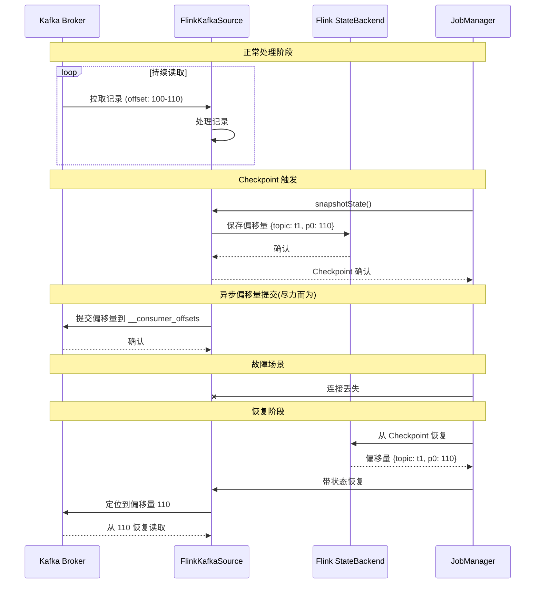
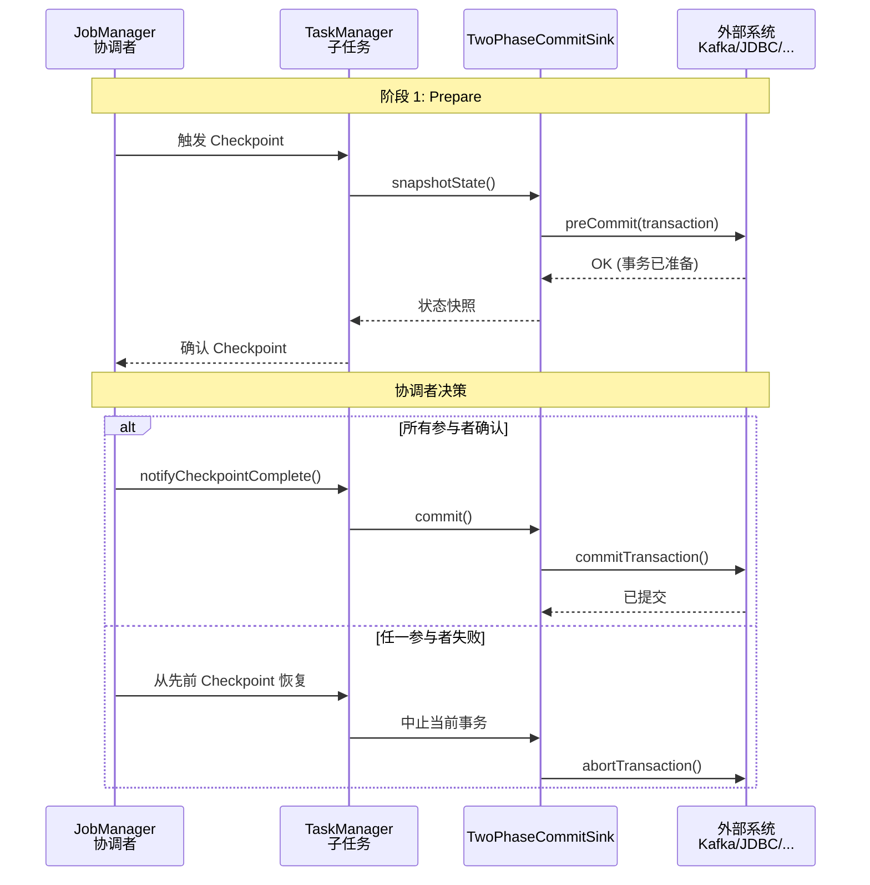
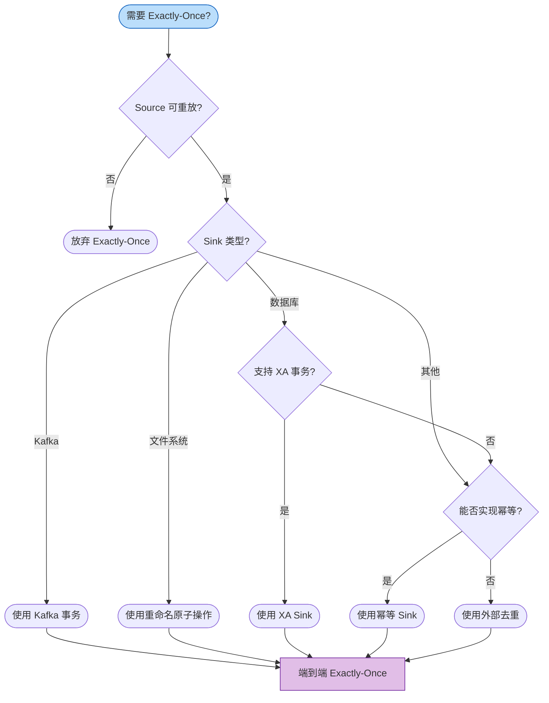
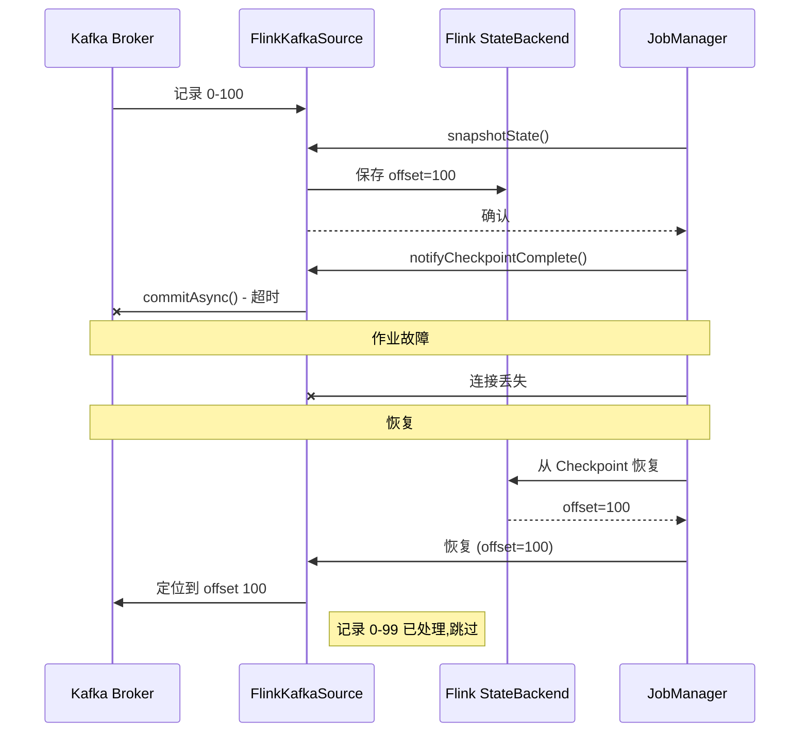
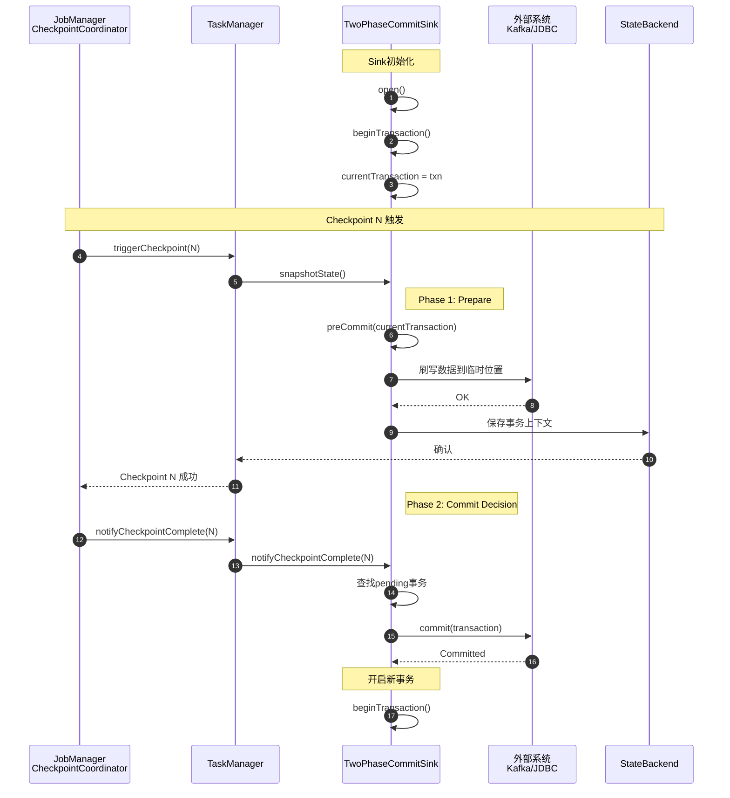
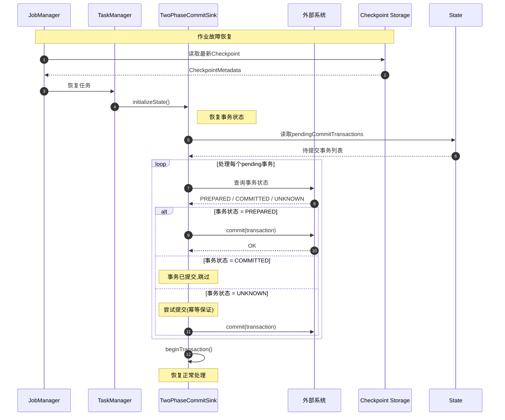
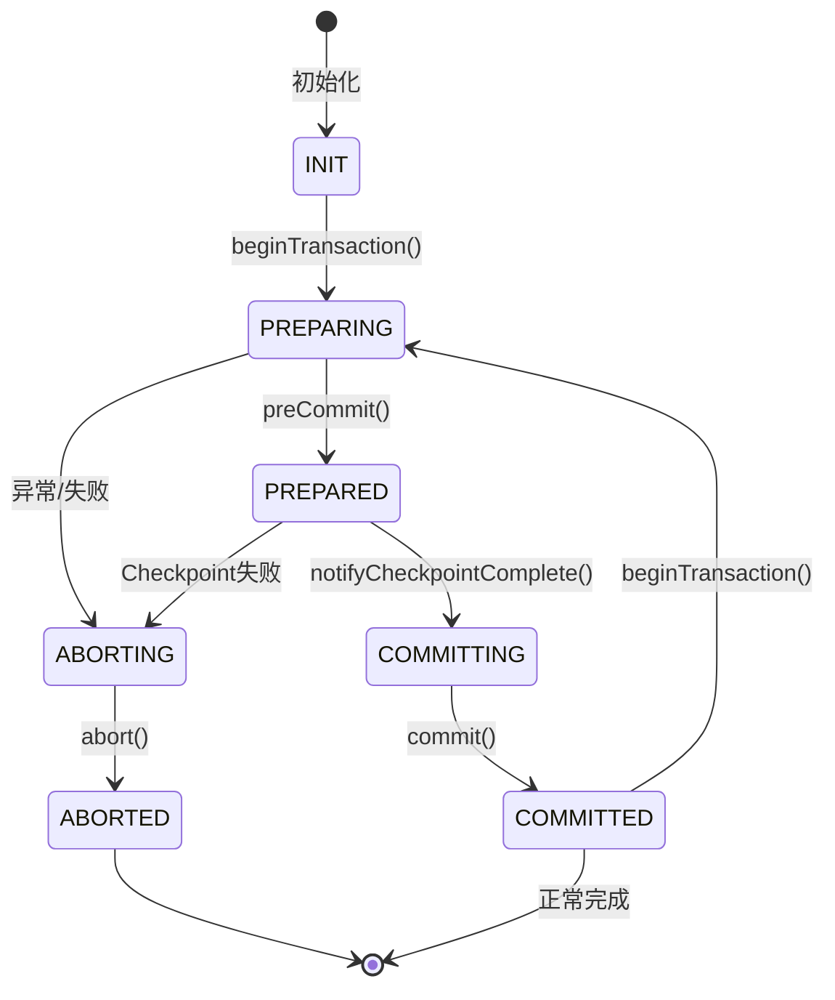

# Flink 端到端 Exactly-Once 保障 (End-to-End Exactly-Once Guarantees)

> **Flink Version**: 1.17-1.19 | **Status**: Production Ready | **难度**: L4 (Advanced)
>
> 端到端 Exactly-Once 是流处理系统最核心的正确性保证，涉及 Source 可重放、Checkpoint 一致性、Sink 事务性三大支柱的协同工作。

---

## 目录

- [Flink 端到端 Exactly-Once 保障](#flink-端到端-exactly-once-保障-end-to-end-exactly-once-guarantees)
  - [1. 概念定义 (Definitions)](#1-概念定义-definitions)
  - [2. 属性推导 (Properties)](#2-属性推导-properties)
  - [3. 关系建立 (Relations)](#3-关系建立-relations)
  - [4. 论证过程 (Argumentation)](#4-论证过程-argumentation)
  - [5. 形式证明 / 工程论证 (Proof / Engineering Argument)](#5-形式证明-工程论证-proof-engineering-argument)
  - [6. 实例验证 (Examples)](#6-实例验证-examples)
  - [7. 可视化 (Visualizations)](#7-可视化-visualizations)
  - [8. 引用参考 (References)](#8-引用参考-references)

---

## 1. 概念定义 (Definitions)

### 1.1 Exactly-Once 语义定义

**定义 1.1 (Exactly-Once 语义)**:

对于流处理应用中的每个输入记录 $r$，输出到外部系统的结果恰好反映 $r$ 一次的处理效果[^1]：

$$
\forall r \in \text{Input}. \; |\{ e \in \text{Output} \mid \text{caused\_by}(e, r) \}| = 1
$$

其中 $\text{caused\_by}(e, r)$ 表示输出元素 $e$ 的生成因果依赖于记录 $r$ 的处理。

**关键洞察**: Exactly-Once 针对的是**副作用**（外部系统状态变更），而非记录在 Flink 内部的传递次数。
在分布式流处理中，故障恢复必然导致记录被重新处理，Exactly-Once 保证的是"重新处理不会产生新的副作用"。

### 1.2 端到端 Exactly-Once 的三要素

端到端 Exactly-Once 不是 Flink 内部孤立的机制，而是 Source、引擎、Sink 三方协同的结果[^2]：

```
┌─────────────────────────────────────────────────────────────────────────────────┐
│                    端到端 Exactly-Once 保障架构                                  │
├─────────────────────────────────────────────────────────────────────────────────┤
│  ┌─────────────┐         ┌─────────────┐         ┌─────────────┐               │
│  │   Source    │────────▶│    Flink    │────────▶│    Sink     │               │
│  │   System    │         │   Engine    │         │   System    │               │
│  └──────┬──────┘         └──────┬──────┘         └──────┬──────┘               │
│         ▼                       ▼                       ▼                      │
│  ┌─────────────┐         ┌─────────────┐         ┌─────────────┐               │
│  │  可重放保证  │         │  分布式快照  │         │  事务/幂等   │               │
│  │  Offset/   │         │  Checkpoint │         │  两阶段提交  │               │
│  │  Position  │         │  Barrier对齐 │         │  UPSERT     │               │
│  └─────────────┘         └─────────────┘         └─────────────┘               │
│                                                                                 │
│  形式化: End-to-End-EO = Replayable(Source) ∧ ConsistentCheckpoint(Flink)      │
│                         ∧ AtomicOutput(Sink)                                   │
└─────────────────────────────────────────────────────────────────────────────────┘
```

**三要素详解**:

| 要素 | 作用 | 实现机制 | 故障恢复行为 |
|------|------|----------|-------------|
| **Source 可重放** | 防止数据丢失 | 偏移量持久化到 Checkpoint | 从上次 Checkpoint 偏移量重新读取 |
| **Checkpoint 一致性** | 保证状态一致 | Chandy-Lamport 分布式快照 | 恢复到全局一致的状态 |
| **Sink 事务性** | 防止重复输出 | 2PC / 幂等写入 | 未提交事务回滚，已提交事务幂等 |

### 1.3 一致性级别对比

| 级别 | 定义 | 数据丢失 | 数据重复 | 适用场景 |
|------|------|----------|----------|----------|
| **At-Most-Once** | 消息处理 0 或 1 次 | 可能 | 无 | 日志采样、实时监控 |
| **At-Least-Once** | 消息处理 ≥1 次 | 无 | 可能 | 日志聚合、指标采集 |
| **Exactly-Once** | 消息处理恰好 1 次 | 无 | 无 | 金融交易、库存管理 |

---

## 2. 属性推导 (Properties)

### 2.1 可重放 Source 的定义

**定义 2.1 (可重放 Source)**:

Source 是可重放的，当且仅当失败后可从持久化的位置标记（offset/position）重新读取相同的数据序列[^3]：

$$
\text{Replayable}(Src) \iff \forall p \in \text{Positions}. \; \exists! \text{Sequence}(p)
$$

### 2.2 Kafka Source 的偏移量管理

Kafka Source 的 Exactly-Once 配置关键参数[^4]：

```java
import java.util.Properties;
import org.apache.flink.api.common.serialization.SimpleStringSchema;
import org.apache.flink.streaming.connectors.kafka.FlinkKafkaConsumer;
import org.apache.flink.table.api.Schema;

public class Example {
    public static void main(String[] args) throws Exception {
        Properties properties = new Properties();
        properties.setProperty("bootstrap.servers", "kafka:9092");
        properties.setProperty("group.id", "flink-eo-consumer");
        properties.setProperty("isolation.level", "read_committed");  // 只读已提交事务
        properties.setProperty("enable.auto.commit", "false");         // Flink 管理偏移量

        FlinkKafkaConsumer<String> source = new FlinkKafkaConsumer<>(
            "input-topic", new SimpleStringSchema(), properties);
        source.setCommitOffsetsOnCheckpoints(true);  // Checkpoint 成功后提交偏移量

    }
}

```

**偏移量管理流程**:



**关键设计**: Flink 使用 StateBackend 中保存的偏移量进行恢复，而不是 Kafka 的 `__consumer_offsets`。即使异步提交偏移量失败，也不会导致数据丢失或重复。

### 2.3 其他 Source 系统的实现

| Source 系统 | 位置标记 | 可重放支持 | 配置要点 |
|------------|----------|-----------|----------|
| **Apache Pulsar** | Cursor (ledgerId, entryId) | ✅ 支持 | `SubscriptionType.Failover`，启用 broker 级去重 |
| **AWS Kinesis** | Sequence Number | ✅ 支持 | 基于分片的序列号跟踪 |
| **RabbitMQ** | Delivery Tag | ⚠️ 有限支持 | `autoAck=false`，手动确认 |
| **File System** | File Position | ✅ 支持 | 文件偏移量持久化 |

---

### 3. Flink Checkpoint 一致性机制

### 3.1 Chandy-Lamport 分布式快照

Flink 的 Checkpoint 机制基于 Chandy-Lamport 分布式快照算法[^5]，通过 Barrier 消息实现全局一致的状态捕获：

1. **Barrier 注入**: Source 算子在数据流中注入特殊 Barrier 消息
2. **Barrier 传播**: Barrier 随数据流向下游传播，不改变记录顺序
3. **Barrier 对齐**: 多输入算子等待所有输入通道的 Barrier 到达后快照
4. **状态快照**: 算子将状态异步写入状态后端 (RocksDB/HDFS/S3)
5. **快照完成**: 所有算子确认后，JobManager 标记 Checkpoint 完成

### 3.2 Barrier 对齐与非对齐

```mermaid
flowchart LR
    subgraph "Source"
        S1[Kafka<br/>Partition 1]
        S2[Kafka<br/>Partition 2]
    end

    subgraph "Map Operator"
        M1[Map<br/>Subtask 1]
        M2[Map<br/>Subtask 2]
    end

    subgraph "KeyBy Operator"
        K1[等待 Barrier<br/>对齐]
    end

    S1 -->|Data + Barrier N| M1
    S2 -->|Data + Barrier N| M2
    M1 -->|Barrier N| K1
    M2 -->|Barrier N| K1

    Note over K1: 收到所有输入的<br/>Barrier N 后才快照
```

对齐模式保证快照一致性，但在背压场景下可能导致 Checkpoint 超时。

**非对齐 Checkpoint (Unaligned Checkpoint)**[^6]: 允许 Barrier 超越堆积的数据记录，将数据纳入 Checkpoint 状态，解决背压下的 Checkpoint 问题。

### 3.3 状态后端与快照机制

| 状态后端 | 存储介质 | 快照方式 | 适用场景 |
|----------|----------|----------|----------|
| **MemoryStateBackend** | JVM Heap | 全量同步 | 本地测试、小状态 |
| **FsStateBackend** | 文件系统 | 全量异步 | 大状态、长作业 |
| **RocksDBStateBackend** | 本地磁盘 | 增量异步 | 超大状态、增量 Checkpoint |

---

## 5. 形式证明 / 工程论证 (Proof / Engineering Argument)

### 4.1 两阶段提交协议 (2PC)

Flink 通过 `TwoPhaseCommitSinkFunction` 实现两阶段提交协议[^7]，将 Checkpoint 与外部系统事务绑定：

**定义 4.1 (Flink 2PC 协议)**:

$$
\text{Flink-2PC} = \langle \text{Coordinator}, \text{Participants}, \text{Prepare}, \text{Commit}, \text{Abort} \rangle
$$

- **Coordinator**: Flink JobManager (CheckpointCoordinator)
- **Participants**: 所有 TwoPhaseCommitSinkFunction 实例
- **Prepare**: `snapshotState()` - 持久化预提交状态
- **Commit**: `notifyCheckpointComplete()` - 提交外部事务
- **Abort**: `notifyCheckpointAborted()` 或从先前 Checkpoint 恢复

**2PC 时序图**:



### 4.2 Kafka 事务性 Sink

#### 4.2.1 旧版 Kafka Producer (Flink 1.14 之前)

```java
import java.util.Properties;
import org.apache.flink.api.common.serialization.SimpleStringSchema;
import org.apache.flink.streaming.connectors.kafka.FlinkKafkaProducer;
import org.apache.flink.table.api.Schema;

public class Example {
    public static void main(String[] args) throws Exception {
        Properties properties = new Properties();
        properties.put("bootstrap.servers", "localhost:9092");
        properties.put("transactional.id", "flink-job-" + subtaskIndex);  // 唯一 transactional.id
        properties.put("enable.idempotence", "true");
        properties.put("acks", "all");
        properties.put("retries", Integer.MAX_VALUE);

        FlinkKafkaProducer<String> sink = new FlinkKafkaProducer<>(
            "output-topic", new SimpleStringSchema(), properties,
            FlinkKafkaProducer.Semantic.EXACTLY_ONCE  // 启用 2PC
        );

    }
}

```

#### 4.2.2 新版 Kafka Sink (Flink 1.15+ 推荐)

基于 Flink Connector 新架构的 Kafka Exactly-Once 配置[^8][^11]：

```java
import org.apache.flink.api.common.eventtime.WatermarkStrategy;
import org.apache.flink.api.common.serialization.SimpleStringSchema;
import org.apache.flink.connector.kafka.sink.DeliveryGuarantee;
import org.apache.flink.connector.kafka.sink.KafkaRecordSerializationSchema;
import org.apache.flink.connector.kafka.sink.KafkaSink;
import org.apache.flink.connector.kafka.source.KafkaSource;
import org.apache.flink.streaming.api.environment.StreamExecutionEnvironment;
import org.apache.flink.table.api.Schema;

public class Example {
    public static void main(String[] args) throws Exception {
        StreamExecutionEnvironment env = StreamExecutionEnvironment.getExecutionEnvironment();
        // Source 配置 - 只读已提交事务
        KafkaSource<String> source = KafkaSource.<String>builder()
            .setBootstrapServers("kafka:9092")
            .setTopics("input-topic")
            .setGroupId("flink-eo-consumer")
            .setProperty("isolation.level", "read_committed")  // 关键:只读已提交
            .setProperty("enable.auto.commit", "false")         // Flink 管理偏移量
            .setStartingOffsets(OffsetsInitializer.earliest())
            .setValueOnlyDeserializer(new SimpleStringSchema())
            .build();

        // Sink 配置 - Exactly-Once 事务写入
        KafkaSink<String> sink = KafkaSink.<String>builder()
            .setBootstrapServers("kafka:9092")
            .setRecordSerializer(KafkaRecordSerializationSchema.builder()
                .setTopic("output-topic")
                .setValueSerializationSchema(new SimpleStringSchema())
                .build())
            .setDeliveryGuarantee(DeliveryGuarantee.EXACTLY_ONCE)  // 启用 Exactly-Once
            .setTransactionalIdPrefix("flink-processor")            // 事务 ID 前缀
            .build();

        // 构建作业
        env.fromSource(source, WatermarkStrategy.noWatermarks(), "Kafka Source")
            .map(new ProcessingFunction())
            .sinkTo(sink);

    }
}

```

#### 4.2.3 Kafka Exactly-Once 完整配置模板

**flink-conf.yaml 关键配置**：

```yaml
# Checkpoint 配置 execution.checkpointing.mode: EXACTLY_ONCE
execution.checkpointing.interval: 60s
execution.checkpointing.timeout: 10m
execution.checkpointing.max-concurrent-checkpoints: 1

# 重启策略 restart-strategy: fixed-delay
restart-strategy.fixed-delay.attempts: 10
restart-strategy.fixed-delay.delay: 10s
```

**Kafka 集群配置要求**：

```properties
# broker.properties
# 事务相关配置 transaction.state.log.replication.factor=3
transaction.state.log.min.isr=2
transaction.max.timeout.ms=900000  # 匹配 Flink Checkpoint 超时

# 幂等性配置 enable.idempotence=true
```

**事务围栏 (Transaction Fencing)**: Kafka 通过 epoch 机制防止僵尸任务写入。新生产者注册后，旧 epoch 的事务自动中止。

#### 4.2.4 Kafka Exactly-Once 关键行为说明

| 配置项 | 作用 | 注意事项 |
|--------|------|----------|
| `isolation.level=read_committed` | 消费者只读取已提交事务的消息 | Source 必须配置，否则可能读到未提交数据 |
| `transactional.id` | 生产者事务唯一标识 | 必须全局唯一，通常包含 subtaskIndex |
| `DeliveryGuarantee.EXACTLY_ONCE` | 启用事务性写入 | 与 Checkpoint 机制绑定 |
| `transaction.max.timeout.ms` | Kafka 事务最大超时 | 必须大于 Flink Checkpoint 超时 |

**幂等性保证**：即使事务超时重试，Kafka 通过 `producer.id` + `epoch` 机制确保同一消息不会重复写入。

### 4.3 JDBC XA 事务 Sink

JDBC XA Sink 实现 Exactly-Once[^9]:

```java
// [伪代码片段 - 不可直接运行] 仅展示核心逻辑
JdbcXaSinkFunction<Row> xaSink = new JdbcXaSinkFunction<>(
    "INSERT INTO results (id, value, ts) VALUES (?, ?, ?) " +
    "ON CONFLICT (id) DO UPDATE SET value = EXCLUDED.value",
    (ps, row) -> {
        ps.setString(1, row.getId());
        ps.setString(2, row.getValue());
        ps.setTimestamp(3, Timestamp.valueOf(row.getTimestamp()));
    },
    xaDataSource,
    XidGenerator.semanticXidGenerator(jobName, subtaskIndex)
);
```

---

### 5. 幂等性 Sink 实现

### 5.1 幂等性定义与原理

**定义 5.1 (幂等性)**:

操作 $f$ 是幂等的，当且仅当多次应用产生与一次应用相同的效果[^10]：

$$
\forall x. \; f(f(x)) = f(x)
$$

**幂等性 vs 事务性**:

| 特性 | 事务性 Sink | 幂等性 Sink |
|------|-------------|-------------|
| 机制 | 2PC 协议 | 主键/版本去重 |
| 延迟 | 较高 (两阶段) | 较低 (直接写入) |
| 外部系统要求 | 支持事务 | 支持 UPSERT/版本控制 |
| 适用系统 | Kafka、JDBC (XA) | HBase、Cassandra、文件系统 |

### 5.2 文件系统幂等写入

使用原子重命名实现文件系统 Exactly-Once:

```java
// [伪代码片段 - 不可直接运行] 仅展示核心逻辑
@Override
protected void preCommit(String pendingFile) throws Exception {
    // 从 .inprogress 重命名为 pending (HDFS 原子操作)
    fs.rename(inprogressPath, pendingPath);
}

@Override
protected void commit(String pendingFile) {
    // 从 pending 原子移动到最终位置
    fs.rename(pendingPath, finalPath);
}
```

### 5.3 数据库 UPSERT 模式

```sql
-- PostgreSQL: ON CONFLICT DO UPDATE
INSERT INTO results (id, value, processed_at) VALUES (?, ?, ?)
ON CONFLICT (id) DO UPDATE SET
    value = EXCLUDED.value,
    processed_at = EXCLUDED.processed_at;

-- MySQL: INSERT ... ON DUPLICATE KEY UPDATE
INSERT INTO results (id, value, processed_at) VALUES (?, ?, ?)
ON DUPLICATE KEY UPDATE
    value = VALUES(value),
    processed_at = VALUES(processed_at);
```

---

## 3. 关系建立 (Relations)

| Connector 类型 | Exactly-Once 支持 | 实现策略 | 配置要点 | 适用场景 |
|:--------------|:----------------:|:---------|:---------|:---------|
| **Apache Kafka** | ✅ Native | 事务性 Producer (2PC) | `transactional.id`, `isolation.level=read_committed` | 流处理管道 |
| **Apache Pulsar** | ✅ Native | Cursor 管理 + Broker 去重 | `SubscriptionType.Failover`，启用去重 | 多租户消息队列 |
| **AWS Kinesis** | ⚠️ Partial | 序列号跟踪 | 基于分片的序列号 Checkpoint | 云原生流处理 |
| **RabbitMQ** | ⚠️ Partial | 手动 ACK | `autoAck=false`，手动确认 | 传统消息队列 |
| **JDBC (PostgreSQL)** | ✅ Full | XA 事务 (2PC) | `max_prepared_transactions > 0`, UPSERT | 关系型数据库 |
| **JDBC (MySQL)** | ✅ Full | XA 事务 (2PC) | InnoDB 引擎，`XA RECOVER` | 关系型数据库 |
| **Elasticsearch** | ⚠️ Partial | 版本控制 + 幂等 ID | `version_type=external` | 搜索引擎 |
| **HDFS** | ✅ Full | 原子重命名 | 临时文件 → 最终文件原子移动 | 大数据存储 |
| **Amazon S3** | ✅ Full | 多部分上传 + 版本控制 | 启用 Bucket Versioning | 云对象存储 |
| **Redis** | ⚠️ Partial | Lua 脚本 + Checkpoint ID | Lua 条件更新，Checkpoint ID 去重 | 缓存/KV 存储 |
| **Cassandra** | ⚠️ Partial | 幂等写入 | 主键去重，写入一致性级别 | 分布式数据库 |

**策略选择决策树**:



---

## 4. 论证过程 (Argumentation)

### 7.1 Source 提交失败

**场景**: `notifyCheckpointComplete()` 向 Kafka 提交偏移量失败



**关键**: Source 提交失败不会违反 Exactly-Once，因为 Flink 使用 StateBackend 中的偏移量恢复，而非 Kafka 提交的偏移量。

### 7.2 Checkpoint 失败

| 失败类型 | 原因 | 恢复动作 |
|----------|------|----------|
| **同步阶段失败** | 状态快照异常 | 中止 Checkpoint，继续处理 |
| **异步阶段失败** | 状态上传失败 | 中止 Checkpoint，下次重试 |
| **超时** | Checkpoint 耗时超限 | 中止，可能表明背压 |
| **对齐超时** | Barrier 对齐超时 | 任务失败，触发恢复 |

### 7.3 Sink Pre-commit/Commit 失败

**Pre-commit 失败**: 异常传播到 CheckpointCoordinator，Checkpoint 标记为 FAILED，所有 Sink 中止事务。

**Commit 失败 (Split-Brain 场景)**:

- Kafka Sink: 事务超时，Broker 自动中止过期事务
- JDBC XA Sink: 准备的事务保留在 DB，恢复时需要启发式决策

### 7.4 网络分区与事务悬停

**事务围栏 (Transaction Fencing)**: Kafka 通过 epoch 机制防止僵尸任务写入。新生产者注册后，旧 epoch 的事务自动中止，确保 Exactly-Once。

---

## 6. 实例验证 (Examples)

### 8.1 Flink 核心配置 (flink-conf.yaml)

```yaml
# Checkpoint 配置 execution.checkpointing.mode: EXACTLY_ONCE
execution.checkpointing.interval: 60s
execution.checkpointing.min-pause-between-checkpoints: 30s
execution.checkpointing.timeout: 10m
execution.checkpointing.max-concurrent-checkpoints: 1
execution.checkpointing.externalized-checkpoint-retention: RETAIN_ON_CANCELLATION

# 状态后端配置 state.backend: rocksdb
state.backend.incremental: true
state.backend.rocksdb.memory.managed: true
state.checkpoints.dir: s3://my-bucket/flink-checkpoints

# 重启策略 restart-strategy: fixed-delay
restart-strategy.fixed-delay.attempts: 10
restart-strategy.fixed-delay.delay: 10s
```

### 8.2 Kafka Exactly-Once 完整配置示例

**生产级 Kafka Source 配置**：

```java
import java.util.Properties;
import org.apache.flink.api.common.serialization.SimpleStringSchema;
import org.apache.flink.connector.kafka.source.KafkaSource;
import org.apache.flink.table.api.Schema;

public class Example {
    public static void main(String[] args) throws Exception {
        KafkaSource<String> createKafkaSource(String bootstrapServers, String topic, String groupId) {
            Properties properties = new Properties();
            properties.setProperty("isolation.level", "read_committed");  // 关键:只读已提交
            properties.setProperty("enable.auto.commit", "false");        // Flink 管理偏移量
            properties.setProperty("auto.offset.reset", "earliest");      // 无偏移时从最早开始

            return KafkaSource.<String>builder()
                .setBootstrapServers(bootstrapServers)
                .setTopics(topic)
                .setGroupId(groupId)
                .setProperties(properties)
                .setStartingOffsets(OffsetsInitializer.committedOffsets(OffsetResetStrategy.EARLIEST))
                .setValueOnlyDeserializer(new SimpleStringSchema())
                .build();
        }

    }
}

```

**生产级 Kafka Sink 配置**：

```java
import org.apache.flink.api.common.serialization.SimpleStringSchema;
import org.apache.flink.connector.kafka.sink.DeliveryGuarantee;
import org.apache.flink.connector.kafka.sink.KafkaRecordSerializationSchema;
import org.apache.flink.connector.kafka.sink.KafkaSink;
import org.apache.flink.table.api.Schema;

public class Example {
    public static void main(String[] args) throws Exception {
        KafkaSink<String> createKafkaSink(String bootstrapServers, String topic, String transactionalIdPrefix) {
            return KafkaSink.<String>builder()
                .setBootstrapServers(bootstrapServers)
                .setRecordSerializer(KafkaRecordSerializationSchema.builder()
                    .setTopic(topic)
                    .setValueSerializationSchema(new SimpleStringSchema())
                    .build())
                .setDeliveryGuarantee(DeliveryGuarantee.EXACTLY_ONCE)
                .setTransactionalIdPrefix(transactionalIdPrefix)
                .build();
        }

    }
}

```

### 8.3 端到端 Exactly-Once 作业完整示例

```java

import org.apache.flink.streaming.api.environment.StreamExecutionEnvironment;
import org.apache.flink.streaming.api.CheckpointingMode;
import org.apache.flink.streaming.api.windowing.time.Time;

public class KafkaExactlyOnceJob {

    public static void main(String[] args) throws Exception {
        StreamExecutionEnvironment env = StreamExecutionEnvironment.getExecutionEnvironment();

        // 1. 启用 Checkpoint (必需)
        env.enableCheckpointing(60000);
        env.getCheckpointConfig().setCheckpointingMode(CheckpointingMode.EXACTLY_ONCE);
        env.getCheckpointConfig().setCheckpointTimeout(600000);
        env.getCheckpointConfig().setMinPauseBetweenCheckpoints(30000);

        // 2. 配置状态后端
        env.setStateBackend(new EmbeddedRocksDBStateBackend(true));
        env.getCheckpointConfig().setCheckpointStorage("hdfs:///flink/checkpoints");

        // 3. 配置重启策略
        env.setRestartStrategy(RestartStrategies.fixedDelayRestart(
            10, Time.seconds(10)
        ));

        // 4. Kafka Source - Exactly-Once
        KafkaSource<String> source = KafkaSource.<String>builder()
            .setBootstrapServers("kafka:9092")
            .setTopics("input-topic")
            .setGroupId("flink-eo-consumer")
            .setProperty("isolation.level", "read_committed")
            .setProperty("enable.auto.commit", "false")
            .setStartingOffsets(OffsetsInitializer.committedOffsets())
            .setValueOnlyDeserializer(new SimpleStringSchema())
            .build();

        // 5. Kafka Sink - Exactly-Once
        KafkaSink<String> sink = KafkaSink.<String>builder()
            .setBootstrapServers("kafka:9092")
            .setRecordSerializer(KafkaRecordSerializationSchema.builder()
                .setTopic("output-topic")
                .setValueSerializationSchema(new SimpleStringSchema())
                .build())
            .setDeliveryGuarantee(DeliveryGuarantee.EXACTLY_ONCE)
            .setTransactionalIdPrefix("flink-job-" + System.currentTimeMillis())
            .build();

        // 6. 构建管道
        env.fromSource(source, WatermarkStrategy.noWatermarks(), "Kafka Source")
            .map(new JsonParser())
            .keyBy(Event::getUserId)
            .window(TumblingProcessingTimeWindows.of(Time.minutes(1)))
            .aggregate(new CountAggregate())
            .map(Object::toString)
            .sinkTo(sink);

        env.execute("Kafka Exactly-Once Job");
    }
}
```

**关键配置验证**:

```bash
#!/bin/bash
echo "=== Flink Exactly-Once 预部署验证 ==="
grep -q "execution.checkpointing.mode: EXACTLY_ONCE" flink-conf.yaml && \
    echo "✓ Checkpoint 模式正确" || echo "✗ Checkpoint 模式错误"
grep -q "isolation.level=read_committed" kafka.properties && \
    echo "✓ Kafka 隔离级别正确" || echo "✗ Kafka 隔离级别错误"
echo "验证完成!"
```

---

## 5. 形式证明 / 工程论证 (Proof / Engineering Argument)

本文档描述的 Exactly-Once 机制的形式化正确性证明详见：

**[../../Struct/04-proofs/04.02-flink-exactly-once-correctness.md](../../Struct/04-proofs/04.02-flink-exactly-once-correctness.md)**

该证明文档包含：

1. **端到端 Exactly-Once 正确性定理**: 证明在可重放 Source、一致 Checkpoint、事务性 Sink 条件下，系统保证 Exactly-Once 语义
2. **2PC 原子性定理**: 证明两阶段提交协议的原子性保证
3. **幂等 Sink 等价性定理**: 证明幂等 Sink 在故障恢复下等价于 Exactly-Once
4. **观察等价性归纳证明**: 使用轨迹语义证明故障恢复后的观察等价性

**核心定理简述**:

> **定理 (端到端 Exactly-Once 正确性)**: 设 Flink 作业 $J = (Src, Ops, Snk)$ 满足：
>
> 1. $Src$ 是可重放的
> 2. $Ops$ 使用 Barrier 对齐的 Checkpoint 机制
> 3. $Snk$ 使用事务性 2PC 协议，且 commit 幂等
>
> 则 $J$ 保证端到端 Exactly-Once 语义。

---

## 8. 引用参考 (References)

[^1]: Apache Flink Documentation. "Exactly-once Semantics". <https://nightlies.apache.org/flink/flink-docs-stable/docs/dev/datastream/fault-tolerance/exactly_once/>

[^2]: Carbone, P., et al. (2017). "State Management in Apache Flink: Consistent Stateful Distributed Stream Processing". Proceedings of the VLDB Endowment.

[^3]: Chandy, K.M., & Lamport, L. (1985). "Distributed Snapshots: Determining Global States of Distributed Systems". ACM Transactions on Computer Systems.

[^4]: Apache Kafka Documentation. "Transactions in Kafka". <https://kafka.apache.org/documentation/#transactions>

[^5]: Flink Documentation. "Checkpoints". <https://nightlies.apache.org/flink/flink-docs-stable/docs/dev/datastream/fault-tolerance/checkpointing/>

[^6]: Flink Documentation. "Unaligned Checkpoints". <https://nightlies.apache.org/flink/flink-docs-stable/docs/dev/datastream/fault-tolerance/checkpointing/#unaligned-checkpoints>

[^7]: Flink Documentation. "Two-Phase Commit Sink Functions". <https://nightlies.apache.org/flink/flink-docs-stable/api/java/org/apache/flink/streaming/api/functions/sink/TwoPhaseCommitSinkFunction.html>

[^8]: Apache Kafka Documentation. "Configuring Producers for Transactions". <https://kafka.apache.org/documentation/#producerconfigs>

[^9]: Flink Documentation. "JdbcXaSinkFunction". <https://nightlies.apache.org/flink/flink-docs-stable/api/java/org/apache/flink/connector/jdbc/xa/JdbcXaSinkFunction.html>

[^10]: Kleppmann, M. (2016). "Designing Data-Intensive Applications". O'Reilly Media. Chapter 9: Consistency and Consensus.

[^11]: Apache Flink Documentation, "Kafka Source", 2025. <https://nightlies.apache.org/flink/flink-docs-stable/docs/connectors/datastream/kafka/#kafka-source>


---

## 7. 可视化 (Visualizations)

### 11.1 TwoPhaseCommitSinkFunction 源码分析

#### 11.1.1 核心类架构

**源码位置**: `flink-streaming-java/src/main/java/org/apache/flink/streaming/api/functions/sink/TwoPhaseCommitSinkFunction.java`

```java
/**
 * 两阶段提交 Sink 的抽象基类
 * 实现了 Flink 与外部系统事务的协调
 *
 * 类型参数:
 *   IN - 输入数据类型
 *   TXN - 事务上下文类型
 *   CONTEXT - 事务上下文持有者类型
 */
public abstract class TwoPhaseCommitSinkFunction<IN, TXN, CONTEXT>
        extends RichSinkFunction<IN>
        implements CheckpointedFunction, CheckpointListener {

    private static final Logger LOG = LoggerFactory.getLogger(TwoPhaseCommitSinkFunction.class);

    // 当前正在进行的事务
    private transient TransactionHolder<TXN> currentTransaction;

    // 待提交的事务队列(等待Checkpoint确认)
    private transient List<TransactionHolder<TXN>> pendingCommitTransactions;

    // 事务上下文Serializer(用于Checkpoint)
    private final TypeSerializer<CONTEXT> contextSerializer;

    // 事务Serializer
    private final TypeSerializer<TXN> transactionSerializer;

    /**
     * 构造器
     */
    public TwoPhaseCommitSinkFunction(
            TypeSerializer<CONTEXT> contextSerializer,
            TypeSerializer<TXN> transactionSerializer) {
        this.contextSerializer = checkNotNull(contextSerializer);
        this.transactionSerializer = checkNotNull(transactionSerializer);
    }
}
```

#### 11.1.2 事务生命周期方法

```java
// [伪代码片段 - 不可直接运行] 仅展示核心逻辑
    /**
     * 开启新事务
     * 在以下场景调用:
     * 1. Sink初始化时
     * 2. 每次Checkpoint完成后(开启下一轮事务)
     */
    protected abstract TXN beginTransaction() throws Exception;

    /**
     * 预提交阶段(Prepare Phase)
     * 将数据持久化到临时位置,但不可见
     */
    protected abstract void preCommit(TXN transaction) throws Exception;

    /**
     * 正式提交阶段(Commit Phase)
     * 收到Checkpoint成功通知后调用
     */
    protected abstract void commit(TXN transaction) throws Exception;

    /**
     * 中止事务
     * Checkpoint失败或作业恢复时调用
     */
    protected abstract void abort(TXN transaction) throws Exception;
```

#### 11.1.3 与 Checkpoint 协调的核心逻辑



#### 11.1.4 snapshotState 方法详解

```java
// [伪代码片段 - 不可直接运行] 仅展示核心逻辑
    /**
     * Checkpoint 时调用(Phase 1: Prepare)
     */
    @Override
    public void snapshotState(FunctionSnapshotContext context) throws Exception {
        long checkpointId = context.getCheckpointId();

        LOG.debug("Snapshotting state at checkpoint {}");

        // 1. 预提交当前事务
        preCommit(currentTransaction.handle);

        // 2. 将当前事务加入待提交队列
        pendingCommitTransactions.add(currentTransaction);

        // 3. 清空并保存事务上下文到StateBackend
        state.clear();
        state.add(new State<>(
            contextSerializer,
            currentTransaction.context,
            pendingCommitTransactions,
            userContext
        ));

        // 4. 开启新事务(用于Checkpoint之后的写入)
        currentTransaction = beginTransactionInternal();

        LOG.debug("Started new transaction for post-checkpoint writes");
    }
```

#### 11.1.5 notifyCheckpointComplete 方法详解

```java
// [伪代码片段 - 不可直接运行] 仅展示核心逻辑
    /**
     * Checkpoint 成功确认后调用(Phase 2: Commit)
     */
    @Override
    public void notifyCheckpointComplete(long checkpointId) throws Exception {
        LOG.debug("Checkpoint {} completed, committing transactions", checkpointId);

        Iterator<TransactionHolder<TXN>> iterator = pendingCommitTransactions.iterator();

        while (iterator.hasNext()) {
            TransactionHolder<TXN> transaction = iterator.next();

            // 只提交小于等于当前Checkpoint的事务
            if (transaction.checkpointId <= checkpointId) {
                LOG.debug("Committing transaction from checkpoint {}",
                    transaction.checkpointId);

                try {
                    // 执行提交
                    commit(transaction.handle);
                    LOG.debug("Transaction committed successfully");

                    // 从待提交队列移除
                    iterator.remove();
                } catch (Exception e) {
                    // 提交失败,将在恢复时重试
                    throw new FlinkRuntimeException(
                        "Committing transaction failed", e);
                }
            }
        }
    }
```

### 11.2 FlinkKafkaProducer 事务实现

**源码位置**: `flink-connector-kafka/src/main/java/org/apache/flink/streaming/connectors/kafka/FlinkKafkaProducer.java`

```java
/**
 * Kafka Producer 的 Exactly-Once 实现
 */
public class FlinkKafkaProducer<IN> extends TwoPhaseCommitSinkFunction<IN,
        FlinkKafkaProducer.KafkaTransactionState,
        FlinkKafkaProducer.KafkaTransactionContext> {

    /**
     * Kafka 事务状态
     */
    public static class KafkaTransactionState {
        private final transient FlinkKafkaInternalProducer<byte[], byte[]> producer;
        private final String transactionalId;
        private final long producerId;
        private final short epoch;

        public KafkaTransactionState(String transactionalId) {
            this.transactionalId = transactionalId;
            this.producerId = -1;
            this.epoch = -1;
        }

        public KafkaTransactionState(
                String transactionalId,
                long producerId,
                short epoch) {
            this.transactionalId = transactionalId;
            this.producerId = producerId;
            this.epoch = epoch;
        }
    }

    /**
     * 开启 Kafka 事务
     */
    @Override
    protected FlinkKafkaProducer.KafkaTransactionState beginTransaction() {
        // 创建新的 Kafka Producer 实例
        FlinkKafkaInternalProducer<byte[], byte[]> producer =
            createProducer(nextTransactionalIdHint);

        // 初始化事务
        producer.initTransactions();

        // 开启事务
        producer.beginTransaction();

        return new KafkaTransactionState(
            nextTransactionalIdHint,
            producer.getProducerId(),
            producer.getEpoch()
        );
    }

    /**
     * 预提交:将数据刷写到 Kafka
     */
    @Override
    protected void preCommit(FlinkKafkaProducer.KafkaTransactionState transaction) {
        // Kafka Producer 的 preCommit 就是 flush
        // 确保所有消息都已发送到 Broker
        transaction.producer.flush();
    }

    /**
     * 正式提交 Kafka 事务
     */
    @Override
    protected void commit(FlinkKafkaProducer.KafkaTransactionState transaction) {
        // 提交 Kafka 事务
        transaction.producer.commitTransaction();

        // 关闭 Producer
        transaction.producer.close();
    }

    /**
     * 中止 Kafka 事务
     */
    @Override
    protected void abort(FlinkKafkaProducer.KafkaTransactionState transaction) {
        try {
            // 中止事务
            transaction.producer.abortTransaction();
        } finally {
            transaction.producer.close();
        }
    }
}
```

### 11.3 CheckpointCoordinator 协调机制

**源码位置**: `flink-runtime/src/main/java/org/apache/flink/runtime/checkpoint/CheckpointCoordinator.java`

```java
/**
 * Checkpoint 协调器:协调分布式快照
 */
public class CheckpointCoordinator {

    private final CheckpointPlanCalculator checkpointPlanCalculator;
    private final CompletedCheckpointStore completedCheckpointStore;
    private final PendingCheckpointStats pendingCheckpointStats;

    /**
     * 触发 Checkpoint
     */
    public CompletableFuture<CompletedCheckpoint> triggerCheckpoint(
            long timestamp,
            CheckpointProperties props) {

        // 1. 计算 Checkpoint 计划
        CheckpointPlan plan = checkpointPlanCalculator.calculateCheckpointPlan();

        // 2. 创建 Pending Checkpoint
        PendingCheckpoint pendingCheckpoint = new PendingCheckpoint(
            checkpointId,
            timestamp,
            plan,
            props
        );

        // 3. 向所有 Task 发送 Checkpoint 触发消息
        for (ExecutionVertex vertex : plan.getTasksToTrigger()) {
            vertex.getCurrentExecutionAttempt().triggerCheckpoint(
                pendingCheckpoint.getCheckpointId(),
                timestamp,
                checkpointOptions
            );
        }

        return pendingCheckpoint.getCompletionFuture();
    }

    /**
     * 处理 Task 的 Checkpoint 确认
     */
    public void receiveAcknowledgeMessage(
            JobID jobID,
            long checkpointId,
            AcknowledgeCheckpoint acknowledgeMessage) {

        PendingCheckpoint checkpoint = pendingCheckpoints.get(checkpointId);

        // 记录该 Task 的确认
        checkpoint.acknowledgeTask(
            acknowledgeMessage.getTaskExecutionId(),
            acknowledgeMessage.getSubtaskState(),
            acknowledgeMessage.getCheckpointMetrics()
        );

        // 检查是否所有 Task 都已确认
        if (checkpoint.areAllTasksAcknowledged()) {
            // 完成 Checkpoint
            completeCheckpoint(checkpoint);
        }
    }

    /**
     * 完成 Checkpoint 并通知所有 Task
     */
    private void completeCheckpoint(PendingCheckpoint pendingCheckpoint) {
        // 1. 转换为 CompletedCheckpoint
        CompletedCheckpoint completedCheckpoint =
            pendingCheckpoint.finalizeCheckpoint();

        // 2. 持久化到存储
        completedCheckpointStore.addCheckpoint(completedCheckpoint);

        // 3. 通知所有 Task Checkpoint 完成
        for (ExecutionVertex vertex : pendingCheckpoint.getCheckpointPlan().getTasksToCommit()) {
            vertex.getCurrentExecutionAttempt().notifyCheckpointComplete(
                pendingCheckpoint.getCheckpointId(),
                pendingCheckpoint.getTimestamp()
            );
        }
    }
}
```

### 11.4 故障恢复时的 2PC 状态恢复



#### 11.4.1 恢复时的事务处理源码

```java
// [伪代码片段 - 不可直接运行] 仅展示核心逻辑
    /**
     * 初始化状态(故障恢复时调用)
     */
    @Override
    public void initializeState(FunctionInitializationContext context) throws Exception {
        // 恢复状态
        ListState<State<TXN, CONTEXT>> state = context.getOperatorStateStore()
            .getListState(new ListStateDescriptor<>(
                "pending-transactions",
                new StateSerializer<>()
            ));

        // 读取之前保存的事务状态
        for (State<TXN, CONTEXT> s : state.get()) {
            this.userContext = s.getUserContext();
            this.pendingCommitTransactions.addAll(s.getPendingTransactions());
        }

        // 恢复模式
        if (context.isRestored()) {
            LOG.info("Restoring state from checkpoint");

            // 处理待提交事务
            for (TransactionHolder<TXN> transaction : pendingCommitTransactions) {
                // 恢复时尝试提交未完成的事务
                recoverAndCommit(transaction.handle);
            }
            pendingCommitTransactions.clear();
        }

        // 开启新事务
        this.currentTransaction = beginTransactionInternal();
    }

    /**
     * 恢复时提交事务(带幂等检查)
     */
    protected void recoverAndCommit(TXN transaction) {
        try {
            // 尝试提交
            commit(transaction);
        } catch (Exception e) {
            // 可能事务已提交,检查外部系统状态
            if (isTransactionCommitted(transaction)) {
                LOG.info("Transaction was already committed");
                return;
            }
            throw new FlinkRuntimeException("Failed to recover transaction", e);
        }
    }
```

### 11.5 2PC 状态机实现



### 11.6 关键配置参数

| 配置参数 | 源码位置 | 默认值 | 说明 |
|---------|---------|-------|------|
| `execution.checkpointing.mode` | `CheckpointCoordinator` | EXACTLY_ONCE | Checkpoint模式 |
| `transaction.timeout.ms` | `FlinkKafkaProducer` | 900000 | Kafka事务超时 |
| `transactional.id` | `FlinkKafkaProducer` | 自动生成 | 事务ID前缀 |
| `isolation.level` | `FlinkKafkaConsumer` | read_committed | 消费者隔离级别 |

---

*文档版本: 1.0 | 最后更新: 2026-04-02 | 理论深度: L4 (Advanced)*
