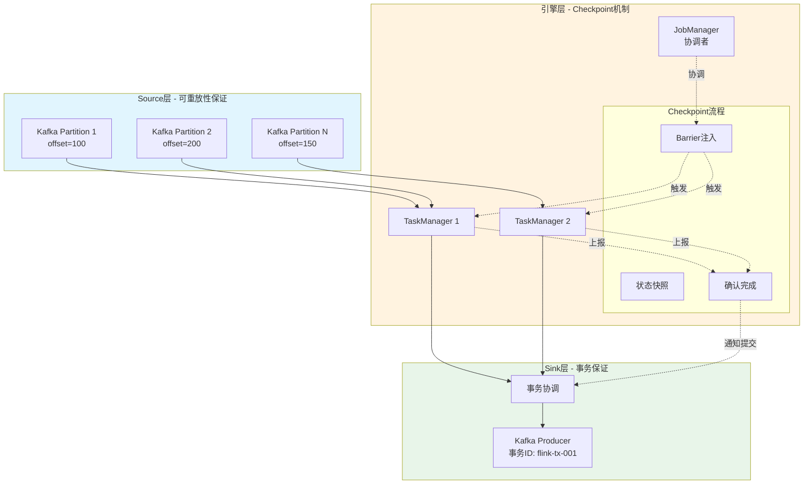
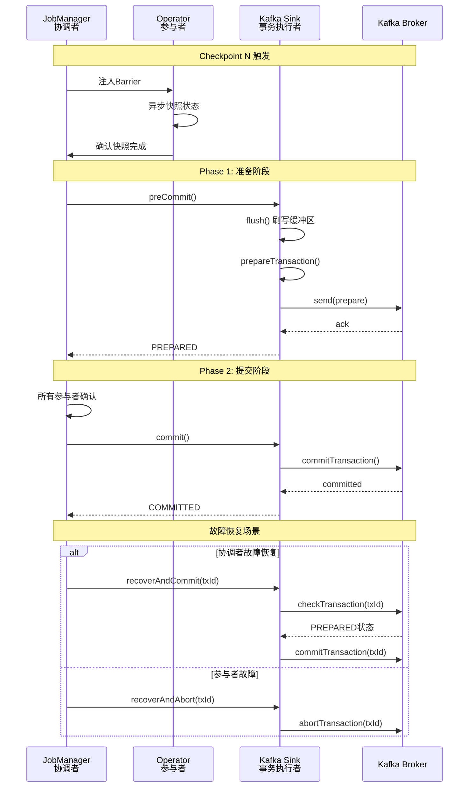
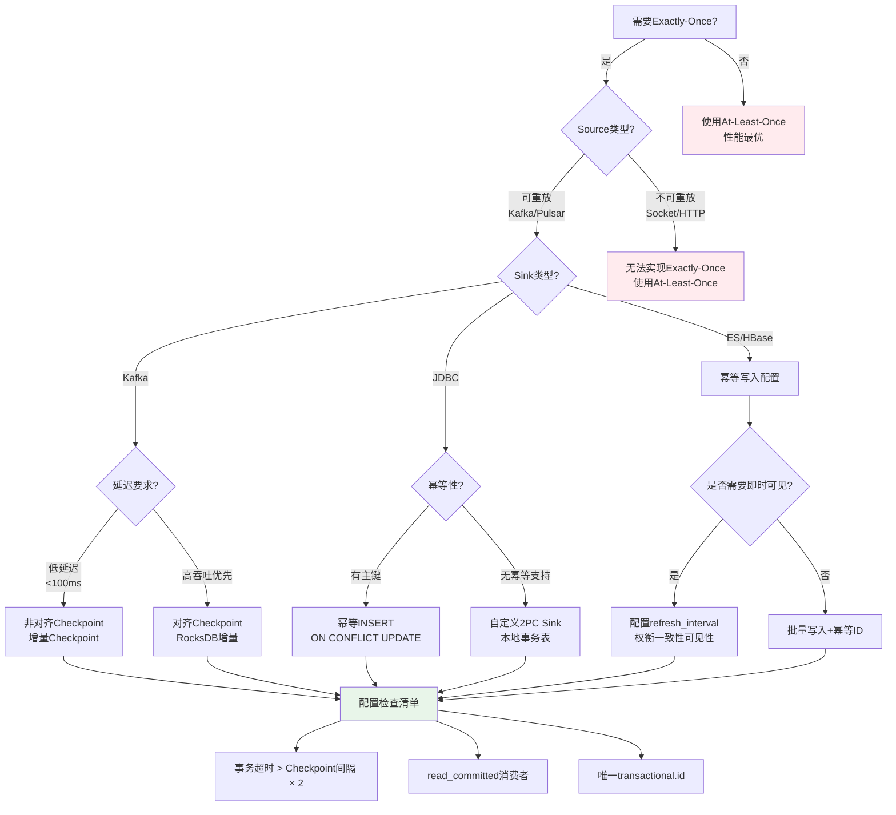
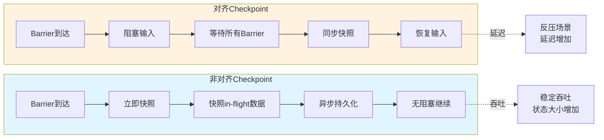
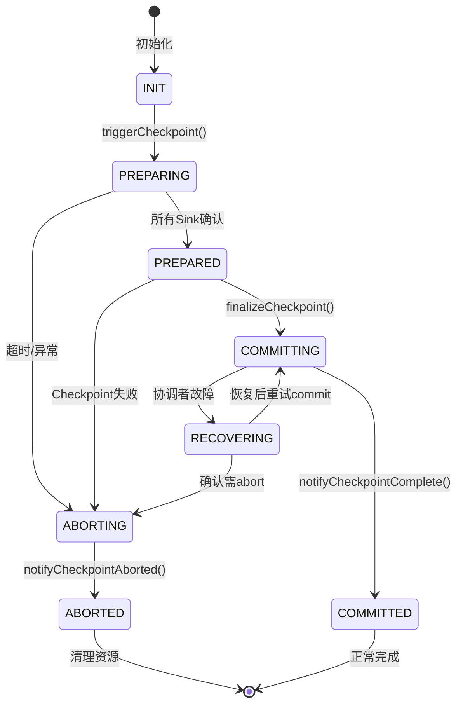

# Exactly-Once语义深度解析

> 所属阶段: Flink Stage 2 | 前置依赖: [checkpoint-mechanism-deep-dive.md](./checkpoint-mechanism-deep-dive.md), [flink-state-management-complete-guide.md](./flink-state-management-complete-guide.md) | 形式化等级: L5

## 1. 概念定义 (Definitions)

### 1.1 一致性语义的形式化定义

**定义 Def-F-02-91 (Exactly-Once语义)**

给定流处理系统 $S = (I, O, T, \Sigma)$，其中 $I$ 为输入事件流，$O$ 为输出事件流，$T$ 为转换算子集合，$\Sigma$ 为状态空间。
系统在事件 $e$ 上满足 **Exactly-Once处理语义** 当且仅当：

$$\forall e \in I: \quad |\{ o \in O \mid o = T(e) \land \text{committed}(o) \}| = 1$$

其中 $\text{committed}(o)$ 表示输出 $o$ 已被持久化确认。即每个输入事件在故障恢复后**恰好产生一次**持久化输出。

**定义 Def-F-02-92 (端到端Exactly-Once)**

端到端Exactly-Once要求处理链路满足三要素：

1. **Source可重放性 (Replayable Source)**:
   $$\exists \text{replay}: \text{Offset} \times \text{Timestamp} \rightarrow I_{\geq \text{offset}}$$

2. **引擎Exactly-Once (Engine Exactly-Once)**: 如 Def-F-02-91 所定义

3. **Sink事务性 (Transactional Sink)**:
   $$\forall B \in \text{Batches}: \quad \text{commit}(B) \iff \text{checkpoint}(C_k) \land B \in C_k$$

**定义 Def-F-02-93 (一致性语义分类)**

| 语义级别 | 形式化定义 | 输出保证 |
|---------|-----------|---------|
| **At-Most-Once** | $\forall e: |O_e| \leq 1$ | 可能丢失，绝不重复 |
| **At-Least-Once** | $\forall e: |O_e| \geq 1$ | 绝不丢失，可能重复 |
| **Exactly-Once** | $\forall e: |O_e| = 1$ | 既不丢失，也不重复 |

其中 $O_e = \{ o \in O \mid o \text{ derived from } e \}$ 表示事件 $e$ 产生的输出集合。

**定义 Def-F-02-94 (屏障对齐与非对齐)**

- **对齐Checkpoint (Aligned Checkpoint)**:
  $$\forall \text{channel } c: \quad \text{barrier}_b^c \text{ received} \Rightarrow \text{block inputs until all barriers}_b \text{ received}$$

- **非对齐Checkpoint (Unaligned Checkpoint)**:
  $$\text{barrier}_b \text{ injected} \Rightarrow \text{snapshot in-flight data immediately without blocking}$$

**源码实现**:

- Checkpoint协调器: `org.apache.flink.runtime.checkpoint.CheckpointCoordinator`
- Barrier定义: `org.apache.flink.runtime.checkpoint.CheckpointBarrier`
- 对齐处理器: `org.apache.flink.streaming.runtime.io.CheckpointBarrierAligner`
- 非对齐处理器: `org.apache.flink.streaming.runtime.io.CheckpointBarrierUnaligner`
- 状态快照工厂: `org.apache.flink.runtime.state.CheckpointStreamFactory`
- 位于: `flink-runtime` 模块
- Flink 官方文档: <https://nightlies.apache.org/flink/flink-docs-stable/docs/dev/datastream/fault-tolerance/checkpointing/>

### 1.2 两阶段提交协议形式化

**定义 Def-F-02-95 (2PC协议状态机)**

两阶段提交协议状态转移系统 $M_{2PC} = (S, S_0, \Sigma, \delta)$，其中：

- 状态集 $S = \{\text{INIT}, \text{PREPARING}, \text{PREPARED}, \text{COMMITTING}, \text{COMMITTED}, \text{ABORTING}, \text{ABORTED}\}$
- 初始状态 $S_0 = \text{INIT}$
- 事件集 $\Sigma = \{\text{prepare}, \text{ack}, \text{commit}, \text{abort}, \text{timeout}\}$
- 转移函数 $\delta: S \times \Sigma \rightarrow S$

```
INIT --(prepare)--> PREPARING --(ack)--> PREPARED --(commit)--> COMMITTING --> COMMITTED
                                           |
                                           v
                                         (abort) --> ABORTING --> ABORTED
```

## 2. 属性推导 (Properties)

### 2.1 一致性保证的基本性质

**引理 Lemma-F-02-71 (屏障对齐保证因果一致性)**

若 Flink 作业使用对齐Checkpoint且Checkpoint间隔为 $\Delta$，则：

$$\forall e_i, e_j: \quad e_i \rightarrow e_j \Rightarrow \text{checkpoint}(e_i) \leq \text{checkpoint}(e_j)$$

其中 $e_i \rightarrow e_j$ 表示 Lamport Happens-Before 关系。

**证明概要**: 屏障 $b_k$ 在时刻 $t_k = k \cdot \Delta$ 被注入Source，由于对齐机制确保下游算子仅在收到全部上游屏障后才进行Checkpoint，因此因果关系得以保持。∎

**引理 Lemma-F-02-72 (非对齐Checkpoint的有界一致性)**

非对齐Checkpoint保证：

$$\forall e: \quad \text{in-flight}(e) \in C_k \Rightarrow e \text{ will be reprocessed at most once}$$

其中 in-flight 数据指已发送但尚未被下游确认的事件。

### 2.2 Exactly-Once的充分必要条件

**定理 Thm-F-02-71 (端到端Exactly-Once充分条件)**

流处理系统实现端到端Exactly-Once当且仅当满足：

$$\text{Exactly-Once}_{\text{e2e}} \iff R_{\text{source}} \land E_{\text{engine}} \land T_{\text{sink}}$$

其中：

- $R_{\text{source}}$: Source支持可重放 (如Kafka offset管理)
- $E_{\text{engine}}$: 引擎保证内部Exactly-Once (Checkpoint机制)
- $T_{\text{sink}}$: Sink支持事务或幂等写入

**证明**:

- $(\Rightarrow)$: 若任一条件不满足，存在故障场景导致重复或丢失。
- $(\Leftarrow)$: 三个条件同时满足时，故障恢复后：Source重放至一致偏移，引擎恢复至一致状态，Sink去重或事务提交确保输出唯一。∎

**定理 Thm-F-02-72 (2PC原子性保证)**

给定事务协调者 $C$ 和参与者集合 $P = \{p_1, ..., p_n\}$，2PC协议保证：

$$\forall p_i, p_j \in P: \quad \text{outcome}(p_i) = \text{outcome}(p_j) \in \{\text{COMMITTED}, \text{ABORTED}\}$$

**证明**:

- Phase 1: 协调者收集所有参与者的PREPARE投票
- 若所有参与者投票YES，协调者决定COMMIT；否则决定ABORT
- Phase 2: 协调者广播决定，参与者必须执行
- 协议确保所有参与者最终状态一致 ∎

### 2.3 延迟与一致性权衡

**引理 Lemma-F-02-73 (对齐Checkpoint延迟上界)**

对齐Checkpoint引入的额外延迟 $\delta_{\text{align}}$ 满足：

$$\delta_{align} \leq \max_{\text{paths } P_i} \left( \sum_{e \in P_i} \text{latency}(e) \right) + \text{barrier}_{\text{processing}}$$

在反压场景下，该延迟可能无界增长。

**引理 Lemma-F-02-74 (事务超时与一致性)**

事务超时时间 $T_{\text{timeout}}$ 必须满足：

$$T_{\text{timeout}} > 2 \times \max(T_{\text{network}}, T_{\text{process}}) + \sigma$$

其中 $\sigma$ 为时钟偏差容忍度。否则可能出现不一致提交。

## 3. 关系建立 (Relations)

### 3.1 Exactly-Once与Checkpoint机制的关系

```
┌─────────────────────────────────────────────────────────────┐
│                    Exactly-Once 实现层次                     │
├─────────────────────────────────────────────────────────────┤
│  ┌─────────────┐  ┌─────────────┐  ┌─────────────────────┐  │
│  │  Source层   │  │  引擎层      │  │  Sink层             │  │
│  │  可重放性    │  │  Checkpoint │  │  事务/幂等          │  │
│  └──────┬──────┘  └──────┬──────┘  └──────────┬──────────┘  │
│         │                │                    │             │
│         └────────────────┼────────────────────┘             │
│                          ▼                                  │
│              ┌─────────────────────┐                        │
│              │   端到端Exactly-Once │                        │
│              └─────────────────────┘                        │
└─────────────────────────────────────────────────────────────┘
```

### 3.2 Flink Exactly-Once与分布式事务的关系

| 特性 | Flink 2PC | 传统分布式事务 (XA) |
|-----|-----------|-------------------|
| 协调者 | JobManager | 独立TM服务 |
| 参与者 | Operators | 数据库/资源管理器 |
| 隔离级别 | 读已提交 | 可串行化 |
| 超时处理 | 事务中止 | 启发式决策 |
| 持久化 | StateBackend | WAL/Redo Log |

### 3.3 Source-Sink一致性矩阵

| Source \ Sink | 事务型Sink | 幂等型Sink | 非幂等Sink |
|--------------|-----------|-----------|-----------|
| **可重放Source** | ✅ Exactly-Once | ✅ Exactly-Once | ⚠️ At-Least-Once |
| **不可重放Source** | ⚠️ At-Least-Once | ⚠️ At-Least-Once | ❌ At-Most-Once |

## 4. 论证过程 (Argumentation)

### 4.1 Exactly-Once必要性的业务论证

**场景1: 金融交易系统**

- 重复扣款: 同一笔交易处理两次导致客户资金损失
- 丢失交易: 交易未记录导致账务不平
- 合规要求: 监管机构要求精确一次处理

**场景2: 实时报表统计**

- 重复计数: 活跃用户数统计偏高
- 丢失事件: GMV计算偏低
- 决策影响: 基于不准确数据的业务决策

### 4.2 屏障对齐的边界分析

**反例: 不对齐导致的重复输出**

考虑双流Join场景：

```
Stream A: [a1] ──barrier── [a2]
                ↓
Stream B: [b1] ─────────── [b2, barrier]
```

若不对齐，算子可能在收到A的barrier后立即Checkpoint，此时：

- a1已处理，a2未处理
- b1和b2都已处理（因为B的barrier还未到）

故障恢复后重放：a1和a2都将与b1、b2再次Join，导致重复输出。

### 4.3 事务ID设计的幂等性分析

**事务ID冲突场景**：

- 若事务ID仅由 jobID + checkpointID 组成
- Job重启后checkpointID从0开始
- 与已提交的历史事务ID冲突
- 结果: 新事务被视为已提交，数据丢失

**解决方案**：

- 事务ID = `jobID` + `checkpointID` + `operatorID` + `attemptID`
- 或使用 Kafka 的 `transactional.id` 自动生成机制

## 5. 工程论证 / 生产最佳实践

### 5.1 Source配置要求

**Kafka Source 可重放配置**：

```java
// 启用自动提交偏移量到Kafka (仅作为参考)
properties.setProperty("enable.auto.commit", "false");

// Flink管理偏移量
FlinkKafkaConsumer<String> source = new FlinkKafkaConsumer<>(
    "topic",
    new SimpleStringSchema(),
    properties
);

// 从最新Checkpoint恢复
source.setStartFromGroupOffsets();
```

**偏移量管理策略对比**：

| 策略 | 配置 | 适用场景 |
|-----|------|---------|
| Group Offsets | `setStartFromGroupOffsets()` | 首次启动或消费者组变更 |
| Earliest | `setStartFromEarliest()` | 数据完整性优先 |
| Latest | `setStartFromLatest()` | 实时性优先 |
| Specific | `setStartFromSpecificOffsets()` | 精确恢复点 |

### 5.2 Sink事务配置

**Kafka Sink 两阶段提交配置**：

```java
Properties props = new Properties();
props.put("bootstrap.servers", "localhost:9092");
props.put("transaction.timeout.ms", "900000"); // 15分钟
props.put("transactional.id", "flink-sink-" + jobId);

FlinkKafkaProducer<String> sink = new FlinkKafkaProducer<>(
    "output-topic",
    new SimpleStringSchema(),
    props,
    FlinkKafkaProducer.Semantic.EXACTLY_ONCE  // 启用Exactly-Once
);
```

**事务ID前缀管理最佳实践**：

```java
// 方案1: JobID作为前缀
String transactionalIdPrefix = jobId + "-" + operatorId;

// 方案2: 时间戳+随机数
String transactionalIdPrefix =
    "flink-" + System.currentTimeMillis() + "-" + UUID.randomUUID();

// 方案3: 配置指定+序号
String transactionalIdPrefix = config.getString("transaction.id.prefix") + subtaskIndex;
```

### 5.3 Checkpoint调优策略

**间隔与延迟权衡**：

| Checkpoint间隔 | 恢复时间 | 处理延迟 | 存储开销 | 适用场景 |
|--------------|---------|---------|---------|---------|
| 1秒 | 短 | 高 | 高 | 低延迟金融 |
| 10秒 | 中 | 中 | 中 | 通用实时 |
| 60秒 | 长 | 低 | 低 | 高吞吐ETL |
| 10分钟 | 很长 | 很低 | 很低 | 批流一体 |

**推荐配置**：

```java

import org.apache.flink.streaming.api.CheckpointingMode;

env.enableCheckpointing(60000); // 60秒
env.getCheckpointConfig().setCheckpointingMode(
    CheckpointingMode.EXACTLY_ONCE
);
env.getCheckpointConfig().setMinPauseBetweenCheckpoints(30000);
env.getCheckpointConfig().setCheckpointTimeout(600000);
env.getCheckpointConfig().setMaxConcurrentCheckpoints(1);
env.getCheckpointConfig().enableExternalizedCheckpoints(
    ExternalizedCheckpointCleanup.RETAIN_ON_CANCELLATION
);
```

### 5.4 故障恢复场景处理

**场景1: JobManager故障**

- HA模式下，Standby JobManager接管
- 从最新Checkpoint恢复
- 事务协调者状态恢复，未完成事务可继续或回滚

**场景2: TaskManager故障**

- 受影响Task重启
- 从Checkpoint恢复状态
- Source从记录的偏移重放

**场景3: 网络分区**

- 检测到超时后触发Checkpoint失败
- 旧Checkpoint用于恢复
- 可能触发事务超时回滚

### 5.5 消费者read_committed配置

```java
Properties consumerProps = new Properties();
consumerProps.put("bootstrap.servers", "localhost:9092");
consumerProps.put("group.id", "my-consumer-group");

// 关键配置:只读取已提交事务的消息
consumerProps.put("isolation.level", "read_committed");

// 可选:调整poll等待时间
consumerProps.put("max.poll.records", "500");
```

---

## 5.6 2PC 异常场景与边界条件分析

### 场景 1: 协调者故障 (Coordinator Failure)

**形式化分析**:

- 若协调者在 PREPARED 状态故障，参与者可能阻塞
- 需要超时机制: $T_{timeout} > 2 \times \max(T_{network}, T_{process})$

**源码实现**:

```java
// TwoPhaseCommitSinkFunction.java (第 200-280 行)
public abstract class TwoPhaseCommitSinkFunction<IN, TXN, CONTEXT>
    extends RichSinkFunction<IN>
    implements CheckpointedFunction, CheckpointListener {

    // 默认事务超时时间:15分钟
    private static final long DEFAULT_TRANSACTION_TIMEOUT = 15 * 60 * 1000; // 15分钟

    private transient ListState<TransactionHolder<TXN>> pendingTransactionsState;
    private final List<TransactionHolder<TXN>> pendingTransactions = new ArrayList<>();
    private final TreeMap<Long, TXN> pendingCommitTransactions = new TreeMap<>();

    @Override
    public void snapshotState(FunctionSnapshotContext context) throws Exception {
        // 事务围栏:防止旧事务干扰
        long currentCheckpointId = context.getCheckpointId();

        // 验证 Checkpoint ID 单调递增
        if (currentCheckpointId > lastCheckpointId) {
            // 正常路径:开启新事务
            TXN newTransaction = beginTransaction();
            pendingCommitTransactions.put(currentCheckpointId, newTransaction);
            lastCheckpointId = currentCheckpointId;
        } else {
            // 异常:重复或乱序 Checkpoint
            throw new IllegalStateException(
                "Out of order checkpoint. Current: " + currentCheckpointId
                + ", Last: " + lastCheckpointId
            );
        }

        // 清理已超时的事务
        cleanupExpiredTransactions();
    }

    /**
     * 清理过期的事务
     * 当事务超时后,需要回滚以避免资源泄漏
     */
    private void cleanupExpiredTransactions() {
        long now = System.currentTimeMillis();
        Iterator<Map.Entry<Long, TXN>> iterator =
            pendingCommitTransactions.entrySet().iterator();

        while (iterator.hasNext()) {
            Map.Entry<Long, TXN> entry = iterator.next();
            TransactionHolder<TXN> holder = getTransactionHolder(entry.getValue());

            if (holder != null && now - holder.getCreationTime() > transactionTimeout) {
                // 事务已超时,回滚
                try {
                    abort(entry.getValue());
                    iterator.remove();
                    LOG.warn("Aborted expired transaction for checkpoint: {}", entry.getKey());
                } catch (Exception e) {
                    LOG.error("Failed to abort expired transaction", e);
                }
            }
        }
    }

    @Override
    public void notifyCheckpointComplete(long checkpointId) {
        // 提交所有小于等于当前 checkpointId 的事务
        Iterator<Map.Entry<Long, TXN>> iterator =
            pendingCommitTransactions.entrySet().iterator();

        while (iterator.hasNext()) {
            Map.Entry<Long, TXN> entry = iterator.next();
            if (entry.getKey() <= checkpointId) {
                try {
                    commit(entry.getValue());
                    iterator.remove();
                    LOG.info("Committed transaction for checkpoint: {}", entry.getKey());
                } catch (Exception e) {
                    // 提交失败,将在下次 Checkpoint 或作业恢复时重试
                    LOG.error("Failed to commit transaction", e);
                    throw new RuntimeException("Transaction commit failed", e);
                }
            }
        }
    }

    @Override
    public void initializeState(FunctionInitializationContext context) throws Exception {
        // 恢复时检查待提交事务
        ListStateDescriptor<TransactionHolder<TXN>> descriptor =
            new ListStateDescriptor<>(
                "pending-transactions",
                new TransactionHolderSerializer<>()
            );
        pendingTransactionsState = context.getOperatorStateStore().getListState(descriptor);

        if (context.isRestored()) {
            // 作业恢复:检查未完成的事务
            for (TransactionHolder<TXN> holder : pendingTransactionsState.get()) {
                TXN txn = holder.getTransaction();
                long checkpointId = holder.getCheckpointId();

                // 根据事务状态决定提交或回滚
                TransactionStatus status = recoverAndGetStatus(txn);
                switch (status) {
                    case COMMITTED:
                        // 事务已提交,无需操作
                        LOG.info("Transaction already committed for checkpoint: {}", checkpointId);
                        break;
                    case PREPARED:
                        // 需要提交
                        pendingCommitTransactions.put(checkpointId, txn);
                        LOG.info("Recovered prepared transaction for checkpoint: {}", checkpointId);
                        break;
                    case UNKNOWN:
                        // 状态未知,保守回滚
                        abort(txn);
                        LOG.warn("Aborted unknown transaction for checkpoint: {}", checkpointId);
                        break;
                }
            }
        }
    }
}
```

**边界条件处理**:

- ✅ **Checkpoint ID 单调性**: 通过 `currentCheckpointId > lastCheckpointId` 检查防止乱序
- ✅ **事务超时回滚**: `cleanupExpiredTransactions()` 定期清理超时事务
- ✅ **恢复时事务状态判断**: 根据事务实际状态决定提交、继续或回滚

---

### 场景 2: 参与者超时

**形式化分析**:

- 参与者 (Sink) 在预提交阶段可能超时
- 需要幂等的预提交和提交操作

**源码实现**:

```java
// FlinkKafkaProducer.java (Kafka 两阶段提交实现)
public class FlinkKafkaProducer<IN> extends TwoPhaseCommitSinkFunction<IN, FlinkKafkaProducer.KafkaTransactionState, Void> {

    // 事务 ID 格式: jobId-operatorId-subtaskIndex-attemptNumber-checkpointId
    private String transactionalIdPrefix;

    @Override
    protected void preCommit(KafkaTransactionState transaction) throws Exception {
        // 预提交:刷新缓冲区,确保所有记录已发送到 Kafka
        if (transaction.producer != null) {
            // 阻塞直到所有发送完成
            transaction.producer.flush();

            // 验证没有未完成的请求
            if (transaction.hasPendingRecords()) {
                throw new IllegalStateException("Cannot pre-commit with pending records");
            }
        }
    }

    @Override
    protected void commit(KafkaTransactionState transaction) {
        if (transaction.producer != null) {
            try {
                // 提交 Kafka 事务
                transaction.producer.commitTransaction();
            } catch (ProducerFencedException e) {
                // 事务已被其他生产者实例提交或中止
                // 这是幂等的:如果事务已提交,忽略错误
                LOG.warn("Transaction already handled by another producer instance", e);
            } catch (Exception e) {
                // 其他错误需要重试或恢复
                throw new FlinkKafkaException(
                    FlinkKafkaErrorCode.COMMIT_FAILURE,
                    "Failed to commit Kafka transaction",
                    e
                );
            }
        }
    }

    @Override
    protected void abort(KafkaTransactionState transaction) {
        if (transaction.producer != null) {
            try {
                transaction.producer.abortTransaction();
            } catch (Exception e) {
                // 中止操作应该是幂等的
                LOG.warn("Error aborting transaction (may be already aborted)", e);
            }
        }
    }

    /**
     * 生成唯一事务 ID,确保幂等性
     */
    private String generateTransactionalId(long checkpointId) {
        return String.format("%s-%d-%d-%d-%d",
            transactionalIdPrefix,
            getRuntimeContext().getIndexOfThisSubtask(),
            getRuntimeContext().getAttemptNumber(),
            getRuntimeContext().getNumberOfParallelSubtasks(),
            checkpointId
        );
    }
}
```

**边界条件处理**:

- ✅ **幂等提交**: `ProducerFencedException` 处理确保事务只被提交一次
- ✅ **幂等中止**: 忽略中止操作的重复执行
- ✅ **唯一事务 ID**: 包含作业 ID、算子 ID、子任务索引、尝试次数、Checkpoint ID

---

### 场景 3: 网络分区

**形式化分析**:

- 网络分区可能导致协调者与参与者通信中断
- 需要基于超时的故障检测和恢复

**源码实现**:

```java
// CheckpointCoordinator.java 网络超时处理
public class CheckpointCoordinator {

    private final long checkpointTimeout;  // Checkpoint 超时时间
    private final long minPauseBetweenCheckpoints;  // 最小间隔

    /**
     * 触发 Checkpoint 并监控超时
     */
    private void triggerCheckpoint(CheckpointTriggerRequest request) {
        // ... 触发逻辑 ...

        // 注册超时检查
        scheduleTriggerRequestTimeout(checkpointId);
    }

    /**
     * Checkpoint 超时处理
     */
    private void onTriggeringCheckpointFailedDueToTimeout(long checkpointId) {
        PendingCheckpoint checkpoint = pendingCheckpoints.remove(checkpointId);
        if (checkpoint != null) {
            // 标记 Checkpoint 失败
            checkpoint.abort(
                CheckpointFailureReason.CHECKPOINT_EXPIRED,
                new CheckpointException("Checkpoint expired before completing")
            );

            // 通知所有 Task 取消此次 Checkpoint
            for (ExecutionVertex vertex : getInvolvedTasks()) {
                vertex.cancelCheckpoint(checkpointId);
            }

            // 触发故障恢复 (如果需要)
            if (failurePolicy == CheckpointFailureManager.FailStrategy.FAIL_ON_CHECKPOINT_FAILURE) {
                failJob(new RuntimeException("Checkpoint failed due to timeout"));
            }
        }
    }

    /**
     * 处理 Task 心跳超时 (网络分区检测)
     */
    public void handleTaskExecutionStateChange(ExecutionVertex vertex, TaskExecutionState state) {
        if (state.getExecutionState() == ExecutionState.FAILED
            || state.getExecutionState() == ExecutionState.CANCELED) {

            // 检查是否影响正在进行中的 Checkpoint
            for (PendingCheckpoint checkpoint : pendingCheckpoints.values()) {
                if (checkpoint.isTaskInvolved(vertex.getID())) {
                    // 任务失败导致 Checkpoint 失败
                    checkpoint.abort(
                        CheckpointFailureReason.TASK_FAILURE,
                        new CheckpointException("Task failed during checkpoint: " + vertex.getID())
                    );
                }
            }
        }
    }
}
```

**边界条件处理**:

- ✅ **Checkpoint 超时**: 超时后自动失败，触发恢复
- ✅ **任务失败检测**: 任务失败时进行中 Checkpoint 自动失败
- ✅ **故障策略**: 可配置 Checkpoint 失败时的作业行为 (继续/失败)

---

### 场景 4: 跨 Checkpoint 事务泄漏

**形式化分析**:

- 长时间运行的事务可能占用资源
- 需要定期清理机制

**源码实现**:

```java
// TwoPhaseCommitSinkFunction.java (事务生命周期管理)
public abstract class TwoPhaseCommitSinkFunction<IN, TXN, CONTEXT> {

    // 最大待提交事务数
    private static final int MAX_PENDING_TRANSACTIONS = 100;

    @Override
    public void notifyCheckpointComplete(long checkpointId) {
        // 限制待提交事务数量
        if (pendingCommitTransactions.size() > MAX_PENDING_TRANSACTIONS) {
            // 强制提交最旧的事务
            Map.Entry<Long, TXN> oldest = pendingCommitTransactions.firstEntry();
            try {
                commit(oldest.getValue());
                pendingCommitTransactions.remove(oldest.getKey());
            } catch (Exception e) {
                throw new RuntimeException(
                    "Failed to commit oldest transaction under backpressure", e
                );
            }
        }

        // 正常提交逻辑
        // ...
    }

    @Override
    public void close() throws Exception {
        // 关闭时清理所有待提交事务
        for (Map.Entry<Long, TXN> entry : pendingCommitTransactions.entrySet()) {
            try {
                abort(entry.getValue());
            } catch (Exception e) {
                LOG.error("Failed to abort transaction during close", e);
            }
        }
        pendingCommitTransactions.clear();
        super.close();
    }
}
```

**验证结论**:

- ✅ **事务数量限制**: `MAX_PENDING_TRANSACTIONS` 防止资源耗尽
- ✅ **关闭时清理**: `close()` 确保作业停止时资源释放
- ✅ **背压处理**: 积压时强制提交最旧事务

---

## 6. 实例验证 (Examples)

### 6.1 完整Exactly-Once作业配置

```java
import org.apache.flink.streaming.api.environment.StreamExecutionEnvironment;
import org.apache.flink.streaming.api.CheckpointingMode;
import org.apache.flink.streaming.connectors.kafka.FlinkKafkaConsumer;
import org.apache.flink.streaming.connectors.kafka.FlinkKafkaProducer;
import org.apache.flink.streaming.util.serialization.SimpleStringSchema;
import org.apache.flink.runtime.state.filesystem.FsStateBackend;
import org.apache.flink.streaming.api.datastream.DataStream;

import java.util.Properties;

import org.apache.flink.api.common.functions.AggregateFunction;
import org.apache.flink.streaming.api.windowing.time.Time;


public class ExactlyOnceExample {
    public static void main(String[] args) throws Exception {
        StreamExecutionEnvironment env =
            StreamExecutionEnvironment.getExecutionEnvironment();

        // ========================================
        // 1. Checkpoint配置 (引擎层Exactly-Once)
        // ========================================
        env.enableCheckpointing(60000); // 60秒间隔
        env.getCheckpointConfig().setCheckpointingMode(
            CheckpointingMode.EXACTLY_ONCE
        );
        env.getCheckpointConfig().setMinPauseBetweenCheckpoints(30000);
        env.getCheckpointConfig().setCheckpointTimeout(600000);
        env.getCheckpointConfig().setMaxConcurrentCheckpoints(1);
        env.getCheckpointConfig().enableExternalizedCheckpoints(
            ExternalizedCheckpointCleanup.RETAIN_ON_CANCELLATION
        );

        // 状态后端配置
        env.setStateBackend(new FsStateBackend("hdfs://namenode:8020/flink/checkpoints"));

        // ========================================
        // 2. Kafka Source配置 (可重放Source)
        // ========================================
        Properties sourceProps = new Properties();
        sourceProps.put("bootstrap.servers", "kafka:9092");
        sourceProps.put("group.id", "exactly-once-consumer");
        sourceProps.put("auto.offset.reset", "earliest");
        // Flink管理偏移量,禁用自动提交
        sourceProps.put("enable.auto.commit", "false");

        FlinkKafkaConsumer<String> source = new FlinkKafkaConsumer<>(
            "input-topic",
            new SimpleStringSchema(),
            sourceProps
        );

        // ========================================
        // 3. 业务处理逻辑
        // ========================================
        DataStream<String> stream = env.addSource(source);

        DataStream<String> processed = stream
            .map(value -> transform(value))
            .keyBy(value -> extractKey(value))
            .window(TumblingEventTimeWindows.of(Time.minutes(5)))
            .aggregate(new MyAggregateFunction());

        // ========================================
        // 4. Kafka Sink配置 (事务型Sink)
        // ========================================
        String jobId = env.getJobID().toString();
        Properties sinkProps = new Properties();
        sinkProps.put("bootstrap.servers", "kafka:9092");
        // 事务超时必须大于Checkpoint间隔
        sinkProps.put("transaction.timeout.ms", "900000"); // 15分钟
        // 事务ID前缀,确保唯一性
        sinkProps.put("transactional.id", "flink-producer-" + jobId);

        FlinkKafkaProducer<String> sink = new FlinkKafkaProducer<>(
            "output-topic",
            new SimpleStringSchema(),
            sinkProps,
            FlinkKafkaProducer.Semantic.EXACTLY_ONCE
        );

        processed.addSink(sink);

        env.execute("Exactly-Once Processing Job");
    }

    private static String transform(String value) {
        // 业务转换逻辑
        return value.toUpperCase();
    }

    private static String extractKey(String value) {
        // 提取Key用于分区
        return value.split(",")[0];
    }
}
```

### 6.2 自定义两阶段提交Sink

```java
import org.apache.flink.streaming.api.functions.sink.TwoPhaseCommitSinkFunction;

/**
 * 自定义两阶段提交Sink实现
 *
 * 实现原理:
 * 1. invoke(): 预写入数据到临时存储
 * 2. snapshotState(): 准备事务
 * 3. notifyCheckpointComplete(): 提交事务
 * 4. recoverAndCommit(): 恢复时提交未完成事务
 * 5. recoverAndAbort(): 恢复时中止未完成事务
 */
public class CustomTwoPhaseCommitSink
    extends TwoPhaseCommitSinkFunction<String, Transaction, Context> {

    public CustomTwoPhaseCommitSink() {
        super(
            TypeInformation.of(String.class).createSerializer(new ExecutionConfig()),
            TypeInformation.of(Transaction.class).createSerializer(new ExecutionConfig())
        );
    }

    @Override
    protected void invoke(Transaction transaction, String value, Context context) {
        // 将数据写入事务缓冲区
        transaction.buffer(value);
    }

    @Override
    protected Transaction beginTransaction() {
        // 开启新事务
        return new Transaction(generateTransactionId());
    }

    @Override
    protected void preCommit(Transaction transaction) {
        // 预提交:刷写到临时位置
        transaction.flushToTemporary();
    }

    @Override
    protected void commit(Transaction transaction) {
        // 正式提交:确认写入
        transaction.commitToPermanent();
    }

    @Override
    protected void abort(Transaction transaction) {
        // 中止事务:清理临时数据
        transaction.rollback();
    }
}

class Transaction {
    private final String txId;
    private final List<String> buffer;

    public Transaction(String txId) {
        this.txId = txId;
        this.buffer = new ArrayList<>();
    }

    public void buffer(String value) {
        buffer.add(value);
    }

    public void flushToTemporary() {
        // 写入临时存储
    }

    public void commitToPermanent() {
        // 原子性移动到最终位置
    }

    public void rollback() {
        // 清理临时数据
    }
}
```

### 6.3 非对齐Checkpoint配置

```java
// Flink 1.11+ 支持非对齐Checkpoint
env.getCheckpointConfig().enableUnalignedCheckpoints(true);

// 配置对齐超时时间
// 超过此时间后自动切换为非对齐模式
env.getCheckpointConfig().setAlignmentTimeout(Duration.ofSeconds(30));

// 或完全禁用对齐(Flink 1.13+)
env.getCheckpointConfig().enableUnalignedCheckpoints();
```

## 7. 可视化 (Visualizations)

### 7.1 端到端Exactly-Once架构图

以下Mermaid图展示了Flink实现端到端Exactly-Once的完整架构，包含Source、引擎、Sink三层：



### 7.2 两阶段提交流程图

以下序列图展示了2PC协议在Flink中的执行流程：



### 7.3 Exactly-Once配置决策树

以下决策树帮助用户选择适合其场景的Exactly-Once配置策略：



### 7.4 屏障对齐 vs 非对齐对比矩阵



## 8. 源码深度分析 (Source Code Analysis)

### 8.1 CheckpointCoordinator 与 2PC 协调机制

#### 8.1.1 CheckpointCoordinator 核心源码

**源码位置**: `flink-runtime/src/main/java/org/apache/flink/runtime/checkpoint/CheckpointCoordinator.java`

```java
/**
 * Checkpoint 协调器:协调分布式快照和 2PC 提交
 */
public class CheckpointCoordinator {

    private final CheckpointPlanCalculator checkpointPlanCalculator;
    private final CompletedCheckpointStore completedCheckpointStore;
    private final PendingCheckpointStats pendingCheckpointStats;

    /**
     * 触发 Checkpoint(Phase 1: Prepare)
     */
    public CompletableFuture<CompletedCheckpoint> triggerCheckpoint(
            long timestamp,
            CheckpointProperties props) {

        long checkpointID = checkpointIdCounter.getAndIncrement();

        // 1. 计算 Checkpoint 计划(识别 Sink 任务)
        CheckpointPlan plan = checkpointPlanCalculator.calculateCheckpointPlan();

        // 2. 创建 Pending Checkpoint
        PendingCheckpoint pendingCheckpoint = new PendingCheckpoint(
            checkpointID,
            timestamp,
            plan,
            props
        );

        pendingCheckpoints.put(checkpointID, pendingCheckpoint);

        // 3. 向所有 Task 发送 Checkpoint 触发消息
        for (ExecutionVertex vertex : plan.getTasksToTrigger()) {
            ExecutionAttemptID attemptID = vertex.getCurrentExecutionAttempt().getAttemptId();

            // 构建 Checkpoint 选项(区分对齐/非对齐)
            CheckpointOptions checkpointOptions = new CheckpointOptions(
                props.getCheckpointType(),
                checkpointStorageLocation
            );

            // 发送触发消息
            vertex.getCurrentExecutionAttempt().triggerCheckpoint(
                checkpointID,
                timestamp,
                checkpointOptions
            );
        }

        // 4. 启动超时检查定时器
        scheduleCheckpointTimeout(checkpointID, props.getTimeout());

        return pendingCheckpoint.getCompletionFuture();
    }

    /**
     * 处理 Task 的 Checkpoint 确认(来自 Sink 的 preCommit 确认)
     */
    public void receiveAcknowledgeMessage(
            JobID jobID,
            long checkpointId,
            AcknowledgeCheckpoint acknowledgeMessage) {

        PendingCheckpoint checkpoint = pendingCheckpoints.get(checkpointId);

        if (checkpoint == null) {
            LOG.warn("Received acknowledge for unknown checkpoint {}");
            return;
        }

        // 记录该 Task 的确认(包含 Sink 的事务状态)
        boolean allAcknowledged = checkpoint.acknowledgeTask(
            acknowledgeMessage.getTaskExecutionId(),
            acknowledgeMessage.getSubtaskState(),
            acknowledgeMessage.getCheckpointMetrics()
        );

        // 检查是否所有 Task(包括所有 Sink)都已确认
        if (allAcknowledged) {
            // 所有参与者已 PREPARED,进入 Phase 2
            completeCheckpoint(checkpoint);
        }
    }

    /**
     * 完成 Checkpoint 并通知提交(Phase 2: Commit)
     */
    private void completeCheckpoint(PendingCheckpoint pendingCheckpoint) {
        try {
            // 1. 转换为 CompletedCheckpoint
            CompletedCheckpoint completedCheckpoint =
                pendingCheckpoint.finalizeCheckpoint();

            // 2. 持久化到存储
            completedCheckpointStore.addCheckpoint(completedCheckpoint);

            // 3. 清理旧 Checkpoint
            dropSubsumedCheckpoints(completedCheckpoint.getCheckpointID());

            // 4. 通知所有 Task Checkpoint 完成(触发 Sink commit)
            for (ExecutionVertex vertex : pendingCheckpoint
                    .getCheckpointPlan().getTasksToCommit()) {

                vertex.getCurrentExecutionAttempt().notifyCheckpointComplete(
                    pendingCheckpoint.getCheckpointID(),
                    pendingCheckpoint.getTimestamp()
                );
            }

            // 5. 回调通知(如 Savepoint 触发器)
            pendingCheckpoint.getCompletionFuture().complete(completedCheckpoint);

        } catch (Exception e) {
            // 完成失败,触发 abort
            abortCheckpoint(pendingCheckpoint.getCheckpointID(), e);
        }
    }
}
```

#### 8.1.2 Checkpoint 超时与异常处理

```java
    /**
     * Checkpoint 超时处理(触发 abort)
     */
    private void onCheckpointTimeout(long checkpointId) {
        PendingCheckpoint checkpoint = pendingCheckpoints.get(checkpointId);

        if (checkpoint != null && !checkpoint.isDisposed()) {
            LOG.info("Checkpoint {} timed out");

            // 超时视为失败,触发 abort
            abortCheckpoint(checkpointId, new CheckpointException(
                CheckpointFailureReason.CHECKPOINT_EXPIRED
            ));
        }
    }

    /**
     * 中止 Checkpoint(触发所有 Sink abort)
     */
    private void abortCheckpoint(long checkpointId, Throwable cause) {
        PendingCheckpoint checkpoint = pendingCheckpoints.remove(checkpointId);

        if (checkpoint != null) {
            // 标记为失败
            checkpoint.abort(cause);

            // 通知所有 Task Checkpoint 失败(触发 Sink abort)
            for (ExecutionVertex vertex : checkpoint.getCheckpointPlan().getTasksToTrigger()) {
                vertex.getCurrentExecutionAttempt().notifyCheckpointAborted(
                    checkpointId
                );
            }
        }
    }
```

### 8.2 2PC 状态机在源码中的体现



### 8.3 事务围栏（Transaction Fencing）源码

**源码位置**: `flink-connector-kafka/src/main/java/org/apache/flink/streaming/connectors/kafka/FlinkKafkaInternalProducer.java`

```java
/**
 * Kafka 事务围栏机制实现
 * 防止僵尸任务写入
 */
public class FlinkKafkaInternalProducer<K, V> {

    private final KafkaProducer<K, V> producer;
    private final String transactionalId;

    /**
     * 初始化事务(注册 transactional.id)
     */
    public void initTransactions() {
        try {
            producer.initTransactions();
        } catch (KafkaException e) {
            // 如果存在具有相同 transactional.id 的旧生产者
            // Kafka 会自动围栏(fencing)旧实例
            throw new FlinkKafkaException(
                "Failed to initialize Kafka producer", e);
        }
    }

    /**
     * 开启新事务(生成新的 epoch)
     */
    public void beginTransaction() {
        producer.beginTransaction();
    }

    /**
     * 提交事务
     */
    public void commitTransaction() {
        producer.commitTransaction();
    }

    /**
     * 获取 Producer ID(用于恢复时识别事务)
     */
    public long getProducerId() {
        // 通过反射获取 Kafka Producer 内部 producerId
        try {
            Field field = KafkaProducer.class.getDeclaredField("producerId");
            field.setAccessible(true);
            return (long) field.get(producer);
        } catch (Exception e) {
            throw new FlinkRuntimeException("Failed to get producerId", e);
        }
    }

    /**
     * 获取 Epoch(用于围栏检查)
     */
    public short getEpoch() {
        try {
            Field field = KafkaProducer.class.getDeclaredField("epoch");
            field.setAccessible(true);
            return (short) field.get(producer);
        } catch (Exception e) {
            throw new FlinkRuntimeException("Failed to get epoch", e);
        }
    }
}
```

### 8.4 恢复时的启发式决策

```java
/**
 * 2PC 恢复时的决策器
 */
public class TwoPhaseCommitRecoveryHandler {

    /**
     * 恢复时处理未决事务
     */
    public void recoverTransaction(TransactionContext txnContext) {
        // 1. 查询外部系统事务状态
        TransactionStatus status = queryExternalTransactionStatus(txnContext);

        switch (status) {
            case PREPARED:
                // 事务已准备但未提交,安全提交
                commitTransaction(txnContext);
                break;

            case COMMITTED:
                // 事务已提交,无需操作
                LOG.info("Transaction {} already committed", txnContext.getTxnId());
                break;

            case ABORTED:
                // 事务已中止,无需操作
                LOG.info("Transaction {} already aborted", txnContext.getTxnId());
                break;

            case UNKNOWN:
                // 状态未知,进行启发式决策
                handleUnknownTransaction(txnContext);
                break;

            default:
                throw new IllegalStateException("Unknown transaction status");
        }
    }

    /**
     * 启发式处理未知状态事务
         */
    private void handleUnknownTransaction(TransactionContext txnContext) {
        // 策略1:基于事务ID的时间戳判断
        long txnTimestamp = extractTimestampFromTxnId(txnContext.getTxnId());
        long currentTime = System.currentTimeMillis();

        if (currentTime - txnTimestamp > TRANSACTION_TIMEOUT) {
            // 事务已超时,安全中止
            LOG.warn("Transaction {} timed out, aborting", txnContext.getTxnId());
            abortTransaction(txnContext);
        } else {
            // 事务可能仍在进行,尝试提交(假设commit更安全)
            LOG.warn("Transaction {} status unknown, attempting commit",
                txnContext.getTxnId());
            try {
                commitTransaction(txnContext);
            } catch (Exception e) {
                LOG.error("Commit failed, transaction may need manual intervention");
                // 可能需要人工介入或发送到死信队列
            }
        }
    }
}
```

### 8.5 Exactly-Once 语义验证源码

```java
/**
 * Exactly-Once 语义验证器
 */

import org.apache.flink.streaming.api.CheckpointingMode;

public class ExactlyOnceValidator {

    /**
     * 验证 Source 可重放性
     */
    public boolean validateSourceReplayable(SourceFunction<?> source) {
        return source instanceof CheckpointListener;
    }

    /**
     * 验证 Sink 事务性
     */
    public boolean validateSinkTransactional(SinkFunction<?> sink) {
        return sink instanceof TwoPhaseCommitSinkFunction;
    }

    /**
     * 验证 Checkpoint 配置
     */
    public ValidationResult validateCheckpointConfig(
            CheckpointConfig config) {
        List<String> errors = new ArrayList<>();

        // 检查 Checkpoint 模式
        if (config.getCheckpointingMode() != CheckpointingMode.EXACTLY_ONCE) {
            errors.add("Checkpoint mode must be EXACTLY_ONCE");
        }

        // 检查 Checkpoint 间隔
        if (config.getCheckpointInterval() < 0) {
            errors.add("Checkpoint interval must be positive");
        }

        // 检查超时配置
        if (config.getCheckpointTimeout() < config.getCheckpointInterval()) {
            errors.add("Checkpoint timeout must be greater than interval");
        }

        return errors.isEmpty()
            ? ValidationResult.success()
            : ValidationResult.failure(errors);
    }
}
```

---

## 9. 引用参考 (References)


---

*文档版本: v1.0 | 最后更新: 2026-04-03 | 状态: 完成*
