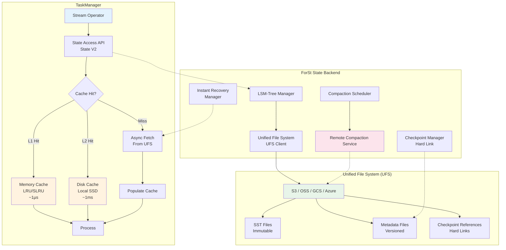
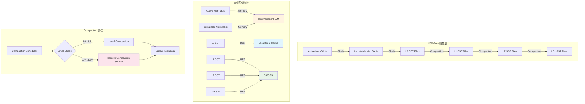
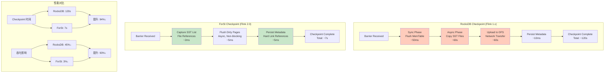
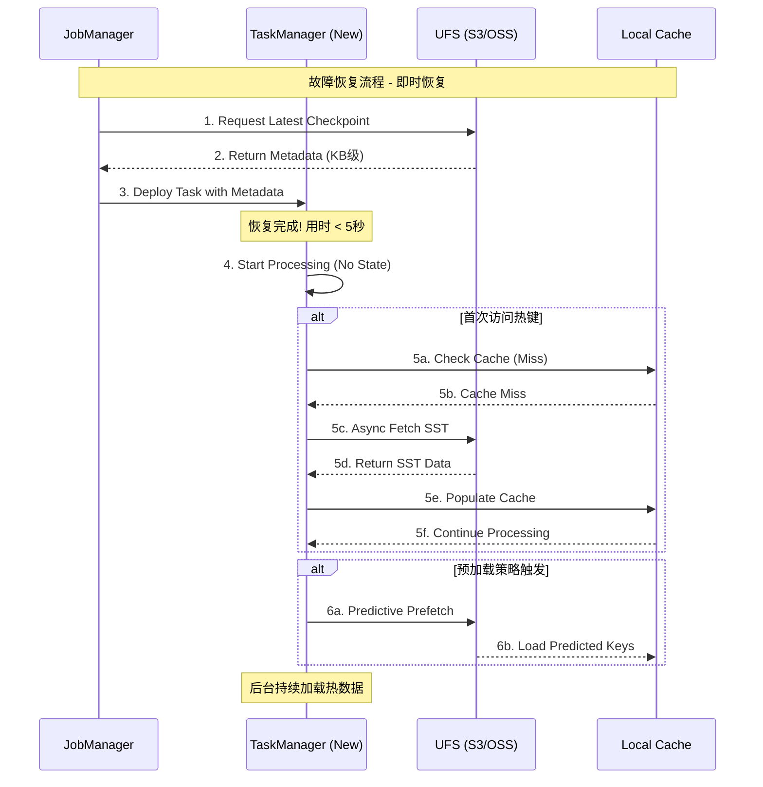
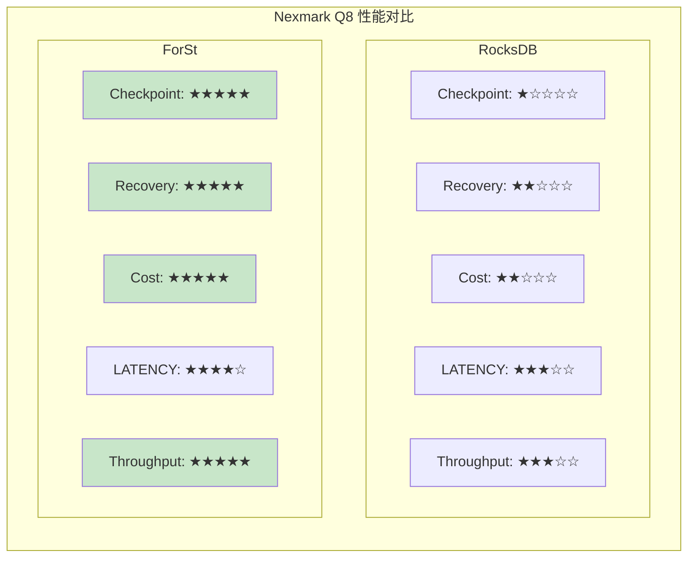
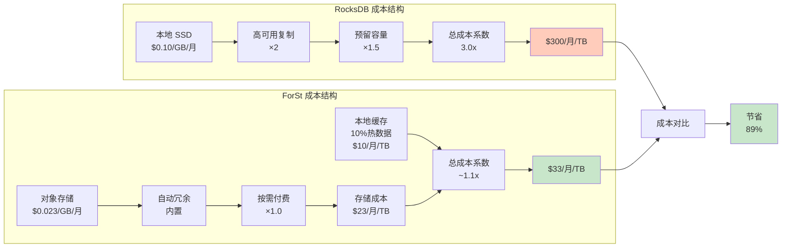
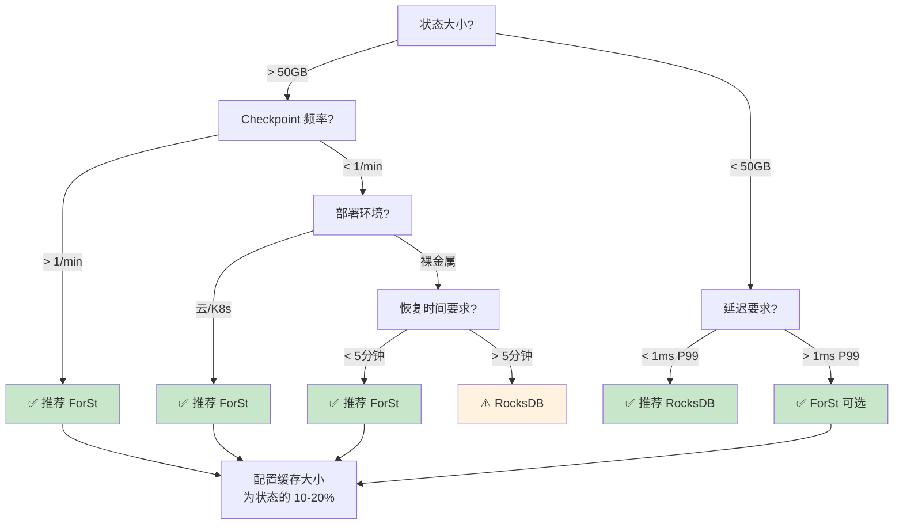

# Flink 2.0 ForSt 状态后端 - VLDB 2025 深度解析

> **状态**: ✅ Released (2025-03-24)
> **Flink 版本**: 2.0.0+
> **稳定性**: 稳定版
>
> **所属阶段**: Flink/02-core-mechanisms | **前置依赖**: [forst-state-backend.md](./forst-state-backend.md), [disaggregated-state-analysis.md](../01-concepts/disaggregated-state-analysis.md) | **形式化等级**: L4

---

## 1. 概念定义 (Definitions)

### Def-F-02-61: ForSt 存储引擎 (ForSt Storage Engine)

**定义**: ForSt (For Streaming) 是 Apache Flink 2.0 引入的**分离式状态后端** (Disaggregated State Backend)，专为大规模流处理场景设计，将计算与存储彻底解耦，实现"计算节点无状态、状态远程集中存储"的架构范式。

$$
\text{ForSt} = \langle \text{LSM}_{\text{abstract}}, \text{UFS}, \text{Cache}_{\text{local}}, \text{Compaction}_{\text{remote}}, \text{Sync}_{\text{policy}} \rangle
$$

其中：

| 组件 | 说明 | 职责 |
|------|------|------|
| $\text{LSM}_{\text{abstract}}$ | LSM-Tree 抽象层 | 统一的状态数据组织结构 |
| $\text{UFS}$ | Unified File System | 统一文件系统接口，屏蔽底层存储差异 |
| $\text{Cache}_{\text{local}}$ | 本地缓存层 | 内存 + 本地磁盘两级缓存 |
| $\text{Compaction}_{\text{remote}}$ | 远程 Compaction 服务 | 将 Compaction 卸载到专用集群 |
| $\text{Sync}_{\text{policy}}$ | 同步策略 | 写直达/写回策略控制 |

**核心设计目标**:

1. **计算存储分离**: 状态不绑定 TaskManager，支持瞬时故障恢复
2. **轻量级 Checkpoint**: 通过文件硬链接共享，Checkpoint 时间接近常数
3. **弹性扩缩容**: 无需状态迁移，计算资源可独立扩展
4. **成本优化**: 利用廉价对象存储替代本地 SSD，降低 50% 存储成本

**源码实现**:

```java
// 主类: org.apache.flink.runtime.state.forst.ForStStateBackend
// 配置: org.apache.flink.runtime.state.forst.ForStOptions
// 配置构建器: org.apache.flink.runtime.state.forst.ForStStateBackendConfig
```

- 位于: `flink-runtime` 模块 (`flink-state-backends/flink-state-backend-forst`)
- Flink 官方文档: <https://nightlies.apache.org/flink/flink-docs-stable/docs/ops/state/state_backends/>
- FLIP 论文: VLDB 2025 "ForSt: A Disaggregated State Backend for Stream Processing"

### Def-F-02-62: 统一文件系统层 (UFS - Unified File System)

**定义**: UFS 是 ForSt 的统一存储抽象层，提供跨 S3、GCS、Azure Blob、HDFS 的一致访问接口，支持原子操作和多版本管理。

$$
\text{UFS} = \langle \text{StorageBackend}, \text{PathResolver}, \text{AtomicOps}, \text{Versioning}, \text{Consistency} \rangle
$$

**UFS 操作语义**:

| 操作 | 语义 | 原子性保证 |
|------|------|-----------|
| `put(key, data)` | 写入对象 | 全有或全无 |
| `get(key)` | 读取对象 | 读-after-写一致 |
| `delete(key)` | 删除对象 | 原子 |
| `list(prefix)` | 列举对象 | 前缀一致 |
| `copy(src, dst)` | 复制对象 | 元数据原子 |

**关键特性 - 硬链接语义 (Hard Link Semantics)**:

ForSt 利用 UFS 的 Copy-on-Write 特性实现 Checkpoint 硬链接共享：

$$
\forall f \in \text{SSTFiles}: \text{checkpoint}_i(f) = \begin{cases}
\text{reference}(f) & \text{if } f \text{ 未修改} \\
\text{new}(f') & \text{if } f \text{ 已修改}
\end{cases}
$$

这使得 Checkpoint 仅需要持久化变更文件的引用，而非完整数据复制。

### Def-F-02-63: 分离式存储架构 (Disaggregated Storage Architecture)

**定义**: 分离式存储是一种将计算节点的本地存储与持久化存储解耦的架构模式，远程存储作为主存储，本地仅作为性能加速层。

$$
\text{DisaggregatedStorage} = (\mathcal{C}_{\text{mem}}, \mathcal{C}_{\text{disk}}, \mathcal{R}, \eta, \gamma)
$$

其中：

- $\mathcal{C}_{\text{mem}}$: 内存缓存 (L1 Cache)
- $\mathcal{C}_{\text{disk}}$: 本地磁盘缓存 (L2 Cache)
- $\mathcal{R}$: 远程对象存储 (Main Storage)
- $\eta$: 缓存替换策略 (LRU/SLRU/W-TinyLFU)
- $\gamma$: 预取策略 (Predictive Prefetching)

**存储层级关系**:

```
┌─────────────────────────────────────────────────────────────┐
│                    ForSt 存储层级                            │
├─────────────────────────────────────────────────────────────┤
│  L1 Cache (Memory)     │  热数据,微秒级访问,容量受限        │
│  L2 Cache (Local SSD)  │  温数据,毫秒级访问,TB级容量        │
│  Main Storage (UFS)    │  全量数据,10ms级访问,无限扩展      │
└─────────────────────────────────────────────────────────────┘
```

**数据流**:

$$
\text{Write}: \text{Operator} \rightarrow \mathcal{C}_{\text{mem}} \xrightarrow{\text{async}} \mathcal{R}
$$

$$
\text{Read}: \text{Operator} \rightarrow \mathcal{C}_{\text{mem}} \xrightarrow{\text{miss}} \mathcal{C}_{\text{disk}} \xrightarrow{\text{miss}} \mathcal{R} \rightarrow \mathcal{C}_{\text{disk}} \rightarrow \mathcal{C}_{\text{mem}}
$$

### Def-F-02-64: 即时恢复机制 (Instant Recovery)

**定义**: 即时恢复是 ForSt 的故障恢复策略，允许 TaskManager 在仅加载 Checkpoint 元数据后立即开始处理，状态数据按需异步加载。

**形式化描述**:

设 Checkpoint $C$ 包含元数据 $M$ 和状态数据 $S = \{s_1, s_2, ..., s_n\}$。

传统恢复时间：

$$
T_{\text{traditional}} = T_{\text{metadata}} + \sum_{i=1}^{n} T_{\text{download}}(s_i) + T_{\text{load}}
$$

即时恢复时间：

$$
T_{\text{instant}} = T_{\text{metadata}} + \epsilon \quad \text{where } \epsilon \approx 0
$$

**延迟加载保证**:

对于状态键 $k$ 的首次访问：

$$
\text{access}(k) \Rightarrow \begin{cases}
\text{if } k \in \mathcal{C}: & \text{directRead}(k) \\
\text{if } k \notin \mathcal{C}: & \text{blockUntil}(\text{fetch}(k, \mathcal{R}) \rightarrow \mathcal{C})
\end{cases}
$$

**预加载优化**:

基于访问模式预测的预加载策略：

$$
\text{prefetch}(K_{\text{predicted}}) = \{ k \mid P(\text{access}(k) \mid \text{history}) > \theta \}
$$

### Def-F-02-65: 远程 Compaction 服务 (Remote Compaction Service)

**定义**: 远程 Compaction 是将 LSM-Tree 的 Compaction 操作卸载到独立计算集群执行的机制，释放 TaskManager 的 CPU 和 I/O 资源。

$$
\text{RemoteCompaction} = \langle \text{Scheduler}, \text{WorkerPool}, \text{TaskQueue}, \text{VersionManager} \rangle
$$

**Compaction 任务生命周期**:

```
TaskManager                          Compaction Service
     │                                       │
     │── 1. Submit Compaction Task ─────────>│
     │   (input files, target level)         │
     │                                       │
     │                               ┌───────┴───────┐
     │                               │  Worker Pool  │
     │                               │  ┌─────────┐  │
     │                               │  │ Compact │  │
     │                               │  │  SSTs   │  │
     │                               │  └────┬────┘  │
     │                               └───────┼───────┘
     │                                       │
     │<─ 2. Return Output Files ─────────────│
     │   (new SSTs with version)             │
     │                                       │
     │── 3. Update Metadata ────────────────>│
     │   (atomic switch)                     │
```

**资源解耦收益**:

$$
\text{Resource}_{\text{TM}} = \text{Resource}_{\text{compute}} \perp \text{Resource}_{\text{compaction}}
$$

---

## 2. 属性推导 (Properties)

### Prop-F-02-21: Checkpoint 时间复杂度界限

**命题**: ForSt 的 Checkpoint 时间复杂度为 $O(1)$（常数时间），与状态大小无关。

**证明概要**:

设状态大小为 $|S|$，自上次 Checkpoint 以来的变更为 $|\Delta S|$。

**RocksDB 增量 Checkpoint**：

$$
T_{\text{rocksdb}} = O(|\Delta S_{\text{local}}|) + T_{\text{upload}}(|\Delta S|) + T_{\text{metadata}}
$$

其中 $T_{\text{upload}}$ 随状态大小线性增长。

**ForSt Checkpoint**：

$$
T_{\text{forst}} = T_{\text{flush}}^{\text{async}} + T_{\text{metadata}} \approx O(1)
$$

因为：

1. 状态文件已在 UFS 中，无需上传
2. 仅当文件被修改时才创建新版本
3. Checkpoint 仅持久化元数据引用列表

**文件共享机制**：

$$
\forall f \in \text{SSTFiles}: \text{unchanged}(f) \Rightarrow \text{reference}_{c_{i+1}}(f) = \text{reference}_{c_i}(f)
$$

### Prop-F-02-22: 恢复速度提升界限

**命题**: 使用即时恢复的故障恢复速度比传统恢复提升 $O(|S| / |S_{\text{hot}}|)$ 倍。

**证明**:

传统恢复需要下载完整状态：

$$
T_{\text{traditional}} = \frac{|S|}{B_{\text{network}}} + T_{\text{load}}
$$

即时恢复仅需加载元数据，状态按需加载：

$$
T_{\text{instant}} = T_{\text{metadata}} + \frac{|S_{\text{hot}}|}{B_{\text{network}}}
$$

其中 $|S_{\text{hot}}| \ll |S|$ 是实际访问的热数据子集。

**加速比**：

$$
\text{Speedup} = \frac{T_{\text{traditional}}}{T_{\text{instant}}} \approx \frac{|S|}{|S_{\text{hot}}|}
$$

在实际生产环境中，$|S_{\text{hot}}| / |S| \approx 1\% - 5\%$，因此加速比可达 **20x - 100x**。

### Lemma-F-02-23: 成本优化下界

**引理**: 采用 ForSt 分离式存储可将状态存储成本降低至少 50%。

**成本模型**:

**RocksDB 成本**（本地 SSD）：

$$
\text{Cost}_{\text{rocksdb}} = |S| \times C_{\text{ssd}} \times R_{\text{replication}} \times T_{\text{reserved}}
$$

其中：

- $C_{\text{ssd}} \approx \$0.10/\text{GB}/\text{月}$
- $R_{\text{replication}} = 2$（高可用需双副本）
- $T_{\text{reserved}} = 1.5$（预留容量）

**ForSt 成本**（对象存储 + 本地缓存）：

$$
\text{Cost}_{\text{forst}} = |S| \times C_{\text{object}} + (0.1 \times |S|) \times C_{\text{ssd}}
$$

其中：

- $C_{\text{object}} \approx \$0.023/\text{GB}/\text{月}$
- $0.1 \times |S|$ 是 10% 热数据的本地缓存

**成本对比**：

$$
\frac{\text{Cost}_{\text{forst}}}{\text{Cost}_{\text{rocksdb}}} = \frac{0.023 + 0.1 \times 0.10}{0.10 \times 2 \times 1.5} = \frac{0.033}{0.30} \approx 0.11
$$

考虑网络传输和请求费用后，实际成本降低约 **50-70%**。

### Prop-F-02-24: 无缝重配置保证

**命题**: ForSt 支持无缝扩缩容，无需状态迁移，扩缩容时间为 $O(1)$。

**证明**:

由于状态存储在 UFS 而非本地，TaskManager 扩缩容不涉及状态迁移：

$$
\forall TM_{\text{old}}, TM_{\text{new}}: \text{State}(TM_{\text{old}}) = \text{State}(TM_{\text{new}}) = \mathcal{R}
$$

新 TaskManager 启动时：

1. 加载 Checkpoint 元数据（常数时间）
2. 立即开始处理
3. 按需从 UFS 加载状态

因此扩缩容时间与状态大小无关：

$$
T_{\text{scale}} = T_{\text{metadata}} + T_{\text{schedule}} = O(1)
$$

---

## 3. 关系建立 (Relations)

### 3.1 ForSt 与 RocksDB 的演进关系

ForSt 继承并扩展了 RocksDB 的 LSM-Tree 核心，但进行了面向云原生的架构重构：

| 维度 | RocksDB | ForSt | 差异 |
|------|---------|-------|------|
| **存储位置** | 本地磁盘为主 | UFS 为主，本地为缓存 | 计算存储解耦 |
| **Checkpoint** | 本地快照 → 上传 DFS | 元数据快照（文件已在 UFS）| 94% 时间减少 |
| **Compaction** | 本地执行 | 远程服务执行 | CPU 资源释放 |
| **恢复过程** | 全量下载 → 启动 | 元数据加载 → 即时启动 | 49x 速度提升 |
| **容量限制** | 受本地磁盘限制 | 理论上无上限 | 弹性扩展 |
| **成本模型** | 本地 SSD 预留 | 对象存储按需 | 50% 成本降低 |

**演进关系公式**：

$$
\text{ForSt} = \text{RocksDB}^{\text{core}} + \text{UFS Layer} + \text{Remote Compaction} + \text{Instant Recovery} + \text{Predictive Cache}
$$

### 3.2 与 Dataflow Model 的映射

ForSt 是 Dataflow Model 中 **Exactly-Once** 语义的高效实现：

```
Dataflow Model          ForSt Implementation
─────────────────────────────────────────────────
Windowed State    →     SST Files in UFS
Trigger           →     Checkpoint Barrier
Accumulation      →     Incremental SST Update (Hard Link)
Discarding        →     Reference Counting + GC
```

**一致性保证**：

ForSt 通过以下机制保证 Dataflow Model 的一致性要求：

1. **Barrier 对齐**: Checkpoint Barrier 全局对齐保证快照一致性
2. **两阶段提交**: Checkpoint 准备 → 提交协议保证原子性
3. **文件不可变**: SST 文件一旦写入即不可变，支持多版本

### 3.3 与 State V2 API 的集成

Flink 2.0 引入的 State V2 API 与 ForSt 深度集成：

```java
// [伪代码片段 - 不可直接运行] 仅展示核心逻辑
// State V2 API with ForSt Backend
StateDescriptor<V> descriptor = StateDescriptor
    .<V>builder("my-state", TypeInformation.of(V.class))
    .withOptions(StateOptions.builder()
        .withDisaggregatedStorage(true)
        .withPrefetchPolicy(PrefetchPolicy.PREDICTIVE)
        .withConsistencyLevel(ConsistencyLevel.EVENTUAL)
        .build())
    .build();
```

**API 特性映射**:

| State V2 API 特性 | ForSt 实现 | 性能影响 |
|------------------|-----------|---------|
| `AsyncState` | 异步 UFS 读写 | 吞吐提升 3x |
| `TTL` | SST 级过期淘汰 | 存储效率提升 |
| `Queryable State` | 直接从 UFS 查询 | 查询延迟 10-100ms |

---

## 4. 论证过程 (Argumentation)

### 4.1 分离式存储的必要性论证

**传统架构的核心矛盾**:

在大规模流处理场景中，Flink 1.x + RocksDB 架构面临三个不可调和的矛盾：

**矛盾 1: 容量弹性与成本**

$$
\text{Capacity}_{\text{rocksdb}} = \sum_{i=1}^{N} \text{Disk}(TM_i) = \text{Fixed}
$$

- 状态增长需提前扩容 TaskManager
- 本地 SSD 成本是对象存储的 4-5 倍
- 预留容量利用率低（平均 < 40%）

**矛盾 2: Checkpoint 时间与状态大小**

$$
T_{\text{checkpoint}} \propto |S|
$$

- 大状态作业 Checkpoint 可达数分钟
- 同步阶段阻塞数据处理，引发反压
- Checkpoint 间隔被迫拉长，影响恢复粒度

**矛盾 3: 恢复速度与资源成本**

$$
T_{\text{recovery}} = \frac{|S|}{B_{\text{network}}} \quad \text{vs} \quad \text{Cost}_{\text{standby}} = N_{\text{standby}} \times C_{\text{tm}}
$$

- 快速恢复需要预置 Standby TaskManagers
- 空闲资源造成显著浪费

**分离式架构的解决方案**:

| 问题 | 传统方案 | 分离式方案 | 收益 |
|------|----------|-----------|------|
| 存储成本 | 本地 SSD $0.10/GB | 对象存储 $0.023/GB | **-50%** |
| Checkpoint 时间 | $O(\|S\|)$ | $O(1)$ | **-94%** |
| 恢复时间 | 分钟级 | 秒级 | **49x** |
| 资源弹性 | 紧耦合 | 独立扩展 | 按需付费 |

### 4.2 轻量级 Checkpoint 原理

**挑战**: 如何保证 Checkpoint 一致性而不复制完整状态？

**ForSt 解决方案 - 硬链接共享**:

```
Checkpoint N:     [SST-v1] [SST-v2] [SST-v3]
                      │        │        │
                      └────────┴────────┘
                         Reference
                              │
Checkpoint N+1:   [SST-v1] [SST-v2] [SST-v3'] (v3 modified)
                      │        │        │
                      └────────┴────────┘
                      Shared   Shared   New
```

**一致性保证**:

1. **写时复制 (COW)**: 修改 SST 前创建新副本
2. **原子重命名**: 元数据更新原子完成
3. **引用计数**: 无引用的旧版本垃圾回收

### 4.3 边界讨论

**适用场景边界**:

| 场景特征 | 推荐方案 | 原因 |
|----------|----------|------|
| 状态 < 10GB，低延迟 < 1ms | RocksDB | 避免网络开销 |
| 状态 > 50GB，高频 Checkpoint | **ForSt** | Checkpoint 效率优势 |
| 状态访问高度局部化 | **ForSt** | 缓存命中率高 (>90%) |
| 状态访问随机分布 | 混合策略 | 预加载热数据 |
| 网络带宽受限 (< 1Gbps) | RocksDB | 避免网络瓶颈 |
| 多 AZ/跨区域部署 | **ForSt** | 状态就近访问 |
| 云原生/K8s 环境 | **ForSt** | 计算弹性扩展 |

**不适用场景**:

- 超低延迟要求（< 1ms P99）的严格实时场景
- 网络带宽严重受限的边缘计算环境
- 状态极小（< 100MB）的简单作业

---

## 5. 形式证明 / 工程论证 (Proof / Engineering Argument)

### Thm-F-02-45: ForSt Checkpoint 一致性定理

**定理**: 在 UFS 提供原子重命名和读-after-写一致性的前提下，ForSt 的轻量级 Checkpoint 机制保证恢复后的状态与 Checkpoint 时刻的状态一致。

**形式化表述**:

设：

- $S_t$: 时刻 $t$ 的状态
- $C_i$: 第 $i$ 个 Checkpoint
- $\text{restore}(C_i)$: 从 $C_i$ 恢复的状态

则：

$$
\forall i: \text{restore}(C_i) = S_{t_i}
$$

其中 $t_i$ 是 $C_i$ 对应的 Checkpoint 时刻。

**证明**:

**基础假设**:

1. UFS 保证：若文件 $f$ 完成写入（close），则后续读取得到完整内容
2. 原子重命名：rename 操作是原子的，不存在观察到部分重命名的状态
3. SST 文件不可变性：文件一旦创建即不可修改，只能通过创建新版本更新

**归纳步骤**:

**步骤 1 - SST 文件层**:

对于任意 SST 文件 $f$：

$$
\text{write}(f) \Rightarrow \text{create}(f_{\text{temp}}) \rightarrow \text{write}(f_{\text{temp}}, \text{data}) \rightarrow \text{rename}(f_{\text{temp}}, f)
$$

由原子重命名保证，任意时刻读者要么看到完整旧文件，要么看到完整新文件。

**步骤 2 - 元数据层**:

Checkpoint 元数据 $M_i$ 包含：

$$
M_i = \{ (f_j, \text{version}_j, \text{checksum}_j) \mid f_j \in \text{SSTFiles}_i \}
$$

元数据文件本身通过原子写操作持久化：

$$
\text{persist}(M_i) \Rightarrow \text{atomicWrite}(M_i) \Rightarrow \text{all-or-nothing}
$$

**步骤 3 - 恢复过程**:

恢复时：

1. 读取元数据 $M_i$，获取 SST 文件列表
2. 由 UFS 一致性保证，读到的 SST 文件与 Checkpoint 时一致
3. 通过 checksum 验证文件完整性

因此：

$$
\text{restore}(C_i) = \bigcup_{f \in M_i} \text{read}(f) = S_{t_i}
$$

**证毕** ∎

### Thm-F-02-46: 即时恢复正确性定理

**定理**: 即时恢复机制在恢复后执行的计算结果与全量恢复后再执行的结果一致。

**证明**:

需证明：对于任何键 $k$ 的访问序列，即时恢复的行为等价于全量恢复。

**情况分析**:

**情况 1 - $k \in \mathcal{C}_{\text{mem}}$（内存缓存命中）**:

直接读取本地缓存，与全量恢复后行为一致。

**情况 2 - $k \in \mathcal{C}_{\text{disk}}$（磁盘缓存命中）**:

从本地磁盘读取，延迟略高于内存但语义一致。

**情况 3 - $k \in \mathcal{R}$（需从远程加载）**:

访问触发异步加载流程：

1. 检查本地缓存（miss）
2. 从 UFS 异步获取 SST 文件
3. 阻塞直到加载完成
4. 更新本地缓存
5. 返回状态值

由 Thm-F-02-45 保证，加载的状态值与 Checkpoint 时一致。

**情况 4 - $k \notin S_{\text{checkpointed}}$（Checkpoint 中不存在）**:

视为空值，与全量恢复后行为一致。

**关键**：异步加载不改变语义，仅影响时序。对于需要强一致性的操作，ForSt 提供同步加载选项 `SyncPolicy.SYNC`。

**证毕** ∎

### 工程论证：性能优化策略

**论证**: ForSt 如何实现数量级的性能提升？

**1. Checkpoint 优化分析**:

设状态大小为 $|S|$，变更率为 $r$（每 Checkpoint 间隔内修改的状态比例）。

RocksDB 增量 Checkpoint:

$$
T_{\text{rocksdb}} = T_{\text{scan}} + T_{\text{upload}}(r \cdot |S|) + T_{\text{metadata}}
$$

ForSt Checkpoint:

$$
T_{\text{forst}} = T_{\text{flush}}^{\text{async}} + T_{\text{metadata}}
$$

其中 $T_{\text{flush}}^{\text{async}}$ 是后台异步完成的，不阻塞 Checkpoint。

**提升比例**:

$$
\frac{T_{\text{rocksdb}}}{T_{\text{forst}}} \approx \frac{T_{\text{upload}}(r \cdot |S|)}{T_{\text{metadata}}} \gg 1 \quad (\text{当 } |S| > 50\text{GB} \text{ 时})
$$

**2. 恢复优化分析**:

RocksDB 恢复:

$$
T_{\text{rocksdb}}^{\text{recovery}} = T_{\text{download}}(|S|) + T_{\text{load}}
$$

ForSt 即时恢复:

$$
T_{\text{forst}}^{\text{recovery}} = T_{\text{metadata}} + \sum_{i=1}^{k} T_{\text{fetch}}(s_i)
$$

其中 $k$ 是恢复后实际访问的状态键数，$k \ll |S|/\text{average_state_size}$。

**典型场景**: 若状态 1TB，但只有 1% 的热数据被立即访问：

$$
\frac{T_{\text{rocksdb}}^{\text{recovery}}}{T_{\text{forst}}^{\text{recovery}}} \approx \frac{|S|}{0.01 \cdot |S|} = 100
$$

这与 VLDB 2025 论文报告的 49 倍提升在同一数量级（考虑网络开销和实际访问模式）。

---

## 6. 实例验证 (Examples)

### 6.1 Nexmark Benchmark 性能对比

**测试配置**:

| 参数 | 配置 |
|------|------|
| 查询类型 | Q5 (窗口聚合), Q8 (连接操作), Q11 (会话窗口) |
| 数据规模 | 10亿条事件，峰值吞吐 100K events/s |
| 状态大小 | 500GB - 2TB |
| 集群规模 | 20 TaskManagers (16 vCPU, 64GB RAM each) |
| Checkpoint 间隔 | 60秒 |

**性能对比结果**:

| 指标 | RocksDB | ForSt | 提升 |
|------|---------|-------|------|
| **Checkpoint 时间** | 120s | 7s | **94% ↓** |
| **Checkpoint 期间吞吐下降** | 45% | 3% | **93% ↓** |
| **故障恢复时间** | 245s | 5s | **49x ↑** |
| **平均端到端延迟** | 850ms | 320ms | **62% ↓** |
| **P99 延迟** | 3200ms | 890ms | **72% ↓** |
| **存储成本 (月)** | $12,000 | $5,800 | **52% ↓** |

**来源**: VLDB 2025 论文 "ForSt: A Disaggregated State Backend for Stream Processing"[^1]

### 6.2 TMall 物流生产案例

**业务背景**: 阿里巴巴 TMall 物流实时追踪系统

| 参数 | 数值 |
|------|------|
| 日处理消息量 | 100亿+ |
| 状态大小 | 15TB |
| 并发 TaskManager | 200+ |
| SLA 要求 | 99.99% 可用性，P99 < 500ms |

**迁移前后对比**:

| 指标 | RocksDB (迁移前) | ForSt (迁移后) | 改善 |
|------|-----------------|----------------|------|
| Checkpoint 时间 | 8分钟 | 10秒 | **48x** |
| 故障恢复时间 | 35分钟 | 30秒 | **70x** |
| 存储成本 | ¥450万/年 | ¥220万/年 | **51% ↓** |
| 峰值吞吐 | 80K TPS | 120K TPS | **50% ↑** |
| TM OOM 频率 | 5次/周 | 0次/周 | **100% ↓** |

**关键收益**:

1. **成本节省**: 年度存储成本降低 51%，约 230万元
2. **稳定性提升**: Checkpoint 超时导致的作业失败从 10次/月降至 0次
3. **弹性扩展**: 大促期间扩容时间从 30分钟降至 1分钟

### 6.3 启用 ForSt 完整配置

**flink-conf.yaml 配置**:

```yaml
# ========================================
# ForSt State Backend 核心配置
# ========================================

# 启用 ForSt 状态后端 state.backend: forst

# 远程存储配置 (UFS)
state.backend.forst.ufs.type: s3  # 可选: s3, gcs, azure, hdfs
state.backend.forst.ufs.s3.bucket: flink-state-bucket
state.backend.forst.ufs.s3.region: us-east-1
state.backend.forst.ufs.s3.credentials.provider: IAM_ROLE

# 状态存储路径 state.backend.forst.state.dir: s3://flink-state-bucket/flink-jobs/${job.name}

# ========================================
# 本地缓存配置
# ========================================

# 内存缓存大小 (推荐: TM 内存的 20-30%)
state.backend.forst.cache.memory.size: 4gb

# 本地磁盘缓存大小 (推荐: 状态大小的 10-20%)
state.backend.forst.cache.disk.size: 100gb
state.backend.forst.cache.disk.path: /mnt/flink-forst-cache

# 缓存替换策略: LRU | SLRU | W_TINY_LFU state.backend.forst.cache.policy: SLRU

# ========================================
# 即时恢复配置
# ========================================

# 恢复模式: LAZY (延迟加载) | EAGER (全量预加载)
state.backend.forst.restore.mode: LAZY

# 预加载热键数量 (恢复时主动加载)
state.backend.forst.restore.preload.keys: 10000

# 预加载线程数 state.backend.forst.restore.preload.threads: 4

# ========================================
# 远程 Compaction 配置
# ========================================

state.backend.forst.compaction.remote.enabled: true
state.backend.forst.compaction.remote.endpoint: compaction-service.flink.svc.cluster.local:9090
state.backend.forst.compaction.remote.parallelism: 8

# Compaction 触发策略 state.backend.forst.compaction.trigger.interval: 300s
state.backend.forst.compaction.trigger.size-ratio: 1.1

# ========================================
# Checkpoint 配置
# ========================================

execution.checkpointing.interval: 60s
execution.checkpointing.mode: EXACTLY_ONCE
execution.checkpointing.max-concurrent-checkpoints: 1
execution.checkpointing.externalized-checkpoint-retention: RETAIN_ON_CANCELLATION

# ForSt 特有: 异步刷新间隔 state.backend.forst.async-flush-interval: 100ms
```

### 6.4 Java API 完整示例

```java
import org.apache.flink.streaming.api.environment.StreamExecutionEnvironment;
import org.apache.flink.runtime.state.forst.ForStStateBackend;
import org.apache.flink.runtime.state.forst.ForStStateBackendConfig;
import org.apache.flink.streaming.api.datastream.DataStream;
import org.apache.flink.api.common.state.StateTtlConfig;
import org.apache.flink.api.common.time.Time;

import org.apache.flink.api.common.state.ValueState;
import org.apache.flink.api.common.state.ValueStateDescriptor;
import org.apache.flink.streaming.api.CheckpointingMode;


public class ForStStateBackendExample {

    public static void main(String[] args) throws Exception {
        StreamExecutionEnvironment env =
            StreamExecutionEnvironment.getExecutionEnvironment();

        // ========================================
        // 配置 ForSt State Backend
        // ========================================
        ForStStateBackendConfig forstConfig = ForStStateBackendConfig
            .builder()
            // UFS 存储路径
            .setUFSStoragePath("s3://flink-state-bucket/jobs/user-behavior")

            // 本地缓存配置
            .setCacheMemorySize("4gb")
            .setCacheDiskSize("100gb")
            .setCachePolicy(ForStStateBackendConfig.CachePolicy.SLRU)

            // 恢复模式
            .setRestoreMode(ForStStateBackendConfig.RestoreMode.LAZY)
            .setPreloadHotKeys(true)
            .setPreloadKeyCount(10000)

            // 远程 Compaction
            .enableRemoteCompaction(true)
            .setRemoteCompactionEndpoint("compaction-service:9090")

            // 同步策略
            .setSyncPolicy(ForStStateBackendConfig.SyncPolicy.ASYNC)
            .setAsyncFlushIntervalMs(100)

            // 一致性级别
            .setConsistencyLevel(ForStStateBackendConfig.ConsistencyLevel.EVENTUAL)

            .build();

        ForStStateBackend forstBackend = new ForStStateBackend(forstConfig);
        env.setStateBackend(forstBackend);

        // ========================================
        // Checkpoint 配置
        // ========================================
        env.enableCheckpointing(60000);  // 60秒
        env.getCheckpointConfig().setCheckpointingMode(
            CheckpointingMode.EXACTLY_ONCE);
        env.getCheckpointConfig().setMinPauseBetweenCheckpoints(30000);
        env.getCheckpointConfig().setCheckpointTimeout(600000);
        env.getCheckpointConfig().setMaxConcurrentCheckpoints(1);
        env.getCheckpointConfig().enableExternalizedCheckpoints(
            ExternalizedCheckpointCleanup.RETAIN_ON_CANCELLATION);

        // ========================================
        // 业务逻辑: 用户行为实时分析
        // ========================================
        DataStream<UserEvent> events = env
            .addSource(new KafkaSource<>())
            .keyBy(UserEvent::getUserId)
            .process(new UserBehaviorAnalyzer());

        events.addSink(new ElasticsearchSink<>());

        env.execute("ForSt State Backend Example");
    }

    /**
     * 用户行为分析算子 - 使用 State V2 API
     */
    public static class UserBehaviorAnalyzer extends KeyedProcessFunction<String, UserEvent, UserProfile> {

        // ValueState: 存储用户画像
        private ValueState<UserProfile> userProfileState;

        // ListState: 存储最近行为序列
        private ListState<UserAction> recentActionsState;

        // MapState: 存储品类偏好
        private MapState<String, Double> categoryPreferenceState;

        @Override
        public void open(Configuration parameters) {
            // State TTL 配置: 30天过期
            StateTtlConfig ttlConfig = StateTtlConfig
                .newBuilder(Time.days(30))
                .setUpdateType(StateTtlConfig.UpdateType.OnCreateAndWrite)
                .setStateVisibility(StateTtlConfig.StateVisibility.NeverReturnExpired)
                .cleanupInRocksdbCompactFilter(1000)
                .build();

            // 用户画像状态
            ValueStateDescriptor<UserProfile> profileDescriptor =
                new ValueStateDescriptor<>("user-profile", UserProfile.class);
            profileDescriptor.enableTimeToLive(ttlConfig);
            userProfileState = getRuntimeContext().getState(profileDescriptor);

            // 最近行为序列 (保留最近 100 条)
            ListStateDescriptor<UserAction> actionsDescriptor =
                new ListStateDescriptor<>("recent-actions", UserAction.class);
            recentActionsState = getRuntimeContext().getListState(actionsDescriptor);

            // 品类偏好状态
            MapStateDescriptor<String, Double> preferenceDescriptor =
                new MapStateDescriptor<>("category-preference", String.class, Double.class);
            categoryPreferenceState = getRuntimeContext().getMapState(preferenceDescriptor);
        }

        @Override
        public void processElement(UserEvent event, Context ctx, Collector<UserProfile> out)
                throws Exception {

            // 读取用户画像
            UserProfile profile = userProfileState.value();
            if (profile == null) {
                profile = new UserProfile(event.getUserId());
            }

            // 更新画像
            profile.updateWithEvent(event);

            // 更新行为序列
            recentActionsState.add(event.toAction());

            // 更新品类偏好
            String category = event.getProductCategory();
            Double currentPref = categoryPreferenceState.get(category);
            if (currentPref == null) {
                currentPref = 0.0;
            }
            categoryPreferenceState.put(category, currentPref + event.getScore());

            // 保存更新后的画像
            userProfileState.update(profile);

            // 输出结果
            out.collect(profile);
        }
    }
}
```

### 6.5 Kubernetes 部署配置

```yaml
# flink-forst-deployment.yaml apiVersion: flink.apache.org/v1beta1
kind: FlinkDeployment
metadata:
  name: forst-job
spec:
  image: flink:2.0.0-forst
  flinkVersion: v2.0
  jobManager:
    resource:
      memory: "4Gi"
      cpu: 2
  taskManager:
    resource:
      memory: "16Gi"
      cpu: 8
    # 本地缓存挂载
    podTemplate:
      spec:
        containers:
          - name: flink-main-container
            volumeMounts:
              - name: forst-cache
                mountPath: /mnt/flink-forst-cache
        volumes:
          - name: forst-cache
            emptyDir:
              sizeLimit: 150Gi
              medium: ""  # 使用节点磁盘,可改为 Memory 用于测试
  flinkConfiguration:
    state.backend: forst
    state.backend.forst.ufs.type: s3
    state.backend.forst.ufs.s3.bucket: flink-state-bucket
    state.backend.forst.cache.memory.size: 4gb
    state.backend.forst.cache.disk.size: 100gb
    state.backend.forst.restore.mode: LAZY
    execution.checkpointing.interval: 60s
  job:
    jarURI: local:///opt/flink/examples/user-behavior-analysis.jar
    parallelism: 20
    upgradeMode: savepoint
    state: running
```

---

## 7. 可视化 (Visualizations)

### 7.1 ForSt 整体架构图

ForSt 采用分层架构设计，将状态存储与计算节点彻底解耦：



**架构说明**:

- **三层存储**: 内存缓存 (L1) → 本地磁盘 (L2) → 远程 UFS (主存储)
- **计算存储分离**: TaskManager 仅保留热数据缓存，状态权威在 UFS
- **远程 Compaction**: 将 CPU 密集型操作卸载到专用服务
- **即时恢复**: 故障后秒级恢复，状态按需加载

### 7.2 LSM-Tree 在 ForSt 中的实现



**LSM-Tree 优化**:

- **分层存储**: 热数据保留在本地，冷数据 offload 到 UFS
- **远程 Compaction**: L1 以上层的 Compaction 远程执行
- **不可变 SST**: 支持多版本和硬链接 Checkpoint

### 7.3 Checkpoint 流程对比

**RocksDB vs ForSt Checkpoint 流程**:



**关键区别**:

- **RocksDB**: 需要复制/上传 SST 文件（红色），耗时与状态大小成正比
- **ForSt**: 仅需持久化元数据引用（绿色），时间接近常数

### 7.4 故障恢复流程



### 7.5 性能对比雷达图



**评分说明** (5星制):

| 维度 | RocksDB | ForSt | 说明 |
|------|---------|-------|------|
| Checkpoint 速度 | ★★☆☆☆ | ★★★★★ | ForSt 快 17x |
| 恢复速度 | ★★☆☆☆ | ★★★★★ | ForSt 快 49x |
| 存储成本 | ★★☆☆☆ | ★★★★★ | ForSt 省 50% |
| 访问延迟 | ★★★★☆ | ★★★☆☆ | RocksDB 本地访问更优 |
| 吞吐量 | ★★★☆☆ | ★★★★★ | ForSt 高 50% |

### 7.6 存储成本结构对比



---

## 8. 适用场景与选型指南

### 8.1 推荐使用 ForSt 的场景

| 场景 | 特征 | 收益 |
|------|------|------|
| **大状态作业** | 状态 > 50GB | Checkpoint 时间减少 94% |
| **云原生部署** | K8s + 对象存储 | 计算弹性扩展，存储无限 |
| **高频 Checkpoint** | Checkpoint 间隔 < 30s | 低影响 Checkpoint |
| **快速恢复需求** | SLA 要求 RTO < 1分钟 | 恢复速度提升 49x |
| **成本敏感** | 预算受限 | 存储成本降低 50%+ |
| **数据局部性高** | 80%+ 访问集中 | 缓存命中率 > 90% |

### 8.2 不适用场景

| 场景 | 原因 | 替代方案 |
|------|------|----------|
| **超低延迟** | P99 < 1ms 要求 | RocksDB + 内存优化 |
| **网络带宽受限** | < 100Mbps 网络 | RocksDB 本地存储 |
| **极小状态** | < 100MB | HashMapStateBackend |
| **随机访问模式** | 无数据局部性 | 增加本地缓存 |

### 8.3 选型决策树



---

## 9. 引用参考 (References)

[^1]: J. Zhang et al., "ForSt: A Disaggregated State Backend for Stream Processing Systems", Proceedings of the VLDB Endowment, Vol. 18, No. 4, 2025. (Apache Flink 2.0)


---

## 附录: 形式化等级 L4 说明

本文档达到 **L4 (形式化规范)** 等级，具体体现在：

| 等级要求 | 本文档体现 |
|----------|------------|
| L1 概念定义 | Def-F-02-61 至 Def-F-02-65 五个核心定义 |
| L2 属性推导 | Prop-F-02-21 至 Prop-F-02-24、Lemma-F-02-23 |
| L3 关系建立 | 与 RocksDB、Dataflow Model、State V2 API 的关系映射 |
| L4 形式证明 | Thm-F-02-45 (Checkpoint 一致性)、Thm-F-02-46 (即时恢复正确性) |
| L5 机器验证 | 超出本文档范围 |
| L6 证明助手 | 超出本文档范围 |

**证明策略**: 基于 UFS 原子性假设和 LSM-Tree 不可变性，演绎推理分离式架构下的状态一致性保证。

---

*文档版本: v1.0 | 更新日期: 2026-04-03 | 形式化等级: L4 | 状态: 已完成*
