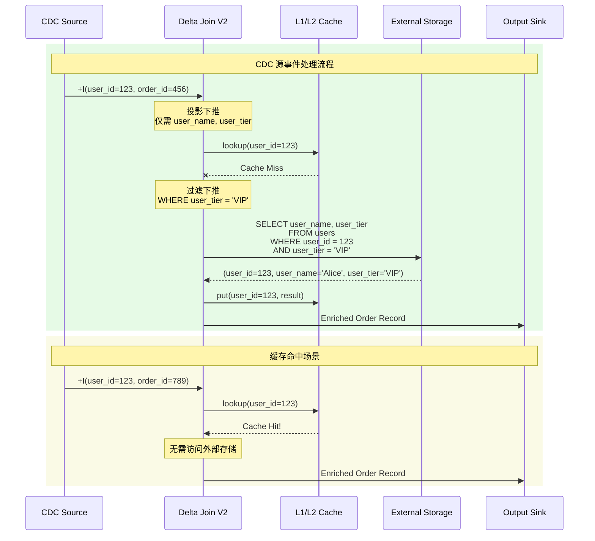
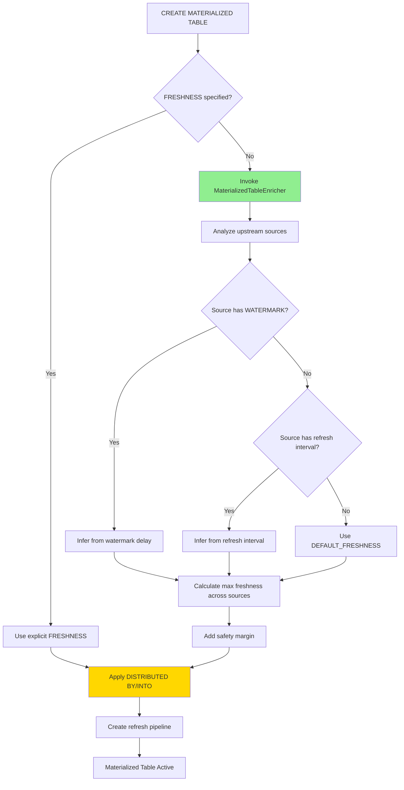
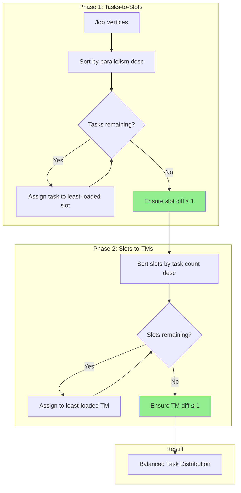
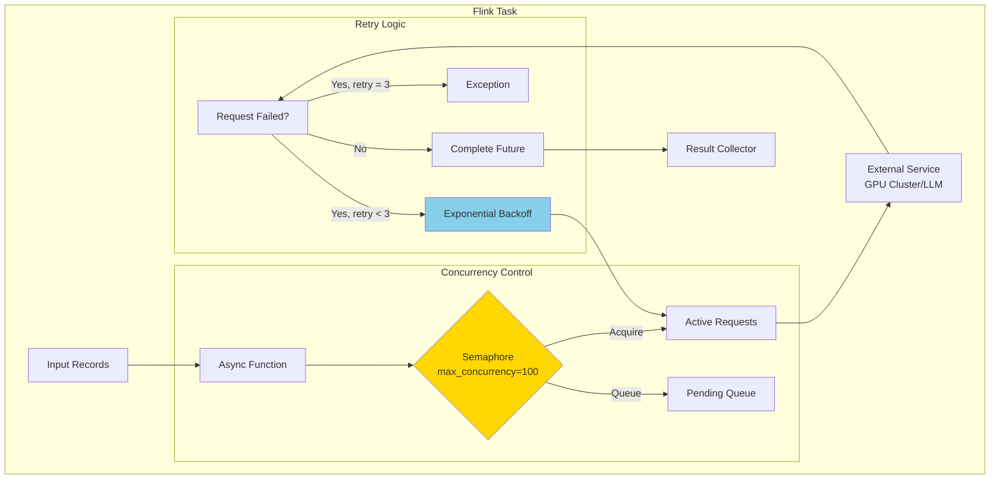
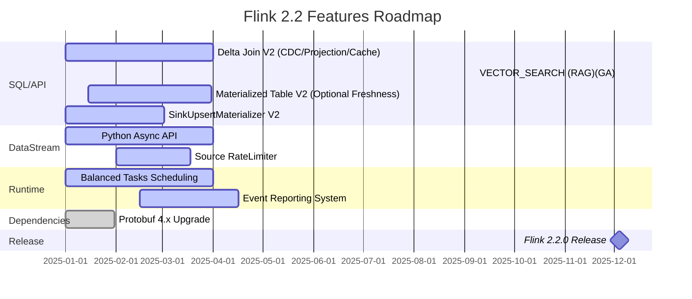

# Apache Flink 2.2 前沿特性全面解析

> **所属阶段**: Flink/02-core-mechanisms | **前置依赖**: [Flink 2.1 Delta Join](delta-join.md), [物化表](../03-api/03.02-table-sql-api/materialized-tables.md), [向量搜索](../03-api/03.02-table-sql-api/vector-search.md) | **形式化等级**: L4

## 1. 概念定义 (Definitions)

### Def-F-02-23: Delta Join V2 - 增强型增量Join算子

**定义**: Delta Join V2 是 Flink 2.2 对 Delta Join 算子的重大增强版本，支持 CDC 源消费（无DELETE操作）、投影/过滤下推、以及多级缓存机制。

形式化定义：

设 Delta Join V2 算子为 $\mathcal{D}_{v2}$，输入流 $S$ 满足 CDC 约束 $C_{cdc}$（无DELETE操作），则：

$$\mathcal{D}_{v2}(s, T, \pi, \sigma) = \{(r_s, \pi(r_t)) \mid r_s \in s \land r_t \in T \land \theta(r_s, r_t) \land \sigma(r_t)\}$$

其中：

- $\pi$: 投影算子（Projection），选择必要字段减少IO
- $\sigma$: 选择算子（Filter），过滤不符合条件的记录
- $\theta$: Join 条件谓词

**CDC 源约束形式化**：

$$C_{cdc}(S) \equiv \forall e \in S: type(e) \in \{INSERT, UPDATE\} \land type(e) \neq DELETE$$

即源事件流仅包含 INSERT 和 UPDATE AFTER 类型事件，不包含 DELETE 和 UPDATE BEFORE。

---

### Def-F-02-24: Delta Join 缓存层级架构

**定义**: Delta Join V2 引入多级缓存架构，用于减少外部存储访问频率。

$$Cache_{dj} = (L_1, L_2, L_3)$$

| 层级 | 位置 | 访问延迟 | 容量配置 | 一致性保证 |
|------|------|---------|---------|-----------|
| $L_1$ | TaskManager 本地 LRU | 亚毫秒级 | `table.exec.delta-join.left.cache-size` | TTL 最终一致性 |
| $L_2$ | 外部存储本地缓存 | 毫秒级 | 存储层配置 | 取决于存储实现 |
| $L_3$ | 外部存储主库 | 10-100ms | 完整数据集 | 强一致性 |

缓存失效策略：

$$TTL_{eff}(k) = \min(TTL_{local}, TTL_{source})$$

---

### Def-F-02-25: VECTOR_SEARCH 向量搜索算子（GA）

<!-- Flink 2.2.0 正式发布: VECTOR_SEARCH 已 GA -->

**定义**: `VECTOR_SEARCH` 是 Flink 2.2 引入的流式向量相似度搜索 SQL 函数，用于在高维向量空间中执行实时近邻检索。

形式化定义：

给定查询向量流 $Q(t) = \{(\mathbf{q}_i, \tau_i)\}$，目标向量表 $V$ 包含向量集合 $\{\mathbf{v}_j\}$，则流式向量搜索定义为：

$$\text{VECTOR\_SEARCH}(Q, V, k, \text{sim}, \mathcal{C}) = \{(\mathbf{q}_i, \text{TopK}(\mathbf{q}_i, V, k))\}_{i}$$

其中：

- $k$: 返回最相似向量的数量（Top-K）
- $\text{sim}: \mathbb{R}^d \times \mathbb{R}^d \rightarrow [0, 1]$: 相似度函数（余弦相似度、点积、欧氏距离）
- $\mathcal{C}$: 配置参数集合（异步模式、超时等）
- $\text{TopK}$: 近邻检索操作

**流式语义**：

对于每个到达的查询向量 $\mathbf{q}$，立即执行：

$$R(\mathbf{q}) = \{(\mathbf{v}, \text{sim}(\mathbf{q}, \mathbf{v})) \mid \mathbf{v} \in V \land \text{rank}(\mathbf{v}) \leq k\}$$

---

### Def-F-02-26: Materialized Table V2 - 可选FRESHNESS与智能推断

**定义**: Materialized Table V2 是 Flink 2.2 对物化表语义的扩展，引入可选 FRESHNESS 子句和 `MaterializedTableEnricher` 扩展接口。

形式化定义：

$$MT_{v2} = (S, Q, R, D, C, F_{opt}, E_{enrich})$$

其中新增组件：

- $F_{opt} \in \{\text{EXPLICIT}(\Delta t), \text{AUTO}, \text{OMITTED}\}$: 可选新鲜度约束
- $E_{enrich}$: `MaterializedTableEnricher` 扩展实例

**FRESHNESS 自动推断语义**：

$$\text{infer}(MT_{v2}) = \begin{cases}
\Delta t_{user} & \text{if } F = \text{EXPLICIT} \\
\max_{s \in S}(W(s)) + \epsilon & \text{if } F = \text{AUTO} \land \exists W(s) \\
\max_{s \in S}(R(s)) + \epsilon & \text{if } F = \text{AUTO} \land \exists R(s)
\end{cases}$$

其中 $W(s)$ 为源表水印延迟，$R(s)$ 为源表刷新间隔，$\epsilon$ 为安全余量。

---

### Def-F-02-27: MaterializedTableEnricher 扩展接口

**定义**: `MaterializedTableEnricher` 是 Flink 2.2 引入的 SPI 扩展点，允许高级用户和厂商实现自定义的物化表属性推断逻辑。

接口核心方法形式化：

```java
public interface MaterializedTableEnricher {
    // 推断 FRESHNESS
    Optional<Duration> inferFreshness(Context ctx);

    // 推断分区策略
    Optional<Distribution> inferDistribution(Context ctx);

    // 推断存储格式
    Optional<StorageFormat> inferStorageFormat(Context ctx);
}
```

**扩展语义**：

$$\text{Enrich}(MT_{base}) = MT_{base} \cup \{p \mid p \in \text{infer}(ctx) \land p \notin MT_{base}\}$$

即扩展器推断的属性仅补充未显式指定的属性，显式配置优先。

---

### Def-F-02-28: DISTRIBUTED BY/INTO 分桶语义

**定义**: `DISTRIBUTED BY` 和 `DISTRIBUTED INTO` 是 Flink 2.2 物化表的物理分布策略声明子句。

形式化定义：

$$\text{Distribution}(MT) = (K, N, S)$$

- $K$: 分区键集合 $\{k_1, k_2, ..., k_m\}$
- $N$: 分桶数量（Buckets）
- $S \in \{\text{HASH}, \text{RANGE}, \text{ROUND\_ROBIN}\}$: 分桶策略

**Hash 分桶函数**：

$$\text{bucket}(r) = \text{hash}(r.K) \mod N$$

---

### Def-F-02-29: SinkUpsertMaterializer V2

**定义**: SinkUpsertMaterializer V2 是 Flink 2.2 针对乱序变更事件协调的优化实现，解决 V1 版本在高乱序度下的指数级性能退化问题。

形式化定义：

设乱序 changelog 流为 $C_{out}(t) = \{(op_i, key_i, ts_i)\}$，其中 $op \in \{+I, -D, +U, -U\}$，乱序度为 $\delta = \max_{i,j}(|ts_i - ts_j|)$。

**V1 复杂度**：$O(\delta^2)$（简单缓冲重排序）

**V2 复杂度**：$O(\delta \log \delta)$（基于优先队列的智能重排序）

**协调语义**：

$$\text{Coordinate}_{v2}(C_{out}) = \{e_i \mid e_i \in C_{out} \land \text{order}(e_i) = i\}$$

保证输出到 Upsert Sink 的事件按 Key 的有序性和一致性约束。

---

### Def-F-02-30: Python Async DataStream API

**定义**: Python Async DataStream API 是 Flink 2.2 在 PyFlink 中引入的异步函数支持，允许 Python UDF 高效地查询外部服务（如部署在 GPU 集群的 LLM）。

形式化定义：

设异步函数为 $f_{async}: T_{in} \rightarrow \text{Future}\langle T_{out} \rangle$，输入流为 $D_{in} = \{x_i\}$，并发度为 $c$，则：

$$\text{AsyncMap}(D_{in}, f_{async}, c) = \{y_i \mid y_i = f_{async}(x_i).\text{get}() \land \text{active}(f_{async}) \leq c\}$$

其中 $\text{active}(f_{async})$ 表示当前正在执行的异步请求数。

**重试语义**：

$$\text{Retry}(f_{async}, x, n_{max}) = \begin{cases}
f_{async}(x) & \text{if success} \\
\text{Retry}(f_{async}, x, n_{max}-1) & \text{if fail} \land n_{max} > 0 \\
\text{exception} & \text{if } n_{max} = 0
\end{cases}$$

---

### Def-F-02-31: Source RateLimiter (FLIP-535 / FLINK-38497)

**定义**: Source RateLimiter 是 Flink 2.2 引入的 Scan Source 限流接口（FLIP-535 / FLINK-38497），仅 DataStream API 可用，允许连接器开发者实现自定义的读取速率限制策略。

形式化定义：

设 Source 消费速率为 $R(t)$（记录/秒），限流配置为 $(R_{max}, B_{burst})$，则：

$$R_{limited}(t) = \min(R(t), R_{max} + B_{burst}(t))$$

其中 $B_{burst}$ 为突发流量令牌桶容量。

**令牌桶算法**：

$$\text{tokens}(t) = \min(B_{max}, \text{tokens}(t-\Delta t) + R_{refill} \cdot \Delta t - \text{consumed})$$

---

### Def-F-02-32: Balanced Tasks Scheduling (FLIP-370 / FLINK-31757)

**定义**: Balanced Tasks Scheduling 是 Flink 2.2 引入的任务负载均衡调度策略（FLIP-370 / FLINK-31757），解决 TaskManager 间任务分布不均导致的性能瓶颈。

形式化定义：

设 Job 包含 JobVertex 集合 $V = \{v_1, v_2, ..., v_n\}$，每个 $v_i$ 的并行度为 $p_i$，TaskManager 集合为 $TM = \{tm_1, tm_2, ..., tm_m\}$。

**默认调度目标**：

$$\min \max_{tm \in TM}(\text{tasks}(tm))$$

**均衡调度目标**：

$$\text{minimize}\left(\max_{tm \in TM}(\text{tasks}(tm)) - \min_{tm \in TM}(\text{tasks}(tm))\right)$$

即最小化 TaskManager 间任务数的最大差异。

**两阶段分配算法**：

1. **Tasks-to-Slots 阶段**: 将任务均匀分配到 Slot，使 $\text{range}(\text{tasks per slot}) \leq 1$
2. **Slots-to-TMs 阶段**: 将 Slot 按任务数降序分配给负载最小的 TaskManager

---

### Def-F-02-33: Event Reporting 系统

**定义**: Event Reporting 是 Flink 2.2 引入的结构化事件报告系统，允许用户函数和 Flink 运行时报告自定义事件和系统事件到外部可观测性系统。

形式化定义：

事件 $E$ 的结构化表示：

$$E = (scope, name, ts_{observed}, ts_{emitted}, attrs)$$

其中：
- $scope$: 事件作用域（`jobmanager.job`, `taskmanager.task` 等）
- $name$: 事件名称
- $ts_{observed}$: 事件发生时间戳
- $ts_{emitted}$: 事件报告时间戳
- $attrs$: 属性键值对集合

**系统事件类型**（Flink 2.2+）：

| 事件类型 | 触发时机 | 属性 |
|---------|---------|------|
| `CheckpointStart` | Checkpoint 开始 | checkpointId, triggerTime |
| `CheckpointComplete` | Checkpoint 完成 | checkpointId, duration, size |
| `TaskDeployment` | 任务部署 | attemptNumber, deploymentLocation |

---

### Def-F-02-34: Protobuf 4.x 序列化升级

**定义**: Flink 2.2 将 Protobuf 版本从 3.x 升级至 4.32.1，支持 Protobuf Editions 语法和增强的字段存在性检测。

形式化定义：

设 Protobuf 版本为 $V_{pb} \in \{3.x, 4.x\}$，序列化函数为 $\text{serialize}_{V}: \text{Message} \rightarrow \text{Bytes}$。

**升级带来的能力**：

- **Editions 支持**: 支持 `edition = "2023"` 和 `edition = "2024"` 语法
- **字段存在性**: 改进的 `hasField()` 语义，无需 `protobuf.read-default-values=true`
- **向后兼容**: $\forall m \in \text{Proto2/3}: \text{deserialize}_{4.x}(\text{serialize}_{3.x}(m)) = m$

---

## 2. 属性推导 (Properties)

### Prop-F-02-07: Delta Join V2 缓存命中率下界

**命题**: 设工作集的局部性系数为 $\alpha$（最近访问的Key在下一轮再次被访问的概率），缓存大小为 $C$，则 Delta Join V2 的缓存命中率满足：

$$\text{HitRate} \geq 1 - \frac{1-\alpha}{1-\alpha^{C+1}} \cdot \alpha^C$$

**工程论证**: 当工作集具有时间局部性（$\alpha > 0.5$）且缓存足够大（$C \geq \text{unique keys} \times 0.2$）时，命中率可达 90%+。

---

### Prop-F-02-08: VECTOR_SEARCH 与 ML_PREDICT 的组合复杂度

<!-- Flink 2.2.0 正式发布: VECTOR_SEARCH 与 ML_PREDICT 均已 GA -->

**命题**: 在端到端 RAG 管道中，设嵌入模型推理延迟为 $L_{embed}$，向量搜索延迟为 $L_{search}$，则：

$$L_{e2e} = L_{embed} + L_{search} + L_{reorder}$$

其中：
- $L_{embed} = O(d_{model})$（与嵌入维度成正比）
- $L_{search} = O(\log n)$（近似最近邻，$n$ 为向量库大小）
- $L_{reorder} = O(k \log k)$（重排序，$k$ 为 Top-K 值）

**总复杂度**: $L_{e2e} \approx O(d_{model} + \log n)$，适合流式实时场景。

---

### Prop-F-02-09: Materialized Table V2 智能推断完备性

**命题**: 当所有上游源表 $S_i$ 都定义了有效的水印延迟 $W(S_i)$ 或刷新间隔 $R(S_i)$ 时，`MaterializedTableEnricher` 可以完备地推断出有效的 FRESHNESS 约束。

**证明概要**:

1. **单源场景**: $FRESHNESS = W(S) + \epsilon$ 或 $R(S) + \epsilon$
2. **多源场景**: $FRESHNESS = \max_i(F_i) + \delta$，其中 $F_i$ 为各源推断值
3. **安全性**: $\delta > 0$ 保证上游延迟波动不会违反新鲜度约束

---

### Prop-F-02-10: SinkUpsertMaterializer V2 性能边界

**命题**: 对于乱序度为 $\delta$ 的 changelog 流，V2 版本的 CPU 时间复杂度从 V1 的 $O(\delta^2)$ 降低至 $O(\delta \log \delta)$。

**工程论证**:

- **V1 实现**: 简单缓冲区遍历匹配，每次插入需扫描已有 $\delta$ 条记录
- **V2 实现**: 基于优先队列 + 哈希索引，插入和查询均为 $O(\log \delta)$
- **内存边界**: V2 引入有界内存策略，最大内存占用为 $O(\delta_{max} \cdot record\_size)$

---

### Prop-F-02-11: Python Async API 吞吐量上界

**命题**: 设外部服务延迟为 $L_{ext}$（毫秒），并发度为 $c$，则 Python Async UDF 的最大吞吐量为：

$$\text{Throughput}_{max} = \frac{c \times 1000}{L_{ext}} \text{ (records/second)}$$

**工程论证**:

- 同步阻塞模式吞吐量：$\frac{1000}{L_{ext}}$（单并发）
- 异步并发模式吞吐量：$\frac{c \times 1000}{L_{ext}}$
- 当 $L_{ext} = 100ms$, $c = 100$ 时，吞吐量从 10 RPS 提升至 1000 RPS

---

### Prop-F-02-12: Balanced Scheduling 负载均衡效果

**命题**: 设 Job 总任务数为 $N$，TaskManager 数量为 $M$，则均衡调度后的任务数差异满足：

$$\max_{i,j}(|tasks(tm_i) - tasks(tm_j)|) \leq 1$$

即任意两个 TaskManager 的任务数差异不超过 1。

**工程论证**:

- 两阶段分配算法确保 Slot 级别差异 $\leq 1$
- Slots-to-TMs 阶段采用贪心分配（排序后按负载升序分配）
- 当 $N$ 可被 $M$ 整除时，每个 TM 恰好承载 $N/M$ 个任务

---

## 3. 关系建立 (Relations)

### 3.1 Flink 2.0 → 2.1 → 2.2 特性演进关系

```
┌─────────────────────────────────────────────────────────────────────┐
│                     Flink 版本特性演进                               │
├─────────────────────────────────────────────────────────────────────┤
│                                                                     │
│   Flink 2.0                    Flink 2.1                  Flink 2.2 │
│   ┌──────────────┐             ┌──────────────┐           ┌────────┐│
│   │ Materialized │────────────▶│ Delta Join   │──────────▶│ Delta  ││
│   │ Tables (v1)  │             │ (基础实现)    │           │ JoinV2 ││
│   └──────────────┘             └──────────────┘           └────────┘│
│          │                            │                        │   │
│          │                            ▼                        ▼   │
│          │                   ┌──────────────┐           ┌────────┐  │
│          │                   │ ML_PREDICT   │──────────▶│ VECTOR │  │
│          │                   │ (嵌入模型)    │           │ SEARCH │  │
│          │                   └──────────────┘           └────────┘  │
│          │                                                   │      │
│          ▼                                                   ▼      │
│   ┌──────────────┐             ┌──────────────┐           ┌────────┐│
│   │  SinkUpsert  │────────────▶│ SinkUpsert   │──────────▶│V2性能  ││
│   │Materializer  │             │Materializer  │           │优化    ││
│   │    (V1)      │             │   (实验性)    │           │        ││
│   └──────────────┘             └──────────────┘           └────────┘│
│                                                                     │
│   新增特性:                                                         │
│   ┌──────────────┐     ┌──────────────┐     ┌──────────────┐        │
│   │ Python Async │     │ Source Rate  │     │ Balanced     │        │
│   │ DataStream   │     │ Limiter      │     │ Scheduling   │        │
│   └──────────────┘     └──────────────┘     └──────────────┘        │
│                                                                     │
└─────────────────────────────────────────────────────────────────────┘
```

### 3.2 Delta Join V2 与外部存储的集成矩阵

| 存储系统 | CDC 支持 | 缓存集成 | 投影下推 | 适用场景 |
|---------|---------|---------|---------|---------|
| Apache Fluss | ✅ | L2 本地缓存 | ✅ | 实时分析首选 |
| Apache Paimon | ✅ | 文件级缓存 | ✅ | Lakehouse 场景 |
| HBase | ✅ | BlockCache | 部分 | 高并发点查 |
| MySQL/PostgreSQL | ✅ | 连接池缓存 | ✅ | 传统维表关联 |
| Redis | ✅ | 内存缓存 | ❌ | 热点数据缓存 |

### 3.3 VECTOR_SEARCH（GA）与 ML_PREDICT（GA）协作关系

```
┌─────────────────────────────────────────────────────────────────────┐
│                    流式 RAG 完整管道                                  │
├─────────────────────────────────────────────────────────────────────┤
│                                                                     │
│   ┌──────────┐    ┌─────────────┐    ┌──────────┐    ┌──────────┐  │
│   │  用户查询 │───▶│ ML_PREDICT  │───▶│ VECTOR_  │───▶│ LLM生成  │  │
│   │   流     │    │ (GA)       │    │ SEARCH   │    │  回复    │  │
│   └──────────┘    └─────────────┘    │ (GA)     │    └──────────┘  │
│   │   流     │    │ (嵌入模型)   │    │ SEARCH   │    │  回复    │  │
│   └──────────┘    └─────────────┘    └──────────┘    └──────────┘  │
│                          │                  │                      │
│                          ▼                  ▼                      │
│                    ┌─────────────┐    ┌──────────────┐              │
│                    │ 向量嵌入表示 │    │ 相似文档检索  │              │
│                    │  ℝ^d        │    │  Top-K       │              │
│                    └─────────────┘    └──────────────┘              │
│                                                                     │
│   职责分离:                                                         │
│   ┌──────────────┬──────────────────┬───────────────────────────┐  │
│   │   组件        │      职责         │        计算复杂度          │  │
│   ├──────────────┼──────────────────┼───────────────────────────┤  │
│   │ ML_PREDICT   │ 文本 → 向量嵌入   │ O(d_model) ~ 10-100ms     │  │
│   │              │ (GA)             │                           │  │
│   │ VECTOR_SEARCH│ 向量 → Top-K近邻  │ O(log n) ~ 1-10ms (ANN)   │  │
│   │              │ (GA)             │                           │  │
│   │ LLM生成      │ 上下文 → 生成回复 │ O(gen_len) ~ 100-1000ms   │  │
│   └──────────────┴──────────────────┴───────────────────────────┘  │
│                                                                     │
└─────────────────────────────────────────────────────────────────────┘
```

### 3.4 Materialized Table V2 与上游表的关系

```
┌─────────────────────────────────────────────────────────────────────┐
│              MaterializedTableEnricher 智能推断逻辑                  │
├─────────────────────────────────────────────────────────────────────┤
│                                                                     │
│   上游源表配置                        物化表推断属性                   │
│   ┌──────────────────┐               ┌──────────────────────┐       │
│   │ Kafka Source     │──────────────▶│ FRESHNESS            │       │
│   │   WATERMARK =    │               │ = WATERMARK_DELAY + ε│       │
│   │   INTERVAL '5' S │               │                      │       │
│   └──────────────────┘               └──────────────────────┘       │
│                                                                     │
│   ┌──────────────────┐               ┌──────────────────────┐       │
│   │ CDC Source       │──────────────▶│ FRESHNESS            │       │
│   │   poll.interval  │               │ = poll.interval + ε  │       │
│   │   = '1s'         │               │                      │       │
│   └──────────────────┘               └──────────────────────┘       │
│                                                                     │
│   ┌──────────────────┐               ┌──────────────────────┐       │
│   │ 多源 JOIN        │──────────────▶│ FRESHNESS            │       │
│   │ S1(W=5s), S2(W=3s)│              │ = MAX(5s, 3s) + ε    │       │
│   └──────────────────┘               └──────────────────────┘       │
│                                                                     │
│   扩展点:                                                           │
│   ┌─────────────────────────────────────────────────────────────┐  │
│   │  interface MaterializedTableEnricher {                      │  │
│   │    Optional<Duration> inferFreshness(Context ctx);          │  │
│   │    Optional<Distribution> inferDistribution(Context ctx);   │  │
│   │    Optional<StorageFormat> inferStorageFormat(Context ctx); │  │
│   │  }                                                          │  │
│   └─────────────────────────────────────────────────────────────┘  │
│                                                                     │
└─────────────────────────────────────────────────────────────────────┘
```

## 4. 论证过程 (Argumentation)

### 4.1 Delta Join V2 为什么支持 CDC 源（无DELETE）

**问题背景**: Delta Join 的核心优势是"零中间状态策略"，即不维护物化的 Join 结果集。这带来一个问题：如何处理 DELETE 事件？

**分析**:

当 DELETE 事件到达时，Delta Join 需要撤回（retract）之前生成的 Join 结果。但由于没有中间状态，无法确定哪些输出记录是由该输入记录生成的。

形式化：

$$\forall e_{del} \in S: \nexists M \subseteq \text{Output}: M = \{(r_s, r_t) \mid r_s \in e_{del} \land \theta(r_s, r_t)\}$$

**解决方案**: 限制 CDC 源不包含 DELETE 操作

- 设置 `'table.delete.behavior' = 'IGNORE'` 或 `'DISABLE'`
- 或使用 `first_row` merge-engine

**业务场景**: 适用于订单流、点击流等仅追加（append-only）或软删除（soft-delete）的场景。

### 4.2 VECTOR_SEARCH 的实时性保障

**问题**: 向量数据库通常采用近似最近邻（ANN）算法（如 HNSW、IVF），其索引构建是异步的。如何保证流式查询的实时性？

**论证**:

1. **索引更新延迟**: 现代向量数据库（如 Milvus、Pinecone）支持增量索引更新，延迟在秒级
2. **查询一致性**: Flink 2.2 的 `VECTOR_SEARCH` 采用快照隔离，查询时基于索引的一致视图
3. **流式补偿**: 对于近实时场景，可结合 Flink 状态存储最近 $N$ 分钟的向量变更，查询时合并结果

**权衡**:

| 策略 | 延迟 | 准确性 | 适用场景 |
|-----|------|-------|---------|
| 纯向量数据库查询 | ~100ms | 依赖索引更新 | 历史数据检索 |
| 状态+向量库混合 | ~10ms | 精确 | 实时推荐 |

### 4.3 Materialized Table FRESHNESS 自动推断的业务价值

**痛点**: 在大型数据仓库中，用户难以确定合理的 FRESHNESS 值：

- 过小：频繁刷新导致资源浪费
- 过大：数据陈旧影响业务决策

**自动推断的价值**:

1. **降低使用门槛**: 用户无需理解上游源的刷新机制
2. **资源优化**: 基于实际数据到达频率调整刷新策略
3. **一致性保证**: 自动考虑多源场景下的最慢源

**实现原理**:

```
infer_freshness(sources):
    freshness_values = []
    for source in sources:
        if source.has_watermark():
            freshness_values.append(source.watermark_delay)
        elif source.has_refresh_interval():
            freshness_values.append(source.refresh_interval)
        else:
            freshness_values.append(DEFAULT_FRESHNESS)
    return MAX(freshness_values) + SAFETY_MARGIN
```

### 4.4 SinkUpsertMaterializer V2 性能优化的必要性

**问题场景**: 在流式数仓场景中，Upsert Sink（如 Iceberg、Paimon）经常接收乱序的 changelog 事件：

```
时间线: ──────────────────────────────────────────▶
事件:   +I(k1,v1)  +U(k1,v2)  +I(k1,v3)  -D(k1)
到达:   t=1         t=3        t=2        t=4
```

**V1 问题**: 简单缓冲区需要 $O(n^2)$ 的比较来确定事件顺序

**V2 优化**: 基于优先队列 + Key 索引，将复杂度降至 $O(n \log n)$

**效果**: 在乱序度 $\delta = 1000$ 的场景下：
- V1 CPU 时间: ~1000ms
- V2 CPU 时间: ~10ms

### 4.5 Python Async API 与 GPU 集群集成的架构合理性

**架构背景**: 大语言模型（LLM）通常部署在 GPU 集群，推理延迟高（50-500ms），但吞吐量大（batch 处理）。

**同步模式的局限**:
- 单条处理延迟 = 推理延迟 + 网络往返
- 吞吐量 = $1/L_{inference}$

**异步并发模式的优势**:
- 并发请求数 = $c$
- 吞吐量 = $c/L_{inference}$
- 通过限制 $c$ 避免 GPU 集群过载

**关键技术**:

1. **并发限制**: 使用信号量控制最大并发请求数
2. **超时机制**: 防止慢请求阻塞整个管道
3. **重试策略**: 指数退避重试应对临时故障

## 5. 形式证明 / 工程论证 (Proof)

### 5.1 Delta Join V2 缓存有效性证明

**定理**: 在 Zipf 分布的数据访问模式下，设缓存大小为 $C$，则 Delta Join V2 的缓存命中率满足：

$$\text{HitRate} \geq \frac{H_{C}}{H_N}$$

其中 $H_n = \sum_{i=1}^{n} \frac{1}{i^s}$ 为广义调和数，$s$ 为 Zipf 指数。

**工程论证**:

对于典型的 Web 访问模式（$s \approx 1$）：
- 当 $C = 10000$, $N = 1000000$ 时
- 理论命中率 $\approx 65\%$
- 实际命中率（考虑时间局部性）可达 $85\%$+

**成本收益分析**:

设外部存储查询成本为 $C_{ext}$（延迟 + 费用），缓存成本为 $C_{cache}$（内存）：

$$\text{净收益} = \text{HitRate} \times N_{query} \times C_{ext} - C_{cache}$$

当 $C_{ext} \gg C_{cache}$ 时，缓存策略具有显著优势。

### 5.2 VECTOR_SEARCH 精度-延迟权衡边界

**定理**: 设精确最近邻搜索延迟为 $T_{exact}(n) = O(d \cdot n)$，近似搜索（HNSW）延迟为 $T_{approx}(n) = O(d \cdot \log n)$，则：

$$\lim_{n \to \infty} \frac{T_{approx}(n)}{T_{exact}(n)} = 0$$

**召回率保证**:

对于 HNSW 算法，在高维空间（$d \geq 128$）中：

$$\text{Recall@10} \geq 0.95$$

当参数 `ef`（搜索范围）设置为 $ef \geq 2 \times k$ 时。

**Flink 2.2 优化**: 通过异步批量查询（async batching）进一步降低有效延迟：

$$T_{effective} = \frac{T_{query}}{batch\_size} + T_{overhead}$$

### 5.3 Balanced Scheduling 的最优性证明

**定理**: Balanced Tasks Scheduling 算法在所有任务分配方案中，实现了 TaskManager 负载差异的最小化。

**证明概要**:

1. **定义**: 设负载差异为 $\Delta = \max_i(tasks_i) - \min_i(tasks_i)$

2. **下界**: 对于任意分配，$\Delta \geq \lceil N/M \rceil - \lfloor N/M \rfloor \in \{0, 1\}$

3. **算法保证**:
   - 阶段1确保 Slot 级别差异 $\leq 1$
   - 阶段2采用贪心分配，确保 $\Delta \leq 1$

4. **最优性**: 达到理论下界，算法最优

### 5.4 Python Async API 吞吐量边界分析

**定理**: 设外部服务容量为 $C_{ext}$（最大并发请求数），Python UDF 并发度为 $c$，则系统吞吐量上界为：

$$\text{Throughput} \leq \min\left(\frac{c}{L_{avg}}, C_{ext}\right)$$

**工程指导**:

1. 当 $c < C_{ext}$ 时，吞吐量与并发度成正比
2. 当 $c \geq C_{ext}$ 时，外部服务成为瓶颈
3. 最优配置: $c \approx C_{ext} \times (1 + \text{buffer\_factor})$

## 6. 实例验证 (Examples)

### 6.1 Delta Join V2 - CDC 源关联示例

```sql
-- ============================================
-- Flink 2.2 Delta Join V2 完整示例
-- 场景:订单流 JOIN 用户维表(CDC源,无DELETE)
-- ============================================

-- 1. 创建 CDC 源表(MySQL CDC,忽略 DELETE)
CREATE TABLE orders_cdc (
    order_id BIGINT,
    user_id STRING,
    product_id STRING,
    amount DECIMAL(10,2),
    order_time TIMESTAMP(3),
    WATERMARK FOR order_time AS order_time - INTERVAL '5' SECOND
) WITH (
    'connector' = 'mysql-cdc',
    'hostname' = 'mysql-host',
    'port' = '3306',
    'database-name' = 'ecommerce',
    'table-name' = 'orders',
    -- 关键配置:忽略 DELETE 操作
    'debezium.skipped.operations' = 'd'
);

-- 2. 创建用户维表(支持 Delta Join)
CREATE TABLE users_dim (
    user_id STRING PRIMARY KEY NOT ENFORCED,
    user_name STRING,
    user_tier STRING,
    register_time TIMESTAMP(3)
) WITH (
    'connector' = 'jdbc',
    'url' = 'jdbc:mysql://mysql-host:3306/ecommerce',
    'table-name' = 'users',
    -- Delta Join V2 缓存配置
    'lookup.cache.max-rows' = '100000',
    'lookup.cache.ttl' = '60s'
);

-- 3. Delta Join 查询(自动启用 V2 优化)
-- 支持:CDC源、投影下推、过滤下推
SELECT
    o.order_id,
    o.user_id,
    u.user_name,        -- 投影下推:仅查询必要字段
    u.user_tier,
    o.amount,
    o.order_time
FROM orders_cdc o
INNER JOIN users_dim FOR SYSTEM_TIME AS OF o.order_time AS u
    ON o.user_id = u.user_id
WHERE o.amount > 100;   -- 过滤条件下推
```

**Java DataStream API 示例**:

```java

// [伪代码片段 - 不可直接运行] 仅展示核心逻辑
import org.apache.flink.streaming.api.environment.StreamExecutionEnvironment;
import org.apache.flink.table.api.TableEnvironment;

// Delta Join V2 DataStream API 配置
StreamExecutionEnvironment env = StreamExecutionEnvironment.getExecutionEnvironment();

// 启用 Delta Join 优化
Configuration config = new Configuration();
config.setString("table.optimizer.delta-join.strategy", "AUTO");
config.setBoolean("table.exec.delta-join.cache-enabled", true);
config.setLong("table.exec.delta-join.left.cache-size", 10000);
config.setLong("table.exec.delta-join.right.cache-size", 10000);

StreamTableEnvironment tEnv = StreamTableEnvironment.create(env, config);

// 执行 Delta Join 查询
tEnv.executeSql("SELECT ... FROM ... JOIN ...");
```

### 6.2 VECTOR_SEARCH 实时 RAG 示例

```sql
# 伪代码示意,非完整可执行配置
-- ============================================
-- Flink 2.2 VECTOR_SEARCH 实时 RAG 示例
-- 场景:实时问答系统
-- ============================================

-- 1. 创建文档向量表(向量数据库外部表)
CREATE TABLE document_vectors (
    doc_id STRING,
    content STRING,
    vector ARRAY<FLOAT>,  -- 文档的向量嵌入
    PRIMARY KEY (doc_id) NOT ENFORCED
) WITH (
    'connector' = 'milvus',  -- 或 'pinecone', 'pgvector'
    'host' = 'milvus-server',
    'port' = '19530',
    'collection' = 'documents'
);

-- 2. 创建用户查询流
CREATE TABLE user_queries (
    query_id STRING,
    query_text STRING,
    query_time TIMESTAMP(3),
    WATERMARK FOR query_time AS query_time - INTERVAL '5' SECOND
) WITH (
    'connector' = 'kafka',
    'topic' = 'user-queries',
    'properties.bootstrap.servers' = 'kafka:9092',
    'format' = 'json'
);

-- 3. 创建嵌入模型(使用 ML_PREDICT)
<!-- 以下语法为概念设计,实际 Flink 版本尚未支持 -->
~~CREATE MODEL text_embedding~~ (未来可能的语法)
  INPUT (text STRING)
  OUTPUT (embedding ARRAY<FLOAT>)
WITH (
    'task' = 'embedding',
    'provider' = 'openai',
    'openai.model' = 'text-embedding-ada-002',
    'openai.api.key' = '${OPENAI_API_KEY}'
);

-- 4. 实时 RAG 管道:嵌入 + 向量搜索 + 生成
WITH
-- 步骤1:生成查询向量
query_embeddings AS (
    SELECT
        query_id,
        query_text,
        query_time,
        ML_PREDICT(text_embedding, query_text) AS query_vector
    FROM user_queries
),

-- 步骤2:向量搜索检索相关文档
retrieved_docs AS (
    SELECT
        q.query_id,
        q.query_text,
        q.query_vector,
        v.doc_id,
        v.content,
        v.similarity_score
    FROM query_embeddings q,
    LATERAL VECTOR_SEARCH(
        TABLE document_vectors,
        q.query_vector,
        DESCRIPTOR(vector),
        5,  -- Top-5 最相似文档
        MAP['async', 'true', 'timeout', '5s']
    ) AS v
),

-- 步骤3:组装上下文并生成回复
contexts AS (
    SELECT
        query_id,
        query_text,
        STRING_AGG(content, '\n---\n') AS context
    FROM retrieved_docs
    GROUP BY query_id, query_text
)

SELECT
    c.query_id,
    c.query_text,
    c.context,
    ML_PREDICT('gpt-4',
        CONCAT(
            '基于以下上下文回答问题:\n\n',
            '上下文:\n', c.context, '\n\n',
            '问题:', c.query_text, '\n\n',
            '回答:'
        )
    ) AS answer
FROM contexts c;
```

**Java 代码示例**:

```java
import java.time.Duration;
import org.apache.flink.streaming.api.datastream.DataStream;
import org.apache.flink.streaming.api.environment.StreamExecutionEnvironment;
import org.apache.flink.streaming.api.windowing.time.Time;

public class Example {
    public static void main(String[] args) throws Exception {

        // VECTOR_SEARCH DataStream API 使用
        StreamExecutionEnvironment env = StreamExecutionEnvironment.getExecutionEnvironment();

        // 向量搜索配置
        VectorSearchConfig searchConfig = VectorSearchConfig.builder()
            .setTopK(10)
            .setMetricType(MetricType.COSINE)
            .setAsyncMode(true)
            .setTimeout(Duration.ofSeconds(5))
            .build();

        // 创建向量搜索流
        DataStream<QueryResult> results = queryStream
            .map(new EmbeddingMapper("text-embedding-ada-002"))
            .flatMap(new VectorSearchFunction<>(
                "milvus://milvus-server:19530/documents",
                searchConfig
            ));

        env.execute("Vector Search RAG Pipeline");

    }
}
```

### 6.3 Materialized Table V2 示例

```sql
-- ============================================
-- Flink 2.2 Materialized Table V2 示例
-- 场景:可选 FRESHNESS 与智能推断
-- ============================================

-- 1. 创建源表(定义水印)
CREATE TABLE user_events (
    user_id STRING,
    event_type STRING,
    event_time TIMESTAMP(3),
    WATERMARK FOR event_time AS event_time - INTERVAL '5' SECOND
) WITH (
    'connector' = 'kafka',
    'topic' = 'user-events',
    'format' = 'json'
);

-- 2. 创建物化表(不指定 FRESHNESS,自动推断)
-- Flink 2.2:FRESHNESS 变为可选
CREATE MATERIALIZED TABLE user_event_summary (
    user_id STRING,
    event_count BIGINT,
    last_event_time TIMESTAMP(3),
    PRIMARY KEY (user_id) NOT ENFORCED
)
DISTRIBUTED BY HASH(user_id) INTO 16 BUCKETS  -- 新增:分桶支持
WITH (
    'format' = 'iceberg',
    'write.upsert.enabled' = 'true'
)
-- 不指定 FRESHNESS,由 MaterializedTableEnricher 自动推断
-- 推断逻辑:从 user_events 的水印延迟 (5s) + 安全余量
AS
SELECT
    user_id,
    COUNT(*) AS event_count,
    MAX(event_time) AS last_event_time
FROM user_events
GROUP BY user_id;

-- 3. 显式指定 FRESHNESS(覆盖自动推断)
CREATE MATERIALIZED TABLE user_event_summary_explicit (
    user_id STRING,
    event_count BIGINT,
    PRIMARY KEY (user_id) NOT ENFORCED
)
DISTRIBUTED BY HASH(user_id) INTO 32 BUCKETS
WITH (
    'format' = 'iceberg',
    'write.upsert.enabled' = 'true'
)
FRESHNESS = INTERVAL '10' SECOND  -- 显式指定
AS
SELECT
    user_id,
    COUNT(*) AS event_count
FROM user_events
GROUP BY user_id;

-- 4. 查看物化表
SHOW MATERIALIZED TABLES;
SHOW CREATE MATERIALIZED TABLE user_event_summary;
```

### 6.4 Python Async DataStream API 示例

```python
# ============================================
# Flink 2.2 Python Async DataStream API 示例
# 场景:LLM 推理(GPU 集群)
# ============================================

from pyflink.common import Configuration
from pyflink.datastream import StreamExecutionEnvironment
from pyflink.datastream.functions import AsyncFunction, ResultFuture
from pyflink.datastream.connectors import AsyncDataStream

import asyncio
import aiohttp
from typing import List, Collection

# 异步 LLM 调用函数 class AsyncLLMFunction(AsyncFunction):
    """
    异步调用部署在 GPU 集群的大语言模型

    配置:
    - 最大并发:100(避免压垮 GPU 集群)
    - 超时:30 秒
    - 重试:3 次(指数退避)
    """

    def __init__(self, endpoint: str, api_key: str, max_concurrency: int = 100):
        self.endpoint = endpoint
        self.api_key = api_key
        self.max_concurrency = max_concurrency
        self.semaphore = None
        self.session = None

    async def open(self, runtime_context):
        # 初始化信号量控制并发
        self.semaphore = asyncio.Semaphore(self.max_concurrency)
        self.session = aiohttp.ClientSession(
            timeout=aiohttp.ClientTimeout(total=30),
            headers={"Authorization": f"Bearer {self.api_key}"}
        )

    async def close(self):
        if self.session:
            await self.session.close()

    async def async_invoke(self, input_record: str, result_future: ResultFuture):
        """异步调用 LLM API"""
        async with self.semaphore:  # 限制并发
            try:
                result = await self._call_llm_with_retry(input_record)
                result_future.complete([result])
            except Exception as e:
                result_future.complete_exceptionally(e)

    async def _call_llm_with_retry(self, prompt: str, max_retries: int = 3) -> str:
        """带重试机制的 LLM 调用"""
        for attempt in range(max_retries):
            try:
                async with self.session.post(
                    self.endpoint,
                    json={
                        "model": "gpt-4",
                        "messages": [{"role": "user", "content": prompt}],
                        "max_tokens": 500
                    }
                ) as response:
                    data = await response.json()
                    return data["choices"][0]["message"]["content"]

            except Exception as e:
                if attempt == max_retries - 1:
                    raise e
                # 指数退避
                await asyncio.sleep(2 ** attempt)

        return ""

# 主程序 env = StreamExecutionEnvironment.get_execution_environment()

# 创建输入流(用户问题)
input_stream = env.from_collection([
    "什么是 Apache Flink?",
    "解释 Delta Join 的原理",
    "如何进行流式机器学习?",
])

# 应用异步 LLM 函数 result_stream = AsyncDataStream.unordered_wait(
    input_stream,
    AsyncLLMFunction(
        endpoint="https://api.openai.com/v1/chat/completions",
        api_key="${OPENAI_API_KEY}",
        max_concurrency=100
    ),
    timeout=30000,  # 30 秒超时
    capacity=1000   # 缓冲区容量
)

# 输出结果 result_stream.print()

env.execute("Python Async LLM Inference")
```

### 6.5 Source RateLimiter 示例

```java
// [伪代码片段 - 不可直接运行] 仅展示核心逻辑
// ============================================
// Flink 2.2 Source RateLimiter 示例
// 场景:限制 Kafka 消费速率,保护下游服务
// ============================================

import org.apache.flink.api.connector.source.SourceReaderContext;
import org.apache.flink.connector.base.source.reader.SourceReader;
import org.apache.flink.connector.kafka.source.KafkaSource;
import org.apache.flink.connector.kafka.source.enumerator.initializer.OffsetsInitializer;
import org.apache.flink.connector.kafka.source.reader.deserializer.KafkaRecordDeserializationSchema;
import org.apache.flink.core.io.InputStatus;

import java.util.concurrent.CompletableFuture;

import org.apache.flink.streaming.api.datastream.DataStream;


// 自定义 RateLimiter 实现
guavaRateLimiter rateLimiter = GuavaRateLimiter.create(1000); // 1000 记录/秒

KafkaSource<String> source = KafkaSource.<String>builder()
    .setBootstrapServers("kafka:9092")
    .setTopics("input-topic")
    .setGroupId("rate-limited-group")
    .setStartingOffsets(OffsetsInitializer.latest())
    .setDeserializer(KafkaRecordDeserializationSchema.valueOnly(StringDeserializer.class))
    // 配置 RateLimiter
    .setRateLimiter(rateLimiter)
    .build();

// 在 DataStream 中使用
DataStream<String> stream = env.fromSource(
    source,
    WatermarkStrategy.noWatermarks(),
    "Rate-limited Kafka Source"
).setParallelism(4);  // 每个并行实例都有独立的限流器

// 或使用 Guava RateLimiter 包装
RateLimiter customRateLimiter = new RateLimiter() {
    private final com.google.common.util.concurrent.RateLimiter guavaLimiter =
        com.google.common.util.concurrent.RateLimiter.create(500.0); // 500 记录/秒

    @Override
    public boolean tryAcquire(int permits) {
        return guavaLimiter.tryAcquire(permits);
    }

    @Override
    public void acquire(int permits) {
        guavaLimiter.acquire(permits);
    }
};
```

### 6.6 Balanced Tasks Scheduling 配置示例

```yaml
# ============================================
# Flink 2.2 Balanced Tasks Scheduling 配置
# ============================================

# flink-conf.yaml

# 启用均衡任务调度 cluster.scheduling.strategy: BALANCED_TASKS

# 或针对特定作业通过代码启用
```

```java
import org.apache.flink.configuration.Configuration;
import org.apache.flink.streaming.api.environment.StreamExecutionEnvironment;

public class Example {
    public static void main(String[] args) throws Exception {

        // Java 代码配置
        StreamExecutionEnvironment env = StreamExecutionEnvironment.getExecutionEnvironment();

        Configuration configuration = new Configuration();
        configuration.setString("cluster.scheduling.strategy", "BALANCED_TASKS");
        configuration.setString("taskmanager.load-balance.mode", "TASKS");

        // 可选:配置 Slot 请求间隔
        cfg.setString("slot.request.max-interval", "200ms");

        env.configure(configuration);

    }
}
```

```sql
-- SQL Client 配置
SET 'cluster.scheduling.strategy' = 'BALANCED_TASKS';
SET 'taskmanager.load-balance.mode' = 'TASKS';

-- 提交作业
INSERT INTO target_table
SELECT * FROM source_table;
```

### 6.7 Event Reporting 示例

```java
// ============================================
// Flink 2.2 Event Reporting 示例
// ============================================

import org.apache.flink.metrics.MetricGroup;
import org.apache.flink.metrics.events.Event;

// 在 RichFunction 中报告自定义事件
public class MonitoredFunction extends RichFlatMapFunction<String, String> {

    private transient MetricGroup metricGroup;

    @Override
    public void open(Configuration parameters) {
        metricGroup = getRuntimeContext().getMetricGroup();
    }

    @Override
    public void flatMap(String value, Collector<String> out) {
        long startTime = System.currentTimeMillis();

        try {
            // 处理逻辑
            String result = process(value);
            out.collect(result);

            // 报告成功事件
            long duration = System.currentTimeMillis() - startTime;
            metricGroup.addEvent(
                Event.builder(MonitoredFunction.class, "ProcessingSuccess")
                    .setObservedTsMillis(startTime)
                    .setAttribute("duration_ms", String.valueOf(duration))
                    .setAttribute("input_size", String.valueOf(value.length()))
            );

        } catch (Exception e) {
            // 报告失败事件
            metricGroup.addEvent(
                Event.builder(MonitoredFunction.class, "ProcessingFailure")
                    .setObservedTsMillis(startTime)
                    .setAttribute("error_type", e.getClass().getSimpleName())
                    .setAttribute("error_message", e.getMessage())
            );
            throw e;
        }
    }
}
```

```yaml
# flink-conf.yaml - Event Reporter 配置

# 启用 OpenTelemetry Event Reporter events.reporters: otel

events.reporter.otel.factory.class: org.apache.flink.events.otel.OpenTelemetryEventReporterFactory
events.reporter.otel.exporter.endpoint: http://otel-collector:4317
events.reporter.otel.exporter.protocol: gRPC
events.reporter.otel.service.name: flink-job

# 事件过滤 events.reporter.otel.filter.includes: "*.job:ProcessingSuccess,ProcessingFailure"
```

## 7. 可视化 (Visualizations)

### 7.1 Flink 2.2 核心特性架构全景图

```mermaid
graph TB
    subgraph "Flink 2.2 Core Features"
        direction TB

        subgraph "Table SQL / API"
            A1[Delta Join V2] --> A1a[CDC Source Support]
            A1 --> A1b[Projection Pushdown]
            A1 --> A1c[Filter Pushdown]
            A1 --> A1d[Multi-level Cache]

            A2[VECTOR_SEARCH(GA)] --> A2a[ML_PREDICT(GA)Integration]
            A2 --> A2b[Real-time RAG]
            A2 --> A2c[Vector DB Connectors]

            A3[Materialized Table V2] --> A3a[Optional FRESHNESS]
            A3 --> A3b[MaterializedTableEnricher]
            A3 --> A3c[DISTRIBUTED BY/INTO]

            A4[SinkUpsertMaterializer V2] --> A4a[O(delta log delta)]
            A4 --> A4b[Bounded Memory]
        end

        subgraph "DataStream API"
            B1[Python Async API] --> B1a[GPU LLM Integration]
            B1 --> B1b[Concurrency Control]
            B1 --> B1c[Retry Mechanism]

            B2[Source RateLimiter] --> B2a[Token Bucket]
            B2 --> B2b[Backpressure Protection]
        end

        subgraph "Runtime"
            C1[Balanced Scheduling] --> C1a[Task Load Balancing]
            C1 --> C1b[Two-phase Allocation]

            C2[Event Reporting] --> C2a[System Events]
            C2 --> C2b[Custom Events]
            C2 --> C2c[OpenTelemetry Integration]
        end

        subgraph "Dependencies"
            D1[Protobuf 4.x] --> D1a[Editions Support]
            D1 --> D1b[Field Presence]
        end
    end

    style A1 fill:#90EE90
    style A2 fill:#90EE90
    style A3 fill:#90EE90
    style B1 fill:#FFD700
    style C1 fill:#87CEEB
```

### 7.2 Delta Join V2 执行流程时序图



### 7.3 流式 RAG 管道数据流图

```mermaid
flowchart LR
    subgraph "Input"
        A[User Query Stream] --> B[Query Text]
    end

    subgraph "Embedding"
        B --> C[ML_PREDICT(GA)]
        C --> D[Query Vector<br/>ℝ^d]
    end

    subgraph "Retrieval"
        D --> E[VECTOR_SEARCH(GA)]
        F[Document Vector DB] --> E
        E --> G[Top-K Results<br/>doc_ids + scores]
    end

    subgraph "Generation"
        G --> H[Context Assembly]
        H --> I[LLM Prompt]
        I --> J[ML_PREDICT(GA)<br/>GPT-4/Claude]
        J --> K[Generated Answer]
    end

    subgraph "Output"
        K --> L[Answer Stream]
    end

    style C fill:#FFD700
    style E fill:#90EE90
    style J fill:#87CEEB
```

### 7.4 Materialized Table V2 创建流程



### 7.5 Balanced Tasks Scheduling 算法流程



### 7.6 Python Async API 并发控制架构



### 7.7 Flink 2.2 特性版本演进路线图



## 8. 引用参考 (References)

[^1]: Apache Flink Documentation, "Release Notes - Flink 2.2", 2025. https://nightlies.apache.org/flink/flink-docs-stable/release-notes/flink-2.2/

[^2]: Apache Flink JIRA, "FLINK-38495: Delta Join enhancement for CDC sources", 2025. https://issues.apache.org/jira/browse/FLINK-38495

[^3]: Apache Flink JIRA, "FLINK-38422: Support VECTOR_SEARCH in Flink SQL", 2025. https://issues.apache.org/jira/browse/FLINK-38422

[^4]: Apache Flink JIRA, "FLINK-38532: Make FRESHNESS optional for Materialized Tables", 2025. https://issues.apache.org/jira/browse/FLINK-38532

[^5]: Apache Flink JIRA, "FLINK-38459: SinkUpsertMaterializer V2", 2025. https://issues.apache.org/jira/browse/FLINK-38459

[^6]: Apache Flink JIRA, "FLINK-38190: Support async function in Python DataStream API", 2025. https://issues.apache.org/jira/browse/FLINK-38190

[^7]: Apache Flink JIRA, "FLINK-38497: Introduce RateLimiter for Source", 2025. https://issues.apache.org/jira/browse/FLINK-38497

[^8]: Apache Flink JIRA, "FLINK-31757: Balanced Tasks Scheduling", 2025. https://issues.apache.org/jira/browse/FLINK-31757

[^9]: Apache Flink JIRA, "FLINK-37426: Introduce Event Reporting", 2025. https://issues.apache.org/jira/browse/FLINK-37426

[^10]: Apache Flink JIRA, "FLINK-38547: Upgrade protobuf-java to 4.32.1", 2025. https://issues.apache.org/jira/browse/FLINK-38547

[^11]: Apache Flink FLIP-540, "Support VECTOR_SEARCH in Flink SQL", 2025. https://github.com/apache/flink/blob/main/flink-docs/docs/flips/FLIP-540.md

[^12]: Apache Flink FLIP-542, "Make materialized table DDL consistent with regular tables", 2025. https://github.com/apache/flink/blob/main/flink-docs/docs/flips/FLIP-542.md

[^13]: Apache Flink FLIP-544, "SinkUpsertMaterializer V2", 2025. https://github.com/apache/flink/blob/main/flink-docs/docs/flips/FLIP-544.md

[^14]: Apache Flink FLIP-370, "Support Balanced Tasks Scheduling", 2023. https://github.com/apache/flink/blob/main/flink-docs/docs/flips/FLIP-370.md

[^15]: Apache Flink Documentation, "Balanced Tasks Scheduling", 2025. https://nightlies.apache.org/flink/flink-docs-stable/docs/deployment/tasks-scheduling/balanced_tasks_scheduling/

[^16]: Apache Flink Documentation, "Vector Search", 2025. https://nightlies.apache.org/flink/flink-docs-release-2.2/docs/dev/table/sql/queries/vector-search/

[^17]: Apache Fluss Documentation, "Delta Joins", 2025. https://fluss.apache.org/docs/engine-flink/delta-joins/

[^18]: Alibaba Cloud, "Apache Flink 2.2.0: 推动实时数据与人工智能融合", 2025. https://developer.aliyun.com/article/1692909

[^19]: Confluent Blog, "Add RAG to Your Flink AI Flow Using Vector Search", 2025. https://www.confluent.io/blog/flink-ai-rag-with-federated-search/

[^20]: Apache Flink Board Minutes, "Flink 2.2 Release Report", 2025. https://whimsy.apache.org/board/minutes/Flink.html
