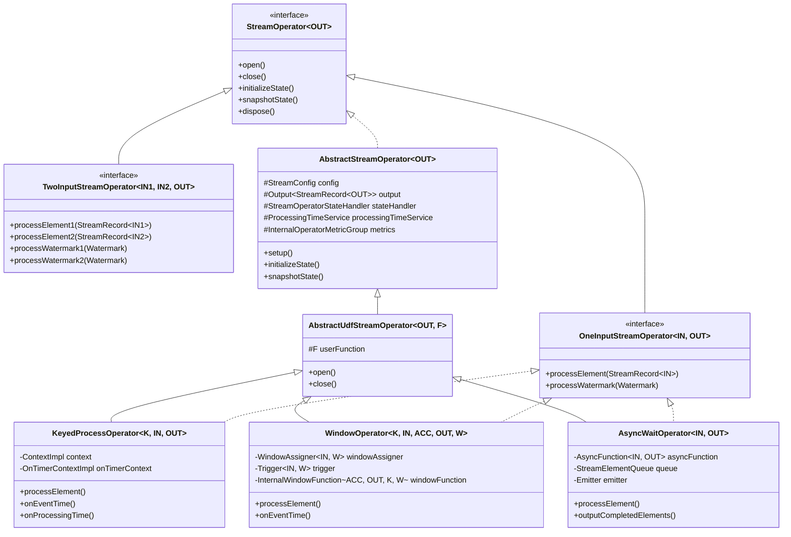
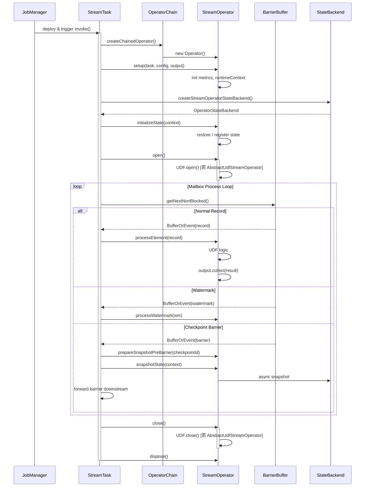
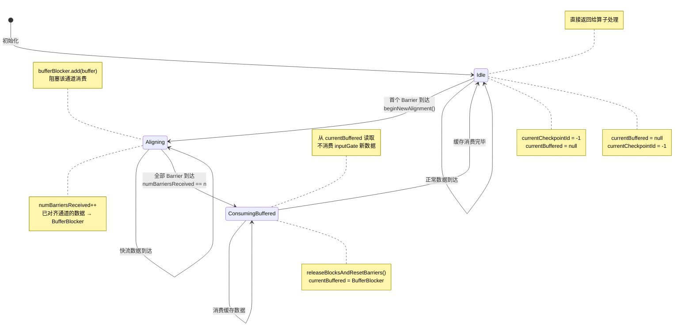

# Flink 核心算子源码深度分析

> **所属阶段**: Flink/02-core | **前置依赖**: [Flink DataStream API 核心概念](../01-concepts/flink-datastream-core-concepts.md), [Flink 状态与容错机制](flink-state-fault-tolerance.md) | **形式化等级**: L4-L5 | **源码版本**: Apache Flink 1.18 (release-1.18 分支)
> **最后更新**: 2026-04

---

## 目录

- [Flink 核心算子源码深度分析](#flink-核心算子源码深度分析)
  - [目录](#目录)
  - [1. 概念定义 (Definitions)](#1-概念定义-definitions)
    - [1.1 算子核心抽象](#11-算子核心抽象)
    - [1.2 生命周期阶段定义](#12-生命周期阶段定义)
    - [1.3 状态管理核心定义](#13-状态管理核心定义)
    - [1.4 网络传输核心定义](#14-网络传输核心定义)
  - [2. 属性推导 (Properties)](#2-属性推导-properties)
  - [3. 关系建立 (Relations)](#3-关系建立-relations)
    - [3.1 算子继承体系全景](#31-算子继承体系全景)
    - [3.2 算子生命周期与 StreamTask 的映射](#32-算子生命周期与-streamtask-的映射)
    - [3.3 状态后端与算子的绑定关系](#33-状态后端与算子的绑定关系)
    - [3.4 网络层与算子输出的关系](#34-网络层与算子输出的关系)
  - [4. 论证过程 (Argumentation)](#4-论证过程-argumentation)
    - [4.1 KeyedProcessOperator 的核心实现论证](#41-keyedprocessoperator-的核心实现论证)
    - [4.2 WindowOperator 的状态复杂性论证](#42-windowoperator-的状态复杂性论证)
    - [4.3 AsyncWaitOperator 的异步语义论证](#43-asyncwaitoperator-的异步语义论证)
  - [5. 形式证明 / 工程论证 (Proof / Engineering Argument)](#5-形式证明--工程论证-proof--engineering-argument)
    - [5.1 定理：BarrierBuffer 的 Exactly-Once 对齐正确性](#51-定理barrierbuffer-的-exactly-once-对齐正确性)
    - [5.2 定理：RecordWriter.emit() 的序列化原子性](#52-定理recordwriteremit-的序列化原子性)
    - [5.3 定理：RocksDBStateBackend 增量检查点的收敛性](#53-定理rocksdbstatebackend-增量检查点的收敛性)
  - [6. 实例验证 (Examples)](#6-实例验证-examples)
    - [6.1 算子生命周期调用链验证](#61-算子生命周期调用链验证)
    - [6.2 KeyedStateBackend.getPartitionedState() 调用实例](#62-keyedstatebackendgetpartitionedstate-调用实例)
    - [6.3 Credit-based 流控的 Buffer 分配实例](#63-credit-based-流控的-buffer-分配实例)
  - [7. 可视化 (Visualizations)](#7-可视化-visualizations)
    - [7.1 算子核心继承体系类图](#71-算子核心继承体系类图)
    - [7.2 算子生命周期与 StreamTask 交互时序图](#72-算子生命周期与-streamtask-交互时序图)
    - [7.3 BarrierBuffer 对齐机制状态机图](#73-barrierbuffer-对齐机制状态机图)
  - [8. 引用参考 (References)](#8-引用参考-references)

## 1. 概念定义 (Definitions)

### 1.1 算子核心抽象

**Def-SRC-01-01** (StreamOperator 接口). `StreamOperator<OUT>` 是 Flink DataStream 中所有流处理算子的顶层接口，定义于 `flink-streaming-java/src/main/java/org/apache/flink/streaming/api/operators/StreamOperator.java`。该接口声明了算子生命周期的全部钩子方法，并继承了 `CheckpointListener`、`KeyContext` 与 `Disposable` 接口，从而将**生命周期管理**、**状态与容错管理**、**数据处理**三大职责统一到一个契约中。

```java
// StreamOperator.java (line 45-120)
@PublicEvolving
public interface StreamOperator<OUT>
        extends CheckpointListener, KeyContext, Disposable, Serializable {

    void open() throws Exception;
    void close() throws Exception;
    void dispose() throws Exception;

    void initializeState(StateInitializationContext context) throws Exception;
    void snapshotState(StateSnapshotContext context) throws Exception;

    void prepareSnapshotPreBarrier(long checkpointId) throws Exception;

    void setKeyContextElement1(StreamRecord<?> record) throws Exception;
    void setKeyContextElement2(StreamRecord<?> record) throws Exception;

    OperatorID getOperatorID();
    InternalOperatorMetricGroup getMetricGroup();
}
```

**Def-SRC-01-02** (OneInputStreamOperator / TwoInputStreamOperator). 针对算子的输入 arity（元数），Flink 在 `StreamOperator` 之下定义了两个平行的子接口：

- `OneInputStreamOperator<IN, OUT>`：单输入流算子接口，声明 `processElement(StreamRecord<IN>)` 与 `processWatermark(Watermark)`。
- `TwoInputStreamOperator<IN1, IN2, OUT>`：双输入流算子接口，声明 `processElement1/2` 与 `processWatermark1/2`。
- `MultipleInputStreamOperator`：多输入流算子接口（Flink 1.11+ 引入），与 `AbstractStreamOperatorV2` 配合。

```java
// OneInputStreamOperator.java (line 38-55)
@PublicEvolving
public interface OneInputStreamOperator<IN, OUT>
        extends StreamOperator<OUT>, Input<IN> {
    default void setKeyContextElement(StreamRecord<IN> record) throws Exception {
        setKeyContextElement1(record);
    }
}
```

**Def-SRC-01-03** (AbstractStreamOperator). `AbstractStreamOperator<OUT>` 是 `StreamOperator` 的默认抽象实现，位于 `AbstractStreamOperator.java`（约 line 80-700）。它聚合了算子运行时的全部基础设施：

| 成员变量 | 类型 | 职责 |
|---------|------|------|
| `config` | `StreamConfig` | 算子配置（并行度、状态描述符等） |
| `output` | `Output<StreamRecord<OUT>>` | 下游输出句柄 |
| `stateHandler` | `StreamOperatorStateHandler` | 状态后端代理 |
| `processingTimeService` | `ProcessingTimeService` | 处理时间服务 |
| `timeServiceManager` | `InternalTimeServiceManager<?>` | 事件时间/处理时间 Timer 管理 |
| `metrics` | `InternalOperatorMetricGroup` | 算子级别指标采集 |
| `stateKeySelector1/2` | `KeySelector<?, ?>` | 用于从元素提取 Key 以支持 KeyedState |

**Def-SRC-01-04** (AbstractUdfStreamOperator). `AbstractUdfStreamOperator<OUT, F extends Function>` 继承自 `AbstractStreamOperator<OUT>`，是所有**包含用户自定义函数（UDF）**的算子的基类。其核心扩展是封装了 `protected final F userFunction`，并在生命周期方法中代理调用 UDF 的对应方法。

```java
// AbstractUdfStreamOperator.java (line 55-140)
public abstract class AbstractUdfStreamOperator<OUT, F extends Function>
        extends AbstractStreamOperator<OUT>
        implements OutputTypeConfigurable<OUT> {

    protected final F userFunction;

    public AbstractUdfStreamOperator(F userFunction) {
        this.userFunction = requireNonNull(userFunction);
        checkUdfCheckpointingPreconditions();
    }

    @Override
    public void open() throws Exception {
        super.open();
        FunctionUtils.openFunction(userFunction, new Configuration());
    }

    @Override
    public void close() throws Exception {
        FunctionUtils.closeFunction(userFunction);
        super.close();
    }
}
```

### 1.2 生命周期阶段定义

**Def-SRC-01-05** (算子生命周期六阶段). 基于 Flink 官方文档与 `StreamTask` 调用链，算子生命周期可严格划分为六个阶段：

1. **Setup 阶段**：`StreamTask` 构造 `OperatorChain` 后调用 `operator.setup()`，初始化 `RuntimeContext`、指标系统。
2. **State 初始化阶段**：调用 `initializeState(StateInitializationContext)`，从检查点恢复或注册初始状态。
3. **Open 阶段**：调用 `open()`，执行 UDF 的 `open()`，注册 Timer。
4. **处理阶段**：循环调用 `processElement()` / `processWatermark()`。
5. **Checkpoint 阶段**：调用 `prepareSnapshotPreBarrier()` → `snapshotState()` → 异步上传。
6. **终止阶段**：调用 `close()` → `dispose()`，释放资源。

### 1.3 状态管理核心定义

**Def-SRC-01-06** (StateBackend 与 Operator State Backend). `StateBackend` 接口定义于 `flink-runtime/.../state/StateBackend.java`，负责：

- 通过 `createCheckpointStorage(JobID)` 创建检查点存储。
- 通过 `createStreamOperatorStateBackend(...)` 创建算子级状态后端（`OperatorStateBackend`）。
- 通过 `createKeyedStateBackend(...)` 创建 Keyed 状态后端（`KeyedStateBackend`）。

**Def-SRC-01-07** (KeyedStateBackend.getPartitionedState). `KeyedStateBackend` 通过 `getPartitionedState(StateDescriptor)` 为当前活跃的 Key 提供分区状态视图。内部实现依赖于 `StateTable<K, N, S>`，其按 `KeyGroup` 进行哈希分区。

```java
// KeyedStateBackend.java (概念性源码，基于 HeapKeyedStateBackend / RocksDBKeyedStateBackend)
@Override
public <N, S extends State> S getPartitionedState(
        final N namespace,
        final TypeSerializer<N> namespaceSerializer,
        final StateDescriptor<S, ?> stateDescriptor) throws Exception {

    // 1. 从 stateDescriptor 获取或注册 StateFactory
    // 2. 构建 InternalKvState<K, N, ?>，绑定当前 keyContext
    // 3. 返回面向用户的 State 包装器 (如 InternalValueState)
}
```

### 1.4 网络传输核心定义

**Def-SRC-01-08** (RecordWriter 与 ResultSubpartition). `RecordWriter<T>` 是算子输出到网络层的核心桥梁，位于 `flink-runtime/.../api/writer/RecordWriter.java`。每个下游通道对应一个 `ResultSubpartition`，数据经 `SpanningRecordSerializer` 序列化后写入 `BufferBuilder`。

**Def-SRC-01-09** (Credit-based Flow Control). Flink 1.5 引入的基于信用的流控机制（`FLINK-7282`）。每个 `RemoteInputChannel` 拥有 **exclusive buffers**（独占缓冲区），`SingleInputGate` 的本地缓冲池提供 **floating buffers**（浮动缓冲区）。接收方以 **credit**（1 buffer = 1 credit）通告可用容量，发送方仅在 credit > 0 时向 Netty 层转发数据。

**Def-SRC-01-10** (BarrierBuffer 对齐). `BarrierBuffer` 是 `CheckpointBarrierHandler` 的 Exactly-Once 实现，核心思想：当某输入通道先到达 Barrier 时，阻塞该通道并缓存其后续数据，直至所有输入通道的同一 checkpoint Barrier 全部到达，才释放阻塞并触发 `snapshotState()`。

---

## 2. 属性推导 (Properties)

**Lemma-SRC-01-01** (算子继承体系闭包性). 设 `O` 为任意 DataStream 算子，则 `O` 必满足以下继承闭包之一：

1. 若 `O` 含 UDF 且为单输入，则 `O ≺ AbstractUdfStreamOperator ∧ O implements OneInputStreamOperator`。
2. 若 `O` 含 UDF 且为双输入，则 `O ≺ AbstractUdfStreamOperator ∧ O implements TwoInputStreamOperator`。
3. 若 `O` 为 Table API 算子或无 UDF，则 `O ≺ AbstractStreamOperator`（直接继承，不经过 `AbstractUdfStreamOperator`）。
4. 若 `O` 为多输入（Flink 1.11+），则 `O` 基于 `AbstractStreamOperatorV2` + `MultipleInputStreamOperator`。

*直观解释*：`AbstractStreamOperator` 与 `AbstractUdfStreamOperator` 构成两条正交继承线——前者提供基础设施（状态、指标、Timer），后者增加 UDF 生命周期代理。输入 arity 由 `OneInputStreamOperator` / `TwoInputStreamOperator` / `MultipleInputStreamOperator` 区分。

**Lemma-SRC-01-02** (生命周期调用全序性). 在不发生异常的前提下，单个算子实例上的生命周期方法调用满足严格全序：

```
setup ≺ initializeState ≺ open ≺ (processElement | processWatermark)* ≺
(prepareSnapshotPreBarrier ≺ snapshotState)* ≺ close ≺ dispose
```

*证明概要*：`StreamTask.invoke()` 方法（`StreamTask.java` line 600-750）通过 `OperatorChain` 顺序调用上述方法。`processElement` 与 `processWatermark` 在处理循环中交替执行，但绝不会与 `snapshotState` 并发——Flink 的 Mailbox 模型保证了单线程语义。

**Lemma-SRC-01-03** (RocksDB Checkpoint 异步快照原子性). `RocksDBStateBackend` 的 `snapshotState()` 操作将状态快照分为 **同步部分**（获取 RocksDB `Snapshot` 句柄、停止写入）与 **异步部分**（遍历 SST 文件并上传）。由于 RocksDB 的 `Checkpoint` / `Snapshot` 机制基于 LSM-Tree 的不可变性，异步读取期间并发写入不影响快照一致性。

**Prop-SRC-01-01** (Credit-based 流控的反压传递单调性). 在 Credit-based 流控下，若下游算子处理速率低于上游，则下游 `RemoteInputChannel` 的可用 credit 单调递减至 0，上游 `ResultSubpartition` 在 credit 耗尽后停止向 Netty 输出数据，反压在 **应用层** 而非 TCP 层建立，避免了多路复用连接的 Head-of-Line Blocking。

---

## 3. 关系建立 (Relations)

### 3.1 算子继承体系全景

Flink DataStream 算子的继承体系可视为一个 **分层格（Lattice）**：

- 第 0 层：`StreamOperator`（接口契约）
- 第 1 层：`AbstractStreamOperator`（基础设施）+ `OneInputStreamOperator` / `TwoInputStreamOperator`（输入契约）
- 第 2 层：`AbstractUdfStreamOperator`（UDF 代理）
- 第 3 层：具体算子（`StreamMap`、`WindowOperator`、`KeyedProcessOperator`、`AsyncWaitOperator` 等）

```
StreamOperator(I)
    ├── AbstractStreamOperator(A)
    │       └── AbstractUdfStreamOperator(A)
    │               ├── StreamMap(C) ──implements── OneInputStreamOperator(I)
    │               ├── StreamFlatMap(C) ──implements── OneInputStreamOperator(I)
    │               ├── StreamFilter(C) ──implements── OneInputStreamOperator(I)
    │               ├── WindowOperator(C) ──implements── OneInputStreamOperator(I), Triggerable
    │               ├── KeyedProcessOperator(C) ──implements── OneInputStreamOperator(I), Triggerable
    │               ├── AsyncWaitOperator(C) ──implements── OneInputStreamOperator(I)
    │               ├── CoProcessOperator(C) ──implements── TwoInputStreamOperator(I)
    │               └── StreamSource(C) ──implements── OneInputStreamOperator(I)
    │
    ├── OneInputStreamOperator(I) ──extends── StreamOperator(I) + Input<IN>
    ├── TwoInputStreamOperator(I) ──extends── StreamOperator(I)
    └── MultipleInputStreamOperator(I) ──extends── StreamOperator(I)
```

### 3.2 算子生命周期与 StreamTask 的映射

算子生命周期并非独立运行，而是嵌入在 `StreamTask` 的生命周期框架中：

| StreamTask 阶段 | 调用的算子方法 | 源码位置（StreamTask.java） |
|----------------|--------------|---------------------------|
| `beforeInvoke()` | `setup()` → `initializeState()` → `open()` | line 550-600 |
| `runMailboxLoop()` | `processElement()` / `processWatermark()` | line 620-680 |
| `triggerCheckpoint()` | `prepareSnapshotPreBarrier()` → `snapshotState()` | line 800-900 |
| `afterInvoke()` | `close()` → `dispose()` | line 700-750 |

### 3.3 状态后端与算子的绑定关系

`StreamTaskStateInitializerImpl` 在 `StreamTask` 初始化阶段负责将 `StateBackend` 绑定到算子：

```
StateBackend
    ├── createStreamOperatorStateBackend() → OperatorStateBackend
    │       └── 供 AbstractStreamOperator.initializeState() 使用
    ├── createKeyedStateBackend() → KeyedStateBackend
    │       └── 供 KeyedProcessOperator / WindowOperator 使用
    └── createCheckpointStorage() → CheckpointStorage
            └── 供 snapshotState() 的异步线程写入远程存储
```

### 3.4 网络层与算子输出的关系

算子通过 `Output<StreamRecord<OUT>>`（通常为 `AbstractStreamOperator.CountingOutput`）向下游发送数据，其调用链为：

```
operator.processElement()
    → output.collect(record)
        → RecordWriterOutput.pushToRecordWriter()
            → RecordWriter.emit(delegate)
                → SpanningRecordSerializer.addRecord()
                    → serializer.copyToBufferBuilder(BufferBuilder)
                        → ResultSubpartition.add(BufferConsumer)
                            → Netty 层通过 Credit-based 流控发送
```

---

## 4. 论证过程 (Argumentation)

### 4.1 KeyedProcessOperator 的核心实现论证

`KeyedProcessOperator<K, IN, OUT>`（位于 `flink-streaming-java/.../operators/KeyedProcessOperator.java`）是 `KeyedProcessFunction` 的执行载体。其特殊性在于：

1. **KeyedState 访问**：通过 `getKeyedStateBackend()` 获取 `HeapKeyedStateBackend` 或 `RocksDBKeyedStateBackend`，并在 `processElement` 中通过 `setCurrentKey(key)` 切换当前 Key 上下文。
2. **Timer 管理**：实现 `Triggerable<K, N>` 接口，由 `InternalTimeServiceManager` 维护事件时间与处理时间的优先队列。`onEventTime()` / `onProcessingTime()` 被回调时，算子调用 `userFunction.onTimer()`。
3. **状态一致性**：`snapshotState()` 时，`KeyedStateBackend` 遍历所有 KeyGroup，将状态写入检查点输出流；`RocksDB` 场景下利用 RocksDB 原生 `snapshot` API 实现零拷贝快照。

```java
// KeyedProcessOperator.java (line 85-130, 概念性源码)
public class KeyedProcessOperator<K, IN, OUT>
        extends AbstractUdfStreamOperator<OUT, KeyedProcessFunction<K, IN, OUT>>
        implements OneInputStreamOperator<IN, OUT>, Triggerable<K, VoidNamespace> {

    private transient TimestampedCollector<OUT> collector;
    private transient ContextImpl context;
    private transient OnTimerContextImpl onTimerContext;

    @Override
    public void open() throws Exception {
        super.open();
        collector = new TimestampedCollector<>(output);
        context = new ContextImpl(userFunction, getProcessingTimeService());
        onTimerContext = new OnTimerContextImpl(
                getKeyedStateBackend().getKeySerializer(),
                userFunction,
                getProcessingTimeService());
    }

    @Override
    public void processElement(StreamRecord<IN> element) throws Exception {
        // 1. 设置当前 Key 上下文
        setCurrentKey(element.getValue());
        // 2. 调用用户函数处理元素
        userFunction.processElement(element.getValue(), context, collector);
        // 3. collector 将结果通过 output 发送
    }

    @Override
    public void onEventTime(InternalTimer<K, VoidNamespace> timer) throws Exception {
        setCurrentKey(timer.getKey());
        onTimerContext.setTimer(timer);
        userFunction.onTimer(timer.getTimestamp(), onTimerContext, collector);
    }
}
```

### 4.2 WindowOperator 的状态复杂性论证

`WindowOperator`（位于 `flink-streaming-java/.../operators/windowing/WindowOperator.java`，约 500+ 行）是 Flink 中最复杂的算子之一，其复杂性来源于：

1. **多状态存储**：每个窗口维护独立的 `ListState<IN>`（窗口内容）与 `ReducingState<ACC>`（增量聚合）。若使用 `MergingWindowAssigner`（如 Session Window），还需额外维护 `MapState<W, W>` 记录窗口合并映射。
2. **Trigger 机制**：`Trigger` 接口决定窗口何时触发计算、何时清除。`WindowOperator` 在 `processElement` 中调用 `trigger.onElement()`，若返回 `TriggerResult.FIRE`，则执行 `emitWindowContents()`。
3. **迟到数据策略**：通过 `sideOutputLateData` 将超出 `allowedLateness` 的数据路由到侧输出流。

```java
// WindowOperator.java (line 280-350, 概念性源码)
@Override
public void processElement(StreamRecord<IN> element) throws Exception {
    final Collection<W> elementWindows = windowAssigner.assignWindows(
        element.getValue(), element.getTimestamp(), windowAssignerContext);

    final K key = (K) getCurrentKey();
    final boolean isSkippedElement = windowAssigner.isEventTime() &&
            isWindowLate(new TimeWindow(element.getTimestamp(), element.getTimestamp()));

    if (isSkippedElement) {
        if (lateDataOutputTag != null) {
            sideOutput(element);
        }
        return;
    }

    for (W window : elementWindows) {
        if (windowAssigner.isEventTime()) {
            windowState.setCurrentNamespace(window);
            windowState.add(element.getValue());  // 写入 ListState
        }
        // 注册 Cleanup Timer
        registerCleanupTimer(window);
        // 调用 Trigger
        TriggerResult triggerResult = triggerContext.onElement(element, window);
        if (triggerResult.isFire()) {
            emitWindowContents(window, windowState.get());
        }
        if (triggerResult.isPurge()) {
            windowState.clear();
        }
    }
}
```

### 4.3 AsyncWaitOperator 的异步语义论证

`AsyncWaitOperator`（位于 `flink-streaming-java/.../operators/async/AsyncWaitOperator.java`）通过 **StreamElementQueue** 实现异步 I/O 的保序/乱序输出：

- **OrderedStreamElementQueue**：严格保持输入顺序输出，仅当队首元素的异步回调完成时才可 emit。
- **UnorderedStreamElementQueue**：允许乱序输出，但 Watermark 需等待所有更早元素完成。
- **Emitter 线程**：独立的 `Emitter` 线程（由 `OperatorActions` 调度）从队列中拉取完成的 `AsyncResult`，并调用 `output.collect()` 向下游发送。

```java
// AsyncWaitOperator.java (line 110-180, 概念性源码)
@Override
public void processElement(StreamRecord<IN> element) throws Exception {
    // 将元素加入异步队列，启动异步回调
    final StreamRecordQueueEntry<OUT> streamRecordBufferEntry =
            new StreamRecordQueueEntry<>(element);
    asyncFunction.asyncInvoke(element.getValue(), streamRecordBufferEntry);
    // 尝试将已完成的结果发送给下游（由 Emitter 线程实际执行）
    outputCompletedElements();
}

// Emitter 线程逻辑
class Emitter implements Runnable {
    @Override
    public void run() {
        while (running) {
            // 从 OrderedStreamElementQueue / UnorderedStreamElementQueue 中取出 completed entry
            AsyncResult asyncResult = queue.poll();
            if (asyncResult != null) {
                asyncResult.emitResult(output);
            }
        }
    }
}
```

---

## 5. 形式证明 / 工程论证 (Proof / Engineering Argument)

### 5.1 定理：BarrierBuffer 的 Exactly-Once 对齐正确性

**Thm-SRC-01-01** (BarrierBuffer Exactly-Once Correctness). 设算子 `op` 有 `n` 个输入通道 `C = {c₁, c₂, ..., cₙ}`，`BarrierBuffer` 的 `getNextNonBlocked()` 方法保证：在 checkpoint `k` 的 barrier 对齐完成前，算子 `op` 不会消费任何属于 checkpoint `k+1` 及之后的记录。

*工程论证*：

1. **对齐触发**：当首个 barrier `Bₖ` 从通道 `cᵢ` 到达时，`BarrierBuffer` 进入对齐状态（`beginNewAlignment`），`currentCheckpointId` 设为 `k`。
2. **快流阻塞**：对于已收到 `Bₖ` 的通道，后续数据被追加到 `BufferBlocker` 的 `ArrayDeque<Buffer>` 中；未收到 `Bₖ` 的通道数据正常消费。
3. **对齐完成条件**：当 `numBarriersReceived + numClosedChannels == totalNumberOfInputChannels` 时，调用 `releaseBlocksAndResetBarriers()`，将 `BufferBlocker` 中缓存的数据移交至 `currentBuffered`，并恢复消费。
4. **语义保证**：由于阻塞期间快流数据被缓存而非丢弃，且 barrier 之前的全部数据被消费后才触发 `snapshotState()`，因此快照状态精确对应 barrier 之前的数据子集，满足 Exactly-Once。

```java
// BarrierBuffer.java (line 150-250, 概念性源码)
@Override
public BufferOrEvent getNextNonBlocked() throws Exception {
    while (true) {
        BufferOrEvent next = inputGate.getNextBufferOrEvent();
        if (next.isBuffer()) {
            if (currentBuffered != null) {
                // 正在消费对齐缓存的数据
                return currentBuffered.getNext();
            }
            if (currentCheckpointId != -1 && !hasReceivedBarrier(next.getChannelIndex())) {
                // 某通道已对齐，当前数据属于快流 → 缓存
                bufferBlocker.add(next);
                continue;
            }
            return next;  // 正常消费
        } else if (next.isEvent() && next.getEvent() instanceof CheckpointBarrier) {
            CheckpointBarrier barrier = (CheckpointBarrier) next.getEvent();
            if (currentCheckpointId == -1) {
                beginNewAlignment(barrier);
            } else if (barrier.getId() == currentCheckpointId) {
                numBarriersReceived++;
                if (numBarriersReceived + numClosedChannels == totalNumberOfInputChannels) {
                    releaseBlocksAndResetBarriers();
                    return next;  // 返回 barrier，触发 snapshotState
                }
            }
        }
    }
}
```

### 5.2 定理：RecordWriter.emit() 的序列化原子性

**Thm-SRC-01-02** (RecordWriter Serialization Atomicity). `RecordWriter.emit(T record, int targetChannel)` 保证：单条记录要么被完整序列化到 `ResultSubpartition` 的一个或多个 `Buffer` 中，要么完全不写入（All-or-Nothing）。

*工程论证*：

1. `RecordWriter` 首先调用 `serializer.serializeRecord(record)`，将记录序列化到内部的中间缓冲区 `DataOutputSerializer`。
2. 随后调用 `copyFromSerializerToTargetChannel(targetChannel)`，将中间缓冲区的数据复制到目标 channel 的 `BufferBuilder`。
3. 若单条记录超过一个 `Buffer` 的容量，循环申请新的 `BufferBuilder` 直至写完。仅当 `result.isFullRecord()` 成立时，才认为该记录写入完成；否则继续写入下一个 Buffer。
4. 异常场景（如 `BufferPool` 耗尽）下，`InterruptedException` 或 `IOException` 会向上传播，已部分写入的 Buffer 在 `finishBufferBuilder` 后才对 Netty 可见，因此不会出现半条记录。

```java
// RecordWriter.java (line 95-170, 概念性源码)
protected void emit(T record, int targetChannel)
        throws IOException, InterruptedException {
    serializer.serializeRecord(record);
    if (copyFromSerializerToTargetChannel(targetChannel)) {
        serializer.prune();  // 释放中间缓冲区
    }
}

protected boolean copyFromSerializerToTargetChannel(int targetChannel)
        throws IOException, InterruptedException {
    serializer.reset();
    BufferBuilder bufferBuilder = getBufferBuilder(targetChannel);
    SerializationResult result = serializer.copyToBufferBuilder(bufferBuilder);

    while (result.isFullBuffer()) {
        finishBufferBuilder(bufferBuilder);
        if (result.isFullRecord()) {
            emptyCurrentBufferBuilder(targetChannel);
            return true;  // 完整记录已写入
        }
        bufferBuilder = requestNewBufferBuilder(targetChannel);
        result = serializer.copyToBufferBuilder(bufferBuilder);
    }
    return false;
}
```

### 5.3 定理：RocksDBStateBackend 增量检查点的收敛性

**Thm-SRC-01-03** (RocksDB Incremental Checkpoint Convergence). 启用增量检查点后，Flink 的 checkpoint 数据量随时间收敛到一个稳定上界，不会无限增长。

*工程论证*：

1. RocksDB 的 LSM-Tree 在后台执行 **compaction**，将多个 Level-0 SST 文件合并为 Level-1、Level-2 的文件。Compaction 完成后，旧的 SST 文件可被删除。
2. Flink 增量检查点仅上传 **新增或变更的 SST 文件** 以及 **MANIFEST** 元数据。对于已被 compaction 淘汰的旧文件，后续 checkpoint 不再引用。
3. Flink 的 `RocksDBIncrementalSnapshotOperation` 在 `materializeSnapshot()` 中构建 `SnapshotResult`，引用当前有效的 SST 文件列表。当旧的 checkpoint 被清理（根据保留策略），其引用的唯一文件也会被删除。
4. 因此，在稳态下，增量 checkpoint 的数据量正比于 **状态变更速率 × 两次 checkpoint 间隔**，而非总状态量，从而收敛。

```java
// RocksDBKeyedStateBackend.java (增量快照相关，概念性源码)
public RunnableFuture<SnapshotResult<KeyedStateHandle>> snapshot(
        long checkpointId,
        long timestamp,
        CheckpointStreamFactory streamFactory,
        CheckpointOptions checkpointOptions) throws Exception {

    if (isIncrementalCheckpointsEnabled()) {
        // 增量快照：对比上一次 checkpoint 的 SST 文件列表，仅上传 diff
        return new RocksDBIncrementalSnapshotOperation(
                checkpointId,
                stateMetaInfoSnapshots,
                rocksDB,
                previousSnapshotFiles,  // 上次的 SST 文件集合
                streamFactory
        ).toAsyncSnapshotFutureTask();
    } else {
        // 全量快照
        return new RocksDBFullSnapshotOperation(...).toAsyncSnapshotFutureTask();
    }
}
```

---

## 6. 实例验证 (Examples)

### 6.1 算子生命周期调用链验证

以下代码片段基于 Flink 1.18 `StreamTask.invoke()` 方法，展示算子生命周期的实际调用栈：

```java
// StreamTask.java (line 530-620)
public final void invoke() throws Exception {
    // ==== 初始化阶段 ====
    beforeInvoke();  // line 540
    // 内部调用链：
    //   → operatorChain.createChainedOperator()
    //   → operator.setup(containingTask, config, output)
    //   → operator.initializeState(stateInitializationContext)
    //   → operator.open()

    // ==== 处理阶段 ====
    runMailboxLoop();  // line 590
    // 内部循环：
    //   → StreamOneInputProcessor.processInput()
    //   → barrierHandler.getNextNonBlocked()
    //   → operator.processElement(record)
    //   → operator.processWatermark(watermark)

    // ==== 终止阶段 ====
    afterInvoke();  // line 610
    // 内部调用链：
    //   → operator.close()
    //   → operator.dispose()
}
```

### 6.2 KeyedStateBackend.getPartitionedState() 调用实例

以 `ValueState<Integer>` 的获取为例：

```java
// HeapKeyedStateBackend.java / RocksDBKeyedStateBackend.java (line 300-380)
@Override
@SuppressWarnings("unchecked")
public <N, S extends State, V> S getPartitionedState(
        N namespace,
        TypeSerializer<N> namespaceSerializer,
        StateDescriptor<S, V> stateDescriptor) throws Exception {

    // 1. 检查 namespace 序列化器兼容性
    checkNamespaceSerializerCompatibility(namespaceSerializer);

    // 2. 从 StateTable 获取或创建 InternalKvState
    StateFactory<?, ?, ?> stateFactory = StateFactory.createStateFactory(
            stateDescriptor.getType(), stateDescriptor.getSerializer());
    InternalKvState<K, N, V> kvState = (InternalKvState<K, N, V>) stateFactory.createState(
            stateDescriptor, getKeySerializer(), namespaceSerializer);

    // 3. 将 kvState 注册到 StateTable（按 KeyGroup 分区）
    stateTable.setNamespace(namespace);
    return (S) kvState;
}
```

### 6.3 Credit-based 流控的 Buffer 分配实例

假设下游算子有 2 个输入通道，配置如下：

```yaml
taskmanager.network.memory.buffer-debloat.enabled: false
taskmanager.network.memory.buffers-per-channel: 2
taskmanager.network.memory.floating-buffers-per-gate: 8
```

则 `SingleInputGate` 的 Buffer 分配为：

| 通道 | Exclusive Buffers | Floating Buffers (共享) |
|-----|-------------------|------------------------|
| `RemoteInputChannel-0` | 2 | 最多 8（按需申请） |
| `RemoteInputChannel-1` | 2 | 最多 8（按需申请） |

初始时，每个 `RemoteInputChannel` 向对应的上游 `ResultSubpartition` 发送 `credit = 2` 的通告。上游仅在 credit > 0 时发送数据。

---

## 7. 可视化 (Visualizations)

### 7.1 算子核心继承体系类图

以下类图展示了 Flink DataStream 算子从接口到具体实现的完整继承链，聚焦 `StreamOperator` → `AbstractStreamOperator` → `AbstractUdfStreamOperator` 主线，以及 `OneInputStreamOperator` / `TwoInputStreamOperator` 的平行输入契约体系。



### 7.2 算子生命周期与 StreamTask 交互时序图

以下时序图展示了 `StreamTask` 如何驱动算子从初始化到终止的完整生命周期，以及 Mailbox 模型下单线程处理循环与 Checkpoint 的交织关系。



### 7.3 BarrierBuffer 对齐机制状态机图

以下状态机图精确刻画了 `BarrierBuffer` 在处理多输入通道 Checkpoint Barrier 时的状态转换，以及 `BufferBlocker` 在对齐阶段的缓存行为。



---

## 8. 引用参考 (References)
