# Flink 状态管理完整特性指南

> **所属阶段**: Flink/02-core-mechanisms | **前置依赖**: [checkpoint-mechanism-deep-dive.md](./checkpoint-mechanism-deep-dive.md), [flink-state-ttl-best-practices.md](./flink-state-ttl-best-practices.md), [forst-state-backend.md](./forst-state-backend.md) | **形式化等级**: L4

---

## 目录

- [Flink 状态管理完整特性指南](#flink-状态管理完整特性指南)
  - [目录](#目录)
  - [1. 概念定义 (Definitions)](#1-概念定义-definitions)
    - [Def-F-02-90: State Backend（状态后端）](#def-f-02-90-state-backend状态后端)
    - [Def-F-02-91: HashMapStateBackend](#def-f-02-91-hashmapstatebackend)
    - [Def-F-02-92: EmbeddedRocksDBStateBackend](#def-f-02-92-embeddedrocksdbstatebackend)
    - [Def-F-02-93: ForStStateBackend (Flink 2.0+)](#def-f-02-93-forststatebackend-flink-20)
    - [Def-F-02-94: Keyed State（键控状态）](#def-f-02-94-keyed-state键控状态)
    - [Def-F-02-95: Operator State（算子状态）](#def-f-02-95-operator-state算子状态)
    - [Def-F-02-96: Checkpoint（检查点）](#def-f-02-96-checkpoint检查点)
    - [Def-F-02-97: State TTL（状态生存时间）](#def-f-02-97-state-ttl状态生存时间)
    - [Def-F-02-98: Changelog State Backend (Flink 1.15+)](#def-f-02-98-changelog-state-backend-flink-115)
  - [2. 属性推导 (Properties)](#2-属性推导-properties)
    - [Lemma-F-02-70: State Backend 延迟特性](#lemma-f-02-70-state-backend-延迟特性)
    - [Lemma-F-02-71: State Backend 容量扩展性](#lemma-f-02-71-state-backend-容量扩展性)
    - [Prop-F-02-70: State 类型选择定理](#prop-f-02-70-state-类型选择定理)
    - [Prop-F-02-71: Checkpoint 一致性保证](#prop-f-02-71-checkpoint-一致性保证)
  - [3. 关系建立 (Relations)](#3-关系建立-relations)
    - [3.1 State Backend 与应用场景映射](#31-state-backend-与应用场景映射)
    - [3.2 State 类型与操作语义关系](#32-state-类型与操作语义关系)
    - [3.3 Checkpoint 机制与一致性级别](#33-checkpoint-机制与一致性级别)
  - [4. 论证过程 (Argumentation)](#4-论证过程-argumentation)
    - [4.1 State Backend 深度对比](#41-state-backend-深度对比)
      - [4.1.1 性能对比矩阵](#411-性能对比矩阵)
      - [4.1.2 技术实现差异](#412-技术实现差异)
    - [4.2 状态类型选择决策树](#42-状态类型选择决策树)
    - [4.3 Checkpoint 机制详解](#43-checkpoint-机制详解)
      - [4.3.1 全量 Checkpoint vs 增量 Checkpoint vs Changelog](#431-全量-checkpoint-vs-增量-checkpoint-vs-changelog)
      - [4.3.2 Checkpoint 配置参数](#432-checkpoint-配置参数)
    - [4.4 State TTL 过期策略](#44-state-ttl-过期策略)
  - [5. 形式证明 / 工程论证 (Proof / Engineering Argument)](#5-形式证明--工程论证-proof--engineering-argument)
    - [Thm-F-02-90: State Backend 选择最优性定理](#thm-f-02-90-state-backend-选择最优性定理)
    - [Thm-F-02-91: Checkpoint 完备性定理](#thm-f-02-91-checkpoint-完备性定理)
    - [Thm-F-02-92: State TTL 一致性定理](#thm-f-02-92-state-ttl-一致性定理)
    - [工程论证：状态查询性能优化](#工程论证状态查询性能优化)
  - [6. 实例验证 (Examples)](#6-实例验证-examples)
    - [6.1 ValueState 完整示例](#61-valuestate-完整示例)
    - [6.2 ListState 完整示例](#62-liststate-完整示例)
    - [6.3 MapState 完整示例](#63-mapstate-完整示例)
    - [6.4 ReducingState 完整示例](#64-reducingstate-完整示例)
    - [6.5 AggregatingState 完整示例](#65-aggregatingstate-完整示例)
    - [6.6 BroadcastState 完整示例](#66-broadcaststate-完整示例)
    - [6.7 State Backend 配置完整示例](#67-state-backend-配置完整示例)
  - [7. 可视化 (Visualizations)](#7-可视化-visualizations)
    - [7.1 State Backend 架构对比图](#71-state-backend-架构对比图)
    - [7.2 State 类型选择决策树](#72-state-类型选择决策树)
    - [7.3 Checkpoint 生命周期时序图](#73-checkpoint-生命周期时序图)
    - [7.4 TTL 清理策略对比](#74-ttl-清理策略对比)
    - [7.5 状态管理完整架构关联树](#75-状态管理完整架构关联树)
    - [7.6 状态一致性保证推理树](#76-状态一致性保证推理树)
    - [7.7 状态后端选型概念矩阵](#77-状态后端选型概念矩阵)
  - [8. 性能调优与故障排查](#8-性能调优与故障排查)
    - [8.1 State Backend 选择指南](#81-state-backend-选择指南)
      - [8.1.1 决策矩阵](#811-决策矩阵)
      - [8.1.2 配置模板](#812-配置模板)
    - [8.2 状态类型性能调优](#82-状态类型性能调优)
      - [8.2.1 ValueState 优化](#821-valuestate-优化)
      - [8.2.2 MapState 优化](#822-mapstate-优化)
      - [8.2.3 ListState 优化](#823-liststate-优化)
    - [8.3 Checkpoint 调优](#83-checkpoint-调优)
      - [8.3.1 超时与重试配置](#831-超时与重试配置)
      - [8.3.2 Unaligned Checkpoint 配置](#832-unaligned-checkpoint-配置)
    - [8.4 TTL 配置最佳实践](#84-ttl-配置最佳实践)
      - [8.4.1 SQL 方式配置 State TTL](#841-sql-方式配置-state-ttl)
      - [8.4.2 State TTL 重要行为](#842-state-ttl-重要行为)
      - [8.4.3 TTL 时长计算公式](#843-ttl-时长计算公式)
      - [8.4.2 清理策略选择](#842-清理策略选择)
    - [8.5 故障排查指南](#85-故障排查指南)
      - [8.5.1 Checkpoint 频繁超时](#851-checkpoint-频繁超时)
      - [8.5.2 状态持续增长（OOM 风险）](#852-状态持续增长oom-风险)
      - [8.5.3 状态访问性能问题](#853-状态访问性能问题)
    - [8.6 Changelog State Backend 生产配置](#86-changelog-state-backend-生产配置)
      - [8.6.1 启用 Changelog State Backend](#861-启用-changelog-state-backend)
      - [8.6.2 Changelog 配置参数详解](#862-changelog-配置参数详解)
    - [8.7 状态迁移与升级](#87-状态迁移与升级)
      - [8.7.1 Savepoint 与 Checkpoint 对比](#871-savepoint-与-checkpoint-对比)
      - [8.6.2 状态兼容性规则](#862-状态兼容性规则)
      - [8.6.3 升级操作流程](#863-升级操作流程)
  - [9. 引用参考 (References)](#9-引用参考-references)

---

## 1. 概念定义 (Definitions)

### Def-F-02-90: State Backend（状态后端）

**定义**: State Backend 是 Flink 负责状态存储、访问和快照持久化的运行时组件，形式化定义为：

$$
\text{StateBackend} = \langle \text{Storage}, \text{Serialization}, \text{Snapshot}, \text{Recovery} \rangle
$$

其中：

- $\text{Storage}$: 状态物理存储介质（内存/磁盘/分布式存储）
- $\text{Serialization}$: 状态序列化/反序列化策略
- $\text{Snapshot}$: 状态快照生成机制
- $\text{Recovery}$: 故障恢复策略

Flink 1.x/2.x 提供三种主要 State Backend：

| State Backend | 存储位置 | 序列化方式 | 适用场景 |
|--------------|---------|-----------|---------|
| HashMapStateBackend | JVM Heap | 异步快照 | 小状态、低延迟 |
| EmbeddedRocksDBStateBackend | 本地 RocksDB | 增量快照 | 大状态、高吞吐 |
| ForStStateBackend (Flink 2.0+) | 分布式存储 + 本地缓存 | 元数据快照 | 超大规模、云原生 |

---

### Def-F-02-91: HashMapStateBackend

**定义**: HashMapStateBackend 是基于 JVM 堆内存的状态后端，使用 `HashMap` 数据结构存储键值状态：

$$
\text{HashMapStateBackend} = \langle \text{Heap}_K, \text{TypeSerializer}_T, \text{AsyncSnapshot} \rangle
$$

**核心特征**:

1. **存储模型**: 每个键值状态对应一个 `HashMap<K, T>`
2. **访问延迟**: $O(1)$ 平均时间复杂度
3. **快照机制**: 异步拷贝-on-write，不阻塞数据流处理
4. **内存管理**: 受限于 TaskManager 堆内存大小

**约束条件**:

$$
|S_{total}| \leq \text{taskmanager.memory.framework.heap.size} - \text{overhead}
$$

---

### Def-F-02-92: EmbeddedRocksDBStateBackend

**定义**: EmbeddedRocksDBStateBackend 使用内嵌的 RocksDB 引擎存储状态，基于 LSM-Tree 数据结构：

$$
\text{RocksDBStateBackend} = \langle \text{LSM-Tree}, \text{SSTFiles}, \text{MemTable}, \text{WAL} \rangle
$$

**核心特征**:

1. **存储模型**: LSM-Tree 结构，写操作先入 MemTable，再刷写到 SST 文件
2. **访问延迟**: 点查 $O(\log N)$，范围查 $O(\log N + K)$（$K$ 为结果数）
3. **存储容量**: 受限于本地磁盘容量
4. **序列化**: 状态值使用 `TypeSerializer` 序列化为字节数组存储

**LSM-Tree 结构**:

$$
\text{RocksDB} = \text{MemTable} \cup \left( \bigcup_{i=0}^{L} \text{Level}_i \right)
$$

其中 $\text{Level}_i$ 包含按 key 排序的 SST 文件，满足 $\forall f \in \text{Level}_i: |f| \leq s \cdot r^i$（$s$ 为基准大小，$r$ 为层级倍数）[^1]。

---

### Def-F-02-93: ForStStateBackend (Flink 2.0+)

**定义**: ForSt (For Streaming) 是 Flink 2.0 引入的分离式状态后端，将状态主要存储在分布式文件系统：

$$
\text{ForStStateBackend} = \langle \text{UFS}, \text{LocalCache}, \text{LazyRestore}, \text{RemoteCompaction} \rangle
$$

其中：

- $\text{UFS}$ (Unified File System): 分布式存储抽象（S3/HDFS/GCS）
- $\text{LocalCache}$: 本地热数据缓存（LRU/SLRU 管理）
- $\text{LazyRestore}$: 延迟恢复机制，按需加载状态
- $\text{RemoteCompaction}$: 远程 Compaction 服务

---

### Def-F-02-94: Keyed State（键控状态）

**定义**: Keyed State 是与特定 key 绑定的状态，仅在 `KeyedStream` 上可用：

$$
\text{KeyedState} = \{ s_k \mid k \in \text{KeySpace}, s_k \in \text{StateValue} \}
$$

**状态类型分类**:

| 状态类型 | 符号 | 语义 | 适用场景 |
|---------|------|------|---------|
| ValueState | $V_k$ | 单值状态 | 最新值存储 |
| ListState | $L_k$ | 列表状态 | 事件序列 |
| MapState | $M_k$ | Map 状态 | 键值聚合 |
| ReducingState | $R_k$ | 归约状态 | 增量聚合 |
| AggregatingState | $A_k$ | 聚合状态 | 复杂聚合 |

---

### Def-F-02-95: Operator State（算子状态）

**定义**: Operator State 是与算子实例绑定的状态，不依赖于 key：

$$
\text{OperatorState} = \langle \text{Instance}_i, \text{StatePartitions}, \text{RescaleMode} \rangle
$$

**状态类型**:

| 类型 | 描述 | 重缩放策略 |
|-----|------|-----------|
| List State | 列表状态 | 均匀重分布 |
| Union List State | 联合列表状态 | 全量广播 |
| Broadcast State | 广播状态 | 全量复制 |

---

### Def-F-02-96: Checkpoint（检查点）

**定义**: Checkpoint 是分布式流处理作业在某一时刻的全局一致状态快照：

$$
\text{Checkpoint} = \langle ID, TS, \{S_i\}_{i \in Tasks}, \text{Metadata} \rangle
$$

**Checkpoint 类型**:

| 类型 | 符号 | 描述 |
|-----|------|------|
| Full Checkpoint | $CP_{full}$ | 全量状态快照 |
| Incremental Checkpoint | $CP_{inc}$ | 仅捕获变更状态 |
| Aligned Checkpoint | $CP_{align}$ | Barrier 对齐触发 |
| Unaligned Checkpoint | $CP_{unaligned}$ | 非对齐触发 |

---

### Def-F-02-97: State TTL（状态生存时间）

**定义**: State TTL 是状态的自动过期清理机制：

$$
\text{StateTTL} = \langle \tau, \text{UpdateType}, \text{Visibility}, \text{CleanupStrategy} \rangle
$$

其中：

- $\tau$: TTL 时长
- $\text{UpdateType} \in \{ \text{OnCreateAndWrite}, \text{OnReadAndWrite}, \text{Disabled} \}$
- $\text{Visibility} \in \{ \text{NeverReturnExpired}, \text{ReturnExpiredIfNotCleanedUp} \}$
- $\text{CleanupStrategy} \in \{ \text{FullSnapshot}, \text{Incremental}, \text{CompactionFilter} \}$

### Def-F-02-98: Changelog State Backend (Flink 1.15+)

**定义**: Changelog State Backend 是通过实时物化状态变更实现秒级恢复的状态后端增强机制[^4]：

$$
\text{ChangelogStateBackend} = \langle \text{BaseBackend}, \text{ChangelogStorage}, \text{PeriodicMaterialization} \rangle
$$

**核心机制**：

1. **实时物化**: 状态变更持续写入 Changelog，而非仅周期性 Checkpoint
2. **并行恢复**: 恢复时并行读取基础 Checkpoint + Changelog，实现秒级恢复
3. **存储分离**: Changelog 与基础状态分离存储，支持独立生命周期管理

**配置示例**:

```yaml
# flink-conf.yaml state.backend.changelog.enabled: true
state.backend.changelog.storage: filesystem
state.backend.changelog.periodic-materialization.interval: 10min
```

---

## 2. 属性推导 (Properties)

### Lemma-F-02-70: State Backend 延迟特性

**引理**: 三种 State Backend 的状态访问延迟满足以下不等式：

$$
\text{Latency}_{HashMap} < \text{Latency}_{RocksDB}^{cache\_hit} < \text{Latency}_{ForSt}^{cache\_hit} < \text{Latency}_{RocksDB}^{cache\_miss} < \text{Latency}_{ForSt}^{cache\_miss}
$$

**证明**:

1. **HashMap**: 内存直接访问，纳秒级延迟
2. **RocksDB Cache Hit**: 内存中的 Block Cache，亚微秒级
3. **ForSt Cache Hit**: 本地缓存访问，微秒级
4. **RocksDB Cache Miss**: 本地磁盘 I/O，毫秒级
5. **ForSt Cache Miss**: 网络 I/O 到分布式存储，十毫秒级

$\square$

---

### Lemma-F-02-71: State Backend 容量扩展性

**引理**: 三种 State Backend 的容量上限满足：

$$
\text{Capacity}_{HashMap} \ll \text{Capacity}_{RocksDB} < \text{Capacity}_{ForSt} \approx \infty
$$

**证明**:

- **HashMap**: 受限于 TM 堆内存（通常 < 10GB）
- **RocksDB**: 受限于 TM 本地磁盘（通常 100GB - 数TB）
- **ForSt**: 受限于分布式存储容量（理论上无上限）

$\square$

---

### Prop-F-02-70: State 类型选择定理

**命题**: 对于键控状态操作，最优状态类型选择满足：

| 操作模式 | 最优状态类型 | 复杂度 |
|---------|-------------|-------|
| 单值读写 | ValueState | $O(1)$ |
| 追加序列 | ListState | $O(1)$ append |
| 键值映射 | MapState | $O(1)$ per key |
| 增量归约 | ReducingState | $O(1)$ space |
| 复杂聚合 | AggregatingState | $O(1)$ space |

**推论**: 使用错误的状态类型会导致空间或时间复杂度退化。例如，用 ListState 存储聚合值需要 $O(N)$ 空间，而用 ReducingState 仅需 $O(1)$。

---

### Prop-F-02-71: Checkpoint 一致性保证

**命题**: 若 Checkpoint 使用 Aligned 模式且 State Backend 提供原子快照，则恢复后的状态满足：

$$
\text{restore}(CP_n) = S_{t_n}
$$

其中 $S_{t_n}$ 是 Checkpoint $n$ 时刻的真实状态。

---

## 3. 关系建立 (Relations)

### 3.1 State Backend 与应用场景映射

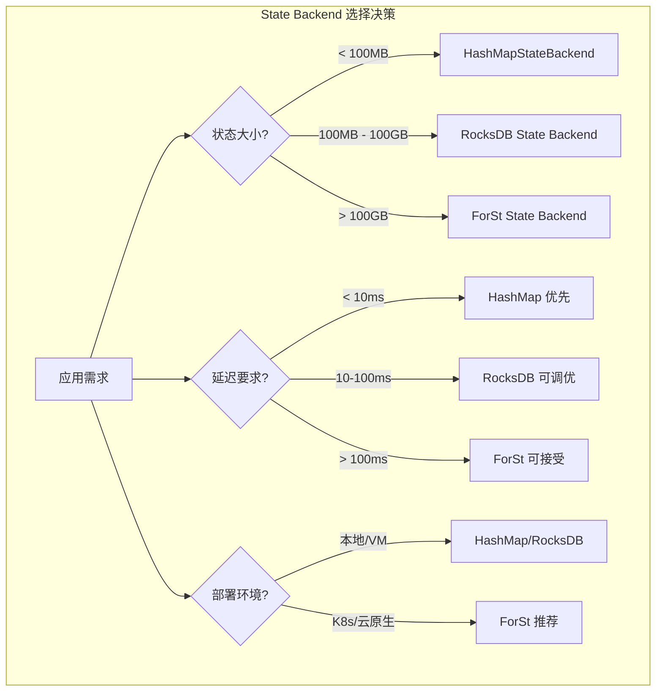

**详细映射表**:

| 场景特征 | 推荐 Backend | 理由 |
|---------|-------------|------|
| 小状态 (< 100MB)，低延迟 | HashMapStateBackend | 内存访问，纳秒级延迟 |
| 中等状态 (100MB - 10GB) | RocksDB + 全量 Checkpoint | 磁盘存储，异步快照 |
| 大状态 (> 10GB) | RocksDB + 增量 Checkpoint | 减少 I/O，降低超时风险 |
| 超大规模 (> 1TB) | ForSt | 分离存储，弹性扩展 |
| 频繁点查 | HashMapStateBackend | $O(1)$ 哈希查找 |
| 范围扫描 | RocksDB/ForSt | LSM-Tree 优化 |
| 云原生部署 | ForSt | 存储计算分离，成本优化 |

---

### 3.2 State 类型与操作语义关系

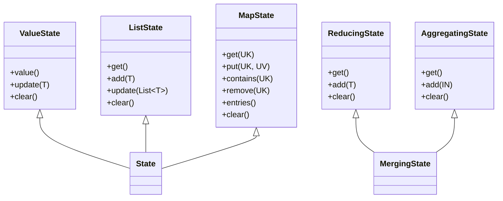

---

### 3.3 Checkpoint 机制与一致性级别

| Checkpoint 模式 | 对齐策略 | 一致性保证 | 延迟影响 |
|----------------|---------|-----------|---------|
| Aligned + Exactly-Once | Barrier 对齐 | 强一致性 | 中等 |
| Unaligned + Exactly-Once | 非对齐 + in-flight 数据 | 强一致性 | 低 |
| Aligned + At-Least-Once | Barrier 不对齐 | 至少一次 | 低 |

**关系推导**:

$$
\text{Exactly-Once} \Rightarrow \text{Aligned} \lor (\text{Unaligned} \land \text{InFlightSnapshot})
$$

---

## 4. 论证过程 (Argumentation)

### 4.1 State Backend 深度对比

#### 4.1.1 性能对比矩阵

| 维度 | HashMapStateBackend | EmbeddedRocksDBStateBackend | ForStStateBackend |
|-----|--------------------|----------------------------|-------------------|
| **访问延迟** | ⭐⭐⭐⭐⭐ (ns) | ⭐⭐⭐ (μs-ms) | ⭐⭐ (ms) |
| **存储容量** | ⭐⭐ (< 10GB) | ⭐⭐⭐⭐ (TB) | ⭐⭐⭐⭐⭐ (PB) |
| **Checkpoint 速度** | ⭐⭐⭐ (全量) | ⭐⭐⭐⭐ (增量) | ⭐⭐⭐⭐⭐ (元数据) |
| **恢复速度** | ⭐⭐⭐⭐ | ⭐⭐⭐ | ⭐⭐⭐⭐⭐ (LazyRestore) |
| **内存效率** | ⭐⭐ | ⭐⭐⭐⭐ | ⭐⭐⭐⭐⭐ |
| **CPU 开销** | ⭐⭐⭐⭐⭐ (低) | ⭐⭐⭐ (中) | ⭐⭐ (高序列化) |
| **磁盘 I/O** | 无 | 高 | 中（网络 I/O） |
| **序列化开销** | 仅在 Checkpoint 时 | 每次读写 | 每次读写 |
| **云原生友好** | ⭐⭐ | ⭐⭐⭐ | ⭐⭐⭐⭐⭐ |
| **成本效率** | ⭐⭐⭐ | ⭐⭐⭐ | ⭐⭐⭐⭐⭐ |

#### 4.1.2 技术实现差异

```mermaid
graph TB
    subgraph "HashMapStateBackend"
        H1[KeyedProcessFunction] --> H2[HashMap State Table]
        H2 --> H3[JVM Heap Memory]
        H3 --> H4[Async Snapshot<br/>Copy-on-Write]
    end

    subgraph "RocksDBStateBackend"
        R1[KeyedProcessFunction] --> R2[RocksDB JNI]
        R2 --> R3[MemTable<br/>WAL]
        R3 --> R4[SST Files<br/>LSM-Tree]
        R4 --> R5[Local Disk]
        R5 --> R6[Incremental Snapshot]
    end

    subgraph "ForStStateBackend"
        F1[KeyedProcessFunction] --> F2[Local Cache<br/>LRU/SLRU]
        F2 --> F3[Cache Miss?]
        F3 -->|Yes| F4[Async Fetch<br/>from DFS]
        F3 -->|No| F5[Direct Read]
        F4 --> F6[Unified File System<br/>S3/HDFS]
        F6 --> F7[Metadata Snapshot]
    end
```

---

### 4.2 状态类型选择决策树

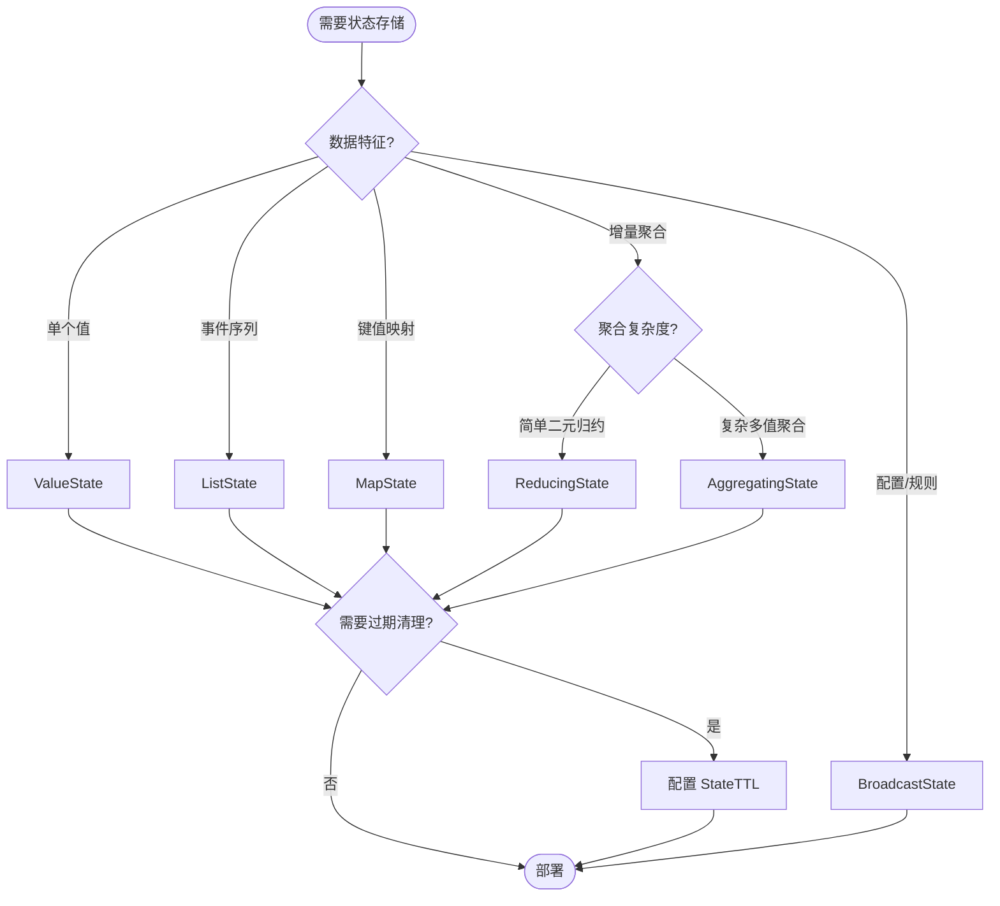

---

### 4.3 Checkpoint 机制详解

#### 4.3.1 全量 Checkpoint vs 增量 Checkpoint vs Changelog

| 特性 | 全量 Checkpoint | 增量 Checkpoint | Changelog State Backend |
|-----|----------------|----------------|------------------------|
| 快照内容 | 完整状态数据 | 自上次 Checkpoint 的变更 | 实时状态变更流 |
| 存储开销 | $O(|S|)$ | $O(|\Delta S|)$ | $O(|S|) + O(|Changelog|)$ |
| 恢复时间 | $O(|S|)$ | $O(|S|)$（需合并） | $O(|S_{base}|) + O(|Changelog|)$（并行） |
| 网络传输 | 大 | 小 | 持续 |
| 恢复速度 | 分钟级 | 分钟级 | 秒级 |
| 适用场景 | 小状态 | 大状态 | 延迟敏感、秒级恢复需求 |

**Changelog State Backend 原理**:

基于状态变更的实时物化：

$$
CP_n^{changelog} = \{ \delta_1, \delta_2, \ldots, \delta_n \} \quad \text{where} \quad \delta_i = S_{t_i} - S_{t_{i-1}}
$$

**RocksDB 增量 Checkpoint 原理**:

基于 SST 文件不可变性：

$$
CP_n^{inc} = \{ f \in \text{SST}_n \mid f \notin \text{SST}_{n-1} \}
$$

#### 4.3.2 Checkpoint 配置参数

```java
import java.time.Duration;
import org.apache.flink.configuration.Configuration;
import org.apache.flink.contrib.streaming.state.EmbeddedRocksDBStateBackend;
import org.apache.flink.streaming.api.CheckpointingMode;
import org.apache.flink.streaming.api.windowing.time.Time;
import org.apache.flink.streaming.api.environment.StreamExecutionEnvironment;

public class Example {
    public static void main(String[] args) throws Exception {
        StreamExecutionEnvironment env = StreamExecutionEnvironment.getExecutionEnvironment();

        // 基础配置
        env.enableCheckpointing(60000);  // 60秒间隔
        env.getCheckpointConfig().setCheckpointingMode(CheckpointingMode.EXACTLY_ONCE);
        env.getCheckpointConfig().setCheckpointTimeout(600000);  // 10分钟超时
        env.getCheckpointConfig().setMaxConcurrentCheckpoints(1);
        env.getCheckpointConfig().setMinPauseBetweenCheckpoints(30000);

        // 增量 Checkpoint(RocksDB)
        env.setStateBackend(new EmbeddedRocksDBStateBackend(true));

        // Unaligned Checkpoint
        env.getCheckpointConfig().enableUnalignedCheckpoints();
        env.getCheckpointConfig().setAlignmentTimeout(Duration.ofSeconds(30));

        // Changelog State Backend (Flink 1.15+)
        Configuration config = new Configuration();
        config.setBoolean("state.backend.changelog.enabled", true);
        config.setString("state.backend.changelog.storage", "filesystem");
        env.configure(config);

    }
}

```

---

### 4.4 State TTL 过期策略

| 策略 | 触发时机 | 及时性 | CPU 开销 |
|-----|---------|--------|---------|
| Full Snapshot | Checkpoint 完成 | 低 | 低 |
| Incremental | 状态访问时 | 高 | 中 |
| RocksDB Compaction Filter | Compaction 时 | 中 | 低 |

**TTL 配置要素**:

$$
\text{TTL}_{effective} = \text{base TTL} + \text{cleanup delay}
$$

其中 cleanup delay 取决于选择的清理策略。

---

## 5. 形式证明 / 工程论证 (Proof / Engineering Argument)

### Thm-F-02-90: State Backend 选择最优性定理

**定理**: 对于给定的应用特征向量 $\vec{A} = \langle \text{size}, \text{latency}, \text{throughput}, \text{cost} \rangle$，存在唯一的 State Backend 选择 $B^*$ 使得综合成本函数最小：

$$
B^* = \arg\min_{B \in \mathcal{B}} \mathcal{C}(\vec{A}, B)
$$

其中成本函数：

$$
\mathcal{C}(\vec{A}, B) = w_1 \cdot \text{LatencyCost} + w_2 \cdot \text{StorageCost} + w_3 \cdot \text{CheckpointCost} + w_4 \cdot \text{RecoveryCost}
$$

**证明**:

**情况 1**: 当 $\text{size} < 100\text{MB}$ 且 $\text{latency} < 10\text{ms}$：

- HashMap: $\mathcal{C} = 0 + O(1) + O(|S|) + O(|S|)$（低延迟优势）
- RocksDB: $\mathcal{C} = O(\log N) + O(1) + O(|\Delta S|) + O(|S|)$
- ForSt: $\mathcal{C} = O(\text{network}) + O(0.1) + O(1) + O(|M|)$

HashMap 延迟成本最低，因此 $B^* = \text{HashMap}$。

**情况 2**: 当 $100\text{MB} < \text{size} < 10\text{GB}$：

RocksDB 的增量 Checkpoint 显著降低网络传输成本，综合最优。

**情况 3**: 当 $\text{size} > 100\text{GB}$：

ForSt 的分离存储架构突破本地容量限制，唯一可行解。

$\square$

---

### Thm-F-02-91: Checkpoint 完备性定理

**定理**: 对于任意 Checkpoint 序列 $CP_1, CP_2, \ldots, CP_n$，若每个 Checkpoint 成功完成，则恢复后的状态 $S_{recovered}$ 等于最新成功 Checkpoint 对应的状态：

$$
S_{recovered} = S_{CP_{\max \{ i \mid CP_i \text{ completed} \}}}
$$

**证明**:

基于 Chandy-Lamport 快照算法的正确性[^2]，Flink Checkpoint 构成一致割集。每个算子状态快照发生在收到所有输入 Barrier 之后，因此捕获的是截止到 Barrier 的完整处理结果。

恢复时，系统从 Checkpoint 元数据重建状态，并 Replay Checkpoint 后的数据。由于数据源可重放且算子确定性，恢复后的执行轨迹与原始执行等价。

$\square$

---

### Thm-F-02-92: State TTL 一致性定理

**定理**: 配置为 `NeverReturnExpired` 的 TTL 保证：

$$
\forall s \in \text{State}: \text{read}(s) \neq \bot \Rightarrow t_{now} - t_{lastAccess} \leq \tau
$$

**证明**:

TTL 过滤器在每次状态访问时检查过期条件。若状态过期且可见性为 `NeverReturnExpired`，过滤器返回 `null`，上层逻辑视为状态不存在。

由于时钟单调递增，一旦状态过期，将永远满足过期条件，不会错误地返回过期值。

$\square$

---

### 工程论证：状态查询性能优化

**QueryableState 架构**: [^3]

QueryableState 允许外部客户端直接查询 Flink 内部状态，但存在以下限制：

1. **一致性限制**: 查询结果反映的是某一时刻的快照，非实时更新
2. **性能影响**: 高并发查询会影响正常数据处理
3. **可用性限制**: 查询目标 Task 必须正在运行

**优化策略**:

$$
\text{QueryThroughput} = \frac{\text{AvailableThreads}}{\text{QueryLatency} + \text{StateAccessTime}}
$$

通过增加 QueryableState Server 线程数和优化状态访问路径，可提升查询吞吐量。

---

## 6. 实例验证 (Examples)

### 6.1 ValueState 完整示例

```java
import org.apache.flink.api.common.state.ValueState;
import org.apache.flink.api.common.state.ValueStateDescriptor;
import org.apache.flink.api.common.time.Time;
import org.apache.flink.configuration.Configuration;
import org.apache.flink.streaming.api.functions.KeyedProcessFunction;
import org.apache.flink.util.Collector;

import org.apache.flink.streaming.api.windowing.time.Time;


/**
 * Def-F-02-98: 带 TTL 的会话状态管理
 */
public class SessionTracker extends KeyedProcessFunction<String, Event, SessionResult> {

    private ValueState<SessionInfo> sessionState;
    private static final long SESSION_TIMEOUT_MS = Time.minutes(30).toMilliseconds();

    @Override
    public void open(Configuration parameters) {
        // 配置 TTL
        StateTtlConfig ttlConfig = StateTtlConfig
            .newBuilder(Time.minutes(30))
            .setUpdateType(StateTtlConfig.UpdateType.OnReadAndWrite)
            .setStateVisibility(StateTtlConfig.StateVisibility.NeverReturnExpired)
            .cleanupIncrementally(10, true)
            .build();

        ValueStateDescriptor<SessionInfo> descriptor = new ValueStateDescriptor<>(
            "session-info",
            SessionInfo.class
        );
        descriptor.enableTimeToLive(ttlConfig);
        sessionState = getRuntimeContext().getState(descriptor);
    }

    @Override
    public void processElement(Event event, Context ctx, Collector<SessionResult> out)
            throws Exception {
        SessionInfo session = sessionState.value();
        long currentTime = ctx.timestamp();

        if (session == null) {
            // 新会话
            session = new SessionInfo(event.getUserId(), currentTime);
        } else if (currentTime - session.getLastActivityTime() > SESSION_TIMEOUT_MS) {
            // 会话过期,输出旧会话结果
            out.collect(new SessionResult(session, true));
            session = new SessionInfo(event.getUserId(), currentTime);
        }

        session.addEvent(event);
        sessionState.update(session);

        // 注册定时器检查会话超时
        ctx.timerService().registerEventTimeTimer(
            session.getLastActivityTime() + SESSION_TIMEOUT_MS
        );
    }

    @Override
    public void onTimer(long timestamp, OnTimerContext ctx, Collector<SessionResult> out)
            throws Exception {
        SessionInfo session = sessionState.value();
        if (session != null && timestamp >= session.getLastActivityTime() + SESSION_TIMEOUT_MS) {
            out.collect(new SessionResult(session, true));
            sessionState.clear();
        }
    }
}
```

---

### 6.2 ListState 完整示例

```java
/**
 * Def-F-02-99: 事件缓冲区 - 批量处理模式
 */
public class EventBuffer extends KeyedProcessFunction<String, Event, List<Event>> {

    private ListState<Event> bufferedEvents;
    private static final int BATCH_SIZE = 100;
    private static final long FLUSH_INTERVAL_MS = 5000;

    @Override
    public void open(Configuration parameters) {
        ListStateDescriptor<Event> descriptor = new ListStateDescriptor<>(
            "event-buffer",
            Event.class
        );
        bufferedEvents = getRuntimeContext().getListState(descriptor);
    }

    @Override
    public void processElement(Event event, Context ctx, Collector<List<Event>> out)
            throws Exception {
        bufferedEvents.add(event);

        // 检查缓冲区大小
        Iterable<Event> events = bufferedEvents.get();
        int count = 0;
        for (Event e : events) {
            count++;
        }

        if (count >= BATCH_SIZE) {
            flushBuffer(out);
        }

        // 注册定时刷新
        ctx.timerService().registerProcessingTimeTimer(
            ctx.timerService().currentProcessingTime() + FLUSH_INTERVAL_MS
        );
    }

    @Override
    public void onTimer(long timestamp, OnTimerContext ctx, Collector<List<Event>> out)
            throws Exception {
        flushBuffer(out);
    }

    private void flushBuffer(Collector<List<Event>> out) throws Exception {
        List<Event> batch = new ArrayList<>();
        for (Event event : bufferedEvents.get()) {
            batch.add(event);
        }

        if (!batch.isEmpty()) {
            out.collect(batch);
            bufferedEvents.clear();
        }
    }
}
```

---

### 6.3 MapState 完整示例

```java
/**
 * Def-F-02-100: 用户行为计数器 - MapState 应用
 */
public class UserBehaviorCounter extends KeyedProcessFunction<String, UserEvent, Metrics> {

    private MapState<String, Long> behaviorCounts;
    private MapState<String, Long> lastUpdateTime;

    @Override
    public void open(Configuration parameters) {
        // 配置 TTL - 7天过期
        StateTtlConfig ttlConfig = StateTtlConfig
            .newBuilder(Time.days(7))
            .setUpdateType(StateTtlConfig.UpdateType.OnCreateAndWrite)
            .setStateVisibility(StateTtlConfig.StateVisibility.NeverReturnExpired)
            .cleanupInRocksdbCompactFilter(1000)
            .build();

        MapStateDescriptor<String, Long> countDescriptor = new MapStateDescriptor<>(
            "behavior-counts",
            String.class,
            Long.class
        );
        countDescriptor.enableTimeToLive(ttlConfig);
        behaviorCounts = getRuntimeContext().getMapState(countDescriptor);

        MapStateDescriptor<String, Long> timeDescriptor = new MapStateDescriptor<>(
            "last-update",
            String.class,
            Long.class
        );
        timeDescriptor.enableTimeToLive(ttlConfig);
        lastUpdateTime = getRuntimeContext().getMapState(timeDescriptor);
    }

    @Override
    public void processElement(UserEvent event, Context ctx, Collector<Metrics> out)
            throws Exception {
        String behavior = event.getBehaviorType();

        // 更新计数
        Long count = behaviorCounts.get(behavior);
        if (count == null) {
            count = 0L;
        }
        behaviorCounts.put(behavior, count + 1);
        lastUpdateTime.put(behavior, ctx.timestamp());

        // 每100次输出一次聚合指标
        if ((count + 1) % 100 == 0) {
            Map<String, Long> snapshot = new HashMap<>();
            for (Map.Entry<String, Long> entry : behaviorCounts.entries()) {
                snapshot.put(entry.getKey(), entry.getValue());
            }
            out.collect(new Metrics(event.getUserId(), snapshot, ctx.timestamp()));
        }
    }
}
```

---

### 6.4 ReducingState 完整示例

```java
/**
 * Def-F-02-101: 增量聚合 - ReducingState 应用
 */
public class IncrementalAggregator extends KeyedProcessFunction<String, SensorReading, AggregatedResult> {

    private ReducingState<SensorReading> reducingState;

    @Override
    public void open(Configuration parameters) {
        // 归约函数:合并两个 SensorReading,保持总和与计数
        ReduceFunction<SensorReading> reduceFunction = (a, b) -> {
            return new SensorReading(
                a.getSensorId(),
                a.getTimestamp(),  // 保留最早时间戳
                a.getValue() + b.getValue(),  // 累加值
                a.getCount() + b.getCount()   // 累加计数
            );
        };

        ReducingStateDescriptor<SensorReading> descriptor = new ReducingStateDescriptor<>(
            "sensor-aggregate",
            reduceFunction,
            SensorReading.class
        );
        reducingState = getRuntimeContext().getReducingState(descriptor);
    }

    @Override
    public void processElement(SensorReading reading, Context ctx, Collector<AggregatedResult> out)
            throws Exception {
        reducingState.add(reading);

        // 窗口结束时输出聚合结果
        SensorReading aggregated = reducingState.get();
        if (aggregated != null && aggregated.getCount() >= 100) {
            double avg = aggregated.getValue() / aggregated.getCount();
            out.collect(new AggregatedResult(
                reading.getSensorId(),
                avg,
                aggregated.getCount(),
                ctx.timestamp()
            ));
            reducingState.clear();
        }
    }
}
```

---

### 6.5 AggregatingState 完整示例

```java
/**
 * Def-F-02-102: 复杂聚合 - AggregatingState 应用
 */

import org.apache.flink.api.common.functions.AggregateFunction;

public class ComplexAggregator extends KeyedProcessFunction<String, Trade, TradeStatistics> {

    private AggregatingState<Trade, TradeStatistics> tradeStats;

    @Override
    public void open(Configuration parameters) {
        // 聚合函数:累积交易统计
        AggregateFunction<Trade, TradeStatisticsAccumulator, TradeStatistics> aggregateFunction =
            new AggregateFunction<Trade, TradeStatisticsAccumulator, TradeStatistics>() {

            @Override
            public TradeStatisticsAccumulator createAccumulator() {
                return new TradeStatisticsAccumulator();
            }

            @Override
            public TradeStatisticsAccumulator add(Trade trade, TradeStatisticsAccumulator acc) {
                acc.addTrade(trade);
                return acc;
            }

            @Override
            public TradeStatistics getResult(TradeStatisticsAccumulator acc) {
                return acc.toStatistics();
            }

            @Override
            public TradeStatisticsAccumulator merge(TradeStatisticsAccumulator a, TradeStatisticsAccumulator b) {
                return a.merge(b);
            }
        };

        AggregatingStateDescriptor<Trade, TradeStatisticsAccumulator, TradeStatistics> descriptor =
            new AggregatingStateDescriptor<>(
                "trade-statistics",
                aggregateFunction,
                TradeStatisticsAccumulator.class
            );
        tradeStats = getRuntimeContext().getAggregatingState(descriptor);
    }

    @Override
    public void processElement(Trade trade, Context ctx, Collector<TradeStatistics> out)
            throws Exception {
        tradeStats.add(trade);

        // 每分钟输出当前统计
        TradeStatistics stats = tradeStats.get();
        if (stats != null && ctx.timestamp() - stats.getWindowStart() >= 60000) {
            out.collect(stats);
            tradeStats.clear();
        }
    }
}
```

---

### 6.6 BroadcastState 完整示例

```java
/**
 * Def-F-02-103: 动态规则处理 - BroadcastState 应用
 */

import org.apache.flink.streaming.api.environment.StreamExecutionEnvironment;
import org.apache.flink.streaming.api.datastream.DataStream;
import org.apache.flink.api.common.state.ValueState;
import org.apache.flink.api.common.state.ValueStateDescriptor;

public class DynamicRuleProcessor {

    public static void main(String[] args) throws Exception {
        StreamExecutionEnvironment env = StreamExecutionEnvironment.getExecutionEnvironment();

        // 事件流
        DataStream<Event> events = env.addSource(new EventSource());

        // 规则流(广播)
        DataStream<Rule> rules = env.addSource(new RuleSource());

        // 广播状态描述符
        MapStateDescriptor<String, Rule> ruleStateDescriptor = new MapStateDescriptor<>(
            "rules",
            String.class,
            Rule.class
        );

        BroadcastStream<Rule> broadcastRules = rules.broadcast(ruleStateDescriptor);

        // 连接事件流和规则流
        DataStream<Alert> alerts = events
            .keyBy(Event::getUserId)
            .connect(broadcastRules)
            .process(new RuleEvaluator(ruleStateDescriptor));

        alerts.print();
        env.execute("Dynamic Rule Processing");
    }

    /**
     * 规则评估函数
     */
    public static class RuleEvaluator extends KeyedBroadcastProcessFunction<String, Event, Rule, Alert> {

        private final MapStateDescriptor<String, Rule> ruleStateDescriptor;
        private ValueState<UserProfile> userState;

        public RuleEvaluator(MapStateDescriptor<String, Rule> ruleStateDescriptor) {
            this.ruleStateDescriptor = ruleStateDescriptor;
        }

        @Override
        public void open(Configuration parameters) {
            userState = getRuntimeContext().getState(
                new ValueStateDescriptor<>("user-profile", UserProfile.class)
            );
        }

        @Override
        public void processElement(Event event, ReadOnlyContext ctx, Collector<Alert> out)
                throws Exception {
            UserProfile profile = userState.value();
            if (profile == null) {
                profile = new UserProfile(event.getUserId());
            }
            profile.update(event);
            userState.update(profile);

            // 读取广播的规则进行匹配
            ReadOnlyBroadcastState<String, Rule> rules = ctx.getBroadcastState(ruleStateDescriptor);
            for (Map.Entry<String, Rule> entry : rules.immutableEntries()) {
                Rule rule = entry.getValue();
                if (rule.matches(profile, event)) {
                    out.collect(new Alert(event.getUserId(), rule.getId(), event.getTimestamp()));
                }
            }
        }

        @Override
        public void processBroadcastElement(Rule rule, Context ctx, Collector<Alert> out)
                throws Exception {
            BroadcastState<String, Rule> rules = ctx.getBroadcastState(ruleStateDescriptor);

            if (rule.isDelete()) {
                rules.remove(rule.getId());
            } else {
                rules.put(rule.getId(), rule);
            }
        }
    }
}
```

---

### 6.7 State Backend 配置完整示例

```java
/**
 * Thm-F-02-93: State Backend 综合配置
 */

import org.apache.flink.streaming.api.environment.StreamExecutionEnvironment;

public class StateBackendConfiguration {

    /**
     * HashMapStateBackend 配置 - 小状态、低延迟场景
     */
    public static void configureHashMapBackend(StreamExecutionEnvironment env) {
        // 设置堆内存状态后端
        HashMapStateBackend hashMapBackend = new HashMapStateBackend();
        env.setStateBackend(hashMapBackend);

        // Checkpoint 配置
        env.enableCheckpointing(10000);  // 10秒间隔
        env.getCheckpointConfig().setCheckpointStorage("file:///tmp/flink-checkpoints");

        // 内存调优(flink-conf.yaml)
        // taskmanager.memory.framework.heap.size: 512mb
        // taskmanager.memory.task.heap.size: 2gb
    }

    /**
     * RocksDB State Backend 配置 - 大状态场景
     */
    public static void configureRocksDBBackend(StreamExecutionEnvironment env) {
        // 启用增量 Checkpoint
        EmbeddedRocksDBStateBackend rocksDbBackend = new EmbeddedRocksDBStateBackend(true);
        env.setStateBackend(rocksDbBackend);

        // Checkpoint 配置
        env.enableCheckpointing(60000);  // 60秒间隔
        env.getCheckpointConfig().setCheckpointStorage("hdfs:///flink/checkpoints");
        env.getCheckpointConfig().setCheckpointTimeout(600000);

        // RocksDB 调优配置
        DefaultConfigurableOptionsFactory optionsFactory = new DefaultConfigurableOptionsFactory();
        optionsFactory.setRocksDBOptions("write_buffer_size", "64MB");
        optionsFactory.setRocksDBOptions("target_file_size_base", "32MB");
        optionsFactory.setRocksDBOptions("max_bytes_for_level_base", "256MB");
        optionsFactory.setRocksDBOptions("table_cache_numshardbits", "6");

        env.setRocksDBStateBackend(rocksDbBackend, optionsFactory);
    }

    /**
     * ForSt State Backend 配置 - Flink 2.0+ 云原生场景
     */
    public static void configureForStBackend(StreamExecutionEnvironment env) {
        // Flink 2.0+ 配置
        ForStStateBackend forstBackend = new ForStStateBackend();
        forstBackend.setUFSStoragePath("s3://flink-state-bucket/jobs/job-001");
        forstBackend.setLocalCacheSize("10 gb");
        forstBackend.setLazyRestoreEnabled(true);

        env.setStateBackend(forstBackend);

        // Checkpoint 配置(ForSt 推荐较长间隔)
        env.enableCheckpointing(120000);  // 2分钟间隔
        env.getCheckpointConfig().setCheckpointStorage("s3://flink-checkpoints");
    }
}
```

---

## 7. 可视化 (Visualizations)

### 7.1 State Backend 架构对比图

```mermaid
graph TB
    subgraph "HashMapStateBackend"
        H1[Operator] --> H2[StateManager]
        H2 --> H3[HashMap Table]
        H3 --> H4[JVM Heap]
        H4 --> H5[Async Snapshot]
        H5 --> H6[Checkpoint Storage]
    end

    subgraph "RocksDBStateBackend"
        R1[Operator] --> R2[StateManager]
        R2 --> R3[RocksDB JNI]
        R3 --> R4[MemTable]
        R3 --> R5[Block Cache]
        R4 --> R6[SST Files]
        R6 --> R7[Local Disk]
        R7 --> R8[Incremental Snapshot]
        R8 --> R9[Checkpoint Storage]
    end

    subgraph "ForStStateBackend"
        F1[Operator] --> F2[StateManager]
        F2 --> F3[Local Cache]
        F3 -->|Hit| F4[Memory]
        F3 -->|Miss| F5[Async Fetch]
        F5 --> F6[UFS Client]
        F6 --> F7[S3/HDFS]
        F7 --> F8[Metadata Snapshot]
        F8 --> F9[Checkpoint Storage]
    end
```

---

### 7.2 State 类型选择决策树

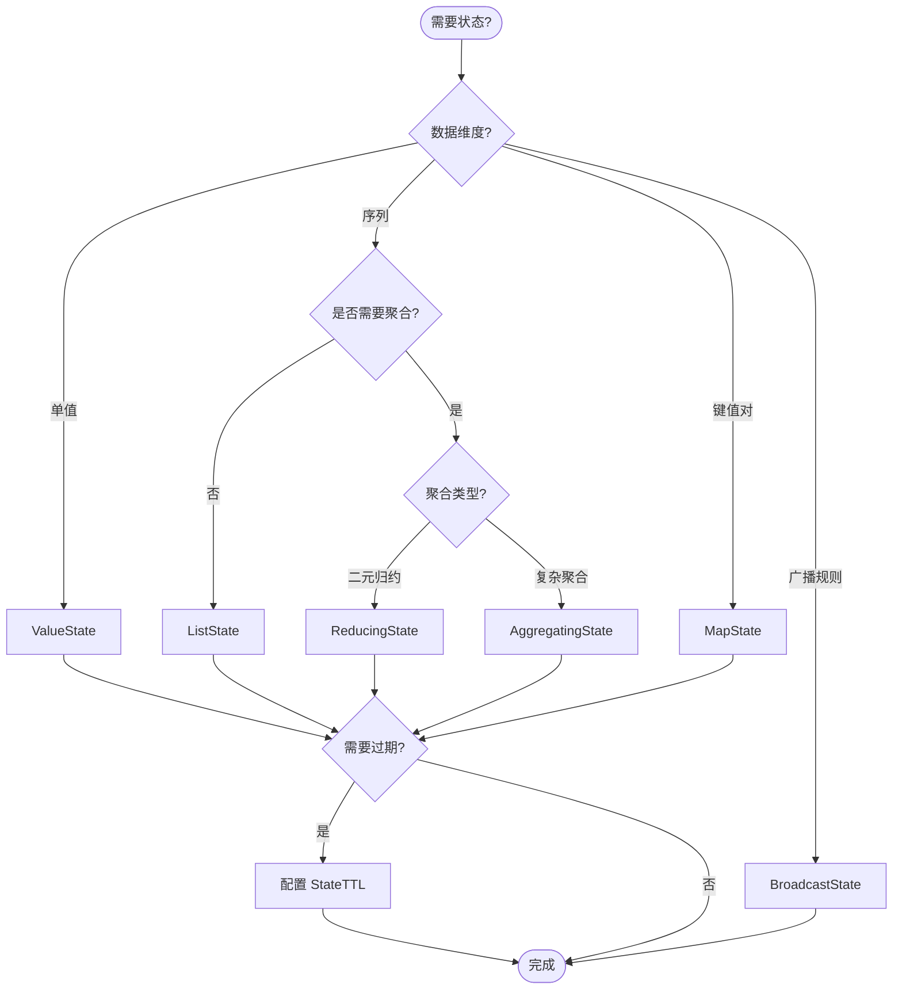

---

### 7.3 Checkpoint 生命周期时序图

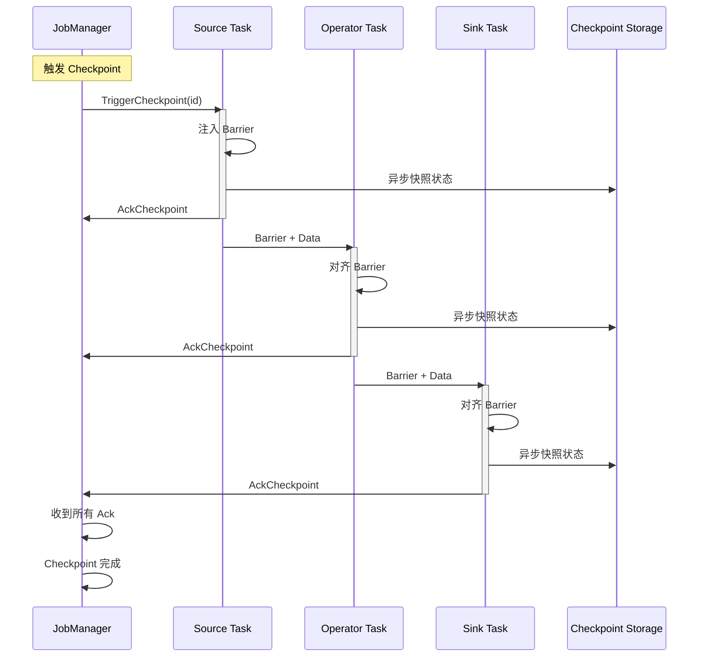

---

### 7.4 TTL 清理策略对比

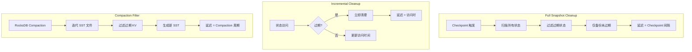

---

### 7.5 状态管理完整架构关联树

以下架构关联树展示了 Flink 状态管理从用户 API 到持久化的完整分层调用关系与数据流路径：

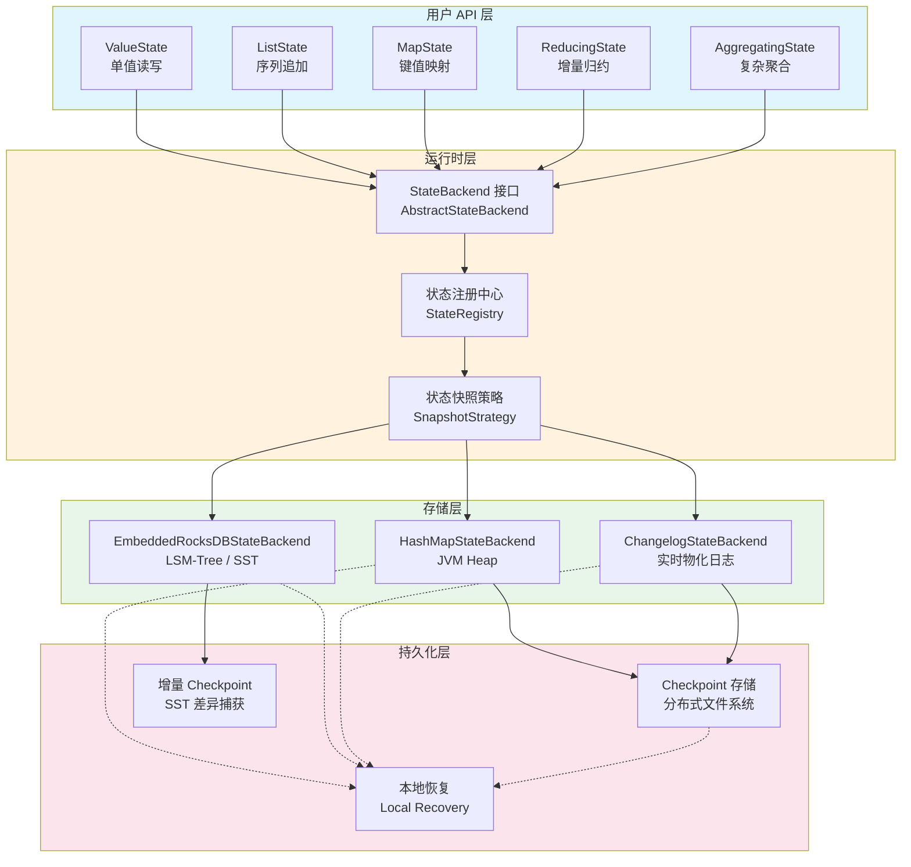

**分层说明**：

1. **用户 API 层**：开发者直接交互的五种 Keyed State 类型，所有操作最终通过 `StateBackend` 接口下沉到运行时。
2. **运行时层**：`StateBackend` 负责状态注册、生命周期管理与快照策略调度，是连接 API 与存储的桥梁。
3. **存储层**：三种主要后端实现。`HashMapStateBackend` 提供纳秒级延迟；`EmbeddedRocksDBStateBackend` 通过 LSM-Tree 支撑大状态；`ChangelogStateBackend` 在基础后端之上叠加实时变更物化，实现秒级恢复。
4. **持久化层**：Checkpoint 数据最终写入分布式存储（HDFS/S3）。`增量 Checkpoint` 仅捕获 SST 文件差异；`本地恢复` 利用 TaskManager 本地磁盘副本加速重启[^6][^8]。

---

### 7.6 状态一致性保证推理树

以下推理树自底向上推导 Flink 状态一致性保证的成立条件：

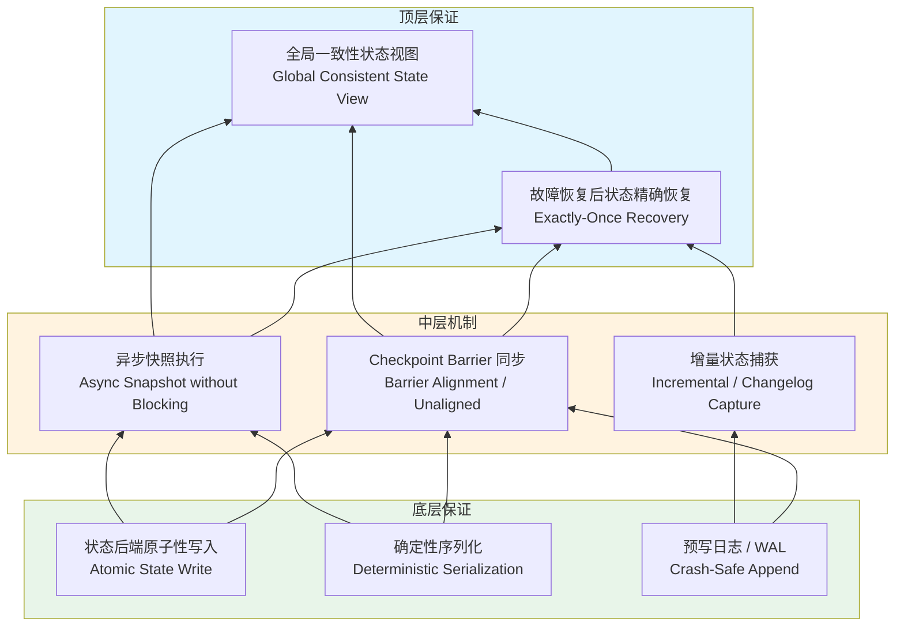

**推导链条**：

- **底层 → 中层**：状态后端通过原子性写入与确定性序列化，确保任意时刻状态表示是明确的；预写日志（WAL）保证进程崩溃后不丢失已确认写入。这为 Checkpoint Barrier 的同步对齐提供了可快照的确定性状态[^2][^7]。
- **中层 → 顶层**：Barrier 同步定义了全局一致的时间截断点；异步快照避免阻塞数据流，保证快照期间的持续处理；增量/ Changelog 捕获机制在不牺牲一致性的前提下降低 I/O 开销。三者共同构成恢复时所需的完整状态证据[^6][^8]。
- **顶层结论**：当故障发生后，系统从最新成功 Checkpoint 恢复，并结合数据源可重放特性，最终重建的状态与故障前全局一致视图等价，即满足 `restore(CP_n) = S_{t_n}`（参见 Prop-F-02-71）。

---

### 7.7 状态后端选型概念矩阵

以下矩阵从状态规模与延迟-吞吐权衡两个维度对比四种典型后端：

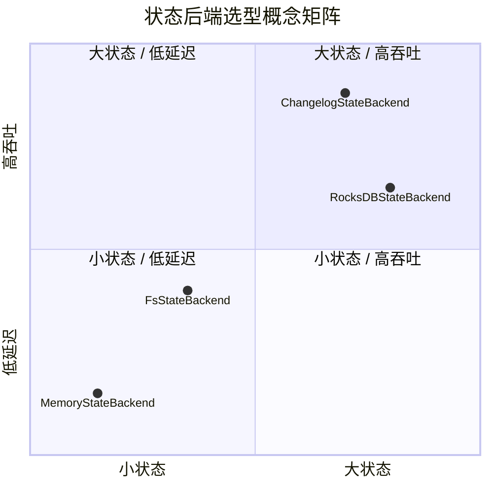

**矩阵解读**：

| 后端 | 定位 | 核心权衡 |
|------|------|---------|
| **MemoryStateBackend** | 左下象限 | 极小状态（< 100 MB）、极低延迟（ns 级），但吞吐受 JVM GC 与堆容量限制 |
| **FsStateBackend** | 左中象限 | 中小状态、内存+文件系统混合，已被 Flink 1.13+ 的 `HashMapStateBackend + CheckpointStorage` 替代 |
| **RocksDBStateBackend** | 右中象限 | 大状态（TB 级）可落地磁盘，LSM-Tree 顺序写换取高吞吐，点查延迟在 μs–ms 级 |
| **ChangelogStateBackend** | 右上象限 | 在 RocksDB/HashMap 之上叠加实时变更日志，Checkpoint 间隔可放大，整体吞吐最高，恢复延迟降至秒级[^4][^9] |

---

## 8. 性能调优与故障排查

### 8.1 State Backend 选择指南

#### 8.1.1 决策矩阵

| 评估维度 | HashMap | RocksDB | ForSt |
|---------|---------|---------|-------|
| **状态大小** | < 100MB | 100MB - 100GB | > 100GB |
| **访问延迟要求** | < 1ms | 1-10ms | > 10ms 可接受 |
| **Checkpoint 频率** | 高频 | 中频 | 低频 |
| **恢复时间要求** | 秒级 | 分钟级 | 亚秒级 (LazyRestore) |
| **部署环境** | 单机/VM | VM/Bare Metal | K8s/云原生 |
| **成本敏感度** | 中 | 中 | 高 |

#### 8.1.2 配置模板

**小状态、低延迟模板**:

```java
import org.apache.flink.runtime.state.hashmap.HashMapStateBackend;
import org.apache.flink.streaming.api.environment.StreamExecutionEnvironment;

public class Example {
    public static void main(String[] args) throws Exception {
        StreamExecutionEnvironment env = StreamExecutionEnvironment.getExecutionEnvironment();
        // 堆内存配置
        env.setStateBackend(new HashMapStateBackend());
        env.enableCheckpointing(10000);
        env.getCheckpointConfig().setCheckpointStorage("file:///tmp/checkpoints");

        // flink-conf.yaml
        taskmanager.memory.framework.heap.size: 512mb
        taskmanager.memory.task.heap.size: 2gb
        taskmanager.memory.managed.size: 256mb

    }
}

```

**大状态、高吞吐模板**:

```java
import org.apache.flink.contrib.streaming.state.EmbeddedRocksDBStateBackend;
import org.apache.flink.streaming.api.environment.StreamExecutionEnvironment;

public class Example {
    public static void main(String[] args) throws Exception {
        StreamExecutionEnvironment env = StreamExecutionEnvironment.getExecutionEnvironment();
        // RocksDB 增量 Checkpoint
        EmbeddedRocksDBStateBackend rocksDb = new EmbeddedRocksDBStateBackend(true);
        env.setStateBackend(rocksDb);
        env.enableCheckpointing(60000);
        env.getCheckpointConfig().setCheckpointStorage("hdfs:///checkpoints");

        // 调优参数
        DefaultConfigurableOptionsFactory factory = new DefaultConfigurableOptionsFactory();
        factory.setRocksDBOptions("write_buffer_size", "64MB");
        factory.setRocksDBOptions("max_write_buffer_number", "4");
        factory.setRocksDBOptions("target_file_size_base", "32MB");
        factory.setRocksDBOptions("max_bytes_for_level_base", "256MB");

    }
}

```

**云原生、超大规模模板**:

```yaml
# flink-conf.yaml (Flink 2.0+)
state.backend: forst
state.backend.forst.ufs.type: s3
state.backend.forst.ufs.s3.bucket: flink-state
state.backend.forst.local.cache.size: 10gb
state.backend.forst.restore.mode: LAZY
```

---

### 8.2 状态类型性能调优

#### 8.2.1 ValueState 优化

```java

// [伪代码片段 - 不可直接运行] 仅展示核心逻辑
import org.apache.flink.api.common.typeinfo.Types;

// 使用原始类型减少装箱开销
ValueStateDescriptor<Long> descriptor = new ValueStateDescriptor<>(
    "counter",
    Types.LONG  // 避免使用 Long.class
);

// 批量更新减少状态访问
List<Event> buffer = new ArrayList<>();
for (Event event : events) {
    buffer.add(event);
    if (buffer.size() >= 100) {
        updateState(buffer);  // 批量更新
        buffer.clear();
    }
}
```

#### 8.2.2 MapState 优化

```java
// [伪代码片段 - 不可直接运行] 仅展示核心逻辑
// 批量操作优于单条操作
// 不推荐
for (String key : keys) {
    mapState.put(key, value);  // N 次 JNI 调用
}

// 推荐:使用批量 API(如果可用)或通过设计减少 key 数量
```

#### 8.2.3 ListState 优化

```java
// [伪代码片段 - 不可直接运行] 仅展示核心逻辑
// 控制列表大小,避免 OOM
if (listSize > MAX_LIST_SIZE) {
    flushAndClear();
}

// 使用 Iterable 而非 List 减少内存拷贝
Iterable<Event> events = listState.get();
for (Event event : events) {
    process(event);
}
```

---

### 8.3 Checkpoint 调优

#### 8.3.1 超时与重试配置

```java
import org.apache.flink.streaming.api.windowing.time.Time;
import org.apache.flink.streaming.api.environment.StreamExecutionEnvironment;

public class Example {
    public static void main(String[] args) throws Exception {
        StreamExecutionEnvironment env = StreamExecutionEnvironment.getExecutionEnvironment();
        // Checkpoint 配置
        env.enableCheckpointing(60000);
        env.getCheckpointConfig().setCheckpointTimeout(600000);  // 10分钟超时
        env.getCheckpointConfig().setMaxConcurrentCheckpoints(1);
        env.getCheckpointConfig().setMinPauseBetweenCheckpoints(30000);

        // 失败重试策略
        env.setRestartStrategy(RestartStrategies.fixedDelayRestart(
            3,  // 最大重试次数
            Time.of(10, TimeUnit.SECONDS)  // 重试间隔
        ));

        // 失败容忍配置
        env.getCheckpointConfig().setTolerableCheckpointFailureNumber(3);

    }
}

```

#### 8.3.2 Unaligned Checkpoint 配置

```java
import java.time.Duration;
import org.apache.flink.streaming.api.windowing.time.Time;
import org.apache.flink.streaming.api.environment.StreamExecutionEnvironment;

public class Example {
    public static void main(String[] args) throws Exception {
        StreamExecutionEnvironment env = StreamExecutionEnvironment.getExecutionEnvironment();
        // 低延迟场景启用 Unaligned Checkpoint
        env.getCheckpointConfig().enableUnalignedCheckpoints();
        env.getCheckpointConfig().setAlignmentTimeout(Duration.ofSeconds(30));

        // 控制 in-flight 数据大小
        env.getCheckpointConfig().setMaxUnalignedCheckpoints(2);

        // 启用 aligned checkpoint timeout 自动切换
        env.getCheckpointConfig().setAlignmentTimeout(Duration.ofSeconds(10));

    }
}

```

---

### 8.4 TTL 配置最佳实践

#### 8.4.1 SQL 方式配置 State TTL

Flink SQL 支持通过 SET 命令配置 State TTL[^5]：

```sql
-- 设置全局 State TTL
SET 'sql.state-ttl' = '1 day';
SET 'sql.state-ttl.cleanup-strategy' = 'incremental';

-- 在 CREATE TABLE 中指定 TTL
CREATE TABLE events (
    user_id STRING,
    event_time TIMESTAMP(3),
    WATERMARK FOR event_time AS event_time - INTERVAL '5' SECOND
) WITH (
    'connector' = 'kafka',
    'topic' = 'events',
    'properties.bootstrap.servers' = 'kafka:9092'
);
```

#### 8.4.2 State TTL 重要行为

| 行为 | 说明 |
|------|------|
| TTL 控制内部状态 | State TTL 仅控制 Flink 内部聚合状态，不控制输出 Kafka topic 的数据保留 |
| 过期后重新开始 | 状态过期后，下一个事件会触发新的聚合（从初始值开始） |
| 不读取历史状态 | Flink 不会从 Kafka 读取历史状态进行聚合（基于性能考虑） |

#### 8.4.3 TTL 时长计算公式

$$
\text{TTL}_{effective} = \max(\text{Window Size} + \text{Max Lateness} + \text{Safety Margin}, \text{Compliance Period})
$$

```java

// [伪代码片段 - 不可直接运行] 仅展示核心逻辑
import org.apache.flink.streaming.api.windowing.time.Time;

// 计算示例
Time windowSize = Time.hours(1);
Time allowedLateness = Time.minutes(30);
Time safetyMargin = Time.minutes(15);
Time compliancePeriod = Time.days(7);

Time ttl = Time.milliseconds(Math.max(
    windowSize.toMilliseconds() + allowedLateness.toMilliseconds() + safetyMargin.toMilliseconds(),
    compliancePeriod.toMilliseconds()
));
```

#### 8.4.2 清理策略选择

| 状态后端 | 状态大小 | 推荐清理策略 | 配置代码 |
|---------|---------|-------------|---------|
| HashMap | < 100MB | Full Snapshot | `.cleanupFullSnapshot()` |
| HashMap | 100MB - 1GB | Incremental | `.cleanupIncrementally(10, true)` |
| RocksDB | 任意 | Compaction Filter | `.cleanupInRocksdbCompactFilter(1000)` |

---

### 8.5 故障排查指南

#### 8.5.1 Checkpoint 频繁超时

**诊断步骤**:

```bash
# 1. 检查 Checkpoint 持续时间趋势
# Flink Web UI → Job → Checkpoints → History

# 2. 检查 State 大小增长 curl http://jobmanager:8081/jobs/<job-id>/checkpoints/stats

# 3. 检查 TM 资源使用 top / htop  # CPU
df -h       # 磁盘
free -m     # 内存
```

**解决方案矩阵**:

| 根本原因 | 症状 | 解决方案 |
|---------|------|---------|
| 状态过大 | Checkpoint 大小 > 1GB | 启用增量 Checkpoint |
| 网络瓶颈 | 上传耗时占比高 | 增加网络带宽或调整并行度 |
| 磁盘 I/O | TM 磁盘使用率 100% | 使用 SSD 或 ForSt |
| 反压 | Checkpoint 对齐时间长 | 启用 Unaligned Checkpoint |
| GC 停顿 | 同步阶段耗时高 | 调整 JVM 堆内存配置 |

#### 8.5.2 状态持续增长（OOM 风险）

**排查清单**:

```java
// [伪代码片段 - 不可直接运行] 仅展示核心逻辑
// 1. 检查所有状态是否配置 TTL
@Override
public void open(Configuration parameters) {
    LOG.info("TTL Config: {}" + ttlConfig);  // 确认生效
}

// 2. 监控状态大小
getRuntimeContext().getMetricGroup().gauge("stateSizeBytes",
    (Gauge<Long>) this::estimateStateSize);

// 3. 检查是否有未清理的历史状态
// 在 Checkpoint 中查看 Keyed State 条目数
```

**解决策略**:

```java
import org.apache.flink.api.common.state.StateTtlConfig;
import org.apache.flink.contrib.streaming.state.EmbeddedRocksDBStateBackend;
import org.apache.flink.streaming.api.windowing.time.Time;
import org.apache.flink.streaming.api.environment.StreamExecutionEnvironment;

public class Example {
    public static void main(String[] args) throws Exception {
        StreamExecutionEnvironment env = StreamExecutionEnvironment.getExecutionEnvironment();

        // 策略 1:启用 TTL
        StateTtlConfig ttlConfig = StateTtlConfig
            .newBuilder(Time.hours(24))
            .setUpdateType(StateTtlConfig.UpdateType.OnCreateAndWrite)
            .cleanupInRocksdbCompactFilter()
            .build();

        // 策略 2:切换到 RocksDB
        env.setStateBackend(new EmbeddedRocksDBStateBackend(true));

        // 策略 3:状态分片
        // 使用更细粒度的 key,分散状态到多个 subtask

    }
}

```

#### 8.5.3 状态访问性能问题

**诊断指标**:

```java
// [伪代码片段 - 不可直接运行] 仅展示核心逻辑
// 添加自定义指标监控状态访问延迟
private transient long lastAccessTime;
private transient Histogram stateAccessLatency;

@Override
public void open(Configuration parameters) {
    stateAccessLatency = getRuntimeContext()
        .getMetricGroup()
        .histogram("stateAccessLatency", new DropwizardHistogramWrapper(
            new com.codahale.metrics.Histogram(new SlidingWindowReservoir(500))
        ));
}

@Override
public void processElement(Event event, Context ctx, Collector<Result> out) {
    long start = System.nanoTime();
    State value = state.value();
    stateAccessLatency.update(System.nanoTime() - start);
    // ...
}
```

**优化策略**:

| 问题 | 优化方案 |
|-----|---------|
| RocksDB 读放大 | 增大 block cache 大小 |
| 序列化开销 | 使用 Kryo 或 Avro 序列化 |
| JNI 调用开销 | 批量操作，减少调用次数 |
| 热 key 问题 | key 分区优化，避免数据倾斜 |

---

### 8.6 Changelog State Backend 生产配置

#### 8.6.1 启用 Changelog State Backend

```java
import org.apache.flink.configuration.Configuration;
import org.apache.flink.contrib.streaming.state.EmbeddedRocksDBStateBackend;
import org.apache.flink.streaming.api.environment.StreamExecutionEnvironment;

public class Example {
    public static void main(String[] args) throws Exception {

        /**
         * Def-F-02-105: Changelog State Backend 生产配置
         * 场景:需要秒级恢复的金融交易处理
         */
        public static void configureChangelogBackend(StreamExecutionEnvironment env) {
            // 基础状态后端
            EmbeddedRocksDBStateBackend rocksDbBackend = new EmbeddedRocksDBStateBackend(true);
            env.setStateBackend(rocksDbBackend);

            // 启用 Changelog
            Configuration config = new Configuration();
            config.setBoolean("state.backend.changelog.enabled", true);
            config.setString("state.backend.changelog.storage", "filesystem");
            config.setString("state.backend.changelog.periodic-materialization.interval", "10min");
            config.setInteger("state.backend.changelog.materialization.max-concurrent", 1);
            env.configure(config);

            // Checkpoint 配置(Changelog 推荐较长间隔)
            env.enableCheckpointing(120000);  // 2分钟
            env.getCheckpointConfig().setCheckpointStorage("s3://flink-checkpoints");
        }

    }
}
```

#### 8.6.2 Changelog 配置参数详解

| 配置项 | 默认值 | 说明 |
|-------|--------|------|
| `state.backend.changelog.enabled` | false | 是否启用 Changelog |
| `state.backend.changelog.storage` | filesystem | Changelog 存储类型 |
| `state.backend.changelog.periodic-materialization.interval` | 10min | 物化间隔 |
| `state.backend.changelog.materialization.max-concurrent` | 1 | 最大并发物化任务 |

### 8.7 状态迁移与升级

#### 8.7.1 Savepoint 与 Checkpoint 对比

| 特性 | Checkpoint | Savepoint |
|-----|-----------|-----------|
| 触发方式 | 自动/定时 | 手动触发 |
| 存储位置 | 配置目录 | 指定路径 |
| 状态格式 | 内部格式 | 标准格式 |
| 跨版本兼容 | 有限 | 支持 |
| 用于升级 | 否 | 是 |

#### 8.6.2 状态兼容性规则

```java
// [伪代码片段 - 不可直接运行] 仅展示核心逻辑
// 添加字段(向前兼容)
public class UserState {
    private String userId;      // 原有字段
    private String name;        // 原有字段
    private int age;            // 新增字段,需设置默认值

    // 构造器需处理默认值
    public UserState() {
        this.age = 0;  // 默认值
    }
}

// 序列化兼容性配置
env.getConfig().registerTypeWithKryoSerializer(UserState.class, new CompatibleSerializer());
```

#### 8.6.3 升级操作流程

```bash
# 1. 触发 Savepoint flink savepoint <job-id> <target-path>

# 2. 停止旧作业 flink cancel <job-id>

# 3. 部署新作业(使用 Savepoint 恢复)
flink run -s <savepoint-path> -c <main-class> <jar-file>

# 4. 验证状态恢复
# 检查 Flink Web UI 状态大小是否与预期一致
```


---

## 9. 引用参考 (References)

[^1]: Facebook Engineering, "RocksDB: A persistent key-value store for fast storage environments", <https://rocksdb.org/>

[^2]: K. Mani Chandy and Leslie Lamport, "Distributed Snapshots: Determining Global States of Distributed Systems", ACM Transactions on Computer Systems, Vol. 3, No. 1, 1985.

[^3]: Apache Flink Documentation, "Queryable State" (已在 Flink 1.18 中移除). 移除公告参见 [FLINK-35516](https://issues.apache.org/jira/browse/FLINK-35516)。历史文档存档: <https://web.archive.org/web/*/https://nightlies.apache.org/flink/flink-docs-release-1.16/docs/dev/datastream/fault-tolerance/queryable_state/>

[^4]: Apache Flink Documentation, "State Backends", 2025. <https://nightlies.apache.org/flink/flink-docs-stable/docs/ops/state/state_backends/>

[^5]: Conduktor, "Flink State Management and Checkpointing", 2024. <https://conduktor.io/glossary/flink-state-management-and-checkpointing>

[^6]: Apache Flink Documentation, "Checkpointing", 2025. <https://nightlies.apache.org/flink/flink-docs-stable/docs/dev/datastream/fault-tolerance/checkpointing/>

[^7]: P. O'Neil et al., "The Log-Structured Merge-Tree (LSM-Tree)", Acta Informatica, 33(4), 1996.

[^8]: Apache Flink Documentation, "Working with State", 2025. <https://nightlies.apache.org/flink/flink-docs-stable/docs/dev/datastream/fault-tolerance/state/>

[^9]: Apache Flink, FLIP-158: "Generalized Incremental Checkpoints", <https://cwiki.apache.org/confluence/display/FLINK/FLIP-158>

---

*文档版本: v1.2 | 最后更新: 2026-04-24 | 状态: 已补充思维表征与引用 | 形式化等级: L4*

---

*文档版本: v1.0 | 创建日期: 2026-04-20*
