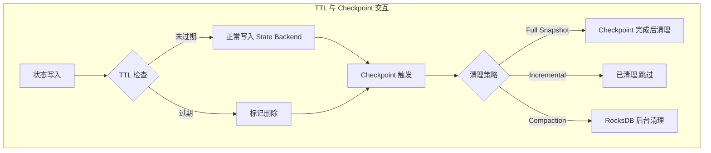
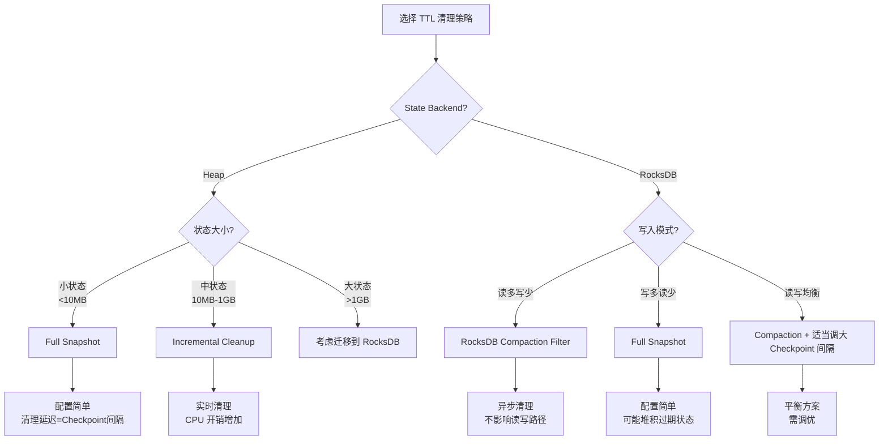
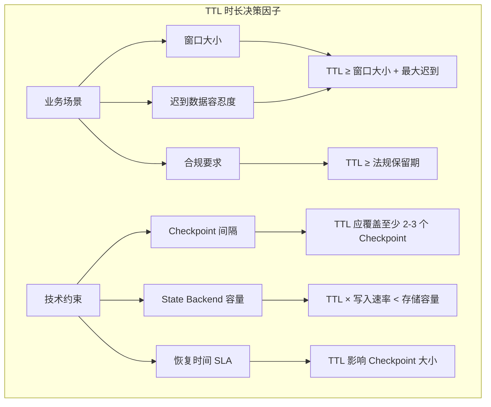
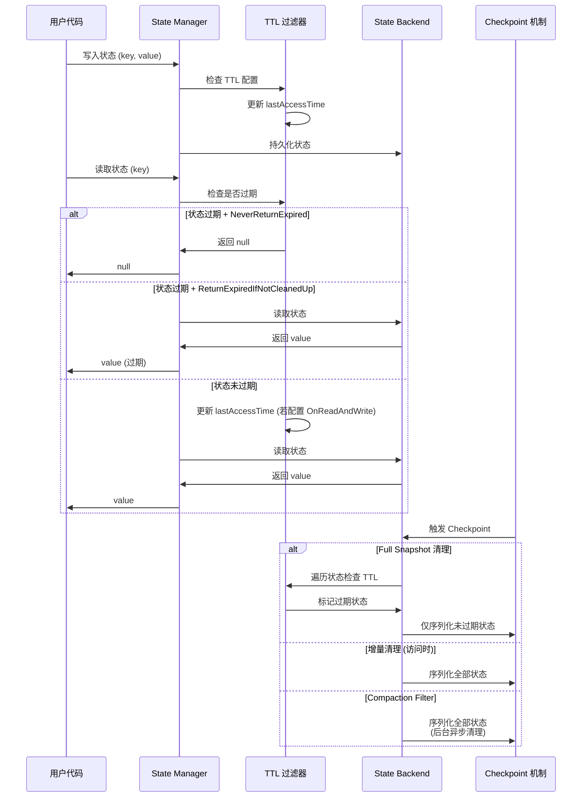
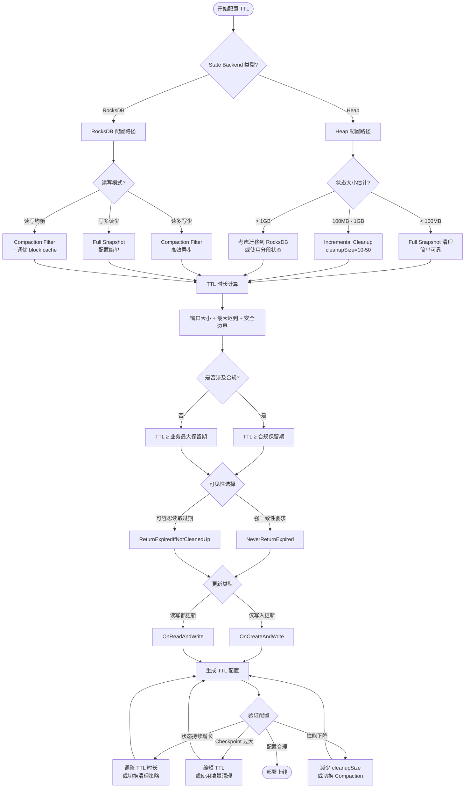
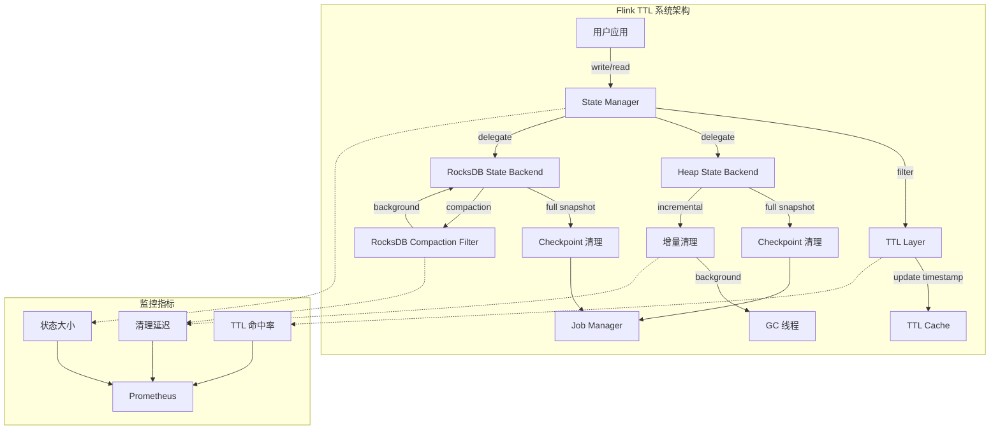

# Flink State TTL 最佳实践

> **所属阶段**: Flink/02-core-mechanisms | **前置依赖**: [checkpoint-mechanism-deep-dive.md](./checkpoint-mechanism-deep-dive.md), [forst-state-backend.md](./forst-state-backend.md) | **形式化等级**: L4-L5

---

## 1. 概念定义 (Definitions)

### Def-F-02-80: State TTL (Time-To-Live)

**定义 1.1** 设状态 $s$ 为键值对 $(k, v)$，其创建时刻为 $t_c$，则 TTL 定义为状态可存活的最大时长 $ au \in \mathbb{R}^+$：

$$\text{TTL}(s) = \{ \tau \mid s \text{ is valid at time } t \iff t - t_c \leq \tau \}$$

**直观解释**: TTL 是状态的生命周期管理机制，当状态超过指定时间未被访问时，系统自动将其标记为过期并清理，防止状态无限增长导致内存/磁盘压力。

### Def-F-02-81: TTL 更新类型 (Update Type)

**定义 1.2** 设状态最后访问时间为 $t_{last}$，则 TTL 时钟更新策略有三种：

| 更新类型 | 符号 | 语义 |
|---------|------|------|
| OnCreateAndWrite | $U_{CW}$ | $t_{last} \leftarrow t$ on write/create |
| OnReadAndWrite | $U_{RW}$ | $t_{last} \leftarrow t$ on read/write |
| Disabled | $U_{\emptyset}$ | 禁用 TTL 更新 |

### Def-F-02-82: 状态可见性 (State Visibility)

**定义 1.3** 设过期状态集合为 $S_{exp} = \{ s \mid t - t_{last} > \tau \}$，状态可见性 $V$ 定义用户访问时能否读取过期状态：

$$V(s) = \begin{cases} \text{NeverReturnExpired} & s \in S_{exp} \Rightarrow \text{read}(s) = \bot \\ \text{ReturnExpiredIfNotCleanedUp} & s \in S_{exp} \land \neg\text{cleaned}(s) \Rightarrow \text{read}(s) = v \end{cases}$$

### Def-F-02-83: 清理策略 (Cleanup Strategy)

**定义 1.4** 设状态后端为 $B \in \{\text{Heap}, \text{RocksDB}\}$，清理策略 $C$ 定义为：

| 策略 | 符号 | 适用后端 | 触发条件 |
|-----|------|---------|---------|
| Full Snapshot | $C_{FS}$ | Heap, RocksDB | Checkpoint 完成时 |
| Incremental | $C_{INC}$ | Heap | 每次状态访问时 |
| RocksDB Compaction | $C_{COMP}$ | RocksDB | RocksDB Compaction 时 |

---

## 2. 属性推导 (Properties)

### Lemma-F-02-60: TTL 过期状态的单调性

**引理 2.1** 对于任意状态 $s$ 和其 TTL 配置 $\tau$，过期状态集合 $S_{exp}(t)$ 关于时间 $t$ 单调不减：

$$\forall t_1 < t_2, \quad S_{exp}(t_1) \subseteq S_{exp}(t_2)$$

**证明**: 由定义，$s \in S_{exp}(t_1) \Rightarrow t_1 - t_{last} > \tau$。因 $t_2 > t_1$，则 $t_2 - t_{last} > t_1 - t_{last} > \tau$，故 $s \in S_{exp}(t_2)$。$\square$

### Lemma-F-02-61: 清理策略的及时性排序

**引理 2.2** 三种清理策略的及时性满足偏序关系：

$$C_{INC} \prec C_{COMP} \prec C_{FS}$$

其中 $\prec$ 表示"更及时"（更快清理过期状态）。

**证明**:

- $C_{INC}$: 每次状态访问检查并清理，及时性最高
- $C_{COMP}$: 依赖 RocksDB Compaction 周期，一般为分钟级
- $C_{FS}$: 依赖 Checkpoint 周期，一般为秒/分钟级，且仅清理已完成 Checkpoint 前的过期状态

$\square$

### Lemma-F-02-62: 状态可见性与一致性边界

**引理 2.3** 设应用要求的一致性级别为 $\mathcal{C} \in \{\text{Eventual}, \text{Strong}\}$，则：

$$\mathcal{C} = \text{Strong} \Rightarrow V = \text{NeverReturnExpired}$$

**证明**: ReturnExpiredIfNotCleanedUp 可能导致读取到逻辑上已过期但物理上未清理的状态，违反强一致性语义。$\square$

### Prop-F-02-60: TTL 对 Checkpoint 大小的影响

**命题 2.4** 设 Checkpoint 间隔为 $\Delta_{cp}$，状态写入速率为 $\lambda$，TTL 时长为 $\tau$，则：

$$\text{CheckpointSize} \propto \min(\lambda \cdot \Delta_{cp}, \lambda \cdot \tau)$$

**直观**: 当 $\tau < \Delta_{cp}$ 时，TTL 能有效控制 Checkpoint 大小；当 $\tau \gg \Delta_{cp}$ 时，TTL 对 Checkpoint 大小影响有限。

---

## 3. 关系建立 (Relations)

### 3.1 TTL 与 Checkpoint 的关系



**关系说明**:

- **Full Snapshot 清理**: 在 Checkpoint 快照阶段过滤过期状态
- **增量清理**: 独立于 Checkpoint，但影响 Checkpoint 内容
- **Compaction 清理**: 与 Checkpoint 完全解耦，异步执行

### 3.2 TTL 与 State Backend 的关系

| State Backend | 支持策略 | 推荐场景 |
|--------------|---------|---------|
| Heap | $C_{FS}, C_{INC}$ | 小状态、低延迟、全内存处理 |
| RocksDB | $C_{FS}, C_{COMP}$ | 大状态、大数据量、磁盘容错 |
| ForSt | $C_{FS}, C_{COMP}$ | 大状态、异步执行、云原生部署 |

### 3.3 TTL 与 Watermark/事件时间的关系

**重要约束**: Flink State TTL 仅支持 **Processing Time**，不支持 Event Time。

$$
\text{TTL Clock} = \text{Processing Time} \neq \text{Event Time}
$$

这意味着：

- 即使 Watermark 延迟，TTL 仍按机器时间计时
- 处理延迟数据时，状态可能已被 TTL 清理
- 需合理设置 TTL 容错边界

---

## 4. 论证过程 (Argumentation)

### 4.1 TTL 必要性论证

**场景**: 无界流处理中的状态持续增长问题

**定理 4.1** (状态增长无界性): 在无 TTL 的有状态流处理中，若键空间无限且状态持续累积，则存储需求无上界：

$$\lim_{t \to \infty} |S(t)| = \infty \quad \text{if} \quad \forall s, \tau_s = \infty$$

**论证**:

1. 设键空间 $K$ 为无限集（如用户 ID 空间）
2. 每个键 $k \in K$ 可能产生状态 $s_k$
3. 无 TTL 时，$s_k$ 永久存在
4. 随着时间推移，累积状态 $|S(t)| \geq |K_{observed}(t)|$
5. 当 $|K_{observed}(t)| \to \infty$，存储需求无上界

**实际案例**: 某电商平台使用 Flink 统计用户购物车，键为用户 ID。若无 TTL，已注销用户的状态永久保留，导致：

- 内存/磁盘持续增长
- Checkpoint 时间延长、失败率上升
- 重启恢复时间增加

### 4.2 反例分析: TTL 设置过短

**场景**: 窗口聚合与迟到数据

设窗口大小 $W = 1$ 小时，允许迟到 $L = 30$ 分钟，若 TTL $\tau < W + L = 90$ 分钟：

```
事件时间线:
[窗口数据]----[窗口结束]----[迟到数据到达]
    |              |               |
    t=0          t=60min        t=85min

状态 TTL = 80min:
    状态在 t=80min 被清理
    迟到数据在 t=85min 到达时无法找到对应状态
    => 数据丢失或错误聚合
```

**结论**: TTL 必须覆盖业务所需的最大状态保留时间。

---

## 5. 工程论证 (Engineering Argument)

### 5.1 清理策略选型决策树



### 5.2 策略对比矩阵

| 维度 | Full Snapshot | Incremental | Compaction Filter |
|-----|---------------|-------------|-------------------|
| **清理及时性** | ⭐⭐ | ⭐⭐⭐⭐⭐ | ⭐⭐⭐⭐ |
| **CPU 开销** | 低 | 中-高 | 低 |
| **内存开销** | 低 | 低 | 低 |
| **配置复杂度** | 简单 | 简单 | 需调优 |
| **适用状态量** | 任意 | 中-小 | 大 |
| **RocksDB 兼容** | ✅ | ❌ | ✅ |

### 5.3 最佳实践配置

#### 5.3.1 基础 TTL 配置

```java
import org.apache.flink.api.common.state.StateTtlConfig;
import org.apache.flink.api.common.time.Time;
import org.apache.flink.streaming.api.windowing.time.Time;

public class Example {
    public static void main(String[] args) throws Exception {


        // Def-F-02-84: 标准 TTL 配置模板
        StateTtlConfig ttlConfig = StateTtlConfig
            .newBuilder(Time.hours(24))           // TTL 时长: 24小时
            .setUpdateType(                        // 更新类型
                StateTtlConfig.UpdateType.OnCreateAndWrite  // 创建和写入时更新
            )
            .setStateVisibility(                   // 状态可见性
                StateTtlConfig.StateVisibility.NeverReturnExpired
            )
            .cleanupFullSnapshot()                  // Full Snapshot 清理
            .build();

    }
}
```

#### 5.3.2 增量清理配置 (Heap State Backend)

```java
import org.apache.flink.api.common.state.StateTtlConfig;
import org.apache.flink.streaming.api.windowing.time.Time;

public class Example {
    public static void main(String[] args) throws Exception {

        // Def-F-02-85: 增量清理配置
        StateTtlConfig incrementalCleanup = StateTtlConfig
            .newBuilder(Time.hours(12))
            .setUpdateType(StateTtlConfig.UpdateType.OnReadAndWrite)
            .setStateVisibility(StateTtlConfig.StateVisibility.NeverReturnExpired)
            .cleanupIncrementally(                  // 增量清理
                10,                                 // 每次访问检查10条记录
                true                                // 在状态迭代时 also 清理
            )
            .build();

    }
}
```

**参数说明**:

- `cleanupSize`: 每次状态访问时额外检查的条目数（默认 5）
- `runCleanupForEveryRecord`: 是否在记录迭代时也触发清理（默认 false）

#### 5.3.3 RocksDB Compaction Filter 配置

```java
import org.apache.flink.api.common.state.StateTtlConfig;
import org.apache.flink.streaming.api.windowing.time.Time;

public class Example {
    public static void main(String[] args) throws Exception {
        // Def-F-02-86: RocksDB Compaction Filter 配置
        StateTtlConfig rocksdbCleanup = StateTtlConfig
            .newBuilder(Time.days(7))
            .setUpdateType(StateTtlConfig.UpdateType.OnCreateAndWrite)
            .setStateVisibility(StateTtlConfig.StateVisibility.NeverReturnExpired)
            .cleanupInRocksdbCompactFilter(         // RocksDB Compaction 清理
                1000                                // 每处理1000个 key 更新一次 TTL 缓存
            )
            .build();

    }
}
```

**参数说明**:

- `queryTimeAfterNumEntries`: 每处理多少 key 查询一次当前时间更新 TTL 缓存（默认 1000）

### 5.4 TTL 时长选择决策



**推荐公式**:

$$\tau_{TTL} = \max(\tau_{business}, \tau_{compliance}, \tau_{technical})$$

其中：

- $\tau_{business}$ = 窗口大小 + 最大迟到时间 + 安全边界
- $\tau_{compliance}$ = 法规要求的数据保留期
- $\tau_{technical}$ = 3 × Checkpoint 间隔（确保至少覆盖几次 Checkpoint）

---

### 5.5 State TTL 生产实践

#### 5.5.1 SQL 配置方式

Flink SQL 支持通过 Table 配置设置 State TTL[^12]：

```sql
-- 设置全局 State TTL
SET 'sql.state-ttl' = '1 day';
SET 'sql.state-ttl.cleanup-strategy' = 'incremental';

-- 创建表时指定 TTL
CREATE TABLE user_events (
    user_id STRING,
    event_time TIMESTAMP(3),
    event_type STRING,
    PRIMARY KEY (user_id) NOT ENFORCED
) WITH (
    'connector' = 'kafka',
    'topic' = 'user-events',
    'properties.bootstrap.servers' = 'kafka:9092',
    -- TTL 相关配置
    'state.ttl' = '24h',
    'state.cleanup-strategy' = 'incremental'
);
```

#### 5.5.2 DataStream API 生产配置模板

**模板 1: 会话状态管理 (30分钟过期)**

```java
import org.apache.flink.api.common.state.StateTtlConfig;
import org.apache.flink.streaming.api.windowing.time.Time;

public class Example {
    public static void main(String[] args) throws Exception {

        /**
         * Def-F-02-87: 生产级会话状态 TTL 配置
         * 场景:用户会话跟踪,30分钟无活动视为会话结束
         */
        public StateTtlConfig createSessionTtlConfig() {
            return StateTtlConfig
                .newBuilder(Time.minutes(30))
                .setUpdateType(StateTtlConfig.UpdateType.OnReadAndWrite)  // 读写都更新 TTL
                .setStateVisibility(StateTtlConfig.StateVisibility.NeverReturnExpired)
                .cleanupIncrementally(10, true)  // 增量清理
                .build();
        }

    }
}
```

**模板 2: 聚合状态管理 (7天过期)**

```java
import org.apache.flink.api.common.state.StateTtlConfig;
import org.apache.flink.streaming.api.windowing.time.Time;

public class Example {
    public static void main(String[] args) throws Exception {
        /**
         * Def-F-02-88: 生产级聚合状态 TTL 配置
         * 场景:日级用户行为聚合,保留 7 天
         */
        public StateTtlConfig createAggregationTtlConfig() {
            return StateTtlConfig
                .newBuilder(Time.days(7))
                .setUpdateType(StateTtlConfig.UpdateType.OnCreateAndWrite)
                .setStateVisibility(StateTtlConfig.StateVisibility.NeverReturnExpired)
                .cleanupInRocksdbCompactFilter(1000)  // RocksDB 清理
                .build();
        }

    }
}
```

#### 5.5.3 重要行为说明

| 行为 | 说明 | 影响 |
|------|------|------|
| State TTL 控制内部状态 | TTL 仅控制 Flink 内部聚合状态，不控制输出到 Kafka topic 的数据 | 输出 topic 数据保留由 Kafka 配置决定 |
| 状态过期后的处理 | 状态过期后，下一个事件会触发新的聚合（从 0 开始） | 业务需容忍过期后的"重新开始" |
| 不读取历史状态 | Flink 不会从 Kafka 读取历史状态进行聚合（性能考虑） | 只处理 Checkpoint 恢复后的新数据 |

#### 5.5.4 生产环境配置检查清单

```markdown
□ TTL 时长验证
  - 窗口大小 + 最大迟到时间 < TTL
  - 合规要求的数据保留期 ≤ TTL

□ 清理策略选择
  - Heap State Backend → Incremental Cleanup
  - RocksDB State Backend → Compaction Filter

□ 状态可见性配置
  - 强一致性要求 → NeverReturnExpired
  - 可容忍读取过期 → ReturnExpiredIfNotCleanedUp

□ 监控指标配置
  - 状态大小监控
  - Checkpoint 大小趋势
  - 状态条目数趋势
```

---

## 6. 实例验证 (Examples)

### 6.1 完整 TTL 配置代码示例

#### 示例 1: ValueState 配置 TTL

```java
import org.apache.flink.api.common.state.*;
import org.apache.flink.api.common.time.Time;
import org.apache.flink.configuration.Configuration;
import org.apache.flink.streaming.api.functions.KeyedProcessFunction;
import org.apache.flink.util.Collector;

import org.apache.flink.api.common.state.ValueState;
import org.apache.flink.api.common.state.ValueStateDescriptor;
import org.apache.flink.streaming.api.windowing.time.Time;


/**
 * Thm-F-02-60: 带 TTL 的用户会话状态管理
 */
public class UserSessionWithTTL extends KeyedProcessFunction<String, Event, Result> {

    private ValueState<SessionInfo> sessionState;

    @Override
    public void open(Configuration parameters) {
        // 配置 TTL: 30 分钟无活动则过期
        StateTtlConfig ttlConfig = StateTtlConfig
            .newBuilder(Time.minutes(30))
            .setUpdateType(StateTtlConfig.UpdateType.OnReadAndWrite)
            .setStateVisibility(StateTtlConfig.StateVisibility.NeverReturnExpired)
            .cleanupIncrementally(10, true)
            .build();

        ValueStateDescriptor<SessionInfo> descriptor = new ValueStateDescriptor<>(
            "session",
            SessionInfo.class
        );
        descriptor.enableTimeToLive(ttlConfig);
        sessionState = getRuntimeContext().getState(descriptor);
    }

    @Override
    public void processElement(Event event, Context ctx, Collector<Result> out)
            throws Exception {
        SessionInfo current = sessionState.value();
        if (current == null) {
            // 新会话或已过期
            current = new SessionInfo(event.getUserId(), event.getTimestamp());
        }
        current.addEvent(event);
        sessionState.update(current);

        // 设置定时器在会话超时后输出
        ctx.timerService().registerProcessingTimeTimer(
            ctx.timerService().currentProcessingTime() + Time.minutes(30).toMilliseconds()
        );
    }

    @Override
    public void onTimer(long timestamp, OnTimerContext ctx, Collector<Result> out)
            throws Exception {
        SessionInfo session = sessionState.value();
        if (session != null && session.isComplete()) {
            out.collect(new Result(session));
        }
    }
}
```

#### 示例 2: MapState 配置 TTL

```java
/**
 * Thm-F-02-61: 带 TTL 的用户行为计数器
 */
public class UserActionCounter extends KeyedProcessFunction<String, Action, Metrics> {

    private MapState<String, Long> actionCounts;

    @Override
    public void open(Configuration parameters) {
        // 配置 TTL: 7 天后过期,RocksDB Compaction 清理
        StateTtlConfig ttlConfig = StateTtlConfig
            .newBuilder(Time.days(7))
            .setUpdateType(StateTtlConfig.UpdateType.OnCreateAndWrite)
            .setStateVisibility(StateTtlConfig.StateVisibility.NeverReturnExpired)
            .cleanupInRocksdbCompactFilter(1000)
            .build();

        MapStateDescriptor<String, Long> descriptor = new MapStateDescriptor<>(
            "action-counts",
            String.class,
            Long.class
        );
        descriptor.enableTimeToLive(ttlConfig);
        actionCounts = getRuntimeContext().getMapState(descriptor);
    }

    @Override
    public void processElement(Action action, Context ctx, Collector<Metrics> out)
            throws Exception {
        String actionType = action.getType();
        Long count = actionCounts.get(actionType);
        if (count == null) {
            count = 0L;
        }
        actionCounts.put(actionType, count + 1);
    }
}
```

#### 示例 3: ListState 配置 TTL

```java
/**
 * Thm-F-02-62: 带 TTL 的事件缓冲区
 */

import org.apache.flink.streaming.api.windowing.time.Time;

public class EventBuffer extends KeyedProcessFunction<String, Event, List<Event>> {

    private ListState<Event> eventBuffer;

    @Override
    public void open(Configuration parameters) {
        StateTtlConfig ttlConfig = StateTtlConfig
            .newBuilder(Time.minutes(5))
            .setUpdateType(StateTtlConfig.UpdateType.OnCreateAndWrite)
            .setStateVisibility(StateTtlConfig.StateVisibility.ReturnExpiredIfNotCleanedUp)
            .cleanupFullSnapshot()
            .build();

        ListStateDescriptor<Event> descriptor = new ListStateDescriptor<>(
            "event-buffer",
            Event.class
        );
        descriptor.enableTimeToLive(ttlConfig);
        eventBuffer = getRuntimeContext().getListState(descriptor);
    }

    @Override
    public void processElement(Event event, Context ctx, Collector<List<Event>> out)
            throws Exception {
        eventBuffer.add(event);

        // 缓冲区满或超时时触发
        Iterable<Event> buffer = eventBuffer.get();
        int count = 0;
        for (Event e : buffer) {
            count++;
        }

        if (count >= 100) {
            List<Event> events = new ArrayList<>();
            for (Event e : buffer) {
                events.add(e);
            }
            eventBuffer.clear();
            out.collect(events);
        }
    }
}
```

### 6.2 状态大小监控实现

```java
import org.apache.flink.api.common.functions.RichFlatMapFunction;
import org.apache.flink.api.common.state.*;
import org.apache.flink.configuration.Configuration;
import org.apache.flink.metrics.Gauge;
import org.apache.flink.util.Collector;

import org.apache.flink.api.common.state.ValueState;
import org.apache.flink.api.common.state.ValueStateDescriptor;
import org.apache.flink.streaming.api.windowing.time.Time;


/**
 * Thm-F-02-63: 带状态大小监控的 TTL 状态
 */
public class MonitoredStateFunction extends RichFlatMapFunction<Event, Output> {

    private ValueState<AggregatedData> state;
    private transient long lastReportTime;
    private static final long REPORT_INTERVAL_MS = 60000; // 每分钟报告

    @Override
    public void open(Configuration parameters) {
        // 启用状态 TTL
        StateTtlConfig ttlConfig = StateTtlConfig
            .newBuilder(Time.hours(2))
            .setUpdateType(StateTtlConfig.UpdateType.OnCreateAndWrite)
            .setStateVisibility(StateTtlConfig.StateVisibility.NeverReturnExpired)
            .cleanupInRocksdbCompactFilter()
            .build();

        ValueStateDescriptor<AggregatedData> descriptor = new ValueStateDescriptor<>(
            "aggregated",
            AggregatedData.class
        );
        descriptor.enableTimeToLive(ttlConfig);
        state = getRuntimeContext().getState(descriptor);

        // 注册状态大小指标
        getRuntimeContext().getMetricGroup().gauge("stateSizeBytes",
            (Gauge<Long>) this::estimateStateSize);

        lastReportTime = System.currentTimeMillis();
    }

    @Override
    public void flatMap(Event event, Collector<Output> out) throws Exception {
        AggregatedData data = state.value();
        if (data == null) {
            data = new AggregatedData();
        }
        data.add(event);
        state.update(data);

        // 定期记录状态大小
        long now = System.currentTimeMillis();
        if (now - lastReportTime > REPORT_INTERVAL_MS) {
            long size = estimateStateSize();
            getRuntimeContext().getMetricGroup().gauge("stateSizeBytes",
                (Gauge<Long>) () -> size);
            lastReportTime = now;
        }

        out.collect(new Output(data));
    }

    /**
     * 估算状态大小(简化实现)
     */
    private long estimateStateSize() {
        try {
            AggregatedData data = state.value();
            if (data == null) return 0;
            // 实际生产中应使用更精确的估算
            return data.estimateSize();
        } catch (Exception e) {
            return -1;
        }
    }
}
```

### 6.3 处理延迟数据的 TTL 容错

```java
import org.apache.flink.streaming.api.windowing.time.Time;

import org.apache.flink.streaming.api.datastream.DataStream;
import org.apache.flink.api.common.functions.AggregateFunction;


/**
 * Thm-F-02-64: 延迟数据容错模式
 *
 * 策略: TTL = 窗口大小 + 最大迟到时间 + 安全边界
 */
public class LateDataHandlingWithTTL {

    // 配置参数
    private static final Time WINDOW_SIZE = Time.hours(1);
    private static final Time ALLOWED_LATENESS = Time.minutes(30);
    private static final Time SAFETY_MARGIN = Time.minutes(15);

    // TTL = 1小时 + 30分钟 + 15分钟 = 1小时45分钟
    private static final Time STATE_TTL = Time.minutes(105);

    public StateTtlConfig createSafeTtlConfig() {
        return StateTtlConfig
            .newBuilder(STATE_TTL)
            .setUpdateType(StateTtlConfig.UpdateType.OnCreateAndWrite)
            .setStateVisibility(StateTtlConfig.StateVisibility.NeverReturnExpired)
            .cleanupInRocksdbCompactFilter()
            .build();
    }

    /**
     * 侧输出流处理超迟数据
     */
    public static void handleLateData() {
        OutputTag<Event> lateDataTag = new OutputTag<Event>("late-data"){};

        // 主处理逻辑
        SingleOutputStreamOperator<Result> mainStream = input
            .keyBy(Event::getKey)
            .window(TumblingEventTimeWindows.of(WINDOW_SIZE))
            .allowedLateness(ALLOWED_LATENESS)
            .sideOutputLateData(lateDataTag)
            .aggregate(new MyAggregateFunction());

        // 处理超迟数据(TTL 已清理,无法合并)
        DataStream<Event> lateData = mainStream.getSideOutput(lateDataTag);
        lateData.addSink(new LateDataSink());
    }
}
```

---

## 7. 可视化 (Visualizations)

### 7.1 TTL 清理流程完整图



### 7.2 TTL 配置决策树



### 7.3 TTL 与系统组件关系图



---

## 8. 常见问题 (FAQ)

### Q1: 状态不过期排查

**现象**: 配置了 TTL，但状态持续增长，Checkpoint 越来越大。

**排查清单**:

```
□ 检查 TTL 配置是否正确应用到 StateDescriptor
  ValueStateDescriptor<...> descriptor = new ValueStateDescriptor<>(...);
  descriptor.enableTimeToLive(ttlConfig);  // 必须调用!

□ 检查更新类型是否匹配业务场景
  OnCreateAndWrite: 只在写入时更新 TTL 时钟
  OnReadAndWrite: 读写都更新

□ 检查状态可见性是否导致"僵尸"状态
  ReturnExpiredIfNotCleanedUp 可能导致用户感知不到清理

□ 检查清理策略是否生效
  Heap + Incremental: 检查 cleanupSize 是否过小
  RocksDB + Compaction: 检查 Compaction 是否触发
```

**解决方案**:

```java
// [伪代码片段 - 不可直接运行] 仅展示核心逻辑
// 启用状态指标监控
getRuntimeContext().getMetricGroup().gauge("stateEntries",
    (Gauge<Long>) () -> {
        // 定期统计状态条目数
        return countStateEntries();
    });
```

### Q2: 内存持续增长

**现象**: Heap State Backend 内存占用持续上升，触发 OOM。

**诊断步骤**:

1. **确认 TTL 配置生效**:

```java
// [伪代码片段 - 不可直接运行] 仅展示核心逻辑
// 在 open() 中打印配置
@Override
public void open(Configuration parameters) {
    LOG.info("TTL Config: {}", ttlConfig);
}
```

1. **检查是否有未配置 TTL 的状态**:

```bash
# 在 Flink Web UI 查看 Checkpoint 大小趋势
# 若持续增长,可能有状态未配置 TTL
```

1. **调整增量清理参数**:

```java
// [伪代码片段 - 不可直接运行] 仅展示核心逻辑
.cleanupIncrementally(
    100,    // 增加每次检查条目数
    true    // 确保迭代时也清理
)
```

1. **考虑迁移到 RocksDB**:

```java
import org.apache.flink.contrib.streaming.state.EmbeddedRocksDBStateBackend;
import org.apache.flink.streaming.api.environment.StreamExecutionEnvironment;

public class Example {
    public static void main(String[] args) throws Exception {
        StreamExecutionEnvironment env = StreamExecutionEnvironment.getExecutionEnvironment();
        env.setStateBackend(new EmbeddedRocksDBStateBackend());

    }
}

```

### Q3: 性能影响优化

**现象**: 启用 TTL 后，处理延迟增加。

**优化策略**:

| 问题 | 优化方案 |
|-----|---------|
| 增量清理开销大 | 增大 cleanupSize，减少检查频率 |
| Checkpoint 时间长 | 使用 Compaction Filter 替代 Full Snapshot |
| RocksDB 读放大 | 调优 block cache，启用 bloom filter |
| 定时器清理冲突 | 分散定时器触发时间，避免脉冲式清理 |

**RocksDB 调优示例**:

```java
import org.apache.flink.contrib.streaming.state.EmbeddedRocksDBStateBackend;
import org.apache.flink.streaming.api.environment.StreamExecutionEnvironment;

public class Example {
    public static void main(String[] args) throws Exception {
        StreamExecutionEnvironment env = StreamExecutionEnvironment.getExecutionEnvironment();
        DefaultConfigurableOptionsFactory factory = new DefaultConfigurableOptionsFactory();
        factory.setRocksDBOptions("write_buffer_size", "64MB");
        factory.setRocksDBOptions("target_file_size_base", "32MB");
        factory.setRocksDBOptions("max_bytes_for_level_base", "256MB");
        factory.setRocksDBOptions("table_cache_numshardbits", "6");

        env.setRocksDBStateBackend(
            new EmbeddedRocksDBStateBackend(),
            factory
        );

    }
}

```

---

## 9. 引用参考 (References)


---

*文档版本: v1.1 | 最后更新: 2026-04-06 | 状态: 已完成权威对齐*

---

*文档版本: v1.0 | 创建日期: 2026-04-20*
