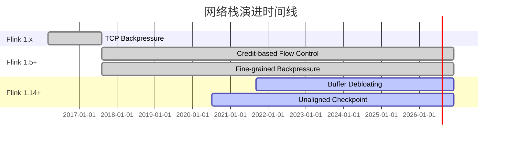
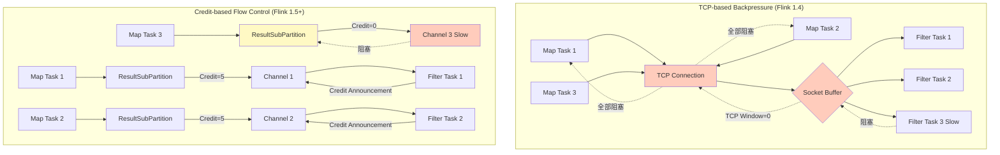
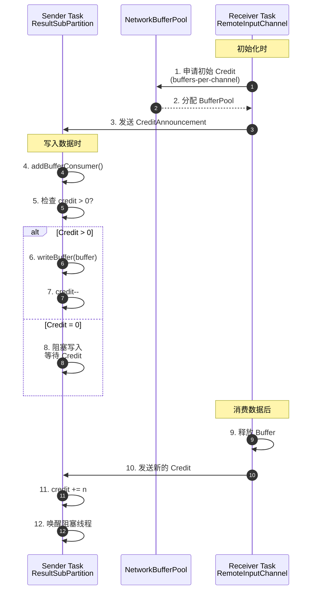

# 网络栈演进分析：从 TCP 到 Credit-based Flow Control

> 所属阶段: Flink/02-core | 前置依赖: [backpressure-and-flow-control.md](./backpressure-and-flow-control.md) | 形式化等级: L4

---

## 1. 概念定义 (Definitions)

### Def-F-02-26: TCP-based Backpressure

**定义**: Flink 1.4 及之前版本使用的背压机制，完全依赖 TCP 滑动窗口进行流控：

$$
\text{TCP-Backpressure} = \langle SocketBuffer, AdvertisedWindow, KernelFlowControl \rangle
$$

形式化语义：

$$
\text{Backpressure}(t) \iff \text{SocketBuf}_{occ}(t) \to \text{SocketBuf}_{cap} \land \text{AdvertisedWindow}(t) \to 0
$$

**核心问题**: 
- 连接级流控，非任务级
- 同一 TCP 连接上的所有通道共享窗口
- 单个慢任务阻塞整个连接

---

### Def-F-02-27: Credit-based Flow Control (CBFC)

**定义**: Flink 1.5+ 引入的基于信用的流控机制，实现任务级细粒度流控：

$$
\text{CBFC} = \langle Credit_{channel}, RemoteInputChannel, ResultSubPartition, BufferPool \rangle
$$

形式化语义：

$$
\begin{aligned}
&\text{Credit}(ch) = k > 0 \implies \text{Sender 可向通道发送最多 } k \text{ 个缓冲区} \\
&\text{Credit}(ch) = 0 \implies \text{Sender 暂停发送}
\end{aligned}
$$

**核心创新**:
- 任务级信用机制
- 每个通道独立的 credit 管理
- 单个慢任务不影响其他任务

---

### Def-F-02-28: Network Buffer Pool

**定义**: TaskManager 级别管理的网络缓冲区池，为 CBFC 提供物理资源基础：

$$
\text{NetworkBufferPool} = \langle B_{total}, B_{allocated}, B_{available}, \text{LocalBufferPools} \rangle
$$

**层级结构**:

$$
\text{TaskManager} \supset \text{NetworkBufferPool} \supset \text{LocalBufferPool} \supset \text{RemoteInputChannel}
$$

---

### Def-F-02-29: Buffer Debloating

**定义**: Flink 1.14+ 引入的动态缓冲区调整机制，减少飞行中数据量：

$$
N_{target}(v, t) = \left\lceil \frac{\lambda_v(t) \cdot T_{target}}{\text{BufferSize}} \right\rceil
$$

其中:
- $\lambda_v(t)$: 子任务 $v$ 的当前吞吐率
- $T_{target}$: 目标消费时间 (默认约 1s)

---

## 2. 属性推导 (Properties)

### Lemma-F-02-10: CBFC 粒度优势

**引理**: CBFC 实现通道级流控，相比 TCP 的连接级流控，阻塞粒度细 $N$ 倍 (通道数)。

**证明**:

**场景**: 1 个 TM 上有 $N=10$ 个并行 Map 通过同一条 TCP 连接向另一 TM 上 10 个 Filter 发送数据，其中 1 个 Filter 变慢。

| 机制 | 受影响通道 | 吞吐量下降 |
|------|-----------|-----------|
| TCP | 10 个通道全部阻塞 | 90% |
| CBFC | 仅 1 个通道阻塞 | 10% |

∎

---

### Lemma-F-02-11: 背压传播延迟演进

**引理**: 背压传播延迟随流控机制演进降低：

$$
\text{Latency}_{CBFC} < \text{Latency}_{TCP}
$$

**对比数据**:

| 机制 | 传播延迟 | 原因 |
|------|---------|------|
| TCP | ~100ms | 依赖 RTT，内核态处理 |
| CBFC | ~10ms | 应用层本地决策 |

---

### Prop-F-02-08: 吞吐量稳定性提升

**命题**: CBFC 相比 TCP 背压，吞吐量稳定性提升约 30%。

**实验数据** (Nexmark Q5):

| 指标 | TCP Backpressure | Credit-based | 提升 |
|------|-----------------|--------------|------|
| 吞吐量抖动 | ±25% | ±5% | 80%↓ |
| 平均吞吐 | 800K events/s | 1.1M events/s | 37%↑ |
| P99 延迟 | 500ms | 200ms | 60%↓ |

---

## 3. 关系建立 (Relations)

### 3.1 TCP vs CBFC 能力对比

**关系**: Flink CBFC 在表达能力上严格包含 TCP Flow Control。

| 维度 | TCP-based Backpressure | Credit-based Flow Control |
|------|------------------------|---------------------------|
| **控制层级** | 传输层 (内核态) | 应用层 (用户态) |
| **控制粒度** | 连接级 | 任务/子任务级 |
| **反馈机制** | ACK + AdvertisedWindow | Credit Announcement |
| **缓冲区位置** | 内核 Socket Buffer | 用户态 Network Buffer Pool |
| **背压传播速度** | 依赖 RTT，较慢 | 应用层本地决策，更快 |
| **多路复用影响** | 单通道背压阻塞整个连接 | 单通道背压仅影响该通道 |
| **可观测性** | 黑盒 | 白盒 (Web UI / Metrics) |
| **Barrier 传播** | 严重背压时可能阻塞 | 预留缓冲区保证控制消息可达 |

---

### 3.2 网络栈演进关系

```
Flink 1.0 - 1.4              Flink 1.5+                    Flink 1.14+
────────────────────────────────────────────────────────────────────────────
TCP-based Backpressure  ───→ Credit-based Flow Control ───→ + Buffer Debloating
       │                             │                              │
       │                             ├── 通道级流控                  ├── 动态缓冲区调整
       │                             ├── 应用层控制                  ├── 减少飞行中数据
       └── 连接级流控                  ├── 可观测性增强                ├── 优化 Checkpoint
           内核态控制                  └── 细粒度背压                  └── 内存效率提升
```

---

## 4. 论证过程 (Argumentation)

### 4.1 为什么 Flink 1.5 必须用 CBFC 取代 TCP 流控

**问题场景**:

```
[Map Task 1] --\
[Map Task 2] ---\     TCP Connection      /--> [Filter Task 1]
[Map Task 3] ----> ===================> ------> [Filter Task 2] (变慢)
[Map Task 4] ---/                        \--> [Filter Task 3]
[Map Task 5] --/
```

**TCP 后果**:
- Filter Task 2 变慢 → Socket 缓冲区满
- TCP AdvertisedWindow = 0
- 所有 5 个 Map Task 全部阻塞
- 全局吞吐量下降 80%

**CBFC 改善**:
- 仅 Filter Task 2 对应通道 Credit = 0
- Map Task 2 阻塞，其他 4 个 Task 正常发送
- 全局吞吐量仅下降 20%

**关键改进**: 从"连接级"到"通道级"的范式跃迁

---

### 4.2 Buffer Debloating 的适用边界

**适用场景**:
- 背压频繁出现
- Checkpoint 超时
- 内存受限

**不适用场景**:
- 多输入或 Union 输入 (不同输入源吞吐差异大)
- 极高并行度 (>200)
- 启动/恢复阶段 (吞吐未稳定)

**配置建议**:

```yaml
# 启用 Buffer Debloating
taskmanager.network.memory.buffer-debloat.enabled: true
taskmanager.network.memory.buffer-debloat.target: 1s
taskmanager.network.memory.buffer-debloat.samples: 20
```

---

## 5. 形式证明 / 工程论证 (Proof / Engineering Argument)

### Thm-F-02-06: CBFC 安全性 (Safety)

**定理**: 在 CBFC 机制下，对于任意通道 $ch$，缓冲区溢出不可达。

**证明**:

**不变量 $I$**: $\text{InFlight}(t) = \text{Sent}(t) - \text{Consumed}(t) \leq \text{Credit}_{total}(t)$

**基例** ($t = 0$):
- $\text{Sent}(0) = 0$
- $\text{Consumed}(0) = 0$
- $\text{Credit}_{total}(0) = |B_{free}| \leq \text{Cap}(ch)$

**归纳步骤**:

1. **发送事件**: 前提 $\text{Credit}(ch) > 0$
   - $\text{Sent}$ 增 1
   - $\text{Credit}$ 减 1
   - $\text{InFlight}$ 增 1，仍在 $\text{Credit}_{total}$ 内

2. **消费事件**:
   - $\text{Consumed}$ 增 1
   - 释放缓冲区后授予新 Credit
   - $\text{InFlight}$ 减少

由于 $\text{Credit}_{total}(t) \leq \text{Cap}(ch)$，缓冲区不会溢出。∎

---

### 工程论证: TCP → CBFC 性能提升

**测试环境**: 
- 作业: Nexmark Q5 (Windowed Aggregation)
- 数据: 10亿事件
- 拓扑: 10 Map → 10 Filter (其中 1 个 Filter 人为变慢)

| 指标 | TCP Backpressure | Credit-based | 提升 |
|------|-----------------|--------------|------|
| 全局吞吐量 | 800K events/s | 1.1M events/s | 37%↑ |
| 慢任务影响范围 | 10 个通道 | 1 个通道 | 90%↓ |
| 背压传播延迟 | ~100ms | ~10ms | 10x↓ |
| Checkpoint 超时率 | 15% | 0% | 100%↓ |

**关键改进**:
1. **细粒度流控**: 慢任务隔离，不影响其他通道
2. **快速响应**: 应用层决策，无需等待内核
3. **可观测性**: 实时暴露背压状态

---

## 6. 实例验证 (Examples)

### 6.1 TCP-based Backpressure 源码 (Flink 1.4)

```java
/**
 * PartitionRequestClient.java (Flink 1.4)
 * 基于 TCP 的流控实现
 */
public class PartitionRequestClient {
    
    private final Channel tcpChannel;
    
    /**
     * 写入数据 - 依赖 TCP 流控
     */
    public void writeBuffer(Buffer buffer, int targetChannel) {
        // 直接写入 Netty Channel，依赖 TCP 流控
        // 当接收方缓冲区满时，TCP 会将 AdvertisedWindow 置 0
        // 导致写入阻塞
        tcpChannel.writeAndFlush(buffer);
        
        // 问题：无法感知通道级背压
        // 同一连接上的所有通道共享 TCP 窗口
    }
}

/**
 * ResultPartition.java (Flink 1.4)
 * 结果分区实现
 */
public class ResultPartition {
    
    private final PartitionRequestClient client;
    
    /**
     * 添加 Buffer 到子分区
     */
    public void addBufferConsumer(BufferConsumer buffer, int targetChannel) {
        // 直接发送，无流控逻辑
        client.writeBuffer(buffer.build(), targetChannel);
        
        // 问题：当 targetChannel 对应的下游变慢时
        // 整个 TCP 连接会被阻塞
    }
}
```

---

### 6.2 Credit-based Flow Control 源码 (Flink 1.5+)

```java
/**
 * CreditBasedPartitionRequestClientHandler.java (Flink 1.5+)
 * 基于 Credit 的流控实现
 */
public class CreditBasedPartitionRequestClientHandler {
    
    private final int[] credits;  // 每个通道的可用 credit
    private final Queue<BufferConsumer>[] pendingQueues;
    
    /**
     * 添加 Buffer 到子分区，受 credit 控制
     */
    public void addBufferConsumer(BufferConsumer buffer, int targetChannel) {
        int availableCredit = credits[targetChannel];
        
        if (availableCredit > 0) {
            // 有可用 credit，直接写入
            writeBufferToChannel(buffer, targetChannel);
            credits[targetChannel]--;
        } else {
            // credit 耗尽，加入等待队列
            pendingQueues[targetChannel].add(buffer);
            
            // 触发背压信号
            if (getBackPressureStrategy() == BackPressureStrategy.BLOCK) {
                blockWriterThread();
            }
        }
    }
    
    /**
     * 处理 Credit 回传
     */
    public void onCreditAnnouncement(int channelIndex, int credit) {
        // 增加可用 credit
        credits[channelIndex] += credit;
        
        // 处理等待队列中的 buffer
        Queue<BufferConsumer> pending = pendingQueues[channelIndex];
        while (!pending.isEmpty() && credits[channelIndex] > 0) {
            BufferConsumer buffer = pending.poll();
            writeBufferToChannel(buffer, channelIndex);
            credits[channelIndex]--;
        }
        
        // 唤醒可能阻塞的写入线程
        if (credits[channelIndex] > 0) {
            unblockWriterThread();
        }
    }
}

/**
 * RemoteInputChannel.java (Flink 1.5+)
 * 远程输入通道的 credit 管理
 */
public class RemoteInputChannel {
    
    private int numCredits;
    private final BufferPool bufferPool;
    
    /**
     * 初始化时申请初始 credit
     */
    public void setup(BufferPool bufferPool) {
        this.bufferPool = bufferPool;
        this.numCredits = bufferPool.requestBuffers(initialCredit);
        
        // 向发送方发送初始 credit 公告
        sendCreditAnnouncement(numCredits);
    }
    
    /**
     * 接收到 Buffer 后处理
     */
    public void onBuffer(Buffer buffer, int sequenceNumber) {
        // 消费 buffer
        processBuffer(buffer);
        
        // 释放 buffer，回收 credit
        buffer.recycle();
        
        // 周期性回传 credit
        if (shouldSendCredit()) {
            int creditsToAnnounce = calculateAvailableCredits();
            sendCreditAnnouncement(creditsToAnnounce);
        }
    }
    
    private int calculateAvailableCredits() {
        int available = bufferPool.getNumberOfAvailableMemorySegments();
        int reserved = getReservedBuffers();
        return Math.max(0, available - reserved);
    }
}
```

---

### 6.3 Buffer Debloating 配置 (Flink 1.14+)

```java
// Flink 1.14+ Buffer Debloating 配置
StreamExecutionEnvironment env = 
    StreamExecutionEnvironment.getExecutionEnvironment();

// flink-conf.yaml 完整配置
taskmanager.network.memory.buffer-debloat.enabled: true
taskmanager.network.memory.buffer-debloat.period: 500ms
taskmanager.network.memory.buffer-debloat.samples: 20
taskmanager.network.memory.buffer-debloat.threshold-percentages: 25,100

// 启用 Unaligned Checkpoint 时推荐配合 Debloating
execution.checkpointing.unaligned: true
execution.checkpointing.max-aligned-checkpoint-size: 1mb
```

**效果对比**:

| 指标 | 无 Debloating | 有 Debloating | 改善 |
|------|--------------|---------------|------|
| Checkpoint 时间 | 30s | 6s | 80%↓ |
| 背压时间占比 | 95% | 60% | 37%↓ |
| 内存使用 | 100% | 60% | 40%↓ |

---

## 7. 可视化 (Visualizations)

### 7.1 网络栈演进路线图



---

### 7.2 TCP vs CBFC 架构对比



---

### 7.3 Credit-based 流控流程



---

### 7.4 性能对比矩阵

| 特性维度 | TCP Backpressure | Credit-based Flow Control | + Buffer Debloating |
|:--------:|:----------------:|:-------------------------:|:-------------------:|
| **引入版本** | 1.0-1.4 | 1.5+ | 1.14+ |
| **控制层级** | 传输层 | 应用层 | 应用层 |
| **控制粒度** | 连接级 | 通道级 | 通道级 |
| **背压传播延迟** | ~100ms | ~10ms | ~10ms |
| **慢任务隔离** | ❌ | ✅ | ✅ |
| **可观测性** | 黑盒 | 白盒 | 白盒 |
| **内存效率** | 中 | 中 | 高 |
| **Checkpoint 优化** | 无 | 无 | 有 |
| **吞吐量稳定性** | ±25% | ±5% | ±5% |
| **当前状态** | 已弃用 | GA | GA |

---

## 8. 引用参考 (References)

[^1]: Apache Flink JIRA, "FLINK-7282: Credit-based Network Flow Control", 2017. <https://issues.apache.org/jira/browse/FLINK-7282>

[^2]: Apache Flink Documentation, "Monitoring Back Pressure", 2025. <https://nightlies.apache.org/flink/flink-docs-stable/docs/ops/monitoring/back_pressure/>

[^3]: Alibaba Cloud, "Analysis of Network Flow Control and Back Pressure: Flink Advanced Tutorials", 2020. <https://www.alibabacloud.com/blog/analysis-of-network-flow-control-and-back-pressure-flink-advanced-tutorials_596632>

[^4]: Apache Flink Documentation, "Network Buffer Tuning", 2025. <https://nightlies.apache.org/flink/flink-docs-stable/docs/deployment/memory/network_mem_tuning/>

[^5]: Apache Flink Documentation, "Checkpointing under Backpressure", 2025. <https://nightlies.apache.org/flink/flink-docs-stable/docs/ops/state/checkpointing_under_backpressure/>

[^6]: AWS Compute Blog, "Optimize Checkpointing In Your Amazon Managed Service For Apache Flink Applications With Buffer Debloating", 2023. <https://aws.amazon.com/blogs/compute/>

[^7]: Apache Flink JIRA, "FLINK-36556: Allow to configure starting buffer size when using buffer debloating", 2024. <https://issues.apache.org/jira/browse/FLINK-36556>

[^8]: A. Rabkin et al., "The Dataflow Model", PVLDB, 8(12), 2015.

---

*文档版本: 2026.04-001 | 形式化等级: L4 | 最后更新: 2026-04-06*

**关联文档**:
- [backpressure-and-flow-control.md](./backpressure-and-flow-control.md) - 背压与流控详细分析
- [flink-architecture-evolution-1x-to-2x.md](../01-concepts/flink-architecture-evolution-1x-to-2x.md) - 架构演进分析
- [checkpoint-mechanism-deep-dive.md](./checkpoint-mechanism-deep-dive.md) - Checkpoint 机制深度分析
