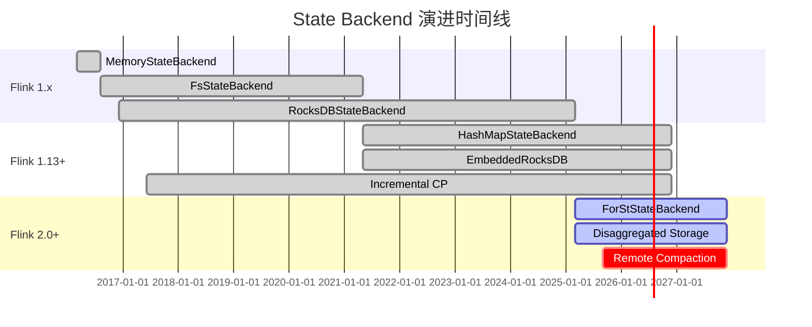

# State Backend 演进分析

> 所属阶段: Flink/02-core | 前置依赖: [state-backends-deep-comparison.md](./state-backends-deep-comparison.md) | 形式化等级: L4

---

## 1. 概念定义 (Definitions)

### Def-F-02-21: MemoryStateBackend

**定义**: Flink 1.0 引入的初代状态后端，状态数据完全存储于 TaskManager JVM 堆内存：

$$
\text{MemoryStateBackend} = \langle Heap_{tm}, HashMap_{K,V}, \Psi_{async-fs} \rangle
$$

**核心约束**:

$$
|S_{total}| \leq \alpha \cdot \text{taskmanager.memory.task.heap.size}, \quad \alpha \approx 0.3
$$

**适用场景**: 小状态 (<100MB)、测试环境、原型开发

**限制**: 状态容量受限于 JVM 堆内存，大状态导致频繁 GC

---

### Def-F-02-22: FsStateBackend

**定义**: Flink 1.1 引入的扩展，状态存储于内存，快照异步写入文件系统：

$$
\text{FsStateBackend} = \langle Heap_{tm}, HashMap_{K,V}, \Psi_{async-fs}, CheckpointStorage_{fs} \rangle
$$

**演进意义**: 解耦运行时存储与 Checkpoint 存储位置

**版本状态**: Flink 1.13+ 已弃用，统一为 HashMapStateBackend

---

### Def-F-02-23: RocksDBStateBackend / EmbeddedRocksDBStateBackend

**定义**: Flink 1.2 引入 (1.13+ 更名为 EmbeddedRocksDBStateBackend)，使用内嵌 RocksDB 存储状态：

$$
\text{RocksDBStateBackend} = \langle \text{LSM-Tree}, \text{MemTable}, \text{SST Files}, \text{WAL}, \Psi_{incremental} \rangle
$$

**LSM-Tree 结构**:

$$
\text{RocksDB} = \text{MemTable}_{active} \cup \text{MemTable}_{immutable} \cup \left( \bigcup_{i=0}^{L} \text{Level}_i \right)
$$

**适用场景**: 大状态、生产环境、本地部署

**限制**: 本地磁盘容量、Compaction CPU 开销、故障恢复慢

---

### Def-F-02-24: ForStStateBackend

**定义**: Flink 2.0 引入的分离式状态后端，专为云原生场景设计：

$$
\text{ForStStateBackend} = \langle \text{UFS}, \text{LocalCache}_{L1/L2}, \text{LazyRestore}, \text{RemoteCompaction} \rangle
$$

**核心创新**:

- 计算存储分离：状态主存储于对象存储
- 轻量级 Checkpoint：元数据快照，$O(1)$ 复杂度
- 即时恢复：LazyRestore 实现秒级故障恢复

**适用场景**: 云原生、Serverless、超大状态 (>100GB)

---

### Def-F-02-25: 增量 Checkpoint (Incremental Checkpointing)

**定义**: 仅持久化自上次 Checkpoint 以来的状态变更部分：

$$
\Delta_n = S_n \ominus S_{n-1}, \quad |CP_n^{inc}| = |\Delta_n| \ll |S_n|
$$

**实现演进**:

| 后端 | 增量机制 | 效率 |
|------|---------|------|
| RocksDB | SST 文件级增量 | 50-80% 节省 |
| ForSt | 硬链接共享 | ~100% 节省 |

---

## 2. 属性推导 (Properties)

### Lemma-F-02-08: 状态后端演进规律

**引理**: State Backend 演进遵循"容量优先 → 性能优先 → 弹性优先"的发展规律。

**证明**:

| 阶段 | 时间 | 驱动力 | 核心改进 |
|------|------|--------|---------|
| 容量扩展 | 1.0-1.2 | 大状态需求 | 从内存到磁盘 (RocksDB) |
| 性能优化 | 1.3-1.15 | Checkpoint 效率 | 增量 Checkpoint |
| 弹性优先 | 2.0+ | 云原生需求 | 存算分离 (ForSt) |

∎

---

### Lemma-F-02-09: 故障恢复时间演进

**引理**: 各 State Backend 的故障恢复时间满足：

$$
T_{recovery}^{ForSt} \ll T_{recovery}^{HashMap} < T_{recovery}^{RocksDB}
$$

**对比数据**:

| 后端 | 100GB 状态恢复时间 | 复杂度 |
|------|-------------------|--------|
| HashMap | 2-5 min | $O(|S|)$ |
| RocksDB | 15-30 min | $O(|S|/BW)$ |
| ForSt | 10-30 sec | $O(|Metadata|)$ |

---

### Prop-F-02-07: Checkpoint 效率演进

**命题**: Checkpoint 时间复杂度演进：

| 后端 | 时间复杂度 | 典型耗时 (1TB 状态) |
|------|-----------|-------------------|
| MemoryStateBackend | $O(|S|)$ | 5-10 min |
| RocksDB (全量) | $O(|S|)$ | 10-20 min |
| RocksDB (增量) | $O(|\Delta S|)$ | 1-5 min |
| ForSt | $O(1)$ | 5-10 sec |

---

## 3. 关系建立 (Relations)

### 3.1 状态后端演进关系

```
Flink 1.0                     Flink 1.13+                     Flink 2.0+
─────────────────────────────────────────────────────────────────────────────────
MemoryStateBackend ──┐
                     ├─→ HashMapStateBackend ───┐
FsStateBackend ──────┘                          │
                                                ├─→ Unified State Backend API
RocksDBStateBackend ───→ EmbeddedRocksDBStateBackend ──┘
                                                │
ForStStateBackend ──────────────────────────────┘
```

**演进动机**:

1. **API 简化**: 统一 Memory/Fs 为 HashMap
2. **性能优化**: EmbeddedRocksDB 原生支持增量 Checkpoint
3. **云原生适配**: ForSt 实现计算存储分离

---

### 3.2 State Backend 与部署模式映射

| 部署模式 | 推荐后端 | 理由 |
|---------|---------|------|
| 本地测试 | HashMap | 简单、低延迟 |
| 本地生产 | RocksDB | 大状态支持 |
| Kubernetes | ForSt | 弹性扩缩容 |
| Serverless | ForSt | 快速启动 |
| 边缘计算 | RocksDB | 网络独立 |

---

## 4. 论证过程 (Argumentation)

### 4.1 演进驱动因素分析

#### 阶段 1: 内存到磁盘 (1.0 → 1.2)

**问题**: MemoryStateBackend 状态容量受限于 JVM 堆内存

**解决方案**: 引入 RocksDBStateBackend

- 利用本地磁盘扩展容量
- LSM-Tree 优化写性能
- 支持 TB 级状态

#### 阶段 2: API 统一 (1.13)

**问题**: MemoryStateBackend 与 FsStateBackend 功能重叠

**解决方案**: 统一为 HashMapStateBackend

- 运行时存储与 Checkpoint 存储解耦
- 简化配置
- 统一代码路径

#### 阶段 3: 存算分离 (2.0)

**问题**:

- 云原生环境本地磁盘昂贵
- 故障恢复时间过长
- 扩缩容受限

**解决方案**: ForStStateBackend

- 利用廉价对象存储
- 元数据快照实现快速恢复
- 计算节点无状态化

---

### 4.2 各后端适用边界

| 场景 | 推荐后端 | 关键参数 |
|------|---------|---------|
| 状态 < 100MB | HashMap | `state.backend: hashmap` |
| 状态 100MB-100GB | RocksDB | `state.backend: rocksdb`, 增量开启 |
| 状态 > 100GB | ForSt | `state.backend: forst` |
| 延迟 < 1ms | HashMap | 堆内存优化 |
| 云原生部署 | ForSt | 本地缓存调优 |
| 离线环境 | RocksDB | 避免网络依赖 |

---

## 5. 形式证明 / 工程论证 (Proof / Engineering Argument)

### Thm-F-02-05: 状态后端选择完备性

**定理**: 对于任意作业 $J$，存在最优状态后端选择，由特征向量 $F(J) = (S_{size}, L_{sla}, E_{env})$ 唯一确定。

**决策函数**:

$$
\mathcal{D}(F(J)) = \begin{cases}
\text{HashMap} & \text{if } S_{size} < 100MB \land L_{sla} < 1ms \\
\text{RocksDB} & \text{if } 100MB \leq S_{size} < 100GB \lor E_{env} = \text{edge} \\
\text{ForSt} & \text{if } S_{size} \geq 100GB \land E_{env} = \text{cloud}
\end{cases}
$$

**证明**:

1. **容量约束**: $S_{size} \geq M_{max}$ 时 HashMap 导致 GC 压力
2. **延迟约束**: $L_{sla} < 1ms$ 时 RocksDB/ForSt 序列化开销不可接受
3. **环境约束**: 边缘环境网络受限，ForSt 远程访问不可行

∎

---

### 工程论证: 云原生场景下的 ForSt 优势

**成本分析** (月度成本，1TB 状态):

| 成本项 | RocksDB | ForSt | 节省 |
|--------|---------|-------|------|
| 存储 | $0.10/GB × 2 副本 = $200 | $0.023/GB = $23 | **88%** |
| 计算 (预留磁盘) | 必须预留 | 按需 | **50%** |
| 网络 (Checkpoint) | 增量上传 ~$50 | 仅元数据 ~$5 | **90%** |
| **总计** | **~$250** | **~$30** | **88%** |

**弹性分析**:

- RocksDB 扩容: $T_{scale} = O(|S| / B_{network})$
- ForSt 扩容: $T_{scale} = O(1)$

---

## 6. 实例验证 (Examples)

### 6.1 MemoryStateBackend 配置 (历史版本)

```java
import org.apache.flink.streaming.api.environment.StreamExecutionEnvironment;

public class Example {
    public static void main(String[] args) throws Exception {
        // 伪代码示意,非完整可编译代码


        // Flink 1.12 及之前
        StreamExecutionEnvironment env =
            StreamExecutionEnvironment.getExecutionEnvironment();

        // 配置 MemoryStateBackend (已弃用)
        MemoryStateBackend memoryBackend = new MemoryStateBackend(
            "hdfs://checkpoints",  // Checkpoint 存储路径
            true                    // 异步快照
        );
        env.setStateBackend(memoryBackend);

        // 关键限制
        // - 状态必须小于 100MB
        // - 不适合生产环境

    }
}
```

---

### 6.2 RocksDBStateBackend 配置

```java
import org.apache.flink.contrib.streaming.state.EmbeddedRocksDBStateBackend;
import org.apache.flink.streaming.api.environment.StreamExecutionEnvironment;

public class Example {
    public static void main(String[] args) throws Exception {

        // Flink 1.13+ (EmbeddedRocksDBStateBackend)
        StreamExecutionEnvironment env =
            StreamExecutionEnvironment.getExecutionEnvironment();

        // 启用增量 Checkpoint
        EmbeddedRocksDBStateBackend rocksDbBackend =
            new EmbeddedRocksDBStateBackend(true);
        env.setStateBackend(rocksDbBackend);

        // Checkpoint 存储配置
        env.getCheckpointConfig().setCheckpointStorage("hdfs:///checkpoints");

        // RocksDB 精细化配置
        DefaultConfigurableOptionsFactory optionsFactory =
            new DefaultConfigurableOptionsFactory();

        // 内存配置
        optionsFactory.setRocksDBOptions(
            "state.backend.rocksdb.memory.managed", "true");
        optionsFactory.setRocksDBOptions(
            "state.backend.rocksdb.memory.fixed-per-slot", "512mb");

        // 写缓冲区配置
        optionsFactory.setRocksDBOptions("write_buffer_size", "64MB");
        optionsFactory.setRocksDBOptions("max_write_buffer_number", "4");

        // SST 文件配置
        optionsFactory.setRocksDBOptions("target_file_size_base", "32MB");
        optionsFactory.setRocksDBOptions("max_bytes_for_level_base", "256MB");

        // 压缩配置
        optionsFactory.setRocksDBOptions("compression_per_level", "LZ4:LZ4:ZSTD");

        env.setRocksDBStateBackend(rocksDbBackend, optionsFactory);

    }
}
```

**flink-conf.yaml 配置**:

```yaml
# 状态后端配置 state.backend: rocksdb
state.backend.incremental: true

# Checkpoint 配置 execution.checkpointing.interval: 60s
execution.checkpointing.timeout: 600s

# RocksDB 内存配置 state.backend.rocksdb.memory.managed: true
state.backend.rocksdb.memory.fixed-per-slot: 512mb
state.backend.rocksdb.threads.threads-number: 4
```

---

### 6.3 ForStStateBackend 配置 (Flink 2.0+)

```java
public class Example {
    public static void main(String[] args) throws Exception {
        StreamExecutionEnvironment env = StreamExecutionEnvironment.getExecutionEnvironment();
        // Flink 2.0+ ForStStateBackend
        ForStStateBackend forstBackend = new ForStStateBackend();

        // UFS 存储配置
        forstBackend.setUFSStoragePath("s3://flink-state-bucket/jobs/job-001");
        forstBackend.setUFSType(UFSType.S3);

        // 本地缓存配置
        forstBackend.setLocalCacheSize("10gb");
        forstBackend.setCachePolicy(CachePolicy.SLRU);

        // 恢复配置
        forstBackend.setLazyRestoreEnabled(true);
        forstBackend.setRestoreMode(RestoreMode.LAZY);

        // 远程 Compaction 配置
        forstBackend.setRemoteCompactionEnabled(true);
        forstBackend.setRemoteCompactionEndpoint("compaction-service:9090");

        env.setStateBackend(forstBackend);

        // ForSt 推荐较长 Checkpoint 间隔
        env.enableCheckpointing(120000);  // 2分钟

    }
}
```

**flink-conf.yaml 完整配置**:

```yaml
# ========== ForSt State Backend 核心配置 ========== state.backend: forst

# UFS 配置 state.backend.forst.ufs.type: s3
state.backend.forst.ufs.s3.bucket: flink-state-bucket
state.backend.forst.ufs.s3.region: us-east-1
state.backend.forst.ufs.s3.credentials.provider: IAM_ROLE

# 本地缓存配置 state.backend.forst.cache.memory.size: 4gb
state.backend.forst.cache.disk.size: 100gb
state.backend.forst.cache.policy: SLRU

# 恢复配置 state.backend.forst.restore.mode: LAZY
state.backend.forst.restore.preload.keys: 10000

# 远程 Compaction 配置 state.backend.forst.compaction.remote.enabled: true
state.backend.forst.compaction.remote.endpoint: compaction-service:9090
```

---

### 6.4 源码对比

#### RocksDBStateBackend.java - 创建状态存储

```java
/**
 * EmbeddedRocksDBStateBackend.java
 * 创建本地 RocksDB 状态存储
 */
public class EmbeddedRocksDBStateBackend implements StateBackend {

    private final String localPath;  // 本地磁盘路径
    private final RocksDBOptions options;

    public CheckpointableKeyedStateBackend createStateBackend(
            Environment environment,
            JobID jobID,
            String operatorIdentifier,
            TypeSerializer<Key> keySerializer,
            int numberOfKeyGroups,
            KeyGroupRange keyGroupRange,
            TaskStateManager taskStateManager,
            TtlTimeProvider ttlTimeProvider,
            MetricGroup metricGroup,
            @Nonnull Collection<KeyedStateHandle> stateHandles,
            CloseableRegistry cancelStreamRegistry) {

        // 1. 创建本地 RocksDB 实例
        String dbPath = localPath + "/" + operatorIdentifier;
        RocksDB db = RocksDB.open(options, dbPath);

        // 2. 恢复状态 (从 Checkpoint 下载 SST 文件)
        restoreState(db, stateHandles);

        // 3. 创建状态后端实例
        return new RocksDBKeyedStateBackend(
            db,
            keySerializer,
            numberOfKeyGroups,
            keyGroupRange,
            // ... 其他参数
        );
    }

    private void restoreState(RocksDB db, Collection<KeyedStateHandle> stateHandles) {
        // 下载 SST 文件到本地
        for (KeyedStateHandle handle : stateHandles) {
            downloadSSTFiles(handle);
        }
        // 加载 SST 文件到 RocksDB
        db.ingestExternalFile(sstFiles, ingestOptions);
    }
}
```

#### ForStStateBackend.java - 创建状态存储

```java
/**
 * ForStStateBackend.java (Flink 2.0+)
 * 创建分离式状态存储
 */
public class ForStStateBackend implements StateBackend {

    private final String ufsPath;       // 远程 UFS 路径
    private final String localCachePath; // 本地缓存路径
    private final CacheConfiguration cacheConfig;

    public CheckpointableKeyedStateBackend createStateBackend(
            Environment environment,
            JobID jobID,
            String operatorIdentifier,
            TypeSerializer<Key> keySerializer,
            int numberOfKeyGroups,
            KeyGroupRange keyGroupRange,
            TaskStateManager taskStateManager,
            TtlTimeProvider ttlTimeProvider,
            MetricGroup metricGroup,
            @Nonnull Collection<KeyedStateHandle> stateHandles,
            CloseableRegistry cancelStreamRegistry) {

        // 1. 创建远程 UFS 连接
        UnifiedFileSystem ufs = UFSFactory.create(ufsPath);

        // 2. 创建本地多级缓存
        ForStCache cache = new ForStCache.Builder()
            .setL1CacheSize(cacheConfig.getMemoryCacheSize())
            .setL2CacheSize(cacheConfig.getDiskCacheSize())
            .setCachePolicy(cacheConfig.getPolicy())
            .build();

        // 3. 加载元数据 (轻量级)
        StateMetadata metadata = loadMetadata(stateHandles);

        // 4. 创建状态后端实例
        return new ForStKeyedStateBackend(
            ufs,
            cache,
            metadata,
            keySerializer,
            numberOfKeyGroups,
            keyGroupRange,
            // ... 其他参数
        );
    }

    private StateMetadata loadMetadata(Collection<KeyedStateHandle> stateHandles) {
        // 仅加载元数据引用,不下载实际状态数据
        StateMetadata metadata = new StateMetadata();
        for (KeyedStateHandle handle : stateHandles) {
            metadata.addStateRef(handle.getStateRef());
        }
        return metadata;
    }
}
```

---

### 6.5 状态后端迁移示例

```bash
# ========== 从 RocksDB 迁移到 ForSt ==========

# 1. 创建 Savepoint (使用原后端)
flink savepoint <job-id> s3://flink-migration/savepoint-rocksdb

# 2. 修改代码切换后端
# 从: env.setStateBackend(new EmbeddedRocksDBStateBackend(true));
# 到: env.setStateBackend(new ForStStateBackend());

# 3. 从 Savepoint 恢复 (自动转换状态格式)
flink run -s s3://flink-migration/savepoint-rocksdb/savepoint-xxxxx \
  -Dstate.backend=forst \
  -Dstate.backend.forst.ufs.type=s3 \
  -Dstate.backend.forst.ufs.s3.bucket=flink-state-bucket \
  -c com.example.MyJob my-job.jar

# 4. 验证迁移成功
# - 检查作业状态是否正常
# - 验证 Checkpoint 时间是否改善
# - 监控恢复时间
```

**迁移兼容性矩阵**:

| 源后端 | 目标后端 | 兼容性 | 注意事项 |
|--------|---------|--------|---------|
| HashMap | RocksDB | ✅ 支持 | 自动转换 |
| RocksDB | HashMap | ⚠️ 条件 | 需确保状态大小 < 堆内存 |
| HashMap/RocksDB | ForSt | ✅ 支持 | Flink 2.0+ 支持 |
| ForSt | RocksDB | ❌ 不支持 | 存储架构不兼容 |

---

## 7. 可视化 (Visualizations)

### 7.1 状态后端演进路线图



---

### 7.2 架构对比图

```mermaid
graph TB
    subgraph "MemoryStateBackend (1.0)"
        M1[KeyedProcessFunction] --> M2[HashMap Table]
        M2 --> M3[JVM Heap Memory]
        M3 --> M4[Async Snapshot]
        M4 --> M5[Checkpoint Storage]
        style M3 fill:#c8e6c9
    end

    subgraph "RocksDBStateBackend (1.2)"
        R1[KeyedProcessFunction] --> R2[RocksDB JNI]
        R2 --> R3[MemTable]
        R2 --> R4[Block Cache]
        R3 --> R5[SST Files]
        R4 -.-> R5
        R5 --> R6[Local Disk]
        R6 --> R7[Incremental Snapshot]
        R7 --> R8[Checkpoint Storage]
        style R6 fill:#fff9c4
    end

    subgraph "ForStStateBackend (2.0)"
        F1[KeyedProcessFunction] --> F2[Local Cache Manager]
        F2 --> F3{L1 Hit?}
        F3 -->|Yes| F4[Memory Cache]
        F3 -->|No| F5{L2 Hit?}
        F5 -->|Yes| F6[Disk Cache]
        F5 -->|No| F7[Async Fetch UFS]
        F7 --> F8[Unified File System]
        F8 --> F9[SST Files]
        F9 --> F10[Metadata Snapshot]
        F10 --> F11[Checkpoint Storage]
        style F8 fill:#b2dfdb
        style F4 fill:#c8e6c9
    end
```



---

### 7.3 性能对比矩阵

| 特性维度 | MemoryStateBackend | RocksDBStateBackend | ForStStateBackend |
|:--------:|:------------------:|:-------------------:|:-----------------:|
| **引入版本** | 1.0 | 1.2 | 2.0 |
| **存储位置** | JVM Heap | 本地磁盘 | 远程 UFS + 本地缓存 |
| **状态容量** | < 10 GB | 100 GB - 10 TB | 无上限 (PB级) |
| **访问延迟** | 10-100 ns | 1 μs - 10 ms | 1 μs - 100 ms |
| **吞吐能力** | ⭐⭐⭐⭐⭐ | ⭐⭐⭐ | ⭐⭐⭐ |
| **内存效率** | ⭐⭐ | ⭐⭐⭐⭐ | ⭐⭐⭐⭐⭐ |
| **Checkpoint 方式** | 全量异步 | 增量异步 | 元数据快照 |
| **Checkpoint 速度** | 慢 | 快 | 极快 (O(1)) |
| **恢复速度** | 快 | 慢 | 极快 (Lazy) |
| **增量 Checkpoint** | ❌ | ✅ | ✅ |
| **云原生友好** | ⭐⭐ | ⭐⭐⭐ | ⭐⭐⭐⭐⭐ |
| **存储成本** | 高 | 中 | 低 |
| **当前状态** | 已弃用 | GA | GA |

---

## 8. 引用参考 (References)


---

*文档版本: 2026.04-001 | 形式化等级: L4 | 最后更新: 2026-04-06*

**关联文档**:

- [state-backends-deep-comparison.md](./state-backends-deep-comparison.md) - State Backend 深度对比
- [flink-2.0-forst-state-backend.md](./flink-2.0-forst-state-backend.md) - ForSt State Backend 详细设计
- [flink-architecture-evolution-1x-to-2x.md](../01-concepts/flink-architecture-evolution-1x-to-2x.md) - 架构演进分析
