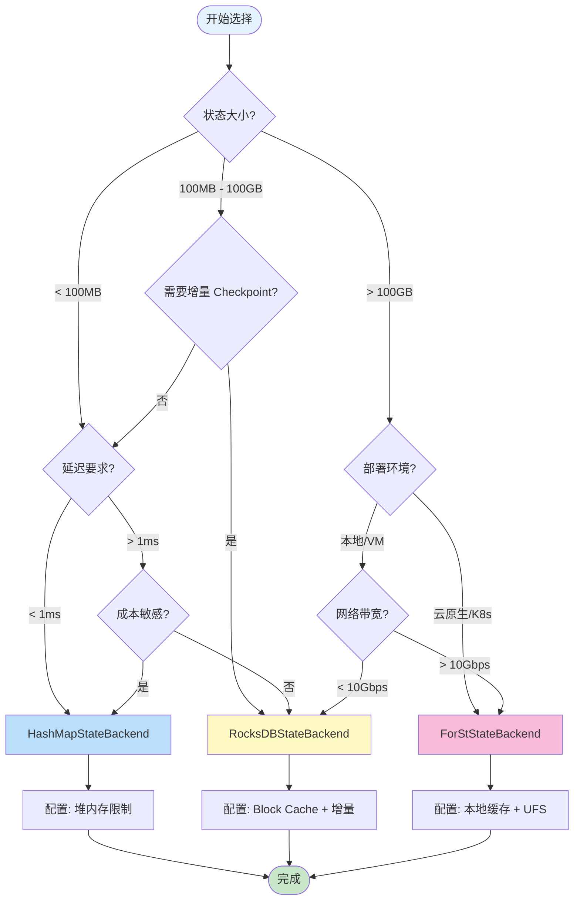
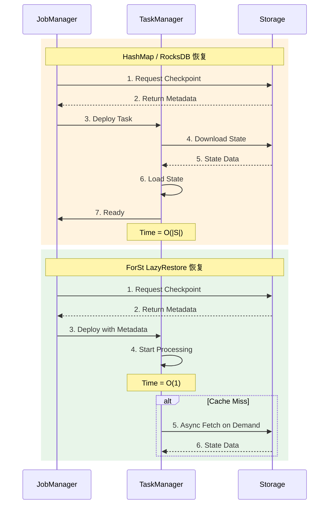
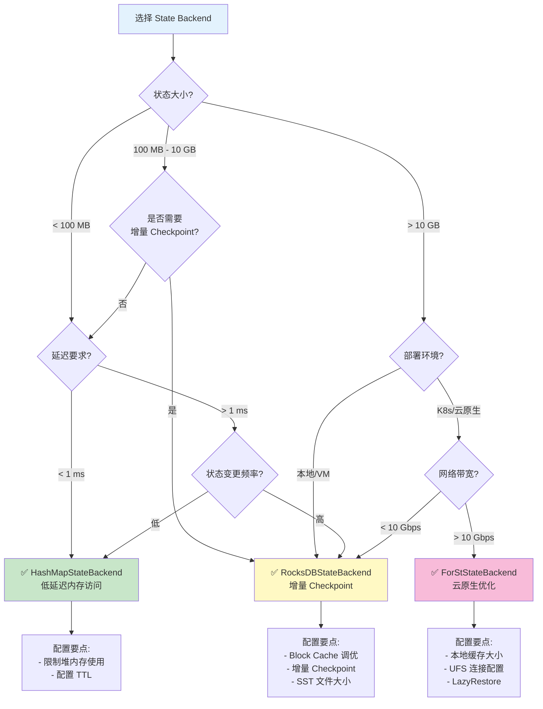
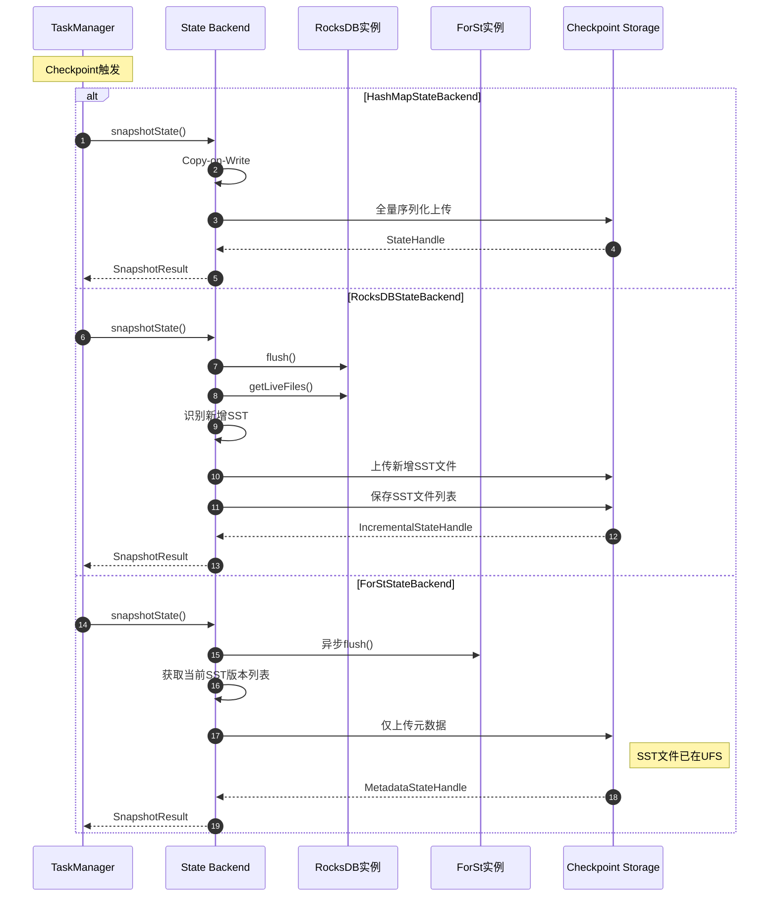

> **状态**: 🔮 前瞻内容 | **风险等级**: 高 | **最后更新**: 2026-04
>
> 此文档描述的内容处于早期规划阶段，可能与最终实现不符。请以 Apache Flink 官方发布为准。
>
# Flink State Backends 深度对比分析

> **所属阶段**: Flink/02-core-mechanisms | **前置依赖**: [checkpoint-mechanism-deep-dive.md](./checkpoint-mechanism-deep-dive.md), [flink-state-management-complete-guide.md](./flink-state-management-complete-guide.md) | **形式化等级**: L4

---

## 目录

- [Flink State Backends 深度对比分析](#flink-state-backends-深度对比分析)
  - [目录](#目录)
  - [1. 概念定义 (Definitions)](#1-概念定义-definitions)
    - [Def-F-02-14: State Backend（状态后端）](#def-f-02-14-state-backend状态后端)
    - [Def-F-02-15: MemoryStateBackend（内存状态后端）](#def-f-02-15-memorystatebackend内存状态后端)
    - [Def-F-02-16: FsStateBackend（文件系统状态后端）](#def-f-02-16-fsstatebackend文件系统状态后端)
    - [Def-F-02-17: HashMapStateBackend（哈希映射状态后端）](#def-f-02-17-hashmapstatebackend哈希映射状态后端)
    - [Def-F-02-18: RocksDBStateBackend（RocksDB 状态后端）](#def-f-02-18-rocksdbstatebackendrocksdb-状态后端)
    - [Def-F-02-19: ForStStateBackend（ForSt 状态后端）](#def-f-02-19-forststatebackendforst-状态后端)
    - [Def-F-02-20: 增量 Checkpoint（Incremental Checkpointing）](#def-f-02-20-增量-checkpointincremental-checkpointing)
  - [2. 属性推导 (Properties)](#2-属性推导-properties)
    - [Lemma-F-02-06: 状态后端访问延迟排序](#lemma-f-02-06-状态后端访问延迟排序)
    - [Lemma-F-02-07: 状态容量扩展性](#lemma-f-02-07-状态容量扩展性)
    - [Prop-F-02-05: Checkpoint 时间复杂度对比](#prop-f-02-05-checkpoint-时间复杂度对比)
    - [Prop-F-02-06: 故障恢复时间界限](#prop-f-02-06-故障恢复时间界限)
  - [3. 关系建立 (Relations)](#3-关系建立-relations)
    - [3.1 状态后端演进关系](#31-状态后端演进关系)
    - [3.2 State Backend 与 Dataflow Model 映射](#32-state-backend-与-dataflow-model-映射)
    - [3.3 Checkpoint 机制对比](#33-checkpoint-机制对比)
  - [4. 论证过程 (Argumentation)](#4-论证过程-argumentation)
    - [4.1 状态后端选择决策树](#41-状态后端选择决策树)
    - [4.2 场景适配边界分析](#42-场景适配边界分析)
    - [4.3 反例分析：不当选择的影响](#43-反例分析不当选择的影响)
      - [反例 1: 大状态使用 HashMap](#反例-1-大状态使用-hashmap)
      - [反例 2: 高吞吐随机读使用 RocksDB](#反例-2-高吞吐随机读使用-rocksdb)
      - [反例 3: 低带宽环境使用 ForSt](#反例-3-低带宽环境使用-forst)
    - [4.4 资源需求对比](#44-资源需求对比)
  - [5. 形式证明 / 工程论证 (Proof / Engineering Argument)](#5-形式证明-工程论证-proof-engineering-argument)
    - [Thm-F-02-03: 状态后端选择完备性定理](#thm-f-02-03-状态后端选择完备性定理)
    - [Thm-F-02-04: Checkpoint 效率优化界限定理](#thm-f-02-04-checkpoint-效率优化界限定理)
    - [工程论证：云原生场景下的 ForSt 优势](#工程论证云原生场景下的-forst-优势)
  - [6. 实例验证 (Examples)](#6-实例验证-examples)
    - [6.1 MemoryStateBackend / HashMapStateBackend 配置](#61-memorystatebackend-hashmapstatebackend-配置)
    - [6.2 RocksDBStateBackend 生产配置](#62-rocksdbstatebackend-生产配置)
    - [6.3 ForStStateBackend 配置（Flink 2.0+）](#63-forststatebackend-配置flink-20)
    - [6.4 状态后端迁移示例](#64-状态后端迁移示例)
    - [6.5 性能监控指标](#65-性能监控指标)
  - [7. 可视化 (Visualizations)](#7-可视化-visualizations)
    - [7.1 状态后端架构对比](#71-状态后端架构对比)
    - [7.2 完整特性对比矩阵](#72-完整特性对比矩阵)
    - [7.3 Checkpoint 流程对比](#73-checkpoint-流程对比)
    - [7.4 故障恢复流程对比](#74-故障恢复流程对比)
    - [7.5 选择决策树](#75-选择决策树)
  - [8. 源码深度分析 (Source Code Analysis)](#8-源码深度分析-source-code-analysis)
    - [8.1 RocksDB SST 文件格式详解](#81-rocksdb-sst-文件格式详解)
      - [8.1.1 SST 文件在 RocksDBStateBackend 中的应用](#811-sst-文件在-rocksdbstatebackend-中的应用)
      - [8.1.2 SST 文件版本管理](#812-sst-文件版本管理)
    - [8.2 Compaction 机制对比源码分析](#82-compaction-机制对比源码分析)
      - [8.2.1 RocksDB 本地 Compaction](#821-rocksdb-本地-compaction)
      - [8.2.2 ForSt 远程 Compaction](#822-forst-远程-compaction)
    - [8.3 三种 State Backend Checkpoint 源码对比](#83-三种-state-backend-checkpoint-源码对比)
    - [8.4 状态后端选择决策的源码映射](#84-状态后端选择决策的源码映射)
    - [8.5 性能监控指标的源码实现](#85-性能监控指标的源码实现)
  - [9. 引用参考 (References)](#9-引用参考-references)

---

## 1. 概念定义 (Definitions)

### Def-F-02-14: State Backend（状态后端）

**定义**: State Backend 是 Flink 中负责状态物理存储、访问接口和快照持久化的运行时组件。形式化定义为：

$$
\text{StateBackend} = \langle \text{StorageLayer}, \text{AccessInterface}, \text{SnapshotStrategy}, \text{RecoveryMechanism} \rangle
$$

其中：

| 组件 | 职责 | 关键属性 |
|------|------|---------|
| $\text{StorageLayer}$ | 状态物理存储 | 位置（内存/磁盘/远程）、容量、持久性 |
| $\text{AccessInterface}$ | 状态访问接口 | 延迟、吞吐、并发能力 |
| $\text{SnapshotStrategy}$ | 快照生成策略 | 全量/增量、同步/异步、一致性保证 |
| $\text{RecoveryMechanism}$ | 故障恢复机制 | 恢复时间、状态一致性、资源需求 |

---

### Def-F-02-15: MemoryStateBackend（内存状态后端）

**定义**: MemoryStateBackend（Flink 1.x 命名，1.13+ 后由 HashMapStateBackend 统一替代）将状态数据存储于 TaskManager 的 JVM 堆内存中：

$$
\text{MemoryStateBackend} = \langle \text{Heap}_{\text{tm}}, \text{HashMap}_{K,V}, \Psi_{\text{async-fs}}, \Omega_{\text{deserialize}} \rangle
$$

**核心特征**：

1. **存储位置**: TaskManager JVM 堆内存
2. **数据结构**: `HashMap<K, State>` 存储键控状态
3. **快照机制**: 异步复制到文件系统（HDFS/S3）
4. **访问延迟**: 纳秒级（内存直接访问）

**容量约束**:

$$
|S_{\text{total}}| \leq \alpha \cdot \text{taskmanager.memory.task.heap.size}, \quad \alpha \approx 0.3
$$

> ⚠️ **注意**: Flink 1.13+ 已弃用 MemoryStateBackend，推荐使用 HashMapStateBackend。

---

### Def-F-02-16: FsStateBackend（文件系统状态后端）

**定义**: FsStateBackend（Flink 1.x）是 MemoryStateBackend 的扩展，状态存储于内存，但快照异步写入分布式文件系统：

$$
\text{FsStateBackend} = \langle \text{Heap}_{\text{tm}}, \text{HashMap}_{K,V}, \Psi_{\text{async-fs}}, \text{CheckpointStorage}_{\text{fs}} \rangle
$$

**演进说明**: Flink 1.13+ 将 MemoryStateBackend 与 FsStateBackend 统一为 **HashMapStateBackend**，通过 `setCheckpointStorage()` 配置快照存储位置。

---

### Def-F-02-17: HashMapStateBackend（哈希映射状态后端）

**定义**: HashMapStateBackend 是 Flink 1.13+ 引入的统一内存状态后端，替代原有的 MemoryStateBackend 和 FsStateBackend：

$$
\text{HashMapStateBackend} = \langle \text{Heap}_{\text{tm}}, \text{HashMap}_{K,V}, \text{TypeSerializer}, \Psi_{\text{async}} \rangle
$$

**核心改进**：

1. **统一 API**: 单一后端支持内存存储 + 任意快照目标
2. **异步快照**: 不阻塞数据流处理的 Copy-on-Write 快照
3. **托管内存集成**: 与 Flink 内存模型深度集成

---

### Def-F-02-18: RocksDBStateBackend（RocksDB 状态后端）

**定义**: RocksDBStateBackend（1.13+ 后为 EmbeddedRocksDBStateBackend）使用内嵌 RocksDB 数据库存储状态：

$$
\text{RocksDBStateBackend} = \langle \text{LSM-Tree}, \text{MemTable}, \text{SST Files}, \text{WAL}, \Psi_{\text{incremental}} \rangle
$$

**LSM-Tree 结构**:

$$
\text{RocksDB} = \text{MemTable}_{\text{active}} \cup \text{MemTable}_{\text{immutable}} \cup \left( \bigcup_{i=0}^{L} \text{Level}_i \right)
$$

其中：

- **MemTable**: 内存中的写缓冲区（默认 64MB）
- **Level 0**: 直接从 MemTable 刷写的 SST 文件
- **Level 1+**: 通过 Compaction 合并的有序 SST 文件层级

**关键特性**：

1. **磁盘级容量**: 支持 TB 级状态存储
2. **增量 Checkpoint**: 仅上传变更的 SST 文件
3. **内存-磁盘分层**: Block Cache 缓存热数据
4. **原生 TTL**: 通过 Compaction Filter 清理过期数据

---

### Def-F-02-19: ForStStateBackend（ForSt 状态后端）

**定义**: ForSt (For Streaming) 是 Flink 2.0+ 引入的分离式状态后端，专为云原生场景设计：

$$
\text{ForStStateBackend} = \langle \text{UFS}, \text{LocalCache}_{\text{L1/L2}}, \text{LazyRestore}, \text{RemoteCompaction} \rangle
$$

其中：

| 组件 | 说明 | 性能特征 |
|------|------|---------|
| $\text{UFS}$ | Unified File System（S3/HDFS/GCS） | 主存储，无限容量 |
| $\text{LocalCache}_{\text{L1}}$ | 内存缓存（LRU/SLRU） | ~1μs 访问延迟 |
| $\text{LocalCache}_{\text{L2}}$ | 本地磁盘缓存 | ~1ms 访问延迟 |
| $\text{LazyRestore}$ | 延迟恢复机制 | 亚秒级故障恢复 |
| $\text{RemoteCompaction}$ | 远程 Compaction 服务 | CPU 资源解耦 |

**核心创新**：

1. **计算存储分离**: 状态主存储于对象存储，本地仅作缓存
2. **轻量级 Checkpoint**: 元数据快照，时间复杂度 $O(1)$
3. **即时恢复**: LazyRestore 实现秒级故障恢复
4. **成本优化**: 存储成本降低 50-70%

> 📌 **前瞻性标注**: ForStStateBackend 是 Flink 2.0/2.4 引入的新特性，处于快速迭代阶段。生产环境使用前请验证具体版本的稳定性。

---

### Def-F-02-20: 增量 Checkpoint（Incremental Checkpointing）

**定义**: 增量 Checkpoint 仅持久化自上次 Checkpoint 以来的状态变更部分：

$$
\Delta_n = S_n \ominus S_{n-1}, \quad |CP_n^{\text{inc}}| = |\Delta_n| \ll |S_n|
$$

**RocksDB 实现机制**:

基于 SST 文件不可变性，仅上传新产生的 SST 文件：

$$
CP_n^{\text{rocksdb}} = \{ f \in \text{SST}_n \mid f \notin \text{SST}_{n-1} \}
$$

**ForSt 实现机制**:

基于 UFS 硬链接共享，Checkpoint 仅持久化元数据引用：

$$
CP_n^{\text{forst}} = \{ (f, \text{version}) \mid f \in \text{SST}_n \}
$$

---

## 2. 属性推导 (Properties)

### Lemma-F-02-06: 状态后端访问延迟排序

**引理**: 四种 State Backend 的状态访问延迟满足以下不等式：

$$
\text{Latency}_{\text{HashMap}} < \text{Latency}_{\text{RocksDB}}^{\text{cache-hit}} < \text{Latency}_{\text{ForSt}}^{\text{L1-hit}} < \text{Latency}_{\text{RocksDB}}^{\text{cache-miss}} < \text{Latency}_{\text{ForSt}}^{\text{cache-miss}}
$$

**证明**:

| 层级 | 延迟范围 | 原因 |
|------|---------|------|
| HashMap | 10-100 ns | JVM 堆内存直接访问 |
| RocksDB Cache Hit | 1-10 μs | Block Cache 内存访问 |
| ForSt L1 Hit | 1-10 μs | 本地内存缓存 |
| RocksDB Cache Miss | 1-10 ms | 本地磁盘 I/O |
| ForSt Cache Miss | 10-100 ms | 网络 I/O (UFS) |

$\square$

---

### Lemma-F-02-07: 状态容量扩展性

**引理**: 四种 State Backend 的理论容量上限满足：

$$
\text{Capacity}_{\text{HashMap}} \ll \text{Capacity}_{\text{RocksDB}} < \text{Capacity}_{\text{ForSt}} \approx \infty
$$

**证明**:

| 后端 | 容量限制 | 典型值 |
|------|---------|--------|
| HashMap | TM 堆内存 | < 10 GB |
| RocksDB | TM 本地磁盘 | 100 GB - 10 TB |
| ForSt | UFS 存储容量 | 理论上无上限 (PB级) |

$\square$

---

### Prop-F-02-05: Checkpoint 时间复杂度对比

**命题**: 不同 State Backend 的 Checkpoint 时间复杂度：

| Backend | 时间复杂度 | 说明 |
|---------|-----------|------|
| HashMap | $O(\|S\|)$ | 全量序列化与上传 |
| RocksDB（全量） | $O(\|S\|)$ | 全量 SST 上传 |
| RocksDB（增量） | $O(\|\Delta S\|)$ | 仅上传变更 SST |
| ForSt | $O(1)$ | 仅元数据快照 |

**推论**: 对于大状态场景 ($|S| > 100\text{GB}$)，ForSt 的 Checkpoint 速度优势显著。

---

### Prop-F-02-06: 故障恢复时间界限

**命题**: 故障恢复时间满足以下界限：

$$
T_{\text{recovery}}^{\text{HashMap}} \approx T_{\text{recovery}}^{\text{ForSt}} \ll T_{\text{recovery}}^{\text{RocksDB}}
$$

**证明**:

- **HashMap**: 从快照反序列化到内存，$T = O(|S|)$ 但常数较小
- **RocksDB**: 下载 SST 文件到本地磁盘，$T = O(|S| / B_{\text{network}})$
- **ForSt**: 仅加载元数据，状态按需加载，$T = O(|M|) \approx O(1)$

$\square$

---

## 3. 关系建立 (Relations)

### 3.1 状态后端演进关系

```
Flink 1.0-1.12                    Flink 1.13+                    Flink 2.0+
────────────────────────────────────────────────────────────────────────────
MemoryStateBackend ──┐
                     ├─→ HashMapStateBackend ───┐
FsStateBackend ──────┘                          │
                                                ├─→ Unified State Backend API
RocksDBStateBackend ───→ EmbeddedRocksDBStateBackend ──┘
                                                │
ForStStateBackend ──────────────────────────────┘
```

**演进动机**：

1. **API 简化**: 统一 Memory/Fs 为 HashMap
2. **性能优化**: EmbeddedRocksDB 原生支持增量 Checkpoint
3. **云原生适配**: ForSt 实现计算存储分离

---

### 3.2 State Backend 与 Dataflow Model 映射

| Dataflow Model 概念 | HashMap 实现 | RocksDB 实现 | ForSt 实现 |
|-------------------|--------------|--------------|-----------|
| Windowed State | Heap HashMap | SST Files | SST in UFS |
| Trigger | Checkpoint Barrier | Checkpoint Barrier | Checkpoint Barrier |
| Accumulation | 全量快照 | 增量 SST | 硬链接引用 |
| Discarding | GC 回收 | Compaction + GC | 引用计数 GC |

---

### 3.3 Checkpoint 机制对比

| 维度 | HashMapStateBackend | RocksDBStateBackend | ForStStateBackend |
|------|--------------------|--------------------|--------------------|
| **同步阶段** | 创建 HashMap 视图 | Flush MemTable | 无（异步 flush） |
| **异步阶段** | 序列化到远程存储 | 上传 SST 文件 | 仅持久化元数据 |
| **增量支持** | ❌ 不支持 | ✅ SST 文件级 | ✅ 硬链接共享 |
| **一致性保证** | Copy-on-Write | LSM 不可变性 | 原子重命名 |
| **网络传输** | 大（全量状态） | 中（增量 SST） | 极小（仅元数据） |

---

## 4. 论证过程 (Argumentation)

### 4.1 状态后端选择决策树



---

### 4.2 场景适配边界分析

| 场景特征 | 推荐后端 | 理由 |
|---------|---------|------|
| 状态 < 100MB，低延迟 | HashMap | 内存访问，纳秒级延迟 |
| 状态 100MB - 10GB，中等延迟 | HashMap/RocksDB | 取决于 GC 容忍度 |
| 状态 > 10GB | RocksDB | 避免堆内存压力 |
| 状态 > 100GB，高频 Checkpoint | **ForSt** | Checkpoint 效率优势 |
| 云原生/K8s 部署 | **ForSt** | 计算弹性扩展 |
| 边缘/网络受限环境 | RocksDB | 避免网络依赖 |
| 超低延迟 (< 1ms P99) | HashMap | RocksDB 序列化开销 |

---

### 4.3 反例分析：不当选择的影响

#### 反例 1: 大状态使用 HashMap

**场景**: 1亿用户会话 × 200B = 20GB 状态，10 TM × 4GB 堆

**计算**: 每 TM 分摊 2GB + 开销 ≈ 3GB（占 75% 堆内存）

**结果**:

- 频繁 Full GC（> 10% CPU）
- OOM 风险，作业不稳定
- **解决方案**: 迁移至 RocksDBStateBackend

#### 反例 2: 高吞吐随机读使用 RocksDB

**场景**: 100K TPS 随机 key 查询，Cache 命中率 < 50%

**问题**:

- 磁盘 I/O 成为瓶颈
- Write Stall 导致反压
- **解决方案**: 增大 Block Cache 或迁移至 HashMap（若状态允许）

#### 反例 3: 低带宽环境使用 ForSt

**场景**: 边缘节点，网络带宽 100Mbps，状态 1TB

**问题**:

- Cache Miss 时延迟极高（> 1s）
- 网络拥塞影响其他服务
- **解决方案**: 使用 RocksDB + 本地 SSD

---

### 4.4 资源需求对比

| 资源类型 | HashMap | RocksDB | ForSt |
|---------|---------|---------|-------|
| **内存** | 高（状态全在内存） | 中（Block Cache + MemTable） | 中（本地缓存） |
| **磁盘** | 无 | 高（状态 + WAL） | 中（本地缓存） |
| **CPU** | 低 | 中（序列化 + Compaction） | 高（序列化 + 网络） |
| **网络** | 低（仅 Checkpoint） | 中（增量 Checkpoint） | 高（状态访问） |
| **存储成本** | 高（内存贵） | 中（本地 SSD） | 低（对象存储） |

---

## 5. 形式证明 / 工程论证 (Proof / Engineering Argument)

### Thm-F-02-03: 状态后端选择完备性定理

**定理**: 对于任意作业 $J$，存在最优状态后端选择策略，由特征向量 $F(J) = (S_{\text{size}}, L_{\text{sla}}, E_{\text{env}}, C_{\text{budget}})$ 唯一确定。

**决策函数**:

$$
\mathcal{D}(F(J)) = \begin{cases}
\text{HashMap} & \text{if } S_{\text{size}} < M_{\text{max}} \land L_{\text{sla}} < 1\text{ms} \\
\text{RocksDB} & \text{if } M_{\text{max}} \leq S_{\text{size}} < 100\text{GB} \lor E_{\text{env}} = \text{edge} \\
\text{ForSt} & \text{if } S_{\text{size}} \geq 100\text{GB} \land E_{\text{env}} = \text{cloud}
\end{cases}
$$

**典型阈值**:

- $M_{\text{max}}$: TM 堆内存的 30%（如 4GB 堆 → 1.2GB 状态上限）
- $L_{\text{sla}}$: P99 延迟要求
- $E_{\text{env}}$: 部署环境（edge/cloud）

**证明**:

1. **容量约束**: 若 $S_{\text{size}} \geq M_{\text{max}}$，HashMap 导致不可接受的 GC 压力，必须选择磁盘级后端
2. **延迟约束**: 若 $L_{\text{sla}} < 1\text{ms}$，RocksDB/ForSt 的序列化开销无法满足，优先 HashMap
3. **环境约束**: 边缘环境网络受限，ForSt 的远程访问不可行，选择 RocksDB
4. **成本优化**: 云原生环境利用对象存储的成本优势，选择 ForSt

$\square$

---

### Thm-F-02-04: Checkpoint 效率优化界限定理

**定理**: 增量 Checkpoint 的存储节省率 $R_{\text{save}}$ 满足：

$$
R_{\text{save}} = 1 - \frac{|\Delta S|}{|S|}
$$

**最优情况**: 仅 $p$ 比例状态每周期更新，$R_{\text{save}} = 1 - p$

**最差情况**: 所有状态每周期更新，$R_{\text{save}} = 0$（退化为全量）

**各后端效率对比**:

| 后端 | 最优节省率 | 典型场景节省率 |
|------|-----------|---------------|
| HashMap | 0% | 0% |
| RocksDB（增量） | 90-99% | 50-80% |
| ForSt | ~100% | ~100% |

**工程推论**: 对于热点明显的场景（如会话窗口），RocksDB 增量 Checkpoint 效果显著；ForSt 由于硬链接机制，几乎恒定达到理论最优。

---

### 工程论证：云原生场景下的 ForSt 优势

**论证**: 为什么云原生场景应选择 ForSt？

**成本分析**:

| 成本项 | RocksDB | ForSt | 节省 |
|--------|---------|-------|------|
| 存储（月度）| $0.10/GB × 2副本 = $0.20/GB | $0.023/GB = $0.023/GB | **88%** |
| 计算（预留）| 必须预留磁盘容量 | 按需扩展 | **50%** |
| 网络（Checkpoint）| 增量上传 | 仅元数据 | **90%** |

**弹性分析**:

- **RocksDB 扩容**: 需迁移状态 → $T_{\text{scale}} = O(|S| / B_{\text{network}})$
- **ForSt 扩容**: 仅需加载元数据 → $T_{\text{scale}} = O(1)$

**可靠性分析**:

- **RocksDB**: 本地磁盘故障 → 数据丢失风险
- **ForSt**: UFS 多副本保证 → 99.999999999% 持久性

---

## 6. 实例验证 (Examples)

### 6.1 MemoryStateBackend / HashMapStateBackend 配置

```java

import org.apache.flink.streaming.api.environment.StreamExecutionEnvironment;
import org.apache.flink.streaming.api.CheckpointingMode;

StreamExecutionEnvironment env =
    StreamExecutionEnvironment.getExecutionEnvironment();

// ========== HashMapStateBackend 配置 ==========
HashMapStateBackend hashMapBackend = new HashMapStateBackend();
env.setStateBackend(hashMapBackend);

// Checkpoint 存储配置
env.getCheckpointConfig().setCheckpointStorage("hdfs:///checkpoints");
// 或 S3: env.getCheckpointConfig().setCheckpointStorage("s3://bucket/checkpoints");

// Checkpoint 参数
env.enableCheckpointing(10000);  // 10秒间隔
env.getCheckpointConfig().setCheckpointingMode(CheckpointingMode.EXACTLY_ONCE);
env.getCheckpointConfig().setCheckpointTimeout(60000);
```

**flink-conf.yaml 配置**:

```yaml
# 状态后端配置 state.backend: hashmap

# 内存配置(关键！)
taskmanager.memory.task.heap.size: 2gb
taskmanager.memory.managed.size: 256mb
```

---

### 6.2 RocksDBStateBackend 生产配置

```java
// ========== RocksDBStateBackend 生产配置 ==========
// 启用增量 Checkpoint
EmbeddedRocksDBStateBackend rocksDbBackend =
    new EmbeddedRocksDBStateBackend(true);
env.setStateBackend(rocksDbBackend);

// Checkpoint 配置
env.enableCheckpointing(60000);  // 60秒
env.getCheckpointConfig().setCheckpointStorage("hdfs:///checkpoints");
env.getCheckpointConfig().setCheckpointTimeout(600000);  // 10分钟超时
env.getCheckpointConfig().setMinPauseBetweenCheckpoints(30000);

// RocksDB 精细化配置
DefaultConfigurableOptionsFactory optionsFactory =
    new DefaultConfigurableOptionsFactory();

// 内存配置
optionsFactory.setRocksDBOptions(
    "state.backend.rocksdb.memory.managed", "true");
optionsFactory.setRocksDBOptions(
    "state.backend.rocksdb.memory.fixed-per-slot", "512mb");

// 写缓冲区配置
optionsFactory.setRocksDBOptions("write_buffer_size", "64MB");
optionsFactory.setRocksDBOptions("max_write_buffer_number", "4");

// SST 文件配置
optionsFactory.setRocksDBOptions("target_file_size_base", "32MB");
optionsFactory.setRocksDBOptions("max_bytes_for_level_base", "256MB");

// 压缩配置
optionsFactory.setRocksDBOptions("compression_per_level", "LZ4:LZ4:ZSTD");

env.setRocksDBStateBackend(rocksDbBackend, optionsFactory);
```

**关键参数说明**:

| 参数 | 说明 | 推荐值 |
|------|------|--------|
| `write_buffer_size` | MemTable 大小 | 64-128 MB |
| `max_write_buffer_number` | 最大 MemTable 数量 | 3-5 |
| `target_file_size_base` | L0 SST 文件大小 | 32-64 MB |
| `max_bytes_for_level_base` | L1 总大小 | 256-512 MB |

---

### 6.3 ForStStateBackend 配置（Flink 2.0+）

```java
// ========== ForStStateBackend 配置(前瞻性) ==========
// Flink 2.0+ 支持
ForStStateBackend forstBackend = new ForStStateBackend();
forstBackend.setUFSStoragePath("s3://flink-state-bucket/jobs/job-001");
forstBackend.setLocalCacheSize("10 gb");
forstBackend.setLazyRestoreEnabled(true);
forstBackend.setRemoteCompactionEnabled(true);

env.setStateBackend(forstBackend);

// ForSt 推荐较长 Checkpoint 间隔
env.enableCheckpointing(120000);  // 2分钟
```

**flink-conf.yaml 完整配置**:

```yaml
# ========== ForSt State Backend 核心配置 ========== state.backend: forst

# UFS 配置 state.backend.forst.ufs.type: s3
state.backend.forst.ufs.s3.bucket: flink-state-bucket
state.backend.forst.ufs.s3.region: us-east-1
state.backend.forst.ufs.s3.credentials.provider: IAM_ROLE

# 本地缓存配置 state.backend.forst.cache.memory.size: 4gb
state.backend.forst.cache.disk.size: 100gb
state.backend.forst.cache.policy: SLRU

# 恢复配置 state.backend.forst.restore.mode: LAZY
state.backend.forst.restore.preload.keys: 10000

# 远程 Compaction 配置 state.backend.forst.compaction.remote.enabled: true
state.backend.forst.compaction.remote.endpoint: compaction-service:9090
```

---

### 6.4 状态后端迁移示例

```bash
# ========== 从 HashMap 迁移到 RocksDB ==========

# 1. 创建 Savepoint(使用原后端)
flink savepoint <job-id> hdfs:///savepoints/migration

# 2. 修改代码切换后端
# env.setStateBackend(new HashMapStateBackend());  // 旧
# env.setStateBackend(new EmbeddedRocksDBStateBackend(true));  // 新

# 3. 从 Savepoint 恢复(自动转换状态格式)
flink run -s hdfs:///savepoints/migration/savepoint-xxxxx \
  -c com.example.MyJob my-job.jar
```

**迁移兼容性矩阵**:

| 源后端 | 目标后端 | 兼容性 | 注意事项 |
|--------|---------|--------|---------|
| HashMap | RocksDB | ✅ 支持 | 自动转换，无数据丢失 |
| RocksDB | HashMap | ⚠️ 条件 | 需确保状态大小 < TM 堆内存 |
| HashMap/RocksDB | ForSt | ✅ 支持 | Flink 2.0+ 支持 |
| ForSt | RocksDB | ❌ 不支持 | 存储架构不兼容 |

---

### 6.5 性能监控指标

```java
// 自定义状态访问延迟监控
public class MonitoredStateOperator extends KeyedProcessFunction<String, Event, Result> {

    private transient Histogram stateAccessLatency;
    private transient Counter stateAccessCount;

    @Override
    public void open(Configuration parameters) {
        stateAccessLatency = getRuntimeContext()
            .getMetricGroup()
            .histogram("stateAccessLatency", new DropwizardHistogramWrapper(
                new com.codahale.metrics.Histogram(new SlidingWindowReservoir(500))
            ));
        stateAccessCount = getRuntimeContext()
            .getMetricGroup()
            .counter("stateAccessCount");
    }

    @Override
    public void processElement(Event event, Context ctx, Collector<Result> out) {
        long start = System.nanoTime();
        State state = getState(event.getKey());
        stateAccessLatency.update(System.nanoTime() - start);
        stateAccessCount.inc();
        // ...
    }
}
```

**关键监控指标**:

| 指标 | 说明 | 告警阈值 |
|------|------|---------|
| `checkpointed_bytes` | Checkpoint 大小 | > 1GB 需关注 |
| `checkpointDuration` | Checkpoint 耗时 | > 60s 需优化 |
| `stateAccessLatency` | 状态访问延迟 | P99 > 10ms 需调优 |
| `rocksdb_memtable_flush_duration` | MemTable Flush 耗时 | > 5s 可能 Write Stall |

---

## 7. 可视化 (Visualizations)

### 7.1 状态后端架构对比

```mermaid
graph TB
    subgraph "HashMapStateBackend"
        H1[KeyedProcessFunction] --> H2[StateManager]
        H2 --> H3[HashMap Table]
        H3 --> H4[JVM Heap Memory]
        H4 --> H5[Async Snapshot]
        H5 --> H6[Checkpoint Storage<br/>HDFS/S3]
        style H1 fill:#e3f2fd
        style H4 fill:#c8e6c9
        style H6 fill:#f8bbd9
    end

    subgraph "RocksDBStateBackend"
        R1[KeyedProcessFunction] --> R2[RocksDB JNI]
        R2 --> R3[MemTable<br/>Write Buffer]
        R2 --> R4[Block Cache<br/>LRU]
        R3 --> R5[SST Files<br/>LSM-Tree]
        R4 -.-> R5
        R5 --> R6[Local Disk]
        R6 --> R7[Incremental Snapshot]
        R7 --> R8[Checkpoint Storage]
        style R1 fill:#e3f2fd
        style R3 fill:#fff9c4
        style R4 fill:#c8e6c9
        style R5 fill:#ffe0b2
        style R6 fill:#e1bee7
        style R8 fill:#f8bbd9
    end

    subgraph "ForStStateBackend"
        F1[KeyedProcessFunction] --> F2[Local Cache Manager]
        F2 --> F3{L1 Hit?}
        F3 -->|Yes| F4[Memory Cache<br/>LRU/SLRU]
        F3 -->|No| F5{L2 Hit?}
        F5 -->|Yes| F6[Disk Cache<br/>Local SSD]
        F5 -->|No| F7[Async Fetch from UFS]
        F7 --> F8[Unified File System<br/>S3/OSS/GCS]
        F8 --> F9[SST Files<br/>Immutable]
        F9 --> F10[Metadata Snapshot]
        F10 --> F11[Checkpoint Storage]
        style F1 fill:#e3f2fd
        style F4 fill:#c8e6c9
        style F6 fill:#fff9c4
        style F8 fill:#b2dfdb
        style F9 fill:#ffe0b2
        style F11 fill:#f8bbd9
    end
```



---

### 7.2 完整特性对比矩阵

| 特性维度 | HashMapStateBackend | RocksDBStateBackend | ForStStateBackend |
|:--------:|:-------------------:|:-------------------:|:-----------------:|
| **存储位置** | JVM Heap | 本地磁盘 (LSM-Tree) | 远程 UFS + 本地缓存 |
| **状态容量** | < 10 GB | 100 GB - 10 TB | 无上限 (PB级) |
| **访问延迟** | 10-100 ns | 1 μs - 10 ms | 1 μs - 100 ms |
| **吞吐能力** | ⭐⭐⭐⭐⭐ | ⭐⭐⭐ | ⭐⭐⭐ |
| **内存效率** | ⭐⭐ | ⭐⭐⭐⭐ | ⭐⭐⭐⭐⭐ |
| **CPU 开销** | 低 | 中 | 高 |
| **磁盘依赖** | 无 | 高（本地 SSD） | 中（缓存盘） |
| **网络依赖** | 低 | 中（Checkpoint） | 高（状态访问） |
| **Checkpoint 方式** | 全量异步 | 增量异步 | 元数据快照 |
| **Checkpoint 速度** | 慢 | 快（增量） | 极快（O(1)） |
| **恢复速度** | 快 | 慢 | 极快（Lazy） |
| **增量 Checkpoint** | ❌ | ✅ | ✅ |
| **TTL 支持** | ✅ | ✅（原生） | ✅ |
| **云原生友好** | ⭐⭐ | ⭐⭐⭐ | ⭐⭐⭐⭐⭐ |
| **存储成本** | 高 | 中 | 低 |
| **适用 Flink 版本** | 1.13+ | 1.13+ | 2.0+ |

---

### 7.3 Checkpoint 流程对比


**颜色说明**:

- 🟥 红色: 耗时操作
- 🟨 黄色: 中等耗时
- 🟩 绿色: 轻量操作

---

### 7.4 故障恢复流程对比



---

### 7.5 选择决策树



---

## 8. 源码深度分析 (Source Code Analysis)

### 8.1 RocksDB SST 文件格式详解

#### 8.1.1 SST 文件在 RocksDBStateBackend 中的应用

**源码位置**: `flink-state-backends-rocksdb/src/main/java/org/apache/flink/contrib/streaming/state/RocksDBStateBackend.java`

```java
/**
 * EmbeddedRocksDBStateBackend 增量Checkpoint机制
 */
public class EmbeddedRocksDBStateBackend implements StateBackend {

    private final boolean incrementalCheckpointMode;
    private final RocksDBIncrementalSnapshotStrategy snapshotStrategy;

    /**
     * 增量Checkpoint核心实现
     */
    @Override
    public RunnableFuture<SnapshotResult<KeyedStateHandle>> snapshot(
            long checkpointId,
            long timestamp,
            CheckpointStreamFactory streamFactory,
            CheckpointOptions checkpointOptions) {

        // 1. Flush MemTable到L0,生成新的SST文件
        rocksDB.flush(new FlushOptions().setWaitForFlush(true));

        // 2. 获取当前所有SST文件列表
        List<LiveFileMetaData> liveFiles = rocksDB.getLiveFilesMetaData();

        // 3. 对比上一次Checkpoint,找出新增的SST文件
        Set<SSTFileInfo> newSSTFiles = getNewSSTFiles(liveFiles, previousCheckpointFiles);

        // 4. 上传新增的SST文件
        List<KeyGroupStateSnapshot> snapshots = new ArrayList<>();
        for (SSTFileInfo file : newSSTFiles) {
            Path localPath = file.getPath();
            StreamStateHandle remoteHandle = uploadToCheckpointStorage(
                localPath,
                streamFactory,
                checkpointId
            );
            snapshots.add(new KeyGroupStateSnapshot(file.getFileNumber(), remoteHandle));
        }

        // 5. 未变更的SST文件复用之前Checkpoint的引用
        snapshots.addAll(reusePreviousSSTFiles(unchangedFiles));

        return new SnapshotResult<>(new RocksDBStateHandle(snapshots));
    }

    /**
     * 判断SST文件是否变更(基于文件大小和修改时间)
     */
    private boolean isSSTFileChanged(SSTFileInfo current, SSTFileInfo previous) {
        return current.getFileSize() != previous.getFileSize()
            || current.getSequenceNumber() > previous.getSequenceNumber();
    }
}
```

#### 8.1.2 SST 文件版本管理


### 8.2 Compaction 机制对比源码分析

#### 8.2.1 RocksDB 本地 Compaction

```java
/**
 * RocksDB 本地 Compaction 配置
 */
public class RocksDBOptions {

    // Compaction 策略选择
    public static final ConfigOption<String> COMPACTION_STYLE =
        ConfigOptions.key("state.backend.rocksdb.compaction.style")
            .stringType()
            .defaultValue("LEVEL")  // LEVEL / UNIVERSAL / FIFO
            .withDescription("RocksDB compaction style");

    // Level Compaction 配置
    public static final ConfigOption<Long> MAX_BYTES_FOR_LEVEL_BASE =
        ConfigOptions.key("state.backend.rocksdb.compaction.level.max-bytes-for-level-base")
            .longType()
            .defaultValue(256 * 1024 * 1024L)  // 256MB
            .withDescription("Level 1总大小阈值");

    // Compaction 线程数
    public static final ConfigOption<Integer> MAX_BACKGROUND_COMPACTIONS =
        ConfigOptions.key("state.backend.rocksdb.compaction.max-background-compactions")
            .intType()
            .defaultValue(2)
            .withDescription("后台Compaction线程数");
}

/**
 * Compaction 对Checkpoint的影响
 */
public class CompactionImpactAnalysis {

    /**
     * Compaction 导致的文件变更
     */
    public CompactionEffect calculateCompactionEffect(
            List<LiveFileMetaData> before,
            List<LiveFileMetaData> after) {

        // 被删除的文件(已合并)
        Set<String> deletedFiles = getDeletedFiles(before, after);

        // 新增的文件(合并结果)
        Set<String> addedFiles = getAddedFiles(before, after);

        // 未变更的文件
        Set<String> unchangedFiles = getUnchangedFiles(before, after);

        // Compaction导致新增的文件需要在下次Checkpoint上传
        return new CompactionEffect(deletedFiles, addedFiles, unchangedFiles);
    }

    /**
     * 估算Compaction导致的额外Checkpoint开销
     */
    public long estimateCompactionUploadCost(CompactionEffect effect) {
        long totalSize = 0;
        for (String fileName : effect.getAddedFiles()) {
            totalSize += getFileSize(fileName);
        }
        return totalSize;  // 需要上传的字节数
    }
}
```

#### 8.2.2 ForSt 远程 Compaction

```java
/**
 * ForSt 远程 Compaction 调度器
 */
public class ForStRemoteCompactionScheduler {

    private final RemoteCompactionServiceClient compactionClient;

    /**
     * 提交远程 Compaction 任务
     */
    public CompactionTask submitRemoteCompaction(
            Set<VersionedFile> inputFiles,
            int outputLevel) {

        // 1. 构建Compaction任务
        CompactionTaskRequest request = new CompactionTaskRequest(
            UUID.randomUUID().toString(),
            inputFiles.stream().map(f -> f.getUfsPath()).collect(Collectors.toSet()),
            outputLevel,
            getCompactionOptions()
        );

        // 2. 提交到远程服务
        CompactionTask task = compactionClient.submitCompaction(request);

        // 3. 异步监听完成事件
        task.addCompletionListener(completedTask -> {
            // 更新本地元数据引用
            updateSSTMetadata(completedTask.getOutputFiles());

            // 清理输入文件(引用计数减1)
            cleanupInputFiles(inputFiles);
        });

        return task;
    }

    /**
     * 判断是否应该使用远程Compaction
     */
    public boolean shouldUseRemoteCompaction(int inputFileCount, long inputFileSize) {
        // 文件数量多或大小大时,使用远程Compaction
        return inputFileCount > REMOTE_COMPACTION_MIN_FILES
            || inputFileSize > REMOTE_COMPACTION_MIN_SIZE;
    }
}
```

### 8.3 三种 State Backend Checkpoint 源码对比



| Checkpoint阶段 | HashMap | RocksDB | ForSt |
|----------------|---------|---------|-------|
| **同步阶段** | Copy-on-Write | Flush MemTable | 无/轻量 |
| **数据上传** | 全量状态序列化 | 增量SST上传 | 仅元数据 |
| **时间复杂度** | O(\|S\|) | O(\|\Delta S\|) | O(1) |
| **网络传输** | 大 | 中 | 极小 |
| **实现类** | `HeapSnapshotStrategy` | `RocksDBIncrementalSnapshotStrategy` | `ForStMetadataSnapshotStrategy` |

### 8.4 状态后端选择决策的源码映射

```java
import org.apache.flink.configuration.Configuration;

/**
 * StateBackend 选择决策工厂
 */
public class StateBackendSelector {

    /**
     * 根据配置和场景选择最优State Backend
     */
    public static StateBackend selectBackend(
            Configuration config,
            StateBackendRequirements requirements) {

        // 1. 检查状态大小
        long estimatedStateSize = requirements.getEstimatedStateSize();
        if (estimatedStateSize < 100 * 1024 * 1024L) {  // < 100MB
            // 小状态使用HashMap(低延迟)
            return new HashMapStateBackend();
        }

        // 2. 检查部署环境
        DeploymentEnvironment env = requirements.getDeploymentEnvironment();
        if (env == DeploymentEnvironment.CLOUD_K8S
            && estimatedStateSize > 100 * 1024 * 1024 * 1024L) {  // > 100GB
            // 云原生大状态使用ForSt
            return createForStBackend(config);
        }

        // 3. 检查网络带宽
        if (requirements.getNetworkBandwidth() < 1024 * 1024 * 1024L) {  // < 1Gbps
            // 低带宽环境避免ForSt
            return createRocksDBBackend(config, true);  // 启用增量
        }

        // 默认使用RocksDB(通用场景)
        return createRocksDBBackend(config, true);
    }

    /**
     * ForSt Backend创建
     */
    private static ForStStateBackend createForStBackend(Configuration config) {
        ForStStateBackend backend = new ForStStateBackend();

        // 配置UFS存储路径
        String ufsPath = config.getString(ForStOptions.UFS_PATH);
        backend.setUFSStoragePath(ufsPath);

        // 启用远程Compaction
        backend.setRemoteCompactionEnabled(
            config.getBoolean(ForStOptions.REMOTE_COMPACTION_ENABLED)
        );

        // 配置LazyRestore
        backend.setLazyRestoreEnabled(true);

        return backend;
    }

    /**
     * RocksDB Backend创建
     */
    private static EmbeddedRocksDBStateBackend createRocksDBBackend(
            Configuration config,
            boolean incremental) {
        EmbeddedRocksDBStateBackend backend = new EmbeddedRocksDBStateBackend(incremental);

        // 配置增量Checkpoint
        backend.setIncrementalRestorePath(
            config.getString(RocksDBOptions.INCREMENTAL_RESTORE_PATH)
        );

        return backend;
    }
}
```

### 8.5 性能监控指标的源码实现

```java
/**
 * State Backend 性能监控
 */
public class StateBackendMetrics {

    /**
     * RocksDB 特定指标
     */
    public static class RocksDBMetrics {
        // SST文件数量
        public static final String ROCKSDB_NUM_SST_FILES = "rocksdb.num.sst.files";

        // Compaction相关指标
        public static final String ROCKSDB_COMPACTION_PENDING = "rocksdb.compaction.pending";
        public static final String ROCKSDB_COMPACTION_RUNNING = "rocksdb.compaction.running";
        public static final String ROCKSDB_COMPACTION_BYTES_READ = "rocksdb.compaction.bytes.read";
        public static final String ROCKSDB_COMPACTION_BYTES_WRITTEN = "rocksdb.compaction.bytes.written";

        // MemTable指标
        public static final String ROCKSDB_MEMTABLE_FLUSH_PENDING = "rocksdb.memtable.flush.pending";
        public static final String ROCKSDB_MEMTABLE_SIZE = "rocksdb.memtable.size";

        // 估算指标
        public static final String ROCKSDB_ESTIMATE_NUM_KEYS = "rocksdb.estimate.num.keys";
        public static final String ROCKSDB_ESTIMATE_LIVE_DATA_SIZE = "rocksdb.estimate.live.data.size";
    }

    /**
     * ForSt 特定指标
     */
    public static class ForStMetrics {
        // UFS访问延迟
        public static final String FORST_UFS_READ_LATENCY = "forst.ufs.read.latency";
        public static final String FORST_UFS_WRITE_LATENCY = "forst.ufs.write.latency";

        // 本地缓存命中率
        public static final String FORST_CACHE_HIT_RATIO = "forst.cache.hit.ratio";
        public static final String FORST_CACHE_SIZE = "forst.cache.size";

        // LazyRestore指标
        public static final String FORST_LAZY_RESTORE_PENDING_KEYS = "forst.lazy.restore.pending.keys";
        public static final String FORST_LAZY_RESTORE_FETCH_LATENCY = "forst.lazy.restore.fetch.latency";

        // 远程Compaction指标
        public static final String FORST_REMOTE_COMPACTION_QUEUE_SIZE = "forst.remote.compaction.queue.size";
        public static final String FORST_REMOTE_COMPACTION_DURATION = "forst.remote.compaction.duration";
    }

    /**
     * 注册指标采集器
     */
    public void registerMetrics(StateBackend backend, MetricGroup metricGroup) {
        if (backend instanceof EmbeddedRocksDBStateBackend) {
            registerRocksDBMetrics((EmbeddedRocksDBStateBackend) backend, metricGroup);
        } else if (backend instanceof ForStStateBackend) {
            registerForStMetrics((ForStStateBackend) backend, metricGroup);
        }
    }
}
```

---

## 9. 引用参考 (References)


---

*文档版本: v1.0 | 最后更新: 2026-04-04 | 状态: 完成 | 形式化等级: L4*
