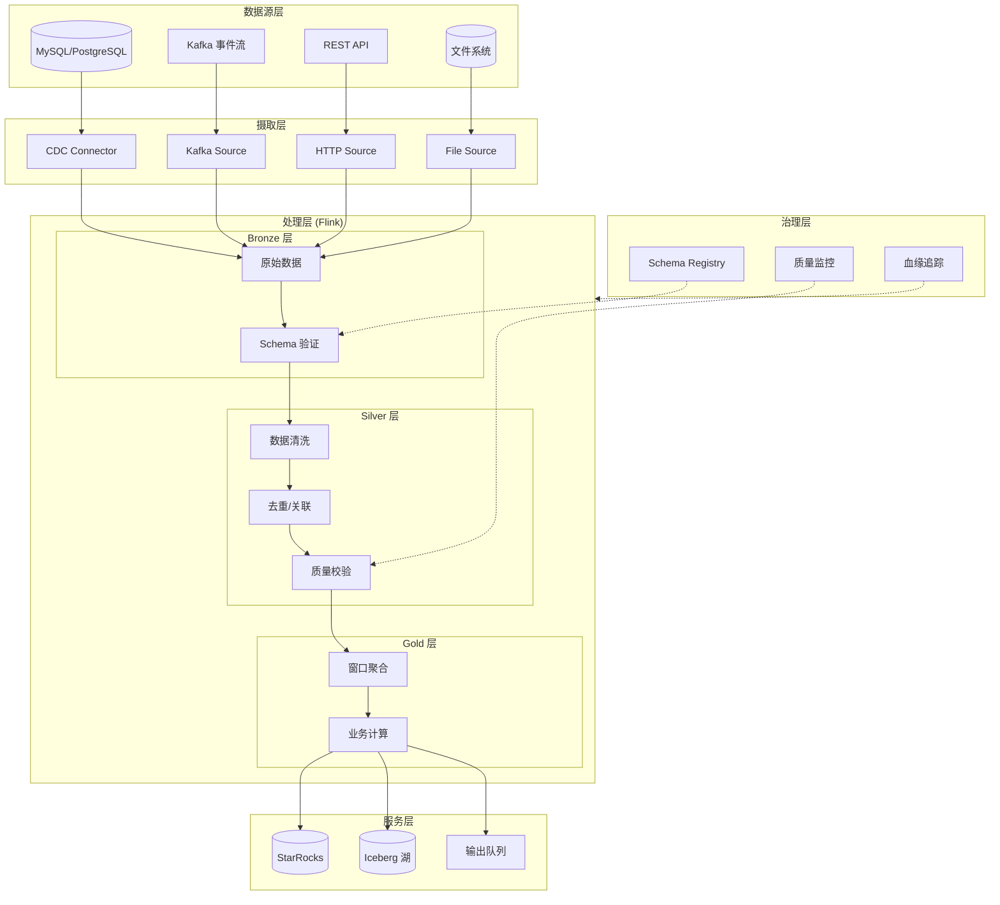
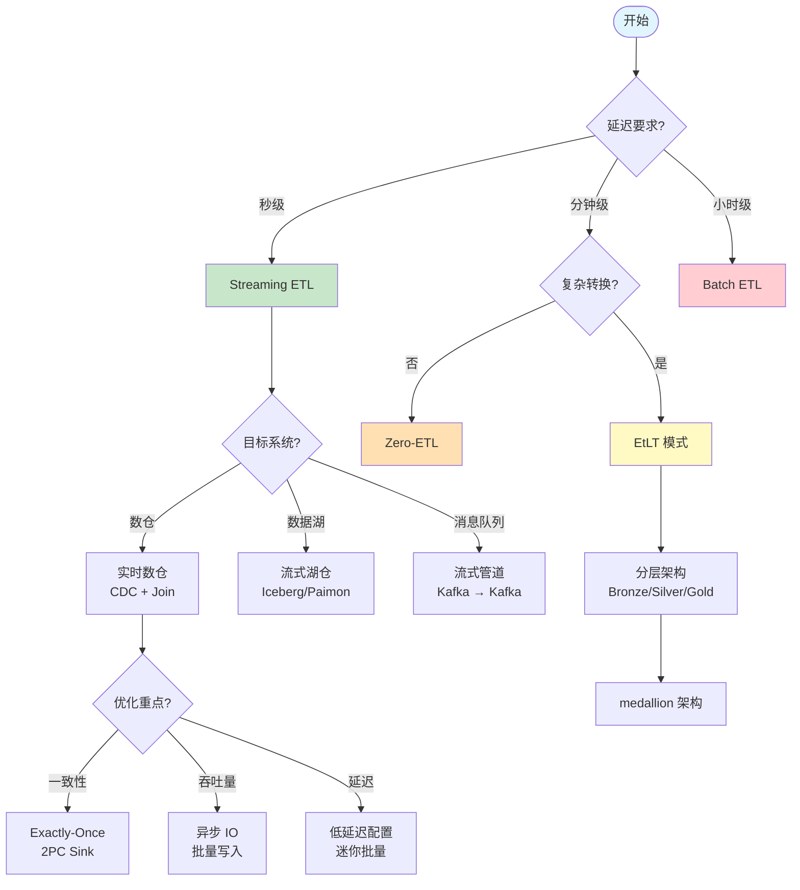
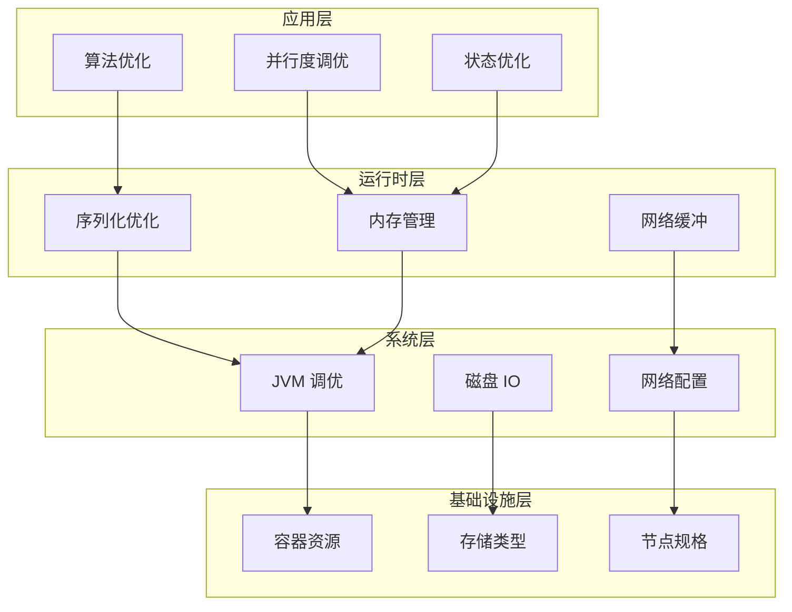

# Streaming ETL 最佳实践与设计模式

> **所属阶段**: Flink Core Mechanisms | **前置依赖**: [Flink 端到端 Exactly-Once 保障](./exactly-once-end-to-end.md), [时间语义与 Watermark](./time-semantics-and-watermark.md) | **形式化等级**: L4 (Advanced)
>
> Streaming ETL 是流计算最核心的应用场景之一，涵盖数据摄取(Extract)、转换(Transform)、加载(Load)的全链路设计与实现。

---

## 目录

- [Streaming ETL 最佳实践与设计模式](#streaming-etl-最佳实践与设计模式)
  - [目录](#目录)
  - [1. 概念定义 (Definitions)](#1-概念定义-definitions)
    - [1.1 ETL 形式化定义](#11-etl-形式化定义)
    - [1.2 ETL vs ELT vs EtLT 模式](#12-etl-vs-elt-vs-etlt-模式)
    - [1.3 Medallion 架构 (Bronze/Silver/Gold)](#13-medallion-架构-bronzesilvergold)
    - [1.4 零 ETL (Zero-ETL)](#14-零-etl-zero-etl)
  - [2. 属性推导 (Properties)](#2-属性推导-properties)
    - [2.1 吞吐量边界分析](#21-吞吐量边界分析)
    - [2.2 延迟保证推导](#22-延迟保证推导)
    - [2.3 一致性级别与权衡](#23-一致性级别与权衡)
  - [3. 关系建立 (Relations)](#3-关系建立-relations)
    - [3.1 与 Data Mesh 的关系](#31-与-data-mesh-的关系)
    - [3.2 与 Lakehouse 架构的关系](#32-与-lakehouse-架构的关系)
    - [3.3 与流批一体的关系](#33-与流批一体的关系)
  - [4. 论证过程 (Argumentation)](#4-论证过程-argumentation)
    - [4.1 架构选型决策树](#41-架构选型决策树)
    - [4.2 模式选择论证](#42-模式选择论证)
  - [5. 工程论证 (Engineering Argument)](#5-工程论证-engineering-argument)
    - [5.1 数据摄取模式](#51-数据摄取模式)
      - [5.1.1 变更数据捕获 (CDC)](#511-变更数据捕获-cdc)
      - [5.1.2 事件驱动摄取](#512-事件驱动摄取)
      - [5.1.3 批量微批处理](#513-批量微批处理)
      - [5.1.4 混合摄取策略](#514-混合摄取策略)
    - [5.2 转换模式](#52-转换模式)
      - [5.2.1 状态ful转换](#521-状态ful转换)
      - [5.2.2 窗口聚合](#522-窗口聚合)
      - [5.2.3 流式 Join](#523-流式-join)
      - [5.2.4 查找增强 (Lookup Enrichment)](#524-查找增强-lookup-enrichment)
    - [5.3 加载模式](#53-加载模式)
      - [5.3.1 幂等写入](#531-幂等写入)
      - [5.3.2 事务性 Sink](#532-事务性-sink)
      - [5.3.3 分区写入策略](#533-分区写入策略)
      - [5.3.4 目标系统适配](#534-目标系统适配)
    - [5.4 质量与治理](#54-质量与治理)
      - [5.4.1 数据契约](#541-数据契约)
      - [5.4.2 Schema 演进](#542-schema-演进)
      - [5.4.3 血缘追踪](#543-血缘追踪)
      - [5.4.4 数据验证](#544-数据验证)
    - [5.5 性能优化](#55-性能优化)
      - [5.5.1 并行度调优](#551-并行度调优)
      - [5.5.2 状态管理优化](#552-状态管理优化)
      - [5.5.3 序列化优化](#553-序列化优化)
      - [5.5.4 资源分配](#554-资源分配)
    - [5.6 错误处理](#56-错误处理)
      - [5.6.1 重试策略](#561-重试策略)
      - [5.6.2 死信队列 (DLQ)](#562-死信队列-dlq)
      - [5.6.3 断路器模式](#563-断路器模式)
      - [5.6.4 优雅降级](#564-优雅降级)
  - [6. 实例验证 (Examples)](#6-实例验证-examples)
    - [6.1 完整 CDC ETL 管道](#61-完整-cdc-etl-管道)
    - [6.2 实时数仓分层构建](#62-实时数仓分层构建)
  - [7. 可视化 (Visualizations)](#7-可视化-visualizations)
    - [7.1 Streaming ETL 架构全景图](#71-streaming-etl-架构全景图)
    - [7.2 ETL 模式选择决策树](#72-etl-模式选择决策树)
    - [7.3 错误处理模式图](#73-错误处理模式图)
    - [7.4 性能优化层次图](#74-性能优化层次图)
  - [8. 引用参考 (References)](#8-引用参考-references)

---

## 1. 概念定义 (Definitions)

### 1.1 ETL 形式化定义

**定义 Def-F-02-40 (Streaming ETL 系统)**:

一个流式 ETL 系统是一个五元组 $\mathcal{E} = (S, T, L, \Sigma, \mathcal{P})$，其中：

$$
\begin{aligned}
S &: \text{Source 集合，产生数据流 } s: \mathbb{T} \to \mathcal{D} \\
T &: \text{Transform 算子集合，} T: \mathcal{D}^* \to \mathcal{D}^* \\
L &: \text{Sink 集合，接收处理后的数据} \\
\Sigma &: \text{状态空间，} \sigma_t \in \Sigma \text{ 表示时刻 } t \text{ 的系统状态} \\
\mathcal{P} &: \text{处理语义，} \mathcal{P} \in \{\text{At-Most-Once}, \text{At-Least-Once}, \text{Exactly-Once}\}
\end{aligned}
$$

**定义 Def-F-02-41 (ETL 管道语义)**:

给定输入流 $I(t)$ 和输出流 $O(t)$，ETL 管道的语义定义为状态转移函数：

$$
O(t) = \mathcal{F}(I_{[0,t]}, \sigma_t) \quad \text{其中} \quad \sigma_t = \mathcal{G}(\sigma_{t-1}, I(t))
$$

其中 $\mathcal{F}$ 是输出函数，$\mathcal{G}$ 是状态更新函数。

### 1.2 ETL vs ELT vs EtLT 模式

**定义 Def-F-02-42 (ETL 模式)**:

传统 ETL 模式在加载前完成所有转换：

$$
\text{ETL}: \text{Source} \xrightarrow{\text{Extract}} \text{Staging} \xrightarrow{\text{Transform}} \text{Clean} \xrightarrow{\text{Load}} \text{Target}
$$

**特点**: 转换在专用引擎中完成，目标系统仅需存储能力。

**定义 Def-F-02-43 (ELT 模式)**:

ELT 模式先加载原始数据，再在目标系统中转换：

$$
\text{ELT}: \text{Source} \xrightarrow{\text{Extract}} \text{Raw} \xrightarrow{\text{Load}} \text{Target} \xrightarrow{\text{Transform}} \text{Clean}
$$

**特点**: 利用目标系统的计算能力（如数仓的 SQL 引擎），适合大规模分析。

**定义 Def-F-02-44 (EtLT 模式)**:

EtLT（微 ETL）是流场景的折中方案：

$$
\text{EtLT}: \text{Source} \xrightarrow{\text{Extract}} \text{Light-T} \xrightarrow{\text{Load}} \text{Staging} \xrightarrow{\text{Heavy-T}} \text{Target}
$$

**特点**:

- Light-T：轻量转换（过滤、格式标准化、去重）
- Heavy-T：复杂转换（聚合、关联、机器学习）

| 模式 | 转换位置 | 适用场景 | 延迟 | 灵活性 |
|------|----------|----------|------|--------|
| ETL | 专用引擎 | 传统数仓、严格模式治理 | 高 | 低 |
| ELT | 目标系统 | 云数仓、数据湖 | 中 | 高 |
| EtLT | 分层处理 | 实时数仓、流湖一体 | 低 | 中 |

### 1.3 Medallion 架构 (Bronze/Silver/Gold)

**定义 Def-F-02-45 (Medallion 架构)**:

 medallion 架构是一种分层数据治理模式，将数据按质量等级组织为三层：

```
┌─────────────────────────────────────────────────────────────────────────┐
│                        Medallion 数据架构                                │
├─────────────────────────────────────────────────────────────────────────┤
│                                                                         │
│   ┌──────────┐    ┌──────────┐    ┌──────────┐                         │
│   │  Bronze  │───▶│  Silver  │───▶│   Gold   │                         │
│   │  (青铜)   │    │  (白银)   │    │  (黄金)   │                         │
│   └──────────┘    └──────────┘    └──────────┘                         │
│        │               │               │                               │
│   ┌──────────┐    ┌──────────┐    ┌──────────┐                         │
│   │ 原始数据  │    │ 清洗数据  │    │ 业务视图  │                         │
│   │ 无schema │    │ 强类型化  │    │ 聚合就绪  │                         │
│   │ 不可变   │    │ 去重/校验 │    │ 业务定义  │                         │
│   └──────────┘    └──────────┘    └──────────┘                         │
│        │               │               │                               │
│   所有原始数据      可信数据         业务就绪数据                         │
│   保留完整血缘      质量校验通过      可直接消费                         │
│                                                                         │
└─────────────────────────────────────────────────────────────────────────┘
```

**各层职责**:

| 层级 | 数据特性 | Schema | 保留策略 | 主要消费者 |
|------|----------|--------|----------|-----------|
| **Bronze** | 原始、未处理、追加-only | Flexible / 无 | 长期（合规）| Silver 层 ETL |
| **Silver** | 清洗、去重、强类型 | Enforced | 中期 | Gold 层 ETL / 分析师 |
| **Gold** | 聚合、业务就绪、优化 | Strict | 按需 | BI 工具 / ML / 应用 |

### 1.4 零 ETL (Zero-ETL)

**定义 Def-F-02-46 (Zero-ETL)**:

Zero-ETL 是一种架构范式，通过消除显式 ETL 管道，使数据源和目标系统之间实现近实时的直接集成：

$$
\text{Zero-ETL}: \text{Source} \xrightarrow{\text{Replication/Replication Stream}} \text{Target}
$$

**形式化条件**: 对于源系统 $S$ 和目标系统 $T$，Zero-ETL 要求：

$$
\forall t. \; T(t) = S(t - \delta) \quad \text{其中} \; \delta \ll 1\text{min}
$$

**实现方式**:

- **物理复制**: 数据库 WAL 复制（如 Aurora → Redshift）
- **逻辑复制**: CDC 直接写入（如 Debezium → Iceberg）
- **查询联邦**: 虚拟化层直接查询（如 Trino, Starburst）

**权衡分析**:

| 维度 | Zero-ETL | Traditional ETL |
|------|----------|-----------------|
| 延迟 | 极低（秒级） | 分钟~小时级 |
| 转换灵活性 | 有限 | 极高 |
| 成本 | 低（无专用集群） | 中~高 |
| 数据治理 | 依赖源系统 | 可精细控制 |
| 适用场景 | 简单复制、报表加速 | 复杂转换、多源整合 |

---

## 2. 属性推导 (Properties)

### 2.1 吞吐量边界分析

**引理 Lemma-F-02-20 (ETL 吞吐量上界)**:

对于具有 $N$ 个并行子任务的 Flink ETL 作业，其理论吞吐量上界为：

$$
\text{Throughput}_{\max} = \min\left( \sum_{i=1}^{N} C_i^{\text{source}}, \sum_{i=1}^{N} C_i^{\text{process}}, \sum_{i=1}^{N} C_i^{\text{sink}} \right)
$$

其中 $C_i^{\text{source}}$, $C_i^{\text{process}}$, $C_i^{\text{sink}}$ 分别为第 $i$ 个并行子任务在 Source、Process、Sink 阶段的处理能力。

**证明**:
根据流系统的流水线特性，整体吞吐量受限于最慢的瓶颈环节。根据并行处理的聚合原理，各阶段总容量为并行子任务容量之和。由最小约束原则，系统吞吐量不超过任一阶段的处理能力。∎

**定理 Thm-F-02-35 (背压传播定理)**:

在 ETL 管道中，若 Sink 阶段的吞吐量 $\lambda_{\text{sink}}$ 小于 Source 阶段吞吐量 $\lambda_{\text{source}}$，则背压将在时间 $t_b$ 后传播至 Source：

$$
t_b = \frac{B_{\text{buffer}}}{\lambda_{\text{source}} - \lambda_{\text{process}}}
$$

其中 $B_{\text{buffer}}$ 为缓冲区容量。

### 2.2 延迟保证推导

**引理 Lemma-F-02-21 (端到端延迟分解)**:

Streaming ETL 的端到端延迟 $L_{\text{e2e}}$ 可分解为：

$$
L_{\text{e2e}} = L_{\text{source}} + L_{\text{queue}} + L_{\text{process}} + L_{\text{checkpoint}} + L_{\text{sink}}
$$

其中：

- $L_{\text{source}}$: Source 拉取延迟
- $L_{\text{queue}}$: 网络/缓冲区排队延迟
- $L_{\text{process}}$: 转换计算延迟
- $L_{\text{checkpoint}}$: Checkpoint 对齐延迟
- $L_{\text{sink}}$: Sink 提交延迟

**定理 Thm-F-02-36 (延迟-吞吐量权衡)**:

对于给定的资源预算 $R$，Streaming ETL 系统存在延迟-吞吐量权衡曲线：

$$
L_{\text{e2e}}(\lambda) \geq \frac{\lambda}{R \cdot \eta} + L_{\min}
$$

其中 $\eta$ 为资源利用效率系数，$L_{\min}$ 为固有延迟。

### 2.3 一致性级别与权衡

**定义 Def-F-02-47 (ETL 一致性级别)**:

| 级别 | 定义 | 保证 | 实现成本 |
|------|------|------|----------|
| **最终一致** | 无故障时最终收敛 | 无实时保证 | 低 |
| **读写一致** | 读取看到最新写入 | 单调读 | 中 |
| **顺序一致** | 全局顺序执行 | 全局有序 | 高 |
| **因果一致** | 因果相关操作有序 | 因果序 | 中~高 |
| **严格一致** | 线性化 | 实时序 | 极高 |

**定理 Thm-F-02-37 (CAP 在 ETL 中的体现)**:

在分布式 Streaming ETL 系统中，当发生网络分区时，以下三者最多同时满足两项：

1. **一致性 (C)**: 所有节点看到相同的数据状态
2. **可用性 (A)**: 每个请求都能收到响应
3. **分区容错 (P)**: 系统在网络分区时继续运行

**工程推论**: Flink 在 Checkpoint 失败时选择暂停处理（牺牲 A 保 C），而在非对齐 Checkpoint 模式下优先保 A。

---

## 3. 关系建立 (Relations)

### 3.1 与 Data Mesh 的关系

**定义 Def-F-02-48 (Data Mesh 领域对齐)**:

Data Mesh 架构将数据所有权分散到各个业务领域，Streaming ETL 作为领域间数据流动的实现机制：

```
┌─────────────────────────────────────────────────────────────────────────┐
│                    Data Mesh × Streaming ETL                            │
├─────────────────────────────────────────────────────────────────────────┤
│                                                                         │
│   ┌──────────────┐         ┌──────────────┐         ┌──────────────┐   │
│   │  领域 A      │◄───────►│   数据平台    │◄───────►│  领域 B      │   │
│   │  (Domain)    │   ETL   │  (Platform)  │   ETL   │  (Domain)    │   │
│   └──────┬───────┘         └──────┬───────┘         └──────┬───────┘   │
│          │                        │                        │           │
│   ┌──────▼───────┐         ┌──────▼───────┐         ┌──────▼───────┐   │
│   │ 领域数据产品  │         │  通用 ETL    │         │ 领域数据产品  │   │
│   │ (Data Product)│        │ 基础设施     │         │ (Data Product)│   │
│   └──────────────┘         └──────────────┘         └──────────────┘   │
│                                                                         │
│   ETL 在 Data Mesh 中的角色：                                            │
│   - 领域内部：支持数据产品构建 (Self-serve)                              │
│   - 领域之间：实现数据产品消费 (Inter-domain)                            │
│   - 平台层：提供标准化 ETL 能力 (Federated Governance)                   │
│                                                                         │
└─────────────────────────────────────────────────────────────────────────┘
```

**关系矩阵**:

| Data Mesh 原则 | Streaming ETL 实现 | 技术映射 |
|----------------|-------------------|----------|
| 领域所有权 | 领域团队拥有 ETL 管道 | 命名空间/资源隔离 |
| 数据即产品 | ETL 输出标准化数据产品 | Schema 注册表/数据契约 |
| 自服务平台 | 低代码 ETL 配置 | SQL API / CDC Connectors |
| 联邦治理 | 全局血缘/质量监控 | Lineage API / Metrics |

### 3.2 与 Lakehouse 架构的关系

**定义 Def-F-02-49 (流式 Lakehouse 集成)**:

Lakehouse 架构将数据湖的存储成本与数仓的 ACID 保证结合，Streaming ETL 是实现实时 Lakehouse 的关键：

```
┌─────────────────────────────────────────────────────────────────────────┐
│                    Streaming Lakehouse 架构                             │
├─────────────────────────────────────────────────────────────────────────┤
│                                                                         │
│   ┌─────────────┐     ┌─────────────┐     ┌─────────────────────────┐  │
│   │   实时摄入   │────▶│   流式ETL    │────▶│      开放表格式         │  │
│   │  (CDC/消息)  │     │  (Flink)    │     │  (Iceberg/Paimon/Delta) │  │
│   └─────────────┘     └─────────────┘     └─────────────────────────┘  │
│                                                     │                   │
│                        ┌────────────────────────────┼────────────────┐ │
│                        ▼                            ▼                │ │
│                   ┌─────────┐                  ┌─────────┐           │ │
│                   │ 实时分析 │                  │ 批量分析 │           │ │
│                   │(FlinkSQL)│                 │(Spark/SQL)│          │ │
│                   └─────────┘                  └─────────┘           │ │
│                                                                     │ │
│   开放表格式提供的流批能力：                                           │ │
│   - 增量读取 (Incremental Scan)                                      │ │
│   - 时间旅行 (Time Travel)                                           │ │
│   - 版本回滚 (Rollback)                                              │ │
│   - Schema 演进 (Schema Evolution)                                   │ │
│                                                                         │
└─────────────────────────────────────────────────────────────────────────┘
```

**集成模式**:

| 模式 | 描述 | 适用场景 |
|------|------|----------|
| **增量摄入** | Flink CDC → Lakehouse 增量提交 | 实时数仓 |
| **流式合并** | Flink 流读 + LSM Tree 合并 | 更新密集型表 |
| **批量覆盖** | Flink 批处理 + 分区覆盖 | 全量刷新 |
| **近实时分析** | Paimon 流读 + OLAP 查询 | 分钟级分析 |

### 3.3 与流批一体的关系

**定义 Def-F-02-50 (流批一体语义)**:

流批一体指使用统一的 API 和引擎同时处理流数据和批量历史数据：

$$
\text{Unified}(\text{Stream}, \text{Batch}) \iff \exists \mathcal{A}. \; \mathcal{A}(\text{Stream}) = \mathcal{A}(\text{Batch}) \land \text{Semantics}(\mathcal{A}) \text{ 一致}
$$

**Flink 实现机制**:

| 维度 | 流处理模式 | 批处理模式 | 统一方式 |
|------|-----------|-----------|----------|
| **API** | DataStream API | DataSet API (已弃用) | Table API / SQL |
| **执行模式** | STREAMING | BATCH | Runtime 自动选择 |
| **状态管理** | 增量 Checkpoint | 无状态 / 全局排序 | StateBackend 适配 |
| **容错** | Checkpoint | 阶段重算 | 统一容错抽象 |
| **时间语义** | Event Time + Watermark | 处理时间 / 无时间 | TimeCharacteristic |

**命题 Prop-F-02-25 (流批等价条件)**:

对于无界流 $S$ 和有界批次 $B$（其中 $B = S_{[0,T]}$），当满足以下条件时，流处理结果 $R_S$ 与批处理结果 $R_B$ 等价：

$$
R_S = R_B \iff \text{算子满足幂等性} \land \text{Watermark 不晚于 } T
$$

---

## 4. 论证过程 (Argumentation)

### 4.1 架构选型决策树

**决策框架**:

```
┌─────────────────────────────────────────────────────────────────────────┐
│                    Streaming ETL 架构选型决策树                          │
├─────────────────────────────────────────────────────────────────────────┤
│                                                                         │
│  开始                                                                    │
│   │                                                                     │
│   ▼                                                                     │
│  ┌───────────────────────┐                                             │
│  │ 延迟要求 < 1 分钟?     │                                             │
│  └───────────┬───────────┘                                             │
│              │                                                          │
│      ┌───────┴───────┐                                                  │
│      ▼               ▼                                                  │
│     是               否                                                 │
│      │               │                                                  │
│      ▼               ▼                                                  │
│  ┌──────────────────┐  ┌──────────────────┐                            │
│  │ Streaming ETL    │  │ 需要复杂转换?    │                            │
│  │ (Flink/Kafka)    │  └───────┬──────────┘                            │
│  └──────────────────┘          │                                       │
│                        ┌───────┴───────┐                               │
│                        ▼               ▼                               │
│                       是               否                               │
│                        │               │                                │
│                        ▼               ▼                                │
│                ┌──────────────┐  ┌──────────────┐                      │
│                │ ETL/ EtLT    │  │ Zero-ETL     │                      │
│                │ (Flink)      │  │ (Replication)│                      │
│                └──────────────┘  └──────────────┘                      │
│                        │                                               │
│                        ▼                                               │
│                ┌──────────────┐                                        │
│                │ 目标系统类型 │                                        │
│                └──────┬───────┘                                        │
│                       │                                                │
│           ┌───────────┼───────────┐                                    │
│           ▼           ▼           ▼                                    │
│       数据湖       数据仓库       混合                                   │
│          │           │           │                                     │
│          ▼           ▼           ▼                                     │
│    ┌─────────┐  ┌─────────┐  ┌─────────┐                              │
│    │Iceberg/ │  │StarRocks│  │ medallion│                             │
│    │ Paimon  │  │ Doris   │  │ 架构     │                             │
│    └─────────┘  └─────────┘  └─────────┘                              │
│                                                                         │
└─────────────────────────────────────────────────────────────────────────┘
```

### 4.2 模式选择论证

**论证 1: CDC vs 批量摄取**

| 场景 | 推荐模式 | 理由 |
|------|----------|------|
| OLTP → OLAP 实时同步 | CDC | 低延迟、精确捕获变更、资源效率高 |
| 历史数据初始化 | 批量 | 吞吐量大、实现简单、无 Source 压力 |
| 多源整合 | CDC + 批量混合 | CDC 处理增量，批量处理回溯 |
| 事件驱动微服务 | 事件驱动摄取 | 松耦合、天然异步、扩展性好 |

**论证 2: 状态管理策略**

| 场景 | 状态后端 | TTL 策略 | 理由 |
|------|----------|----------|------|
| 短窗口聚合 (< 1h) | HashMapStateBackend | 窗口大小 + 缓冲 | 内存速度快 |
| 长窗口聚合 (> 1h) | RocksDBStateBackend | 根据业务定义 | 磁盘容量大 |
| 全局去重 | RocksDB + 增量 Checkpoint | 业务定义 | 状态可能无限增长 |
| ML 特征存储 | 外部存储 (Redis/HBase) | 外部管理 | 状态需跨作业共享 |

**论证 3: Sink 写入策略**

| 目标系统 | 推荐策略 | 一致性保证 |
|----------|----------|------------|
| Kafka | 事务性 Producer | Exactly-Once |
| JDBC 数据库 | XA 事务 / 幂等 UPSERT | Exactly-Once |
| 文件系统 | 两阶段提交 + 分区原子性 | Exactly-Once |
| Elasticsearch | 幂等写入 (ID 去重) | At-Least-Once → Exactly-Once |
| NoSQL (HBase) | 幂等 Put / Check-and-Put | Exactly-Once |

---

## 5. 工程论证 (Engineering Argument)

### 5.1 数据摄取模式

#### 5.1.1 变更数据捕获 (CDC)

**定义 Def-F-02-51 (CDC 形式化)**:

CDC 是一种捕获数据库变更事件的技术，将 DML 操作 (INSERT/UPDATE/DELETE) 转换为事件流：

$$
\text{CDC}: \Delta DB \to \{ (op, before, after, ts, source) \}^*
$$

**CDC 模式对比**:

| 模式 | 实现 | 延迟 | 对源库影响 | 一致性 |
|------|------|------|-----------|--------|
| **基于日志** | Debezium, Maxwell | 秒级 | 低（仅读 WAL）| 强 |
| **基于触发器** | 数据库触发器 | 秒级 | 高（写放大）| 强 |
| **基于查询** | 轮询 + 时间戳/版本 | 分钟级 | 中（周期性查询）| 弱 |
| **基于通知** | PostgreSQL LISTEN | 毫秒级 | 低 | 中等 |

**Flink CDC 实现**:

```java
// MySQL CDC Source 配置
MySqlSource<String> mySqlSource = MySqlSource.<String>builder()
    .hostname("mysql-host")
    .port(3306)
    .databaseList("inventory")
    .tableList("inventory.products", "inventory.orders")
    .username("flink-user")
    .password("password")
    .deserializer(new JsonDebeziumDeserializationSchema())
    // Exactly-Once 配置
    .startupOptions(StartupOptions.initial())  // 全量 + 增量
    .build();

// 构建流
env.fromSource(mySqlSource, WatermarkStrategy.noWatermarks(), "MySQL CDC")
   .addSink(kafkaSink);  // 写入 Kafka 或下游处理
```

**CDC 数据格式 (Debezium)**:

```json
{
  "before": {"id": 1, "name": "Alice", "age": 30},
  "after": {"id": 1, "name": "Alice", "age": 31},
  "source": {
    "version": "1.9.0",
    "connector": "mysql",
    "name": "mysql-server-1",
    "ts_ms": 1672531200000,
    "db": "inventory",
    "table": "customers"
  },
  "op": "u",
  "ts_ms": 1672531200500
}
```

#### 5.1.2 事件驱动摄取

**适用场景**: 微服务架构、领域事件、事件溯源

```java

import org.apache.flink.api.common.state.ValueState;

// Kafka Source 配置（事件驱动）
FlinkKafkaConsumer<Event> source = new FlinkKafkaConsumer<>(
    "domain-events",
    new EventDeserializationSchema(),
    properties
);

// 事件处理流程
dataStream
    .keyBy(Event::getAggregateId)
    .process(new KeyedProcessFunction<String, Event, Result>() {
        private ValueState<AggregateState> state;

        @Override
        public void processElement(Event event, Context ctx, Collector<Result> out) {
            AggregateState current = state.value();
            if (current == null) {
                current = new AggregateState();
            }
            // 应用事件到聚合状态
            current.apply(event);
            state.update(current);
            out.collect(new Result(current));
        }
    });
```

#### 5.1.3 批量微批处理

**适用场景**: 历史数据回溯、大表初始化、低频更新

```java
// 批量读取 JDBC
JdbcInputFormat jdbcInput = JdbcInputFormat.buildJdbcInputFormat()
    .setDrivername("com.mysql.cj.jdbc.Driver")
    .setDBUrl("jdbc:mysql://host/db")
    .setQuery("SELECT * FROM large_table WHERE id BETWEEN ? AND ?")
    .setRowTypeInfo(rowTypeInfo)
    .setParametersProvider(new JdbcParameterValuesProvider() {
        @Override
        public Serializable[][] getParameterValues() {
            // 分区读取，避免单点压力
            int partitions = 10;
            Serializable[][] params = new Serializable[partitions][2];
            long maxId = getMaxId();
            for (int i = 0; i < partitions; i++) {
                params[i][0] = i * (maxId / partitions);
                params[i][1] = (i + 1) * (maxId / partitions);
            }
            return params;
        }
    })
    .finish();
```

#### 5.1.4 混合摄取策略

```
┌─────────────────────────────────────────────────────────────────────────┐
│                    混合摄取策略 (Lambda 与 Kappa)                        │
├─────────────────────────────────────────────────────────────────────────┤
│                                                                         │
│   ┌─────────────────────────────────────────────────────────────────┐  │
│   │                         Lambda 架构                              │  │
│   ├─────────────────────────────────────────────────────────────────┤  │
│   │                                                                 │  │
│   │    ┌─────────────┐                    ┌─────────────┐          │  │
│   │    │   数据源     │───────────────────▶│  批处理层    │          │  │
│   │    └──────┬──────┘                    │  (Batch)    │          │  │
│   │           │                           └──────┬──────┘          │  │
│   │           │                                  │                 │  │
│   │           │                    ┌─────────────┘                 │  │
│   │           │                    ▼                               │  │
│   │           │              ┌─────────────┐    全量视图            │  │
│   │           │              │   服务层    │◄─────────────────────│  │
│   │           │              │  (Serving)  │                      │  │
│   │           │              └──────▲──────┘                      │  │
│   │           │                     │                              │  │
│   │           │            ┌────────┴────────┐                     │  │
│   │           └───────────▶│   速度层        │                     │  │
│   │                        │   (Speed)       │  实时增量            │  │
│   │                        │  (Flink)        │                     │  │
│   │                        └─────────────────┘                     │  │
│   │                                                                │  │
│   └─────────────────────────────────────────────────────────────────┘  │
│                                                                         │
│   ┌─────────────────────────────────────────────────────────────────┐  │
│   │                         Kappa 架构                               │  │
│   ├─────────────────────────────────────────────────────────────────┤  │
│   │                                                                 │  │
│   │    ┌─────────────┐         ┌─────────────┐         ┌─────────┐ │  │
│   │    │   数据源     │────────▶│  消息队列    │────────▶│ 流处理  │ │  │
│   │    └─────────────┘         │  (Kafka)    │         │ (Flink) │ │  │
│   │                            └─────────────┘         └────┬────┘ │  │
│   │                                                          │      │  │
│   │                              ┌───────────────────────────┘      │  │
│   │                              ▼                                  │  │
│   │                        ┌─────────────┐                          │  │
│   │                        │   服务层    │                          │  │
│   │                        │  (Serving)  │                          │  │
│   │                        └─────────────┘                          │  │
│   │                                                                 │  │
│   │   关键点: 所有数据都通过消息队列，批处理作为特殊流处理（有界流）   │  │
│   │                                                                 │  │
│   └─────────────────────────────────────────────────────────────────┘  │
│                                                                         │
└─────────────────────────────────────────────────────────────────────────┘
```

### 5.2 转换模式

#### 5.2.1 状态ful转换

**定义 Def-F-02-52 (状态ful算子)**:

状态ful算子是指在处理元素时需要维护和更新状态的算子：

$$
\text{Stateful}(f) \iff \exists \sigma. \; f(x, \sigma) = (y, \sigma') \land \sigma' \neq \sigma \text{ 对某些 } x
$$

**常见状态ful转换**:

| 模式 | 描述 | Flink 实现 |
|------|------|-----------|
| **去重** | 基于ID去重 | `KeyedProcessFunction` + `ValueState<Boolean>` |
| **会话窗口** | 动态窗口合并 | `EventTimeTrigger` + `StateDescriptor` |
| **模式检测** | CEP 复杂事件处理 | `CEP.pattern()` + NFA 状态机 |
| **聚合** | 持续聚合计算 | `AggregateFunction` + 状态后端 |
| **双流Join** | 流与流关联 | `IntervalJoin` / `CoProcessFunction` |

**去重实现示例**:

```java

import org.apache.flink.api.common.state.ValueState;
import org.apache.flink.api.common.state.ValueStateDescriptor;
import org.apache.flink.api.common.typeinfo.Types;
import org.apache.flink.streaming.api.windowing.time.Time;

public class DeduplicateFunction extends KeyedProcessFunction<String, Event, Event> {
    private ValueState<Boolean> seenState;
    private StateTtlConfig ttlConfig;

    @Override
    public void open(Configuration parameters) {
        ttlConfig = StateTtlConfig
            .newBuilder(Time.hours(24))
            .setUpdateType(StateTtlConfig.UpdateType.OnCreateAndWrite)
            .setStateVisibility(StateTtlConfig.StateVisibility.NeverReturnExpired)
            .cleanupIncrementally(10, true)
            .build();

        ValueStateDescriptor<Boolean> descriptor =
            new ValueStateDescriptor<>("seen", Types.BOOLEAN);
        descriptor.enableTimeToLive(ttlConfig);
        seenState = getRuntimeContext().getState(descriptor);
    }

    @Override
    public void processElement(Event event, Context ctx, Collector<Event> out)
            throws Exception {
        if (seenState.value() == null) {
            seenState.update(true);
            out.collect(event);
        }
        // 重复数据静默丢弃
    }
}
```

#### 5.2.2 窗口聚合

**窗口类型矩阵**:

| 窗口类型 | 适用场景 | 特点 | 状态增长 |
|----------|----------|------|----------|
| **滚动窗口** | 固定周期统计 | 无重叠、简单 | O(窗口数) |
| **滑动窗口** | 移动平均 | 可重叠 | O(窗口数 × 重叠度) |
| **会话窗口** | 用户行为分析 | 动态边界、间隙检测 | O(活跃会话数) |
| **全局窗口** | 全局聚合 | 单窗口、需自定义触发 | O(1) |
| **增量窗口** | 持续更新 | 提前输出、渐进计算 | O(键数) |

**窗口聚合优化**:

```java

import org.apache.flink.streaming.api.datastream.DataStream;
import org.apache.flink.api.common.functions.AggregateFunction;
import org.apache.flink.streaming.api.windowing.time.Time;

// 增量聚合 + 全量聚合组合
DataStream<Result> result = stream
    .keyBy(Event::getUserId)
    .window(TumblingEventTimeWindows.of(Time.minutes(5)))
    .aggregate(
        // 增量聚合：减少状态存储
        new AggregateFunction<Event, Accumulator, Result>() {
            @Override
            public Accumulator createAccumulator() {
                return new Accumulator();
            }

            @Override
            public Accumulator add(Event event, Accumulator acc) {
                acc.sum += event.getValue();
                acc.count++;
                return acc;
            }

            @Override
            public Result getResult(Accumulator acc) {
                return new Result(acc.sum / acc.count);
            }

            @Override
            public Accumulator merge(Accumulator a, Accumulator b) {
                a.sum += b.sum;
                a.count += b.count;
                return a;
            }
        },
        // 窗口函数：获取窗口元数据
        new ProcessWindowFunction<Result, Result, String, TimeWindow>() {
            @Override
            public void process(String key, Context ctx,
                    Iterable<Result> inputs, Collector<Result> out) {
                Result result = inputs.iterator().next();
                result.setWindowStart(ctx.window().getStart());
                result.setWindowEnd(ctx.window().getEnd());
                out.collect(result);
            }
        }
    );
```

#### 5.2.3 流式 Join

**Join 类型对比**:

| Join 类型 | 语义 | 实现 | 状态要求 |
|-----------|------|------|----------|
| **Interval Join** | 时间区间内匹配 | `keyedStream.intervalJoin()` | 时间窗口缓存 |
| **Window Join** | 共窗口匹配 | `keyedStream.join().window()` | 窗口状态 |
| **Temporal Join** | 时态表关联 | `FOR SYSTEM_TIME AS OF` | 版本化状态 |
| **Regular Join** | 无条件匹配 | `DataStream.join()` | 无界状态（危险） |
| **Async Lookup Join** | 维表关联 | `AsyncFunction` | 异步IO |

**Interval Join 示例**:

```java

import org.apache.flink.streaming.api.windowing.time.Time;

// 订单与支付在 5 分钟内匹配
orderStream
    .keyBy(Order::getOrderId)
    .intervalJoin(
        paymentStream.keyBy(Payment::getOrderId)
    )
    .between(Time.minutes(-5), Time.minutes(5))
    .process(new ProcessJoinFunction<Order, Payment, EnrichedOrder>() {
        @Override
        public void processElement(Order order, Payment payment,
                Context ctx, Collector<EnrichedOrder> out) {
            out.collect(new EnrichedOrder(order, payment));
        }
    });
```

**Temporal Join (维表关联)**:

```sql
-- 订单流关联商品维表（版本化）
SELECT
    o.order_id,
    o.user_id,
    p.product_name,
    p.category,
    o.amount
FROM orders o
LEFT JOIN products FOR SYSTEM_TIME AS OF o.proc_time p
    ON o.product_id = p.product_id
```

#### 5.2.4 查找增强 (Lookup Enrichment)

**定义 Def-F-02-53 (Lookup Join)**:

Lookup Join 是一种异步维表关联模式，用于增强流数据：

```java

import org.apache.flink.streaming.api.datastream.DataStream;

public class AsyncDatabaseRequest extends RichAsyncFunction<Event, EnrichedEvent> {
    private transient DataSource dataSource;

    @Override
    public void open(Configuration parameters) {
        HikariConfig config = new HikariConfig();
        config.setJdbcUrl("jdbc:mysql://host/db");
        config.setMaximumPoolSize(20);
        dataSource = new HikariDataSource(config);
    }

    @Override
    public void asyncInvoke(Event event, ResultFuture<EnrichedEvent> resultFuture) {
        CompletableFuture.supplyAsync(() -> {
            try (Connection conn = dataSource.getConnection();
                 PreparedStatement stmt = conn.prepareStatement(
                     "SELECT * FROM users WHERE user_id = ?")) {
                stmt.setString(1, event.getUserId());
                ResultSet rs = stmt.executeQuery();
                if (rs.next()) {
                    return new EnrichedEvent(event, rs.getString("user_name"));
                }
                return new EnrichedEvent(event, "unknown");
            } catch (SQLException e) {
                throw new RuntimeException(e);
            }
        }).thenAccept(resultFuture::complete);
    }

    @Override
    public void timeout(Event event, ResultFuture<EnrichedEvent> resultFuture) {
        // 超时处理：使用默认值或发送到侧输出
        resultFuture.complete(Collections.singletonList(
            new EnrichedEvent(event, "timeout")
        ));
    }
}

// 使用异步IO
DataStream<EnrichedEvent> enriched = AsyncDataStream.unorderedWait(
    eventStream,
    new AsyncDatabaseRequest(),
    1000,  // 超时时间
    TimeUnit.MILLISECONDS,
    100    // 并发请求数
);
```

**Lookup 优化策略**:

| 策略 | 实现 | 适用场景 |
|------|------|----------|
| **本地缓存** | Guava Cache / Caffeine | 热点数据 |
| **分布式缓存** | Redis / HBase | 大容量维表 |
| **广播维表** | Broadcast Stream | 小维表、高频关联 |
| **分区对齐** | 相同分区策略 | 减少网络传输 |

### 5.3 加载模式

#### 5.3.1 幂等写入

**定义 Def-F-02-54 (幂等性)**:

操作 $f$ 是幂等的，当且仅当：

$$
\forall x. \; f(f(x)) = f(x)
$$

**幂等写入实现**:

```java
// Kafka 幂等 Producer（基于序列号）
Properties props = new Properties();
props.put("bootstrap.servers", "kafka:9092");
props.put("acks", "all");
props.put("enable.idempotence", "true");  // 启用幂等
props.put("max.in.flight.requests.per.connection", "5");
props.put("retries", Integer.MAX_VALUE);

// Elasticsearch 幂等写入（基于文档ID）
IndexRequest request = new IndexRequest("index");
request.id(record.getId());  // 使用业务ID作为文档ID
request.source(record.toJson());
request.opType(DocWriteRequest.OpType.CREATE);  // 或 INDEX

// 数据库 UPSERT 幂等
"INSERT INTO table (id, value) VALUES (?, ?) " +
"ON DUPLICATE KEY UPDATE value = VALUES(value)"
```

#### 5.3.2 事务性 Sink

**两阶段提交 (2PC) 实现**:

```java
public class TwoPhaseCommitSink extends TwoPhaseCommitSinkFunction<Event, Transaction, Void> {

    public TwoPhaseCommitSink() {
        super(TypeInformation.of(Event.class).createSerializer(new ExecutionConfig()),
              TypeInformation.of(Transaction.class).createSerializer(new ExecutionConfig()));
    }

    @Override
    protected void invoke(Transaction transaction, Event event, Context context) {
        transaction.write(event);
    }

    @Override
    protected Transaction beginTransaction() {
        // 开启事务，返回事务句柄
        return new Transaction(UUID.randomUUID().toString());
    }

    @Override
    protected void preCommit(Transaction transaction) {
        // 预提交：刷新缓冲区，但不关闭事务
        transaction.flush();
    }

    @Override
    protected void commit(Transaction transaction) {
        // 正式提交
        transaction.commit();
    }

    @Override
    protected void abort(Transaction transaction) {
        // 回滚事务
        transaction.rollback();
    }
}
```

**事务性 Sink 矩阵**:

| Sink 类型 | 事务机制 | 恢复时间 | 适用场景 |
|-----------|----------|----------|----------|
| **Kafka** | Kafka 事务 (TxID) | 快 | 流式管道 |
| **JDBC** | XA 事务 | 慢 | 金融级一致 |
| **文件系统** | 原子重命名 | 快 | 数据湖 |
| **Iceberg** | 快照隔离 | 快 | Lakehouse |

#### 5.3.3 分区写入策略

**时间分区写入**:

```java
// 按小时分区写入 Parquet
StreamingFileSink<Record> sink = StreamingFileSink
    .forBulkFormat(
        new Path("s3://bucket/output/"),
        ParquetAvroWriters.forSpecificRecord(Record.class)
    )
    .withBucketAssigner(new DateTimeBucketAssigner<>("yyyy-MM-dd-HH"))
    .withRollingPolicy(
        DefaultRollingPolicy.builder()
            .withRolloverInterval(TimeUnit.MINUTES.toMillis(10))
            .withInactivityInterval(TimeUnit.MINUTES.toMillis(5))
            .withMaxPartSize(128 * 1024 * 1024)
            .build()
    )
    .withOutputFileConfig(
        OutputFileConfig.builder()
            .withPartPrefix("part")
            .withPartSuffix(".parquet")
            .build()
    )
    .build();
```

**动态分区写入（Hive 风格）**:

```java
// 基于事件字段动态分区
public class DynamicPartitionBucketAssigner implements BucketAssigner<Record, String> {
    @Override
    public String getBucketId(Record record, Context context) {
        // 根据事件时间动态分区
        LocalDateTime dt = LocalDateTime.ofInstant(
            Instant.ofEpochMilli(record.getEventTime()),
            ZoneId.systemDefault()
        );
        return String.format("dt=%s/region=%s",
            dt.toLocalDate(),
            record.getRegion());
    }
}
```

#### 5.3.4 目标系统适配

```
┌─────────────────────────────────────────────────────────────────────────┐
│                    Sink 连接器适配层                                    │
├─────────────────────────────────────────────────────────────────────────┤
│                                                                         │
│   ┌─────────────────────────────────────────────────────────────────┐  │
│   │                    Flink DataStream API                          │  │
│   └──────────────────────────┬──────────────────────────────────────┘  │
│                              │                                          │
│   ┌──────────────────────────▼──────────────────────────────────────┐  │
│   │                    Sink 连接器抽象层                              │  │
│   ├─────────────────────────────────────────────────────────────────┤  │
│   │  ┌─────────────┐  ┌─────────────┐  ┌─────────────┐  ┌─────────┐ │  │
│   │  │  SinkWriter │  │ Committer   │  │   Global    │  │ Init    │ │  │
│   │  │  (写入数据)  │  │ (提交事务)  │  │  Committer  │  │ Context │ │  │
│   │  └─────────────┘  └─────────────┘  └─────────────┘  └─────────┘ │  │
│   └──────────────────────────┬──────────────────────────────────────┘  │
│                              │                                          │
│   ┌──────────────────────────▼──────────────────────────────────────┐  │
│   │                    具体 Sink 实现                                 │  │
│   ├─────────────────────────────────────────────────────────────────┤  │
│   │  ┌─────────┐ ┌─────────┐ ┌─────────┐ ┌─────────┐ ┌─────────┐   │  │
│   │  │  Kafka  │ │  JDBC   │ │  Hive   │ │Iceberg  │ │   S3    │   │  │
│   │  │  Sink   │ │  Sink   │ │  Sink   │ │  Sink   │ │  Sink   │   │  │
│   │  └─────────┘ └─────────┘ └─────────┘ └─────────┘ └─────────┘   │  │
│   └─────────────────────────────────────────────────────────────────┘  │
│                                                                         │
└─────────────────────────────────────────────────────────────────────────┘
```

### 5.4 质量与治理

#### 5.4.1 数据契约

**定义 Def-F-02-55 (数据契约)**:

数据契约是数据生产者与消费者之间的正式协议，定义 Schema、质量规则和服务等级：

```yaml
# 数据契约示例 (Data Contract)
contract:
  name: orders-stream
  version: 1.0.0
  owner: order-service-team

  schema:
    type: avro
    definition: |
      {
        "type": "record",
        "name": "Order",
        "fields": [
          {"name": "order_id", "type": "string"},
          {"name": "user_id", "type": "string"},
          {"name": "amount", "type": "double"},
          {"name": "created_at", "type": "long", "logicalType": "timestamp-millis"}
        ]
      }

  quality:
    - rule: order_id_not_null
      type: not_null
      field: order_id
      severity: error

    - rule: amount_positive
      type: range
      field: amount
      min: 0
      severity: error

    - rule: created_at_valid
      type: freshness
      field: created_at
      max_delay: 5m
      severity: warning

  sla:
    latency_p99: 1s
    availability: 99.9%
    throughput_min: 1000 msg/s
```

**Flink 数据契约实现**:

```java
// Schema 验证
public class SchemaValidationMap implements MapFunction<Row, Row> {
    private transient Schema schema;

    @Override
    public Row map(Row row) throws Exception {
        // 验证字段存在性
        for (String field : schema.getRequiredFields()) {
            if (row.getField(field) == null) {
                throw new SchemaViolationException("Missing required field: " + field);
            }
        }

        // 验证数据类型
        for (Map.Entry<String, Type> entry : schema.getFields().entrySet()) {
            Object value = row.getField(entry.getKey());
            if (value != null && !entry.getValue().isInstance(value)) {
                throw new TypeMismatchException(entry.getKey(), entry.getValue(), value.getClass());
            }
        }

        return row;
    }
}
```

#### 5.4.2 Schema 演进

**演进兼容性规则**:

| 变更类型 | 向后兼容 | 向前兼容 | 全兼容 | 说明 |
|----------|----------|----------|--------|------|
| 添加可选字段 | ✓ | ✗ | ✗ | 新增字段有默认值 |
| 添加必填字段 | ✗ | ✗ | ✗ | 破坏现有数据 |
| 删除字段 | ✗ | ✓ | ✗ | 消费者需忽略 |
| 类型扩展 | ✓ | ✗ | ✗ | 如 int → long |
| 重命名字段 | ✗ | ✗ | ✗ | 需显式映射 |
| 修改字段顺序 | ✓ | ✓ | ✓ | 无影响（按名访问）|

**Flink Schema 演进配置**:

```java
// Avro Schema 演进
AvroDeserializationSchema<Order> schema = AvroDeserializationSchema
    .forSpecific(Order.class);

// 在 Schema Registry 中管理版本
SchemaRegistryClient registry = new CachedSchemaRegistryClient(
    "http://schema-registry:8081",
    100
);

// 自动 Schema 演进处理
KafkaAvroDeserializer deserializer = new KafkaAvroDeserializer(registry);
deserializer.configure(Map.of(
    "specific.avro.reader", "true",
    "schema.evolution", "forward"  // 向前兼容模式
), false);
```

#### 5.4.3 血缘追踪

**血缘收集实现**:

```java
// 自定义 Lineage 收集器
public class LineageCollector {

    public static void recordLineage(Transformation<?> transformation,
            String jobName, String jobId) {
        LineageInfo info = new LineageInfo();
        info.setJobName(jobName);
        info.setJobId(jobId);
        info.setOperatorId(transformation.getId());
        info.setOperatorType(transformation.getClass().getSimpleName());
        info.setInputs(extractInputs(transformation));
        info.setOutputs(extractOutputs(transformation));
        info.setTimestamp(System.currentTimeMillis());

        // 发送到 Lineage 存储（如 Apache Atlas, DataHub）
        lineageClient.report(info);
    }

    private static List<DataSource> extractInputs(Transformation<?> t) {
        return t.getInputs().stream()
            .map(input -> new DataSource(
                input.getId(),
                extractConnectorType(input),
                extractPhysicalLocation(input)
            ))
            .collect(Collectors.toList());
    }
}

// Flink SQL 血缘（通过 Parser 拦截）
public class LineageSqlParser implements Parser {
    @Override
    public List<Operation> parse(String statement) {
        List<Operation> operations = delegate.parse(statement);

        for (Operation op : operations) {
            if (op instanceof CreateTableOperation) {
                recordTableLineage((CreateTableOperation) op);
            } else if (op instanceof InsertOperation) {
                recordInsertLineage((InsertOperation) op);
            }
        }

        return operations;
    }
}
```

#### 5.4.4 数据验证

**验证层架构**:

```
┌─────────────────────────────────────────────────────────────────────────┐
│                    数据验证层架构                                       │
├─────────────────────────────────────────────────────────────────────────┤
│                                                                         │
│   ┌─────────────┐                                                       │
│   │   输入数据   │                                                       │
│   └──────┬──────┘                                                       │
│          │                                                              │
│          ▼                                                              │
│   ┌─────────────────────────────────────────────────────────────────┐  │
│   │                         验证管道                                 │  │
│   ├─────────────────────────────────────────────────────────────────┤  │
│   │                                                                 │  │
│   │  ┌─────────────┐    ┌─────────────┐    ┌─────────────┐         │  │
│   │  │ 语法验证    │───▶│ 语义验证    │───▶│ 业务规则    │         │  │
│   │  │ (Schema)    │    │ (Range/Type)│    │ (Custom)    │         │  │
│   │  └─────────────┘    └─────────────┘    └─────────────┘         │  │
│   │         │                  │                  │                 │  │
│   │         ▼                  ▼                  ▼                 │  │
│   │  ┌─────────────┐    ┌─────────────┐    ┌─────────────┐         │  │
│   │  │ 格式检查    │    │ 空值检查    │    │ 引用完整性  │         │  │
│   │  │ 必需字段    │    │ 范围检查    │    │ 唯一性      │         │  │
│   │  │ 类型匹配    │    │ 枚举验证    │    │ 外键约束    │         │  │
│   │  └─────────────┘    └─────────────┘    └─────────────┘         │  │
│   │                                                                 │  │
│   └──────────────────────────┬──────────────────────────────────────┘  │
│                              │                                          │
│              ┌───────────────┴───────────────┐                         │
│              ▼                               ▼                         │
│        ┌───────────┐                   ┌───────────┐                   │
│        │  有效数据  │                   │ 无效数据   │                  │
│        │  → 下游   │                   │ → 死信队列 │                  │
│        └───────────┘                   └───────────┘                   │
│                                                                         │
└─────────────────────────────────────────────────────────────────────────┘
```

### 5.5 性能优化

#### 5.5.1 并行度调优

**并行度设置原则**:

| 组件 | 推荐并行度 | 计算依据 |
|------|-----------|----------|
| **Source** | Kafka 分区数 | 1:1 映射 |
| **Transform** | vCPU 核心数 × 2 | CPU 密集型 |
| **Window** | 键空间哈希分桶 | 避免热点 |
| **Sink** | 目标系统并发能力 | 连接池限制 |

**动态扩缩容配置**:

```java
// 自动扩缩容配置
env.getConfig().setAutoWatermarkInterval(200L);

// 自适应调度器（Flink 1.17+）
Configuration conf = new Configuration();
conf.set(JobManagerOptions.SCHEDULER, "AdaptiveScheduler");
conf.set(AdaptiveSchedulerSettings.MAX_PARALLELISM, 128);
conf.set(AdaptiveSchedulerSettings.MIN_PARALLELISM, 4);
conf.set(AdaptiveSchedulerSettings.SCALING_INTERVAL, Duration.ofMinutes(1));
```

#### 5.5.2 状态管理优化

**状态后端选择矩阵**:

| 场景 | 推荐后端 | 配置要点 |
|------|----------|----------|
| 小状态 (< 100MB) | HashMapStateBackend | 堆内存充足 |
| 大状态 (> 100MB) | RocksDBStateBackend | SSD 磁盘 |
| 超大状态 | RocksDB + 增量 Checkpoint | 远程存储 |
| 低延迟需求 | HashMap + 异步快照 | 内存优先 |

**状态 TTL 优化**:

```java

import org.apache.flink.streaming.api.windowing.time.Time;

StateTtlConfig ttlConfig = StateTtlConfig
    .newBuilder(Time.hours(24))
    .setUpdateType(StateTtlConfig.UpdateType.OnCreateAndWrite)
    .setStateVisibility(StateTtlConfig.StateVisibility.NeverReturnExpired)
    // 增量清理策略（默认全量扫描）
    .cleanupIncrementally(10, true)
    // 或 RocksDB 专用压缩清理
    .cleanupInRocksdbCompactFilter(1000)
    .build();
```

#### 5.5.3 序列化优化

**序列化器性能对比**:

| 序列化器 | 速度 | 大小 | Schema 演进 | 推荐场景 |
|----------|------|------|-------------|----------|
| **Avro** | 中 | 小 | 优 | 通用、Schema 注册 |
| **Protobuf** | 快 | 小 | 良 | 跨语言、RPC |
| **Kryo** | 快 | 中 | 差 | Flink 内部、无 Schema |
| **JSON** | 慢 | 大 | 良 | 调试、可读性优先 |
| **POJO** | 中 | 中 | 差 | 简单对象 |

**Avro 优化配置**:

```java
// 使用 SpecificRecord 替代 GenericRecord
SpecificAvroSerde<Order> serde = new SpecificAvroSerde<>();
serde.configure(Map.of(
    "schema.registry.url", "http://schema-registry:8081",
    "specific.avro.reader", "true",
    "avro.use.logical.type.converters", "true"
), false);

// 禁用 Avro 的默认压缩（使用 Kafka 压缩）
props.put("compression.type", "lz4");  // 或 zstd, snappy
```

#### 5.5.4 资源分配

**内存配置公式**:

```
总内存 = 框架内存 + 任务内存 + 网络内存 + JVM Overhead + 托管内存

任务堆内存 = 状态大小 × 1.5（HashMap）
或
RocksDB 内存 = 写缓冲区 (64MB × 列族数) + 块缓存 (总内存 × 0.3)
```

**资源配置示例**:

```yaml
# flink-conf.yaml
jobmanager.memory.process.size: 2048mb
taskmanager.memory.process.size: 8192mb
taskmanager.memory.flink.size: 6144mb
taskmanager.memory.managed.size: 2048mb  # RocksDB 使用

taskmanager.memory.network.min: 128mb
taskmanager.memory.network.max: 256mb

# RocksDB 调优
state.backend.rocksdb.memory.fixed-per-slot: 512mb
state.backend.rocksdb.memory.high-prio-pool-ratio: 0.1
state.backend.rocksdb.threads.threads-number: 4
state.backend.incremental: true
state.checkpoint-storage: filesystem
```

### 5.6 错误处理

#### 5.6.1 重试策略

**指数退避重试**:

```java
public class RetryableAsyncFunction extends RichAsyncFunction<Event, Result> {
    private static final int MAX_RETRIES = 3;
    private static final long INITIAL_BACKOFF_MS = 100;

    @Override
    public void asyncInvoke(Event event, ResultFuture<Result> resultFuture) {
        retryWithBackoff(event, resultFuture, 0);
    }

    private void retryWithBackoff(Event event, ResultFuture<Result> resultFuture, int attempt) {
        CompletableFuture.supplyAsync(() -> callExternalService(event))
            .whenComplete((result, error) -> {
                if (error == null) {
                    resultFuture.complete(Collections.singletonList(result));
                } else if (attempt < MAX_RETRIES && isRetryable(error)) {
                    long backoff = INITIAL_BACKOFF_MS * (1L << attempt);
                    getRuntimeContext().getProcessingTimeService().registerTimer(
                        getRuntimeContext().getProcessingTimeService().getCurrentProcessingTime() + backoff,
                        timestamp -> retryWithBackoff(event, resultFuture, attempt + 1)
                    );
                } else {
                    resultFuture.completeExceptionally(error);
                }
            });
    }
}
```

#### 5.6.2 死信队列 (DLQ)

```java
// 侧输出流实现死信队列
OutputTag<FailedRecord> dlqTag = new OutputTag<FailedRecord>("dlq"){};

SingleOutputStreamOperator<Result> mainStream = inputStream
    .process(new ProcessFunction<Record, Result>() {
        @Override
        public void processElement(Record record, Context ctx, Collector<Result> out) {
            try {
                Result result = process(record);
                out.collect(result);
            } catch (ValidationException e) {
                // 发送到死信队列
                ctx.output(dlqTag, new FailedRecord(record, e, "VALIDATION_ERROR"));
            } catch (TransientException e) {
                // 重试或延迟处理
                throw e;  // 让 Flink 重试
            } catch (Exception e) {
                ctx.output(dlqTag, new FailedRecord(record, e, "UNKNOWN_ERROR"));
            }
        }
    });

// 死信队列写入
mainStream.getSideOutput(dlqTag)
    .addSink(new FlinkKafkaProducer<>(
        "dead-letter-topic",
        new FailedRecordSerializer(),
        properties
    ));
```

#### 5.6.3 断路器模式

```java
public class CircuitBreaker {
    private enum State { CLOSED, OPEN, HALF_OPEN }

    private State state = State.CLOSED;
    private int failureCount = 0;
    private long lastFailureTime = 0;

    private final int failureThreshold;
    private final long timeoutMs;

    public <T> T execute(Callable<T> action) throws Exception {
        if (state == State.OPEN) {
            if (System.currentTimeMillis() - lastFailureTime > timeoutMs) {
                state = State.HALF_OPEN;
            } else {
                throw new CircuitBreakerOpenException("Circuit breaker is open");
            }
        }

        try {
            T result = action.call();
            onSuccess();
            return result;
        } catch (Exception e) {
            onFailure();
            throw e;
        }
    }

    private void onSuccess() {
        failureCount = 0;
        state = State.CLOSED;
    }

    private void onFailure() {
        failureCount++;
        lastFailureTime = System.currentTimeMillis();
        if (failureCount >= failureThreshold) {
            state = State.OPEN;
        }
    }
}
```

#### 5.6.4 优雅降级

```java
public class GracefulDegradationFunction extends RichMapFunction<Event, Result> {
    private transient ExternalServiceClient client;
    private transient Cache<String, Result> fallbackCache;
    private transient Meter failureRate;

    @Override
    public Result map(Event event) {
        try {
            // 尝试主服务
            return client.enrich(event);
        } catch (Exception e) {
            failureRate.markEvent();

            // 降级策略 1: 本地缓存
            Result cached = fallbackCache.getIfPresent(event.getKey());
            if (cached != null) {
                return cached.withDegraded(true);
            }

            // 降级策略 2: 简化处理
            return new Result(event.getKey(), event.getBasicValue());

            // 降级策略 3: 延迟处理（发送到延迟队列）
            // throw new DelayProcessingException(event);
        }
    }
}
```

---

## 6. 实例验证 (Examples)

### 6.1 完整 CDC ETL 管道

**场景**: 从 MySQL 实时同步订单数据到 StarRocks 实时数仓，包含清洗、关联和聚合。

```java

import org.apache.flink.streaming.api.environment.StreamExecutionEnvironment;
import org.apache.flink.streaming.api.datastream.DataStream;
import org.apache.flink.streaming.api.CheckpointingMode;
import org.apache.flink.api.common.functions.AggregateFunction;
import org.apache.flink.streaming.api.windowing.time.Time;

public class OrderCdcEtlPipeline {

    public static void main(String[] args) throws Exception {
        StreamExecutionEnvironment env = StreamExecutionEnvironment.getExecutionEnvironment();
        env.enableCheckpointing(60000);
        env.getCheckpointConfig().setCheckpointingMode(CheckpointingMode.EXACTLY_ONCE);

        // ========== 1. CDC Source ==========
        MySqlSource<String> orderSource = MySqlSource.<String>builder()
            .hostname("mysql.prod.local")
            .port(3306)
            .databaseList("ecommerce")
            .tableList("ecommerce.orders", "ecommerce.order_items")
            .username("cdc_user")
            .password("${CDC_PASSWORD}")
            .deserializer(new JsonDebeziumDeserializationSchema())
            .startupOptions(StartupOptions.initial())
            .build();

        DataStream<Row> orderStream = env
            .fromSource(orderSource, WatermarkStrategy.noWatermarks(), "MySQL CDC")
            .map(new DebeziumToRowMapper())
            .assignTimestampsAndWatermarks(
                WatermarkStrategy.<Row>forBoundedOutOfOrderness(Duration.ofSeconds(5))
                    .withTimestampAssigner((row, ts) -> row.getLong("created_at"))
            );

        // ========== 2. Bronze 层：原始数据落地 ==========
        // 分区写入 Iceberg
        FlinkSink.forRowData(orderStream)
            .tableLoader(TableLoader.fromHadoopTable("s3://lakehouse/bronze/orders"))
            .upsert(true)
            .partitionBy(org.apache.iceberg.expressions.Expressions.day("created_at"))
            .build();

        // ========== 3. Silver 层：清洗与关联 ==========
        // 解析 CDC 事件
        SingleOutputStreamOperator<OrderEvent> parsedStream = orderStream
            .process(new CdcEventParser());

        // 订单与订单项关联 (Interval Join)
        DataStream<EnrichedOrder> enrichedOrders = parsedStream
            .filter(evt -> evt.getTable().equals("orders"))
            .keyBy(OrderEvent::getOrderId)
            .intervalJoin(
                parsedStream
                    .filter(evt -> evt.getTable().equals("order_items"))
                    .keyBy(OrderEvent::getOrderId)
            )
            .between(Time.minutes(-10), Time.minutes(10))
            .process(new OrderEnrichmentFunction());

        // 数据质量校验
        SingleOutputStreamOperator<EnrichedOrder> validOrders = enrichedOrders
            .filter(new QualityCheckFilter())
            .name("Data Quality Check");

        // ========== 4. Gold 层：实时聚合 ==========
        // 按小时聚合销售统计
        DataStream<SalesMetrics> hourlyMetrics = validOrders
            .keyBy(order -> order.getCreatedAt().truncatedTo(ChronoUnit.HOURS))
            .window(TumblingEventTimeWindows.of(Time.hours(1)))
            .aggregate(
                new SalesAggregateFunction(),
                new SalesWindowFunction()
            );

        // ========== 5. Sink 到 StarRocks ==========
        StarRocksSinkOptions options = StarRocksSinkOptions.builder()
            .withProperty("jdbc-url", "jdbc:mysql://starrocks:9030")
            .withProperty("load-url", "starrocks:8030")
            .withProperty("database-name", "analytics")
            .withProperty("table-name", "sales_metrics")
            .withProperty("sink.buffer-flush.interval-ms", "5000")
            .withProperty("sink.properties.format", "json")
            .withProperty("sink.properties.strip_outer_array", "true")
            .build();

        hourlyMetrics.addSink(new StarRocksSink<>(options, new SalesMetricsSerializer()));

        env.execute("Order CDC ETL Pipeline");
    }
}

// CDC 事件解析
public class CdcEventParser extends ProcessFunction<Row, OrderEvent> {
    @Override
    public void processElement(Row row, Context ctx, Collector<OrderEvent> out) {
        String op = row.getString("op");  // c=create, u=update, d=delete
        JsonObject data = "d".equals(op)
            ? row.getJson("before")
            : row.getJson("after");

        OrderEvent event = new OrderEvent();
        event.setOpType(op);
        event.setOrderId(data.getString("order_id"));
        event.setUserId(data.getString("user_id"));
        event.setAmount(data.getDouble("total_amount"));
        event.setCreatedAt(Instant.ofEpochMilli(data.getLong("created_at")));
        event.setTable(row.getString("source").getString("table"));

        out.collect(event);
    }
}

// 订单富化
public class OrderEnrichmentFunction extends ProcessJoinFunction<OrderEvent, OrderEvent, EnrichedOrder> {
    @Override
    public void processElement(OrderEvent order, OrderEvent item,
            Context ctx, Collector<EnrichedOrder> out) {
        EnrichedOrder enriched = new EnrichedOrder();
        enriched.setOrderId(order.getOrderId());
        enriched.setUserId(order.getUserId());
        enriched.setTotalAmount(order.getAmount());
        enriched.setItemId(item.getItemId());
        enriched.setQuantity(item.getQuantity());
        enriched.setCreatedAt(order.getCreatedAt());
        out.collect(enriched);
    }
}
```

### 6.2 实时数仓分层构建

**SQL API 实现 Medallion 架构**:

```sql
-- =============================================
-- Bronze 层：原始数据表
-- =============================================
CREATE TABLE bronze_orders (
    -- 原始字段（保持与源系统一致）
    raw_data STRING,                    -- 原始 JSON
    source_system STRING,               -- 源系统标识
    ingestion_time TIMESTAMP_LTZ(3),    -- 摄入时间
    -- 元数据
    WATERMARK FOR ingestion_time AS ingestion_time - INTERVAL '5' SECOND
) WITH (
    'connector' = 'kafka',
    'topic' = 'orders.raw',
    'properties.bootstrap.servers' = 'kafka:9092',
    'format' = 'raw'
);

-- =============================================
-- Silver 层：清洗与标准化
-- =============================================
CREATE TABLE silver_orders (
    order_id STRING PRIMARY KEY NOT ENFORCED,
    user_id STRING,
    product_id STRING,
    amount DECIMAL(18,2),
    status STRING,
    created_at TIMESTAMP_LTZ(3),
    processed_at TIMESTAMP_LTZ(3),
    -- 质量标记
    is_valid BOOLEAN,
    validation_errors ARRAY<STRING>
) WITH (
    'connector' = 'jdbc',
    'url' = 'jdbc:postgresql://postgres:5432/silver',
    'table-name' = 'orders'
);

-- Bronze → Silver ETL
INSERT INTO silver_orders
SELECT
    JSON_VALUE(raw_data, '$.order_id') AS order_id,
    JSON_VALUE(raw_data, '$.user_id') AS user_id,
    JSON_VALUE(raw_data, '$.product_id') AS product_id,
    CAST(JSON_VALUE(raw_data, '$.amount') AS DECIMAL(18,2)) AS amount,
    JSON_VALUE(raw_data, '$.status') AS status,
    TO_TIMESTAMP_LTZ(CAST(JSON_VALUE(raw_data, '$.created_at') AS BIGINT), 3) AS created_at,
    CURRENT_TIMESTAMP AS processed_at,
    -- 数据质量检查
    JSON_VALUE(raw_data, '$.order_id') IS NOT NULL
        AND CAST(JSON_VALUE(raw_data, '$.amount') AS DECIMAL(18,2)) > 0 AS is_valid,
    CASE
        WHEN JSON_VALUE(raw_data, '$.order_id') IS NULL THEN ARRAY['MISSING_ORDER_ID']
        WHEN CAST(JSON_VALUE(raw_data, '$.amount') AS DECIMAL(18,2)) <= 0 THEN ARRAY['INVALID_AMOUNT']
        ELSE ARRAY[]
    END AS validation_errors
FROM bronze_orders
WHERE ingestion_time > NOW() - INTERVAL '7' DAY;

-- =============================================
-- Gold 层：业务聚合
-- =============================================
CREATE TABLE gold_sales_metrics (
    metric_time TIMESTAMP(3),
    region STRING,
    category STRING,
    total_orders BIGINT,
    total_amount DECIMAL(18,2),
    avg_order_value DECIMAL(18,2),
    unique_users BIGINT,
    PRIMARY KEY (metric_time, region, category) NOT ENFORCED
) WITH (
    'connector' = 'starrocks',
    'jdbc-url' = 'jdbc:mysql://starrocks:9030',
    'database-name' = 'gold',
    'table-name' = 'sales_metrics'
);

-- Silver → Gold ETL
INSERT INTO gold_sales_metrics
SELECT
    TUMBLE_START(so.created_at, INTERVAL '1' HOUR) AS metric_time,
    u.region,
    p.category,
    COUNT(*) AS total_orders,
    SUM(so.amount) AS total_amount,
    AVG(so.amount) AS avg_order_value,
    COUNT(DISTINCT so.user_id) AS unique_users
FROM silver_orders so
JOIN dim_users u ON so.user_id = u.user_id
JOIN dim_products p ON so.product_id = p.product_id
WHERE so.is_valid = TRUE
GROUP BY
    TUMBLE(so.created_at, INTERVAL '1' HOUR),
    u.region,
    p.category;

-- =============================================
-- 维表定义
-- =============================================
CREATE TABLE dim_users (
    user_id STRING,
    region STRING,
    user_segment STRING,
    PRIMARY KEY (user_id) NOT ENFORCED
) WITH (
    'connector' = 'jdbc',
    'url' = 'jdbc:postgresql://postgres:5432/dimensions',
    'table-name' = 'users'
);

CREATE TABLE dim_products (
    product_id STRING,
    category STRING,
    brand STRING,
    PRIMARY KEY (product_id) NOT ENFORCED
) WITH (
    'connector' = 'jdbc',
    'url' = 'jdbc:postgresql://postgres:5432/dimensions',
    'table-name' = 'products'
);
```

---

## 7. 可视化 (Visualizations)

### 7.1 Streaming ETL 架构全景图



### 7.2 ETL 模式选择决策树



### 7.3 错误处理模式图

```mermaid
stateDiagram-v2
    [*] --> Processing: 数据摄入

    Processing --> Success: 处理成功
    Processing --> ValidationError: 数据错误
    Processing --> TransientError: 瞬态错误
    Processing --> FatalError: 致命错误

    Success --> [*]: 提交 Sink

    ValidationError --> DLQ: 发送到死信队列
    DLQ --> Alert: 触发告警
    Alert --> ManualReview: 人工处理
    ManualReview --> Retry: 修正后重试
    Retry --> Processing

    TransientError --> Backoff: 指数退避
    Backoff --> Processing: 重试
    Backoff --> CircuitOpen: 超过阈值
    CircuitOpen --> DLQ: 断路后降级
    CircuitOpen --> Degraded: 优雅降级

    Degraded --> Cache: 使用缓存
    Degraded --> Default: 默认值
    Degraded --> Delayed: 延迟处理

    FatalError --> DLQ: 立即发送到 DLQ
    FatalError --> Stop: 暂停作业

    ManualReview --> [*]
    Stop --> [*]
```

### 7.4 性能优化层次图



---

## 8. 引用参考 (References)


---

*文档版本: v1.0 | 最后更新: 2026-04-03 | 维护者: AnalysisDataFlow Team*
