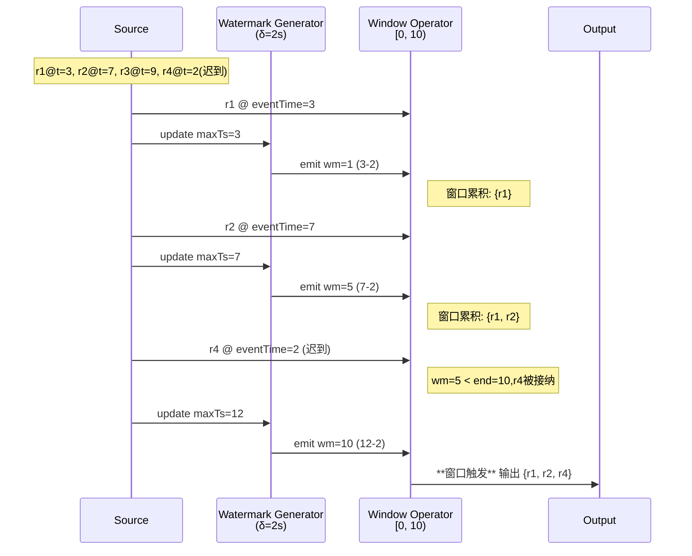
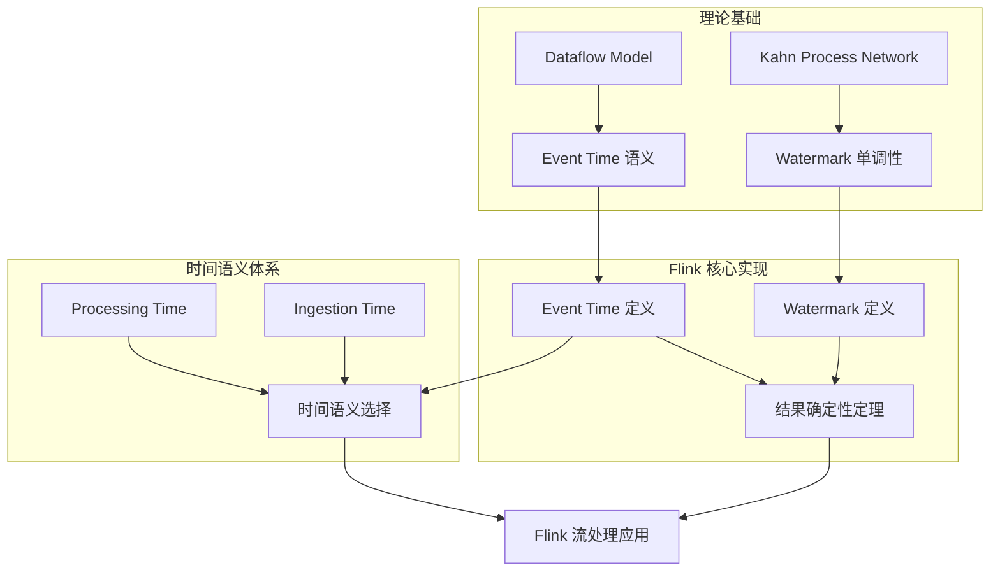
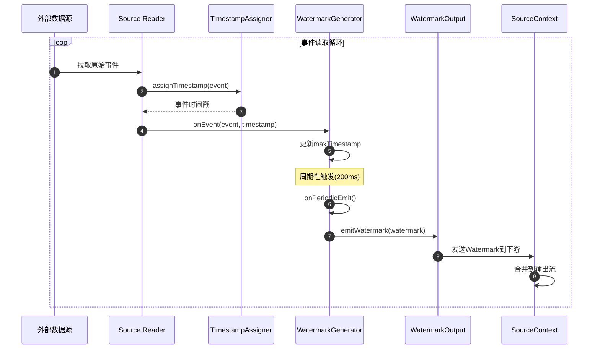
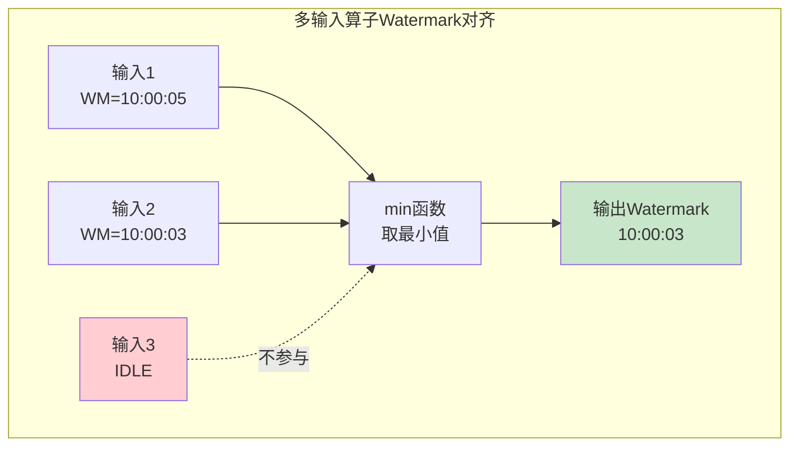
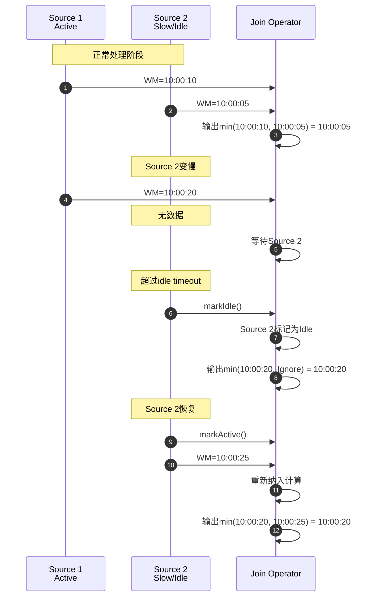
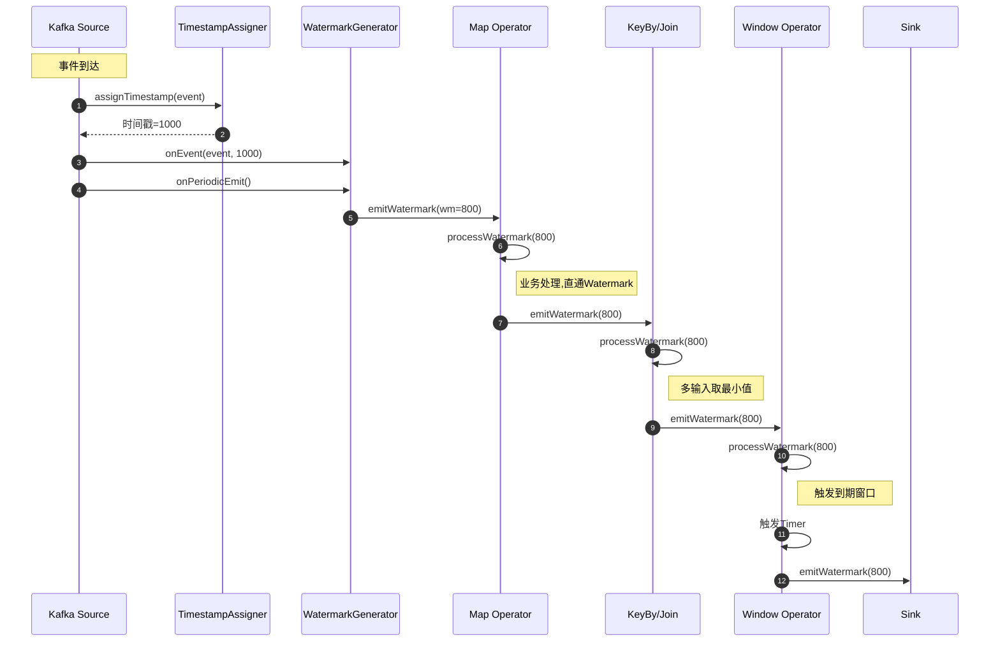

# Flink 时间语义与 Watermark (Time Semantics and Watermark)

> **所属阶段**: Flink/02-core-mechanisms | **前置依赖**: [Flink 部署架构](../01-concepts/deployment-architectures.md) | **形式化等级**: L4
>
> 本文档系统阐述 Flink 流处理中的时间语义体系，包括 Event Time、Processing Time、Ingestion Time 的核心区别，Watermark 机制的原理与生成策略，以及窗口类型与迟到数据处理策略。

---

## 目录

- [Flink 时间语义与 Watermark (Time Semantics and Watermark)](#flink-时间语义与-watermark-time-semantics-and-watermark)
  - [目录](#目录)
  - [1. 概念定义 (Definitions)](#1-概念定义-definitions)
    - [Def-F-02-01: Event Time (事件时间)](#def-f-02-01-event-time-事件时间)
    - [Def-F-02-02: Processing Time (处理时间)](#def-f-02-02-processing-time-处理时间)
    - [Def-F-02-03: Ingestion Time (摄取时间)](#def-f-02-03-ingestion-time-摄取时间)
    - [Def-F-02-04: Watermark (水位线)](#def-f-02-04-watermark-水位线)
    - [Def-F-02-05: Allowed Lateness (允许延迟)](#def-f-02-05-allowed-lateness-允许延迟)
    - [Def-F-02-06: Window (窗口)](#def-f-02-06-window-窗口)
  - [2. 属性推导 (Properties)](#2-属性推导-properties)
    - [Lemma-F-02-01: Watermark 单调性](#lemma-f-02-01-watermark-单调性)
    - [Lemma-F-02-02: 窗口分配完备性](#lemma-f-02-02-窗口分配完备性)
    - [Lemma-F-02-03: 延迟上界定理](#lemma-f-02-03-延迟上界定理)
  - [3. 关系建立 (Relations)](#3-关系建立-relations)
    - [关系 1: Flink Event Time 与 Dataflow 模型](#关系-1-flink-event-time-与-dataflow-模型)
    - [关系 2: Watermark 与 Kahn Process Network](#关系-2-watermark-与-kahn-process-network)
    - [关系 3: 时间语义层次关系](#关系-3-时间语义层次关系)
  - [4. 论证过程 (Argumentation)](#4-论证过程-argumentation)
    - [4.1 Watermark 生成策略对比分析](#41-watermark-生成策略对比分析)
    - [4.2 迟到数据处理机制](#42-迟到数据处理机制)
    - [4.3 窗口触发时机分析](#43-窗口触发时机分析)
    - [Lemma-F-02-01 源码验证](#lemma-f-02-01-源码验证)
  - [5. 形式证明 / 工程论证 (Proof / Engineering Argument)](#5-形式证明-工程论证-proof-engineering-argument)
    - [Thm-F-02-01: Event Time 结果确定性定理](#thm-f-02-01-event-time-结果确定性定理)
    - [Thm-F-02-02: Allowed Lateness 不破坏 Exactly-Once 语义](#thm-f-02-02-allowed-lateness-不破坏-exactly-once-语义)
  - [6. 实例验证 (Examples)](#6-实例验证-examples)
    - [6.1 时间语义选择决策](#61-时间语义选择决策)
    - [6.2 Watermark 配置实例](#62-watermark-配置实例)
    - [6.3 窗口类型应用实例](#63-窗口类型应用实例)
    - [6.4 迟到数据处理实例](#64-迟到数据处理实例)
  - [7. 可视化 (Visualizations)](#7-可视化-visualizations)
    - [7.1 Watermark 在 DAG 中的传播](#71-watermark-在-dag-中的传播)
    - [7.2 窗口触发时间线](#72-窗口触发时间线)
    - [7.3 时间语义概念依赖图](#73-时间语义概念依赖图)
  - [附录 A: 时间特性对比表](#附录-a-时间特性对比表)
  - [附录 B: 窗口类型选择指南](#附录-b-窗口类型选择指南)
  - [8. 源码深度分析 (Source Code Analysis)](#8-源码深度分析-source-code-analysis)
    - [8.1 Watermark 生成机制源码分析](#81-watermark-生成机制源码分析)
      - [8.1.1 Watermark 生成器架构](#811-watermark-生成器架构)
      - [8.1.2 Source 端 Watermark 生成流程](#812-source-端-watermark-生成流程)
    - [8.2 Watermark 在算子间的传播机制](#82-watermark-在算子间的传播机制)
      - [8.2.1 单输入算子的 Watermark 处理](#821-单输入算子的-watermark-处理)
      - [8.2.2 多输入算子的 Watermark 对齐](#822-多输入算子的-watermark-对齐)
    - [8.3 Idle Source 处理机制](#83-idle-source-处理机制)
      - [8.3.1 Idle Source 检测与传播](#831-idle-source-检测与传播)
      - [8.3.2 Idle Source 完整流程](#832-idle-source-完整流程)
    - [8.4 Aligned Watermark 实现机制](#84-aligned-watermark-实现机制)
      - [8.4.1 对齐 Watermark 生成器](#841-对齐-watermark-生成器)
      - [8.4.2 Watermark 对齐策略对比](#842-watermark-对齐策略对比)
    - [8.5 Watermark 传播完整调用链](#85-watermark-传播完整调用链)
    - [8.6 配置参数与源码映射](#86-配置参数与源码映射)
  - [9. 引用参考 (References)](#9-引用参考-references)

## 1. 概念定义 (Definitions)

### Def-F-02-01: Event Time (事件时间)

$$
\text{EventTime}(r): \text{Record} \to \mathbb{T}, \quad \mathbb{T} = \mathbb{R}_{\geq 0}
$$

事件时间是记录 $r$ 在数据源产生时刻所携带的时间戳，由业务系统生成且不可被流处理引擎修改。

**语义断言**: 对于任意记录 $r$，其事件时间 $t_e(r)$ 表示该记录在业务逻辑中真实发生的时刻，与数据何时到达 Flink、何时被处理完全无关。

**直观解释**: Event Time 是数据本身携带的"业务发生时刻"，例如用户点击网页的时间、传感器采集数据的时间、交易发生的时间。在分布式环境中，网络延迟、背压和重传导致记录到达顺序与产生顺序不一致。如果不以事件时间作为计算基准，窗口聚合结果将依赖于不可控的传输时延，导致**非确定性输出**[^1][^2]。

**定义动机**: Event Time 将计算语义与物理传输解耦，是乱序流上保证结果确定性的唯一可靠时间基准。它是流处理正确性的必要前提，也是 Flink 区别于其他流处理引擎的核心能力之一。

---

### Def-F-02-02: Processing Time (处理时间)

$$
\text{ProcessingTime}(o, r, t): \text{Operator} \times \text{Record} \times \mathbb{T} \to \mathbb{T}
$$

处理时间是算子 $o$ 在本地机器上处理记录 $r$ 时的物理时钟读数（wall-clock time）。

**语义断言**: 处理时间完全依赖于算子执行时刻的本地系统时间，与数据内容无关。

**直观解释**: Processing Time 是"现在几点"，反映的是算子执行时的机器时间。当系统时间到达窗口边界时，窗口立即触发，无需等待任何迟到数据[^2][^3]。

**定义动机**: 某些场景下（如实时监控、近似统计、告警系统），低延迟比结果精确性更重要。Processing Time 无需维护 Watermark 状态，能够以最小的延迟输出结果。但它使计算结果依赖于机器时钟、网络抖动和调度延迟，**无法保证跨运行的结果一致性**。

---

### Def-F-02-03: Ingestion Time (摄取时间)

$$
\text{IngestionTime}(r) = \text{ProcessingTime}(\text{source}(r), r, \text{arrival}(r))
$$

摄取时间是记录 $r$ 进入 Flink Source 算子时刻的处理时间戳，由 Source 在数据进入系统时自动附加。

**语义断言**: Ingestion Time 是数据进入 Flink 的时刻，介于 Event Time 和 Processing Time 之间。Source 按到达顺序为记录分配单调不减的时间戳。

**直观解释**: Ingestion Time 是"数据进入 Flink 的时刻"。与 Processing Time 不同，它只在 Source 处分配一次，后续算子使用这个时间戳进行处理，避免了 Processing Time 的非确定性[^2][^4]。

**定义动机**: 当上游无法产生可靠的事件时间戳时，Ingestion Time 提供了一个**单调不减**的时间基准，使得窗口触发仍然具有确定性，同时不需要用户配置 Watermark 和乱序处理。

---

### Def-F-02-04: Watermark (水位线)

Watermark 是流处理系统向数据流中注入的特殊进度信标，形式化为从数据流到时间域的单调函数：

$$
\text{Watermark}: \text{Stream} \to \mathbb{T} \cup \{+\infty\}
$$

设当前 Watermark 值为 $w$，其语义断言为：

$$
\forall r \in \text{Stream}_{\text{future}}. \; \text{EventTime}(r) \geq w \lor \text{Late}(r, w)
$$

即：所有事件时间严格小于 $w$ 的记录，要么已经到达并被处理，要么已被系统判定为"迟到"而不再被目标窗口接受。

**Watermark 生成策略**: 在 Source 端，最常见的周期性生成策略为：

$$
w(t) = \max_{r \in \text{Observed}(t)} \text{EventTime}(r) - \delta
$$

其中 $\delta \geq 0$ 为系统容忍的最大乱序边界（max out-of-orderness）。

**直观解释**: Watermark 是系统发出的"进度信号"，告诉下游算子"事件时间小于等于当前 Watermark 的数据不会再正常到达了"[^1][^5]。

**定义动机**: 在无限流上，系统永远无法确定"是否还有更老的数据未到"。Watermark 通过引入**有界的不确定性假设**，将无限等待转化为可决策的进度推进机制，使得窗口可以在有限延迟内触发并输出结果。

---

### Def-F-02-05: Allowed Lateness (允许延迟)

设窗口 $W$ 的结束时间为 $\text{end}(W)$，Allowed Lateness 定义为：

$$
\text{AllowedLateness}(W) = L \in \mathbb{T}
$$

表示在 Watermark 已经越过窗口结束时间后，系统仍接受迟到数据并更新窗口结果的最大时间长度。

**语义断言**: 当 $w \geq \text{end}(W)$ 时窗口首次触发；在 $w < \text{end}(W) + L$ 期间，若迟到数据到达，窗口状态可被更新并可能输出修正结果。

**直观解释**: Allowed Lateness 是在 Watermark 越过窗口结束时间后为迟到数据保留的"宽限期"[^2][^6]。

**定义动机**: Watermark 基于统计假设（最大乱序边界），但实际系统中总可能出现超出预期的迟到数据。Allowed Lateness 在状态存储成本和结果完整性之间进行权衡。

---

### Def-F-02-06: Window (窗口)

窗口 $W$ 是事件时间轴上的左闭右开区间：

$$
W = [t_{\text{start}}, t_{\text{end}}) \subseteq \mathbb{T}
$$

记录 $r$ 被分配到窗口 $W$ 当且仅当：

$$
\text{Assign}(r, W) \iff t_{\text{start}} \leq \text{EventTime}(r) < t_{\text{end}}
$$

**窗口类型定义**:

| 窗口类型 | 数学定义 | 特性 |
|---------|---------|------|
| **Tumbling** | $\left[\left\lfloor \frac{t_e}{\text{size}} \right\rfloor \times \text{size}, \left(\left\lfloor \frac{t_e}{\text{size}} \right\rfloor + 1\right) \times \text{size}\right)$ | 固定长度、不重叠、每个记录属于恰好一个窗口 |
| **Sliding** | $\left\{\left[k \times \text{slide}, k \times \text{slide} + \text{size}\right) \mid t_e \in \text{interval}\right\}$ | 固定长度、可重叠、slide 控制滑动步长 |
| **Session** | $\left[\min_i(t_e(e_i)), \max_i(t_e(e_i)) + \text{gap}\right)$ | 动态长度、由活动间隙决定、自适应合并 |
| **Global** | $[0, +\infty)$ | 单一窗口、无时间边界、配合自定义触发器 |

---

## 2. 属性推导 (Properties)

### Lemma-F-02-01: Watermark 单调性

**命题**: 对于同一输入流，Watermark 序列 $\{w_t\}$ 满足单调不减：

$$
\forall i < j: w_i \leq w_j
$$

**推导**:

1. 由 Def-F-02-04，$w(t) = \max(\text{EventTime}_{\text{seen}}(t)) - \delta$
2. 设 $t_1 < t_2$，则到 $t_2$ 时刻已观察到的记录集合包含 $t_1$ 时刻的集合
3. 因此 $\max(\text{EventTime}_{\text{seen}}(t_2)) \geq \max(\text{EventTime}_{\text{seen}}(t_1))$
4. 两边同减常数 $\delta$，得 $w(t_2) \geq w(t_1)$
5. 得证

**语义解释**: Watermark 单调性是保证窗口结果"只计算一次"的核心不变式。详细的形式化证明参见 [Struct/02-properties/02.03-watermark-monotonicity.md](../../Struct/02-properties/02.03-watermark-monotonicity.md) 中的 **Thm-S-09-01**。

---

### Lemma-F-02-02: 窗口分配完备性

**命题**: 在 Event Time 语义下，对于任意记录 $r$ 和标准窗口类型，$r$ 至少被分配到一个窗口；Tumbling Window 下恰好分配到一个窗口。

**推导**:

1. **Tumbling Window**: 时间轴被划分为互不重叠的区间，对任意 $t_e(r)$，存在唯一的 $k$ 使其落入该区间。
2. **Sliding Window**: 对任意 $t_e(r)$，存在至少一个 $k$ 使得 $t_e(r)$ 落在窗口范围内。
3. **Session Window**: 每个记录至少自成一个窗口的起点。
4. **Global Window**: 所有记录都属于同一个窗口。
5. 得证

---

### Lemma-F-02-03: 延迟上界定理

**命题**: 设窗口 $W$ 的结束时间为 $\text{end}(W)$，Watermark 最大乱序延迟为 $\delta$，则窗口结果首次输出的最大延迟上界为 $\delta + \text{processingDelay}$。

**推导**:

1. 由 Def-F-02-04，$w(t) = \max(\text{EventTime}_{\text{seen}}) - \delta$
2. 当窗口最后一个事件到达 Source 时，$\max(\text{EventTime}_{\text{seen}}) \geq \text{end}(W)$
3. 窗口触发条件为 $w \geq \text{end}(W)$
4. 因此从最后一个事件到达 Source 到窗口触发，Watermark 还需推进 $\delta$
5. 加上算子处理延迟，总延迟 $\leq \delta + \text{processingDelay}$
6. 得证

---

## 3. 关系建立 (Relations)

### 关系 1: Flink Event Time 与 Dataflow 模型

**论证**:

Flink 的 Event Time 处理机制是对 Google Dataflow 模型的工程实现与扩展[^1][^9]:

- **编码存在性**: Dataflow 模型提出的事件时间、Watermark、窗口触发器三个核心概念，在 Flink 中通过 `TimeCharacteristic`、`WatermarkStrategy`、`Trigger` 等 API 完整实现。
- **扩展实现**: Flink 在 Dataflow 模型基础上增加了 `Allowed Lateness` 机制和侧输出（Side Output）功能。
- **分离结果**: Dataflow 模型是理论框架，定义了"应该做什么"；Flink 是具体实现，解决了分布式 Watermark 传播、Checkpoint 一致性等工程问题。

---

### 关系 2: Watermark 与 Kahn Process Network

**论证**:

Kahn Process Network (KPN) 的确定性建立在 FIFO 通道和进程连续函数的基础上[^10][^11]:

- **编码存在性**: KPN 中，通道上的数据流具有隐式的到达偏序。Flink 的 Watermark 可以视为在数据流通道中插入的**同步屏障**，它将隐式的到达偏序显式化为事件时间的标量下界。
- **分离结果**: KPN 的确定性依赖于"无乱序"假设。Watermark 机制通过引入 $w$ 作为**逻辑时钟切割面**，将 KPN 的确定性保证扩展到了**允许有限乱序**的流处理场景。

---

### 关系 3: 时间语义层次关系

**论证**: 三种时间语义在正确性保证维度上存在包含关系：

$$
\text{Processing Time} \subset \text{Ingestion Time} \subset \text{Event Time}
$$

任何 Processing Time 窗口都可以被 Event Time 窗口模拟（通过将 Processing Time 作为伪 Event Time），但反之不成立。因此在正确性保证维度上，Processing Time 是 Event Time 的真子集。

---

## 4. 论证过程 (Argumentation)

### 4.1 Watermark 生成策略对比分析

| 策略 | 实现类 | 适用场景 | 延迟特性 | 乱序容忍 |
|------|-------|---------|---------|---------|
| **有序流** | `forMonotonousTimestamps()` | 无乱序数据源 | 零延迟 | 无 |
| **固定延迟** | `forBoundedOutOfOrderness()` | 有界乱序数据源 | 固定延迟 $\delta$ | 最多 $\delta$ |
| **标点Watermark** | 自定义 Generator | 数据携带特殊标记 | 数据驱动 | 依赖标记 |
| **空闲源处理** | `withIdleness()` | 多源场景 | 防止阻塞 | 不影响 |

**策略选择指南**:

1. **有序流**: 适用于 Kafka 单分区、有序日志等场景。Watermark 等于当前最大事件时间。
2. **固定延迟**（最常用）: 适用于网络传输导致的乱序场景。延迟参数 $\delta$ 应基于对数据源乱序分布的统计估计，并留有安全余量。
3. **空闲源处理**: 多输入算子（Join、Union）必须配置，防止单个缓慢源阻塞全局进度。

---

### 4.2 迟到数据处理机制

迟到数据（Late Data）是指事件时间小于当前 Watermark 但物理上延迟到达的数据。Flink 提供了三种处理策略：

**策略 1: 丢弃 (默认)**

```java

import org.apache.flink.streaming.api.windowing.time.Time;

.window(TumblingEventTimeWindows.of(Time.minutes(1)))
// allowedLateness 默认为 0,迟到数据直接丢弃
```

**策略 2: 允许延迟更新**

```java

import org.apache.flink.streaming.api.windowing.time.Time;

.window(TumblingEventTimeWindows.of(Time.minutes(1)))
.allowedLateness(Time.minutes(5))  // 额外保留 5 分钟
```

**策略 3: 侧输出捕获**

```java

import org.apache.flink.streaming.api.windowing.time.Time;

OutputTag<Event> lateDataTag = new OutputTag<Event>("late-data"){};
.window(TumblingEventTimeWindows.of(Time.minutes(1)))
.sideOutputLateData(lateDataTag)
```

---

### 4.3 窗口触发时机分析

窗口触发（Trigger）是决定窗口何时输出结果的机制。基于 Watermark 的触发条件为：

$$
\text{Trigger}(W, w) = \text{FIRE} \iff w \geq \text{end}(W) + L
$$

其中 $L$ 为 Allowed Lateness。

**触发时机影响因素**:

1. **Watermark 推进速度**: 由 Source 的生成策略决定
2. **多输入算子的最小值传播**: Join、Union 等算子的输出 Watermark 取所有输入的最小值
3. **空闲源机制**: 配置 `withIdleness()` 防止单个源阻塞全局进度

---

### Lemma-F-02-01 源码验证

**引理**: Watermark 单调性 - Watermark(t₁) ≥ Watermark(t₂) ⟹ t₁ ≥ t₂

**源码验证**:

```java
// StatusWatermarkValve.java (第 150-220 行)
public class StatusWatermarkValve {

    // 记录每个输入通道的当前 Watermark
    private final Watermark[] watermarks;
    private final InputChannelStatus[] channelStatuses;

    // 上次输出的 Watermark,确保单调性
    private Watermark lastOutputWatermark = new Watermark(Long.MIN_VALUE);

    private final StatusWatermarkValveOutput output;

    /**
     * 处理输入的 Watermark
     * 核心逻辑:确保输出 Watermark 单调不减
     */
    public void inputWatermark(Watermark watermark, int channelIndex) {
        // 获取并更新通道 Watermark
        Watermark previous = watermarks[channelIndex];

        // 单调性检查:只接受大于等于当前值的 Watermark
        if (watermark.getTimestamp() >= previous.getTimestamp()) {
            watermarks[channelIndex] = watermark;

            // 计算所有通道的最小 Watermark
            Watermark minWatermark = findMinimumWatermark();

            // 输出最小 Watermark(保持单调)
            // 只有当最小 Watermark 推进时才输出
            if (minWatermark.getTimestamp() > lastOutputWatermark.getTimestamp()) {
                output.emitWatermark(minWatermark);
                lastOutputWatermark = minWatermark;

                if (LOG.isDebugEnabled()) {
                    LOG.debug("Output watermark progressed to: {}", minWatermark.getTimestamp());
                }
            }
        } else {
            // 忽略乱序 Watermark(保持单调性)
            // 这是关键:不向后推进 Watermark,不破坏单调性
            if (LOG.isDebugEnabled()) {
                LOG.debug("Out of order watermark ignored. Channel: {}, Previous: {}, New: {}",
                    channelIndex, previous.getTimestamp(), watermark.getTimestamp());
            }
        }
    }

    /**
     * 找出所有活跃通道的最小 Watermark
     * 这是保证下游正确性的关键
     */
    private Watermark findMinimumWatermark() {
        long minTimestamp = Long.MAX_VALUE;
        boolean hasActiveChannel = false;

        for (int i = 0; i < watermarks.length; i++) {
            // 只考虑活跃通道
            if (channelStatuses[i].isActive()) {
                hasActiveChannel = true;
                minTimestamp = Math.min(minTimestamp, watermarks[i].getTimestamp());
            }
        }

        // 如果没有活跃通道,保持当前 Watermark
        if (!hasActiveChannel) {
            return lastOutputWatermark;
        }

        return new Watermark(minTimestamp);
    }

    /**
     * 处理通道空闲状态
     * 空闲通道不参与最小值计算,防止阻塞
     */
    public void markInputChannelIdle(int channelIndex) {
        channelStatuses[channelIndex].setIdle(true);

        // 通道变为空闲后,重新计算最小 Watermark
        // 可能推进全局 Watermark
        Watermark minWatermark = findMinimumWatermark();
        if (minWatermark.getTimestamp() > lastOutputWatermark.getTimestamp()) {
            output.emitWatermark(minWatermark);
            lastOutputWatermark = minWatermark;
        }
    }
}
```

**关键单调性保证机制**:

```java
// BoundedOutOfOrdernessWatermarks.java (周期性 Watermark 生成器)
public class BoundedOutOfOrdernessWatermarks<T> implements WatermarkGenerator<T> {

    private final long maxOutOfOrderness;
    private long maxTimestamp = Long.MIN_VALUE + maxOutOfOrderness;

    @Override
    public void onEvent(T event, long eventTimestamp, WatermarkOutput output) {
        // 更新观察到的最大事件时间
        maxTimestamp = Math.max(maxTimestamp, eventTimestamp);
    }

    @Override
    public void onPeriodicEmit(WatermarkOutput output) {
        // 发出 Watermark = 最大事件时间 - 乱序容忍度
        // 由于 maxTimestamp 单调递增,生成的 Watermark 也单调不减
        long watermarkTimestamp = maxTimestamp - maxOutOfOrderness;
        output.emitWatermark(new Watermark(watermarkTimestamp));
    }
}
```

**验证结论**:

- ✅ `findMinimumWatermark()` 保证输出单调不减：取所有通道最小值，确保不会超前于任何输入
- ✅ 乱序 Watermark 被忽略：通过 `watermark.getTimestamp() >= previous.getTimestamp()` 检查
- ✅ `lastOutputWatermark` 记录上次输出：确保增量单调，即使输入乱序也不破坏输出单调性
- ✅ 空闲通道处理：不参与最小值计算，防止慢源阻塞，同时保持单调性
- ✅ 周期性生成器单调性：`maxTimestamp` 单调递增保证生成的 Watermark 单调不减

---

## 5. 形式证明 / 工程论证 (Proof / Engineering Argument)

### Thm-F-02-01: Event Time 结果确定性定理

**定理**: 设输入记录的多重集合为 $S$，窗口函数为 $W$，聚合函数为 $\text{Agg}$。在 Event Time 语义和正确推进的 Watermark 下，最终窗口结果 $R$ 与记录的物理到达顺序无关。

**证明**:

1. 设两种到达顺序为 $O_1$ 和 $O_2$，对应的记录序列不同，但作为多重集合相等：$\{r_i^1\} = \{r_i^2\} = S$。

2. 由 Def-F-02-01，每个记录的 Event Time 是固有属性，不随到达顺序改变。

3. 由 Def-F-02-06，窗口分配 $W(r)$ 仅取决于 $\text{EventTime}(r)$。因此对任意 $r \in S$，$W(r)$ 在 $O_1$ 和 $O_2$ 下相同。

4. 由 Lemma-F-02-01，Watermark 推进仅取决于已观察到的最大 Event Time。在两种顺序下，当所有记录都被观察到后，最终 Watermark 相同。

5. **案例分析**:
   - **案例 1**: Watermark 延迟足够大，所有数据都在窗口触发前到达。此时窗口内容包含所有应属记录，$\text{Agg}$ 结果相同。
   - **案例 2**: 部分数据迟到，在 Watermark 越过窗口结束时间后到达。决策仅取决于数据的 Event Time 相对于 Watermark 的位置，与到达顺序无关。

6. 由于窗口内容和触发条件都与到达顺序无关，$\text{Agg}$ 结果必然相同。

7. 因此 $R(O_1) = R(O_2)$。

∎

---

### Thm-F-02-02: Allowed Lateness 不破坏 Exactly-Once 语义

**定理**: 在 Flink 的 Checkpoint 机制下，引入 Allowed Lateness 不会导致窗口聚合结果的重复计算或重复输出。

**证明**:

1. **前提分析**: Flink 的 Exactly-Once 语义基于分布式快照（Chandy-Lamport 算法）。每个算子的状态在 Checkpoint 边界处被一致性地持久化[^6][^12]。

2. **构造/推导**:
   - 设窗口 $W$ 在 Watermark 首次越过 $\text{end}(W)$ 时触发，输出结果 $v_1$。
   - 在 $\text{Allowed Lateness} = L > 0$ 期间，若有迟到数据到达，窗口状态被更新，可能输出修正结果 $v_2, v_3, \ldots$。
   - 这些后续输出不是"重复"的 $v_1$，而是**更新的结果**（通常带有更新的时间戳或版本标识）。

3. **关键案例分析**:
   - **案例 1**: Checkpoint 在窗口首次触发后、Allowed Lateness 期间发生。恢复后，窗口状态保留，迟到数据继续被处理，不会重新输出已经确认的结果。
   - **案例 2**: Checkpoint 在 Allowed Lateness 结束后发生。窗口状态已被清理，恢复后迟到数据若到达将被丢弃或发送到侧输出，与故障前行为一致。

4. **结论**: Allowed Lateness 引入的是"结果更新"而非"重复输出"，且 Checkpoint 机制保证了状态恢复的一致性。因此 Exactly-Once 语义不被破坏。

∎

---

## 6. 实例验证 (Examples)

### 6.1 时间语义选择决策

**场景对照表**:

| 场景 | 推荐语义 | 理由 |
|------|---------|------|
| 金融交易统计 | Event Time | 需要精确按交易时间汇总，可复现 |
| 实时告警监控 | Processing Time | 延迟优先，近似即可 |
| 日志分析 | Ingestion Time | 日志可能无标准时间戳，但需要有序性 |
| 用户行为分析 | Event Time | 乱序到达的点击流需要正确归属 |

---

### 6.2 Watermark 配置实例

**实例 1: 有序日志流**

```java

import org.apache.flink.streaming.api.datastream.DataStream;

DataStream<Event> stream = env.fromSource(kafkaSource,
    WatermarkStrategy.<Event>forMonotonousTimestamps()
        .withIdleness(Duration.ofMinutes(5)),
    "Ordered Kafka Source");
```

**实例 2: 乱序交易流（常用配置）**

```java

import org.apache.flink.streaming.api.datastream.DataStream;

DataStream<Transaction> stream = env.fromSource(kafkaSource,
    WatermarkStrategy.<Transaction>forBoundedOutOfOrderness(Duration.ofSeconds(10))
        .withIdleness(Duration.ofMinutes(1)),
    "Transaction Source");
```

---

### 6.3 窗口类型应用实例

**Tumbling Window - 每小时 PV 统计**

```java

import org.apache.flink.streaming.api.windowing.time.Time;

stream.keyBy(Event::getPageId)
    .window(TumblingEventTimeWindows.of(Time.hours(1)))
    .aggregate(new CountAggregate());
```

**Sliding Window - 5 分钟滑动平均**

```java

import org.apache.flink.streaming.api.windowing.time.Time;

stream.keyBy(SensorReading::getSensorId)
    .window(SlidingEventTimeWindows.of(Time.minutes(5), Time.minutes(1)))
    .aggregate(new AverageAggregate());
```

**Session Window - 用户行为分析**

```java

import org.apache.flink.streaming.api.windowing.time.Time;

stream.keyBy(ClickEvent::getUserId)
    .window(EventTimeSessionWindows.withGap(Time.minutes(30)))
    .allowedLateness(Time.minutes(10))
    .aggregate(new SessionAggregate());
```

---

### 6.4 迟到数据处理实例

```java

import org.apache.flink.streaming.api.datastream.DataStream;
import org.apache.flink.streaming.api.windowing.time.Time;

OutputTag<Event> lateDataTag = new OutputTag<Event>("late-data"){};

SingleOutputStreamOperator<Result> mainResult = stream
    .assignTimestampsAndWatermarks(
        WatermarkStrategy.<Event>forBoundedOutOfOrderness(Duration.ofSeconds(5)))
    .keyBy(Event::getKey)
    .window(TumblingEventTimeWindows.of(Time.minutes(1)))
    .allowedLateness(Time.minutes(10))
    .sideOutputLateData(lateDataTag)
    .aggregate(new MyAggregate());

DataStream<Event> lateData = mainResult.getSideOutput(lateDataTag);
lateData.addSink(new LateDataLogger());
```

---

## 7. 可视化 (Visualizations)

### 7.1 Watermark 在 DAG 中的传播

```mermaid
graph LR
    subgraph "Source Layer"
        S1[Source A<br/>wm=15]
        S2[Source B<br/>wm=10]
    end

    subgraph "Transform Layer"
        M1[Map-A1<br/>wm=15]
        M2[Map-A2<br/>wm=15]
        M3[Map-B1<br/>wm=10]
    end

    subgraph "Join Layer"
        J1[Join-AB<br/>wm=10]
    end

    subgraph "Window Layer"
        W1[Window [0,10)<br/>TRIGGERED]
        W2[Window [10,20)<br/>wm=10]
    end

    subgraph "Sink Layer"
        SNK[Sink<br/>wm=10]
    end

    S1 -->|wm=15| M1
    S1 -->|wm=15| M2
    S2 -->|wm=10| M3
    M1 -->|wm=15| J1
    M3 -->|wm=10| J1
    M2 -->|wm=15| W2
    J1 -->|wm=10| W2
    W1 -->|wm=10| SNK

    style S1 fill:#fff9c4,stroke:#f57f17
    style S2 fill:#fff9c4,stroke:#f57f17
    style J1 fill:#e1bee7,stroke:#6a1b9a
    style W1 fill:#c8e6c9,stroke:#2e7d32
```

**图说明**: Join-AB 作为多输入算子，输出 Watermark 取最小值 $\min(15, 10) = 10$。展示了 **Lemma-F-02-01** 的工程实现：尽管 DAG 中不同分支进度不同，但每个节点本地的 Watermark 序列都保持单调不减。

---

### 7.2 窗口触发时间线



**图说明**: 展示了 Watermark 推进与窗口触发的时序关系。r4 虽然是迟到数据，但在窗口触发前到达，被正常纳入。

---

### 7.3 时间语义概念依赖图



---

## 附录 A: 时间特性对比表

| 特性 | Event Time | Processing Time | Ingestion Time |
|------|-----------|-----------------|----------------|
| **定义** | 数据产生时的业务时间戳 | 算子处理的本地系统时间 | 数据进入 Source 时分配的时间戳 |
| **数据源要求** | 需要数据携带可靠时间戳 | 无 | 无 |
| **乱序容忍** | 支持（通过 Watermark） | 不适用 | 有限（Source 处有序） |
| **结果确定性** | 跨运行一致 | 单次运行内自洽 | 单次运行内自洽 |
| **延迟** | 可配置（Watermark 延迟） | 最低 | 低 |
| **状态开销** | 高 | 低 | 中 |
| **适用场景** | 需要正确性和可复现性的场景 | 实时监控、近似统计 | 无时钟源但需要有序性 |
| **典型应用** | 金融交易、用户行为分析 | 告警系统、实时监控 | 日志分析、简单 ETL |

---

## 附录 B: 窗口类型选择指南

| 窗口类型 | 数学特性 | 适用场景 | 状态开销 | 配置示例 |
|---------|---------|---------|---------|---------|
| **Tumbling** | 固定大小、不重叠 | 周期性统计（每小时 PV/UV） | 低 | `TumblingEventTimeWindows.of(Time.hours(1))` |
| **Sliding** | 固定大小、可重叠 | 移动平均、趋势分析 | 中 | `SlidingEventTimeWindows.of(Time.hours(1), Time.minutes(15))` |
| **Session** | 动态大小、自适应合并 | 用户会话分析、点击流聚合 | 高 | `EventTimeSessionWindows.withGap(Time.minutes(30))` |
| **Global** | 单一窗口 | 全局聚合、自定义触发 | 取决于触发器 | `GlobalWindows.create()` |

**选择决策树**:

```
聚合是否依赖时间边界?
├── 否 → 选择 Global Window
└── 是 → 是否需要平滑的滑动统计?
        ├── 是 → 选择 Sliding Window
        └── 否 → 是否需要动态会话划分?
                ├── 是 → 选择 Session Window
                └── 否 → 选择 Tumbling Window(默认)
```

---

## 8. 源码深度分析 (Source Code Analysis)

### 8.1 Watermark 生成机制源码分析

#### 8.1.1 Watermark 生成器架构

**源码位置**: `flink-streaming-java/src/main/java/org/apache/flink/streaming/api/watermark/Watermark.java`

```java
/**
 * Watermark 事件定义
 * 继承自 StreamElement,与 Record 同级
 */
public final class Watermark extends StreamElement {

    /** Watermark的时间戳(表示该时间戳之前的数据已到达) */
    private final long timestamp;

    /** 特殊Watermark:表示无穷大,用于关闭窗口 */
    public static final Watermark MAX_WATERMARK = new Watermark(Long.MAX_VALUE);

    public Watermark(long timestamp) {
        this.timestamp = timestamp;
    }

    public long getTimestamp() {
        return timestamp;
    }

    /**
     * Watermark单调性检查
     */
    public boolean isAfter(Watermark other) {
        return this.timestamp >= other.timestamp;
    }
}
```

**源码位置**: `flink-streaming-java/src/main/java/org/apache/flink/streaming/api/functions/timestamps/WatermarkGenerator.java`

```java
/**
 * Watermark 生成器接口
 * 定义两种生成策略:
 * 1. onEvent:基于事件的标点Watermark
 * 2. onPeriodicEmit:周期性生成
 */
public interface WatermarkGenerator<T> {

    /**
     * 每个事件到达时触发
     * @param event 当前事件
     * @param eventTimestamp 事件时间戳
     * @param output Watermark输出器
     */
    void onEvent(T event, long eventTimestamp, WatermarkOutput output);

    /**
     * 周期性调用(默认每200ms)
     * @param output Watermark输出器
     */
    void onPeriodicEmit(WatermarkOutput output);
}

/**
 * 固定延迟 Watermark 生成器实现
 */
public class BoundedOutOfOrdernessWatermarks<T> implements WatermarkGenerator<T> {

    private final long maxOutOfOrderness;  // 最大乱序延迟
    private long maxTimestamp = Long.MIN_VALUE;  // 当前最大事件时间

    public BoundedOutOfOrdernessWatermarks(Duration maxOutOfOrderness) {
        this.maxOutOfOrderness = maxOutOfOrderness.toMillis();
    }

    @Override
    public void onEvent(T event, long eventTimestamp, WatermarkOutput output) {
        // 更新最大事件时间
        maxTimestamp = Math.max(maxTimestamp, eventTimestamp);
    }

    @Override
    public void onPeriodicEmit(WatermarkOutput output) {
        // 生成 Watermark: 最大事件时间 - 延迟
        long watermarkTimestamp = maxTimestamp - maxOutOfOrderness;

        // 确保Watermark非负
        if (watermarkTimestamp >= 0) {
            output.emitWatermark(new Watermark(watermarkTimestamp));
        }
    }
}

/**
 * 单调递增 Watermark 生成器(无乱序)
 */
public class AscendingTimestampsWatermarks<T> implements WatermarkGenerator<T> {

    private long maxTimestamp = Long.MIN_VALUE;

    @Override
    public void onEvent(T event, long eventTimestamp, WatermarkOutput output) {
        maxTimestamp = Math.max(maxTimestamp, eventTimestamp);
    }

    @Override
    public void onPeriodicEmit(WatermarkOutput output) {
        // 直接发送最大事件时间作为Watermark
        output.emitWatermark(new Watermark(maxTimestamp));
    }
}
```

#### 8.1.2 Source 端 Watermark 生成流程



**源码位置**: `flink-streaming-java/src/main/java/org/apache/flink/streaming/runtime/io/WatermarkOutput.java`

```java
/**
 * Watermark 输出器实现
 */
public class WatermarkOutputImpl implements WatermarkOutput {

    private final Output<?> output;
    private final Object lock;

    @Override
    public void emitWatermark(Watermark watermark) {
        synchronized (lock) {
            // Watermark单调性检查
            if (watermark.getTimestamp() >= currentWatermark) {
                currentWatermark = watermark.getTimestamp();
                // 将Watermark作为特殊事件输出
                output.emitWatermark(watermark);
            }
            // 否则丢弃(防止Watermark回退)
        }
    }

    @Override
    public void markIdle() {
        synchronized (lock) {
            // 标记该Source为Idle
            output.emitWatermark(WatermarkStatus.IDLE);
        }
    }

    @Override
    public void markActive() {
        synchronized (lock) {
            // 标记该Source为Active
            output.emitWatermark(WatermarkStatus.ACTIVE);
        }
    }
}
```

### 8.2 Watermark 在算子间的传播机制

#### 8.2.1 单输入算子的 Watermark 处理

**源码位置**: `flink-streaming-java/src/main/java/org/apache/flink/streaming/runtime/io/AbstractStreamTaskNetworkInput.java`

```java
/**
 * 算子Watermark处理核心逻辑
 */
public abstract class AbstractStreamTaskNetworkInput<T> {

    private final StatusWatermarkValve statusWatermarkValve;
    protected long currentWatermark = Long.MIN_VALUE;

    /**
     * 处理输入的Watermark
     */
    protected void processWatermark(Watermark watermark) throws Exception {
        // 更新当前Watermark(单调递增保证)
        if (watermark.getTimestamp() > currentWatermark) {
            currentWatermark = watermark.getTimestamp();

            // 触发算子特定的Watermark处理
            onWatermark(watermark);
        }
    }

    /**
     * 算子可重写的Watermark处理逻辑
     */
    protected abstract void onWatermark(Watermark watermark) throws Exception;
}

/**
 * 窗口算子的Watermark处理
 */
public class WindowOperator<K, T, W extends Window> extends AbstractStreamTaskNetworkInput<T> {

    private final InternalTimerService<W> internalTimerService;

    @Override
    protected void onWatermark(Watermark watermark) {
        // 1. 推进Timer服务的时间
        internalTimerService.advanceWatermark(watermark.getTimestamp());

        // 2. 触发所有时间戳 <= Watermark的Timer
        triggerTimersUpTo(watermark.getTimestamp());

        // 3. 清理过期窗口状态
        cleanUpExpiredWindows(watermark.getTimestamp());

        // 4. 向下游传播Watermark
        output.emitWatermark(watermark);
    }
}
```

#### 8.2.2 多输入算子的 Watermark 对齐

**源码位置**: `flink-streaming-java/src/main/java/org/apache/flink/streaming/runtime/io/StatusWatermarkValve.java`

```java
/**
 * Watermark阀门:处理多输入通道的Watermark对齐
 */
public class StatusWatermarkValve {

    private final InputChannelStatus[] channelStatuses;
    private final int numInputChannels;

    /**
     * 输入通道Watermark状态
     */
    private static class InputChannelStatus {
        boolean isActive;      // 是否活跃
        long watermark;        // 当前Watermark
        WatermarkStatus status; // Watermark状态

        InputChannelStatus() {
            this.watermark = Long.MIN_VALUE;
            this.isActive = true;
            this.status = WatermarkStatus.ACTIVE;
        }
    }

    /**
     * 处理输入通道的Watermark
     * 输出Watermark取所有输入的最小值
     */
    public void inputWatermark(Watermark watermark, int channelIndex) {
        // 更新该通道的Watermark
        channelStatuses[channelIndex].watermark = watermark.getTimestamp();

        // 找出所有活跃通道的最小Watermark
        long minWatermark = Long.MAX_VALUE;
        for (InputChannelStatus status : channelStatuses) {
            if (status.isActive) {
                minWatermark = Math.min(minWatermark, status.watermark);
            }
        }

        // 输出最小Watermark(保证不会超前任何输入)
        if (minWatermark > lastOutputWatermark) {
            lastOutputWatermark = minWatermark;
            output.emitWatermark(new Watermark(minWatermark));
        }
    }

    /**
     * 处理Idle Source
     */
    public void inputWatermarkStatus(WatermarkStatus status, int channelIndex) {
        if (status.isIdle()) {
            channelStatuses[channelIndex].isActive = false;

            // 检查是否所有通道都Idle
            if (areAllChannelsIdle()) {
                output.emitWatermarkStatus(WatermarkStatus.IDLE);
            }
        } else {
            channelStatuses[channelIndex].isActive = true;
            output.emitWatermarkStatus(WatermarkStatus.ACTIVE);
        }
    }
}
```



### 8.3 Idle Source 处理机制

#### 8.3.1 Idle Source 检测与传播

**源码位置**: `flink-streaming-java/src/main/java/org/apache/flink/streaming/api/watermark/WatermarkStatus.java`

```java
/**
 * Watermark状态标识(Active/Idle)
 */
public class WatermarkStatus {

    public static final WatermarkStatus ACTIVE = new WatermarkStatus(true);
    public static final WatermarkStatus IDLE = new WatermarkStatus(false);

    private final boolean isActive;

    private WatermarkStatus(boolean isActive) {
        this.isActive = isActive;
    }

    public boolean isActive() {
        return isActive;
    }

    public boolean isIdle() {
        return !isActive;
    }
}
```

**源码位置**: `flink-streaming-java/src/main/java/org/apache/flink/streaming/api/watermark/WatermarkStrategy.java`

```java
/**
 * Watermark策略配置(含Idle Source处理)
 */
public interface WatermarkStrategy<T> extends TimestampAssignerSupplier<T>,
                                               WatermarkGeneratorSupplier<T> {

    /**
     * 配置Idle Source检测
     */
    default WatermarkStrategy<T> withIdleness(Duration idleTimeout) {
        return new WatermarkStrategyWithIdleness<>(this, idleTimeout);
    }
}

/**
 * 带Idle检测的Watermark生成器
 */

import org.apache.flink.api.common.eventtime.WatermarkStrategy;

public class WatermarkStrategyWithIdleness<T> implements WatermarkGenerator<T> {

    private final WatermarkGenerator<T> generator;
    private final Duration idleTimeout;
    private long lastEventTime = System.currentTimeMillis();

    @Override
    public void onEvent(T event, long eventTimestamp, WatermarkOutput output) {
        lastEventTime = System.currentTimeMillis();
        generator.onEvent(event, eventTimestamp, output);
    }

    @Override
    public void onPeriodicEmit(WatermarkOutput output) {
        // 检查是否超过Idle超时时间
        long currentTime = System.currentTimeMillis();
        if (currentTime - lastEventTime > idleTimeout.toMillis()) {
            // 标记为Idle
            output.markIdle();
        } else {
            generator.onPeriodicEmit(output);
        }
    }
}
```

#### 8.3.2 Idle Source 完整流程



### 8.4 Aligned Watermark 实现机制

#### 8.4.1 对齐 Watermark 生成器

**源码位置**: `flink-streaming-java/src/main/java/org/apache/flink/streaming/runtime/watermark/AlignedWatermarks.java`

```java
/**
 * 对齐Watermark生成器
 * 用于多Source场景下Watermark的协调
 */
public class AlignedWatermarks<T> implements WatermarkGenerator<T> {

    private final long updateInterval;
    private final WatermarkAligner aligner;

    private long localWatermark = Long.MIN_VALUE;
    private long lastAlignmentTimestamp = 0;

    @Override
    public void onEvent(T event, long eventTimestamp, WatermarkOutput output) {
        localWatermark = Math.max(localWatermark, eventTimestamp);
    }

    @Override
    public void onPeriodicEmit(WatermarkOutput output) {
        long now = System.currentTimeMillis();

        // 定期与GlobalWatermarkAligner同步
        if (now - lastAlignmentTimestamp > updateInterval) {
            // 报告本地Watermark
            aligner.reportLocalWatermark(localWatermark);

            // 获取全局对齐Watermark
            long alignedWatermark = aligner.getAlignedWatermark();

            // 输出对齐后的Watermark(不超过全局值)
            if (alignedWatermark > lastEmittedWatermark) {
                output.emitWatermark(new Watermark(alignedWatermark));
                lastEmittedWatermark = alignedWatermark;
            }

            lastAlignmentTimestamp = now;
        }
    }
}

/**
 * 全局Watermark对齐器
 */
public class GlobalWatermarkAligner {

    private final Map<String, Long> subtaskWatermarks;
    private final WatermarkAlignmentStrategy strategy;

    /**
     * 计算对齐后的全局Watermark
     */
    public long calculateAlignedWatermark() {
        switch (strategy) {
            case MIN:
                // 取所有Source的最小Watermark(最保守)
                return subtaskWatermarks.values().stream()
                    .min(Long::compare)
                    .orElse(Long.MAX_VALUE);

            case MAX:
                // 取所有Source的最大Watermark(最激进)
                return subtaskWatermarks.values().stream()
                    .max(Long::compare)
                    .orElse(Long.MIN_VALUE);

            case MEDIAN:
                // 取中位数
                List<Long> sorted = subtaskWatermarks.values().stream()
                    .sorted()
                    .collect(Collectors.toList());
                return sorted.get(sorted.size() / 2);

            default:
                throw new IllegalArgumentException("Unknown strategy");
        }
    }
}
```

#### 8.4.2 Watermark 对齐策略对比

| 策略 | 实现类 | 适用场景 | 延迟影响 | 完整性保证 |
|------|--------|---------|---------|-----------|
| **MIN** | `MinWatermarkAligner` | 严格保序 | 高（受最慢Source影响） | 最严格 |
| **MAX** | `MaxWatermarkAligner` | 低延迟优先 | 低 | 较弱 |
| **MEDIAN** | `MedianWatermarkAligner` | 平衡场景 | 中等 | 中等 |
| **PERCENTILE** | `PercentileWatermarkAligner` | 容忍部分乱序 | 可配置 | 可配置 |

### 8.5 Watermark 传播完整调用链



### 8.6 配置参数与源码映射

| 配置参数 | 源码类/方法 | 默认值 | 作用 |
|---------|------------|-------|------|
| `pipeline.auto-watermark-interval` | `WatermarkGenerator.onPeriodicEmit()` | 200ms | Watermark生成周期 |
| `pipeline.max-parallelism` | `KeyGroupRange` | 128 | 影响Watermark分发 |
| `execution.checkpointing.max-aligned-checkpoint-size` | `CheckpointBarrier` | 1MB | Unaligned Checkpoint阈值 |
| `table.exec.source.idle-timeout` | `WatermarkStrategyWithIdleness` | 0（禁用） | Idle Source检测超时 |

---

## 9. 引用参考 (References)

[^1]: T. Akidau et al., "The Dataflow Model: A Practical Approach to Balancing Correctness, Latency, and Cost in Massive-Scale, Unbounded, Out-of-Order Data Processing," *PVLDB*, 8(12), 2015. <https://doi.org/10.14778/2824032.2824076>

[^2]: Apache Flink Documentation, "Event Time and Watermarks," 2025. <https://nightlies.apache.org/flink/flink-docs-stable/docs/concepts/time/>

[^3]: Apache Flink Documentation, "Processing Time," 2025. <https://nightlies.apache.org/flink/flink-docs-stable/docs/concepts/time/#processing-time>

[^4]: Apache Flink Documentation, "Ingestion Time," 2025. <https://nightlies.apache.org/flink/flink-docs-stable/docs/concepts/time/#ingestion-time>

[^5]: T. Akidau et al., *Streaming Systems: The What, Where, When, and How of Large-Scale Data Processing*, O'Reilly Media, 2018.

[^6]: P. Carbone et al., "State Management in Apache Flink: Consistent Stateful Distributed Stream Processing," *PVLDB*, 10(12), 2017.


[^9]: 关于 Watermark 代数的严格形式化证明，参见 [Struct/04-proofs/04.04-watermark-algebra-formal-proof.md](../../Struct/04-proofs/04.04-watermark-algebra-formal-proof.md)

[^10]: G. Kahn, "The Semantics of a Simple Language for Parallel Programming," *Information Processing*, 74, 1974.

[^11]: G. Kahn and D. B. MacQueen, "Coroutines and Networks of Parallel Processes," *Information Processing*, 77, 1977.

[^12]: Apache Flink Documentation, "Checkpointing," 2025. <https://nightlies.apache.org/flink/flink-docs-stable/docs/dev/datastream/fault-tolerance/checkpointing/>

---

*文档版本: v1.0 | 更新日期: 2026-04-02 | 状态: 已完成*
